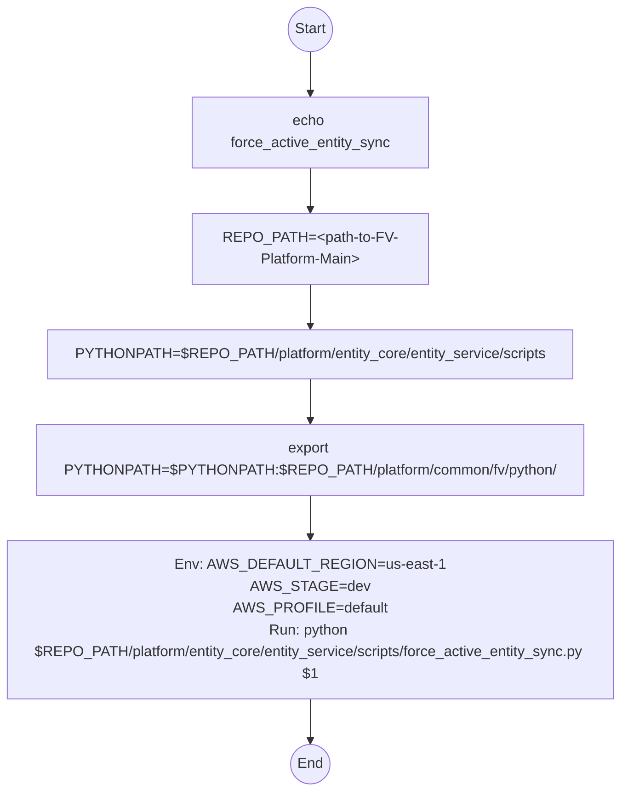

# Diagram: entity_core/entity_service/entity_service_scripts/force_active_entity_sync.sh

> Auto-generated by Obscura crawlers

## Mermaid

### SVG

<svg id="container" width="700.203125" xmlns="http://www.w3.org/2000/svg" class="flowchart" height="870.40625" viewBox="0 0 700.203125 870.40625" role="graphics-document document" aria-roledescription="flowchart-v2"><g><marker id="container_flowchart-v2-pointEnd" class="marker flowchart-v2" viewBox="0 0 10 10" refX="5" refY="5" markerUnits="userSpaceOnUse" markerWidth="8" markerHeight="8" orient="auto"><path d="M 0 0 L 10 5 L 0 10 z" class="arrowMarkerPath" style="stroke-width: 1; stroke-dasharray: 1, 0;"></path></marker><marker id="container_flowchart-v2-pointStart" class="marker flowchart-v2" viewBox="0 0 10 10" refX="4.5" refY="5" markerUnits="userSpaceOnUse" markerWidth="8" markerHeight="8" orient="auto"><path d="M 0 5 L 10 10 L 10 0 z" class="arrowMarkerPath" style="stroke-width: 1; stroke-dasharray: 1, 0;"></path></marker><marker id="container_flowchart-v2-circleEnd" class="marker flowchart-v2" viewBox="0 0 10 10" refX="11" refY="5" markerUnits="userSpaceOnUse" markerWidth="11" markerHeight="11" orient="auto"><circle cx="5" cy="5" r="5" class="arrowMarkerPath" style="stroke-width: 1; stroke-dasharray: 1, 0;"></circle></marker><marker id="container_flowchart-v2-circleStart" class="marker flowchart-v2" viewBox="0 0 10 10" refX="-1" refY="5" markerUnits="userSpaceOnUse" markerWidth="11" markerHeight="11" orient="auto"><circle cx="5" cy="5" r="5" class="arrowMarkerPath" style="stroke-width: 1; stroke-dasharray: 1, 0;"></circle></marker><marker id="container_flowchart-v2-crossEnd" class="marker cross flowchart-v2" viewBox="0 0 11 11" refX="12" refY="5.2" markerUnits="userSpaceOnUse" markerWidth="11" markerHeight="11" orient="auto"><path d="M 1,1 l 9,9 M 10,1 l -9,9" class="arrowMarkerPath" style="stroke-width: 2; stroke-dasharray: 1, 0;"></path></marker><marker id="container_flowchart-v2-crossStart" class="marker cross flowchart-v2" viewBox="0 0 11 11" refX="-1" refY="5.2" markerUnits="userSpaceOnUse" markerWidth="11" markerHeight="11" orient="auto"><path d="M 1,1 l 9,9 M 10,1 l -9,9" class="arrowMarkerPath" style="stroke-width: 2; stroke-dasharray: 1, 0;"></path></marker><g class="root"><g class="clusters"></g><g class="edgePaths"><path d="M350.102,58.047L350.102,62.214C350.102,66.38,350.102,74.714,350.102,82.38C350.102,90.047,350.102,97.047,350.102,100.547L350.102,104.047" id="L_Start_Echo_0" class="edge-thickness-normal edge-pattern-solid edge-thickness-normal edge-pattern-solid flowchart-link" style=";" data-edge="true" data-et="edge" data-id="L_Start_Echo_0" data-points="W3sieCI6MzUwLjEwMTU2MjUsInkiOjU4LjA0Njg3NX0seyJ4IjozNTAuMTAxNTYyNSwieSI6ODMuMDQ2ODc1fSx7IngiOjM1MC4xMDE1NjI1LCJ5IjoxMDguMDQ2ODc1fV0=" marker-end="url(#container_flowchart-v2-pointEnd)"></path><path d="M350.102,186.047L350.102,190.214C350.102,194.38,350.102,202.714,350.102,210.38C350.102,218.047,350.102,225.047,350.102,228.547L350.102,232.047" id="L_Echo_Repo_0" class="edge-thickness-normal edge-pattern-solid edge-thickness-normal edge-pattern-solid flowchart-link" style=";" data-edge="true" data-et="edge" data-id="L_Echo_Repo_0" data-points="W3sieCI6MzUwLjEwMTU2MjUsInkiOjE4Ni4wNDY4NzV9LHsieCI6MzUwLjEwMTU2MjUsInkiOjIxMS4wNDY4NzV9LHsieCI6MzUwLjEwMTU2MjUsInkiOjIzNi4wNDY4NzV9XQ==" marker-end="url(#container_flowchart-v2-pointEnd)"></path><path d="M350.102,314.047L350.102,318.214C350.102,322.38,350.102,330.714,350.102,338.38C350.102,346.047,350.102,353.047,350.102,356.547L350.102,360.047" id="L_Repo_PY1_0" class="edge-thickness-normal edge-pattern-solid edge-thickness-normal edge-pattern-solid flowchart-link" style=";" data-edge="true" data-et="edge" data-id="L_Repo_PY1_0" data-points="W3sieCI6MzUwLjEwMTU2MjUsInkiOjMxNC4wNDY4NzV9LHsieCI6MzUwLjEwMTU2MjUsInkiOjMzOS4wNDY4NzV9LHsieCI6MzUwLjEwMTU2MjUsInkiOjM2NC4wNDY4NzV9XQ==" marker-end="url(#container_flowchart-v2-pointEnd)"></path><path d="M350.102,418.047L350.102,422.214C350.102,426.38,350.102,434.714,350.102,442.38C350.102,450.047,350.102,457.047,350.102,460.547L350.102,464.047" id="L_PY1_Export_0" class="edge-thickness-normal edge-pattern-solid edge-thickness-normal edge-pattern-solid flowchart-link" style=";" data-edge="true" data-et="edge" data-id="L_PY1_Export_0" data-points="W3sieCI6MzUwLjEwMTU2MjUsInkiOjQxOC4wNDY4NzV9LHsieCI6MzUwLjEwMTU2MjUsInkiOjQ0My4wNDY4NzV9LHsieCI6MzUwLjEwMTU2MjUsInkiOjQ2OC4wNDY4NzV9XQ==" marker-end="url(#container_flowchart-v2-pointEnd)"></path><path d="M350.102,546.047L350.102,550.214C350.102,554.38,350.102,562.714,350.102,570.38C350.102,578.047,350.102,585.047,350.102,588.547L350.102,592.047" id="L_Export_Run_0" class="edge-thickness-normal edge-pattern-solid edge-thickness-normal edge-pattern-solid flowchart-link" style=";" data-edge="true" data-et="edge" data-id="L_Export_Run_0" data-points="W3sieCI6MzUwLjEwMTU2MjUsInkiOjU0Ni4wNDY4NzV9LHsieCI6MzUwLjEwMTU2MjUsInkiOjU3MS4wNDY4NzV9LHsieCI6MzUwLjEwMTU2MjUsInkiOjU5Ni4wNDY4NzV9XQ==" marker-end="url(#container_flowchart-v2-pointEnd)"></path><path d="M350.102,770.047L350.102,774.214C350.102,778.38,350.102,786.714,350.102,794.38C350.102,802.047,350.102,809.047,350.102,812.547L350.102,816.047" id="L_Run_End_0" class="edge-thickness-normal edge-pattern-solid edge-thickness-normal edge-pattern-solid flowchart-link" style=";" data-edge="true" data-et="edge" data-id="L_Run_End_0" data-points="W3sieCI6MzUwLjEwMTU2MjUsInkiOjc3MC4wNDY4NzV9LHsieCI6MzUwLjEwMTU2MjUsInkiOjc5NS4wNDY4NzV9LHsieCI6MzUwLjEwMTU2MjUsInkiOjgyMC4wNDY4NzV9XQ==" marker-end="url(#container_flowchart-v2-pointEnd)"></path></g><g class="edgeLabels"><g class="edgeLabel"><g class="label" data-id="L_Start_Echo_0" transform="translate(0, 0)"><foreignObject width="0" height="0">

</foreignObject></g></g><g class="edgeLabel"><g class="label" data-id="L_Echo_Repo_0" transform="translate(0, 0)"><foreignObject width="0" height="0">

</foreignObject></g></g><g class="edgeLabel"><g class="label" data-id="L_Repo_PY1_0" transform="translate(0, 0)"><foreignObject width="0" height="0">

</foreignObject></g></g><g class="edgeLabel"><g class="label" data-id="L_PY1_Export_0" transform="translate(0, 0)"><foreignObject width="0" height="0">

</foreignObject></g></g><g class="edgeLabel"><g class="label" data-id="L_Export_Run_0" transform="translate(0, 0)"><foreignObject width="0" height="0">

</foreignObject></g></g><g class="edgeLabel"><g class="label" data-id="L_Run_End_0" transform="translate(0, 0)"><foreignObject width="0" height="0">

</foreignObject></g></g></g><g class="nodes"><g class="node default" id="flowchart-Start-0" transform="translate(350.1015625, 33.0234375)"><circle class="basic label-container" style="" r="25.0234375" cx="0" cy="0"></circle><g class="label" style="" transform="translate(-17.5234375, -12)"><rect></rect><foreignObject width="35.046875" height="24">

Start

</foreignObject></g></g><g class="node default" id="flowchart-Echo-1" transform="translate(350.1015625, 147.046875)"><rect class="basic label-container" style="" x="-130" y="-39" width="260" height="78"></rect><g class="label" style="" transform="translate(-100, -24)"><rect></rect><foreignObject width="200" height="48">

echo force_active_entity_sync

</foreignObject></g></g><g class="node default" id="flowchart-Repo-3" transform="translate(350.1015625, 275.046875)"><rect class="basic label-container" style="" x="-130" y="-39" width="260" height="78"></rect><g class="label" style="" transform="translate(-100, -24)"><rect></rect><foreignObject width="200" height="48">

REPO_PATH=&lt;path-to-FV-Platform-Main&gt;

</foreignObject></g></g><g class="node default" id="flowchart-PY1-5" transform="translate(350.1015625, 391.046875)"><rect class="basic label-container" style="" x="-288.3046875" y="-27" width="576.609375" height="54"></rect><g class="label" style="" transform="translate(-258.3046875, -12)"><rect></rect><foreignObject width="516.609375" height="24">

PYTHONPATH=$REPO_PATH/platform/entity_core/entity_service/scripts

</foreignObject></g></g><g class="node default" id="flowchart-Export-7" transform="translate(350.1015625, 507.046875)"><rect class="basic label-container" style="" x="-294.8046875" y="-39" width="589.609375" height="78"></rect><g class="label" style="" transform="translate(-264.8046875, -24)"><rect></rect><foreignObject width="529.609375" height="48">

export PYTHONPATH=$PYTHONPATH:$REPO_PATH/platform/common/fv/python/

</foreignObject></g></g><g class="node default" id="flowchart-Run-9" transform="translate(350.1015625, 683.046875)"><rect class="basic label-container" style="" x="-342.1015625" y="-87" width="684.203125" height="174"></rect><g class="label" style="" transform="translate(-312.1015625, -72)"><rect></rect><foreignObject width="624.203125" height="144">

Env: AWS_DEFAULT_REGION=us-east-1 AWS_STAGE=dev AWS_PROFILE=default Run: python $REPO_PATH/platform/entity_core/entity_service/scripts/force_active_entity_sync.py $1

</foreignObject></g></g><g class="node default" id="flowchart-End-11" transform="translate(350.1015625, 841.2265625)"><circle class="basic label-container" style="" r="21.1796875" cx="0" cy="0"></circle><g class="label" style="" transform="translate(-13.6796875, -12)"><rect></rect><foreignObject width="27.359375" height="24">

End

</foreignObject></g></g></g></g></g></svg>
