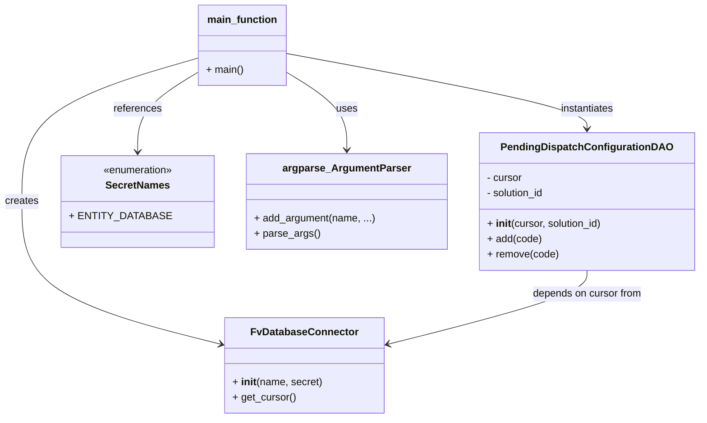

# Diagram: entity_core/entity_service/entity_service_scripts/manage_pending_dispatch.py


> Auto-generated by Obscura crawlers

## Diagram 1

```mermaid
flowchart TD
    Start([Start]) --> ParseArgs[/"parse_args()"/]
    ParseArgs --> CreateDB{operation == "add" or "remove"}
    CreateDB --> |add| CreateConn[/"FvDatabaseConnector(\"manage_pending_dispatch\", SecretNames.ENTITY_DATABASE)"/]
    CreateDB --> |remove| CreateConn
    CreateConn --> GetCursor["DB_CONN.get_cursor()"]
    GetCursor --> CreateDAO["PendingDispatchConfigurationDAO(cursor, solution_id=args.solution_id)"]
    CreateDAO --> Decision{args.operation}
    Decision --> |"add"| CallAdd["configuration.add(args.milestone_code)"]
    Decision --> |"remove"| CallRemove["configuration.remove(args.milestone_code)"]
    Decision --> |other| Unsupported["print(\"Unsupported operation {args.operation}\")"]
    CallAdd --> ExecAdd["execute UPDATE ... SET metadata = metadata || '{{ \"<code>\": {{ \"label\": \"Pending Dispatch\" }} }}'::jsonb"]
    CallRemove --> ExecRemove["execute UPDATE ... SET metadata = metadata - %(code)s"]
    ExecAdd --> End([End])
    ExecRemove --> End
    Unsupported --> End
```

> SVG rendering failed for this diagram.

## Diagram 2



### SVG

<svg id="container" width="1062.375" xmlns="http://www.w3.org/2000/svg" class="classDiagram" height="656" viewBox="0 0 1062.375 656" role="graphics-document document" aria-roledescription="class"><style>#container{font-family:"trebuchet ms",verdana,arial,sans-serif;font-size:16px;fill:#333;}@keyframes edge-animation-frame{from{stroke-dashoffset:0;}}@keyframes dash{to{stroke-dashoffset:0;}}#container .edge-animation-slow{stroke-dasharray:9,5!important;stroke-dashoffset:900;animation:dash 50s linear infinite;stroke-linecap:round;}#container .edge-animation-fast{stroke-dasharray:9,5!important;stroke-dashoffset:900;animation:dash 20s linear infinite;stroke-linecap:round;}#container .error-icon{fill:#552222;}#container .error-text{fill:#552222;stroke:#552222;}#container .edge-thickness-normal{stroke-width:1px;}#container .edge-thickness-thick{stroke-width:3.5px;}#container .edge-pattern-solid{stroke-dasharray:0;}#container .edge-thickness-invisible{stroke-width:0;fill:none;}#container .edge-pattern-dashed{stroke-dasharray:3;}#container .edge-pattern-dotted{stroke-dasharray:2;}#container .marker{fill:#333333;stroke:#333333;}#container .marker.cross{stroke:#333333;}#container svg{font-family:"trebuchet ms",verdana,arial,sans-serif;font-size:16px;}#container p{margin:0;}#container g.classGroup text{fill:#9370DB;stroke:none;font-family:"trebuchet ms",verdana,arial,sans-serif;font-size:10px;}#container g.classGroup text .title{font-weight:bolder;}#container .nodeLabel,#container .edgeLabel{color:#131300;}#container .edgeLabel .label rect{fill:#ECECFF;}#container .label text{fill:#131300;}#container .labelBkg{background:#ECECFF;}#container .edgeLabel .label span{background:#ECECFF;}#container .classTitle{font-weight:bolder;}#container .node rect,#container .node circle,#container .node ellipse,#container .node polygon,#container .node path{fill:#ECECFF;stroke:#9370DB;stroke-width:1px;}#container .divider{stroke:#9370DB;stroke-width:1;}#container g.clickable{cursor:pointer;}#container g.classGroup rect{fill:#ECECFF;stroke:#9370DB;}#container g.classGroup line{stroke:#9370DB;stroke-width:1;}#container .classLabel .box{stroke:none;stroke-width:0;fill:#ECECFF;opacity:0.5;}#container .classLabel .label{fill:#9370DB;font-size:10px;}#container .relation{stroke:#333333;stroke-width:1;fill:none;}#container .dashed-line{stroke-dasharray:3;}#container .dotted-line{stroke-dasharray:1 2;}#container #compositionStart,#container .composition{fill:#333333!important;stroke:#333333!important;stroke-width:1;}#container #compositionEnd,#container .composition{fill:#333333!important;stroke:#333333!important;stroke-width:1;}#container #dependencyStart,#container .dependency{fill:#333333!important;stroke:#333333!important;stroke-width:1;}#container #dependencyStart,#container .dependency{fill:#333333!important;stroke:#333333!important;stroke-width:1;}#container #extensionStart,#container .extension{fill:transparent!important;stroke:#333333!important;stroke-width:1;}#container #extensionEnd,#container .extension{fill:transparent!important;stroke:#333333!important;stroke-width:1;}#container #aggregationStart,#container .aggregation{fill:transparent!important;stroke:#333333!important;stroke-width:1;}#container #aggregationEnd,#container .aggregation{fill:transparent!important;stroke:#333333!important;stroke-width:1;}#container #lollipopStart,#container .lollipop{fill:#ECECFF!important;stroke:#333333!important;stroke-width:1;}#container #lollipopEnd,#container .lollipop{fill:#ECECFF!important;stroke:#333333!important;stroke-width:1;}#container .edgeTerminals{font-size:11px;line-height:initial;}#container .classTitleText{text-anchor:middle;font-size:18px;fill:#333;}#container .label-icon{display:inline-block;height:1em;overflow:visible;vertical-align:-0.125em;}#container .node .label-icon path{fill:currentColor;stroke:revert;stroke-width:revert;}#container :root{--mermaid-font-family:"trebuchet ms",verdana,arial,sans-serif;}</style><g><defs><marker id="container_class-aggregationStart" class="marker aggregation class" refX="18" refY="7" markerWidth="190" markerHeight="240" orient="auto"><path d="M 18,7 L9,13 L1,7 L9,1 Z"></path></marker></defs><defs><marker id="container_class-aggregationEnd" class="marker aggregation class" refX="1" refY="7" markerWidth="20" markerHeight="28" orient="auto"><path d="M 18,7 L9,13 L1,7 L9,1 Z"></path></marker></defs><defs><marker id="container_class-extensionStart" class="marker extension class" refX="18" refY="7" markerWidth="190" markerHeight="240" orient="auto"><path d="M 1,7 L18,13 V 1 Z"></path></marker></defs><defs><marker id="container_class-extensionEnd" class="marker extension class" refX="1" refY="7" markerWidth="20" markerHeight="28" orient="auto"><path d="M 1,1 V 13 L18,7 Z"></path></marker></defs><defs><marker id="container_class-compositionStart" class="marker composition class" refX="18" refY="7" markerWidth="190" markerHeight="240" orient="auto"><path d="M 18,7 L9,13 L1,7 L9,1 Z"></path></marker></defs><defs><marker id="container_class-compositionEnd" class="marker composition class" refX="1" refY="7" markerWidth="20" markerHeight="28" orient="auto"><path d="M 18,7 L9,13 L1,7 L9,1 Z"></path></marker></defs><defs><marker id="container_class-dependencyStart" class="marker dependency class" refX="6" refY="7" markerWidth="190" markerHeight="240" orient="auto"><path d="M 5,7 L9,13 L1,7 L9,1 Z"></path></marker></defs><defs><marker id="container_class-dependencyEnd" class="marker dependency class" refX="13" refY="7" markerWidth="20" markerHeight="28" orient="auto"><path d="M 18,7 L9,13 L14,7 L9,1 Z"></path></marker></defs><defs><marker id="container_class-lollipopStart" class="marker lollipop class" refX="13" refY="7" markerWidth="190" markerHeight="240" orient="auto"><circle stroke="black" fill="transparent" cx="7" cy="7" r="6"></circle></marker></defs><defs><marker id="container_class-lollipopEnd" class="marker lollipop class" refX="1" refY="7" markerWidth="190" markerHeight="240" orient="auto"><circle stroke="black" fill="transparent" cx="7" cy="7" r="6"></circle></marker></defs><g class="root"><g class="clusters"></g><g class="edgePaths"><path d="M429.648,114.193L444.492,123.661C459.335,133.129,489.021,152.064,503.864,172.199C518.707,192.333,518.707,213.667,518.707,224.333L518.707,235" id="id_main_function_argparse_ArgumentParser_1" class="edge-thickness-normal edge-pattern-solid relation" style=";;;" data-edge="true" data-et="edge" data-id="id_main_function_argparse_ArgumentParser_1" data-points="W3sieCI6NDI5LjY0ODQzNzUsInkiOjExNC4xOTI4MDQxMDYyNDQwOH0seyJ4Ijo1MTguNzA3MDMxMjUsInkiOjE3MX0seyJ4Ijo1MTguNzA3MDMxMjUsInkiOjI0MX1d" marker-end="url(#container_class-dependencyEnd)"></path><path d="M294.219,91.66L250.878,104.883C207.536,118.107,120.854,144.553,77.513,181.943C34.172,219.333,34.172,267.667,34.172,316C34.172,364.333,34.172,412.667,84.156,449.94C134.14,487.214,234.107,513.428,284.091,526.535L334.075,539.642" id="id_main_function_FvDatabaseConnector_2" class="edge-thickness-normal edge-pattern-solid relation" style=";;;" data-edge="true" data-et="edge" data-id="id_main_function_FvDatabaseConnector_2" data-points="W3sieCI6Mjk0LjIxODc1LCJ5Ijo5MS42NTk3NzgwODc2NDQ2NX0seyJ4IjozNC4xNzE4NzUsInkiOjE3MX0seyJ4IjozNC4xNzE4NzUsInkiOjMxNn0seyJ4IjozNC4xNzE4NzUsInkiOjQ2MX0seyJ4IjozMzkuODc4OTA2MjUsInkiOjU0MS4xNjM0NTA0NTgxOTU0fV0=" marker-end="url(#container_class-dependencyEnd)"></path><path d="M429.648,83.862L506.108,98.385C582.568,112.908,735.487,141.954,811.947,161.644C888.406,181.333,888.406,191.667,888.406,196.833L888.406,202" id="id_main_function_PendingDispatchConfigurationDAO_3" class="edge-thickness-normal edge-pattern-solid relation" style=";;;" data-edge="true" data-et="edge" data-id="id_main_function_PendingDispatchConfigurationDAO_3" data-points="W3sieCI6NDI5LjY0ODQzNzUsInkiOjgzLjg2MTk4NjgzNzUxNjc4fSx7IngiOjg4OC40MDYyNSwieSI6MTcxfSx7IngiOjg4OC40MDYyNSwieSI6MjA4fV0=" marker-end="url(#container_class-dependencyEnd)"></path><path d="M888.406,424L888.406,430.167C888.406,436.333,888.406,448.667,838.422,467.94C788.438,487.214,688.471,513.428,638.487,526.535L588.503,539.642" id="id_PendingDispatchConfigurationDAO_FvDatabaseConnector_4" class="edge-thickness-normal edge-pattern-solid relation" style=";;;" data-edge="true" data-et="edge" data-id="id_PendingDispatchConfigurationDAO_FvDatabaseConnector_4" data-points="W3sieCI6ODg4LjQwNjI1LCJ5Ijo0MjR9LHsieCI6ODg4LjQwNjI1LCJ5Ijo0NjF9LHsieCI6NTgyLjY5OTIxODc1LCJ5Ijo1NDEuMTYzNDUwNDU4MTk1NH1d" marker-end="url(#container_class-dependencyEnd)"></path><path d="M294.219,114.193L279.376,123.661C264.533,133.129,234.846,152.064,220.003,172.699C205.16,193.333,205.16,215.667,205.16,226.833L205.16,238" id="id_main_function_SecretNames_5" class="edge-thickness-normal edge-pattern-solid relation" style=";;;" data-edge="true" data-et="edge" data-id="id_main_function_SecretNames_5" data-points="W3sieCI6Mjk0LjIxODc1LCJ5IjoxMTQuMTkyODA0MTA2MjQ0MDh9LHsieCI6MjA1LjE2MDE1NjI1LCJ5IjoxNzF9LHsieCI6MjA1LjE2MDE1NjI1LCJ5IjoyNDR9XQ==" marker-end="url(#container_class-dependencyEnd)"></path></g><g class="edgeLabels"><g class="edgeLabel" transform="translate(518.70703125, 171)"><g class="label" data-id="id_main_function_argparse_ArgumentParser_1" transform="translate(-16.4921875, -12)"><foreignObject width="32.984375" height="24"><div xmlns="http://www.w3.org/1999/xhtml" class="labelBkg" style="display: table-cell; white-space: nowrap; line-height: 1.5; max-width: 200px; text-align: center;"><span class="edgeLabel"><p>uses</p></span></div></foreignObject></g></g><g class="edgeLabel" transform="translate(34.171875, 316)"><g class="label" data-id="id_main_function_FvDatabaseConnector_2" transform="translate(-26.171875, -12)"><foreignObject width="52.34375" height="24"><div xmlns="http://www.w3.org/1999/xhtml" class="labelBkg" style="display: table-cell; white-space: nowrap; line-height: 1.5; max-width: 200px; text-align: center;"><span class="edgeLabel"><p>creates</p></span></div></foreignObject></g></g><g class="edgeLabel" transform="translate(888.40625, 171)"><g class="label" data-id="id_main_function_PendingDispatchConfigurationDAO_3" transform="translate(-42.9140625, -12)"><foreignObject width="85.828125" height="24"><div xmlns="http://www.w3.org/1999/xhtml" class="labelBkg" style="display: table-cell; white-space: nowrap; line-height: 1.5; max-width: 200px; text-align: center;"><span class="edgeLabel"><p>instantiates</p></span></div></foreignObject></g></g><g class="edgeLabel" transform="translate(888.40625, 461)"><g class="label" data-id="id_PendingDispatchConfigurationDAO_FvDatabaseConnector_4" transform="translate(-87.109375, -12)"><foreignObject width="174.21875" height="24"><div xmlns="http://www.w3.org/1999/xhtml" class="labelBkg" style="display: table-cell; white-space: nowrap; line-height: 1.5; max-width: 200px; text-align: center;"><span class="edgeLabel"><p>depends on cursor from</p></span></div></foreignObject></g></g><g class="edgeLabel" transform="translate(205.16015625, 171)"><g class="label" data-id="id_main_function_SecretNames_5" transform="translate(-37.828125, -12)"><foreignObject width="75.65625" height="24"><div xmlns="http://www.w3.org/1999/xhtml" class="labelBkg" style="display: table-cell; white-space: nowrap; line-height: 1.5; max-width: 200px; text-align: center;"><span class="edgeLabel"><p>references</p></span></div></foreignObject></g></g></g><g class="nodes"><g class="node default" id="classId-PendingDispatchConfigurationDAO-0" transform="translate(888.40625, 316)"><g class="basic label-container"><path d="M-165.96875 -108 L165.96875 -108 L165.96875 108 L-165.96875 108" stroke="none" stroke-width="0" fill="#ECECFF" style=""></path><path d="M-165.96875 -108 C-75.02911394201003 -108, 15.910522115979944 -108, 165.96875 -108 M-165.96875 -108 C-47.16264174082549 -108, 71.64346651834902 -108, 165.96875 -108 M165.96875 -108 C165.96875 -50.28593954579653, 165.96875 7.428120908406939, 165.96875 108 M165.96875 -108 C165.96875 -53.34704350124779, 165.96875 1.3059129975044215, 165.96875 108 M165.96875 108 C46.46471912344818 108, -73.03931175310365 108, -165.96875 108 M165.96875 108 C48.97381960303032 108, -68.02111079393936 108, -165.96875 108 M-165.96875 108 C-165.96875 26.387054379378668, -165.96875 -55.225891241242664, -165.96875 -108 M-165.96875 108 C-165.96875 40.19496640593029, -165.96875 -27.610067188139425, -165.96875 -108" stroke="#9370DB" stroke-width="1.3" fill="none" stroke-dasharray="0 0" style=""></path></g><g class="annotation-group text" transform="translate(0, -84)"></g><g class="label-group text" transform="translate(-126.140625, -84)"><g class="label" style="font-weight: bolder" transform="translate(0,-12)"><foreignObject width="252.28125" height="24"><div xmlns="http://www.w3.org/1999/xhtml" style="display: table-cell; white-space: nowrap; line-height: 1.5; max-width: 299px; text-align: center;"><span class="nodeLabel markdown-node-label" style=""><p>PendingDispatchConfigurationDAO</p></span></div></foreignObject></g></g><g class="members-group text" transform="translate(-153.96875, -36)"><g class="label" style="" transform="translate(0,-12)"><foreignObject width="56.421875" height="24"><div xmlns="http://www.w3.org/1999/xhtml" style="display: table-cell; white-space: nowrap; line-height: 1.5; max-width: 115px; text-align: center;"><span class="nodeLabel markdown-node-label" style=""><p>- cursor</p></span></div></foreignObject></g><g class="label" style="" transform="translate(0,12)"><foreignObject width="92.921875" height="24"><div xmlns="http://www.w3.org/1999/xhtml" style="display: table-cell; white-space: nowrap; line-height: 1.5; max-width: 150px; text-align: center;"><span class="nodeLabel markdown-node-label" style=""><p>- solution_id</p></span></div></foreignObject></g></g><g class="methods-group text" transform="translate(-153.96875, 36)"><g class="label" style="" transform="translate(0,-12)"><foreignObject width="181.796875" height="24"><div xmlns="http://www.w3.org/1999/xhtml" style="display: table-cell; white-space: nowrap; line-height: 1.5; max-width: 272px; text-align: center;"><span class="nodeLabel markdown-node-label" style=""><p>+ <strong>init</strong>(cursor, solution_id)</p></span></div></foreignObject></g><g class="label" style="" transform="translate(0,12)"><foreignObject width="85.40625" height="24"><div xmlns="http://www.w3.org/1999/xhtml" style="display: table-cell; white-space: nowrap; line-height: 1.5; max-width: 143px; text-align: center;"><span class="nodeLabel markdown-node-label" style=""><p>+ add(code)</p></span></div></foreignObject></g><g class="label" style="" transform="translate(0,36)"><foreignObject width="111.5" height="24"><div xmlns="http://www.w3.org/1999/xhtml" style="display: table-cell; white-space: nowrap; line-height: 1.5; max-width: 169px; text-align: center;"><span class="nodeLabel markdown-node-label" style=""><p>+ remove(code)</p></span></div></foreignObject></g></g><g class="divider" style=""><path d="M-165.96875 -60 C-68.72172240701937 -60, 28.52530518596126 -60, 165.96875 -60 M-165.96875 -60 C-42.37182231870753 -60, 81.22510536258494 -60, 165.96875 -60" stroke="#9370DB" stroke-width="1.3" fill="none" stroke-dasharray="0 0" style=""></path></g><g class="divider" style=""><path d="M-165.96875 12 C-63.1250538875109 12, 39.7186422249782 12, 165.96875 12 M-165.96875 12 C-41.96677998352048 12, 82.03519003295904 12, 165.96875 12" stroke="#9370DB" stroke-width="1.3" fill="none" stroke-dasharray="0 0" style=""></path></g></g><g class="node default" id="classId-FvDatabaseConnector-1" transform="translate(461.2890625, 573)"><g class="basic label-container"><path d="M-121.41015625 -75 L121.41015625 -75 L121.41015625 75 L-121.41015625 75" stroke="none" stroke-width="0" fill="#ECECFF" style=""></path><path d="M-121.41015625 -75 C-70.49302536544448 -75, -19.575894480888948 -75, 121.41015625 -75 M-121.41015625 -75 C-63.767244712798345 -75, -6.124333175596689 -75, 121.41015625 -75 M121.41015625 -75 C121.41015625 -17.874554727484252, 121.41015625 39.250890545031496, 121.41015625 75 M121.41015625 -75 C121.41015625 -27.698440338728965, 121.41015625 19.60311932254207, 121.41015625 75 M121.41015625 75 C46.4510330649361 75, -28.508090120127804 75, -121.41015625 75 M121.41015625 75 C67.29009811657001 75, 13.170039983140015 75, -121.41015625 75 M-121.41015625 75 C-121.41015625 16.104371556854446, -121.41015625 -42.79125688629111, -121.41015625 -75 M-121.41015625 75 C-121.41015625 44.10848089236189, -121.41015625 13.216961784723779, -121.41015625 -75" stroke="#9370DB" stroke-width="1.3" fill="none" stroke-dasharray="0 0" style=""></path></g><g class="annotation-group text" transform="translate(0, -51)"></g><g class="label-group text" transform="translate(-79.3046875, -51)"><g class="label" style="font-weight: bolder" transform="translate(0,-12)"><foreignObject width="158.609375" height="24"><div xmlns="http://www.w3.org/1999/xhtml" style="display: table-cell; white-space: nowrap; line-height: 1.5; max-width: 207px; text-align: center;"><span class="nodeLabel markdown-node-label" style=""><p>FvDatabaseConnector</p></span></div></foreignObject></g></g><g class="members-group text" transform="translate(-109.41015625, -3)"></g><g class="methods-group text" transform="translate(-109.41015625, 27)"><g class="label" style="" transform="translate(0,-12)"><foreignObject width="139.515625" height="24"><div xmlns="http://www.w3.org/1999/xhtml" style="display: table-cell; white-space: nowrap; line-height: 1.5; max-width: 230px; text-align: center;"><span class="nodeLabel markdown-node-label" style=""><p>+ <strong>init</strong>(name, secret)</p></span></div></foreignObject></g><g class="label" style="" transform="translate(0,12)"><foreignObject width="98.890625" height="24"><div xmlns="http://www.w3.org/1999/xhtml" style="display: table-cell; white-space: nowrap; line-height: 1.5; max-width: 156px; text-align: center;"><span class="nodeLabel markdown-node-label" style=""><p>+ get_cursor()</p></span></div></foreignObject></g></g><g class="divider" style=""><path d="M-121.41015625 -27 C-59.1385639132582 -27, 3.1330284234835943 -27, 121.41015625 -27 M-121.41015625 -27 C-28.785479816620466 -27, 63.83919661675907 -27, 121.41015625 -27" stroke="#9370DB" stroke-width="1.3" fill="none" stroke-dasharray="0 0" style=""></path></g><g class="divider" style=""><path d="M-121.41015625 -3 C-51.66423712612843 -3, 18.081681997743146 -3, 121.41015625 -3 M-121.41015625 -3 C-41.949218554485014 -3, 37.51171914102997 -3, 121.41015625 -3" stroke="#9370DB" stroke-width="1.3" fill="none" stroke-dasharray="0 0" style=""></path></g></g><g class="node default" id="classId-SecretNames-2" transform="translate(205.16015625, 316)"><g class="basic label-container"><path d="M-109.81640625 -72 L109.81640625 -72 L109.81640625 72 L-109.81640625 72" stroke="none" stroke-width="0" fill="#ECECFF" style=""></path><path d="M-109.81640625 -72 C-65.63822271247514 -72, -21.460039174950282 -72, 109.81640625 -72 M-109.81640625 -72 C-33.44852550225734 -72, 42.91935524548532 -72, 109.81640625 -72 M109.81640625 -72 C109.81640625 -22.430531661047688, 109.81640625 27.138936677904624, 109.81640625 72 M109.81640625 -72 C109.81640625 -41.70194707054699, 109.81640625 -11.403894141093986, 109.81640625 72 M109.81640625 72 C37.972354936240976 72, -33.87169637751805 72, -109.81640625 72 M109.81640625 72 C55.790567362374986 72, 1.7647284747499725 72, -109.81640625 72 M-109.81640625 72 C-109.81640625 29.318491926688424, -109.81640625 -13.363016146623153, -109.81640625 -72 M-109.81640625 72 C-109.81640625 19.66071589479329, -109.81640625 -32.67856821041342, -109.81640625 -72" stroke="#9370DB" stroke-width="1.3" fill="none" stroke-dasharray="0 0" style=""></path></g><g class="annotation-group text" transform="translate(-55.5546875, -48)"><g class="label" style="" transform="translate(0,-12)"><foreignObject width="111.109375" height="24"><div xmlns="http://www.w3.org/1999/xhtml" style="display: table-cell; white-space: nowrap; line-height: 1.5; max-width: 161px; text-align: center;"><span class="nodeLabel markdown-node-label" style=""><p>«enumeration»</p></span></div></foreignObject></g></g><g class="label-group text" transform="translate(-48.03125, -24)"><g class="label" style="font-weight: bolder" transform="translate(0,-12)"><foreignObject width="96.0625" height="24"><div xmlns="http://www.w3.org/1999/xhtml" style="display: table-cell; white-space: nowrap; line-height: 1.5; max-width: 145px; text-align: center;"><span class="nodeLabel markdown-node-label" style=""><p>SecretNames</p></span></div></foreignObject></g></g><g class="members-group text" transform="translate(-97.81640625, 24)"><g class="label" style="" transform="translate(0,-12)"><foreignObject width="140.078125" height="24"><div xmlns="http://www.w3.org/1999/xhtml" style="display: table-cell; white-space: nowrap; line-height: 1.5; max-width: 197px; text-align: center;"><span class="nodeLabel markdown-node-label" style=""><p>+ ENTITY_DATABASE</p></span></div></foreignObject></g></g><g class="methods-group text" transform="translate(-97.81640625, 72)"></g><g class="divider" style=""><path d="M-109.81640625 0 C-38.10266154535046 0, 33.611083159299085 0, 109.81640625 0 M-109.81640625 0 C-38.57301907454375 0, 32.6703681009125 0, 109.81640625 0" stroke="#9370DB" stroke-width="1.3" fill="none" stroke-dasharray="0 0" style=""></path></g><g class="divider" style=""><path d="M-109.81640625 48 C-22.750412993561994 48, 64.31558026287601 48, 109.81640625 48 M-109.81640625 48 C-45.23211326369669 48, 19.35217972260662 48, 109.81640625 48" stroke="#9370DB" stroke-width="1.3" fill="none" stroke-dasharray="0 0" style=""></path></g></g><g class="node default" id="classId-argparse_ArgumentParser-3" transform="translate(518.70703125, 316)"><g class="basic label-container"><path d="M-153.73046875 -75 L153.73046875 -75 L153.73046875 75 L-153.73046875 75" stroke="none" stroke-width="0" fill="#ECECFF" style=""></path><path d="M-153.73046875 -75 C-80.98235898860445 -75, -8.234249227208892 -75, 153.73046875 -75 M-153.73046875 -75 C-84.97551676069163 -75, -16.220564771383266 -75, 153.73046875 -75 M153.73046875 -75 C153.73046875 -24.020046109568597, 153.73046875 26.959907780862807, 153.73046875 75 M153.73046875 -75 C153.73046875 -41.109663241650196, 153.73046875 -7.219326483300392, 153.73046875 75 M153.73046875 75 C35.71532778222851 75, -82.29981318554297 75, -153.73046875 75 M153.73046875 75 C63.838184419667996 75, -26.054099910664007 75, -153.73046875 75 M-153.73046875 75 C-153.73046875 21.194416681862087, -153.73046875 -32.611166636275826, -153.73046875 -75 M-153.73046875 75 C-153.73046875 19.818943273126052, -153.73046875 -35.362113453747895, -153.73046875 -75" stroke="#9370DB" stroke-width="1.3" fill="none" stroke-dasharray="0 0" style=""></path></g><g class="annotation-group text" transform="translate(0, -51)"></g><g class="label-group text" transform="translate(-95.3671875, -51)"><g class="label" style="font-weight: bolder" transform="translate(0,-12)"><foreignObject width="190.734375" height="24"><div xmlns="http://www.w3.org/1999/xhtml" style="display: table-cell; white-space: nowrap; line-height: 1.5; max-width: 238px; text-align: center;"><span class="nodeLabel markdown-node-label" style=""><p>argparse_ArgumentParser</p></span></div></foreignObject></g></g><g class="members-group text" transform="translate(-141.73046875, -3)"></g><g class="methods-group text" transform="translate(-141.73046875, 27)"><g class="label" style="" transform="translate(0,-12)"><foreignObject width="188.09375" height="24"><div xmlns="http://www.w3.org/1999/xhtml" style="display: table-cell; white-space: nowrap; line-height: 1.5; max-width: 245px; text-align: center;"><span class="nodeLabel markdown-node-label" style=""><p>+ add_argument(name, ...)</p></span></div></foreignObject></g><g class="label" style="" transform="translate(0,12)"><foreignObject width="100.78125" height="24"><div xmlns="http://www.w3.org/1999/xhtml" style="display: table-cell; white-space: nowrap; line-height: 1.5; max-width: 158px; text-align: center;"><span class="nodeLabel markdown-node-label" style=""><p>+ parse_args()</p></span></div></foreignObject></g></g><g class="divider" style=""><path d="M-153.73046875 -27 C-71.64342549151756 -27, 10.443617766964877 -27, 153.73046875 -27 M-153.73046875 -27 C-49.955562694272146 -27, 53.81934336145571 -27, 153.73046875 -27" stroke="#9370DB" stroke-width="1.3" fill="none" stroke-dasharray="0 0" style=""></path></g><g class="divider" style=""><path d="M-153.73046875 -3 C-91.86603636780664 -3, -30.001603985613286 -3, 153.73046875 -3 M-153.73046875 -3 C-71.34798651397992 -3, 11.034495722040162 -3, 153.73046875 -3" stroke="#9370DB" stroke-width="1.3" fill="none" stroke-dasharray="0 0" style=""></path></g></g><g class="node default" id="classId-main_function-4" transform="translate(361.93359375, 71)"><g class="basic label-container"><path d="M-67.71484375 -63 L67.71484375 -63 L67.71484375 63 L-67.71484375 63" stroke="none" stroke-width="0" fill="#ECECFF" style=""></path><path d="M-67.71484375 -63 C-14.204313821536353 -63, 39.306216106927295 -63, 67.71484375 -63 M-67.71484375 -63 C-25.35156356242181 -63, 17.01171662515638 -63, 67.71484375 -63 M67.71484375 -63 C67.71484375 -18.47320788003713, 67.71484375 26.05358423992574, 67.71484375 63 M67.71484375 -63 C67.71484375 -14.915531773350395, 67.71484375 33.16893645329921, 67.71484375 63 M67.71484375 63 C34.50044344014291 63, 1.2860431302858188 63, -67.71484375 63 M67.71484375 63 C31.2463839600494 63, -5.2220758299012004 63, -67.71484375 63 M-67.71484375 63 C-67.71484375 29.89263938728086, -67.71484375 -3.214721225438282, -67.71484375 -63 M-67.71484375 63 C-67.71484375 13.785422244191729, -67.71484375 -35.42915551161654, -67.71484375 -63" stroke="#9370DB" stroke-width="1.3" fill="none" stroke-dasharray="0 0" style=""></path></g><g class="annotation-group text" transform="translate(0, -39)"></g><g class="label-group text" transform="translate(-52.5234375, -39)"><g class="label" style="font-weight: bolder" transform="translate(0,-12)"><foreignObject width="105.046875" height="24"><div xmlns="http://www.w3.org/1999/xhtml" style="display: table-cell; white-space: nowrap; line-height: 1.5; max-width: 155px; text-align: center;"><span class="nodeLabel markdown-node-label" style=""><p>main_function</p></span></div></foreignObject></g></g><g class="members-group text" transform="translate(-55.71484375, 9)"></g><g class="methods-group text" transform="translate(-55.71484375, 39)"><g class="label" style="" transform="translate(0,-12)"><foreignObject width="58.90625" height="24"><div xmlns="http://www.w3.org/1999/xhtml" style="display: table-cell; white-space: nowrap; line-height: 1.5; max-width: 116px; text-align: center;"><span class="nodeLabel markdown-node-label" style=""><p>+ main()</p></span></div></foreignObject></g></g><g class="divider" style=""><path d="M-67.71484375 -15 C-17.618148202481464 -15, 32.47854734503707 -15, 67.71484375 -15 M-67.71484375 -15 C-21.183251430289012 -15, 25.348340889421976 -15, 67.71484375 -15" stroke="#9370DB" stroke-width="1.3" fill="none" stroke-dasharray="0 0" style=""></path></g><g class="divider" style=""><path d="M-67.71484375 9 C-21.856759111357363 9, 24.001325527285275 9, 67.71484375 9 M-67.71484375 9 C-28.916673062554082 9, 9.881497624891836 9, 67.71484375 9" stroke="#9370DB" stroke-width="1.3" fill="none" stroke-dasharray="0 0" style=""></path></g></g></g></g></g></svg>
