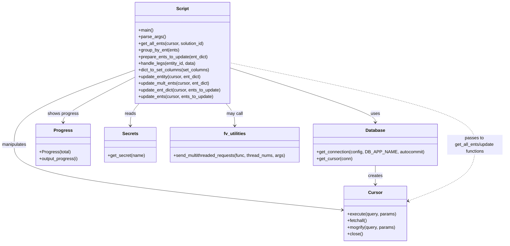

# Diagram: entity_core/entity_service/entity_service_scripts/new_backfill_entity_location_ids.py


> Auto-generated by Obscura crawlers

## Diagram 1

```mermaid
flowchart TD
    Start([Start]) --> ParseArgs[Parse args (-t, -s)]
    ParseArgs --> LoadSecrets[Load SECRETS / config]
    LoadSecrets --> DBConn[Open DB connection (fv.db.get_connection)]
    DBConn --> Cursors[Create cursors per thread]
    Cursors --> Query[get_all_ents(cursor, solution_id)]
    Query --> Group[group_by_ent(ents)]
    Group --> Prepare[prepare_ents_to_update(ent_dict)]
    Prepare --> ForEachEnt[for each entity -> handle_legs(entity_id, data)]
    ForEachEnt --> HL[handle_legs(entity_id, data)]
    HL --> D1{"destination.departed?"}
    D1 -- Yes --> Break1[break (no current/inbound/outbound)]
    D1 -- No --> D2{"destination.arrived AND not departed AND newer than last_event?"}
    D2 -- Yes --> SetCurrentDest[set current_location = destination.location_id; event_ts = destination.arrived]
    D2 -- No --> D3{"origin.departed AND not destination.arrived AND newer than last_event?"}
    D3 -- Yes --> SetInboundOutbound[set inbound_location = destination.location_id; outbound_location = origin.location_id; event_ts = origin.departed]
    D3 -- No --> D4{"origin.arrived AND not origin.departed AND newer than last_event?"}
    D4 -- Yes --> SetCurrentOrigin[set current_location = origin.location_id; event_ts = origin.arrived]
    D4 -- No --> Break2[no update]
    SetCurrentDest --> ToUpdate[mark to_update with entity_id]
    SetInboundOutbound --> ToUpdate
    SetCurrentOrigin --> ToUpdate
    Break1 --> Continue1[continue to next leg/entity]
    Break2 --> Continue1
    ToUpdate --> Aggregate[aggregate into update_dict keyed by values]
    Continue1 --> HL_END[return to prepare_ents_to_update loop]
    Aggregate --> AfterPrepare[ents_to_update produced]
    AfterPrepare --> CheckUpdates{"ents_to_update empty?"}
    CheckUpdates -- Yes --> Cleanup[close cursors]
    CheckUpdates -- No --> UpdatePath[update_ent_dict(cursor, ents_to_update)]
    UpdatePath --> Cleanup
    Cleanup --> End([Done])
```

> SVG rendering failed for this diagram.

## Diagram 2



### SVG

<svg id="container" width="1821.6015625" xmlns="http://www.w3.org/2000/svg" class="classDiagram" height="878" viewBox="0 0 1821.6015625 878" role="graphics-document document" aria-roledescription="class"><style>#container{font-family:"trebuchet ms",verdana,arial,sans-serif;font-size:16px;fill:#333;}@keyframes edge-animation-frame{from{stroke-dashoffset:0;}}@keyframes dash{to{stroke-dashoffset:0;}}#container .edge-animation-slow{stroke-dasharray:9,5!important;stroke-dashoffset:900;animation:dash 50s linear infinite;stroke-linecap:round;}#container .edge-animation-fast{stroke-dasharray:9,5!important;stroke-dashoffset:900;animation:dash 20s linear infinite;stroke-linecap:round;}#container .error-icon{fill:#552222;}#container .error-text{fill:#552222;stroke:#552222;}#container .edge-thickness-normal{stroke-width:1px;}#container .edge-thickness-thick{stroke-width:3.5px;}#container .edge-pattern-solid{stroke-dasharray:0;}#container .edge-thickness-invisible{stroke-width:0;fill:none;}#container .edge-pattern-dashed{stroke-dasharray:3;}#container .edge-pattern-dotted{stroke-dasharray:2;}#container .marker{fill:#333333;stroke:#333333;}#container .marker.cross{stroke:#333333;}#container svg{font-family:"trebuchet ms",verdana,arial,sans-serif;font-size:16px;}#container p{margin:0;}#container g.classGroup text{fill:#9370DB;stroke:none;font-family:"trebuchet ms",verdana,arial,sans-serif;font-size:10px;}#container g.classGroup text .title{font-weight:bolder;}#container .nodeLabel,#container .edgeLabel{color:#131300;}#container .edgeLabel .label rect{fill:#ECECFF;}#container .label text{fill:#131300;}#container .labelBkg{background:#ECECFF;}#container .edgeLabel .label span{background:#ECECFF;}#container .classTitle{font-weight:bolder;}#container .node rect,#container .node circle,#container .node ellipse,#container .node polygon,#container .node path{fill:#ECECFF;stroke:#9370DB;stroke-width:1px;}#container .divider{stroke:#9370DB;stroke-width:1;}#container g.clickable{cursor:pointer;}#container g.classGroup rect{fill:#ECECFF;stroke:#9370DB;}#container g.classGroup line{stroke:#9370DB;stroke-width:1;}#container .classLabel .box{stroke:none;stroke-width:0;fill:#ECECFF;opacity:0.5;}#container .classLabel .label{fill:#9370DB;font-size:10px;}#container .relation{stroke:#333333;stroke-width:1;fill:none;}#container .dashed-line{stroke-dasharray:3;}#container .dotted-line{stroke-dasharray:1 2;}#container #compositionStart,#container .composition{fill:#333333!important;stroke:#333333!important;stroke-width:1;}#container #compositionEnd,#container .composition{fill:#333333!important;stroke:#333333!important;stroke-width:1;}#container #dependencyStart,#container .dependency{fill:#333333!important;stroke:#333333!important;stroke-width:1;}#container #dependencyStart,#container .dependency{fill:#333333!important;stroke:#333333!important;stroke-width:1;}#container #extensionStart,#container .extension{fill:transparent!important;stroke:#333333!important;stroke-width:1;}#container #extensionEnd,#container .extension{fill:transparent!important;stroke:#333333!important;stroke-width:1;}#container #aggregationStart,#container .aggregation{fill:transparent!important;stroke:#333333!important;stroke-width:1;}#container #aggregationEnd,#container .aggregation{fill:transparent!important;stroke:#333333!important;stroke-width:1;}#container #lollipopStart,#container .lollipop{fill:#ECECFF!important;stroke:#333333!important;stroke-width:1;}#container #lollipopEnd,#container .lollipop{fill:#ECECFF!important;stroke:#333333!important;stroke-width:1;}#container .edgeTerminals{font-size:11px;line-height:initial;}#container .classTitleText{text-anchor:middle;font-size:18px;fill:#333;}#container .label-icon{display:inline-block;height:1em;overflow:visible;vertical-align:-0.125em;}#container .node .label-icon path{fill:currentColor;stroke:revert;stroke-width:revert;}#container :root{--mermaid-font-family:"trebuchet ms",verdana,arial,sans-serif;}</style><g><defs><marker id="container_class-aggregationStart" class="marker aggregation class" refX="18" refY="7" markerWidth="190" markerHeight="240" orient="auto"><path d="M 18,7 L9,13 L1,7 L9,1 Z"></path></marker></defs><defs><marker id="container_class-aggregationEnd" class="marker aggregation class" refX="1" refY="7" markerWidth="20" markerHeight="28" orient="auto"><path d="M 18,7 L9,13 L1,7 L9,1 Z"></path></marker></defs><defs><marker id="container_class-extensionStart" class="marker extension class" refX="18" refY="7" markerWidth="190" markerHeight="240" orient="auto"><path d="M 1,7 L18,13 V 1 Z"></path></marker></defs><defs><marker id="container_class-extensionEnd" class="marker extension class" refX="1" refY="7" markerWidth="20" markerHeight="28" orient="auto"><path d="M 1,1 V 13 L18,7 Z"></path></marker></defs><defs><marker id="container_class-compositionStart" class="marker composition class" refX="18" refY="7" markerWidth="190" markerHeight="240" orient="auto"><path d="M 18,7 L9,13 L1,7 L9,1 Z"></path></marker></defs><defs><marker id="container_class-compositionEnd" class="marker composition class" refX="1" refY="7" markerWidth="20" markerHeight="28" orient="auto"><path d="M 18,7 L9,13 L1,7 L9,1 Z"></path></marker></defs><defs><marker id="container_class-dependencyStart" class="marker dependency class" refX="6" refY="7" markerWidth="190" markerHeight="240" orient="auto"><path d="M 5,7 L9,13 L1,7 L9,1 Z"></path></marker></defs><defs><marker id="container_class-dependencyEnd" class="marker dependency class" refX="13" refY="7" markerWidth="20" markerHeight="28" orient="auto"><path d="M 18,7 L9,13 L14,7 L9,1 Z"></path></marker></defs><defs><marker id="container_class-lollipopStart" class="marker lollipop class" refX="13" refY="7" markerWidth="190" markerHeight="240" orient="auto"><circle stroke="black" fill="transparent" cx="7" cy="7" r="6"></circle></marker></defs><defs><marker id="container_class-lollipopEnd" class="marker lollipop class" refX="1" refY="7" markerWidth="190" markerHeight="240" orient="auto"><circle stroke="black" fill="transparent" cx="7" cy="7" r="6"></circle></marker></defs><g class="root"><g class="clusters"></g><g class="edgePaths"><path d="M837.377,245.998L924.371,273.498C1011.366,300.999,1185.355,355.999,1272.349,388.666C1359.344,421.333,1359.344,431.667,1359.344,436.833L1359.344,442" id="id_Script_Database_1" class="edge-thickness-normal edge-pattern-solid relation" style=";;;" data-edge="true" data-et="edge" data-id="id_Script_Database_1" data-points="W3sieCI6ODM3LjM3Njk1MzEyNSwieSI6MjQ1Ljk5Nzk5MzQwNDg5NzIyfSx7IngiOjEzNTkuMzQzNzUsInkiOjQxMX0seyJ4IjoxMzU5LjM0Mzc1LCJ5Ijo0NDh9XQ==" marker-end="url(#container_class-dependencyEnd)"></path><path d="M489.416,253.715L416.694,279.929C343.973,306.143,198.529,358.572,125.808,403.453C53.086,448.333,53.086,485.667,53.086,523C53.086,560.333,53.086,597.667,251.061,636.945C449.037,676.224,844.988,717.448,1042.963,738.06L1240.939,758.672" id="id_Script_Cursor_2" class="edge-thickness-normal edge-pattern-solid relation" style=";;;" data-edge="true" data-et="edge" data-id="id_Script_Cursor_2" data-points="W3sieCI6NDg5LjQxNjAxNTYyNSwieSI6MjUzLjcxNTEyNjQ1NjQ5Nzg3fSx7IngiOjUzLjA4NTkzNzUsInkiOjQxMX0seyJ4Ijo1My4wODU5Mzc1LCJ5Ijo1MjN9LHsieCI6NTMuMDg1OTM3NSwieSI6NjM1fSx7IngiOjEyNDYuOTA2MjUsInkiOjc1OS4yOTM2NTg1MzA3NTA1fV0=" marker-end="url(#container_class-dependencyEnd)"></path><path d="M505.583,374L500.265,380.167C494.947,386.333,484.312,398.667,478.994,412C473.676,425.333,473.676,439.667,473.676,446.833L473.676,454" id="id_Script_Secrets_3" class="edge-thickness-normal edge-pattern-solid relation" style=";;;" data-edge="true" data-et="edge" data-id="id_Script_Secrets_3" data-points="W3sieCI6NTA1LjU4MzM1NDA0ODI5NTQ2LCJ5IjozNzR9LHsieCI6NDczLjY3NTc4MTI1LCJ5Ijo0MTF9LHsieCI6NDczLjY3NTc4MTI1LCJ5Ijo0NjB9XQ==" marker-end="url(#container_class-dependencyEnd)"></path><path d="M489.416,279.764L446.545,301.636C403.673,323.509,317.93,367.255,275.059,394.294C232.188,421.333,232.188,431.667,232.188,436.833L232.188,442" id="id_Script_Progress_4" class="edge-thickness-normal edge-pattern-solid relation" style=";;;" data-edge="true" data-et="edge" data-id="id_Script_Progress_4" data-points="W3sieCI6NDg5LjQxNjAxNTYyNSwieSI6Mjc5Ljc2MzY5NTgyMjUxOTM3fSx7IngiOjIzMi4xODc1LCJ5Ijo0MTF9LHsieCI6MjMyLjE4NzUsInkiOjQ0OH1d" marker-end="url(#container_class-dependencyEnd)"></path><path d="M1359.344,598L1359.344,604.167C1359.344,610.333,1359.344,622.667,1359.344,634C1359.344,645.333,1359.344,655.667,1359.344,660.833L1359.344,666" id="id_Database_Cursor_5" class="edge-thickness-normal edge-pattern-solid relation" style=";;;" data-edge="true" data-et="edge" data-id="id_Database_Cursor_5" data-points="W3sieCI6MTM1OS4zNDM3NSwieSI6NTk4fSx7IngiOjEzNTkuMzQzNzUsInkiOjYzNX0seyJ4IjoxMzU5LjM0Mzc1LCJ5Ijo2NzJ9XQ==" marker-end="url(#container_class-dependencyEnd)"></path><path d="M821.21,374L826.528,380.167C831.845,386.333,842.481,398.667,847.799,412C853.117,425.333,853.117,439.667,853.117,446.833L853.117,454" id="id_Script_fv_utilities_6" class="edge-thickness-normal edge-pattern-solid relation" style=";;;" data-edge="true" data-et="edge" data-id="id_Script_fv_utilities_6" data-points="W3sieCI6ODIxLjIwOTYxNDcwMTcwNDYsInkiOjM3NH0seyJ4Ijo4NTMuMTE3MTg3NSwieSI6NDExfSx7IngiOjg1My4xMTcxODc1LCJ5Ijo0NjB9XQ==" marker-end="url(#container_class-dependencyEnd)"></path><path d="M1477.383,725.685L1516.752,710.571C1556.122,695.456,1634.862,665.228,1674.232,631.447C1713.602,597.667,1713.602,560.333,1713.602,523C1713.602,485.667,1713.602,448.333,1567.564,399.074C1421.527,349.815,1129.452,288.631,983.414,258.038L837.377,227.446" id="id_Cursor_Script_7" class="edge-thickness-normal edge-pattern-dashed relation" style=";;;" data-edge="true" data-et="edge" data-id="id_Cursor_Script_7" data-points="W3sieCI6MTQ3MS43ODEyNSwieSI6NzI3LjgzNTEwODYxMTc1NDN9LHsieCI6MTcxMy42MDE1NjI1LCJ5Ijo2MzV9LHsieCI6MTcxMy42MDE1NjI1LCJ5Ijo1MjN9LHsieCI6MTcxMy42MDE1NjI1LCJ5Ijo0MTF9LHsieCI6ODM3LjM3Njk1MzEyNSwieSI6MjI3LjQ0NTkzMjI0OTA5NTY4fV0=" marker-start="url(#container_class-dependencyStart)"></path></g><g class="edgeLabels"><g class="edgeLabel" transform="translate(1359.34375, 411)"><g class="label" data-id="id_Script_Database_1" transform="translate(-16.4921875, -12)"><foreignObject width="32.984375" height="24"><div xmlns="http://www.w3.org/1999/xhtml" class="labelBkg" style="display: table-cell; white-space: nowrap; line-height: 1.5; max-width: 200px; text-align: center;"><span class="edgeLabel"><p>uses</p></span></div></foreignObject></g></g><g class="edgeLabel" transform="translate(53.0859375, 523)"><g class="label" data-id="id_Script_Cursor_2" transform="translate(-45.0859375, -12)"><foreignObject width="90.171875" height="24"><div xmlns="http://www.w3.org/1999/xhtml" class="labelBkg" style="display: table-cell; white-space: nowrap; line-height: 1.5; max-width: 200px; text-align: center;"><span class="edgeLabel"><p>manipulates</p></span></div></foreignObject></g></g><g class="edgeLabel" transform="translate(473.67578125, 411)"><g class="label" data-id="id_Script_Secrets_3" transform="translate(-20.0078125, -12)"><foreignObject width="40.015625" height="24"><div xmlns="http://www.w3.org/1999/xhtml" class="labelBkg" style="display: table-cell; white-space: nowrap; line-height: 1.5; max-width: 200px; text-align: center;"><span class="edgeLabel"><p>reads</p></span></div></foreignObject></g></g><g class="edgeLabel" transform="translate(232.1875, 411)"><g class="label" data-id="id_Script_Progress_4" transform="translate(-55.7265625, -12)"><foreignObject width="111.453125" height="24"><div xmlns="http://www.w3.org/1999/xhtml" class="labelBkg" style="display: table-cell; white-space: nowrap; line-height: 1.5; max-width: 200px; text-align: center;"><span class="edgeLabel"><p>shows progress</p></span></div></foreignObject></g></g><g class="edgeLabel" transform="translate(1359.34375, 635)"><g class="label" data-id="id_Database_Cursor_5" transform="translate(-26.171875, -12)"><foreignObject width="52.34375" height="24"><div xmlns="http://www.w3.org/1999/xhtml" class="labelBkg" style="display: table-cell; white-space: nowrap; line-height: 1.5; max-width: 200px; text-align: center;"><span class="edgeLabel"><p>creates</p></span></div></foreignObject></g></g><g class="edgeLabel" transform="translate(853.1171875, 411)"><g class="label" data-id="id_Script_fv_utilities_6" transform="translate(-29.8515625, -12)"><foreignObject width="59.703125" height="24"><div xmlns="http://www.w3.org/1999/xhtml" class="labelBkg" style="display: table-cell; white-space: nowrap; line-height: 1.5; max-width: 200px; text-align: center;"><span class="edgeLabel"><p>may call</p></span></div></foreignObject></g></g><g class="edgeLabel" transform="translate(1713.6015625, 523)"><g class="label" data-id="id_Cursor_Script_7" transform="translate(-100, -36)"><foreignObject width="200" height="72"><div xmlns="http://www.w3.org/1999/xhtml" class="labelBkg" style="display: table; white-space: break-spaces; line-height: 1.5; max-width: 200px; text-align: center; width: 200px;"><span class="edgeLabel"><p>passes to get_all_ents/update functions</p></span></div></foreignObject></g></g></g><g class="nodes"><g class="node default" id="classId-Script-0" transform="translate(663.396484375, 191)"><g class="basic label-container"><path d="M-173.98046875 -183 L173.98046875 -183 L173.98046875 183 L-173.98046875 183" stroke="none" stroke-width="0" fill="#ECECFF" style=""></path><path d="M-173.98046875 -183 C-86.76837305836455 -183, 0.4437226332709088 -183, 173.98046875 -183 M-173.98046875 -183 C-69.89081130675314 -183, 34.19884613649373 -183, 173.98046875 -183 M173.98046875 -183 C173.98046875 -45.39390556163562, 173.98046875 92.21218887672876, 173.98046875 183 M173.98046875 -183 C173.98046875 -82.04305908619614, 173.98046875 18.913881827607725, 173.98046875 183 M173.98046875 183 C36.400680034427666 183, -101.17910868114467 183, -173.98046875 183 M173.98046875 183 C40.490997693773664 183, -92.99847336245267 183, -173.98046875 183 M-173.98046875 183 C-173.98046875 88.8493603539848, -173.98046875 -5.301279292030387, -173.98046875 -183 M-173.98046875 183 C-173.98046875 103.92235384823991, -173.98046875 24.844707696479816, -173.98046875 -183" stroke="#9370DB" stroke-width="1.3" fill="none" stroke-dasharray="0 0" style=""></path></g><g class="annotation-group text" transform="translate(0, -159)"></g><g class="label-group text" transform="translate(-21.7421875, -159)"><g class="label" style="font-weight: bolder" transform="translate(0,-12)"><foreignObject width="43.484375" height="24"><div xmlns="http://www.w3.org/1999/xhtml" style="display: table-cell; white-space: nowrap; line-height: 1.5; max-width: 93px; text-align: center;"><span class="nodeLabel markdown-node-label" style=""><p>Script</p></span></div></foreignObject></g></g><g class="members-group text" transform="translate(-161.98046875, -111)"></g><g class="methods-group text" transform="translate(-161.98046875, -81)"><g class="label" style="" transform="translate(0,-12)"><foreignObject width="54.65625" height="24"><div xmlns="http://www.w3.org/1999/xhtml" style="display: table-cell; white-space: nowrap; line-height: 1.5; max-width: 112px; text-align: center;"><span class="nodeLabel markdown-node-label" style=""><p>+main()</p></span></div></foreignObject></g><g class="label" style="" transform="translate(0,12)"><foreignObject width="96.53125" height="24"><div xmlns="http://www.w3.org/1999/xhtml" style="display: table-cell; white-space: nowrap; line-height: 1.5; max-width: 154px; text-align: center;"><span class="nodeLabel markdown-node-label" style=""><p>+parse_args()</p></span></div></foreignObject></g><g class="label" style="" transform="translate(0,36)"><foreignObject width="240.9375" height="24"><div xmlns="http://www.w3.org/1999/xhtml" style="display: table-cell; white-space: nowrap; line-height: 1.5; max-width: 298px; text-align: center;"><span class="nodeLabel markdown-node-label" style=""><p>+get_all_ents(cursor, solution_id)</p></span></div></foreignObject></g><g class="label" style="" transform="translate(0,60)"><foreignObject width="148.578125" height="24"><div xmlns="http://www.w3.org/1999/xhtml" style="display: table-cell; white-space: nowrap; line-height: 1.5; max-width: 206px; text-align: center;"><span class="nodeLabel markdown-node-label" style=""><p>+group_by_ent(ents)</p></span></div></foreignObject></g><g class="label" style="" transform="translate(0,84)"><foreignObject width="254.734375" height="24"><div xmlns="http://www.w3.org/1999/xhtml" style="display: table-cell; white-space: nowrap; line-height: 1.5; max-width: 312px; text-align: center;"><span class="nodeLabel markdown-node-label" style=""><p>+prepare_ents_to_update(ent_dict)</p></span></div></foreignObject></g><g class="label" style="" transform="translate(0,108)"><foreignObject width="210.15625" height="24"><div xmlns="http://www.w3.org/1999/xhtml" style="display: table-cell; white-space: nowrap; line-height: 1.5; max-width: 268px; text-align: center;"><span class="nodeLabel markdown-node-label" style=""><p>+handle_legs(entity_id, data)</p></span></div></foreignObject></g><g class="label" style="" transform="translate(0,132)"><foreignObject width="259.140625" height="24"><div xmlns="http://www.w3.org/1999/xhtml" style="display: table-cell; white-space: nowrap; line-height: 1.5; max-width: 317px; text-align: center;"><span class="nodeLabel markdown-node-label" style=""><p>+dict_to_set_columns(set_columns)</p></span></div></foreignObject></g><g class="label" style="" transform="translate(0,156)"><foreignObject width="231.234375" height="24"><div xmlns="http://www.w3.org/1999/xhtml" style="display: table-cell; white-space: nowrap; line-height: 1.5; max-width: 289px; text-align: center;"><span class="nodeLabel markdown-node-label" style=""><p>+update_entity(cursor, ent_dict)</p></span></div></foreignObject></g><g class="label" style="" transform="translate(0,180)"><foreignObject width="262.4375" height="24"><div xmlns="http://www.w3.org/1999/xhtml" style="display: table-cell; white-space: nowrap; line-height: 1.5; max-width: 320px; text-align: center;"><span class="nodeLabel markdown-node-label" style=""><p>+update_mult_ents(cursor, ent_dict)</p></span></div></foreignObject></g><g class="label" style="" transform="translate(0,204)"><foreignObject width="302.21875" height="24"><div xmlns="http://www.w3.org/1999/xhtml" style="display: table-cell; white-space: nowrap; line-height: 1.5; max-width: 360px; text-align: center;"><span class="nodeLabel markdown-node-label" style=""><p>+update_ent_dict(cursor, ents_to_update)</p></span></div></foreignObject></g><g class="label" style="" transform="translate(0,228)"><foreignObject width="274.1875" height="24"><div xmlns="http://www.w3.org/1999/xhtml" style="display: table-cell; white-space: nowrap; line-height: 1.5; max-width: 332px; text-align: center;"><span class="nodeLabel markdown-node-label" style=""><p>+update_ents(cursor, ents_to_update)</p></span></div></foreignObject></g></g><g class="divider" style=""><path d="M-173.98046875 -135 C-36.989631513808064 -135, 100.00120572238387 -135, 173.98046875 -135 M-173.98046875 -135 C-58.695340590772446 -135, 56.58978756845511 -135, 173.98046875 -135" stroke="#9370DB" stroke-width="1.3" fill="none" stroke-dasharray="0 0" style=""></path></g><g class="divider" style=""><path d="M-173.98046875 -111 C-88.72608211865207 -111, -3.471695487304146 -111, 173.98046875 -111 M-173.98046875 -111 C-67.20042508551741 -111, 39.57961857896518 -111, 173.98046875 -111" stroke="#9370DB" stroke-width="1.3" fill="none" stroke-dasharray="0 0" style=""></path></g></g><g class="node default" id="classId-Database-1" transform="translate(1359.34375, 523)"><g class="basic label-container"><path d="M-219.2578125 -75 L219.2578125 -75 L219.2578125 75 L-219.2578125 75" stroke="none" stroke-width="0" fill="#ECECFF" style=""></path><path d="M-219.2578125 -75 C-125.75903868221616 -75, -32.260264864432315 -75, 219.2578125 -75 M-219.2578125 -75 C-48.41545680398238 -75, 122.42689889203524 -75, 219.2578125 -75 M219.2578125 -75 C219.2578125 -23.273541169690915, 219.2578125 28.45291766061817, 219.2578125 75 M219.2578125 -75 C219.2578125 -33.39958390222249, 219.2578125 8.200832195555023, 219.2578125 75 M219.2578125 75 C65.76200467650307 75, -87.73380314699386 75, -219.2578125 75 M219.2578125 75 C92.00807070314349 75, -35.24167109371302 75, -219.2578125 75 M-219.2578125 75 C-219.2578125 23.637205103701596, -219.2578125 -27.725589792596807, -219.2578125 -75 M-219.2578125 75 C-219.2578125 24.201571411984517, -219.2578125 -26.596857176030966, -219.2578125 -75" stroke="#9370DB" stroke-width="1.3" fill="none" stroke-dasharray="0 0" style=""></path></g><g class="annotation-group text" transform="translate(0, -51)"></g><g class="label-group text" transform="translate(-34.171875, -51)"><g class="label" style="font-weight: bolder" transform="translate(0,-12)"><foreignObject width="68.34375" height="24"><div xmlns="http://www.w3.org/1999/xhtml" style="display: table-cell; white-space: nowrap; line-height: 1.5; max-width: 117px; text-align: center;"><span class="nodeLabel markdown-node-label" style=""><p>Database</p></span></div></foreignObject></g></g><g class="members-group text" transform="translate(-207.2578125, -3)"></g><g class="methods-group text" transform="translate(-207.2578125, 27)"><g class="label" style="" transform="translate(0,-12)"><foreignObject width="380.34375" height="24"><div xmlns="http://www.w3.org/1999/xhtml" style="display: table-cell; white-space: nowrap; line-height: 1.5; max-width: 438px; text-align: center;"><span class="nodeLabel markdown-node-label" style=""><p>+get_connection(config, DB_APP_NAME, autocommit)</p></span></div></foreignObject></g><g class="label" style="" transform="translate(0,12)"><foreignObject width="130.078125" height="24"><div xmlns="http://www.w3.org/1999/xhtml" style="display: table-cell; white-space: nowrap; line-height: 1.5; max-width: 187px; text-align: center;"><span class="nodeLabel markdown-node-label" style=""><p>+get_cursor(conn)</p></span></div></foreignObject></g></g><g class="divider" style=""><path d="M-219.2578125 -27 C-112.55237881072424 -27, -5.846945121448471 -27, 219.2578125 -27 M-219.2578125 -27 C-90.59990611769854 -27, 38.058000264602924 -27, 219.2578125 -27" stroke="#9370DB" stroke-width="1.3" fill="none" stroke-dasharray="0 0" style=""></path></g><g class="divider" style=""><path d="M-219.2578125 -3 C-122.00025621612998 -3, -24.742699932259967 -3, 219.2578125 -3 M-219.2578125 -3 C-78.60095495200392 -3, 62.055902595992166 -3, 219.2578125 -3" stroke="#9370DB" stroke-width="1.3" fill="none" stroke-dasharray="0 0" style=""></path></g></g><g class="node default" id="classId-Cursor-2" transform="translate(1359.34375, 771)"><g class="basic label-container"><path d="M-112.4375 -99 L112.4375 -99 L112.4375 99 L-112.4375 99" stroke="none" stroke-width="0" fill="#ECECFF" style=""></path><path d="M-112.4375 -99 C-59.7648386438546 -99, -7.092177287709205 -99, 112.4375 -99 M-112.4375 -99 C-33.61385969105726 -99, 45.209780617885485 -99, 112.4375 -99 M112.4375 -99 C112.4375 -27.82090840477528, 112.4375 43.35818319044944, 112.4375 99 M112.4375 -99 C112.4375 -53.31969573649373, 112.4375 -7.639391472987455, 112.4375 99 M112.4375 99 C56.20938576916042 99, -0.01872846167916009 99, -112.4375 99 M112.4375 99 C25.21922198049603 99, -61.99905603900794 99, -112.4375 99 M-112.4375 99 C-112.4375 42.64729914217511, -112.4375 -13.705401715649785, -112.4375 -99 M-112.4375 99 C-112.4375 46.67048305530113, -112.4375 -5.659033889397733, -112.4375 -99" stroke="#9370DB" stroke-width="1.3" fill="none" stroke-dasharray="0 0" style=""></path></g><g class="annotation-group text" transform="translate(0, -75)"></g><g class="label-group text" transform="translate(-23.90625, -75)"><g class="label" style="font-weight: bolder" transform="translate(0,-12)"><foreignObject width="47.8125" height="24"><div xmlns="http://www.w3.org/1999/xhtml" style="display: table-cell; white-space: nowrap; line-height: 1.5; max-width: 98px; text-align: center;"><span class="nodeLabel markdown-node-label" style=""><p>Cursor</p></span></div></foreignObject></g></g><g class="members-group text" transform="translate(-100.4375, -27)"></g><g class="methods-group text" transform="translate(-100.4375, 3)"><g class="label" style="" transform="translate(0,-12)"><foreignObject width="176.96875" height="24"><div xmlns="http://www.w3.org/1999/xhtml" style="display: table-cell; white-space: nowrap; line-height: 1.5; max-width: 234px; text-align: center;"><span class="nodeLabel markdown-node-label" style=""><p>+execute(query, params)</p></span></div></foreignObject></g><g class="label" style="" transform="translate(0,12)"><foreignObject width="72.515625" height="24"><div xmlns="http://www.w3.org/1999/xhtml" style="display: table-cell; white-space: nowrap; line-height: 1.5; max-width: 130px; text-align: center;"><span class="nodeLabel markdown-node-label" style=""><p>+fetchall()</p></span></div></foreignObject></g><g class="label" style="" transform="translate(0,36)"><foreignObject width="176.296875" height="24"><div xmlns="http://www.w3.org/1999/xhtml" style="display: table-cell; white-space: nowrap; line-height: 1.5; max-width: 234px; text-align: center;"><span class="nodeLabel markdown-node-label" style=""><p>+mogrify(query, params)</p></span></div></foreignObject></g><g class="label" style="" transform="translate(0,60)"><foreignObject width="56.15625" height="24"><div xmlns="http://www.w3.org/1999/xhtml" style="display: table-cell; white-space: nowrap; line-height: 1.5; max-width: 114px; text-align: center;"><span class="nodeLabel markdown-node-label" style=""><p>+close()</p></span></div></foreignObject></g></g><g class="divider" style=""><path d="M-112.4375 -51 C-53.5071094359871 -51, 5.423281128025806 -51, 112.4375 -51 M-112.4375 -51 C-31.65634579425928 -51, 49.12480841148144 -51, 112.4375 -51" stroke="#9370DB" stroke-width="1.3" fill="none" stroke-dasharray="0 0" style=""></path></g><g class="divider" style=""><path d="M-112.4375 -27 C-64.63064472766064 -27, -16.82378945532129 -27, 112.4375 -27 M-112.4375 -27 C-38.061300504828225 -27, 36.31489899034355 -27, 112.4375 -27" stroke="#9370DB" stroke-width="1.3" fill="none" stroke-dasharray="0 0" style=""></path></g></g><g class="node default" id="classId-Progress-3" transform="translate(232.1875, 523)"><g class="basic label-container"><path d="M-99.015625 -75 L99.015625 -75 L99.015625 75 L-99.015625 75" stroke="none" stroke-width="0" fill="#ECECFF" style=""></path><path d="M-99.015625 -75 C-52.44452074631344 -75, -5.873416492626873 -75, 99.015625 -75 M-99.015625 -75 C-57.92381500240744 -75, -16.832005004814874 -75, 99.015625 -75 M99.015625 -75 C99.015625 -28.30292704935912, 99.015625 18.39414590128176, 99.015625 75 M99.015625 -75 C99.015625 -33.71387205467764, 99.015625 7.572255890644726, 99.015625 75 M99.015625 75 C45.87506122379875 75, -7.265502552402495 75, -99.015625 75 M99.015625 75 C40.26026892863622 75, -18.495087142727556 75, -99.015625 75 M-99.015625 75 C-99.015625 43.61050622913781, -99.015625 12.22101245827563, -99.015625 -75 M-99.015625 75 C-99.015625 16.183673569310862, -99.015625 -42.632652861378276, -99.015625 -75" stroke="#9370DB" stroke-width="1.3" fill="none" stroke-dasharray="0 0" style=""></path></g><g class="annotation-group text" transform="translate(0, -51)"></g><g class="label-group text" transform="translate(-31.75, -51)"><g class="label" style="font-weight: bolder" transform="translate(0,-12)"><foreignObject width="63.5" height="24"><div xmlns="http://www.w3.org/1999/xhtml" style="display: table-cell; white-space: nowrap; line-height: 1.5; max-width: 112px; text-align: center;"><span class="nodeLabel markdown-node-label" style=""><p>Progress</p></span></div></foreignObject></g></g><g class="members-group text" transform="translate(-87.015625, -3)"></g><g class="methods-group text" transform="translate(-87.015625, 27)"><g class="label" style="" transform="translate(0,-12)"><foreignObject width="113.671875" height="24"><div xmlns="http://www.w3.org/1999/xhtml" style="display: table-cell; white-space: nowrap; line-height: 1.5; max-width: 171px; text-align: center;"><span class="nodeLabel markdown-node-label" style=""><p>+Progress(total)</p></span></div></foreignObject></g><g class="label" style="" transform="translate(0,12)"><foreignObject width="142.28125" height="24"><div xmlns="http://www.w3.org/1999/xhtml" style="display: table-cell; white-space: nowrap; line-height: 1.5; max-width: 200px; text-align: center;"><span class="nodeLabel markdown-node-label" style=""><p>+output_progress(i)</p></span></div></foreignObject></g></g><g class="divider" style=""><path d="M-99.015625 -27 C-39.796479092121956 -27, 19.422666815756088 -27, 99.015625 -27 M-99.015625 -27 C-48.189358787453266 -27, 2.6369074250934688 -27, 99.015625 -27" stroke="#9370DB" stroke-width="1.3" fill="none" stroke-dasharray="0 0" style=""></path></g><g class="divider" style=""><path d="M-99.015625 -3 C-46.8064963171796 -3, 5.402632365640798 -3, 99.015625 -3 M-99.015625 -3 C-32.96688835798133 -3, 33.081848284037335 -3, 99.015625 -3" stroke="#9370DB" stroke-width="1.3" fill="none" stroke-dasharray="0 0" style=""></path></g></g><g class="node default" id="classId-Secrets-4" transform="translate(473.67578125, 523)"><g class="basic label-container"><path d="M-92.47265625 -63 L92.47265625 -63 L92.47265625 63 L-92.47265625 63" stroke="none" stroke-width="0" fill="#ECECFF" style=""></path><path d="M-92.47265625 -63 C-20.511782106291648 -63, 51.449092037416705 -63, 92.47265625 -63 M-92.47265625 -63 C-49.86980176280064 -63, -7.266947275601282 -63, 92.47265625 -63 M92.47265625 -63 C92.47265625 -24.036824065918992, 92.47265625 14.926351868162016, 92.47265625 63 M92.47265625 -63 C92.47265625 -25.85319013486815, 92.47265625 11.2936197302637, 92.47265625 63 M92.47265625 63 C53.664969632931644 63, 14.857283015863288 63, -92.47265625 63 M92.47265625 63 C38.2512425849379 63, -15.970171080124203 63, -92.47265625 63 M-92.47265625 63 C-92.47265625 20.976572653474946, -92.47265625 -21.046854693050108, -92.47265625 -63 M-92.47265625 63 C-92.47265625 23.684048454133325, -92.47265625 -15.63190309173335, -92.47265625 -63" stroke="#9370DB" stroke-width="1.3" fill="none" stroke-dasharray="0 0" style=""></path></g><g class="annotation-group text" transform="translate(0, -39)"></g><g class="label-group text" transform="translate(-27.1640625, -39)"><g class="label" style="font-weight: bolder" transform="translate(0,-12)"><foreignObject width="54.328125" height="24"><div xmlns="http://www.w3.org/1999/xhtml" style="display: table-cell; white-space: nowrap; line-height: 1.5; max-width: 103px; text-align: center;"><span class="nodeLabel markdown-node-label" style=""><p>Secrets</p></span></div></foreignObject></g></g><g class="members-group text" transform="translate(-80.47265625, 9)"></g><g class="methods-group text" transform="translate(-80.47265625, 39)"><g class="label" style="" transform="translate(0,-12)"><foreignObject width="133.78125" height="24"><div xmlns="http://www.w3.org/1999/xhtml" style="display: table-cell; white-space: nowrap; line-height: 1.5; max-width: 191px; text-align: center;"><span class="nodeLabel markdown-node-label" style=""><p>+get_secret(name)</p></span></div></foreignObject></g></g><g class="divider" style=""><path d="M-92.47265625 -15 C-27.707704060143726 -15, 37.05724812971255 -15, 92.47265625 -15 M-92.47265625 -15 C-40.77975141127768 -15, 10.913153427444641 -15, 92.47265625 -15" stroke="#9370DB" stroke-width="1.3" fill="none" stroke-dasharray="0 0" style=""></path></g><g class="divider" style=""><path d="M-92.47265625 9 C-53.10814234468439 9, -13.743628439368777 9, 92.47265625 9 M-92.47265625 9 C-47.96937713176014 9, -3.4660980135202806 9, 92.47265625 9" stroke="#9370DB" stroke-width="1.3" fill="none" stroke-dasharray="0 0" style=""></path></g></g><g class="node default" id="classId-fv_utilities-5" transform="translate(853.1171875, 523)"><g class="basic label-container"><path d="M-236.96875 -63 L236.96875 -63 L236.96875 63 L-236.96875 63" stroke="none" stroke-width="0" fill="#ECECFF" style=""></path><path d="M-236.96875 -63 C-53.197824964997096 -63, 130.5731000700058 -63, 236.96875 -63 M-236.96875 -63 C-106.44960038565645 -63, 24.069549228687094 -63, 236.96875 -63 M236.96875 -63 C236.96875 -14.986239467594764, 236.96875 33.02752106481047, 236.96875 63 M236.96875 -63 C236.96875 -23.785922547632218, 236.96875 15.428154904735564, 236.96875 63 M236.96875 63 C68.65108637461341 63, -99.66657725077317 63, -236.96875 63 M236.96875 63 C81.96648742447454 63, -73.03577515105093 63, -236.96875 63 M-236.96875 63 C-236.96875 35.82642163571291, -236.96875 8.652843271425823, -236.96875 -63 M-236.96875 63 C-236.96875 33.64313318362737, -236.96875 4.286266367254747, -236.96875 -63" stroke="#9370DB" stroke-width="1.3" fill="none" stroke-dasharray="0 0" style=""></path></g><g class="annotation-group text" transform="translate(0, -39)"></g><g class="label-group text" transform="translate(-38.890625, -39)"><g class="label" style="font-weight: bolder" transform="translate(0,-12)"><foreignObject width="77.78125" height="24"><div xmlns="http://www.w3.org/1999/xhtml" style="display: table-cell; white-space: nowrap; line-height: 1.5; max-width: 126px; text-align: center;"><span class="nodeLabel markdown-node-label" style=""><p>fv_utilities</p></span></div></foreignObject></g></g><g class="members-group text" transform="translate(-224.96875, 9)"></g><g class="methods-group text" transform="translate(-224.96875, 39)"><g class="label" style="" transform="translate(0,-12)"><foreignObject width="411.046875" height="24"><div xmlns="http://www.w3.org/1999/xhtml" style="display: table-cell; white-space: nowrap; line-height: 1.5; max-width: 468px; text-align: center;"><span class="nodeLabel markdown-node-label" style=""><p>+send_multithreaded_requests(func, thread_nums, args)</p></span></div></foreignObject></g></g><g class="divider" style=""><path d="M-236.96875 -15 C-92.32610223583828 -15, 52.316545528323445 -15, 236.96875 -15 M-236.96875 -15 C-98.46445377898749 -15, 40.03984244202502 -15, 236.96875 -15" stroke="#9370DB" stroke-width="1.3" fill="none" stroke-dasharray="0 0" style=""></path></g><g class="divider" style=""><path d="M-236.96875 9 C-128.7883758473043 9, -20.608001694608618 9, 236.96875 9 M-236.96875 9 C-79.94362430211473 9, 77.08150139577054 9, 236.96875 9" stroke="#9370DB" stroke-width="1.3" fill="none" stroke-dasharray="0 0" style=""></path></g></g></g></g></g></svg>
