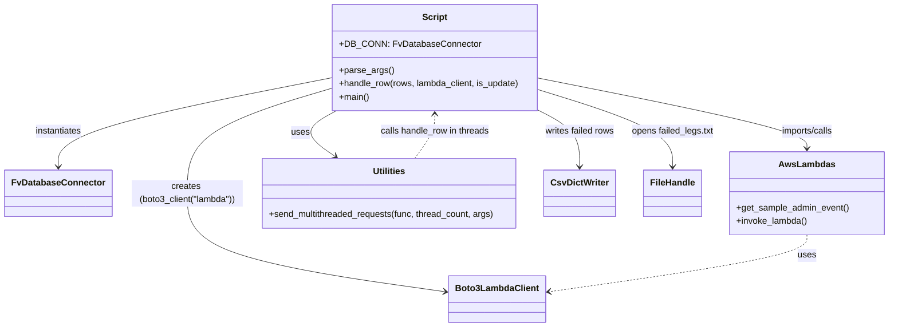

# Diagram: entity_core/entity_service/entity_service_scripts/planned_leg_for_pilot_ISS-10627.py


> Auto-generated by Obscura crawlers

## Diagram 1

```mermaid
flowchart LR
    ModuleInit[Module imports\nDB_CONN = FvDatabaseConnector(...)] --> ParseArgs["parse_args()"]
    ParseArgs --> OpenFile["open(args.leg_file)"]
    OpenFile --> ReadRows["dr = list(csv.DictReader(f))"]
    ReadRows --> Setup["setup: thread_count, config, lambda_client"]
    Setup --> BuildArgs["args = [tuple([[r for r in dr[i::thread_count]], lambda_client, args.update]) ...]"]
    BuildArgs --> SendThreads["fv.utilities.send_multithreaded_requests(handle_row, thread_count, args)"]
    SendThreads --> HandleRowLoop["handle_row(rows, lambda_client, is_update)"]
    HandleRowLoop --> CheckCarrier{row['carrierId']=='TBD'?}
    CheckCarrier -->|yes| SkipRow["continue (skip row)"]
    CheckCarrier -->|no| ParseDates["parse scheduledArrival origin/destination with dateutil.parser"]
    ParseDates -->|parse fail| SkipRow
    ParseDates --> BuildEvent["build event payload\n(pathParameters, body with origin/destination, references)"]
    BuildEvent --> ChooseSource{"is_update?"}
    ChooseSource -->|false| CreateSource["create_planned_trip_leg"]
    ChooseSource -->|true| UpdateSource["update_planned_trip_leg"]
    CreateSource --> InvokeLambda["fv.aws.lambdas.invoke_lambda(source, full_payload=event, lambda_client)"]
    UpdateSource --> InvokeLambda
    InvokeLambda --> CheckStatus{"statusCode == 409?"}
    CheckStatus -->|true| LogConflict["do not record as failed"]
    CheckStatus -->|false| RecordFailed["dw.writerow({leg_id, error, status_code})\nfailed_legs.txt append"]
    HandleRowLoop -->|every 10th| PrintProgress["print(i/len(rows)) and print(res)"]
```

> SVG rendering failed for this diagram.

## Diagram 2



### SVG

<svg id="container" width="1582.7890625" xmlns="http://www.w3.org/2000/svg" class="classDiagram" height="590" viewBox="0 0 1582.7890625 590" role="graphics-document document" aria-roledescription="class"><style>#container{font-family:"trebuchet ms",verdana,arial,sans-serif;font-size:16px;fill:#333;}@keyframes edge-animation-frame{from{stroke-dashoffset:0;}}@keyframes dash{to{stroke-dashoffset:0;}}#container .edge-animation-slow{stroke-dasharray:9,5!important;stroke-dashoffset:900;animation:dash 50s linear infinite;stroke-linecap:round;}#container .edge-animation-fast{stroke-dasharray:9,5!important;stroke-dashoffset:900;animation:dash 20s linear infinite;stroke-linecap:round;}#container .error-icon{fill:#552222;}#container .error-text{fill:#552222;stroke:#552222;}#container .edge-thickness-normal{stroke-width:1px;}#container .edge-thickness-thick{stroke-width:3.5px;}#container .edge-pattern-solid{stroke-dasharray:0;}#container .edge-thickness-invisible{stroke-width:0;fill:none;}#container .edge-pattern-dashed{stroke-dasharray:3;}#container .edge-pattern-dotted{stroke-dasharray:2;}#container .marker{fill:#333333;stroke:#333333;}#container .marker.cross{stroke:#333333;}#container svg{font-family:"trebuchet ms",verdana,arial,sans-serif;font-size:16px;}#container p{margin:0;}#container g.classGroup text{fill:#9370DB;stroke:none;font-family:"trebuchet ms",verdana,arial,sans-serif;font-size:10px;}#container g.classGroup text .title{font-weight:bolder;}#container .nodeLabel,#container .edgeLabel{color:#131300;}#container .edgeLabel .label rect{fill:#ECECFF;}#container .label text{fill:#131300;}#container .labelBkg{background:#ECECFF;}#container .edgeLabel .label span{background:#ECECFF;}#container .classTitle{font-weight:bolder;}#container .node rect,#container .node circle,#container .node ellipse,#container .node polygon,#container .node path{fill:#ECECFF;stroke:#9370DB;stroke-width:1px;}#container .divider{stroke:#9370DB;stroke-width:1;}#container g.clickable{cursor:pointer;}#container g.classGroup rect{fill:#ECECFF;stroke:#9370DB;}#container g.classGroup line{stroke:#9370DB;stroke-width:1;}#container .classLabel .box{stroke:none;stroke-width:0;fill:#ECECFF;opacity:0.5;}#container .classLabel .label{fill:#9370DB;font-size:10px;}#container .relation{stroke:#333333;stroke-width:1;fill:none;}#container .dashed-line{stroke-dasharray:3;}#container .dotted-line{stroke-dasharray:1 2;}#container #compositionStart,#container .composition{fill:#333333!important;stroke:#333333!important;stroke-width:1;}#container #compositionEnd,#container .composition{fill:#333333!important;stroke:#333333!important;stroke-width:1;}#container #dependencyStart,#container .dependency{fill:#333333!important;stroke:#333333!important;stroke-width:1;}#container #dependencyStart,#container .dependency{fill:#333333!important;stroke:#333333!important;stroke-width:1;}#container #extensionStart,#container .extension{fill:transparent!important;stroke:#333333!important;stroke-width:1;}#container #extensionEnd,#container .extension{fill:transparent!important;stroke:#333333!important;stroke-width:1;}#container #aggregationStart,#container .aggregation{fill:transparent!important;stroke:#333333!important;stroke-width:1;}#container #aggregationEnd,#container .aggregation{fill:transparent!important;stroke:#333333!important;stroke-width:1;}#container #lollipopStart,#container .lollipop{fill:#ECECFF!important;stroke:#333333!important;stroke-width:1;}#container #lollipopEnd,#container .lollipop{fill:#ECECFF!important;stroke:#333333!important;stroke-width:1;}#container .edgeTerminals{font-size:11px;line-height:initial;}#container .classTitleText{text-anchor:middle;font-size:18px;fill:#333;}#container .label-icon{display:inline-block;height:1em;overflow:visible;vertical-align:-0.125em;}#container .node .label-icon path{fill:currentColor;stroke:revert;stroke-width:revert;}#container :root{--mermaid-font-family:"trebuchet ms",verdana,arial,sans-serif;}</style><g><defs><marker id="container_class-aggregationStart" class="marker aggregation class" refX="18" refY="7" markerWidth="190" markerHeight="240" orient="auto"><path d="M 18,7 L9,13 L1,7 L9,1 Z"></path></marker></defs><defs><marker id="container_class-aggregationEnd" class="marker aggregation class" refX="1" refY="7" markerWidth="20" markerHeight="28" orient="auto"><path d="M 18,7 L9,13 L1,7 L9,1 Z"></path></marker></defs><defs><marker id="container_class-extensionStart" class="marker extension class" refX="18" refY="7" markerWidth="190" markerHeight="240" orient="auto"><path d="M 1,7 L18,13 V 1 Z"></path></marker></defs><defs><marker id="container_class-extensionEnd" class="marker extension class" refX="1" refY="7" markerWidth="20" markerHeight="28" orient="auto"><path d="M 1,1 V 13 L18,7 Z"></path></marker></defs><defs><marker id="container_class-compositionStart" class="marker composition class" refX="18" refY="7" markerWidth="190" markerHeight="240" orient="auto"><path d="M 18,7 L9,13 L1,7 L9,1 Z"></path></marker></defs><defs><marker id="container_class-compositionEnd" class="marker composition class" refX="1" refY="7" markerWidth="20" markerHeight="28" orient="auto"><path d="M 18,7 L9,13 L1,7 L9,1 Z"></path></marker></defs><defs><marker id="container_class-dependencyStart" class="marker dependency class" refX="6" refY="7" markerWidth="190" markerHeight="240" orient="auto"><path d="M 5,7 L9,13 L1,7 L9,1 Z"></path></marker></defs><defs><marker id="container_class-dependencyEnd" class="marker dependency class" refX="13" refY="7" markerWidth="20" markerHeight="28" orient="auto"><path d="M 18,7 L9,13 L14,7 L9,1 Z"></path></marker></defs><defs><marker id="container_class-lollipopStart" class="marker lollipop class" refX="13" refY="7" markerWidth="190" markerHeight="240" orient="auto"><circle stroke="black" fill="transparent" cx="7" cy="7" r="6"></circle></marker></defs><defs><marker id="container_class-lollipopEnd" class="marker lollipop class" refX="1" refY="7" markerWidth="190" markerHeight="240" orient="auto"><circle stroke="black" fill="transparent" cx="7" cy="7" r="6"></circle></marker></defs><g class="root"><g class="clusters"></g><g class="edgePaths"><path d="M586.422,140.872L505.236,156.894C424.049,172.915,261.677,204.957,180.491,231.645C99.305,258.333,99.305,279.667,99.305,290.333L99.305,301" id="id_Script_FvDatabaseConnector_1" class="edge-thickness-normal edge-pattern-solid relation" style=";;;" data-edge="true" data-et="edge" data-id="id_Script_FvDatabaseConnector_1" data-points="W3sieCI6NTg2LjQyMTg3NSwieSI6MTQwLjg3MjQ1NDg2NDIzMDQ2fSx7IngiOjk5LjMwNDY4NzUsInkiOjIzN30seyJ4Ijo5OS4zMDQ2ODc1LCJ5IjozMDd9XQ==" marker-end="url(#container_class-dependencyEnd)"></path><path d="M595.926,200L584.534,206.167C573.142,212.333,550.358,224.667,550.204,238.439C550.049,252.212,572.525,267.425,583.762,275.031L595,282.637" id="id_Script_Utilities_2" class="edge-thickness-normal edge-pattern-solid relation" style=";;;" data-edge="true" data-et="edge" data-id="id_Script_Utilities_2" data-points="W3sieCI6NTk1LjkyNTU0NjI4NzU5NCwieSI6MjAwfSx7IngiOjUyNy41NzQyMTg3NSwieSI6MjM3fSx7IngiOjU5OS45Njg1MDU4NTkzNzUsInkiOjI4Nn1d" marker-end="url(#container_class-dependencyEnd)"></path><path d="M960.117,141.43L1039.631,157.358C1119.145,173.287,1278.172,205.143,1357.686,226.238C1437.199,247.333,1437.199,257.667,1437.199,262.833L1437.199,268" id="id_Script_AwsLambdas_3" class="edge-thickness-normal edge-pattern-solid relation" style=";;;" data-edge="true" data-et="edge" data-id="id_Script_AwsLambdas_3" data-points="W3sieCI6OTYwLjExNzE4NzUsInkiOjE0MS40Mjk3NzQxOTAxMzIxNX0seyJ4IjoxNDM3LjE5OTIxODc1LCJ5IjoyMzd9LHsieCI6MTQzNy4xOTkyMTg3NSwieSI6Mjc0fV0=" marker-end="url(#container_class-dependencyEnd)"></path><path d="M586.422,159.513L542.953,172.427C499.484,185.342,412.547,211.171,369.078,242.752C325.609,274.333,325.609,311.667,325.609,349C325.609,386.333,325.609,423.667,403.314,453.378C481.019,483.09,636.429,505.18,714.134,516.224L791.839,527.269" id="id_Script_Boto3LambdaClient_4" class="edge-thickness-normal edge-pattern-solid relation" style=";;;" data-edge="true" data-et="edge" data-id="id_Script_Boto3LambdaClient_4" data-points="W3sieCI6NTg2LjQyMTg3NSwieSI6MTU5LjUxMjUwODYxNjg1MzI3fSx7IngiOjMyNS42MDkzNzUsInkiOjIzN30seyJ4IjozMjUuNjA5Mzc1LCJ5IjozNDl9LHsieCI6MzI1LjYwOTM3NSwieSI6NDYxfSx7IngiOjc5Ny43NzkyOTY4NzUsInkiOjUyOC4xMTM2NDYzNDY5MDZ9XQ==" marker-end="url(#container_class-dependencyEnd)"></path><path d="M960.117,198.231L972.93,204.692C985.742,211.154,1011.367,224.077,1024.18,241.205C1036.992,258.333,1036.992,279.667,1036.992,290.333L1036.992,301" id="id_Script_CsvDictWriter_5" class="edge-thickness-normal edge-pattern-solid relation" style=";;;" data-edge="true" data-et="edge" data-id="id_Script_CsvDictWriter_5" data-points="W3sieCI6OTYwLjExNzE4NzUsInkiOjE5OC4yMzA1Nzc4MTQ2NDMxfSx7IngiOjEwMzYuOTkyMTg3NSwieSI6MjM3fSx7IngiOjEwMzYuOTkyMTg3NSwieSI6MzA3fV0=" marker-end="url(#container_class-dependencyEnd)"></path><path d="M960.117,162.365L999.94,174.804C1039.763,187.243,1119.409,212.122,1159.232,235.227C1199.055,258.333,1199.055,279.667,1199.055,290.333L1199.055,301" id="id_Script_FileHandle_6" class="edge-thickness-normal edge-pattern-solid relation" style=";;;" data-edge="true" data-et="edge" data-id="id_Script_FileHandle_6" data-points="W3sieCI6OTYwLjExNzE4NzUsInkiOjE2Mi4zNjQ1MDEyNDMxMDc4N30seyJ4IjoxMTk5LjA1NDY4NzUsInkiOjIzN30seyJ4IjoxMTk5LjA1NDY4NzUsInkiOjMwN31d" marker-end="url(#container_class-dependencyEnd)"></path><path d="M1437.199,424L1437.199,430.167C1437.199,436.333,1437.199,448.667,1359.494,465.878C1281.789,483.09,1126.379,505.18,1048.675,516.224L970.97,527.269" id="id_AwsLambdas_Boto3LambdaClient_7" class="edge-thickness-normal edge-pattern-dashed relation" style=";;;" data-edge="true" data-et="edge" data-id="id_AwsLambdas_Boto3LambdaClient_7" data-points="W3sieCI6MTQzNy4xOTkyMTg3NSwieSI6NDI0fSx7IngiOjE0MzcuMTk5MjE4NzUsInkiOjQ2MX0seyJ4Ijo5NjUuMDI5Mjk2ODc1LCJ5Ijo1MjguMTEzNjQ2MzQ2OTA2fV0=" marker-end="url(#container_class-dependencyEnd)"></path><path d="M738.172,286L744.022,277.833C749.871,269.667,761.57,253.333,767.42,240C773.27,226.667,773.27,216.333,773.27,211.167L773.27,206" id="id_Utilities_Script_8" class="edge-thickness-normal edge-pattern-dashed relation" style=";;;" data-edge="true" data-et="edge" data-id="id_Utilities_Script_8" data-points="W3sieCI6NzM4LjE3MjExOTE0MDYyNSwieSI6Mjg2fSx7IngiOjc3My4yNjk1MzEyNSwieSI6MjM3fSx7IngiOjc3My4yNjk1MzEyNSwieSI6MjAwfV0=" marker-end="url(#container_class-dependencyEnd)"></path></g><g class="edgeLabels"><g class="edgeLabel" transform="translate(99.3046875, 237)"><g class="label" data-id="id_Script_FvDatabaseConnector_1" transform="translate(-42.9140625, -12)"><foreignObject width="85.828125" height="24"><div xmlns="http://www.w3.org/1999/xhtml" class="labelBkg" style="display: table-cell; white-space: nowrap; line-height: 1.5; max-width: 200px; text-align: center;"><span class="edgeLabel"><p>instantiates</p></span></div></foreignObject></g></g><g class="edgeLabel" transform="translate(531.58857, 239.71711)"><g class="label" data-id="id_Script_Utilities_2" transform="translate(-16.4921875, -12)"><foreignObject width="32.984375" height="24"><div xmlns="http://www.w3.org/1999/xhtml" class="labelBkg" style="display: table-cell; white-space: nowrap; line-height: 1.5; max-width: 200px; text-align: center;"><span class="edgeLabel"><p>uses</p></span></div></foreignObject></g></g><g class="edgeLabel" transform="translate(1437.19921875, 237)"><g class="label" data-id="id_Script_AwsLambdas_3" transform="translate(-48.453125, -12)"><foreignObject width="96.90625" height="24"><div xmlns="http://www.w3.org/1999/xhtml" class="labelBkg" style="display: table-cell; white-space: nowrap; line-height: 1.5; max-width: 200px; text-align: center;"><span class="edgeLabel"><p>imports/calls</p></span></div></foreignObject></g></g><g class="edgeLabel" transform="translate(325.609375, 349)"><g class="label" data-id="id_Script_Boto3LambdaClient_4" transform="translate(-100, -24)"><foreignObject width="200" height="48"><div xmlns="http://www.w3.org/1999/xhtml" class="labelBkg" style="display: table; white-space: break-spaces; line-height: 1.5; max-width: 200px; text-align: center; width: 200px;"><span class="edgeLabel"><p>creates (boto3_client("lambda"))</p></span></div></foreignObject></g></g><g class="edgeLabel" transform="translate(1036.9921875, 237)"><g class="label" data-id="id_Script_CsvDictWriter_5" transform="translate(-63.7421875, -12)"><foreignObject width="127.484375" height="24"><div xmlns="http://www.w3.org/1999/xhtml" class="labelBkg" style="display: table-cell; white-space: nowrap; line-height: 1.5; max-width: 200px; text-align: center;"><span class="edgeLabel"><p>writes failed rows</p></span></div></foreignObject></g></g><g class="edgeLabel" transform="translate(1199.0546875, 237)"><g class="label" data-id="id_Script_FileHandle_6" transform="translate(-74.8125, -12)"><foreignObject width="149.625" height="24"><div xmlns="http://www.w3.org/1999/xhtml" class="labelBkg" style="display: table-cell; white-space: nowrap; line-height: 1.5; max-width: 200px; text-align: center;"><span class="edgeLabel"><p>opens failed_legs.txt</p></span></div></foreignObject></g></g><g class="edgeLabel" transform="translate(1437.19921875, 461)"><g class="label" data-id="id_AwsLambdas_Boto3LambdaClient_7" transform="translate(-16.4921875, -12)"><foreignObject width="32.984375" height="24"><div xmlns="http://www.w3.org/1999/xhtml" class="labelBkg" style="display: table-cell; white-space: nowrap; line-height: 1.5; max-width: 200px; text-align: center;"><span class="edgeLabel"><p>uses</p></span></div></foreignObject></g></g><g class="edgeLabel" transform="translate(773.26953125, 237)"><g class="label" data-id="id_Utilities_Script_8" transform="translate(-99.7578125, -12)"><foreignObject width="199.515625" height="24"><div xmlns="http://www.w3.org/1999/xhtml" class="labelBkg" style="display: table-cell; white-space: nowrap; line-height: 1.5; max-width: 200px; text-align: center;"><span class="edgeLabel"><p>calls handle_row in threads</p></span></div></foreignObject></g></g></g><g class="nodes"><g class="node default" id="classId-Script-0" transform="translate(773.26953125, 104)"><g class="basic label-container"><path d="M-186.84765625 -96 L186.84765625 -96 L186.84765625 96 L-186.84765625 96" stroke="none" stroke-width="0" fill="#ECECFF" style=""></path><path d="M-186.84765625 -96 C-65.87717076613733 -96, 55.09331471772535 -96, 186.84765625 -96 M-186.84765625 -96 C-69.1962706678648 -96, 48.45511491427041 -96, 186.84765625 -96 M186.84765625 -96 C186.84765625 -28.88348097200756, 186.84765625 38.23303805598488, 186.84765625 96 M186.84765625 -96 C186.84765625 -57.37352703323105, 186.84765625 -18.7470540664621, 186.84765625 96 M186.84765625 96 C62.677147103427245 96, -61.49336204314551 96, -186.84765625 96 M186.84765625 96 C43.56733997940725 96, -99.7129762911855 96, -186.84765625 96 M-186.84765625 96 C-186.84765625 39.52801937251399, -186.84765625 -16.943961254972024, -186.84765625 -96 M-186.84765625 96 C-186.84765625 50.76960707711945, -186.84765625 5.5392141542389055, -186.84765625 -96" stroke="#9370DB" stroke-width="1.3" fill="none" stroke-dasharray="0 0" style=""></path></g><g class="annotation-group text" transform="translate(0, -72)"></g><g class="label-group text" transform="translate(-21.7421875, -72)"><g class="label" style="font-weight: bolder" transform="translate(0,-12)"><foreignObject width="43.484375" height="24"><div xmlns="http://www.w3.org/1999/xhtml" style="display: table-cell; white-space: nowrap; line-height: 1.5; max-width: 93px; text-align: center;"><span class="nodeLabel markdown-node-label" style=""><p>Script</p></span></div></foreignObject></g></g><g class="members-group text" transform="translate(-174.84765625, -24)"><g class="label" style="" transform="translate(0,-12)"><foreignObject width="241.65625" height="24"><div xmlns="http://www.w3.org/1999/xhtml" style="display: table-cell; white-space: nowrap; line-height: 1.5; max-width: 300px; text-align: center;"><span class="nodeLabel markdown-node-label" style=""><p>+DB_CONN: FvDatabaseConnector</p></span></div></foreignObject></g></g><g class="methods-group text" transform="translate(-174.84765625, 24)"><g class="label" style="" transform="translate(0,-12)"><foreignObject width="96.53125" height="24"><div xmlns="http://www.w3.org/1999/xhtml" style="display: table-cell; white-space: nowrap; line-height: 1.5; max-width: 154px; text-align: center;"><span class="nodeLabel markdown-node-label" style=""><p>+parse_args()</p></span></div></foreignObject></g><g class="label" style="" transform="translate(0,12)"><foreignObject width="327.953125" height="24"><div xmlns="http://www.w3.org/1999/xhtml" style="display: table-cell; white-space: nowrap; line-height: 1.5; max-width: 385px; text-align: center;"><span class="nodeLabel markdown-node-label" style=""><p>+handle_row(rows, lambda_client, is_update)</p></span></div></foreignObject></g><g class="label" style="" transform="translate(0,36)"><foreignObject width="54.65625" height="24"><div xmlns="http://www.w3.org/1999/xhtml" style="display: table-cell; white-space: nowrap; line-height: 1.5; max-width: 112px; text-align: center;"><span class="nodeLabel markdown-node-label" style=""><p>+main()</p></span></div></foreignObject></g></g><g class="divider" style=""><path d="M-186.84765625 -48 C-40.66075558570313 -48, 105.52614507859374 -48, 186.84765625 -48 M-186.84765625 -48 C-57.04199527888329 -48, 72.76366569223342 -48, 186.84765625 -48" stroke="#9370DB" stroke-width="1.3" fill="none" stroke-dasharray="0 0" style=""></path></g><g class="divider" style=""><path d="M-186.84765625 0 C-56.05433562535731 0, 74.73898499928538 0, 186.84765625 0 M-186.84765625 0 C-46.79356301048031 0, 93.26053022903938 0, 186.84765625 0" stroke="#9370DB" stroke-width="1.3" fill="none" stroke-dasharray="0 0" style=""></path></g></g><g class="node default" id="classId-FvDatabaseConnector-1" transform="translate(99.3046875, 349)"><g class="basic label-container"><path d="M-91.3046875 -42 L91.3046875 -42 L91.3046875 42 L-91.3046875 42" stroke="none" stroke-width="0" fill="#ECECFF" style=""></path><path d="M-91.3046875 -42 C-41.4849870966914 -42, 8.334713306617203 -42, 91.3046875 -42 M-91.3046875 -42 C-43.17558306895954 -42, 4.95352136208092 -42, 91.3046875 -42 M91.3046875 -42 C91.3046875 -23.545872880072125, 91.3046875 -5.091745760144249, 91.3046875 42 M91.3046875 -42 C91.3046875 -22.957903696743507, 91.3046875 -3.9158073934870146, 91.3046875 42 M91.3046875 42 C41.90041438882657 42, -7.5038587223468625 42, -91.3046875 42 M91.3046875 42 C47.22190563968172 42, 3.1391237793634446 42, -91.3046875 42 M-91.3046875 42 C-91.3046875 15.17882076969613, -91.3046875 -11.642358460607738, -91.3046875 -42 M-91.3046875 42 C-91.3046875 21.959108235206244, -91.3046875 1.9182164704124887, -91.3046875 -42" stroke="#9370DB" stroke-width="1.3" fill="none" stroke-dasharray="0 0" style=""></path></g><g class="annotation-group text" transform="translate(0, -18)"></g><g class="label-group text" transform="translate(-79.3046875, -18)"><g class="label" style="font-weight: bolder" transform="translate(0,-12)"><foreignObject width="158.609375" height="24"><div xmlns="http://www.w3.org/1999/xhtml" style="display: table-cell; white-space: nowrap; line-height: 1.5; max-width: 207px; text-align: center;"><span class="nodeLabel markdown-node-label" style=""><p>FvDatabaseConnector</p></span></div></foreignObject></g></g><g class="members-group text" transform="translate(-79.3046875, 30)"></g><g class="methods-group text" transform="translate(-79.3046875, 60)"></g><g class="divider" style=""><path d="M-91.3046875 6 C-45.10733596554689 6, 1.0900155689062245 6, 91.3046875 6 M-91.3046875 6 C-19.21766726106567 6, 52.86935297786866 6, 91.3046875 6" stroke="#9370DB" stroke-width="1.3" fill="none" stroke-dasharray="0 0" style=""></path></g><g class="divider" style=""><path d="M-91.3046875 24 C-31.678624956948617 24, 27.947437586102765 24, 91.3046875 24 M-91.3046875 24 C-39.511764541944245 24, 12.28115841611151 24, 91.3046875 24" stroke="#9370DB" stroke-width="1.3" fill="none" stroke-dasharray="0 0" style=""></path></g></g><g class="node default" id="classId-AwsLambdas-2" transform="translate(1437.19921875, 349)"><g class="basic label-container"><path d="M-137.58984375 -75 L137.58984375 -75 L137.58984375 75 L-137.58984375 75" stroke="none" stroke-width="0" fill="#ECECFF" style=""></path><path d="M-137.58984375 -75 C-38.648942671653344 -75, 60.29195840669331 -75, 137.58984375 -75 M-137.58984375 -75 C-62.121199758782836 -75, 13.347444232434327 -75, 137.58984375 -75 M137.58984375 -75 C137.58984375 -36.665402902397446, 137.58984375 1.6691941952051081, 137.58984375 75 M137.58984375 -75 C137.58984375 -33.71505545932991, 137.58984375 7.569889081340179, 137.58984375 75 M137.58984375 75 C76.86171716208511 75, 16.133590574170213 75, -137.58984375 75 M137.58984375 75 C78.50237352562733 75, 19.414903301254668 75, -137.58984375 75 M-137.58984375 75 C-137.58984375 38.940890347774804, -137.58984375 2.881780695549608, -137.58984375 -75 M-137.58984375 75 C-137.58984375 18.861618484399088, -137.58984375 -37.276763031201824, -137.58984375 -75" stroke="#9370DB" stroke-width="1.3" fill="none" stroke-dasharray="0 0" style=""></path></g><g class="annotation-group text" transform="translate(0, -51)"></g><g class="label-group text" transform="translate(-47.4921875, -51)"><g class="label" style="font-weight: bolder" transform="translate(0,-12)"><foreignObject width="94.984375" height="24"><div xmlns="http://www.w3.org/1999/xhtml" style="display: table-cell; white-space: nowrap; line-height: 1.5; max-width: 143px; text-align: center;"><span class="nodeLabel markdown-node-label" style=""><p>AwsLambdas</p></span></div></foreignObject></g></g><g class="members-group text" transform="translate(-125.58984375, -3)"></g><g class="methods-group text" transform="translate(-125.58984375, 27)"><g class="label" style="" transform="translate(0,-12)"><foreignObject width="203.6875" height="24"><div xmlns="http://www.w3.org/1999/xhtml" style="display: table-cell; white-space: nowrap; line-height: 1.5; max-width: 261px; text-align: center;"><span class="nodeLabel markdown-node-label" style=""><p>+get_sample_admin_event()</p></span></div></foreignObject></g><g class="label" style="" transform="translate(0,12)"><foreignObject width="128.703125" height="24"><div xmlns="http://www.w3.org/1999/xhtml" style="display: table-cell; white-space: nowrap; line-height: 1.5; max-width: 186px; text-align: center;"><span class="nodeLabel markdown-node-label" style=""><p>+invoke_lambda()</p></span></div></foreignObject></g></g><g class="divider" style=""><path d="M-137.58984375 -27 C-41.51770403891676 -27, 54.55443567216648 -27, 137.58984375 -27 M-137.58984375 -27 C-59.219044106467294 -27, 19.151755537065412 -27, 137.58984375 -27" stroke="#9370DB" stroke-width="1.3" fill="none" stroke-dasharray="0 0" style=""></path></g><g class="divider" style=""><path d="M-137.58984375 -3 C-46.72222763101726 -3, 44.14538848796548 -3, 137.58984375 -3 M-137.58984375 -3 C-43.53171797049744 -3, 50.52640780900512 -3, 137.58984375 -3" stroke="#9370DB" stroke-width="1.3" fill="none" stroke-dasharray="0 0" style=""></path></g></g><g class="node default" id="classId-Utilities-3" transform="translate(693.046875, 349)"><g class="basic label-container"><path d="M-232.4375 -63 L232.4375 -63 L232.4375 63 L-232.4375 63" stroke="none" stroke-width="0" fill="#ECECFF" style=""></path><path d="M-232.4375 -63 C-118.62678351022772 -63, -4.816067020455449 -63, 232.4375 -63 M-232.4375 -63 C-111.19273252390667 -63, 10.05203495218666 -63, 232.4375 -63 M232.4375 -63 C232.4375 -31.7992661554809, 232.4375 -0.5985323109618008, 232.4375 63 M232.4375 -63 C232.4375 -14.11068652642222, 232.4375 34.77862694715556, 232.4375 63 M232.4375 63 C63.66328865391782 63, -105.11092269216437 63, -232.4375 63 M232.4375 63 C136.53411606748577 63, 40.63073213497154 63, -232.4375 63 M-232.4375 63 C-232.4375 20.45163651628357, -232.4375 -22.096726967432858, -232.4375 -63 M-232.4375 63 C-232.4375 25.656520584890046, -232.4375 -11.686958830219908, -232.4375 -63" stroke="#9370DB" stroke-width="1.3" fill="none" stroke-dasharray="0 0" style=""></path></g><g class="annotation-group text" transform="translate(0, -39)"></g><g class="label-group text" transform="translate(-28.8125, -39)"><g class="label" style="font-weight: bolder" transform="translate(0,-12)"><foreignObject width="57.625" height="24"><div xmlns="http://www.w3.org/1999/xhtml" style="display: table-cell; white-space: nowrap; line-height: 1.5; max-width: 107px; text-align: center;"><span class="nodeLabel markdown-node-label" style=""><p>Utilities</p></span></div></foreignObject></g></g><g class="members-group text" transform="translate(-220.4375, 9)"></g><g class="methods-group text" transform="translate(-220.4375, 39)"><g class="label" style="" transform="translate(0,-12)"><foreignObject width="412.0625" height="24"><div xmlns="http://www.w3.org/1999/xhtml" style="display: table-cell; white-space: nowrap; line-height: 1.5; max-width: 469px; text-align: center;"><span class="nodeLabel markdown-node-label" style=""><p>+send_multithreaded_requests(func, thread_count, args)</p></span></div></foreignObject></g></g><g class="divider" style=""><path d="M-232.4375 -15 C-103.24389953978209 -15, 25.949700920435816 -15, 232.4375 -15 M-232.4375 -15 C-115.98724629107785 -15, 0.46300741784429533 -15, 232.4375 -15" stroke="#9370DB" stroke-width="1.3" fill="none" stroke-dasharray="0 0" style=""></path></g><g class="divider" style=""><path d="M-232.4375 9 C-89.21419704725446 9, 54.00910590549108 9, 232.4375 9 M-232.4375 9 C-49.73869482454333 9, 132.96011035091334 9, 232.4375 9" stroke="#9370DB" stroke-width="1.3" fill="none" stroke-dasharray="0 0" style=""></path></g></g><g class="node default" id="classId-Boto3LambdaClient-4" transform="translate(881.404296875, 540)"><g class="basic label-container"><path d="M-83.625 -42 L83.625 -42 L83.625 42 L-83.625 42" stroke="none" stroke-width="0" fill="#ECECFF" style=""></path><path d="M-83.625 -42 C-27.209747784730432 -42, 29.205504430539136 -42, 83.625 -42 M-83.625 -42 C-20.488465972471516 -42, 42.64806805505697 -42, 83.625 -42 M83.625 -42 C83.625 -10.577846939777373, 83.625 20.844306120445253, 83.625 42 M83.625 -42 C83.625 -8.406212446333008, 83.625 25.187575107333984, 83.625 42 M83.625 42 C17.569581078717945 42, -48.48583784256411 42, -83.625 42 M83.625 42 C20.42296122493039 42, -42.77907755013922 42, -83.625 42 M-83.625 42 C-83.625 14.27686941344119, -83.625 -13.44626117311762, -83.625 -42 M-83.625 42 C-83.625 21.032142913172073, -83.625 0.06428582634414681, -83.625 -42" stroke="#9370DB" stroke-width="1.3" fill="none" stroke-dasharray="0 0" style=""></path></g><g class="annotation-group text" transform="translate(0, -18)"></g><g class="label-group text" transform="translate(-71.625, -18)"><g class="label" style="font-weight: bolder" transform="translate(0,-12)"><foreignObject width="143.25" height="24"><div xmlns="http://www.w3.org/1999/xhtml" style="display: table-cell; white-space: nowrap; line-height: 1.5; max-width: 192px; text-align: center;"><span class="nodeLabel markdown-node-label" style=""><p>Boto3LambdaClient</p></span></div></foreignObject></g></g><g class="members-group text" transform="translate(-71.625, 30)"></g><g class="methods-group text" transform="translate(-71.625, 60)"></g><g class="divider" style=""><path d="M-83.625 6 C-35.67829672123911 6, 12.268406557521786 6, 83.625 6 M-83.625 6 C-19.152155924924614 6, 45.32068815015077 6, 83.625 6" stroke="#9370DB" stroke-width="1.3" fill="none" stroke-dasharray="0 0" style=""></path></g><g class="divider" style=""><path d="M-83.625 24 C-23.31363057069143 24, 36.99773885861714 24, 83.625 24 M-83.625 24 C-49.80733271041549 24, -15.989665420830974 24, 83.625 24" stroke="#9370DB" stroke-width="1.3" fill="none" stroke-dasharray="0 0" style=""></path></g></g><g class="node default" id="classId-CsvDictWriter-5" transform="translate(1036.9921875, 349)"><g class="basic label-container"><path d="M-61.5078125 -42 L61.5078125 -42 L61.5078125 42 L-61.5078125 42" stroke="none" stroke-width="0" fill="#ECECFF" style=""></path><path d="M-61.5078125 -42 C-27.30555217530157 -42, 6.896708149396858 -42, 61.5078125 -42 M-61.5078125 -42 C-16.542989557586758 -42, 28.421833384826485 -42, 61.5078125 -42 M61.5078125 -42 C61.5078125 -23.464500229871106, 61.5078125 -4.929000459742213, 61.5078125 42 M61.5078125 -42 C61.5078125 -18.733436888872713, 61.5078125 4.533126222254573, 61.5078125 42 M61.5078125 42 C28.465617226207044 42, -4.576578047585912 42, -61.5078125 42 M61.5078125 42 C25.43618972963376 42, -10.63543304073248 42, -61.5078125 42 M-61.5078125 42 C-61.5078125 9.6232408775643, -61.5078125 -22.7535182448714, -61.5078125 -42 M-61.5078125 42 C-61.5078125 8.790330010214248, -61.5078125 -24.419339979571504, -61.5078125 -42" stroke="#9370DB" stroke-width="1.3" fill="none" stroke-dasharray="0 0" style=""></path></g><g class="annotation-group text" transform="translate(0, -18)"></g><g class="label-group text" transform="translate(-49.5078125, -18)"><g class="label" style="font-weight: bolder" transform="translate(0,-12)"><foreignObject width="99.015625" height="24"><div xmlns="http://www.w3.org/1999/xhtml" style="display: table-cell; white-space: nowrap; line-height: 1.5; max-width: 147px; text-align: center;"><span class="nodeLabel markdown-node-label" style=""><p>CsvDictWriter</p></span></div></foreignObject></g></g><g class="members-group text" transform="translate(-49.5078125, 30)"></g><g class="methods-group text" transform="translate(-49.5078125, 60)"></g><g class="divider" style=""><path d="M-61.5078125 6 C-26.314217538257843 6, 8.879377423484314 6, 61.5078125 6 M-61.5078125 6 C-23.994766363028774 6, 13.518279773942453 6, 61.5078125 6" stroke="#9370DB" stroke-width="1.3" fill="none" stroke-dasharray="0 0" style=""></path></g><g class="divider" style=""><path d="M-61.5078125 24 C-27.367029027810155 24, 6.773754444379691 24, 61.5078125 24 M-61.5078125 24 C-23.97861540048099 24, 13.55058169903802 24, 61.5078125 24" stroke="#9370DB" stroke-width="1.3" fill="none" stroke-dasharray="0 0" style=""></path></g></g><g class="node default" id="classId-FileHandle-6" transform="translate(1199.0546875, 349)"><g class="basic label-container"><path d="M-50.5546875 -42 L50.5546875 -42 L50.5546875 42 L-50.5546875 42" stroke="none" stroke-width="0" fill="#ECECFF" style=""></path><path d="M-50.5546875 -42 C-29.69090242681294 -42, -8.82711735362588 -42, 50.5546875 -42 M-50.5546875 -42 C-19.097799988558346 -42, 12.359087522883307 -42, 50.5546875 -42 M50.5546875 -42 C50.5546875 -14.416393854467128, 50.5546875 13.167212291065745, 50.5546875 42 M50.5546875 -42 C50.5546875 -23.212477704268096, 50.5546875 -4.424955408536192, 50.5546875 42 M50.5546875 42 C24.050060815903297 42, -2.4545658681934057 42, -50.5546875 42 M50.5546875 42 C21.555310025782532 42, -7.444067448434936 42, -50.5546875 42 M-50.5546875 42 C-50.5546875 25.161396895999296, -50.5546875 8.322793791998592, -50.5546875 -42 M-50.5546875 42 C-50.5546875 12.437847554290052, -50.5546875 -17.124304891419897, -50.5546875 -42" stroke="#9370DB" stroke-width="1.3" fill="none" stroke-dasharray="0 0" style=""></path></g><g class="annotation-group text" transform="translate(0, -18)"></g><g class="label-group text" transform="translate(-38.5546875, -18)"><g class="label" style="font-weight: bolder" transform="translate(0,-12)"><foreignObject width="77.109375" height="24"><div xmlns="http://www.w3.org/1999/xhtml" style="display: table-cell; white-space: nowrap; line-height: 1.5; max-width: 127px; text-align: center;"><span class="nodeLabel markdown-node-label" style=""><p>FileHandle</p></span></div></foreignObject></g></g><g class="members-group text" transform="translate(-38.5546875, 30)"></g><g class="methods-group text" transform="translate(-38.5546875, 60)"></g><g class="divider" style=""><path d="M-50.5546875 6 C-19.508315960341083 6, 11.538055579317835 6, 50.5546875 6 M-50.5546875 6 C-22.974929053176872 6, 4.604829393646256 6, 50.5546875 6" stroke="#9370DB" stroke-width="1.3" fill="none" stroke-dasharray="0 0" style=""></path></g><g class="divider" style=""><path d="M-50.5546875 24 C-22.933964572471645 24, 4.6867583550567105 24, 50.5546875 24 M-50.5546875 24 C-11.88520253597703 24, 26.78428242804594 24, 50.5546875 24" stroke="#9370DB" stroke-width="1.3" fill="none" stroke-dasharray="0 0" style=""></path></g></g></g></g></g></svg>
