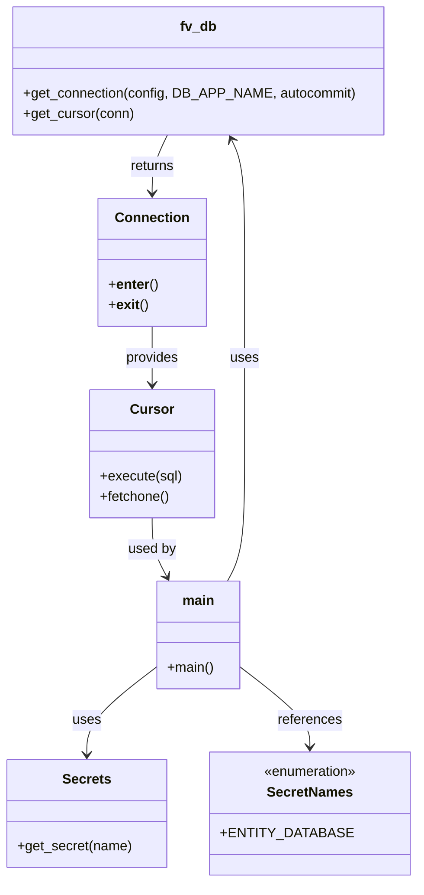

# Diagram: entity_core/entity_service/entity_service_scripts/remove_cur_locs.py


> Auto-generated by Obscura crawlers

## Diagram 1

```mermaid
flowchart TD
Start([Start]) --> InitSECRETS[SECRETS = Secrets()]
InitSECRETS --> GetConfig[config = SECRETS.get_secret(ENTITY_DATABASE)]
GetConfig --> GetConn[fv.db.get_connection(config, DB_APP_NAME="remove_cur_locs", autocommit=True)]
GetConn --> WithConn{"with connection as conn"}
WithConn --> GetCursor[fv.db.get_cursor(conn)]
GetCursor --> WithCursor{"with cursor as cursor"}
WithCursor --> Setup[res = 1\ncount = 0\nb = time.perf_counter()]
Setup --> Loop{res}
Loop -->|yes| Inc[count += 1000]
Inc --> CheckPrint{count % 10000 == 0}
CheckPrint -->|yes| Print[count,time.perf_counter() - b\nb = time.perf_counter()]
CheckPrint -->|no| SkipPrint[skip print]
Print --> Execute[cursor.execute(UPDATE entity ... LIMIT 1000)]
SkipPrint --> Execute
Execute --> Fetch[res = cursor.fetchone()]
Fetch --> Loop
Loop -->|no| End([End])
```

> SVG rendering failed for this diagram.

## Diagram 2



### SVG

<svg id="container" width="466.328125" xmlns="http://www.w3.org/2000/svg" class="classDiagram" height="1032" viewBox="0 0 466.328125 1032" role="graphics-document document" aria-roledescription="class"><style>#container{font-family:"trebuchet ms",verdana,arial,sans-serif;font-size:16px;fill:#333;}@keyframes edge-animation-frame{from{stroke-dashoffset:0;}}@keyframes dash{to{stroke-dashoffset:0;}}#container .edge-animation-slow{stroke-dasharray:9,5!important;stroke-dashoffset:900;animation:dash 50s linear infinite;stroke-linecap:round;}#container .edge-animation-fast{stroke-dasharray:9,5!important;stroke-dashoffset:900;animation:dash 20s linear infinite;stroke-linecap:round;}#container .error-icon{fill:#552222;}#container .error-text{fill:#552222;stroke:#552222;}#container .edge-thickness-normal{stroke-width:1px;}#container .edge-thickness-thick{stroke-width:3.5px;}#container .edge-pattern-solid{stroke-dasharray:0;}#container .edge-thickness-invisible{stroke-width:0;fill:none;}#container .edge-pattern-dashed{stroke-dasharray:3;}#container .edge-pattern-dotted{stroke-dasharray:2;}#container .marker{fill:#333333;stroke:#333333;}#container .marker.cross{stroke:#333333;}#container svg{font-family:"trebuchet ms",verdana,arial,sans-serif;font-size:16px;}#container p{margin:0;}#container g.classGroup text{fill:#9370DB;stroke:none;font-family:"trebuchet ms",verdana,arial,sans-serif;font-size:10px;}#container g.classGroup text .title{font-weight:bolder;}#container .nodeLabel,#container .edgeLabel{color:#131300;}#container .edgeLabel .label rect{fill:#ECECFF;}#container .label text{fill:#131300;}#container .labelBkg{background:#ECECFF;}#container .edgeLabel .label span{background:#ECECFF;}#container .classTitle{font-weight:bolder;}#container .node rect,#container .node circle,#container .node ellipse,#container .node polygon,#container .node path{fill:#ECECFF;stroke:#9370DB;stroke-width:1px;}#container .divider{stroke:#9370DB;stroke-width:1;}#container g.clickable{cursor:pointer;}#container g.classGroup rect{fill:#ECECFF;stroke:#9370DB;}#container g.classGroup line{stroke:#9370DB;stroke-width:1;}#container .classLabel .box{stroke:none;stroke-width:0;fill:#ECECFF;opacity:0.5;}#container .classLabel .label{fill:#9370DB;font-size:10px;}#container .relation{stroke:#333333;stroke-width:1;fill:none;}#container .dashed-line{stroke-dasharray:3;}#container .dotted-line{stroke-dasharray:1 2;}#container #compositionStart,#container .composition{fill:#333333!important;stroke:#333333!important;stroke-width:1;}#container #compositionEnd,#container .composition{fill:#333333!important;stroke:#333333!important;stroke-width:1;}#container #dependencyStart,#container .dependency{fill:#333333!important;stroke:#333333!important;stroke-width:1;}#container #dependencyStart,#container .dependency{fill:#333333!important;stroke:#333333!important;stroke-width:1;}#container #extensionStart,#container .extension{fill:transparent!important;stroke:#333333!important;stroke-width:1;}#container #extensionEnd,#container .extension{fill:transparent!important;stroke:#333333!important;stroke-width:1;}#container #aggregationStart,#container .aggregation{fill:transparent!important;stroke:#333333!important;stroke-width:1;}#container #aggregationEnd,#container .aggregation{fill:transparent!important;stroke:#333333!important;stroke-width:1;}#container #lollipopStart,#container .lollipop{fill:#ECECFF!important;stroke:#333333!important;stroke-width:1;}#container #lollipopEnd,#container .lollipop{fill:#ECECFF!important;stroke:#333333!important;stroke-width:1;}#container .edgeTerminals{font-size:11px;line-height:initial;}#container .classTitleText{text-anchor:middle;font-size:18px;fill:#333;}#container .label-icon{display:inline-block;height:1em;overflow:visible;vertical-align:-0.125em;}#container .node .label-icon path{fill:currentColor;stroke:revert;stroke-width:revert;}#container :root{--mermaid-font-family:"trebuchet ms",verdana,arial,sans-serif;}</style><g><defs><marker id="container_class-aggregationStart" class="marker aggregation class" refX="18" refY="7" markerWidth="190" markerHeight="240" orient="auto"><path d="M 18,7 L9,13 L1,7 L9,1 Z"></path></marker></defs><defs><marker id="container_class-aggregationEnd" class="marker aggregation class" refX="1" refY="7" markerWidth="20" markerHeight="28" orient="auto"><path d="M 18,7 L9,13 L1,7 L9,1 Z"></path></marker></defs><defs><marker id="container_class-extensionStart" class="marker extension class" refX="18" refY="7" markerWidth="190" markerHeight="240" orient="auto"><path d="M 1,7 L18,13 V 1 Z"></path></marker></defs><defs><marker id="container_class-extensionEnd" class="marker extension class" refX="1" refY="7" markerWidth="20" markerHeight="28" orient="auto"><path d="M 1,1 V 13 L18,7 Z"></path></marker></defs><defs><marker id="container_class-compositionStart" class="marker composition class" refX="18" refY="7" markerWidth="190" markerHeight="240" orient="auto"><path d="M 18,7 L9,13 L1,7 L9,1 Z"></path></marker></defs><defs><marker id="container_class-compositionEnd" class="marker composition class" refX="1" refY="7" markerWidth="20" markerHeight="28" orient="auto"><path d="M 18,7 L9,13 L1,7 L9,1 Z"></path></marker></defs><defs><marker id="container_class-dependencyStart" class="marker dependency class" refX="6" refY="7" markerWidth="190" markerHeight="240" orient="auto"><path d="M 5,7 L9,13 L1,7 L9,1 Z"></path></marker></defs><defs><marker id="container_class-dependencyEnd" class="marker dependency class" refX="13" refY="7" markerWidth="20" markerHeight="28" orient="auto"><path d="M 18,7 L9,13 L14,7 L9,1 Z"></path></marker></defs><defs><marker id="container_class-lollipopStart" class="marker lollipop class" refX="13" refY="7" markerWidth="190" markerHeight="240" orient="auto"><circle stroke="black" fill="transparent" cx="7" cy="7" r="6"></circle></marker></defs><defs><marker id="container_class-lollipopEnd" class="marker lollipop class" refX="1" refY="7" markerWidth="190" markerHeight="240" orient="auto"><circle stroke="black" fill="transparent" cx="7" cy="7" r="6"></circle></marker></defs><g class="root"><g class="clusters"></g><g class="edgePaths"><path d="M177.215,781.647L164.424,791.872C151.634,802.098,126.053,822.549,113.263,839.441C100.473,856.333,100.473,869.667,100.473,876.333L100.473,883" id="id_main_Secrets_1" class="edge-thickness-normal edge-pattern-solid relation" style=";;;" data-edge="true" data-et="edge" data-id="id_main_Secrets_1" data-points="W3sieCI6MTc3LjIxNDg0Mzc1LCJ5Ijo3ODEuNjQ2NTEzMjI1Njk1N30seyJ4IjoxMDAuNDcyNjU2MjUsInkiOjg0M30seyJ4IjoxMDAuNDcyNjU2MjUsInkiOjg4OX1d" marker-end="url(#container_class-dependencyEnd)"></path><path d="M273.895,781.647L286.685,791.872C299.475,802.098,325.056,822.549,337.846,837.941C350.637,853.333,350.637,863.667,350.637,868.833L350.637,874" id="id_main_SecretNames_2" class="edge-thickness-normal edge-pattern-solid relation" style=";;;" data-edge="true" data-et="edge" data-id="id_main_SecretNames_2" data-points="W3sieCI6MjczLjg5NDUzMTI1LCJ5Ijo3ODEuNjQ2NTEzMjI1Njk1N30seyJ4IjozNTAuNjM2NzE4NzUsInkiOjg0M30seyJ4IjozNTAuNjM2NzE4NzUsInkiOjg4MH1d" marker-end="url(#container_class-dependencyEnd)"></path><path d="M259.255,680L262.553,673.833C265.852,667.667,272.45,655.333,275.748,630.5C279.047,605.667,279.047,568.333,279.047,531C279.047,493.667,279.047,456.333,279.047,419C279.047,381.667,279.047,344.333,279.047,307C279.047,269.667,279.047,232.333,276.533,208.402C274.018,184.471,268.99,173.943,266.475,168.678L263.961,163.414" id="id_main_fv_db_3" class="edge-thickness-normal edge-pattern-solid relation" style=";;;" data-edge="true" data-et="edge" data-id="id_main_fv_db_3" data-points="W3sieCI6MjU5LjI1NDc2NTYyNSwieSI6NjgwfSx7IngiOjI3OS4wNDY4NzUsInkiOjY0M30seyJ4IjoyNzkuMDQ2ODc1LCJ5Ijo1MzF9LHsieCI6Mjc5LjA0Njg3NSwieSI6NDE5fSx7IngiOjI3OS4wNDY4NzUsInkiOjMwN30seyJ4IjoyNzkuMDQ2ODc1LCJ5IjoxOTV9LHsieCI6MjYxLjM3NTM0ODc3MjMyMTQ0LCJ5IjoxNTh9XQ==" marker-end="url(#container_class-dependencyEnd)"></path><path d="M189.734,158L186.789,164.167C183.844,170.333,177.953,182.667,175.008,194C172.063,205.333,172.063,215.667,172.063,220.833L172.063,226" id="id_fv_db_Connection_4" class="edge-thickness-normal edge-pattern-solid relation" style=";;;" data-edge="true" data-et="edge" data-id="id_fv_db_Connection_4" data-points="W3sieCI6MTg5LjczNDAyNjIyNzY3ODU2LCJ5IjoxNTh9LHsieCI6MTcyLjA2MjUsInkiOjE5NX0seyJ4IjoxNzIuMDYyNSwieSI6MjMyfV0=" marker-end="url(#container_class-dependencyEnd)"></path><path d="M172.063,382L172.063,388.167C172.063,394.333,172.063,406.667,172.063,418C172.063,429.333,172.063,439.667,172.063,444.833L172.063,450" id="id_Connection_Cursor_5" class="edge-thickness-normal edge-pattern-solid relation" style=";;;" data-edge="true" data-et="edge" data-id="id_Connection_Cursor_5" data-points="W3sieCI6MTcyLjA2MjUsInkiOjM4Mn0seyJ4IjoxNzIuMDYyNSwieSI6NDE5fSx7IngiOjE3Mi4wNjI1LCJ5Ijo0NTZ9XQ==" marker-end="url(#container_class-dependencyEnd)"></path><path d="M172.063,606L172.063,612.167C172.063,618.333,172.063,630.667,174.89,642.118C177.717,653.57,183.371,664.14,186.198,669.424L189.025,674.709" id="id_Cursor_main_6" class="edge-thickness-normal edge-pattern-solid relation" style=";;;" data-edge="true" data-et="edge" data-id="id_Cursor_main_6" data-points="W3sieCI6MTcyLjA2MjUsInkiOjYwNn0seyJ4IjoxNzIuMDYyNSwieSI6NjQzfSx7IngiOjE5MS44NTQ2MDkzNzUsInkiOjY4MH1d" marker-end="url(#container_class-dependencyEnd)"></path></g><g class="edgeLabels"><g class="edgeLabel" transform="translate(100.47265625, 843)"><g class="label" data-id="id_main_Secrets_1" transform="translate(-16.4921875, -12)"><foreignObject width="32.984375" height="24"><div xmlns="http://www.w3.org/1999/xhtml" class="labelBkg" style="display: table-cell; white-space: nowrap; line-height: 1.5; max-width: 200px; text-align: center;"><span class="edgeLabel"><p>uses</p></span></div></foreignObject></g></g><g class="edgeLabel" transform="translate(350.63671875, 843)"><g class="label" data-id="id_main_SecretNames_2" transform="translate(-37.828125, -12)"><foreignObject width="75.65625" height="24"><div xmlns="http://www.w3.org/1999/xhtml" class="labelBkg" style="display: table-cell; white-space: nowrap; line-height: 1.5; max-width: 200px; text-align: center;"><span class="edgeLabel"><p>references</p></span></div></foreignObject></g></g><g class="edgeLabel" transform="translate(279.046875, 419)"><g class="label" data-id="id_main_fv_db_3" transform="translate(-16.4921875, -12)"><foreignObject width="32.984375" height="24"><div xmlns="http://www.w3.org/1999/xhtml" class="labelBkg" style="display: table-cell; white-space: nowrap; line-height: 1.5; max-width: 200px; text-align: center;"><span class="edgeLabel"><p>uses</p></span></div></foreignObject></g></g><g class="edgeLabel" transform="translate(172.0625, 195)"><g class="label" data-id="id_fv_db_Connection_4" transform="translate(-26.265625, -12)"><foreignObject width="52.53125" height="24"><div xmlns="http://www.w3.org/1999/xhtml" class="labelBkg" style="display: table-cell; white-space: nowrap; line-height: 1.5; max-width: 200px; text-align: center;"><span class="edgeLabel"><p>returns</p></span></div></foreignObject></g></g><g class="edgeLabel" transform="translate(172.0625, 419)"><g class="label" data-id="id_Connection_Cursor_5" transform="translate(-31.3125, -12)"><foreignObject width="62.625" height="24"><div xmlns="http://www.w3.org/1999/xhtml" class="labelBkg" style="display: table-cell; white-space: nowrap; line-height: 1.5; max-width: 200px; text-align: center;"><span class="edgeLabel"><p>provides</p></span></div></foreignObject></g></g><g class="edgeLabel" transform="translate(172.0625, 643)"><g class="label" data-id="id_Cursor_main_6" transform="translate(-28.3125, -12)"><foreignObject width="56.625" height="24"><div xmlns="http://www.w3.org/1999/xhtml" class="labelBkg" style="display: table-cell; white-space: nowrap; line-height: 1.5; max-width: 200px; text-align: center;"><span class="edgeLabel"><p>used by</p></span></div></foreignObject></g></g></g><g class="nodes"><g class="node default" id="classId-Secrets-0" transform="translate(100.47265625, 952)"><g class="basic label-container"><path d="M-92.47265625 -63 L92.47265625 -63 L92.47265625 63 L-92.47265625 63" stroke="none" stroke-width="0" fill="#ECECFF" style=""></path><path d="M-92.47265625 -63 C-19.49436187236425 -63, 53.4839325052715 -63, 92.47265625 -63 M-92.47265625 -63 C-23.436175853904615 -63, 45.60030454219077 -63, 92.47265625 -63 M92.47265625 -63 C92.47265625 -18.37343324942332, 92.47265625 26.253133501153357, 92.47265625 63 M92.47265625 -63 C92.47265625 -19.005857907451222, 92.47265625 24.988284185097555, 92.47265625 63 M92.47265625 63 C46.966760837088046 63, 1.4608654241760917 63, -92.47265625 63 M92.47265625 63 C23.840306252100035 63, -44.79204374579993 63, -92.47265625 63 M-92.47265625 63 C-92.47265625 26.335822954885273, -92.47265625 -10.328354090229453, -92.47265625 -63 M-92.47265625 63 C-92.47265625 28.09429629187771, -92.47265625 -6.8114074162445775, -92.47265625 -63" stroke="#9370DB" stroke-width="1.3" fill="none" stroke-dasharray="0 0" style=""></path></g><g class="annotation-group text" transform="translate(0, -39)"></g><g class="label-group text" transform="translate(-27.1640625, -39)"><g class="label" style="font-weight: bolder" transform="translate(0,-12)"><foreignObject width="54.328125" height="24"><div xmlns="http://www.w3.org/1999/xhtml" style="display: table-cell; white-space: nowrap; line-height: 1.5; max-width: 103px; text-align: center;"><span class="nodeLabel markdown-node-label" style=""><p>Secrets</p></span></div></foreignObject></g></g><g class="members-group text" transform="translate(-80.47265625, 9)"></g><g class="methods-group text" transform="translate(-80.47265625, 39)"><g class="label" style="" transform="translate(0,-12)"><foreignObject width="133.78125" height="24"><div xmlns="http://www.w3.org/1999/xhtml" style="display: table-cell; white-space: nowrap; line-height: 1.5; max-width: 191px; text-align: center;"><span class="nodeLabel markdown-node-label" style=""><p>+get_secret(name)</p></span></div></foreignObject></g></g><g class="divider" style=""><path d="M-92.47265625 -15 C-18.982409430236174 -15, 54.50783738952765 -15, 92.47265625 -15 M-92.47265625 -15 C-27.60314701903907 -15, 37.26636221192186 -15, 92.47265625 -15" stroke="#9370DB" stroke-width="1.3" fill="none" stroke-dasharray="0 0" style=""></path></g><g class="divider" style=""><path d="M-92.47265625 9 C-36.6683570775631 9, 19.135942094873798 9, 92.47265625 9 M-92.47265625 9 C-20.443824866483993 9, 51.585006517032014 9, 92.47265625 9" stroke="#9370DB" stroke-width="1.3" fill="none" stroke-dasharray="0 0" style=""></path></g></g><g class="node default" id="classId-SecretNames-1" transform="translate(350.63671875, 952)"><g class="basic label-container"><path d="M-107.69140625 -72 L107.69140625 -72 L107.69140625 72 L-107.69140625 72" stroke="none" stroke-width="0" fill="#ECECFF" style=""></path><path d="M-107.69140625 -72 C-30.99810677764286 -72, 45.69519269471428 -72, 107.69140625 -72 M-107.69140625 -72 C-23.669293567156615 -72, 60.35281911568677 -72, 107.69140625 -72 M107.69140625 -72 C107.69140625 -18.814484616697982, 107.69140625 34.371030766604036, 107.69140625 72 M107.69140625 -72 C107.69140625 -41.08945494609789, 107.69140625 -10.178909892195776, 107.69140625 72 M107.69140625 72 C62.79197517743884 72, 17.892544104877686 72, -107.69140625 72 M107.69140625 72 C27.637452010944784 72, -52.41650222811043 72, -107.69140625 72 M-107.69140625 72 C-107.69140625 20.518865298278584, -107.69140625 -30.962269403442832, -107.69140625 -72 M-107.69140625 72 C-107.69140625 19.63276063432243, -107.69140625 -32.73447873135514, -107.69140625 -72" stroke="#9370DB" stroke-width="1.3" fill="none" stroke-dasharray="0 0" style=""></path></g><g class="annotation-group text" transform="translate(-55.5546875, -48)"><g class="label" style="" transform="translate(0,-12)"><foreignObject width="111.109375" height="24"><div xmlns="http://www.w3.org/1999/xhtml" style="display: table-cell; white-space: nowrap; line-height: 1.5; max-width: 161px; text-align: center;"><span class="nodeLabel markdown-node-label" style=""><p>«enumeration»</p></span></div></foreignObject></g></g><g class="label-group text" transform="translate(-48.03125, -24)"><g class="label" style="font-weight: bolder" transform="translate(0,-12)"><foreignObject width="96.0625" height="24"><div xmlns="http://www.w3.org/1999/xhtml" style="display: table-cell; white-space: nowrap; line-height: 1.5; max-width: 145px; text-align: center;"><span class="nodeLabel markdown-node-label" style=""><p>SecretNames</p></span></div></foreignObject></g></g><g class="members-group text" transform="translate(-95.69140625, 24)"><g class="label" style="" transform="translate(0,-12)"><foreignObject width="135.828125" height="24"><div xmlns="http://www.w3.org/1999/xhtml" style="display: table-cell; white-space: nowrap; line-height: 1.5; max-width: 193px; text-align: center;"><span class="nodeLabel markdown-node-label" style=""><p>+ENTITY_DATABASE</p></span></div></foreignObject></g></g><g class="methods-group text" transform="translate(-95.69140625, 72)"></g><g class="divider" style=""><path d="M-107.69140625 0 C-51.3426965040831 0, 5.006013241833799 0, 107.69140625 0 M-107.69140625 0 C-33.08781332907155 0, 41.5157795918569 0, 107.69140625 0" stroke="#9370DB" stroke-width="1.3" fill="none" stroke-dasharray="0 0" style=""></path></g><g class="divider" style=""><path d="M-107.69140625 48 C-61.15905247600851 48, -14.626698702017023 48, 107.69140625 48 M-107.69140625 48 C-39.01491570321461 48, 29.661574843570776 48, 107.69140625 48" stroke="#9370DB" stroke-width="1.3" fill="none" stroke-dasharray="0 0" style=""></path></g></g><g class="node default" id="classId-fv_db-2" transform="translate(225.5546875, 83)"><g class="basic label-container"><path d="M-212.31640625 -75 L212.31640625 -75 L212.31640625 75 L-212.31640625 75" stroke="none" stroke-width="0" fill="#ECECFF" style=""></path><path d="M-212.31640625 -75 C-84.73542014571436 -75, 42.845565958571285 -75, 212.31640625 -75 M-212.31640625 -75 C-99.36528590889608 -75, 13.585834432207832 -75, 212.31640625 -75 M212.31640625 -75 C212.31640625 -40.42337846738353, 212.31640625 -5.846756934767058, 212.31640625 75 M212.31640625 -75 C212.31640625 -34.37325008320542, 212.31640625 6.25349983358916, 212.31640625 75 M212.31640625 75 C94.96285049977158 75, -22.390705250456847 75, -212.31640625 75 M212.31640625 75 C115.3383649345101 75, 18.360323619020193 75, -212.31640625 75 M-212.31640625 75 C-212.31640625 30.654845847058937, -212.31640625 -13.690308305882127, -212.31640625 -75 M-212.31640625 75 C-212.31640625 27.042884094408137, -212.31640625 -20.914231811183726, -212.31640625 -75" stroke="#9370DB" stroke-width="1.3" fill="none" stroke-dasharray="0 0" style=""></path></g><g class="annotation-group text" transform="translate(0, -51)"></g><g class="label-group text" transform="translate(-20.2890625, -51)"><g class="label" style="font-weight: bolder" transform="translate(0,-12)"><foreignObject width="40.578125" height="24"><div xmlns="http://www.w3.org/1999/xhtml" style="display: table-cell; white-space: nowrap; line-height: 1.5; max-width: 90px; text-align: center;"><span class="nodeLabel markdown-node-label" style=""><p>fv_db</p></span></div></foreignObject></g></g><g class="members-group text" transform="translate(-200.31640625, -3)"></g><g class="methods-group text" transform="translate(-200.31640625, 27)"><g class="label" style="" transform="translate(0,-12)"><foreignObject width="380.34375" height="24"><div xmlns="http://www.w3.org/1999/xhtml" style="display: table-cell; white-space: nowrap; line-height: 1.5; max-width: 438px; text-align: center;"><span class="nodeLabel markdown-node-label" style=""><p>+get_connection(config, DB_APP_NAME, autocommit)</p></span></div></foreignObject></g><g class="label" style="" transform="translate(0,12)"><foreignObject width="130.078125" height="24"><div xmlns="http://www.w3.org/1999/xhtml" style="display: table-cell; white-space: nowrap; line-height: 1.5; max-width: 187px; text-align: center;"><span class="nodeLabel markdown-node-label" style=""><p>+get_cursor(conn)</p></span></div></foreignObject></g></g><g class="divider" style=""><path d="M-212.31640625 -27 C-103.59943943486682 -27, 5.117527380266353 -27, 212.31640625 -27 M-212.31640625 -27 C-68.44795767327182 -27, 75.42049090345637 -27, 212.31640625 -27" stroke="#9370DB" stroke-width="1.3" fill="none" stroke-dasharray="0 0" style=""></path></g><g class="divider" style=""><path d="M-212.31640625 -3 C-87.69879685162616 -3, 36.91881254674769 -3, 212.31640625 -3 M-212.31640625 -3 C-106.94975302317945 -3, -1.5830997963589084 -3, 212.31640625 -3" stroke="#9370DB" stroke-width="1.3" fill="none" stroke-dasharray="0 0" style=""></path></g></g><g class="node default" id="classId-Connection-3" transform="translate(172.0625, 307)"><g class="basic label-container"><path d="M-61.39453125 -75 L61.39453125 -75 L61.39453125 75 L-61.39453125 75" stroke="none" stroke-width="0" fill="#ECECFF" style=""></path><path d="M-61.39453125 -75 C-12.58048064918578 -75, 36.23356995162844 -75, 61.39453125 -75 M-61.39453125 -75 C-31.931444181885634 -75, -2.468357113771269 -75, 61.39453125 -75 M61.39453125 -75 C61.39453125 -25.139186532184652, 61.39453125 24.721626935630695, 61.39453125 75 M61.39453125 -75 C61.39453125 -36.34275791951811, 61.39453125 2.3144841609637865, 61.39453125 75 M61.39453125 75 C31.299568066494306 75, 1.2046048829886118 75, -61.39453125 75 M61.39453125 75 C19.574516418609242 75, -22.245498412781515 75, -61.39453125 75 M-61.39453125 75 C-61.39453125 41.13506354421355, -61.39453125 7.2701270884271025, -61.39453125 -75 M-61.39453125 75 C-61.39453125 30.66102256116536, -61.39453125 -13.67795487766928, -61.39453125 -75" stroke="#9370DB" stroke-width="1.3" fill="none" stroke-dasharray="0 0" style=""></path></g><g class="annotation-group text" transform="translate(0, -51)"></g><g class="label-group text" transform="translate(-41.2265625, -51)"><g class="label" style="font-weight: bolder" transform="translate(0,-12)"><foreignObject width="82.453125" height="24"><div xmlns="http://www.w3.org/1999/xhtml" style="display: table-cell; white-space: nowrap; line-height: 1.5; max-width: 132px; text-align: center;"><span class="nodeLabel markdown-node-label" style=""><p>Connection</p></span></div></foreignObject></g></g><g class="members-group text" transform="translate(-49.39453125, -3)"></g><g class="methods-group text" transform="translate(-49.39453125, 27)"><g class="label" style="" transform="translate(0,-12)"><foreignObject width="57.5625" height="24"><div xmlns="http://www.w3.org/1999/xhtml" style="display: table-cell; white-space: nowrap; line-height: 1.5; max-width: 144px; text-align: center;"><span class="nodeLabel markdown-node-label" style=""><p>+<strong>enter</strong>()</p></span></div></foreignObject></g><g class="label" style="" transform="translate(0,12)"><foreignObject width="45.875" height="24"><div xmlns="http://www.w3.org/1999/xhtml" style="display: table-cell; white-space: nowrap; line-height: 1.5; max-width: 134px; text-align: center;"><span class="nodeLabel markdown-node-label" style=""><p>+<strong>exit</strong>()</p></span></div></foreignObject></g></g><g class="divider" style=""><path d="M-61.39453125 -27 C-27.471286143046306 -27, 6.451958963907387 -27, 61.39453125 -27 M-61.39453125 -27 C-28.06140015697813 -27, 5.271730936043738 -27, 61.39453125 -27" stroke="#9370DB" stroke-width="1.3" fill="none" stroke-dasharray="0 0" style=""></path></g><g class="divider" style=""><path d="M-61.39453125 -3 C-22.950090394796952 -3, 15.494350460406096 -3, 61.39453125 -3 M-61.39453125 -3 C-12.711354658331715 -3, 35.97182193333657 -3, 61.39453125 -3" stroke="#9370DB" stroke-width="1.3" fill="none" stroke-dasharray="0 0" style=""></path></g></g><g class="node default" id="classId-Cursor-4" transform="translate(172.0625, 531)"><g class="basic label-container"><path d="M-71.984375 -75 L71.984375 -75 L71.984375 75 L-71.984375 75" stroke="none" stroke-width="0" fill="#ECECFF" style=""></path><path d="M-71.984375 -75 C-35.898569178099315 -75, 0.18723664380136995 -75, 71.984375 -75 M-71.984375 -75 C-40.864438435157396 -75, -9.744501870314785 -75, 71.984375 -75 M71.984375 -75 C71.984375 -34.562148003265804, 71.984375 5.875703993468392, 71.984375 75 M71.984375 -75 C71.984375 -25.95224411119697, 71.984375 23.095511777606063, 71.984375 75 M71.984375 75 C38.52014725270574 75, 5.055919505411481 75, -71.984375 75 M71.984375 75 C28.96570839105327 75, -14.052958217893462 75, -71.984375 75 M-71.984375 75 C-71.984375 20.323254449742976, -71.984375 -34.35349110051405, -71.984375 -75 M-71.984375 75 C-71.984375 27.427272275287258, -71.984375 -20.145455449425484, -71.984375 -75" stroke="#9370DB" stroke-width="1.3" fill="none" stroke-dasharray="0 0" style=""></path></g><g class="annotation-group text" transform="translate(0, -51)"></g><g class="label-group text" transform="translate(-23.90625, -51)"><g class="label" style="font-weight: bolder" transform="translate(0,-12)"><foreignObject width="47.8125" height="24"><div xmlns="http://www.w3.org/1999/xhtml" style="display: table-cell; white-space: nowrap; line-height: 1.5; max-width: 98px; text-align: center;"><span class="nodeLabel markdown-node-label" style=""><p>Cursor</p></span></div></foreignObject></g></g><g class="members-group text" transform="translate(-59.984375, -3)"></g><g class="methods-group text" transform="translate(-59.984375, 27)"><g class="label" style="" transform="translate(0,-12)"><foreignObject width="96.0625" height="24"><div xmlns="http://www.w3.org/1999/xhtml" style="display: table-cell; white-space: nowrap; line-height: 1.5; max-width: 153px; text-align: center;"><span class="nodeLabel markdown-node-label" style=""><p>+execute(sql)</p></span></div></foreignObject></g><g class="label" style="" transform="translate(0,12)"><foreignObject width="82.046875" height="24"><div xmlns="http://www.w3.org/1999/xhtml" style="display: table-cell; white-space: nowrap; line-height: 1.5; max-width: 139px; text-align: center;"><span class="nodeLabel markdown-node-label" style=""><p>+fetchone()</p></span></div></foreignObject></g></g><g class="divider" style=""><path d="M-71.984375 -27 C-17.53908703788877 -27, 36.90620092422246 -27, 71.984375 -27 M-71.984375 -27 C-35.114463339165766 -27, 1.7554483216684673 -27, 71.984375 -27" stroke="#9370DB" stroke-width="1.3" fill="none" stroke-dasharray="0 0" style=""></path></g><g class="divider" style=""><path d="M-71.984375 -3 C-39.17336464395869 -3, -6.362354287917384 -3, 71.984375 -3 M-71.984375 -3 C-24.144678531246228 -3, 23.695017937507544 -3, 71.984375 -3" stroke="#9370DB" stroke-width="1.3" fill="none" stroke-dasharray="0 0" style=""></path></g></g><g class="node default" id="classId-main-5" transform="translate(225.5546875, 743)"><g class="basic label-container"><path d="M-48.33984375 -63 L48.33984375 -63 L48.33984375 63 L-48.33984375 63" stroke="none" stroke-width="0" fill="#ECECFF" style=""></path><path d="M-48.33984375 -63 C-20.39219212310203 -63, 7.555459503795937 -63, 48.33984375 -63 M-48.33984375 -63 C-22.97932805073768 -63, 2.3811876485246373 -63, 48.33984375 -63 M48.33984375 -63 C48.33984375 -34.47344816537405, 48.33984375 -5.946896330748096, 48.33984375 63 M48.33984375 -63 C48.33984375 -15.053525113090863, 48.33984375 32.89294977381827, 48.33984375 63 M48.33984375 63 C26.765591246666634 63, 5.191338743333269 63, -48.33984375 63 M48.33984375 63 C22.164618452210174 63, -4.010606845579652 63, -48.33984375 63 M-48.33984375 63 C-48.33984375 16.92553297532453, -48.33984375 -29.14893404935094, -48.33984375 -63 M-48.33984375 63 C-48.33984375 30.650284886785393, -48.33984375 -1.6994302264292145, -48.33984375 -63" stroke="#9370DB" stroke-width="1.3" fill="none" stroke-dasharray="0 0" style=""></path></g><g class="annotation-group text" transform="translate(0, -39)"></g><g class="label-group text" transform="translate(-18.0234375, -39)"><g class="label" style="font-weight: bolder" transform="translate(0,-12)"><foreignObject width="36.046875" height="24"><div xmlns="http://www.w3.org/1999/xhtml" style="display: table-cell; white-space: nowrap; line-height: 1.5; max-width: 86px; text-align: center;"><span class="nodeLabel markdown-node-label" style=""><p>main</p></span></div></foreignObject></g></g><g class="members-group text" transform="translate(-36.33984375, 9)"></g><g class="methods-group text" transform="translate(-36.33984375, 39)"><g class="label" style="" transform="translate(0,-12)"><foreignObject width="54.65625" height="24"><div xmlns="http://www.w3.org/1999/xhtml" style="display: table-cell; white-space: nowrap; line-height: 1.5; max-width: 112px; text-align: center;"><span class="nodeLabel markdown-node-label" style=""><p>+main()</p></span></div></foreignObject></g></g><g class="divider" style=""><path d="M-48.33984375 -15 C-16.185894017775986 -15, 15.968055714448028 -15, 48.33984375 -15 M-48.33984375 -15 C-16.608543176895793 -15, 15.122757396208414 -15, 48.33984375 -15" stroke="#9370DB" stroke-width="1.3" fill="none" stroke-dasharray="0 0" style=""></path></g><g class="divider" style=""><path d="M-48.33984375 9 C-26.73583733195835 9, -5.131830913916701 9, 48.33984375 9 M-48.33984375 9 C-24.581879094377047 9, -0.8239144387540946 9, 48.33984375 9" stroke="#9370DB" stroke-width="1.3" fill="none" stroke-dasharray="0 0" style=""></path></g></g></g></g></g></svg>
