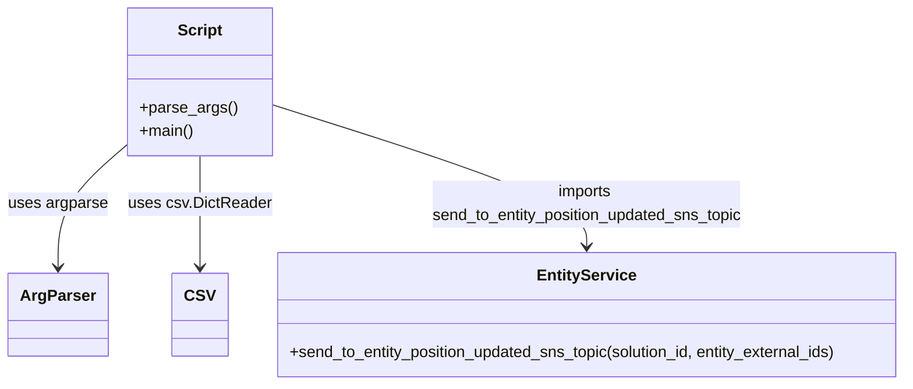

# Diagram: entity_core/entity_service/entity_service_scripts/replay_entities_current_location.py


> Auto-generated by Obscura crawlers

## Diagram 1



### SVG

<svg id="container" width="923.546875" xmlns="http://www.w3.org/2000/svg" class="classDiagram" height="390" viewBox="0 0 923.546875 390" role="graphics-document document" aria-roledescription="class"><style>#container{font-family:"trebuchet ms",verdana,arial,sans-serif;font-size:16px;fill:#333;}@keyframes edge-animation-frame{from{stroke-dashoffset:0;}}@keyframes dash{to{stroke-dashoffset:0;}}#container .edge-animation-slow{stroke-dasharray:9,5!important;stroke-dashoffset:900;animation:dash 50s linear infinite;stroke-linecap:round;}#container .edge-animation-fast{stroke-dasharray:9,5!important;stroke-dashoffset:900;animation:dash 20s linear infinite;stroke-linecap:round;}#container .error-icon{fill:#552222;}#container .error-text{fill:#552222;stroke:#552222;}#container .edge-thickness-normal{stroke-width:1px;}#container .edge-thickness-thick{stroke-width:3.5px;}#container .edge-pattern-solid{stroke-dasharray:0;}#container .edge-thickness-invisible{stroke-width:0;fill:none;}#container .edge-pattern-dashed{stroke-dasharray:3;}#container .edge-pattern-dotted{stroke-dasharray:2;}#container .marker{fill:#333333;stroke:#333333;}#container .marker.cross{stroke:#333333;}#container svg{font-family:"trebuchet ms",verdana,arial,sans-serif;font-size:16px;}#container p{margin:0;}#container g.classGroup text{fill:#9370DB;stroke:none;font-family:"trebuchet ms",verdana,arial,sans-serif;font-size:10px;}#container g.classGroup text .title{font-weight:bolder;}#container .nodeLabel,#container .edgeLabel{color:#131300;}#container .edgeLabel .label rect{fill:#ECECFF;}#container .label text{fill:#131300;}#container .labelBkg{background:#ECECFF;}#container .edgeLabel .label span{background:#ECECFF;}#container .classTitle{font-weight:bolder;}#container .node rect,#container .node circle,#container .node ellipse,#container .node polygon,#container .node path{fill:#ECECFF;stroke:#9370DB;stroke-width:1px;}#container .divider{stroke:#9370DB;stroke-width:1;}#container g.clickable{cursor:pointer;}#container g.classGroup rect{fill:#ECECFF;stroke:#9370DB;}#container g.classGroup line{stroke:#9370DB;stroke-width:1;}#container .classLabel .box{stroke:none;stroke-width:0;fill:#ECECFF;opacity:0.5;}#container .classLabel .label{fill:#9370DB;font-size:10px;}#container .relation{stroke:#333333;stroke-width:1;fill:none;}#container .dashed-line{stroke-dasharray:3;}#container .dotted-line{stroke-dasharray:1 2;}#container #compositionStart,#container .composition{fill:#333333!important;stroke:#333333!important;stroke-width:1;}#container #compositionEnd,#container .composition{fill:#333333!important;stroke:#333333!important;stroke-width:1;}#container #dependencyStart,#container .dependency{fill:#333333!important;stroke:#333333!important;stroke-width:1;}#container #dependencyStart,#container .dependency{fill:#333333!important;stroke:#333333!important;stroke-width:1;}#container #extensionStart,#container .extension{fill:transparent!important;stroke:#333333!important;stroke-width:1;}#container #extensionEnd,#container .extension{fill:transparent!important;stroke:#333333!important;stroke-width:1;}#container #aggregationStart,#container .aggregation{fill:transparent!important;stroke:#333333!important;stroke-width:1;}#container #aggregationEnd,#container .aggregation{fill:transparent!important;stroke:#333333!important;stroke-width:1;}#container #lollipopStart,#container .lollipop{fill:#ECECFF!important;stroke:#333333!important;stroke-width:1;}#container #lollipopEnd,#container .lollipop{fill:#ECECFF!important;stroke:#333333!important;stroke-width:1;}#container .edgeTerminals{font-size:11px;line-height:initial;}#container .classTitleText{text-anchor:middle;font-size:18px;fill:#333;}#container .label-icon{display:inline-block;height:1em;overflow:visible;vertical-align:-0.125em;}#container .node .label-icon path{fill:currentColor;stroke:revert;stroke-width:revert;}#container :root{--mermaid-font-family:"trebuchet ms",verdana,arial,sans-serif;}</style><g><defs><marker id="container_class-aggregationStart" class="marker aggregation class" refX="18" refY="7" markerWidth="190" markerHeight="240" orient="auto"><path d="M 18,7 L9,13 L1,7 L9,1 Z"></path></marker></defs><defs><marker id="container_class-aggregationEnd" class="marker aggregation class" refX="1" refY="7" markerWidth="20" markerHeight="28" orient="auto"><path d="M 18,7 L9,13 L1,7 L9,1 Z"></path></marker></defs><defs><marker id="container_class-extensionStart" class="marker extension class" refX="18" refY="7" markerWidth="190" markerHeight="240" orient="auto"><path d="M 1,7 L18,13 V 1 Z"></path></marker></defs><defs><marker id="container_class-extensionEnd" class="marker extension class" refX="1" refY="7" markerWidth="20" markerHeight="28" orient="auto"><path d="M 1,1 V 13 L18,7 Z"></path></marker></defs><defs><marker id="container_class-compositionStart" class="marker composition class" refX="18" refY="7" markerWidth="190" markerHeight="240" orient="auto"><path d="M 18,7 L9,13 L1,7 L9,1 Z"></path></marker></defs><defs><marker id="container_class-compositionEnd" class="marker composition class" refX="1" refY="7" markerWidth="20" markerHeight="28" orient="auto"><path d="M 18,7 L9,13 L1,7 L9,1 Z"></path></marker></defs><defs><marker id="container_class-dependencyStart" class="marker dependency class" refX="6" refY="7" markerWidth="190" markerHeight="240" orient="auto"><path d="M 5,7 L9,13 L1,7 L9,1 Z"></path></marker></defs><defs><marker id="container_class-dependencyEnd" class="marker dependency class" refX="13" refY="7" markerWidth="20" markerHeight="28" orient="auto"><path d="M 18,7 L9,13 L14,7 L9,1 Z"></path></marker></defs><defs><marker id="container_class-lollipopStart" class="marker lollipop class" refX="13" refY="7" markerWidth="190" markerHeight="240" orient="auto"><circle stroke="black" fill="transparent" cx="7" cy="7" r="6"></circle></marker></defs><defs><marker id="container_class-lollipopEnd" class="marker lollipop class" refX="1" refY="7" markerWidth="190" markerHeight="240" orient="auto"><circle stroke="black" fill="transparent" cx="7" cy="7" r="6"></circle></marker></defs><g class="root"><g class="clusters"></g><g class="edgePaths"><path d="M128.496,145.36L116.777,155.633C105.057,165.906,81.618,186.453,69.899,207.393C58.18,228.333,58.18,249.667,58.18,260.333L58.18,271" id="id_Script_ArgParser_1" class="edge-thickness-normal edge-pattern-solid relation" style=";;;" data-edge="true" data-et="edge" data-id="id_Script_ArgParser_1" data-points="W3sieCI6MTI4LjQ5NjA5Mzc1LCJ5IjoxNDUuMzU5NTQ5MzIwNjY3MTh9LHsieCI6NTguMTc5Njg3NSwieSI6MjA3fSx7IngiOjU4LjE3OTY4NzUsInkiOjI3N31d" marker-end="url(#container_class-dependencyEnd)"></path><path d="M199.633,158L199.633,166.167C199.633,174.333,199.633,190.667,199.633,209.5C199.633,228.333,199.633,249.667,199.633,260.333L199.633,271" id="id_Script_CSV_2" class="edge-thickness-normal edge-pattern-solid relation" style=";;;" data-edge="true" data-et="edge" data-id="id_Script_CSV_2" data-points="W3sieCI6MTk5LjYzMjgxMjUsInkiOjE1OH0seyJ4IjoxOTkuNjMyODEyNSwieSI6MjA3fSx7IngiOjE5OS42MzI4MTI1LCJ5IjoyNzd9XQ==" marker-end="url(#container_class-dependencyEnd)"></path><path d="M270.77,105.292L324.865,122.243C378.96,139.194,487.15,173.097,541.245,197.215C595.34,221.333,595.34,235.667,595.34,242.833L595.34,250" id="id_Script_EntityService_3" class="edge-thickness-normal edge-pattern-solid relation" style=";;;" data-edge="true" data-et="edge" data-id="id_Script_EntityService_3" data-points="W3sieCI6MjcwLjc2OTUzMTI1LCJ5IjoxMDUuMjkxNjI1OTQ2NDM2ODV9LHsieCI6NTk1LjMzOTg0Mzc1LCJ5IjoyMDd9LHsieCI6NTk1LjMzOTg0Mzc1LCJ5IjoyNTZ9XQ==" marker-end="url(#container_class-dependencyEnd)"></path></g><g class="edgeLabels"><g class="edgeLabel" transform="translate(58.1796875, 207)"><g class="label" data-id="id_Script_ArgParser_1" transform="translate(-50.1796875, -12)"><foreignObject width="100.359375" height="24"><div xmlns="http://www.w3.org/1999/xhtml" class="labelBkg" style="display: table-cell; white-space: nowrap; line-height: 1.5; max-width: 200px; text-align: center;"><span class="edgeLabel"><p>uses argparse</p></span></div></foreignObject></g></g><g class="edgeLabel" transform="translate(199.6328125, 207)"><g class="label" data-id="id_Script_CSV_2" transform="translate(-71.2734375, -12)"><foreignObject width="142.546875" height="24"><div xmlns="http://www.w3.org/1999/xhtml" class="labelBkg" style="display: table-cell; white-space: nowrap; line-height: 1.5; max-width: 200px; text-align: center;"><span class="edgeLabel"><p>uses csv.DictReader</p></span></div></foreignObject></g></g><g class="edgeLabel" transform="translate(595.33984375, 207)"><g class="label" data-id="id_Script_EntityService_3" transform="translate(-160.546875, -24)"><foreignObject width="321.09375" height="48"><div xmlns="http://www.w3.org/1999/xhtml" class="labelBkg" style="display: table; white-space: break-spaces; line-height: 1.5; max-width: 200px; text-align: center; width: 200px;"><span class="edgeLabel"><p>imports send_to_entity_position_updated_sns_topic</p></span></div></foreignObject></g></g></g><g class="nodes"><g class="node default" id="classId-Script-0" transform="translate(199.6328125, 83)"><g class="basic label-container"><path d="M-71.13671875 -75 L71.13671875 -75 L71.13671875 75 L-71.13671875 75" stroke="none" stroke-width="0" fill="#ECECFF" style=""></path><path d="M-71.13671875 -75 C-33.500338206182015 -75, 4.1360423376359705 -75, 71.13671875 -75 M-71.13671875 -75 C-23.94483459320869 -75, 23.24704956358262 -75, 71.13671875 -75 M71.13671875 -75 C71.13671875 -16.35829680881627, 71.13671875 42.28340638236746, 71.13671875 75 M71.13671875 -75 C71.13671875 -26.50185012925889, 71.13671875 21.99629974148222, 71.13671875 75 M71.13671875 75 C22.821634300127414 75, -25.493450149745172 75, -71.13671875 75 M71.13671875 75 C16.05357817169942 75, -39.02956240660116 75, -71.13671875 75 M-71.13671875 75 C-71.13671875 27.69102216437429, -71.13671875 -19.617955671251423, -71.13671875 -75 M-71.13671875 75 C-71.13671875 34.04436717626146, -71.13671875 -6.91126564747708, -71.13671875 -75" stroke="#9370DB" stroke-width="1.3" fill="none" stroke-dasharray="0 0" style=""></path></g><g class="annotation-group text" transform="translate(0, -51)"></g><g class="label-group text" transform="translate(-21.7421875, -51)"><g class="label" style="font-weight: bolder" transform="translate(0,-12)"><foreignObject width="43.484375" height="24"><div xmlns="http://www.w3.org/1999/xhtml" style="display: table-cell; white-space: nowrap; line-height: 1.5; max-width: 93px; text-align: center;"><span class="nodeLabel markdown-node-label" style=""><p>Script</p></span></div></foreignObject></g></g><g class="members-group text" transform="translate(-59.13671875, -3)"></g><g class="methods-group text" transform="translate(-59.13671875, 27)"><g class="label" style="" transform="translate(0,-12)"><foreignObject width="96.53125" height="24"><div xmlns="http://www.w3.org/1999/xhtml" style="display: table-cell; white-space: nowrap; line-height: 1.5; max-width: 154px; text-align: center;"><span class="nodeLabel markdown-node-label" style=""><p>+parse_args()</p></span></div></foreignObject></g><g class="label" style="" transform="translate(0,12)"><foreignObject width="54.65625" height="24"><div xmlns="http://www.w3.org/1999/xhtml" style="display: table-cell; white-space: nowrap; line-height: 1.5; max-width: 112px; text-align: center;"><span class="nodeLabel markdown-node-label" style=""><p>+main()</p></span></div></foreignObject></g></g><g class="divider" style=""><path d="M-71.13671875 -27 C-26.485697358361243 -27, 18.165324033277514 -27, 71.13671875 -27 M-71.13671875 -27 C-19.207404044715112 -27, 32.721910660569776 -27, 71.13671875 -27" stroke="#9370DB" stroke-width="1.3" fill="none" stroke-dasharray="0 0" style=""></path></g><g class="divider" style=""><path d="M-71.13671875 -3 C-28.77945254756399 -3, 13.577813654872017 -3, 71.13671875 -3 M-71.13671875 -3 C-21.956637623455848 -3, 27.223443503088305 -3, 71.13671875 -3" stroke="#9370DB" stroke-width="1.3" fill="none" stroke-dasharray="0 0" style=""></path></g></g><g class="node default" id="classId-ArgParser-1" transform="translate(58.1796875, 319)"><g class="basic label-container"><path d="M-47.609375 -42 L47.609375 -42 L47.609375 42 L-47.609375 42" stroke="none" stroke-width="0" fill="#ECECFF" style=""></path><path d="M-47.609375 -42 C-10.460716599864561 -42, 26.687941800270877 -42, 47.609375 -42 M-47.609375 -42 C-20.33275951683256 -42, 6.94385596633488 -42, 47.609375 -42 M47.609375 -42 C47.609375 -21.25197396721151, 47.609375 -0.5039479344230173, 47.609375 42 M47.609375 -42 C47.609375 -9.820223653132288, 47.609375 22.359552693735424, 47.609375 42 M47.609375 42 C22.42008147291598 42, -2.7692120541680367 42, -47.609375 42 M47.609375 42 C24.650616283754907 42, 1.691857567509814 42, -47.609375 42 M-47.609375 42 C-47.609375 10.304209466580105, -47.609375 -21.39158106683979, -47.609375 -42 M-47.609375 42 C-47.609375 9.24415468645934, -47.609375 -23.51169062708132, -47.609375 -42" stroke="#9370DB" stroke-width="1.3" fill="none" stroke-dasharray="0 0" style=""></path></g><g class="annotation-group text" transform="translate(0, -18)"></g><g class="label-group text" transform="translate(-35.609375, -18)"><g class="label" style="font-weight: bolder" transform="translate(0,-12)"><foreignObject width="71.21875" height="24"><div xmlns="http://www.w3.org/1999/xhtml" style="display: table-cell; white-space: nowrap; line-height: 1.5; max-width: 120px; text-align: center;"><span class="nodeLabel markdown-node-label" style=""><p>ArgParser</p></span></div></foreignObject></g></g><g class="members-group text" transform="translate(-35.609375, 30)"></g><g class="methods-group text" transform="translate(-35.609375, 60)"></g><g class="divider" style=""><path d="M-47.609375 6 C-10.860853504441941 6, 25.887667991116118 6, 47.609375 6 M-47.609375 6 C-23.177377155509667 6, 1.2546206889806655 6, 47.609375 6" stroke="#9370DB" stroke-width="1.3" fill="none" stroke-dasharray="0 0" style=""></path></g><g class="divider" style=""><path d="M-47.609375 24 C-22.35293758708365 24, 2.9034998258326965 24, 47.609375 24 M-47.609375 24 C-9.937515387521735 24, 27.73434422495653 24, 47.609375 24" stroke="#9370DB" stroke-width="1.3" fill="none" stroke-dasharray="0 0" style=""></path></g></g><g class="node default" id="classId-CSV-2" transform="translate(199.6328125, 319)"><g class="basic label-container"><path d="M-25.5 -42 L25.5 -42 L25.5 42 L-25.5 42" stroke="none" stroke-width="0" fill="#ECECFF" style=""></path><path d="M-25.5 -42 C-8.774553837811244 -42, 7.950892324377513 -42, 25.5 -42 M-25.5 -42 C-14.045813517847161 -42, -2.591627035694323 -42, 25.5 -42 M25.5 -42 C25.5 -16.70445087244322, 25.5 8.591098255113558, 25.5 42 M25.5 -42 C25.5 -16.979337807279922, 25.5 8.041324385440156, 25.5 42 M25.5 42 C8.376974286706247 42, -8.746051426587506 42, -25.5 42 M25.5 42 C13.48550521158524 42, 1.4710104231704797 42, -25.5 42 M-25.5 42 C-25.5 11.994967500670072, -25.5 -18.010064998659857, -25.5 -42 M-25.5 42 C-25.5 16.840988155369413, -25.5 -8.318023689261175, -25.5 -42" stroke="#9370DB" stroke-width="1.3" fill="none" stroke-dasharray="0 0" style=""></path></g><g class="annotation-group text" transform="translate(0, -18)"></g><g class="label-group text" transform="translate(-13.5, -18)"><g class="label" style="font-weight: bolder" transform="translate(0,-12)"><foreignObject width="27" height="24"><div xmlns="http://www.w3.org/1999/xhtml" style="display: table-cell; white-space: nowrap; line-height: 1.5; max-width: 76px; text-align: center;"><span class="nodeLabel markdown-node-label" style=""><p>CSV</p></span></div></foreignObject></g></g><g class="members-group text" transform="translate(-13.5, 30)"></g><g class="methods-group text" transform="translate(-13.5, 60)"></g><g class="divider" style=""><path d="M-25.5 6 C-13.565266747053238 6, -1.6305334941064764 6, 25.5 6 M-25.5 6 C-11.898546679969133 6, 1.7029066400617339 6, 25.5 6" stroke="#9370DB" stroke-width="1.3" fill="none" stroke-dasharray="0 0" style=""></path></g><g class="divider" style=""><path d="M-25.5 24 C-5.824727187353417 24, 13.850545625293165 24, 25.5 24 M-25.5 24 C-7.079270263290272 24, 11.341459473419455 24, 25.5 24" stroke="#9370DB" stroke-width="1.3" fill="none" stroke-dasharray="0 0" style=""></path></g></g><g class="node default" id="classId-EntityService-3" transform="translate(595.33984375, 319)"><g class="basic label-container"><path d="M-320.20703125 -63 L320.20703125 -63 L320.20703125 63 L-320.20703125 63" stroke="none" stroke-width="0" fill="#ECECFF" style=""></path><path d="M-320.20703125 -63 C-76.09986799907662 -63, 168.00729525184676 -63, 320.20703125 -63 M-320.20703125 -63 C-96.55187343128907 -63, 127.10328438742187 -63, 320.20703125 -63 M320.20703125 -63 C320.20703125 -21.83820615236123, 320.20703125 19.32358769527754, 320.20703125 63 M320.20703125 -63 C320.20703125 -33.14768915599749, 320.20703125 -3.2953783119949804, 320.20703125 63 M320.20703125 63 C87.26961747935471 63, -145.66779629129059 63, -320.20703125 63 M320.20703125 63 C107.75531832175506 63, -104.69639460648989 63, -320.20703125 63 M-320.20703125 63 C-320.20703125 30.213725281949472, -320.20703125 -2.572549436101056, -320.20703125 -63 M-320.20703125 63 C-320.20703125 32.9841992947908, -320.20703125 2.9683985895816036, -320.20703125 -63" stroke="#9370DB" stroke-width="1.3" fill="none" stroke-dasharray="0 0" style=""></path></g><g class="annotation-group text" transform="translate(0, -39)"></g><g class="label-group text" transform="translate(-47.9296875, -39)"><g class="label" style="font-weight: bolder" transform="translate(0,-12)"><foreignObject width="95.859375" height="24"><div xmlns="http://www.w3.org/1999/xhtml" style="display: table-cell; white-space: nowrap; line-height: 1.5; max-width: 144px; text-align: center;"><span class="nodeLabel markdown-node-label" style=""><p>EntityService</p></span></div></foreignObject></g></g><g class="members-group text" transform="translate(-308.20703125, 9)"></g><g class="methods-group text" transform="translate(-308.20703125, 39)"><g class="label" style="" transform="translate(0,-12)"><foreignObject width="568.484375" height="24"><div xmlns="http://www.w3.org/1999/xhtml" style="display: table-cell; white-space: nowrap; line-height: 1.5; max-width: 626px; text-align: center;"><span class="nodeLabel markdown-node-label" style=""><p>+send_to_entity_position_updated_sns_topic(solution_id, entity_external_ids)</p></span></div></foreignObject></g></g><g class="divider" style=""><path d="M-320.20703125 -15 C-133.79426543245216 -15, 52.61850038509567 -15, 320.20703125 -15 M-320.20703125 -15 C-103.72714492360885 -15, 112.7527414027823 -15, 320.20703125 -15" stroke="#9370DB" stroke-width="1.3" fill="none" stroke-dasharray="0 0" style=""></path></g><g class="divider" style=""><path d="M-320.20703125 9 C-144.7587271349045 9, 30.68957698019102 9, 320.20703125 9 M-320.20703125 9 C-118.42520443129249 9, 83.35662238741503 9, 320.20703125 9" stroke="#9370DB" stroke-width="1.3" fill="none" stroke-dasharray="0 0" style=""></path></g></g></g></g></g></svg>

## Diagram 2

```mermaid
flowchart TD
    Start[Start: script execution] --> Parse[call parse_args()]
    Parse --> CheckFile{args.file present?}
    CheckFile -- No --> EndNoFile[End (no file provided)]
    CheckFile -- Yes --> OpenFile[Open CSV file]
    OpenFile --> ReadRows[Read rows with csv.DictReader]
    ReadRows --> BuildVins[Build vins dict: solution_id -> list(external_id)]
    BuildVins --> ForEachSolution[For each solution_id in vins]
    ForEachSolution --> Chunk[Chunk entities into batches of 10]
    Chunk --> Send[send_to_entity_position_updated_sns_topic(solution_id, batch)]
    Send --> Print[print "Sent N messages for solution_id"]
    Print --> NextBatch{more batches?}
    NextBatch -- Yes --> Chunk
    NextBatch -- No --> NextSolution{more solutions?}
    NextSolution -- Yes --> ForEachSolution
    NextSolution -- No --> End[End]
```

> SVG rendering failed for this diagram.
