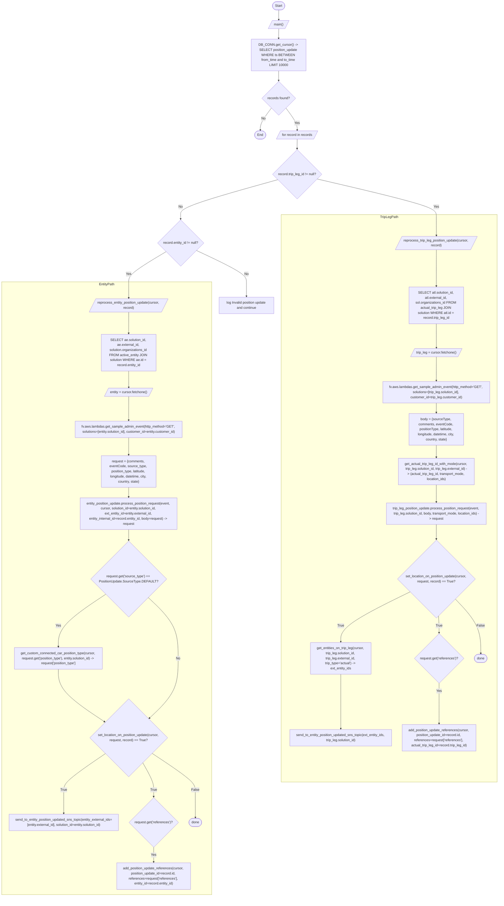
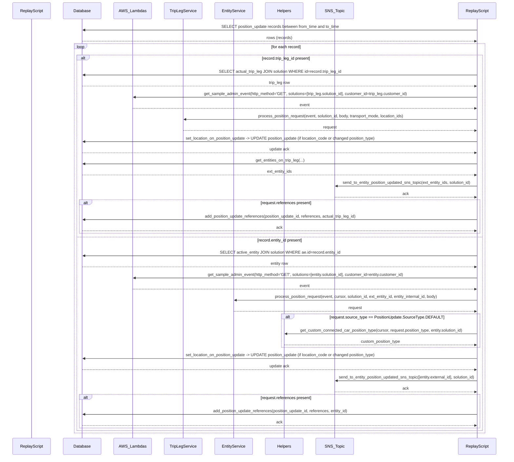

# Diagram: entity_core/entity_service/entity_service_scripts/replay_position_updates.py

> Auto-generated by Obscura crawlers

## Diagram 1

### SVG

<svg id="container" width="2397.43701171875" xmlns="http://www.w3.org/2000/svg" class="flowchart" height="4279.625" viewBox="0 0 2397.43701171875 4279.625" role="graphics-document document" aria-roledescription="flowchart-v2"><g><marker id="container_flowchart-v2-pointEnd" class="marker flowchart-v2" viewBox="0 0 10 10" refX="5" refY="5" markerUnits="userSpaceOnUse" markerWidth="8" markerHeight="8" orient="auto"><path d="M 0 0 L 10 5 L 0 10 z" class="arrowMarkerPath" style="stroke-width: 1; stroke-dasharray: 1, 0;"></path></marker><marker id="container_flowchart-v2-pointStart" class="marker flowchart-v2" viewBox="0 0 10 10" refX="4.5" refY="5" markerUnits="userSpaceOnUse" markerWidth="8" markerHeight="8" orient="auto"><path d="M 0 5 L 10 10 L 10 0 z" class="arrowMarkerPath" style="stroke-width: 1; stroke-dasharray: 1, 0;"></path></marker><marker id="container_flowchart-v2-circleEnd" class="marker flowchart-v2" viewBox="0 0 10 10" refX="11" refY="5" markerUnits="userSpaceOnUse" markerWidth="11" markerHeight="11" orient="auto"><circle cx="5" cy="5" r="5" class="arrowMarkerPath" style="stroke-width: 1; stroke-dasharray: 1, 0;"></circle></marker><marker id="container_flowchart-v2-circleStart" class="marker flowchart-v2" viewBox="0 0 10 10" refX="-1" refY="5" markerUnits="userSpaceOnUse" markerWidth="11" markerHeight="11" orient="auto"><circle cx="5" cy="5" r="5" class="arrowMarkerPath" style="stroke-width: 1; stroke-dasharray: 1, 0;"></circle></marker><marker id="container_flowchart-v2-crossEnd" class="marker cross flowchart-v2" viewBox="0 0 11 11" refX="12" refY="5.2" markerUnits="userSpaceOnUse" markerWidth="11" markerHeight="11" orient="auto"><path d="M 1,1 l 9,9 M 10,1 l -9,9" class="arrowMarkerPath" style="stroke-width: 2; stroke-dasharray: 1, 0;"></path></marker><marker id="container_flowchart-v2-crossStart" class="marker cross flowchart-v2" viewBox="0 0 11 11" refX="-1" refY="5.2" markerUnits="userSpaceOnUse" markerWidth="11" markerHeight="11" orient="auto"><path d="M 1,1 l 9,9 M 10,1 l -9,9" class="arrowMarkerPath" style="stroke-width: 2; stroke-dasharray: 1, 0;"></path></marker><g class="root"><g class="clusters"><g class="cluster" id="EntityPath" data-look="classic"><rect style="" x="8" y="1344.78125" width="1012.5798244476318" height="2926.84375"></rect><g class="cluster-label" transform="translate(477.3367872238159, 1344.78125)"><foreignObject width="73.90625" height="24">

EntityPath

</foreignObject></g></g><g class="cluster" id="TripLegPath" data-look="classic"><rect style="" x="1350.5798244476318" y="1022.359375" width="1038.8571681976318" height="2714.5625"></rect><g class="cluster-label" transform="translate(1827.5709085464478, 1022.359375)"><foreignObject width="84.875" height="24">

TripLegPath

</foreignObject></g></g></g><g class="edgePaths"><path d="M1344.974,47.5L1344.89,51.583C1344.807,55.667,1344.64,63.833,1344.627,71.5C1344.614,79.167,1344.755,86.334,1344.825,89.917L1344.895,93.501" id="L_Start_Main_0" class="edge-thickness-normal edge-pattern-solid edge-thickness-normal edge-pattern-solid flowchart-link" style=";" data-edge="true" data-et="edge" data-id="L_Start_Main_0" data-points="W3sieCI6MTM0NC45NzM3NTk2NTExODQsInkiOjQ3LjV9LHsieCI6MTM0NC40NzM3NTk2NTExODQsInkiOjcyfSx7IngiOjEzNDQuOTczNzU5NjUxMTg0LCJ5Ijo5Ny41fV0=" marker-end="url(#container_flowchart-v2-pointEnd)"></path><path d="M1344.974,136.5L1344.89,140.583C1344.807,144.667,1344.64,152.833,1344.557,160.417C1344.474,168,1344.474,175,1344.474,178.5L1344.474,182" id="L_Main_QueryDB_0" class="edge-thickness-normal edge-pattern-solid edge-thickness-normal edge-pattern-solid flowchart-link" style=";" data-edge="true" data-et="edge" data-id="L_Main_QueryDB_0" data-points="W3sieCI6MTM0NC45NzM3NTk2NTExODQsInkiOjEzNi41fSx7IngiOjEzNDQuNDczNzU5NjUxMTg0LCJ5IjoxNjF9LHsieCI6MTM0NC40NzM3NTk2NTExODQsInkiOjE4Nn1d" marker-end="url(#container_flowchart-v2-pointEnd)"></path><path d="M1344.474,336L1344.474,340.167C1344.474,344.333,1344.474,352.667,1344.474,360.333C1344.474,368,1344.474,375,1344.474,378.5L1344.474,382" id="L_QueryDB_Records_0" class="edge-thickness-normal edge-pattern-solid edge-thickness-normal edge-pattern-solid flowchart-link" style=";" data-edge="true" data-et="edge" data-id="L_QueryDB_Records_0" data-points="W3sieCI6MTM0NC40NzM3NTk2NTExODQsInkiOjMzNn0seyJ4IjoxMzQ0LjQ3Mzc1OTY1MTE4NCwieSI6MzYxfSx7IngiOjEzNDQuNDczNzU5NjUxMTg0LCJ5IjozODZ9XQ==" marker-end="url(#container_flowchart-v2-pointEnd)"></path><path d="M1309.753,513.498L1300.806,525.452C1291.86,537.405,1273.966,561.312,1265.094,578.849C1256.221,596.386,1256.37,607.552,1256.445,613.136L1256.519,618.719" id="L_Records_End_0" class="edge-thickness-normal edge-pattern-solid edge-thickness-normal edge-pattern-solid flowchart-link" style=";" data-edge="true" data-et="edge" data-id="L_Records_End_0" data-points="W3sieCI6MTMwOS43NTMxNzQ3NDY1OTY0LCJ5Ijo1MTMuNDk4MTY1MDk1NDEyMn0seyJ4IjoxMjU2LjA3MjUxOTMwMjM2ODIsInkiOjU4NS4yMTg3NX0seyJ4IjoxMjU2LjU3MjUxOTMwMjM2ODIsInkiOjYyMi43MTg3NX1d" marker-end="url(#container_flowchart-v2-pointEnd)"></path><path d="M1379.194,513.498L1388.141,525.452C1397.088,537.405,1414.981,561.312,1424.003,578.849C1433.024,596.386,1433.173,607.552,1433.247,613.136L1433.322,618.719" id="L_Records_ForEach_0" class="edge-thickness-normal edge-pattern-solid edge-thickness-normal edge-pattern-solid flowchart-link" style=";" data-edge="true" data-et="edge" data-id="L_Records_ForEach_0" data-points="W3sieCI6MTM3OS4xOTQzNDQ1NTU3NzIsInkiOjUxMy40OTgxNjUwOTU0MTIxfSx7IngiOjE0MzIuODc1LCJ5Ijo1ODUuMjE4NzV9LHsieCI6MTQzMy4zNzUsInkiOjYyMi43MTg3NX1d" marker-end="url(#container_flowchart-v2-pointEnd)"></path><path d="M1433.375,661.719L1433.292,665.802C1433.208,669.885,1433.042,678.052,1432.958,685.635C1432.875,693.219,1432.875,700.219,1432.875,703.719L1432.875,707.219" id="L_ForEach_CheckTripLeg_0" class="edge-thickness-normal edge-pattern-solid edge-thickness-normal edge-pattern-solid flowchart-link" style=";" data-edge="true" data-et="edge" data-id="L_ForEach_CheckTripLeg_0" data-points="W3sieCI6MTQzMy4zNzUsInkiOjY2MS43MTg3NX0seyJ4IjoxNDMyLjg3NSwieSI6Njg2LjIxODc1fSx7IngiOjE0MzIuODc1LCJ5Ijo3MTEuMjE4NzV9XQ==" marker-end="url(#container_flowchart-v2-pointEnd)"></path><path d="M1529.04,852.194L1624.302,874.388C1719.563,896.582,1910.086,940.971,2005.347,969.332C2100.609,997.693,2100.609,1010.026,2100.689,1033.145C2100.769,1056.263,2100.93,1090.167,2101.01,1107.119L2101.09,1124.07" id="L_CheckTripLeg_ReprocessTrip_0" class="edge-thickness-normal edge-pattern-solid edge-thickness-normal edge-pattern-solid flowchart-link" style=";" data-edge="true" data-et="edge" data-id="L_CheckTripLeg_ReprocessTrip_0" data-points="W3sieCI6MTUyOS4wNDA0NDU2MDY3MDUxLCJ5Ijo4NTIuMTkzOTI5MzkzMjk0Nn0seyJ4IjoyMTAwLjYwODg2NzY0NTI2MzcsInkiOjk4NS4zNTkzNzV9LHsieCI6MjEwMC42MDg4Njc2NDUyNjM3LCJ5IjoxMDIyLjM1OTM3NX0seyJ4IjoyMTAxLjEwODg2NzY0NTI2MzcsInkiOjExMjguMDcwMzEyNX1d" marker-end="url(#container_flowchart-v2-pointEnd)"></path><path d="M1340.03,855.515L1261.929,877.156C1183.827,898.796,1027.623,942.078,949.521,969.885C871.419,997.693,871.419,1010.026,871.419,1019.693C871.419,1029.359,871.419,1036.359,871.419,1039.859L871.419,1043.359" id="L_CheckTripLeg_CheckEntity_0" class="edge-thickness-normal edge-pattern-solid edge-thickness-normal edge-pattern-solid flowchart-link" style=";" data-edge="true" data-et="edge" data-id="L_CheckTripLeg_CheckEntity_0" data-points="W3sieCI6MTM0MC4wMzA0MTM0NjQ4ODgyLCJ5Ijo4NTUuNTE0Nzg4NDY0ODg4Mn0seyJ4Ijo4NzEuNDE5MDcyMTUxMTg0MSwieSI6OTg1LjM1OTM3NX0seyJ4Ijo4NzEuNDE5MDcyMTUxMTg0MSwieSI6MTAyMi4zNTkzNzV9LHsieCI6ODcxLjQxOTA3MjE1MTE4NDEsInkiOjEwNDcuMzU5Mzc1fV0=" marker-end="url(#container_flowchart-v2-pointEnd)"></path><path d="M801.564,1200.926L771.842,1218.736C742.12,1236.545,682.675,1272.163,652.953,1296.139C623.231,1320.115,623.231,1332.448,623.31,1351.448C623.39,1370.448,623.548,1396.115,623.627,1408.948L623.706,1421.781" id="L_CheckEntity_ReprocessEntity_0" class="edge-thickness-normal edge-pattern-solid edge-thickness-normal edge-pattern-solid flowchart-link" style=";" data-edge="true" data-et="edge" data-id="L_CheckEntity_ReprocessEntity_0" data-points="W3sieCI6ODAxLjU2NDIyNTM3NjUxNzQsInkiOjEyMDAuOTI2NDAzMjI1MzMzNH0seyJ4Ijo2MjMuMjMxMDY0Nzk2NDQ3OCwieSI6MTMwNy43ODEyNX0seyJ4Ijo2MjMuMjMxMDY0Nzk2NDQ3OCwieSI6MTM0NC43ODEyNX0seyJ4Ijo2MjMuNzMxMDY0Nzk2NDQ3OCwieSI6MTQyNS43ODEyNX1d" marker-end="url(#container_flowchart-v2-pointEnd)"></path><path d="M947.24,1194.961L986.963,1213.764C1026.686,1232.568,1106.133,1270.174,1145.856,1295.144C1185.58,1320.115,1185.58,1332.448,1185.58,1350.115C1185.58,1367.781,1185.58,1390.781,1185.58,1402.281L1185.58,1413.781" id="L_CheckEntity_Skip_0" class="edge-thickness-normal edge-pattern-solid edge-thickness-normal edge-pattern-solid flowchart-link" style=";" data-edge="true" data-et="edge" data-id="L_CheckEntity_Skip_0" data-points="W3sieCI6OTQ3LjIzOTYzNTI1NDA0OTQsInkiOjExOTQuOTYwNjg2ODk3MTM0Nn0seyJ4IjoxMTg1LjU3OTgyNDQ0NzYzMTgsInkiOjEzMDcuNzgxMjV9LHsieCI6MTE4NS41Nzk4MjQ0NDc2MzE4LCJ5IjoxMzQ0Ljc4MTI1fSx7IngiOjExODUuNTc5ODI0NDQ3NjMxOCwieSI6MTQxNy43ODEyNX1d" marker-end="url(#container_flowchart-v2-pointEnd)"></path><path d="M2101.109,1191.07L2101.026,1210.522C2100.942,1229.974,2100.776,1268.878,2100.692,1294.496C2100.609,1320.115,2100.609,1332.448,2100.609,1342.115C2100.609,1351.781,2100.609,1358.781,2100.609,1362.281L2100.609,1365.781" id="L_ReprocessTrip_QueryATL_0" class="edge-thickness-normal edge-pattern-solid edge-thickness-normal edge-pattern-solid flowchart-link" style=";" data-edge="true" data-et="edge" data-id="L_ReprocessTrip_QueryATL_0" data-points="W3sieCI6MjEwMS4xMDg4Njc2NDUyNjM3LCJ5IjoxMTkxLjA3MDMxMjV9LHsieCI6MjEwMC42MDg4Njc2NDUyNjM3LCJ5IjoxMzA3Ljc4MTI1fSx7IngiOjIxMDAuNjA4ODY3NjQ1MjYzNywieSI6MTM0NC43ODEyNX0seyJ4IjoyMTAwLjYwODg2NzY0NTI2MzcsInkiOjEzNjkuNzgxMjV9XQ==" marker-end="url(#container_flowchart-v2-pointEnd)"></path><path d="M2100.609,1543.781L2100.609,1547.948C2100.609,1552.115,2100.609,1560.448,2100.689,1579.448C2100.768,1598.448,2100.928,1628.115,2101.008,1642.948L2101.087,1657.781" id="L_QueryATL_TripLegObj_0" class="edge-thickness-normal edge-pattern-solid edge-thickness-normal edge-pattern-solid flowchart-link" style=";" data-edge="true" data-et="edge" data-id="L_QueryATL_TripLegObj_0" data-points="W3sieCI6MjEwMC42MDg4Njc2NDUyNjM3LCJ5IjoxNTQzLjc4MTI1fSx7IngiOjIxMDAuNjA4ODY3NjQ1MjYzNywieSI6MTU2OC43ODEyNX0seyJ4IjoyMTAxLjEwODg2NzY0NTI2MzcsInkiOjE2NjEuNzgxMjV9XQ==" marker-end="url(#container_flowchart-v2-pointEnd)"></path><path d="M2101.109,1700.781L2101.026,1716.115C2100.942,1731.448,2100.776,1762.115,2100.692,1780.948C2100.609,1799.781,2100.609,1806.781,2100.609,1810.281L2100.609,1813.781" id="L_TripLegObj_GetSampleEventTrip_0" class="edge-thickness-normal edge-pattern-solid edge-thickness-normal edge-pattern-solid flowchart-link" style=";" data-edge="true" data-et="edge" data-id="L_TripLegObj_GetSampleEventTrip_0" data-points="W3sieCI6MjEwMS4xMDg4Njc2NDUyNjM3LCJ5IjoxNzAwLjc4MTI1fSx7IngiOjIxMDAuNjA4ODY3NjQ1MjYzNywieSI6MTc5Mi43ODEyNX0seyJ4IjoyMTAwLjYwODg2NzY0NTI2MzcsInkiOjE4MTcuNzgxMjV9XQ==" marker-end="url(#container_flowchart-v2-pointEnd)"></path><path d="M2100.609,1919.781L2100.609,1923.948C2100.609,1928.115,2100.609,1936.448,2100.609,1944.115C2100.609,1951.781,2100.609,1958.781,2100.609,1962.281L2100.609,1965.781" id="L_GetSampleEventTrip_BuildBodyTrip_0" class="edge-thickness-normal edge-pattern-solid edge-thickness-normal edge-pattern-solid flowchart-link" style=";" data-edge="true" data-et="edge" data-id="L_GetSampleEventTrip_BuildBodyTrip_0" data-points="W3sieCI6MjEwMC42MDg4Njc2NDUyNjM3LCJ5IjoxOTE5Ljc4MTI1fSx7IngiOjIxMDAuNjA4ODY3NjQ1MjYzNywieSI6MTk0NC43ODEyNX0seyJ4IjoyMTAwLjYwODg2NzY0NTI2MzcsInkiOjE5NjkuNzgxMjV9XQ==" marker-end="url(#container_flowchart-v2-pointEnd)"></path><path d="M2100.609,2119.781L2100.609,2123.948C2100.609,2128.115,2100.609,2136.448,2100.609,2146.115C2100.609,2155.781,2100.609,2166.781,2100.609,2172.281L2100.609,2177.781" id="L_BuildBodyTrip_GetActualTripMode_0" class="edge-thickness-normal edge-pattern-solid edge-thickness-normal edge-pattern-solid flowchart-link" style=";" data-edge="true" data-et="edge" data-id="L_BuildBodyTrip_GetActualTripMode_0" data-points="W3sieCI6MjEwMC42MDg4Njc2NDUyNjM3LCJ5IjoyMTE5Ljc4MTI1fSx7IngiOjIxMDAuNjA4ODY3NjQ1MjYzNywieSI6MjE0NC43ODEyNX0seyJ4IjoyMTAwLjYwODg2NzY0NTI2MzcsInkiOjIxODEuNzgxMjV9XQ==" marker-end="url(#container_flowchart-v2-pointEnd)"></path><path d="M2100.609,2307.781L2100.609,2313.948C2100.609,2320.115,2100.609,2332.448,2100.609,2346.115C2100.609,2359.781,2100.609,2374.781,2100.609,2382.281L2100.609,2389.781" id="L_GetActualTripMode_ProcessTripReq_0" class="edge-thickness-normal edge-pattern-solid edge-thickness-normal edge-pattern-solid flowchart-link" style=";" data-edge="true" data-et="edge" data-id="L_GetActualTripMode_ProcessTripReq_0" data-points="W3sieCI6MjEwMC42MDg4Njc2NDUyNjM3LCJ5IjoyMzA3Ljc4MTI1fSx7IngiOjIxMDAuNjA4ODY3NjQ1MjYzNywieSI6MjM0NC43ODEyNX0seyJ4IjoyMTAwLjYwODg2NzY0NTI2MzcsInkiOjIzOTMuNzgxMjV9XQ==" marker-end="url(#container_flowchart-v2-pointEnd)"></path><path d="M2100.609,2495.781L2100.609,2503.948C2100.609,2512.115,2100.609,2528.448,2100.609,2540.115C2100.609,2551.781,2100.609,2558.781,2100.609,2562.281L2100.609,2565.781" id="L_ProcessTripReq_SetLocationTrip_0" class="edge-thickness-normal edge-pattern-solid edge-thickness-normal edge-pattern-solid flowchart-link" style=";" data-edge="true" data-et="edge" data-id="L_ProcessTripReq_SetLocationTrip_0" data-points="W3sieCI6MjEwMC42MDg4Njc2NDUyNjM3LCJ5IjoyNDk1Ljc4MTI1fSx7IngiOjIxMDAuNjA4ODY3NjQ1MjYzNywieSI6MjU0NC43ODEyNX0seyJ4IjoyMTAwLjYwODg2NzY0NTI2MzcsInkiOjI1NjkuNzgxMjQ5OTk5OTk5NX1d" marker-end="url(#container_flowchart-v2-pointEnd)"></path><path d="M1973.202,2821.593L1917.077,2848.994C1860.951,2876.395,1748.701,2931.198,1692.576,2971.241C1636.451,3011.284,1636.451,3036.568,1636.451,3049.21L1636.451,3061.852" id="L_SetLocationTrip_GetEntities_0" class="edge-thickness-normal edge-pattern-solid edge-thickness-normal edge-pattern-solid flowchart-link" style=";" data-edge="true" data-et="edge" data-id="L_SetLocationTrip_GetEntities_0" data-points="W3sieCI6MTk3My4yMDE3MTM5MTc0NTM4LCJ5IjoyODIxLjU5Mjg0NjI3MjE5MDR9LHsieCI6MTYzNi40NTA5MTgxOTc2MzE4LCJ5IjoyOTg2fSx7IngiOjE2MzYuNDUwOTE4MTk3NjMxOCwieSI6MzA2NS44NTE1NjI1fV0=" marker-end="url(#container_flowchart-v2-pointEnd)"></path><path d="M1636.451,3215.852L1636.451,3229.16C1636.451,3242.469,1636.451,3269.086,1636.451,3312.996C1636.451,3356.906,1636.451,3418.109,1636.451,3448.711L1636.451,3479.313" id="L_GetEntities_SendSNSTrip_0" class="edge-thickness-normal edge-pattern-solid edge-thickness-normal edge-pattern-solid flowchart-link" style=";" data-edge="true" data-et="edge" data-id="L_GetEntities_SendSNSTrip_0" data-points="W3sieCI6MTYzNi40NTA5MTgxOTc2MzE4LCJ5IjozMjE1Ljg1MTU2MjV9LHsieCI6MTYzNi40NTA5MTgxOTc2MzE4LCJ5IjozMjk1LjcwMzEyNX0seyJ4IjoxNjM2LjQ1MDkxODE5NzYzMTgsInkiOjM0ODMuMzEyNX1d" marker-end="url(#container_flowchart-v2-pointEnd)"></path><path d="M2110.232,2939.377L2110.647,2947.148C2111.063,2954.918,2111.893,2970.459,2112.309,2983.73C2112.724,2997,2112.724,3008,2112.724,3013.5L2112.724,3019" id="L_SetLocationTrip_CheckRefsTrip_0" class="edge-thickness-normal edge-pattern-solid edge-thickness-normal edge-pattern-solid flowchart-link" style=";" data-edge="true" data-et="edge" data-id="L_SetLocationTrip_CheckRefsTrip_0" data-points="W3sieCI6MjExMC4yMzE3MDMyNzMwOTUzLCJ5IjoyOTM5LjM3NzE2NDM3MjE2ODR9LHsieCI6MjExMi43MjQzNTU2OTc2MzIsInkiOjI5ODZ9LHsieCI6MjExMi43MjQzNTU2OTc2MzIsInkiOjMwMjN9XQ==" marker-end="url(#container_flowchart-v2-pointEnd)"></path><path d="M2112.724,3258.703L2112.724,3264.87C2112.724,3271.036,2112.724,3283.37,2112.724,3316.138C2112.724,3348.906,2112.724,3402.109,2112.724,3428.711L2112.724,3455.313" id="L_CheckRefsTrip_AddRefsTrip_0" class="edge-thickness-normal edge-pattern-solid edge-thickness-normal edge-pattern-solid flowchart-link" style=";" data-edge="true" data-et="edge" data-id="L_CheckRefsTrip_AddRefsTrip_0" data-points="W3sieCI6MjExMi43MjQzNTU2OTc2MzIsInkiOjMyNTguNzAzMTI1fSx7IngiOjIxMTIuNzI0MzU1Njk3NjMyLCJ5IjozMjk1LjcwMzEyNX0seyJ4IjoyMTEyLjcyNDM1NTY5NzYzMiwieSI6MzQ1OS4zMTI1fV0=" marker-end="url(#container_flowchart-v2-pointEnd)"></path><path d="M2191.996,2857.613L2211.905,2879.011C2231.814,2900.409,2271.631,2943.204,2291.621,2986.577C2311.61,3029.951,2311.772,3073.901,2311.853,3095.876L2311.934,3117.852" id="L_SetLocationTrip_EndTrip_0" class="edge-thickness-normal edge-pattern-solid edge-thickness-normal edge-pattern-solid flowchart-link" style=";" data-edge="true" data-et="edge" data-id="L_SetLocationTrip_EndTrip_0" data-points="W3sieCI6MjE5MS45OTU5NTczNTc2ODU3LCJ5IjoyODU3LjYxMjkxMDI4NzU3OH0seyJ4IjoyMzExLjQ0ODcxMTM5NTI2MzcsInkiOjI5ODZ9LHsieCI6MjMxMS45NDg3MTEzOTUyNjM3LCJ5IjozMTIxLjg1MTU2MjV9XQ==" marker-end="url(#container_flowchart-v2-pointEnd)"></path><path d="M623.731,1488.781L623.648,1502.115C623.564,1515.448,623.398,1542.115,623.314,1558.948C623.231,1575.781,623.231,1582.781,623.231,1586.281L623.231,1589.781" id="L_ReprocessEntity_QueryAE_0" class="edge-thickness-normal edge-pattern-solid edge-thickness-normal edge-pattern-solid flowchart-link" style=";" data-edge="true" data-et="edge" data-id="L_ReprocessEntity_QueryAE_0" data-points="W3sieCI6NjIzLjczMTA2NDc5NjQ0NzgsInkiOjE0ODguNzgxMjV9LHsieCI6NjIzLjIzMTA2NDc5NjQ0NzgsInkiOjE1NjguNzgxMjV9LHsieCI6NjIzLjIzMTA2NDc5NjQ0NzgsInkiOjE1OTMuNzgxMjV9XQ==" marker-end="url(#container_flowchart-v2-pointEnd)"></path><path d="M623.231,1767.781L623.231,1771.948C623.231,1776.115,623.231,1784.448,623.309,1797.448C623.386,1810.448,623.541,1828.115,623.618,1836.948L623.696,1845.781" id="L_QueryAE_EntityObj_0" class="edge-thickness-normal edge-pattern-solid edge-thickness-normal edge-pattern-solid flowchart-link" style=";" data-edge="true" data-et="edge" data-id="L_QueryAE_EntityObj_0" data-points="W3sieCI6NjIzLjIzMTA2NDc5NjQ0NzgsInkiOjE3NjcuNzgxMjV9LHsieCI6NjIzLjIzMTA2NDc5NjQ0NzgsInkiOjE3OTIuNzgxMjV9LHsieCI6NjIzLjczMTA2NDc5NjQ0NzgsInkiOjE4NDkuNzgxMjV9XQ==" marker-end="url(#container_flowchart-v2-pointEnd)"></path><path d="M623.731,1888.781L623.648,1898.115C623.564,1907.448,623.398,1926.115,623.314,1942.948C623.231,1959.781,623.231,1974.781,623.231,1982.281L623.231,1989.781" id="L_EntityObj_GetSampleEventEnt_0" class="edge-thickness-normal edge-pattern-solid edge-thickness-normal edge-pattern-solid flowchart-link" style=";" data-edge="true" data-et="edge" data-id="L_EntityObj_GetSampleEventEnt_0" data-points="W3sieCI6NjIzLjczMTA2NDc5NjQ0NzgsInkiOjE4ODguNzgxMjV9LHsieCI6NjIzLjIzMTA2NDc5NjQ0NzgsInkiOjE5NDQuNzgxMjV9LHsieCI6NjIzLjIzMTA2NDc5NjQ0NzgsInkiOjE5OTMuNzgxMjV9XQ==" marker-end="url(#container_flowchart-v2-pointEnd)"></path><path d="M623.231,2095.781L623.231,2103.948C623.231,2112.115,623.231,2128.448,623.231,2140.115C623.231,2151.781,623.231,2158.781,623.231,2162.281L623.231,2165.781" id="L_GetSampleEventEnt_BuildReqEnt_0" class="edge-thickness-normal edge-pattern-solid edge-thickness-normal edge-pattern-solid flowchart-link" style=";" data-edge="true" data-et="edge" data-id="L_GetSampleEventEnt_BuildReqEnt_0" data-points="W3sieCI6NjIzLjIzMTA2NDc5NjQ0NzgsInkiOjIwOTUuNzgxMjV9LHsieCI6NjIzLjIzMTA2NDc5NjQ0NzgsInkiOjIxNDQuNzgxMjV9LHsieCI6NjIzLjIzMTA2NDc5NjQ0NzgsInkiOjIxNjkuNzgxMjV9XQ==" marker-end="url(#container_flowchart-v2-pointEnd)"></path><path d="M623.231,2319.781L623.231,2323.948C623.231,2328.115,623.231,2336.448,623.231,2344.115C623.231,2351.781,623.231,2358.781,623.231,2362.281L623.231,2365.781" id="L_BuildReqEnt_ProcessEntityReq_0" class="edge-thickness-normal edge-pattern-solid edge-thickness-normal edge-pattern-solid flowchart-link" style=";" data-edge="true" data-et="edge" data-id="L_BuildReqEnt_ProcessEntityReq_0" data-points="W3sieCI6NjIzLjIzMTA2NDc5NjQ0NzgsInkiOjIzMTkuNzgxMjV9LHsieCI6NjIzLjIzMTA2NDc5NjQ0NzgsInkiOjIzNDQuNzgxMjV9LHsieCI6NjIzLjIzMTA2NDc5NjQ0NzgsInkiOjIzNjkuNzgxMjV9XQ==" marker-end="url(#container_flowchart-v2-pointEnd)"></path><path d="M623.231,2519.781L623.231,2523.948C623.231,2528.115,623.231,2536.448,623.231,2546.736C623.231,2557.023,623.231,2569.266,623.231,2575.387L623.231,2581.508" id="L_ProcessEntityReq_CheckSourceType_0" class="edge-thickness-normal edge-pattern-solid edge-thickness-normal edge-pattern-solid flowchart-link" style=";" data-edge="true" data-et="edge" data-id="L_ProcessEntityReq_CheckSourceType_0" data-points="W3sieCI6NjIzLjIzMTA2NDc5NjQ0NzgsInkiOjI1MTkuNzgxMjV9LHsieCI6NjIzLjIzMTA2NDc5NjQ0NzgsInkiOjI1NDQuNzgxMjV9LHsieCI6NjIzLjIzMTA2NDc5NjQ0NzgsInkiOjI1ODUuNTA3ODEyNX1d" marker-end="url(#container_flowchart-v2-pointEnd)"></path><path d="M518.704,2828.746L479.204,2854.955C439.704,2881.164,360.703,2933.582,321.203,2976.433C281.703,3019.284,281.703,3052.568,281.703,3069.21L281.703,3085.852" id="L_CheckSourceType_GetCustomPos_0" class="edge-thickness-normal edge-pattern-solid edge-thickness-normal edge-pattern-solid flowchart-link" style=";" data-edge="true" data-et="edge" data-id="L_CheckSourceType_GetCustomPos_0" data-points="W3sieCI6NTE4LjcwMzgwMTQ1MjcwMTQsInkiOjI4MjguNzQ2MTc0MTU2MjU0fSx7IngiOjI4MS43MDMxMjUsInkiOjI5ODZ9LHsieCI6MjgxLjcwMzEyNSwieSI6MzA4OS44NTE1NjI1fV0=" marker-end="url(#container_flowchart-v2-pointEnd)"></path><path d="M281.703,3191.852L281.703,3209.16C281.703,3226.469,281.703,3261.086,319.072,3303.189C356.441,3345.293,431.179,3394.883,468.548,3419.678L505.917,3444.473" id="L_GetCustomPos_SetLocationEnt_0" class="edge-thickness-normal edge-pattern-solid edge-thickness-normal edge-pattern-solid flowchart-link" style=";" data-edge="true" data-et="edge" data-id="L_GetCustomPos_SetLocationEnt_0" data-points="W3sieCI6MjgxLjcwMzEyNSwieSI6MzE5MS44NTE1NjI1fSx7IngiOjI4MS43MDMxMjUsInkiOjMyOTUuNzAzMTI1fSx7IngiOjUwOS4yNDk5OTQ1MTA1NzMsInkiOjM0NDYuNjg0MTk1Mjg1ODc0NX1d" marker-end="url(#container_flowchart-v2-pointEnd)"></path><path d="M712.279,2844.225L737.082,2867.854C761.885,2891.484,811.49,2938.742,836.293,2988.179C861.095,3037.617,861.095,3089.234,861.095,3140.852C861.095,3192.469,861.095,3244.086,838.118,3291.785C815.14,3339.484,769.185,3383.265,746.207,3405.156L723.229,3427.046" id="L_CheckSourceType_SetLocationEnt_0" class="edge-thickness-normal edge-pattern-solid edge-thickness-normal edge-pattern-solid flowchart-link" style=";" data-edge="true" data-et="edge" data-id="L_CheckSourceType_SetLocationEnt_0" data-points="W3sieCI6NzEyLjI3OTIxMzAyMjkyOSwieSI6Mjg0NC4yMjUyODkyNzM1MTgyfSx7IngiOjg2MS4wOTU0NDk0NDc2MzE4LCJ5IjoyOTg2fSx7IngiOjg2MS4wOTU0NDk0NDc2MzE4LCJ5IjozMTQwLjg1MTU2MjV9LHsieCI6ODYxLjA5NTQ0OTQ0NzYzMTgsInkiOjMyOTUuNzAzMTI1fSx7IngiOjcyMC4zMzMwMzUyOTgxNjQyLCJ5IjozNDI5LjgwNTA5NTUwMTcxNjZ9XQ==" marker-end="url(#container_flowchart-v2-pointEnd)"></path><path d="M510.641,3599.332L477.119,3622.264C443.597,3645.195,376.552,3691.059,343.03,3720.157C309.508,3749.255,309.508,3761.589,309.508,3786.397C309.508,3811.206,309.508,3848.49,309.508,3867.132L309.508,3885.773" id="L_SetLocationEnt_SendSNSEnt_0" class="edge-thickness-normal edge-pattern-solid edge-thickness-normal edge-pattern-solid flowchart-link" style=";" data-edge="true" data-et="edge" data-id="L_SetLocationEnt_SendSNSEnt_0" data-points="W3sieCI6NTEwLjY0MTI1NTQyNzEzMjIsInkiOjM1OTkuMzMyMDY1NjMwNjg0Nn0seyJ4IjozMDkuNTA3ODEyNSwieSI6MzczNi45MjE4NzV9LHsieCI6MzA5LjUwNzgxMjUsInkiOjM3NzMuOTIxODc1fSx7IngiOjMwOS41MDc4MTI1LCJ5IjozODg5Ljc3MzQzNzV9XQ==" marker-end="url(#container_flowchart-v2-pointEnd)"></path><path d="M691.461,3643.692L700.195,3659.23C708.93,3674.769,726.398,3705.845,735.133,3727.55C743.867,3749.255,743.867,3761.589,743.867,3773.255C743.867,3784.922,743.867,3795.922,743.867,3801.422L743.867,3806.922" id="L_SetLocationEnt_CheckRefsEnt_0" class="edge-thickness-normal edge-pattern-solid edge-thickness-normal edge-pattern-solid flowchart-link" style=";" data-edge="true" data-et="edge" data-id="L_SetLocationEnt_CheckRefsEnt_0" data-points="W3sieCI6NjkxLjQ2MDg4NDM5MTEzMywieSI6MzY0My42OTIwNTU0MDUzMTQ1fSx7IngiOjc0My44NjcxODc1LCJ5IjozNzM2LjkyMTg3NX0seyJ4Ijo3NDMuODY3MTg3NSwieSI6Mzc3My45MjE4NzV9LHsieCI6NzQzLjg2NzE4NzUsInkiOjM4MTAuOTIxODc1fV0=" marker-end="url(#container_flowchart-v2-pointEnd)"></path><path d="M743.867,4046.625L743.867,4052.792C743.867,4058.958,743.867,4071.292,743.867,4082.958C743.867,4094.625,743.867,4105.625,743.867,4111.125L743.867,4116.625" id="L_CheckRefsEnt_AddRefsEnt_0" class="edge-thickness-normal edge-pattern-solid edge-thickness-normal edge-pattern-solid flowchart-link" style=";" data-edge="true" data-et="edge" data-id="L_CheckRefsEnt_AddRefsEnt_0" data-points="W3sieCI6NzQzLjg2NzE4NzUsInkiOjQwNDYuNjI1fSx7IngiOjc0My44NjcxODc1LCJ5Ijo0MDgzLjYyNX0seyJ4Ijo3NDMuODY3MTg3NSwieSI6NDEyMC42MjV9XQ==" marker-end="url(#container_flowchart-v2-pointEnd)"></path><path d="M736.634,3598.519L770.96,3621.586C805.287,3644.653,873.939,3690.788,908.265,3720.021C942.592,3749.255,942.592,3761.589,942.672,3789.73C942.753,3817.872,942.915,3861.823,942.996,3883.798L943.077,3905.773" id="L_SetLocationEnt_EndEntity_0" class="edge-thickness-normal edge-pattern-solid edge-thickness-normal edge-pattern-solid flowchart-link" style=";" data-edge="true" data-et="edge" data-id="L_SetLocationEnt_EndEntity_0" data-points="W3sieCI6NzM2LjYzMzk4NTA2MTc4NzUsInkiOjM1OTguNTE4OTU0NzM0NjYwNH0seyJ4Ijo5NDIuNTkxNTQzMTk3NjMxOCwieSI6MzczNi45MjE4NzV9LHsieCI6OTQyLjU5MTU0MzE5NzYzMTgsInkiOjM3NzMuOTIxODc1fSx7IngiOjk0My4wOTE1NDMxOTc2MzIsInkiOjM5MDkuNzczNDM3NX1d" marker-end="url(#container_flowchart-v2-pointEnd)"></path></g><g class="edgeLabels"><g class="edgeLabel"><g class="label" data-id="L_Start_Main_0" transform="translate(0, 0)"><foreignObject width="0" height="0">

</foreignObject></g></g><g class="edgeLabel"><g class="label" data-id="L_Main_QueryDB_0" transform="translate(0, 0)"><foreignObject width="0" height="0">

</foreignObject></g></g><g class="edgeLabel"><g class="label" data-id="L_QueryDB_Records_0" transform="translate(0, 0)"><foreignObject width="0" height="0">

</foreignObject></g></g><g class="edgeLabel" transform="translate(1256.0725193023682, 585.21875)"><g class="label" data-id="L_Records_End_0" transform="translate(-10.140625, -12)"><foreignObject width="20.28125" height="24">

No

</foreignObject></g></g><g class="edgeLabel" transform="translate(1432.875, 585.21875)"><g class="label" data-id="L_Records_ForEach_0" transform="translate(-12.03125, -12)"><foreignObject width="24.0625" height="24">

Yes

</foreignObject></g></g><g class="edgeLabel"><g class="label" data-id="L_ForEach_CheckTripLeg_0" transform="translate(0, 0)"><foreignObject width="0" height="0">

</foreignObject></g></g><g class="edgeLabel" transform="translate(2100.6088676452637, 985.359375)"><g class="label" data-id="L_CheckTripLeg_ReprocessTrip_0" transform="translate(-12.03125, -12)"><foreignObject width="24.0625" height="24">

Yes

</foreignObject></g></g><g class="edgeLabel" transform="translate(871.4190721511841, 985.359375)"><g class="label" data-id="L_CheckTripLeg_CheckEntity_0" transform="translate(-10.140625, -12)"><foreignObject width="20.28125" height="24">

No

</foreignObject></g></g><g class="edgeLabel" transform="translate(623.2310647964478, 1307.78125)"><g class="label" data-id="L_CheckEntity_ReprocessEntity_0" transform="translate(-12.03125, -12)"><foreignObject width="24.0625" height="24">

Yes

</foreignObject></g></g><g class="edgeLabel" transform="translate(1185.5798244476318, 1307.78125)"><g class="label" data-id="L_CheckEntity_Skip_0" transform="translate(-10.140625, -12)"><foreignObject width="20.28125" height="24">

No

</foreignObject></g></g><g class="edgeLabel"><g class="label" data-id="L_ReprocessTrip_QueryATL_0" transform="translate(0, 0)"><foreignObject width="0" height="0">

</foreignObject></g></g><g class="edgeLabel"><g class="label" data-id="L_QueryATL_TripLegObj_0" transform="translate(0, 0)"><foreignObject width="0" height="0">

</foreignObject></g></g><g class="edgeLabel"><g class="label" data-id="L_TripLegObj_GetSampleEventTrip_0" transform="translate(0, 0)"><foreignObject width="0" height="0">

</foreignObject></g></g><g class="edgeLabel"><g class="label" data-id="L_GetSampleEventTrip_BuildBodyTrip_0" transform="translate(0, 0)"><foreignObject width="0" height="0">

</foreignObject></g></g><g class="edgeLabel"><g class="label" data-id="L_BuildBodyTrip_GetActualTripMode_0" transform="translate(0, 0)"><foreignObject width="0" height="0">

</foreignObject></g></g><g class="edgeLabel"><g class="label" data-id="L_GetActualTripMode_ProcessTripReq_0" transform="translate(0, 0)"><foreignObject width="0" height="0">

</foreignObject></g></g><g class="edgeLabel"><g class="label" data-id="L_ProcessTripReq_SetLocationTrip_0" transform="translate(0, 0)"><foreignObject width="0" height="0">

</foreignObject></g></g><g class="edgeLabel" transform="translate(1636.4509181976318, 2986)"><g class="label" data-id="L_SetLocationTrip_GetEntities_0" transform="translate(-16.0078125, -12)"><foreignObject width="32.015625" height="24">

True

</foreignObject></g></g><g class="edgeLabel"><g class="label" data-id="L_GetEntities_SendSNSTrip_0" transform="translate(0, 0)"><foreignObject width="0" height="0">

</foreignObject></g></g><g class="edgeLabel" transform="translate(2112.724355697632, 2986)"><g class="label" data-id="L_SetLocationTrip_CheckRefsTrip_0" transform="translate(-16.0078125, -12)"><foreignObject width="32.015625" height="24">

True

</foreignObject></g></g><g class="edgeLabel" transform="translate(2112.724355697632, 3295.703125)"><g class="label" data-id="L_CheckRefsTrip_AddRefsTrip_0" transform="translate(-12.03125, -12)"><foreignObject width="24.0625" height="24">

Yes

</foreignObject></g></g><g class="edgeLabel" transform="translate(2297.99192, 2971.53672)"><g class="label" data-id="L_SetLocationTrip_EndTrip_0" transform="translate(-18.1640625, -12)"><foreignObject width="36.328125" height="24">

False

</foreignObject></g></g><g class="edgeLabel"><g class="label" data-id="L_ReprocessEntity_QueryAE_0" transform="translate(0, 0)"><foreignObject width="0" height="0">

</foreignObject></g></g><g class="edgeLabel"><g class="label" data-id="L_QueryAE_EntityObj_0" transform="translate(0, 0)"><foreignObject width="0" height="0">

</foreignObject></g></g><g class="edgeLabel"><g class="label" data-id="L_EntityObj_GetSampleEventEnt_0" transform="translate(0, 0)"><foreignObject width="0" height="0">

</foreignObject></g></g><g class="edgeLabel"><g class="label" data-id="L_GetSampleEventEnt_BuildReqEnt_0" transform="translate(0, 0)"><foreignObject width="0" height="0">

</foreignObject></g></g><g class="edgeLabel"><g class="label" data-id="L_BuildReqEnt_ProcessEntityReq_0" transform="translate(0, 0)"><foreignObject width="0" height="0">

</foreignObject></g></g><g class="edgeLabel"><g class="label" data-id="L_ProcessEntityReq_CheckSourceType_0" transform="translate(0, 0)"><foreignObject width="0" height="0">

</foreignObject></g></g><g class="edgeLabel" transform="translate(281.703125, 2986)"><g class="label" data-id="L_CheckSourceType_GetCustomPos_0" transform="translate(-12.03125, -12)"><foreignObject width="24.0625" height="24">

Yes

</foreignObject></g></g><g class="edgeLabel"><g class="label" data-id="L_GetCustomPos_SetLocationEnt_0" transform="translate(0, 0)"><foreignObject width="0" height="0">

</foreignObject></g></g><g class="edgeLabel" transform="translate(861.0954494476318, 3140.8515625)"><g class="label" data-id="L_CheckSourceType_SetLocationEnt_0" transform="translate(-10.140625, -12)"><foreignObject width="20.28125" height="24">

No

</foreignObject></g></g><g class="edgeLabel" transform="translate(309.5078125, 3773.921875)"><g class="label" data-id="L_SetLocationEnt_SendSNSEnt_0" transform="translate(-16.0078125, -12)"><foreignObject width="32.015625" height="24">

True

</foreignObject></g></g><g class="edgeLabel" transform="translate(743.8671875, 3773.921875)"><g class="label" data-id="L_SetLocationEnt_CheckRefsEnt_0" transform="translate(-16.0078125, -12)"><foreignObject width="32.015625" height="24">

True

</foreignObject></g></g><g class="edgeLabel" transform="translate(743.8671875, 4083.625)"><g class="label" data-id="L_CheckRefsEnt_AddRefsEnt_0" transform="translate(-12.03125, -12)"><foreignObject width="24.0625" height="24">

Yes

</foreignObject></g></g><g class="edgeLabel" transform="translate(942.5915431976318, 3773.921875)"><g class="label" data-id="L_SetLocationEnt_EndEntity_0" transform="translate(-18.1640625, -12)"><foreignObject width="36.328125" height="24">

False

</foreignObject></g></g></g><g class="nodes"><g class="node default" id="flowchart-Start-0" transform="translate(1344.473759651184, 27.5)"><g class="basic label-container outer-path"><path d="M-10.3984375 -19.5 C-4.593593037983123 -19.5, 1.2112514240337546 -19.5, 10.3984375 -19.5 C10.3984375 -19.5, 10.398437499999998 -19.5, 10.398437499999998 -19.5 C10.753555720861954 -19.48861204985264, 11.108673941723909 -19.477224099705285, 11.6478067896239 -19.45993515863156 C11.926996217175738 -19.433002090330046, 12.206185644727576 -19.406069022028532, 12.892042152847864 -19.3399052695533 C13.348066443832687 -19.26617879870807, 13.804090734817512 -19.19245232786284, 14.126030759676757 -19.140403561325776 C14.415388710660723 -19.074359497250782, 14.704746661644691 -19.008315433175785, 15.34470188623539 -18.862249829261074 C15.624447388238181 -18.77922283268075, 15.90419289024097 -18.69619583610043, 16.543047751460602 -18.50658706670804 C16.9742528392145 -18.347899608398468, 17.405457926968396 -18.1892121500889, 17.716144095147794 -18.074876768247425 C18.06103573920812 -17.92220346826904, 18.40592738326844 -17.76953016829065, 18.85917041279238 -17.568892924097174 C19.26685157815046 -17.356205921262113, 19.67453274350854 -17.143518918427052, 19.967429764076783 -16.990714730406097 C20.18179273614744 -16.860766637000214, 20.396155708218092 -16.730818543594328, 21.036368073605697 -16.342718045390892 C21.303975652889342 -16.15604658262802, 21.571583232172987 -15.969375119865145, 22.061592844578712 -15.627565626425154 C22.29187384383212 -15.44392265755531, 22.52215484308553 -15.260279688685468, 23.03889120850187 -14.848196188198123 C23.357471598041418 -14.55886990759351, 23.676051987580966 -14.269543626988893, 23.964247236767985 -14.007812326905688 C24.16552531249607 -13.799976188479096, 24.36680338822415 -13.592140050052507, 24.833858442968648 -13.10986736009568 C25.056132187463508 -12.848771972077666, 25.278405931958364 -12.587676584059649, 25.644151408126582 -12.158051136245305 C25.918446422549962 -11.790520805707855, 26.192741436973343 -11.422990475170407, 26.391796464640635 -11.156274872382312 C26.54259461989331 -10.924608410939683, 26.69339277514599 -10.692941949497055, 27.073721378604247 -10.108655082055241 C27.292536598700007 -9.720126501331517, 27.511351818795763 -9.331597920607793, 27.6871239742735 -9.019496659696287 C27.818811431364207 -8.746044837387236, 27.95049888845491 -8.472593015078187, 28.22948364880834 -7.893275190886684 C28.364402403846256 -7.560023257466359, 28.49932115888417 -7.226771324046033, 28.698571729970325 -6.734618561215508 C28.783527497719454 -6.478745324618513, 28.868483265468583 -6.22287208802152, 29.09246063421488 -5.548287939305138 C29.16492181991224 -5.271962033364571, 29.237383005609598 -4.995636127424003, 29.40953178754556 -4.339158212148133 C29.49968082110194 -3.8762619778411183, 29.58982985465832 -3.4133657435341034, 29.648482276581777 -3.1121979531509023 C29.69236096716342 -2.7718834938271995, 29.736239657745063 -2.431569034503496, 29.808330202509367 -1.872449005199798 C29.8322660710844 -1.4996285314582565, 29.856201939659435 -1.1268080577167152, 29.888418715913414 -0.6250057626472757 C29.888418715913414 -0.29677170034093864, 29.888418715913414 0.03146236196539842, 29.888418715913414 0.625005762647271 C29.861829212048498 1.0391587480045321, 29.835239708183586 1.453311733361793, 29.808330202509367 1.8724490051997846 C29.772794939783644 2.1480534856691764, 29.737259677057917 2.4236579661385678, 29.648482276581777 3.1121979531508885 C29.577719025691845 3.475552290652327, 29.50695577480191 3.8389066281537656, 29.40953178754556 4.339158212148129 C29.324471949056996 4.663528241472223, 29.23941211056843 4.987898270796317, 29.092460634214884 5.548287939305125 C29.007906881990415 5.802950369194314, 28.923353129765946 6.057612799083504, 28.69857172997033 6.734618561215495 C28.566974592956768 7.059666033896551, 28.435377455943208 7.384713506577609, 28.229483648808344 7.893275190886679 C28.09313261575366 8.176411028469476, 27.956781582698973 8.459546866052271, 27.687123974273504 9.019496659696284 C27.534194138337067 9.29103906922654, 27.38126430240063 9.562581478756798, 27.07372137860425 10.108655082055236 C26.82320789427719 10.493511066271154, 26.572694409950127 10.878367050487071, 26.39179646464064 11.156274872382301 C26.215247832620108 11.392833955378565, 26.03869920059957 11.629393038374829, 25.644151408126582 12.158051136245302 C25.32407394594363 12.534032336248943, 25.00399648376068 12.910013536252585, 24.83385844296866 13.10986736009567 C24.503125967546882 13.451375794609874, 24.17239349212511 13.792884229124079, 23.96424723676799 14.007812326905684 C23.69004389567001 14.25683654626803, 23.415840554572025 14.505860765630374, 23.038891208501887 14.848196188198111 C22.66439395323245 15.146847783484986, 22.289896697963016 15.445499378771862, 22.061592844578715 15.627565626425152 C21.69707427857616 15.881837998314138, 21.332555712573605 16.136110370203124, 21.036368073605708 16.34271804539089 C20.8204161152937 16.4736293915942, 20.60446415698169 16.604540737797514, 19.967429764076787 16.990714730406093 C19.59162979704275 17.186769332496382, 19.215829830008712 17.382823934586675, 18.859170412792388 17.56889292409717 C18.508960882443354 17.723920294586076, 18.15875135209432 17.878947665074985, 17.716144095147804 18.07487676824742 C17.419514144478008 18.184039332111112, 17.122884193808208 18.293201895974804, 16.543047751460616 18.506587066708033 C16.251271168496178 18.59318482496534, 15.95949458553174 18.67978258322265, 15.344701886235413 18.86224982926107 C15.059099495743894 18.927436711160986, 14.773497105252376 18.9926235930609, 14.126030759676766 19.140403561325773 C13.706057210181557 19.20830162786464, 13.286083660686348 19.276199694403505, 12.892042152847878 19.3399052695533 C12.498220650688383 19.377896756226974, 12.10439914852889 19.415888242900646, 11.6478067896239 19.45993515863156 C11.29123322734669 19.471369778745455, 10.93465966506948 19.48280439885935, 10.398437500000004 19.5 C10.398437500000002 19.5, 10.3984375 19.5, 10.3984375 19.5 C3.3926886089977977 19.5, -3.6130602820044047 19.5, -10.398437499999996 19.5 C-10.687529595802566 19.490729379171242, -10.976621691605137 19.48145875834248, -11.647806789623893 19.45993515863156 C-11.982172101825281 19.427679339096613, -12.31653741402667 19.395423519561668, -12.892042152847871 19.3399052695533 C-13.238046638423965 19.283965947630215, -13.584051124000059 19.228026625707134, -14.126030759676759 19.140403561325773 C-14.395665242152111 19.078861250230208, -14.665299724627463 19.017318939134643, -15.344701886235388 18.862249829261074 C-15.713122560795481 18.752904506931223, -16.081543235355575 18.643559184601372, -16.54304775146059 18.506587066708043 C-16.94991976426077 18.35685440491392, -17.35679177706095 18.2071217431198, -17.716144095147797 18.074876768247425 C-17.99730022745165 17.950417288676846, -18.278456359755502 17.825957809106267, -18.85917041279238 17.568892924097174 C-19.294080008609544 17.34200086653225, -19.72898960442671 17.115108808967324, -19.96742976407678 16.990714730406097 C-20.362712373665737 16.751092089534815, -20.757994983254697 16.51146944866353, -21.036368073605686 16.3427180453909 C-21.28359176794917 16.170265498358127, -21.530815462292654 15.997812951325354, -22.061592844578712 15.627565626425156 C-22.268270715492577 15.462745524300475, -22.474948586406445 15.297925422175794, -23.03889120850187 14.848196188198125 C-23.33122197151294 14.582709123879615, -23.623552734524008 14.317222059561105, -23.964247236767974 14.007812326905697 C-24.176872740682636 13.788259037235283, -24.389498244597302 13.56870574756487, -24.833858442968655 13.109867360095677 C-25.013258377565666 12.899133988772565, -25.192658312162678 12.688400617449453, -25.64415140812658 12.158051136245307 C-25.923908491358883 11.783202131108604, -26.20366557459119 11.408353125971903, -26.391796464640635 11.156274872382316 C-26.661259392177975 10.742307454757434, -26.930722319715315 10.328340037132552, -27.073721378604244 10.108655082055249 C-27.24128275440071 9.811132891899435, -27.40884413019718 9.513610701743621, -27.6871239742735 9.019496659696289 C-27.85553304311882 8.669791624862155, -28.023942111964143 8.320086590028023, -28.22948364880834 7.893275190886686 C-28.35516788227083 7.582832704294992, -28.48085211573332 7.272390217703298, -28.698571729970325 6.73461856121551 C-28.787471873761802 6.466865492429939, -28.87637201755328 6.199112423644368, -29.09246063421488 5.5482879393051325 C-29.19121980583811 5.171676415410026, -29.289978977461338 4.79506489151492, -29.409531787545557 4.339158212148136 C-29.473548983817796 4.010443439329407, -29.53756618009004 3.681728666510679, -29.648482276581777 3.112197953150904 C-29.706119910231738 2.665171848399952, -29.763757543881695 2.218145743649, -29.808330202509364 1.872449005199809 C-29.838099065504036 1.4087749350640812, -29.867867928498708 0.9451008649283535, -29.888418715913414 0.6250057626472781 C-29.888418715913414 0.2787526139761872, -29.888418715913414 -0.06750053469490369, -29.888418715913414 -0.6250057626472687 C-29.859565455590527 -1.0744185821087666, -29.83071219526764 -1.5238314015702643, -29.808330202509367 -1.8724490051997822 C-29.759619328607947 -2.2502409241291614, -29.710908454706527 -2.6280328430585405, -29.648482276581777 -3.112197953150895 C-29.57262756026692 -3.5016958895277197, -29.496772843952062 -3.8911938259045438, -29.40953178754556 -4.339158212148126 C-29.292212932843405 -4.786545851440716, -29.174894078141246 -5.233933490733307, -29.092460634214884 -5.548287939305123 C-28.97920776073766 -5.889387549823612, -28.865954887260436 -6.2304871603421015, -28.698571729970332 -6.734618561215485 C-28.602187673376235 -6.972689044461865, -28.505803616782142 -7.2107595277082455, -28.229483648808344 -7.893275190886676 C-28.0421949790478 -8.282184120980018, -27.854906309287255 -8.671093051073358, -27.687123974273504 -9.019496659696282 C-27.4808455029931 -9.385764973414874, -27.274567031712692 -9.752033287133465, -27.073721378604247 -10.108655082055243 C-26.812652253950915 -10.509727364398621, -26.551583129297583 -10.910799646742, -26.39179646464064 -11.156274872382308 C-26.19435739662987 -11.42082523644762, -25.996918328619095 -11.68537560051293, -25.644151408126586 -12.158051136245302 C-25.326503133439424 -12.531178874391705, -25.008854858752265 -12.904306612538107, -24.833858442968662 -13.10986736009567 C-24.615147356138763 -13.335704513761716, -24.396436269308865 -13.56154166742776, -23.964247236767996 -14.007812326905677 C-23.615300726435024 -14.32471631497135, -23.26635421610205 -14.641620303037026, -23.038891208501887 -14.848196188198107 C-22.82836670545269 -15.016083877087537, -22.61784220240349 -15.183971565976965, -22.06159284457872 -15.627565626425149 C-21.700414921790394 -15.879507710222002, -21.33923699900207 -16.131449794018856, -21.03636807360571 -16.342718045390885 C-20.650337728125013 -16.5767319093874, -20.264307382644315 -16.810745773383918, -19.96742976407679 -16.99071473040609 C-19.73014520522253 -17.114505932772346, -19.492860646368268 -17.2382971351386, -18.859170412792388 -17.56889292409717 C-18.48983926996405 -17.732384865208186, -18.120508127135714 -17.895876806319198, -17.716144095147804 -18.07487676824742 C-17.288090170198533 -18.232404569515857, -16.860036245249262 -18.389932370784297, -16.54304775146062 -18.506587066708033 C-16.07283872696986 -18.646142636999354, -15.6026297024791 -18.785698207290675, -15.344701886235413 -18.862249829261067 C-15.02912748099346 -18.934277627942098, -14.713553075751504 -19.006305426623125, -14.126030759676768 -19.140403561325773 C-13.795993732310436 -19.19376138843499, -13.465956704944105 -19.247119215544203, -12.89204215284788 -19.3399052695533 C-12.456608068381048 -19.38191107199571, -12.021173983914215 -19.42391687443812, -11.647806789623903 -19.45993515863156 C-11.31587699306551 -19.470579501145032, -10.983947196507117 -19.481223843658505, -10.398437500000005 -19.5 C-10.398437500000004 -19.5, -10.398437500000002 -19.5, -10.3984375 -19.5" stroke="none" stroke-width="0" fill="#ECECFF" style=""></path><path d="M-10.3984375 -19.5 C-5.77153944634943 -19.5, -1.1446413926988601 -19.5, 10.3984375 -19.5 M-10.3984375 -19.5 C-4.485208343320027 -19.5, 1.4280208133599466 -19.5, 10.3984375 -19.5 M10.3984375 -19.5 C10.3984375 -19.5, 10.398437499999998 -19.5, 10.398437499999998 -19.5 M10.3984375 -19.5 C10.3984375 -19.5, 10.398437499999998 -19.5, 10.398437499999998 -19.5 M10.398437499999998 -19.5 C10.776118568276985 -19.48788850325196, 11.15379963655397 -19.47577700650392, 11.6478067896239 -19.45993515863156 M10.398437499999998 -19.5 C10.89370948252596 -19.484117591508824, 11.388981465051922 -19.46823518301765, 11.6478067896239 -19.45993515863156 M11.6478067896239 -19.45993515863156 C12.083013388043552 -19.417951301494526, 12.518219986463205 -19.375967444357496, 12.892042152847864 -19.3399052695533 M11.6478067896239 -19.45993515863156 C11.978558479976723 -19.428027940850328, 12.309310170329546 -19.396120723069096, 12.892042152847864 -19.3399052695533 M12.892042152847864 -19.3399052695533 C13.216170699807565 -19.28750267973528, 13.540299246767267 -19.235100089917257, 14.126030759676757 -19.140403561325776 M12.892042152847864 -19.3399052695533 C13.159537649371451 -19.296658672133923, 13.42703314589504 -19.253412074714547, 14.126030759676757 -19.140403561325776 M14.126030759676757 -19.140403561325776 C14.378570367293806 -19.082763043862137, 14.631109974910856 -19.025122526398494, 15.34470188623539 -18.862249829261074 M14.126030759676757 -19.140403561325776 C14.390602800933925 -19.080016719402746, 14.65517484219109 -19.019629877479716, 15.34470188623539 -18.862249829261074 M15.34470188623539 -18.862249829261074 C15.79577641564577 -18.728373276670595, 16.24685094505615 -18.594496724080116, 16.543047751460602 -18.50658706670804 M15.34470188623539 -18.862249829261074 C15.797525204594162 -18.727854245290292, 16.250348522952937 -18.593458661319513, 16.543047751460602 -18.50658706670804 M16.543047751460602 -18.50658706670804 C16.810466897718086 -18.408174348889794, 17.07788604397557 -18.309761631071552, 17.716144095147794 -18.074876768247425 M16.543047751460602 -18.50658706670804 C16.913739789942095 -18.37016896990721, 17.28443182842359 -18.23375087310638, 17.716144095147794 -18.074876768247425 M17.716144095147794 -18.074876768247425 C17.958788474744807 -17.96746529918961, 18.201432854341817 -17.860053830131797, 18.85917041279238 -17.568892924097174 M17.716144095147794 -18.074876768247425 C18.17157138107627 -17.87327261853732, 18.626998667004745 -17.67166846882722, 18.85917041279238 -17.568892924097174 M18.85917041279238 -17.568892924097174 C19.09085222964608 -17.448024668643885, 19.322534046499783 -17.327156413190597, 19.967429764076783 -16.990714730406097 M18.85917041279238 -17.568892924097174 C19.203175922787327 -17.38942546987886, 19.54718143278227 -17.20995801566054, 19.967429764076783 -16.990714730406097 M19.967429764076783 -16.990714730406097 C20.351122128391207 -16.75811816433208, 20.734814492705627 -16.52552159825806, 21.036368073605697 -16.342718045390892 M19.967429764076783 -16.990714730406097 C20.191556500696652 -16.85484778555223, 20.415683237316518 -16.718980840698364, 21.036368073605697 -16.342718045390892 M21.036368073605697 -16.342718045390892 C21.44532013392696 -16.057450791360147, 21.854272194248225 -15.772183537329397, 22.061592844578712 -15.627565626425154 M21.036368073605697 -16.342718045390892 C21.381689241980084 -16.101836947045367, 21.727010410354474 -15.860955848699843, 22.061592844578712 -15.627565626425154 M22.061592844578712 -15.627565626425154 C22.36588160041989 -15.38490344110568, 22.670170356261067 -15.142241255786205, 23.03889120850187 -14.848196188198123 M22.061592844578712 -15.627565626425154 C22.407342545827962 -15.351839440464834, 22.753092247077216 -15.076113254504513, 23.03889120850187 -14.848196188198123 M23.03889120850187 -14.848196188198123 C23.35017580822361 -14.56549575087002, 23.661460407945352 -14.282795313541918, 23.964247236767985 -14.007812326905688 M23.03889120850187 -14.848196188198123 C23.378031006466266 -14.540198396834201, 23.717170804430662 -14.232200605470279, 23.964247236767985 -14.007812326905688 M23.964247236767985 -14.007812326905688 C24.169300742295245 -13.796077747242894, 24.37435424782251 -13.5843431675801, 24.833858442968648 -13.10986736009568 M23.964247236767985 -14.007812326905688 C24.282138211119804 -13.679563796553058, 24.600029185471623 -13.35131526620043, 24.833858442968648 -13.10986736009568 M24.833858442968648 -13.10986736009568 C25.107262527213464 -12.788711365608615, 25.380666611458278 -12.467555371121549, 25.644151408126582 -12.158051136245305 M24.833858442968648 -13.10986736009568 C25.11205872570861 -12.783077477944788, 25.390259008448574 -12.456287595793894, 25.644151408126582 -12.158051136245305 M25.644151408126582 -12.158051136245305 C25.857269393056814 -11.872492451886632, 26.070387377987046 -11.58693376752796, 26.391796464640635 -11.156274872382312 M25.644151408126582 -12.158051136245305 C25.819161410286256 -11.92355367709053, 25.994171412445933 -11.689056217935756, 26.391796464640635 -11.156274872382312 M26.391796464640635 -11.156274872382312 C26.574188229002154 -10.876072143276573, 26.756579993363676 -10.595869414170835, 27.073721378604247 -10.108655082055241 M26.391796464640635 -11.156274872382312 C26.540324544758345 -10.92809585594752, 26.688852624876056 -10.699916839512728, 27.073721378604247 -10.108655082055241 M27.073721378604247 -10.108655082055241 C27.26951876788616 -9.76099699074961, 27.465316157168076 -9.41333889944398, 27.6871239742735 -9.019496659696287 M27.073721378604247 -10.108655082055241 C27.233280085857757 -9.825342440255515, 27.392838793111263 -9.542029798455788, 27.6871239742735 -9.019496659696287 M27.6871239742735 -9.019496659696287 C27.852473161255165 -8.676145535023023, 28.017822348236827 -8.33279441034976, 28.22948364880834 -7.893275190886684 M27.6871239742735 -9.019496659696287 C27.824308336637987 -8.7346303959713, 27.961492699002473 -8.449764132246314, 28.22948364880834 -7.893275190886684 M28.22948364880834 -7.893275190886684 C28.404915923087007 -7.459954081666098, 28.58034819736567 -7.026632972445512, 28.698571729970325 -6.734618561215508 M28.22948364880834 -7.893275190886684 C28.408512873223888 -7.451069545285697, 28.587542097639435 -7.008863899684711, 28.698571729970325 -6.734618561215508 M28.698571729970325 -6.734618561215508 C28.778762952440292 -6.493095375872155, 28.85895417491026 -6.251572190528801, 29.09246063421488 -5.548287939305138 M28.698571729970325 -6.734618561215508 C28.829167074620635 -6.341286190671229, 28.95976241927094 -5.94795382012695, 29.09246063421488 -5.548287939305138 M29.09246063421488 -5.548287939305138 C29.173690775698834 -5.238522204460811, 29.254920917182787 -4.928756469616484, 29.40953178754556 -4.339158212148133 M29.09246063421488 -5.548287939305138 C29.20060111907016 -5.135901402169349, 29.30874160392544 -4.723514865033559, 29.40953178754556 -4.339158212148133 M29.40953178754556 -4.339158212148133 C29.458140613530656 -4.089562164193685, 29.506749439515747 -3.8399661162392382, 29.648482276581777 -3.1121979531509023 M29.40953178754556 -4.339158212148133 C29.490653240377746 -3.9226166968799863, 29.57177469320993 -3.5060751816118394, 29.648482276581777 -3.1121979531509023 M29.648482276581777 -3.1121979531509023 C29.684660907287284 -2.831603637677686, 29.720839537992795 -2.55100932220447, 29.808330202509367 -1.872449005199798 M29.648482276581777 -3.1121979531509023 C29.70622718978863 -2.6643398093414405, 29.76397210299548 -2.216481665531979, 29.808330202509367 -1.872449005199798 M29.808330202509367 -1.872449005199798 C29.830831080940307 -1.5219796612557308, 29.853331959371246 -1.1715103173116637, 29.888418715913414 -0.6250057626472757 M29.808330202509367 -1.872449005199798 C29.835554708698194 -1.4484053460829474, 29.86277921488702 -1.0243616869660968, 29.888418715913414 -0.6250057626472757 M29.888418715913414 -0.6250057626472757 C29.888418715913414 -0.1391892369623398, 29.888418715913414 0.34662728872259607, 29.888418715913414 0.625005762647271 M29.888418715913414 -0.6250057626472757 C29.888418715913414 -0.17746163161421763, 29.888418715913414 0.27008249941884044, 29.888418715913414 0.625005762647271 M29.888418715913414 0.625005762647271 C29.85955469505326 1.0745861861625001, 29.8306906741931 1.5241666096777293, 29.808330202509367 1.8724490051997846 M29.888418715913414 0.625005762647271 C29.860558660529218 1.0589486134880455, 29.832698605145026 1.49289146432882, 29.808330202509367 1.8724490051997846 M29.808330202509367 1.8724490051997846 C29.757289226352437 2.268312737092146, 29.70624825019551 2.664176468984507, 29.648482276581777 3.1121979531508885 M29.808330202509367 1.8724490051997846 C29.759706096008266 2.2495679733064446, 29.711081989507164 2.626686941413105, 29.648482276581777 3.1121979531508885 M29.648482276581777 3.1121979531508885 C29.581341450302354 3.45695190587708, 29.514200624022926 3.801705858603272, 29.40953178754556 4.339158212148129 M29.648482276581777 3.1121979531508885 C29.56371668266659 3.547451362690755, 29.478951088751405 3.982704772230621, 29.40953178754556 4.339158212148129 M29.40953178754556 4.339158212148129 C29.302761400132443 4.746319973932964, 29.19599101271933 5.1534817357178, 29.092460634214884 5.548287939305125 M29.40953178754556 4.339158212148129 C29.33820536554845 4.611156772289945, 29.266878943551344 4.883155332431762, 29.092460634214884 5.548287939305125 M29.092460634214884 5.548287939305125 C28.982527602345012 5.879388715847199, 28.87259457047514 6.2104894923892715, 28.69857172997033 6.734618561215495 M29.092460634214884 5.548287939305125 C28.998523070635137 5.831212913889113, 28.90458550705539 6.1141378884731, 28.69857172997033 6.734618561215495 M28.69857172997033 6.734618561215495 C28.532444027773618 7.144957197501997, 28.366316325576904 7.5552958337885, 28.229483648808344 7.893275190886679 M28.69857172997033 6.734618561215495 C28.53733164358118 7.13288469196169, 28.376091557192034 7.531150822707887, 28.229483648808344 7.893275190886679 M28.229483648808344 7.893275190886679 C28.072713845517512 8.21881104175653, 27.91594404222668 8.544346892626379, 27.687123974273504 9.019496659696284 M28.229483648808344 7.893275190886679 C28.065900738736353 8.232958603764738, 27.902317828664362 8.572642016642796, 27.687123974273504 9.019496659696284 M27.687123974273504 9.019496659696284 C27.535980166526926 9.287867795320482, 27.384836358780348 9.556238930944682, 27.07372137860425 10.108655082055236 M27.687123974273504 9.019496659696284 C27.502011515224225 9.34818257540736, 27.316899056174943 9.676868491118437, 27.07372137860425 10.108655082055236 M27.07372137860425 10.108655082055236 C26.909986034220253 10.36019654012528, 26.746250689836252 10.611737998195322, 26.39179646464064 11.156274872382301 M27.07372137860425 10.108655082055236 C26.90497454937077 10.367895526626192, 26.736227720137286 10.627135971197148, 26.39179646464064 11.156274872382301 M26.39179646464064 11.156274872382301 C26.19845944030717 11.415328871623894, 26.005122415973702 11.674382870865484, 25.644151408126582 12.158051136245302 M26.39179646464064 11.156274872382301 C26.117091670556636 11.524354270333294, 25.84238687647263 11.892433668284287, 25.644151408126582 12.158051136245302 M25.644151408126582 12.158051136245302 C25.430804245643166 12.408660853095773, 25.21745708315975 12.659270569946242, 24.83385844296866 13.10986736009567 M25.644151408126582 12.158051136245302 C25.324154924213204 12.53393721456571, 25.004158440299822 12.909823292886122, 24.83385844296866 13.10986736009567 M24.83385844296866 13.10986736009567 C24.533223597154937 13.420297520978213, 24.232588751341215 13.730727681860756, 23.96424723676799 14.007812326905684 M24.83385844296866 13.10986736009567 C24.611070951971943 13.33991373574296, 24.38828346097523 13.569960111390248, 23.96424723676799 14.007812326905684 M23.96424723676799 14.007812326905684 C23.667540524066073 14.277273512952137, 23.37083381136416 14.546734698998588, 23.038891208501887 14.848196188198111 M23.96424723676799 14.007812326905684 C23.623099084800135 14.317634052237416, 23.281950932832277 14.627455777569146, 23.038891208501887 14.848196188198111 M23.038891208501887 14.848196188198111 C22.76576848088289 15.066004295373238, 22.492645753263897 15.283812402548364, 22.061592844578715 15.627565626425152 M23.038891208501887 14.848196188198111 C22.686603610331222 15.129136172972514, 22.334316012160556 15.410076157746916, 22.061592844578715 15.627565626425152 M22.061592844578715 15.627565626425152 C21.816604725615328 15.798458732849271, 21.57161660665194 15.969351839273388, 21.036368073605708 16.34271804539089 M22.061592844578715 15.627565626425152 C21.692434330508473 15.885074625226043, 21.32327581643823 16.142583624026933, 21.036368073605708 16.34271804539089 M21.036368073605708 16.34271804539089 C20.761974361917837 16.50905712593251, 20.48758065022997 16.675396206474133, 19.967429764076787 16.990714730406093 M21.036368073605708 16.34271804539089 C20.77505156645347 16.501129647692828, 20.513735059301233 16.659541249994763, 19.967429764076787 16.990714730406093 M19.967429764076787 16.990714730406093 C19.70498736785151 17.127630760414444, 19.442544971626226 17.264546790422795, 18.859170412792388 17.56889292409717 M19.967429764076787 16.990714730406093 C19.71167801907974 17.12414025195424, 19.455926274082696 17.25756577350239, 18.859170412792388 17.56889292409717 M18.859170412792388 17.56889292409717 C18.537808863117874 17.71115014928641, 18.21644731344336 17.853407374475648, 17.716144095147804 18.07487676824742 M18.859170412792388 17.56889292409717 C18.584125386331632 17.690647198390526, 18.309080359870876 17.812401472683877, 17.716144095147804 18.07487676824742 M17.716144095147804 18.07487676824742 C17.41416296447052 18.18600861581963, 17.112181833793233 18.297140463391845, 16.543047751460616 18.506587066708033 M17.716144095147804 18.07487676824742 C17.334953504372926 18.21515842933977, 16.953762913598048 18.35544009043212, 16.543047751460616 18.506587066708033 M16.543047751460616 18.506587066708033 C16.126785125996285 18.630131628938738, 15.710522500531955 18.753676191169443, 15.344701886235413 18.86224982926107 M16.543047751460616 18.506587066708033 C16.24751755083348 18.59429887898449, 15.951987350206338 18.682010691260945, 15.344701886235413 18.86224982926107 M15.344701886235413 18.86224982926107 C14.998613747144827 18.94124218857233, 14.65252560805424 19.020234547883582, 14.126030759676766 19.140403561325773 M15.344701886235413 18.86224982926107 C15.078176119787384 18.923082596209667, 14.811650353339358 18.98391536315826, 14.126030759676766 19.140403561325773 M14.126030759676766 19.140403561325773 C13.735456541507604 19.203548571971062, 13.344882323338442 19.266693582616355, 12.892042152847878 19.3399052695533 M14.126030759676766 19.140403561325773 C13.634362535076999 19.219892666935035, 13.142694310477234 19.299381772544297, 12.892042152847878 19.3399052695533 M12.892042152847878 19.3399052695533 C12.428792843564093 19.3845943732811, 11.965543534280307 19.429283477008898, 11.6478067896239 19.45993515863156 M12.892042152847878 19.3399052695533 C12.576926189401197 19.37030412756461, 12.261810225954516 19.400702985575915, 11.6478067896239 19.45993515863156 M11.6478067896239 19.45993515863156 C11.1620284573207 19.475513124238358, 10.676250125017502 19.49109108984516, 10.398437500000004 19.5 M11.6478067896239 19.45993515863156 C11.234992743414338 19.473173301599704, 10.822178697204777 19.48641144456785, 10.398437500000004 19.5 M10.398437500000004 19.5 C10.398437500000004 19.5, 10.398437500000002 19.5, 10.3984375 19.5 M10.398437500000004 19.5 C10.398437500000002 19.5, 10.398437500000002 19.5, 10.3984375 19.5 M10.3984375 19.5 C5.262065061728523 19.5, 0.1256926234570468 19.5, -10.398437499999996 19.5 M10.3984375 19.5 C6.202328042844772 19.5, 2.0062185856895436 19.5, -10.398437499999996 19.5 M-10.398437499999996 19.5 C-10.79225801736505 19.48737094253324, -11.186078534730106 19.474741885066475, -11.647806789623893 19.45993515863156 M-10.398437499999996 19.5 C-10.75450320814184 19.488581665779748, -11.11056891628368 19.477163331559495, -11.647806789623893 19.45993515863156 M-11.647806789623893 19.45993515863156 C-11.962363110234561 19.42959028869157, -12.27691943084523 19.399245418751583, -12.892042152847871 19.3399052695533 M-11.647806789623893 19.45993515863156 C-11.988545914676438 19.427064465036494, -12.329285039728983 19.39419377144143, -12.892042152847871 19.3399052695533 M-12.892042152847871 19.3399052695533 C-13.321348430267847 19.270498359939943, -13.75065470768782 19.201091450326583, -14.126030759676759 19.140403561325773 M-12.892042152847871 19.3399052695533 C-13.271869675633091 19.278497701275814, -13.651697198418313 19.217090132998333, -14.126030759676759 19.140403561325773 M-14.126030759676759 19.140403561325773 C-14.388365592109635 19.080527347717734, -14.650700424542512 19.0206511341097, -15.344701886235388 18.862249829261074 M-14.126030759676759 19.140403561325773 C-14.505937901074134 19.053692235427608, -14.885845042471509 18.96698090952944, -15.344701886235388 18.862249829261074 M-15.344701886235388 18.862249829261074 C-15.722143728252878 18.75022707178294, -16.099585570270367 18.63820431430481, -16.54304775146059 18.506587066708043 M-15.344701886235388 18.862249829261074 C-15.592399124510564 18.78873458913034, -15.840096362785738 18.715219348999604, -16.54304775146059 18.506587066708043 M-16.54304775146059 18.506587066708043 C-16.779532625890855 18.41955844687549, -17.01601750032112 18.33252982704294, -17.716144095147797 18.074876768247425 M-16.54304775146059 18.506587066708043 C-16.857677100576236 18.390800557831664, -17.172306449691884 18.275014048955285, -17.716144095147797 18.074876768247425 M-17.716144095147797 18.074876768247425 C-18.168315015771665 17.87471411486103, -18.620485936395532 17.67455146147463, -18.85917041279238 17.568892924097174 M-17.716144095147797 18.074876768247425 C-18.071640634286464 17.91750899580089, -18.42713717342513 17.760141223354356, -18.85917041279238 17.568892924097174 M-18.85917041279238 17.568892924097174 C-19.14768745599073 17.41837376746458, -19.43620449918908 17.26785461083199, -19.96742976407678 16.990714730406097 M-18.85917041279238 17.568892924097174 C-19.22524218238993 17.377913516378293, -19.59131395198748 17.18693410865941, -19.96742976407678 16.990714730406097 M-19.96742976407678 16.990714730406097 C-20.25232105936052 16.81801195299801, -20.53721235464426 16.64530917558992, -21.036368073605686 16.3427180453909 M-19.96742976407678 16.990714730406097 C-20.308033339362638 16.784238841459025, -20.648636914648495 16.577762952511954, -21.036368073605686 16.3427180453909 M-21.036368073605686 16.3427180453909 C-21.368123043662454 16.111300139720488, -21.699878013719218 15.879882234050077, -22.061592844578712 15.627565626425156 M-21.036368073605686 16.3427180453909 C-21.262614198488187 16.18489854270976, -21.488860323370687 16.027079040028624, -22.061592844578712 15.627565626425156 M-22.061592844578712 15.627565626425156 C-22.449988658162454 15.317830300738791, -22.838384471746192 15.008094975052426, -23.03889120850187 14.848196188198125 M-22.061592844578712 15.627565626425156 C-22.45042715520212 15.317480611018551, -22.83926146582553 15.007395595611946, -23.03889120850187 14.848196188198125 M-23.03889120850187 14.848196188198125 C-23.343866610019692 14.571225597746583, -23.648842011537514 14.294255007295043, -23.964247236767974 14.007812326905697 M-23.03889120850187 14.848196188198125 C-23.302173806452142 14.6090898988155, -23.56545640440242 14.369983609432872, -23.964247236767974 14.007812326905697 M-23.964247236767974 14.007812326905697 C-24.27719152071777 13.68467166052399, -24.59013580466757 13.361530994142285, -24.833858442968655 13.109867360095677 M-23.964247236767974 14.007812326905697 C-24.27368009158306 13.688297499399274, -24.583112946398145 13.368782671892854, -24.833858442968655 13.109867360095677 M-24.833858442968655 13.109867360095677 C-25.053411269181684 12.851968117516131, -25.272964095394713 12.594068874936587, -25.64415140812658 12.158051136245307 M-24.833858442968655 13.109867360095677 C-25.085709795316536 12.814028430879937, -25.337561147664413 12.518189501664196, -25.64415140812658 12.158051136245307 M-25.64415140812658 12.158051136245307 C-25.857602154827724 11.872046581428833, -26.07105290152887 11.586042026612361, -26.391796464640635 11.156274872382316 M-25.64415140812658 12.158051136245307 C-25.896242827233245 11.820271600643109, -26.148334246339914 11.48249206504091, -26.391796464640635 11.156274872382316 M-26.391796464640635 11.156274872382316 C-26.54527783294176 10.920486275153682, -26.698759201242886 10.684697677925048, -27.073721378604244 10.108655082055249 M-26.391796464640635 11.156274872382316 C-26.543674974860995 10.922948695593396, -26.695553485081355 10.689622518804477, -27.073721378604244 10.108655082055249 M-27.073721378604244 10.108655082055249 C-27.20978573635647 9.867059036855917, -27.34585009410869 9.625462991656583, -27.6871239742735 9.019496659696289 M-27.073721378604244 10.108655082055249 C-27.238232948851998 9.816548130477477, -27.402744519099752 9.524441178899705, -27.6871239742735 9.019496659696289 M-27.6871239742735 9.019496659696289 C-27.815493210628002 8.752935193744516, -27.943862446982504 8.486373727792744, -28.22948364880834 7.893275190886686 M-27.6871239742735 9.019496659696289 C-27.900953514340955 8.575475044527, -28.11478305440841 8.131453429357709, -28.22948364880834 7.893275190886686 M-28.22948364880834 7.893275190886686 C-28.37947602686009 7.522791117193514, -28.52946840491184 7.152307043500343, -28.698571729970325 6.73461856121551 M-28.22948364880834 7.893275190886686 C-28.36288129552999 7.563780424416162, -28.496278942251642 7.234285657945637, -28.698571729970325 6.73461856121551 M-28.698571729970325 6.73461856121551 C-28.853910707479336 6.2667623108633315, -29.009249684988344 5.798906060511152, -29.09246063421488 5.5482879393051325 M-28.698571729970325 6.73461856121551 C-28.81807153976975 6.3747041738086825, -28.93757134956918 6.014789786401854, -29.09246063421488 5.5482879393051325 M-29.09246063421488 5.5482879393051325 C-29.164328636258386 5.27422409972413, -29.23619663830189 5.000160260143127, -29.409531787545557 4.339158212148136 M-29.09246063421488 5.5482879393051325 C-29.176092179877372 5.229364609552883, -29.25972372553986 4.910441279800634, -29.409531787545557 4.339158212148136 M-29.409531787545557 4.339158212148136 C-29.473144601811395 4.0125198554661266, -29.53675741607723 3.685881498784117, -29.648482276581777 3.112197953150904 M-29.409531787545557 4.339158212148136 C-29.466347663293234 4.047420698223416, -29.523163539040908 3.755683184298696, -29.648482276581777 3.112197953150904 M-29.648482276581777 3.112197953150904 C-29.701013295076546 2.7047777471283814, -29.753544313571318 2.297357541105859, -29.808330202509364 1.872449005199809 M-29.648482276581777 3.112197953150904 C-29.68440128456499 2.833617220243493, -29.720320292548205 2.555036487336082, -29.808330202509364 1.872449005199809 M-29.808330202509364 1.872449005199809 C-29.82846384494523 1.5588512726775487, -29.848597487381095 1.2452535401552884, -29.888418715913414 0.6250057626472781 M-29.808330202509364 1.872449005199809 C-29.8394566147896 1.3876300091473566, -29.870583027069838 0.9028110130949042, -29.888418715913414 0.6250057626472781 M-29.888418715913414 0.6250057626472781 C-29.888418715913414 0.34077594694680374, -29.888418715913414 0.056546131246329345, -29.888418715913414 -0.6250057626472687 M-29.888418715913414 0.6250057626472781 C-29.888418715913414 0.34747259197056635, -29.888418715913414 0.06993942129385455, -29.888418715913414 -0.6250057626472687 M-29.888418715913414 -0.6250057626472687 C-29.858655073688244 -1.0885985150838888, -29.828891431463074 -1.552191267520509, -29.808330202509367 -1.8724490051997822 M-29.888418715913414 -0.6250057626472687 C-29.872139731634178 -0.878564082955958, -29.855860747354946 -1.1321224032646473, -29.808330202509367 -1.8724490051997822 M-29.808330202509367 -1.8724490051997822 C-29.764775555327294 -2.2102502479060524, -29.721220908145217 -2.5480514906123224, -29.648482276581777 -3.112197953150895 M-29.808330202509367 -1.8724490051997822 C-29.745857272909777 -2.3569767104988677, -29.68338434331019 -2.841504415797953, -29.648482276581777 -3.112197953150895 M-29.648482276581777 -3.112197953150895 C-29.600082097488777 -3.3607226434119877, -29.551681918395772 -3.60924733367308, -29.40953178754556 -4.339158212148126 M-29.648482276581777 -3.112197953150895 C-29.57018799296633 -3.5142225520135195, -29.49189370935088 -3.9162471508761434, -29.40953178754556 -4.339158212148126 M-29.40953178754556 -4.339158212148126 C-29.31381483858832 -4.704168422510177, -29.21809788963108 -5.0691786328722275, -29.092460634214884 -5.548287939305123 M-29.40953178754556 -4.339158212148126 C-29.294037593966436 -4.779587627765461, -29.178543400387312 -5.220017043382796, -29.092460634214884 -5.548287939305123 M-29.092460634214884 -5.548287939305123 C-28.989004411062677 -5.859881599928921, -28.885548187910466 -6.171475260552719, -28.698571729970332 -6.734618561215485 M-29.092460634214884 -5.548287939305123 C-28.96454404172735 -5.933552335136318, -28.83662744923982 -6.318816730967513, -28.698571729970332 -6.734618561215485 M-28.698571729970332 -6.734618561215485 C-28.593439464891517 -6.994297288554227, -28.488307199812702 -7.25397601589297, -28.229483648808344 -7.893275190886676 M-28.698571729970332 -6.734618561215485 C-28.513445869712733 -7.191883015216775, -28.328320009455133 -7.649147469218065, -28.229483648808344 -7.893275190886676 M-28.229483648808344 -7.893275190886676 C-28.02666337979623 -8.314435819148892, -27.823843110784114 -8.735596447411107, -27.687123974273504 -9.019496659696282 M-28.229483648808344 -7.893275190886676 C-28.03635940319617 -8.294301819097253, -27.84323515758399 -8.69532844730783, -27.687123974273504 -9.019496659696282 M-27.687123974273504 -9.019496659696282 C-27.4458424095213 -9.447916510321608, -27.204560844769098 -9.876336360946935, -27.073721378604247 -10.108655082055243 M-27.687123974273504 -9.019496659696282 C-27.541247983798733 -9.278514252330048, -27.39537199332396 -9.537531844963812, -27.073721378604247 -10.108655082055243 M-27.073721378604247 -10.108655082055243 C-26.90569318938375 -10.366791502584395, -26.73766500016325 -10.624927923113546, -26.39179646464064 -11.156274872382308 M-27.073721378604247 -10.108655082055243 C-26.846903465183658 -10.457108306207108, -26.62008555176307 -10.80556153035897, -26.39179646464064 -11.156274872382308 M-26.39179646464064 -11.156274872382308 C-26.18676190623395 -11.43100250161474, -25.98172734782726 -11.70573013084717, -25.644151408126586 -12.158051136245302 M-26.39179646464064 -11.156274872382308 C-26.097733795865143 -11.550292058881237, -25.803671127089643 -11.944309245380163, -25.644151408126586 -12.158051136245302 M-25.644151408126586 -12.158051136245302 C-25.41375551849673 -12.428687258102038, -25.183359628866874 -12.699323379958775, -24.833858442968662 -13.10986736009567 M-25.644151408126586 -12.158051136245302 C-25.431532916561267 -12.407804914772825, -25.218914424995948 -12.65755869330035, -24.833858442968662 -13.10986736009567 M-24.833858442968662 -13.10986736009567 C-24.623626413183594 -13.326949191219395, -24.41339438339853 -13.544031022343122, -23.964247236767996 -14.007812326905677 M-24.833858442968662 -13.10986736009567 C-24.602505167089905 -13.348758611897685, -24.37115189121115 -13.5876498636997, -23.964247236767996 -14.007812326905677 M-23.964247236767996 -14.007812326905677 C-23.701806342620277 -14.246154203165084, -23.43936544847256 -14.48449607942449, -23.038891208501887 -14.848196188198107 M-23.964247236767996 -14.007812326905677 C-23.673315694470592 -14.272028655993386, -23.382384152173188 -14.536244985081098, -23.038891208501887 -14.848196188198107 M-23.038891208501887 -14.848196188198107 C-22.77800652934574 -15.056244777392262, -22.51712185018959 -15.264293366586415, -22.06159284457872 -15.627565626425149 M-23.038891208501887 -14.848196188198107 C-22.73766501830683 -15.088416058913097, -22.436438828111772 -15.328635929628085, -22.06159284457872 -15.627565626425149 M-22.06159284457872 -15.627565626425149 C-21.69105446146089 -15.886037162140067, -21.320516078343058 -16.144508697854988, -21.03636807360571 -16.342718045390885 M-22.06159284457872 -15.627565626425149 C-21.728274231756973 -15.860074261599406, -21.39495561893523 -16.092582896773663, -21.03636807360571 -16.342718045390885 M-21.03636807360571 -16.342718045390885 C-20.71543310461975 -16.5372707096134, -20.39449813563379 -16.731823373835912, -19.96742976407679 -16.99071473040609 M-21.03636807360571 -16.342718045390885 C-20.639937184022678 -16.58303678034262, -20.24350629443964 -16.823355515294352, -19.96742976407679 -16.99071473040609 M-19.96742976407679 -16.99071473040609 C-19.58752428023679 -17.188911177984345, -19.207618796396787 -17.387107625562596, -18.859170412792388 -17.56889292409717 M-19.96742976407679 -16.99071473040609 C-19.617456120740258 -17.173295755965942, -19.267482477403725 -17.355876781525794, -18.859170412792388 -17.56889292409717 M-18.859170412792388 -17.56889292409717 C-18.624011033772966 -17.67299100543394, -18.388851654753545 -17.777089086770708, -17.716144095147804 -18.07487676824742 M-18.859170412792388 -17.56889292409717 C-18.62106043749257 -17.674297146880942, -18.38295046219275 -17.779701369664714, -17.716144095147804 -18.07487676824742 M-17.716144095147804 -18.07487676824742 C-17.27880880489544 -18.235820197743397, -16.84147351464308 -18.396763627239373, -16.54304775146062 -18.506587066708033 M-17.716144095147804 -18.07487676824742 C-17.376521832441842 -18.199860900356995, -17.03689956973588 -18.324845032466573, -16.54304775146062 -18.506587066708033 M-16.54304775146062 -18.506587066708033 C-16.275635356534547 -18.585953661845785, -16.008222961608478 -18.665320256983538, -15.344701886235413 -18.862249829261067 M-16.54304775146062 -18.506587066708033 C-16.201299798838868 -18.60801606517456, -15.859551846217114 -18.709445063641088, -15.344701886235413 -18.862249829261067 M-15.344701886235413 -18.862249829261067 C-14.95485592633915 -18.951229625624755, -14.565009966442888 -19.04020942198844, -14.126030759676768 -19.140403561325773 M-15.344701886235413 -18.862249829261067 C-14.871631360320139 -18.970225089727546, -14.398560834404865 -19.078200350194024, -14.126030759676768 -19.140403561325773 M-14.126030759676768 -19.140403561325773 C-13.699813764332518 -19.209311019770865, -13.273596768988268 -19.278218478215962, -12.89204215284788 -19.3399052695533 M-14.126030759676768 -19.140403561325773 C-13.703540882250184 -19.20870844825017, -13.2810510048236 -19.277013335174566, -12.89204215284788 -19.3399052695533 M-12.89204215284788 -19.3399052695533 C-12.563667014508875 -19.37158322421998, -12.23529187616987 -19.40326117888666, -11.647806789623903 -19.45993515863156 M-12.89204215284788 -19.3399052695533 C-12.599744842700101 -19.368102839524308, -12.30744753255232 -19.396300409495318, -11.647806789623903 -19.45993515863156 M-11.647806789623903 -19.45993515863156 C-11.389874581701871 -19.468206542505033, -11.13194237377984 -19.476477926378507, -10.398437500000005 -19.5 M-11.647806789623903 -19.45993515863156 C-11.323781375815061 -19.4703260229752, -10.999755962006217 -19.480716887318845, -10.398437500000005 -19.5 M-10.398437500000005 -19.5 C-10.398437500000004 -19.5, -10.398437500000002 -19.5, -10.3984375 -19.5 M-10.398437500000005 -19.5 C-10.398437500000004 -19.5, -10.398437500000002 -19.5, -10.3984375 -19.5" stroke="#9370DB" stroke-width="1.3" fill="none" stroke-dasharray="0 0" style=""></path></g><g class="label" style="" transform="translate(-17.5234375, -12)"><rect></rect><foreignObject width="35.046875" height="24">

Start

</foreignObject></g></g><g class="node default" id="flowchart-Main-1" transform="translate(1344.473759651184, 116.5)"><polygon points="-19.5,0 61.6875,0 81.1875,-39 0,-39" class="label-container" transform="translate(-30.84375,19.5)"></polygon><g class="label" style="" transform="translate(-23.34375, -12)"><rect></rect><foreignObject width="46.6875" height="24">

main()

</foreignObject></g></g><g class="node default" id="flowchart-QueryDB-3" transform="translate(1344.473759651184, 261)"><rect class="basic label-container" style="" x="-130" y="-75" width="260" height="150"></rect><g class="label" style="" transform="translate(-100, -60)"><rect></rect><foreignObject width="200" height="120">

DB_CONN.get_cursor() -&gt; SELECT position_update WHERE ts BETWEEN from_time and to_time LIMIT 10000

</foreignObject></g></g><g class="node default" id="flowchart-Records-5" transform="translate(1344.473759651184, 467.109375)"><polygon points="81.109375,0 162.21875,-81.109375 81.109375,-162.21875 0,-81.109375" class="label-container" transform="translate(-80.609375, 81.109375)"></polygon><g class="label" style="" transform="translate(-54.109375, -12)"><rect></rect><foreignObject width="108.21875" height="24">

records found?

</foreignObject></g></g><g class="node default" id="flowchart-End-7" transform="translate(1256.0725193023682, 641.71875)"><g class="basic label-container outer-path"><path d="M-6.5546875 -19.5 C-2.9513226700317006 -19.5, 0.6520421599365989 -19.5, 6.5546875 -19.5 C6.5546875 -19.5, 6.554687499999999 -19.5, 6.554687499999999 -19.5 C6.943770762242383 -19.487522857084514, 7.332854024484766 -19.475045714169028, 7.8040567896239 -19.45993515863156 C8.158564424373584 -19.425736233465067, 8.513072059123266 -19.391537308298574, 9.048292152847864 -19.3399052695533 C9.385926941170151 -19.28531909537424, 9.723561729492438 -19.230732921195184, 10.282280759676757 -19.140403561325776 C10.58452526603878 -19.07141822507837, 10.8867697724008 -19.002432888830967, 11.50095188623539 -18.862249829261074 C11.95633322221631 -18.72709503908735, 12.41171455819723 -18.591940248913623, 12.699297751460602 -18.50658706670804 C12.97551554043235 -18.404936367037184, 13.251733329404098 -18.30328566736633, 13.872394095147794 -18.074876768247425 C14.149315303681705 -17.952291963805248, 14.426236512215617 -17.829707159363075, 15.015420412792382 -17.568892924097174 C15.26346501948247 -17.439488211667108, 15.51150962617256 -17.31008349923704, 16.123679764076783 -16.990714730406097 C16.45501404668481 -16.78985794115274, 16.78634832929283 -16.589001151899378, 17.192618073605697 -16.342718045390892 C17.45490696055868 -16.159756672155407, 17.717195847511668 -15.976795298919923, 18.217842844578712 -15.627565626425154 C18.58740167922678 -15.332852290166928, 18.956960513874844 -15.038138953908703, 19.19514120850187 -14.848196188198123 C19.560025381887886 -14.516818036235133, 19.9249095552739 -14.185439884272142, 20.120497236767985 -14.007812326905688 C20.357171450583202 -13.76342676982715, 20.593845664398415 -13.519041212748613, 20.990108442968648 -13.10986736009568 C21.295693536197504 -12.750909721304676, 21.601278629426357 -12.39195208251367, 21.800401408126582 -12.158051136245305 C21.985878953058684 -11.909528123388242, 22.171356497990786 -11.661005110531176, 22.548046464640635 -11.156274872382312 C22.685999659691984 -10.944341719163692, 22.823952854743336 -10.732408565945072, 23.229971378604247 -10.108655082055241 C23.375190256982794 -9.850804258488138, 23.520409135361344 -9.592953434921034, 23.8433739742735 -9.019496659696287 C23.952610162760095 -8.792665377023862, 24.061846351246693 -8.56583409435144, 24.38573364880834 -7.893275190886684 C24.538427903289552 -7.516117430175515, 24.691122157770764 -7.138959669464346, 24.854821729970325 -6.734618561215508 C24.971549674656725 -6.383052589892393, 25.088277619343124 -6.031486618569278, 25.24871063421488 -5.548287939305138 C25.36306585721045 -5.11220191215587, 25.47742108020602 -4.676115885006601, 25.56578178754556 -4.339158212148133 C25.65937416403713 -3.8585811396197007, 25.7529665405287 -3.3780040670912683, 25.804732276581777 -3.1121979531509023 C25.84864235393329 -2.7716400642380976, 25.892552431284805 -2.431082175325293, 25.964580202509367 -1.872449005199798 C25.992652295826904 -1.435203492393243, 26.020724389144444 -0.9979579795866882, 26.044668715913414 -0.6250057626472757 C26.044668715913414 -0.28858620451098477, 26.044668715913414 0.04783335362530616, 26.044668715913414 0.625005762647271 C26.014379154680103 1.0967901281498638, 25.984089593446793 1.5685744936524566, 25.964580202509367 1.8724490051997846 C25.903284735502435 2.3478445431465107, 25.841989268495503 2.823240081093237, 25.804732276581777 3.1121979531508885 C25.72527422143434 3.5201982728670815, 25.645816166286902 3.928198592583275, 25.56578178754556 4.339158212148129 C25.488602948432828 4.633474575205443, 25.411424109320095 4.927790938262758, 25.248710634214884 5.548287939305125 C25.140934200192117 5.872893386738918, 25.033157766169353 6.197498834172711, 24.85482172997033 6.734618561215495 C24.70322195405472 7.109072938709325, 24.551622178139112 7.483527316203155, 24.385733648808344 7.893275190886679 C24.21833698468015 8.24087794566371, 24.050940320551952 8.588480700440742, 23.843373974273504 9.019496659696284 C23.639313930380666 9.381825930948114, 23.43525388648783 9.744155202199945, 23.22997137860425 10.108655082055236 C23.032267274498484 10.412381676947088, 22.834563170392713 10.716108271838939, 22.54804646464064 11.156274872382301 C22.34237170039086 11.431860319120524, 22.136696936141075 11.707445765858749, 21.800401408126582 12.158051136245302 C21.494378881983252 12.517522608628289, 21.18835635583992 12.876994081011276, 20.99010844296866 13.10986736009567 C20.708013467530865 13.401153582663401, 20.42591849209307 13.69243980523113, 20.12049723676799 14.007812326905684 C19.834738759960825 14.267330614786971, 19.54898028315366 14.526848902668258, 19.195141208501887 14.848196188198111 C18.92022127802734 15.067437516824963, 18.645301347552792 15.286678845451815, 18.217842844578715 15.627565626425152 C17.860095199451916 15.87711489701965, 17.50234755432512 16.12666416761415, 17.192618073605708 16.34271804539089 C16.85034889194165 16.550203634712613, 16.508079710277595 16.757689224034337, 16.123679764076787 16.990714730406093 C15.890247062125404 17.112496421493347, 15.656814360174021 17.234278112580604, 15.015420412792386 17.56889292409717 C14.576841771474767 17.763038678635333, 14.138263130157148 17.95718443317349, 13.872394095147804 18.07487676824742 C13.46438930733986 18.22502630171566, 13.056384519531916 18.375175835183896, 12.699297751460616 18.506587066708033 C12.410260677535385 18.59237175306248, 12.121223603610154 18.67815643941693, 11.500951886235413 18.86224982926107 C11.235072260949236 18.92293511870594, 10.96919263566306 18.983620408150806, 10.282280759676766 19.140403561325773 C9.995939700610117 19.18669696314759, 9.70959864154347 19.23299036496941, 9.048292152847878 19.3399052695533 C8.659382045186582 19.377422959906546, 8.270471937525286 19.414940650259798, 7.804056789623901 19.45993515863156 C7.308732174305696 19.475819254953937, 6.813407558987492 19.491703351276318, 6.5546875000000036 19.5 C6.554687500000003 19.5, 6.554687500000002 19.5, 6.5546875 19.5 C3.3475612457130772 19.5, 0.14043499142615445 19.5, -6.5546874999999964 19.5 C-7.007338438491966 19.485484365434164, -7.459989376983936 19.470968730868332, -7.8040567896238935 19.45993515863156 C-8.10763706733239 19.43064913434972, -8.411217345040889 19.401363110067884, -9.048292152847871 19.3399052695533 C-9.36327389876522 19.288981463593302, -9.678255644682569 19.238057657633306, -10.282280759676759 19.140403561325773 C-10.683502301606074 19.048827362595652, -11.084723843535391 18.957251163865532, -11.500951886235388 18.862249829261074 C-11.899749845198691 18.74388868837397, -12.298547804161995 18.62552754748687, -12.699297751460593 18.506587066708043 C-13.098957579959242 18.359508555405583, -13.498617408457891 18.212430044103126, -13.872394095147797 18.074876768247425 C-14.13741759028834 17.957558728591366, -14.402441085428883 17.840240688935303, -15.01542041279238 17.568892924097174 C-15.28735121823036 17.427026797080174, -15.55928202366834 17.285160670063174, -16.12367976407678 16.990714730406097 C-16.382267336859346 16.83395742415605, -16.64085490964191 16.677200117906008, -17.192618073605686 16.3427180453909 C-17.515937000181008 16.11718475846271, -17.83925592675633 15.891651471534516, -18.217842844578712 15.627565626425156 C-18.414141066632727 15.47102301805215, -18.610439288686738 15.314480409679145, -19.19514120850187 14.848196188198125 C-19.43483029408649 14.630516902495858, -19.674519379671107 14.41283761679359, -20.120497236767974 14.007812326905697 C-20.42938178563293 13.688863670309539, -20.73826633449789 13.36991501371338, -20.990108442968655 13.109867360095677 C-21.273893733797223 12.776517009647945, -21.55767902462579 12.44316665920021, -21.80040140812658 12.158051136245307 C-22.01603254594094 11.869125055974841, -22.2316636837553 11.580198975704377, -22.548046464640635 11.156274872382316 C-22.74692272498796 10.850747530735406, -22.94579898533529 10.545220189088496, -23.229971378604244 10.108655082055249 C-23.46080511394985 9.698786410498782, -23.691638849295458 9.288917738942317, -23.8433739742735 9.019496659696289 C-23.993249488962206 8.708276946622897, -24.143125003650916 8.397057233549505, -24.38573364880834 7.893275190886686 C-24.557772588043964 7.468335684828088, -24.729811527279583 7.043396178769489, -24.854821729970325 6.73461856121551 C-24.974424457287263 6.374394202643618, -25.0940271846042 6.014169844071726, -25.24871063421488 5.5482879393051325 C-25.35362181714978 5.14821612998006, -25.458533000084678 4.748144320654988, -25.565781787545557 4.339158212148136 C-25.626751699132036 4.026090602146955, -25.687721610718512 3.7130229921457754, -25.804732276581777 3.112197953150904 C-25.843579137545408 2.810909370697344, -25.88242599850904 2.509620788243784, -25.964580202509364 1.872449005199809 C-25.986669188437574 1.5283952194593935, -26.008758174365788 1.184341433718978, -26.044668715913414 0.6250057626472781 C-26.044668715913414 0.29889698232797357, -26.044668715913414 -0.027211797991331, -26.044668715913414 -0.6250057626472687 C-26.01591799805671 -1.0728214004272005, -25.987167280200005 -1.5206370382071326, -25.964580202509367 -1.8724490051997822 C-25.904124623619463 -2.3413305367655224, -25.84366904472956 -2.8102120683312624, -25.804732276581777 -3.112197953150895 C-25.745892900040246 -3.4143257159850187, -25.687053523498715 -3.716453478819142, -25.56578178754556 -4.339158212148126 C-25.455165617116155 -4.7609856113469835, -25.344549446686745 -5.182813010545841, -25.248710634214884 -5.548287939305123 C-25.104697443452363 -5.982032724495937, -24.96068425268984 -6.415777509686753, -24.854821729970332 -6.734618561215485 C-24.691313169756842 -7.1384878661657645, -24.52780460954335 -7.542357171116045, -24.385733648808344 -7.893275190886676 C-24.251887705013893 -8.171209157020277, -24.118041761219438 -8.449143123153878, -23.843373974273504 -9.019496659696282 C-23.631906850548575 -9.394977951238156, -23.42043972682365 -9.770459242780031, -23.229971378604247 -10.108655082055243 C-23.044864794806216 -10.39302850284656, -22.85975821100818 -10.677401923637877, -22.54804646464064 -11.156274872382308 C-22.3619179578137 -11.40567011487461, -22.175789450986752 -11.655065357366912, -21.800401408126586 -12.158051136245302 C-21.58211958297281 -12.41445738865864, -21.36383775781903 -12.670863641071978, -20.990108442968662 -13.10986736009567 C-20.737513072121622 -13.370692818960867, -20.484917701274583 -13.631518277826064, -20.120497236767996 -14.007812326905677 C-19.763742943911662 -14.331807136476462, -19.406988651055332 -14.655801946047244, -19.195141208501887 -14.848196188198107 C-18.963276060194858 -15.033102473782236, -18.73141091188783 -15.218008759366363, -18.21784284457872 -15.627565626425149 C-17.898478872428313 -15.85034010835374, -17.579114900277908 -16.07311459028233, -17.19261807360571 -16.342718045390885 C-16.81045108547799 -16.57438991945642, -16.42828409735027 -16.806061793521952, -16.12367976407679 -16.99071473040609 C-15.689123982561647 -17.21742220327628, -15.254568201046505 -17.444129676146467, -15.01542041279239 -17.56889292409717 C-14.662605400276524 -17.725073664252452, -14.309790387760659 -17.881254404407734, -13.872394095147806 -18.07487676824742 C-13.611369668342178 -18.170936170195244, -13.350345241536552 -18.266995572143063, -12.699297751460618 -18.506587066708033 C-12.378777934893023 -18.601715665822447, -12.058258118325428 -18.696844264936857, -11.500951886235413 -18.862249829261067 C-11.04407370010903 -18.966529293835624, -10.587195513982648 -19.07080875841018, -10.282280759676768 -19.140403561325773 C-9.933158932873102 -19.196846870803185, -9.584037106069436 -19.2532901802806, -9.04829215284788 -19.3399052695533 C-8.67839240046668 -19.375589053795974, -8.30849264808548 -19.41127283803865, -7.804056789623903 -19.45993515863156 C-7.516666287174286 -19.46915121267344, -7.229275784724669 -19.47836726671532, -6.554687500000006 -19.5 C-6.554687500000004 -19.5, -6.554687500000003 -19.5, -6.5546875 -19.5" stroke="none" stroke-width="0" fill="#ECECFF" style=""></path><path d="M-6.5546875 -19.5 C-3.873417940654152 -19.5, -1.1921483813083036 -19.5, 6.5546875 -19.5 M-6.5546875 -19.5 C-2.6362299573654346 -19.5, 1.2822275852691307 -19.5, 6.5546875 -19.5 M6.5546875 -19.5 C6.5546875 -19.5, 6.554687499999999 -19.5, 6.554687499999999 -19.5 M6.5546875 -19.5 C6.5546875 -19.5, 6.554687499999999 -19.5, 6.554687499999999 -19.5 M6.554687499999999 -19.5 C6.9331886671272995 -19.487862204278056, 7.311689834254599 -19.47572440855611, 7.8040567896239 -19.45993515863156 M6.554687499999999 -19.5 C6.991187234224248 -19.48600230311862, 7.427686968448497 -19.47200460623724, 7.8040567896239 -19.45993515863156 M7.8040567896239 -19.45993515863156 C8.08205958650222 -19.43311656316399, 8.360062383380539 -19.406297967696414, 9.048292152847864 -19.3399052695533 M7.8040567896239 -19.45993515863156 C8.146868397838917 -19.426864535078334, 8.489680006053934 -19.393793911525112, 9.048292152847864 -19.3399052695533 M9.048292152847864 -19.3399052695533 C9.481601669180803 -19.269851147318075, 9.914911185513743 -19.199797025082855, 10.282280759676757 -19.140403561325776 M9.048292152847864 -19.3399052695533 C9.478540514999121 -19.270346050986564, 9.90878887715038 -19.200786832419833, 10.282280759676757 -19.140403561325776 M10.282280759676757 -19.140403561325776 C10.69757703414556 -19.045614896739732, 11.112873308614363 -18.950826232153684, 11.50095188623539 -18.862249829261074 M10.282280759676757 -19.140403561325776 C10.68057551356754 -19.049495382866375, 11.078870267458324 -18.95858720440697, 11.50095188623539 -18.862249829261074 M11.50095188623539 -18.862249829261074 C11.814220814801288 -18.769273255644876, 12.127489743367187 -18.67629668202868, 12.699297751460602 -18.50658706670804 M11.50095188623539 -18.862249829261074 C11.754791099302524 -18.78691168325197, 12.008630312369661 -18.711573537242863, 12.699297751460602 -18.50658706670804 M12.699297751460602 -18.50658706670804 C12.95280193580569 -18.413295183502054, 13.206306120150778 -18.320003300296072, 13.872394095147794 -18.074876768247425 M12.699297751460602 -18.50658706670804 C13.130824576725121 -18.34778120602045, 13.56235140198964 -18.188975345332864, 13.872394095147794 -18.074876768247425 M13.872394095147794 -18.074876768247425 C14.243500828837965 -17.910598825732908, 14.614607562528136 -17.746320883218395, 15.015420412792382 -17.568892924097174 M13.872394095147794 -18.074876768247425 C14.253995074461255 -17.905953334496214, 14.635596053774718 -17.737029900745004, 15.015420412792382 -17.568892924097174 M15.015420412792382 -17.568892924097174 C15.357290164354742 -17.390539693685117, 15.6991599159171 -17.212186463273063, 16.123679764076783 -16.990714730406097 M15.015420412792382 -17.568892924097174 C15.305473420403374 -17.417572455814337, 15.595526428014367 -17.2662519875315, 16.123679764076783 -16.990714730406097 M16.123679764076783 -16.990714730406097 C16.50734645433481 -16.75813372809594, 16.891013144592844 -16.525552725785786, 17.192618073605697 -16.342718045390892 M16.123679764076783 -16.990714730406097 C16.50709736497434 -16.75828472753007, 16.890514965871894 -16.525854724654046, 17.192618073605697 -16.342718045390892 M17.192618073605697 -16.342718045390892 C17.449801724413526 -16.163317863888157, 17.706985375221358 -15.983917682385421, 18.217842844578712 -15.627565626425154 M17.192618073605697 -16.342718045390892 C17.443722711443154 -16.167558320180056, 17.694827349280615 -15.992398594969224, 18.217842844578712 -15.627565626425154 M18.217842844578712 -15.627565626425154 C18.480230219682365 -15.418318677201286, 18.742617594786015 -15.209071727977417, 19.19514120850187 -14.848196188198123 M18.217842844578712 -15.627565626425154 C18.423242315849954 -15.463765013995822, 18.628641787121197 -15.29996440156649, 19.19514120850187 -14.848196188198123 M19.19514120850187 -14.848196188198123 C19.469930699048906 -14.598639643414813, 19.744720189595938 -14.349083098631505, 20.120497236767985 -14.007812326905688 M19.19514120850187 -14.848196188198123 C19.430219769438935 -14.634704058992964, 19.665298330376004 -14.421211929787807, 20.120497236767985 -14.007812326905688 M20.120497236767985 -14.007812326905688 C20.31869558872611 -13.803156256121602, 20.516893940684238 -13.598500185337516, 20.990108442968648 -13.10986736009568 M20.120497236767985 -14.007812326905688 C20.339580887925695 -13.781590469983076, 20.55866453908341 -13.555368613060462, 20.990108442968648 -13.10986736009568 M20.990108442968648 -13.10986736009568 C21.28481805339414 -12.763684682238008, 21.579527663819633 -12.417502004380333, 21.800401408126582 -12.158051136245305 M20.990108442968648 -13.10986736009568 C21.262741942676918 -12.789616538052742, 21.535375442385188 -12.469365716009804, 21.800401408126582 -12.158051136245305 M21.800401408126582 -12.158051136245305 C22.061984445282384 -11.807553697161458, 22.323567482438186 -11.45705625807761, 22.548046464640635 -11.156274872382312 M21.800401408126582 -12.158051136245305 C22.077592706085788 -11.786640049626708, 22.354784004044994 -11.41522896300811, 22.548046464640635 -11.156274872382312 M22.548046464640635 -11.156274872382312 C22.80175961897674 -10.766503335800802, 23.055472773312847 -10.376731799219293, 23.229971378604247 -10.108655082055241 M22.548046464640635 -11.156274872382312 C22.69131282248465 -10.93617927433018, 22.834579180328664 -10.716083676278048, 23.229971378604247 -10.108655082055241 M23.229971378604247 -10.108655082055241 C23.417613613347044 -9.775477293432761, 23.605255848089836 -9.442299504810281, 23.8433739742735 -9.019496659696287 M23.229971378604247 -10.108655082055241 C23.406197119268104 -9.795748434715302, 23.58242285993196 -9.482841787375362, 23.8433739742735 -9.019496659696287 M23.8433739742735 -9.019496659696287 C24.0252905234569 -8.641743052926357, 24.207207072640298 -8.263989446156428, 24.38573364880834 -7.893275190886684 M23.8433739742735 -9.019496659696287 C24.048974824706587 -8.592562094618518, 24.25457567513967 -8.165627529540748, 24.38573364880834 -7.893275190886684 M24.38573364880834 -7.893275190886684 C24.558625441486274 -7.466229120336775, 24.731517234164208 -7.039183049786866, 24.854821729970325 -6.734618561215508 M24.38573364880834 -7.893275190886684 C24.571739808976346 -7.433836379087248, 24.757745969144352 -6.974397567287813, 24.854821729970325 -6.734618561215508 M24.854821729970325 -6.734618561215508 C24.979259534317883 -6.3598317209922985, 25.10369733866544 -5.985044880769089, 25.24871063421488 -5.548287939305138 M24.854821729970325 -6.734618561215508 C24.961029643774296 -6.414737246770969, 25.067237557578267 -6.094855932326429, 25.24871063421488 -5.548287939305138 M25.24871063421488 -5.548287939305138 C25.3652002817478 -5.104062426329516, 25.48168992928072 -4.659836913353893, 25.56578178754556 -4.339158212148133 M25.24871063421488 -5.548287939305138 C25.368008483867765 -5.093353534563588, 25.48730633352065 -4.638419129822037, 25.56578178754556 -4.339158212148133 M25.56578178754556 -4.339158212148133 C25.632955635230395 -3.9942347014842494, 25.700129482915226 -3.649311190820366, 25.804732276581777 -3.1121979531509023 M25.56578178754556 -4.339158212148133 C25.64134783521027 -3.9511425282796964, 25.716913882874973 -3.56312684441126, 25.804732276581777 -3.1121979531509023 M25.804732276581777 -3.1121979531509023 C25.861807974965217 -2.6695301073604165, 25.918883673348656 -2.2268622615699307, 25.964580202509367 -1.872449005199798 M25.804732276581777 -3.1121979531509023 C25.851678233340976 -2.748094383054296, 25.898624190100172 -2.3839908129576894, 25.964580202509367 -1.872449005199798 M25.964580202509367 -1.872449005199798 C25.981983717802553 -1.6013752066437164, 25.99938723309574 -1.3303014080876348, 26.044668715913414 -0.6250057626472757 M25.964580202509367 -1.872449005199798 C25.99221342071036 -1.4420393265870466, 26.019846638911353 -1.011629647974295, 26.044668715913414 -0.6250057626472757 M26.044668715913414 -0.6250057626472757 C26.044668715913414 -0.1992641432693607, 26.044668715913414 0.2264774761085543, 26.044668715913414 0.625005762647271 M26.044668715913414 -0.6250057626472757 C26.044668715913414 -0.21553866237802305, 26.044668715913414 0.1939284378912296, 26.044668715913414 0.625005762647271 M26.044668715913414 0.625005762647271 C26.025128551148033 0.9293596014052115, 26.00558838638265 1.2337134401631518, 25.964580202509367 1.8724490051997846 M26.044668715913414 0.625005762647271 C26.019024308816054 1.0244381029814753, 25.993379901718697 1.4238704433156797, 25.964580202509367 1.8724490051997846 M25.964580202509367 1.8724490051997846 C25.91169161727506 2.2826424282445985, 25.858803032040758 2.692835851289412, 25.804732276581777 3.1121979531508885 M25.964580202509367 1.8724490051997846 C25.90454765918678 2.3380495564432353, 25.84451511586419 2.8036501076866864, 25.804732276581777 3.1121979531508885 M25.804732276581777 3.1121979531508885 C25.744447802471633 3.4217459865783684, 25.68416332836149 3.731294020005848, 25.56578178754556 4.339158212148129 M25.804732276581777 3.1121979531508885 C25.720578546312105 3.5443095721884657, 25.636424816042435 3.9764211912260428, 25.56578178754556 4.339158212148129 M25.56578178754556 4.339158212148129 C25.502255454093202 4.5814116540890515, 25.438729120640843 4.823665096029974, 25.248710634214884 5.548287939305125 M25.56578178754556 4.339158212148129 C25.456739194384397 4.754984879230474, 25.34769660122323 5.170811546312819, 25.248710634214884 5.548287939305125 M25.248710634214884 5.548287939305125 C25.16399772298734 5.803429730753033, 25.0792848117598 6.058571522200941, 24.85482172997033 6.734618561215495 M25.248710634214884 5.548287939305125 C25.099460090875176 5.997806795999611, 24.95020954753547 6.447325652694096, 24.85482172997033 6.734618561215495 M24.85482172997033 6.734618561215495 C24.75823868372209 6.973180552754808, 24.661655637473856 7.211742544294121, 24.385733648808344 7.893275190886679 M24.85482172997033 6.734618561215495 C24.749674386623166 6.994334532168573, 24.644527043276007 7.25405050312165, 24.385733648808344 7.893275190886679 M24.385733648808344 7.893275190886679 C24.25333551328859 8.168202752159734, 24.120937377768833 8.44313031343279, 23.843373974273504 9.019496659696284 M24.385733648808344 7.893275190886679 C24.235340086432902 8.205570641066021, 24.08494652405746 8.517866091245363, 23.843373974273504 9.019496659696284 M23.843373974273504 9.019496659696284 C23.651907391812355 9.359464964949904, 23.4604408093512 9.699433270203523, 23.22997137860425 10.108655082055236 M23.843373974273504 9.019496659696284 C23.66131947526861 9.34275285769652, 23.479264976263718 9.666009055696756, 23.22997137860425 10.108655082055236 M23.22997137860425 10.108655082055236 C23.080497127940923 10.338287670530462, 22.9310228772776 10.567920259005689, 22.54804646464064 11.156274872382301 M23.22997137860425 10.108655082055236 C22.995306175035736 10.469163851166764, 22.76064097146722 10.829672620278291, 22.54804646464064 11.156274872382301 M22.54804646464064 11.156274872382301 C22.3277175976398 11.451495481790717, 22.10738873063896 11.746716091199133, 21.800401408126582 12.158051136245302 M22.54804646464064 11.156274872382301 C22.338573429549754 11.436949656018012, 22.129100394458867 11.717624439653722, 21.800401408126582 12.158051136245302 M21.800401408126582 12.158051136245302 C21.6343850273001 12.353063423763762, 21.468368646473625 12.548075711282225, 20.99010844296866 13.10986736009567 M21.800401408126582 12.158051136245302 C21.526869286546535 12.479357530671862, 21.253337164966492 12.800663925098421, 20.99010844296866 13.10986736009567 M20.99010844296866 13.10986736009567 C20.734059658626123 13.37425875192549, 20.478010874283584 13.638650143755312, 20.12049723676799 14.007812326905684 M20.99010844296866 13.10986736009567 C20.812454272020723 13.293309877278105, 20.634800101072788 13.47675239446054, 20.12049723676799 14.007812326905684 M20.12049723676799 14.007812326905684 C19.757571603597388 14.33741178446517, 19.39464597042679 14.667011242024657, 19.195141208501887 14.848196188198111 M20.12049723676799 14.007812326905684 C19.902295191589573 14.205977651026974, 19.68409314641116 14.404142975148261, 19.195141208501887 14.848196188198111 M19.195141208501887 14.848196188198111 C18.942386891666036 15.049761029799855, 18.68963257483018 15.2513258714016, 18.217842844578715 15.627565626425152 M19.195141208501887 14.848196188198111 C18.90650968066737 15.078372150838609, 18.617878152832855 15.308548113479107, 18.217842844578715 15.627565626425152 M18.217842844578715 15.627565626425152 C17.873371123168802 15.867854187340226, 17.52889940175889 16.1081427482553, 17.192618073605708 16.34271804539089 M18.217842844578715 15.627565626425152 C17.963490510591026 15.804990803879887, 17.70913817660334 15.982415981334624, 17.192618073605708 16.34271804539089 M17.192618073605708 16.34271804539089 C16.802340212947474 16.579306778049197, 16.412062352289237 16.815895510707506, 16.123679764076787 16.990714730406093 M17.192618073605708 16.34271804539089 C16.89898984046587 16.52071720587129, 16.605361607326028 16.698716366351693, 16.123679764076787 16.990714730406093 M16.123679764076787 16.990714730406093 C15.72937476027241 17.196423398326427, 15.335069756468036 17.40213206624676, 15.015420412792386 17.56889292409717 M16.123679764076787 16.990714730406093 C15.80941998643175 17.154663855110513, 15.495160208786716 17.318612979814933, 15.015420412792386 17.56889292409717 M15.015420412792386 17.56889292409717 C14.63592909289492 17.736882474205743, 14.256437772997453 17.90487202431432, 13.872394095147804 18.07487676824742 M15.015420412792386 17.56889292409717 C14.57000292193616 17.76606603445881, 14.124585431079934 17.96323914482045, 13.872394095147804 18.07487676824742 M13.872394095147804 18.07487676824742 C13.431768679251249 18.237030994394047, 12.991143263354695 18.399185220540673, 12.699297751460616 18.506587066708033 M13.872394095147804 18.07487676824742 C13.500813050075353 18.21162202769161, 13.129232005002901 18.348367287135797, 12.699297751460616 18.506587066708033 M12.699297751460616 18.506587066708033 C12.308780043433496 18.622490672581204, 11.918262335406375 18.738394278454376, 11.500951886235413 18.86224982926107 M12.699297751460616 18.506587066708033 C12.301279684679692 18.624716739689145, 11.903261617898767 18.74284641267026, 11.500951886235413 18.86224982926107 M11.500951886235413 18.86224982926107 C11.181932268743717 18.93506397515599, 10.86291265125202 19.00787812105091, 10.282280759676766 19.140403561325773 M11.500951886235413 18.86224982926107 C11.023452735393285 18.971235894467625, 10.545953584551157 19.080221959674176, 10.282280759676766 19.140403561325773 M10.282280759676766 19.140403561325773 C9.947154514806554 19.194584173653546, 9.612028269936344 19.248764785981315, 9.048292152847878 19.3399052695533 M10.282280759676766 19.140403561325773 C9.984086004796751 19.18861337675991, 9.685891249916738 19.236823192194052, 9.048292152847878 19.3399052695533 M9.048292152847878 19.3399052695533 C8.710112035137898 19.372529098787684, 8.371931917427917 19.40515292802207, 7.804056789623901 19.45993515863156 M9.048292152847878 19.3399052695533 C8.681398466609224 19.375299062210527, 8.314504780370571 19.410692854867754, 7.804056789623901 19.45993515863156 M7.804056789623901 19.45993515863156 C7.377772909811986 19.47360525294589, 6.951489030000071 19.487275347260223, 6.5546875000000036 19.5 M7.804056789623901 19.45993515863156 C7.537735316124939 19.46847556992337, 7.271413842625978 19.47701598121518, 6.5546875000000036 19.5 M6.5546875000000036 19.5 C6.554687500000003 19.5, 6.554687500000002 19.5, 6.5546875 19.5 M6.5546875000000036 19.5 C6.554687500000003 19.5, 6.554687500000001 19.5, 6.5546875 19.5 M6.5546875 19.5 C3.9133339086149888 19.5, 1.2719803172299775 19.5, -6.5546874999999964 19.5 M6.5546875 19.5 C2.882545160727733 19.5, -0.7895971785445344 19.5, -6.5546874999999964 19.5 M-6.5546874999999964 19.5 C-7.019790475982204 19.485085052828275, -7.484893451964413 19.47017010565655, -7.8040567896238935 19.45993515863156 M-6.5546874999999964 19.5 C-6.967459098524515 19.486763218246494, -7.380230697049033 19.473526436492993, -7.8040567896238935 19.45993515863156 M-7.8040567896238935 19.45993515863156 C-8.122933171961243 19.429173537532435, -8.441809554298592 19.398411916433307, -9.048292152847871 19.3399052695533 M-7.8040567896238935 19.45993515863156 C-8.143372178083906 19.42720181119328, -8.48268756654392 19.394468463755004, -9.048292152847871 19.3399052695533 M-9.048292152847871 19.3399052695533 C-9.519886294483628 19.26366158600082, -9.991480436119385 19.18741790244834, -10.282280759676759 19.140403561325773 M-9.048292152847871 19.3399052695533 C-9.313478898650494 19.297031933045858, -9.578665644453118 19.254158596538417, -10.282280759676759 19.140403561325773 M-10.282280759676759 19.140403561325773 C-10.551269862233303 19.07900855398518, -10.820258964789847 19.017613546644586, -11.500951886235388 18.862249829261074 M-10.282280759676759 19.140403561325773 C-10.603611345766751 19.06706195192877, -10.924941931856743 18.993720342531766, -11.500951886235388 18.862249829261074 M-11.500951886235388 18.862249829261074 C-11.788120654980487 18.777019646077157, -12.075289423725586 18.69178946289324, -12.699297751460593 18.506587066708043 M-11.500951886235388 18.862249829261074 C-11.828142876905412 18.76514126069077, -12.155333867575434 18.668032692120462, -12.699297751460593 18.506587066708043 M-12.699297751460593 18.506587066708043 C-13.016077940218677 18.390009028961103, -13.332858128976762 18.273430991214163, -13.872394095147797 18.074876768247425 M-12.699297751460593 18.506587066708043 C-13.121218548868072 18.351316313068995, -13.54313934627555 18.196045559429944, -13.872394095147797 18.074876768247425 M-13.872394095147797 18.074876768247425 C-14.287020412080183 17.89133399719415, -14.701646729012568 17.707791226140873, -15.01542041279238 17.568892924097174 M-13.872394095147797 18.074876768247425 C-14.282153171025245 17.893488580427594, -14.691912246902692 17.712100392607763, -15.01542041279238 17.568892924097174 M-15.01542041279238 17.568892924097174 C-15.331296406697064 17.40410062040533, -15.647172400601749 17.239308316713487, -16.12367976407678 16.990714730406097 M-15.01542041279238 17.568892924097174 C-15.301015679019931 17.419898056638758, -15.586610945247482 17.270903189180345, -16.12367976407678 16.990714730406097 M-16.12367976407678 16.990714730406097 C-16.512378529131233 16.755083254782598, -16.901077294185686 16.519451779159095, -17.192618073605686 16.3427180453909 M-16.12367976407678 16.990714730406097 C-16.479779501825465 16.7748449767085, -16.835879239574147 16.558975223010908, -17.192618073605686 16.3427180453909 M-17.192618073605686 16.3427180453909 C-17.399742067471777 16.198237313523098, -17.60686606133787 16.0537565816553, -18.217842844578712 15.627565626425156 M-17.192618073605686 16.3427180453909 C-17.400152586176116 16.19795095344602, -17.607687098746542 16.053183861501143, -18.217842844578712 15.627565626425156 M-18.217842844578712 15.627565626425156 C-18.54544385946817 15.366312534879947, -18.87304487435762 15.105059443334738, -19.19514120850187 14.848196188198125 M-18.217842844578712 15.627565626425156 C-18.51664154325597 15.389281615597348, -18.81544024193323 15.150997604769541, -19.19514120850187 14.848196188198125 M-19.19514120850187 14.848196188198125 C-19.393245565383726 14.668283052832079, -19.59134992226558 14.488369917466033, -20.120497236767974 14.007812326905697 M-19.19514120850187 14.848196188198125 C-19.427554795488376 14.637124317823519, -19.659968382474883 14.42605244744891, -20.120497236767974 14.007812326905697 M-20.120497236767974 14.007812326905697 C-20.45509774249549 13.662309833529623, -20.789698248223008 13.316807340153549, -20.990108442968655 13.109867360095677 M-20.120497236767974 14.007812326905697 C-20.44405865015805 13.67370860269437, -20.76762006354812 13.339604878483042, -20.990108442968655 13.109867360095677 M-20.990108442968655 13.109867360095677 C-21.308277844260726 12.736127476986203, -21.626447245552797 12.36238759387673, -21.80040140812658 12.158051136245307 M-20.990108442968655 13.109867360095677 C-21.191934433535224 12.872791067351988, -21.393760424101792 12.6357147746083, -21.80040140812658 12.158051136245307 M-21.80040140812658 12.158051136245307 C-22.08712029891465 11.773873943217598, -22.373839189702718 11.389696750189888, -22.548046464640635 11.156274872382316 M-21.80040140812658 12.158051136245307 C-21.96471518225717 11.937885648203087, -22.12902895638776 11.717720160160868, -22.548046464640635 11.156274872382316 M-22.548046464640635 11.156274872382316 C-22.765461145817774 10.822267538077803, -22.98287582699491 10.48826020377329, -23.229971378604244 10.108655082055249 M-22.548046464640635 11.156274872382316 C-22.744584726274848 10.85433932459931, -22.94112298790906 10.552403776816305, -23.229971378604244 10.108655082055249 M-23.229971378604244 10.108655082055249 C-23.46403098146108 9.693058556078087, -23.698090584317917 9.277462030100926, -23.8433739742735 9.019496659696289 M-23.229971378604244 10.108655082055249 C-23.453132878932905 9.712409240669407, -23.67629437926157 9.316163399283564, -23.8433739742735 9.019496659696289 M-23.8433739742735 9.019496659696289 C-24.048829732297346 8.592863382110783, -24.254285490321195 8.16623010452528, -24.38573364880834 7.893275190886686 M-23.8433739742735 9.019496659696289 C-24.00991717444286 8.673666141090981, -24.176460374612223 8.327835622485672, -24.38573364880834 7.893275190886686 M-24.38573364880834 7.893275190886686 C-24.568346534354355 7.442217833008071, -24.750959419900372 6.991160475129456, -24.854821729970325 6.73461856121551 M-24.38573364880834 7.893275190886686 C-24.572077418468407 7.433002477114626, -24.758421188128473 6.972729763342566, -24.854821729970325 6.73461856121551 M-24.854821729970325 6.73461856121551 C-25.000914480732554 6.29461047263847, -25.14700723149478 5.85460238406143, -25.24871063421488 5.5482879393051325 M-24.854821729970325 6.73461856121551 C-25.006531203236914 6.277693799358534, -25.158240676503503 5.820769037501559, -25.24871063421488 5.5482879393051325 M-25.24871063421488 5.5482879393051325 C-25.375107613787105 5.0662814753987755, -25.501504593359325 4.584275011492418, -25.565781787545557 4.339158212148136 M-25.24871063421488 5.5482879393051325 C-25.353833276353573 5.147409744389001, -25.45895591849226 4.746531549472868, -25.565781787545557 4.339158212148136 M-25.565781787545557 4.339158212148136 C-25.631331229010936 4.002575684102773, -25.696880670476318 3.66599315605741, -25.804732276581777 3.112197953150904 M-25.565781787545557 4.339158212148136 C-25.654982871403 3.8811294991959278, -25.74418395526044 3.4231007862437193, -25.804732276581777 3.112197953150904 M-25.804732276581777 3.112197953150904 C-25.848001784133476 2.776608197110653, -25.89127129168517 2.441018441070402, -25.964580202509364 1.872449005199809 M-25.804732276581777 3.112197953150904 C-25.84679457173766 2.785971098061541, -25.888856866893544 2.459744242972178, -25.964580202509364 1.872449005199809 M-25.964580202509364 1.872449005199809 C-25.987248001598424 1.5193797372696065, -26.009915800687484 1.166310469339404, -26.044668715913414 0.6250057626472781 M-25.964580202509364 1.872449005199809 C-25.990455506235655 1.4694202634936036, -26.016330809961943 1.066391521787398, -26.044668715913414 0.6250057626472781 M-26.044668715913414 0.6250057626472781 C-26.044668715913414 0.3180476353013846, -26.044668715913414 0.011089507955491018, -26.044668715913414 -0.6250057626472687 M-26.044668715913414 0.6250057626472781 C-26.044668715913414 0.1269847161201727, -26.044668715913414 -0.37103633040693274, -26.044668715913414 -0.6250057626472687 M-26.044668715913414 -0.6250057626472687 C-26.028126030603502 -0.8826714393643873, -26.01158334529359 -1.140337116081506, -25.964580202509367 -1.8724490051997822 M-26.044668715913414 -0.6250057626472687 C-26.017552166322307 -1.0473679106136238, -25.9904356167312 -1.4697300585799788, -25.964580202509367 -1.8724490051997822 M-25.964580202509367 -1.8724490051997822 C-25.91582798731769 -2.2505615590126284, -25.867075772126014 -2.6286741128254745, -25.804732276581777 -3.112197953150895 M-25.964580202509367 -1.8724490051997822 C-25.912730421079445 -2.27458567107282, -25.860880639649523 -2.6767223369458577, -25.804732276581777 -3.112197953150895 M-25.804732276581777 -3.112197953150895 C-25.71077438216507 -3.594651882972672, -25.616816487748363 -4.077105812794449, -25.56578178754556 -4.339158212148126 M-25.804732276581777 -3.112197953150895 C-25.747842602424885 -3.404314406309643, -25.690952928267993 -3.6964308594683914, -25.56578178754556 -4.339158212148126 M-25.56578178754556 -4.339158212148126 C-25.471422999503073 -4.698989166311563, -25.377064211460585 -5.058820120475, -25.248710634214884 -5.548287939305123 M-25.56578178754556 -4.339158212148126 C-25.454775325221657 -4.762473963494276, -25.343768862897754 -5.185789714840426, -25.248710634214884 -5.548287939305123 M-25.248710634214884 -5.548287939305123 C-25.15154343521073 -5.840940061214907, -25.054376236206572 -6.133592183124691, -24.854821729970332 -6.734618561215485 M-25.248710634214884 -5.548287939305123 C-25.16718019098096 -5.793844644213662, -25.085649747747038 -6.0394013491222, -24.854821729970332 -6.734618561215485 M-24.854821729970332 -6.734618561215485 C-24.754328731563103 -6.982838210181294, -24.653835733155873 -7.2310578591471035, -24.385733648808344 -7.893275190886676 M-24.854821729970332 -6.734618561215485 C-24.738359209448483 -7.022283238554112, -24.621896688926633 -7.3099479158927405, -24.385733648808344 -7.893275190886676 M-24.385733648808344 -7.893275190886676 C-24.221418866883152 -8.234478351327459, -24.057104084957956 -8.575681511768241, -23.843373974273504 -9.019496659696282 M-24.385733648808344 -7.893275190886676 C-24.243520780287856 -8.188583255237397, -24.10130791176737 -8.483891319588118, -23.843373974273504 -9.019496659696282 M-23.843373974273504 -9.019496659696282 C-23.63935077498369 -9.381760509624522, -23.435327575693876 -9.744024359552764, -23.229971378604247 -10.108655082055243 M-23.843373974273504 -9.019496659696282 C-23.617534530944 -9.420497460051255, -23.391695087614494 -9.82149826040623, -23.229971378604247 -10.108655082055243 M-23.229971378604247 -10.108655082055243 C-23.055206325780333 -10.37714113418042, -22.880441272956414 -10.645627186305596, -22.54804646464064 -11.156274872382308 M-23.229971378604247 -10.108655082055243 C-22.97577163339764 -10.49917415288179, -22.721571888191033 -10.889693223708337, -22.54804646464064 -11.156274872382308 M-22.54804646464064 -11.156274872382308 C-22.3516582774541 -11.419417151880365, -22.155270090267553 -11.682559431378422, -21.800401408126586 -12.158051136245302 M-22.54804646464064 -11.156274872382308 C-22.33829559026952 -11.437321935341854, -22.128544715898396 -11.718368998301399, -21.800401408126586 -12.158051136245302 M-21.800401408126586 -12.158051136245302 C-21.516364345285215 -12.491697232425505, -21.232327282443848 -12.825343328605706, -20.990108442968662 -13.10986736009567 M-21.800401408126586 -12.158051136245302 C-21.538100606196945 -12.466164583530304, -21.2757998042673 -12.774278030815308, -20.990108442968662 -13.10986736009567 M-20.990108442968662 -13.10986736009567 C-20.804858030722304 -13.301153620081736, -20.619607618475946 -13.492439880067801, -20.120497236767996 -14.007812326905677 M-20.990108442968662 -13.10986736009567 C-20.729735062381806 -13.378724252603702, -20.469361681794954 -13.647581145111735, -20.120497236767996 -14.007812326905677 M-20.120497236767996 -14.007812326905677 C-19.833541851264272 -14.26841761559671, -19.546586465760548 -14.529022904287743, -19.195141208501887 -14.848196188198107 M-20.120497236767996 -14.007812326905677 C-19.885250724826882 -14.22145698476897, -19.65000421288577 -14.435101642632263, -19.195141208501887 -14.848196188198107 M-19.195141208501887 -14.848196188198107 C-18.80517695455897 -15.159182303332965, -18.415212700616053 -15.470168418467823, -18.21784284457872 -15.627565626425149 M-19.195141208501887 -14.848196188198107 C-18.867980952519066 -15.109097786244366, -18.54082069653624 -15.369999384290622, -18.21784284457872 -15.627565626425149 M-18.21784284457872 -15.627565626425149 C-17.86572883314858 -15.87318511802893, -17.51361482171844 -16.11880460963271, -17.19261807360571 -16.342718045390885 M-18.21784284457872 -15.627565626425149 C-17.996353813182484 -15.782066786621526, -17.77486478178625 -15.936567946817904, -17.19261807360571 -16.342718045390885 M-17.19261807360571 -16.342718045390885 C-16.89868788030224 -16.520900255896994, -16.604757686998774 -16.6990824664031, -16.12367976407679 -16.99071473040609 M-17.19261807360571 -16.342718045390885 C-16.907415298657146 -16.51560964360225, -16.62221252370858 -16.68850124181361, -16.12367976407679 -16.99071473040609 M-16.12367976407679 -16.99071473040609 C-15.900295144560951 -17.107254343322825, -15.676910525045113 -17.22379395623956, -15.01542041279239 -17.56889292409717 M-16.12367976407679 -16.99071473040609 C-15.782626273616797 -17.168642117923884, -15.441572783156804 -17.346569505441675, -15.01542041279239 -17.56889292409717 M-15.01542041279239 -17.56889292409717 C-14.720065321711209 -17.699637861521325, -14.424710230630026 -17.83038279894548, -13.872394095147806 -18.07487676824742 M-15.01542041279239 -17.56889292409717 C-14.78579696737632 -17.67054041184537, -14.556173521960252 -17.77218789959357, -13.872394095147806 -18.07487676824742 M-13.872394095147806 -18.07487676824742 C-13.594089646613817 -18.17729537792605, -13.31578519807983 -18.279713987604676, -12.699297751460618 -18.506587066708033 M-13.872394095147806 -18.07487676824742 C-13.593348663390074 -18.17756806660196, -13.314303231632344 -18.2802593649565, -12.699297751460618 -18.506587066708033 M-12.699297751460618 -18.506587066708033 C-12.366139042190746 -18.60546682283358, -12.032980332920873 -18.704346578959125, -11.500951886235413 -18.862249829261067 M-12.699297751460618 -18.506587066708033 C-12.44895020993008 -18.580888902933236, -12.198602668399543 -18.65519073915844, -11.500951886235413 -18.862249829261067 M-11.500951886235413 -18.862249829261067 C-11.017046718807158 -18.97269802595024, -10.533141551378904 -19.083146222639414, -10.282280759676768 -19.140403561325773 M-11.500951886235413 -18.862249829261067 C-11.051067261508143 -18.964933059083528, -10.601182636780873 -19.06761628890599, -10.282280759676768 -19.140403561325773 M-10.282280759676768 -19.140403561325773 C-9.885339487307856 -19.204577947916835, -9.488398214938945 -19.2687523345079, -9.04829215284788 -19.3399052695533 M-10.282280759676768 -19.140403561325773 C-10.023727711599328 -19.1822044130301, -9.765174663521886 -19.224005264734426, -9.04829215284788 -19.3399052695533 M-9.04829215284788 -19.3399052695533 C-8.793261701072465 -19.36450775051708, -8.538231249297048 -19.389110231480863, -7.804056789623903 -19.45993515863156 M-9.04829215284788 -19.3399052695533 C-8.686069082008801 -19.374848493560165, -8.323846011169724 -19.409791717567032, -7.804056789623903 -19.45993515863156 M-7.804056789623903 -19.45993515863156 C-7.435570107428596 -19.471751809313748, -7.067083425233289 -19.483568459995933, -6.554687500000006 -19.5 M-7.804056789623903 -19.45993515863156 C-7.359559799588422 -19.474189311941092, -6.915062809552941 -19.488443465250626, -6.554687500000006 -19.5 M-6.554687500000006 -19.5 C-6.554687500000004 -19.5, -6.554687500000002 -19.5, -6.5546875 -19.5 M-6.554687500000006 -19.5 C-6.5546875000000036 -19.5, -6.554687500000002 -19.5, -6.5546875 -19.5" stroke="#9370DB" stroke-width="1.3" fill="none" stroke-dasharray="0 0" style=""></path></g><g class="label" style="" transform="translate(-13.6796875, -12)"><rect></rect><foreignObject width="27.359375" height="24">

End

</foreignObject></g></g><g class="node default" id="flowchart-ForEach-9" transform="translate(1432.875, 641.71875)"><polygon points="-19.5,0 162.515625,0 182.015625,-39 0,-39" class="label-container" transform="translate(-81.2578125,19.5)"></polygon><g class="label" style="" transform="translate(-73.7578125, -12)"><rect></rect><foreignObject width="147.515625" height="24">

for record in records

</foreignObject></g></g><g class="node default" id="flowchart-CheckTripLeg-11" transform="translate(1432.875, 829.7890625)"><polygon points="118.5703125,0 237.140625,-118.5703125 118.5703125,-237.140625 0,-118.5703125" class="label-container" transform="translate(-118.0703125, 118.5703125)"></polygon><g class="label" style="" transform="translate(-91.5703125, -12)"><rect></rect><foreignObject width="183.140625" height="24">

record.trip_leg_id != null?

</foreignObject></g></g><g class="node default" id="flowchart-ReprocessTrip-13" transform="translate(2100.6088676452637, 1159.0703125)"><polygon points="-31.5,0 333.21875,0 364.71875,-63 0,-63" class="label-container" transform="translate(-166.609375,31.5)"></polygon><g class="label" style="" transform="translate(-159.109375, -24)"><rect></rect><foreignObject width="318.21875" height="48">

reprocess_trip_leg_position_update(cursor, record)

</foreignObject></g></g><g class="node default" id="flowchart-CheckEntity-15" transform="translate(871.4190721511841, 1159.0703125)"><polygon points="111.7109375,0 223.421875,-111.7109375 111.7109375,-223.421875 0,-111.7109375" class="label-container" transform="translate(-111.2109375, 111.7109375)"></polygon><g class="label" style="" transform="translate(-84.7109375, -12)"><rect></rect><foreignObject width="169.421875" height="24">

record.entity_id != null?

</foreignObject></g></g><g class="node default" id="flowchart-ReprocessEntity-17" transform="translate(623.2310647964478, 1456.78125)"><polygon points="-31.5,0 319.171875,0 350.671875,-63 0,-63" class="label-container" transform="translate(-159.5859375,31.5)"></polygon><g class="label" style="" transform="translate(-152.0859375, -24)"><rect></rect><foreignObject width="304.171875" height="48">

reprocess_entity_position_update(cursor, record)

</foreignObject></g></g><g class="node default" id="flowchart-Skip-19" transform="translate(1185.5798244476318, 1456.78125)"><rect class="basic label-container" style="" x="-130" y="-39" width="260" height="78"></rect><g class="label" style="" transform="translate(-100, -24)"><rect></rect><foreignObject width="200" height="48">

log Invalid position update and continue

</foreignObject></g></g><g class="node default" id="flowchart-QueryATL-21" transform="translate(2100.6088676452637, 1456.78125)"><rect class="basic label-container" style="" x="-130" y="-87" width="260" height="174"></rect><g class="label" style="" transform="translate(-100, -72)"><rect></rect><foreignObject width="200" height="144">

SELECT atl.solution_id, atl.external_id, sol.organizations_id FROM actual_trip_leg JOIN solution WHERE atl.id = record.trip_leg_id

</foreignObject></g></g><g class="node default" id="flowchart-TripLegObj-23" transform="translate(2100.6088676452637, 1680.78125)"><polygon points="-19.5,0 209.296875,0 228.796875,-39 0,-39" class="label-container" transform="translate(-104.6484375,19.5)"></polygon><g class="label" style="" transform="translate(-97.1484375, -12)"><rect></rect><foreignObject width="194.296875" height="24">

trip_leg = cursor.fetchone()

</foreignObject></g></g><g class="node default" id="flowchart-GetSampleEventTrip-25" transform="translate(2100.6088676452637, 1868.78125)"><rect class="basic label-container" style="" x="-253.828125" y="-51" width="507.65625" height="102"></rect><g class="label" style="" transform="translate(-223.828125, -36)"><rect></rect><foreignObject width="447.65625" height="72">

fv.aws.lambdas.get_sample_admin_event(http_method='GET', solutions=[trip_leg.solution_id], customer_id=trip_leg.customer_id)

</foreignObject></g></g><g class="node default" id="flowchart-BuildBodyTrip-27" transform="translate(2100.6088676452637, 2044.78125)"><rect class="basic label-container" style="" x="-130" y="-75" width="260" height="150"></rect><g class="label" style="" transform="translate(-100, -60)"><rect></rect><foreignObject width="200" height="120">

body = {sourceType, comments, eventCode, positionType, latitude, longitude, datetime, city, country, state}

</foreignObject></g></g><g class="node default" id="flowchart-GetActualTripMode-29" transform="translate(2100.6088676452637, 2244.78125)"><rect class="basic label-container" style="" x="-183.8359375" y="-63" width="367.671875" height="126"></rect><g class="label" style="" transform="translate(-153.8359375, -48)"><rect></rect><foreignObject width="307.671875" height="96">

get_actual_trip_leg_id_with_mode(cursor, trip_leg.solution_id, trip_leg.external_id) -&gt; (actual_trip_leg_id, transport_mode, location_ids)

</foreignObject></g></g><g class="node default" id="flowchart-ProcessTripReq-31" transform="translate(2100.6088676452637, 2444.78125)"><rect class="basic label-container" style="" x="-243.5859375" y="-51" width="487.171875" height="102"></rect><g class="label" style="" transform="translate(-213.5859375, -36)"><rect></rect><foreignObject width="427.171875" height="72">

trip_leg_position_update.process_position_request(event, trip_leg.solution_id, body, transport_mode, location_ids) -&gt; request

</foreignObject></g></g><g class="node default" id="flowchart-SetLocationTrip-33" transform="translate(2100.6088676452637, 2759.390625)"><polygon points="189.609375,0 379.21875,-189.609375 189.609375,-379.21875 0,-189.609375" class="label-container" transform="translate(-189.109375, 189.609375)"></polygon><g class="label" style="" transform="translate(-150.609375, -24)"><rect></rect><foreignObject width="301.21875" height="48">

set_location_on_position_update(cursor, request, record) == True?

</foreignObject></g></g><g class="node default" id="flowchart-GetEntities-35" transform="translate(1636.4509181976318, 3140.8515625)"><rect class="basic label-container" style="" x="-146.5" y="-75" width="293" height="150"></rect><g class="label" style="" transform="translate(-116.5, -60)"><rect></rect><foreignObject width="233" height="120">

get_entities_on_trip_leg(cursor, trip_leg.solution_id, trip_leg.external_id, trip_type='actual') -&gt; ext_entity_ids

</foreignObject></g></g><g class="node default" id="flowchart-SendSNSTrip-37" transform="translate(1636.4509181976318, 3522.3125)"><rect class="basic label-container" style="" x="-247.9140625" y="-39" width="495.828125" height="78"></rect><g class="label" style="" transform="translate(-217.9140625, -24)"><rect></rect><foreignObject width="435.828125" height="48">

send_to_entity_position_updated_sns_topic(ext_entity_ids, trip_leg.solution_id)

</foreignObject></g></g><g class="node default" id="flowchart-CheckRefsTrip-39" transform="translate(2112.724355697632, 3140.8515625)"><polygon points="117.8515625,0 235.703125,-117.8515625 117.8515625,-235.703125 0,-117.8515625" class="label-container" transform="translate(-117.3515625, 117.8515625)"></polygon><g class="label" style="" transform="translate(-90.8515625, -12)"><rect></rect><foreignObject width="181.703125" height="24">

request.get('references')?

</foreignObject></g></g><g class="node default" id="flowchart-AddRefsTrip-41" transform="translate(2112.724355697632, 3522.3125)"><rect class="basic label-container" style="" x="-178.359375" y="-63" width="356.71875" height="126"></rect><g class="label" style="" transform="translate(-148.359375, -48)"><rect></rect><foreignObject width="296.71875" height="96">

add_position_update_references(cursor, position_update_id=record.id, references=request['references'], actual_trip_leg_id=record.trip_leg_id)

</foreignObject></g></g><g class="node default" id="flowchart-EndTrip-43" transform="translate(2311.4487113952637, 3140.8515625)"><g class="basic label-container outer-path"><path d="M-11.3828125 -19.5 C-5.761827163540779 -19.5, -0.1408418270815588 -19.5, 11.3828125 -19.5 C11.3828125 -19.5, 11.382812499999998 -19.5, 11.382812499999998 -19.5 C11.753900369672385 -19.488099934298326, 12.12498823934477 -19.476199868596655, 12.6321817896239 -19.45993515863156 C13.093092436045312 -19.41547166289744, 13.554003082466725 -19.371008167163318, 13.876417152847864 -19.3399052695533 C14.316781314642265 -19.26871060694946, 14.757145476436666 -19.19751594434562, 15.110405759676757 -19.140403561325776 C15.584272690178448 -19.032246526709475, 16.058139620680137 -18.924089492093174, 16.32907688623539 -18.862249829261074 C16.634349589112517 -18.77164649345626, 16.939622291989647 -18.681043157651445, 17.527422751460602 -18.50658706670804 C17.8177398436912 -18.399747693105397, 18.108056935921798 -18.292908319502754, 18.700519095147794 -18.074876768247425 C19.12351269195186 -17.887630050601494, 19.54650628875593 -17.700383332955564, 19.84354541279238 -17.568892924097174 C20.13163000843518 -17.418599375077317, 20.41971460407798 -17.268305826057457, 20.951804764076783 -16.990714730406097 C21.330975094734274 -16.76085944770933, 21.710145425391765 -16.53100416501256, 22.020743073605697 -16.342718045390892 C22.229306500076138 -16.19723322765033, 22.437869926546583 -16.051748409909766, 23.045967844578712 -15.627565626425154 C23.414961132081697 -15.33330329896529, 23.78395441958468 -15.039040971505425, 24.02326620850187 -14.848196188198123 C24.271563740674416 -14.622698939071716, 24.519861272846963 -14.397201689945307, 24.948622236767985 -14.007812326905688 C25.140751478872883 -13.809423110328247, 25.332880720977776 -13.611033893750806, 25.818233442968648 -13.10986736009568 C26.1119463737317 -12.764855438882186, 26.40565930449476 -12.419843517668694, 26.628526408126582 -12.158051136245305 C26.906028324268405 -11.786223849559898, 27.18353024041023 -11.41439656287449, 27.376171464640635 -11.156274872382312 C27.604514629456002 -10.805478452500726, 27.832857794271366 -10.45468203261914, 28.058096378604247 -10.108655082055241 C28.2862383358919 -9.703565935012762, 28.514380293179546 -9.298476787970284, 28.6714989742735 -9.019496659696287 C28.80337336637823 -8.745656662830843, 28.935247758482962 -8.471816665965397, 29.21385864880834 -7.893275190886684 C29.34543645820436 -7.568275457794633, 29.477014267600378 -7.243275724702581, 29.682946729970325 -6.734618561215508 C29.80345055136475 -6.371680250852074, 29.923954372759173 -6.0087419404886395, 30.07683563421488 -5.548287939305138 C30.181660775917774 -5.14854424248821, 30.286485917620666 -4.748800545671282, 30.39390678754556 -4.339158212148133 C30.472709796052577 -3.9345214184863555, 30.551512804559593 -3.529884624824578, 30.632857276581777 -3.1121979531509023 C30.677496882584357 -2.7659819840821527, 30.722136488586937 -2.419766015013403, 30.792705202509367 -1.872449005199798 C30.812578688477096 -1.5629034196632572, 30.832452174444825 -1.2533578341267164, 30.872793715913414 -0.6250057626472757 C30.872793715913414 -0.19679256813706597, 30.872793715913414 0.23142062637314376, 30.872793715913414 0.625005762647271 C30.85195336543435 0.9496110433867819, 30.831113014955292 1.274216324126293, 30.792705202509367 1.8724490051997846 C30.73723989304783 2.302626992519276, 30.68177458358629 2.732804979838768, 30.632857276581777 3.1121979531508885 C30.54438528482127 3.56648293227901, 30.455913293060764 4.020767911407132, 30.39390678754556 4.339158212148129 C30.291026205097843 4.731486461747757, 30.18814562265013 5.123814711347386, 30.076835634214884 5.548287939305125 C29.9431570509331 5.9509065333600475, 29.809478467651314 6.353525127414969, 29.68294672997033 6.734618561215495 C29.524475191579636 7.1260463248792725, 29.36600365318894 7.517474088543051, 29.213858648808344 7.893275190886679 C29.010811465338485 8.314907011875592, 28.807764281868625 8.736538832864506, 28.671498974273504 9.019496659696284 C28.518584199967698 9.291012325776201, 28.365669425661892 9.562527991856118, 28.05809637860425 10.108655082055236 C27.85118651412398 10.426524196975107, 27.64427664964371 10.744393311894978, 27.37617146464064 11.156274872382301 C27.105003763390048 11.519614888172308, 26.833836062139454 11.882954903962315, 26.628526408126582 12.158051136245302 C26.41666219604272 12.40691889517419, 26.204797983958855 12.655786654103078, 25.81823344296866 13.10986736009567 C25.563402917041014 13.373000800091239, 25.30857239111337 13.636134240086808, 24.94862223676799 14.007812326905684 C24.59305310005358 14.330730809025889, 24.23748396333917 14.653649291146092, 24.023266208501887 14.848196188198111 C23.692195833569972 15.112216002053636, 23.361125458638053 15.376235815909158, 23.045967844578715 15.627565626425152 C22.722029639765577 15.853530895043924, 22.398091434952438 16.079496163662697, 22.020743073605708 16.34271804539089 C21.71014377540967 16.531005165241407, 21.399544477213627 16.719292285091925, 20.951804764076787 16.990714730406093 C20.711110440469458 17.116284804859966, 20.470416116862125 17.241854879313838, 19.843545412792388 17.56889292409717 C19.565757048182697 17.691861592810824, 19.287968683573006 17.814830261524477, 18.700519095147804 18.07487676824742 C18.27573152392547 18.231202521150504, 17.85094395270313 18.387528274053587, 17.527422751460616 18.506587066708033 C17.08185260221831 18.63882994815771, 16.636282452976 18.771072829607387, 16.329076886235413 18.86224982926107 C16.07362757887578 18.92055446670339, 15.818178271516144 18.97885910414571, 15.110405759676766 19.140403561325773 C14.862079635893533 19.180551003221193, 14.6137535121103 19.220698445116614, 13.876417152847878 19.3399052695533 C13.402939773945022 19.385581062856197, 12.929462395042165 19.431256856159095, 12.6321817896239 19.45993515863156 C12.36670743240376 19.46844840455312, 12.101233075183623 19.47696165047468, 11.382812500000004 19.5 C11.382812500000002 19.5, 11.382812500000002 19.5, 11.3828125 19.5 C5.167354855699369 19.5, -1.0481027886012626 19.5, -11.382812499999996 19.5 C-11.785610707744416 19.487083045476787, -12.188408915488836 19.47416609095357, -12.632181789623893 19.45993515863156 C-12.910122653689253 19.43312253774797, -13.188063517754612 19.406309916864377, -13.876417152847871 19.3399052695533 C-14.263866865024234 19.277265404806016, -14.651316577200594 19.214625540058737, -15.110405759676759 19.140403561325773 C-15.442298097652763 19.06465130098266, -15.774190435628768 18.98889904063955, -16.329076886235388 18.862249829261074 C-16.612140414677686 18.77823805985018, -16.89520394311998 18.69422629043929, -17.52742275146059 18.506587066708043 C-17.888584403942033 18.373676240053154, -18.249746056423472 18.240765413398268, -18.700519095147797 18.074876768247425 C-19.09996571894741 17.89805359705443, -19.499412342747018 17.721230425861435, -19.84354541279238 17.568892924097174 C-20.101656314842124 17.434236631825744, -20.359767216891868 17.299580339554318, -20.95180476407678 16.990714730406097 C-21.232580917504762 16.820506576174225, -21.51335707093275 16.650298421942352, -22.020743073605686 16.3427180453909 C-22.406583301629475 16.07357260507578, -22.792423529653263 15.804427164760654, -23.045967844578712 15.627565626425156 C-23.372308337415774 15.367317767672828, -23.69864883025284 15.1070699089205, -24.02326620850187 14.848196188198125 C-24.29787104859045 14.598807338075598, -24.572475888679033 14.349418487953072, -24.948622236767974 14.007812326905697 C-25.234235753974865 13.712892921083723, -25.519849271181755 13.41797351526175, -25.818233442968655 13.109867360095677 C-26.081511112310682 12.800606428762753, -26.34478878165271 12.491345497429831, -26.62852640812658 12.158051136245307 C-26.893485734281946 11.803029777488302, -27.158445060437312 11.448008418731296, -27.376171464640635 11.156274872382316 C-27.51295063503611 10.94614533630488, -27.649729805431587 10.736015800227445, -28.058096378604244 10.108655082055249 C-28.286468958642395 9.703156440966167, -28.51484153868055 9.297657799877083, -28.6714989742735 9.019496659696289 C-28.845320818015697 8.658551881973963, -29.019142661757897 8.297607104251638, -29.21385864880834 7.893275190886686 C-29.392658629959197 7.451635780581602, -29.571458611110057 7.009996370276517, -29.682946729970325 6.73461856121551 C-29.81247850540256 6.344489491699329, -29.94201028083479 5.954360422183148, -30.07683563421488 5.5482879393051325 C-30.1680396430049 5.200487525721335, -30.25924365179492 4.852687112137537, -30.393906787545557 4.339158212148136 C-30.46259858178068 3.986440366766643, -30.5312903760158 3.6337225213851503, -30.632857276581777 3.112197953150904 C-30.689535647042874 2.6726117042648254, -30.74621401750397 2.2330254553787467, -30.792705202509364 1.872449005199809 C-30.82136067543289 1.4261168841345109, -30.85001614835641 0.9797847630692128, -30.872793715913414 0.6250057626472781 C-30.872793715913414 0.31543707177628993, -30.872793715913414 0.005868380905301729, -30.872793715913414 -0.6250057626472687 C-30.847153035541748 -1.0243800562206666, -30.82151235517008 -1.4237543497940643, -30.792705202509367 -1.8724490051997822 C-30.75178006671893 -2.189856276808274, -30.71085493092849 -2.5072635484167654, -30.632857276581777 -3.112197953150895 C-30.57823908018423 -3.3926508480924116, -30.52362088378668 -3.673103743033928, -30.39390678754556 -4.339158212148126 C-30.276122008610578 -4.788322622473324, -30.158337229675592 -5.237487032798524, -30.076835634214884 -5.548287939305123 C-29.957124989281997 -5.90883732854191, -29.837414344349114 -6.269386717778698, -29.682946729970332 -6.734618561215485 C-29.53501523978736 -7.100012202028221, -29.38708374960439 -7.465405842840958, -29.213858648808344 -7.893275190886676 C-29.080605984666644 -8.169977199127183, -28.947353320524943 -8.44667920736769, -28.671498974273504 -9.019496659696282 C-28.484239471489975 -9.351994868969275, -28.29697996870644 -9.684493078242268, -28.058096378604247 -10.108655082055243 C-27.79672549200097 -10.510190951788168, -27.53535460539769 -10.911726821521093, -27.37617146464064 -11.156274872382308 C-27.125010701712835 -11.492807413489356, -26.87384993878503 -11.829339954596403, -26.628526408126586 -12.158051136245302 C-26.35814694060139 -12.47565424382794, -26.08776747307619 -12.793257351410578, -25.818233442968662 -13.10986736009567 C-25.51158741431663 -13.426504560786055, -25.2049413856646 -13.74314176147644, -24.948622236767996 -14.007812326905677 C-24.59807433617911 -14.326170655231309, -24.24752643559022 -14.64452898355694, -24.023266208501887 -14.848196188198107 C-23.657454254102767 -15.139921487166472, -23.291642299703643 -15.431646786134836, -23.04596784457872 -15.627565626425149 C-22.637601374199708 -15.912424398261964, -22.229234903820696 -16.19728317009878, -22.02074307360571 -16.342718045390885 C-21.676548210928985 -16.55137099385905, -21.332353348252255 -16.760023942327212, -20.95180476407679 -16.99071473040609 C-20.66809980774018 -17.138723424405203, -20.384394851403574 -17.286732118404313, -19.843545412792388 -17.56889292409717 C-19.40639428275679 -17.762406761736397, -18.969243152721187 -17.955920599375627, -18.700519095147804 -18.07487676824742 C-18.330715060898463 -18.2109680712822, -17.96091102664912 -18.347059374316974, -17.52742275146062 -18.506587066708033 C-17.080712427174234 -18.639168346125892, -16.634002102887848 -18.771749625543748, -16.329076886235413 -18.862249829261067 C-15.89883536435235 -18.960449649042562, -15.468593842469286 -19.05864946882406, -15.110405759676768 -19.140403561325773 C-14.809084448342523 -19.189118854160625, -14.50776313700828 -19.237834146995475, -13.87641715284788 -19.3399052695533 C-13.58010331786835 -19.368490308844247, -13.28378948288882 -19.3970753481352, -12.632181789623903 -19.45993515863156 C-12.14351627232049 -19.47560571064175, -11.654850755017074 -19.491276262651944, -11.382812500000005 -19.5 C-11.382812500000004 -19.5, -11.382812500000002 -19.5, -11.3828125 -19.5" stroke="none" stroke-width="0" fill="#ECECFF" style=""></path><path d="M-11.3828125 -19.5 C-4.160991073827467 -19.5, 3.060830352345066 -19.5, 11.3828125 -19.5 M-11.3828125 -19.5 C-3.4600250637758947 -19.5, 4.462762372448211 -19.5, 11.3828125 -19.5 M11.3828125 -19.5 C11.3828125 -19.5, 11.3828125 -19.5, 11.382812499999998 -19.5 M11.3828125 -19.5 C11.3828125 -19.5, 11.3828125 -19.5, 11.382812499999998 -19.5 M11.382812499999998 -19.5 C11.675938619187193 -19.490600015893044, 11.969064738374385 -19.48120003178609, 12.6321817896239 -19.45993515863156 M11.382812499999998 -19.5 C11.73535582074312 -19.488694621887714, 12.087899141486243 -19.477389243775427, 12.6321817896239 -19.45993515863156 M12.6321817896239 -19.45993515863156 C12.94081731388865 -19.430161460794263, 13.249452838153399 -19.400387762956967, 13.876417152847864 -19.3399052695533 M12.6321817896239 -19.45993515863156 C13.01445428430165 -19.423057790819936, 13.3967267789794 -19.38618042300831, 13.876417152847864 -19.3399052695533 M13.876417152847864 -19.3399052695533 C14.369225957354123 -19.260231763830085, 14.862034761860382 -19.18055825810687, 15.110405759676757 -19.140403561325776 M13.876417152847864 -19.3399052695533 C14.305596693908228 -19.270518849691708, 14.734776234968592 -19.20113242983012, 15.110405759676757 -19.140403561325776 M15.110405759676757 -19.140403561325776 C15.573562309435934 -19.034691101222187, 16.03671885919511 -18.928978641118597, 16.32907688623539 -18.862249829261074 M15.110405759676757 -19.140403561325776 C15.358986575590945 -19.083666612234783, 15.607567391505135 -19.02692966314379, 16.32907688623539 -18.862249829261074 M16.32907688623539 -18.862249829261074 C16.78310867738955 -18.727495576908026, 17.237140468543707 -18.59274132455498, 17.527422751460602 -18.50658706670804 M16.32907688623539 -18.862249829261074 C16.789375816577152 -18.72563552289403, 17.249674746918913 -18.589021216526987, 17.527422751460602 -18.50658706670804 M17.527422751460602 -18.50658706670804 C17.85357892039682 -18.386558581584936, 18.179735089333043 -18.266530096461832, 18.700519095147794 -18.074876768247425 M17.527422751460602 -18.50658706670804 C17.991929632569793 -18.33564424060532, 18.456436513678984 -18.164701414502595, 18.700519095147794 -18.074876768247425 M18.700519095147794 -18.074876768247425 C19.049686129325387 -17.920310879889065, 19.39885316350298 -17.765744991530706, 19.84354541279238 -17.568892924097174 M18.700519095147794 -18.074876768247425 C18.951045990271094 -17.963975943392636, 19.2015728853944 -17.85307511853785, 19.84354541279238 -17.568892924097174 M19.84354541279238 -17.568892924097174 C20.220792918922502 -17.372083141787652, 20.59804042505262 -17.17527335947813, 20.951804764076783 -16.990714730406097 M19.84354541279238 -17.568892924097174 C20.147848932737837 -17.410137972657335, 20.452152452683297 -17.2513830212175, 20.951804764076783 -16.990714730406097 M20.951804764076783 -16.990714730406097 C21.265721247929314 -16.800416713116665, 21.579637731781848 -16.610118695827232, 22.020743073605697 -16.342718045390892 M20.951804764076783 -16.990714730406097 C21.228904848270503 -16.82273503094702, 21.50600493246422 -16.654755331487937, 22.020743073605697 -16.342718045390892 M22.020743073605697 -16.342718045390892 C22.325788538365018 -16.12993153438013, 22.63083400312434 -15.917145023369368, 23.045967844578712 -15.627565626425154 M22.020743073605697 -16.342718045390892 C22.320005981528933 -16.133965195706132, 22.61926888945217 -15.92521234602137, 23.045967844578712 -15.627565626425154 M23.045967844578712 -15.627565626425154 C23.307867625676298 -15.418707520445702, 23.569767406773884 -15.209849414466248, 24.02326620850187 -14.848196188198123 M23.045967844578712 -15.627565626425154 C23.376162601445404 -15.36424409467547, 23.706357358312097 -15.100922562925787, 24.02326620850187 -14.848196188198123 M24.02326620850187 -14.848196188198123 C24.332236032488318 -14.567597968947203, 24.64120585647477 -14.286999749696282, 24.948622236767985 -14.007812326905688 M24.02326620850187 -14.848196188198123 C24.223668546151906 -14.666196087499653, 24.424070883801946 -14.484195986801184, 24.948622236767985 -14.007812326905688 M24.948622236767985 -14.007812326905688 C25.128991784792376 -13.82156595995521, 25.309361332816763 -13.63531959300473, 25.818233442968648 -13.10986736009568 M24.948622236767985 -14.007812326905688 C25.170119868665726 -13.77909783667749, 25.391617500563466 -13.550383346449294, 25.818233442968648 -13.10986736009568 M25.818233442968648 -13.10986736009568 C26.031598748426312 -12.859236331475294, 26.244964053883976 -12.608605302854908, 26.628526408126582 -12.158051136245305 M25.818233442968648 -13.10986736009568 C26.020510864730102 -12.872260790583319, 26.222788286491554 -12.634654221070958, 26.628526408126582 -12.158051136245305 M26.628526408126582 -12.158051136245305 C26.80283359362045 -11.924495387394797, 26.97714077911432 -11.690939638544288, 27.376171464640635 -11.156274872382312 M26.628526408126582 -12.158051136245305 C26.913350118412865 -11.77641331243549, 27.19817382869915 -11.394775488625674, 27.376171464640635 -11.156274872382312 M27.376171464640635 -11.156274872382312 C27.64061985522698 -10.75001113010587, 27.905068245813325 -10.34374738782943, 28.058096378604247 -10.108655082055241 M27.376171464640635 -11.156274872382312 C27.614171937016803 -10.790642234737149, 27.852172409392974 -10.425009597091986, 28.058096378604247 -10.108655082055241 M28.058096378604247 -10.108655082055241 C28.30179405812291 -9.675945175003921, 28.545491737641566 -9.2432352679526, 28.6714989742735 -9.019496659696287 M28.058096378604247 -10.108655082055241 C28.198644054850597 -9.859098450884366, 28.339191731096946 -9.609541819713488, 28.6714989742735 -9.019496659696287 M28.6714989742735 -9.019496659696287 C28.79437592094158 -8.764340050794544, 28.91725286760966 -8.509183441892802, 29.21385864880834 -7.893275190886684 M28.6714989742735 -9.019496659696287 C28.785977101467 -8.781780379139457, 28.900455228660498 -8.544064098582627, 29.21385864880834 -7.893275190886684 M29.21385864880834 -7.893275190886684 C29.350499646238813 -7.555769285459452, 29.487140643669285 -7.21826338003222, 29.682946729970325 -6.734618561215508 M29.21385864880834 -7.893275190886684 C29.39641257297344 -7.442363468758872, 29.578966497138538 -6.99145174663106, 29.682946729970325 -6.734618561215508 M29.682946729970325 -6.734618561215508 C29.806403215991043 -6.362787295440902, 29.929859702011758 -5.990956029666297, 30.07683563421488 -5.548287939305138 M29.682946729970325 -6.734618561215508 C29.83185556953856 -6.286128861837597, 29.980764409106794 -5.837639162459686, 30.07683563421488 -5.548287939305138 M30.07683563421488 -5.548287939305138 C30.191614890200462 -5.110584890587904, 30.30639414618604 -4.67288184187067, 30.39390678754556 -4.339158212148133 M30.07683563421488 -5.548287939305138 C30.191698059270735 -5.110267730877245, 30.30656048432659 -4.672247522449353, 30.39390678754556 -4.339158212148133 M30.39390678754556 -4.339158212148133 C30.462089502642833 -3.9890543805455714, 30.53027221774011 -3.6389505489430096, 30.632857276581777 -3.1121979531509023 M30.39390678754556 -4.339158212148133 C30.444122748848134 -4.081309864006606, 30.494338710150704 -3.8234615158650795, 30.632857276581777 -3.1121979531509023 M30.632857276581777 -3.1121979531509023 C30.67744407244599 -2.766391569086779, 30.722030868310206 -2.420585185022656, 30.792705202509367 -1.872449005199798 M30.632857276581777 -3.1121979531509023 C30.669169041474962 -2.830571075208378, 30.70548080636815 -2.548944197265854, 30.792705202509367 -1.872449005199798 M30.792705202509367 -1.872449005199798 C30.8089111484461 -1.6200283160310462, 30.825117094382836 -1.3676076268622945, 30.872793715913414 -0.6250057626472757 M30.792705202509367 -1.872449005199798 C30.811689661160564 -1.5767507377282006, 30.83067411981176 -1.2810524702566033, 30.872793715913414 -0.6250057626472757 M30.872793715913414 -0.6250057626472757 C30.872793715913414 -0.17639682429822368, 30.872793715913414 0.27221211405082835, 30.872793715913414 0.625005762647271 M30.872793715913414 -0.6250057626472757 C30.872793715913414 -0.2726317846414218, 30.872793715913414 0.07974219336443211, 30.872793715913414 0.625005762647271 M30.872793715913414 0.625005762647271 C30.84097224280376 1.1206508921609677, 30.8091507696941 1.616296021674664, 30.792705202509367 1.8724490051997846 M30.872793715913414 0.625005762647271 C30.845882256705842 1.0441734623440762, 30.818970797498274 1.4633411620408812, 30.792705202509367 1.8724490051997846 M30.792705202509367 1.8724490051997846 C30.73850352166853 2.2928265384688147, 30.68430184082769 2.7132040717378447, 30.632857276581777 3.1121979531508885 M30.792705202509367 1.8724490051997846 C30.755315416056046 2.1624368054832948, 30.71792562960272 2.4524246057668053, 30.632857276581777 3.1121979531508885 M30.632857276581777 3.1121979531508885 C30.560783783287846 3.4822801084770227, 30.488710289993918 3.852362263803157, 30.39390678754556 4.339158212148129 M30.632857276581777 3.1121979531508885 C30.57549114226976 3.406760928506305, 30.51812500795775 3.701323903861722, 30.39390678754556 4.339158212148129 M30.39390678754556 4.339158212148129 C30.283386639560387 4.760619436150735, 30.172866491575213 5.182080660153341, 30.076835634214884 5.548287939305125 M30.39390678754556 4.339158212148129 C30.328953131554837 4.586854653533345, 30.26399947556411 4.834551094918562, 30.076835634214884 5.548287939305125 M30.076835634214884 5.548287939305125 C29.964439101843226 5.886808386853072, 29.85204256947157 6.225328834401018, 29.68294672997033 6.734618561215495 M30.076835634214884 5.548287939305125 C29.948758244393797 5.934036631085414, 29.820680854572707 6.3197853228657035, 29.68294672997033 6.734618561215495 M29.68294672997033 6.734618561215495 C29.588243393663696 6.968537632857329, 29.493540057357063 7.202456704499163, 29.213858648808344 7.893275190886679 M29.68294672997033 6.734618561215495 C29.49817734367749 7.19100251763187, 29.313407957384655 7.647386474048245, 29.213858648808344 7.893275190886679 M29.213858648808344 7.893275190886679 C29.03751152561742 8.259463765416616, 28.86116440242649 8.625652339946553, 28.671498974273504 9.019496659696284 M29.213858648808344 7.893275190886679 C28.99933148762307 8.33874543123382, 28.7848043264378 8.78421567158096, 28.671498974273504 9.019496659696284 M28.671498974273504 9.019496659696284 C28.51556315432598 9.296376498227112, 28.35962733437846 9.573256336757941, 28.05809637860425 10.108655082055236 M28.671498974273504 9.019496659696284 C28.533161650024756 9.265128587073008, 28.39482432577601 9.510760514449732, 28.05809637860425 10.108655082055236 M28.05809637860425 10.108655082055236 C27.877017386402322 10.386841040595156, 27.695938394200397 10.665026999135076, 27.37617146464064 11.156274872382301 M28.05809637860425 10.108655082055236 C27.839857402398067 10.443928754878572, 27.621618426191883 10.779202427701907, 27.37617146464064 11.156274872382301 M27.37617146464064 11.156274872382301 C27.13779711729814 11.475674781471469, 26.89942276995563 11.795074690560634, 26.628526408126582 12.158051136245302 M27.37617146464064 11.156274872382301 C27.117280944603255 11.503164583820825, 26.858390424565872 11.850054295259348, 26.628526408126582 12.158051136245302 M26.628526408126582 12.158051136245302 C26.316561539721317 12.524502821978013, 26.004596671316047 12.890954507710724, 25.81823344296866 13.10986736009567 M26.628526408126582 12.158051136245302 C26.328927471793172 12.509977094524942, 26.02932853545976 12.86190305280458, 25.81823344296866 13.10986736009567 M25.81823344296866 13.10986736009567 C25.572943033718616 13.363149846363466, 25.327652624468577 13.616432332631263, 24.94862223676799 14.007812326905684 M25.81823344296866 13.10986736009567 C25.524682010745856 13.412983314886517, 25.231130578523054 13.716099269677365, 24.94862223676799 14.007812326905684 M24.94862223676799 14.007812326905684 C24.75312192388932 14.185360538407263, 24.557621611010656 14.362908749908843, 24.023266208501887 14.848196188198111 M24.94862223676799 14.007812326905684 C24.664749685851813 14.26561786679164, 24.380877134935638 14.523423406677596, 24.023266208501887 14.848196188198111 M24.023266208501887 14.848196188198111 C23.72027511643433 15.089823521190407, 23.417284024366772 15.331450854182703, 23.045967844578715 15.627565626425152 M24.023266208501887 14.848196188198111 C23.827073694712134 15.004654497043385, 23.63088118092238 15.161112805888656, 23.045967844578715 15.627565626425152 M23.045967844578715 15.627565626425152 C22.802359067218706 15.79749656385749, 22.558750289858697 15.967427501289828, 22.020743073605708 16.34271804539089 M23.045967844578715 15.627565626425152 C22.684915787538134 15.87941991172502, 22.323863730497553 16.131274197024887, 22.020743073605708 16.34271804539089 M22.020743073605708 16.34271804539089 C21.606474122984636 16.593850317771963, 21.19220517236356 16.844982590153037, 20.951804764076787 16.990714730406093 M22.020743073605708 16.34271804539089 C21.61672520398607 16.587636052226856, 21.212707334366435 16.83255405906282, 20.951804764076787 16.990714730406093 M20.951804764076787 16.990714730406093 C20.593866433002912 17.177450928456892, 20.235928101929034 17.36418712650769, 19.843545412792388 17.56889292409717 M20.951804764076787 16.990714730406093 C20.65667787680853 17.14468223845615, 20.36155098954027 17.298649746506207, 19.843545412792388 17.56889292409717 M19.843545412792388 17.56889292409717 C19.523659459708554 17.710496946447734, 19.203773506624717 17.852100968798297, 18.700519095147804 18.07487676824742 M19.843545412792388 17.56889292409717 C19.419336255907634 17.756677734132513, 18.99512709902288 17.944462544167855, 18.700519095147804 18.07487676824742 M18.700519095147804 18.07487676824742 C18.30179402769251 18.22161127884509, 17.903068960237217 18.368345789442756, 17.527422751460616 18.506587066708033 M18.700519095147804 18.07487676824742 C18.30437921227353 18.22065990702209, 17.908239329399255 18.366443045796757, 17.527422751460616 18.506587066708033 M17.527422751460616 18.506587066708033 C17.241535593079536 18.59143687466322, 16.95564843469846 18.676286682618407, 16.329076886235413 18.86224982926107 M17.527422751460616 18.506587066708033 C17.25110357988032 18.588597146404137, 16.97478440830002 18.67060722610024, 16.329076886235413 18.86224982926107 M16.329076886235413 18.86224982926107 C15.948593616974565 18.94909265258449, 15.568110347713716 19.03593547590791, 15.110405759676766 19.140403561325773 M16.329076886235413 18.86224982926107 C15.955627821420814 18.947487141322107, 15.582178756606215 19.032724453383143, 15.110405759676766 19.140403561325773 M15.110405759676766 19.140403561325773 C14.67238145975102 19.21121993320859, 14.23435715982527 19.282036305091406, 13.876417152847878 19.3399052695533 M15.110405759676766 19.140403561325773 C14.752565214617753 19.19825644555604, 14.39472466955874 19.25610932978631, 13.876417152847878 19.3399052695533 M13.876417152847878 19.3399052695533 C13.441016927826764 19.381907805615704, 13.00561670280565 19.42391034167811, 12.6321817896239 19.45993515863156 M13.876417152847878 19.3399052695533 C13.497534940699856 19.37645558088669, 13.118652728551833 19.413005892220085, 12.6321817896239 19.45993515863156 M12.6321817896239 19.45993515863156 C12.23669925133626 19.472617513874383, 11.84121671304862 19.485299869117203, 11.382812500000004 19.5 M12.6321817896239 19.45993515863156 C12.354315165386609 19.468845800436274, 12.07644854114932 19.47775644224099, 11.382812500000004 19.5 M11.382812500000004 19.5 C11.382812500000002 19.5, 11.382812500000002 19.5, 11.3828125 19.5 M11.382812500000004 19.5 C11.382812500000002 19.5, 11.382812500000002 19.5, 11.3828125 19.5 M11.3828125 19.5 C4.323930950171516 19.5, -2.734950599656967 19.5, -11.382812499999996 19.5 M11.3828125 19.5 C5.311151700258074 19.5, -0.7605090994838513 19.5, -11.382812499999996 19.5 M-11.382812499999996 19.5 C-11.738846429560853 19.488582684856986, -12.09488035912171 19.477165369713973, -12.632181789623893 19.45993515863156 M-11.382812499999996 19.5 C-11.706504720067278 19.48961982053113, -12.030196940134557 19.479239641062254, -12.632181789623893 19.45993515863156 M-12.632181789623893 19.45993515863156 C-12.925240417797566 19.43166414522621, -13.218299045971241 19.403393131820863, -13.876417152847871 19.3399052695533 M-12.632181789623893 19.45993515863156 C-12.932782920025463 19.430936529107473, -13.233384050427034 19.401937899583384, -13.876417152847871 19.3399052695533 M-13.876417152847871 19.3399052695533 C-14.318732477895061 19.268395158006246, -14.761047802942251 19.19688504645919, -15.110405759676759 19.140403561325773 M-13.876417152847871 19.3399052695533 C-14.359338100049106 19.26183035591768, -14.84225904725034 19.183755442282063, -15.110405759676759 19.140403561325773 M-15.110405759676759 19.140403561325773 C-15.52443757968144 19.04590350021983, -15.93846939968612 18.951403439113882, -16.329076886235388 18.862249829261074 M-15.110405759676759 19.140403561325773 C-15.54720535757817 19.040706903488534, -15.98400495547958 18.941010245651295, -16.329076886235388 18.862249829261074 M-16.329076886235388 18.862249829261074 C-16.680573008442646 18.757927625230757, -17.0320691306499 18.65360542120044, -17.52742275146059 18.506587066708043 M-16.329076886235388 18.862249829261074 C-16.777366670511675 18.72919977440897, -17.225656454787966 18.596149719556863, -17.52742275146059 18.506587066708043 M-17.52742275146059 18.506587066708043 C-17.996305461517938 18.33403389510268, -18.465188171575285 18.16148072349732, -18.700519095147797 18.074876768247425 M-17.52742275146059 18.506587066708043 C-17.85723457526208 18.385213266802015, -18.18704639906357 18.26383946689599, -18.700519095147797 18.074876768247425 M-18.700519095147797 18.074876768247425 C-18.946196687941068 17.966122585684698, -19.191874280734343 17.85736840312197, -19.84354541279238 17.568892924097174 M-18.700519095147797 18.074876768247425 C-19.000333500735863 17.942157824571936, -19.300147906323925 17.80943888089645, -19.84354541279238 17.568892924097174 M-19.84354541279238 17.568892924097174 C-20.065592254776234 17.453051228861987, -20.28763909676009 17.3372095336268, -20.95180476407678 16.990714730406097 M-19.84354541279238 17.568892924097174 C-20.28628926798193 17.33791373843576, -20.729033123171483 17.106934552774344, -20.95180476407678 16.990714730406097 M-20.95180476407678 16.990714730406097 C-21.319169682698075 16.768015957861973, -21.686534601319373 16.54531718531785, -22.020743073605686 16.3427180453909 M-20.95180476407678 16.990714730406097 C-21.27359321434935 16.79564468081203, -21.595381664621925 16.60057463121796, -22.020743073605686 16.3427180453909 M-22.020743073605686 16.3427180453909 C-22.289232093990645 16.15543172747272, -22.557721114375603 15.968145409554543, -23.045967844578712 15.627565626425156 M-22.020743073605686 16.3427180453909 C-22.41942553760296 16.064614417192107, -22.818108001600237 15.786510788993315, -23.045967844578712 15.627565626425156 M-23.045967844578712 15.627565626425156 C-23.269375437521322 15.449404016179152, -23.492783030463933 15.271242405933146, -24.02326620850187 14.848196188198125 M-23.045967844578712 15.627565626425156 C-23.288476184982652 15.434171678370978, -23.530984525386593 15.2407777303168, -24.02326620850187 14.848196188198125 M-24.02326620850187 14.848196188198125 C-24.30271588390944 14.594407386826212, -24.582165559317005 14.340618585454301, -24.948622236767974 14.007812326905697 M-24.02326620850187 14.848196188198125 C-24.302160439583886 14.594911826666428, -24.5810546706659 14.341627465134732, -24.948622236767974 14.007812326905697 M-24.948622236767974 14.007812326905697 C-25.270259022404332 13.675695938864958, -25.59189580804069 13.34357955082422, -25.818233442968655 13.109867360095677 M-24.948622236767974 14.007812326905697 C-25.180736197901396 13.768135605124822, -25.412850159034814 13.528458883343946, -25.818233442968655 13.109867360095677 M-25.818233442968655 13.109867360095677 C-26.034638388548483 12.855665797227374, -26.25104333412831 12.60146423435907, -26.62852640812658 12.158051136245307 M-25.818233442968655 13.109867360095677 C-26.018844503975984 12.874218192743719, -26.219455564983317 12.63856902539176, -26.62852640812658 12.158051136245307 M-26.62852640812658 12.158051136245307 C-26.783135468759575 11.950889080172274, -26.937744529392575 11.743727024099242, -27.376171464640635 11.156274872382316 M-26.62852640812658 12.158051136245307 C-26.904202854373303 11.788669812915607, -27.179879300620026 11.419288489585906, -27.376171464640635 11.156274872382316 M-27.376171464640635 11.156274872382316 C-27.60774384109271 10.800517516262007, -27.839316217544784 10.444760160141696, -28.058096378604244 10.108655082055249 M-27.376171464640635 11.156274872382316 C-27.579644951924084 10.84368495563324, -27.783118439207534 10.531095038884164, -28.058096378604244 10.108655082055249 M-28.058096378604244 10.108655082055249 C-28.209380889342576 9.84003411402147, -28.360665400080904 9.571413145987693, -28.6714989742735 9.019496659696289 M-28.058096378604244 10.108655082055249 C-28.275939501921968 9.721852557596398, -28.493782625239692 9.335050033137547, -28.6714989742735 9.019496659696289 M-28.6714989742735 9.019496659696289 C-28.8241704326217 8.702471109790356, -28.976841890969894 8.385445559884424, -29.21385864880834 7.893275190886686 M-28.6714989742735 9.019496659696289 C-28.886824167822937 8.572369288069805, -29.102149361372373 8.125241916443322, -29.21385864880834 7.893275190886686 M-29.21385864880834 7.893275190886686 C-29.36851211484468 7.511278139755567, -29.523165580881024 7.129281088624448, -29.682946729970325 6.73461856121551 M-29.21385864880834 7.893275190886686 C-29.328325347097376 7.6105402330497105, -29.442792045386412 7.327805275212736, -29.682946729970325 6.73461856121551 M-29.682946729970325 6.73461856121551 C-29.80499460277349 6.367029814020134, -29.927042475576652 5.999441066824757, -30.07683563421488 5.5482879393051325 M-29.682946729970325 6.73461856121551 C-29.803329833314127 6.372043834386738, -29.923712936657928 6.009469107557965, -30.07683563421488 5.5482879393051325 M-30.07683563421488 5.5482879393051325 C-30.15269848281998 5.25899001840733, -30.228561331425073 4.969692097509528, -30.393906787545557 4.339158212148136 M-30.07683563421488 5.5482879393051325 C-30.175142695349614 5.173400508648581, -30.273449756484347 4.79851307799203, -30.393906787545557 4.339158212148136 M-30.393906787545557 4.339158212148136 C-30.467259618025615 3.9625069307592495, -30.540612448505676 3.5858556493703633, -30.632857276581777 3.112197953150904 M-30.393906787545557 4.339158212148136 C-30.444000224125563 4.0819390025613735, -30.49409366070557 3.8247197929746113, -30.632857276581777 3.112197953150904 M-30.632857276581777 3.112197953150904 C-30.67461006588715 2.7883715643192337, -30.71636285519253 2.4645451754875634, -30.792705202509364 1.872449005199809 M-30.632857276581777 3.112197953150904 C-30.666124668608706 2.8541826299796433, -30.699392060635635 2.596167306808382, -30.792705202509364 1.872449005199809 M-30.792705202509364 1.872449005199809 C-30.820692903201248 1.4365179756583342, -30.848680603893133 1.0005869461168593, -30.872793715913414 0.6250057626472781 M-30.792705202509364 1.872449005199809 C-30.82007679106388 1.4461144195146234, -30.847448379618395 1.0197798338294377, -30.872793715913414 0.6250057626472781 M-30.872793715913414 0.6250057626472781 C-30.872793715913414 0.18649700797391905, -30.872793715913414 -0.25201174669944004, -30.872793715913414 -0.6250057626472687 M-30.872793715913414 0.6250057626472781 C-30.872793715913414 0.20440820558501832, -30.872793715913414 -0.2161893514772415, -30.872793715913414 -0.6250057626472687 M-30.872793715913414 -0.6250057626472687 C-30.85343207887634 -0.9265788879317864, -30.83407044183927 -1.2281520132163042, -30.792705202509367 -1.8724490051997822 M-30.872793715913414 -0.6250057626472687 C-30.85363779633676 -0.9233746724336624, -30.8344818767601 -1.2217435822200562, -30.792705202509367 -1.8724490051997822 M-30.792705202509367 -1.8724490051997822 C-30.743846126530265 -2.2513903501778385, -30.694987050551166 -2.6303316951558946, -30.632857276581777 -3.112197953150895 M-30.792705202509367 -1.8724490051997822 C-30.72915283367716 -2.3653486280276756, -30.665600464844953 -2.8582482508555693, -30.632857276581777 -3.112197953150895 M-30.632857276581777 -3.112197953150895 C-30.544067338066807 -3.5681155216651144, -30.45527739955184 -4.0240330901793335, -30.39390678754556 -4.339158212148126 M-30.632857276581777 -3.112197953150895 C-30.572441454990248 -3.42242042813499, -30.512025633398718 -3.7326429031190846, -30.39390678754556 -4.339158212148126 M-30.39390678754556 -4.339158212148126 C-30.31233055482183 -4.650243742886623, -30.230754322098097 -4.961329273625121, -30.076835634214884 -5.548287939305123 M-30.39390678754556 -4.339158212148126 C-30.329649290663667 -4.584199897134097, -30.265391793781777 -4.8292415821200665, -30.076835634214884 -5.548287939305123 M-30.076835634214884 -5.548287939305123 C-29.92147192391676 -6.01621868087748, -29.766108213618633 -6.484149422449837, -29.682946729970332 -6.734618561215485 M-30.076835634214884 -5.548287939305123 C-29.93639414430944 -5.971275330587674, -29.79595265440399 -6.394262721870226, -29.682946729970332 -6.734618561215485 M-29.682946729970332 -6.734618561215485 C-29.506570163613443 -7.170272090125932, -29.330193597256553 -7.6059256190363795, -29.213858648808344 -7.893275190886676 M-29.682946729970332 -6.734618561215485 C-29.519294712854872 -7.13884220748718, -29.355642695739412 -7.543065853758875, -29.213858648808344 -7.893275190886676 M-29.213858648808344 -7.893275190886676 C-29.086432927613647 -8.157877427421129, -28.959007206418946 -8.422479663955583, -28.671498974273504 -9.019496659696282 M-29.213858648808344 -7.893275190886676 C-29.096830743473735 -8.136286140310037, -28.979802838139122 -8.379297089733399, -28.671498974273504 -9.019496659696282 M-28.671498974273504 -9.019496659696282 C-28.520127405791687 -9.288272207569173, -28.368755837309866 -9.557047755442067, -28.058096378604247 -10.108655082055243 M-28.671498974273504 -9.019496659696282 C-28.43128784891414 -9.446015836785884, -28.191076723554772 -9.872535013875485, -28.058096378604247 -10.108655082055243 M-28.058096378604247 -10.108655082055243 C-27.852942826930825 -10.423826028867774, -27.647789275257402 -10.738996975680305, -27.37617146464064 -11.156274872382308 M-28.058096378604247 -10.108655082055243 C-27.911040793044915 -10.334571951428215, -27.763985207485586 -10.560488820801185, -27.37617146464064 -11.156274872382308 M-27.37617146464064 -11.156274872382308 C-27.135069288853376 -11.47932982307717, -26.89396711306611 -11.802384773772033, -26.628526408126586 -12.158051136245302 M-27.37617146464064 -11.156274872382308 C-27.0987304245394 -11.528020590719253, -26.821289384438163 -11.899766309056197, -26.628526408126586 -12.158051136245302 M-26.628526408126586 -12.158051136245302 C-26.396348642845403 -12.430780350633684, -26.16417087756422 -12.703509565022065, -25.818233442968662 -13.10986736009567 M-26.628526408126586 -12.158051136245302 C-26.41394997946166 -12.410104819099802, -26.199373550796732 -12.662158501954304, -25.818233442968662 -13.10986736009567 M-25.818233442968662 -13.10986736009567 C-25.538738657636404 -13.398468672899856, -25.259243872304147 -13.687069985704044, -24.948622236767996 -14.007812326905677 M-25.818233442968662 -13.10986736009567 C-25.555586639185396 -13.381071748705514, -25.292939835402127 -13.652276137315358, -24.948622236767996 -14.007812326905677 M-24.948622236767996 -14.007812326905677 C-24.682293195522554 -14.249685315484502, -24.415964154277113 -14.491558304063327, -24.023266208501887 -14.848196188198107 M-24.948622236767996 -14.007812326905677 C-24.713212433821916 -14.221605281339238, -24.477802630875836 -14.435398235772798, -24.023266208501887 -14.848196188198107 M-24.023266208501887 -14.848196188198107 C-23.764950753801177 -15.054195889258985, -23.506635299100463 -15.26019559031986, -23.04596784457872 -15.627565626425149 M-24.023266208501887 -14.848196188198107 C-23.689048171318646 -15.114726178936252, -23.35483013413541 -15.381256169674398, -23.04596784457872 -15.627565626425149 M-23.04596784457872 -15.627565626425149 C-22.650714422304564 -15.903277303558719, -22.255461000030408 -16.17898898069229, -22.02074307360571 -16.342718045390885 M-23.04596784457872 -15.627565626425149 C-22.648446648326495 -15.904859204515466, -22.25092545207427 -16.182152782605783, -22.02074307360571 -16.342718045390885 M-22.02074307360571 -16.342718045390885 C-21.608275154768315 -16.592758521720658, -21.195807235930918 -16.84279899805043, -20.95180476407679 -16.99071473040609 M-22.02074307360571 -16.342718045390885 C-21.59973743274873 -16.597934138982154, -21.178731791891746 -16.853150232573427, -20.95180476407679 -16.99071473040609 M-20.95180476407679 -16.99071473040609 C-20.50999959856093 -17.221204202266, -20.06819443304507 -17.45169367412591, -19.843545412792388 -17.56889292409717 M-20.95180476407679 -16.99071473040609 C-20.664668471974494 -17.140513550076285, -20.377532179872194 -17.29031236974648, -19.843545412792388 -17.56889292409717 M-19.843545412792388 -17.56889292409717 C-19.56505119731913 -17.692174052049804, -19.28655698184587 -17.815455180002434, -18.700519095147804 -18.07487676824742 M-19.843545412792388 -17.56889292409717 C-19.479161603186018 -17.730194827548246, -19.114777793579652 -17.891496730999318, -18.700519095147804 -18.07487676824742 M-18.700519095147804 -18.07487676824742 C-18.313915174612255 -18.217150584731968, -17.92731125407671 -18.359424401216515, -17.52742275146062 -18.506587066708033 M-18.700519095147804 -18.07487676824742 C-18.375328497465585 -18.19454991422341, -18.05013789978337 -18.3142230601994, -17.52742275146062 -18.506587066708033 M-17.52742275146062 -18.506587066708033 C-17.11316706990818 -18.62953597852035, -16.69891138835574 -18.75248489033267, -16.329076886235413 -18.862249829261067 M-17.52742275146062 -18.506587066708033 C-17.12302706684722 -18.626609583185026, -16.718631382233824 -18.746632099662015, -16.329076886235413 -18.862249829261067 M-16.329076886235413 -18.862249829261067 C-15.974339414600449 -18.94321634228341, -15.619601942965485 -19.024182855305753, -15.110405759676768 -19.140403561325773 M-16.329076886235413 -18.862249829261067 C-16.00833600897974 -18.93545684146485, -15.687595131724066 -19.008663853668626, -15.110405759676768 -19.140403561325773 M-15.110405759676768 -19.140403561325773 C-14.777525146290229 -19.194221117370397, -14.444644532903691 -19.24803867341502, -13.87641715284788 -19.3399052695533 M-15.110405759676768 -19.140403561325773 C-14.688761990405363 -19.208571656045308, -14.267118221133959 -19.276739750764843, -13.87641715284788 -19.3399052695533 M-13.87641715284788 -19.3399052695533 C-13.558723020423544 -19.37055284042518, -13.24102888799921 -19.40120041129706, -12.632181789623903 -19.45993515863156 M-13.87641715284788 -19.3399052695533 C-13.608832018754025 -19.365718885621124, -13.341246884660169 -19.391532501688953, -12.632181789623903 -19.45993515863156 M-12.632181789623903 -19.45993515863156 C-12.251368765881468 -19.472147091095394, -11.870555742139032 -19.48435902355923, -11.382812500000005 -19.5 M-12.632181789623903 -19.45993515863156 C-12.223627029233215 -19.47303671459369, -11.815072268842528 -19.48613827055582, -11.382812500000005 -19.5 M-11.382812500000005 -19.5 C-11.382812500000004 -19.5, -11.382812500000002 -19.5, -11.3828125 -19.5 M-11.382812500000005 -19.5 C-11.382812500000004 -19.5, -11.382812500000002 -19.5, -11.3828125 -19.5" stroke="#9370DB" stroke-width="1.3" fill="none" stroke-dasharray="0 0" style=""></path></g><g class="label" style="" transform="translate(-18.5078125, -12)"><rect></rect><foreignObject width="37.015625" height="24">

done

</foreignObject></g></g><g class="node default" id="flowchart-QueryAE-45" transform="translate(623.2310647964478, 1680.78125)"><rect class="basic label-container" style="" x="-130" y="-87" width="260" height="174"></rect><g class="label" style="" transform="translate(-100, -72)"><rect></rect><foreignObject width="200" height="144">

SELECT ae.solution_id, ae.external_id, solution.organizations_id FROM active_entity JOIN solution WHERE ae.id = record.entity_id

</foreignObject></g></g><g class="node default" id="flowchart-EntityObj-47" transform="translate(623.2310647964478, 1868.78125)"><polygon points="-19.5,0 195.796875,0 215.296875,-39 0,-39" class="label-container" transform="translate(-97.8984375,19.5)"></polygon><g class="label" style="" transform="translate(-90.3984375, -12)"><rect></rect><foreignObject width="180.796875" height="24">

entity = cursor.fetchone()

</foreignObject></g></g><g class="node default" id="flowchart-GetSampleEventEnt-49" transform="translate(623.2310647964478, 2044.78125)"><rect class="basic label-container" style="" x="-253.828125" y="-51" width="507.65625" height="102"></rect><g class="label" style="" transform="translate(-223.828125, -36)"><rect></rect><foreignObject width="447.65625" height="72">

fv.aws.lambdas.get_sample_admin_event(http_method='GET', solutions=[entity.solution_id], customer_id=entity.customer_id)

</foreignObject></g></g><g class="node default" id="flowchart-BuildReqEnt-51" transform="translate(623.2310647964478, 2244.78125)"><rect class="basic label-container" style="" x="-130" y="-75" width="260" height="150"></rect><g class="label" style="" transform="translate(-100, -60)"><rect></rect><foreignObject width="200" height="120">

request = {comments, eventCode, source_type, position_type, latitude, longitude, datetime, city, country, state}

</foreignObject></g></g><g class="node default" id="flowchart-ProcessEntityReq-53" transform="translate(623.2310647964478, 2444.78125)"><rect class="basic label-container" style="" x="-236.5625" y="-75" width="473.125" height="150"></rect><g class="label" style="" transform="translate(-206.5625, -60)"><rect></rect><foreignObject width="413.125" height="120">

entity_position_update.process_position_request(event, cursor, solution_id=entity.solution_id, ext_entity_id=entity.external_id, entity_internal_id=record.entity_id, body=request) -&gt; request

</foreignObject></g></g><g class="node default" id="flowchart-CheckSourceType-55" transform="translate(623.2310647964478, 2759.390625)"><polygon points="173.8828125,0 347.765625,-173.8828125 173.8828125,-347.765625 0,-173.8828125" class="label-container" transform="translate(-173.3828125, 173.8828125)"></polygon><g class="label" style="" transform="translate(-134.8828125, -24)"><rect></rect><foreignObject width="269.765625" height="48">

request.get('source_type') == PositionUpdate.SourceType.DEFAULT?

</foreignObject></g></g><g class="node default" id="flowchart-GetCustomPos-57" transform="translate(281.703125, 3140.8515625)"><rect class="basic label-container" style="" x="-210.8984375" y="-51" width="421.796875" height="102"></rect><g class="label" style="" transform="translate(-180.8984375, -36)"><rect></rect><foreignObject width="361.796875" height="72">

get_custom_connected_car_position_type(cursor, request.get('position_type'), entity.solution_id) -&gt; request['position_type']

</foreignObject></g></g><g class="node default" id="flowchart-SetLocationEnt-59" transform="translate(623.2310647964478, 3522.3125)"><polygon points="189.609375,0 379.21875,-189.609375 189.609375,-379.21875 0,-189.609375" class="label-container" transform="translate(-189.109375, 189.609375)"></polygon><g class="label" style="" transform="translate(-150.609375, -24)"><rect></rect><foreignObject width="301.21875" height="48">

set_location_on_position_update(cursor, request, record) == True?

</foreignObject></g></g><g class="node default" id="flowchart-SendSNSEnt-64" transform="translate(309.5078125, 3928.7734375)"><rect class="basic label-container" style="" x="-266.5078125" y="-39" width="533.015625" height="78"></rect><g class="label" style="" transform="translate(-236.5078125, -24)"><rect></rect><foreignObject width="473.015625" height="48">

send_to_entity_position_updated_sns_topic(entity_external_ids=[entity.external_id], solution_id=entity.solution_id)

</foreignObject></g></g><g class="node default" id="flowchart-CheckRefsEnt-66" transform="translate(743.8671875, 3928.7734375)"><polygon points="117.8515625,0 235.703125,-117.8515625 117.8515625,-235.703125 0,-117.8515625" class="label-container" transform="translate(-117.3515625, 117.8515625)"></polygon><g class="label" style="" transform="translate(-90.8515625, -12)"><rect></rect><foreignObject width="181.703125" height="24">

request.get('references')?

</foreignObject></g></g><g class="node default" id="flowchart-AddRefsEnt-68" transform="translate(743.8671875, 4183.625)"><rect class="basic label-container" style="" x="-178.359375" y="-63" width="356.71875" height="126"></rect><g class="label" style="" transform="translate(-148.359375, -48)"><rect></rect><foreignObject width="296.71875" height="96">

add_position_update_references(cursor, position_update_id=record.id, references=request['references'], entity_id=record.entity_id)

</foreignObject></g></g><g class="node default" id="flowchart-EndEntity-70" transform="translate(942.5915431976318, 3928.7734375)"><g class="basic label-container outer-path"><path d="M-11.3828125 -19.5 C-5.786002636146683 -19.5, -0.1891927722933655 -19.5, 11.3828125 -19.5 C11.3828125 -19.5, 11.382812499999998 -19.5, 11.382812499999998 -19.5 C11.785025834538375 -19.487101801222117, 12.187239169076753 -19.474203602444234, 12.6321817896239 -19.45993515863156 C13.121852864781482 -19.412697178926734, 13.611523939939065 -19.365459199221913, 13.876417152847864 -19.3399052695533 C14.159944712343357 -19.29406673252313, 14.443472271838852 -19.248228195492963, 15.110405759676757 -19.140403561325776 C15.496195592480664 -19.052349549502217, 15.88198542528457 -18.96429553767866, 16.32907688623539 -18.862249829261074 C16.646758206217054 -18.767963681033795, 16.964439526198717 -18.673677532806515, 17.527422751460602 -18.50658706670804 C17.84694187380243 -18.389001076083858, 18.166460996144256 -18.271415085459676, 18.700519095147794 -18.074876768247425 C19.09764287308916 -17.8990818520111, 19.49476665103053 -17.723286935774777, 19.84354541279238 -17.568892924097174 C20.22085328924926 -17.37205164662685, 20.598161165706138 -17.175210369156527, 20.951804764076783 -16.990714730406097 C21.3499756703801 -16.749341187093055, 21.748146576683418 -16.50796764378001, 22.020743073605697 -16.342718045390892 C22.34335510443733 -16.117677858332474, 22.665967135268957 -15.89263767127406, 23.045967844578712 -15.627565626425154 C23.32148239772491 -15.407850102041232, 23.596996950871112 -15.18813457765731, 24.02326620850187 -14.848196188198123 C24.340734748472787 -14.559879659953813, 24.6582032884437 -14.271563131709502, 24.948622236767985 -14.007812326905688 C25.12322035485395 -13.827525435209843, 25.297818472939916 -13.647238543514, 25.818233442968648 -13.10986736009568 C26.069221939317732 -12.815041990634024, 26.320210435666816 -12.520216621172368, 26.628526408126582 -12.158051136245305 C26.817502553760786 -11.904840317176507, 27.00647869939499 -11.651629498107708, 27.376171464640635 -11.156274872382312 C27.519843735706754 -10.935555682618068, 27.66351600677287 -10.714836492853824, 28.058096378604247 -10.108655082055241 C28.281481356259334 -9.712012434046796, 28.504866333914425 -9.315369786038351, 28.6714989742735 -9.019496659696287 C28.863712503971428 -8.620361152567853, 29.05592603366935 -8.221225645439416, 29.21385864880834 -7.893275190886684 C29.324910812443072 -7.618974199661377, 29.435962976077803 -7.3446732084360695, 29.682946729970325 -6.734618561215508 C29.796086926209473 -6.3938583165854315, 29.909227122448616 -6.053098071955355, 30.07683563421488 -5.548287939305138 C30.1575643647515 -5.240434301715873, 30.238293095288117 -4.932580664126609, 30.39390678754556 -4.339158212148133 C30.45756760730898 -4.012273357381997, 30.521228427072398 -3.6853885026158606, 30.632857276581777 -3.1121979531509023 C30.687164912008118 -2.6909986570398208, 30.74147254743446 -2.2697993609287392, 30.792705202509367 -1.872449005199798 C30.818317589116962 -1.473515409840114, 30.84392997572456 -1.07458181448043, 30.872793715913414 -0.6250057626472757 C30.872793715913414 -0.248525682458692, 30.872793715913414 0.1279543977298917, 30.872793715913414 0.625005762647271 C30.845278169318284 1.0535826110158508, 30.81776262272316 1.4821594593844307, 30.792705202509367 1.8724490051997846 C30.751775730364113 2.189889908719917, 30.710846258218858 2.5073308122400495, 30.632857276581777 3.1121979531508885 C30.540401087430105 3.586940943822237, 30.447944898278433 4.061683934493586, 30.39390678754556 4.339158212148129 C30.296113299653495 4.71208716544633, 30.198319811761433 5.085016118744532, 30.076835634214884 5.548287939305125 C29.951783600341948 5.924924740994591, 29.82673156646901 6.301561542684055, 29.68294672997033 6.734618561215495 C29.53444348185982 7.101424455163431, 29.385940233749313 7.468230349111368, 29.213858648808344 7.893275190886679 C29.023400598269042 8.288765407980994, 28.83294254772974 8.68425562507531, 28.671498974273504 9.019496659696284 C28.460807913478284 9.393599972921564, 28.250116852683067 9.767703286146842, 28.05809637860425 10.108655082055236 C27.850235585733806 10.42798507834244, 27.642374792863365 10.747315074629645, 27.37617146464064 11.156274872382301 C27.07754660749834 11.556404975668833, 26.77892175035604 11.956535078955365, 26.628526408126582 12.158051136245302 C26.30653965775153 12.536275094800963, 25.984552907376475 12.914499053356627, 25.81823344296866 13.10986736009567 C25.490401593348963 13.448380660323421, 25.162569743729268 13.78689396055117, 24.94862223676799 14.007812326905684 C24.713309027546956 14.221517557473886, 24.477995818325926 14.43522278804209, 24.023266208501887 14.848196188198111 C23.76471070809055 15.054387319325325, 23.506155207679218 15.260578450452538, 23.045967844578715 15.627565626425152 C22.68418629330551 15.879928775322403, 22.3224047420323 16.132291924219654, 22.020743073605708 16.34271804539089 C21.770972428323663 16.4941304783761, 21.521201783041615 16.645542911361314, 20.951804764076787 16.990714730406093 C20.591377289364793 17.178749513098523, 20.2309498146528 17.366784295790957, 19.843545412792388 17.56889292409717 C19.388191943249108 17.77046439748323, 18.932838473705825 17.972035870869295, 18.700519095147804 18.07487676824742 C18.447307966063047 18.16806080440863, 18.19409683697829 18.261244840569837, 17.527422751460616 18.506587066708033 C17.229978257552776 18.59486703118187, 16.932533763644937 18.68314699565571, 16.329076886235413 18.86224982926107 C16.072348669502503 18.920846369422176, 15.815620452769595 18.979442909583284, 15.110405759676766 19.140403561325773 C14.726668680393274 19.202443196378834, 14.342931601109782 19.26448283143189, 13.876417152847878 19.3399052695533 C13.533408904026391 19.372994862789334, 13.190400655204902 19.40608445602537, 12.6321817896239 19.45993515863156 C12.17141730096815 19.474710978959077, 11.710652812312398 19.4894867992866, 11.382812500000004 19.5 C11.382812500000004 19.5, 11.382812500000002 19.5, 11.3828125 19.5 C5.851851588072512 19.5, 0.32089067614502476 19.5, -11.382812499999996 19.5 C-11.774266664263756 19.48744682687137, -12.165720828527515 19.47489365374274, -12.632181789623893 19.45993515863156 C-13.109228182766335 19.413915066817335, -13.586274575908778 19.36789497500311, -13.876417152847871 19.3399052695533 C-14.162219808647873 19.293698912596252, -14.448022464447874 19.247492555639205, -15.110405759676759 19.140403561325773 C-15.44284300329987 19.06452692982455, -15.77528024692298 18.988650298323325, -16.329076886235388 18.862249829261074 C-16.647324255907975 18.767795680456786, -16.96557162558056 18.673341531652493, -17.52742275146059 18.506587066708043 C-17.845131372912423 18.389667357147466, -18.16283999436426 18.27274764758689, -18.700519095147797 18.074876768247425 C-19.08790410181498 17.903392917163796, -19.475289108482166 17.731909066080167, -19.84354541279238 17.568892924097174 C-20.130621163305783 17.419125688935125, -20.417696913819185 17.26935845377308, -20.95180476407678 16.990714730406097 C-21.23531816649624 16.818847239749733, -21.518831568915697 16.64697974909337, -22.020743073605686 16.3427180453909 C-22.320225106421663 16.133812343666726, -22.619707139237644 15.924906641942552, -23.045967844578712 15.627565626425156 C-23.378367955206524 15.362485383737909, -23.710768065834337 15.09740514105066, -24.02326620850187 14.848196188198125 C-24.224718920526346 14.665242165284173, -24.426171632550822 14.482288142370221, -24.948622236767974 14.007812326905697 C-25.218440022703525 13.729203310475036, -25.48825780863908 13.450594294044375, -25.818233442968655 13.109867360095677 C-26.10686819952811 12.770820551258026, -26.39550295608757 12.431773742420374, -26.62852640812658 12.158051136245307 C-26.8483707655645 11.863479725511475, -27.06821512300242 11.568908314777644, -27.376171464640635 11.156274872382316 C-27.638140934228655 10.753819418442792, -27.900110403816676 10.351363964503268, -28.058096378604244 10.108655082055249 C-28.195334719647747 9.864974510643554, -28.332573060691246 9.62129393923186, -28.6714989742735 9.019496659696289 C-28.880093126159696 8.586346440104746, -29.08868727804589 8.153196220513202, -29.21385864880834 7.893275190886686 C-29.355671459558746 7.542994806569014, -29.497484270309148 7.192714422251344, -29.682946729970325 6.73461856121551 C-29.813127500415753 6.342534822122896, -29.943308270861184 5.950451083030282, -30.07683563421488 5.5482879393051325 C-30.170250439295966 5.192056801298331, -30.26366524437705 4.83582566329153, -30.393906787545557 4.339158212148136 C-30.4755966211671 3.9196981816539633, -30.557286454788645 3.500238151159791, -30.632857276581777 3.112197953150904 C-30.678565421182597 2.7576946097210158, -30.724273565783417 2.4031912662911274, -30.792705202509364 1.872449005199809 C-30.818941530429846 1.4637970202555546, -30.84517785835033 1.0551450353113, -30.872793715913414 0.6250057626472781 C-30.872793715913414 0.372606385896372, -30.872793715913414 0.12020700914546589, -30.872793715913414 -0.6250057626472687 C-30.855894491895487 -0.8882248175345818, -30.83899526787756 -1.151443872421895, -30.792705202509367 -1.8724490051997822 C-30.746858349551328 -2.2280281432572098, -30.701011496593285 -2.583607281314637, -30.632857276581777 -3.112197953150895 C-30.547042997792456 -3.552836137879811, -30.461228719003138 -3.993474322608727, -30.39390678754556 -4.339158212148126 C-30.278567909388354 -4.778995342747564, -30.163229031231143 -5.218832473347002, -30.076835634214884 -5.548287939305123 C-29.99196991269872 -5.803889970995339, -29.907104191182558 -6.059492002685555, -29.682946729970332 -6.734618561215485 C-29.540220481523203 -7.087155154304189, -29.39749423307607 -7.439691747392893, -29.213858648808344 -7.893275190886676 C-29.0547190523465 -8.223731967981584, -28.895579455884658 -8.554188745076491, -28.671498974273504 -9.019496659696282 C-28.51676964649267 -9.294234249214576, -28.362040318711834 -9.56897183873287, -28.058096378604247 -10.108655082055243 C-27.858257683145045 -10.415660982484004, -27.658418987685845 -10.722666882912767, -27.37617146464064 -11.156274872382308 C-27.111892555066447 -11.510384534907772, -26.847613645492252 -11.864494197433235, -26.628526408126586 -12.158051136245302 C-26.41337537134037 -12.410779786495198, -26.198224334554155 -12.663508436745092, -25.818233442968662 -13.10986736009567 C-25.52108504845386 -13.416697473769105, -25.223936653939052 -13.723527587442538, -24.948622236767996 -14.007812326905677 C-24.690505812314044 -14.242226834208404, -24.43238938786009 -14.47664134151113, -24.023266208501887 -14.848196188198107 C-23.758756166509237 -15.059135907779416, -23.494246124516586 -15.270075627360722, -23.04596784457872 -15.627565626425149 C-22.787450323923018 -15.807896257791464, -22.528932803267317 -15.988226889157781, -22.02074307360571 -16.342718045390885 C-21.731348395006545 -16.518150800229602, -21.441953716407376 -16.693583555068322, -20.95180476407679 -16.99071473040609 C-20.72176454718532 -17.11072656421058, -20.491724330293852 -17.230738398015067, -19.843545412792388 -17.56889292409717 C-19.435844468325616 -17.749370038193792, -19.028143523858848 -17.929847152290417, -18.700519095147804 -18.07487676824742 C-18.2818172471406 -18.228962918751527, -17.863115399133395 -18.383049069255634, -17.52742275146062 -18.506587066708033 C-17.17021679766406 -18.612603918782536, -16.813010843867502 -18.718620770857044, -16.329076886235413 -18.862249829261067 C-15.960115344183087 -18.946462893535436, -15.591153802130764 -19.03067595780981, -15.110405759676768 -19.140403561325773 C-14.798138290895587 -19.190888544007926, -14.485870822114407 -19.24137352669008, -13.87641715284788 -19.3399052695533 C-13.448996148987995 -19.381138059746696, -13.021575145128109 -19.422370849940094, -12.632181789623903 -19.45993515863156 C-12.28132452924752 -19.4711864680696, -11.930467268871135 -19.482437777507645, -11.382812500000005 -19.5 C-11.382812500000004 -19.5, -11.382812500000004 -19.5, -11.3828125 -19.5" stroke="none" stroke-width="0" fill="#ECECFF" style=""></path><path d="M-11.3828125 -19.5 C-5.0713097418898965 -19.5, 1.240193016220207 -19.5, 11.3828125 -19.5 M-11.3828125 -19.5 C-3.305591744971853 -19.5, 4.771629010056294 -19.5, 11.3828125 -19.5 M11.3828125 -19.5 C11.3828125 -19.5, 11.382812499999998 -19.5, 11.382812499999998 -19.5 M11.3828125 -19.5 C11.3828125 -19.5, 11.3828125 -19.5, 11.382812499999998 -19.5 M11.382812499999998 -19.5 C11.759177661379704 -19.487930701824897, 12.13554282275941 -19.475861403649798, 12.6321817896239 -19.45993515863156 M11.382812499999998 -19.5 C11.82045254783995 -19.48596573548045, 12.258092595679905 -19.4719314709609, 12.6321817896239 -19.45993515863156 M12.6321817896239 -19.45993515863156 C12.934183459504638 -19.430801420748313, 13.236185129385376 -19.401667682865064, 13.876417152847864 -19.3399052695533 M12.6321817896239 -19.45993515863156 C12.924208658099737 -19.43176367784339, 13.216235526575574 -19.403592197055218, 13.876417152847864 -19.3399052695533 M13.876417152847864 -19.3399052695533 C14.332134106386125 -19.26622848664299, 14.787851059924384 -19.192551703732683, 15.110405759676757 -19.140403561325776 M13.876417152847864 -19.3399052695533 C14.297641522532631 -19.27180498010644, 14.718865892217398 -19.203704690659585, 15.110405759676757 -19.140403561325776 M15.110405759676757 -19.140403561325776 C15.374589671078947 -19.08010530750936, 15.638773582481138 -19.019807053692944, 16.32907688623539 -18.862249829261074 M15.110405759676757 -19.140403561325776 C15.505865787712732 -19.05014239054442, 15.901325815748708 -18.959881219763062, 16.32907688623539 -18.862249829261074 M16.32907688623539 -18.862249829261074 C16.652001592373757 -18.76640747154558, 16.97492629851212 -18.670565113830087, 17.527422751460602 -18.50658706670804 M16.32907688623539 -18.862249829261074 C16.60095494674436 -18.781557848019077, 16.872833007253327 -18.700865866777075, 17.527422751460602 -18.50658706670804 M17.527422751460602 -18.50658706670804 C17.87979962924766 -18.37690911834625, 18.23217650703472 -18.247231169984463, 18.700519095147794 -18.074876768247425 M17.527422751460602 -18.50658706670804 C17.848366740717335 -18.388476711887847, 18.169310729974068 -18.270366357067655, 18.700519095147794 -18.074876768247425 M18.700519095147794 -18.074876768247425 C19.11741802915133 -17.89032797703154, 19.53431696315487 -17.705779185815658, 19.84354541279238 -17.568892924097174 M18.700519095147794 -18.074876768247425 C19.07992829255634 -17.90692357132862, 19.459337489964884 -17.738970374409817, 19.84354541279238 -17.568892924097174 M19.84354541279238 -17.568892924097174 C20.09125095623136 -17.439665100748034, 20.33895649967034 -17.31043727739889, 20.951804764076783 -16.990714730406097 M19.84354541279238 -17.568892924097174 C20.249606566194643 -17.357051080461797, 20.655667719596906 -17.145209236826418, 20.951804764076783 -16.990714730406097 M20.951804764076783 -16.990714730406097 C21.283854833008007 -16.78942402727719, 21.615904901939228 -16.588133324148277, 22.020743073605697 -16.342718045390892 M20.951804764076783 -16.990714730406097 C21.247898114397483 -16.81122120140402, 21.543991464718182 -16.631727672401944, 22.020743073605697 -16.342718045390892 M22.020743073605697 -16.342718045390892 C22.41872909245951 -16.065100227175552, 22.81671511131333 -15.787482408960212, 23.045967844578712 -15.627565626425154 M22.020743073605697 -16.342718045390892 C22.251260471152207 -16.181919087799756, 22.481777868698718 -16.021120130208615, 23.045967844578712 -15.627565626425154 M23.045967844578712 -15.627565626425154 C23.31592477082328 -15.41228216160062, 23.585881697067848 -15.196998696776086, 24.02326620850187 -14.848196188198123 M23.045967844578712 -15.627565626425154 C23.393107504218094 -15.35073098563705, 23.74024716385748 -15.073896344848947, 24.02326620850187 -14.848196188198123 M24.02326620850187 -14.848196188198123 C24.36585416457769 -14.53706687087067, 24.70844212065351 -14.225937553543217, 24.948622236767985 -14.007812326905688 M24.02326620850187 -14.848196188198123 C24.390065194015893 -14.515079054523628, 24.756864179529916 -14.181961920849133, 24.948622236767985 -14.007812326905688 M24.948622236767985 -14.007812326905688 C25.152320746615313 -13.797476891529639, 25.35601925646264 -13.58714145615359, 25.818233442968648 -13.10986736009568 M24.948622236767985 -14.007812326905688 C25.127192046884193 -13.823424337106635, 25.305761857000405 -13.639036347307584, 25.818233442968648 -13.10986736009568 M25.818233442968648 -13.10986736009568 C26.078599322406177 -12.804026782870125, 26.338965201843706 -12.498186205644567, 26.628526408126582 -12.158051136245305 M25.818233442968648 -13.10986736009568 C26.01142198579581 -12.8829371049514, 26.20461052862297 -12.656006849807122, 26.628526408126582 -12.158051136245305 M26.628526408126582 -12.158051136245305 C26.839640856367645 -11.875177008524174, 27.050755304608703 -11.592302880803045, 27.376171464640635 -11.156274872382312 M26.628526408126582 -12.158051136245305 C26.837414078805274 -11.878160687594143, 27.046301749483963 -11.59827023894298, 27.376171464640635 -11.156274872382312 M27.376171464640635 -11.156274872382312 C27.54702373228583 -10.893799909021588, 27.717875999931024 -10.631324945660863, 28.058096378604247 -10.108655082055241 M27.376171464640635 -11.156274872382312 C27.55511005148435 -10.881377151251924, 27.734048638328062 -10.606479430121535, 28.058096378604247 -10.108655082055241 M28.058096378604247 -10.108655082055241 C28.280890556658818 -9.71306145856246, 28.503684734713392 -9.317467835069678, 28.6714989742735 -9.019496659696287 M28.058096378604247 -10.108655082055241 C28.243201950745824 -9.779981394746166, 28.4283075228874 -9.451307707437092, 28.6714989742735 -9.019496659696287 M28.6714989742735 -9.019496659696287 C28.852381240806935 -8.64389076297911, 29.03326350734037 -8.268284866261933, 29.21385864880834 -7.893275190886684 M28.6714989742735 -9.019496659696287 C28.846458034549414 -8.656190427509163, 29.021417094825328 -8.292884195322038, 29.21385864880834 -7.893275190886684 M29.21385864880834 -7.893275190886684 C29.358925205681842 -7.534957990738057, 29.503991762555344 -7.17664079058943, 29.682946729970325 -6.734618561215508 M29.21385864880834 -7.893275190886684 C29.365697211516693 -7.518231005398153, 29.517535774225045 -7.143186819909623, 29.682946729970325 -6.734618561215508 M29.682946729970325 -6.734618561215508 C29.839323489363494 -6.2636366771763345, 29.995700248756663 -5.792654793137161, 30.07683563421488 -5.548287939305138 M29.682946729970325 -6.734618561215508 C29.80023202877157 -6.381373928100791, 29.917517327572817 -6.028129294986074, 30.07683563421488 -5.548287939305138 M30.07683563421488 -5.548287939305138 C30.168557690145892 -5.19851198744969, 30.260279746076904 -4.848736035594242, 30.39390678754556 -4.339158212148133 M30.07683563421488 -5.548287939305138 C30.168866156586493 -5.19733567122148, 30.260896678958105 -4.846383403137822, 30.39390678754556 -4.339158212148133 M30.39390678754556 -4.339158212148133 C30.44226914452932 -4.090827730424306, 30.490631501513075 -3.842497248700479, 30.632857276581777 -3.1121979531509023 M30.39390678754556 -4.339158212148133 C30.45605719263883 -4.020029017486962, 30.5182075977321 -3.7008998228257903, 30.632857276581777 -3.1121979531509023 M30.632857276581777 -3.1121979531509023 C30.68480272667291 -2.7093193000334455, 30.73674817676404 -2.3064406469159886, 30.792705202509367 -1.872449005199798 M30.632857276581777 -3.1121979531509023 C30.672442641865725 -2.8051816770231515, 30.71202800714967 -2.498165400895401, 30.792705202509367 -1.872449005199798 M30.792705202509367 -1.872449005199798 C30.81582798725673 -1.5122929683837198, 30.83895077200409 -1.152136931567642, 30.872793715913414 -0.6250057626472757 M30.792705202509367 -1.872449005199798 C30.808881422808117 -1.6204913168367518, 30.825057643106867 -1.3685336284737055, 30.872793715913414 -0.6250057626472757 M30.872793715913414 -0.6250057626472757 C30.872793715913414 -0.2203374718136153, 30.872793715913414 0.1843308190200451, 30.872793715913414 0.625005762647271 M30.872793715913414 -0.6250057626472757 C30.872793715913414 -0.2449110096993214, 30.872793715913414 0.13518374324863291, 30.872793715913414 0.625005762647271 M30.872793715913414 0.625005762647271 C30.84515308093154 1.0555309636089916, 30.81751244594966 1.486056164570712, 30.792705202509367 1.8724490051997846 M30.872793715913414 0.625005762647271 C30.855733446666484 0.8907332269696567, 30.838673177419558 1.1564606912920423, 30.792705202509367 1.8724490051997846 M30.792705202509367 1.8724490051997846 C30.752590706284565 2.1835691164160793, 30.712476210059766 2.4946892276323736, 30.632857276581777 3.1121979531508885 M30.792705202509367 1.8724490051997846 C30.74263627824533 2.2607736945642323, 30.692567353981296 2.6490983839286795, 30.632857276581777 3.1121979531508885 M30.632857276581777 3.1121979531508885 C30.563539824267426 3.4681284205363436, 30.49422237195308 3.8240588879217987, 30.39390678754556 4.339158212148129 M30.632857276581777 3.1121979531508885 C30.563211770831078 3.469812905597874, 30.493566265080382 3.82742785804486, 30.39390678754556 4.339158212148129 M30.39390678754556 4.339158212148129 C30.297504835141556 4.706780637535066, 30.20110288273755 5.074403062922003, 30.076835634214884 5.548287939305125 M30.39390678754556 4.339158212148129 C30.30954654274121 4.660860387548494, 30.22518629793686 4.98256256294886, 30.076835634214884 5.548287939305125 M30.076835634214884 5.548287939305125 C29.952291978835866 5.923393585970025, 29.827748323456845 6.298499232634924, 29.68294672997033 6.734618561215495 M30.076835634214884 5.548287939305125 C29.991440761609162 5.8054836897683195, 29.90604588900344 6.062679440231513, 29.68294672997033 6.734618561215495 M29.68294672997033 6.734618561215495 C29.574803463808532 7.001734519442952, 29.466660197646732 7.2688504776704095, 29.213858648808344 7.893275190886679 M29.68294672997033 6.734618561215495 C29.58031374404335 6.988124020728922, 29.477680758116374 7.241629480242349, 29.213858648808344 7.893275190886679 M29.213858648808344 7.893275190886679 C29.03331740233229 8.268172952158048, 28.852776155856233 8.643070713429417, 28.671498974273504 9.019496659696284 M29.213858648808344 7.893275190886679 C29.068390234217514 8.195343466309994, 28.922921819626684 8.497411741733309, 28.671498974273504 9.019496659696284 M28.671498974273504 9.019496659696284 C28.52805087406238 9.274203287316395, 28.384602773851253 9.528909914936506, 28.05809637860425 10.108655082055236 M28.671498974273504 9.019496659696284 C28.509969610253407 9.306308402135725, 28.34844024623331 9.593120144575167, 28.05809637860425 10.108655082055236 M28.05809637860425 10.108655082055236 C27.91543459894825 10.327821885658604, 27.77277281929225 10.546988689261973, 27.37617146464064 11.156274872382301 M28.05809637860425 10.108655082055236 C27.859126608510316 10.414326079783818, 27.66015683841638 10.7199970775124, 27.37617146464064 11.156274872382301 M27.37617146464064 11.156274872382301 C27.096802104578927 11.530604363792717, 26.817432744517216 11.904933855203135, 26.628526408126582 12.158051136245302 M27.37617146464064 11.156274872382301 C27.17069165802984 11.4315990936453, 26.96521185141903 11.706923314908298, 26.628526408126582 12.158051136245302 M26.628526408126582 12.158051136245302 C26.3443432825609 12.491868806012688, 26.060160156995213 12.825686475780074, 25.81823344296866 13.10986736009567 M26.628526408126582 12.158051136245302 C26.461947556039977 12.35372413451143, 26.295368703953372 12.549397132777559, 25.81823344296866 13.10986736009567 M25.81823344296866 13.10986736009567 C25.512544666270305 13.425516119552038, 25.20685588957195 13.741164879008407, 24.94862223676799 14.007812326905684 M25.81823344296866 13.10986736009567 C25.61781849765681 13.316812245503174, 25.41740355234496 13.523757130910678, 24.94862223676799 14.007812326905684 M24.94862223676799 14.007812326905684 C24.665237248513147 14.26517507528282, 24.381852260258302 14.522537823659954, 24.023266208501887 14.848196188198111 M24.94862223676799 14.007812326905684 C24.643244918014307 14.285147927956684, 24.33786759926063 14.562483529007686, 24.023266208501887 14.848196188198111 M24.023266208501887 14.848196188198111 C23.730189306617607 15.081917218346923, 23.43711240473333 15.315638248495736, 23.045967844578715 15.627565626425152 M24.023266208501887 14.848196188198111 C23.646510277507794 15.148649017269516, 23.269754346513697 15.449101846340923, 23.045967844578715 15.627565626425152 M23.045967844578715 15.627565626425152 C22.670837961252246 15.889239993922777, 22.29570807792578 16.1509143614204, 22.020743073605708 16.34271804539089 M23.045967844578715 15.627565626425152 C22.791087905145197 15.805358838599227, 22.536207965711675 15.983152050773302, 22.020743073605708 16.34271804539089 M22.020743073605708 16.34271804539089 C21.787943860789913 16.483842296279853, 21.555144647974117 16.624966547168817, 20.951804764076787 16.990714730406093 M22.020743073605708 16.34271804539089 C21.603488229245805 16.595660384103503, 21.186233384885902 16.848602722816114, 20.951804764076787 16.990714730406093 M20.951804764076787 16.990714730406093 C20.587554454671185 17.18074388350954, 20.223304145265583 17.37077303661298, 19.843545412792388 17.56889292409717 M20.951804764076787 16.990714730406093 C20.593672416028642 17.17755214698809, 20.2355400679805 17.364389563570093, 19.843545412792388 17.56889292409717 M19.843545412792388 17.56889292409717 C19.439955120167326 17.747550374561623, 19.03636482754226 17.92620782502608, 18.700519095147804 18.07487676824742 M19.843545412792388 17.56889292409717 C19.453468169333213 17.741568548546248, 19.063390925874035 17.914244172995325, 18.700519095147804 18.07487676824742 M18.700519095147804 18.07487676824742 C18.326197370479985 18.21263062311727, 17.951875645812162 18.35038447798712, 17.527422751460616 18.506587066708033 M18.700519095147804 18.07487676824742 C18.233086059004542 18.24689644645176, 17.76565302286128 18.4189161246561, 17.527422751460616 18.506587066708033 M17.527422751460616 18.506587066708033 C17.106885597507237 18.63140028655683, 16.686348443553854 18.75621350640563, 16.329076886235413 18.86224982926107 M17.527422751460616 18.506587066708033 C17.257509037345237 18.586696040251482, 16.987595323229854 18.66680501379493, 16.329076886235413 18.86224982926107 M16.329076886235413 18.86224982926107 C15.876462761020814 18.96555604975811, 15.423848635806214 19.068862270255146, 15.110405759676766 19.140403561325773 M16.329076886235413 18.86224982926107 C15.915190910137733 18.956716602446964, 15.501304934040053 19.051183375632856, 15.110405759676766 19.140403561325773 M15.110405759676766 19.140403561325773 C14.801857272817983 19.19028728785185, 14.493308785959202 19.240171014377925, 13.876417152847878 19.3399052695533 M15.110405759676766 19.140403561325773 C14.857281331345972 19.181326755889035, 14.604156903015177 19.2222499504523, 13.876417152847878 19.3399052695533 M13.876417152847878 19.3399052695533 C13.426566416116037 19.383301829101153, 12.976715679384197 19.426698388649008, 12.6321817896239 19.45993515863156 M13.876417152847878 19.3399052695533 C13.534013236478357 19.372936563564508, 13.191609320108835 19.405967857575718, 12.6321817896239 19.45993515863156 M12.6321817896239 19.45993515863156 C12.208570170575939 19.47351955874443, 11.784958551527978 19.4871039588573, 11.382812500000004 19.5 M12.6321817896239 19.45993515863156 C12.170137100422782 19.47475203249881, 11.708092411221664 19.48956890636606, 11.382812500000004 19.5 M11.382812500000004 19.5 C11.382812500000002 19.5, 11.3828125 19.5, 11.3828125 19.5 M11.382812500000004 19.5 C11.382812500000002 19.5, 11.382812500000002 19.5, 11.3828125 19.5 M11.3828125 19.5 C4.414783188387825 19.5, -2.5532461232243495 19.5, -11.382812499999996 19.5 M11.3828125 19.5 C6.293919346536303 19.5, 1.2050261930726052 19.5, -11.382812499999996 19.5 M-11.382812499999996 19.5 C-11.647055929785264 19.49152622752542, -11.91129935957053 19.483052455050842, -12.632181789623893 19.45993515863156 M-11.382812499999996 19.5 C-11.755032795351022 19.488063619610944, -12.127253090702048 19.476127239221892, -12.632181789623893 19.45993515863156 M-12.632181789623893 19.45993515863156 C-13.09149613746329 19.415625655901817, -13.550810485302687 19.37131615317207, -13.876417152847871 19.3399052695533 M-12.632181789623893 19.45993515863156 C-12.988508636968483 19.42556073621396, -13.344835484313073 19.391186313796357, -13.876417152847871 19.3399052695533 M-13.876417152847871 19.3399052695533 C-14.130774627302594 19.298782725655133, -14.38513210175732 19.257660181756968, -15.110405759676759 19.140403561325773 M-13.876417152847871 19.3399052695533 C-14.306978192443419 19.27029549972222, -14.737539232038966 19.20068572989114, -15.110405759676759 19.140403561325773 M-15.110405759676759 19.140403561325773 C-15.36119312549142 19.083162981619083, -15.611980491306081 19.02592240191239, -16.329076886235388 18.862249829261074 M-15.110405759676759 19.140403561325773 C-15.571478528440554 19.03516671063644, -16.03255129720435 18.929929859947105, -16.329076886235388 18.862249829261074 M-16.329076886235388 18.862249829261074 C-16.8036222819612 18.721407246749266, -17.278167677687012 18.58056466423746, -17.52742275146059 18.506587066708043 M-16.329076886235388 18.862249829261074 C-16.624275398909845 18.77463646022791, -16.9194739115843 18.687023091194746, -17.52742275146059 18.506587066708043 M-17.52742275146059 18.506587066708043 C-17.884437968545296 18.375202166608382, -18.241453185630004 18.24381726650872, -18.700519095147797 18.074876768247425 M-17.52742275146059 18.506587066708043 C-17.832730794139643 18.394230884765545, -18.138038836818698 18.281874702823043, -18.700519095147797 18.074876768247425 M-18.700519095147797 18.074876768247425 C-19.072487229416826 17.910217509249186, -19.444455363685858 17.74555825025095, -19.84354541279238 17.568892924097174 M-18.700519095147797 18.074876768247425 C-19.0673955718812 17.912471435001557, -19.434272048614602 17.750066101755685, -19.84354541279238 17.568892924097174 M-19.84354541279238 17.568892924097174 C-20.280116852143443 17.341133883825076, -20.71668829149451 17.11337484355298, -20.95180476407678 16.990714730406097 M-19.84354541279238 17.568892924097174 C-20.13666463722831 17.415972812460772, -20.42978386166424 17.26305270082437, -20.95180476407678 16.990714730406097 M-20.95180476407678 16.990714730406097 C-21.245293720177674 16.812800000485186, -21.538782676278572 16.634885270564276, -22.020743073605686 16.3427180453909 M-20.95180476407678 16.990714730406097 C-21.367197064514325 16.738901476764738, -21.78258936495187 16.487088223123383, -22.020743073605686 16.3427180453909 M-22.020743073605686 16.3427180453909 C-22.275415050703387 16.16506989873975, -22.530087027801088 15.987421752088599, -23.045967844578712 15.627565626425156 M-22.020743073605686 16.3427180453909 C-22.32719957369506 16.128947257216627, -22.633656073784437 15.915176469042354, -23.045967844578712 15.627565626425156 M-23.045967844578712 15.627565626425156 C-23.27412482871551 15.445616503088395, -23.502281812852306 15.263667379751634, -24.02326620850187 14.848196188198125 M-23.045967844578712 15.627565626425156 C-23.27379333440549 15.445880860979203, -23.501618824232263 15.26419609553325, -24.02326620850187 14.848196188198125 M-24.02326620850187 14.848196188198125 C-24.287966135407597 14.607802718158625, -24.55266606231332 14.367409248119127, -24.948622236767974 14.007812326905697 M-24.02326620850187 14.848196188198125 C-24.35056781049261 14.550949533195976, -24.677869412483346 14.253702878193826, -24.948622236767974 14.007812326905697 M-24.948622236767974 14.007812326905697 C-25.130779939417316 13.819719543494731, -25.312937642066657 13.631626760083766, -25.818233442968655 13.109867360095677 M-24.948622236767974 14.007812326905697 C-25.237263631194022 13.709766389261603, -25.525905025620066 13.411720451617507, -25.818233442968655 13.109867360095677 M-25.818233442968655 13.109867360095677 C-26.10830123637786 12.769137224632205, -26.398369029787062 12.428407089168733, -26.62852640812658 12.158051136245307 M-25.818233442968655 13.109867360095677 C-26.139070186198193 12.732994265370397, -26.45990692942773 12.356121170645116, -26.62852640812658 12.158051136245307 M-26.62852640812658 12.158051136245307 C-26.85129321378227 11.859563911140173, -27.07406001943796 11.561076686035038, -27.376171464640635 11.156274872382316 M-26.62852640812658 12.158051136245307 C-26.81742875641272 11.904939198899836, -27.006331104698862 11.651827261554365, -27.376171464640635 11.156274872382316 M-27.376171464640635 11.156274872382316 C-27.59251028096011 10.823920355409337, -27.808849097279587 10.491565838436358, -28.058096378604244 10.108655082055249 M-27.376171464640635 11.156274872382316 C-27.558538385062903 10.876110310238799, -27.74090530548517 10.595945748095282, -28.058096378604244 10.108655082055249 M-28.058096378604244 10.108655082055249 C-28.21148132191974 9.836304583288852, -28.364866265235236 9.563954084522456, -28.6714989742735 9.019496659696289 M-28.058096378604244 10.108655082055249 C-28.190201420286282 9.874089203462761, -28.322306461968317 9.639523324870273, -28.6714989742735 9.019496659696289 M-28.6714989742735 9.019496659696289 C-28.835759117934558 8.67840695678006, -29.00001926159561 8.337317253863832, -29.21385864880834 7.893275190886686 M-28.6714989742735 9.019496659696289 C-28.786886987785508 8.779890980730631, -28.90227500129751 8.540285301764973, -29.21385864880834 7.893275190886686 M-29.21385864880834 7.893275190886686 C-29.308310626334787 7.659976980291611, -29.40276260386123 7.426678769696535, -29.682946729970325 6.73461856121551 M-29.21385864880834 7.893275190886686 C-29.346069323455463 7.566712268388789, -29.478279998102586 7.240149345890893, -29.682946729970325 6.73461856121551 M-29.682946729970325 6.73461856121551 C-29.79288371526144 6.403505877598548, -29.902820700552553 6.0723931939815845, -30.07683563421488 5.5482879393051325 M-29.682946729970325 6.73461856121551 C-29.764039101787894 6.4903812576158275, -29.845131473605463 6.246143954016145, -30.07683563421488 5.5482879393051325 M-30.07683563421488 5.5482879393051325 C-30.160347184081456 5.229822205529215, -30.24385873394803 4.911356471753299, -30.393906787545557 4.339158212148136 M-30.07683563421488 5.5482879393051325 C-30.194622169499286 5.099116831258376, -30.312408704783696 4.64994572321162, -30.393906787545557 4.339158212148136 M-30.393906787545557 4.339158212148136 C-30.452884211122612 4.036321606962844, -30.51186163469967 3.7334850017775514, -30.632857276581777 3.112197953150904 M-30.393906787545557 4.339158212148136 C-30.474105989970422 3.9273522578038964, -30.554305192395287 3.5155463034596575, -30.632857276581777 3.112197953150904 M-30.632857276581777 3.112197953150904 C-30.68053815562816 2.742394470921704, -30.72821903467454 2.3725909886925036, -30.792705202509364 1.872449005199809 M-30.632857276581777 3.112197953150904 C-30.681181294926 2.7374064095298887, -30.72950531327022 2.3626148659088733, -30.792705202509364 1.872449005199809 M-30.792705202509364 1.872449005199809 C-30.80879836718023 1.6217849752823212, -30.8248915318511 1.3711209453648334, -30.872793715913414 0.6250057626472781 M-30.792705202509364 1.872449005199809 C-30.82355656369111 1.3919141520235803, -30.854407924872856 0.9113792988473512, -30.872793715913414 0.6250057626472781 M-30.872793715913414 0.6250057626472781 C-30.872793715913414 0.2931492292755227, -30.872793715913414 -0.038707304096232686, -30.872793715913414 -0.6250057626472687 M-30.872793715913414 0.6250057626472781 C-30.872793715913414 0.29290522407970415, -30.872793715913414 -0.03919531448786984, -30.872793715913414 -0.6250057626472687 M-30.872793715913414 -0.6250057626472687 C-30.845566738844408 -1.0490879077173694, -30.818339761775402 -1.47317005278747, -30.792705202509367 -1.8724490051997822 M-30.872793715913414 -0.6250057626472687 C-30.84668698681549 -1.0316391413198542, -30.82058025771757 -1.4382725199924398, -30.792705202509367 -1.8724490051997822 M-30.792705202509367 -1.8724490051997822 C-30.73533099932726 -2.3174319952622966, -30.677956796145153 -2.762414985324811, -30.632857276581777 -3.112197953150895 M-30.792705202509367 -1.8724490051997822 C-30.743363681381627 -2.255132099481114, -30.694022160253887 -2.637815193762446, -30.632857276581777 -3.112197953150895 M-30.632857276581777 -3.112197953150895 C-30.570216296780924 -3.4338461452525166, -30.507575316980066 -3.755494337354138, -30.39390678754556 -4.339158212148126 M-30.632857276581777 -3.112197953150895 C-30.54507328949275 -3.562950173700811, -30.457289302403723 -4.013702394250727, -30.39390678754556 -4.339158212148126 M-30.39390678754556 -4.339158212148126 C-30.294369898860403 -4.718735508265071, -30.19483301017525 -5.098312804382016, -30.076835634214884 -5.548287939305123 M-30.39390678754556 -4.339158212148126 C-30.297182297884277 -4.7080106118856, -30.200457808222993 -5.076863011623073, -30.076835634214884 -5.548287939305123 M-30.076835634214884 -5.548287939305123 C-29.94566916158278 -5.943340456333681, -29.81450268895068 -6.338392973362239, -29.682946729970332 -6.734618561215485 M-30.076835634214884 -5.548287939305123 C-29.95977685263295 -5.90085033864589, -29.842718071051017 -6.2534127379866575, -29.682946729970332 -6.734618561215485 M-29.682946729970332 -6.734618561215485 C-29.581648917822907 -6.984826115679594, -29.480351105675478 -7.235033670143704, -29.213858648808344 -7.893275190886676 M-29.682946729970332 -6.734618561215485 C-29.525067778069467 -7.124582624792505, -29.367188826168604 -7.514546688369526, -29.213858648808344 -7.893275190886676 M-29.213858648808344 -7.893275190886676 C-29.075966955152452 -8.179610243172732, -28.93807526149656 -8.465945295458788, -28.671498974273504 -9.019496659696282 M-29.213858648808344 -7.893275190886676 C-29.06110487719777 -8.210471666043157, -28.908351105587197 -8.527668141199637, -28.671498974273504 -9.019496659696282 M-28.671498974273504 -9.019496659696282 C-28.438892520046704 -9.43251297313356, -28.206286065819903 -9.84552928657084, -28.058096378604247 -10.108655082055243 M-28.671498974273504 -9.019496659696282 C-28.442249997362484 -9.426551432177948, -28.213001020451465 -9.833606204659615, -28.058096378604247 -10.108655082055243 M-28.058096378604247 -10.108655082055243 C-27.812597013571484 -10.485808032555568, -27.567097648538716 -10.86296098305589, -27.37617146464064 -11.156274872382308 M-28.058096378604247 -10.108655082055243 C-27.88467986166259 -10.375069420932682, -27.711263344720933 -10.641483759810123, -27.37617146464064 -11.156274872382308 M-27.37617146464064 -11.156274872382308 C-27.09743355104697 -11.529758283051505, -26.8186956374533 -11.903241693720702, -26.628526408126586 -12.158051136245302 M-27.37617146464064 -11.156274872382308 C-27.207750135547958 -11.38194410986778, -27.039328806455273 -11.60761334735325, -26.628526408126586 -12.158051136245302 M-26.628526408126586 -12.158051136245302 C-26.3515550130907 -12.483397496973295, -26.074583618054817 -12.808743857701288, -25.818233442968662 -13.10986736009567 M-26.628526408126586 -12.158051136245302 C-26.454507379031742 -12.362463789783371, -26.2804883499369 -12.56687644332144, -25.818233442968662 -13.10986736009567 M-25.818233442968662 -13.10986736009567 C-25.5118875600779 -13.426194635645121, -25.205541677187135 -13.742521911194572, -24.948622236767996 -14.007812326905677 M-25.818233442968662 -13.10986736009567 C-25.539857389342718 -13.397313490563505, -25.261481335716777 -13.68475962103134, -24.948622236767996 -14.007812326905677 M-24.948622236767996 -14.007812326905677 C-24.69705482882698 -14.236279190688833, -24.44548742088597 -14.464746054471991, -24.023266208501887 -14.848196188198107 M-24.948622236767996 -14.007812326905677 C-24.721538193135412 -14.214044047018241, -24.49445414950283 -14.420275767130805, -24.023266208501887 -14.848196188198107 M-24.023266208501887 -14.848196188198107 C-23.79708750358103 -15.02856768650438, -23.57090879866017 -15.20893918481065, -23.04596784457872 -15.627565626425149 M-24.023266208501887 -14.848196188198107 C-23.765724420567825 -15.053578910600718, -23.508182632633762 -15.25896163300333, -23.04596784457872 -15.627565626425149 M-23.04596784457872 -15.627565626425149 C-22.655317994948593 -15.900066050567693, -22.264668145318467 -16.172566474710237, -22.02074307360571 -16.342718045390885 M-23.04596784457872 -15.627565626425149 C-22.667742922758688 -15.891398958793825, -22.289518000938656 -16.155232291162502, -22.02074307360571 -16.342718045390885 M-22.02074307360571 -16.342718045390885 C-21.78556396454813 -16.485285003367444, -21.55038485549054 -16.627851961344003, -20.95180476407679 -16.99071473040609 M-22.02074307360571 -16.342718045390885 C-21.72187093367824 -16.523896092982564, -21.42299879375077 -16.705074140574247, -20.95180476407679 -16.99071473040609 M-20.95180476407679 -16.99071473040609 C-20.568285603471445 -17.19079643083815, -20.1847664428661 -17.390878131270217, -19.843545412792388 -17.56889292409717 M-20.95180476407679 -16.99071473040609 C-20.577090673048982 -17.186202831679466, -20.202376582021174 -17.381690932952846, -19.843545412792388 -17.56889292409717 M-19.843545412792388 -17.56889292409717 C-19.435920786305996 -17.749336254487773, -19.028296159819607 -17.92977958487837, -18.700519095147804 -18.07487676824742 M-19.843545412792388 -17.56889292409717 C-19.58434852377552 -17.68363169806241, -19.325151634758654 -17.798370472027646, -18.700519095147804 -18.07487676824742 M-18.700519095147804 -18.07487676824742 C-18.261464830276267 -18.236452796293282, -17.82241056540473 -18.39802882433914, -17.52742275146062 -18.506587066708033 M-18.700519095147804 -18.07487676824742 C-18.243179709034116 -18.2431818899362, -17.78584032292043 -18.411487011624978, -17.52742275146062 -18.506587066708033 M-17.52742275146062 -18.506587066708033 C-17.283566267528773 -18.5789623911102, -17.039709783596926 -18.65133771551237, -16.329076886235413 -18.862249829261067 M-17.52742275146062 -18.506587066708033 C-17.127891644050873 -18.625165802205668, -16.728360536641127 -18.7437445377033, -16.329076886235413 -18.862249829261067 M-16.329076886235413 -18.862249829261067 C-15.982816371610573 -18.941281532163163, -15.636555856985732 -19.02031323506526, -15.110405759676768 -19.140403561325773 M-16.329076886235413 -18.862249829261067 C-16.031438035366044 -18.930183954696982, -15.733799184496675 -18.9981180801329, -15.110405759676768 -19.140403561325773 M-15.110405759676768 -19.140403561325773 C-14.746684553255879 -19.19920718527982, -14.38296334683499 -19.258010809233866, -13.87641715284788 -19.3399052695533 M-15.110405759676768 -19.140403561325773 C-14.704539036217195 -19.206020945631266, -14.29867231275762 -19.271638329936764, -13.87641715284788 -19.3399052695533 M-13.87641715284788 -19.3399052695533 C-13.567563275036338 -19.369700031694645, -13.258709397224797 -19.39949479383599, -12.632181789623903 -19.45993515863156 M-13.87641715284788 -19.3399052695533 C-13.408074573191993 -19.385085714948342, -12.939731993536105 -19.430266160343386, -12.632181789623903 -19.45993515863156 M-12.632181789623903 -19.45993515863156 C-12.377803462408949 -19.468092576467967, -12.123425135193994 -19.47624999430437, -11.382812500000005 -19.5 M-12.632181789623903 -19.45993515863156 C-12.34042968497495 -19.46929108076663, -12.048677580325997 -19.4786470029017, -11.382812500000005 -19.5 M-11.382812500000005 -19.5 C-11.382812500000004 -19.5, -11.382812500000002 -19.5, -11.3828125 -19.5 M-11.382812500000005 -19.5 C-11.382812500000004 -19.5, -11.382812500000002 -19.5, -11.3828125 -19.5" stroke="#9370DB" stroke-width="1.3" fill="none" stroke-dasharray="0 0" style=""></path></g><g class="label" style="" transform="translate(-18.5078125, -12)"><rect></rect><foreignObject width="37.015625" height="24">

done

</foreignObject></g></g></g></g></g></svg>

## Diagram 2

### SVG

<svg id="container" width="2079" xmlns="http://www.w3.org/2000/svg" height="1931" viewBox="-50 -10 2079 1931" role="graphics-document document" aria-roledescription="sequence"><g><rect x="1829" y="1845" fill="#eaeaea" stroke="#666" width="150" height="65" name="ReplayScript" rx="3" ry="3" class="actor actor-bottom"></rect><text x="1904" y="1877.5" dominant-baseline="central" alignment-baseline="central" class="actor actor-box" style="text-anchor: middle; font-size: 16px; font-weight: 400;"><tspan x="1904" dy="0">ReplayScript</tspan></text></g><g><rect x="1200" y="1845" fill="#eaeaea" stroke="#666" width="150" height="65" name="SNS" rx="3" ry="3" class="actor actor-bottom"></rect><text x="1275" y="1877.5" dominant-baseline="central" alignment-baseline="central" class="actor actor-box" style="text-anchor: middle; font-size: 16px; font-weight: 400;"><tspan x="1275" dy="0">SNS_Topic</tspan></text></g><g><rect x="1000" y="1845" fill="#eaeaea" stroke="#666" width="150" height="65" name="Helper" rx="3" ry="3" class="actor actor-bottom"></rect><text x="1075" y="1877.5" dominant-baseline="central" alignment-baseline="central" class="actor actor-box" style="text-anchor: middle; font-size: 16px; font-weight: 400;"><tspan x="1075" dy="0">Helpers</tspan></text></g><g><rect x="800" y="1845" fill="#eaeaea" stroke="#666" width="150" height="65" name="Ent" rx="3" ry="3" class="actor actor-bottom"></rect><text x="875" y="1877.5" dominant-baseline="central" alignment-baseline="central" class="actor actor-box" style="text-anchor: middle; font-size: 16px; font-weight: 400;"><tspan x="875" dy="0">EntityService</tspan></text></g><g><rect x="600" y="1845" fill="#eaeaea" stroke="#666" width="150" height="65" name="Trip" rx="3" ry="3" class="actor actor-bottom"></rect><text x="675" y="1877.5" dominant-baseline="central" alignment-baseline="central" class="actor actor-box" style="text-anchor: middle; font-size: 16px; font-weight: 400;"><tspan x="675" dy="0">TripLegService</tspan></text></g><g><rect x="400" y="1845" fill="#eaeaea" stroke="#666" width="150" height="65" name="AWS" rx="3" ry="3" class="actor actor-bottom"></rect><text x="475" y="1877.5" dominant-baseline="central" alignment-baseline="central" class="actor actor-box" style="text-anchor: middle; font-size: 16px; font-weight: 400;"><tspan x="475" dy="0">AWS_Lambdas</tspan></text></g><g><rect x="200" y="1845" fill="#eaeaea" stroke="#666" width="150" height="65" name="DB" rx="3" ry="3" class="actor actor-bottom"></rect><text x="275" y="1877.5" dominant-baseline="central" alignment-baseline="central" class="actor actor-box" style="text-anchor: middle; font-size: 16px; font-weight: 400;"><tspan x="275" dy="0">Database</tspan></text></g><g><rect x="0" y="1845" fill="#eaeaea" stroke="#666" width="150" height="65" name="Script" rx="3" ry="3" class="actor actor-bottom"></rect><text x="75" y="1877.5" dominant-baseline="central" alignment-baseline="central" class="actor actor-box" style="text-anchor: middle; font-size: 16px; font-weight: 400;"><tspan x="75" dy="0">ReplayScript</tspan></text></g><g><line id="actor7" x1="1904" y1="65" x2="1904" y2="1845" class="actor-line 200" stroke-width="0.5px" stroke="#999" name="ReplayScript"></line><g id="root-7"><rect x="1829" y="0" fill="#eaeaea" stroke="#666" width="150" height="65" name="ReplayScript" rx="3" ry="3" class="actor actor-top"></rect><text x="1904" y="32.5" dominant-baseline="central" alignment-baseline="central" class="actor actor-box" style="text-anchor: middle; font-size: 16px; font-weight: 400;"><tspan x="1904" dy="0">ReplayScript</tspan></text></g></g><g><line id="actor6" x1="1275" y1="65" x2="1275" y2="1845" class="actor-line 200" stroke-width="0.5px" stroke="#999" name="SNS"></line><g id="root-6"><rect x="1200" y="0" fill="#eaeaea" stroke="#666" width="150" height="65" name="SNS" rx="3" ry="3" class="actor actor-top"></rect><text x="1275" y="32.5" dominant-baseline="central" alignment-baseline="central" class="actor actor-box" style="text-anchor: middle; font-size: 16px; font-weight: 400;"><tspan x="1275" dy="0">SNS_Topic</tspan></text></g></g><g><line id="actor5" x1="1075" y1="65" x2="1075" y2="1845" class="actor-line 200" stroke-width="0.5px" stroke="#999" name="Helper"></line><g id="root-5"><rect x="1000" y="0" fill="#eaeaea" stroke="#666" width="150" height="65" name="Helper" rx="3" ry="3" class="actor actor-top"></rect><text x="1075" y="32.5" dominant-baseline="central" alignment-baseline="central" class="actor actor-box" style="text-anchor: middle; font-size: 16px; font-weight: 400;"><tspan x="1075" dy="0">Helpers</tspan></text></g></g><g><line id="actor4" x1="875" y1="65" x2="875" y2="1845" class="actor-line 200" stroke-width="0.5px" stroke="#999" name="Ent"></line><g id="root-4"><rect x="800" y="0" fill="#eaeaea" stroke="#666" width="150" height="65" name="Ent" rx="3" ry="3" class="actor actor-top"></rect><text x="875" y="32.5" dominant-baseline="central" alignment-baseline="central" class="actor actor-box" style="text-anchor: middle; font-size: 16px; font-weight: 400;"><tspan x="875" dy="0">EntityService</tspan></text></g></g><g><line id="actor3" x1="675" y1="65" x2="675" y2="1845" class="actor-line 200" stroke-width="0.5px" stroke="#999" name="Trip"></line><g id="root-3"><rect x="600" y="0" fill="#eaeaea" stroke="#666" width="150" height="65" name="Trip" rx="3" ry="3" class="actor actor-top"></rect><text x="675" y="32.5" dominant-baseline="central" alignment-baseline="central" class="actor actor-box" style="text-anchor: middle; font-size: 16px; font-weight: 400;"><tspan x="675" dy="0">TripLegService</tspan></text></g></g><g><line id="actor2" x1="475" y1="65" x2="475" y2="1845" class="actor-line 200" stroke-width="0.5px" stroke="#999" name="AWS"></line><g id="root-2"><rect x="400" y="0" fill="#eaeaea" stroke="#666" width="150" height="65" name="AWS" rx="3" ry="3" class="actor actor-top"></rect><text x="475" y="32.5" dominant-baseline="central" alignment-baseline="central" class="actor actor-box" style="text-anchor: middle; font-size: 16px; font-weight: 400;"><tspan x="475" dy="0">AWS_Lambdas</tspan></text></g></g><g><line id="actor1" x1="275" y1="65" x2="275" y2="1845" class="actor-line 200" stroke-width="0.5px" stroke="#999" name="DB"></line><g id="root-1"><rect x="200" y="0" fill="#eaeaea" stroke="#666" width="150" height="65" name="DB" rx="3" ry="3" class="actor actor-top"></rect><text x="275" y="32.5" dominant-baseline="central" alignment-baseline="central" class="actor actor-box" style="text-anchor: middle; font-size: 16px; font-weight: 400;"><tspan x="275" dy="0">Database</tspan></text></g></g><g><line id="actor0" x1="75" y1="65" x2="75" y2="1845" class="actor-line 200" stroke-width="0.5px" stroke="#999" name="Script"></line><g id="root-0"><rect x="0" y="0" fill="#eaeaea" stroke="#666" width="150" height="65" name="Script" rx="3" ry="3" class="actor actor-top"></rect><text x="75" y="32.5" dominant-baseline="central" alignment-baseline="central" class="actor actor-box" style="text-anchor: middle; font-size: 16px; font-weight: 400;"><tspan x="75" dy="0">ReplayScript</tspan></text></g></g><g></g><defs><symbol id="computer" width="24" height="24"><path transform="scale(.5)" d="M2 2v13h20v-13h-20zm18 11h-16v-9h16v9zm-10.228 6l.466-1h3.524l.467 1h-4.457zm14.228 3h-24l2-6h2.104l-1.33 4h18.45l-1.297-4h2.073l2 6zm-5-10h-14v-7h14v7z"></path></symbol></defs><defs><symbol id="database" fill-rule="evenodd" clip-rule="evenodd"><path transform="scale(.5)" d="M12.258.001l.256.004.255.005.253.008.251.01.249.012.247.015.246.016.242.019.241.02.239.023.236.024.233.027.231.028.229.031.225.032.223.034.22.036.217.038.214.04.211.041.208.043.205.045.201.046.198.048.194.05.191.051.187.053.183.054.18.056.175.057.172.059.168.06.163.061.16.063.155.064.15.066.074.033.073.033.071.034.07.034.069.035.068.035.067.035.066.035.064.036.064.036.062.036.06.036.06.037.058.037.058.037.055.038.055.038.053.038.052.038.051.039.05.039.048.039.047.039.045.04.044.04.043.04.041.04.04.041.039.041.037.041.036.041.034.041.033.042.032.042.03.042.029.042.027.042.026.043.024.043.023.043.021.043.02.043.018.044.017.043.015.044.013.044.012.044.011.045.009.044.007.045.006.045.004.045.002.045.001.045v17l-.001.045-.002.045-.004.045-.006.045-.007.045-.009.044-.011.045-.012.044-.013.044-.015.044-.017.043-.018.044-.02.043-.021.043-.023.043-.024.043-.026.043-.027.042-.029.042-.03.042-.032.042-.033.042-.034.041-.036.041-.037.041-.039.041-.04.041-.041.04-.043.04-.044.04-.045.04-.047.039-.048.039-.05.039-.051.039-.052.038-.053.038-.055.038-.055.038-.058.037-.058.037-.06.037-.06.036-.062.036-.064.036-.064.036-.066.035-.067.035-.068.035-.069.035-.07.034-.071.034-.073.033-.074.033-.15.066-.155.064-.16.063-.163.061-.168.06-.172.059-.175.057-.18.056-.183.054-.187.053-.191.051-.194.05-.198.048-.201.046-.205.045-.208.043-.211.041-.214.04-.217.038-.22.036-.223.034-.225.032-.229.031-.231.028-.233.027-.236.024-.239.023-.241.02-.242.019-.246.016-.247.015-.249.012-.251.01-.253.008-.255.005-.256.004-.258.001-.258-.001-.256-.004-.255-.005-.253-.008-.251-.01-.249-.012-.247-.015-.245-.016-.243-.019-.241-.02-.238-.023-.236-.024-.234-.027-.231-.028-.228-.031-.226-.032-.223-.034-.22-.036-.217-.038-.214-.04-.211-.041-.208-.043-.204-.045-.201-.046-.198-.048-.195-.05-.19-.051-.187-.053-.184-.054-.179-.056-.176-.057-.172-.059-.167-.06-.164-.061-.159-.063-.155-.064-.151-.066-.074-.033-.072-.033-.072-.034-.07-.034-.069-.035-.068-.035-.067-.035-.066-.035-.064-.036-.063-.036-.062-.036-.061-.036-.06-.037-.058-.037-.057-.037-.056-.038-.055-.038-.053-.038-.052-.038-.051-.039-.049-.039-.049-.039-.046-.039-.046-.04-.044-.04-.043-.04-.041-.04-.04-.041-.039-.041-.037-.041-.036-.041-.034-.041-.033-.042-.032-.042-.03-.042-.029-.042-.027-.042-.026-.043-.024-.043-.023-.043-.021-.043-.02-.043-.018-.044-.017-.043-.015-.044-.013-.044-.012-.044-.011-.045-.009-.044-.007-.045-.006-.045-.004-.045-.002-.045-.001-.045v-17l.001-.045.002-.045.004-.045.006-.045.007-.045.009-.044.011-.045.012-.044.013-.044.015-.044.017-.043.018-.044.02-.043.021-.043.023-.043.024-.043.026-.043.027-.042.029-.042.03-.042.032-.042.033-.042.034-.041.036-.041.037-.041.039-.041.04-.041.041-.04.043-.04.044-.04.046-.04.046-.039.049-.039.049-.039.051-.039.052-.038.053-.038.055-.038.056-.038.057-.037.058-.037.06-.037.061-.036.062-.036.063-.036.064-.036.066-.035.067-.035.068-.035.069-.035.07-.034.072-.034.072-.033.074-.033.151-.066.155-.064.159-.063.164-.061.167-.06.172-.059.176-.057.179-.056.184-.054.187-.053.19-.051.195-.05.198-.048.201-.046.204-.045.208-.043.211-.041.214-.04.217-.038.22-.036.223-.034.226-.032.228-.031.231-.028.234-.027.236-.024.238-.023.241-.02.243-.019.245-.016.247-.015.249-.012.251-.01.253-.008.255-.005.256-.004.258-.001.258.001zm-9.258 20.499v.01l.001.021.003.021.004.022.005.021.006.022.007.022.009.023.01.022.011.023.012.023.013.023.015.023.016.024.017.023.018.024.019.024.021.024.022.025.023.024.024.025.052.049.056.05.061.051.066.051.07.051.075.051.079.052.084.052.088.052.092.052.097.052.102.051.105.052.11.052.114.051.119.051.123.051.127.05.131.05.135.05.139.048.144.049.147.047.152.047.155.047.16.045.163.045.167.043.171.043.176.041.178.041.183.039.187.039.19.037.194.035.197.035.202.033.204.031.209.03.212.029.216.027.219.025.222.024.226.021.23.02.233.018.236.016.24.015.243.012.246.01.249.008.253.005.256.004.259.001.26-.001.257-.004.254-.005.25-.008.247-.011.244-.012.241-.014.237-.016.233-.018.231-.021.226-.021.224-.024.22-.026.216-.027.212-.028.21-.031.205-.031.202-.034.198-.034.194-.036.191-.037.187-.039.183-.04.179-.04.175-.042.172-.043.168-.044.163-.045.16-.046.155-.046.152-.047.148-.048.143-.049.139-.049.136-.05.131-.05.126-.05.123-.051.118-.052.114-.051.11-.052.106-.052.101-.052.096-.052.092-.052.088-.053.083-.051.079-.052.074-.052.07-.051.065-.051.06-.051.056-.05.051-.05.023-.024.023-.025.021-.024.02-.024.019-.024.018-.024.017-.024.015-.023.014-.024.013-.023.012-.023.01-.023.01-.022.008-.022.006-.022.006-.022.004-.022.004-.021.001-.021.001-.021v-4.127l-.077.055-.08.053-.083.054-.085.053-.087.052-.09.052-.093.051-.095.05-.097.05-.1.049-.102.049-.105.048-.106.047-.109.047-.111.046-.114.045-.115.045-.118.044-.12.043-.122.042-.124.042-.126.041-.128.04-.13.04-.132.038-.134.038-.135.037-.138.037-.139.035-.142.035-.143.034-.144.033-.147.032-.148.031-.15.03-.151.03-.153.029-.154.027-.156.027-.158.026-.159.025-.161.024-.162.023-.163.022-.165.021-.166.02-.167.019-.169.018-.169.017-.171.016-.173.015-.173.014-.175.013-.175.012-.177.011-.178.01-.179.008-.179.008-.181.006-.182.005-.182.004-.184.003-.184.002h-.37l-.184-.002-.184-.003-.182-.004-.182-.005-.181-.006-.179-.008-.179-.008-.178-.01-.176-.011-.176-.012-.175-.013-.173-.014-.172-.015-.171-.016-.17-.017-.169-.018-.167-.019-.166-.02-.165-.021-.163-.022-.162-.023-.161-.024-.159-.025-.157-.026-.156-.027-.155-.027-.153-.029-.151-.03-.15-.03-.148-.031-.146-.032-.145-.033-.143-.034-.141-.035-.14-.035-.137-.037-.136-.037-.134-.038-.132-.038-.13-.04-.128-.04-.126-.041-.124-.042-.122-.042-.12-.044-.117-.043-.116-.045-.113-.045-.112-.046-.109-.047-.106-.047-.105-.048-.102-.049-.1-.049-.097-.05-.095-.05-.093-.052-.09-.051-.087-.052-.085-.053-.083-.054-.08-.054-.077-.054v4.127zm0-5.654v.011l.001.021.003.021.004.021.005.022.006.022.007.022.009.022.01.022.011.023.012.023.013.023.015.024.016.023.017.024.018.024.019.024.021.024.022.024.023.025.024.024.052.05.056.05.061.05.066.051.07.051.075.052.079.051.084.052.088.052.092.052.097.052.102.052.105.052.11.051.114.051.119.052.123.05.127.051.131.05.135.049.139.049.144.048.147.048.152.047.155.046.16.045.163.045.167.044.171.042.176.042.178.04.183.04.187.038.19.037.194.036.197.034.202.033.204.032.209.03.212.028.216.027.219.025.222.024.226.022.23.02.233.018.236.016.24.014.243.012.246.01.249.008.253.006.256.003.259.001.26-.001.257-.003.254-.006.25-.008.247-.01.244-.012.241-.015.237-.016.233-.018.231-.02.226-.022.224-.024.22-.025.216-.027.212-.029.21-.03.205-.032.202-.033.198-.035.194-.036.191-.037.187-.039.183-.039.179-.041.175-.042.172-.043.168-.044.163-.045.16-.045.155-.047.152-.047.148-.048.143-.048.139-.05.136-.049.131-.05.126-.051.123-.051.118-.051.114-.052.11-.052.106-.052.101-.052.096-.052.092-.052.088-.052.083-.052.079-.052.074-.051.07-.052.065-.051.06-.05.056-.051.051-.049.023-.025.023-.024.021-.025.02-.024.019-.024.018-.024.017-.024.015-.023.014-.023.013-.024.012-.022.01-.023.01-.023.008-.022.006-.022.006-.022.004-.021.004-.022.001-.021.001-.021v-4.139l-.077.054-.08.054-.083.054-.085.052-.087.053-.09.051-.093.051-.095.051-.097.05-.1.049-.102.049-.105.048-.106.047-.109.047-.111.046-.114.045-.115.044-.118.044-.12.044-.122.042-.124.042-.126.041-.128.04-.13.039-.132.039-.134.038-.135.037-.138.036-.139.036-.142.035-.143.033-.144.033-.147.033-.148.031-.15.03-.151.03-.153.028-.154.028-.156.027-.158.026-.159.025-.161.024-.162.023-.163.022-.165.021-.166.02-.167.019-.169.018-.169.017-.171.016-.173.015-.173.014-.175.013-.175.012-.177.011-.178.009-.179.009-.179.007-.181.007-.182.005-.182.004-.184.003-.184.002h-.37l-.184-.002-.184-.003-.182-.004-.182-.005-.181-.007-.179-.007-.179-.009-.178-.009-.176-.011-.176-.012-.175-.013-.173-.014-.172-.015-.171-.016-.17-.017-.169-.018-.167-.019-.166-.02-.165-.021-.163-.022-.162-.023-.161-.024-.159-.025-.157-.026-.156-.027-.155-.028-.153-.028-.151-.03-.15-.03-.148-.031-.146-.033-.145-.033-.143-.033-.141-.035-.14-.036-.137-.036-.136-.037-.134-.038-.132-.039-.13-.039-.128-.04-.126-.041-.124-.042-.122-.043-.12-.043-.117-.044-.116-.044-.113-.046-.112-.046-.109-.046-.106-.047-.105-.048-.102-.049-.1-.049-.097-.05-.095-.051-.093-.051-.09-.051-.087-.053-.085-.052-.083-.054-.08-.054-.077-.054v4.139zm0-5.666v.011l.001.02.003.022.004.021.005.022.006.021.007.022.009.023.01.022.011.023.012.023.013.023.015.023.016.024.017.024.018.023.019.024.021.025.022.024.023.024.024.025.052.05.056.05.061.05.066.051.07.051.075.052.079.051.084.052.088.052.092.052.097.052.102.052.105.051.11.052.114.051.119.051.123.051.127.05.131.05.135.05.139.049.144.048.147.048.152.047.155.046.16.045.163.045.167.043.171.043.176.042.178.04.183.04.187.038.19.037.194.036.197.034.202.033.204.032.209.03.212.028.216.027.219.025.222.024.226.021.23.02.233.018.236.017.24.014.243.012.246.01.249.008.253.006.256.003.259.001.26-.001.257-.003.254-.006.25-.008.247-.01.244-.013.241-.014.237-.016.233-.018.231-.02.226-.022.224-.024.22-.025.216-.027.212-.029.21-.03.205-.032.202-.033.198-.035.194-.036.191-.037.187-.039.183-.039.179-.041.175-.042.172-.043.168-.044.163-.045.16-.045.155-.047.152-.047.148-.048.143-.049.139-.049.136-.049.131-.051.126-.05.123-.051.118-.052.114-.051.11-.052.106-.052.101-.052.096-.052.092-.052.088-.052.083-.052.079-.052.074-.052.07-.051.065-.051.06-.051.056-.05.051-.049.023-.025.023-.025.021-.024.02-.024.019-.024.018-.024.017-.024.015-.023.014-.024.013-.023.012-.023.01-.022.01-.023.008-.022.006-.022.006-.022.004-.022.004-.021.001-.021.001-.021v-4.153l-.077.054-.08.054-.083.053-.085.053-.087.053-.09.051-.093.051-.095.051-.097.05-.1.049-.102.048-.105.048-.106.048-.109.046-.111.046-.114.046-.115.044-.118.044-.12.043-.122.043-.124.042-.126.041-.128.04-.13.039-.132.039-.134.038-.135.037-.138.036-.139.036-.142.034-.143.034-.144.033-.147.032-.148.032-.15.03-.151.03-.153.028-.154.028-.156.027-.158.026-.159.024-.161.024-.162.023-.163.023-.165.021-.166.02-.167.019-.169.018-.169.017-.171.016-.173.015-.173.014-.175.013-.175.012-.177.01-.178.01-.179.009-.179.007-.181.006-.182.006-.182.004-.184.003-.184.001-.185.001-.185-.001-.184-.001-.184-.003-.182-.004-.182-.006-.181-.006-.179-.007-.179-.009-.178-.01-.176-.01-.176-.012-.175-.013-.173-.014-.172-.015-.171-.016-.17-.017-.169-.018-.167-.019-.166-.02-.165-.021-.163-.023-.162-.023-.161-.024-.159-.024-.157-.026-.156-.027-.155-.028-.153-.028-.151-.03-.15-.03-.148-.032-.146-.032-.145-.033-.143-.034-.141-.034-.14-.036-.137-.036-.136-.037-.134-.038-.132-.039-.13-.039-.128-.041-.126-.041-.124-.041-.122-.043-.12-.043-.117-.044-.116-.044-.113-.046-.112-.046-.109-.046-.106-.048-.105-.048-.102-.048-.1-.05-.097-.049-.095-.051-.093-.051-.09-.052-.087-.052-.085-.053-.083-.053-.08-.054-.077-.054v4.153zm8.74-8.179l-.257.004-.254.005-.25.008-.247.011-.244.012-.241.014-.237.016-.233.018-.231.021-.226.022-.224.023-.22.026-.216.027-.212.028-.21.031-.205.032-.202.033-.198.034-.194.036-.191.038-.187.038-.183.04-.179.041-.175.042-.172.043-.168.043-.163.045-.16.046-.155.046-.152.048-.148.048-.143.048-.139.049-.136.05-.131.05-.126.051-.123.051-.118.051-.114.052-.11.052-.106.052-.101.052-.096.052-.092.052-.088.052-.083.052-.079.052-.074.051-.07.052-.065.051-.06.05-.056.05-.051.05-.023.025-.023.024-.021.024-.02.025-.019.024-.018.024-.017.023-.015.024-.014.023-.013.023-.012.023-.01.023-.01.022-.008.022-.006.023-.006.021-.004.022-.004.021-.001.021-.001.021.001.021.001.021.004.021.004.022.006.021.006.023.008.022.01.022.01.023.012.023.013.023.014.023.015.024.017.023.018.024.019.024.02.025.021.024.023.024.023.025.051.05.056.05.06.05.065.051.07.052.074.051.079.052.083.052.088.052.092.052.096.052.101.052.106.052.11.052.114.052.118.051.123.051.126.051.131.05.136.05.139.049.143.048.148.048.152.048.155.046.16.046.163.045.168.043.172.043.175.042.179.041.183.04.187.038.191.038.194.036.198.034.202.033.205.032.21.031.212.028.216.027.22.026.224.023.226.022.231.021.233.018.237.016.241.014.244.012.247.011.25.008.254.005.257.004.26.001.26-.001.257-.004.254-.005.25-.008.247-.011.244-.012.241-.014.237-.016.233-.018.231-.021.226-.022.224-.023.22-.026.216-.027.212-.028.21-.031.205-.032.202-.033.198-.034.194-.036.191-.038.187-.038.183-.04.179-.041.175-.042.172-.043.168-.043.163-.045.16-.046.155-.046.152-.048.148-.048.143-.048.139-.049.136-.05.131-.05.126-.051.123-.051.118-.051.114-.052.11-.052.106-.052.101-.052.096-.052.092-.052.088-.052.083-.052.079-.052.074-.051.07-.052.065-.051.06-.05.056-.05.051-.05.023-.025.023-.024.021-.024.02-.025.019-.024.018-.024.017-.023.015-.024.014-.023.013-.023.012-.023.01-.023.01-.022.008-.022.006-.023.006-.021.004-.022.004-.021.001-.021.001-.021-.001-.021-.001-.021-.004-.021-.004-.022-.006-.021-.006-.023-.008-.022-.01-.022-.01-.023-.012-.023-.013-.023-.014-.023-.015-.024-.017-.023-.018-.024-.019-.024-.02-.025-.021-.024-.023-.024-.023-.025-.051-.05-.056-.05-.06-.05-.065-.051-.07-.052-.074-.051-.079-.052-.083-.052-.088-.052-.092-.052-.096-.052-.101-.052-.106-.052-.11-.052-.114-.052-.118-.051-.123-.051-.126-.051-.131-.05-.136-.05-.139-.049-.143-.048-.148-.048-.152-.048-.155-.046-.16-.046-.163-.045-.168-.043-.172-.043-.175-.042-.179-.041-.183-.04-.187-.038-.191-.038-.194-.036-.198-.034-.202-.033-.205-.032-.21-.031-.212-.028-.216-.027-.22-.026-.224-.023-.226-.022-.231-.021-.233-.018-.237-.016-.241-.014-.244-.012-.247-.011-.25-.008-.254-.005-.257-.004-.26-.001-.26.001z"></path></symbol></defs><defs><symbol id="clock" width="24" height="24"><path transform="scale(.5)" d="M12 2c5.514 0 10 4.486 10 10s-4.486 10-10 10-10-4.486-10-10 4.486-10 10-10zm0-2c-6.627 0-12 5.373-12 12s5.373 12 12 12 12-5.373 12-12-5.373-12-12-12zm5.848 12.459c.202.038.202.333.001.372-1.907.361-6.045 1.111-6.547 1.111-.719 0-1.301-.582-1.301-1.301 0-.512.77-5.447 1.125-7.445.034-.192.312-.181.343.014l.985 6.238 5.394 1.011z"></path></symbol></defs><defs><marker id="arrowhead" refX="7.9" refY="5" markerUnits="userSpaceOnUse" markerWidth="12" markerHeight="12" orient="auto-start-reverse"><path d="M -1 0 L 10 5 L 0 10 z"></path></marker></defs><defs><marker id="crosshead" markerWidth="15" markerHeight="8" orient="auto" refX="4" refY="4.5"><path fill="none" stroke="#000000" stroke-width="1pt" d="M 1,2 L 6,7 M 6,2 L 1,7" style="stroke-dasharray: 0, 0;"></path></marker></defs><defs><marker id="filled-head" refX="15.5" refY="7" markerWidth="20" markerHeight="28" orient="auto"><path d="M 18,7 L9,13 L14,7 L9,1 Z"></path></marker></defs><defs><marker id="sequencenumber" refX="15" refY="15" markerWidth="60" markerHeight="40" orient="auto"><circle cx="15" cy="15" r="6"></circle></marker></defs><g><line x1="264" y1="837" x2="1915" y2="837" class="loopLine"></line><line x1="1915" y1="837" x2="1915" y2="978" class="loopLine"></line><line x1="264" y1="978" x2="1915" y2="978" class="loopLine"></line><line x1="264" y1="837" x2="264" y2="978" class="loopLine"></line><polygon points="264,837 314,837 314,850 305.6,857 264,857" class="labelBox"></polygon><text x="289" y="850" text-anchor="middle" dominant-baseline="middle" alignment-baseline="middle" class="labelText" style="font-size: 16px; font-weight: 400;">alt</text><text x="1114.5" y="855" text-anchor="middle" class="loopText" style="font-size: 16px; font-weight: 400;"><tspan x="1114.5">[request.references present]</tspan></text></g><g><line x1="1064" y1="1321" x2="1915" y2="1321" class="loopLine"></line><line x1="1915" y1="1321" x2="1915" y2="1462" class="loopLine"></line><line x1="1064" y1="1462" x2="1915" y2="1462" class="loopLine"></line><line x1="1064" y1="1321" x2="1064" y2="1462" class="loopLine"></line><polygon points="1064,1321 1114,1321 1114,1334 1105.6,1341 1064,1341" class="labelBox"></polygon><text x="1089" y="1334" text-anchor="middle" dominant-baseline="middle" alignment-baseline="middle" class="labelText" style="font-size: 16px; font-weight: 400;">alt</text><text x="1514.5" y="1339" text-anchor="middle" class="loopText" style="font-size: 16px; font-weight: 400;"><tspan x="1514.5">[request.source_type == PositionUpdate.SourceType.DEFAULT]</tspan></text></g><g><line x1="264" y1="1664" x2="1915" y2="1664" class="loopLine"></line><line x1="1915" y1="1664" x2="1915" y2="1805" class="loopLine"></line><line x1="264" y1="1805" x2="1915" y2="1805" class="loopLine"></line><line x1="264" y1="1664" x2="264" y2="1805" class="loopLine"></line><polygon points="264,1664 314,1664 314,1677 305.6,1684 264,1684" class="labelBox"></polygon><text x="289" y="1677" text-anchor="middle" dominant-baseline="middle" alignment-baseline="middle" class="labelText" style="font-size: 16px; font-weight: 400;">alt</text><text x="1114.5" y="1682" text-anchor="middle" class="loopText" style="font-size: 16px; font-weight: 400;"><tspan x="1114.5">[request.references present]</tspan></text></g><g><line x1="254" y1="216" x2="1925" y2="216" class="loopLine"></line><line x1="1925" y1="216" x2="1925" y2="1815" class="loopLine"></line><line x1="254" y1="1815" x2="1925" y2="1815" class="loopLine"></line><line x1="254" y1="216" x2="254" y2="1815" class="loopLine"></line><line x1="254" y1="993" x2="1925" y2="993" class="loopLine" style="stroke-dasharray: 3, 3;"></line><polygon points="254,216 304,216 304,229 295.6,236 254,236" class="labelBox"></polygon><text x="279" y="229" text-anchor="middle" dominant-baseline="middle" alignment-baseline="middle" class="labelText" style="font-size: 16px; font-weight: 400;">alt</text><text x="1114.5" y="234" text-anchor="middle" class="loopText" style="font-size: 16px; font-weight: 400;"><tspan x="1114.5">[record.trip_leg_id present]</tspan></text><text x="1089.5" y="1011" text-anchor="middle" class="loopText" style="font-size: 16px; font-weight: 400;">[record.entity_id present]</text></g><g><line x1="244" y1="171" x2="1935" y2="171" class="loopLine"></line><line x1="1935" y1="171" x2="1935" y2="1825" class="loopLine"></line><line x1="244" y1="1825" x2="1935" y2="1825" class="loopLine"></line><line x1="244" y1="171" x2="244" y2="1825" class="loopLine"></line><polygon points="244,171 294,171 294,184 285.6,191 244,191" class="labelBox"></polygon><text x="269" y="184" text-anchor="middle" dominant-baseline="middle" alignment-baseline="middle" class="labelText" style="font-size: 16px; font-weight: 400;">loop</text><text x="1114.5" y="189" text-anchor="middle" class="loopText" style="font-size: 16px; font-weight: 400;"><tspan x="1114.5">[for each record]</tspan></text></g><text x="1091" y="80" text-anchor="middle" dominant-baseline="middle" alignment-baseline="middle" class="messageText" dy="1em" style="font-size: 16px; font-weight: 400;">SELECT position_update records between from_time and to_time</text><line x1="1903" y1="113" x2="279" y2="113" class="messageLine0" stroke-width="2" stroke="none" marker-end="url(#arrowhead)" style="fill: none;"></line><text x="1088" y="128" text-anchor="middle" dominant-baseline="middle" alignment-baseline="middle" class="messageText" dy="1em" style="font-size: 16px; font-weight: 400;">rows (records)</text><line x1="276" y1="161" x2="1900" y2="161" class="messageLine1" stroke-width="2" stroke="none" marker-end="url(#arrowhead)" style="stroke-dasharray: 3, 3; fill: none;"></line><text x="1091" y="266" text-anchor="middle" dominant-baseline="middle" alignment-baseline="middle" class="messageText" dy="1em" style="font-size: 16px; font-weight: 400;">SELECT actual_trip_leg JOIN solution WHERE id=record.trip_leg_id</text><line x1="1903" y1="299" x2="279" y2="299" class="messageLine0" stroke-width="2" stroke="none" marker-end="url(#arrowhead)" style="fill: none;"></line><text x="1088" y="314" text-anchor="middle" dominant-baseline="middle" alignment-baseline="middle" class="messageText" dy="1em" style="font-size: 16px; font-weight: 400;">trip_leg row</text><line x1="276" y1="347" x2="1900" y2="347" class="messageLine1" stroke-width="2" stroke="none" marker-end="url(#arrowhead)" style="stroke-dasharray: 3, 3; fill: none;"></line><text x="1191" y="362" text-anchor="middle" dominant-baseline="middle" alignment-baseline="middle" class="messageText" dy="1em" style="font-size: 16px; font-weight: 400;">get_sample_admin_event(http_method='GET', solutions=[trip_leg.solution_id], customer_id=trip_leg.customer_id)</text><line x1="1903" y1="395" x2="479" y2="395" class="messageLine0" stroke-width="2" stroke="none" marker-end="url(#arrowhead)" style="fill: none;"></line><text x="1188" y="410" text-anchor="middle" dominant-baseline="middle" alignment-baseline="middle" class="messageText" dy="1em" style="font-size: 16px; font-weight: 400;">event</text><line x1="476" y1="443" x2="1900" y2="443" class="messageLine1" stroke-width="2" stroke="none" marker-end="url(#arrowhead)" style="stroke-dasharray: 3, 3; fill: none;"></line><text x="1291" y="458" text-anchor="middle" dominant-baseline="middle" alignment-baseline="middle" class="messageText" dy="1em" style="font-size: 16px; font-weight: 400;">process_position_request(event, solution_id, body, transport_mode, location_ids)</text><line x1="1903" y1="491" x2="679" y2="491" class="messageLine0" stroke-width="2" stroke="none" marker-end="url(#arrowhead)" style="fill: none;"></line><text x="1288" y="506" text-anchor="middle" dominant-baseline="middle" alignment-baseline="middle" class="messageText" dy="1em" style="font-size: 16px; font-weight: 400;">request</text><line x1="676" y1="539" x2="1900" y2="539" class="messageLine1" stroke-width="2" stroke="none" marker-end="url(#arrowhead)" style="stroke-dasharray: 3, 3; fill: none;"></line><text x="1091" y="554" text-anchor="middle" dominant-baseline="middle" alignment-baseline="middle" class="messageText" dy="1em" style="font-size: 16px; font-weight: 400;">set_location_on_position_update -&gt; UPDATE position_update (if location_code or changed position_type)</text><line x1="1903" y1="587" x2="279" y2="587" class="messageLine0" stroke-width="2" stroke="none" marker-end="url(#arrowhead)" style="fill: none;"></line><text x="1088" y="602" text-anchor="middle" dominant-baseline="middle" alignment-baseline="middle" class="messageText" dy="1em" style="font-size: 16px; font-weight: 400;">update ack</text><line x1="276" y1="635" x2="1900" y2="635" class="messageLine1" stroke-width="2" stroke="none" marker-end="url(#arrowhead)" style="stroke-dasharray: 3, 3; fill: none;"></line><text x="1091" y="650" text-anchor="middle" dominant-baseline="middle" alignment-baseline="middle" class="messageText" dy="1em" style="font-size: 16px; font-weight: 400;">get_entities_on_trip_leg(...)</text><line x1="1903" y1="683" x2="279" y2="683" class="messageLine0" stroke-width="2" stroke="none" marker-end="url(#arrowhead)" style="fill: none;"></line><text x="1088" y="698" text-anchor="middle" dominant-baseline="middle" alignment-baseline="middle" class="messageText" dy="1em" style="font-size: 16px; font-weight: 400;">ext_entity_ids</text><line x1="276" y1="731" x2="1900" y2="731" class="messageLine1" stroke-width="2" stroke="none" marker-end="url(#arrowhead)" style="stroke-dasharray: 3, 3; fill: none;"></line><text x="1591" y="746" text-anchor="middle" dominant-baseline="middle" alignment-baseline="middle" class="messageText" dy="1em" style="font-size: 16px; font-weight: 400;">send_to_entity_position_updated_sns_topic(ext_entity_ids, solution_id)</text><line x1="1903" y1="779" x2="1279" y2="779" class="messageLine0" stroke-width="2" stroke="none" marker-end="url(#arrowhead)" style="fill: none;"></line><text x="1588" y="794" text-anchor="middle" dominant-baseline="middle" alignment-baseline="middle" class="messageText" dy="1em" style="font-size: 16px; font-weight: 400;">ack</text><line x1="1276" y1="827" x2="1900" y2="827" class="messageLine1" stroke-width="2" stroke="none" marker-end="url(#arrowhead)" style="stroke-dasharray: 3, 3; fill: none;"></line><text x="1091" y="887" text-anchor="middle" dominant-baseline="middle" alignment-baseline="middle" class="messageText" dy="1em" style="font-size: 16px; font-weight: 400;">add_position_update_references(position_update_id, references, actual_trip_leg_id)</text><line x1="1903" y1="920" x2="279" y2="920" class="messageLine0" stroke-width="2" stroke="none" marker-end="url(#arrowhead)" style="fill: none;"></line><text x="1088" y="935" text-anchor="middle" dominant-baseline="middle" alignment-baseline="middle" class="messageText" dy="1em" style="font-size: 16px; font-weight: 400;">ack</text><line x1="276" y1="968" x2="1900" y2="968" class="messageLine1" stroke-width="2" stroke="none" marker-end="url(#arrowhead)" style="stroke-dasharray: 3, 3; fill: none;"></line><text x="1091" y="1038" text-anchor="middle" dominant-baseline="middle" alignment-baseline="middle" class="messageText" dy="1em" style="font-size: 16px; font-weight: 400;">SELECT active_entity JOIN solution WHERE ae.id=record.entity_id</text><line x1="1903" y1="1071" x2="279" y2="1071" class="messageLine0" stroke-width="2" stroke="none" marker-end="url(#arrowhead)" style="fill: none;"></line><text x="1088" y="1086" text-anchor="middle" dominant-baseline="middle" alignment-baseline="middle" class="messageText" dy="1em" style="font-size: 16px; font-weight: 400;">entity row</text><line x1="276" y1="1119" x2="1900" y2="1119" class="messageLine1" stroke-width="2" stroke="none" marker-end="url(#arrowhead)" style="stroke-dasharray: 3, 3; fill: none;"></line><text x="1191" y="1134" text-anchor="middle" dominant-baseline="middle" alignment-baseline="middle" class="messageText" dy="1em" style="font-size: 16px; font-weight: 400;">get_sample_admin_event(http_method='GET', solutions=[entity.solution_id], customer_id=entity.customer_id)</text><line x1="1903" y1="1167" x2="479" y2="1167" class="messageLine0" stroke-width="2" stroke="none" marker-end="url(#arrowhead)" style="fill: none;"></line><text x="1188" y="1182" text-anchor="middle" dominant-baseline="middle" alignment-baseline="middle" class="messageText" dy="1em" style="font-size: 16px; font-weight: 400;">event</text><line x1="476" y1="1215" x2="1900" y2="1215" class="messageLine1" stroke-width="2" stroke="none" marker-end="url(#arrowhead)" style="stroke-dasharray: 3, 3; fill: none;"></line><text x="1391" y="1230" text-anchor="middle" dominant-baseline="middle" alignment-baseline="middle" class="messageText" dy="1em" style="font-size: 16px; font-weight: 400;">process_position_request(event, cursor, solution_id, ext_entity_id, entity_internal_id, body)</text><line x1="1903" y1="1263" x2="879" y2="1263" class="messageLine0" stroke-width="2" stroke="none" marker-end="url(#arrowhead)" style="fill: none;"></line><text x="1388" y="1278" text-anchor="middle" dominant-baseline="middle" alignment-baseline="middle" class="messageText" dy="1em" style="font-size: 16px; font-weight: 400;">request</text><line x1="876" y1="1311" x2="1900" y2="1311" class="messageLine1" stroke-width="2" stroke="none" marker-end="url(#arrowhead)" style="stroke-dasharray: 3, 3; fill: none;"></line><text x="1491" y="1371" text-anchor="middle" dominant-baseline="middle" alignment-baseline="middle" class="messageText" dy="1em" style="font-size: 16px; font-weight: 400;">get_custom_connected_car_position_type(cursor, request.position_type, entity.solution_id)</text><line x1="1903" y1="1404" x2="1079" y2="1404" class="messageLine0" stroke-width="2" stroke="none" marker-end="url(#arrowhead)" style="fill: none;"></line><text x="1488" y="1419" text-anchor="middle" dominant-baseline="middle" alignment-baseline="middle" class="messageText" dy="1em" style="font-size: 16px; font-weight: 400;">custom_position_type</text><line x1="1076" y1="1452" x2="1900" y2="1452" class="messageLine1" stroke-width="2" stroke="none" marker-end="url(#arrowhead)" style="stroke-dasharray: 3, 3; fill: none;"></line><text x="1091" y="1477" text-anchor="middle" dominant-baseline="middle" alignment-baseline="middle" class="messageText" dy="1em" style="font-size: 16px; font-weight: 400;">set_location_on_position_update -&gt; UPDATE position_update (if location_code or changed position_type)</text><line x1="1903" y1="1510" x2="279" y2="1510" class="messageLine0" stroke-width="2" stroke="none" marker-end="url(#arrowhead)" style="fill: none;"></line><text x="1088" y="1525" text-anchor="middle" dominant-baseline="middle" alignment-baseline="middle" class="messageText" dy="1em" style="font-size: 16px; font-weight: 400;">update ack</text><line x1="276" y1="1558" x2="1900" y2="1558" class="messageLine1" stroke-width="2" stroke="none" marker-end="url(#arrowhead)" style="stroke-dasharray: 3, 3; fill: none;"></line><text x="1591" y="1573" text-anchor="middle" dominant-baseline="middle" alignment-baseline="middle" class="messageText" dy="1em" style="font-size: 16px; font-weight: 400;">send_to_entity_position_updated_sns_topic([entity.external_id], solution_id)</text><line x1="1903" y1="1606" x2="1279" y2="1606" class="messageLine0" stroke-width="2" stroke="none" marker-end="url(#arrowhead)" style="fill: none;"></line><text x="1588" y="1621" text-anchor="middle" dominant-baseline="middle" alignment-baseline="middle" class="messageText" dy="1em" style="font-size: 16px; font-weight: 400;">ack</text><line x1="1276" y1="1654" x2="1900" y2="1654" class="messageLine1" stroke-width="2" stroke="none" marker-end="url(#arrowhead)" style="stroke-dasharray: 3, 3; fill: none;"></line><text x="1091" y="1714" text-anchor="middle" dominant-baseline="middle" alignment-baseline="middle" class="messageText" dy="1em" style="font-size: 16px; font-weight: 400;">add_position_update_references(position_update_id, references, entity_id)</text><line x1="1903" y1="1747" x2="279" y2="1747" class="messageLine0" stroke-width="2" stroke="none" marker-end="url(#arrowhead)" style="fill: none;"></line><text x="1088" y="1762" text-anchor="middle" dominant-baseline="middle" alignment-baseline="middle" class="messageText" dy="1em" style="font-size: 16px; font-weight: 400;">ack</text><line x1="276" y1="1795" x2="1900" y2="1795" class="messageLine1" stroke-width="2" stroke="none" marker-end="url(#arrowhead)" style="stroke-dasharray: 3, 3; fill: none;"></line></svg>
