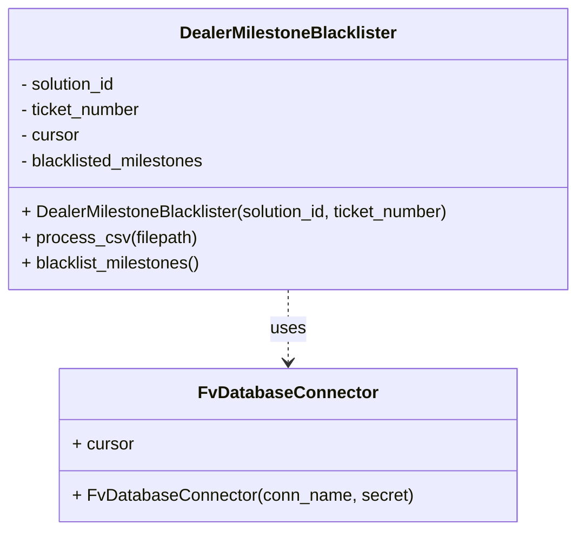

# Diagram: entity_core/entity_service/entity_service_scripts/set_dealer_blacklist_milestones.py


> Auto-generated by Obscura crawlers

## Diagram 1



### SVG

<svg id="container" width="550.7265625" xmlns="http://www.w3.org/2000/svg" class="classDiagram" height="498" viewBox="0 0 550.7265625 498" role="graphics-document document" aria-roledescription="class"><style>#container{font-family:"trebuchet ms",verdana,arial,sans-serif;font-size:16px;fill:#333;}@keyframes edge-animation-frame{from{stroke-dashoffset:0;}}@keyframes dash{to{stroke-dashoffset:0;}}#container .edge-animation-slow{stroke-dasharray:9,5!important;stroke-dashoffset:900;animation:dash 50s linear infinite;stroke-linecap:round;}#container .edge-animation-fast{stroke-dasharray:9,5!important;stroke-dashoffset:900;animation:dash 20s linear infinite;stroke-linecap:round;}#container .error-icon{fill:#552222;}#container .error-text{fill:#552222;stroke:#552222;}#container .edge-thickness-normal{stroke-width:1px;}#container .edge-thickness-thick{stroke-width:3.5px;}#container .edge-pattern-solid{stroke-dasharray:0;}#container .edge-thickness-invisible{stroke-width:0;fill:none;}#container .edge-pattern-dashed{stroke-dasharray:3;}#container .edge-pattern-dotted{stroke-dasharray:2;}#container .marker{fill:#333333;stroke:#333333;}#container .marker.cross{stroke:#333333;}#container svg{font-family:"trebuchet ms",verdana,arial,sans-serif;font-size:16px;}#container p{margin:0;}#container g.classGroup text{fill:#9370DB;stroke:none;font-family:"trebuchet ms",verdana,arial,sans-serif;font-size:10px;}#container g.classGroup text .title{font-weight:bolder;}#container .nodeLabel,#container .edgeLabel{color:#131300;}#container .edgeLabel .label rect{fill:#ECECFF;}#container .label text{fill:#131300;}#container .labelBkg{background:#ECECFF;}#container .edgeLabel .label span{background:#ECECFF;}#container .classTitle{font-weight:bolder;}#container .node rect,#container .node circle,#container .node ellipse,#container .node polygon,#container .node path{fill:#ECECFF;stroke:#9370DB;stroke-width:1px;}#container .divider{stroke:#9370DB;stroke-width:1;}#container g.clickable{cursor:pointer;}#container g.classGroup rect{fill:#ECECFF;stroke:#9370DB;}#container g.classGroup line{stroke:#9370DB;stroke-width:1;}#container .classLabel .box{stroke:none;stroke-width:0;fill:#ECECFF;opacity:0.5;}#container .classLabel .label{fill:#9370DB;font-size:10px;}#container .relation{stroke:#333333;stroke-width:1;fill:none;}#container .dashed-line{stroke-dasharray:3;}#container .dotted-line{stroke-dasharray:1 2;}#container #compositionStart,#container .composition{fill:#333333!important;stroke:#333333!important;stroke-width:1;}#container #compositionEnd,#container .composition{fill:#333333!important;stroke:#333333!important;stroke-width:1;}#container #dependencyStart,#container .dependency{fill:#333333!important;stroke:#333333!important;stroke-width:1;}#container #dependencyStart,#container .dependency{fill:#333333!important;stroke:#333333!important;stroke-width:1;}#container #extensionStart,#container .extension{fill:transparent!important;stroke:#333333!important;stroke-width:1;}#container #extensionEnd,#container .extension{fill:transparent!important;stroke:#333333!important;stroke-width:1;}#container #aggregationStart,#container .aggregation{fill:transparent!important;stroke:#333333!important;stroke-width:1;}#container #aggregationEnd,#container .aggregation{fill:transparent!important;stroke:#333333!important;stroke-width:1;}#container #lollipopStart,#container .lollipop{fill:#ECECFF!important;stroke:#333333!important;stroke-width:1;}#container #lollipopEnd,#container .lollipop{fill:#ECECFF!important;stroke:#333333!important;stroke-width:1;}#container .edgeTerminals{font-size:11px;line-height:initial;}#container .classTitleText{text-anchor:middle;font-size:18px;fill:#333;}#container .label-icon{display:inline-block;height:1em;overflow:visible;vertical-align:-0.125em;}#container .node .label-icon path{fill:currentColor;stroke:revert;stroke-width:revert;}#container :root{--mermaid-font-family:"trebuchet ms",verdana,arial,sans-serif;}</style><g><defs><marker id="container_class-aggregationStart" class="marker aggregation class" refX="18" refY="7" markerWidth="190" markerHeight="240" orient="auto"><path d="M 18,7 L9,13 L1,7 L9,1 Z"></path></marker></defs><defs><marker id="container_class-aggregationEnd" class="marker aggregation class" refX="1" refY="7" markerWidth="20" markerHeight="28" orient="auto"><path d="M 18,7 L9,13 L1,7 L9,1 Z"></path></marker></defs><defs><marker id="container_class-extensionStart" class="marker extension class" refX="18" refY="7" markerWidth="190" markerHeight="240" orient="auto"><path d="M 1,7 L18,13 V 1 Z"></path></marker></defs><defs><marker id="container_class-extensionEnd" class="marker extension class" refX="1" refY="7" markerWidth="20" markerHeight="28" orient="auto"><path d="M 1,1 V 13 L18,7 Z"></path></marker></defs><defs><marker id="container_class-compositionStart" class="marker composition class" refX="18" refY="7" markerWidth="190" markerHeight="240" orient="auto"><path d="M 18,7 L9,13 L1,7 L9,1 Z"></path></marker></defs><defs><marker id="container_class-compositionEnd" class="marker composition class" refX="1" refY="7" markerWidth="20" markerHeight="28" orient="auto"><path d="M 18,7 L9,13 L1,7 L9,1 Z"></path></marker></defs><defs><marker id="container_class-dependencyStart" class="marker dependency class" refX="6" refY="7" markerWidth="190" markerHeight="240" orient="auto"><path d="M 5,7 L9,13 L1,7 L9,1 Z"></path></marker></defs><defs><marker id="container_class-dependencyEnd" class="marker dependency class" refX="13" refY="7" markerWidth="20" markerHeight="28" orient="auto"><path d="M 18,7 L9,13 L14,7 L9,1 Z"></path></marker></defs><defs><marker id="container_class-lollipopStart" class="marker lollipop class" refX="13" refY="7" markerWidth="190" markerHeight="240" orient="auto"><circle stroke="black" fill="transparent" cx="7" cy="7" r="6"></circle></marker></defs><defs><marker id="container_class-lollipopEnd" class="marker lollipop class" refX="1" refY="7" markerWidth="190" markerHeight="240" orient="auto"><circle stroke="black" fill="transparent" cx="7" cy="7" r="6"></circle></marker></defs><g class="root"><g class="clusters"></g><g class="edgePaths"><path d="M275.363,272L275.363,278.167C275.363,284.333,275.363,296.667,275.363,308C275.363,319.333,275.363,329.667,275.363,334.833L275.363,340" id="id_DealerMilestoneBlacklister_FvDatabaseConnector_1" class="edge-thickness-normal edge-pattern-dashed relation" style=";;;" data-edge="true" data-et="edge" data-id="id_DealerMilestoneBlacklister_FvDatabaseConnector_1" data-points="W3sieCI6Mjc1LjM2MzI4MTI1LCJ5IjoyNzJ9LHsieCI6Mjc1LjM2MzI4MTI1LCJ5IjozMDl9LHsieCI6Mjc1LjM2MzI4MTI1LCJ5IjozNDZ9XQ==" marker-end="url(#container_class-dependencyEnd)"></path></g><g class="edgeLabels"><g class="edgeLabel" transform="translate(275.36328125, 309)"><g class="label" data-id="id_DealerMilestoneBlacklister_FvDatabaseConnector_1" transform="translate(-16.4921875, -12)"><foreignObject width="32.984375" height="24"><div xmlns="http://www.w3.org/1999/xhtml" class="labelBkg" style="display: table-cell; white-space: nowrap; line-height: 1.5; max-width: 200px; text-align: center;"><span class="edgeLabel"><p>uses</p></span></div></foreignObject></g></g></g><g class="nodes"><g class="node default" id="classId-DealerMilestoneBlacklister-0" transform="translate(275.36328125, 140)"><g class="basic label-container"><path d="M-267.36328125 -132 L267.36328125 -132 L267.36328125 132 L-267.36328125 132" stroke="none" stroke-width="0" fill="#ECECFF" style=""></path><path d="M-267.36328125 -132 C-96.13396591319369 -132, 75.09534942361262 -132, 267.36328125 -132 M-267.36328125 -132 C-148.01225401958365 -132, -28.6612267891673 -132, 267.36328125 -132 M267.36328125 -132 C267.36328125 -74.6595176537815, 267.36328125 -17.319035307563027, 267.36328125 132 M267.36328125 -132 C267.36328125 -75.8032198090482, 267.36328125 -19.606439618096402, 267.36328125 132 M267.36328125 132 C85.75266823975852 132, -95.85794477048296 132, -267.36328125 132 M267.36328125 132 C133.68090438854952 132, -0.0014724729009572002 132, -267.36328125 132 M-267.36328125 132 C-267.36328125 45.03090257850168, -267.36328125 -41.93819484299664, -267.36328125 -132 M-267.36328125 132 C-267.36328125 64.90421419742172, -267.36328125 -2.191571605156554, -267.36328125 -132" stroke="#9370DB" stroke-width="1.3" fill="none" stroke-dasharray="0 0" style=""></path></g><g class="annotation-group text" transform="translate(0, -108)"></g><g class="label-group text" transform="translate(-98.5859375, -108)"><g class="label" style="font-weight: bolder" transform="translate(0,-12)"><foreignObject width="197.171875" height="24"><div xmlns="http://www.w3.org/1999/xhtml" style="display: table-cell; white-space: nowrap; line-height: 1.5; max-width: 244px; text-align: center;"><span class="nodeLabel markdown-node-label" style=""><p>DealerMilestoneBlacklister</p></span></div></foreignObject></g></g><g class="members-group text" transform="translate(-255.36328125, -60)"><g class="label" style="" transform="translate(0,-12)"><foreignObject width="92.921875" height="24"><div xmlns="http://www.w3.org/1999/xhtml" style="display: table-cell; white-space: nowrap; line-height: 1.5; max-width: 150px; text-align: center;"><span class="nodeLabel markdown-node-label" style=""><p>- solution_id</p></span></div></foreignObject></g><g class="label" style="" transform="translate(0,12)"><foreignObject width="116.296875" height="24"><div xmlns="http://www.w3.org/1999/xhtml" style="display: table-cell; white-space: nowrap; line-height: 1.5; max-width: 174px; text-align: center;"><span class="nodeLabel markdown-node-label" style=""><p>- ticket_number</p></span></div></foreignObject></g><g class="label" style="" transform="translate(0,36)"><foreignObject width="56.421875" height="24"><div xmlns="http://www.w3.org/1999/xhtml" style="display: table-cell; white-space: nowrap; line-height: 1.5; max-width: 115px; text-align: center;"><span class="nodeLabel markdown-node-label" style=""><p>- cursor</p></span></div></foreignObject></g><g class="label" style="" transform="translate(0,60)"><foreignObject width="177.640625" height="24"><div xmlns="http://www.w3.org/1999/xhtml" style="display: table-cell; white-space: nowrap; line-height: 1.5; max-width: 235px; text-align: center;"><span class="nodeLabel markdown-node-label" style=""><p>- blacklisted_milestones</p></span></div></foreignObject></g></g><g class="methods-group text" transform="translate(-255.36328125, 60)"><g class="label" style="" transform="translate(0,-12)"><foreignObject width="412.140625" height="24"><div xmlns="http://www.w3.org/1999/xhtml" style="display: table-cell; white-space: nowrap; line-height: 1.5; max-width: 470px; text-align: center;"><span class="nodeLabel markdown-node-label" style=""><p>+ DealerMilestoneBlacklister(solution_id, ticket_number)</p></span></div></foreignObject></g><g class="label" style="" transform="translate(0,12)"><foreignObject width="164.109375" height="24"><div xmlns="http://www.w3.org/1999/xhtml" style="display: table-cell; white-space: nowrap; line-height: 1.5; max-width: 221px; text-align: center;"><span class="nodeLabel markdown-node-label" style=""><p>+ process_csv(filepath)</p></span></div></foreignObject></g><g class="label" style="" transform="translate(0,36)"><foreignObject width="171.5" height="24"><div xmlns="http://www.w3.org/1999/xhtml" style="display: table-cell; white-space: nowrap; line-height: 1.5; max-width: 229px; text-align: center;"><span class="nodeLabel markdown-node-label" style=""><p>+ blacklist_milestones()</p></span></div></foreignObject></g></g><g class="divider" style=""><path d="M-267.36328125 -84 C-84.21615274114728 -84, 98.93097576770543 -84, 267.36328125 -84 M-267.36328125 -84 C-65.42692342465773 -84, 136.50943440068454 -84, 267.36328125 -84" stroke="#9370DB" stroke-width="1.3" fill="none" stroke-dasharray="0 0" style=""></path></g><g class="divider" style=""><path d="M-267.36328125 36 C-73.69959297830806 36, 119.96409529338388 36, 267.36328125 36 M-267.36328125 36 C-92.05108040300286 36, 83.26112044399429 36, 267.36328125 36" stroke="#9370DB" stroke-width="1.3" fill="none" stroke-dasharray="0 0" style=""></path></g></g><g class="node default" id="classId-FvDatabaseConnector-1" transform="translate(275.36328125, 418)"><g class="basic label-container"><path d="M-209.37109375 -72 L209.37109375 -72 L209.37109375 72 L-209.37109375 72" stroke="none" stroke-width="0" fill="#ECECFF" style=""></path><path d="M-209.37109375 -72 C-125.10447095137313 -72, -40.83784815274626 -72, 209.37109375 -72 M-209.37109375 -72 C-76.46319545082315 -72, 56.4447028483537 -72, 209.37109375 -72 M209.37109375 -72 C209.37109375 -42.70178827482436, 209.37109375 -13.403576549648719, 209.37109375 72 M209.37109375 -72 C209.37109375 -41.49606239283362, 209.37109375 -10.992124785667244, 209.37109375 72 M209.37109375 72 C91.86096911657559 72, -25.649155516848822 72, -209.37109375 72 M209.37109375 72 C110.0982043842932 72, 10.825315018586394 72, -209.37109375 72 M-209.37109375 72 C-209.37109375 22.588000695254237, -209.37109375 -26.823998609491525, -209.37109375 -72 M-209.37109375 72 C-209.37109375 18.695967838312292, -209.37109375 -34.608064323375416, -209.37109375 -72" stroke="#9370DB" stroke-width="1.3" fill="none" stroke-dasharray="0 0" style=""></path></g><g class="annotation-group text" transform="translate(0, -48)"></g><g class="label-group text" transform="translate(-79.3046875, -48)"><g class="label" style="font-weight: bolder" transform="translate(0,-12)"><foreignObject width="158.609375" height="24"><div xmlns="http://www.w3.org/1999/xhtml" style="display: table-cell; white-space: nowrap; line-height: 1.5; max-width: 207px; text-align: center;"><span class="nodeLabel markdown-node-label" style=""><p>FvDatabaseConnector</p></span></div></foreignObject></g></g><g class="members-group text" transform="translate(-197.37109375, 0)"><g class="label" style="" transform="translate(0,-12)"><foreignObject width="57.953125" height="24"><div xmlns="http://www.w3.org/1999/xhtml" style="display: table-cell; white-space: nowrap; line-height: 1.5; max-width: 116px; text-align: center;"><span class="nodeLabel markdown-node-label" style=""><p>+ cursor</p></span></div></foreignObject></g></g><g class="methods-group text" transform="translate(-197.37109375, 48)"><g class="label" style="" transform="translate(0,-12)"><foreignObject width="315.4375" height="24"><div xmlns="http://www.w3.org/1999/xhtml" style="display: table-cell; white-space: nowrap; line-height: 1.5; max-width: 373px; text-align: center;"><span class="nodeLabel markdown-node-label" style=""><p>+ FvDatabaseConnector(conn_name, secret)</p></span></div></foreignObject></g></g><g class="divider" style=""><path d="M-209.37109375 -24 C-123.99140571410457 -24, -38.611717678209146 -24, 209.37109375 -24 M-209.37109375 -24 C-105.83758744549722 -24, -2.304081140994441 -24, 209.37109375 -24" stroke="#9370DB" stroke-width="1.3" fill="none" stroke-dasharray="0 0" style=""></path></g><g class="divider" style=""><path d="M-209.37109375 24 C-71.13789491307756 24, 67.09530392384488 24, 209.37109375 24 M-209.37109375 24 C-107.86403351276473 24, -6.3569732755294694 24, 209.37109375 24" stroke="#9370DB" stroke-width="1.3" fill="none" stroke-dasharray="0 0" style=""></path></g></g></g></g></g></svg>

## Diagram 2

```mermaid
flowchart TD
Start([Start]) --> Parse[parse_args()]
Parse --> Create[Create DealerMilestoneBlacklister(solution_id, ticket_number)]
Create --> Process[process_csv(filepath)]
Process --> ReadCSV[Open CSV and for each row append blacklisted_milestone to list]
ReadCSV --> BlacklistCall[blacklist_milestones()]
BlacklistCall --> BuildData[Build data dict: solution_id, ticket_number, blacklisted_milestones]
BuildData --> DBConn[DB_CONN : FvDatabaseConnector]
DBConn --> Execute[Execute INSERT INTO public.system_configuration via cursor]
Execute --> End([End])
```

> SVG rendering failed for this diagram.
