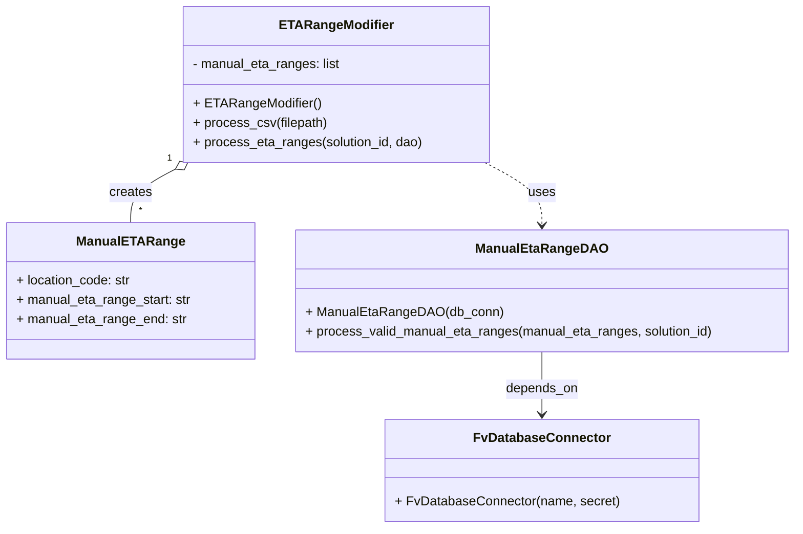
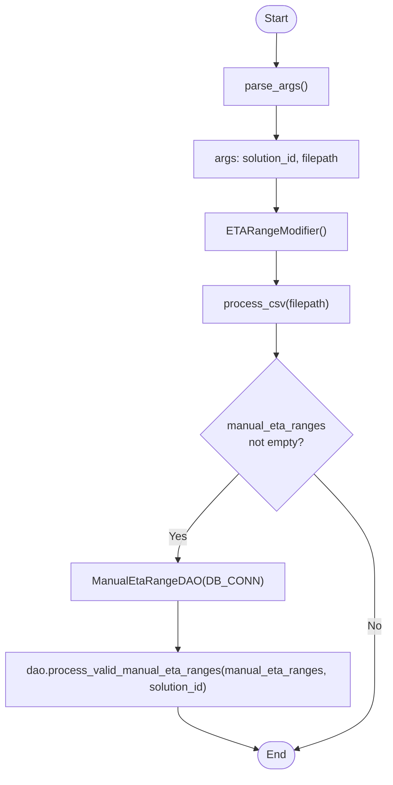

# Diagram: entity_core/entity_service/entity_service_scripts/set_manual_eta_ranges.py

> Auto-generated by Obscura crawlers

## Diagram 1

### SVG

<svg id="container" width="969.9375" xmlns="http://www.w3.org/2000/svg" class="classDiagram" height="650" viewBox="0 0 969.9375 650" role="graphics-document document" aria-roledescription="class"><g><defs><marker id="container_class-aggregationStart" class="marker aggregation class" refX="18" refY="7" markerWidth="190" markerHeight="240" orient="auto"><path d="M 18,7 L9,13 L1,7 L9,1 Z"></path></marker></defs><defs><marker id="container_class-aggregationEnd" class="marker aggregation class" refX="1" refY="7" markerWidth="20" markerHeight="28" orient="auto"><path d="M 18,7 L9,13 L1,7 L9,1 Z"></path></marker></defs><defs><marker id="container_class-extensionStart" class="marker extension class" refX="18" refY="7" markerWidth="190" markerHeight="240" orient="auto"><path d="M 1,7 L18,13 V 1 Z"></path></marker></defs><defs><marker id="container_class-extensionEnd" class="marker extension class" refX="1" refY="7" markerWidth="20" markerHeight="28" orient="auto"><path d="M 1,1 V 13 L18,7 Z"></path></marker></defs><defs><marker id="container_class-compositionStart" class="marker composition class" refX="18" refY="7" markerWidth="190" markerHeight="240" orient="auto"><path d="M 18,7 L9,13 L1,7 L9,1 Z"></path></marker></defs><defs><marker id="container_class-compositionEnd" class="marker composition class" refX="1" refY="7" markerWidth="20" markerHeight="28" orient="auto"><path d="M 18,7 L9,13 L1,7 L9,1 Z"></path></marker></defs><defs><marker id="container_class-dependencyStart" class="marker dependency class" refX="6" refY="7" markerWidth="190" markerHeight="240" orient="auto"><path d="M 5,7 L9,13 L1,7 L9,1 Z"></path></marker></defs><defs><marker id="container_class-dependencyEnd" class="marker dependency class" refX="13" refY="7" markerWidth="20" markerHeight="28" orient="auto"><path d="M 18,7 L9,13 L14,7 L9,1 Z"></path></marker></defs><defs><marker id="container_class-lollipopStart" class="marker lollipop class" refX="13" refY="7" markerWidth="190" markerHeight="240" orient="auto"><circle stroke="black" fill="transparent" cx="7" cy="7" r="6"></circle></marker></defs><defs><marker id="container_class-lollipopEnd" class="marker lollipop class" refX="1" refY="7" markerWidth="190" markerHeight="240" orient="auto"><circle stroke="black" fill="transparent" cx="7" cy="7" r="6"></circle></marker></defs><g class="root"><g class="clusters"></g><g class="edgePaths"><path d="M213.436,208.077L204.339,212.898C195.242,217.718,177.049,227.359,167.952,238.346C158.855,249.333,158.855,261.667,158.855,267.833L158.855,274" id="id_ETARangeModifier_ManualETARange_1" class="edge-thickness-normal edge-pattern-solid relation" style=";;;" data-edge="true" data-et="edge" data-id="id_ETARangeModifier_ManualETARange_1" data-points="W3sieCI6MjI4LjY3ODE4OTYxNDY2MTY1LCJ5IjoyMDB9LHsieCI6MTU4Ljg1NTQ2ODc1LCJ5IjoyMzd9LHsieCI6MTU4Ljg1NTQ2ODc1LCJ5IjoyNzR9XQ==" marker-start="url(#container_class-aggregationStart)"></path><path d="M591.001,200L602.639,206.167C614.276,212.333,637.55,224.667,649.187,237.5C660.824,250.333,660.824,263.667,660.824,270.333L660.824,277" id="id_ETARangeModifier_ManualEtaRangeDAO_2" class="edge-thickness-normal edge-pattern-dashed relation" style=";;;" data-edge="true" data-et="edge" data-id="id_ETARangeModifier_ManualEtaRangeDAO_2" data-points="W3sieCI6NTkxLjAwMTQ5Nzg4NTMzODQsInkiOjIwMH0seyJ4Ijo2NjAuODI0MjE4NzUsInkiOjIzN30seyJ4Ijo2NjAuODI0MjE4NzUsInkiOjI4M31d" marker-end="url(#container_class-dependencyEnd)"></path><path d="M660.824,433L660.824,440.667C660.824,448.333,660.824,463.667,660.824,476.5C660.824,489.333,660.824,499.667,660.824,504.833L660.824,510" id="id_ManualEtaRangeDAO_FvDatabaseConnector_3" class="edge-thickness-normal edge-pattern-solid relation" style=";;;" data-edge="true" data-et="edge" data-id="id_ManualEtaRangeDAO_FvDatabaseConnector_3" data-points="W3sieCI6NjYwLjgyNDIxODc1LCJ5Ijo0MzN9LHsieCI6NjYwLjgyNDIxODc1LCJ5Ijo0Nzl9LHsieCI6NjYwLjgyNDIxODc1LCJ5Ijo1MTZ9XQ==" marker-end="url(#container_class-dependencyEnd)"></path></g><g class="edgeLabels"><g class="edgeLabel" transform="translate(158.85546875, 237)"><g class="label" data-id="id_ETARangeModifier_ManualETARange_1" transform="translate(-26.171875, -12)"><foreignObject width="52.34375" height="24">

creates

</foreignObject></g></g><g class="edgeLabel" transform="translate(660.82421875, 237)"><g class="label" data-id="id_ETARangeModifier_ManualEtaRangeDAO_2" transform="translate(-16.4921875, -12)"><foreignObject width="32.984375" height="24">

uses

</foreignObject></g></g><g class="edgeLabel" transform="translate(660.82421875, 479)"><g class="label" data-id="id_ManualEtaRangeDAO_FvDatabaseConnector_3" transform="translate(-44.671875, -12)"><foreignObject width="89.34375" height="24">

depends_on

</foreignObject></g></g><g class="edgeTerminals" transform="translate(206.19160015130396, 194.94002724282834)"><g class="inner" transform="translate(0, 0)"><foreignObject style="width: 9px; height: 12px;">
1
</foreignObject></g></g><g class="edgeTerminals" transform="translate(168.85546937499998, 251.50000053571426)"><g class="inner" transform="translate(0, 0)"></g><foreignObject style="width: 9px; height: 12px;">
*
</foreignObject></g></g><g class="nodes"><g class="node default" id="classId-ETARangeModifier-0" transform="translate(409.83984375, 104)"><g class="basic label-container"><path d="M-186.36328125 -96 L186.36328125 -96 L186.36328125 96 L-186.36328125 96" stroke="none" stroke-width="0" fill="#ECECFF" style=""></path><path d="M-186.36328125 -96 C-107.10417646636836 -96, -27.845071682736716 -96, 186.36328125 -96 M-186.36328125 -96 C-83.1686882713268 -96, 20.0259047073464 -96, 186.36328125 -96 M186.36328125 -96 C186.36328125 -32.20031944886318, 186.36328125 31.599361102273633, 186.36328125 96 M186.36328125 -96 C186.36328125 -53.30061517016557, 186.36328125 -10.601230340331142, 186.36328125 96 M186.36328125 96 C38.211892843713144 96, -109.93949556257371 96, -186.36328125 96 M186.36328125 96 C52.51525832422237 96, -81.33276460155525 96, -186.36328125 96 M-186.36328125 96 C-186.36328125 30.48319693658641, -186.36328125 -35.03360612682718, -186.36328125 -96 M-186.36328125 96 C-186.36328125 31.281122994417558, -186.36328125 -33.437754011164884, -186.36328125 -96" stroke="#9370DB" stroke-width="1.3" fill="none" stroke-dasharray="0 0" style=""></path></g><g class="annotation-group text" transform="translate(0, -72)"></g><g class="label-group text" transform="translate(-65.7890625, -72)"><g class="label" style="font-weight: bolder" transform="translate(0,-12)"><foreignObject width="131.578125" height="24">

ETARangeModifier

</foreignObject></g></g><g class="members-group text" transform="translate(-174.36328125, -24)"><g class="label" style="" transform="translate(0,-12)"><foreignObject width="182.921875" height="24">

- manual_eta_ranges: list

</foreignObject></g></g><g class="methods-group text" transform="translate(-174.36328125, 24)"><g class="label" style="" transform="translate(0,-12)"><foreignObject width="152.15625" height="24">

+ ETARangeModifier()

</foreignObject></g><g class="label" style="" transform="translate(0,12)"><foreignObject width="164.109375" height="24">

+ process_csv(filepath)

</foreignObject></g><g class="label" style="" transform="translate(0,36)"><foreignObject width="282.9375" height="24">

+ process_eta_ranges(solution_id, dao)

</foreignObject></g></g><g class="divider" style=""><path d="M-186.36328125 -48 C-77.69661906635532 -48, 30.97004311728935 -48, 186.36328125 -48 M-186.36328125 -48 C-83.1714787394594 -48, 20.020323771081195 -48, 186.36328125 -48" stroke="#9370DB" stroke-width="1.3" fill="none" stroke-dasharray="0 0" style=""></path></g><g class="divider" style=""><path d="M-186.36328125 0 C-96.19598207654397 0, -6.02868290308794 0, 186.36328125 0 M-186.36328125 0 C-102.81371095396416 0, -19.264140657928323 0, 186.36328125 0" stroke="#9370DB" stroke-width="1.3" fill="none" stroke-dasharray="0 0" style=""></path></g></g><g class="node default" id="classId-ManualETARange-1" transform="translate(158.85546875, 358)"><g class="basic label-container"><path d="M-150.85546875 -84 L150.85546875 -84 L150.85546875 84 L-150.85546875 84" stroke="none" stroke-width="0" fill="#ECECFF" style=""></path><path d="M-150.85546875 -84 C-73.93163228604581 -84, 2.992204177908377 -84, 150.85546875 -84 M-150.85546875 -84 C-33.88692165538028 -84, 83.08162543923945 -84, 150.85546875 -84 M150.85546875 -84 C150.85546875 -17.92956875825557, 150.85546875 48.14086248348886, 150.85546875 84 M150.85546875 -84 C150.85546875 -20.872658574118248, 150.85546875 42.254682851763505, 150.85546875 84 M150.85546875 84 C72.168173050274 84, -6.519122649451987 84, -150.85546875 84 M150.85546875 84 C43.84679627238938 84, -63.16187620522123 84, -150.85546875 84 M-150.85546875 84 C-150.85546875 29.43483449341975, -150.85546875 -25.1303310131605, -150.85546875 -84 M-150.85546875 84 C-150.85546875 43.16091311430349, -150.85546875 2.32182622860698, -150.85546875 -84" stroke="#9370DB" stroke-width="1.3" fill="none" stroke-dasharray="0 0" style=""></path></g><g class="annotation-group text" transform="translate(0, -60)"></g><g class="label-group text" transform="translate(-61.8984375, -60)"><g class="label" style="font-weight: bolder" transform="translate(0,-12)"><foreignObject width="123.796875" height="24">

ManualETARange

</foreignObject></g></g><g class="members-group text" transform="translate(-138.85546875, -12)"><g class="label" style="" transform="translate(0,-12)"><foreignObject width="141.84375" height="24">

+ location_code: str

</foreignObject></g><g class="label" style="" transform="translate(0,12)"><foreignObject width="215.8125" height="24">

+ manual_eta_range_start: str

</foreignObject></g><g class="label" style="" transform="translate(0,36)"><foreignObject width="209.296875" height="24">

+ manual_eta_range_end: str

</foreignObject></g></g><g class="methods-group text" transform="translate(-138.85546875, 84)"></g><g class="divider" style=""><path d="M-150.85546875 -36 C-32.7264186002365 -36, 85.402631549527 -36, 150.85546875 -36 M-150.85546875 -36 C-90.14938169518692 -36, -29.44329464037385 -36, 150.85546875 -36" stroke="#9370DB" stroke-width="1.3" fill="none" stroke-dasharray="0 0" style=""></path></g><g class="divider" style=""><path d="M-150.85546875 60 C-45.40229759258759 60, 60.050873564824826 60, 150.85546875 60 M-150.85546875 60 C-83.70816745730099 60, -16.560866164601975 60, 150.85546875 60" stroke="#9370DB" stroke-width="1.3" fill="none" stroke-dasharray="0 0" style=""></path></g></g><g class="node default" id="classId-ManualEtaRangeDAO-2" transform="translate(660.82421875, 358)"><g class="basic label-container"><path d="M-301.11328125 -75 L301.11328125 -75 L301.11328125 75 L-301.11328125 75" stroke="none" stroke-width="0" fill="#ECECFF" style=""></path><path d="M-301.11328125 -75 C-153.87471643729307 -75, -6.636151624586148 -75, 301.11328125 -75 M-301.11328125 -75 C-123.63160627694393 -75, 53.850068696112146 -75, 301.11328125 -75 M301.11328125 -75 C301.11328125 -35.94349251200121, 301.11328125 3.1130149759975865, 301.11328125 75 M301.11328125 -75 C301.11328125 -24.272526438157406, 301.11328125 26.454947123685187, 301.11328125 75 M301.11328125 75 C86.64758253265964 75, -127.81811618468072 75, -301.11328125 75 M301.11328125 75 C77.64326905210478 75, -145.82674314579043 75, -301.11328125 75 M-301.11328125 75 C-301.11328125 39.4793618358221, -301.11328125 3.9587236716441936, -301.11328125 -75 M-301.11328125 75 C-301.11328125 37.39383530577206, -301.11328125 -0.21232938845588478, -301.11328125 -75" stroke="#9370DB" stroke-width="1.3" fill="none" stroke-dasharray="0 0" style=""></path></g><g class="annotation-group text" transform="translate(0, -51)"></g><g class="label-group text" transform="translate(-75.7890625, -51)"><g class="label" style="font-weight: bolder" transform="translate(0,-12)"><foreignObject width="151.578125" height="24">

ManualEtaRangeDAO

</foreignObject></g></g><g class="members-group text" transform="translate(-289.11328125, -3)"></g><g class="methods-group text" transform="translate(-289.11328125, 27)"><g class="label" style="" transform="translate(0,-12)"><foreignObject width="235.15625" height="24">

+ ManualEtaRangeDAO(db_conn)

</foreignObject></g><g class="label" style="" transform="translate(0,12)"><foreignObject width="502.4375" height="24">

+ process_valid_manual_eta_ranges(manual_eta_ranges, solution_id)

</foreignObject></g></g><g class="divider" style=""><path d="M-301.11328125 -27 C-163.92761732989487 -27, -26.741953409789744 -27, 301.11328125 -27 M-301.11328125 -27 C-84.7909137094519 -27, 131.5314538310962 -27, 301.11328125 -27" stroke="#9370DB" stroke-width="1.3" fill="none" stroke-dasharray="0 0" style=""></path></g><g class="divider" style=""><path d="M-301.11328125 -3 C-103.023919933825 -3, 95.06544138235 -3, 301.11328125 -3 M-301.11328125 -3 C-97.7030703719775 -3, 105.707140506045 -3, 301.11328125 -3" stroke="#9370DB" stroke-width="1.3" fill="none" stroke-dasharray="0 0" style=""></path></g></g><g class="node default" id="classId-FvDatabaseConnector-3" transform="translate(660.82421875, 579)"><g class="basic label-container"><path d="M-187.49609375 -63 L187.49609375 -63 L187.49609375 63 L-187.49609375 63" stroke="none" stroke-width="0" fill="#ECECFF" style=""></path><path d="M-187.49609375 -63 C-60.69790114386592 -63, 66.10029146226816 -63, 187.49609375 -63 M-187.49609375 -63 C-88.3422420091735 -63, 10.811609731652993 -63, 187.49609375 -63 M187.49609375 -63 C187.49609375 -18.968050562569253, 187.49609375 25.063898874861493, 187.49609375 63 M187.49609375 -63 C187.49609375 -28.558741737351077, 187.49609375 5.882516525297845, 187.49609375 63 M187.49609375 63 C83.24995622288918 63, -20.996181304221636 63, -187.49609375 63 M187.49609375 63 C44.10194669697228 63, -99.29220035605545 63, -187.49609375 63 M-187.49609375 63 C-187.49609375 13.286258492930145, -187.49609375 -36.42748301413971, -187.49609375 -63 M-187.49609375 63 C-187.49609375 35.71673509750346, -187.49609375 8.433470195006926, -187.49609375 -63" stroke="#9370DB" stroke-width="1.3" fill="none" stroke-dasharray="0 0" style=""></path></g><g class="annotation-group text" transform="translate(0, -39)"></g><g class="label-group text" transform="translate(-79.3046875, -39)"><g class="label" style="font-weight: bolder" transform="translate(0,-12)"><foreignObject width="158.609375" height="24">

FvDatabaseConnector

</foreignObject></g></g><g class="members-group text" transform="translate(-175.49609375, 9)"></g><g class="methods-group text" transform="translate(-175.49609375, 39)"><g class="label" style="" transform="translate(0,-12)"><foreignObject width="271.6875" height="24">

+ FvDatabaseConnector(name, secret)

</foreignObject></g></g><g class="divider" style=""><path d="M-187.49609375 -15 C-71.2263204889687 -15, 45.04345277206261 -15, 187.49609375 -15 M-187.49609375 -15 C-56.31088384924561 -15, 74.87432605150877 -15, 187.49609375 -15" stroke="#9370DB" stroke-width="1.3" fill="none" stroke-dasharray="0 0" style=""></path></g><g class="divider" style=""><path d="M-187.49609375 9 C-71.40947094727079 9, 44.67715185545842 9, 187.49609375 9 M-187.49609375 9 C-69.21279141977567 9, 49.07051091044866 9, 187.49609375 9" stroke="#9370DB" stroke-width="1.3" fill="none" stroke-dasharray="0 0" style=""></path></g></g></g></g></g></svg>

## Diagram 2

### SVG

<svg id="container" width="555.25" xmlns="http://www.w3.org/2000/svg" class="flowchart" height="1168" viewBox="0 0 555.25 1168" role="graphics-document document" aria-roledescription="flowchart-v2"><g><marker id="container_flowchart-v2-pointEnd" class="marker flowchart-v2" viewBox="0 0 10 10" refX="5" refY="5" markerUnits="userSpaceOnUse" markerWidth="8" markerHeight="8" orient="auto"><path d="M 0 0 L 10 5 L 0 10 z" class="arrowMarkerPath" style="stroke-width: 1; stroke-dasharray: 1, 0;"></path></marker><marker id="container_flowchart-v2-pointStart" class="marker flowchart-v2" viewBox="0 0 10 10" refX="4.5" refY="5" markerUnits="userSpaceOnUse" markerWidth="8" markerHeight="8" orient="auto"><path d="M 0 5 L 10 10 L 10 0 z" class="arrowMarkerPath" style="stroke-width: 1; stroke-dasharray: 1, 0;"></path></marker><marker id="container_flowchart-v2-circleEnd" class="marker flowchart-v2" viewBox="0 0 10 10" refX="11" refY="5" markerUnits="userSpaceOnUse" markerWidth="11" markerHeight="11" orient="auto"><circle cx="5" cy="5" r="5" class="arrowMarkerPath" style="stroke-width: 1; stroke-dasharray: 1, 0;"></circle></marker><marker id="container_flowchart-v2-circleStart" class="marker flowchart-v2" viewBox="0 0 10 10" refX="-1" refY="5" markerUnits="userSpaceOnUse" markerWidth="11" markerHeight="11" orient="auto"><circle cx="5" cy="5" r="5" class="arrowMarkerPath" style="stroke-width: 1; stroke-dasharray: 1, 0;"></circle></marker><marker id="container_flowchart-v2-crossEnd" class="marker cross flowchart-v2" viewBox="0 0 11 11" refX="12" refY="5.2" markerUnits="userSpaceOnUse" markerWidth="11" markerHeight="11" orient="auto"><path d="M 1,1 l 9,9 M 10,1 l -9,9" class="arrowMarkerPath" style="stroke-width: 2; stroke-dasharray: 1, 0;"></path></marker><marker id="container_flowchart-v2-crossStart" class="marker cross flowchart-v2" viewBox="0 0 11 11" refX="-1" refY="5.2" markerUnits="userSpaceOnUse" markerWidth="11" markerHeight="11" orient="auto"><path d="M 1,1 l 9,9 M 10,1 l -9,9" class="arrowMarkerPath" style="stroke-width: 2; stroke-dasharray: 1, 0;"></path></marker><g class="root"><g class="clusters"></g><g class="edgePaths"><path d="M396.582,47.5L396.499,51.583C396.415,55.667,396.249,63.833,396.165,71.417C396.082,79,396.082,86,396.082,89.5L396.082,93" id="L_Start_ParseArgs_0" class="edge-thickness-normal edge-pattern-solid edge-thickness-normal edge-pattern-solid flowchart-link" style=";" data-edge="true" data-et="edge" data-id="L_Start_ParseArgs_0" data-points="W3sieCI6Mzk2LjU4MjAzMTI1LCJ5Ijo0Ny41fSx7IngiOjM5Ni4wODIwMzEyNSwieSI6NzJ9LHsieCI6Mzk2LjA4MjAzMTI1LCJ5Ijo5N31d" marker-end="url(#container_flowchart-v2-pointEnd)"></path><path d="M396.082,151L396.082,155.167C396.082,159.333,396.082,167.667,396.082,175.333C396.082,183,396.082,190,396.082,193.5L396.082,197" id="L_ParseArgs_GetArgs_0" class="edge-thickness-normal edge-pattern-solid edge-thickness-normal edge-pattern-solid flowchart-link" style=";" data-edge="true" data-et="edge" data-id="L_ParseArgs_GetArgs_0" data-points="W3sieCI6Mzk2LjA4MjAzMTI1LCJ5IjoxNTF9LHsieCI6Mzk2LjA4MjAzMTI1LCJ5IjoxNzZ9LHsieCI6Mzk2LjA4MjAzMTI1LCJ5IjoyMDF9XQ==" marker-end="url(#container_flowchart-v2-pointEnd)"></path><path d="M396.082,255L396.082,259.167C396.082,263.333,396.082,271.667,396.082,279.333C396.082,287,396.082,294,396.082,297.5L396.082,301" id="L_GetArgs_InitModifier_0" class="edge-thickness-normal edge-pattern-solid edge-thickness-normal edge-pattern-solid flowchart-link" style=";" data-edge="true" data-et="edge" data-id="L_GetArgs_InitModifier_0" data-points="W3sieCI6Mzk2LjA4MjAzMTI1LCJ5IjoyNTV9LHsieCI6Mzk2LjA4MjAzMTI1LCJ5IjoyODB9LHsieCI6Mzk2LjA4MjAzMTI1LCJ5IjozMDV9XQ==" marker-end="url(#container_flowchart-v2-pointEnd)"></path><path d="M396.082,359L396.082,363.167C396.082,367.333,396.082,375.667,396.082,383.333C396.082,391,396.082,398,396.082,401.5L396.082,405" id="L_InitModifier_ProcessCSV_0" class="edge-thickness-normal edge-pattern-solid edge-thickness-normal edge-pattern-solid flowchart-link" style=";" data-edge="true" data-et="edge" data-id="L_InitModifier_ProcessCSV_0" data-points="W3sieCI6Mzk2LjA4MjAzMTI1LCJ5IjozNTl9LHsieCI6Mzk2LjA4MjAzMTI1LCJ5IjozODR9LHsieCI6Mzk2LjA4MjAzMTI1LCJ5Ijo0MDl9XQ==" marker-end="url(#container_flowchart-v2-pointEnd)"></path><path d="M396.082,463L396.082,467.167C396.082,471.333,396.082,479.667,396.082,487.333C396.082,495,396.082,502,396.082,505.5L396.082,509" id="L_ProcessCSV_Check_0" class="edge-thickness-normal edge-pattern-solid edge-thickness-normal edge-pattern-solid flowchart-link" style=";" data-edge="true" data-et="edge" data-id="L_ProcessCSV_Check_0" data-points="W3sieCI6Mzk2LjA4MjAzMTI1LCJ5Ijo0NjN9LHsieCI6Mzk2LjA4MjAzMTI1LCJ5Ijo0ODh9LHsieCI6Mzk2LjA4MjAzMTI1LCJ5Ijo1MTN9XQ==" marker-end="url(#container_flowchart-v2-pointEnd)"></path><path d="M334.249,729.167L321.05,745.639C307.851,762.111,281.453,795.056,268.254,817.028C255.055,839,255.055,850,255.055,855.5L255.055,861" id="L_Check_InitDAO_0" class="edge-thickness-normal edge-pattern-solid edge-thickness-normal edge-pattern-solid flowchart-link" style=";" data-edge="true" data-et="edge" data-id="L_Check_InitDAO_0" data-points="W3sieCI6MzM0LjI0ODg3NjU3ODMwNjIsInkiOjcyOS4xNjY4NDUzMjgzMDYyfSx7IngiOjI1NS4wNTQ2ODc1LCJ5Ijo4Mjh9LHsieCI6MjU1LjA1NDY4NzUsInkiOjg2NX1d" marker-end="url(#container_flowchart-v2-pointEnd)"></path><path d="M255.055,919L255.055,925.167C255.055,931.333,255.055,943.667,255.055,955.333C255.055,967,255.055,978,255.055,983.5L255.055,989" id="L_InitDAO_ProcessRanges_0" class="edge-thickness-normal edge-pattern-solid edge-thickness-normal edge-pattern-solid flowchart-link" style=";" data-edge="true" data-et="edge" data-id="L_InitDAO_ProcessRanges_0" data-points="W3sieCI6MjU1LjA1NDY4NzUsInkiOjkxOX0seyJ4IjoyNTUuMDU0Njg3NSwieSI6OTU2fSx7IngiOjI1NS4wNTQ2ODc1LCJ5Ijo5OTN9XQ==" marker-end="url(#container_flowchart-v2-pointEnd)"></path><path d="M255.055,1071L255.055,1075.167C255.055,1079.333,255.055,1087.667,273.931,1097.845C292.808,1108.023,330.561,1120.046,349.437,1126.057L368.314,1132.069" id="L_ProcessRanges_End_0" class="edge-thickness-normal edge-pattern-solid edge-thickness-normal edge-pattern-solid flowchart-link" style=";" data-edge="true" data-et="edge" data-id="L_ProcessRanges_End_0" data-points="W3sieCI6MjU1LjA1NDY4NzUsInkiOjEwNzF9LHsieCI6MjU1LjA1NDY4NzUsInkiOjEwOTZ9LHsieCI6MzcyLjEyNTAxNTk0MjQzNzUsInkiOjExMzMuMjgyNzkzMTY0NDUzfV0=" marker-end="url(#container_flowchart-v2-pointEnd)"></path><path d="M457.915,729.167L471.114,745.639C484.313,762.111,510.711,795.056,523.91,822.194C537.109,849.333,537.109,870.667,537.109,892C537.109,913.333,537.109,934.667,537.109,958C537.109,981.333,537.109,1006.667,537.109,1030C537.109,1053.333,537.109,1074.667,518.399,1091.343C499.689,1108.02,462.268,1120.04,443.558,1126.05L424.847,1132.06" id="L_Check_End_0" class="edge-thickness-normal edge-pattern-solid edge-thickness-normal edge-pattern-solid flowchart-link" style=";" data-edge="true" data-et="edge" data-id="L_Check_End_0" data-points="W3sieCI6NDU3LjkxNTE4NTkyMTY5MzgsInkiOjcyOS4xNjY4NDUzMjgzMDYyfSx7IngiOjUzNy4xMDkzNzUsInkiOjgyOH0seyJ4Ijo1MzcuMTA5Mzc1LCJ5Ijo4OTJ9LHsieCI6NTM3LjEwOTM3NSwieSI6OTU2fSx7IngiOjUzNy4xMDkzNzUsInkiOjEwMzJ9LHsieCI6NTM3LjEwOTM3NSwieSI6MTA5Nn0seyJ4Ijo0MjEuMDM5MDQ3NDc2NjQ4NTMsInkiOjExMzMuMjgyNzkyODc0NDQzfV0=" marker-end="url(#container_flowchart-v2-pointEnd)"></path></g><g class="edgeLabels"><g class="edgeLabel"><g class="label" data-id="L_Start_ParseArgs_0" transform="translate(0, 0)"><foreignObject width="0" height="0">

</foreignObject></g></g><g class="edgeLabel"><g class="label" data-id="L_ParseArgs_GetArgs_0" transform="translate(0, 0)"><foreignObject width="0" height="0">

</foreignObject></g></g><g class="edgeLabel"><g class="label" data-id="L_GetArgs_InitModifier_0" transform="translate(0, 0)"><foreignObject width="0" height="0">

</foreignObject></g></g><g class="edgeLabel"><g class="label" data-id="L_InitModifier_ProcessCSV_0" transform="translate(0, 0)"><foreignObject width="0" height="0">

</foreignObject></g></g><g class="edgeLabel"><g class="label" data-id="L_ProcessCSV_Check_0" transform="translate(0, 0)"><foreignObject width="0" height="0">

</foreignObject></g></g><g class="edgeLabel" transform="translate(255.0546875, 828)"><g class="label" data-id="L_Check_InitDAO_0" transform="translate(-12.03125, -12)"><foreignObject width="24.0625" height="24">

Yes

</foreignObject></g></g><g class="edgeLabel"><g class="label" data-id="L_InitDAO_ProcessRanges_0" transform="translate(0, 0)"><foreignObject width="0" height="0">

</foreignObject></g></g><g class="edgeLabel"><g class="label" data-id="L_ProcessRanges_End_0" transform="translate(0, 0)"><foreignObject width="0" height="0">

</foreignObject></g></g><g class="edgeLabel" transform="translate(537.109375, 956)"><g class="label" data-id="L_Check_End_0" transform="translate(-10.140625, -12)"><foreignObject width="20.28125" height="24">

No

</foreignObject></g></g></g><g class="nodes"><g class="node default" id="flowchart-Start-0" transform="translate(396.08203125, 27.5)"><g class="basic label-container outer-path"><path d="M-10.3984375 -19.5 C-4.719175324500031 -19.5, 0.9600868509999376 -19.5, 10.3984375 -19.5 C10.3984375 -19.5, 10.398437499999998 -19.5, 10.398437499999998 -19.5 C10.764282597442815 -19.488268059799292, 11.13012769488563 -19.476536119598585, 11.6478067896239 -19.45993515863156 C11.975919218501486 -19.42828254723067, 12.304031647379073 -19.396629935829775, 12.892042152847864 -19.3399052695533 C13.331769665034463 -19.268813535520756, 13.77149717722106 -19.197721801488218, 14.126030759676757 -19.140403561325776 C14.4427183888904 -19.068121676537675, 14.759406018104043 -18.99583979174957, 15.34470188623539 -18.862249829261074 C15.625554925796992 -18.77889412134688, 15.906407965358595 -18.695538413432683, 16.543047751460602 -18.50658706670804 C16.851116889682668 -18.393214776082424, 17.159186027904735 -18.279842485456808, 17.716144095147794 -18.074876768247425 C17.998277867889275 -17.949984516255782, 18.280411640630756 -17.82509226426414, 18.85917041279238 -17.568892924097174 C19.21987215904156 -17.38071505411947, 19.580573905290745 -17.19253718414177, 19.967429764076783 -16.990714730406097 C20.352203793079894 -16.757462452841228, 20.736977822083002 -16.52421017527636, 21.036368073605697 -16.342718045390892 C21.30427634115153 -16.1558368355129, 21.57218460869737 -15.968955625634907, 22.061592844578712 -15.627565626425154 C22.425087044806755 -15.337688674730197, 22.7885812450348 -15.04781172303524, 23.03889120850187 -14.848196188198123 C23.315085980602976 -14.59736340388912, 23.59128075270408 -14.346530619580115, 23.964247236767985 -14.007812326905688 C24.25307666252223 -13.709572231477567, 24.541906088276477 -13.411332136049445, 24.833858442968648 -13.10986736009568 C25.00011389113055 -12.914574250481714, 25.166369339292455 -12.719281140867746, 25.644151408126582 -12.158051136245305 C25.940270621144094 -11.761278367817111, 26.236389834161606 -11.364505599388918, 26.391796464640635 -11.156274872382312 C26.656727937122866 -10.749268986588136, 26.9216594096051 -10.34226310079396, 27.073721378604247 -10.108655082055241 C27.27049140212017 -9.759269980177228, 27.4672614256361 -9.409884878299216, 27.6871239742735 -9.019496659696287 C27.847132570901255 -8.687235385163246, 28.007141167529007 -8.354974110630204, 28.22948364880834 -7.893275190886684 C28.377512033029372 -7.527642219926622, 28.525540417250404 -7.1620092489665605, 28.698571729970325 -6.734618561215508 C28.849101835483623 -6.281245867124719, 28.99963194099692 -5.827873173033929, 29.09246063421488 -5.548287939305138 C29.2003774074721 -5.136754511449974, 29.30829418072932 -4.725221083594809, 29.40953178754556 -4.339158212148133 C29.461974408173486 -4.069876438975541, 29.514417028801407 -3.800594665802948, 29.648482276581777 -3.1121979531509023 C29.70232757806993 -2.694584427766248, 29.75617287955808 -2.2769709023815943, 29.808330202509367 -1.872449005199798 C29.826770317655274 -1.5852293272092342, 29.84521043280118 -1.2980096492186703, 29.888418715913414 -0.6250057626472757 C29.888418715913414 -0.19944812411120705, 29.888418715913414 0.2261095144248616, 29.888418715913414 0.625005762647271 C29.86978793329936 0.9151952403582383, 29.851157150685303 1.2053847180692054, 29.808330202509367 1.8724490051997846 C29.74523197002394 2.361826436201402, 29.682133737538514 2.851203867203019, 29.648482276581777 3.1121979531508885 C29.597157408590792 3.375740302769909, 29.545832540599807 3.6392826523889297, 29.40953178754556 4.339158212148129 C29.313632050133407 4.704865474109778, 29.217732312721257 5.070572736071427, 29.092460634214884 5.548287939305125 C29.00835176020624 5.801610466889977, 28.924242886197593 6.054932994474827, 28.69857172997033 6.734618561215495 C28.59361604055727 6.993861143245964, 28.48866035114421 7.253103725276435, 28.229483648808344 7.893275190886679 C28.09773410374149 8.166855940206672, 27.965984558674638 8.440436689526665, 27.687123974273504 9.019496659696284 C27.494542991855155 9.361443694919142, 27.301962009436807 9.703390730142, 27.07372137860425 10.108655082055236 C26.840382849764016 10.467125722522084, 26.607044320923777 10.825596362988932, 26.39179646464064 11.156274872382301 C26.24040469540715 11.359126051081274, 26.089012926173655 11.561977229780249, 25.644151408126582 12.158051136245302 C25.35212908574968 12.501077172650081, 25.060106763372776 12.844103209054861, 24.83385844296866 13.10986736009567 C24.656538881608167 13.292964365407112, 24.479219320247676 13.476061370718554, 23.96424723676799 14.007812326905684 C23.739381688265613 14.212029268439158, 23.514516139763238 14.416246209972632, 23.038891208501887 14.848196188198111 C22.811532107053193 15.02950902132366, 22.584173005604498 15.21082185444921, 22.061592844578715 15.627565626425152 C21.735428127081065 15.855084013908458, 21.409263409583417 16.082602401391764, 21.036368073605708 16.34271804539089 C20.624816717887835 16.592202895771283, 20.21326536216996 16.841687746151678, 19.967429764076787 16.990714730406093 C19.552546733877566 17.207158941515765, 19.137663703678342 17.423603152625432, 18.859170412792388 17.56889292409717 C18.577022020363124 17.693791647790917, 18.294873627933857 17.818690371484667, 17.716144095147804 18.07487676824742 C17.472491204987257 18.164543284129127, 17.228838314826714 18.254209800010834, 16.543047751460616 18.506587066708033 C16.17019605473956 18.61724749315635, 15.797344358018504 18.727907919604668, 15.344701886235413 18.86224982926107 C15.081547171290667 18.922313175702207, 14.818392456345922 18.982376522143348, 14.126030759676766 19.140403561325773 C13.766795370770598 19.198481953092074, 13.40755998186443 19.256560344858375, 12.892042152847878 19.3399052695533 C12.428394620449463 19.384632789386036, 11.964747088051048 19.42936030921877, 11.6478067896239 19.45993515863156 C11.28279646114025 19.471640329416527, 10.917786132656602 19.48334550020149, 10.398437500000004 19.5 C10.398437500000004 19.5, 10.398437500000002 19.5, 10.3984375 19.5 C5.9378275414254365 19.5, 1.477217582850873 19.5, -10.398437499999996 19.5 C-10.83521001366539 19.485993555612875, -11.271982527330787 19.47198711122575, -11.647806789623893 19.45993515863156 C-12.059667685099114 19.420203433380262, -12.471528580574336 19.380471708128965, -12.892042152847871 19.3399052695533 C-13.163505241656646 19.296017222582392, -13.43496833046542 19.252129175611483, -14.126030759676759 19.140403561325773 C-14.59850069333337 19.032565382123103, -15.070970626989983 18.924727202920437, -15.344701886235388 18.862249829261074 C-15.630642437632169 18.777384174539094, -15.916582989028948 18.692518519817114, -16.54304775146059 18.506587066708043 C-16.78756992825775 18.416600645308463, -17.032092105054907 18.326614223908887, -17.716144095147797 18.074876768247425 C-18.15405265826229 17.881027637452625, -18.591961221376785 17.687178506657823, -18.85917041279238 17.568892924097174 C-19.296447802061262 17.340765590205134, -19.73372519133014 17.112638256313094, -19.96742976407678 16.990714730406097 C-20.38521925373317 16.73744828657283, -20.803008743389558 16.484181842739563, -21.036368073605686 16.3427180453909 C-21.36818973355942 16.111253619735326, -21.70001139351315 15.87978919407975, -22.061592844578712 15.627565626425156 C-22.292271345710134 15.443605660385568, -22.522949846841556 15.259645694345979, -23.03889120850187 14.848196188198125 C-23.3443806768438 14.570758735858389, -23.649870145185737 14.293321283518653, -23.964247236767974 14.007812326905697 C-24.220965478265708 13.742729665599684, -24.477683719763437 13.477647004293674, -24.833858442968655 13.109867360095677 C-25.08834572480593 12.810932118113055, -25.342833006643204 12.511996876130434, -25.64415140812658 12.158051136245307 C-25.930071108066617 11.774944786146177, -26.21599080800665 11.391838436047047, -26.391796464640635 11.156274872382316 C-26.657033825878784 10.748799059316417, -26.922271187116934 10.341323246250518, -27.073721378604244 10.108655082055249 C-27.317874202224885 9.67513702056252, -27.56202702584553 9.241618959069791, -27.6871239742735 9.019496659696289 C-27.81823006275795 8.747252061737418, -27.949336151242406 8.475007463778546, -28.22948364880834 7.893275190886686 C-28.348385039542585 7.599586456971102, -28.46728643027683 7.305897723055518, -28.698571729970325 6.73461856121551 C-28.844712422251614 6.2944660804215005, -28.990853114532904 5.854313599627491, -29.09246063421488 5.5482879393051325 C-29.18385442278288 5.199763813176821, -29.27524821135088 4.851239687048508, -29.409531787545557 4.339158212148136 C-29.47558494389168 3.999989214650346, -29.5416381002378 3.660820217152556, -29.648482276581777 3.112197953150904 C-29.681095687485644 2.859254778426934, -29.71370909838951 2.6063116037029634, -29.808330202509364 1.872449005199809 C-29.839612146592973 1.385207475766816, -29.870894090676583 0.897965946333823, -29.888418715913414 0.6250057626472781 C-29.888418715913414 0.21449950500255882, -29.888418715913414 -0.1960067526421605, -29.888418715913414 -0.6250057626472687 C-29.857819107310643 -1.101619366194929, -29.827219498707873 -1.5782329697425892, -29.808330202509367 -1.8724490051997822 C-29.756625877922595 -2.2734575365210565, -29.704921553335822 -2.6744660678423307, -29.648482276581777 -3.112197953150895 C-29.600450289902177 -3.358832053186656, -29.55241830322258 -3.605466153222417, -29.40953178754556 -4.339158212148126 C-29.313817497280734 -4.704158283763718, -29.218103207015908 -5.069158355379309, -29.092460634214884 -5.548287939305123 C-28.9509683834592 -5.97444005485258, -28.80947613270352 -6.400592170400037, -28.698571729970332 -6.734618561215485 C-28.59457467416172 -6.991493299709047, -28.490577618353107 -7.24836803820261, -28.229483648808344 -7.893275190886676 C-28.038566022708736 -8.289719726465313, -27.847648396609127 -8.686164262043949, -27.687123974273504 -9.019496659696282 C-27.49564681045736 -9.359483753217173, -27.304169646641213 -9.699470846738063, -27.073721378604247 -10.108655082055243 C-26.876119429187206 -10.412224739912839, -26.67851747977016 -10.715794397770432, -26.39179646464064 -11.156274872382308 C-26.120544818712624 -11.519727366392546, -25.849293172784606 -11.883179860402782, -25.644151408126586 -12.158051136245302 C-25.347363679872995 -12.506674889552114, -25.050575951619408 -12.855298642858926, -24.833858442968662 -13.10986736009567 C-24.58754009982265 -13.364211272505997, -24.34122175667664 -13.618555184916323, -23.964247236767996 -14.007812326905677 C-23.70747600964697 -14.24100516158261, -23.45070478252595 -14.47419799625954, -23.038891208501887 -14.848196188198107 C-22.726502402359557 -15.097317948081361, -22.414113596217224 -15.346439707964617, -22.06159284457872 -15.627565626425149 C-21.705080466224413 -15.876253228392994, -21.348568087870103 -16.12494083036084, -21.03636807360571 -16.342718045390885 C-20.720971486132928 -16.53391331019297, -20.40557489866014 -16.72510857499505, -19.96742976407679 -16.99071473040609 C-19.6716489763334 -17.14502337791518, -19.375868188590015 -17.299332025424267, -18.859170412792388 -17.56889292409717 C-18.514201782351154 -17.721600303662665, -18.169233151909925 -17.87430768322816, -17.716144095147804 -18.07487676824742 C-17.283262099644137 -18.23418134411007, -16.85038010414047 -18.393485919972722, -16.54304775146062 -18.506587066708033 C-16.217480972607557 -18.603213577736728, -15.891914193754491 -18.69984008876542, -15.344701886235413 -18.862249829261067 C-14.94272630877706 -18.953998131680148, -14.540750731318706 -19.045746434099232, -14.126030759676768 -19.140403561325773 C-13.642886758225972 -19.218514536642648, -13.159742756775175 -19.296625511959522, -12.89204215284788 -19.3399052695533 C-12.431698662841779 -19.38431405239014, -11.971355172835677 -19.42872283522698, -11.647806789623903 -19.45993515863156 C-11.169389794969474 -19.47527706046794, -10.690972800315043 -19.490618962304318, -10.398437500000005 -19.5 C-10.398437500000004 -19.5, -10.398437500000004 -19.5, -10.3984375 -19.5" stroke="none" stroke-width="0" fill="#ECECFF" style=""></path><path d="M-10.3984375 -19.5 C-4.023154014111763 -19.5, 2.3521294717764736 -19.5, 10.3984375 -19.5 M-10.3984375 -19.5 C-3.5368151439438966 -19.5, 3.3248072121122068 -19.5, 10.3984375 -19.5 M10.3984375 -19.5 C10.3984375 -19.5, 10.398437499999998 -19.5, 10.398437499999998 -19.5 M10.3984375 -19.5 C10.3984375 -19.5, 10.398437499999998 -19.5, 10.398437499999998 -19.5 M10.398437499999998 -19.5 C10.788536383198721 -19.48749028809723, 11.178635266397444 -19.47498057619446, 11.6478067896239 -19.45993515863156 M10.398437499999998 -19.5 C10.831728858047057 -19.486105189497895, 11.265020216094115 -19.472210378995793, 11.6478067896239 -19.45993515863156 M11.6478067896239 -19.45993515863156 C11.979632196765225 -19.427924360683075, 12.311457603906549 -19.395913562734588, 12.892042152847864 -19.3399052695533 M11.6478067896239 -19.45993515863156 C12.133879388804456 -19.41304431957644, 12.619951987985011 -19.36615348052132, 12.892042152847864 -19.3399052695533 M12.892042152847864 -19.3399052695533 C13.156156572449566 -19.29720529843001, 13.420270992051268 -19.254505327306724, 14.126030759676757 -19.140403561325776 M12.892042152847864 -19.3399052695533 C13.15914620651959 -19.296721957578526, 13.426250260191317 -19.253538645603758, 14.126030759676757 -19.140403561325776 M14.126030759676757 -19.140403561325776 C14.581957050948724 -19.036341360540046, 15.037883342220692 -18.932279159754316, 15.34470188623539 -18.862249829261074 M14.126030759676757 -19.140403561325776 C14.390794131972976 -19.079973049341636, 14.655557504269195 -19.01954253735749, 15.34470188623539 -18.862249829261074 M15.34470188623539 -18.862249829261074 C15.591421284810469 -18.789024806820542, 15.838140683385548 -18.715799784380007, 16.543047751460602 -18.50658706670804 M15.34470188623539 -18.862249829261074 C15.651921901447253 -18.771068541376962, 15.959141916659116 -18.679887253492847, 16.543047751460602 -18.50658706670804 M16.543047751460602 -18.50658706670804 C16.935956220378 -18.361993118140365, 17.328864689295393 -18.21739916957269, 17.716144095147794 -18.074876768247425 M16.543047751460602 -18.50658706670804 C16.956013251105166 -18.354611945427607, 17.36897875074973 -18.202636824147177, 17.716144095147794 -18.074876768247425 M17.716144095147794 -18.074876768247425 C18.021682131657617 -17.939624142948354, 18.32722016816744 -17.804371517649283, 18.85917041279238 -17.568892924097174 M17.716144095147794 -18.074876768247425 C18.015829586852 -17.942214890924227, 18.31551507855621 -17.80955301360103, 18.85917041279238 -17.568892924097174 M18.85917041279238 -17.568892924097174 C19.14650766013436 -17.418989266207152, 19.43384490747634 -17.269085608317134, 19.967429764076783 -16.990714730406097 M18.85917041279238 -17.568892924097174 C19.1607734818742 -17.411546796143174, 19.462376550956023 -17.254200668189174, 19.967429764076783 -16.990714730406097 M19.967429764076783 -16.990714730406097 C20.222561277977825 -16.836052507360087, 20.47769279187887 -16.681390284314077, 21.036368073605697 -16.342718045390892 M19.967429764076783 -16.990714730406097 C20.275066995775486 -16.804223232673298, 20.582704227474192 -16.6177317349405, 21.036368073605697 -16.342718045390892 M21.036368073605697 -16.342718045390892 C21.299885379233487 -16.15889978046525, 21.563402684861273 -15.97508151553961, 22.061592844578712 -15.627565626425154 M21.036368073605697 -16.342718045390892 C21.371974541082405 -16.108613501848964, 21.707581008559117 -15.874508958307036, 22.061592844578712 -15.627565626425154 M22.061592844578712 -15.627565626425154 C22.336527692517933 -15.408312401517195, 22.61146254045715 -15.189059176609238, 23.03889120850187 -14.848196188198123 M22.061592844578712 -15.627565626425154 C22.269688489929113 -15.461614886915898, 22.477784135279514 -15.295664147406642, 23.03889120850187 -14.848196188198123 M23.03889120850187 -14.848196188198123 C23.3941350635573 -14.525573118274124, 23.749378918612727 -14.202950048350127, 23.964247236767985 -14.007812326905688 M23.03889120850187 -14.848196188198123 C23.40450467330458 -14.516155713066484, 23.77011813810729 -14.184115237934844, 23.964247236767985 -14.007812326905688 M23.964247236767985 -14.007812326905688 C24.239010311008116 -13.724096894284827, 24.513773385248246 -13.440381461663966, 24.833858442968648 -13.10986736009568 M23.964247236767985 -14.007812326905688 C24.25072879186333 -13.711996600696645, 24.53721034695868 -13.416180874487601, 24.833858442968648 -13.10986736009568 M24.833858442968648 -13.10986736009568 C25.064334797080495 -12.839136720079843, 25.29481115119234 -12.568406080064003, 25.644151408126582 -12.158051136245305 M24.833858442968648 -13.10986736009568 C24.995972991044873 -12.91943838734624, 25.158087539121098 -12.729009414596801, 25.644151408126582 -12.158051136245305 M25.644151408126582 -12.158051136245305 C25.823106703941875 -11.918267343015648, 26.002061999757167 -11.678483549785991, 26.391796464640635 -11.156274872382312 M25.644151408126582 -12.158051136245305 C25.795682748331096 -11.95501294516034, 25.94721408853561 -11.751974754075373, 26.391796464640635 -11.156274872382312 M26.391796464640635 -11.156274872382312 C26.556267908245268 -10.903602568239059, 26.7207393518499 -10.650930264095805, 27.073721378604247 -10.108655082055241 M26.391796464640635 -11.156274872382312 C26.62874741994703 -10.792254574791118, 26.865698375253423 -10.428234277199923, 27.073721378604247 -10.108655082055241 M27.073721378604247 -10.108655082055241 C27.26869431350211 -9.762460892993554, 27.46366724839997 -9.416266703931866, 27.6871239742735 -9.019496659696287 M27.073721378604247 -10.108655082055241 C27.21640916020369 -9.85529847712078, 27.35909694180313 -9.60194187218632, 27.6871239742735 -9.019496659696287 M27.6871239742735 -9.019496659696287 C27.88767471645536 -8.603048752457195, 28.08822545863722 -8.1866008452181, 28.22948364880834 -7.893275190886684 M27.6871239742735 -9.019496659696287 C27.828214705729224 -8.726518736970439, 27.969305437184946 -8.43354081424459, 28.22948364880834 -7.893275190886684 M28.22948364880834 -7.893275190886684 C28.37762729411887 -7.527357522807146, 28.525770939429396 -7.1614398547276075, 28.698571729970325 -6.734618561215508 M28.22948364880834 -7.893275190886684 C28.414465781531202 -7.436365746674977, 28.599447914254068 -6.979456302463271, 28.698571729970325 -6.734618561215508 M28.698571729970325 -6.734618561215508 C28.844897919487106 -6.293907392303168, 28.99122410900389 -5.853196223390827, 29.09246063421488 -5.548287939305138 M28.698571729970325 -6.734618561215508 C28.84157861130997 -6.303904619672774, 28.98458549264961 -5.873190678130039, 29.09246063421488 -5.548287939305138 M29.09246063421488 -5.548287939305138 C29.208277212757817 -5.1066291300982645, 29.324093791300754 -4.664970320891392, 29.40953178754556 -4.339158212148133 M29.09246063421488 -5.548287939305138 C29.185321563712638 -5.194168968948769, 29.27818249321039 -4.840049998592399, 29.40953178754556 -4.339158212148133 M29.40953178754556 -4.339158212148133 C29.485393515412472 -3.9496242729333995, 29.561255243279387 -3.560090333718666, 29.648482276581777 -3.1121979531509023 M29.40953178754556 -4.339158212148133 C29.474201851176993 -4.007091103423526, 29.53887191480842 -3.6750239946989187, 29.648482276581777 -3.1121979531509023 M29.648482276581777 -3.1121979531509023 C29.698451623493785 -2.724645566065012, 29.748420970405792 -2.3370931789791216, 29.808330202509367 -1.872449005199798 M29.648482276581777 -3.1121979531509023 C29.697156018586288 -2.7346940218814306, 29.7458297605908 -2.357190090611959, 29.808330202509367 -1.872449005199798 M29.808330202509367 -1.872449005199798 C29.839060908091113 -1.3937934603849982, 29.86979161367286 -0.9151379155701982, 29.888418715913414 -0.6250057626472757 M29.808330202509367 -1.872449005199798 C29.83830524359885 -1.4055635448133936, 29.868280284688336 -0.9386780844269892, 29.888418715913414 -0.6250057626472757 M29.888418715913414 -0.6250057626472757 C29.888418715913414 -0.36292410681897347, 29.888418715913414 -0.10084245099067124, 29.888418715913414 0.625005762647271 M29.888418715913414 -0.6250057626472757 C29.888418715913414 -0.37237521378014177, 29.888418715913414 -0.11974466491300784, 29.888418715913414 0.625005762647271 M29.888418715913414 0.625005762647271 C29.871587066304212 0.8871722915736118, 29.85475541669501 1.1493388204999524, 29.808330202509367 1.8724490051997846 M29.888418715913414 0.625005762647271 C29.861736004367597 1.0406105328704802, 29.83505329282178 1.4562153030936893, 29.808330202509367 1.8724490051997846 M29.808330202509367 1.8724490051997846 C29.774128960718034 2.1377070827342615, 29.7399277189267 2.4029651602687383, 29.648482276581777 3.1121979531508885 M29.808330202509367 1.8724490051997846 C29.749805454982987 2.3263553899958005, 29.691280707456606 2.780261774791817, 29.648482276581777 3.1121979531508885 M29.648482276581777 3.1121979531508885 C29.57423588575532 3.493437478064486, 29.499989494928865 3.8746770029780833, 29.40953178754556 4.339158212148129 M29.648482276581777 3.1121979531508885 C29.586319186969988 3.431392280133797, 29.524156097358194 3.750586607116705, 29.40953178754556 4.339158212148129 M29.40953178754556 4.339158212148129 C29.317589603835774 4.6897736066280356, 29.225647420125984 5.0403890011079415, 29.092460634214884 5.548287939305125 M29.40953178754556 4.339158212148129 C29.33410669220295 4.626786790132602, 29.25868159686034 4.9144153681170755, 29.092460634214884 5.548287939305125 M29.092460634214884 5.548287939305125 C29.002487542134546 5.819272557385652, 28.912514450054207 6.090257175466179, 28.69857172997033 6.734618561215495 M29.092460634214884 5.548287939305125 C28.942106029030754 6.001132054366646, 28.791751423846623 6.453976169428167, 28.69857172997033 6.734618561215495 M28.69857172997033 6.734618561215495 C28.57352492584317 7.043486585025068, 28.44847812171601 7.352354608834642, 28.229483648808344 7.893275190886679 M28.69857172997033 6.734618561215495 C28.56564438180816 7.062951681151496, 28.43271703364599 7.391284801087498, 28.229483648808344 7.893275190886679 M28.229483648808344 7.893275190886679 C28.085311750727932 8.192651222035103, 27.941139852647517 8.492027253183528, 27.687123974273504 9.019496659696284 M28.229483648808344 7.893275190886679 C28.028914872189915 8.309760547019183, 27.828346095571487 8.726245903151687, 27.687123974273504 9.019496659696284 M27.687123974273504 9.019496659696284 C27.443314900163458 9.452404359124538, 27.199505826053407 9.885312058552794, 27.07372137860425 10.108655082055236 M27.687123974273504 9.019496659696284 C27.491314769975684 9.367175729759056, 27.29550556567786 9.714854799821829, 27.07372137860425 10.108655082055236 M27.07372137860425 10.108655082055236 C26.812988378978655 10.509210986093798, 26.552255379353063 10.909766890132358, 26.39179646464064 11.156274872382301 M27.07372137860425 10.108655082055236 C26.91700836173827 10.349408359298636, 26.760295344872286 10.590161636542033, 26.39179646464064 11.156274872382301 M26.39179646464064 11.156274872382301 C26.126559199567478 11.5116686439684, 25.861321934494313 11.867062415554502, 25.644151408126582 12.158051136245302 M26.39179646464064 11.156274872382301 C26.234808968115917 11.366623815870282, 26.077821471591193 11.576972759358263, 25.644151408126582 12.158051136245302 M25.644151408126582 12.158051136245302 C25.465590422907812 12.36779902989116, 25.287029437689043 12.577546923537017, 24.83385844296866 13.10986736009567 M25.644151408126582 12.158051136245302 C25.378617833117197 12.46996198273977, 25.11308425810781 12.78187282923424, 24.83385844296866 13.10986736009567 M24.83385844296866 13.10986736009567 C24.629100175183925 13.321297082549833, 24.424341907399192 13.532726805003996, 23.96424723676799 14.007812326905684 M24.83385844296866 13.10986736009567 C24.530857248651856 13.42274097008847, 24.227856054335053 13.73561458008127, 23.96424723676799 14.007812326905684 M23.96424723676799 14.007812326905684 C23.719231013431205 14.230329578166126, 23.474214790094425 14.452846829426568, 23.038891208501887 14.848196188198111 M23.96424723676799 14.007812326905684 C23.608717136919083 14.330695356777499, 23.253187037070173 14.653578386649311, 23.038891208501887 14.848196188198111 M23.038891208501887 14.848196188198111 C22.75400365997537 15.075386426971953, 22.469116111448855 15.302576665745795, 22.061592844578715 15.627565626425152 M23.038891208501887 14.848196188198111 C22.843376758280723 15.004113759391464, 22.64786230805956 15.160031330584815, 22.061592844578715 15.627565626425152 M22.061592844578715 15.627565626425152 C21.804702718988 15.80676105744293, 21.54781259339729 15.985956488460708, 21.036368073605708 16.34271804539089 M22.061592844578715 15.627565626425152 C21.71727309819698 15.867748176139463, 21.372953351815248 16.107930725853773, 21.036368073605708 16.34271804539089 M21.036368073605708 16.34271804539089 C20.71367614633662 16.538335788049665, 20.39098421906753 16.733953530708444, 19.967429764076787 16.990714730406093 M21.036368073605708 16.34271804539089 C20.658423388272254 16.57183033468953, 20.2804787029388 16.800942623988174, 19.967429764076787 16.990714730406093 M19.967429764076787 16.990714730406093 C19.538676478834812 17.214395044687247, 19.109923193592834 17.438075358968398, 18.859170412792388 17.56889292409717 M19.967429764076787 16.990714730406093 C19.739987074104217 17.10937143608079, 19.512544384131647 17.22802814175548, 18.859170412792388 17.56889292409717 M18.859170412792388 17.56889292409717 C18.578524282327813 17.693126640982168, 18.297878151863234 17.817360357867166, 17.716144095147804 18.07487676824742 M18.859170412792388 17.56889292409717 C18.498470244421007 17.72856418884485, 18.13777007604963 17.88823545359253, 17.716144095147804 18.07487676824742 M17.716144095147804 18.07487676824742 C17.253187984954806 18.245248896317815, 16.790231874761805 18.41562102438821, 16.543047751460616 18.506587066708033 M17.716144095147804 18.07487676824742 C17.449701065698367 18.17293026605718, 17.18325803624893 18.270983763866937, 16.543047751460616 18.506587066708033 M16.543047751460616 18.506587066708033 C16.08040488151708 18.643897042045296, 15.617762011573546 18.78120701738256, 15.344701886235413 18.86224982926107 M16.543047751460616 18.506587066708033 C16.16050238792199 18.620124522584707, 15.777957024383369 18.733661978461384, 15.344701886235413 18.86224982926107 M15.344701886235413 18.86224982926107 C15.006843365218188 18.93936383195036, 14.668984844200963 19.016477834639648, 14.126030759676766 19.140403561325773 M15.344701886235413 18.86224982926107 C15.051878453727495 18.929084866879528, 14.759055021219575 18.995919904497985, 14.126030759676766 19.140403561325773 M14.126030759676766 19.140403561325773 C13.742796452057306 19.202361912155244, 13.359562144437845 19.264320262984718, 12.892042152847878 19.3399052695533 M14.126030759676766 19.140403561325773 C13.79593119919044 19.193771498304876, 13.465831638704111 19.247139435283984, 12.892042152847878 19.3399052695533 M12.892042152847878 19.3399052695533 C12.614744735802116 19.366655817876765, 12.337447318756354 19.393406366200235, 11.6478067896239 19.45993515863156 M12.892042152847878 19.3399052695533 C12.477031878837654 19.379940811564186, 12.062021604827427 19.419976353575073, 11.6478067896239 19.45993515863156 M11.6478067896239 19.45993515863156 C11.255728905678966 19.47250833323637, 10.863651021734032 19.485081507841176, 10.398437500000004 19.5 M11.6478067896239 19.45993515863156 C11.252141359244765 19.472623378867777, 10.856475928865631 19.485311599103998, 10.398437500000004 19.5 M10.398437500000004 19.5 C10.398437500000002 19.5, 10.398437500000002 19.5, 10.3984375 19.5 M10.398437500000004 19.5 C10.398437500000004 19.5, 10.398437500000002 19.5, 10.3984375 19.5 M10.3984375 19.5 C4.806056141855594 19.5, -0.7863252162888124 19.5, -10.398437499999996 19.5 M10.3984375 19.5 C2.8009913867199385 19.5, -4.796454726560123 19.5, -10.398437499999996 19.5 M-10.398437499999996 19.5 C-10.863487689284202 19.485086745594938, -11.328537878568406 19.470173491189872, -11.647806789623893 19.45993515863156 M-10.398437499999996 19.5 C-10.76885360735507 19.488121476408338, -11.139269714710142 19.476242952816676, -11.647806789623893 19.45993515863156 M-11.647806789623893 19.45993515863156 C-12.081372566866905 19.418109589540062, -12.51493834410992 19.376284020448566, -12.892042152847871 19.3399052695533 M-11.647806789623893 19.45993515863156 C-11.957137522041386 19.43009439489988, -12.266468254458877 19.400253631168198, -12.892042152847871 19.3399052695533 M-12.892042152847871 19.3399052695533 C-13.19012052054261 19.29171427069668, -13.48819888823735 19.243523271840058, -14.126030759676759 19.140403561325773 M-12.892042152847871 19.3399052695533 C-13.329723175190644 19.269144396127942, -13.767404197533416 19.19838352270258, -14.126030759676759 19.140403561325773 M-14.126030759676759 19.140403561325773 C-14.550927306171857 19.043423697297357, -14.975823852666958 18.94644383326894, -15.344701886235388 18.862249829261074 M-14.126030759676759 19.140403561325773 C-14.402147032791724 19.077381823814353, -14.678263305906688 19.014360086302936, -15.344701886235388 18.862249829261074 M-15.344701886235388 18.862249829261074 C-15.707128914758936 18.75468338961358, -16.069555943282484 18.647116949966087, -16.54304775146059 18.506587066708043 M-15.344701886235388 18.862249829261074 C-15.6354945686654 18.775944087517786, -15.926287251095411 18.689638345774497, -16.54304775146059 18.506587066708043 M-16.54304775146059 18.506587066708043 C-16.956520565363824 18.35442524909086, -17.369993379267058 18.20226343147368, -17.716144095147797 18.074876768247425 M-16.54304775146059 18.506587066708043 C-16.79190523399105 18.415005212723486, -17.040762716521503 18.323423358738925, -17.716144095147797 18.074876768247425 M-17.716144095147797 18.074876768247425 C-18.002904644914224 17.9479363793153, -18.289665194680648 17.820995990383178, -18.85917041279238 17.568892924097174 M-17.716144095147797 18.074876768247425 C-18.059071875119276 17.92307281264521, -18.401999655090755 17.771268857042998, -18.85917041279238 17.568892924097174 M-18.85917041279238 17.568892924097174 C-19.221391180639863 17.379922581524617, -19.583611948487345 17.19095223895206, -19.96742976407678 16.990714730406097 M-18.85917041279238 17.568892924097174 C-19.255650372356214 17.362049583150256, -19.65213033192005 17.155206242203338, -19.96742976407678 16.990714730406097 M-19.96742976407678 16.990714730406097 C-20.211650686555124 16.84266657199828, -20.45587160903347 16.69461841359046, -21.036368073605686 16.3427180453909 M-19.96742976407678 16.990714730406097 C-20.299982514692072 16.78911929868622, -20.632535265307364 16.587523866966343, -21.036368073605686 16.3427180453909 M-21.036368073605686 16.3427180453909 C-21.323733271417705 16.142264523236154, -21.611098469229724 15.941811001081408, -22.061592844578712 15.627565626425156 M-21.036368073605686 16.3427180453909 C-21.40011440067657 16.088984353950963, -21.76386072774746 15.835250662511028, -22.061592844578712 15.627565626425156 M-22.061592844578712 15.627565626425156 C-22.273931367056445 15.458231305314555, -22.486269889534178 15.288896984203955, -23.03889120850187 14.848196188198125 M-22.061592844578712 15.627565626425156 C-22.40692662869091 15.352171123313616, -22.75226041280311 15.076776620202073, -23.03889120850187 14.848196188198125 M-23.03889120850187 14.848196188198125 C-23.334158159897605 14.580042555275949, -23.62942511129334 14.311888922353772, -23.964247236767974 14.007812326905697 M-23.03889120850187 14.848196188198125 C-23.37688210256428 14.541241800959652, -23.714872996626696 14.234287413721177, -23.964247236767974 14.007812326905697 M-23.964247236767974 14.007812326905697 C-24.167263706060357 13.798181154399204, -24.370280175352736 13.58854998189271, -24.833858442968655 13.109867360095677 M-23.964247236767974 14.007812326905697 C-24.178647733089196 13.786426211845923, -24.39304822941042 13.565040096786149, -24.833858442968655 13.109867360095677 M-24.833858442968655 13.109867360095677 C-25.034621495292665 12.874039655094597, -25.235384547616672 12.638211950093519, -25.64415140812658 12.158051136245307 M-24.833858442968655 13.109867360095677 C-25.01545077313876 12.896558676181568, -25.19704310330886 12.68324999226746, -25.64415140812658 12.158051136245307 M-25.64415140812658 12.158051136245307 C-25.849424435931798 11.883003979743856, -26.05469746373702 11.607956823242404, -26.391796464640635 11.156274872382316 M-25.64415140812658 12.158051136245307 C-25.80800887358531 11.938497060252802, -25.971866339044045 11.718942984260297, -26.391796464640635 11.156274872382316 M-26.391796464640635 11.156274872382316 C-26.545920006099482 10.919499724735784, -26.70004354755833 10.682724577089251, -27.073721378604244 10.108655082055249 M-26.391796464640635 11.156274872382316 C-26.572572553022358 10.878554255451295, -26.753348641404077 10.600833638520273, -27.073721378604244 10.108655082055249 M-27.073721378604244 10.108655082055249 C-27.25489148829088 9.78696920684371, -27.436061597977513 9.46528333163217, -27.6871239742735 9.019496659696289 M-27.073721378604244 10.108655082055249 C-27.215961978541582 9.85609249344391, -27.358202578478917 9.60352990483257, -27.6871239742735 9.019496659696289 M-27.6871239742735 9.019496659696289 C-27.805193505380572 8.77432275206919, -27.923263036487644 8.529148844442092, -28.22948364880834 7.893275190886686 M-27.6871239742735 9.019496659696289 C-27.840232843551775 8.701562816634958, -27.99334171283005 8.383628973573627, -28.22948364880834 7.893275190886686 M-28.22948364880834 7.893275190886686 C-28.349812431805123 7.596060770485881, -28.470141214801902 7.298846350085076, -28.698571729970325 6.73461856121551 M-28.22948364880834 7.893275190886686 C-28.39980755513986 7.472571849259132, -28.570131461471373 7.0518685076315775, -28.698571729970325 6.73461856121551 M-28.698571729970325 6.73461856121551 C-28.829597395325443 6.339990133270633, -28.96062306068056 5.945361705325756, -29.09246063421488 5.5482879393051325 M-28.698571729970325 6.73461856121551 C-28.85356654989865 6.267798858662286, -29.008561369826978 5.800979156109062, -29.09246063421488 5.5482879393051325 M-29.09246063421488 5.5482879393051325 C-29.203828468714534 5.123594119233164, -29.315196303214183 4.698900299161196, -29.409531787545557 4.339158212148136 M-29.09246063421488 5.5482879393051325 C-29.18714293248069 5.187223300449961, -29.281825230746495 4.826158661594789, -29.409531787545557 4.339158212148136 M-29.409531787545557 4.339158212148136 C-29.50445499474674 3.851747605197002, -29.59937820194793 3.3643369982458684, -29.648482276581777 3.112197953150904 M-29.409531787545557 4.339158212148136 C-29.50108667239033 3.8690432286019973, -29.592641557235105 3.3989282450558593, -29.648482276581777 3.112197953150904 M-29.648482276581777 3.112197953150904 C-29.704177247669147 2.680238755613289, -29.759872218756517 2.248279558075674, -29.808330202509364 1.872449005199809 M-29.648482276581777 3.112197953150904 C-29.70507351729351 2.6732874653951915, -29.76166475800524 2.234376977639479, -29.808330202509364 1.872449005199809 M-29.808330202509364 1.872449005199809 C-29.838941631111556 1.3956512956202105, -29.869553059713752 0.9188535860406117, -29.888418715913414 0.6250057626472781 M-29.808330202509364 1.872449005199809 C-29.840011019339713 1.3789947107720288, -29.871691836170065 0.8855404163442487, -29.888418715913414 0.6250057626472781 M-29.888418715913414 0.6250057626472781 C-29.888418715913414 0.26453286392773045, -29.888418715913414 -0.09594003479181723, -29.888418715913414 -0.6250057626472687 M-29.888418715913414 0.6250057626472781 C-29.888418715913414 0.18874373903183078, -29.888418715913414 -0.24751828458361658, -29.888418715913414 -0.6250057626472687 M-29.888418715913414 -0.6250057626472687 C-29.871822966066745 -0.8834979623573126, -29.855227216220076 -1.1419901620673565, -29.808330202509367 -1.8724490051997822 M-29.888418715913414 -0.6250057626472687 C-29.860232149348413 -1.064034288684177, -29.832045582783415 -1.503062814721085, -29.808330202509367 -1.8724490051997822 M-29.808330202509367 -1.8724490051997822 C-29.749971554298877 -2.325067156501772, -29.691612906088388 -2.777685307803763, -29.648482276581777 -3.112197953150895 M-29.808330202509367 -1.8724490051997822 C-29.74854737075149 -2.336112842858478, -29.68876453899361 -2.7997766805171738, -29.648482276581777 -3.112197953150895 M-29.648482276581777 -3.112197953150895 C-29.59835250593175 -3.369603730507999, -29.548222735281726 -3.627009507865103, -29.40953178754556 -4.339158212148126 M-29.648482276581777 -3.112197953150895 C-29.55970311058993 -3.5680602070356677, -29.470923944598077 -4.02392246092044, -29.40953178754556 -4.339158212148126 M-29.40953178754556 -4.339158212148126 C-29.28826548505294 -4.80159918070045, -29.166999182560318 -5.264040149252774, -29.092460634214884 -5.548287939305123 M-29.40953178754556 -4.339158212148126 C-29.328246702625734 -4.649133470126078, -29.246961617705907 -4.959108728104029, -29.092460634214884 -5.548287939305123 M-29.092460634214884 -5.548287939305123 C-29.006135105857386 -5.808286676612807, -28.919809577499887 -6.068285413920492, -28.698571729970332 -6.734618561215485 M-29.092460634214884 -5.548287939305123 C-28.96880897404431 -5.9207070385223215, -28.845157313873738 -6.293126137739521, -28.698571729970332 -6.734618561215485 M-28.698571729970332 -6.734618561215485 C-28.600190892277407 -6.977621132381112, -28.50181005458448 -7.22062370354674, -28.229483648808344 -7.893275190886676 M-28.698571729970332 -6.734618561215485 C-28.54985153874853 -7.101960308842625, -28.401131347526732 -7.469302056469766, -28.229483648808344 -7.893275190886676 M-28.229483648808344 -7.893275190886676 C-28.098011148402342 -8.166280651040601, -27.966538647996344 -8.439286111194527, -27.687123974273504 -9.019496659696282 M-28.229483648808344 -7.893275190886676 C-28.053750842399552 -8.258188123474238, -27.87801803599076 -8.623101056061799, -27.687123974273504 -9.019496659696282 M-27.687123974273504 -9.019496659696282 C-27.472839105845413 -9.399981142286212, -27.25855423741732 -9.78046562487614, -27.073721378604247 -10.108655082055243 M-27.687123974273504 -9.019496659696282 C-27.453500185198568 -9.434319354172752, -27.21987639612363 -9.849142048649222, -27.073721378604247 -10.108655082055243 M-27.073721378604247 -10.108655082055243 C-26.815726736496135 -10.505004133595005, -26.55773209438802 -10.901353185134765, -26.39179646464064 -11.156274872382308 M-27.073721378604247 -10.108655082055243 C-26.924502770914515 -10.337894934273278, -26.775284163224786 -10.567134786491312, -26.39179646464064 -11.156274872382308 M-26.39179646464064 -11.156274872382308 C-26.176986022063918 -11.444101295801214, -25.962175579487194 -11.73192771922012, -25.644151408126586 -12.158051136245302 M-26.39179646464064 -11.156274872382308 C-26.171800874028115 -11.451048921792486, -25.951805283415588 -11.745822971202664, -25.644151408126586 -12.158051136245302 M-25.644151408126586 -12.158051136245302 C-25.390058031031376 -12.456523675304078, -25.135964653936167 -12.754996214362855, -24.833858442968662 -13.10986736009567 M-25.644151408126586 -12.158051136245302 C-25.44843456001585 -12.387951282640316, -25.252717711905113 -12.61785142903533, -24.833858442968662 -13.10986736009567 M-24.833858442968662 -13.10986736009567 C-24.501951639861808 -13.452588384358812, -24.170044836754954 -13.795309408621954, -23.964247236767996 -14.007812326905677 M-24.833858442968662 -13.10986736009567 C-24.582614087937742 -13.369297784210262, -24.331369732906822 -13.628728208324853, -23.964247236767996 -14.007812326905677 M-23.964247236767996 -14.007812326905677 C-23.66749177301503 -14.277317787366812, -23.37073630926206 -14.546823247827946, -23.038891208501887 -14.848196188198107 M-23.964247236767996 -14.007812326905677 C-23.756562201074065 -14.19642638127798, -23.548877165380134 -14.385040435650284, -23.038891208501887 -14.848196188198107 M-23.038891208501887 -14.848196188198107 C-22.685866987949264 -15.129723609719777, -22.33284276739664 -15.411251031241447, -22.06159284457872 -15.627565626425149 M-23.038891208501887 -14.848196188198107 C-22.819537684031094 -15.023124786721132, -22.6001841595603 -15.198053385244156, -22.06159284457872 -15.627565626425149 M-22.06159284457872 -15.627565626425149 C-21.821750237694676 -15.794869446368345, -21.581907630810633 -15.96217326631154, -21.03636807360571 -16.342718045390885 M-22.06159284457872 -15.627565626425149 C-21.793401904710997 -15.814644016278201, -21.52521096484328 -16.001722406131254, -21.03636807360571 -16.342718045390885 M-21.03636807360571 -16.342718045390885 C-20.670038066634245 -16.564789448411066, -20.30370805966278 -16.786860851431243, -19.96742976407679 -16.99071473040609 M-21.03636807360571 -16.342718045390885 C-20.778587456465598 -16.498986170388278, -20.520806839325488 -16.65525429538567, -19.96742976407679 -16.99071473040609 M-19.96742976407679 -16.99071473040609 C-19.527515154410533 -17.220217900490223, -19.087600544744276 -17.449721070574352, -18.859170412792388 -17.56889292409717 M-19.96742976407679 -16.99071473040609 C-19.662930572596437 -17.14957176356035, -19.358431381116088 -17.308428796714608, -18.859170412792388 -17.56889292409717 M-18.859170412792388 -17.56889292409717 C-18.61482140782539 -17.677058980240364, -18.37047240285839 -17.785225036383554, -17.716144095147804 -18.07487676824742 M-18.859170412792388 -17.56889292409717 C-18.418811300323526 -17.763826840398185, -17.978452187854664 -17.958760756699203, -17.716144095147804 -18.07487676824742 M-17.716144095147804 -18.07487676824742 C-17.433645736567158 -18.1788387755913, -17.151147377986515 -18.282800782935176, -16.54304775146062 -18.506587066708033 M-17.716144095147804 -18.07487676824742 C-17.41624004841933 -18.185244229726116, -17.116336001690858 -18.29561169120481, -16.54304775146062 -18.506587066708033 M-16.54304775146062 -18.506587066708033 C-16.245916944276097 -18.594773930608966, -15.948786137091572 -18.6829607945099, -15.344701886235413 -18.862249829261067 M-16.54304775146062 -18.506587066708033 C-16.20645383301378 -18.606486374885524, -15.86985991456694 -18.70638568306301, -15.344701886235413 -18.862249829261067 M-15.344701886235413 -18.862249829261067 C-14.992792876565586 -18.942570764297304, -14.64088386689576 -19.022891699333545, -14.126030759676768 -19.140403561325773 M-15.344701886235413 -18.862249829261067 C-14.886367905049774 -18.96686156955795, -14.428033923864136 -19.071473309854827, -14.126030759676768 -19.140403561325773 M-14.126030759676768 -19.140403561325773 C-13.738343385344642 -19.2030818494473, -13.350656011012516 -19.26576013756883, -12.89204215284788 -19.3399052695533 M-14.126030759676768 -19.140403561325773 C-13.828417518191058 -19.188519362184024, -13.530804276705346 -19.236635163042276, -12.89204215284788 -19.3399052695533 M-12.89204215284788 -19.3399052695533 C-12.399446030777987 -19.38742542501587, -11.906849908708093 -19.434945580478438, -11.647806789623903 -19.45993515863156 M-12.89204215284788 -19.3399052695533 C-12.547770659657228 -19.373116726454352, -12.203499166466576 -19.40632818335541, -11.647806789623903 -19.45993515863156 M-11.647806789623903 -19.45993515863156 C-11.316842130323689 -19.470548551071687, -10.985877471023473 -19.481161943511818, -10.398437500000005 -19.5 M-11.647806789623903 -19.45993515863156 C-11.196590572401668 -19.47440478447879, -10.745374355179433 -19.48887441032602, -10.398437500000005 -19.5 M-10.398437500000005 -19.5 C-10.398437500000004 -19.5, -10.398437500000002 -19.5, -10.3984375 -19.5 M-10.398437500000005 -19.5 C-10.398437500000004 -19.5, -10.398437500000004 -19.5, -10.3984375 -19.5" stroke="#9370DB" stroke-width="1.3" fill="none" stroke-dasharray="0 0" style=""></path></g><g class="label" style="" transform="translate(-17.5234375, -12)"><rect></rect><foreignObject width="35.046875" height="24">

Start

</foreignObject></g></g><g class="node default" id="flowchart-ParseArgs-1" transform="translate(396.08203125, 124)"><rect class="basic label-container" style="" x="-74.2734375" y="-27" width="148.546875" height="54"></rect><g class="label" style="" transform="translate(-44.2734375, -12)"><rect></rect><foreignObject width="88.546875" height="24">

parse_args()

</foreignObject></g></g><g class="node default" id="flowchart-GetArgs-3" transform="translate(396.08203125, 228)"><rect class="basic label-container" style="" x="-122.21875" y="-27" width="244.4375" height="54"></rect><g class="label" style="" transform="translate(-92.21875, -12)"><rect></rect><foreignObject width="184.4375" height="24">

args: solution_id, filepath

</foreignObject></g></g><g class="node default" id="flowchart-InitModifier-5" transform="translate(396.08203125, 332)"><rect class="basic label-container" style="" x="-99.9609375" y="-27" width="199.921875" height="54"></rect><g class="label" style="" transform="translate(-69.9609375, -12)"><rect></rect><foreignObject width="139.921875" height="24">

ETARangeModifier()

</foreignObject></g></g><g class="node default" id="flowchart-ProcessCSV-7" transform="translate(396.08203125, 436)"><rect class="basic label-container" style="" x="-105.9375" y="-27" width="211.875" height="54"></rect><g class="label" style="" transform="translate(-75.9375, -12)"><rect></rect><foreignObject width="151.875" height="24">

process_csv(filepath)

</foreignObject></g></g><g class="node default" id="flowchart-Check-9" transform="translate(396.08203125, 652)"><polygon points="139,0 278,-139 139,-278 0,-139" class="label-container" transform="translate(-138.5, 139)"></polygon><g class="label" style="" transform="translate(-100, -24)"><rect></rect><foreignObject width="200" height="48">

manual_eta_ranges\nnot empty?

</foreignObject></g></g><g class="node default" id="flowchart-InitDAO-11" transform="translate(255.0546875, 892)"><rect class="basic label-container" style="" x="-144.859375" y="-27" width="289.71875" height="54"></rect><g class="label" style="" transform="translate(-114.859375, -12)"><rect></rect><foreignObject width="229.71875" height="24">

ManualEtaRangeDAO(DB_CONN)

</foreignObject></g></g><g class="node default" id="flowchart-ProcessRanges-13" transform="translate(255.0546875, 1032)"><rect class="basic label-container" style="" x="-247.0546875" y="-39" width="494.109375" height="78"></rect><g class="label" style="" transform="translate(-217.0546875, -24)"><rect></rect><foreignObject width="434.109375" height="48">

dao.process_valid_manual_eta_ranges(manual_eta_ranges, solution_id)

</foreignObject></g></g><g class="node default" id="flowchart-End-15" transform="translate(396.08203125, 1140.5)"><g class="basic label-container outer-path"><path d="M-6.5546875 -19.5 C-3.7052750580736467 -19.5, -0.8558626161472933 -19.5, 6.5546875 -19.5 C6.5546875 -19.5, 6.554687499999999 -19.5, 6.554687499999999 -19.5 C6.927511922610064 -19.488044246425613, 7.300336345220129 -19.476088492851222, 7.8040567896239 -19.45993515863156 C8.292449515307322 -19.41282049976307, 8.780842240990742 -19.365705840894577, 9.048292152847864 -19.3399052695533 C9.299252504525544 -19.299331946120645, 9.550212856203222 -19.258758622687996, 10.282280759676757 -19.140403561325776 C10.681077741543971 -19.049380752608098, 11.079874723411185 -18.95835794389042, 11.50095188623539 -18.862249829261074 C11.95467469812043 -18.727587280333235, 12.408397510005468 -18.592924731405397, 12.699297751460602 -18.50658706670804 C13.13599834597321 -18.345877211111357, 13.572698940485818 -18.185167355514672, 13.872394095147794 -18.074876768247425 C14.323103536295118 -17.875361068472046, 14.773812977442443 -17.675845368696667, 15.015420412792382 -17.568892924097174 C15.391643237873149 -17.37261771723476, 15.767866062953916 -17.176342510372343, 16.123679764076783 -16.990714730406097 C16.537865969818014 -16.739632618457442, 16.95205217555925 -16.488550506508787, 17.192618073605697 -16.342718045390892 C17.51115553386144 -16.120520102380894, 17.829692994117188 -15.898322159370899, 18.217842844578712 -15.627565626425154 C18.510084267658538 -15.394510868389867, 18.802325690738364 -15.161456110354582, 19.19514120850187 -14.848196188198123 C19.39151195477891 -14.669857472114547, 19.587882701055953 -14.49151875603097, 20.120497236767985 -14.007812326905688 C20.396303199774003 -13.723020026011287, 20.67210916278002 -13.438227725116889, 20.990108442968648 -13.10986736009568 C21.298304625074383 -12.747842587734727, 21.60650080718012 -12.385817815373773, 21.800401408126582 -12.158051136245305 C22.001874398838808 -11.888095683257966, 22.20334738955103 -11.618140230270628, 22.548046464640635 -11.156274872382312 C22.72273040545469 -10.88791343008591, 22.897414346268743 -10.619551987789505, 23.229971378604247 -10.108655082055241 C23.387701533438207 -9.828589220237436, 23.545431688272163 -9.548523358419631, 23.8433739742735 -9.019496659696287 C23.967278229652674 -8.762206822275068, 24.09118248503185 -8.50491698485385, 24.38573364880834 -7.893275190886684 C24.517463314185935 -7.567900370584207, 24.64919297956353 -7.242525550281728, 24.854821729970325 -6.734618561215508 C24.95610405679826 -6.429572329957076, 25.0573863836262 -6.124526098698644, 25.24871063421488 -5.548287939305138 C25.34092321563034 -5.196641401182404, 25.433135797045797 -4.844994863059671, 25.56578178754556 -4.339158212148133 C25.6515751064864 -3.898627651811299, 25.737368425427242 -3.458097091474465, 25.804732276581777 -3.1121979531509023 C25.83754292393495 -2.857725051474865, 25.87035357128812 -2.603252149798828, 25.964580202509367 -1.872449005199798 C25.988483438713487 -1.5001368069756054, 26.01238667491761 -1.1278246087514128, 26.044668715913414 -0.6250057626472757 C26.044668715913414 -0.2966893814060988, 26.044668715913414 0.03162699983507811, 26.044668715913414 0.625005762647271 C26.0179415458471 1.0413030102134873, 25.991214375780785 1.4576002577797036, 25.964580202509367 1.8724490051997846 C25.928157753906127 2.154934324140514, 25.891735305302888 2.4374196430812427, 25.804732276581777 3.1121979531508885 C25.747534807084076 3.405894870332128, 25.690337337586374 3.6995917875133673, 25.56578178754556 4.339158212148129 C25.47333907109177 4.691682354913169, 25.380896354637986 5.044206497678209, 25.248710634214884 5.548287939305125 C25.100230456588125 5.995486577213315, 24.951750278961367 6.442685215121505, 24.85482172997033 6.734618561215495 C24.695046443795853 7.129266607111463, 24.535271157621377 7.523914653007431, 24.385733648808344 7.893275190886679 C24.2744810034328 8.124293689434273, 24.163228358057253 8.355312187981866, 23.843373974273504 9.019496659696284 C23.686761849097667 9.297577346643312, 23.53014972392183 9.575658033590342, 23.22997137860425 10.108655082055236 C23.01216351964788 10.443266443011664, 22.79435566069151 10.777877803968092, 22.54804646464064 11.156274872382301 C22.31681837170487 11.466099451603615, 22.0855902787691 11.775924030824928, 21.800401408126582 12.158051136245302 C21.57100477833785 12.427513470633155, 21.341608148549124 12.696975805021008, 20.99010844296866 13.10986736009567 C20.64609677892191 13.465087647106824, 20.302085114875158 13.820307934117977, 20.12049723676799 14.007812326905684 C19.774645735128253 14.321905509965605, 19.428794233488514 14.635998693025527, 19.195141208501887 14.848196188198111 C18.985345608950226 15.01550259594519, 18.775550009398565 15.18280900369227, 18.217842844578715 15.627565626425152 C17.814508726699373 15.908914047005226, 17.411174608820033 16.1902624675853, 17.192618073605708 16.34271804539089 C16.86959938695225 16.538533871508722, 16.546580700298794 16.734349697626556, 16.123679764076787 16.990714730406093 C15.845988542175377 17.135586063002343, 15.568297320273967 17.280457395598592, 15.015420412792386 17.56889292409717 C14.608534472855833 17.749009259864515, 14.201648532919283 17.929125595631863, 13.872394095147804 18.07487676824742 C13.613621397551476 18.170107513031464, 13.354848699955147 18.265338257815507, 12.699297751460616 18.506587066708033 C12.424862750260084 18.588037934525634, 12.150427749059554 18.669488802343235, 11.500951886235413 18.86224982926107 C11.161266985113315 18.939780691291052, 10.821582083991215 19.017311553321033, 10.282280759676766 19.140403561325773 C10.017007716045944 19.183290849796826, 9.751734672415122 19.22617813826788, 9.048292152847878 19.3399052695533 C8.709926813276535 19.372546966917888, 8.371561473705192 19.405188664282477, 7.804056789623901 19.45993515863156 C7.398157807890869 19.472951548941296, 6.992258826157839 19.485967939251037, 6.5546875000000036 19.5 C6.554687500000003 19.5, 6.554687500000002 19.5, 6.5546875 19.5 C2.0600663190223605 19.5, -2.434554861955279 19.5, -6.5546874999999964 19.5 C-6.883104359565364 19.489468310538378, -7.211521219130732 19.478936621076752, -7.8040567896238935 19.45993515863156 C-8.273526760071418 19.414645955202733, -8.742996730518943 19.369356751773907, -9.048292152847871 19.3399052695533 C-9.500008430756008 19.266875284853164, -9.951724708664146 19.19384530015303, -10.282280759676759 19.140403561325773 C-10.581480601042148 19.072113149995555, -10.88068044240754 19.003822738665335, -11.500951886235388 18.862249829261074 C-11.918817428726301 18.738229529670765, -12.336682971217213 18.614209230080455, -12.699297751460593 18.506587066708043 C-13.050270534065533 18.37742583835259, -13.40124331667047 18.248264609997133, -13.872394095147797 18.074876768247425 C-14.106997547175272 17.971024779299004, -14.341600999202747 17.86717279035058, -15.01542041279238 17.568892924097174 C-15.28707766503505 17.427169509606948, -15.558734917277716 17.285446095116722, -16.12367976407678 16.990714730406097 C-16.37320646347617 16.839450178848537, -16.622733162875555 16.688185627290977, -17.192618073605686 16.3427180453909 C-17.47171911191628 16.14802924315465, -17.750820150226872 15.953340440918401, -18.217842844578712 15.627565626425156 C-18.431910974762527 15.456851989195748, -18.645979104946342 15.286138351966342, -19.19514120850187 14.848196188198125 C-19.385481382943706 14.675334277895093, -19.57582155738554 14.502472367592063, -20.120497236767974 14.007812326905697 C-20.42714535069201 13.69117297300076, -20.73379346461605 13.374533619095827, -20.990108442968655 13.109867360095677 C-21.210843219804953 12.850579731059145, -21.431577996641252 12.591292102022614, -21.80040140812658 12.158051136245307 C-22.02654034508268 11.855045562405106, -22.25267928203878 11.552039988564905, -22.548046464640635 11.156274872382316 C-22.75399719438148 10.83987924598594, -22.959947924122325 10.523483619589566, -23.229971378604244 10.108655082055249 C-23.3562832627303 9.884375541324216, -23.482595146856358 9.660096000593182, -23.8433739742735 9.019496659696289 C-23.951938286202598 8.794060543071366, -24.060502598131695 8.568624426446442, -24.38573364880834 7.893275190886686 C-24.523079144324996 7.554029161566036, -24.66042463984165 7.214783132245386, -24.854821729970325 6.73461856121551 C-24.988605653717862 6.331682698461466, -25.1223895774654 5.928746835707423, -25.24871063421488 5.5482879393051325 C-25.31412672135023 5.2988280475465395, -25.379542808485578 5.049368155787946, -25.565781787545557 4.339158212148136 C-25.652365287823837 3.894570237648438, -25.738948788102118 3.4499822631487405, -25.804732276581777 3.112197953150904 C-25.842123402131687 2.8221997670987022, -25.879514527681597 2.5322015810465004, -25.964580202509364 1.872449005199809 C-25.992992917392083 1.4298980365707972, -26.021405632274803 0.9873470679417854, -26.044668715913414 0.6250057626472781 C-26.044668715913414 0.24826341891052922, -26.044668715913414 -0.1284789248262197, -26.044668715913414 -0.6250057626472687 C-26.024376181408943 -0.9410783673934242, -26.004083646904473 -1.2571509721395797, -25.964580202509367 -1.8724490051997822 C-25.928639839021127 -2.1511953671870594, -25.892699475532886 -2.4299417291743364, -25.804732276581777 -3.112197953150895 C-25.749586924219237 -3.39535768255819, -25.694441571856697 -3.678517411965485, -25.56578178754556 -4.339158212148126 C-25.461087189079723 -4.7384040910243685, -25.356392590613886 -5.13764996990061, -25.248710634214884 -5.548287939305123 C-25.16207250123819 -5.8092281919190425, -25.075434368261497 -6.070168444532963, -24.854821729970332 -6.734618561215485 C-24.70287411836534 -7.109932099587038, -24.550926506760348 -7.485245637958592, -24.385733648808344 -7.893275190886676 C-24.172514739077318 -8.336028819096981, -23.95929582934629 -8.778782447307286, -23.843373974273504 -9.019496659696282 C-23.656395649861576 -9.351495608298096, -23.469417325449648 -9.683494556899912, -23.229971378604247 -10.108655082055243 C-23.070027841872662 -10.354371305328257, -22.910084305141076 -10.600087528601273, -22.54804646464064 -11.156274872382308 C-22.364766087026346 -11.401853881199571, -22.181485709412048 -11.647432890016836, -21.800401408126586 -12.158051136245302 C-21.57062636604844 -12.427957975240572, -21.340851323970295 -12.697864814235842, -20.990108442968662 -13.10986736009567 C-20.71334068316013 -13.39565279515365, -20.436572923351598 -13.68143823021163, -20.120497236767996 -14.007812326905677 C-19.875904154752135 -14.229945292414163, -19.631311072736274 -14.452078257922649, -19.195141208501887 -14.848196188198107 C-18.807901775099605 -15.157009331462328, -18.420662341697323 -15.465822474726549, -18.21784284457872 -15.627565626425149 C-17.817038501347223 -15.907149385723065, -17.416234158115728 -16.18673314502098, -17.19261807360571 -16.342718045390885 C-16.857473263384176 -16.5458847988767, -16.522328453162636 -16.749051552362513, -16.12367976407679 -16.99071473040609 C-15.900401967419162 -17.10719861390612, -15.677124170761532 -17.223682497406152, -15.01542041279239 -17.56889292409717 C-14.781736629480784 -17.67233780298608, -14.54805284616918 -17.77578268187499, -13.872394095147806 -18.07487676824742 C-13.579786620709042 -18.182559023674727, -13.28717914627028 -18.290241279102037, -12.699297751460618 -18.506587066708033 C-12.236038705342544 -18.64407991989952, -11.772779659224472 -18.78157277309101, -11.500951886235413 -18.862249829261067 C-11.146941787398644 -18.94305032418877, -10.792931688561875 -19.023850819116475, -10.282280759676768 -19.140403561325773 C-9.909308081617768 -19.200702891468037, -9.536335403558766 -19.261002221610298, -9.04829215284788 -19.3399052695533 C-8.586723921740361 -19.384432201691226, -8.125155690632845 -19.428959133829157, -7.804056789623903 -19.45993515863156 C-7.514417092487496 -19.469223339969254, -7.224777395351088 -19.47851152130695, -6.554687500000006 -19.5 C-6.554687500000004 -19.5, -6.554687500000003 -19.5, -6.5546875 -19.5" stroke="none" stroke-width="0" fill="#ECECFF" style=""></path><path d="M-6.5546875 -19.5 C-3.3906230959785817 -19.5, -0.22655869195716338 -19.5, 6.5546875 -19.5 M-6.5546875 -19.5 C-3.784549121521413 -19.5, -1.0144107430428262 -19.5, 6.5546875 -19.5 M6.5546875 -19.5 C6.5546875 -19.5, 6.554687499999999 -19.5, 6.554687499999999 -19.5 M6.5546875 -19.5 C6.5546875 -19.5, 6.554687499999999 -19.5, 6.554687499999999 -19.5 M6.554687499999999 -19.5 C6.817773456318591 -19.49156334544661, 7.0808594126371815 -19.483126690893222, 7.8040567896239 -19.45993515863156 M6.554687499999999 -19.5 C6.97921681887533 -19.48638617103986, 7.403746137750661 -19.47277234207972, 7.8040567896239 -19.45993515863156 M7.8040567896239 -19.45993515863156 C8.132078486955903 -19.42829129999375, 8.460100184287906 -19.396647441355938, 9.048292152847864 -19.3399052695533 M7.8040567896239 -19.45993515863156 C8.194800621278283 -19.42224057113007, 8.585544452932668 -19.384545983628584, 9.048292152847864 -19.3399052695533 M9.048292152847864 -19.3399052695533 C9.339244177598681 -19.29286640255824, 9.6301962023495 -19.245827535563176, 10.282280759676757 -19.140403561325776 M9.048292152847864 -19.3399052695533 C9.441179576928084 -19.27638627771549, 9.834067001008306 -19.212867285877678, 10.282280759676757 -19.140403561325776 M10.282280759676757 -19.140403561325776 C10.591245831186999 -19.069884299939076, 10.900210902697243 -18.999365038552376, 11.50095188623539 -18.862249829261074 M10.282280759676757 -19.140403561325776 C10.655579771341769 -19.055200497916942, 11.028878783006782 -18.969997434508112, 11.50095188623539 -18.862249829261074 M11.50095188623539 -18.862249829261074 C11.759291786035853 -18.785575903054102, 12.017631685836314 -18.708901976847134, 12.699297751460602 -18.50658706670804 M11.50095188623539 -18.862249829261074 C11.964874321413225 -18.72456008567885, 12.428796756591058 -18.586870342096624, 12.699297751460602 -18.50658706670804 M12.699297751460602 -18.50658706670804 C13.003435603126992 -18.394661525875325, 13.307573454793383 -18.282735985042613, 13.872394095147794 -18.074876768247425 M12.699297751460602 -18.50658706670804 C13.05156373877218 -18.37694992706629, 13.403829726083757 -18.247312787424537, 13.872394095147794 -18.074876768247425 M13.872394095147794 -18.074876768247425 C14.252293638803048 -17.90670650959081, 14.6321931824583 -17.73853625093419, 15.015420412792382 -17.568892924097174 M13.872394095147794 -18.074876768247425 C14.267228335099329 -17.900095362562467, 14.662062575050864 -17.725313956877514, 15.015420412792382 -17.568892924097174 M15.015420412792382 -17.568892924097174 C15.414912493890103 -17.360478161275385, 15.814404574987822 -17.152063398453596, 16.123679764076783 -16.990714730406097 M15.015420412792382 -17.568892924097174 C15.444568002798666 -17.345006901273045, 15.873715592804949 -17.12112087844892, 16.123679764076783 -16.990714730406097 M16.123679764076783 -16.990714730406097 C16.489957075389338 -16.76867527180402, 16.856234386701892 -16.546635813201945, 17.192618073605697 -16.342718045390892 M16.123679764076783 -16.990714730406097 C16.461066687627934 -16.78618879464375, 16.798453611179088 -16.581662858881398, 17.192618073605697 -16.342718045390892 M17.192618073605697 -16.342718045390892 C17.48604834347675 -16.138033791520503, 17.779478613347802 -15.933349537650114, 18.217842844578712 -15.627565626425154 M17.192618073605697 -16.342718045390892 C17.59750096615702 -16.06028926664502, 18.002383858708345 -15.777860487899147, 18.217842844578712 -15.627565626425154 M18.217842844578712 -15.627565626425154 C18.431895876387273 -15.456864029748228, 18.64594890819583 -15.286162433071302, 19.19514120850187 -14.848196188198123 M18.217842844578712 -15.627565626425154 C18.470363237097676 -15.426187333241142, 18.72288362961664 -15.22480904005713, 19.19514120850187 -14.848196188198123 M19.19514120850187 -14.848196188198123 C19.54688824233307 -14.52874883878915, 19.89863527616427 -14.209301489380179, 20.120497236767985 -14.007812326905688 M19.19514120850187 -14.848196188198123 C19.47514877756594 -14.593900722568433, 19.75515634663001 -14.339605256938745, 20.120497236767985 -14.007812326905688 M20.120497236767985 -14.007812326905688 C20.38148573453191 -13.738320275410269, 20.64247423229584 -13.468828223914848, 20.990108442968648 -13.10986736009568 M20.120497236767985 -14.007812326905688 C20.342796425960437 -13.778270162961622, 20.56509561515289 -13.548727999017558, 20.990108442968648 -13.10986736009568 M20.990108442968648 -13.10986736009568 C21.19290377525523 -12.87165242341056, 21.395699107541812 -12.633437486725438, 21.800401408126582 -12.158051136245305 M20.990108442968648 -13.10986736009568 C21.28492224903971 -12.763562288103822, 21.57973605511077 -12.417257216111963, 21.800401408126582 -12.158051136245305 M21.800401408126582 -12.158051136245305 C21.969176854380265 -11.931907414024831, 22.13795230063395 -11.705763691804357, 22.548046464640635 -11.156274872382312 M21.800401408126582 -12.158051136245305 C22.039805659363328 -11.83727124976403, 22.279209910600073 -11.516491363282755, 22.548046464640635 -11.156274872382312 M22.548046464640635 -11.156274872382312 C22.715010901423913 -10.899772661254255, 22.881975338207194 -10.643270450126199, 23.229971378604247 -10.108655082055241 M22.548046464640635 -11.156274872382312 C22.783563892810268 -10.79445685742912, 23.019081320979897 -10.43263884247593, 23.229971378604247 -10.108655082055241 M23.229971378604247 -10.108655082055241 C23.410014177304667 -9.788970861652343, 23.590056976005087 -9.469286641249445, 23.8433739742735 -9.019496659696287 M23.229971378604247 -10.108655082055241 C23.371409225618105 -9.857517862547091, 23.51284707263196 -9.60638064303894, 23.8433739742735 -9.019496659696287 M23.8433739742735 -9.019496659696287 C24.04970970347047 -8.591036103141427, 24.256045432667438 -8.162575546586565, 24.38573364880834 -7.893275190886684 M23.8433739742735 -9.019496659696287 C24.010970614314186 -8.671478650658175, 24.178567254354867 -8.323460641620063, 24.38573364880834 -7.893275190886684 M24.38573364880834 -7.893275190886684 C24.501986019285514 -7.6061295882213855, 24.618238389762688 -7.318983985556088, 24.854821729970325 -6.734618561215508 M24.38573364880834 -7.893275190886684 C24.487160157390658 -7.642749753740222, 24.588586665972976 -7.392224316593758, 24.854821729970325 -6.734618561215508 M24.854821729970325 -6.734618561215508 C24.99642286003738 -6.308138518529757, 25.138023990104436 -5.881658475844007, 25.24871063421488 -5.548287939305138 M24.854821729970325 -6.734618561215508 C24.954919490669713 -6.433140054401279, 25.055017251369105 -6.131661547587049, 25.24871063421488 -5.548287939305138 M25.24871063421488 -5.548287939305138 C25.36263975929309 -5.113826808186785, 25.476568884371293 -4.679365677068431, 25.56578178754556 -4.339158212148133 M25.24871063421488 -5.548287939305138 C25.37192159496363 -5.07843114600197, 25.495132555712384 -4.608574352698801, 25.56578178754556 -4.339158212148133 M25.56578178754556 -4.339158212148133 C25.645597198033272 -3.929322948286711, 25.725412608520987 -3.5194876844252887, 25.804732276581777 -3.1121979531509023 M25.56578178754556 -4.339158212148133 C25.657745419046744 -3.8669444009099543, 25.749709050547928 -3.3947305896717754, 25.804732276581777 -3.1121979531509023 M25.804732276581777 -3.1121979531509023 C25.86331252436706 -2.657861119306611, 25.92189277215234 -2.2035242854623194, 25.964580202509367 -1.872449005199798 M25.804732276581777 -3.1121979531509023 C25.862175497961683 -2.666679671575457, 25.919618719341585 -2.221161390000012, 25.964580202509367 -1.872449005199798 M25.964580202509367 -1.872449005199798 C25.98100101370112 -1.6166816162480147, 25.99742182489287 -1.3609142272962316, 26.044668715913414 -0.6250057626472757 M25.964580202509367 -1.872449005199798 C25.993986768986144 -1.4144179957707874, 26.023393335462917 -0.9563869863417768, 26.044668715913414 -0.6250057626472757 M26.044668715913414 -0.6250057626472757 C26.044668715913414 -0.2706897627043201, 26.044668715913414 0.08362623723863549, 26.044668715913414 0.625005762647271 M26.044668715913414 -0.6250057626472757 C26.044668715913414 -0.3234610442415486, 26.044668715913414 -0.021916325835821482, 26.044668715913414 0.625005762647271 M26.044668715913414 0.625005762647271 C26.01652979431205 1.063292179917211, 25.98839087271069 1.5015785971871507, 25.964580202509367 1.8724490051997846 M26.044668715913414 0.625005762647271 C26.021617141864333 0.984052635357405, 25.99856556781525 1.3430995080675387, 25.964580202509367 1.8724490051997846 M25.964580202509367 1.8724490051997846 C25.919089117013876 2.225268881071907, 25.873598031518387 2.5780887569440285, 25.804732276581777 3.1121979531508885 M25.964580202509367 1.8724490051997846 C25.93160642760382 2.1281870919588597, 25.898632652698275 2.383925178717935, 25.804732276581777 3.1121979531508885 M25.804732276581777 3.1121979531508885 C25.735457233348452 3.467910658868442, 25.666182190115126 3.823623364585995, 25.56578178754556 4.339158212148129 M25.804732276581777 3.1121979531508885 C25.755903473963652 3.3629235346238713, 25.707074671345527 3.6136491160968536, 25.56578178754556 4.339158212148129 M25.56578178754556 4.339158212148129 C25.47225250880816 4.695825887819654, 25.37872323007076 5.052493563491179, 25.248710634214884 5.548287939305125 M25.56578178754556 4.339158212148129 C25.490737963577452 4.625332837137576, 25.415694139609343 4.911507462127024, 25.248710634214884 5.548287939305125 M25.248710634214884 5.548287939305125 C25.16001159546366 5.815435311751188, 25.071312556712435 6.08258268419725, 24.85482172997033 6.734618561215495 M25.248710634214884 5.548287939305125 C25.133045107331768 5.89665407747804, 25.017379580448655 6.245020215650953, 24.85482172997033 6.734618561215495 M24.85482172997033 6.734618561215495 C24.735845622497326 7.02849184692037, 24.61686951502432 7.322365132625245, 24.385733648808344 7.893275190886679 M24.85482172997033 6.734618561215495 C24.697739664907797 7.122614298895074, 24.540657599845265 7.510610036574652, 24.385733648808344 7.893275190886679 M24.385733648808344 7.893275190886679 C24.24219661584278 8.191332911040185, 24.098659582877215 8.48939063119369, 23.843373974273504 9.019496659696284 M24.385733648808344 7.893275190886679 C24.23152977618943 8.213482831814169, 24.077325903570518 8.53369047274166, 23.843373974273504 9.019496659696284 M23.843373974273504 9.019496659696284 C23.67539548386534 9.317759479082596, 23.507416993457177 9.616022298468911, 23.22997137860425 10.108655082055236 M23.843373974273504 9.019496659696284 C23.643407165175525 9.374557978084873, 23.44344035607755 9.72961929647346, 23.22997137860425 10.108655082055236 M23.22997137860425 10.108655082055236 C23.029429218512828 10.416741693065793, 22.8288870584214 10.724828304076352, 22.54804646464064 11.156274872382301 M23.22997137860425 10.108655082055236 C23.09358596674782 10.318179699277724, 22.95720055489139 10.527704316500214, 22.54804646464064 11.156274872382301 M22.54804646464064 11.156274872382301 C22.320003944772168 11.461831073905115, 22.09196142490369 11.767387275427929, 21.800401408126582 12.158051136245302 M22.54804646464064 11.156274872382301 C22.27308208540728 11.524702090784734, 21.99811770617392 11.893129309187167, 21.800401408126582 12.158051136245302 M21.800401408126582 12.158051136245302 C21.582202308604153 12.414360214424839, 21.36400320908172 12.670669292604375, 20.99010844296866 13.10986736009567 M21.800401408126582 12.158051136245302 C21.48483724323956 12.528730760431253, 21.16927307835254 12.899410384617205, 20.99010844296866 13.10986736009567 M20.99010844296866 13.10986736009567 C20.782756757130908 13.323974999613155, 20.575405071293158 13.538082639130641, 20.12049723676799 14.007812326905684 M20.99010844296866 13.10986736009567 C20.671960095370768 13.438381649455604, 20.35381174777288 13.766895938815537, 20.12049723676799 14.007812326905684 M20.12049723676799 14.007812326905684 C19.935238236102908 14.176059649625156, 19.74997923543783 14.344306972344627, 19.195141208501887 14.848196188198111 M20.12049723676799 14.007812326905684 C19.85211251735305 14.251552228007784, 19.583727797938113 14.495292129109881, 19.195141208501887 14.848196188198111 M19.195141208501887 14.848196188198111 C18.94341688937078 15.048939634039712, 18.691692570239674 15.249683079881311, 18.217842844578715 15.627565626425152 M19.195141208501887 14.848196188198111 C18.90483081929711 15.079710998105014, 18.61452043009233 15.311225808011919, 18.217842844578715 15.627565626425152 M18.217842844578715 15.627565626425152 C17.853445796846973 15.88175323242886, 17.48904874911523 16.135940838432568, 17.192618073605708 16.34271804539089 M18.217842844578715 15.627565626425152 C17.904461943320154 15.846166577102554, 17.591081042061596 16.064767527779956, 17.192618073605708 16.34271804539089 M17.192618073605708 16.34271804539089 C16.783092200890806 16.59097503607182, 16.373566328175908 16.839232026752754, 16.123679764076787 16.990714730406093 M17.192618073605708 16.34271804539089 C16.784755198192396 16.589966917334742, 16.37689232277908 16.837215789278595, 16.123679764076787 16.990714730406093 M16.123679764076787 16.990714730406093 C15.84295394830016 17.137169208683293, 15.562228132523531 17.283623686960492, 15.015420412792386 17.56889292409717 M16.123679764076787 16.990714730406093 C15.816046905517307 17.151206595668324, 15.508414046957826 17.311698460930554, 15.015420412792386 17.56889292409717 M15.015420412792386 17.56889292409717 C14.748177402488954 17.687193477276264, 14.480934392185521 17.805494030455357, 13.872394095147804 18.07487676824742 M15.015420412792386 17.56889292409717 C14.564387973516194 17.768551605562802, 14.113355534240004 17.96821028702843, 13.872394095147804 18.07487676824742 M13.872394095147804 18.07487676824742 C13.636636552211845 18.16163772336669, 13.400879009275885 18.24839867848596, 12.699297751460616 18.506587066708033 M13.872394095147804 18.07487676824742 C13.621270152709442 18.167292700429016, 13.37014621027108 18.259708632610607, 12.699297751460616 18.506587066708033 M12.699297751460616 18.506587066708033 C12.443212895746012 18.58259170766729, 12.187128040031409 18.658596348626546, 11.500951886235413 18.86224982926107 M12.699297751460616 18.506587066708033 C12.44254279710897 18.582790589425343, 12.185787842757323 18.658994112142658, 11.500951886235413 18.86224982926107 M11.500951886235413 18.86224982926107 C11.194660482078257 18.932158843521737, 10.888369077921102 19.002067857782404, 10.282280759676766 19.140403561325773 M11.500951886235413 18.86224982926107 C11.019682007981018 18.972096538393178, 10.538412129726623 19.081943247525285, 10.282280759676766 19.140403561325773 M10.282280759676766 19.140403561325773 C10.015580159223077 19.18352164611308, 9.748879558769389 19.226639730900384, 9.048292152847878 19.3399052695533 M10.282280759676766 19.140403561325773 C9.993420882219631 19.187104186171236, 9.704561004762498 19.2338048110167, 9.048292152847878 19.3399052695533 M9.048292152847878 19.3399052695533 C8.759944627313242 19.36772180855299, 8.471597101778606 19.39553834755268, 7.804056789623901 19.45993515863156 M9.048292152847878 19.3399052695533 C8.693665609395458 19.374115665699335, 8.339039065943036 19.408326061845372, 7.804056789623901 19.45993515863156 M7.804056789623901 19.45993515863156 C7.329757594132382 19.475145010663592, 6.855458398640865 19.49035486269563, 6.5546875000000036 19.5 M7.804056789623901 19.45993515863156 C7.468240635029924 19.470704129082897, 7.132424480435949 19.481473099534234, 6.5546875000000036 19.5 M6.5546875000000036 19.5 C6.554687500000003 19.5, 6.554687500000001 19.5, 6.5546875 19.5 M6.5546875000000036 19.5 C6.554687500000003 19.5, 6.554687500000002 19.5, 6.5546875 19.5 M6.5546875 19.5 C2.3095381615168735 19.5, -1.935611176966253 19.5, -6.5546874999999964 19.5 M6.5546875 19.5 C2.5262881018705743 19.5, -1.5021112962588514 19.5, -6.5546874999999964 19.5 M-6.5546874999999964 19.5 C-6.875366168805599 19.489716459254566, -7.196044837611201 19.479432918509136, -7.8040567896238935 19.45993515863156 M-6.5546874999999964 19.5 C-6.902974389881265 19.488831117340812, -7.251261279762535 19.477662234681627, -7.8040567896238935 19.45993515863156 M-7.8040567896238935 19.45993515863156 C-8.091020789810894 19.432252086658224, -8.377984789997896 19.404569014684885, -9.048292152847871 19.3399052695533 M-7.8040567896238935 19.45993515863156 C-8.227513875933017 19.419084762796974, -8.650970962242141 19.37823436696239, -9.048292152847871 19.3399052695533 M-9.048292152847871 19.3399052695533 C-9.320823495140308 19.295844515643584, -9.593354837432745 19.251783761733865, -10.282280759676759 19.140403561325773 M-9.048292152847871 19.3399052695533 C-9.473474623929164 19.271165064968184, -9.898657095010455 19.20242486038307, -10.282280759676759 19.140403561325773 M-10.282280759676759 19.140403561325773 C-10.66221004111664 19.05368718210738, -11.042139322556523 18.96697080288899, -11.500951886235388 18.862249829261074 M-10.282280759676759 19.140403561325773 C-10.57303879782243 19.07403993649254, -10.863796835968104 19.00767631165931, -11.500951886235388 18.862249829261074 M-11.500951886235388 18.862249829261074 C-11.875472622153948 18.751094040739908, -12.249993358072508 18.639938252218737, -12.699297751460593 18.506587066708043 M-11.500951886235388 18.862249829261074 C-11.849667230064828 18.75875294565669, -12.198382573894268 18.655256062052306, -12.699297751460593 18.506587066708043 M-12.699297751460593 18.506587066708043 C-12.954126259284926 18.412807820219786, -13.208954767109258 18.319028573731526, -13.872394095147797 18.074876768247425 M-12.699297751460593 18.506587066708043 C-12.998284463032578 18.39655719304669, -13.297271174604562 18.286527319385332, -13.872394095147797 18.074876768247425 M-13.872394095147797 18.074876768247425 C-14.146599653612459 17.95349410153401, -14.42080521207712 17.832111434820593, -15.01542041279238 17.568892924097174 M-13.872394095147797 18.074876768247425 C-14.24630403120976 17.90935793119696, -14.620213967271722 17.743839094146495, -15.01542041279238 17.568892924097174 M-15.01542041279238 17.568892924097174 C-15.4421861708134 17.34624950149412, -15.86895192883442 17.123606078891072, -16.12367976407678 16.990714730406097 M-15.01542041279238 17.568892924097174 C-15.259759326755923 17.44142146918894, -15.504098240719465 17.313950014280703, -16.12367976407678 16.990714730406097 M-16.12367976407678 16.990714730406097 C-16.536659447536554 16.740364019354775, -16.949639130996324 16.490013308303457, -17.192618073605686 16.3427180453909 M-16.12367976407678 16.990714730406097 C-16.381541993011933 16.834397131858946, -16.639404221947082 16.6780795333118, -17.192618073605686 16.3427180453909 M-17.192618073605686 16.3427180453909 C-17.583031782817578 16.070382342581766, -17.973445492029466 15.798046639772632, -18.217842844578712 15.627565626425156 M-17.192618073605686 16.3427180453909 C-17.486128608627862 16.13797780202571, -17.779639143650037 15.933237558660519, -18.217842844578712 15.627565626425156 M-18.217842844578712 15.627565626425156 C-18.48433109233622 15.415048340388644, -18.750819340093724 15.20253105435213, -19.19514120850187 14.848196188198125 M-18.217842844578712 15.627565626425156 C-18.4133218045628 15.47167635775144, -18.608800764546885 15.315787089077721, -19.19514120850187 14.848196188198125 M-19.19514120850187 14.848196188198125 C-19.532486076968585 14.541828504312765, -19.869830945435297 14.235460820427402, -20.120497236767974 14.007812326905697 M-19.19514120850187 14.848196188198125 C-19.468405933658413 14.600024394999378, -19.741670658814957 14.35185260180063, -20.120497236767974 14.007812326905697 M-20.120497236767974 14.007812326905697 C-20.359636655158955 13.760881243705624, -20.59877607354993 13.513950160505553, -20.990108442968655 13.109867360095677 M-20.120497236767974 14.007812326905697 C-20.41130979599242 13.70752448335131, -20.702122355216865 13.407236639796924, -20.990108442968655 13.109867360095677 M-20.990108442968655 13.109867360095677 C-21.271231063853065 12.779644733274564, -21.552353684737476 12.44942210645345, -21.80040140812658 12.158051136245307 M-20.990108442968655 13.109867360095677 C-21.293899038217212 12.753017640742156, -21.59768963346577 12.396167921388635, -21.80040140812658 12.158051136245307 M-21.80040140812658 12.158051136245307 C-21.961796646151008 11.941796220701232, -22.12319188417544 11.725541305157156, -22.548046464640635 11.156274872382316 M-21.80040140812658 12.158051136245307 C-22.04392784863495 11.831747891679223, -22.287454289143323 11.505444647113137, -22.548046464640635 11.156274872382316 M-22.548046464640635 11.156274872382316 C-22.749849866665368 10.846250655071312, -22.951653268690105 10.536226437760309, -23.229971378604244 10.108655082055249 M-22.548046464640635 11.156274872382316 C-22.742681975739327 10.857262460381929, -22.937317486838023 10.558250048381543, -23.229971378604244 10.108655082055249 M-23.229971378604244 10.108655082055249 C-23.426677965208018 9.759382618838446, -23.62338455181179 9.410110155621645, -23.8433739742735 9.019496659696289 M-23.229971378604244 10.108655082055249 C-23.455586153677732 9.70805320293896, -23.681200928751224 9.30745132382267, -23.8433739742735 9.019496659696289 M-23.8433739742735 9.019496659696289 C-23.955882420371402 8.785870464078888, -24.068390866469308 8.552244268461486, -24.38573364880834 7.893275190886686 M-23.8433739742735 9.019496659696289 C-23.993105697192817 8.708575533308686, -24.142837420112137 8.397654406921083, -24.38573364880834 7.893275190886686 M-24.38573364880834 7.893275190886686 C-24.514775015827816 7.574540519503476, -24.64381638284729 7.255805848120264, -24.854821729970325 6.73461856121551 M-24.38573364880834 7.893275190886686 C-24.509663938137365 7.587164980214854, -24.63359422746639 7.281054769543021, -24.854821729970325 6.73461856121551 M-24.854821729970325 6.73461856121551 C-24.934105070468075 6.495829771721123, -25.013388410965824 6.257040982226736, -25.24871063421488 5.5482879393051325 M-24.854821729970325 6.73461856121551 C-24.942783759755343 6.469690942349225, -25.03074578954036 6.204763323482942, -25.24871063421488 5.5482879393051325 M-25.24871063421488 5.5482879393051325 C-25.329807990508055 5.239028571942709, -25.41090534680123 4.929769204580287, -25.565781787545557 4.339158212148136 M-25.24871063421488 5.5482879393051325 C-25.336088097422614 5.215079802461939, -25.423465560630348 4.881871665618744, -25.565781787545557 4.339158212148136 M-25.565781787545557 4.339158212148136 C-25.655130211710865 3.8803729378554204, -25.744478635876174 3.4215876635627045, -25.804732276581777 3.112197953150904 M-25.565781787545557 4.339158212148136 C-25.6581159482267 3.8650418118822323, -25.75045010890785 3.3909254116163288, -25.804732276581777 3.112197953150904 M-25.804732276581777 3.112197953150904 C-25.84411192744333 2.806777157460348, -25.883491578304877 2.5013563617697923, -25.964580202509364 1.872449005199809 M-25.804732276581777 3.112197953150904 C-25.865181869706017 2.6433628460016356, -25.925631462830257 2.174527738852367, -25.964580202509364 1.872449005199809 M-25.964580202509364 1.872449005199809 C-25.98739299526633 1.517121343855167, -26.0102057880233 1.161793682510525, -26.044668715913414 0.6250057626472781 M-25.964580202509364 1.872449005199809 C-25.991465357318088 1.4536910177475717, -26.018350512126812 1.0349330302953343, -26.044668715913414 0.6250057626472781 M-26.044668715913414 0.6250057626472781 C-26.044668715913414 0.2733946758474894, -26.044668715913414 -0.07821641095229936, -26.044668715913414 -0.6250057626472687 M-26.044668715913414 0.6250057626472781 C-26.044668715913414 0.1418122060105792, -26.044668715913414 -0.34138135062611974, -26.044668715913414 -0.6250057626472687 M-26.044668715913414 -0.6250057626472687 C-26.02213379152647 -0.9760053998374829, -25.99959886713953 -1.3270050370276971, -25.964580202509367 -1.8724490051997822 M-26.044668715913414 -0.6250057626472687 C-26.02298780426719 -0.9627034620541393, -26.00130689262096 -1.3004011614610098, -25.964580202509367 -1.8724490051997822 M-25.964580202509367 -1.8724490051997822 C-25.907364276357384 -2.3162044298719855, -25.8501483502054 -2.759959854544189, -25.804732276581777 -3.112197953150895 M-25.964580202509367 -1.8724490051997822 C-25.90109148093898 -2.3648549924335738, -25.837602759368593 -2.857260979667365, -25.804732276581777 -3.112197953150895 M-25.804732276581777 -3.112197953150895 C-25.749881570912688 -3.3938447340609224, -25.6950308652436 -3.675491514970949, -25.56578178754556 -4.339158212148126 M-25.804732276581777 -3.112197953150895 C-25.72982818819535 -3.49681461603053, -25.654924099808916 -3.8814312789101644, -25.56578178754556 -4.339158212148126 M-25.56578178754556 -4.339158212148126 C-25.451269119138818 -4.7758446468874665, -25.336756450732075 -5.212531081626807, -25.248710634214884 -5.548287939305123 M-25.56578178754556 -4.339158212148126 C-25.453447972241186 -4.767535735687235, -25.341114156936808 -5.195913259226344, -25.248710634214884 -5.548287939305123 M-25.248710634214884 -5.548287939305123 C-25.15288215232307 -5.836908058568141, -25.057053670431255 -6.125528177831159, -24.854821729970332 -6.734618561215485 M-25.248710634214884 -5.548287939305123 C-25.164151080884857 -5.802967841199976, -25.07959152755483 -6.05764774309483, -24.854821729970332 -6.734618561215485 M-24.854821729970332 -6.734618561215485 C-24.716569004209095 -7.076105466780354, -24.57831627844786 -7.417592372345223, -24.385733648808344 -7.893275190886676 M-24.854821729970332 -6.734618561215485 C-24.683381391318385 -7.158079512259253, -24.51194105266644 -7.5815404633030195, -24.385733648808344 -7.893275190886676 M-24.385733648808344 -7.893275190886676 C-24.237768564593605 -8.20052785420421, -24.089803480378865 -8.507780517521747, -23.843373974273504 -9.019496659696282 M-24.385733648808344 -7.893275190886676 C-24.211897181172233 -8.254250335437613, -24.038060713536126 -8.615225479988549, -23.843373974273504 -9.019496659696282 M-23.843373974273504 -9.019496659696282 C-23.67852450244847 -9.312203589740756, -23.51367503062344 -9.604910519785232, -23.229971378604247 -10.108655082055243 M-23.843373974273504 -9.019496659696282 C-23.620953376432002 -9.41442695369166, -23.3985327785905 -9.80935724768704, -23.229971378604247 -10.108655082055243 M-23.229971378604247 -10.108655082055243 C-23.070349090483067 -10.353877781195347, -22.910726802361882 -10.599100480335451, -22.54804646464064 -11.156274872382308 M-23.229971378604247 -10.108655082055243 C-23.06341600018132 -10.36452886969425, -22.896860621758393 -10.620402657333258, -22.54804646464064 -11.156274872382308 M-22.54804646464064 -11.156274872382308 C-22.30872551269462 -11.476943145402734, -22.0694045607486 -11.797611418423159, -21.800401408126586 -12.158051136245302 M-22.54804646464064 -11.156274872382308 C-22.251409065957496 -11.55374196239476, -21.954771667274354 -11.951209052407213, -21.800401408126586 -12.158051136245302 M-21.800401408126586 -12.158051136245302 C-21.637274435701876 -12.349669360243048, -21.474147463277166 -12.541287584240797, -20.990108442968662 -13.10986736009567 M-21.800401408126586 -12.158051136245302 C-21.54423233555821 -12.45896190531728, -21.28806326298983 -12.759872674389255, -20.990108442968662 -13.10986736009567 M-20.990108442968662 -13.10986736009567 C-20.66489651448056 -13.445675376655522, -20.33968458599246 -13.781483393215375, -20.120497236767996 -14.007812326905677 M-20.990108442968662 -13.10986736009567 C-20.68474335193225 -13.425181887530993, -20.37937826089584 -13.740496414966316, -20.120497236767996 -14.007812326905677 M-20.120497236767996 -14.007812326905677 C-19.90667213979733 -14.20200262247239, -19.692847042826664 -14.396192918039105, -19.195141208501887 -14.848196188198107 M-20.120497236767996 -14.007812326905677 C-19.86060762389587 -14.243837197013795, -19.600718011023744 -14.479862067121912, -19.195141208501887 -14.848196188198107 M-19.195141208501887 -14.848196188198107 C-18.98178187135339 -15.018344581843623, -18.768422534204895 -15.188492975489138, -18.21784284457872 -15.627565626425149 M-19.195141208501887 -14.848196188198107 C-18.960648297161555 -15.035198044873585, -18.726155385821222 -15.222199901549061, -18.21784284457872 -15.627565626425149 M-18.21784284457872 -15.627565626425149 C-17.913461883441745 -15.839888608474862, -17.60908092230477 -16.052211590524575, -17.19261807360571 -16.342718045390885 M-18.21784284457872 -15.627565626425149 C-18.002064508694854 -15.778083252644123, -17.786286172810986 -15.928600878863097, -17.19261807360571 -16.342718045390885 M-17.19261807360571 -16.342718045390885 C-16.94657313952169 -16.491871930353145, -16.70052820543767 -16.641025815315405, -16.12367976407679 -16.99071473040609 M-17.19261807360571 -16.342718045390885 C-16.925996525738256 -16.50434559455027, -16.6593749778708 -16.665973143709653, -16.12367976407679 -16.99071473040609 M-16.12367976407679 -16.99071473040609 C-15.721878737603612 -17.200334068551307, -15.320077711130434 -17.409953406696523, -15.01542041279239 -17.56889292409717 M-16.12367976407679 -16.99071473040609 C-15.797997357433958 -17.16062303334212, -15.472314950791128 -17.330531336278145, -15.01542041279239 -17.56889292409717 M-15.01542041279239 -17.56889292409717 C-14.721275890413448 -17.699101978667088, -14.427131368034507 -17.829311033237005, -13.872394095147806 -18.07487676824742 M-15.01542041279239 -17.56889292409717 C-14.603991516865985 -17.75102029171922, -14.192562620939581 -17.933147659341273, -13.872394095147806 -18.07487676824742 M-13.872394095147806 -18.07487676824742 C-13.482326002342115 -18.21842543214984, -13.092257909536425 -18.361974096052254, -12.699297751460618 -18.506587066708033 M-13.872394095147806 -18.07487676824742 C-13.601784227517014 -18.174463701025747, -13.33117435988622 -18.274050633804073, -12.699297751460618 -18.506587066708033 M-12.699297751460618 -18.506587066708033 C-12.363708559581935 -18.60618817731401, -12.028119367703253 -18.705789287919988, -11.500951886235413 -18.862249829261067 M-12.699297751460618 -18.506587066708033 C-12.420211181601553 -18.589418495686903, -12.141124611742491 -18.672249924665774, -11.500951886235413 -18.862249829261067 M-11.500951886235413 -18.862249829261067 C-11.135185799599721 -18.945733551688885, -10.769419712964028 -19.029217274116707, -10.282280759676768 -19.140403561325773 M-11.500951886235413 -18.862249829261067 C-11.113459012783736 -18.9506925489991, -10.72596613933206 -19.039135268737134, -10.282280759676768 -19.140403561325773 M-10.282280759676768 -19.140403561325773 C-9.827689957895048 -19.213898276753522, -9.373099156113328 -19.28739299218127, -9.04829215284788 -19.3399052695533 M-10.282280759676768 -19.140403561325773 C-9.846590330134458 -19.21084261114443, -9.410899900592145 -19.28128166096309, -9.04829215284788 -19.3399052695533 M-9.04829215284788 -19.3399052695533 C-8.600793776024515 -19.38307489976991, -8.15329539920115 -19.426244529986523, -7.804056789623903 -19.45993515863156 M-9.04829215284788 -19.3399052695533 C-8.693808894568887 -19.37410184315098, -8.339325636289894 -19.408298416748664, -7.804056789623903 -19.45993515863156 M-7.804056789623903 -19.45993515863156 C-7.397790939170236 -19.4729633137071, -6.991525088716569 -19.485991468782643, -6.554687500000006 -19.5 M-7.804056789623903 -19.45993515863156 C-7.449515609776012 -19.47130460419674, -7.09497442992812 -19.48267404976192, -6.554687500000006 -19.5 M-6.554687500000006 -19.5 C-6.554687500000004 -19.5, -6.554687500000002 -19.5, -6.5546875 -19.5 M-6.554687500000006 -19.5 C-6.5546875000000036 -19.5, -6.554687500000002 -19.5, -6.5546875 -19.5" stroke="#9370DB" stroke-width="1.3" fill="none" stroke-dasharray="0 0" style=""></path></g><g class="label" style="" transform="translate(-13.6796875, -12)"><rect></rect><foreignObject width="27.359375" height="24">

End

</foreignObject></g></g></g></g></g></svg>
