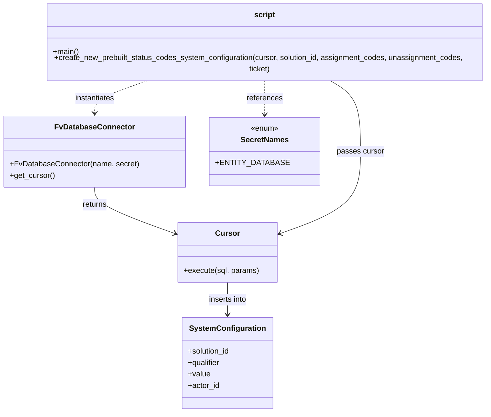

# Diagram: entity_core/entity_service/entity_service_scripts/set_prebuilt_entity_status_codes.py


> Auto-generated by Obscura crawlers

## Diagram 1

```mermaid
flowchart LR
    Start([Start]) --> DBConn[FvDatabaseConnector("set_prebuilt_entity_status_codes", SecretNames.ENTITY_DATABASE)]
    DBConn --> Cursor[DB_CONN.get_cursor()]
    Cursor --> Prepare[Prepare parameters]
    Prepare --> CreateCall[create_new_prebuilt_status_codes_system_configuration(cursor, solution_id, assignment_codes, unassignment_codes, ticket)]
    CreateCall --> Payload[Build JSON payload: {"assignment_codes": assignment_codes, "unassignment_codes": unassignment_codes}]
    Payload --> Execute[cursor.execute(INSERT INTO system_configuration ... , params)]
    Execute --> End([End])
```

> SVG rendering failed for this diagram.

## Diagram 2



### SVG

<svg id="container" width="1021.7265625" xmlns="http://www.w3.org/2000/svg" class="classDiagram" height="856" viewBox="0 0 1021.7265625 856" role="graphics-document document" aria-roledescription="class"><style>#container{font-family:"trebuchet ms",verdana,arial,sans-serif;font-size:16px;fill:#333;}@keyframes edge-animation-frame{from{stroke-dashoffset:0;}}@keyframes dash{to{stroke-dashoffset:0;}}#container .edge-animation-slow{stroke-dasharray:9,5!important;stroke-dashoffset:900;animation:dash 50s linear infinite;stroke-linecap:round;}#container .edge-animation-fast{stroke-dasharray:9,5!important;stroke-dashoffset:900;animation:dash 20s linear infinite;stroke-linecap:round;}#container .error-icon{fill:#552222;}#container .error-text{fill:#552222;stroke:#552222;}#container .edge-thickness-normal{stroke-width:1px;}#container .edge-thickness-thick{stroke-width:3.5px;}#container .edge-pattern-solid{stroke-dasharray:0;}#container .edge-thickness-invisible{stroke-width:0;fill:none;}#container .edge-pattern-dashed{stroke-dasharray:3;}#container .edge-pattern-dotted{stroke-dasharray:2;}#container .marker{fill:#333333;stroke:#333333;}#container .marker.cross{stroke:#333333;}#container svg{font-family:"trebuchet ms",verdana,arial,sans-serif;font-size:16px;}#container p{margin:0;}#container g.classGroup text{fill:#9370DB;stroke:none;font-family:"trebuchet ms",verdana,arial,sans-serif;font-size:10px;}#container g.classGroup text .title{font-weight:bolder;}#container .nodeLabel,#container .edgeLabel{color:#131300;}#container .edgeLabel .label rect{fill:#ECECFF;}#container .label text{fill:#131300;}#container .labelBkg{background:#ECECFF;}#container .edgeLabel .label span{background:#ECECFF;}#container .classTitle{font-weight:bolder;}#container .node rect,#container .node circle,#container .node ellipse,#container .node polygon,#container .node path{fill:#ECECFF;stroke:#9370DB;stroke-width:1px;}#container .divider{stroke:#9370DB;stroke-width:1;}#container g.clickable{cursor:pointer;}#container g.classGroup rect{fill:#ECECFF;stroke:#9370DB;}#container g.classGroup line{stroke:#9370DB;stroke-width:1;}#container .classLabel .box{stroke:none;stroke-width:0;fill:#ECECFF;opacity:0.5;}#container .classLabel .label{fill:#9370DB;font-size:10px;}#container .relation{stroke:#333333;stroke-width:1;fill:none;}#container .dashed-line{stroke-dasharray:3;}#container .dotted-line{stroke-dasharray:1 2;}#container #compositionStart,#container .composition{fill:#333333!important;stroke:#333333!important;stroke-width:1;}#container #compositionEnd,#container .composition{fill:#333333!important;stroke:#333333!important;stroke-width:1;}#container #dependencyStart,#container .dependency{fill:#333333!important;stroke:#333333!important;stroke-width:1;}#container #dependencyStart,#container .dependency{fill:#333333!important;stroke:#333333!important;stroke-width:1;}#container #extensionStart,#container .extension{fill:transparent!important;stroke:#333333!important;stroke-width:1;}#container #extensionEnd,#container .extension{fill:transparent!important;stroke:#333333!important;stroke-width:1;}#container #aggregationStart,#container .aggregation{fill:transparent!important;stroke:#333333!important;stroke-width:1;}#container #aggregationEnd,#container .aggregation{fill:transparent!important;stroke:#333333!important;stroke-width:1;}#container #lollipopStart,#container .lollipop{fill:#ECECFF!important;stroke:#333333!important;stroke-width:1;}#container #lollipopEnd,#container .lollipop{fill:#ECECFF!important;stroke:#333333!important;stroke-width:1;}#container .edgeTerminals{font-size:11px;line-height:initial;}#container .classTitleText{text-anchor:middle;font-size:18px;fill:#333;}#container .label-icon{display:inline-block;height:1em;overflow:visible;vertical-align:-0.125em;}#container .node .label-icon path{fill:currentColor;stroke:revert;stroke-width:revert;}#container :root{--mermaid-font-family:"trebuchet ms",verdana,arial,sans-serif;}</style><g><defs><marker id="container_class-aggregationStart" class="marker aggregation class" refX="18" refY="7" markerWidth="190" markerHeight="240" orient="auto"><path d="M 18,7 L9,13 L1,7 L9,1 Z"></path></marker></defs><defs><marker id="container_class-aggregationEnd" class="marker aggregation class" refX="1" refY="7" markerWidth="20" markerHeight="28" orient="auto"><path d="M 18,7 L9,13 L1,7 L9,1 Z"></path></marker></defs><defs><marker id="container_class-extensionStart" class="marker extension class" refX="18" refY="7" markerWidth="190" markerHeight="240" orient="auto"><path d="M 1,7 L18,13 V 1 Z"></path></marker></defs><defs><marker id="container_class-extensionEnd" class="marker extension class" refX="1" refY="7" markerWidth="20" markerHeight="28" orient="auto"><path d="M 1,1 V 13 L18,7 Z"></path></marker></defs><defs><marker id="container_class-compositionStart" class="marker composition class" refX="18" refY="7" markerWidth="190" markerHeight="240" orient="auto"><path d="M 18,7 L9,13 L1,7 L9,1 Z"></path></marker></defs><defs><marker id="container_class-compositionEnd" class="marker composition class" refX="1" refY="7" markerWidth="20" markerHeight="28" orient="auto"><path d="M 18,7 L9,13 L1,7 L9,1 Z"></path></marker></defs><defs><marker id="container_class-dependencyStart" class="marker dependency class" refX="6" refY="7" markerWidth="190" markerHeight="240" orient="auto"><path d="M 5,7 L9,13 L1,7 L9,1 Z"></path></marker></defs><defs><marker id="container_class-dependencyEnd" class="marker dependency class" refX="13" refY="7" markerWidth="20" markerHeight="28" orient="auto"><path d="M 18,7 L9,13 L14,7 L9,1 Z"></path></marker></defs><defs><marker id="container_class-lollipopStart" class="marker lollipop class" refX="13" refY="7" markerWidth="190" markerHeight="240" orient="auto"><circle stroke="black" fill="transparent" cx="7" cy="7" r="6"></circle></marker></defs><defs><marker id="container_class-lollipopEnd" class="marker lollipop class" refX="1" refY="7" markerWidth="190" markerHeight="240" orient="auto"><circle stroke="black" fill="transparent" cx="7" cy="7" r="6"></circle></marker></defs><g class="root"><g class="clusters"></g><g class="edgePaths"><path d="M305.472,158L286.79,164.167C268.108,170.333,230.743,182.667,212.061,194C193.379,205.333,193.379,215.667,193.379,220.833L193.379,226" id="id_script_FvDatabaseConnector_1" class="edge-thickness-normal edge-pattern-dashed relation" style=";;;" data-edge="true" data-et="edge" data-id="id_script_FvDatabaseConnector_1" data-points="W3sieCI6MzA1LjQ3MTkyMzgyODEyNSwieSI6MTU4fSx7IngiOjE5My4zNzg5MDYyNSwieSI6MTk1fSx7IngiOjE5My4zNzg5MDYyNSwieSI6MjMyfV0=" marker-end="url(#container_class-dependencyEnd)"></path><path d="M532.688,158L532.688,164.167C532.688,170.333,532.688,182.667,532.688,194.5C532.688,206.333,532.688,217.667,532.688,223.333L532.688,229" id="id_script_SecretNames_2" class="edge-thickness-normal edge-pattern-dashed relation" style=";;;" data-edge="true" data-et="edge" data-id="id_script_SecretNames_2" data-points="W3sieCI6NTMyLjY4NzUsInkiOjE1OH0seyJ4Ijo1MzIuNjg3NSwieSI6MTk1fSx7IngiOjUzMi42ODc1LCJ5IjoyMzV9XQ==" marker-end="url(#container_class-dependencyEnd)"></path><path d="M193.379,382L193.379,388.167C193.379,394.333,193.379,406.667,219.277,422.65C245.176,438.633,296.973,458.266,322.872,468.082L348.77,477.898" id="id_FvDatabaseConnector_Cursor_3" class="edge-thickness-normal edge-pattern-solid relation" style=";;;" data-edge="true" data-et="edge" data-id="id_FvDatabaseConnector_Cursor_3" data-points="W3sieCI6MTkzLjM3ODkwNjI1LCJ5IjozODJ9LHsieCI6MTkzLjM3ODkwNjI1LCJ5Ijo0MTl9LHsieCI6MzU0LjM4MDg1OTM3NSwieSI6NDgwLjAyNDg2NjU2MTU0NDU3fV0=" marker-end="url(#container_class-dependencyEnd)"></path><path d="M658.816,158L669.186,164.167C679.557,170.333,700.298,182.667,710.669,207.5C721.039,232.333,721.039,269.667,721.039,307C721.039,344.333,721.039,381.667,695.14,410.15C669.242,438.633,617.445,458.266,591.546,468.082L565.648,477.898" id="id_script_Cursor_4" class="edge-thickness-normal edge-pattern-solid relation" style=";;;" data-edge="true" data-et="edge" data-id="id_script_Cursor_4" data-points="W3sieCI6NjU4LjgxNTc3ODQ1OTgyMTQsInkiOjE1OH0seyJ4Ijo3MjEuMDM5MDYyNSwieSI6MTk1fSx7IngiOjcyMS4wMzkwNjI1LCJ5IjozMDd9LHsieCI6NzIxLjAzOTA2MjUsInkiOjQxOX0seyJ4Ijo1NjAuMDM3MTA5Mzc1LCJ5Ijo0ODAuMDI0ODY2NTYxNTQ0NTd9XQ==" marker-end="url(#container_class-dependencyEnd)"></path><path d="M457.209,582L457.209,588.167C457.209,594.333,457.209,606.667,457.209,618C457.209,629.333,457.209,639.667,457.209,644.833L457.209,650" id="id_Cursor_SystemConfiguration_5" class="edge-thickness-normal edge-pattern-solid relation" style=";;;" data-edge="true" data-et="edge" data-id="id_Cursor_SystemConfiguration_5" data-points="W3sieCI6NDU3LjIwODk4NDM3NSwieSI6NTgyfSx7IngiOjQ1Ny4yMDg5ODQzNzUsInkiOjYxOX0seyJ4Ijo0NTcuMjA4OTg0Mzc1LCJ5Ijo2NTZ9XQ==" marker-end="url(#container_class-dependencyEnd)"></path></g><g class="edgeLabels"><g class="edgeLabel" transform="translate(193.37890625, 195)"><g class="label" data-id="id_script_FvDatabaseConnector_1" transform="translate(-42.9140625, -12)"><foreignObject width="85.828125" height="24"><div xmlns="http://www.w3.org/1999/xhtml" class="labelBkg" style="display: table-cell; white-space: nowrap; line-height: 1.5; max-width: 200px; text-align: center;"><span class="edgeLabel"><p>instantiates</p></span></div></foreignObject></g></g><g class="edgeLabel" transform="translate(532.6875, 195)"><g class="label" data-id="id_script_SecretNames_2" transform="translate(-37.828125, -12)"><foreignObject width="75.65625" height="24"><div xmlns="http://www.w3.org/1999/xhtml" class="labelBkg" style="display: table-cell; white-space: nowrap; line-height: 1.5; max-width: 200px; text-align: center;"><span class="edgeLabel"><p>references</p></span></div></foreignObject></g></g><g class="edgeLabel" transform="translate(193.37890625, 419)"><g class="label" data-id="id_FvDatabaseConnector_Cursor_3" transform="translate(-26.265625, -12)"><foreignObject width="52.53125" height="24"><div xmlns="http://www.w3.org/1999/xhtml" class="labelBkg" style="display: table-cell; white-space: nowrap; line-height: 1.5; max-width: 200px; text-align: center;"><span class="edgeLabel"><p>returns</p></span></div></foreignObject></g></g><g class="edgeLabel" transform="translate(721.0390625, 307)"><g class="label" data-id="id_script_Cursor_4" transform="translate(-49.421875, -12)"><foreignObject width="98.84375" height="24"><div xmlns="http://www.w3.org/1999/xhtml" class="labelBkg" style="display: table-cell; white-space: nowrap; line-height: 1.5; max-width: 200px; text-align: center;"><span class="edgeLabel"><p>passes cursor</p></span></div></foreignObject></g></g><g class="edgeLabel" transform="translate(457.208984375, 619)"><g class="label" data-id="id_Cursor_SystemConfiguration_5" transform="translate(-41.2578125, -12)"><foreignObject width="82.515625" height="24"><div xmlns="http://www.w3.org/1999/xhtml" class="labelBkg" style="display: table-cell; white-space: nowrap; line-height: 1.5; max-width: 200px; text-align: center;"><span class="edgeLabel"><p>inserts into</p></span></div></foreignObject></g></g></g><g class="nodes"><g class="node default" id="classId-script-0" transform="translate(532.6875, 83)"><g class="basic label-container"><path d="M-481.0390625 -75 L481.0390625 -75 L481.0390625 75 L-481.0390625 75" stroke="none" stroke-width="0" fill="#ECECFF" style=""></path><path d="M-481.0390625 -75 C-196.57092689889384 -75, 87.89720870221231 -75, 481.0390625 -75 M-481.0390625 -75 C-283.9559881438746 -75, -86.87291378774927 -75, 481.0390625 -75 M481.0390625 -75 C481.0390625 -32.068146457340696, 481.0390625 10.863707085318609, 481.0390625 75 M481.0390625 -75 C481.0390625 -32.255255286002296, 481.0390625 10.489489427995409, 481.0390625 75 M481.0390625 75 C158.76130309660635 75, -163.5164563067873 75, -481.0390625 75 M481.0390625 75 C263.00738750876224 75, 44.97571251752453 75, -481.0390625 75 M-481.0390625 75 C-481.0390625 32.45726958605492, -481.0390625 -10.08546082789016, -481.0390625 -75 M-481.0390625 75 C-481.0390625 41.554299258601475, -481.0390625 8.10859851720295, -481.0390625 -75" stroke="#9370DB" stroke-width="1.3" fill="none" stroke-dasharray="0 0" style=""></path></g><g class="annotation-group text" transform="translate(0, -51)"></g><g class="label-group text" transform="translate(-21.03125, -51)"><g class="label" style="font-weight: bolder" transform="translate(0,-12)"><foreignObject width="42.0625" height="24"><div xmlns="http://www.w3.org/1999/xhtml" style="display: table-cell; white-space: nowrap; line-height: 1.5; max-width: 91px; text-align: center;"><span class="nodeLabel markdown-node-label" style=""><p>script</p></span></div></foreignObject></g></g><g class="members-group text" transform="translate(-469.0390625, -3)"></g><g class="methods-group text" transform="translate(-469.0390625, 27)"><g class="label" style="" transform="translate(0,-12)"><foreignObject width="54.65625" height="24"><div xmlns="http://www.w3.org/1999/xhtml" style="display: table-cell; white-space: nowrap; line-height: 1.5; max-width: 112px; text-align: center;"><span class="nodeLabel markdown-node-label" style=""><p>+main()</p></span></div></foreignObject></g><g class="label" style="" transform="translate(0,12)"><foreignObject width="917.046875" height="24"><div xmlns="http://www.w3.org/1999/xhtml" style="display: table-cell; white-space: nowrap; line-height: 1.5; max-width: 974px; text-align: center;"><span class="nodeLabel markdown-node-label" style=""><p>+create_new_prebuilt_status_codes_system_configuration(cursor, solution_id, assignment_codes, unassignment_codes, ticket)</p></span></div></foreignObject></g></g><g class="divider" style=""><path d="M-481.0390625 -27 C-172.0369500060362 -27, 136.9651624879276 -27, 481.0390625 -27 M-481.0390625 -27 C-222.95560735211217 -27, 35.127847795775665 -27, 481.0390625 -27" stroke="#9370DB" stroke-width="1.3" fill="none" stroke-dasharray="0 0" style=""></path></g><g class="divider" style=""><path d="M-481.0390625 -3 C-150.79864406015287 -3, 179.44177437969427 -3, 481.0390625 -3 M-481.0390625 -3 C-176.52735664338923 -3, 127.98434921322155 -3, 481.0390625 -3" stroke="#9370DB" stroke-width="1.3" fill="none" stroke-dasharray="0 0" style=""></path></g></g><g class="node default" id="classId-FvDatabaseConnector-1" transform="translate(193.37890625, 307)"><g class="basic label-container"><path d="M-185.37890625 -75 L185.37890625 -75 L185.37890625 75 L-185.37890625 75" stroke="none" stroke-width="0" fill="#ECECFF" style=""></path><path d="M-185.37890625 -75 C-84.72482830589232 -75, 15.929249638215367 -75, 185.37890625 -75 M-185.37890625 -75 C-62.312738131478326 -75, 60.75342998704335 -75, 185.37890625 -75 M185.37890625 -75 C185.37890625 -15.115475035769947, 185.37890625 44.769049928460106, 185.37890625 75 M185.37890625 -75 C185.37890625 -27.53889341535325, 185.37890625 19.9222131692935, 185.37890625 75 M185.37890625 75 C97.57999620422562 75, 9.781086158451245 75, -185.37890625 75 M185.37890625 75 C107.95950420558758 75, 30.540102161175156 75, -185.37890625 75 M-185.37890625 75 C-185.37890625 22.40816224928853, -185.37890625 -30.18367550142294, -185.37890625 -75 M-185.37890625 75 C-185.37890625 27.758473756179647, -185.37890625 -19.483052487640705, -185.37890625 -75" stroke="#9370DB" stroke-width="1.3" fill="none" stroke-dasharray="0 0" style=""></path></g><g class="annotation-group text" transform="translate(0, -51)"></g><g class="label-group text" transform="translate(-79.3046875, -51)"><g class="label" style="font-weight: bolder" transform="translate(0,-12)"><foreignObject width="158.609375" height="24"><div xmlns="http://www.w3.org/1999/xhtml" style="display: table-cell; white-space: nowrap; line-height: 1.5; max-width: 207px; text-align: center;"><span class="nodeLabel markdown-node-label" style=""><p>FvDatabaseConnector</p></span></div></foreignObject></g></g><g class="members-group text" transform="translate(-173.37890625, -3)"></g><g class="methods-group text" transform="translate(-173.37890625, 27)"><g class="label" style="" transform="translate(0,-12)"><foreignObject width="267.453125" height="24"><div xmlns="http://www.w3.org/1999/xhtml" style="display: table-cell; white-space: nowrap; line-height: 1.5; max-width: 325px; text-align: center;"><span class="nodeLabel markdown-node-label" style=""><p>+FvDatabaseConnector(name, secret)</p></span></div></foreignObject></g><g class="label" style="" transform="translate(0,12)"><foreignObject width="94.640625" height="24"><div xmlns="http://www.w3.org/1999/xhtml" style="display: table-cell; white-space: nowrap; line-height: 1.5; max-width: 152px; text-align: center;"><span class="nodeLabel markdown-node-label" style=""><p>+get_cursor()</p></span></div></foreignObject></g></g><g class="divider" style=""><path d="M-185.37890625 -27 C-73.61668382512572 -27, 38.14553859974856 -27, 185.37890625 -27 M-185.37890625 -27 C-107.85832435202775 -27, -30.3377424540555 -27, 185.37890625 -27" stroke="#9370DB" stroke-width="1.3" fill="none" stroke-dasharray="0 0" style=""></path></g><g class="divider" style=""><path d="M-185.37890625 -3 C-104.30344864766076 -3, -23.227991045321517 -3, 185.37890625 -3 M-185.37890625 -3 C-66.65473963369543 -3, 52.069426982609144 -3, 185.37890625 -3" stroke="#9370DB" stroke-width="1.3" fill="none" stroke-dasharray="0 0" style=""></path></g></g><g class="node default" id="classId-Cursor-2" transform="translate(457.208984375, 519)"><g class="basic label-container"><path d="M-102.828125 -63 L102.828125 -63 L102.828125 63 L-102.828125 63" stroke="none" stroke-width="0" fill="#ECECFF" style=""></path><path d="M-102.828125 -63 C-35.674390073575395 -63, 31.47934485284921 -63, 102.828125 -63 M-102.828125 -63 C-49.477367191043236 -63, 3.873390617913529 -63, 102.828125 -63 M102.828125 -63 C102.828125 -15.77955418521072, 102.828125 31.44089162957856, 102.828125 63 M102.828125 -63 C102.828125 -14.522161347391204, 102.828125 33.95567730521759, 102.828125 63 M102.828125 63 C42.03783151131986 63, -18.752461977360284 63, -102.828125 63 M102.828125 63 C44.61581262826659 63, -13.596499743466822 63, -102.828125 63 M-102.828125 63 C-102.828125 15.347529851784216, -102.828125 -32.30494029643157, -102.828125 -63 M-102.828125 63 C-102.828125 13.706581181849764, -102.828125 -35.58683763630047, -102.828125 -63" stroke="#9370DB" stroke-width="1.3" fill="none" stroke-dasharray="0 0" style=""></path></g><g class="annotation-group text" transform="translate(0, -39)"></g><g class="label-group text" transform="translate(-23.90625, -39)"><g class="label" style="font-weight: bolder" transform="translate(0,-12)"><foreignObject width="47.8125" height="24"><div xmlns="http://www.w3.org/1999/xhtml" style="display: table-cell; white-space: nowrap; line-height: 1.5; max-width: 98px; text-align: center;"><span class="nodeLabel markdown-node-label" style=""><p>Cursor</p></span></div></foreignObject></g></g><g class="members-group text" transform="translate(-90.828125, 9)"></g><g class="methods-group text" transform="translate(-90.828125, 39)"><g class="label" style="" transform="translate(0,-12)"><foreignObject width="157.75" height="24"><div xmlns="http://www.w3.org/1999/xhtml" style="display: table-cell; white-space: nowrap; line-height: 1.5; max-width: 215px; text-align: center;"><span class="nodeLabel markdown-node-label" style=""><p>+execute(sql, params)</p></span></div></foreignObject></g></g><g class="divider" style=""><path d="M-102.828125 -15 C-59.401809137410254 -15, -15.975493274820508 -15, 102.828125 -15 M-102.828125 -15 C-48.47570751499061 -15, 5.87670997001878 -15, 102.828125 -15" stroke="#9370DB" stroke-width="1.3" fill="none" stroke-dasharray="0 0" style=""></path></g><g class="divider" style=""><path d="M-102.828125 9 C-37.89654122821291 9, 27.03504254357418 9, 102.828125 9 M-102.828125 9 C-28.819398631863365 9, 45.18932773627327 9, 102.828125 9" stroke="#9370DB" stroke-width="1.3" fill="none" stroke-dasharray="0 0" style=""></path></g></g><g class="node default" id="classId-SecretNames-3" transform="translate(532.6875, 307)"><g class="basic label-container"><path d="M-103.9296875 -72 L103.9296875 -72 L103.9296875 72 L-103.9296875 72" stroke="none" stroke-width="0" fill="#ECECFF" style=""></path><path d="M-103.9296875 -72 C-50.02718449285232 -72, 3.8753185142953583 -72, 103.9296875 -72 M-103.9296875 -72 C-52.46898817602941 -72, -1.0082888520588256 -72, 103.9296875 -72 M103.9296875 -72 C103.9296875 -35.86322858641853, 103.9296875 0.27354282716294165, 103.9296875 72 M103.9296875 -72 C103.9296875 -32.81802908635999, 103.9296875 6.363941827280016, 103.9296875 72 M103.9296875 72 C32.53978674971235 72, -38.8501140005753 72, -103.9296875 72 M103.9296875 72 C39.798516211958415 72, -24.33265507608317 72, -103.9296875 72 M-103.9296875 72 C-103.9296875 26.592327745338793, -103.9296875 -18.815344509322415, -103.9296875 -72 M-103.9296875 72 C-103.9296875 30.923533647249904, -103.9296875 -10.152932705500191, -103.9296875 -72" stroke="#9370DB" stroke-width="1.3" fill="none" stroke-dasharray="0 0" style=""></path></g><g class="annotation-group text" transform="translate(-29.53125, -48)"><g class="label" style="" transform="translate(0,-12)"><foreignObject width="59.0625" height="24"><div xmlns="http://www.w3.org/1999/xhtml" style="display: table-cell; white-space: nowrap; line-height: 1.5; max-width: 109px; text-align: center;"><span class="nodeLabel markdown-node-label" style=""><p>«enum»</p></span></div></foreignObject></g></g><g class="label-group text" transform="translate(-48.03125, -24)"><g class="label" style="font-weight: bolder" transform="translate(0,-12)"><foreignObject width="96.0625" height="24"><div xmlns="http://www.w3.org/1999/xhtml" style="display: table-cell; white-space: nowrap; line-height: 1.5; max-width: 145px; text-align: center;"><span class="nodeLabel markdown-node-label" style=""><p>SecretNames</p></span></div></foreignObject></g></g><g class="members-group text" transform="translate(-91.9296875, 24)"><g class="label" style="" transform="translate(0,-12)"><foreignObject width="135.828125" height="24"><div xmlns="http://www.w3.org/1999/xhtml" style="display: table-cell; white-space: nowrap; line-height: 1.5; max-width: 193px; text-align: center;"><span class="nodeLabel markdown-node-label" style=""><p>+ENTITY_DATABASE</p></span></div></foreignObject></g></g><g class="methods-group text" transform="translate(-91.9296875, 72)"></g><g class="divider" style=""><path d="M-103.9296875 0 C-26.623512365602792 0, 50.682662768794415 0, 103.9296875 0 M-103.9296875 0 C-24.782353368731265 0, 54.36498076253747 0, 103.9296875 0" stroke="#9370DB" stroke-width="1.3" fill="none" stroke-dasharray="0 0" style=""></path></g><g class="divider" style=""><path d="M-103.9296875 48 C-58.47678978397998 48, -13.023892067959963 48, 103.9296875 48 M-103.9296875 48 C-32.7337208839471 48, 38.4622457321058 48, 103.9296875 48" stroke="#9370DB" stroke-width="1.3" fill="none" stroke-dasharray="0 0" style=""></path></g></g><g class="node default" id="classId-SystemConfiguration-4" transform="translate(457.208984375, 752)"><g class="basic label-container"><path d="M-95.0703125 -96 L95.0703125 -96 L95.0703125 96 L-95.0703125 96" stroke="none" stroke-width="0" fill="#ECECFF" style=""></path><path d="M-95.0703125 -96 C-42.06347665919616 -96, 10.943359181607676 -96, 95.0703125 -96 M-95.0703125 -96 C-50.387639118579386 -96, -5.704965737158773 -96, 95.0703125 -96 M95.0703125 -96 C95.0703125 -31.554979760084265, 95.0703125 32.89004047983147, 95.0703125 96 M95.0703125 -96 C95.0703125 -30.393487832040194, 95.0703125 35.21302433591961, 95.0703125 96 M95.0703125 96 C21.264900382242388 96, -52.540511735515224 96, -95.0703125 96 M95.0703125 96 C43.91169733602614 96, -7.246917827947726 96, -95.0703125 96 M-95.0703125 96 C-95.0703125 19.728507287714237, -95.0703125 -56.542985424571526, -95.0703125 -96 M-95.0703125 96 C-95.0703125 56.62310696397273, -95.0703125 17.246213927945462, -95.0703125 -96" stroke="#9370DB" stroke-width="1.3" fill="none" stroke-dasharray="0 0" style=""></path></g><g class="annotation-group text" transform="translate(0, -72)"></g><g class="label-group text" transform="translate(-75.921875, -72)"><g class="label" style="font-weight: bolder" transform="translate(0,-12)"><foreignObject width="151.84375" height="24"><div xmlns="http://www.w3.org/1999/xhtml" style="display: table-cell; white-space: nowrap; line-height: 1.5; max-width: 199px; text-align: center;"><span class="nodeLabel markdown-node-label" style=""><p>SystemConfiguration</p></span></div></foreignObject></g></g><g class="members-group text" transform="translate(-83.0703125, -24)"><g class="label" style="" transform="translate(0,-12)"><foreignObject width="90.21875" height="24"><div xmlns="http://www.w3.org/1999/xhtml" style="display: table-cell; white-space: nowrap; line-height: 1.5; max-width: 148px; text-align: center;"><span class="nodeLabel markdown-node-label" style=""><p>+solution_id</p></span></div></foreignObject></g><g class="label" style="" transform="translate(0,12)"><foreignObject width="68.71875" height="24"><div xmlns="http://www.w3.org/1999/xhtml" style="display: table-cell; white-space: nowrap; line-height: 1.5; max-width: 127px; text-align: center;"><span class="nodeLabel markdown-node-label" style=""><p>+qualifier</p></span></div></foreignObject></g><g class="label" style="" transform="translate(0,36)"><foreignObject width="46.71875" height="24"><div xmlns="http://www.w3.org/1999/xhtml" style="display: table-cell; white-space: nowrap; line-height: 1.5; max-width: 104px; text-align: center;"><span class="nodeLabel markdown-node-label" style=""><p>+value</p></span></div></foreignObject></g><g class="label" style="" transform="translate(0,60)"><foreignObject width="66.28125" height="24"><div xmlns="http://www.w3.org/1999/xhtml" style="display: table-cell; white-space: nowrap; line-height: 1.5; max-width: 124px; text-align: center;"><span class="nodeLabel markdown-node-label" style=""><p>+actor_id</p></span></div></foreignObject></g></g><g class="methods-group text" transform="translate(-83.0703125, 96)"></g><g class="divider" style=""><path d="M-95.0703125 -48 C-36.57540922002639 -48, 21.919494059947226 -48, 95.0703125 -48 M-95.0703125 -48 C-40.903838310014635 -48, 13.26263587997073 -48, 95.0703125 -48" stroke="#9370DB" stroke-width="1.3" fill="none" stroke-dasharray="0 0" style=""></path></g><g class="divider" style=""><path d="M-95.0703125 72 C-20.059821352025565 72, 54.95066979594887 72, 95.0703125 72 M-95.0703125 72 C-24.102343141667617 72, 46.865626216664765 72, 95.0703125 72" stroke="#9370DB" stroke-width="1.3" fill="none" stroke-dasharray="0 0" style=""></path></g></g></g></g></g></svg>
