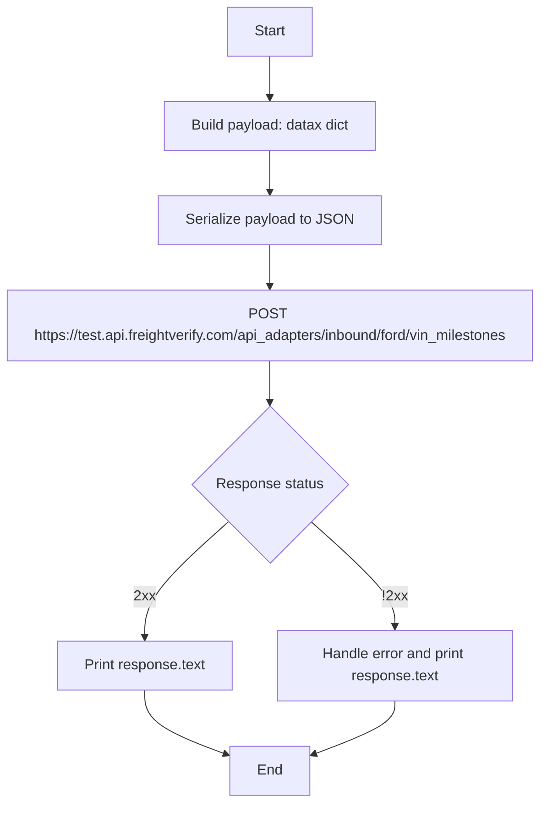
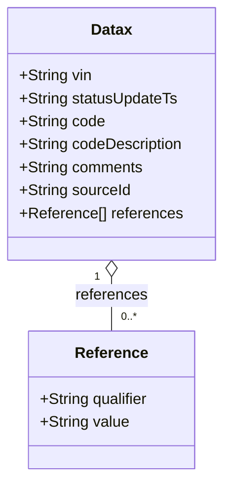

# Diagram: entity_core/entity_service/entity_service_scripts/test-intigrations-add-status-update.py

> Auto-generated by Obscura crawlers

## Diagram 1

### SVG

<svg id="container" width="638.1875" xmlns="http://www.w3.org/2000/svg" class="flowchart" height="884.703125" viewBox="0 0 638.1875 884.703125" role="graphics-document document" aria-roledescription="flowchart-v2"><g><marker id="container_flowchart-v2-pointEnd" class="marker flowchart-v2" viewBox="0 0 10 10" refX="5" refY="5" markerUnits="userSpaceOnUse" markerWidth="8" markerHeight="8" orient="auto"><path d="M 0 0 L 10 5 L 0 10 z" class="arrowMarkerPath" style="stroke-width: 1; stroke-dasharray: 1, 0;"></path></marker><marker id="container_flowchart-v2-pointStart" class="marker flowchart-v2" viewBox="0 0 10 10" refX="4.5" refY="5" markerUnits="userSpaceOnUse" markerWidth="8" markerHeight="8" orient="auto"><path d="M 0 5 L 10 10 L 10 0 z" class="arrowMarkerPath" style="stroke-width: 1; stroke-dasharray: 1, 0;"></path></marker><marker id="container_flowchart-v2-circleEnd" class="marker flowchart-v2" viewBox="0 0 10 10" refX="11" refY="5" markerUnits="userSpaceOnUse" markerWidth="11" markerHeight="11" orient="auto"><circle cx="5" cy="5" r="5" class="arrowMarkerPath" style="stroke-width: 1; stroke-dasharray: 1, 0;"></circle></marker><marker id="container_flowchart-v2-circleStart" class="marker flowchart-v2" viewBox="0 0 10 10" refX="-1" refY="5" markerUnits="userSpaceOnUse" markerWidth="11" markerHeight="11" orient="auto"><circle cx="5" cy="5" r="5" class="arrowMarkerPath" style="stroke-width: 1; stroke-dasharray: 1, 0;"></circle></marker><marker id="container_flowchart-v2-crossEnd" class="marker cross flowchart-v2" viewBox="0 0 11 11" refX="12" refY="5.2" markerUnits="userSpaceOnUse" markerWidth="11" markerHeight="11" orient="auto"><path d="M 1,1 l 9,9 M 10,1 l -9,9" class="arrowMarkerPath" style="stroke-width: 2; stroke-dasharray: 1, 0;"></path></marker><marker id="container_flowchart-v2-crossStart" class="marker cross flowchart-v2" viewBox="0 0 11 11" refX="-1" refY="5.2" markerUnits="userSpaceOnUse" markerWidth="11" markerHeight="11" orient="auto"><path d="M 1,1 l 9,9 M 10,1 l -9,9" class="arrowMarkerPath" style="stroke-width: 2; stroke-dasharray: 1, 0;"></path></marker><g class="root"><g class="clusters"></g><g class="edgePaths"><path d="M319.094,62L319.094,66.167C319.094,70.333,319.094,78.667,319.094,86.333C319.094,94,319.094,101,319.094,104.5L319.094,108" id="L_A_B_0" class="edge-thickness-normal edge-pattern-solid edge-thickness-normal edge-pattern-solid flowchart-link" style=";" data-edge="true" data-et="edge" data-id="L_A_B_0" data-points="W3sieCI6MzE5LjA5Mzc1LCJ5Ijo2Mn0seyJ4IjozMTkuMDkzNzUsInkiOjg3fSx7IngiOjMxOS4wOTM3NSwieSI6MTEyfV0=" marker-end="url(#container_flowchart-v2-pointEnd)"></path><path d="M319.094,166L319.094,170.167C319.094,174.333,319.094,182.667,319.094,190.333C319.094,198,319.094,205,319.094,208.5L319.094,212" id="L_B_C_0" class="edge-thickness-normal edge-pattern-solid edge-thickness-normal edge-pattern-solid flowchart-link" style=";" data-edge="true" data-et="edge" data-id="L_B_C_0" data-points="W3sieCI6MzE5LjA5Mzc1LCJ5IjoxNjZ9LHsieCI6MzE5LjA5Mzc1LCJ5IjoxOTF9LHsieCI6MzE5LjA5Mzc1LCJ5IjoyMTZ9XQ==" marker-end="url(#container_flowchart-v2-pointEnd)"></path><path d="M319.094,270L319.094,274.167C319.094,278.333,319.094,286.667,319.094,294.333C319.094,302,319.094,309,319.094,312.5L319.094,316" id="L_C_D_0" class="edge-thickness-normal edge-pattern-solid edge-thickness-normal edge-pattern-solid flowchart-link" style=";" data-edge="true" data-et="edge" data-id="L_C_D_0" data-points="W3sieCI6MzE5LjA5Mzc1LCJ5IjoyNzB9LHsieCI6MzE5LjA5Mzc1LCJ5IjoyOTV9LHsieCI6MzE5LjA5Mzc1LCJ5IjozMjB9XQ==" marker-end="url(#container_flowchart-v2-pointEnd)"></path><path d="M319.094,398L319.094,402.167C319.094,406.333,319.094,414.667,319.094,422.333C319.094,430,319.094,437,319.094,440.5L319.094,444" id="L_D_E_0" class="edge-thickness-normal edge-pattern-solid edge-thickness-normal edge-pattern-solid flowchart-link" style=";" data-edge="true" data-et="edge" data-id="L_D_E_0" data-points="W3sieCI6MzE5LjA5Mzc1LCJ5IjozOTh9LHsieCI6MzE5LjA5Mzc1LCJ5Ijo0MjN9LHsieCI6MzE5LjA5Mzc1LCJ5Ijo0NDh9XQ==" marker-end="url(#container_flowchart-v2-pointEnd)"></path><path d="M273.334,574.944L257.785,588.737C242.236,602.53,211.137,630.117,195.588,651.41C180.039,672.703,180.039,687.703,180.039,695.203L180.039,702.703" id="L_E_F_0" class="edge-thickness-normal edge-pattern-solid edge-thickness-normal edge-pattern-solid flowchart-link" style=";" data-edge="true" data-et="edge" data-id="L_E_F_0" data-points="W3sieCI6MjczLjMzNDIwOTA2NDYyMTMsInkiOjU3NC45NDM1ODQwNjQ2MjEzfSx7IngiOjE4MC4wMzkwNjI1LCJ5Ijo2NTcuNzAzMTI1fSx7IngiOjE4MC4wMzkwNjI1LCJ5Ijo3MDYuNzAzMTI1fV0=" marker-end="url(#container_flowchart-v2-pointEnd)"></path><path d="M364.853,574.944L380.402,588.737C395.952,602.53,427.05,630.117,442.599,649.41C458.148,668.703,458.148,679.703,458.148,685.203L458.148,690.703" id="L_E_G_0" class="edge-thickness-normal edge-pattern-solid edge-thickness-normal edge-pattern-solid flowchart-link" style=";" data-edge="true" data-et="edge" data-id="L_E_G_0" data-points="W3sieCI6MzY0Ljg1MzI5MDkzNTM3ODcsInkiOjU3NC45NDM1ODQwNjQ2MjEzfSx7IngiOjQ1OC4xNDg0Mzc1LCJ5Ijo2NTcuNzAzMTI1fSx7IngiOjQ1OC4xNDg0Mzc1LCJ5Ijo2OTQuNzAzMTI1fV0=" marker-end="url(#container_flowchart-v2-pointEnd)"></path><path d="M180.039,760.703L180.039,766.87C180.039,773.036,180.039,785.37,195.31,797.247C210.582,809.125,241.125,820.546,256.396,826.257L271.667,831.968" id="L_F_H_0" class="edge-thickness-normal edge-pattern-solid edge-thickness-normal edge-pattern-solid flowchart-link" style=";" data-edge="true" data-et="edge" data-id="L_F_H_0" data-points="W3sieCI6MTgwLjAzOTA2MjUsInkiOjc2MC43MDMxMjV9LHsieCI6MTgwLjAzOTA2MjUsInkiOjc5Ny43MDMxMjV9LHsieCI6Mjc1LjQxNDA2MjUsInkiOjgzMy4zNjg5NDg5MjI2OTIzfV0=" marker-end="url(#container_flowchart-v2-pointEnd)"></path><path d="M458.148,772.703L458.148,776.87C458.148,781.036,458.148,789.37,442.877,799.247C427.606,809.125,397.063,820.546,381.791,826.257L366.52,831.968" id="L_G_H_0" class="edge-thickness-normal edge-pattern-solid edge-thickness-normal edge-pattern-solid flowchart-link" style=";" data-edge="true" data-et="edge" data-id="L_G_H_0" data-points="W3sieCI6NDU4LjE0ODQzNzUsInkiOjc3Mi43MDMxMjV9LHsieCI6NDU4LjE0ODQzNzUsInkiOjc5Ny43MDMxMjV9LHsieCI6MzYyLjc3MzQzNzUsInkiOjgzMy4zNjg5NDg5MjI2OTIzfV0=" marker-end="url(#container_flowchart-v2-pointEnd)"></path></g><g class="edgeLabels"><g class="edgeLabel"><g class="label" data-id="L_A_B_0" transform="translate(0, 0)"><foreignObject width="0" height="0">

</foreignObject></g></g><g class="edgeLabel"><g class="label" data-id="L_B_C_0" transform="translate(0, 0)"><foreignObject width="0" height="0">

</foreignObject></g></g><g class="edgeLabel"><g class="label" data-id="L_C_D_0" transform="translate(0, 0)"><foreignObject width="0" height="0">

</foreignObject></g></g><g class="edgeLabel"><g class="label" data-id="L_D_E_0" transform="translate(0, 0)"><foreignObject width="0" height="0">

</foreignObject></g></g><g class="edgeLabel" transform="translate(180.0390625, 657.703125)"><g class="label" data-id="L_E_F_0" transform="translate(-11.7265625, -12)"><foreignObject width="23.453125" height="24">

2xx

</foreignObject></g></g><g class="edgeLabel" transform="translate(458.1484375, 657.703125)"><g class="label" data-id="L_E_G_0" transform="translate(-13.6484375, -12)"><foreignObject width="27.296875" height="24">

!2xx

</foreignObject></g></g><g class="edgeLabel"><g class="label" data-id="L_F_H_0" transform="translate(0, 0)"><foreignObject width="0" height="0">

</foreignObject></g></g><g class="edgeLabel"><g class="label" data-id="L_G_H_0" transform="translate(0, 0)"><foreignObject width="0" height="0">

</foreignObject></g></g></g><g class="nodes"><g class="node default" id="flowchart-A-0" transform="translate(319.09375, 35)"><rect class="basic label-container" style="" x="-47.5234375" y="-27" width="95.046875" height="54"></rect><g class="label" style="" transform="translate(-17.5234375, -12)"><rect></rect><foreignObject width="35.046875" height="24">

Start

</foreignObject></g></g><g class="node default" id="flowchart-B-1" transform="translate(319.09375, 139)"><rect class="basic label-container" style="" x="-119.96875" y="-27" width="239.9375" height="54"></rect><g class="label" style="" transform="translate(-89.96875, -12)"><rect></rect><foreignObject width="179.9375" height="24">

Build payload: datax dict

</foreignObject></g></g><g class="node default" id="flowchart-C-3" transform="translate(319.09375, 243)"><rect class="basic label-container" style="" x="-121.2109375" y="-27" width="242.421875" height="54"></rect><g class="label" style="" transform="translate(-91.2109375, -12)"><rect></rect><foreignObject width="182.421875" height="24">

Serialize payload to JSON

</foreignObject></g></g><g class="node default" id="flowchart-D-5" transform="translate(319.09375, 359)"><rect class="basic label-container" style="" x="-311.09375" y="-39" width="622.1875" height="78"></rect><g class="label" style="" transform="translate(-281.09375, -24)"><rect></rect><foreignObject width="562.1875" height="48">

POST https://test.api.freightverify.com/api_adapters/inbound/ford/vin_milestones

</foreignObject></g></g><g class="node default" id="flowchart-E-7" transform="translate(319.09375, 534.3515625)"><polygon points="86.3515625,0 172.703125,-86.3515625 86.3515625,-172.703125 0,-86.3515625" class="label-container" transform="translate(-85.8515625, 86.3515625)"></polygon><g class="label" style="" transform="translate(-59.3515625, -12)"><rect></rect><foreignObject width="118.703125" height="24">

Response status

</foreignObject></g></g><g class="node default" id="flowchart-F-9" transform="translate(180.0390625, 733.703125)"><rect class="basic label-container" style="" x="-98.109375" y="-27" width="196.21875" height="54"></rect><g class="label" style="" transform="translate(-68.109375, -12)"><rect></rect><foreignObject width="136.21875" height="24">

Print response.text

</foreignObject></g></g><g class="node default" id="flowchart-G-11" transform="translate(458.1484375, 733.703125)"><rect class="basic label-container" style="" x="-130" y="-39" width="260" height="78"></rect><g class="label" style="" transform="translate(-100, -24)"><rect></rect><foreignObject width="200" height="48">

Handle error and print response.text

</foreignObject></g></g><g class="node default" id="flowchart-H-13" transform="translate(319.09375, 849.703125)"><rect class="basic label-container" style="" x="-43.6796875" y="-27" width="87.359375" height="54"></rect><g class="label" style="" transform="translate(-13.6796875, -12)"><rect></rect><foreignObject width="27.359375" height="24">

End

</foreignObject></g></g></g></g></g></svg>

## Diagram 2

### SVG

<svg id="container" width="233.765625" xmlns="http://www.w3.org/2000/svg" class="classDiagram" height="498" viewBox="0 0 233.765625 498" role="graphics-document document" aria-roledescription="class"><g><defs><marker id="container_class-aggregationStart" class="marker aggregation class" refX="18" refY="7" markerWidth="190" markerHeight="240" orient="auto"><path d="M 18,7 L9,13 L1,7 L9,1 Z"></path></marker></defs><defs><marker id="container_class-aggregationEnd" class="marker aggregation class" refX="1" refY="7" markerWidth="20" markerHeight="28" orient="auto"><path d="M 18,7 L9,13 L1,7 L9,1 Z"></path></marker></defs><defs><marker id="container_class-extensionStart" class="marker extension class" refX="18" refY="7" markerWidth="190" markerHeight="240" orient="auto"><path d="M 1,7 L18,13 V 1 Z"></path></marker></defs><defs><marker id="container_class-extensionEnd" class="marker extension class" refX="1" refY="7" markerWidth="20" markerHeight="28" orient="auto"><path d="M 1,1 V 13 L18,7 Z"></path></marker></defs><defs><marker id="container_class-compositionStart" class="marker composition class" refX="18" refY="7" markerWidth="190" markerHeight="240" orient="auto"><path d="M 18,7 L9,13 L1,7 L9,1 Z"></path></marker></defs><defs><marker id="container_class-compositionEnd" class="marker composition class" refX="1" refY="7" markerWidth="20" markerHeight="28" orient="auto"><path d="M 18,7 L9,13 L1,7 L9,1 Z"></path></marker></defs><defs><marker id="container_class-dependencyStart" class="marker dependency class" refX="6" refY="7" markerWidth="190" markerHeight="240" orient="auto"><path d="M 5,7 L9,13 L1,7 L9,1 Z"></path></marker></defs><defs><marker id="container_class-dependencyEnd" class="marker dependency class" refX="13" refY="7" markerWidth="20" markerHeight="28" orient="auto"><path d="M 18,7 L9,13 L14,7 L9,1 Z"></path></marker></defs><defs><marker id="container_class-lollipopStart" class="marker lollipop class" refX="13" refY="7" markerWidth="190" markerHeight="240" orient="auto"><circle stroke="black" fill="transparent" cx="7" cy="7" r="6"></circle></marker></defs><defs><marker id="container_class-lollipopEnd" class="marker lollipop class" refX="1" refY="7" markerWidth="190" markerHeight="240" orient="auto"><circle stroke="black" fill="transparent" cx="7" cy="7" r="6"></circle></marker></defs><g class="root"><g class="clusters"></g><g class="edgePaths"><path d="M116.883,289.25L116.883,292.542C116.883,295.833,116.883,302.417,116.883,311.875C116.883,321.333,116.883,333.667,116.883,339.833L116.883,346" id="id_Datax_Reference_1" class="edge-thickness-normal edge-pattern-solid relation" style=";;;" data-edge="true" data-et="edge" data-id="id_Datax_Reference_1" data-points="W3sieCI6MTE2Ljg4MjgxMjUsInkiOjI3Mn0seyJ4IjoxMTYuODgyODEyNSwieSI6MzA5fSx7IngiOjExNi44ODI4MTI1LCJ5IjozNDZ9XQ==" marker-start="url(#container_class-aggregationStart)"></path></g><g class="edgeLabels"><g class="edgeLabel" transform="translate(116.8828125, 309)"><g class="label" data-id="id_Datax_Reference_1" transform="translate(-37.828125, -12)"><foreignObject width="75.65625" height="24">

references

</foreignObject></g></g><g class="edgeTerminals" transform="translate(101.88281125000005, 289.4999989285714)"><g class="inner" transform="translate(0, 0)"><foreignObject style="width: 9px; height: 12px;">
1
</foreignObject></g></g><g class="edgeTerminals" transform="translate(126.88281124999997, 323.4999989285714)"><g class="inner" transform="translate(0, 0)"></g><foreignObject style="width: 36px; height: 12px;">
0..*
</foreignObject></g></g><g class="nodes"><g class="node default" id="classId-Datax-0" transform="translate(116.8828125, 140)"><g class="basic label-container"><path d="M-108.8828125 -132 L108.8828125 -132 L108.8828125 132 L-108.8828125 132" stroke="none" stroke-width="0" fill="#ECECFF" style=""></path><path d="M-108.8828125 -132 C-38.803480078610605 -132, 31.27585234277879 -132, 108.8828125 -132 M-108.8828125 -132 C-39.19987807559082 -132, 30.483056348818366 -132, 108.8828125 -132 M108.8828125 -132 C108.8828125 -45.69342957460131, 108.8828125 40.61314085079738, 108.8828125 132 M108.8828125 -132 C108.8828125 -26.992122685991674, 108.8828125 78.01575462801665, 108.8828125 132 M108.8828125 132 C35.12753488867753 132, -38.62774272264494 132, -108.8828125 132 M108.8828125 132 C51.24700239875317 132, -6.388807702493665 132, -108.8828125 132 M-108.8828125 132 C-108.8828125 38.587018934272194, -108.8828125 -54.82596213145561, -108.8828125 -132 M-108.8828125 132 C-108.8828125 48.71998394994624, -108.8828125 -34.56003210010752, -108.8828125 -132" stroke="#9370DB" stroke-width="1.3" fill="none" stroke-dasharray="0 0" style=""></path></g><g class="annotation-group text" transform="translate(0, -108)"></g><g class="label-group text" transform="translate(-20.984375, -108)"><g class="label" style="font-weight: bolder" transform="translate(0,-12)"><foreignObject width="41.96875" height="24">

Datax

</foreignObject></g></g><g class="members-group text" transform="translate(-96.8828125, -60)"><g class="label" style="" transform="translate(0,-12)"><foreignObject width="76.234375" height="24">

+String vin

</foreignObject></g><g class="label" style="" transform="translate(0,12)"><foreignObject width="166.4375" height="24">

+String statusUpdateTs

</foreignObject></g><g class="label" style="" transform="translate(0,36)"><foreignObject width="89.4375" height="24">

+String code

</foreignObject></g><g class="label" style="" transform="translate(0,60)"><foreignObject width="172.78125" height="24">

+String codeDescription

</foreignObject></g><g class="label" style="" transform="translate(0,84)"><foreignObject width="129.90625" height="24">

+String comments

</foreignObject></g><g class="label" style="" transform="translate(0,108)"><foreignObject width="116.625" height="24">

+String sourceId

</foreignObject></g><g class="label" style="" transform="translate(0,132)"><foreignObject width="170.109375" height="24">

+Reference[] references

</foreignObject></g></g><g class="methods-group text" transform="translate(-96.8828125, 132)"></g><g class="divider" style=""><path d="M-108.8828125 -84 C-60.801329040235636 -84, -12.719845580471272 -84, 108.8828125 -84 M-108.8828125 -84 C-46.51262756942307 -84, 15.857557361153866 -84, 108.8828125 -84" stroke="#9370DB" stroke-width="1.3" fill="none" stroke-dasharray="0 0" style=""></path></g><g class="divider" style=""><path d="M-108.8828125 108 C-30.28397664444053 108, 48.31485921111894 108, 108.8828125 108 M-108.8828125 108 C-42.08225368423254 108, 24.71830513153492 108, 108.8828125 108" stroke="#9370DB" stroke-width="1.3" fill="none" stroke-dasharray="0 0" style=""></path></g></g><g class="node default" id="classId-Reference-1" transform="translate(116.8828125, 418)"><g class="basic label-container"><path d="M-87.84765625 -72 L87.84765625 -72 L87.84765625 72 L-87.84765625 72" stroke="none" stroke-width="0" fill="#ECECFF" style=""></path><path d="M-87.84765625 -72 C-24.952592692115843 -72, 37.942470865768314 -72, 87.84765625 -72 M-87.84765625 -72 C-24.664395090065597 -72, 38.51886606986881 -72, 87.84765625 -72 M87.84765625 -72 C87.84765625 -24.570549305826, 87.84765625 22.858901388348002, 87.84765625 72 M87.84765625 -72 C87.84765625 -28.53416659820347, 87.84765625 14.93166680359306, 87.84765625 72 M87.84765625 72 C32.5844221351625 72, -22.678811979675004 72, -87.84765625 72 M87.84765625 72 C37.48790779953974 72, -12.871840650920518 72, -87.84765625 72 M-87.84765625 72 C-87.84765625 17.172441730413084, -87.84765625 -37.65511653917383, -87.84765625 -72 M-87.84765625 72 C-87.84765625 28.500640289567507, -87.84765625 -14.998719420864987, -87.84765625 -72" stroke="#9370DB" stroke-width="1.3" fill="none" stroke-dasharray="0 0" style=""></path></g><g class="annotation-group text" transform="translate(0, -48)"></g><g class="label-group text" transform="translate(-36.5078125, -48)"><g class="label" style="font-weight: bolder" transform="translate(0,-12)"><foreignObject width="73.015625" height="24">

Reference

</foreignObject></g></g><g class="members-group text" transform="translate(-75.84765625, 0)"><g class="label" style="" transform="translate(0,-12)"><foreignObject width="115.1875" height="24">

+String qualifier

</foreignObject></g><g class="label" style="" transform="translate(0,12)"><foreignObject width="93.359375" height="24">

+String value

</foreignObject></g></g><g class="methods-group text" transform="translate(-75.84765625, 72)"></g><g class="divider" style=""><path d="M-87.84765625 -24 C-29.03562393355815 -24, 29.7764083828837 -24, 87.84765625 -24 M-87.84765625 -24 C-31.633464608028532 -24, 24.580727033942935 -24, 87.84765625 -24" stroke="#9370DB" stroke-width="1.3" fill="none" stroke-dasharray="0 0" style=""></path></g><g class="divider" style=""><path d="M-87.84765625 48 C-27.594126912899462 48, 32.659402424201076 48, 87.84765625 48 M-87.84765625 48 C-20.122341886764957 48, 47.602972476470086 48, 87.84765625 48" stroke="#9370DB" stroke-width="1.3" fill="none" stroke-dasharray="0 0" style=""></path></g></g></g></g></g></svg>
