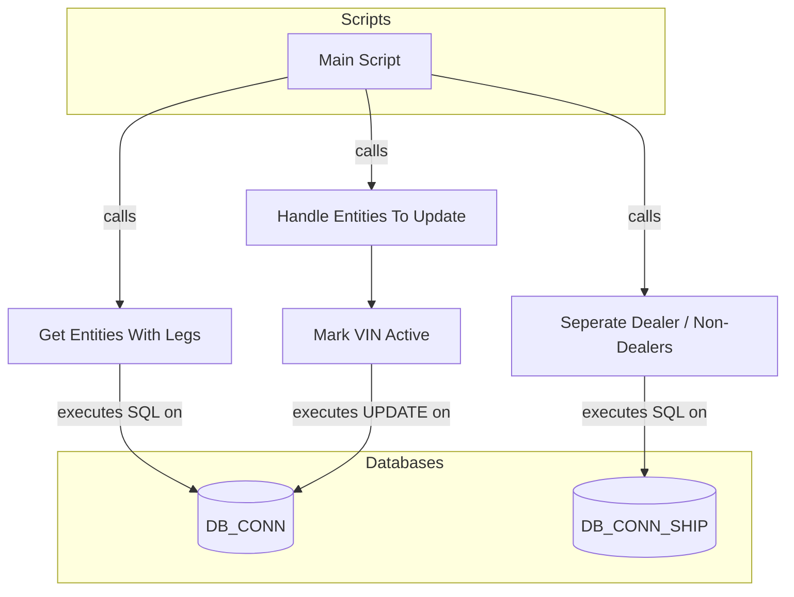
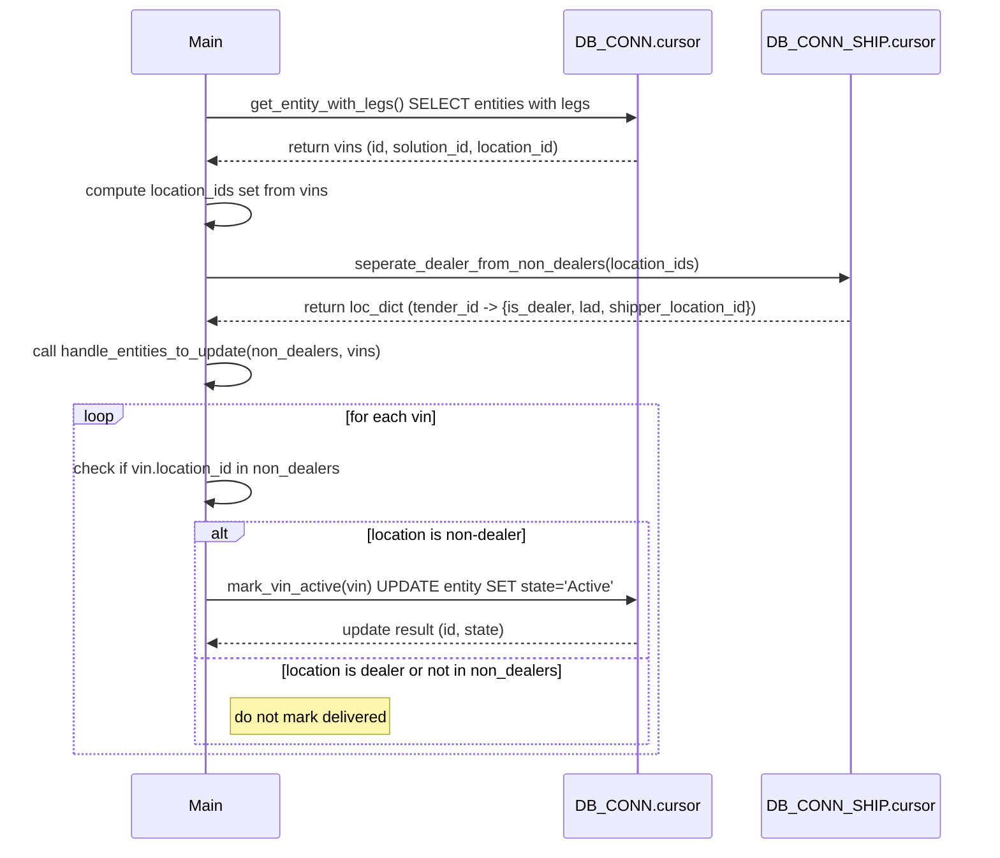

# Diagram: entity_core/entity_service/entity_service_scripts/unmark_vins_delivered.py

> Auto-generated by Obscura crawlers

## Diagram 1

### SVG

<svg id="container" width="764.90625" xmlns="http://www.w3.org/2000/svg" class="flowchart" height="576.5865478515625" viewBox="0 0 764.90625 576.5865478515625" role="graphics-document document" aria-roledescription="flowchart-v2"><g><marker id="container_flowchart-v2-pointEnd" class="marker flowchart-v2" viewBox="0 0 10 10" refX="5" refY="5" markerUnits="userSpaceOnUse" markerWidth="8" markerHeight="8" orient="auto"><path d="M 0 0 L 10 5 L 0 10 z" class="arrowMarkerPath" style="stroke-width: 1; stroke-dasharray: 1, 0;"></path></marker><marker id="container_flowchart-v2-pointStart" class="marker flowchart-v2" viewBox="0 0 10 10" refX="4.5" refY="5" markerUnits="userSpaceOnUse" markerWidth="8" markerHeight="8" orient="auto"><path d="M 0 5 L 10 10 L 10 0 z" class="arrowMarkerPath" style="stroke-width: 1; stroke-dasharray: 1, 0;"></path></marker><marker id="container_flowchart-v2-circleEnd" class="marker flowchart-v2" viewBox="0 0 10 10" refX="11" refY="5" markerUnits="userSpaceOnUse" markerWidth="11" markerHeight="11" orient="auto"><circle cx="5" cy="5" r="5" class="arrowMarkerPath" style="stroke-width: 1; stroke-dasharray: 1, 0;"></circle></marker><marker id="container_flowchart-v2-circleStart" class="marker flowchart-v2" viewBox="0 0 10 10" refX="-1" refY="5" markerUnits="userSpaceOnUse" markerWidth="11" markerHeight="11" orient="auto"><circle cx="5" cy="5" r="5" class="arrowMarkerPath" style="stroke-width: 1; stroke-dasharray: 1, 0;"></circle></marker><marker id="container_flowchart-v2-crossEnd" class="marker cross flowchart-v2" viewBox="0 0 11 11" refX="12" refY="5.2" markerUnits="userSpaceOnUse" markerWidth="11" markerHeight="11" orient="auto"><path d="M 1,1 l 9,9 M 10,1 l -9,9" class="arrowMarkerPath" style="stroke-width: 2; stroke-dasharray: 1, 0;"></path></marker><marker id="container_flowchart-v2-crossStart" class="marker cross flowchart-v2" viewBox="0 0 11 11" refX="-1" refY="5.2" markerUnits="userSpaceOnUse" markerWidth="11" markerHeight="11" orient="auto"><path d="M 1,1 l 9,9 M 10,1 l -9,9" class="arrowMarkerPath" style="stroke-width: 2; stroke-dasharray: 1, 0;"></path></marker><g class="root"><g class="clusters"><g class="cluster" id="Databases" data-look="classic"><rect style="" x="57.8671875" y="442" width="666.828125" height="126.5865249633789"></rect><g class="cluster-label" transform="translate(353.890625, 442)"><foreignObject width="74.78125" height="24">

Databases

</foreignObject></g></g><g class="cluster" id="Scripts" data-look="classic"><rect style="" x="61.9453125" y="8" width="584.9609375" height="104"></rect><g class="cluster-label" transform="translate(329.51953125, 8)"><foreignObject width="49.8125" height="24">

Scripts

</foreignObject></g></g></g><g class="edgePaths"><path d="M275.586,76.007L249.048,82.006C222.51,88.005,169.435,100.002,142.897,112.168C116.359,124.333,116.359,136.667,116.359,153.5C116.359,170.333,116.359,191.667,116.359,211C116.359,230.333,116.359,247.667,116.359,261.833C116.359,276,116.359,287,116.359,292.5L116.359,298" id="L_Main_get_entity_with_legs_0" class="edge-thickness-normal edge-pattern-solid edge-thickness-normal edge-pattern-solid flowchart-link" style=";" data-edge="true" data-et="edge" data-id="L_Main_get_entity_with_legs_0" data-points="W3sieCI6Mjc1LjU4NTkzNzUsInkiOjc2LjAwNzA2NDAxNzY2MDA0fSx7IngiOjExNi4zNTkzNzUsInkiOjExMn0seyJ4IjoxMTYuMzU5Mzc1LCJ5IjoxNDl9LHsieCI6MTE2LjM1OTM3NSwieSI6MjEzfSx7IngiOjExNi4zNTkzNzUsInkiOjI2NX0seyJ4IjoxMTYuMzU5Mzc1LCJ5IjozMDJ9XQ==" marker-end="url(#container_flowchart-v2-pointEnd)"></path><path d="M116.359,356L116.359,364.167C116.359,372.333,116.359,388.667,116.359,403C116.359,417.333,116.359,429.667,129.141,442.452C141.923,455.238,167.486,468.475,180.268,475.094L193.05,481.713" id="L_get_entity_with_legs_DB_CONN_0" class="edge-thickness-normal edge-pattern-solid edge-thickness-normal edge-pattern-solid flowchart-link" style=";" data-edge="true" data-et="edge" data-id="L_get_entity_with_legs_DB_CONN_0" data-points="W3sieCI6MTE2LjM1OTM3NSwieSI6MzU2fSx7IngiOjExNi4zNTkzNzUsInkiOjQwNX0seyJ4IjoxMTYuMzU5Mzc1LCJ5Ijo0NDJ9LHsieCI6MTk2LjYwMTU2MjUsInkiOjQ4My41NTIyNTk0NDA2Nzk2fV0=" marker-end="url(#container_flowchart-v2-pointEnd)"></path><path d="M417.211,73.127L452.16,79.606C487.109,86.085,557.008,99.042,591.957,111.688C626.906,124.333,626.906,136.667,626.906,153.5C626.906,170.333,626.906,191.667,626.906,211C626.906,230.333,626.906,247.667,626.906,259.833C626.906,272,626.906,279,626.906,282.5L626.906,286" id="L_Main_seperate_dealer_from_non_dealers_0" class="edge-thickness-normal edge-pattern-solid edge-thickness-normal edge-pattern-solid flowchart-link" style=";" data-edge="true" data-et="edge" data-id="L_Main_seperate_dealer_from_non_dealers_0" data-points="W3sieCI6NDE3LjIxMDkzNzUsInkiOjczLjEyNzA4NTM2NDE1NTR9LHsieCI6NjI2LjkwNjI1LCJ5IjoxMTJ9LHsieCI6NjI2LjkwNjI1LCJ5IjoxNDl9LHsieCI6NjI2LjkwNjI1LCJ5IjoyMTN9LHsieCI6NjI2LjkwNjI1LCJ5IjoyNjV9LHsieCI6NjI2LjkwNjI1LCJ5IjoyOTB9XQ==" marker-end="url(#container_flowchart-v2-pointEnd)"></path><path d="M626.906,368L626.906,374.167C626.906,380.333,626.906,392.667,626.906,405C626.906,417.333,626.906,429.667,626.906,439.333C626.906,449,626.906,456,626.906,459.5L626.906,463" id="L_seperate_dealer_from_non_dealers_DB_CONN_SHIP_0" class="edge-thickness-normal edge-pattern-solid edge-thickness-normal edge-pattern-solid flowchart-link" style=";" data-edge="true" data-et="edge" data-id="L_seperate_dealer_from_non_dealers_DB_CONN_SHIP_0" data-points="W3sieCI6NjI2LjkwNjI1LCJ5IjozNjh9LHsieCI6NjI2LjkwNjI1LCJ5Ijo0MDV9LHsieCI6NjI2LjkwNjI1LCJ5Ijo0NDJ9LHsieCI6NjI2LjkwNjI1LCJ5Ijo0Njd9XQ==" marker-end="url(#container_flowchart-v2-pointEnd)"></path><path d="M353.883,87L355.038,91.167C356.193,95.333,358.503,103.667,359.658,114C360.813,124.333,360.813,136.667,360.813,148.333C360.813,160,360.813,171,360.813,176.5L360.813,182" id="L_Main_handle_entities_to_update_0" class="edge-thickness-normal edge-pattern-solid edge-thickness-normal edge-pattern-solid flowchart-link" style=";" data-edge="true" data-et="edge" data-id="L_Main_handle_entities_to_update_0" data-points="W3sieCI6MzUzLjg4MjY2MjI1OTYxNTM2LCJ5Ijo4N30seyJ4IjozNjAuODEyNSwieSI6MTEyfSx7IngiOjM2MC44MTI1LCJ5IjoxNDl9LHsieCI6MzYwLjgxMjUsInkiOjE4Nn1d" marker-end="url(#container_flowchart-v2-pointEnd)"></path><path d="M360.813,240L360.813,244.167C360.813,248.333,360.813,256.667,360.813,266.333C360.813,276,360.813,287,360.813,292.5L360.813,298" id="L_handle_entities_to_update_mark_vin_active_0" class="edge-thickness-normal edge-pattern-solid edge-thickness-normal edge-pattern-solid flowchart-link" style=";" data-edge="true" data-et="edge" data-id="L_handle_entities_to_update_mark_vin_active_0" data-points="W3sieCI6MzYwLjgxMjUsInkiOjI0MH0seyJ4IjozNjAuODEyNSwieSI6MjY1fSx7IngiOjM2MC44MTI1LCJ5IjozMDJ9XQ==" marker-end="url(#container_flowchart-v2-pointEnd)"></path><path d="M360.813,356L360.813,364.167C360.813,372.333,360.813,388.667,360.813,403C360.813,417.333,360.813,429.667,348.031,442.452C335.249,455.238,309.686,468.475,296.904,475.094L284.122,481.713" id="L_mark_vin_active_DB_CONN_0" class="edge-thickness-normal edge-pattern-solid edge-thickness-normal edge-pattern-solid flowchart-link" style=";" data-edge="true" data-et="edge" data-id="L_mark_vin_active_DB_CONN_0" data-points="W3sieCI6MzYwLjgxMjUsInkiOjM1Nn0seyJ4IjozNjAuODEyNSwieSI6NDA1fSx7IngiOjM2MC44MTI1LCJ5Ijo0NDJ9LHsieCI6MjgwLjU3MDMxMjUsInkiOjQ4My41NTIyNTk0NDA2Nzk2fV0=" marker-end="url(#container_flowchart-v2-pointEnd)"></path></g><g class="edgeLabels"><g class="edgeLabel" transform="translate(116.359375, 213)"><g class="label" data-id="L_Main_get_entity_with_legs_0" transform="translate(-16.4453125, -12)"><foreignObject width="32.890625" height="24">

calls

</foreignObject></g></g><g class="edgeLabel" transform="translate(116.359375, 405)"><g class="label" data-id="L_get_entity_with_legs_DB_CONN_0" transform="translate(-59.1953125, -12)"><foreignObject width="118.390625" height="24">

executes SQL on

</foreignObject></g></g><g class="edgeLabel" transform="translate(626.90625, 213)"><g class="label" data-id="L_Main_seperate_dealer_from_non_dealers_0" transform="translate(-16.4453125, -12)"><foreignObject width="32.890625" height="24">

calls

</foreignObject></g></g><g class="edgeLabel" transform="translate(626.90625, 405)"><g class="label" data-id="L_seperate_dealer_from_non_dealers_DB_CONN_SHIP_0" transform="translate(-59.1953125, -12)"><foreignObject width="118.390625" height="24">

executes SQL on

</foreignObject></g></g><g class="edgeLabel" transform="translate(360.8125, 149)"><g class="label" data-id="L_Main_handle_entities_to_update_0" transform="translate(-16.4453125, -12)"><foreignObject width="32.890625" height="24">

calls

</foreignObject></g></g><g class="edgeLabel"><g class="label" data-id="L_handle_entities_to_update_mark_vin_active_0" transform="translate(0, 0)"><foreignObject width="0" height="0">

</foreignObject></g></g><g class="edgeLabel" transform="translate(360.8125, 405)"><g class="label" data-id="L_mark_vin_active_DB_CONN_0" transform="translate(-72.9375, -12)"><foreignObject width="145.875" height="24">

executes UPDATE on

</foreignObject></g></g></g><g class="nodes"><g class="node default" id="flowchart-Main-0" transform="translate(346.3984375, 60)"><rect class="basic label-container" style="" x="-70.8125" y="-27" width="141.625" height="54"></rect><g class="label" style="" transform="translate(-40.8125, -12)"><rect></rect><foreignObject width="81.625" height="24">

Main Script

</foreignObject></g></g><g class="node default" id="flowchart-DB_CONN-1" transform="translate(238.5859375, 505.29326248168945)"><path d="M0,10.045610886795274 a41.984375,10.045610886795274 0,0,0 83.96875,0 a41.984375,10.045610886795274 0,0,0 -83.96875,0 l0,49.045610886795274 a41.984375,10.045610886795274 0,0,0 83.96875,0 l0,-49.045610886795274" class="basic label-container" style="" transform="translate(-41.984375, -34.56841633019291)"></path><g class="label" style="" transform="translate(-34.484375, -2)"><rect></rect><foreignObject width="68.96875" height="24">

DB_CONN

</foreignObject></g></g><g class="node default" id="flowchart-DB_CONN_SHIP-2" transform="translate(626.90625, 505.29326248168945)"><path d="M0,12.52883955852092 a62.7890625,12.52883955852092 0,0,0 125.578125,0 a62.7890625,12.52883955852092 0,0,0 -125.578125,0 l0,51.52883955852092 a62.7890625,12.52883955852092 0,0,0 125.578125,0 l0,-51.52883955852092" class="basic label-container" style="" transform="translate(-62.7890625, -38.29325933778138)"></path><g class="label" style="" transform="translate(-55.2890625, -2)"><rect></rect><foreignObject width="110.578125" height="24">

DB_CONN_SHIP

</foreignObject></g></g><g class="node default" id="flowchart-get_entity_with_legs-4" transform="translate(116.359375, 329)"><rect class="basic label-container" style="" x="-108.359375" y="-27" width="216.71875" height="54"></rect><g class="label" style="" transform="translate(-78.359375, -12)"><rect></rect><foreignObject width="156.71875" height="24">

Get Entities With Legs

</foreignObject></g></g><g class="node default" id="flowchart-seperate_dealer_from_non_dealers-8" transform="translate(626.90625, 329)"><rect class="basic label-container" style="" x="-130" y="-39" width="260" height="78"></rect><g class="label" style="" transform="translate(-100, -24)"><rect></rect><foreignObject width="200" height="48">

Seperate Dealer / Non-Dealers

</foreignObject></g></g><g class="node default" id="flowchart-handle_entities_to_update-12" transform="translate(360.8125, 213)"><rect class="basic label-container" style="" x="-124.2421875" y="-27" width="248.484375" height="54"></rect><g class="label" style="" transform="translate(-94.2421875, -12)"><rect></rect><foreignObject width="188.484375" height="24">

Handle Entities To Update

</foreignObject></g></g><g class="node default" id="flowchart-mark_vin_active-14" transform="translate(360.8125, 329)"><rect class="basic label-container" style="" x="-86.09375" y="-27" width="172.1875" height="54"></rect><g class="label" style="" transform="translate(-56.09375, -12)"><rect></rect><foreignObject width="112.1875" height="24">

Mark VIN Active

</foreignObject></g></g></g></g></g></svg>

## Diagram 2

### SVG

<svg id="container" width="1036.5" xmlns="http://www.w3.org/2000/svg" height="897" viewBox="-154.5 -10 1036.5 897" role="graphics-document document" aria-roledescription="sequence"><g><rect x="653" y="811" fill="#eaeaea" stroke="#666" width="179" height="65" name="DB2" rx="3" ry="3" class="actor actor-bottom"></rect><text x="742.5" y="843.5" dominant-baseline="central" alignment-baseline="central" class="actor actor-box" style="text-anchor: middle; font-size: 16px; font-weight: 400;"><tspan x="742.5" dy="0">DB_CONN_SHIP.cursor</tspan></text></g><g><rect x="453" y="811" fill="#eaeaea" stroke="#666" width="150" height="65" name="DB1" rx="3" ry="3" class="actor actor-bottom"></rect><text x="528" y="843.5" dominant-baseline="central" alignment-baseline="central" class="actor actor-box" style="text-anchor: middle; font-size: 16px; font-weight: 400;"><tspan x="528" dy="0">DB_CONN.cursor</tspan></text></g><g><rect x="0" y="811" fill="#eaeaea" stroke="#666" width="150" height="65" name="Main" rx="3" ry="3" class="actor actor-bottom"></rect><text x="75" y="843.5" dominant-baseline="central" alignment-baseline="central" class="actor actor-box" style="text-anchor: middle; font-size: 16px; font-weight: 400;"><tspan x="75" dy="0">Main</tspan></text></g><g><line id="actor2" x1="742.5" y1="65" x2="742.5" y2="811" class="actor-line 200" stroke-width="0.5px" stroke="#999" name="DB2"></line><g id="root-2"><rect x="653" y="0" fill="#eaeaea" stroke="#666" width="179" height="65" name="DB2" rx="3" ry="3" class="actor actor-top"></rect><text x="742.5" y="32.5" dominant-baseline="central" alignment-baseline="central" class="actor actor-box" style="text-anchor: middle; font-size: 16px; font-weight: 400;"><tspan x="742.5" dy="0">DB_CONN_SHIP.cursor</tspan></text></g></g><g><line id="actor1" x1="528" y1="65" x2="528" y2="811" class="actor-line 200" stroke-width="0.5px" stroke="#999" name="DB1"></line><g id="root-1"><rect x="453" y="0" fill="#eaeaea" stroke="#666" width="150" height="65" name="DB1" rx="3" ry="3" class="actor actor-top"></rect><text x="528" y="32.5" dominant-baseline="central" alignment-baseline="central" class="actor actor-box" style="text-anchor: middle; font-size: 16px; font-weight: 400;"><tspan x="528" dy="0">DB_CONN.cursor</tspan></text></g></g><g><line id="actor0" x1="75" y1="65" x2="75" y2="811" class="actor-line 200" stroke-width="0.5px" stroke="#999" name="Main"></line><g id="root-0"><rect x="0" y="0" fill="#eaeaea" stroke="#666" width="150" height="65" name="Main" rx="3" ry="3" class="actor actor-top"></rect><text x="75" y="32.5" dominant-baseline="central" alignment-baseline="central" class="actor actor-box" style="text-anchor: middle; font-size: 16px; font-weight: 400;"><tspan x="75" dy="0">Main</tspan></text></g></g><g></g><defs><symbol id="computer" width="24" height="24"><path transform="scale(.5)" d="M2 2v13h20v-13h-20zm18 11h-16v-9h16v9zm-10.228 6l.466-1h3.524l.467 1h-4.457zm14.228 3h-24l2-6h2.104l-1.33 4h18.45l-1.297-4h2.073l2 6zm-5-10h-14v-7h14v7z"></path></symbol></defs><defs><symbol id="database" fill-rule="evenodd" clip-rule="evenodd"><path transform="scale(.5)" d="M12.258.001l.256.004.255.005.253.008.251.01.249.012.247.015.246.016.242.019.241.02.239.023.236.024.233.027.231.028.229.031.225.032.223.034.22.036.217.038.214.04.211.041.208.043.205.045.201.046.198.048.194.05.191.051.187.053.183.054.18.056.175.057.172.059.168.06.163.061.16.063.155.064.15.066.074.033.073.033.071.034.07.034.069.035.068.035.067.035.066.035.064.036.064.036.062.036.06.036.06.037.058.037.058.037.055.038.055.038.053.038.052.038.051.039.05.039.048.039.047.039.045.04.044.04.043.04.041.04.04.041.039.041.037.041.036.041.034.041.033.042.032.042.03.042.029.042.027.042.026.043.024.043.023.043.021.043.02.043.018.044.017.043.015.044.013.044.012.044.011.045.009.044.007.045.006.045.004.045.002.045.001.045v17l-.001.045-.002.045-.004.045-.006.045-.007.045-.009.044-.011.045-.012.044-.013.044-.015.044-.017.043-.018.044-.02.043-.021.043-.023.043-.024.043-.026.043-.027.042-.029.042-.03.042-.032.042-.033.042-.034.041-.036.041-.037.041-.039.041-.04.041-.041.04-.043.04-.044.04-.045.04-.047.039-.048.039-.05.039-.051.039-.052.038-.053.038-.055.038-.055.038-.058.037-.058.037-.06.037-.06.036-.062.036-.064.036-.064.036-.066.035-.067.035-.068.035-.069.035-.07.034-.071.034-.073.033-.074.033-.15.066-.155.064-.16.063-.163.061-.168.06-.172.059-.175.057-.18.056-.183.054-.187.053-.191.051-.194.05-.198.048-.201.046-.205.045-.208.043-.211.041-.214.04-.217.038-.22.036-.223.034-.225.032-.229.031-.231.028-.233.027-.236.024-.239.023-.241.02-.242.019-.246.016-.247.015-.249.012-.251.01-.253.008-.255.005-.256.004-.258.001-.258-.001-.256-.004-.255-.005-.253-.008-.251-.01-.249-.012-.247-.015-.245-.016-.243-.019-.241-.02-.238-.023-.236-.024-.234-.027-.231-.028-.228-.031-.226-.032-.223-.034-.22-.036-.217-.038-.214-.04-.211-.041-.208-.043-.204-.045-.201-.046-.198-.048-.195-.05-.19-.051-.187-.053-.184-.054-.179-.056-.176-.057-.172-.059-.167-.06-.164-.061-.159-.063-.155-.064-.151-.066-.074-.033-.072-.033-.072-.034-.07-.034-.069-.035-.068-.035-.067-.035-.066-.035-.064-.036-.063-.036-.062-.036-.061-.036-.06-.037-.058-.037-.057-.037-.056-.038-.055-.038-.053-.038-.052-.038-.051-.039-.049-.039-.049-.039-.046-.039-.046-.04-.044-.04-.043-.04-.041-.04-.04-.041-.039-.041-.037-.041-.036-.041-.034-.041-.033-.042-.032-.042-.03-.042-.029-.042-.027-.042-.026-.043-.024-.043-.023-.043-.021-.043-.02-.043-.018-.044-.017-.043-.015-.044-.013-.044-.012-.044-.011-.045-.009-.044-.007-.045-.006-.045-.004-.045-.002-.045-.001-.045v-17l.001-.045.002-.045.004-.045.006-.045.007-.045.009-.044.011-.045.012-.044.013-.044.015-.044.017-.043.018-.044.02-.043.021-.043.023-.043.024-.043.026-.043.027-.042.029-.042.03-.042.032-.042.033-.042.034-.041.036-.041.037-.041.039-.041.04-.041.041-.04.043-.04.044-.04.046-.04.046-.039.049-.039.049-.039.051-.039.052-.038.053-.038.055-.038.056-.038.057-.037.058-.037.06-.037.061-.036.062-.036.063-.036.064-.036.066-.035.067-.035.068-.035.069-.035.07-.034.072-.034.072-.033.074-.033.151-.066.155-.064.159-.063.164-.061.167-.06.172-.059.176-.057.179-.056.184-.054.187-.053.19-.051.195-.05.198-.048.201-.046.204-.045.208-.043.211-.041.214-.04.217-.038.22-.036.223-.034.226-.032.228-.031.231-.028.234-.027.236-.024.238-.023.241-.02.243-.019.245-.016.247-.015.249-.012.251-.01.253-.008.255-.005.256-.004.258-.001.258.001zm-9.258 20.499v.01l.001.021.003.021.004.022.005.021.006.022.007.022.009.023.01.022.011.023.012.023.013.023.015.023.016.024.017.023.018.024.019.024.021.024.022.025.023.024.024.025.052.049.056.05.061.051.066.051.07.051.075.051.079.052.084.052.088.052.092.052.097.052.102.051.105.052.11.052.114.051.119.051.123.051.127.05.131.05.135.05.139.048.144.049.147.047.152.047.155.047.16.045.163.045.167.043.171.043.176.041.178.041.183.039.187.039.19.037.194.035.197.035.202.033.204.031.209.03.212.029.216.027.219.025.222.024.226.021.23.02.233.018.236.016.24.015.243.012.246.01.249.008.253.005.256.004.259.001.26-.001.257-.004.254-.005.25-.008.247-.011.244-.012.241-.014.237-.016.233-.018.231-.021.226-.021.224-.024.22-.026.216-.027.212-.028.21-.031.205-.031.202-.034.198-.034.194-.036.191-.037.187-.039.183-.04.179-.04.175-.042.172-.043.168-.044.163-.045.16-.046.155-.046.152-.047.148-.048.143-.049.139-.049.136-.05.131-.05.126-.05.123-.051.118-.052.114-.051.11-.052.106-.052.101-.052.096-.052.092-.052.088-.053.083-.051.079-.052.074-.052.07-.051.065-.051.06-.051.056-.05.051-.05.023-.024.023-.025.021-.024.02-.024.019-.024.018-.024.017-.024.015-.023.014-.024.013-.023.012-.023.01-.023.01-.022.008-.022.006-.022.006-.022.004-.022.004-.021.001-.021.001-.021v-4.127l-.077.055-.08.053-.083.054-.085.053-.087.052-.09.052-.093.051-.095.05-.097.05-.1.049-.102.049-.105.048-.106.047-.109.047-.111.046-.114.045-.115.045-.118.044-.12.043-.122.042-.124.042-.126.041-.128.04-.13.04-.132.038-.134.038-.135.037-.138.037-.139.035-.142.035-.143.034-.144.033-.147.032-.148.031-.15.03-.151.03-.153.029-.154.027-.156.027-.158.026-.159.025-.161.024-.162.023-.163.022-.165.021-.166.02-.167.019-.169.018-.169.017-.171.016-.173.015-.173.014-.175.013-.175.012-.177.011-.178.01-.179.008-.179.008-.181.006-.182.005-.182.004-.184.003-.184.002h-.37l-.184-.002-.184-.003-.182-.004-.182-.005-.181-.006-.179-.008-.179-.008-.178-.01-.176-.011-.176-.012-.175-.013-.173-.014-.172-.015-.171-.016-.17-.017-.169-.018-.167-.019-.166-.02-.165-.021-.163-.022-.162-.023-.161-.024-.159-.025-.157-.026-.156-.027-.155-.027-.153-.029-.151-.03-.15-.03-.148-.031-.146-.032-.145-.033-.143-.034-.141-.035-.14-.035-.137-.037-.136-.037-.134-.038-.132-.038-.13-.04-.128-.04-.126-.041-.124-.042-.122-.042-.12-.044-.117-.043-.116-.045-.113-.045-.112-.046-.109-.047-.106-.047-.105-.048-.102-.049-.1-.049-.097-.05-.095-.05-.093-.052-.09-.051-.087-.052-.085-.053-.083-.054-.08-.054-.077-.054v4.127zm0-5.654v.011l.001.021.003.021.004.021.005.022.006.022.007.022.009.022.01.022.011.023.012.023.013.023.015.024.016.023.017.024.018.024.019.024.021.024.022.024.023.025.024.024.052.05.056.05.061.05.066.051.07.051.075.052.079.051.084.052.088.052.092.052.097.052.102.052.105.052.11.051.114.051.119.052.123.05.127.051.131.05.135.049.139.049.144.048.147.048.152.047.155.046.16.045.163.045.167.044.171.042.176.042.178.04.183.04.187.038.19.037.194.036.197.034.202.033.204.032.209.03.212.028.216.027.219.025.222.024.226.022.23.02.233.018.236.016.24.014.243.012.246.01.249.008.253.006.256.003.259.001.26-.001.257-.003.254-.006.25-.008.247-.01.244-.012.241-.015.237-.016.233-.018.231-.02.226-.022.224-.024.22-.025.216-.027.212-.029.21-.03.205-.032.202-.033.198-.035.194-.036.191-.037.187-.039.183-.039.179-.041.175-.042.172-.043.168-.044.163-.045.16-.045.155-.047.152-.047.148-.048.143-.048.139-.05.136-.049.131-.05.126-.051.123-.051.118-.051.114-.052.11-.052.106-.052.101-.052.096-.052.092-.052.088-.052.083-.052.079-.052.074-.051.07-.052.065-.051.06-.05.056-.051.051-.049.023-.025.023-.024.021-.025.02-.024.019-.024.018-.024.017-.024.015-.023.014-.023.013-.024.012-.022.01-.023.01-.023.008-.022.006-.022.006-.022.004-.021.004-.022.001-.021.001-.021v-4.139l-.077.054-.08.054-.083.054-.085.052-.087.053-.09.051-.093.051-.095.051-.097.05-.1.049-.102.049-.105.048-.106.047-.109.047-.111.046-.114.045-.115.044-.118.044-.12.044-.122.042-.124.042-.126.041-.128.04-.13.039-.132.039-.134.038-.135.037-.138.036-.139.036-.142.035-.143.033-.144.033-.147.033-.148.031-.15.03-.151.03-.153.028-.154.028-.156.027-.158.026-.159.025-.161.024-.162.023-.163.022-.165.021-.166.02-.167.019-.169.018-.169.017-.171.016-.173.015-.173.014-.175.013-.175.012-.177.011-.178.009-.179.009-.179.007-.181.007-.182.005-.182.004-.184.003-.184.002h-.37l-.184-.002-.184-.003-.182-.004-.182-.005-.181-.007-.179-.007-.179-.009-.178-.009-.176-.011-.176-.012-.175-.013-.173-.014-.172-.015-.171-.016-.17-.017-.169-.018-.167-.019-.166-.02-.165-.021-.163-.022-.162-.023-.161-.024-.159-.025-.157-.026-.156-.027-.155-.028-.153-.028-.151-.03-.15-.03-.148-.031-.146-.033-.145-.033-.143-.033-.141-.035-.14-.036-.137-.036-.136-.037-.134-.038-.132-.039-.13-.039-.128-.04-.126-.041-.124-.042-.122-.043-.12-.043-.117-.044-.116-.044-.113-.046-.112-.046-.109-.046-.106-.047-.105-.048-.102-.049-.1-.049-.097-.05-.095-.051-.093-.051-.09-.051-.087-.053-.085-.052-.083-.054-.08-.054-.077-.054v4.139zm0-5.666v.011l.001.02.003.022.004.021.005.022.006.021.007.022.009.023.01.022.011.023.012.023.013.023.015.023.016.024.017.024.018.023.019.024.021.025.022.024.023.024.024.025.052.05.056.05.061.05.066.051.07.051.075.052.079.051.084.052.088.052.092.052.097.052.102.052.105.051.11.052.114.051.119.051.123.051.127.05.131.05.135.05.139.049.144.048.147.048.152.047.155.046.16.045.163.045.167.043.171.043.176.042.178.04.183.04.187.038.19.037.194.036.197.034.202.033.204.032.209.03.212.028.216.027.219.025.222.024.226.021.23.02.233.018.236.017.24.014.243.012.246.01.249.008.253.006.256.003.259.001.26-.001.257-.003.254-.006.25-.008.247-.01.244-.013.241-.014.237-.016.233-.018.231-.02.226-.022.224-.024.22-.025.216-.027.212-.029.21-.03.205-.032.202-.033.198-.035.194-.036.191-.037.187-.039.183-.039.179-.041.175-.042.172-.043.168-.044.163-.045.16-.045.155-.047.152-.047.148-.048.143-.049.139-.049.136-.049.131-.051.126-.05.123-.051.118-.052.114-.051.11-.052.106-.052.101-.052.096-.052.092-.052.088-.052.083-.052.079-.052.074-.052.07-.051.065-.051.06-.051.056-.05.051-.049.023-.025.023-.025.021-.024.02-.024.019-.024.018-.024.017-.024.015-.023.014-.024.013-.023.012-.023.01-.022.01-.023.008-.022.006-.022.006-.022.004-.022.004-.021.001-.021.001-.021v-4.153l-.077.054-.08.054-.083.053-.085.053-.087.053-.09.051-.093.051-.095.051-.097.05-.1.049-.102.048-.105.048-.106.048-.109.046-.111.046-.114.046-.115.044-.118.044-.12.043-.122.043-.124.042-.126.041-.128.04-.13.039-.132.039-.134.038-.135.037-.138.036-.139.036-.142.034-.143.034-.144.033-.147.032-.148.032-.15.03-.151.03-.153.028-.154.028-.156.027-.158.026-.159.024-.161.024-.162.023-.163.023-.165.021-.166.02-.167.019-.169.018-.169.017-.171.016-.173.015-.173.014-.175.013-.175.012-.177.01-.178.01-.179.009-.179.007-.181.006-.182.006-.182.004-.184.003-.184.001-.185.001-.185-.001-.184-.001-.184-.003-.182-.004-.182-.006-.181-.006-.179-.007-.179-.009-.178-.01-.176-.01-.176-.012-.175-.013-.173-.014-.172-.015-.171-.016-.17-.017-.169-.018-.167-.019-.166-.02-.165-.021-.163-.023-.162-.023-.161-.024-.159-.024-.157-.026-.156-.027-.155-.028-.153-.028-.151-.03-.15-.03-.148-.032-.146-.032-.145-.033-.143-.034-.141-.034-.14-.036-.137-.036-.136-.037-.134-.038-.132-.039-.13-.039-.128-.041-.126-.041-.124-.041-.122-.043-.12-.043-.117-.044-.116-.044-.113-.046-.112-.046-.109-.046-.106-.048-.105-.048-.102-.048-.1-.05-.097-.049-.095-.051-.093-.051-.09-.052-.087-.052-.085-.053-.083-.053-.08-.054-.077-.054v4.153zm8.74-8.179l-.257.004-.254.005-.25.008-.247.011-.244.012-.241.014-.237.016-.233.018-.231.021-.226.022-.224.023-.22.026-.216.027-.212.028-.21.031-.205.032-.202.033-.198.034-.194.036-.191.038-.187.038-.183.04-.179.041-.175.042-.172.043-.168.043-.163.045-.16.046-.155.046-.152.048-.148.048-.143.048-.139.049-.136.05-.131.05-.126.051-.123.051-.118.051-.114.052-.11.052-.106.052-.101.052-.096.052-.092.052-.088.052-.083.052-.079.052-.074.051-.07.052-.065.051-.06.05-.056.05-.051.05-.023.025-.023.024-.021.024-.02.025-.019.024-.018.024-.017.023-.015.024-.014.023-.013.023-.012.023-.01.023-.01.022-.008.022-.006.023-.006.021-.004.022-.004.021-.001.021-.001.021.001.021.001.021.004.021.004.022.006.021.006.023.008.022.01.022.01.023.012.023.013.023.014.023.015.024.017.023.018.024.019.024.02.025.021.024.023.024.023.025.051.05.056.05.06.05.065.051.07.052.074.051.079.052.083.052.088.052.092.052.096.052.101.052.106.052.11.052.114.052.118.051.123.051.126.051.131.05.136.05.139.049.143.048.148.048.152.048.155.046.16.046.163.045.168.043.172.043.175.042.179.041.183.04.187.038.191.038.194.036.198.034.202.033.205.032.21.031.212.028.216.027.22.026.224.023.226.022.231.021.233.018.237.016.241.014.244.012.247.011.25.008.254.005.257.004.26.001.26-.001.257-.004.254-.005.25-.008.247-.011.244-.012.241-.014.237-.016.233-.018.231-.021.226-.022.224-.023.22-.026.216-.027.212-.028.21-.031.205-.032.202-.033.198-.034.194-.036.191-.038.187-.038.183-.04.179-.041.175-.042.172-.043.168-.043.163-.045.16-.046.155-.046.152-.048.148-.048.143-.048.139-.049.136-.05.131-.05.126-.051.123-.051.118-.051.114-.052.11-.052.106-.052.101-.052.096-.052.092-.052.088-.052.083-.052.079-.052.074-.051.07-.052.065-.051.06-.05.056-.05.051-.05.023-.025.023-.024.021-.024.02-.025.019-.024.018-.024.017-.023.015-.024.014-.023.013-.023.012-.023.01-.023.01-.022.008-.022.006-.023.006-.021.004-.022.004-.021.001-.021.001-.021-.001-.021-.001-.021-.004-.021-.004-.022-.006-.021-.006-.023-.008-.022-.01-.022-.01-.023-.012-.023-.013-.023-.014-.023-.015-.024-.017-.023-.018-.024-.019-.024-.02-.025-.021-.024-.023-.024-.023-.025-.051-.05-.056-.05-.06-.05-.065-.051-.07-.052-.074-.051-.079-.052-.083-.052-.088-.052-.092-.052-.096-.052-.101-.052-.106-.052-.11-.052-.114-.052-.118-.051-.123-.051-.126-.051-.131-.05-.136-.05-.139-.049-.143-.048-.148-.048-.152-.048-.155-.046-.16-.046-.163-.045-.168-.043-.172-.043-.175-.042-.179-.041-.183-.04-.187-.038-.191-.038-.194-.036-.198-.034-.202-.033-.205-.032-.21-.031-.212-.028-.216-.027-.22-.026-.224-.023-.226-.022-.231-.021-.233-.018-.237-.016-.241-.014-.244-.012-.247-.011-.25-.008-.254-.005-.257-.004-.26-.001-.26.001z"></path></symbol></defs><defs><symbol id="clock" width="24" height="24"><path transform="scale(.5)" d="M12 2c5.514 0 10 4.486 10 10s-4.486 10-10 10-10-4.486-10-10 4.486-10 10-10zm0-2c-6.627 0-12 5.373-12 12s5.373 12 12 12 12-5.373 12-12-5.373-12-12-12zm5.848 12.459c.202.038.202.333.001.372-1.907.361-6.045 1.111-6.547 1.111-.719 0-1.301-.582-1.301-1.301 0-.512.77-5.447 1.125-7.445.034-.192.312-.181.343.014l.985 6.238 5.394 1.011z"></path></symbol></defs><defs><marker id="arrowhead" refX="7.9" refY="5" markerUnits="userSpaceOnUse" markerWidth="12" markerHeight="12" orient="auto-start-reverse"><path d="M -1 0 L 10 5 L 0 10 z"></path></marker></defs><defs><marker id="crosshead" markerWidth="15" markerHeight="8" orient="auto" refX="4" refY="4.5"><path fill="none" stroke="#000000" stroke-width="1pt" d="M 1,2 L 6,7 M 6,2 L 1,7" style="stroke-dasharray: 0, 0;"></path></marker></defs><defs><marker id="filled-head" refX="15.5" refY="7" markerWidth="20" markerHeight="28" orient="auto"><path d="M 18,7 L9,13 L14,7 L9,1 Z"></path></marker></defs><defs><marker id="sequencenumber" refX="15" refY="15" markerWidth="60" markerHeight="40" orient="auto"><circle cx="15" cy="15" r="6"></circle></marker></defs><g><rect x="100" y="732" fill="#EDF2AE" stroke="#666" width="181" height="39" class="note"></rect><text x="191" y="737" text-anchor="middle" dominant-baseline="middle" alignment-baseline="middle" class="noteText" dy="1em" style="font-size: 16px; font-weight: 400;"><tspan x="191">do not mark delivered</tspan></text></g><g><line x1="64" y1="546" x2="539" y2="546" class="loopLine"></line><line x1="539" y1="546" x2="539" y2="781" class="loopLine"></line><line x1="64" y1="781" x2="539" y2="781" class="loopLine"></line><line x1="64" y1="546" x2="64" y2="781" class="loopLine"></line><line x1="64" y1="692" x2="539" y2="692" class="loopLine" style="stroke-dasharray: 3, 3;"></line><polygon points="64,546 114,546 114,559 105.6,566 64,566" class="labelBox"></polygon><text x="89" y="559" text-anchor="middle" dominant-baseline="middle" alignment-baseline="middle" class="labelText" style="font-size: 16px; font-weight: 400;">alt</text><text x="326.5" y="564" text-anchor="middle" class="loopText" style="font-size: 16px; font-weight: 400;"><tspan x="326.5">[location is non-dealer]</tspan></text><text x="301.5" y="710" text-anchor="middle" class="loopText" style="font-size: 16px; font-weight: 400;">[location is dealer or not in non_dealers]</text></g><g><line x1="-73.5" y1="423" x2="549" y2="423" class="loopLine"></line><line x1="549" y1="423" x2="549" y2="791" class="loopLine"></line><line x1="-73.5" y1="791" x2="549" y2="791" class="loopLine"></line><line x1="-73.5" y1="423" x2="-73.5" y2="791" class="loopLine"></line><polygon points="-73.5,423 -23.5,423 -23.5,436 -31.9,443 -73.5,443" class="labelBox"></polygon><text x="-48" y="436" text-anchor="middle" dominant-baseline="middle" alignment-baseline="middle" class="labelText" style="font-size: 16px; font-weight: 400;">loop</text><text x="262.75" y="441" text-anchor="middle" class="loopText" style="font-size: 16px; font-weight: 400;"><tspan x="262.75">[for each vin]</tspan></text></g><text x="300" y="80" text-anchor="middle" dominant-baseline="middle" alignment-baseline="middle" class="messageText" dy="1em" style="font-size: 16px; font-weight: 400;">get_entity_with_legs() SELECT entities with legs</text><line x1="76" y1="113" x2="524" y2="113" class="messageLine0" stroke-width="2" stroke="none" marker-end="url(#arrowhead)" style="fill: none;"></line><text x="303" y="128" text-anchor="middle" dominant-baseline="middle" alignment-baseline="middle" class="messageText" dy="1em" style="font-size: 16px; font-weight: 400;">return vins (id, solution_id, location_id)</text><line x1="527" y1="161" x2="79" y2="161" class="messageLine1" stroke-width="2" stroke="none" marker-end="url(#arrowhead)" style="stroke-dasharray: 3, 3; fill: none;"></line><text x="76" y="176" text-anchor="middle" dominant-baseline="middle" alignment-baseline="middle" class="messageText" dy="1em" style="font-size: 16px; font-weight: 400;">compute location_ids set from vins</text><path d="M 76,209 C 136,199 136,239 76,229" class="messageLine0" stroke-width="2" stroke="none" marker-end="url(#arrowhead)" style="fill: none;"></path><text x="407" y="254" text-anchor="middle" dominant-baseline="middle" alignment-baseline="middle" class="messageText" dy="1em" style="font-size: 16px; font-weight: 400;">seperate_dealer_from_non_dealers(location_ids)</text><line x1="76" y1="287" x2="738.5" y2="287" class="messageLine0" stroke-width="2" stroke="none" marker-end="url(#arrowhead)" style="fill: none;"></line><text x="410" y="302" text-anchor="middle" dominant-baseline="middle" alignment-baseline="middle" class="messageText" dy="1em" style="font-size: 16px; font-weight: 400;">return loc_dict (tender_id -&gt; {is_dealer, lad, shipper_location_id})</text><line x1="741.5" y1="335" x2="79" y2="335" class="messageLine1" stroke-width="2" stroke="none" marker-end="url(#arrowhead)" style="stroke-dasharray: 3, 3; fill: none;"></line><text x="76" y="350" text-anchor="middle" dominant-baseline="middle" alignment-baseline="middle" class="messageText" dy="1em" style="font-size: 16px; font-weight: 400;">call handle_entities_to_update(non_dealers, vins)</text><path d="M 76,383 C 136,373 136,413 76,403" class="messageLine0" stroke-width="2" stroke="none" marker-end="url(#arrowhead)" style="fill: none;"></path><text x="76" y="473" text-anchor="middle" dominant-baseline="middle" alignment-baseline="middle" class="messageText" dy="1em" style="font-size: 16px; font-weight: 400;">check if vin.location_id in non_dealers</text><path d="M 76,506 C 136,496 136,536 76,526" class="messageLine0" stroke-width="2" stroke="none" marker-end="url(#arrowhead)" style="fill: none;"></path><text x="300" y="596" text-anchor="middle" dominant-baseline="middle" alignment-baseline="middle" class="messageText" dy="1em" style="font-size: 16px; font-weight: 400;">mark_vin_active(vin) UPDATE entity SET state='Active'</text><line x1="76" y1="629" x2="524" y2="629" class="messageLine0" stroke-width="2" stroke="none" marker-end="url(#arrowhead)" style="fill: none;"></line><text x="303" y="644" text-anchor="middle" dominant-baseline="middle" alignment-baseline="middle" class="messageText" dy="1em" style="font-size: 16px; font-weight: 400;">update result (id, state)</text><line x1="527" y1="677" x2="79" y2="677" class="messageLine1" stroke-width="2" stroke="none" marker-end="url(#arrowhead)" style="stroke-dasharray: 3, 3; fill: none;"></line></svg>
