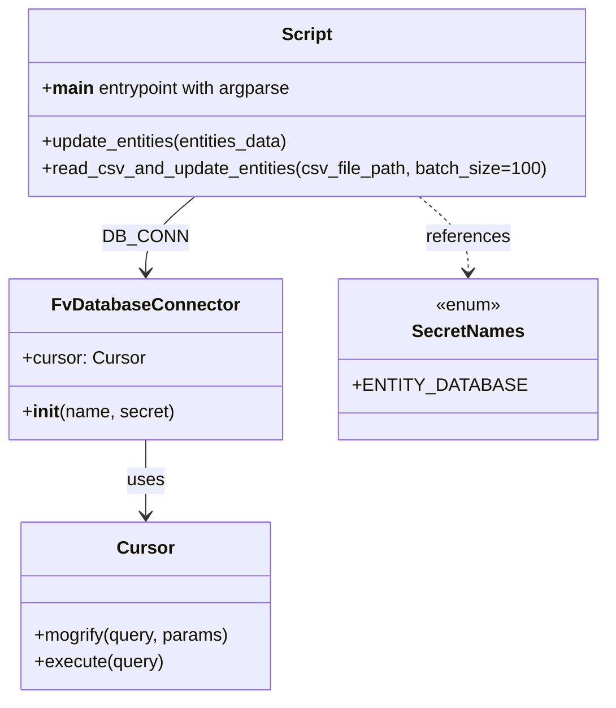

# Diagram: entity_core/entity_service/entity_service_scripts/update_entity_expired-ISS-12762.py


> Auto-generated by Obscura crawlers

## Diagram 1

```mermaid
flowchart TD
    Start([Start]) --> ParseArgs[Parse command-line args (argparse)]
    ParseArgs --> OpenCSV[Open CSV file with encoding utf-8-sig]
    OpenCSV --> ReadRow[Read next CSV row (csv.DictReader)]
    ReadRow --> Extract[Extract vin and set_expiration_date fields]
    Extract --> ParseDate[Parse date with datetime.strptime("%m/%d/%Y %H:%M")]
    ParseDate --> Append[Append (vin, set_expiration_date) to entities_data]
    Append --> BatchCheck{len(entities_data) >= batch_size?}
    BatchCheck -- Yes --> PrintMsg[Print "Updating N entities..."]
    PrintMsg --> UpdateCall[Call update_entities(entities_data)]
    UpdateCall --> ClearBatch[Clear entities_data list]
    ClearBatch --> ReadRow
    BatchCheck -- No --> ReadRow
    ReadRow --> EOFCheck{End of file reached?}
    EOFCheck -- No --> ReadRow
    EOFCheck -- Yes --> RemainingCheck{entities_data non-empty?}
    RemainingCheck -- Yes --> UpdateCall
    RemainingCheck -- No --> End([End])
```

> SVG rendering failed for this diagram.

## Diagram 2



### SVG

<svg id="container" width="519.607421875" xmlns="http://www.w3.org/2000/svg" class="classDiagram" height="626" viewBox="0 0 519.607421875 626" role="graphics-document document" aria-roledescription="class"><style>#container{font-family:"trebuchet ms",verdana,arial,sans-serif;font-size:16px;fill:#333;}@keyframes edge-animation-frame{from{stroke-dashoffset:0;}}@keyframes dash{to{stroke-dashoffset:0;}}#container .edge-animation-slow{stroke-dasharray:9,5!important;stroke-dashoffset:900;animation:dash 50s linear infinite;stroke-linecap:round;}#container .edge-animation-fast{stroke-dasharray:9,5!important;stroke-dashoffset:900;animation:dash 20s linear infinite;stroke-linecap:round;}#container .error-icon{fill:#552222;}#container .error-text{fill:#552222;stroke:#552222;}#container .edge-thickness-normal{stroke-width:1px;}#container .edge-thickness-thick{stroke-width:3.5px;}#container .edge-pattern-solid{stroke-dasharray:0;}#container .edge-thickness-invisible{stroke-width:0;fill:none;}#container .edge-pattern-dashed{stroke-dasharray:3;}#container .edge-pattern-dotted{stroke-dasharray:2;}#container .marker{fill:#333333;stroke:#333333;}#container .marker.cross{stroke:#333333;}#container svg{font-family:"trebuchet ms",verdana,arial,sans-serif;font-size:16px;}#container p{margin:0;}#container g.classGroup text{fill:#9370DB;stroke:none;font-family:"trebuchet ms",verdana,arial,sans-serif;font-size:10px;}#container g.classGroup text .title{font-weight:bolder;}#container .nodeLabel,#container .edgeLabel{color:#131300;}#container .edgeLabel .label rect{fill:#ECECFF;}#container .label text{fill:#131300;}#container .labelBkg{background:#ECECFF;}#container .edgeLabel .label span{background:#ECECFF;}#container .classTitle{font-weight:bolder;}#container .node rect,#container .node circle,#container .node ellipse,#container .node polygon,#container .node path{fill:#ECECFF;stroke:#9370DB;stroke-width:1px;}#container .divider{stroke:#9370DB;stroke-width:1;}#container g.clickable{cursor:pointer;}#container g.classGroup rect{fill:#ECECFF;stroke:#9370DB;}#container g.classGroup line{stroke:#9370DB;stroke-width:1;}#container .classLabel .box{stroke:none;stroke-width:0;fill:#ECECFF;opacity:0.5;}#container .classLabel .label{fill:#9370DB;font-size:10px;}#container .relation{stroke:#333333;stroke-width:1;fill:none;}#container .dashed-line{stroke-dasharray:3;}#container .dotted-line{stroke-dasharray:1 2;}#container #compositionStart,#container .composition{fill:#333333!important;stroke:#333333!important;stroke-width:1;}#container #compositionEnd,#container .composition{fill:#333333!important;stroke:#333333!important;stroke-width:1;}#container #dependencyStart,#container .dependency{fill:#333333!important;stroke:#333333!important;stroke-width:1;}#container #dependencyStart,#container .dependency{fill:#333333!important;stroke:#333333!important;stroke-width:1;}#container #extensionStart,#container .extension{fill:transparent!important;stroke:#333333!important;stroke-width:1;}#container #extensionEnd,#container .extension{fill:transparent!important;stroke:#333333!important;stroke-width:1;}#container #aggregationStart,#container .aggregation{fill:transparent!important;stroke:#333333!important;stroke-width:1;}#container #aggregationEnd,#container .aggregation{fill:transparent!important;stroke:#333333!important;stroke-width:1;}#container #lollipopStart,#container .lollipop{fill:#ECECFF!important;stroke:#333333!important;stroke-width:1;}#container #lollipopEnd,#container .lollipop{fill:#ECECFF!important;stroke:#333333!important;stroke-width:1;}#container .edgeTerminals{font-size:11px;line-height:initial;}#container .classTitleText{text-anchor:middle;font-size:18px;fill:#333;}#container .label-icon{display:inline-block;height:1em;overflow:visible;vertical-align:-0.125em;}#container .node .label-icon path{fill:currentColor;stroke:revert;stroke-width:revert;}#container :root{--mermaid-font-family:"trebuchet ms",verdana,arial,sans-serif;}</style><g><defs><marker id="container_class-aggregationStart" class="marker aggregation class" refX="18" refY="7" markerWidth="190" markerHeight="240" orient="auto"><path d="M 18,7 L9,13 L1,7 L9,1 Z"></path></marker></defs><defs><marker id="container_class-aggregationEnd" class="marker aggregation class" refX="1" refY="7" markerWidth="20" markerHeight="28" orient="auto"><path d="M 18,7 L9,13 L1,7 L9,1 Z"></path></marker></defs><defs><marker id="container_class-extensionStart" class="marker extension class" refX="18" refY="7" markerWidth="190" markerHeight="240" orient="auto"><path d="M 1,7 L18,13 V 1 Z"></path></marker></defs><defs><marker id="container_class-extensionEnd" class="marker extension class" refX="1" refY="7" markerWidth="20" markerHeight="28" orient="auto"><path d="M 1,1 V 13 L18,7 Z"></path></marker></defs><defs><marker id="container_class-compositionStart" class="marker composition class" refX="18" refY="7" markerWidth="190" markerHeight="240" orient="auto"><path d="M 18,7 L9,13 L1,7 L9,1 Z"></path></marker></defs><defs><marker id="container_class-compositionEnd" class="marker composition class" refX="1" refY="7" markerWidth="20" markerHeight="28" orient="auto"><path d="M 18,7 L9,13 L1,7 L9,1 Z"></path></marker></defs><defs><marker id="container_class-dependencyStart" class="marker dependency class" refX="6" refY="7" markerWidth="190" markerHeight="240" orient="auto"><path d="M 5,7 L9,13 L1,7 L9,1 Z"></path></marker></defs><defs><marker id="container_class-dependencyEnd" class="marker dependency class" refX="13" refY="7" markerWidth="20" markerHeight="28" orient="auto"><path d="M 18,7 L9,13 L14,7 L9,1 Z"></path></marker></defs><defs><marker id="container_class-lollipopStart" class="marker lollipop class" refX="13" refY="7" markerWidth="190" markerHeight="240" orient="auto"><circle stroke="black" fill="transparent" cx="7" cy="7" r="6"></circle></marker></defs><defs><marker id="container_class-lollipopEnd" class="marker lollipop class" refX="1" refY="7" markerWidth="190" markerHeight="240" orient="auto"><circle stroke="black" fill="transparent" cx="7" cy="7" r="6"></circle></marker></defs><g class="root"><g class="clusters"></g><g class="edgePaths"><path d="M169.058,176L162.096,182.167C155.134,188.333,141.209,200.667,134.247,212C127.285,223.333,127.285,233.667,127.285,238.833L127.285,244" id="id_Script_FvDatabaseConnector_1" class="edge-thickness-normal edge-pattern-solid relation" style=";;;" data-edge="true" data-et="edge" data-id="id_Script_FvDatabaseConnector_1" data-points="W3sieCI6MTY5LjA1NzY3MzY4Mjg1MTI2LCJ5IjoxNzZ9LHsieCI6MTI3LjI4NTE1NjI1LCJ5IjoyMTN9LHsieCI6MTI3LjI4NTE1NjI1LCJ5IjoyNTB9XQ==" marker-end="url(#container_class-dependencyEnd)"></path><path d="M127.285,394L127.285,400.167C127.285,406.333,127.285,418.667,127.285,430C127.285,441.333,127.285,451.667,127.285,456.833L127.285,462" id="id_FvDatabaseConnector_Cursor_2" class="edge-thickness-normal edge-pattern-solid relation" style=";;;" data-edge="true" data-et="edge" data-id="id_FvDatabaseConnector_Cursor_2" data-points="W3sieCI6MTI3LjI4NTE1NjI1LCJ5IjozOTR9LHsieCI6MTI3LjI4NTE1NjI1LCJ5Ijo0MzF9LHsieCI6MTI3LjI4NTE1NjI1LCJ5Ijo0Njh9XQ==" marker-end="url(#container_class-dependencyEnd)"></path><path d="M358.727,176L365.69,182.167C372.652,188.333,386.576,200.667,393.538,212C400.5,223.333,400.5,233.667,400.5,238.833L400.5,244" id="id_Script_SecretNames_3" class="edge-thickness-normal edge-pattern-dashed relation" style=";;;" data-edge="true" data-et="edge" data-id="id_Script_SecretNames_3" data-points="W3sieCI6MzU4LjcyNzQ4MjU2NzE0ODc0LCJ5IjoxNzZ9LHsieCI6NDAwLjUsInkiOjIxM30seyJ4Ijo0MDAuNSwieSI6MjUwfV0=" marker-end="url(#container_class-dependencyEnd)"></path></g><g class="edgeLabels"><g class="edgeLabel" transform="translate(127.28515625, 213)"><g class="label" data-id="id_Script_FvDatabaseConnector_1" transform="translate(-34.484375, -12)"><foreignObject width="68.96875" height="24"><div xmlns="http://www.w3.org/1999/xhtml" class="labelBkg" style="display: table-cell; white-space: nowrap; line-height: 1.5; max-width: 200px; text-align: center;"><span class="edgeLabel"><p>DB_CONN</p></span></div></foreignObject></g></g><g class="edgeLabel" transform="translate(127.28515625, 431)"><g class="label" data-id="id_FvDatabaseConnector_Cursor_2" transform="translate(-16.4921875, -12)"><foreignObject width="32.984375" height="24"><div xmlns="http://www.w3.org/1999/xhtml" class="labelBkg" style="display: table-cell; white-space: nowrap; line-height: 1.5; max-width: 200px; text-align: center;"><span class="edgeLabel"><p>uses</p></span></div></foreignObject></g></g><g class="edgeLabel" transform="translate(400.5, 213)"><g class="label" data-id="id_Script_SecretNames_3" transform="translate(-37.828125, -12)"><foreignObject width="75.65625" height="24"><div xmlns="http://www.w3.org/1999/xhtml" class="labelBkg" style="display: table-cell; white-space: nowrap; line-height: 1.5; max-width: 200px; text-align: center;"><span class="edgeLabel"><p>references</p></span></div></foreignObject></g></g></g><g class="nodes"><g class="node default" id="classId-Script-0" transform="translate(263.892578125, 92)"><g class="basic label-container"><path d="M-247.71484375 -84 L247.71484375 -84 L247.71484375 84 L-247.71484375 84" stroke="none" stroke-width="0" fill="#ECECFF" style=""></path><path d="M-247.71484375 -84 C-103.90434209866976 -84, 39.90615955266048 -84, 247.71484375 -84 M-247.71484375 -84 C-99.75645287143104 -84, 48.201938007137926 -84, 247.71484375 -84 M247.71484375 -84 C247.71484375 -30.713661810062064, 247.71484375 22.572676379875872, 247.71484375 84 M247.71484375 -84 C247.71484375 -29.02434885103652, 247.71484375 25.951302297926958, 247.71484375 84 M247.71484375 84 C109.7102939410363 84, -28.294255867927404 84, -247.71484375 84 M247.71484375 84 C98.22749466185962 84, -51.259854426280754 84, -247.71484375 84 M-247.71484375 84 C-247.71484375 37.19756776684766, -247.71484375 -9.604864466304676, -247.71484375 -84 M-247.71484375 84 C-247.71484375 25.58669606086812, -247.71484375 -32.82660787826376, -247.71484375 -84" stroke="#9370DB" stroke-width="1.3" fill="none" stroke-dasharray="0 0" style=""></path></g><g class="annotation-group text" transform="translate(0, -60)"></g><g class="label-group text" transform="translate(-21.7421875, -60)"><g class="label" style="font-weight: bolder" transform="translate(0,-12)"><foreignObject width="43.484375" height="24"><div xmlns="http://www.w3.org/1999/xhtml" style="display: table-cell; white-space: nowrap; line-height: 1.5; max-width: 93px; text-align: center;"><span class="nodeLabel markdown-node-label" style=""><p>Script</p></span></div></foreignObject></g></g><g class="members-group text" transform="translate(-235.71484375, -12)"><g class="label" style="" transform="translate(0,-12)"><foreignObject width="227.46875" height="24"><div xmlns="http://www.w3.org/1999/xhtml" style="display: table-cell; white-space: nowrap; line-height: 1.5; max-width: 317px; text-align: center;"><span class="nodeLabel markdown-node-label" style=""><p>+<strong>main</strong> entrypoint with argparse</p></span></div></foreignObject></g></g><g class="methods-group text" transform="translate(-235.71484375, 36)"><g class="label" style="" transform="translate(0,-12)"><foreignObject width="227.4375" height="24"><div xmlns="http://www.w3.org/1999/xhtml" style="display: table-cell; white-space: nowrap; line-height: 1.5; max-width: 285px; text-align: center;"><span class="nodeLabel markdown-node-label" style=""><p>+update_entities(entities_data)</p></span></div></foreignObject></g><g class="label" style="" transform="translate(0,12)"><foreignObject width="449.6875" height="24"><div xmlns="http://www.w3.org/1999/xhtml" style="display: table-cell; white-space: nowrap; line-height: 1.5; max-width: 507px; text-align: center;"><span class="nodeLabel markdown-node-label" style=""><p>+read_csv_and_update_entities(csv_file_path, batch_size=100)</p></span></div></foreignObject></g></g><g class="divider" style=""><path d="M-247.71484375 -36 C-114.1010559693579 -36, 19.512731811284198 -36, 247.71484375 -36 M-247.71484375 -36 C-93.28300704142401 -36, 61.14882966715197 -36, 247.71484375 -36" stroke="#9370DB" stroke-width="1.3" fill="none" stroke-dasharray="0 0" style=""></path></g><g class="divider" style=""><path d="M-247.71484375 12 C-55.12444959177404 12, 137.46594456645192 12, 247.71484375 12 M-247.71484375 12 C-147.95742085244376 12, -48.19999795488752 12, 247.71484375 12" stroke="#9370DB" stroke-width="1.3" fill="none" stroke-dasharray="0 0" style=""></path></g></g><g class="node default" id="classId-FvDatabaseConnector-1" transform="translate(127.28515625, 322)"><g class="basic label-container"><path d="M-119.28515625 -72 L119.28515625 -72 L119.28515625 72 L-119.28515625 72" stroke="none" stroke-width="0" fill="#ECECFF" style=""></path><path d="M-119.28515625 -72 C-67.83644514735411 -72, -16.38773404470821 -72, 119.28515625 -72 M-119.28515625 -72 C-48.085977957561354 -72, 23.11320033487729 -72, 119.28515625 -72 M119.28515625 -72 C119.28515625 -32.48219701055649, 119.28515625 7.03560597888702, 119.28515625 72 M119.28515625 -72 C119.28515625 -34.57215063808936, 119.28515625 2.855698723821277, 119.28515625 72 M119.28515625 72 C42.66263649565357 72, -33.959883258692855 72, -119.28515625 72 M119.28515625 72 C27.449813421432182 72, -64.38552940713564 72, -119.28515625 72 M-119.28515625 72 C-119.28515625 22.099095458299978, -119.28515625 -27.801809083400045, -119.28515625 -72 M-119.28515625 72 C-119.28515625 25.981203136797212, -119.28515625 -20.037593726405575, -119.28515625 -72" stroke="#9370DB" stroke-width="1.3" fill="none" stroke-dasharray="0 0" style=""></path></g><g class="annotation-group text" transform="translate(0, -48)"></g><g class="label-group text" transform="translate(-79.3046875, -48)"><g class="label" style="font-weight: bolder" transform="translate(0,-12)"><foreignObject width="158.609375" height="24"><div xmlns="http://www.w3.org/1999/xhtml" style="display: table-cell; white-space: nowrap; line-height: 1.5; max-width: 207px; text-align: center;"><span class="nodeLabel markdown-node-label" style=""><p>FvDatabaseConnector</p></span></div></foreignObject></g></g><g class="members-group text" transform="translate(-107.28515625, 0)"><g class="label" style="" transform="translate(0,-12)"><foreignObject width="108.890625" height="24"><div xmlns="http://www.w3.org/1999/xhtml" style="display: table-cell; white-space: nowrap; line-height: 1.5; max-width: 167px; text-align: center;"><span class="nodeLabel markdown-node-label" style=""><p>+cursor: Cursor</p></span></div></foreignObject></g></g><g class="methods-group text" transform="translate(-107.28515625, 48)"><g class="label" style="" transform="translate(0,-12)"><foreignObject width="135.265625" height="24"><div xmlns="http://www.w3.org/1999/xhtml" style="display: table-cell; white-space: nowrap; line-height: 1.5; max-width: 224px; text-align: center;"><span class="nodeLabel markdown-node-label" style=""><p>+<strong>init</strong>(name, secret)</p></span></div></foreignObject></g></g><g class="divider" style=""><path d="M-119.28515625 -24 C-24.69238631816154 -24, 69.90038361367692 -24, 119.28515625 -24 M-119.28515625 -24 C-51.42502113273858 -24, 16.435113984522843 -24, 119.28515625 -24" stroke="#9370DB" stroke-width="1.3" fill="none" stroke-dasharray="0 0" style=""></path></g><g class="divider" style=""><path d="M-119.28515625 24 C-57.46976779530064 24, 4.345620659398719 24, 119.28515625 24 M-119.28515625 24 C-31.238894994719274 24, 56.80736626056145 24, 119.28515625 24" stroke="#9370DB" stroke-width="1.3" fill="none" stroke-dasharray="0 0" style=""></path></g></g><g class="node default" id="classId-Cursor-2" transform="translate(127.28515625, 543)"><g class="basic label-container"><path d="M-112.1015625 -75 L112.1015625 -75 L112.1015625 75 L-112.1015625 75" stroke="none" stroke-width="0" fill="#ECECFF" style=""></path><path d="M-112.1015625 -75 C-60.930992662881856 -75, -9.760422825763712 -75, 112.1015625 -75 M-112.1015625 -75 C-62.761801506728226 -75, -13.422040513456452 -75, 112.1015625 -75 M112.1015625 -75 C112.1015625 -27.02046567775703, 112.1015625 20.95906864448594, 112.1015625 75 M112.1015625 -75 C112.1015625 -19.792130789841863, 112.1015625 35.41573842031627, 112.1015625 75 M112.1015625 75 C50.866618109835706 75, -10.368326280328588 75, -112.1015625 75 M112.1015625 75 C46.195859221369474 75, -19.70984405726105 75, -112.1015625 75 M-112.1015625 75 C-112.1015625 21.673971777655893, -112.1015625 -31.652056444688213, -112.1015625 -75 M-112.1015625 75 C-112.1015625 24.739091439672286, -112.1015625 -25.521817120655427, -112.1015625 -75" stroke="#9370DB" stroke-width="1.3" fill="none" stroke-dasharray="0 0" style=""></path></g><g class="annotation-group text" transform="translate(0, -51)"></g><g class="label-group text" transform="translate(-23.90625, -51)"><g class="label" style="font-weight: bolder" transform="translate(0,-12)"><foreignObject width="47.8125" height="24"><div xmlns="http://www.w3.org/1999/xhtml" style="display: table-cell; white-space: nowrap; line-height: 1.5; max-width: 98px; text-align: center;"><span class="nodeLabel markdown-node-label" style=""><p>Cursor</p></span></div></foreignObject></g></g><g class="members-group text" transform="translate(-100.1015625, -3)"></g><g class="methods-group text" transform="translate(-100.1015625, 27)"><g class="label" style="" transform="translate(0,-12)"><foreignObject width="176.296875" height="24"><div xmlns="http://www.w3.org/1999/xhtml" style="display: table-cell; white-space: nowrap; line-height: 1.5; max-width: 234px; text-align: center;"><span class="nodeLabel markdown-node-label" style=""><p>+mogrify(query, params)</p></span></div></foreignObject></g><g class="label" style="" transform="translate(0,12)"><foreignObject width="115.96875" height="24"><div xmlns="http://www.w3.org/1999/xhtml" style="display: table-cell; white-space: nowrap; line-height: 1.5; max-width: 173px; text-align: center;"><span class="nodeLabel markdown-node-label" style=""><p>+execute(query)</p></span></div></foreignObject></g></g><g class="divider" style=""><path d="M-112.1015625 -27 C-56.245577052500536 -27, -0.3895916050010726 -27, 112.1015625 -27 M-112.1015625 -27 C-26.547833545206927 -27, 59.005895409586145 -27, 112.1015625 -27" stroke="#9370DB" stroke-width="1.3" fill="none" stroke-dasharray="0 0" style=""></path></g><g class="divider" style=""><path d="M-112.1015625 -3 C-36.735715826558476 -3, 38.63013084688305 -3, 112.1015625 -3 M-112.1015625 -3 C-48.14277261202886 -3, 15.816017275942286 -3, 112.1015625 -3" stroke="#9370DB" stroke-width="1.3" fill="none" stroke-dasharray="0 0" style=""></path></g></g><g class="node default" id="classId-SecretNames-3" transform="translate(400.5, 322)"><g class="basic label-container"><path d="M-103.9296875 -72 L103.9296875 -72 L103.9296875 72 L-103.9296875 72" stroke="none" stroke-width="0" fill="#ECECFF" style=""></path><path d="M-103.9296875 -72 C-32.50228569998539 -72, 38.925116100029214 -72, 103.9296875 -72 M-103.9296875 -72 C-35.01440424852879 -72, 33.90087900294242 -72, 103.9296875 -72 M103.9296875 -72 C103.9296875 -40.36956748527935, 103.9296875 -8.739134970558695, 103.9296875 72 M103.9296875 -72 C103.9296875 -29.867766857576086, 103.9296875 12.264466284847828, 103.9296875 72 M103.9296875 72 C46.74300464621002 72, -10.443678207579964 72, -103.9296875 72 M103.9296875 72 C37.914305469152964 72, -28.10107656169407 72, -103.9296875 72 M-103.9296875 72 C-103.9296875 25.49733851564376, -103.9296875 -21.005322968712477, -103.9296875 -72 M-103.9296875 72 C-103.9296875 40.8494123319718, -103.9296875 9.698824663943597, -103.9296875 -72" stroke="#9370DB" stroke-width="1.3" fill="none" stroke-dasharray="0 0" style=""></path></g><g class="annotation-group text" transform="translate(-29.53125, -48)"><g class="label" style="" transform="translate(0,-12)"><foreignObject width="59.0625" height="24"><div xmlns="http://www.w3.org/1999/xhtml" style="display: table-cell; white-space: nowrap; line-height: 1.5; max-width: 109px; text-align: center;"><span class="nodeLabel markdown-node-label" style=""><p>«enum»</p></span></div></foreignObject></g></g><g class="label-group text" transform="translate(-48.03125, -24)"><g class="label" style="font-weight: bolder" transform="translate(0,-12)"><foreignObject width="96.0625" height="24"><div xmlns="http://www.w3.org/1999/xhtml" style="display: table-cell; white-space: nowrap; line-height: 1.5; max-width: 145px; text-align: center;"><span class="nodeLabel markdown-node-label" style=""><p>SecretNames</p></span></div></foreignObject></g></g><g class="members-group text" transform="translate(-91.9296875, 24)"><g class="label" style="" transform="translate(0,-12)"><foreignObject width="135.828125" height="24"><div xmlns="http://www.w3.org/1999/xhtml" style="display: table-cell; white-space: nowrap; line-height: 1.5; max-width: 193px; text-align: center;"><span class="nodeLabel markdown-node-label" style=""><p>+ENTITY_DATABASE</p></span></div></foreignObject></g></g><g class="methods-group text" transform="translate(-91.9296875, 72)"></g><g class="divider" style=""><path d="M-103.9296875 0 C-40.21652531799524 0, 23.496636864009517 0, 103.9296875 0 M-103.9296875 0 C-45.45494543262238 0, 13.019796634755238 0, 103.9296875 0" stroke="#9370DB" stroke-width="1.3" fill="none" stroke-dasharray="0 0" style=""></path></g><g class="divider" style=""><path d="M-103.9296875 48 C-25.874389547816676 48, 52.18090840436665 48, 103.9296875 48 M-103.9296875 48 C-25.015742814118454 48, 53.89820187176309 48, 103.9296875 48" stroke="#9370DB" stroke-width="1.3" fill="none" stroke-dasharray="0 0" style=""></path></g></g></g></g></g></svg>
