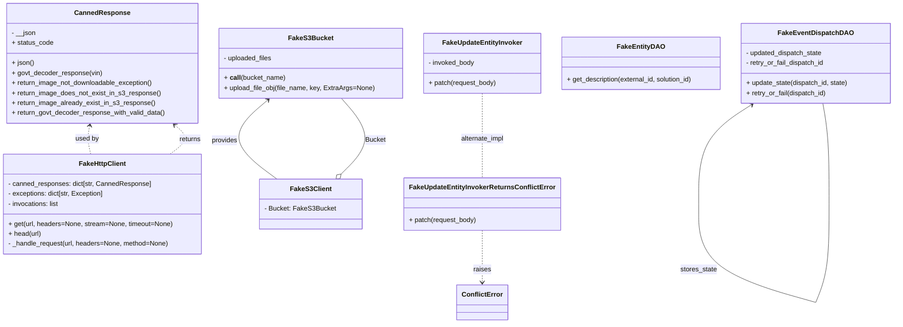

# Diagram: entity_core/entity_service/entity_service_tests/add_finished_vehicle_references_tests/common.py

> Auto-generated by Obscura crawlers

## Mermaid

### SVG

<svg id="container" width="2132.94921875" xmlns="http://www.w3.org/2000/svg" class="classDiagram" height="776" viewBox="0 0 2132.94921875 776" role="graphics-document document" aria-roledescription="class"><g><defs><marker id="container_class-aggregationStart" class="marker aggregation class" refX="18" refY="7" markerWidth="190" markerHeight="240" orient="auto"><path d="M 18,7 L9,13 L1,7 L9,1 Z"></path></marker></defs><defs><marker id="container_class-aggregationEnd" class="marker aggregation class" refX="1" refY="7" markerWidth="20" markerHeight="28" orient="auto"><path d="M 18,7 L9,13 L1,7 L9,1 Z"></path></marker></defs><defs><marker id="container_class-extensionStart" class="marker extension class" refX="18" refY="7" markerWidth="190" markerHeight="240" orient="auto"><path d="M 1,7 L18,13 V 1 Z"></path></marker></defs><defs><marker id="container_class-extensionEnd" class="marker extension class" refX="1" refY="7" markerWidth="20" markerHeight="28" orient="auto"><path d="M 1,1 V 13 L18,7 Z"></path></marker></defs><defs><marker id="container_class-compositionStart" class="marker composition class" refX="18" refY="7" markerWidth="190" markerHeight="240" orient="auto"><path d="M 18,7 L9,13 L1,7 L9,1 Z"></path></marker></defs><defs><marker id="container_class-compositionEnd" class="marker composition class" refX="1" refY="7" markerWidth="20" markerHeight="28" orient="auto"><path d="M 18,7 L9,13 L1,7 L9,1 Z"></path></marker></defs><defs><marker id="container_class-dependencyStart" class="marker dependency class" refX="6" refY="7" markerWidth="190" markerHeight="240" orient="auto"><path d="M 5,7 L9,13 L1,7 L9,1 Z"></path></marker></defs><defs><marker id="container_class-dependencyEnd" class="marker dependency class" refX="13" refY="7" markerWidth="20" markerHeight="28" orient="auto"><path d="M 18,7 L9,13 L14,7 L9,1 Z"></path></marker></defs><defs><marker id="container_class-lollipopStart" class="marker lollipop class" refX="13" refY="7" markerWidth="190" markerHeight="240" orient="auto"><circle stroke="black" fill="transparent" cx="7" cy="7" r="6"></circle></marker></defs><defs><marker id="container_class-lollipopEnd" class="marker lollipop class" refX="1" refY="7" markerWidth="190" markerHeight="240" orient="auto"><circle stroke="black" fill="transparent" cx="7" cy="7" r="6"></circle></marker></defs><g class="root"><g class="clusters"></g><g class="edgePaths"><path d="M810.478,417.698L824.354,403.582C838.23,389.465,865.982,361.233,866.074,330.95C866.166,300.667,838.597,268.333,824.813,252.167L811.028,236" id="id_FakeS3Client_FakeS3Bucket_1" class="edge-thickness-normal edge-pattern-solid relation" style=";;;" data-edge="true" data-et="edge" data-id="id_FakeS3Client_FakeS3Bucket_1" data-points="W3sieCI6Nzk4LjM4NTE1MTI3Mzg4NTMsInkiOjQzMH0seyJ4Ijo4OTMuNzM0Mzc1LCJ5IjozMzN9LHsieCI6ODExLjAyODE0MjI2NTE5MzMsInkiOjIzNn1d" marker-start="url(#container_class-aggregationStart)"></path><path d="M1145.891,553L1145.891,568.667C1145.891,584.333,1145.891,615.667,1145.891,636.5C1145.891,657.333,1145.891,667.667,1145.891,672.833L1145.891,678" id="id_FakeUpdateEntityInvokerReturnsConflictError_ConflictError_2" class="edge-thickness-normal edge-pattern-dashed relation" style=";;;" data-edge="true" data-et="edge" data-id="id_FakeUpdateEntityInvokerReturnsConflictError_ConflictError_2" data-points="W3sieCI6MTE0NS44OTA2MjUsInkiOjU1M30seyJ4IjoxMTQ1Ljg5MDYyNSwieSI6NjQ3fSx7IngiOjExNDUuODkwNjI1LCJ5Ijo2ODR9XQ==" marker-end="url(#container_class-dependencyEnd)"></path><path d="M403.653,370L411.86,363.833C420.066,357.667,436.479,345.333,438.323,333.655C440.167,321.976,427.442,310.952,421.08,305.441L414.717,299.929" id="id_FakeHttpClient_CannedResponse_3" class="edge-thickness-normal edge-pattern-dashed relation" style=";;;" data-edge="true" data-et="edge" data-id="id_FakeHttpClient_CannedResponse_3" data-points="W3sieCI6NDAzLjY1Mjk5MDY0NDkwNDQzLCJ5IjozNzB9LHsieCI6NDUyLjg5MjU3ODEyNSwieSI6MzMzfSx7IngiOjQxMC4xODE5OTY3MTk2MTMyNywieSI6Mjk2fV0=" marker-end="url(#container_class-dependencyEnd)"></path><path d="M213.08,301.877L212.011,307.064C210.943,312.251,208.805,322.626,209.201,333.979C209.597,345.333,212.527,357.667,213.991,363.833L215.456,370" id="id_CannedResponse_FakeHttpClient_4" class="edge-thickness-normal edge-pattern-dashed relation" style=";;;" data-edge="true" data-et="edge" data-id="id_CannedResponse_FakeHttpClient_4" data-points="W3sieCI6MjE0LjI5MDU5NDc4NTkxMTYsInkiOjI5Nn0seyJ4IjoyMDYuNjY3OTY4NzUsInkiOjMzM30seyJ4IjoyMTUuNDU1ODM2OTgyNDg0MDcsInkiOjM3MH1d" marker-start="url(#container_class-dependencyStart)"></path><path d="M1145.891,224L1145.891,242.167C1145.891,260.333,1145.891,296.667,1145.891,330.5C1145.891,364.333,1145.891,395.667,1145.891,411.333L1145.891,427" id="id_FakeUpdateEntityInvoker_FakeUpdateEntityInvokerReturnsConflictError_5" class="edge-thickness-normal edge-pattern-dashed relation" style=";;;" data-edge="true" data-et="edge" data-id="id_FakeUpdateEntityInvoker_FakeUpdateEntityInvokerReturnsConflictError_5" data-points="W3sieCI6MTE0NS44OTA2MjUsInkiOjIyNH0seyJ4IjoxMTQ1Ljg5MDYyNSwieSI6MzMzfSx7IngiOjExNDUuODkwNjI1LCJ5Ijo0Mjd9XQ=="></path><path d="M637.907,239.929L620.001,255.441C602.095,270.952,566.283,301.976,569.891,333.655C573.5,365.333,616.529,397.667,638.044,413.833L659.558,430" id="id_FakeS3Bucket_FakeS3Client_6" class="edge-thickness-normal edge-pattern-solid relation" style=";;;" data-edge="true" data-et="edge" data-id="id_FakeS3Bucket_FakeS3Client_6" data-points="W3sieCI6NjQyLjQ0MTY4NjgwOTM5MjMsInkiOjIzNn0seyJ4Ijo1MzAuNDcwNzAzMTI1LCJ5IjozMzN9LHsieCI6NjU5LjU1ODI3MDMwMjU0NzcsInkiOjQzMH1d" marker-start="url(#container_class-dependencyStart)"></path><path d="M1790.59,251.204L1769.008,264.837C1747.427,278.47,1704.263,305.735,1682.681,345.526C1661.099,385.317,1661.099,437.633,1661.099,463.792L1661.099,489.95" id="FakeEventDispatchDAO-cyclic-special-1" class="edge-thickness-normal edge-pattern-solid relation" style=";;;" data-edge="true" data-et="edge" data-id="FakeEventDispatchDAO-cyclic-special-1" data-points="W3sieCI6MTc5NS42NjI4NjI1NjkyNTgzLCJ5IjoyNDh9LHsieCI6MTY2MS4wOTkyMTg3NTAzNzI1LCJ5IjozMzN9LHsieCI6MTY2MS4wOTkyMTg3NTAzNzI1LCJ5Ijo0ODkuOTQ5OTk5OTk5MjU0OTR9XQ==" marker-start="url(#container_class-dependencyStart)"></path><path d="M1661.099,490.05L1661.099,516.208C1661.099,542.367,1661.099,594.683,1708.848,634.006C1756.596,673.329,1852.093,699.657,1899.842,712.822L1947.591,725.986" id="FakeEventDispatchDAO-cyclic-special-mid" class="edge-thickness-normal edge-pattern-solid relation" style=";;;" data-edge="true" data-et="edge" data-id="FakeEventDispatchDAO-cyclic-special-mid" data-points="W3sieCI6MTY2MS4wOTkyMTg3NTAzNzI1LCJ5Ijo0OTAuMDUwMDAwMDAwNzQ1MDZ9LHsieCI6MTY2MS4wOTkyMTg3NTAzNzI1LCJ5Ijo2NDd9LHsieCI6MTk0Ny41OTA2MjQ5OTkyNTUsInkiOjcyNS45ODYyMTQ5MDY1NjI1fV0="></path><path d="M1947.661,725.95L1953.005,712.792C1958.349,699.633,1969.038,673.317,1974.382,633.992C1979.727,594.667,1979.727,542.333,1979.727,490C1979.727,437.667,1979.727,385.333,1977.215,345C1974.704,304.667,1969.681,276.333,1967.17,262.167L1964.659,248" id="FakeEventDispatchDAO-cyclic-special-2" class="edge-thickness-normal edge-pattern-solid relation" style=";;;" data-edge="true" data-et="edge" data-id="FakeEventDispatchDAO-cyclic-special-2" data-points="W3sieCI6MTk0Ny42NjA5MzI1NTU2ODI0LCJ5Ijo3MjUuOTQ5OTk5OTk5MjU0OX0seyJ4IjoxOTc5LjcyNjU2MjUsInkiOjY0N30seyJ4IjoxOTc5LjcyNjU2MjUsInkiOjQ5MH0seyJ4IjoxOTc5LjcyNjU2MjUsInkiOjMzM30seyJ4IjoxOTY0LjY1ODU4MDgwMTEwNSwieSI6MjQ4fV0="></path></g><g class="edgeLabels"><g class="edgeLabel" transform="translate(890.73978, 336.04644)"><g class="label" data-id="id_FakeS3Client_FakeS3Bucket_1" transform="translate(-24.6171875, -12)"><foreignObject width="49.234375" height="24">

Bucket

</foreignObject></g></g><g class="edgeLabel" transform="translate(1145.890625, 647)"><g class="label" data-id="id_FakeUpdateEntityInvokerReturnsConflictError_ConflictError_2" transform="translate(-21.25, -12)"><foreignObject width="42.5" height="24">

raises

</foreignObject></g></g><g class="edgeLabel" transform="translate(450.86063, 334.52686)"><g class="label" data-id="id_FakeHttpClient_CannedResponse_3" transform="translate(-26.265625, -12)"><foreignObject width="52.53125" height="24">

returns

</foreignObject></g></g><g class="edgeLabel" transform="translate(206.69711, 333.12271)"><g class="label" data-id="id_CannedResponse_FakeHttpClient_4" transform="translate(-28.3125, -12)"><foreignObject width="56.625" height="24">

used by

</foreignObject></g></g><g class="edgeLabel" transform="translate(1145.890625, 333)"><g class="label" data-id="id_FakeUpdateEntityInvoker_FakeUpdateEntityInvokerReturnsConflictError_5" transform="translate(-53.2109375, -12)"><foreignObject width="106.421875" height="24">

alternate_impl

</foreignObject></g></g><g class="edgeLabel" transform="translate(535.79769, 337.00285)"><g class="label" data-id="id_FakeS3Bucket_FakeS3Client_6" transform="translate(-31.3125, -12)"><foreignObject width="62.625" height="24">

provides

</foreignObject></g></g><g class="edgeLabel"><g class="label" data-id="FakeEventDispatchDAO-cyclic-special-1" transform="translate(0, 0)"><foreignObject width="0" height="0">

</foreignObject></g></g><g class="edgeLabel" transform="translate(1661.0992187503725, 647)"><g class="label" data-id="FakeEventDispatchDAO-cyclic-special-mid" transform="translate(-44.171875, -12)"><foreignObject width="88.34375" height="24">

stores_state

</foreignObject></g></g><g class="edgeLabel"><g class="label" data-id="FakeEventDispatchDAO-cyclic-special-2" transform="translate(0, 0)"><foreignObject width="0" height="0">

</foreignObject></g></g></g><g class="nodes"><g class="node default" id="classId-CannedResponse-0" transform="translate(243.95703125, 152)"><g class="basic label-container"><path d="M-228.453125 -144 L228.453125 -144 L228.453125 144 L-228.453125 144" stroke="none" stroke-width="0" fill="#ECECFF" style=""></path><path d="M-228.453125 -144 C-135.34894435165114 -144, -42.244763703302254 -144, 228.453125 -144 M-228.453125 -144 C-102.56962468480513 -144, 23.31387563038973 -144, 228.453125 -144 M228.453125 -144 C228.453125 -46.46899550716566, 228.453125 51.06200898566868, 228.453125 144 M228.453125 -144 C228.453125 -53.918384178089354, 228.453125 36.16323164382129, 228.453125 144 M228.453125 144 C109.71742880969227 144, -9.01826738061547 144, -228.453125 144 M228.453125 144 C91.53581787893532 144, -45.38148924212936 144, -228.453125 144 M-228.453125 144 C-228.453125 66.42667558276067, -228.453125 -11.146648834478668, -228.453125 -144 M-228.453125 144 C-228.453125 76.30415373082566, -228.453125 8.608307461651322, -228.453125 -144" stroke="#9370DB" stroke-width="1.3" fill="none" stroke-dasharray="0 0" style=""></path></g><g class="annotation-group text" transform="translate(0, -120)"></g><g class="label-group text" transform="translate(-62.796875, -120)"><g class="label" style="font-weight: bolder" transform="translate(0,-12)"><foreignObject width="125.59375" height="24">

CannedResponse

</foreignObject></g></g><g class="members-group text" transform="translate(-216.453125, -72)"><g class="label" style="" transform="translate(0,-12)"><foreignObject width="58.421875" height="24">

- __json

</foreignObject></g><g class="label" style="" transform="translate(0,12)"><foreignObject width="99.265625" height="24">

+ status_code

</foreignObject></g></g><g class="methods-group text" transform="translate(-216.453125, 0)"><g class="label" style="" transform="translate(0,-12)"><foreignObject width="53.265625" height="24">

+ json()

</foreignObject></g><g class="label" style="" transform="translate(0,12)"><foreignObject width="216.125" height="24">

+ govt_decoder_response(vin)

</foreignObject></g><g class="label" style="" transform="translate(0,36)"><foreignObject width="341.8125" height="24">

+ return_image_not_downloadable_exception()

</foreignObject></g><g class="label" style="" transform="translate(0,60)"><foreignObject width="357.1875" height="24">

+ return_image_does_not_exist_in_s3_response()

</foreignObject></g><g class="label" style="" transform="translate(0,84)"><foreignObject width="342.75" height="24">

+ return_image_already_exist_in_s3_response()

</foreignObject></g><g class="label" style="" transform="translate(0,108)"><foreignObject width="370.109375" height="24">

+ return_govt_decoder_response_with_valid_data()

</foreignObject></g></g><g class="divider" style=""><path d="M-228.453125 -96 C-99.65220044608714 -96, 29.14872410782573 -96, 228.453125 -96 M-228.453125 -96 C-79.28559900184794 -96, 69.88192699630412 -96, 228.453125 -96" stroke="#9370DB" stroke-width="1.3" fill="none" stroke-dasharray="0 0" style=""></path></g><g class="divider" style=""><path d="M-228.453125 -24 C-47.49235294166394 -24, 133.46841911667212 -24, 228.453125 -24 M-228.453125 -24 C-127.98086934855372 -24, -27.50861369710745 -24, 228.453125 -24" stroke="#9370DB" stroke-width="1.3" fill="none" stroke-dasharray="0 0" style=""></path></g></g><g class="node default" id="classId-FakeHttpClient-1" transform="translate(243.95703125, 490)"><g class="basic label-container"><path d="M-235.95703125 -120 L235.95703125 -120 L235.95703125 120 L-235.95703125 120" stroke="none" stroke-width="0" fill="#ECECFF" style=""></path><path d="M-235.95703125 -120 C-67.64284729405267 -120, 100.67133666189466 -120, 235.95703125 -120 M-235.95703125 -120 C-82.65702061196023 -120, 70.64299002607953 -120, 235.95703125 -120 M235.95703125 -120 C235.95703125 -70.67412635268721, 235.95703125 -21.348252705374435, 235.95703125 120 M235.95703125 -120 C235.95703125 -29.347805511902877, 235.95703125 61.30438897619425, 235.95703125 120 M235.95703125 120 C58.43627535910903 120, -119.08448053178194 120, -235.95703125 120 M235.95703125 120 C49.305759118508206 120, -137.3455130129836 120, -235.95703125 120 M-235.95703125 120 C-235.95703125 56.93437989586091, -235.95703125 -6.131240208278186, -235.95703125 -120 M-235.95703125 120 C-235.95703125 52.33346629012152, -235.95703125 -15.333067419756958, -235.95703125 -120" stroke="#9370DB" stroke-width="1.3" fill="none" stroke-dasharray="0 0" style=""></path></g><g class="annotation-group text" transform="translate(0, -96)"></g><g class="label-group text" transform="translate(-54.0859375, -96)"><g class="label" style="font-weight: bolder" transform="translate(0,-12)"><foreignObject width="108.171875" height="24">

FakeHttpClient

</foreignObject></g></g><g class="members-group text" transform="translate(-223.95703125, -48)"><g class="label" style="" transform="translate(0,-12)"><foreignObject width="342.734375" height="24">

- canned_responses: dict[str, CannedResponse]

</foreignObject></g><g class="label" style="" transform="translate(0,12)"><foreignObject width="231.765625" height="24">

- exceptions: dict[str, Exception]

</foreignObject></g><g class="label" style="" transform="translate(0,36)"><foreignObject width="124.828125" height="24">

- invocations: list

</foreignObject></g></g><g class="methods-group text" transform="translate(-223.95703125, 48)"><g class="label" style="" transform="translate(0,-12)"><foreignObject width="393.828125" height="24">

+ get(url, headers=None, stream=None, timeout=None)

</foreignObject></g><g class="label" style="" transform="translate(0,12)"><foreignObject width="78.984375" height="24">

+ head(url)

</foreignObject></g><g class="label" style="" transform="translate(0,36)"><foreignObject width="386.8125" height="24">

- _handle_request(url, headers=None, method=None)

</foreignObject></g></g><g class="divider" style=""><path d="M-235.95703125 -72 C-78.78100803125676 -72, 78.39501518748648 -72, 235.95703125 -72 M-235.95703125 -72 C-85.93934189521141 -72, 64.07834745957717 -72, 235.95703125 -72" stroke="#9370DB" stroke-width="1.3" fill="none" stroke-dasharray="0 0" style=""></path></g><g class="divider" style=""><path d="M-235.95703125 24 C-136.5282686884616 24, -37.09950612692322 24, 235.95703125 24 M-235.95703125 24 C-83.82862192161869 24, 68.29978740676262 24, 235.95703125 24" stroke="#9370DB" stroke-width="1.3" fill="none" stroke-dasharray="0 0" style=""></path></g></g><g class="node default" id="classId-FakeUpdateEntityInvoker-2" transform="translate(1145.890625, 152)"><g class="basic label-container"><path d="M-139.48828125 -72 L139.48828125 -72 L139.48828125 72 L-139.48828125 72" stroke="none" stroke-width="0" fill="#ECECFF" style=""></path><path d="M-139.48828125 -72 C-58.54135639219048 -72, 22.40556846561904 -72, 139.48828125 -72 M-139.48828125 -72 C-32.410361395650355 -72, 74.66755845869929 -72, 139.48828125 -72 M139.48828125 -72 C139.48828125 -27.19151889734755, 139.48828125 17.6169622053049, 139.48828125 72 M139.48828125 -72 C139.48828125 -42.908041364362425, 139.48828125 -13.81608272872485, 139.48828125 72 M139.48828125 72 C45.56914116935894 72, -48.349998911282114 72, -139.48828125 72 M139.48828125 72 C47.653405107527504 72, -44.18147103494499 72, -139.48828125 72 M-139.48828125 72 C-139.48828125 28.3367033130953, -139.48828125 -15.326593373809402, -139.48828125 -72 M-139.48828125 72 C-139.48828125 30.446187783467607, -139.48828125 -11.107624433064785, -139.48828125 -72" stroke="#9370DB" stroke-width="1.3" fill="none" stroke-dasharray="0 0" style=""></path></g><g class="annotation-group text" transform="translate(0, -48)"></g><g class="label-group text" transform="translate(-91.8984375, -48)"><g class="label" style="font-weight: bolder" transform="translate(0,-12)"><foreignObject width="183.796875" height="24">

FakeUpdateEntityInvoker

</foreignObject></g></g><g class="members-group text" transform="translate(-127.48828125, 0)"><g class="label" style="" transform="translate(0,-12)"><foreignObject width="112.5625" height="24">

- invoked_body

</foreignObject></g></g><g class="methods-group text" transform="translate(-127.48828125, 48)"><g class="label" style="" transform="translate(0,-12)"><foreignObject width="163.078125" height="24">

+ patch(request_body)

</foreignObject></g></g><g class="divider" style=""><path d="M-139.48828125 -24 C-46.5245276513197 -24, 46.4392259473606 -24, 139.48828125 -24 M-139.48828125 -24 C-39.84617273528629 -24, 59.795935779427424 -24, 139.48828125 -24" stroke="#9370DB" stroke-width="1.3" fill="none" stroke-dasharray="0 0" style=""></path></g><g class="divider" style=""><path d="M-139.48828125 24 C-33.27803547093637 24, 72.93221030812725 24, 139.48828125 24 M-139.48828125 24 C-66.54789134908204 24, 6.392498551835928 24, 139.48828125 24" stroke="#9370DB" stroke-width="1.3" fill="none" stroke-dasharray="0 0" style=""></path></g></g><g class="node default" id="classId-FakeS3Bucket-3" transform="translate(739.40625, 152)"><g class="basic label-container"><path d="M-216.99609375 -84 L216.99609375 -84 L216.99609375 84 L-216.99609375 84" stroke="none" stroke-width="0" fill="#ECECFF" style=""></path><path d="M-216.99609375 -84 C-98.99860961631468 -84, 18.998874517370638 -84, 216.99609375 -84 M-216.99609375 -84 C-63.01640296659852 -84, 90.96328781680296 -84, 216.99609375 -84 M216.99609375 -84 C216.99609375 -49.44878338435981, 216.99609375 -14.897566768719614, 216.99609375 84 M216.99609375 -84 C216.99609375 -37.165151524456114, 216.99609375 9.669696951087772, 216.99609375 84 M216.99609375 84 C57.96955106362449 84, -101.05699162275101 84, -216.99609375 84 M216.99609375 84 C110.51252193382398 84, 4.028950117647952 84, -216.99609375 84 M-216.99609375 84 C-216.99609375 33.89937447076285, -216.99609375 -16.2012510584743, -216.99609375 -84 M-216.99609375 84 C-216.99609375 22.605479382550513, -216.99609375 -38.789041234898974, -216.99609375 -84" stroke="#9370DB" stroke-width="1.3" fill="none" stroke-dasharray="0 0" style=""></path></g><g class="annotation-group text" transform="translate(0, -60)"></g><g class="label-group text" transform="translate(-50.4296875, -60)"><g class="label" style="font-weight: bolder" transform="translate(0,-12)"><foreignObject width="100.859375" height="24">

FakeS3Bucket

</foreignObject></g></g><g class="members-group text" transform="translate(-204.99609375, -12)"><g class="label" style="" transform="translate(0,-12)"><foreignObject width="117.859375" height="24">

- uploaded_files

</foreignObject></g></g><g class="methods-group text" transform="translate(-204.99609375, 36)"><g class="label" style="" transform="translate(0,-12)"><foreignObject width="146.078125" height="24">

+ <strong>call</strong>(bucket_name)

</foreignObject></g><g class="label" style="" transform="translate(0,12)"><foreignObject width="359.5625" height="24">

+ upload_file_obj(file_name, key, ExtraArgs=None)

</foreignObject></g></g><g class="divider" style=""><path d="M-216.99609375 -36 C-68.53002854465646 -36, 79.93603666068708 -36, 216.99609375 -36 M-216.99609375 -36 C-56.036992303307784 -36, 104.92210914338443 -36, 216.99609375 -36" stroke="#9370DB" stroke-width="1.3" fill="none" stroke-dasharray="0 0" style=""></path></g><g class="divider" style=""><path d="M-216.99609375 12 C-97.57984132129685 12, 21.836411107406292 12, 216.99609375 12 M-216.99609375 12 C-69.45003351902002 12, 78.09602671195995 12, 216.99609375 12" stroke="#9370DB" stroke-width="1.3" fill="none" stroke-dasharray="0 0" style=""></path></g></g><g class="node default" id="classId-FakeEntityDAO-4" transform="translate(1527.85546875, 152)"><g class="basic label-container"><path d="M-192.4765625 -63 L192.4765625 -63 L192.4765625 63 L-192.4765625 63" stroke="none" stroke-width="0" fill="#ECECFF" style=""></path><path d="M-192.4765625 -63 C-56.509678340946465 -63, 79.45720581810707 -63, 192.4765625 -63 M-192.4765625 -63 C-92.38930864937343 -63, 7.697945201253134 -63, 192.4765625 -63 M192.4765625 -63 C192.4765625 -27.00656556770648, 192.4765625 8.986868864587038, 192.4765625 63 M192.4765625 -63 C192.4765625 -21.959370986298367, 192.4765625 19.081258027403265, 192.4765625 63 M192.4765625 63 C88.96275161617686 63, -14.55105926764628 63, -192.4765625 63 M192.4765625 63 C39.70445884010843 63, -113.06764481978314 63, -192.4765625 63 M-192.4765625 63 C-192.4765625 34.190258527923206, -192.4765625 5.380517055846411, -192.4765625 -63 M-192.4765625 63 C-192.4765625 13.553696945904079, -192.4765625 -35.89260610819184, -192.4765625 -63" stroke="#9370DB" stroke-width="1.3" fill="none" stroke-dasharray="0 0" style=""></path></g><g class="annotation-group text" transform="translate(0, -39)"></g><g class="label-group text" transform="translate(-53.109375, -39)"><g class="label" style="font-weight: bolder" transform="translate(0,-12)"><foreignObject width="106.21875" height="24">

FakeEntityDAO

</foreignObject></g></g><g class="members-group text" transform="translate(-180.4765625, 9)"></g><g class="methods-group text" transform="translate(-180.4765625, 39)"><g class="label" style="" transform="translate(0,-12)"><foreignObject width="307.84375" height="24">

+ get_description(external_id, solution_id)

</foreignObject></g></g><g class="divider" style=""><path d="M-192.4765625 -15 C-39.72827094823742 -15, 113.02002060352515 -15, 192.4765625 -15 M-192.4765625 -15 C-84.6580261757559 -15, 23.160510148488214 -15, 192.4765625 -15" stroke="#9370DB" stroke-width="1.3" fill="none" stroke-dasharray="0 0" style=""></path></g><g class="divider" style=""><path d="M-192.4765625 9 C-69.7150652762212 9, 53.04643194755761 9, 192.4765625 9 M-192.4765625 9 C-83.84381630452188 9, 24.78892989095624 9, 192.4765625 9" stroke="#9370DB" stroke-width="1.3" fill="none" stroke-dasharray="0 0" style=""></path></g></g><g class="node default" id="classId-FakeEventDispatchDAO-5" transform="translate(1947.640625, 152)"><g class="basic label-container"><path d="M-177.30859375 -96 L177.30859375 -96 L177.30859375 96 L-177.30859375 96" stroke="none" stroke-width="0" fill="#ECECFF" style=""></path><path d="M-177.30859375 -96 C-89.51971732658956 -96, -1.7308409031791143 -96, 177.30859375 -96 M-177.30859375 -96 C-102.90014481314077 -96, -28.49169587628154 -96, 177.30859375 -96 M177.30859375 -96 C177.30859375 -49.32666920556468, 177.30859375 -2.6533384111293543, 177.30859375 96 M177.30859375 -96 C177.30859375 -51.71805991981231, 177.30859375 -7.436119839624624, 177.30859375 96 M177.30859375 96 C71.23190464950738 96, -34.84478445098523 96, -177.30859375 96 M177.30859375 96 C80.13561790519731 96, -17.037357939605386 96, -177.30859375 96 M-177.30859375 96 C-177.30859375 26.799969844316365, -177.30859375 -42.40006031136727, -177.30859375 -96 M-177.30859375 96 C-177.30859375 49.106576506884345, -177.30859375 2.2131530137686894, -177.30859375 -96" stroke="#9370DB" stroke-width="1.3" fill="none" stroke-dasharray="0 0" style=""></path></g><g class="annotation-group text" transform="translate(0, -72)"></g><g class="label-group text" transform="translate(-83.8359375, -72)"><g class="label" style="font-weight: bolder" transform="translate(0,-12)"><foreignObject width="167.671875" height="24">

FakeEventDispatchDAO

</foreignObject></g></g><g class="members-group text" transform="translate(-165.30859375, -24)"><g class="label" style="" transform="translate(0,-12)"><foreignObject width="186.1875" height="24">

- updated_dispatch_state

</foreignObject></g><g class="label" style="" transform="translate(0,12)"><foreignObject width="190.171875" height="24">

- retry_or_fail_dispatch_id

</foreignObject></g></g><g class="methods-group text" transform="translate(-165.30859375, 48)"><g class="label" style="" transform="translate(0,-12)"><foreignObject width="246.78125" height="24">

+ update_state(dispatch_id, state)

</foreignObject></g><g class="label" style="" transform="translate(0,12)"><foreignObject width="194.078125" height="24">

+ retry_or_fail(dispatch_id)

</foreignObject></g></g><g class="divider" style=""><path d="M-177.30859375 -48 C-45.357080462007445 -48, 86.59443282598511 -48, 177.30859375 -48 M-177.30859375 -48 C-82.30120913189174 -48, 12.706175486216523 -48, 177.30859375 -48" stroke="#9370DB" stroke-width="1.3" fill="none" stroke-dasharray="0 0" style=""></path></g><g class="divider" style=""><path d="M-177.30859375 24 C-71.7878039170351 24, 33.73298591592979 24, 177.30859375 24 M-177.30859375 24 C-62.52872481445941 24, 52.25114412108118 24, 177.30859375 24" stroke="#9370DB" stroke-width="1.3" fill="none" stroke-dasharray="0 0" style=""></path></g></g><g class="node default" id="classId-FakeS3Client-6" transform="translate(739.40625, 490)"><g class="basic label-container"><path d="M-118.45703125 -60 L118.45703125 -60 L118.45703125 60 L-118.45703125 60" stroke="none" stroke-width="0" fill="#ECECFF" style=""></path><path d="M-118.45703125 -60 C-50.36209703724147 -60, 17.732837175517062 -60, 118.45703125 -60 M-118.45703125 -60 C-44.580404299248386 -60, 29.29622265150323 -60, 118.45703125 -60 M118.45703125 -60 C118.45703125 -20.98062963837136, 118.45703125 18.038740723257277, 118.45703125 60 M118.45703125 -60 C118.45703125 -35.34927965788515, 118.45703125 -10.698559315770297, 118.45703125 60 M118.45703125 60 C69.58137626846299 60, 20.70572128692598 60, -118.45703125 60 M118.45703125 60 C53.73758180146416 60, -10.981867647071681 60, -118.45703125 60 M-118.45703125 60 C-118.45703125 32.19123831195371, -118.45703125 4.382476623907415, -118.45703125 -60 M-118.45703125 60 C-118.45703125 26.868016806578375, -118.45703125 -6.263966386843251, -118.45703125 -60" stroke="#9370DB" stroke-width="1.3" fill="none" stroke-dasharray="0 0" style=""></path></g><g class="annotation-group text" transform="translate(0, -36)"></g><g class="label-group text" transform="translate(-46.5390625, -36)"><g class="label" style="font-weight: bolder" transform="translate(0,-12)"><foreignObject width="93.078125" height="24">

FakeS3Client

</foreignObject></g></g><g class="members-group text" transform="translate(-106.45703125, 12)"><g class="label" style="" transform="translate(0,-12)"><foreignObject width="166.375" height="24">

- Bucket: FakeS3Bucket

</foreignObject></g></g><g class="methods-group text" transform="translate(-106.45703125, 60)"></g><g class="divider" style=""><path d="M-118.45703125 -12 C-37.97099658668114 -12, 42.51503807663772 -12, 118.45703125 -12 M-118.45703125 -12 C-52.23442650804736 -12, 13.988178233905273 -12, 118.45703125 -12" stroke="#9370DB" stroke-width="1.3" fill="none" stroke-dasharray="0 0" style=""></path></g><g class="divider" style=""><path d="M-118.45703125 36 C-28.905034389601184 36, 60.64696247079763 36, 118.45703125 36 M-118.45703125 36 C-56.50712305724299 36, 5.442785135514015 36, 118.45703125 36" stroke="#9370DB" stroke-width="1.3" fill="none" stroke-dasharray="0 0" style=""></path></g></g><g class="node default" id="classId-FakeUpdateEntityInvokerReturnsConflictError-7" transform="translate(1145.890625, 490)"><g class="basic label-container"><path d="M-178.6171875 -63 L178.6171875 -63 L178.6171875 63 L-178.6171875 63" stroke="none" stroke-width="0" fill="#ECECFF" style=""></path><path d="M-178.6171875 -63 C-87.05187981508335 -63, 4.5134278698332935 -63, 178.6171875 -63 M-178.6171875 -63 C-65.74352294233839 -63, 47.130141615323225 -63, 178.6171875 -63 M178.6171875 -63 C178.6171875 -19.925098711124235, 178.6171875 23.14980257775153, 178.6171875 63 M178.6171875 -63 C178.6171875 -31.807108242678744, 178.6171875 -0.6142164853574883, 178.6171875 63 M178.6171875 63 C61.69357567033025 63, -55.230036159339505 63, -178.6171875 63 M178.6171875 63 C55.25626292090455 63, -68.1046616581909 63, -178.6171875 63 M-178.6171875 63 C-178.6171875 21.7999946752903, -178.6171875 -19.4000106494194, -178.6171875 -63 M-178.6171875 63 C-178.6171875 13.027574423425861, -178.6171875 -36.94485115314828, -178.6171875 -63" stroke="#9370DB" stroke-width="1.3" fill="none" stroke-dasharray="0 0" style=""></path></g><g class="annotation-group text" transform="translate(0, -39)"></g><g class="label-group text" transform="translate(-166.6171875, -39)"><g class="label" style="font-weight: bolder" transform="translate(0,-12)"><foreignObject width="333.234375" height="24">

FakeUpdateEntityInvokerReturnsConflictError

</foreignObject></g></g><g class="members-group text" transform="translate(-166.6171875, 9)"></g><g class="methods-group text" transform="translate(-166.6171875, 39)"><g class="label" style="" transform="translate(0,-12)"><foreignObject width="163.078125" height="24">

+ patch(request_body)

</foreignObject></g></g><g class="divider" style=""><path d="M-178.6171875 -15 C-63.13374233605691 -15, 52.349702827886176 -15, 178.6171875 -15 M-178.6171875 -15 C-37.10224477454352 -15, 104.41269795091296 -15, 178.6171875 -15" stroke="#9370DB" stroke-width="1.3" fill="none" stroke-dasharray="0 0" style=""></path></g><g class="divider" style=""><path d="M-178.6171875 9 C-106.11620088073059 9, -33.615214261461176 9, 178.6171875 9 M-178.6171875 9 C-52.471553196633536 9, 73.67408110673293 9, 178.6171875 9" stroke="#9370DB" stroke-width="1.3" fill="none" stroke-dasharray="0 0" style=""></path></g></g><g class="node default" id="classId-ConflictError-8" transform="translate(1145.890625, 726)"><g class="basic label-container"><path d="M-58.140625 -42 L58.140625 -42 L58.140625 42 L-58.140625 42" stroke="none" stroke-width="0" fill="#ECECFF" style=""></path><path d="M-58.140625 -42 C-26.936135648890474 -42, 4.268353702219052 -42, 58.140625 -42 M-58.140625 -42 C-16.885191515749 -42, 24.370241968502 -42, 58.140625 -42 M58.140625 -42 C58.140625 -21.04678605980659, 58.140625 -0.09357211961317802, 58.140625 42 M58.140625 -42 C58.140625 -23.044272974911408, 58.140625 -4.088545949822816, 58.140625 42 M58.140625 42 C16.79558239842075 42, -24.549460203158503 42, -58.140625 42 M58.140625 42 C29.183179230993147 42, 0.22573346198629451 42, -58.140625 42 M-58.140625 42 C-58.140625 13.66470797852103, -58.140625 -14.670584042957941, -58.140625 -42 M-58.140625 42 C-58.140625 19.653144759562604, -58.140625 -2.693710480874792, -58.140625 -42" stroke="#9370DB" stroke-width="1.3" fill="none" stroke-dasharray="0 0" style=""></path></g><g class="annotation-group text" transform="translate(0, -18)"></g><g class="label-group text" transform="translate(-46.140625, -18)"><g class="label" style="font-weight: bolder" transform="translate(0,-12)"><foreignObject width="92.28125" height="24">

ConflictError

</foreignObject></g></g><g class="members-group text" transform="translate(-46.140625, 30)"></g><g class="methods-group text" transform="translate(-46.140625, 60)"></g><g class="divider" style=""><path d="M-58.140625 6 C-29.356867377571064 6, -0.5731097551421271 6, 58.140625 6 M-58.140625 6 C-21.937096242146453 6, 14.266432515707095 6, 58.140625 6" stroke="#9370DB" stroke-width="1.3" fill="none" stroke-dasharray="0 0" style=""></path></g><g class="divider" style=""><path d="M-58.140625 24 C-19.17897750151321 24, 19.78266999697358 24, 58.140625 24 M-58.140625 24 C-32.248970002363635 24, -6.357315004727276 24, 58.140625 24" stroke="#9370DB" stroke-width="1.3" fill="none" stroke-dasharray="0 0" style=""></path></g></g><g class="label edgeLabel" id="FakeEventDispatchDAO---FakeEventDispatchDAO---1" transform="translate(1661.0992187503725, 490)"><rect width="0.1" height="0.1"></rect><g class="label" style="" transform="translate(0, 0)"><rect></rect><foreignObject width="0" height="0">

</foreignObject></g></g><g class="label edgeLabel" id="FakeEventDispatchDAO---FakeEventDispatchDAO---2" transform="translate(1947.640625, 726)"><rect width="0.1" height="0.1"></rect><g class="label" style="" transform="translate(0, 0)"><rect></rect><foreignObject width="0" height="0">

</foreignObject></g></g></g></g></g></svg>
