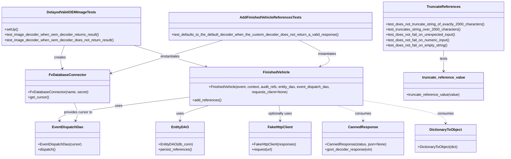
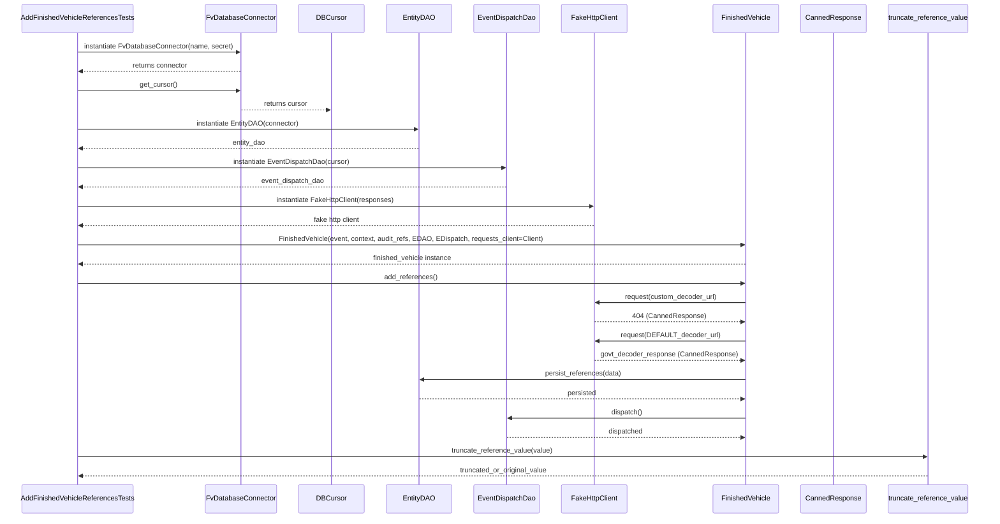

# Diagram: entity_core/entity_service/entity_service_tests/add_finished_vehicle_references_tests/test_add_fv_references.py

> Auto-generated by Obscura crawlers

## Diagram 1

### SVG

<svg id="container" width="2272.857421875" xmlns="http://www.w3.org/2000/svg" class="classDiagram" height="686" viewBox="0 0 2272.857421875 686" role="graphics-document document" aria-roledescription="class"><g><defs><marker id="container_class-aggregationStart" class="marker aggregation class" refX="18" refY="7" markerWidth="190" markerHeight="240" orient="auto"><path d="M 18,7 L9,13 L1,7 L9,1 Z"></path></marker></defs><defs><marker id="container_class-aggregationEnd" class="marker aggregation class" refX="1" refY="7" markerWidth="20" markerHeight="28" orient="auto"><path d="M 18,7 L9,13 L1,7 L9,1 Z"></path></marker></defs><defs><marker id="container_class-extensionStart" class="marker extension class" refX="18" refY="7" markerWidth="190" markerHeight="240" orient="auto"><path d="M 1,7 L18,13 V 1 Z"></path></marker></defs><defs><marker id="container_class-extensionEnd" class="marker extension class" refX="1" refY="7" markerWidth="20" markerHeight="28" orient="auto"><path d="M 1,1 V 13 L18,7 Z"></path></marker></defs><defs><marker id="container_class-compositionStart" class="marker composition class" refX="18" refY="7" markerWidth="190" markerHeight="240" orient="auto"><path d="M 18,7 L9,13 L1,7 L9,1 Z"></path></marker></defs><defs><marker id="container_class-compositionEnd" class="marker composition class" refX="1" refY="7" markerWidth="20" markerHeight="28" orient="auto"><path d="M 18,7 L9,13 L1,7 L9,1 Z"></path></marker></defs><defs><marker id="container_class-dependencyStart" class="marker dependency class" refX="6" refY="7" markerWidth="190" markerHeight="240" orient="auto"><path d="M 5,7 L9,13 L1,7 L9,1 Z"></path></marker></defs><defs><marker id="container_class-dependencyEnd" class="marker dependency class" refX="13" refY="7" markerWidth="20" markerHeight="28" orient="auto"><path d="M 18,7 L9,13 L14,7 L9,1 Z"></path></marker></defs><defs><marker id="container_class-lollipopStart" class="marker lollipop class" refX="13" refY="7" markerWidth="190" markerHeight="240" orient="auto"><circle stroke="black" fill="transparent" cx="7" cy="7" r="6"></circle></marker></defs><defs><marker id="container_class-lollipopEnd" class="marker lollipop class" refX="1" refY="7" markerWidth="190" markerHeight="240" orient="auto"><circle stroke="black" fill="transparent" cx="7" cy="7" r="6"></circle></marker></defs><g class="root"><g class="clusters"></g><g class="edgePaths"><path d="M286.188,206L282.237,216.167C278.285,226.333,270.382,246.667,268.114,262.048C265.847,277.43,269.216,287.86,270.9,293.075L272.584,298.29" id="id_DelayedValidOEMImageTests_FvDatabaseConnector_1" class="edge-thickness-normal edge-pattern-solid relation" style=";;;" data-edge="true" data-et="edge" data-id="id_DelayedValidOEMImageTests_FvDatabaseConnector_1" data-points="W3sieCI6Mjg2LjE4ODMwNTAwNDIyMjk3LCJ5IjoyMDZ9LHsieCI6MjYyLjQ3ODUxNTYyNSwieSI6MjY3fSx7IngiOjI3NC40MjgxNTI5MDE3ODU3LCJ5IjozMDR9XQ==" marker-end="url(#container_class-dependencyEnd)"></path><path d="M999.042,182L950.637,196.167C902.233,210.333,805.424,238.667,720.553,262.796C635.683,286.925,562.75,306.85,526.284,316.812L489.817,326.774" id="id_AddFinishedVehicleReferencesTests_FvDatabaseConnector_2" class="edge-thickness-normal edge-pattern-solid relation" style=";;;" data-edge="true" data-et="edge" data-id="id_AddFinishedVehicleReferencesTests_FvDatabaseConnector_2" data-points="W3sieCI6OTk5LjA0MTYyMjY3NzM2NDksInkiOjE4Mn0seyJ4Ijo3MDguNjE1MjM0Mzc1LCJ5IjoyNjd9LHsieCI6NDg0LjAyOTI5Njg3NSwieSI6MzI4LjM1NTU2NTkzMDc2Nzd9XQ==" marker-end="url(#container_class-dependencyEnd)"></path><path d="M600.812,206L633.627,216.167C666.442,226.333,732.072,246.667,788.132,262.753C844.192,278.84,890.683,290.68,913.928,296.599L937.174,302.519" id="id_DelayedValidOEMImageTests_FinishedVehicle_3" class="edge-thickness-normal edge-pattern-solid relation" style=";;;" data-edge="true" data-et="edge" data-id="id_DelayedValidOEMImageTests_FinishedVehicle_3" data-points="W3sieCI6NjAwLjgxMjQzNDAxNjA0NzMsInkiOjIwNn0seyJ4Ijo3OTcuNzAxMTcxODc1LCJ5IjoyNjd9LHsieCI6OTQyLjk4Nzk4NDc5MzUyNjcsInkiOjMwNH1d" marker-end="url(#container_class-dependencyEnd)"></path><path d="M1341.253,182L1369.801,196.167C1398.349,210.333,1455.445,238.667,1469.775,258.623C1484.105,278.579,1455.669,290.158,1441.45,295.948L1427.232,301.737" id="id_AddFinishedVehicleReferencesTests_FinishedVehicle_4" class="edge-thickness-normal edge-pattern-solid relation" style=";;;" data-edge="true" data-et="edge" data-id="id_AddFinishedVehicleReferencesTests_FinishedVehicle_4" data-points="W3sieCI6MTM0MS4yNTMyNzI4MDQwNTQsInkiOjE4Mn0seyJ4IjoxNTEyLjU0MTAxNTYyNSwieSI6MjY3fSx7IngiOjE0MjEuNjc1MzgwMTYxODMwNCwieSI6MzA0fV0=" marker-end="url(#container_class-dependencyEnd)"></path><path d="M948.918,454L925.191,460.167C901.464,466.333,854.01,478.667,830.284,490C806.557,501.333,806.557,511.667,806.557,516.833L806.557,522" id="id_FinishedVehicle_EntityDAO_5" class="edge-thickness-normal edge-pattern-solid relation" style=";;;" data-edge="true" data-et="edge" data-id="id_FinishedVehicle_EntityDAO_5" data-points="W3sieCI6OTQ4LjkxNzk4NjE4ODYxNiwieSI6NDU0fSx7IngiOjgwNi41NTY2NDA2MjUsInkiOjQ5MX0seyJ4Ijo4MDYuNTU2NjQwNjI1LCJ5Ijo1Mjh9XQ==" marker-end="url(#container_class-dependencyEnd)"></path><path d="M837.336,424.269L739.026,435.391C640.715,446.513,444.095,468.756,348.187,485.135C252.279,501.514,257.083,512.028,259.485,517.286L261.887,522.543" id="id_FinishedVehicle_EventDispatchDao_6" class="edge-thickness-normal edge-pattern-solid relation" style=";;;" data-edge="true" data-et="edge" data-id="id_FinishedVehicle_EventDispatchDao_6" data-points="W3sieCI6ODM3LjMzNTkzNzUsInkiOjQyNC4yNjkxMzQ5MzUzOTk4fSx7IngiOjI0Ny40NzQ2MDkzNzUsInkiOjQ5MX0seyJ4IjoyNjQuMzgwODk0MjUyMjMyMTcsInkiOjUyOH1d" marker-end="url(#container_class-dependencyEnd)"></path><path d="M1251.788,454L1252.963,460.167C1254.139,466.333,1256.49,478.667,1257.666,490C1258.842,501.333,1258.842,511.667,1258.842,516.833L1258.842,522" id="id_FinishedVehicle_FakeHttpClient_7" class="edge-thickness-normal edge-pattern-solid relation" style=";;;" data-edge="true" data-et="edge" data-id="id_FinishedVehicle_FakeHttpClient_7" data-points="W3sieCI6MTI1MS43ODc1MTA0NjMxNjk2LCJ5Ijo0NTR9LHsieCI6MTI1OC44NDE3OTY4NzUsInkiOjQ5MX0seyJ4IjoxMjU4Ljg0MTc5Njg3NSwieSI6NTI4fV0=" marker-end="url(#container_class-dependencyEnd)"></path><path d="M332.92,454L335.738,460.167C338.555,466.333,344.191,478.667,344.606,490.09C345.022,501.514,340.218,512.028,337.816,517.286L335.413,522.543" id="id_FvDatabaseConnector_EventDispatchDao_8" class="edge-thickness-normal edge-pattern-solid relation" style=";;;" data-edge="true" data-et="edge" data-id="id_FvDatabaseConnector_EventDispatchDao_8" data-points="W3sieCI6MzMyLjkxOTg4Njk5Nzc2NzgzLCJ5Ijo0NTR9LHsieCI6MzQ5LjgyNjE3MTg3NSwieSI6NDkxfSx7IngiOjMzMi45MTk4ODY5OTc3Njc4MywieSI6NTI4fV0=" marker-end="url(#container_class-dependencyEnd)"></path><path d="M1993.541,230L1993.541,236.167C1993.541,242.333,1993.541,254.667,1993.541,268C1993.541,281.333,1993.541,295.667,1993.541,302.833L1993.541,310" id="id_TruncateReferences_truncate_reference_value_9" class="edge-thickness-normal edge-pattern-solid relation" style=";;;" data-edge="true" data-et="edge" data-id="id_TruncateReferences_truncate_reference_value_9" data-points="W3sieCI6MTk5My41NDEwMTU2MjUsInkiOjIzMH0seyJ4IjoxOTkzLjU0MTAxNTYyNSwieSI6MjY3fSx7IngiOjE5OTMuNTQxMDE1NjI1LCJ5IjozMTZ9XQ==" marker-end="url(#container_class-dependencyEnd)"></path><path d="M1498.104,454L1519.532,460.167C1540.96,466.333,1583.817,478.667,1605.245,490C1626.674,501.333,1626.674,511.667,1626.674,516.833L1626.674,522" id="id_FinishedVehicle_CannedResponse_10" class="edge-thickness-normal edge-pattern-dashed relation" style=";;;" data-edge="true" data-et="edge" data-id="id_FinishedVehicle_CannedResponse_10" data-points="W3sieCI6MTQ5OC4xMDM2MDI4MTgwODA0LCJ5Ijo0NTR9LHsieCI6MTYyNi42NzM4MjgxMjUsInkiOjQ5MX0seyJ4IjoxNjI2LjY3MzgyODEyNSwieSI6NTI4fV0=" marker-end="url(#container_class-dependencyEnd)"></path><path d="M1637.641,438.134L1697.263,446.945C1756.886,455.756,1876.132,473.378,1935.754,489.356C1995.377,505.333,1995.377,519.667,1995.377,526.833L1995.377,534" id="id_FinishedVehicle_DictionaryToObject_11" class="edge-thickness-normal edge-pattern-dashed relation" style=";;;" data-edge="true" data-et="edge" data-id="id_FinishedVehicle_DictionaryToObject_11" data-points="W3sieCI6MTYzNy42NDA2MjUsInkiOjQzOC4xMzQwOTczNDU4ODUzfSx7IngiOjE5OTUuMzc2OTUzMTI1LCJ5Ijo0OTF9LHsieCI6MTk5NS4zNzY5NTMxMjUsInkiOjU0MH1d" marker-end="url(#container_class-dependencyEnd)"></path></g><g class="edgeLabels"><g class="edgeLabel" transform="translate(262.478515625, 267)"><g class="label" data-id="id_DelayedValidOEMImageTests_FvDatabaseConnector_1" transform="translate(-26.171875, -12)"><foreignObject width="52.34375" height="24">

creates

</foreignObject></g></g><g class="edgeLabel" transform="translate(742.10696, 257.19787)"><g class="label" data-id="id_AddFinishedVehicleReferencesTests_FvDatabaseConnector_2" transform="translate(-26.171875, -12)"><foreignObject width="52.34375" height="24">

creates

</foreignObject></g></g><g class="edgeLabel" transform="translate(770.86104, 258.6844)"><g class="label" data-id="id_DelayedValidOEMImageTests_FinishedVehicle_3" transform="translate(-42.9140625, -12)"><foreignObject width="85.828125" height="24">

instantiates

</foreignObject></g></g><g class="edgeLabel" transform="translate(1470.83912, 246.30581)"><g class="label" data-id="id_AddFinishedVehicleReferencesTests_FinishedVehicle_4" transform="translate(-42.9140625, -12)"><foreignObject width="85.828125" height="24">

instantiates

</foreignObject></g></g><g class="edgeLabel" transform="translate(806.556640625, 491)"><g class="label" data-id="id_FinishedVehicle_EntityDAO_5" transform="translate(-16.4921875, -12)"><foreignObject width="32.984375" height="24">

uses

</foreignObject></g></g><g class="edgeLabel" transform="translate(522.19444, 459.92101)"><g class="label" data-id="id_FinishedVehicle_EventDispatchDao_6" transform="translate(-16.4921875, -12)"><foreignObject width="32.984375" height="24">

uses

</foreignObject></g></g><g class="edgeLabel" transform="translate(1258.841796875, 491)"><g class="label" data-id="id_FinishedVehicle_FakeHttpClient_7" transform="translate(-55.359375, -12)"><foreignObject width="110.71875" height="24">

optionally uses

</foreignObject></g></g><g class="edgeLabel" transform="translate(349.826171875, 491)"><g class="label" data-id="id_FvDatabaseConnector_EventDispatchDao_8" transform="translate(-65.859375, -12)"><foreignObject width="131.71875" height="24">

provides cursor to

</foreignObject></g></g><g class="edgeLabel" transform="translate(1993.541015625, 267)"><g class="label" data-id="id_TruncateReferences_truncate_reference_value_9" transform="translate(-17.4921875, -12)"><foreignObject width="34.984375" height="24">

tests

</foreignObject></g></g><g class="edgeLabel" transform="translate(1626.673828125, 491)"><g class="label" data-id="id_FinishedVehicle_CannedResponse_10" transform="translate(-36.375, -12)"><foreignObject width="72.75" height="24">

consumes

</foreignObject></g></g><g class="edgeLabel" transform="translate(1995.376953125, 491)"><g class="label" data-id="id_FinishedVehicle_DictionaryToObject_11" transform="translate(-36.375, -12)"><foreignObject width="72.75" height="24">

consumes

</foreignObject></g></g></g><g class="nodes"><g class="node default" id="classId-FinishedVehicle-0" transform="translate(1237.48828125, 379)"><g class="basic label-container"><path d="M-400.15234375 -75 L400.15234375 -75 L400.15234375 75 L-400.15234375 75" stroke="none" stroke-width="0" fill="#ECECFF" style=""></path><path d="M-400.15234375 -75 C-190.57227099501492 -75, 19.007801759970164 -75, 400.15234375 -75 M-400.15234375 -75 C-169.49095268350908 -75, 61.17043838298184 -75, 400.15234375 -75 M400.15234375 -75 C400.15234375 -31.272998264541826, 400.15234375 12.454003470916348, 400.15234375 75 M400.15234375 -75 C400.15234375 -25.915508757105826, 400.15234375 23.168982485788348, 400.15234375 75 M400.15234375 75 C103.74759084526988 75, -192.65716205946023 75, -400.15234375 75 M400.15234375 75 C153.79076404995183 75, -92.57081565009634 75, -400.15234375 75 M-400.15234375 75 C-400.15234375 24.73589016171848, -400.15234375 -25.52821967656304, -400.15234375 -75 M-400.15234375 75 C-400.15234375 23.71172698602126, -400.15234375 -27.576546027957477, -400.15234375 -75" stroke="#9370DB" stroke-width="1.3" fill="none" stroke-dasharray="0 0" style=""></path></g><g class="annotation-group text" transform="translate(0, -51)"></g><g class="label-group text" transform="translate(-56.7265625, -51)"><g class="label" style="font-weight: bolder" transform="translate(0,-12)"><foreignObject width="113.453125" height="24">

FinishedVehicle

</foreignObject></g></g><g class="members-group text" transform="translate(-388.15234375, -3)"></g><g class="methods-group text" transform="translate(-388.15234375, 27)"><g class="label" style="" transform="translate(0,-12)"><foreignObject width="719.578125" height="24">

+FinishedVehicle(event, context, audit_refs, entity_dao, event_dispatch_dao, requests_client=None)

</foreignObject></g><g class="label" style="" transform="translate(0,12)"><foreignObject width="129.921875" height="24">

+add_references()

</foreignObject></g></g><g class="divider" style=""><path d="M-400.15234375 -27 C-82.92841324486233 -27, 234.29551726027535 -27, 400.15234375 -27 M-400.15234375 -27 C-230.46343736421755 -27, -60.77453097843511 -27, 400.15234375 -27" stroke="#9370DB" stroke-width="1.3" fill="none" stroke-dasharray="0 0" style=""></path></g><g class="divider" style=""><path d="M-400.15234375 -3 C-110.31504658685162 -3, 179.52225057629676 -3, 400.15234375 -3 M-400.15234375 -3 C-214.09840559152482 -3, -28.044467433049647 -3, 400.15234375 -3" stroke="#9370DB" stroke-width="1.3" fill="none" stroke-dasharray="0 0" style=""></path></g></g><g class="node default" id="classId-EntityDAO-1" transform="translate(806.556640625, 603)"><g class="basic label-container"><path d="M-106.484375 -75 L106.484375 -75 L106.484375 75 L-106.484375 75" stroke="none" stroke-width="0" fill="#ECECFF" style=""></path><path d="M-106.484375 -75 C-32.56694381279212 -75, 41.35048737441576 -75, 106.484375 -75 M-106.484375 -75 C-42.80895438895487 -75, 20.866466222090267 -75, 106.484375 -75 M106.484375 -75 C106.484375 -39.808602938101494, 106.484375 -4.617205876202988, 106.484375 75 M106.484375 -75 C106.484375 -28.06750898589381, 106.484375 18.86498202821238, 106.484375 75 M106.484375 75 C43.99620350929837 75, -18.491967981403263 75, -106.484375 75 M106.484375 75 C23.266846345511937 75, -59.95068230897613 75, -106.484375 75 M-106.484375 75 C-106.484375 29.172642261525446, -106.484375 -16.654715476949107, -106.484375 -75 M-106.484375 75 C-106.484375 20.21827945790381, -106.484375 -34.56344108419238, -106.484375 -75" stroke="#9370DB" stroke-width="1.3" fill="none" stroke-dasharray="0 0" style=""></path></g><g class="annotation-group text" transform="translate(0, -51)"></g><g class="label-group text" transform="translate(-36.578125, -51)"><g class="label" style="font-weight: bolder" transform="translate(0,-12)"><foreignObject width="73.15625" height="24">

EntityDAO

</foreignObject></g></g><g class="members-group text" transform="translate(-94.484375, -3)"></g><g class="methods-group text" transform="translate(-94.484375, 27)"><g class="label" style="" transform="translate(0,-12)"><foreignObject width="152.390625" height="24">

+EntityDAO(db_conn)

</foreignObject></g><g class="label" style="" transform="translate(0,12)"><foreignObject width="151.71875" height="24">

+persist_references()

</foreignObject></g></g><g class="divider" style=""><path d="M-106.484375 -27 C-60.53061585608192 -27, -14.576856712163845 -27, 106.484375 -27 M-106.484375 -27 C-61.358103117085605 -27, -16.23183123417121 -27, 106.484375 -27" stroke="#9370DB" stroke-width="1.3" fill="none" stroke-dasharray="0 0" style=""></path></g><g class="divider" style=""><path d="M-106.484375 -3 C-34.346732364074214 -3, 37.79091027185157 -3, 106.484375 -3 M-106.484375 -3 C-44.78884085427516 -3, 16.906693291449685 -3, 106.484375 -3" stroke="#9370DB" stroke-width="1.3" fill="none" stroke-dasharray="0 0" style=""></path></g></g><g class="node default" id="classId-EventDispatchDao-2" transform="translate(298.650390625, 603)"><g class="basic label-container"><path d="M-142.64453125 -75 L142.64453125 -75 L142.64453125 75 L-142.64453125 75" stroke="none" stroke-width="0" fill="#ECECFF" style=""></path><path d="M-142.64453125 -75 C-43.62669522479426 -75, 55.39114080041148 -75, 142.64453125 -75 M-142.64453125 -75 C-66.45464646377698 -75, 9.735238322446037 -75, 142.64453125 -75 M142.64453125 -75 C142.64453125 -15.683916430451276, 142.64453125 43.63216713909745, 142.64453125 75 M142.64453125 -75 C142.64453125 -30.672566754616987, 142.64453125 13.654866490766025, 142.64453125 75 M142.64453125 75 C29.648654589161893 75, -83.34722207167621 75, -142.64453125 75 M142.64453125 75 C78.90185861489292 75, 15.159185979785818 75, -142.64453125 75 M-142.64453125 75 C-142.64453125 42.06145701436411, -142.64453125 9.122914028728218, -142.64453125 -75 M-142.64453125 75 C-142.64453125 36.051966887375414, -142.64453125 -2.8960662252491716, -142.64453125 -75" stroke="#9370DB" stroke-width="1.3" fill="none" stroke-dasharray="0 0" style=""></path></g><g class="annotation-group text" transform="translate(0, -51)"></g><g class="label-group text" transform="translate(-66.1953125, -51)"><g class="label" style="font-weight: bolder" transform="translate(0,-12)"><foreignObject width="132.390625" height="24">

EventDispatchDao

</foreignObject></g></g><g class="members-group text" transform="translate(-130.64453125, -3)"></g><g class="methods-group text" transform="translate(-130.64453125, 27)"><g class="label" style="" transform="translate(0,-12)"><foreignObject width="195.09375" height="24">

+EventDispatchDao(cursor)

</foreignObject></g><g class="label" style="" transform="translate(0,12)"><foreignObject width="80.515625" height="24">

+dispatch()

</foreignObject></g></g><g class="divider" style=""><path d="M-142.64453125 -27 C-75.25206657678864 -27, -7.859601903577271 -27, 142.64453125 -27 M-142.64453125 -27 C-63.435826528605816 -27, 15.772878192788369 -27, 142.64453125 -27" stroke="#9370DB" stroke-width="1.3" fill="none" stroke-dasharray="0 0" style=""></path></g><g class="divider" style=""><path d="M-142.64453125 -3 C-36.174580111662124 -3, 70.29537102667575 -3, 142.64453125 -3 M-142.64453125 -3 C-81.18714394966648 -3, -19.729756649332955 -3, 142.64453125 -3" stroke="#9370DB" stroke-width="1.3" fill="none" stroke-dasharray="0 0" style=""></path></g></g><g class="node default" id="classId-FvDatabaseConnector-3" transform="translate(298.650390625, 379)"><g class="basic label-container"><path d="M-185.37890625 -75 L185.37890625 -75 L185.37890625 75 L-185.37890625 75" stroke="none" stroke-width="0" fill="#ECECFF" style=""></path><path d="M-185.37890625 -75 C-100.74222667186791 -75, -16.105547093735822 -75, 185.37890625 -75 M-185.37890625 -75 C-80.50073323559988 -75, 24.377439778800237 -75, 185.37890625 -75 M185.37890625 -75 C185.37890625 -34.27690237360005, 185.37890625 6.446195252799896, 185.37890625 75 M185.37890625 -75 C185.37890625 -15.781364799212596, 185.37890625 43.43727040157481, 185.37890625 75 M185.37890625 75 C58.57458630342708 75, -68.22973364314583 75, -185.37890625 75 M185.37890625 75 C81.19162028627225 75, -22.99566567745549 75, -185.37890625 75 M-185.37890625 75 C-185.37890625 18.71796934582462, -185.37890625 -37.56406130835076, -185.37890625 -75 M-185.37890625 75 C-185.37890625 23.37316324381559, -185.37890625 -28.25367351236882, -185.37890625 -75" stroke="#9370DB" stroke-width="1.3" fill="none" stroke-dasharray="0 0" style=""></path></g><g class="annotation-group text" transform="translate(0, -51)"></g><g class="label-group text" transform="translate(-79.3046875, -51)"><g class="label" style="font-weight: bolder" transform="translate(0,-12)"><foreignObject width="158.609375" height="24">

FvDatabaseConnector

</foreignObject></g></g><g class="members-group text" transform="translate(-173.37890625, -3)"></g><g class="methods-group text" transform="translate(-173.37890625, 27)"><g class="label" style="" transform="translate(0,-12)"><foreignObject width="267.453125" height="24">

+FvDatabaseConnector(name, secret)

</foreignObject></g><g class="label" style="" transform="translate(0,12)"><foreignObject width="94.640625" height="24">

+get_cursor()

</foreignObject></g></g><g class="divider" style=""><path d="M-185.37890625 -27 C-57.81828125887148 -27, 69.74234373225704 -27, 185.37890625 -27 M-185.37890625 -27 C-90.41366652573122 -27, 4.551573198537568 -27, 185.37890625 -27" stroke="#9370DB" stroke-width="1.3" fill="none" stroke-dasharray="0 0" style=""></path></g><g class="divider" style=""><path d="M-185.37890625 -3 C-101.53805108839884 -3, -17.69719592679769 -3, 185.37890625 -3 M-185.37890625 -3 C-61.42908069542516 -3, 62.52074485914969 -3, 185.37890625 -3" stroke="#9370DB" stroke-width="1.3" fill="none" stroke-dasharray="0 0" style=""></path></g></g><g class="node default" id="classId-FakeHttpClient-4" transform="translate(1258.841796875, 603)"><g class="basic label-container"><path d="M-138.19921875 -75 L138.19921875 -75 L138.19921875 75 L-138.19921875 75" stroke="none" stroke-width="0" fill="#ECECFF" style=""></path><path d="M-138.19921875 -75 C-70.17517463811552 -75, -2.151130526231043 -75, 138.19921875 -75 M-138.19921875 -75 C-35.35839280350797 -75, 67.48243314298406 -75, 138.19921875 -75 M138.19921875 -75 C138.19921875 -26.166811187534215, 138.19921875 22.66637762493157, 138.19921875 75 M138.19921875 -75 C138.19921875 -32.509029144454374, 138.19921875 9.981941711091253, 138.19921875 75 M138.19921875 75 C68.1010872011578 75, -1.9970443476844082 75, -138.19921875 75 M138.19921875 75 C43.71541056691662 75, -50.768397616166766 75, -138.19921875 75 M-138.19921875 75 C-138.19921875 18.442751821355827, -138.19921875 -38.114496357288346, -138.19921875 -75 M-138.19921875 75 C-138.19921875 16.95671522298823, -138.19921875 -41.08656955402354, -138.19921875 -75" stroke="#9370DB" stroke-width="1.3" fill="none" stroke-dasharray="0 0" style=""></path></g><g class="annotation-group text" transform="translate(0, -51)"></g><g class="label-group text" transform="translate(-54.0859375, -51)"><g class="label" style="font-weight: bolder" transform="translate(0,-12)"><foreignObject width="108.171875" height="24">

FakeHttpClient

</foreignObject></g></g><g class="members-group text" transform="translate(-126.19921875, -3)"></g><g class="methods-group text" transform="translate(-126.19921875, 27)"><g class="label" style="" transform="translate(0,-12)"><foreignObject width="198.3125" height="24">

+FakeHttpClient(responses)

</foreignObject></g><g class="label" style="" transform="translate(0,12)"><foreignObject width="93.796875" height="24">

+request(url)

</foreignObject></g></g><g class="divider" style=""><path d="M-138.19921875 -27 C-58.193419358293795 -27, 21.81238003341241 -27, 138.19921875 -27 M-138.19921875 -27 C-55.75807541906383 -27, 26.683067911872342 -27, 138.19921875 -27" stroke="#9370DB" stroke-width="1.3" fill="none" stroke-dasharray="0 0" style=""></path></g><g class="divider" style=""><path d="M-138.19921875 -3 C-81.228196932021 -3, -24.257175114042 -3, 138.19921875 -3 M-138.19921875 -3 C-76.74437046888612 -3, -15.289522187772235 -3, 138.19921875 -3" stroke="#9370DB" stroke-width="1.3" fill="none" stroke-dasharray="0 0" style=""></path></g></g><g class="node default" id="classId-CannedResponse-5" transform="translate(1626.673828125, 603)"><g class="basic label-container"><path d="M-179.6328125 -75 L179.6328125 -75 L179.6328125 75 L-179.6328125 75" stroke="none" stroke-width="0" fill="#ECECFF" style=""></path><path d="M-179.6328125 -75 C-63.21986418821453 -75, 53.19308412357094 -75, 179.6328125 -75 M-179.6328125 -75 C-90.3925396588063 -75, -1.152266817612599 -75, 179.6328125 -75 M179.6328125 -75 C179.6328125 -30.45971238514724, 179.6328125 14.080575229705516, 179.6328125 75 M179.6328125 -75 C179.6328125 -18.568989346341482, 179.6328125 37.862021307317036, 179.6328125 75 M179.6328125 75 C82.08887937987754 75, -15.45505374024492 75, -179.6328125 75 M179.6328125 75 C47.10609378448595 75, -85.4206249310281 75, -179.6328125 75 M-179.6328125 75 C-179.6328125 15.850294673822795, -179.6328125 -43.29941065235441, -179.6328125 -75 M-179.6328125 75 C-179.6328125 17.538568782153583, -179.6328125 -39.922862435692835, -179.6328125 -75" stroke="#9370DB" stroke-width="1.3" fill="none" stroke-dasharray="0 0" style=""></path></g><g class="annotation-group text" transform="translate(0, -51)"></g><g class="label-group text" transform="translate(-62.796875, -51)"><g class="label" style="font-weight: bolder" transform="translate(0,-12)"><foreignObject width="125.59375" height="24">

CannedResponse

</foreignObject></g></g><g class="members-group text" transform="translate(-167.6328125, -3)"></g><g class="methods-group text" transform="translate(-167.6328125, 27)"><g class="label" style="" transform="translate(0,-12)"><foreignObject width="272.46875" height="24">

+CannedResponse(status, json=None)

</foreignObject></g><g class="label" style="" transform="translate(0,12)"><foreignObject width="211.875" height="24">

+govt_decoder_response(vin)

</foreignObject></g></g><g class="divider" style=""><path d="M-179.6328125 -27 C-40.66921349286531 -27, 98.29438551426938 -27, 179.6328125 -27 M-179.6328125 -27 C-43.21685772420821 -27, 93.19909705158358 -27, 179.6328125 -27" stroke="#9370DB" stroke-width="1.3" fill="none" stroke-dasharray="0 0" style=""></path></g><g class="divider" style=""><path d="M-179.6328125 -3 C-84.40129623554209 -3, 10.830220028915818 -3, 179.6328125 -3 M-179.6328125 -3 C-56.33708579257407 -3, 66.95864091485186 -3, 179.6328125 -3" stroke="#9370DB" stroke-width="1.3" fill="none" stroke-dasharray="0 0" style=""></path></g></g><g class="node default" id="classId-DictionaryToObject-6" transform="translate(1995.376953125, 603)"><g class="basic label-container"><path d="M-139.0703125 -63 L139.0703125 -63 L139.0703125 63 L-139.0703125 63" stroke="none" stroke-width="0" fill="#ECECFF" style=""></path><path d="M-139.0703125 -63 C-46.195722404266206 -63, 46.67886769146759 -63, 139.0703125 -63 M-139.0703125 -63 C-44.09679536825996 -63, 50.87672176348008 -63, 139.0703125 -63 M139.0703125 -63 C139.0703125 -20.62110128455803, 139.0703125 21.75779743088394, 139.0703125 63 M139.0703125 -63 C139.0703125 -20.876134315738717, 139.0703125 21.247731368522565, 139.0703125 63 M139.0703125 63 C39.98792111775566 63, -59.09447026448868 63, -139.0703125 63 M139.0703125 63 C69.43029042174007 63, -0.20973165651986392 63, -139.0703125 63 M-139.0703125 63 C-139.0703125 13.482002121765646, -139.0703125 -36.03599575646871, -139.0703125 -63 M-139.0703125 63 C-139.0703125 26.924017466854636, -139.0703125 -9.151965066290728, -139.0703125 -63" stroke="#9370DB" stroke-width="1.3" fill="none" stroke-dasharray="0 0" style=""></path></g><g class="annotation-group text" transform="translate(0, -39)"></g><g class="label-group text" transform="translate(-70.109375, -39)"><g class="label" style="font-weight: bolder" transform="translate(0,-12)"><foreignObject width="140.21875" height="24">

DictionaryToObject

</foreignObject></g></g><g class="members-group text" transform="translate(-127.0703125, 9)"></g><g class="methods-group text" transform="translate(-127.0703125, 39)"><g class="label" style="" transform="translate(0,-12)"><foreignObject width="184.03125" height="24">

+DictionaryToObject(dict)

</foreignObject></g></g><g class="divider" style=""><path d="M-139.0703125 -15 C-39.344793716685714 -15, 60.38072506662857 -15, 139.0703125 -15 M-139.0703125 -15 C-57.99151561613782 -15, 23.087281267724364 -15, 139.0703125 -15" stroke="#9370DB" stroke-width="1.3" fill="none" stroke-dasharray="0 0" style=""></path></g><g class="divider" style=""><path d="M-139.0703125 9 C-59.042503394738475 9, 20.98530571052305 9, 139.0703125 9 M-139.0703125 9 C-67.73227443127445 9, 3.605763637451105 9, 139.0703125 9" stroke="#9370DB" stroke-width="1.3" fill="none" stroke-dasharray="0 0" style=""></path></g></g><g class="node default" id="classId-truncate_reference_value-7" transform="translate(1993.541015625, 379)"><g class="basic label-container"><path d="M-178.91796875 -63 L178.91796875 -63 L178.91796875 63 L-178.91796875 63" stroke="none" stroke-width="0" fill="#ECECFF" style=""></path><path d="M-178.91796875 -63 C-80.86647376552153 -63, 17.185021218956933 -63, 178.91796875 -63 M-178.91796875 -63 C-60.23045354673677 -63, 58.45706165652646 -63, 178.91796875 -63 M178.91796875 -63 C178.91796875 -28.933696306110733, 178.91796875 5.132607387778535, 178.91796875 63 M178.91796875 -63 C178.91796875 -15.375678215375324, 178.91796875 32.24864356924935, 178.91796875 63 M178.91796875 63 C57.177596346687295 63, -64.56277605662541 63, -178.91796875 63 M178.91796875 63 C91.85579472532837 63, 4.7936207006567315 63, -178.91796875 63 M-178.91796875 63 C-178.91796875 21.514667840905133, -178.91796875 -19.970664318189733, -178.91796875 -63 M-178.91796875 63 C-178.91796875 15.256286929419694, -178.91796875 -32.48742614116061, -178.91796875 -63" stroke="#9370DB" stroke-width="1.3" fill="none" stroke-dasharray="0 0" style=""></path></g><g class="annotation-group text" transform="translate(0, -39)"></g><g class="label-group text" transform="translate(-93.0078125, -39)"><g class="label" style="font-weight: bolder" transform="translate(0,-12)"><foreignObject width="186.015625" height="24">

truncate_reference_value

</foreignObject></g></g><g class="members-group text" transform="translate(-166.91796875, 9)"></g><g class="methods-group text" transform="translate(-166.91796875, 39)"><g class="label" style="" transform="translate(0,-12)"><foreignObject width="240.828125" height="24">

+truncate_reference_value(value)

</foreignObject></g></g><g class="divider" style=""><path d="M-178.91796875 -15 C-45.78196344058264 -15, 87.35404186883471 -15, 178.91796875 -15 M-178.91796875 -15 C-98.61327939105917 -15, -18.30859003211833 -15, 178.91796875 -15" stroke="#9370DB" stroke-width="1.3" fill="none" stroke-dasharray="0 0" style=""></path></g><g class="divider" style=""><path d="M-178.91796875 9 C-59.24266540452267 9, 60.43263794095466 9, 178.91796875 9 M-178.91796875 9 C-47.98193218599906 9, 82.95410437800189 9, 178.91796875 9" stroke="#9370DB" stroke-width="1.3" fill="none" stroke-dasharray="0 0" style=""></path></g></g><g class="node default" id="classId-DelayedValidOEMImageTests-8" transform="translate(320.00390625, 119)"><g class="basic label-container"><path d="M-312.00390625 -87 L312.00390625 -87 L312.00390625 87 L-312.00390625 87" stroke="none" stroke-width="0" fill="#ECECFF" style=""></path><path d="M-312.00390625 -87 C-104.48535567133604 -87, 103.03319490732792 -87, 312.00390625 -87 M-312.00390625 -87 C-107.66190023979146 -87, 96.68010577041707 -87, 312.00390625 -87 M312.00390625 -87 C312.00390625 -42.627407312912425, 312.00390625 1.7451853741751506, 312.00390625 87 M312.00390625 -87 C312.00390625 -34.05256301922619, 312.00390625 18.894873961547617, 312.00390625 87 M312.00390625 87 C114.45863691229934 87, -83.08663242540132 87, -312.00390625 87 M312.00390625 87 C65.48621842776862 87, -181.03146939446276 87, -312.00390625 87 M-312.00390625 87 C-312.00390625 38.58172896188002, -312.00390625 -9.836542076239965, -312.00390625 -87 M-312.00390625 87 C-312.00390625 28.872025907518214, -312.00390625 -29.25594818496357, -312.00390625 -87" stroke="#9370DB" stroke-width="1.3" fill="none" stroke-dasharray="0 0" style=""></path></g><g class="annotation-group text" transform="translate(0, -63)"></g><g class="label-group text" transform="translate(-104.6953125, -63)"><g class="label" style="font-weight: bolder" transform="translate(0,-12)"><foreignObject width="209.390625" height="24">

DelayedValidOEMImageTests

</foreignObject></g></g><g class="members-group text" transform="translate(-300.00390625, -15)"></g><g class="methods-group text" transform="translate(-300.00390625, 15)"><g class="label" style="" transform="translate(0,-12)"><foreignObject width="60.421875" height="24">

+setUp()

</foreignObject></g><g class="label" style="" transform="translate(0,12)"><foreignObject width="426.859375" height="24">

+test_image_decoder_when_oem_decoder_returns_result()

</foreignObject></g><g class="label" style="" transform="translate(0,36)"><foreignObject width="495.3125" height="24">

+test_image_decoder_when_oem_decoder_does_not_return_result()

</foreignObject></g></g><g class="divider" style=""><path d="M-312.00390625 -39 C-87.59534842833321 -39, 136.81320939333358 -39, 312.00390625 -39 M-312.00390625 -39 C-87.92875923273115 -39, 136.1463877845377 -39, 312.00390625 -39" stroke="#9370DB" stroke-width="1.3" fill="none" stroke-dasharray="0 0" style=""></path></g><g class="divider" style=""><path d="M-312.00390625 -15 C-179.46266589363586 -15, -46.921425537271716 -15, 312.00390625 -15 M-312.00390625 -15 C-160.366841047313 -15, -8.729775844625976 -15, 312.00390625 -15" stroke="#9370DB" stroke-width="1.3" fill="none" stroke-dasharray="0 0" style=""></path></g></g><g class="node default" id="classId-AddFinishedVehicleReferencesTests-9" transform="translate(1214.298828125, 119)"><g class="basic label-container"><path d="M-457.92578125 -63 L457.92578125 -63 L457.92578125 63 L-457.92578125 63" stroke="none" stroke-width="0" fill="#ECECFF" style=""></path><path d="M-457.92578125 -63 C-206.65975040837537 -63, 44.60628043324925 -63, 457.92578125 -63 M-457.92578125 -63 C-229.06665349967724 -63, -0.2075257493544882 -63, 457.92578125 -63 M457.92578125 -63 C457.92578125 -17.56499257496221, 457.92578125 27.870014850075577, 457.92578125 63 M457.92578125 -63 C457.92578125 -31.970563757799006, 457.92578125 -0.9411275155980121, 457.92578125 63 M457.92578125 63 C125.98963332771854 63, -205.94651459456293 63, -457.92578125 63 M457.92578125 63 C138.83874007885765 63, -180.2483010922847 63, -457.92578125 63 M-457.92578125 63 C-457.92578125 25.889957734146435, -457.92578125 -11.22008453170713, -457.92578125 -63 M-457.92578125 63 C-457.92578125 21.76413392360987, -457.92578125 -19.471732152780262, -457.92578125 -63" stroke="#9370DB" stroke-width="1.3" fill="none" stroke-dasharray="0 0" style=""></path></g><g class="annotation-group text" transform="translate(0, -39)"></g><g class="label-group text" transform="translate(-130.5234375, -39)"><g class="label" style="font-weight: bolder" transform="translate(0,-12)"><foreignObject width="261.046875" height="24">

AddFinishedVehicleReferencesTests

</foreignObject></g></g><g class="members-group text" transform="translate(-445.92578125, 9)"></g><g class="methods-group text" transform="translate(-445.92578125, 39)"><g class="label" style="" transform="translate(0,-12)"><foreignObject width="761.328125" height="24">

+test_defaults_to_the_default_decoder_when_the_custom_decoder_does_not_return_a_valid_response()

</foreignObject></g></g><g class="divider" style=""><path d="M-457.92578125 -15 C-119.06257539171986 -15, 219.80063046656028 -15, 457.92578125 -15 M-457.92578125 -15 C-168.89446724111656 -15, 120.13684676776688 -15, 457.92578125 -15" stroke="#9370DB" stroke-width="1.3" fill="none" stroke-dasharray="0 0" style=""></path></g><g class="divider" style=""><path d="M-457.92578125 9 C-221.07897648177584 9, 15.76782828644832 9, 457.92578125 9 M-457.92578125 9 C-198.75599461520596 9, 60.41379201958807 9, 457.92578125 9" stroke="#9370DB" stroke-width="1.3" fill="none" stroke-dasharray="0 0" style=""></path></g></g><g class="node default" id="classId-TruncateReferences-10" transform="translate(1993.541015625, 119)"><g class="basic label-container"><path d="M-271.31640625 -111 L271.31640625 -111 L271.31640625 111 L-271.31640625 111" stroke="none" stroke-width="0" fill="#ECECFF" style=""></path><path d="M-271.31640625 -111 C-123.50446297772143 -111, 24.307480294557138 -111, 271.31640625 -111 M-271.31640625 -111 C-114.26895935127996 -111, 42.77848754744008 -111, 271.31640625 -111 M271.31640625 -111 C271.31640625 -31.384975223793077, 271.31640625 48.230049552413846, 271.31640625 111 M271.31640625 -111 C271.31640625 -59.04150827543714, 271.31640625 -7.083016550874277, 271.31640625 111 M271.31640625 111 C78.82501264090911 111, -113.66638096818178 111, -271.31640625 111 M271.31640625 111 C158.9835857073486 111, 46.65076516469719 111, -271.31640625 111 M-271.31640625 111 C-271.31640625 23.322812012981828, -271.31640625 -64.35437597403634, -271.31640625 -111 M-271.31640625 111 C-271.31640625 49.257199474667495, -271.31640625 -12.48560105066501, -271.31640625 -111" stroke="#9370DB" stroke-width="1.3" fill="none" stroke-dasharray="0 0" style=""></path></g><g class="annotation-group text" transform="translate(0, -87)"></g><g class="label-group text" transform="translate(-72.3515625, -87)"><g class="label" style="font-weight: bolder" transform="translate(0,-12)"><foreignObject width="144.703125" height="24">

TruncateReferences

</foreignObject></g></g><g class="members-group text" transform="translate(-259.31640625, -39)"></g><g class="methods-group text" transform="translate(-259.31640625, -9)"><g class="label" style="" transform="translate(0,-12)"><foreignObject width="446.28125" height="24">

+test_does_not_truncate_string_of_exactly_2000_characters()

</foreignObject></g><g class="label" style="" transform="translate(0,12)"><foreignObject width="336.65625" height="24">

+test_truncates_string_over_2000_characters()

</foreignObject></g><g class="label" style="" transform="translate(0,36)"><foreignObject width="318.53125" height="24">

+test_does_not_fail_on_unexpected_input()

</foreignObject></g><g class="label" style="" transform="translate(0,60)"><foreignObject width="293.59375" height="24">

+test_does_not_fail_on_numeric_input()

</foreignObject></g><g class="label" style="" transform="translate(0,84)"><foreignObject width="282" height="24">

+test_does_not_fail_on_empty_string()

</foreignObject></g></g><g class="divider" style=""><path d="M-271.31640625 -63 C-135.50943238697928 -63, 0.297541476041431 -63, 271.31640625 -63 M-271.31640625 -63 C-123.31374198263788 -63, 24.688922284724242 -63, 271.31640625 -63" stroke="#9370DB" stroke-width="1.3" fill="none" stroke-dasharray="0 0" style=""></path></g><g class="divider" style=""><path d="M-271.31640625 -39 C-133.60746900644932 -39, 4.101468237101358 -39, 271.31640625 -39 M-271.31640625 -39 C-147.44059502955827 -39, -23.564783809116534 -39, 271.31640625 -39" stroke="#9370DB" stroke-width="1.3" fill="none" stroke-dasharray="0 0" style=""></path></g></g></g></g></g></svg>

## Diagram 2

### SVG

<svg id="container" width="2375" xmlns="http://www.w3.org/2000/svg" height="1275" viewBox="-50 -10 2375 1275" role="graphics-document document" aria-roledescription="sequence"><g><rect x="2071" y="1189" fill="#eaeaea" stroke="#666" width="204" height="65" name="Trunc" rx="3" ry="3" class="actor actor-bottom"></rect><text x="2173" y="1221.5" dominant-baseline="central" alignment-baseline="central" class="actor actor-box" style="text-anchor: middle; font-size: 16px; font-weight: 400;"><tspan x="2173" dy="0">truncate_reference_value</tspan></text></g><g><rect x="1871" y="1189" fill="#eaeaea" stroke="#666" width="150" height="65" name="CResp" rx="3" ry="3" class="actor actor-bottom"></rect><text x="1946" y="1221.5" dominant-baseline="central" alignment-baseline="central" class="actor actor-box" style="text-anchor: middle; font-size: 16px; font-weight: 400;"><tspan x="1946" dy="0">CannedResponse</tspan></text></g><g><rect x="1671" y="1189" fill="#eaeaea" stroke="#666" width="150" height="65" name="FV" rx="3" ry="3" class="actor actor-bottom"></rect><text x="1746" y="1221.5" dominant-baseline="central" alignment-baseline="central" class="actor actor-box" style="text-anchor: middle; font-size: 16px; font-weight: 400;"><tspan x="1746" dy="0">FinishedVehicle</tspan></text></g><g><rect x="1290" y="1189" fill="#eaeaea" stroke="#666" width="150" height="65" name="Client" rx="3" ry="3" class="actor actor-bottom"></rect><text x="1365" y="1221.5" dominant-baseline="central" alignment-baseline="central" class="actor actor-box" style="text-anchor: middle; font-size: 16px; font-weight: 400;"><tspan x="1365" dy="0">FakeHttpClient</tspan></text></g><g><rect x="1089" y="1189" fill="#eaeaea" stroke="#666" width="151" height="65" name="EDispatch" rx="3" ry="3" class="actor actor-bottom"></rect><text x="1164.5" y="1221.5" dominant-baseline="central" alignment-baseline="central" class="actor actor-box" style="text-anchor: middle; font-size: 16px; font-weight: 400;"><tspan x="1164.5" dy="0">EventDispatchDao</tspan></text></g><g><rect x="889" y="1189" fill="#eaeaea" stroke="#666" width="150" height="65" name="EDAO" rx="3" ry="3" class="actor actor-bottom"></rect><text x="964" y="1221.5" dominant-baseline="central" alignment-baseline="central" class="actor actor-box" style="text-anchor: middle; font-size: 16px; font-weight: 400;"><tspan x="964" dy="0">EntityDAO</tspan></text></g><g><rect x="689" y="1189" fill="#eaeaea" stroke="#666" width="150" height="65" name="Cursor" rx="3" ry="3" class="actor actor-bottom"></rect><text x="764" y="1221.5" dominant-baseline="central" alignment-baseline="central" class="actor actor-box" style="text-anchor: middle; font-size: 16px; font-weight: 400;"><tspan x="764" dy="0">DBCursor</tspan></text></g><g><rect x="462" y="1189" fill="#eaeaea" stroke="#666" width="177" height="65" name="DB" rx="3" ry="3" class="actor actor-bottom"></rect><text x="550.5" y="1221.5" dominant-baseline="central" alignment-baseline="central" class="actor actor-box" style="text-anchor: middle; font-size: 16px; font-weight: 400;"><tspan x="550.5" dy="0">FvDatabaseConnector</tspan></text></g><g><rect x="0" y="1189" fill="#eaeaea" stroke="#666" width="277" height="65" name="Test" rx="3" ry="3" class="actor actor-bottom"></rect><text x="138.5" y="1221.5" dominant-baseline="central" alignment-baseline="central" class="actor actor-box" style="text-anchor: middle; font-size: 16px; font-weight: 400;"><tspan x="138.5" dy="0">AddFinishedVehicleReferencesTests</tspan></text></g><g><line id="actor8" x1="2173" y1="65" x2="2173" y2="1189" class="actor-line 200" stroke-width="0.5px" stroke="#999" name="Trunc"></line><g id="root-8"><rect x="2071" y="0" fill="#eaeaea" stroke="#666" width="204" height="65" name="Trunc" rx="3" ry="3" class="actor actor-top"></rect><text x="2173" y="32.5" dominant-baseline="central" alignment-baseline="central" class="actor actor-box" style="text-anchor: middle; font-size: 16px; font-weight: 400;"><tspan x="2173" dy="0">truncate_reference_value</tspan></text></g></g><g><line id="actor7" x1="1946" y1="65" x2="1946" y2="1189" class="actor-line 200" stroke-width="0.5px" stroke="#999" name="CResp"></line><g id="root-7"><rect x="1871" y="0" fill="#eaeaea" stroke="#666" width="150" height="65" name="CResp" rx="3" ry="3" class="actor actor-top"></rect><text x="1946" y="32.5" dominant-baseline="central" alignment-baseline="central" class="actor actor-box" style="text-anchor: middle; font-size: 16px; font-weight: 400;"><tspan x="1946" dy="0">CannedResponse</tspan></text></g></g><g><line id="actor6" x1="1746" y1="65" x2="1746" y2="1189" class="actor-line 200" stroke-width="0.5px" stroke="#999" name="FV"></line><g id="root-6"><rect x="1671" y="0" fill="#eaeaea" stroke="#666" width="150" height="65" name="FV" rx="3" ry="3" class="actor actor-top"></rect><text x="1746" y="32.5" dominant-baseline="central" alignment-baseline="central" class="actor actor-box" style="text-anchor: middle; font-size: 16px; font-weight: 400;"><tspan x="1746" dy="0">FinishedVehicle</tspan></text></g></g><g><line id="actor5" x1="1365" y1="65" x2="1365" y2="1189" class="actor-line 200" stroke-width="0.5px" stroke="#999" name="Client"></line><g id="root-5"><rect x="1290" y="0" fill="#eaeaea" stroke="#666" width="150" height="65" name="Client" rx="3" ry="3" class="actor actor-top"></rect><text x="1365" y="32.5" dominant-baseline="central" alignment-baseline="central" class="actor actor-box" style="text-anchor: middle; font-size: 16px; font-weight: 400;"><tspan x="1365" dy="0">FakeHttpClient</tspan></text></g></g><g><line id="actor4" x1="1164.5" y1="65" x2="1164.5" y2="1189" class="actor-line 200" stroke-width="0.5px" stroke="#999" name="EDispatch"></line><g id="root-4"><rect x="1089" y="0" fill="#eaeaea" stroke="#666" width="151" height="65" name="EDispatch" rx="3" ry="3" class="actor actor-top"></rect><text x="1164.5" y="32.5" dominant-baseline="central" alignment-baseline="central" class="actor actor-box" style="text-anchor: middle; font-size: 16px; font-weight: 400;"><tspan x="1164.5" dy="0">EventDispatchDao</tspan></text></g></g><g><line id="actor3" x1="964" y1="65" x2="964" y2="1189" class="actor-line 200" stroke-width="0.5px" stroke="#999" name="EDAO"></line><g id="root-3"><rect x="889" y="0" fill="#eaeaea" stroke="#666" width="150" height="65" name="EDAO" rx="3" ry="3" class="actor actor-top"></rect><text x="964" y="32.5" dominant-baseline="central" alignment-baseline="central" class="actor actor-box" style="text-anchor: middle; font-size: 16px; font-weight: 400;"><tspan x="964" dy="0">EntityDAO</tspan></text></g></g><g><line id="actor2" x1="764" y1="65" x2="764" y2="1189" class="actor-line 200" stroke-width="0.5px" stroke="#999" name="Cursor"></line><g id="root-2"><rect x="689" y="0" fill="#eaeaea" stroke="#666" width="150" height="65" name="Cursor" rx="3" ry="3" class="actor actor-top"></rect><text x="764" y="32.5" dominant-baseline="central" alignment-baseline="central" class="actor actor-box" style="text-anchor: middle; font-size: 16px; font-weight: 400;"><tspan x="764" dy="0">DBCursor</tspan></text></g></g><g><line id="actor1" x1="550.5" y1="65" x2="550.5" y2="1189" class="actor-line 200" stroke-width="0.5px" stroke="#999" name="DB"></line><g id="root-1"><rect x="462" y="0" fill="#eaeaea" stroke="#666" width="177" height="65" name="DB" rx="3" ry="3" class="actor actor-top"></rect><text x="550.5" y="32.5" dominant-baseline="central" alignment-baseline="central" class="actor actor-box" style="text-anchor: middle; font-size: 16px; font-weight: 400;"><tspan x="550.5" dy="0">FvDatabaseConnector</tspan></text></g></g><g><line id="actor0" x1="138.5" y1="65" x2="138.5" y2="1189" class="actor-line 200" stroke-width="0.5px" stroke="#999" name="Test"></line><g id="root-0"><rect x="0" y="0" fill="#eaeaea" stroke="#666" width="277" height="65" name="Test" rx="3" ry="3" class="actor actor-top"></rect><text x="138.5" y="32.5" dominant-baseline="central" alignment-baseline="central" class="actor actor-box" style="text-anchor: middle; font-size: 16px; font-weight: 400;"><tspan x="138.5" dy="0">AddFinishedVehicleReferencesTests</tspan></text></g></g><g></g><defs><symbol id="computer" width="24" height="24"><path transform="scale(.5)" d="M2 2v13h20v-13h-20zm18 11h-16v-9h16v9zm-10.228 6l.466-1h3.524l.467 1h-4.457zm14.228 3h-24l2-6h2.104l-1.33 4h18.45l-1.297-4h2.073l2 6zm-5-10h-14v-7h14v7z"></path></symbol></defs><defs><symbol id="database" fill-rule="evenodd" clip-rule="evenodd"><path transform="scale(.5)" d="M12.258.001l.256.004.255.005.253.008.251.01.249.012.247.015.246.016.242.019.241.02.239.023.236.024.233.027.231.028.229.031.225.032.223.034.22.036.217.038.214.04.211.041.208.043.205.045.201.046.198.048.194.05.191.051.187.053.183.054.18.056.175.057.172.059.168.06.163.061.16.063.155.064.15.066.074.033.073.033.071.034.07.034.069.035.068.035.067.035.066.035.064.036.064.036.062.036.06.036.06.037.058.037.058.037.055.038.055.038.053.038.052.038.051.039.05.039.048.039.047.039.045.04.044.04.043.04.041.04.04.041.039.041.037.041.036.041.034.041.033.042.032.042.03.042.029.042.027.042.026.043.024.043.023.043.021.043.02.043.018.044.017.043.015.044.013.044.012.044.011.045.009.044.007.045.006.045.004.045.002.045.001.045v17l-.001.045-.002.045-.004.045-.006.045-.007.045-.009.044-.011.045-.012.044-.013.044-.015.044-.017.043-.018.044-.02.043-.021.043-.023.043-.024.043-.026.043-.027.042-.029.042-.03.042-.032.042-.033.042-.034.041-.036.041-.037.041-.039.041-.04.041-.041.04-.043.04-.044.04-.045.04-.047.039-.048.039-.05.039-.051.039-.052.038-.053.038-.055.038-.055.038-.058.037-.058.037-.06.037-.06.036-.062.036-.064.036-.064.036-.066.035-.067.035-.068.035-.069.035-.07.034-.071.034-.073.033-.074.033-.15.066-.155.064-.16.063-.163.061-.168.06-.172.059-.175.057-.18.056-.183.054-.187.053-.191.051-.194.05-.198.048-.201.046-.205.045-.208.043-.211.041-.214.04-.217.038-.22.036-.223.034-.225.032-.229.031-.231.028-.233.027-.236.024-.239.023-.241.02-.242.019-.246.016-.247.015-.249.012-.251.01-.253.008-.255.005-.256.004-.258.001-.258-.001-.256-.004-.255-.005-.253-.008-.251-.01-.249-.012-.247-.015-.245-.016-.243-.019-.241-.02-.238-.023-.236-.024-.234-.027-.231-.028-.228-.031-.226-.032-.223-.034-.22-.036-.217-.038-.214-.04-.211-.041-.208-.043-.204-.045-.201-.046-.198-.048-.195-.05-.19-.051-.187-.053-.184-.054-.179-.056-.176-.057-.172-.059-.167-.06-.164-.061-.159-.063-.155-.064-.151-.066-.074-.033-.072-.033-.072-.034-.07-.034-.069-.035-.068-.035-.067-.035-.066-.035-.064-.036-.063-.036-.062-.036-.061-.036-.06-.037-.058-.037-.057-.037-.056-.038-.055-.038-.053-.038-.052-.038-.051-.039-.049-.039-.049-.039-.046-.039-.046-.04-.044-.04-.043-.04-.041-.04-.04-.041-.039-.041-.037-.041-.036-.041-.034-.041-.033-.042-.032-.042-.03-.042-.029-.042-.027-.042-.026-.043-.024-.043-.023-.043-.021-.043-.02-.043-.018-.044-.017-.043-.015-.044-.013-.044-.012-.044-.011-.045-.009-.044-.007-.045-.006-.045-.004-.045-.002-.045-.001-.045v-17l.001-.045.002-.045.004-.045.006-.045.007-.045.009-.044.011-.045.012-.044.013-.044.015-.044.017-.043.018-.044.02-.043.021-.043.023-.043.024-.043.026-.043.027-.042.029-.042.03-.042.032-.042.033-.042.034-.041.036-.041.037-.041.039-.041.04-.041.041-.04.043-.04.044-.04.046-.04.046-.039.049-.039.049-.039.051-.039.052-.038.053-.038.055-.038.056-.038.057-.037.058-.037.06-.037.061-.036.062-.036.063-.036.064-.036.066-.035.067-.035.068-.035.069-.035.07-.034.072-.034.072-.033.074-.033.151-.066.155-.064.159-.063.164-.061.167-.06.172-.059.176-.057.179-.056.184-.054.187-.053.19-.051.195-.05.198-.048.201-.046.204-.045.208-.043.211-.041.214-.04.217-.038.22-.036.223-.034.226-.032.228-.031.231-.028.234-.027.236-.024.238-.023.241-.02.243-.019.245-.016.247-.015.249-.012.251-.01.253-.008.255-.005.256-.004.258-.001.258.001zm-9.258 20.499v.01l.001.021.003.021.004.022.005.021.006.022.007.022.009.023.01.022.011.023.012.023.013.023.015.023.016.024.017.023.018.024.019.024.021.024.022.025.023.024.024.025.052.049.056.05.061.051.066.051.07.051.075.051.079.052.084.052.088.052.092.052.097.052.102.051.105.052.11.052.114.051.119.051.123.051.127.05.131.05.135.05.139.048.144.049.147.047.152.047.155.047.16.045.163.045.167.043.171.043.176.041.178.041.183.039.187.039.19.037.194.035.197.035.202.033.204.031.209.03.212.029.216.027.219.025.222.024.226.021.23.02.233.018.236.016.24.015.243.012.246.01.249.008.253.005.256.004.259.001.26-.001.257-.004.254-.005.25-.008.247-.011.244-.012.241-.014.237-.016.233-.018.231-.021.226-.021.224-.024.22-.026.216-.027.212-.028.21-.031.205-.031.202-.034.198-.034.194-.036.191-.037.187-.039.183-.04.179-.04.175-.042.172-.043.168-.044.163-.045.16-.046.155-.046.152-.047.148-.048.143-.049.139-.049.136-.05.131-.05.126-.05.123-.051.118-.052.114-.051.11-.052.106-.052.101-.052.096-.052.092-.052.088-.053.083-.051.079-.052.074-.052.07-.051.065-.051.06-.051.056-.05.051-.05.023-.024.023-.025.021-.024.02-.024.019-.024.018-.024.017-.024.015-.023.014-.024.013-.023.012-.023.01-.023.01-.022.008-.022.006-.022.006-.022.004-.022.004-.021.001-.021.001-.021v-4.127l-.077.055-.08.053-.083.054-.085.053-.087.052-.09.052-.093.051-.095.05-.097.05-.1.049-.102.049-.105.048-.106.047-.109.047-.111.046-.114.045-.115.045-.118.044-.12.043-.122.042-.124.042-.126.041-.128.04-.13.04-.132.038-.134.038-.135.037-.138.037-.139.035-.142.035-.143.034-.144.033-.147.032-.148.031-.15.03-.151.03-.153.029-.154.027-.156.027-.158.026-.159.025-.161.024-.162.023-.163.022-.165.021-.166.02-.167.019-.169.018-.169.017-.171.016-.173.015-.173.014-.175.013-.175.012-.177.011-.178.01-.179.008-.179.008-.181.006-.182.005-.182.004-.184.003-.184.002h-.37l-.184-.002-.184-.003-.182-.004-.182-.005-.181-.006-.179-.008-.179-.008-.178-.01-.176-.011-.176-.012-.175-.013-.173-.014-.172-.015-.171-.016-.17-.017-.169-.018-.167-.019-.166-.02-.165-.021-.163-.022-.162-.023-.161-.024-.159-.025-.157-.026-.156-.027-.155-.027-.153-.029-.151-.03-.15-.03-.148-.031-.146-.032-.145-.033-.143-.034-.141-.035-.14-.035-.137-.037-.136-.037-.134-.038-.132-.038-.13-.04-.128-.04-.126-.041-.124-.042-.122-.042-.12-.044-.117-.043-.116-.045-.113-.045-.112-.046-.109-.047-.106-.047-.105-.048-.102-.049-.1-.049-.097-.05-.095-.05-.093-.052-.09-.051-.087-.052-.085-.053-.083-.054-.08-.054-.077-.054v4.127zm0-5.654v.011l.001.021.003.021.004.021.005.022.006.022.007.022.009.022.01.022.011.023.012.023.013.023.015.024.016.023.017.024.018.024.019.024.021.024.022.024.023.025.024.024.052.05.056.05.061.05.066.051.07.051.075.052.079.051.084.052.088.052.092.052.097.052.102.052.105.052.11.051.114.051.119.052.123.05.127.051.131.05.135.049.139.049.144.048.147.048.152.047.155.046.16.045.163.045.167.044.171.042.176.042.178.04.183.04.187.038.19.037.194.036.197.034.202.033.204.032.209.03.212.028.216.027.219.025.222.024.226.022.23.02.233.018.236.016.24.014.243.012.246.01.249.008.253.006.256.003.259.001.26-.001.257-.003.254-.006.25-.008.247-.01.244-.012.241-.015.237-.016.233-.018.231-.02.226-.022.224-.024.22-.025.216-.027.212-.029.21-.03.205-.032.202-.033.198-.035.194-.036.191-.037.187-.039.183-.039.179-.041.175-.042.172-.043.168-.044.163-.045.16-.045.155-.047.152-.047.148-.048.143-.048.139-.05.136-.049.131-.05.126-.051.123-.051.118-.051.114-.052.11-.052.106-.052.101-.052.096-.052.092-.052.088-.052.083-.052.079-.052.074-.051.07-.052.065-.051.06-.05.056-.051.051-.049.023-.025.023-.024.021-.025.02-.024.019-.024.018-.024.017-.024.015-.023.014-.023.013-.024.012-.022.01-.023.01-.023.008-.022.006-.022.006-.022.004-.021.004-.022.001-.021.001-.021v-4.139l-.077.054-.08.054-.083.054-.085.052-.087.053-.09.051-.093.051-.095.051-.097.05-.1.049-.102.049-.105.048-.106.047-.109.047-.111.046-.114.045-.115.044-.118.044-.12.044-.122.042-.124.042-.126.041-.128.04-.13.039-.132.039-.134.038-.135.037-.138.036-.139.036-.142.035-.143.033-.144.033-.147.033-.148.031-.15.03-.151.03-.153.028-.154.028-.156.027-.158.026-.159.025-.161.024-.162.023-.163.022-.165.021-.166.02-.167.019-.169.018-.169.017-.171.016-.173.015-.173.014-.175.013-.175.012-.177.011-.178.009-.179.009-.179.007-.181.007-.182.005-.182.004-.184.003-.184.002h-.37l-.184-.002-.184-.003-.182-.004-.182-.005-.181-.007-.179-.007-.179-.009-.178-.009-.176-.011-.176-.012-.175-.013-.173-.014-.172-.015-.171-.016-.17-.017-.169-.018-.167-.019-.166-.02-.165-.021-.163-.022-.162-.023-.161-.024-.159-.025-.157-.026-.156-.027-.155-.028-.153-.028-.151-.03-.15-.03-.148-.031-.146-.033-.145-.033-.143-.033-.141-.035-.14-.036-.137-.036-.136-.037-.134-.038-.132-.039-.13-.039-.128-.04-.126-.041-.124-.042-.122-.043-.12-.043-.117-.044-.116-.044-.113-.046-.112-.046-.109-.046-.106-.047-.105-.048-.102-.049-.1-.049-.097-.05-.095-.051-.093-.051-.09-.051-.087-.053-.085-.052-.083-.054-.08-.054-.077-.054v4.139zm0-5.666v.011l.001.02.003.022.004.021.005.022.006.021.007.022.009.023.01.022.011.023.012.023.013.023.015.023.016.024.017.024.018.023.019.024.021.025.022.024.023.024.024.025.052.05.056.05.061.05.066.051.07.051.075.052.079.051.084.052.088.052.092.052.097.052.102.052.105.051.11.052.114.051.119.051.123.051.127.05.131.05.135.05.139.049.144.048.147.048.152.047.155.046.16.045.163.045.167.043.171.043.176.042.178.04.183.04.187.038.19.037.194.036.197.034.202.033.204.032.209.03.212.028.216.027.219.025.222.024.226.021.23.02.233.018.236.017.24.014.243.012.246.01.249.008.253.006.256.003.259.001.26-.001.257-.003.254-.006.25-.008.247-.01.244-.013.241-.014.237-.016.233-.018.231-.02.226-.022.224-.024.22-.025.216-.027.212-.029.21-.03.205-.032.202-.033.198-.035.194-.036.191-.037.187-.039.183-.039.179-.041.175-.042.172-.043.168-.044.163-.045.16-.045.155-.047.152-.047.148-.048.143-.049.139-.049.136-.049.131-.051.126-.05.123-.051.118-.052.114-.051.11-.052.106-.052.101-.052.096-.052.092-.052.088-.052.083-.052.079-.052.074-.052.07-.051.065-.051.06-.051.056-.05.051-.049.023-.025.023-.025.021-.024.02-.024.019-.024.018-.024.017-.024.015-.023.014-.024.013-.023.012-.023.01-.022.01-.023.008-.022.006-.022.006-.022.004-.022.004-.021.001-.021.001-.021v-4.153l-.077.054-.08.054-.083.053-.085.053-.087.053-.09.051-.093.051-.095.051-.097.05-.1.049-.102.048-.105.048-.106.048-.109.046-.111.046-.114.046-.115.044-.118.044-.12.043-.122.043-.124.042-.126.041-.128.04-.13.039-.132.039-.134.038-.135.037-.138.036-.139.036-.142.034-.143.034-.144.033-.147.032-.148.032-.15.03-.151.03-.153.028-.154.028-.156.027-.158.026-.159.024-.161.024-.162.023-.163.023-.165.021-.166.02-.167.019-.169.018-.169.017-.171.016-.173.015-.173.014-.175.013-.175.012-.177.01-.178.01-.179.009-.179.007-.181.006-.182.006-.182.004-.184.003-.184.001-.185.001-.185-.001-.184-.001-.184-.003-.182-.004-.182-.006-.181-.006-.179-.007-.179-.009-.178-.01-.176-.01-.176-.012-.175-.013-.173-.014-.172-.015-.171-.016-.17-.017-.169-.018-.167-.019-.166-.02-.165-.021-.163-.023-.162-.023-.161-.024-.159-.024-.157-.026-.156-.027-.155-.028-.153-.028-.151-.03-.15-.03-.148-.032-.146-.032-.145-.033-.143-.034-.141-.034-.14-.036-.137-.036-.136-.037-.134-.038-.132-.039-.13-.039-.128-.041-.126-.041-.124-.041-.122-.043-.12-.043-.117-.044-.116-.044-.113-.046-.112-.046-.109-.046-.106-.048-.105-.048-.102-.048-.1-.05-.097-.049-.095-.051-.093-.051-.09-.052-.087-.052-.085-.053-.083-.053-.08-.054-.077-.054v4.153zm8.74-8.179l-.257.004-.254.005-.25.008-.247.011-.244.012-.241.014-.237.016-.233.018-.231.021-.226.022-.224.023-.22.026-.216.027-.212.028-.21.031-.205.032-.202.033-.198.034-.194.036-.191.038-.187.038-.183.04-.179.041-.175.042-.172.043-.168.043-.163.045-.16.046-.155.046-.152.048-.148.048-.143.048-.139.049-.136.05-.131.05-.126.051-.123.051-.118.051-.114.052-.11.052-.106.052-.101.052-.096.052-.092.052-.088.052-.083.052-.079.052-.074.051-.07.052-.065.051-.06.05-.056.05-.051.05-.023.025-.023.024-.021.024-.02.025-.019.024-.018.024-.017.023-.015.024-.014.023-.013.023-.012.023-.01.023-.01.022-.008.022-.006.023-.006.021-.004.022-.004.021-.001.021-.001.021.001.021.001.021.004.021.004.022.006.021.006.023.008.022.01.022.01.023.012.023.013.023.014.023.015.024.017.023.018.024.019.024.02.025.021.024.023.024.023.025.051.05.056.05.06.05.065.051.07.052.074.051.079.052.083.052.088.052.092.052.096.052.101.052.106.052.11.052.114.052.118.051.123.051.126.051.131.05.136.05.139.049.143.048.148.048.152.048.155.046.16.046.163.045.168.043.172.043.175.042.179.041.183.04.187.038.191.038.194.036.198.034.202.033.205.032.21.031.212.028.216.027.22.026.224.023.226.022.231.021.233.018.237.016.241.014.244.012.247.011.25.008.254.005.257.004.26.001.26-.001.257-.004.254-.005.25-.008.247-.011.244-.012.241-.014.237-.016.233-.018.231-.021.226-.022.224-.023.22-.026.216-.027.212-.028.21-.031.205-.032.202-.033.198-.034.194-.036.191-.038.187-.038.183-.04.179-.041.175-.042.172-.043.168-.043.163-.045.16-.046.155-.046.152-.048.148-.048.143-.048.139-.049.136-.05.131-.05.126-.051.123-.051.118-.051.114-.052.11-.052.106-.052.101-.052.096-.052.092-.052.088-.052.083-.052.079-.052.074-.051.07-.052.065-.051.06-.05.056-.05.051-.05.023-.025.023-.024.021-.024.02-.025.019-.024.018-.024.017-.023.015-.024.014-.023.013-.023.012-.023.01-.023.01-.022.008-.022.006-.023.006-.021.004-.022.004-.021.001-.021.001-.021-.001-.021-.001-.021-.004-.021-.004-.022-.006-.021-.006-.023-.008-.022-.01-.022-.01-.023-.012-.023-.013-.023-.014-.023-.015-.024-.017-.023-.018-.024-.019-.024-.02-.025-.021-.024-.023-.024-.023-.025-.051-.05-.056-.05-.06-.05-.065-.051-.07-.052-.074-.051-.079-.052-.083-.052-.088-.052-.092-.052-.096-.052-.101-.052-.106-.052-.11-.052-.114-.052-.118-.051-.123-.051-.126-.051-.131-.05-.136-.05-.139-.049-.143-.048-.148-.048-.152-.048-.155-.046-.16-.046-.163-.045-.168-.043-.172-.043-.175-.042-.179-.041-.183-.04-.187-.038-.191-.038-.194-.036-.198-.034-.202-.033-.205-.032-.21-.031-.212-.028-.216-.027-.22-.026-.224-.023-.226-.022-.231-.021-.233-.018-.237-.016-.241-.014-.244-.012-.247-.011-.25-.008-.254-.005-.257-.004-.26-.001-.26.001z"></path></symbol></defs><defs><symbol id="clock" width="24" height="24"><path transform="scale(.5)" d="M12 2c5.514 0 10 4.486 10 10s-4.486 10-10 10-10-4.486-10-10 4.486-10 10-10zm0-2c-6.627 0-12 5.373-12 12s5.373 12 12 12 12-5.373 12-12-5.373-12-12-12zm5.848 12.459c.202.038.202.333.001.372-1.907.361-6.045 1.111-6.547 1.111-.719 0-1.301-.582-1.301-1.301 0-.512.77-5.447 1.125-7.445.034-.192.312-.181.343.014l.985 6.238 5.394 1.011z"></path></symbol></defs><defs><marker id="arrowhead" refX="7.9" refY="5" markerUnits="userSpaceOnUse" markerWidth="12" markerHeight="12" orient="auto-start-reverse"><path d="M -1 0 L 10 5 L 0 10 z"></path></marker></defs><defs><marker id="crosshead" markerWidth="15" markerHeight="8" orient="auto" refX="4" refY="4.5"><path fill="none" stroke="#000000" stroke-width="1pt" d="M 1,2 L 6,7 M 6,2 L 1,7" style="stroke-dasharray: 0, 0;"></path></marker></defs><defs><marker id="filled-head" refX="15.5" refY="7" markerWidth="20" markerHeight="28" orient="auto"><path d="M 18,7 L9,13 L14,7 L9,1 Z"></path></marker></defs><defs><marker id="sequencenumber" refX="15" refY="15" markerWidth="60" markerHeight="40" orient="auto"><circle cx="15" cy="15" r="6"></circle></marker></defs><text x="343" y="80" text-anchor="middle" dominant-baseline="middle" alignment-baseline="middle" class="messageText" dy="1em" style="font-size: 16px; font-weight: 400;">instantiate FvDatabaseConnector(name, secret)</text><line x1="139.5" y1="113" x2="546.5" y2="113" class="messageLine0" stroke-width="2" stroke="none" marker-end="url(#arrowhead)" style="fill: none;"></line><text x="346" y="128" text-anchor="middle" dominant-baseline="middle" alignment-baseline="middle" class="messageText" dy="1em" style="font-size: 16px; font-weight: 400;">returns connector</text><line x1="549.5" y1="161" x2="142.5" y2="161" class="messageLine1" stroke-width="2" stroke="none" marker-end="url(#arrowhead)" style="stroke-dasharray: 3, 3; fill: none;"></line><text x="343" y="176" text-anchor="middle" dominant-baseline="middle" alignment-baseline="middle" class="messageText" dy="1em" style="font-size: 16px; font-weight: 400;">get_cursor()</text><line x1="139.5" y1="209" x2="546.5" y2="209" class="messageLine0" stroke-width="2" stroke="none" marker-end="url(#arrowhead)" style="fill: none;"></line><text x="656" y="224" text-anchor="middle" dominant-baseline="middle" alignment-baseline="middle" class="messageText" dy="1em" style="font-size: 16px; font-weight: 400;">returns cursor</text><line x1="551.5" y1="257" x2="760" y2="257" class="messageLine1" stroke-width="2" stroke="none" marker-end="url(#arrowhead)" style="stroke-dasharray: 3, 3; fill: none;"></line><text x="550" y="272" text-anchor="middle" dominant-baseline="middle" alignment-baseline="middle" class="messageText" dy="1em" style="font-size: 16px; font-weight: 400;">instantiate EntityDAO(connector)</text><line x1="139.5" y1="305" x2="960" y2="305" class="messageLine0" stroke-width="2" stroke="none" marker-end="url(#arrowhead)" style="fill: none;"></line><text x="553" y="320" text-anchor="middle" dominant-baseline="middle" alignment-baseline="middle" class="messageText" dy="1em" style="font-size: 16px; font-weight: 400;">entity_dao</text><line x1="963" y1="353" x2="142.5" y2="353" class="messageLine1" stroke-width="2" stroke="none" marker-end="url(#arrowhead)" style="stroke-dasharray: 3, 3; fill: none;"></line><text x="650" y="368" text-anchor="middle" dominant-baseline="middle" alignment-baseline="middle" class="messageText" dy="1em" style="font-size: 16px; font-weight: 400;">instantiate EventDispatchDao(cursor)</text><line x1="139.5" y1="401" x2="1160.5" y2="401" class="messageLine0" stroke-width="2" stroke="none" marker-end="url(#arrowhead)" style="fill: none;"></line><text x="653" y="416" text-anchor="middle" dominant-baseline="middle" alignment-baseline="middle" class="messageText" dy="1em" style="font-size: 16px; font-weight: 400;">event_dispatch_dao</text><line x1="1163.5" y1="449" x2="142.5" y2="449" class="messageLine1" stroke-width="2" stroke="none" marker-end="url(#arrowhead)" style="stroke-dasharray: 3, 3; fill: none;"></line><text x="750" y="464" text-anchor="middle" dominant-baseline="middle" alignment-baseline="middle" class="messageText" dy="1em" style="font-size: 16px; font-weight: 400;">instantiate FakeHttpClient(responses)</text><line x1="139.5" y1="497" x2="1361" y2="497" class="messageLine0" stroke-width="2" stroke="none" marker-end="url(#arrowhead)" style="fill: none;"></line><text x="753" y="512" text-anchor="middle" dominant-baseline="middle" alignment-baseline="middle" class="messageText" dy="1em" style="font-size: 16px; font-weight: 400;">fake http client</text><line x1="1364" y1="545" x2="142.5" y2="545" class="messageLine1" stroke-width="2" stroke="none" marker-end="url(#arrowhead)" style="stroke-dasharray: 3, 3; fill: none;"></line><text x="941" y="560" text-anchor="middle" dominant-baseline="middle" alignment-baseline="middle" class="messageText" dy="1em" style="font-size: 16px; font-weight: 400;">FinishedVehicle(event, context, audit_refs, EDAO, EDispatch, requests_client=Client)</text><line x1="139.5" y1="593" x2="1742" y2="593" class="messageLine0" stroke-width="2" stroke="none" marker-end="url(#arrowhead)" style="fill: none;"></line><text x="944" y="608" text-anchor="middle" dominant-baseline="middle" alignment-baseline="middle" class="messageText" dy="1em" style="font-size: 16px; font-weight: 400;">finished_vehicle instance</text><line x1="1745" y1="641" x2="142.5" y2="641" class="messageLine1" stroke-width="2" stroke="none" marker-end="url(#arrowhead)" style="stroke-dasharray: 3, 3; fill: none;"></line><text x="941" y="656" text-anchor="middle" dominant-baseline="middle" alignment-baseline="middle" class="messageText" dy="1em" style="font-size: 16px; font-weight: 400;">add_references()</text><line x1="139.5" y1="689" x2="1742" y2="689" class="messageLine0" stroke-width="2" stroke="none" marker-end="url(#arrowhead)" style="fill: none;"></line><text x="1557" y="704" text-anchor="middle" dominant-baseline="middle" alignment-baseline="middle" class="messageText" dy="1em" style="font-size: 16px; font-weight: 400;">request(custom_decoder_url)</text><line x1="1745" y1="737" x2="1369" y2="737" class="messageLine0" stroke-width="2" stroke="none" marker-end="url(#arrowhead)" style="fill: none;"></line><text x="1554" y="752" text-anchor="middle" dominant-baseline="middle" alignment-baseline="middle" class="messageText" dy="1em" style="font-size: 16px; font-weight: 400;">404 (CannedResponse)</text><line x1="1366" y1="785" x2="1742" y2="785" class="messageLine1" stroke-width="2" stroke="none" marker-end="url(#arrowhead)" style="stroke-dasharray: 3, 3; fill: none;"></line><text x="1557" y="800" text-anchor="middle" dominant-baseline="middle" alignment-baseline="middle" class="messageText" dy="1em" style="font-size: 16px; font-weight: 400;">request(DEFAULT_decoder_url)</text><line x1="1745" y1="833" x2="1369" y2="833" class="messageLine0" stroke-width="2" stroke="none" marker-end="url(#arrowhead)" style="fill: none;"></line><text x="1554" y="848" text-anchor="middle" dominant-baseline="middle" alignment-baseline="middle" class="messageText" dy="1em" style="font-size: 16px; font-weight: 400;">govt_decoder_response (CannedResponse)</text><line x1="1366" y1="881" x2="1742" y2="881" class="messageLine1" stroke-width="2" stroke="none" marker-end="url(#arrowhead)" style="stroke-dasharray: 3, 3; fill: none;"></line><text x="1357" y="896" text-anchor="middle" dominant-baseline="middle" alignment-baseline="middle" class="messageText" dy="1em" style="font-size: 16px; font-weight: 400;">persist_references(data)</text><line x1="1745" y1="929" x2="968" y2="929" class="messageLine0" stroke-width="2" stroke="none" marker-end="url(#arrowhead)" style="fill: none;"></line><text x="1354" y="944" text-anchor="middle" dominant-baseline="middle" alignment-baseline="middle" class="messageText" dy="1em" style="font-size: 16px; font-weight: 400;">persisted</text><line x1="965" y1="977" x2="1742" y2="977" class="messageLine1" stroke-width="2" stroke="none" marker-end="url(#arrowhead)" style="stroke-dasharray: 3, 3; fill: none;"></line><text x="1457" y="992" text-anchor="middle" dominant-baseline="middle" alignment-baseline="middle" class="messageText" dy="1em" style="font-size: 16px; font-weight: 400;">dispatch()</text><line x1="1745" y1="1025" x2="1168.5" y2="1025" class="messageLine0" stroke-width="2" stroke="none" marker-end="url(#arrowhead)" style="fill: none;"></line><text x="1454" y="1040" text-anchor="middle" dominant-baseline="middle" alignment-baseline="middle" class="messageText" dy="1em" style="font-size: 16px; font-weight: 400;">dispatched</text><line x1="1165.5" y1="1073" x2="1742" y2="1073" class="messageLine1" stroke-width="2" stroke="none" marker-end="url(#arrowhead)" style="stroke-dasharray: 3, 3; fill: none;"></line><text x="1154" y="1088" text-anchor="middle" dominant-baseline="middle" alignment-baseline="middle" class="messageText" dy="1em" style="font-size: 16px; font-weight: 400;">truncate_reference_value(value)</text><line x1="139.5" y1="1121" x2="2169" y2="1121" class="messageLine0" stroke-width="2" stroke="none" marker-end="url(#arrowhead)" style="fill: none;"></line><text x="1157" y="1136" text-anchor="middle" dominant-baseline="middle" alignment-baseline="middle" class="messageText" dy="1em" style="font-size: 16px; font-weight: 400;">truncated_or_original_value</text><line x1="2172" y1="1169" x2="142.5" y2="1169" class="messageLine1" stroke-width="2" stroke="none" marker-end="url(#arrowhead)" style="stroke-dasharray: 3, 3; fill: none;"></line></svg>
