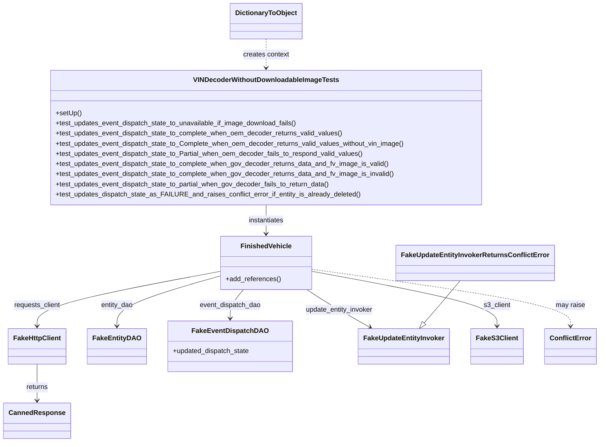
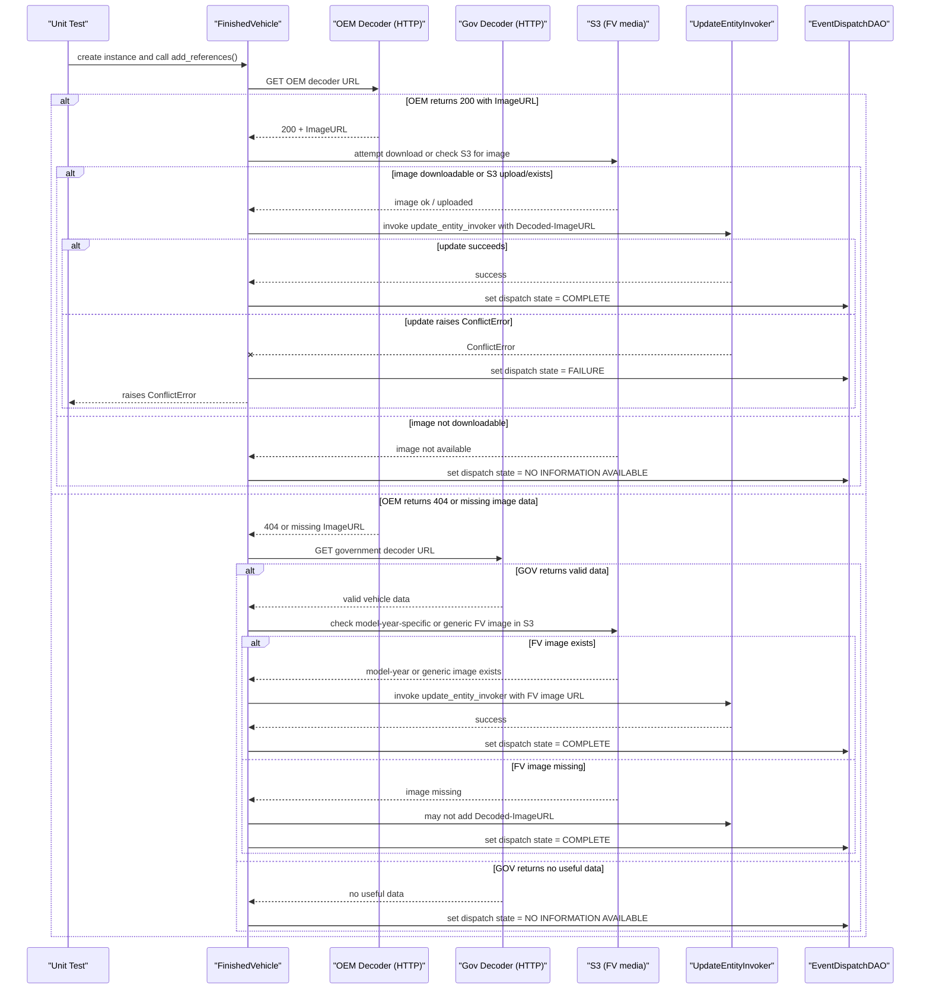

# Diagram: entity_core/entity_service/entity_service_tests/add_finished_vehicle_references_tests/test_add_fv_references_with_partial_data.py


> Auto-generated by Obscura crawlers

## Diagram 1



### SVG

<svg id="container" width="1373.9765625" xmlns="http://www.w3.org/2000/svg" class="classDiagram" height="1044" viewBox="0 0 1373.9765625 1044" role="graphics-document document" aria-roledescription="class"><style>#container{font-family:"trebuchet ms",verdana,arial,sans-serif;font-size:16px;fill:#333;}@keyframes edge-animation-frame{from{stroke-dashoffset:0;}}@keyframes dash{to{stroke-dashoffset:0;}}#container .edge-animation-slow{stroke-dasharray:9,5!important;stroke-dashoffset:900;animation:dash 50s linear infinite;stroke-linecap:round;}#container .edge-animation-fast{stroke-dasharray:9,5!important;stroke-dashoffset:900;animation:dash 20s linear infinite;stroke-linecap:round;}#container .error-icon{fill:#552222;}#container .error-text{fill:#552222;stroke:#552222;}#container .edge-thickness-normal{stroke-width:1px;}#container .edge-thickness-thick{stroke-width:3.5px;}#container .edge-pattern-solid{stroke-dasharray:0;}#container .edge-thickness-invisible{stroke-width:0;fill:none;}#container .edge-pattern-dashed{stroke-dasharray:3;}#container .edge-pattern-dotted{stroke-dasharray:2;}#container .marker{fill:#333333;stroke:#333333;}#container .marker.cross{stroke:#333333;}#container svg{font-family:"trebuchet ms",verdana,arial,sans-serif;font-size:16px;}#container p{margin:0;}#container g.classGroup text{fill:#9370DB;stroke:none;font-family:"trebuchet ms",verdana,arial,sans-serif;font-size:10px;}#container g.classGroup text .title{font-weight:bolder;}#container .nodeLabel,#container .edgeLabel{color:#131300;}#container .edgeLabel .label rect{fill:#ECECFF;}#container .label text{fill:#131300;}#container .labelBkg{background:#ECECFF;}#container .edgeLabel .label span{background:#ECECFF;}#container .classTitle{font-weight:bolder;}#container .node rect,#container .node circle,#container .node ellipse,#container .node polygon,#container .node path{fill:#ECECFF;stroke:#9370DB;stroke-width:1px;}#container .divider{stroke:#9370DB;stroke-width:1;}#container g.clickable{cursor:pointer;}#container g.classGroup rect{fill:#ECECFF;stroke:#9370DB;}#container g.classGroup line{stroke:#9370DB;stroke-width:1;}#container .classLabel .box{stroke:none;stroke-width:0;fill:#ECECFF;opacity:0.5;}#container .classLabel .label{fill:#9370DB;font-size:10px;}#container .relation{stroke:#333333;stroke-width:1;fill:none;}#container .dashed-line{stroke-dasharray:3;}#container .dotted-line{stroke-dasharray:1 2;}#container #compositionStart,#container .composition{fill:#333333!important;stroke:#333333!important;stroke-width:1;}#container #compositionEnd,#container .composition{fill:#333333!important;stroke:#333333!important;stroke-width:1;}#container #dependencyStart,#container .dependency{fill:#333333!important;stroke:#333333!important;stroke-width:1;}#container #dependencyStart,#container .dependency{fill:#333333!important;stroke:#333333!important;stroke-width:1;}#container #extensionStart,#container .extension{fill:transparent!important;stroke:#333333!important;stroke-width:1;}#container #extensionEnd,#container .extension{fill:transparent!important;stroke:#333333!important;stroke-width:1;}#container #aggregationStart,#container .aggregation{fill:transparent!important;stroke:#333333!important;stroke-width:1;}#container #aggregationEnd,#container .aggregation{fill:transparent!important;stroke:#333333!important;stroke-width:1;}#container #lollipopStart,#container .lollipop{fill:#ECECFF!important;stroke:#333333!important;stroke-width:1;}#container #lollipopEnd,#container .lollipop{fill:#ECECFF!important;stroke:#333333!important;stroke-width:1;}#container .edgeTerminals{font-size:11px;line-height:initial;}#container .classTitleText{text-anchor:middle;font-size:18px;fill:#333;}#container .label-icon{display:inline-block;height:1em;overflow:visible;vertical-align:-0.125em;}#container .node .label-icon path{fill:currentColor;stroke:revert;stroke-width:revert;}#container :root{--mermaid-font-family:"trebuchet ms",verdana,arial,sans-serif;}</style><g><defs><marker id="container_class-aggregationStart" class="marker aggregation class" refX="18" refY="7" markerWidth="190" markerHeight="240" orient="auto"><path d="M 18,7 L9,13 L1,7 L9,1 Z"></path></marker></defs><defs><marker id="container_class-aggregationEnd" class="marker aggregation class" refX="1" refY="7" markerWidth="20" markerHeight="28" orient="auto"><path d="M 18,7 L9,13 L1,7 L9,1 Z"></path></marker></defs><defs><marker id="container_class-extensionStart" class="marker extension class" refX="18" refY="7" markerWidth="190" markerHeight="240" orient="auto"><path d="M 1,7 L18,13 V 1 Z"></path></marker></defs><defs><marker id="container_class-extensionEnd" class="marker extension class" refX="1" refY="7" markerWidth="20" markerHeight="28" orient="auto"><path d="M 1,1 V 13 L18,7 Z"></path></marker></defs><defs><marker id="container_class-compositionStart" class="marker composition class" refX="18" refY="7" markerWidth="190" markerHeight="240" orient="auto"><path d="M 18,7 L9,13 L1,7 L9,1 Z"></path></marker></defs><defs><marker id="container_class-compositionEnd" class="marker composition class" refX="1" refY="7" markerWidth="20" markerHeight="28" orient="auto"><path d="M 18,7 L9,13 L1,7 L9,1 Z"></path></marker></defs><defs><marker id="container_class-dependencyStart" class="marker dependency class" refX="6" refY="7" markerWidth="190" markerHeight="240" orient="auto"><path d="M 5,7 L9,13 L1,7 L9,1 Z"></path></marker></defs><defs><marker id="container_class-dependencyEnd" class="marker dependency class" refX="13" refY="7" markerWidth="20" markerHeight="28" orient="auto"><path d="M 18,7 L9,13 L14,7 L9,1 Z"></path></marker></defs><defs><marker id="container_class-lollipopStart" class="marker lollipop class" refX="13" refY="7" markerWidth="190" markerHeight="240" orient="auto"><circle stroke="black" fill="transparent" cx="7" cy="7" r="6"></circle></marker></defs><defs><marker id="container_class-lollipopEnd" class="marker lollipop class" refX="1" refY="7" markerWidth="190" markerHeight="240" orient="auto"><circle stroke="black" fill="transparent" cx="7" cy="7" r="6"></circle></marker></defs><g class="root"><g class="clusters"></g><g class="edgePaths"><path d="M611.969,484L611.969,490.167C611.969,496.333,611.969,508.667,611.969,520C611.969,531.333,611.969,541.667,611.969,546.833L611.969,552" id="id_VINDecoderWithoutDownloadableImageTests_FinishedVehicle_1" class="edge-thickness-normal edge-pattern-solid relation" style=";;;" data-edge="true" data-et="edge" data-id="id_VINDecoderWithoutDownloadableImageTests_FinishedVehicle_1" data-points="W3sieCI6NjExLjk2ODc1LCJ5Ijo0ODR9LHsieCI6NjExLjk2ODc1LCJ5Ijo1MjF9LHsieCI6NjExLjk2ODc1LCJ5Ijo1NTh9XQ==" marker-end="url(#container_class-dependencyEnd)"></path><path d="M506.645,640.904L436.003,654.253C365.362,667.602,224.079,694.301,153.438,715.817C82.797,737.333,82.797,753.667,82.797,761.833L82.797,770" id="id_FinishedVehicle_FakeHttpClient_2" class="edge-thickness-normal edge-pattern-solid relation" style=";;;" data-edge="true" data-et="edge" data-id="id_FinishedVehicle_FakeHttpClient_2" data-points="W3sieCI6NTA2LjY0NDUzMTI1LCJ5Ijo2NDAuOTAzNTkzNDY4NTY4M30seyJ4Ijo4Mi43OTY4NzUsInkiOjcyMX0seyJ4Ijo4Mi43OTY4NzUsInkiOjc3Nn1d" marker-end="url(#container_class-dependencyEnd)"></path><path d="M506.645,651.268L466.202,662.89C425.76,674.512,344.876,697.756,304.434,717.545C263.992,737.333,263.992,753.667,263.992,761.833L263.992,770" id="id_FinishedVehicle_FakeEntityDAO_3" class="edge-thickness-normal edge-pattern-solid relation" style=";;;" data-edge="true" data-et="edge" data-id="id_FinishedVehicle_FakeEntityDAO_3" data-points="W3sieCI6NTA2LjY0NDUzMTI1LCJ5Ijo2NTEuMjY3NjE4NTk4NTk0Nn0seyJ4IjoyNjMuOTkyMTg3NSwieSI6NzIxfSx7IngiOjI2My45OTIxODc1LCJ5Ijo3NzZ9XQ==" marker-end="url(#container_class-dependencyEnd)"></path><path d="M557.028,684L551.651,690.167C546.273,696.333,535.517,708.667,530.139,720C524.762,731.333,524.762,741.667,524.762,746.833L524.762,752" id="id_FinishedVehicle_FakeEventDispatchDAO_4" class="edge-thickness-normal edge-pattern-solid relation" style=";;;" data-edge="true" data-et="edge" data-id="id_FinishedVehicle_FakeEventDispatchDAO_4" data-points="W3sieCI6NTU3LjAyODMyMDMxMjUsInkiOjY4NH0seyJ4Ijo1MjQuNzYxNzE4NzUsInkiOjcyMX0seyJ4Ijo1MjQuNzYxNzE4NzUsInkiOjc1OH1d" marker-end="url(#container_class-dependencyEnd)"></path><path d="M706.33,684L715.566,690.167C724.802,696.333,743.275,708.667,767.426,723.498C791.577,738.329,821.405,755.657,836.32,764.322L851.234,772.986" id="id_FinishedVehicle_FakeUpdateEntityInvoker_5" class="edge-thickness-normal edge-pattern-solid relation" style=";;;" data-edge="true" data-et="edge" data-id="id_FinishedVehicle_FakeUpdateEntityInvoker_5" data-points="W3sieCI6NzA2LjMyOTcwNzAzMTI1LCJ5Ijo2ODR9LHsieCI6NzYxLjc0ODA0Njg3NSwieSI6NzIxfSx7IngiOjg1Ni40MjIxNTY4OTQzMjk5LCJ5Ijo3NzZ9XQ==" marker-end="url(#container_class-dependencyEnd)"></path><path d="M717.293,640.903L787.937,654.253C858.581,667.602,999.868,694.301,1070.512,715.817C1141.156,737.333,1141.156,753.667,1141.156,761.833L1141.156,770" id="id_FinishedVehicle_FakeS3Client_6" class="edge-thickness-normal edge-pattern-solid relation" style=";;;" data-edge="true" data-et="edge" data-id="id_FinishedVehicle_FakeS3Client_6" data-points="W3sieCI6NzE3LjI5Mjk2ODc1LCJ5Ijo2NDAuOTAzMDA1Nzg3MTczN30seyJ4IjoxMTQxLjE1NjI1LCJ5Ijo3MjF9LHsieCI6MTE0MS4xNTYyNSwieSI6Nzc2fV0=" marker-end="url(#container_class-dependencyEnd)"></path><path d="M82.797,860L82.797,869.167C82.797,878.333,82.797,896.667,82.797,911C82.797,925.333,82.797,935.667,82.797,940.833L82.797,946" id="id_FakeHttpClient_CannedResponse_7" class="edge-thickness-normal edge-pattern-solid relation" style=";;;" data-edge="true" data-et="edge" data-id="id_FakeHttpClient_CannedResponse_7" data-points="W3sieCI6ODIuNzk2ODc1LCJ5Ijo4NjB9LHsieCI6ODIuNzk2ODc1LCJ5Ijo5MTV9LHsieCI6ODIuNzk2ODc1LCJ5Ijo5NTJ9XQ==" marker-end="url(#container_class-dependencyEnd)"></path><path d="M1055.52,663L1047.762,672.667C1040.004,682.333,1024.488,701.667,1010.979,718.285C997.47,734.903,985.967,748.806,980.216,755.758L974.464,762.709" id="id_FakeUpdateEntityInvokerReturnsConflictError_FakeUpdateEntityInvoker_8" class="edge-thickness-normal edge-pattern-solid relation" style=";;;" data-edge="true" data-et="edge" data-id="id_FakeUpdateEntityInvokerReturnsConflictError_FakeUpdateEntityInvoker_8" data-points="W3sieCI6MTA1NS41MTk5MjE4NzUsInkiOjY2M30seyJ4IjoxMDA4Ljk3MjY1NjI1LCJ5Ijo3MjF9LHsieCI6OTYzLjQ2Nzg2NDA0NjM5MTcsInkiOjc3Nn1d" marker-end="url(#container_class-extensionEnd)"></path><path d="M717.293,636.136L815.717,650.28C914.141,664.424,1110.988,692.712,1209.412,715.023C1307.836,737.333,1307.836,753.667,1307.836,761.833L1307.836,770" id="id_FinishedVehicle_ConflictError_9" class="edge-thickness-normal edge-pattern-dashed relation" style=";;;" data-edge="true" data-et="edge" data-id="id_FinishedVehicle_ConflictError_9" data-points="W3sieCI6NzE3LjI5Mjk2ODc1LCJ5Ijo2MzYuMTM1Njc4Mjc5MTI1Nn0seyJ4IjoxMzA3LjgzNTkzNzUsInkiOjcyMX0seyJ4IjoxMzA3LjgzNTkzNzUsInkiOjc3Nn1d" marker-end="url(#container_class-dependencyEnd)"></path><path d="M611.969,92L611.969,98.167C611.969,104.333,611.969,116.667,611.969,128C611.969,139.333,611.969,149.667,611.969,154.833L611.969,160" id="id_DictionaryToObject_VINDecoderWithoutDownloadableImageTests_10" class="edge-thickness-normal edge-pattern-dashed relation" style=";;;" data-edge="true" data-et="edge" data-id="id_DictionaryToObject_VINDecoderWithoutDownloadableImageTests_10" data-points="W3sieCI6NjExLjk2ODc1LCJ5Ijo5Mn0seyJ4Ijo2MTEuOTY4NzUsInkiOjEyOX0seyJ4Ijo2MTEuOTY4NzUsInkiOjE2Nn1d" marker-end="url(#container_class-dependencyEnd)"></path></g><g class="edgeLabels"><g class="edgeLabel" transform="translate(611.96875, 521)"><g class="label" data-id="id_VINDecoderWithoutDownloadableImageTests_FinishedVehicle_1" transform="translate(-42.9140625, -12)"><foreignObject width="85.828125" height="24"><div xmlns="http://www.w3.org/1999/xhtml" class="labelBkg" style="display: table-cell; white-space: nowrap; line-height: 1.5; max-width: 200px; text-align: center;"><span class="edgeLabel"><p>instantiates</p></span></div></foreignObject></g></g><g class="edgeLabel" transform="translate(82.796875, 721)"><g class="label" data-id="id_FinishedVehicle_FakeHttpClient_2" transform="translate(-55.5703125, -12)"><foreignObject width="111.140625" height="24"><div xmlns="http://www.w3.org/1999/xhtml" class="labelBkg" style="display: table-cell; white-space: nowrap; line-height: 1.5; max-width: 200px; text-align: center;"><span class="edgeLabel"><p>requests_client</p></span></div></foreignObject></g></g><g class="edgeLabel" transform="translate(263.9921875, 721)"><g class="label" data-id="id_FinishedVehicle_FakeEntityDAO_3" transform="translate(-38.546875, -12)"><foreignObject width="77.09375" height="24"><div xmlns="http://www.w3.org/1999/xhtml" class="labelBkg" style="display: table-cell; white-space: nowrap; line-height: 1.5; max-width: 200px; text-align: center;"><span class="edgeLabel"><p>entity_dao</p></span></div></foreignObject></g></g><g class="edgeLabel" transform="translate(524.76171875, 721)"><g class="label" data-id="id_FinishedVehicle_FakeEventDispatchDAO_4" transform="translate(-73.0625, -12)"><foreignObject width="146.125" height="24"><div xmlns="http://www.w3.org/1999/xhtml" class="labelBkg" style="display: table-cell; white-space: nowrap; line-height: 1.5; max-width: 200px; text-align: center;"><span class="edgeLabel"><p>event_dispatch_dao</p></span></div></foreignObject></g></g><g class="edgeLabel" transform="translate(780.27629, 731.7638)"><g class="label" data-id="id_FinishedVehicle_FakeUpdateEntityInvoker_5" transform="translate(-81.3515625, -12)"><foreignObject width="162.703125" height="24"><div xmlns="http://www.w3.org/1999/xhtml" class="labelBkg" style="display: table-cell; white-space: nowrap; line-height: 1.5; max-width: 200px; text-align: center;"><span class="edgeLabel"><p>update_entity_invoker</p></span></div></foreignObject></g></g><g class="edgeLabel" transform="translate(1141.15625, 721)"><g class="label" data-id="id_FinishedVehicle_FakeS3Client_6" transform="translate(-31.9296875, -12)"><foreignObject width="63.859375" height="24"><div xmlns="http://www.w3.org/1999/xhtml" class="labelBkg" style="display: table-cell; white-space: nowrap; line-height: 1.5; max-width: 200px; text-align: center;"><span class="edgeLabel"><p>s3_client</p></span></div></foreignObject></g></g><g class="edgeLabel" transform="translate(82.796875, 915)"><g class="label" data-id="id_FakeHttpClient_CannedResponse_7" transform="translate(-26.265625, -12)"><foreignObject width="52.53125" height="24"><div xmlns="http://www.w3.org/1999/xhtml" class="labelBkg" style="display: table-cell; white-space: nowrap; line-height: 1.5; max-width: 200px; text-align: center;"><span class="edgeLabel"><p>returns</p></span></div></foreignObject></g></g><g class="edgeLabel"><g class="label" data-id="id_FakeUpdateEntityInvokerReturnsConflictError_FakeUpdateEntityInvoker_8" transform="translate(0, 0)"><foreignObject width="0" height="0"><div xmlns="http://www.w3.org/1999/xhtml" class="labelBkg" style="display: table-cell; white-space: nowrap; line-height: 1.5; max-width: 200px; text-align: center;"><span class="edgeLabel"></span></div></foreignObject></g></g><g class="edgeLabel" transform="translate(1307.8359375, 721)"><g class="label" data-id="id_FinishedVehicle_ConflictError_9" transform="translate(-34.65625, -12)"><foreignObject width="69.3125" height="24"><div xmlns="http://www.w3.org/1999/xhtml" class="labelBkg" style="display: table-cell; white-space: nowrap; line-height: 1.5; max-width: 200px; text-align: center;"><span class="edgeLabel"><p>may raise</p></span></div></foreignObject></g></g><g class="edgeLabel" transform="translate(611.96875, 129)"><g class="label" data-id="id_DictionaryToObject_VINDecoderWithoutDownloadableImageTests_10" transform="translate(-55.140625, -12)"><foreignObject width="110.28125" height="24"><div xmlns="http://www.w3.org/1999/xhtml" class="labelBkg" style="display: table-cell; white-space: nowrap; line-height: 1.5; max-width: 200px; text-align: center;"><span class="edgeLabel"><p>creates context</p></span></div></foreignObject></g></g></g><g class="nodes"><g class="node default" id="classId-VINDecoderWithoutDownloadableImageTests-0" transform="translate(611.96875, 325)"><g class="basic label-container"><path d="M-509.0078125 -159 L509.0078125 -159 L509.0078125 159 L-509.0078125 159" stroke="none" stroke-width="0" fill="#ECECFF" style=""></path><path d="M-509.0078125 -159 C-112.9791186060533 -159, 283.0495752878934 -159, 509.0078125 -159 M-509.0078125 -159 C-268.8801586936886 -159, -28.752504887377142 -159, 509.0078125 -159 M509.0078125 -159 C509.0078125 -46.4673498567702, 509.0078125 66.0653002864596, 509.0078125 159 M509.0078125 -159 C509.0078125 -65.04320871621316, 509.0078125 28.913582567573684, 509.0078125 159 M509.0078125 159 C167.61411933031854 159, -173.7795738393629 159, -509.0078125 159 M509.0078125 159 C264.3816883644855 159, 19.755564228970968 159, -509.0078125 159 M-509.0078125 159 C-509.0078125 51.183227153969014, -509.0078125 -56.63354569206197, -509.0078125 -159 M-509.0078125 159 C-509.0078125 48.21626505455406, -509.0078125 -62.567469890891886, -509.0078125 -159" stroke="#9370DB" stroke-width="1.3" fill="none" stroke-dasharray="0 0" style=""></path></g><g class="annotation-group text" transform="translate(0, -135)"></g><g class="label-group text" transform="translate(-165.359375, -135)"><g class="label" style="font-weight: bolder" transform="translate(0,-12)"><foreignObject width="330.71875" height="24"><div xmlns="http://www.w3.org/1999/xhtml" style="display: table-cell; white-space: nowrap; line-height: 1.5; max-width: 377px; text-align: center;"><span class="nodeLabel markdown-node-label" style=""><p>VINDecoderWithoutDownloadableImageTests</p></span></div></foreignObject></g></g><g class="members-group text" transform="translate(-497.0078125, -87)"></g><g class="methods-group text" transform="translate(-497.0078125, -57)"><g class="label" style="" transform="translate(0,-12)"><foreignObject width="60.421875" height="24"><div xmlns="http://www.w3.org/1999/xhtml" style="display: table-cell; white-space: nowrap; line-height: 1.5; max-width: 118px; text-align: center;"><span class="nodeLabel markdown-node-label" style=""><p>+setUp()</p></span></div></foreignObject></g><g class="label" style="" transform="translate(0,12)"><foreignObject width="576.71875" height="24"><div xmlns="http://www.w3.org/1999/xhtml" style="display: table-cell; white-space: nowrap; line-height: 1.5; max-width: 634px; text-align: center;"><span class="nodeLabel markdown-node-label" style=""><p>+test_updates_event_dispatch_state_to_unavailable_if_image_download_fails()</p></span></div></foreignObject></g><g class="label" style="" transform="translate(0,36)"><foreignObject width="682.9375" height="24"><div xmlns="http://www.w3.org/1999/xhtml" style="display: table-cell; white-space: nowrap; line-height: 1.5; max-width: 740px; text-align: center;"><span class="nodeLabel markdown-node-label" style=""><p>+test_updates_event_dispatch_state_to_complete_when_oem_decoder_returns_valid_values()</p></span></div></foreignObject></g><g class="label" style="" transform="translate(0,60)"><foreignObject width="828.65625" height="24"><div xmlns="http://www.w3.org/1999/xhtml" style="display: table-cell; white-space: nowrap; line-height: 1.5; max-width: 886px; text-align: center;"><span class="nodeLabel markdown-node-label" style=""><p>+test_updates_event_dispatch_state_to_Complete_when_oem_decoder_returns_valid_values_without_vin_image()</p></span></div></foreignObject></g><g class="label" style="" transform="translate(0,84)"><foreignObject width="731.015625" height="24"><div xmlns="http://www.w3.org/1999/xhtml" style="display: table-cell; white-space: nowrap; line-height: 1.5; max-width: 788px; text-align: center;"><span class="nodeLabel markdown-node-label" style=""><p>+test_updates_event_dispatch_state_to_Partial_when_oem_decoder_fails_to_respond_valid_values()</p></span></div></foreignObject></g><g class="label" style="" transform="translate(0,108)"><foreignObject width="790.75" height="24"><div xmlns="http://www.w3.org/1999/xhtml" style="display: table-cell; white-space: nowrap; line-height: 1.5; max-width: 848px; text-align: center;"><span class="nodeLabel markdown-node-label" style=""><p>+test_updates_event_dispatch_state_to_complete_when_gov_decoder_returns_data_and_fv_image_is_valid()</p></span></div></foreignObject></g><g class="label" style="" transform="translate(0,132)"><foreignObject width="805" height="24"><div xmlns="http://www.w3.org/1999/xhtml" style="display: table-cell; white-space: nowrap; line-height: 1.5; max-width: 862px; text-align: center;"><span class="nodeLabel markdown-node-label" style=""><p>+test_updates_event_dispatch_state_to_complete_when_gov_decoder_returns_data_and_fv_image_is_invalid()</p></span></div></foreignObject></g><g class="label" style="" transform="translate(0,156)"><foreignObject width="654.421875" height="24"><div xmlns="http://www.w3.org/1999/xhtml" style="display: table-cell; white-space: nowrap; line-height: 1.5; max-width: 712px; text-align: center;"><span class="nodeLabel markdown-node-label" style=""><p>+test_updates_event_dispatch_state_to_partial_when_gov_decoder_fails_to_return_data()</p></span></div></foreignObject></g><g class="label" style="" transform="translate(0,180)"><foreignObject width="718.09375" height="24"><div xmlns="http://www.w3.org/1999/xhtml" style="display: table-cell; white-space: nowrap; line-height: 1.5; max-width: 775px; text-align: center;"><span class="nodeLabel markdown-node-label" style=""><p>+test_updates_dispatch_state_as_FAILURE_and_raises_conflict_error_if_entity_is_already_deleted()</p></span></div></foreignObject></g></g><g class="divider" style=""><path d="M-509.0078125 -111 C-301.8391524461089 -111, -94.67049239221785 -111, 509.0078125 -111 M-509.0078125 -111 C-172.51154775863193 -111, 163.98471698273613 -111, 509.0078125 -111" stroke="#9370DB" stroke-width="1.3" fill="none" stroke-dasharray="0 0" style=""></path></g><g class="divider" style=""><path d="M-509.0078125 -87 C-202.0489719522604 -87, 104.90986859547922 -87, 509.0078125 -87 M-509.0078125 -87 C-249.70733617416482 -87, 9.593140151670354 -87, 509.0078125 -87" stroke="#9370DB" stroke-width="1.3" fill="none" stroke-dasharray="0 0" style=""></path></g></g><g class="node default" id="classId-FinishedVehicle-1" transform="translate(611.96875, 621)"><g class="basic label-container"><path d="M-105.32421875 -63 L105.32421875 -63 L105.32421875 63 L-105.32421875 63" stroke="none" stroke-width="0" fill="#ECECFF" style=""></path><path d="M-105.32421875 -63 C-31.125455025677766 -63, 43.07330869864447 -63, 105.32421875 -63 M-105.32421875 -63 C-53.80122488640045 -63, -2.2782310228008953 -63, 105.32421875 -63 M105.32421875 -63 C105.32421875 -21.818960115615404, 105.32421875 19.362079768769192, 105.32421875 63 M105.32421875 -63 C105.32421875 -21.687632658088944, 105.32421875 19.624734683822112, 105.32421875 63 M105.32421875 63 C31.620822468836323 63, -42.082573812327354 63, -105.32421875 63 M105.32421875 63 C52.56891981627243 63, -0.18637911745514657 63, -105.32421875 63 M-105.32421875 63 C-105.32421875 20.995842958790362, -105.32421875 -21.008314082419275, -105.32421875 -63 M-105.32421875 63 C-105.32421875 34.815277676126186, -105.32421875 6.630555352252365, -105.32421875 -63" stroke="#9370DB" stroke-width="1.3" fill="none" stroke-dasharray="0 0" style=""></path></g><g class="annotation-group text" transform="translate(0, -39)"></g><g class="label-group text" transform="translate(-56.7265625, -39)"><g class="label" style="font-weight: bolder" transform="translate(0,-12)"><foreignObject width="113.453125" height="24"><div xmlns="http://www.w3.org/1999/xhtml" style="display: table-cell; white-space: nowrap; line-height: 1.5; max-width: 163px; text-align: center;"><span class="nodeLabel markdown-node-label" style=""><p>FinishedVehicle</p></span></div></foreignObject></g></g><g class="members-group text" transform="translate(-93.32421875, 9)"></g><g class="methods-group text" transform="translate(-93.32421875, 39)"><g class="label" style="" transform="translate(0,-12)"><foreignObject width="129.921875" height="24"><div xmlns="http://www.w3.org/1999/xhtml" style="display: table-cell; white-space: nowrap; line-height: 1.5; max-width: 187px; text-align: center;"><span class="nodeLabel markdown-node-label" style=""><p>+add_references()</p></span></div></foreignObject></g></g><g class="divider" style=""><path d="M-105.32421875 -15 C-34.378756624209416 -15, 36.56670550158117 -15, 105.32421875 -15 M-105.32421875 -15 C-22.363412254886683 -15, 60.597394240226635 -15, 105.32421875 -15" stroke="#9370DB" stroke-width="1.3" fill="none" stroke-dasharray="0 0" style=""></path></g><g class="divider" style=""><path d="M-105.32421875 9 C-49.961420257676835 9, 5.40137823464633 9, 105.32421875 9 M-105.32421875 9 C-29.734721848210256 9, 45.85477505357949 9, 105.32421875 9" stroke="#9370DB" stroke-width="1.3" fill="none" stroke-dasharray="0 0" style=""></path></g></g><g class="node default" id="classId-FakeHttpClient-2" transform="translate(82.796875, 818)"><g class="basic label-container"><path d="M-66.0859375 -42 L66.0859375 -42 L66.0859375 42 L-66.0859375 42" stroke="none" stroke-width="0" fill="#ECECFF" style=""></path><path d="M-66.0859375 -42 C-15.464451430588724 -42, 35.15703463882255 -42, 66.0859375 -42 M-66.0859375 -42 C-18.629403854805204 -42, 28.82712979038959 -42, 66.0859375 -42 M66.0859375 -42 C66.0859375 -18.899939642461742, 66.0859375 4.200120715076515, 66.0859375 42 M66.0859375 -42 C66.0859375 -22.92312917955724, 66.0859375 -3.846258359114479, 66.0859375 42 M66.0859375 42 C36.96600091880039 42, 7.846064337600772 42, -66.0859375 42 M66.0859375 42 C27.93780317143191 42, -10.210331157136181 42, -66.0859375 42 M-66.0859375 42 C-66.0859375 13.485461464600814, -66.0859375 -15.029077070798373, -66.0859375 -42 M-66.0859375 42 C-66.0859375 15.586408454517905, -66.0859375 -10.82718309096419, -66.0859375 -42" stroke="#9370DB" stroke-width="1.3" fill="none" stroke-dasharray="0 0" style=""></path></g><g class="annotation-group text" transform="translate(0, -18)"></g><g class="label-group text" transform="translate(-54.0859375, -18)"><g class="label" style="font-weight: bolder" transform="translate(0,-12)"><foreignObject width="108.171875" height="24"><div xmlns="http://www.w3.org/1999/xhtml" style="display: table-cell; white-space: nowrap; line-height: 1.5; max-width: 156px; text-align: center;"><span class="nodeLabel markdown-node-label" style=""><p>FakeHttpClient</p></span></div></foreignObject></g></g><g class="members-group text" transform="translate(-54.0859375, 30)"></g><g class="methods-group text" transform="translate(-54.0859375, 60)"></g><g class="divider" style=""><path d="M-66.0859375 6 C-35.56429335465731 6, -5.042649209314611 6, 66.0859375 6 M-66.0859375 6 C-28.135004772387482 6, 9.815927955225035 6, 66.0859375 6" stroke="#9370DB" stroke-width="1.3" fill="none" stroke-dasharray="0 0" style=""></path></g><g class="divider" style=""><path d="M-66.0859375 24 C-36.57328021961577 24, -7.060622939231543 24, 66.0859375 24 M-66.0859375 24 C-29.804061959008322 24, 6.477813581983355 24, 66.0859375 24" stroke="#9370DB" stroke-width="1.3" fill="none" stroke-dasharray="0 0" style=""></path></g></g><g class="node default" id="classId-CannedResponse-3" transform="translate(82.796875, 994)"><g class="basic label-container"><path d="M-74.796875 -42 L74.796875 -42 L74.796875 42 L-74.796875 42" stroke="none" stroke-width="0" fill="#ECECFF" style=""></path><path d="M-74.796875 -42 C-37.82403980947096 -42, -0.8512046189419209 -42, 74.796875 -42 M-74.796875 -42 C-24.56666617091299 -42, 25.663542658174023 -42, 74.796875 -42 M74.796875 -42 C74.796875 -10.570732078302285, 74.796875 20.85853584339543, 74.796875 42 M74.796875 -42 C74.796875 -19.66786387224117, 74.796875 2.664272255517659, 74.796875 42 M74.796875 42 C33.48853533137089 42, -7.819804337258219 42, -74.796875 42 M74.796875 42 C32.20658511880473 42, -10.383704762390536 42, -74.796875 42 M-74.796875 42 C-74.796875 9.486757894884711, -74.796875 -23.026484210230578, -74.796875 -42 M-74.796875 42 C-74.796875 12.77077923754145, -74.796875 -16.4584415249171, -74.796875 -42" stroke="#9370DB" stroke-width="1.3" fill="none" stroke-dasharray="0 0" style=""></path></g><g class="annotation-group text" transform="translate(0, -18)"></g><g class="label-group text" transform="translate(-62.796875, -18)"><g class="label" style="font-weight: bolder" transform="translate(0,-12)"><foreignObject width="125.59375" height="24"><div xmlns="http://www.w3.org/1999/xhtml" style="display: table-cell; white-space: nowrap; line-height: 1.5; max-width: 175px; text-align: center;"><span class="nodeLabel markdown-node-label" style=""><p>CannedResponse</p></span></div></foreignObject></g></g><g class="members-group text" transform="translate(-62.796875, 30)"></g><g class="methods-group text" transform="translate(-62.796875, 60)"></g><g class="divider" style=""><path d="M-74.796875 6 C-15.222335804986045 6, 44.35220339002791 6, 74.796875 6 M-74.796875 6 C-23.963732409753483 6, 26.869410180493034 6, 74.796875 6" stroke="#9370DB" stroke-width="1.3" fill="none" stroke-dasharray="0 0" style=""></path></g><g class="divider" style=""><path d="M-74.796875 24 C-43.984206813228525 24, -13.171538626457057 24, 74.796875 24 M-74.796875 24 C-44.48283424601128 24, -14.168793492022566 24, 74.796875 24" stroke="#9370DB" stroke-width="1.3" fill="none" stroke-dasharray="0 0" style=""></path></g></g><g class="node default" id="classId-FakeEntityDAO-4" transform="translate(263.9921875, 818)"><g class="basic label-container"><path d="M-65.109375 -42 L65.109375 -42 L65.109375 42 L-65.109375 42" stroke="none" stroke-width="0" fill="#ECECFF" style=""></path><path d="M-65.109375 -42 C-32.448802605578116 -42, 0.21176978884376751 -42, 65.109375 -42 M-65.109375 -42 C-34.71314382793764 -42, -4.316912655875285 -42, 65.109375 -42 M65.109375 -42 C65.109375 -24.133784870175138, 65.109375 -6.267569740350275, 65.109375 42 M65.109375 -42 C65.109375 -12.939308798367808, 65.109375 16.121382403264384, 65.109375 42 M65.109375 42 C31.94222285246134 42, -1.2249292950773167 42, -65.109375 42 M65.109375 42 C31.365807479982898 42, -2.377760040034204 42, -65.109375 42 M-65.109375 42 C-65.109375 21.697975891713135, -65.109375 1.3959517834262698, -65.109375 -42 M-65.109375 42 C-65.109375 21.427905693724014, -65.109375 0.8558113874480284, -65.109375 -42" stroke="#9370DB" stroke-width="1.3" fill="none" stroke-dasharray="0 0" style=""></path></g><g class="annotation-group text" transform="translate(0, -18)"></g><g class="label-group text" transform="translate(-53.109375, -18)"><g class="label" style="font-weight: bolder" transform="translate(0,-12)"><foreignObject width="106.21875" height="24"><div xmlns="http://www.w3.org/1999/xhtml" style="display: table-cell; white-space: nowrap; line-height: 1.5; max-width: 154px; text-align: center;"><span class="nodeLabel markdown-node-label" style=""><p>FakeEntityDAO</p></span></div></foreignObject></g></g><g class="members-group text" transform="translate(-53.109375, 30)"></g><g class="methods-group text" transform="translate(-53.109375, 60)"></g><g class="divider" style=""><path d="M-65.109375 6 C-29.44552144323844 6, 6.218332113523118 6, 65.109375 6 M-65.109375 6 C-25.03001915453597 6, 15.049336690928058 6, 65.109375 6" stroke="#9370DB" stroke-width="1.3" fill="none" stroke-dasharray="0 0" style=""></path></g><g class="divider" style=""><path d="M-65.109375 24 C-34.452597600484694 24, -3.795820200969395 24, 65.109375 24 M-65.109375 24 C-18.993264170191473 24, 27.122846659617053 24, 65.109375 24" stroke="#9370DB" stroke-width="1.3" fill="none" stroke-dasharray="0 0" style=""></path></g></g><g class="node default" id="classId-FakeEventDispatchDAO-5" transform="translate(524.76171875, 818)"><g class="basic label-container"><path d="M-145.66015625 -60 L145.66015625 -60 L145.66015625 60 L-145.66015625 60" stroke="none" stroke-width="0" fill="#ECECFF" style=""></path><path d="M-145.66015625 -60 C-31.725238248950504 -60, 82.20967975209899 -60, 145.66015625 -60 M-145.66015625 -60 C-70.94741844153836 -60, 3.765319366923279 -60, 145.66015625 -60 M145.66015625 -60 C145.66015625 -24.478741636822825, 145.66015625 11.04251672635435, 145.66015625 60 M145.66015625 -60 C145.66015625 -29.054066286653903, 145.66015625 1.891867426692194, 145.66015625 60 M145.66015625 60 C61.11282418196822 60, -23.434507886063557 60, -145.66015625 60 M145.66015625 60 C38.645948396634054 60, -68.36825945673189 60, -145.66015625 60 M-145.66015625 60 C-145.66015625 17.293950183683805, -145.66015625 -25.41209963263239, -145.66015625 -60 M-145.66015625 60 C-145.66015625 21.183036434466707, -145.66015625 -17.633927131066585, -145.66015625 -60" stroke="#9370DB" stroke-width="1.3" fill="none" stroke-dasharray="0 0" style=""></path></g><g class="annotation-group text" transform="translate(0, -36)"></g><g class="label-group text" transform="translate(-83.8359375, -36)"><g class="label" style="font-weight: bolder" transform="translate(0,-12)"><foreignObject width="167.671875" height="24"><div xmlns="http://www.w3.org/1999/xhtml" style="display: table-cell; white-space: nowrap; line-height: 1.5; max-width: 215px; text-align: center;"><span class="nodeLabel markdown-node-label" style=""><p>FakeEventDispatchDAO</p></span></div></foreignObject></g></g><g class="members-group text" transform="translate(-133.66015625, 12)"><g class="label" style="" transform="translate(0,-12)"><foreignObject width="183.484375" height="24"><div xmlns="http://www.w3.org/1999/xhtml" style="display: table-cell; white-space: nowrap; line-height: 1.5; max-width: 241px; text-align: center;"><span class="nodeLabel markdown-node-label" style=""><p>+updated_dispatch_state</p></span></div></foreignObject></g></g><g class="methods-group text" transform="translate(-133.66015625, 60)"></g><g class="divider" style=""><path d="M-145.66015625 -12 C-86.22337023471266 -12, -26.786584219425322 -12, 145.66015625 -12 M-145.66015625 -12 C-84.88281034146388 -12, -24.105464432927747 -12, 145.66015625 -12" stroke="#9370DB" stroke-width="1.3" fill="none" stroke-dasharray="0 0" style=""></path></g><g class="divider" style=""><path d="M-145.66015625 36 C-75.31128060445558 36, -4.962404958911151 36, 145.66015625 36 M-145.66015625 36 C-66.12693323574295 36, 13.406289778514093 36, 145.66015625 36" stroke="#9370DB" stroke-width="1.3" fill="none" stroke-dasharray="0 0" style=""></path></g></g><g class="node default" id="classId-FakeUpdateEntityInvoker-6" transform="translate(928.71875, 818)"><g class="basic label-container"><path d="M-103.8984375 -42 L103.8984375 -42 L103.8984375 42 L-103.8984375 42" stroke="none" stroke-width="0" fill="#ECECFF" style=""></path><path d="M-103.8984375 -42 C-32.69962864105774 -42, 38.499180217884515 -42, 103.8984375 -42 M-103.8984375 -42 C-25.084906081256662 -42, 53.728625337486676 -42, 103.8984375 -42 M103.8984375 -42 C103.8984375 -9.262112171765324, 103.8984375 23.475775656469352, 103.8984375 42 M103.8984375 -42 C103.8984375 -24.67604829222276, 103.8984375 -7.352096584445519, 103.8984375 42 M103.8984375 42 C23.068083410590944 42, -57.76227067881811 42, -103.8984375 42 M103.8984375 42 C47.24919444091863 42, -9.400048618162742 42, -103.8984375 42 M-103.8984375 42 C-103.8984375 14.023615194409679, -103.8984375 -13.952769611180642, -103.8984375 -42 M-103.8984375 42 C-103.8984375 20.5897762973488, -103.8984375 -0.8204474053024029, -103.8984375 -42" stroke="#9370DB" stroke-width="1.3" fill="none" stroke-dasharray="0 0" style=""></path></g><g class="annotation-group text" transform="translate(0, -18)"></g><g class="label-group text" transform="translate(-91.8984375, -18)"><g class="label" style="font-weight: bolder" transform="translate(0,-12)"><foreignObject width="183.796875" height="24"><div xmlns="http://www.w3.org/1999/xhtml" style="display: table-cell; white-space: nowrap; line-height: 1.5; max-width: 232px; text-align: center;"><span class="nodeLabel markdown-node-label" style=""><p>FakeUpdateEntityInvoker</p></span></div></foreignObject></g></g><g class="members-group text" transform="translate(-91.8984375, 30)"></g><g class="methods-group text" transform="translate(-91.8984375, 60)"></g><g class="divider" style=""><path d="M-103.8984375 6 C-49.925374182683505 6, 4.047689134632989 6, 103.8984375 6 M-103.8984375 6 C-54.37028641687145 6, -4.8421353337429025 6, 103.8984375 6" stroke="#9370DB" stroke-width="1.3" fill="none" stroke-dasharray="0 0" style=""></path></g><g class="divider" style=""><path d="M-103.8984375 24 C-49.2314226363355 24, 5.435592227328996 24, 103.8984375 24 M-103.8984375 24 C-30.032831275843108 24, 43.832774948313784 24, 103.8984375 24" stroke="#9370DB" stroke-width="1.3" fill="none" stroke-dasharray="0 0" style=""></path></g></g><g class="node default" id="classId-FakeUpdateEntityInvokerReturnsConflictError-7" transform="translate(1089.2265625, 621)"><g class="basic label-container"><path d="M-178.6171875 -42 L178.6171875 -42 L178.6171875 42 L-178.6171875 42" stroke="none" stroke-width="0" fill="#ECECFF" style=""></path><path d="M-178.6171875 -42 C-46.02256133689008 -42, 86.57206482621984 -42, 178.6171875 -42 M-178.6171875 -42 C-80.57957772715142 -42, 17.458032045697166 -42, 178.6171875 -42 M178.6171875 -42 C178.6171875 -21.97986265731438, 178.6171875 -1.9597253146287628, 178.6171875 42 M178.6171875 -42 C178.6171875 -24.867062441656653, 178.6171875 -7.7341248833133065, 178.6171875 42 M178.6171875 42 C96.91589129046106 42, 15.214595080922123 42, -178.6171875 42 M178.6171875 42 C89.67464135363431 42, 0.7320952072686282 42, -178.6171875 42 M-178.6171875 42 C-178.6171875 18.086097765137673, -178.6171875 -5.827804469724654, -178.6171875 -42 M-178.6171875 42 C-178.6171875 15.525388185874004, -178.6171875 -10.949223628251993, -178.6171875 -42" stroke="#9370DB" stroke-width="1.3" fill="none" stroke-dasharray="0 0" style=""></path></g><g class="annotation-group text" transform="translate(0, -18)"></g><g class="label-group text" transform="translate(-166.6171875, -18)"><g class="label" style="font-weight: bolder" transform="translate(0,-12)"><foreignObject width="333.234375" height="24"><div xmlns="http://www.w3.org/1999/xhtml" style="display: table-cell; white-space: nowrap; line-height: 1.5; max-width: 378px; text-align: center;"><span class="nodeLabel markdown-node-label" style=""><p>FakeUpdateEntityInvokerReturnsConflictError</p></span></div></foreignObject></g></g><g class="members-group text" transform="translate(-166.6171875, 30)"></g><g class="methods-group text" transform="translate(-166.6171875, 60)"></g><g class="divider" style=""><path d="M-178.6171875 6 C-93.43717039991338 6, -8.257153299826768 6, 178.6171875 6 M-178.6171875 6 C-70.86264971655949 6, 36.89188806688102 6, 178.6171875 6" stroke="#9370DB" stroke-width="1.3" fill="none" stroke-dasharray="0 0" style=""></path></g><g class="divider" style=""><path d="M-178.6171875 24 C-44.67091607309533 24, 89.27535535380935 24, 178.6171875 24 M-178.6171875 24 C-97.58301013017743 24, -16.548832760354856 24, 178.6171875 24" stroke="#9370DB" stroke-width="1.3" fill="none" stroke-dasharray="0 0" style=""></path></g></g><g class="node default" id="classId-FakeS3Client-8" transform="translate(1141.15625, 818)"><g class="basic label-container"><path d="M-58.5390625 -42 L58.5390625 -42 L58.5390625 42 L-58.5390625 42" stroke="none" stroke-width="0" fill="#ECECFF" style=""></path><path d="M-58.5390625 -42 C-13.67099535124143 -42, 31.19707179751714 -42, 58.5390625 -42 M-58.5390625 -42 C-30.101814345966275 -42, -1.6645661919325505 -42, 58.5390625 -42 M58.5390625 -42 C58.5390625 -17.052450195532952, 58.5390625 7.895099608934096, 58.5390625 42 M58.5390625 -42 C58.5390625 -18.333330620978984, 58.5390625 5.333338758042032, 58.5390625 42 M58.5390625 42 C20.86966464591093 42, -16.79973320817814 42, -58.5390625 42 M58.5390625 42 C23.13999205624622 42, -12.259078387507557 42, -58.5390625 42 M-58.5390625 42 C-58.5390625 18.72438825590899, -58.5390625 -4.551223488182018, -58.5390625 -42 M-58.5390625 42 C-58.5390625 18.208680374739707, -58.5390625 -5.582639250520586, -58.5390625 -42" stroke="#9370DB" stroke-width="1.3" fill="none" stroke-dasharray="0 0" style=""></path></g><g class="annotation-group text" transform="translate(0, -18)"></g><g class="label-group text" transform="translate(-46.5390625, -18)"><g class="label" style="font-weight: bolder" transform="translate(0,-12)"><foreignObject width="93.078125" height="24"><div xmlns="http://www.w3.org/1999/xhtml" style="display: table-cell; white-space: nowrap; line-height: 1.5; max-width: 141px; text-align: center;"><span class="nodeLabel markdown-node-label" style=""><p>FakeS3Client</p></span></div></foreignObject></g></g><g class="members-group text" transform="translate(-46.5390625, 30)"></g><g class="methods-group text" transform="translate(-46.5390625, 60)"></g><g class="divider" style=""><path d="M-58.5390625 6 C-22.371541769378183 6, 13.795978961243634 6, 58.5390625 6 M-58.5390625 6 C-34.71554446192617 6, -10.892026423852343 6, 58.5390625 6" stroke="#9370DB" stroke-width="1.3" fill="none" stroke-dasharray="0 0" style=""></path></g><g class="divider" style=""><path d="M-58.5390625 24 C-12.729806042990937 24, 33.079450414018126 24, 58.5390625 24 M-58.5390625 24 C-30.410634082332628 24, -2.2822056646652555 24, 58.5390625 24" stroke="#9370DB" stroke-width="1.3" fill="none" stroke-dasharray="0 0" style=""></path></g></g><g class="node default" id="classId-ConflictError-9" transform="translate(1307.8359375, 818)"><g class="basic label-container"><path d="M-58.140625 -42 L58.140625 -42 L58.140625 42 L-58.140625 42" stroke="none" stroke-width="0" fill="#ECECFF" style=""></path><path d="M-58.140625 -42 C-29.268203464276176 -42, -0.3957819285523527 -42, 58.140625 -42 M-58.140625 -42 C-30.6076932642886 -42, -3.0747615285771985 -42, 58.140625 -42 M58.140625 -42 C58.140625 -15.818902032100073, 58.140625 10.362195935799853, 58.140625 42 M58.140625 -42 C58.140625 -17.12895915807504, 58.140625 7.742081683849918, 58.140625 42 M58.140625 42 C14.617680380819827 42, -28.905264238360346 42, -58.140625 42 M58.140625 42 C32.959566062893856 42, 7.778507125787719 42, -58.140625 42 M-58.140625 42 C-58.140625 14.245691241805108, -58.140625 -13.508617516389783, -58.140625 -42 M-58.140625 42 C-58.140625 16.186876440383966, -58.140625 -9.626247119232069, -58.140625 -42" stroke="#9370DB" stroke-width="1.3" fill="none" stroke-dasharray="0 0" style=""></path></g><g class="annotation-group text" transform="translate(0, -18)"></g><g class="label-group text" transform="translate(-46.140625, -18)"><g class="label" style="font-weight: bolder" transform="translate(0,-12)"><foreignObject width="92.28125" height="24"><div xmlns="http://www.w3.org/1999/xhtml" style="display: table-cell; white-space: nowrap; line-height: 1.5; max-width: 141px; text-align: center;"><span class="nodeLabel markdown-node-label" style=""><p>ConflictError</p></span></div></foreignObject></g></g><g class="members-group text" transform="translate(-46.140625, 30)"></g><g class="methods-group text" transform="translate(-46.140625, 60)"></g><g class="divider" style=""><path d="M-58.140625 6 C-28.12894281015049 6, 1.882739379699018 6, 58.140625 6 M-58.140625 6 C-24.10875663433027 6, 9.92311173133946 6, 58.140625 6" stroke="#9370DB" stroke-width="1.3" fill="none" stroke-dasharray="0 0" style=""></path></g><g class="divider" style=""><path d="M-58.140625 24 C-27.344836342409646 24, 3.4509523151807073 24, 58.140625 24 M-58.140625 24 C-15.662579531741805 24, 26.81546593651639 24, 58.140625 24" stroke="#9370DB" stroke-width="1.3" fill="none" stroke-dasharray="0 0" style=""></path></g></g><g class="node default" id="classId-DictionaryToObject-10" transform="translate(611.96875, 50)"><g class="basic label-container"><path d="M-82.109375 -42 L82.109375 -42 L82.109375 42 L-82.109375 42" stroke="none" stroke-width="0" fill="#ECECFF" style=""></path><path d="M-82.109375 -42 C-32.735406191443616 -42, 16.63856261711277 -42, 82.109375 -42 M-82.109375 -42 C-33.4633652530801 -42, 15.182644493839803 -42, 82.109375 -42 M82.109375 -42 C82.109375 -17.393509309897144, 82.109375 7.2129813802057114, 82.109375 42 M82.109375 -42 C82.109375 -16.706525018612087, 82.109375 8.586949962775826, 82.109375 42 M82.109375 42 C30.043149291999214 42, -22.023076416001572 42, -82.109375 42 M82.109375 42 C45.72548260784344 42, 9.341590215686878 42, -82.109375 42 M-82.109375 42 C-82.109375 12.519044566191013, -82.109375 -16.961910867617974, -82.109375 -42 M-82.109375 42 C-82.109375 19.933905185033016, -82.109375 -2.1321896299339684, -82.109375 -42" stroke="#9370DB" stroke-width="1.3" fill="none" stroke-dasharray="0 0" style=""></path></g><g class="annotation-group text" transform="translate(0, -18)"></g><g class="label-group text" transform="translate(-70.109375, -18)"><g class="label" style="font-weight: bolder" transform="translate(0,-12)"><foreignObject width="140.21875" height="24"><div xmlns="http://www.w3.org/1999/xhtml" style="display: table-cell; white-space: nowrap; line-height: 1.5; max-width: 188px; text-align: center;"><span class="nodeLabel markdown-node-label" style=""><p>DictionaryToObject</p></span></div></foreignObject></g></g><g class="members-group text" transform="translate(-70.109375, 30)"></g><g class="methods-group text" transform="translate(-70.109375, 60)"></g><g class="divider" style=""><path d="M-82.109375 6 C-18.54142987388527 6, 45.02651525222946 6, 82.109375 6 M-82.109375 6 C-39.83505219157943 6, 2.439270616841142 6, 82.109375 6" stroke="#9370DB" stroke-width="1.3" fill="none" stroke-dasharray="0 0" style=""></path></g><g class="divider" style=""><path d="M-82.109375 24 C-26.476363100269104 24, 29.15664879946179 24, 82.109375 24 M-82.109375 24 C-41.36488957347728 24, -0.6204041469545558 24, 82.109375 24" stroke="#9370DB" stroke-width="1.3" fill="none" stroke-dasharray="0 0" style=""></path></g></g></g></g></g></svg>

## Diagram 2



### SVG

<svg id="container" width="1757.5" xmlns="http://www.w3.org/2000/svg" height="1919" viewBox="-50 -10 1757.5 1919" role="graphics-document document" aria-roledescription="sequence"><g><rect x="1491.5" y="1833" fill="#eaeaea" stroke="#666" width="166" height="65" name="Dispatch" rx="3" ry="3" class="actor actor-bottom"></rect><text x="1574.5" y="1865.5" dominant-baseline="central" alignment-baseline="central" class="actor actor-box" style="text-anchor: middle; font-size: 16px; font-weight: 400;"><tspan x="1574.5" dy="0">"EventDispatchDAO"</tspan></text></g><g><rect x="1260.5" y="1833" fill="#eaeaea" stroke="#666" width="181" height="65" name="Upd" rx="3" ry="3" class="actor actor-bottom"></rect><text x="1351" y="1865.5" dominant-baseline="central" alignment-baseline="central" class="actor actor-box" style="text-anchor: middle; font-size: 16px; font-weight: 400;"><tspan x="1351" dy="0">"UpdateEntityInvoker"</tspan></text></g><g><rect x="1060.5" y="1833" fill="#eaeaea" stroke="#666" width="150" height="65" name="S3" rx="3" ry="3" class="actor actor-bottom"></rect><text x="1135.5" y="1865.5" dominant-baseline="central" alignment-baseline="central" class="actor actor-box" style="text-anchor: middle; font-size: 16px; font-weight: 400;"><tspan x="1135.5" dy="0">"S3 (FV media)"</tspan></text></g><g><rect x="834.5" y="1833" fill="#eaeaea" stroke="#666" width="176" height="65" name="GOV" rx="3" ry="3" class="actor actor-bottom"></rect><text x="922.5" y="1865.5" dominant-baseline="central" alignment-baseline="central" class="actor actor-box" style="text-anchor: middle; font-size: 16px; font-weight: 400;"><tspan x="922.5" dy="0">"Gov Decoder (HTTP)"</tspan></text></g><g><rect x="603.5" y="1833" fill="#eaeaea" stroke="#666" width="181" height="65" name="OEM" rx="3" ry="3" class="actor actor-bottom"></rect><text x="694" y="1865.5" dominant-baseline="central" alignment-baseline="central" class="actor actor-box" style="text-anchor: middle; font-size: 16px; font-weight: 400;"><tspan x="694" dy="0">"OEM Decoder (HTTP)"</tspan></text></g><g><rect x="368" y="1833" fill="#eaeaea" stroke="#666" width="150" height="65" name="FV" rx="3" ry="3" class="actor actor-bottom"></rect><text x="443" y="1865.5" dominant-baseline="central" alignment-baseline="central" class="actor actor-box" style="text-anchor: middle; font-size: 16px; font-weight: 400;"><tspan x="443" dy="0">"FinishedVehicle"</tspan></text></g><g><rect x="0" y="1833" fill="#eaeaea" stroke="#666" width="150" height="65" name="Test" rx="3" ry="3" class="actor actor-bottom"></rect><text x="75" y="1865.5" dominant-baseline="central" alignment-baseline="central" class="actor actor-box" style="text-anchor: middle; font-size: 16px; font-weight: 400;"><tspan x="75" dy="0">"Unit Test"</tspan></text></g><g><line id="actor6" x1="1574.5" y1="65" x2="1574.5" y2="1833" class="actor-line 200" stroke-width="0.5px" stroke="#999" name="Dispatch"></line><g id="root-6"><rect x="1491.5" y="0" fill="#eaeaea" stroke="#666" width="166" height="65" name="Dispatch" rx="3" ry="3" class="actor actor-top"></rect><text x="1574.5" y="32.5" dominant-baseline="central" alignment-baseline="central" class="actor actor-box" style="text-anchor: middle; font-size: 16px; font-weight: 400;"><tspan x="1574.5" dy="0">"EventDispatchDAO"</tspan></text></g></g><g><line id="actor5" x1="1351" y1="65" x2="1351" y2="1833" class="actor-line 200" stroke-width="0.5px" stroke="#999" name="Upd"></line><g id="root-5"><rect x="1260.5" y="0" fill="#eaeaea" stroke="#666" width="181" height="65" name="Upd" rx="3" ry="3" class="actor actor-top"></rect><text x="1351" y="32.5" dominant-baseline="central" alignment-baseline="central" class="actor actor-box" style="text-anchor: middle; font-size: 16px; font-weight: 400;"><tspan x="1351" dy="0">"UpdateEntityInvoker"</tspan></text></g></g><g><line id="actor4" x1="1135.5" y1="65" x2="1135.5" y2="1833" class="actor-line 200" stroke-width="0.5px" stroke="#999" name="S3"></line><g id="root-4"><rect x="1060.5" y="0" fill="#eaeaea" stroke="#666" width="150" height="65" name="S3" rx="3" ry="3" class="actor actor-top"></rect><text x="1135.5" y="32.5" dominant-baseline="central" alignment-baseline="central" class="actor actor-box" style="text-anchor: middle; font-size: 16px; font-weight: 400;"><tspan x="1135.5" dy="0">"S3 (FV media)"</tspan></text></g></g><g><line id="actor3" x1="922.5" y1="65" x2="922.5" y2="1833" class="actor-line 200" stroke-width="0.5px" stroke="#999" name="GOV"></line><g id="root-3"><rect x="834.5" y="0" fill="#eaeaea" stroke="#666" width="176" height="65" name="GOV" rx="3" ry="3" class="actor actor-top"></rect><text x="922.5" y="32.5" dominant-baseline="central" alignment-baseline="central" class="actor actor-box" style="text-anchor: middle; font-size: 16px; font-weight: 400;"><tspan x="922.5" dy="0">"Gov Decoder (HTTP)"</tspan></text></g></g><g><line id="actor2" x1="694" y1="65" x2="694" y2="1833" class="actor-line 200" stroke-width="0.5px" stroke="#999" name="OEM"></line><g id="root-2"><rect x="603.5" y="0" fill="#eaeaea" stroke="#666" width="181" height="65" name="OEM" rx="3" ry="3" class="actor actor-top"></rect><text x="694" y="32.5" dominant-baseline="central" alignment-baseline="central" class="actor actor-box" style="text-anchor: middle; font-size: 16px; font-weight: 400;"><tspan x="694" dy="0">"OEM Decoder (HTTP)"</tspan></text></g></g><g><line id="actor1" x1="443" y1="65" x2="443" y2="1833" class="actor-line 200" stroke-width="0.5px" stroke="#999" name="FV"></line><g id="root-1"><rect x="368" y="0" fill="#eaeaea" stroke="#666" width="150" height="65" name="FV" rx="3" ry="3" class="actor actor-top"></rect><text x="443" y="32.5" dominant-baseline="central" alignment-baseline="central" class="actor actor-box" style="text-anchor: middle; font-size: 16px; font-weight: 400;"><tspan x="443" dy="0">"FinishedVehicle"</tspan></text></g></g><g><line id="actor0" x1="75" y1="65" x2="75" y2="1833" class="actor-line 200" stroke-width="0.5px" stroke="#999" name="Test"></line><g id="root-0"><rect x="0" y="0" fill="#eaeaea" stroke="#666" width="150" height="65" name="Test" rx="3" ry="3" class="actor actor-top"></rect><text x="75" y="32.5" dominant-baseline="central" alignment-baseline="central" class="actor actor-box" style="text-anchor: middle; font-size: 16px; font-weight: 400;"><tspan x="75" dy="0">"Unit Test"</tspan></text></g></g><style>#container{font-family:"trebuchet ms",verdana,arial,sans-serif;font-size:16px;fill:#333;}@keyframes edge-animation-frame{from{stroke-dashoffset:0;}}@keyframes dash{to{stroke-dashoffset:0;}}#container .edge-animation-slow{stroke-dasharray:9,5!important;stroke-dashoffset:900;animation:dash 50s linear infinite;stroke-linecap:round;}#container .edge-animation-fast{stroke-dasharray:9,5!important;stroke-dashoffset:900;animation:dash 20s linear infinite;stroke-linecap:round;}#container .error-icon{fill:#552222;}#container .error-text{fill:#552222;stroke:#552222;}#container .edge-thickness-normal{stroke-width:1px;}#container .edge-thickness-thick{stroke-width:3.5px;}#container .edge-pattern-solid{stroke-dasharray:0;}#container .edge-thickness-invisible{stroke-width:0;fill:none;}#container .edge-pattern-dashed{stroke-dasharray:3;}#container .edge-pattern-dotted{stroke-dasharray:2;}#container .marker{fill:#333333;stroke:#333333;}#container .marker.cross{stroke:#333333;}#container svg{font-family:"trebuchet ms",verdana,arial,sans-serif;font-size:16px;}#container p{margin:0;}#container .actor{stroke:hsl(259.6261682243, 59.7765363128%, 87.9019607843%);fill:#ECECFF;}#container text.actor&gt;tspan{fill:black;stroke:none;}#container .actor-line{stroke:hsl(259.6261682243, 59.7765363128%, 87.9019607843%);}#container .innerArc{stroke-width:1.5;stroke-dasharray:none;}#container .messageLine0{stroke-width:1.5;stroke-dasharray:none;stroke:#333;}#container .messageLine1{stroke-width:1.5;stroke-dasharray:2,2;stroke:#333;}#container #arrowhead path{fill:#333;stroke:#333;}#container .sequenceNumber{fill:white;}#container #sequencenumber{fill:#333;}#container #crosshead path{fill:#333;stroke:#333;}#container .messageText{fill:#333;stroke:none;}#container .labelBox{stroke:hsl(259.6261682243, 59.7765363128%, 87.9019607843%);fill:#ECECFF;}#container .labelText,#container .labelText&gt;tspan{fill:black;stroke:none;}#container .loopText,#container .loopText&gt;tspan{fill:black;stroke:none;}#container .loopLine{stroke-width:2px;stroke-dasharray:2,2;stroke:hsl(259.6261682243, 59.7765363128%, 87.9019607843%);fill:hsl(259.6261682243, 59.7765363128%, 87.9019607843%);}#container .note{stroke:#aaaa33;fill:#fff5ad;}#container .noteText,#container .noteText&gt;tspan{fill:black;stroke:none;}#container .activation0{fill:#f4f4f4;stroke:#666;}#container .activation1{fill:#f4f4f4;stroke:#666;}#container .activation2{fill:#f4f4f4;stroke:#666;}#container .actorPopupMenu{position:absolute;}#container .actorPopupMenuPanel{position:absolute;fill:#ECECFF;box-shadow:0px 8px 16px 0px rgba(0,0,0,0.2);filter:drop-shadow(3px 5px 2px rgb(0 0 0 / 0.4));}#container .actor-man line{stroke:hsl(259.6261682243, 59.7765363128%, 87.9019607843%);fill:#ECECFF;}#container .actor-man circle,#container line{stroke:hsl(259.6261682243, 59.7765363128%, 87.9019607843%);fill:#ECECFF;stroke-width:2px;}#container :root{--mermaid-font-family:"trebuchet ms",verdana,arial,sans-serif;}</style><g></g><defs><symbol id="computer" width="24" height="24"><path transform="scale(.5)" d="M2 2v13h20v-13h-20zm18 11h-16v-9h16v9zm-10.228 6l.466-1h3.524l.467 1h-4.457zm14.228 3h-24l2-6h2.104l-1.33 4h18.45l-1.297-4h2.073l2 6zm-5-10h-14v-7h14v7z"></path></symbol></defs><defs><symbol id="database" fill-rule="evenodd" clip-rule="evenodd"><path transform="scale(.5)" d="M12.258.001l.256.004.255.005.253.008.251.01.249.012.247.015.246.016.242.019.241.02.239.023.236.024.233.027.231.028.229.031.225.032.223.034.22.036.217.038.214.04.211.041.208.043.205.045.201.046.198.048.194.05.191.051.187.053.183.054.18.056.175.057.172.059.168.06.163.061.16.063.155.064.15.066.074.033.073.033.071.034.07.034.069.035.068.035.067.035.066.035.064.036.064.036.062.036.06.036.06.037.058.037.058.037.055.038.055.038.053.038.052.038.051.039.05.039.048.039.047.039.045.04.044.04.043.04.041.04.04.041.039.041.037.041.036.041.034.041.033.042.032.042.03.042.029.042.027.042.026.043.024.043.023.043.021.043.02.043.018.044.017.043.015.044.013.044.012.044.011.045.009.044.007.045.006.045.004.045.002.045.001.045v17l-.001.045-.002.045-.004.045-.006.045-.007.045-.009.044-.011.045-.012.044-.013.044-.015.044-.017.043-.018.044-.02.043-.021.043-.023.043-.024.043-.026.043-.027.042-.029.042-.03.042-.032.042-.033.042-.034.041-.036.041-.037.041-.039.041-.04.041-.041.04-.043.04-.044.04-.045.04-.047.039-.048.039-.05.039-.051.039-.052.038-.053.038-.055.038-.055.038-.058.037-.058.037-.06.037-.06.036-.062.036-.064.036-.064.036-.066.035-.067.035-.068.035-.069.035-.07.034-.071.034-.073.033-.074.033-.15.066-.155.064-.16.063-.163.061-.168.06-.172.059-.175.057-.18.056-.183.054-.187.053-.191.051-.194.05-.198.048-.201.046-.205.045-.208.043-.211.041-.214.04-.217.038-.22.036-.223.034-.225.032-.229.031-.231.028-.233.027-.236.024-.239.023-.241.02-.242.019-.246.016-.247.015-.249.012-.251.01-.253.008-.255.005-.256.004-.258.001-.258-.001-.256-.004-.255-.005-.253-.008-.251-.01-.249-.012-.247-.015-.245-.016-.243-.019-.241-.02-.238-.023-.236-.024-.234-.027-.231-.028-.228-.031-.226-.032-.223-.034-.22-.036-.217-.038-.214-.04-.211-.041-.208-.043-.204-.045-.201-.046-.198-.048-.195-.05-.19-.051-.187-.053-.184-.054-.179-.056-.176-.057-.172-.059-.167-.06-.164-.061-.159-.063-.155-.064-.151-.066-.074-.033-.072-.033-.072-.034-.07-.034-.069-.035-.068-.035-.067-.035-.066-.035-.064-.036-.063-.036-.062-.036-.061-.036-.06-.037-.058-.037-.057-.037-.056-.038-.055-.038-.053-.038-.052-.038-.051-.039-.049-.039-.049-.039-.046-.039-.046-.04-.044-.04-.043-.04-.041-.04-.04-.041-.039-.041-.037-.041-.036-.041-.034-.041-.033-.042-.032-.042-.03-.042-.029-.042-.027-.042-.026-.043-.024-.043-.023-.043-.021-.043-.02-.043-.018-.044-.017-.043-.015-.044-.013-.044-.012-.044-.011-.045-.009-.044-.007-.045-.006-.045-.004-.045-.002-.045-.001-.045v-17l.001-.045.002-.045.004-.045.006-.045.007-.045.009-.044.011-.045.012-.044.013-.044.015-.044.017-.043.018-.044.02-.043.021-.043.023-.043.024-.043.026-.043.027-.042.029-.042.03-.042.032-.042.033-.042.034-.041.036-.041.037-.041.039-.041.04-.041.041-.04.043-.04.044-.04.046-.04.046-.039.049-.039.049-.039.051-.039.052-.038.053-.038.055-.038.056-.038.057-.037.058-.037.06-.037.061-.036.062-.036.063-.036.064-.036.066-.035.067-.035.068-.035.069-.035.07-.034.072-.034.072-.033.074-.033.151-.066.155-.064.159-.063.164-.061.167-.06.172-.059.176-.057.179-.056.184-.054.187-.053.19-.051.195-.05.198-.048.201-.046.204-.045.208-.043.211-.041.214-.04.217-.038.22-.036.223-.034.226-.032.228-.031.231-.028.234-.027.236-.024.238-.023.241-.02.243-.019.245-.016.247-.015.249-.012.251-.01.253-.008.255-.005.256-.004.258-.001.258.001zm-9.258 20.499v.01l.001.021.003.021.004.022.005.021.006.022.007.022.009.023.01.022.011.023.012.023.013.023.015.023.016.024.017.023.018.024.019.024.021.024.022.025.023.024.024.025.052.049.056.05.061.051.066.051.07.051.075.051.079.052.084.052.088.052.092.052.097.052.102.051.105.052.11.052.114.051.119.051.123.051.127.05.131.05.135.05.139.048.144.049.147.047.152.047.155.047.16.045.163.045.167.043.171.043.176.041.178.041.183.039.187.039.19.037.194.035.197.035.202.033.204.031.209.03.212.029.216.027.219.025.222.024.226.021.23.02.233.018.236.016.24.015.243.012.246.01.249.008.253.005.256.004.259.001.26-.001.257-.004.254-.005.25-.008.247-.011.244-.012.241-.014.237-.016.233-.018.231-.021.226-.021.224-.024.22-.026.216-.027.212-.028.21-.031.205-.031.202-.034.198-.034.194-.036.191-.037.187-.039.183-.04.179-.04.175-.042.172-.043.168-.044.163-.045.16-.046.155-.046.152-.047.148-.048.143-.049.139-.049.136-.05.131-.05.126-.05.123-.051.118-.052.114-.051.11-.052.106-.052.101-.052.096-.052.092-.052.088-.053.083-.051.079-.052.074-.052.07-.051.065-.051.06-.051.056-.05.051-.05.023-.024.023-.025.021-.024.02-.024.019-.024.018-.024.017-.024.015-.023.014-.024.013-.023.012-.023.01-.023.01-.022.008-.022.006-.022.006-.022.004-.022.004-.021.001-.021.001-.021v-4.127l-.077.055-.08.053-.083.054-.085.053-.087.052-.09.052-.093.051-.095.05-.097.05-.1.049-.102.049-.105.048-.106.047-.109.047-.111.046-.114.045-.115.045-.118.044-.12.043-.122.042-.124.042-.126.041-.128.04-.13.04-.132.038-.134.038-.135.037-.138.037-.139.035-.142.035-.143.034-.144.033-.147.032-.148.031-.15.03-.151.03-.153.029-.154.027-.156.027-.158.026-.159.025-.161.024-.162.023-.163.022-.165.021-.166.02-.167.019-.169.018-.169.017-.171.016-.173.015-.173.014-.175.013-.175.012-.177.011-.178.01-.179.008-.179.008-.181.006-.182.005-.182.004-.184.003-.184.002h-.37l-.184-.002-.184-.003-.182-.004-.182-.005-.181-.006-.179-.008-.179-.008-.178-.01-.176-.011-.176-.012-.175-.013-.173-.014-.172-.015-.171-.016-.17-.017-.169-.018-.167-.019-.166-.02-.165-.021-.163-.022-.162-.023-.161-.024-.159-.025-.157-.026-.156-.027-.155-.027-.153-.029-.151-.03-.15-.03-.148-.031-.146-.032-.145-.033-.143-.034-.141-.035-.14-.035-.137-.037-.136-.037-.134-.038-.132-.038-.13-.04-.128-.04-.126-.041-.124-.042-.122-.042-.12-.044-.117-.043-.116-.045-.113-.045-.112-.046-.109-.047-.106-.047-.105-.048-.102-.049-.1-.049-.097-.05-.095-.05-.093-.052-.09-.051-.087-.052-.085-.053-.083-.054-.08-.054-.077-.054v4.127zm0-5.654v.011l.001.021.003.021.004.021.005.022.006.022.007.022.009.022.01.022.011.023.012.023.013.023.015.024.016.023.017.024.018.024.019.024.021.024.022.024.023.025.024.024.052.05.056.05.061.05.066.051.07.051.075.052.079.051.084.052.088.052.092.052.097.052.102.052.105.052.11.051.114.051.119.052.123.05.127.051.131.05.135.049.139.049.144.048.147.048.152.047.155.046.16.045.163.045.167.044.171.042.176.042.178.04.183.04.187.038.19.037.194.036.197.034.202.033.204.032.209.03.212.028.216.027.219.025.222.024.226.022.23.02.233.018.236.016.24.014.243.012.246.01.249.008.253.006.256.003.259.001.26-.001.257-.003.254-.006.25-.008.247-.01.244-.012.241-.015.237-.016.233-.018.231-.02.226-.022.224-.024.22-.025.216-.027.212-.029.21-.03.205-.032.202-.033.198-.035.194-.036.191-.037.187-.039.183-.039.179-.041.175-.042.172-.043.168-.044.163-.045.16-.045.155-.047.152-.047.148-.048.143-.048.139-.05.136-.049.131-.05.126-.051.123-.051.118-.051.114-.052.11-.052.106-.052.101-.052.096-.052.092-.052.088-.052.083-.052.079-.052.074-.051.07-.052.065-.051.06-.05.056-.051.051-.049.023-.025.023-.024.021-.025.02-.024.019-.024.018-.024.017-.024.015-.023.014-.023.013-.024.012-.022.01-.023.01-.023.008-.022.006-.022.006-.022.004-.021.004-.022.001-.021.001-.021v-4.139l-.077.054-.08.054-.083.054-.085.052-.087.053-.09.051-.093.051-.095.051-.097.05-.1.049-.102.049-.105.048-.106.047-.109.047-.111.046-.114.045-.115.044-.118.044-.12.044-.122.042-.124.042-.126.041-.128.04-.13.039-.132.039-.134.038-.135.037-.138.036-.139.036-.142.035-.143.033-.144.033-.147.033-.148.031-.15.03-.151.03-.153.028-.154.028-.156.027-.158.026-.159.025-.161.024-.162.023-.163.022-.165.021-.166.02-.167.019-.169.018-.169.017-.171.016-.173.015-.173.014-.175.013-.175.012-.177.011-.178.009-.179.009-.179.007-.181.007-.182.005-.182.004-.184.003-.184.002h-.37l-.184-.002-.184-.003-.182-.004-.182-.005-.181-.007-.179-.007-.179-.009-.178-.009-.176-.011-.176-.012-.175-.013-.173-.014-.172-.015-.171-.016-.17-.017-.169-.018-.167-.019-.166-.02-.165-.021-.163-.022-.162-.023-.161-.024-.159-.025-.157-.026-.156-.027-.155-.028-.153-.028-.151-.03-.15-.03-.148-.031-.146-.033-.145-.033-.143-.033-.141-.035-.14-.036-.137-.036-.136-.037-.134-.038-.132-.039-.13-.039-.128-.04-.126-.041-.124-.042-.122-.043-.12-.043-.117-.044-.116-.044-.113-.046-.112-.046-.109-.046-.106-.047-.105-.048-.102-.049-.1-.049-.097-.05-.095-.051-.093-.051-.09-.051-.087-.053-.085-.052-.083-.054-.08-.054-.077-.054v4.139zm0-5.666v.011l.001.02.003.022.004.021.005.022.006.021.007.022.009.023.01.022.011.023.012.023.013.023.015.023.016.024.017.024.018.023.019.024.021.025.022.024.023.024.024.025.052.05.056.05.061.05.066.051.07.051.075.052.079.051.084.052.088.052.092.052.097.052.102.052.105.051.11.052.114.051.119.051.123.051.127.05.131.05.135.05.139.049.144.048.147.048.152.047.155.046.16.045.163.045.167.043.171.043.176.042.178.04.183.04.187.038.19.037.194.036.197.034.202.033.204.032.209.03.212.028.216.027.219.025.222.024.226.021.23.02.233.018.236.017.24.014.243.012.246.01.249.008.253.006.256.003.259.001.26-.001.257-.003.254-.006.25-.008.247-.01.244-.013.241-.014.237-.016.233-.018.231-.02.226-.022.224-.024.22-.025.216-.027.212-.029.21-.03.205-.032.202-.033.198-.035.194-.036.191-.037.187-.039.183-.039.179-.041.175-.042.172-.043.168-.044.163-.045.16-.045.155-.047.152-.047.148-.048.143-.049.139-.049.136-.049.131-.051.126-.05.123-.051.118-.052.114-.051.11-.052.106-.052.101-.052.096-.052.092-.052.088-.052.083-.052.079-.052.074-.052.07-.051.065-.051.06-.051.056-.05.051-.049.023-.025.023-.025.021-.024.02-.024.019-.024.018-.024.017-.024.015-.023.014-.024.013-.023.012-.023.01-.022.01-.023.008-.022.006-.022.006-.022.004-.022.004-.021.001-.021.001-.021v-4.153l-.077.054-.08.054-.083.053-.085.053-.087.053-.09.051-.093.051-.095.051-.097.05-.1.049-.102.048-.105.048-.106.048-.109.046-.111.046-.114.046-.115.044-.118.044-.12.043-.122.043-.124.042-.126.041-.128.04-.13.039-.132.039-.134.038-.135.037-.138.036-.139.036-.142.034-.143.034-.144.033-.147.032-.148.032-.15.03-.151.03-.153.028-.154.028-.156.027-.158.026-.159.024-.161.024-.162.023-.163.023-.165.021-.166.02-.167.019-.169.018-.169.017-.171.016-.173.015-.173.014-.175.013-.175.012-.177.01-.178.01-.179.009-.179.007-.181.006-.182.006-.182.004-.184.003-.184.001-.185.001-.185-.001-.184-.001-.184-.003-.182-.004-.182-.006-.181-.006-.179-.007-.179-.009-.178-.01-.176-.01-.176-.012-.175-.013-.173-.014-.172-.015-.171-.016-.17-.017-.169-.018-.167-.019-.166-.02-.165-.021-.163-.023-.162-.023-.161-.024-.159-.024-.157-.026-.156-.027-.155-.028-.153-.028-.151-.03-.15-.03-.148-.032-.146-.032-.145-.033-.143-.034-.141-.034-.14-.036-.137-.036-.136-.037-.134-.038-.132-.039-.13-.039-.128-.041-.126-.041-.124-.041-.122-.043-.12-.043-.117-.044-.116-.044-.113-.046-.112-.046-.109-.046-.106-.048-.105-.048-.102-.048-.1-.05-.097-.049-.095-.051-.093-.051-.09-.052-.087-.052-.085-.053-.083-.053-.08-.054-.077-.054v4.153zm8.74-8.179l-.257.004-.254.005-.25.008-.247.011-.244.012-.241.014-.237.016-.233.018-.231.021-.226.022-.224.023-.22.026-.216.027-.212.028-.21.031-.205.032-.202.033-.198.034-.194.036-.191.038-.187.038-.183.04-.179.041-.175.042-.172.043-.168.043-.163.045-.16.046-.155.046-.152.048-.148.048-.143.048-.139.049-.136.05-.131.05-.126.051-.123.051-.118.051-.114.052-.11.052-.106.052-.101.052-.096.052-.092.052-.088.052-.083.052-.079.052-.074.051-.07.052-.065.051-.06.05-.056.05-.051.05-.023.025-.023.024-.021.024-.02.025-.019.024-.018.024-.017.023-.015.024-.014.023-.013.023-.012.023-.01.023-.01.022-.008.022-.006.023-.006.021-.004.022-.004.021-.001.021-.001.021.001.021.001.021.004.021.004.022.006.021.006.023.008.022.01.022.01.023.012.023.013.023.014.023.015.024.017.023.018.024.019.024.02.025.021.024.023.024.023.025.051.05.056.05.06.05.065.051.07.052.074.051.079.052.083.052.088.052.092.052.096.052.101.052.106.052.11.052.114.052.118.051.123.051.126.051.131.05.136.05.139.049.143.048.148.048.152.048.155.046.16.046.163.045.168.043.172.043.175.042.179.041.183.04.187.038.191.038.194.036.198.034.202.033.205.032.21.031.212.028.216.027.22.026.224.023.226.022.231.021.233.018.237.016.241.014.244.012.247.011.25.008.254.005.257.004.26.001.26-.001.257-.004.254-.005.25-.008.247-.011.244-.012.241-.014.237-.016.233-.018.231-.021.226-.022.224-.023.22-.026.216-.027.212-.028.21-.031.205-.032.202-.033.198-.034.194-.036.191-.038.187-.038.183-.04.179-.041.175-.042.172-.043.168-.043.163-.045.16-.046.155-.046.152-.048.148-.048.143-.048.139-.049.136-.05.131-.05.126-.051.123-.051.118-.051.114-.052.11-.052.106-.052.101-.052.096-.052.092-.052.088-.052.083-.052.079-.052.074-.051.07-.052.065-.051.06-.05.056-.05.051-.05.023-.025.023-.024.021-.024.02-.025.019-.024.018-.024.017-.023.015-.024.014-.023.013-.023.012-.023.01-.023.01-.022.008-.022.006-.023.006-.021.004-.022.004-.021.001-.021.001-.021-.001-.021-.001-.021-.004-.021-.004-.022-.006-.021-.006-.023-.008-.022-.01-.022-.01-.023-.012-.023-.013-.023-.014-.023-.015-.024-.017-.023-.018-.024-.019-.024-.02-.025-.021-.024-.023-.024-.023-.025-.051-.05-.056-.05-.06-.05-.065-.051-.07-.052-.074-.051-.079-.052-.083-.052-.088-.052-.092-.052-.096-.052-.101-.052-.106-.052-.11-.052-.114-.052-.118-.051-.123-.051-.126-.051-.131-.05-.136-.05-.139-.049-.143-.048-.148-.048-.152-.048-.155-.046-.16-.046-.163-.045-.168-.043-.172-.043-.175-.042-.179-.041-.183-.04-.187-.038-.191-.038-.194-.036-.198-.034-.202-.033-.205-.032-.21-.031-.212-.028-.216-.027-.22-.026-.224-.023-.226-.022-.231-.021-.233-.018-.237-.016-.241-.014-.244-.012-.247-.011-.25-.008-.254-.005-.257-.004-.26-.001-.26.001z"></path></symbol></defs><defs><symbol id="clock" width="24" height="24"><path transform="scale(.5)" d="M12 2c5.514 0 10 4.486 10 10s-4.486 10-10 10-10-4.486-10-10 4.486-10 10-10zm0-2c-6.627 0-12 5.373-12 12s5.373 12 12 12 12-5.373 12-12-5.373-12-12-12zm5.848 12.459c.202.038.202.333.001.372-1.907.361-6.045 1.111-6.547 1.111-.719 0-1.301-.582-1.301-1.301 0-.512.77-5.447 1.125-7.445.034-.192.312-.181.343.014l.985 6.238 5.394 1.011z"></path></symbol></defs><defs><marker id="arrowhead" refX="7.9" refY="5" markerUnits="userSpaceOnUse" markerWidth="12" markerHeight="12" orient="auto-start-reverse"><path d="M -1 0 L 10 5 L 0 10 z"></path></marker></defs><defs><marker id="crosshead" markerWidth="15" markerHeight="8" orient="auto" refX="4" refY="4.5"><path fill="none" stroke="#000000" stroke-width="1pt" d="M 1,2 L 6,7 M 6,2 L 1,7" style="stroke-dasharray: 0, 0;"></path></marker></defs><defs><marker id="filled-head" refX="15.5" refY="7" markerWidth="20" markerHeight="28" orient="auto"><path d="M 18,7 L9,13 L14,7 L9,1 Z"></path></marker></defs><defs><marker id="sequencenumber" refX="15" refY="15" markerWidth="60" markerHeight="40" orient="auto"><circle cx="15" cy="15" r="6"></circle></marker></defs><g><line x1="64" y1="453" x2="1585.5" y2="453" class="loopLine"></line><line x1="1585.5" y1="453" x2="1585.5" y2="783" class="loopLine"></line><line x1="64" y1="783" x2="1585.5" y2="783" class="loopLine"></line><line x1="64" y1="453" x2="64" y2="783" class="loopLine"></line><line x1="64" y1="599" x2="1585.5" y2="599" class="loopLine" style="stroke-dasharray: 3, 3;"></line><polygon points="64,453 114,453 114,466 105.6,473 64,473" class="labelBox"></polygon><text x="89" y="466" text-anchor="middle" dominant-baseline="middle" alignment-baseline="middle" class="labelText" style="font-size: 16px; font-weight: 400;">alt</text><text x="849.75" y="471" text-anchor="middle" class="loopText" style="font-size: 16px; font-weight: 400;"><tspan x="849.75">[update succeeds]</tspan></text><text x="824.75" y="617" text-anchor="middle" class="loopText" style="font-size: 16px; font-weight: 400;">[update raises ConflictError]</text></g><g><line x1="54" y1="312" x2="1595.5" y2="312" class="loopLine"></line><line x1="1595.5" y1="312" x2="1595.5" y2="934" class="loopLine"></line><line x1="54" y1="934" x2="1595.5" y2="934" class="loopLine"></line><line x1="54" y1="312" x2="54" y2="934" class="loopLine"></line><line x1="54" y1="798" x2="1595.5" y2="798" class="loopLine" style="stroke-dasharray: 3, 3;"></line><polygon points="54,312 104,312 104,325 95.6,332 54,332" class="labelBox"></polygon><text x="79" y="325" text-anchor="middle" dominant-baseline="middle" alignment-baseline="middle" class="labelText" style="font-size: 16px; font-weight: 400;">alt</text><text x="849.75" y="330" text-anchor="middle" class="loopText" style="font-size: 16px; font-weight: 400;"><tspan x="849.75">[image downloadable or S3 upload/exists]</tspan></text><text x="824.75" y="816" text-anchor="middle" class="loopText" style="font-size: 16px; font-weight: 400;">[image not downloadable]</text></g><g><line x1="432" y1="1226" x2="1585.5" y2="1226" class="loopLine"></line><line x1="1585.5" y1="1226" x2="1585.5" y2="1652" class="loopLine"></line><line x1="432" y1="1652" x2="1585.5" y2="1652" class="loopLine"></line><line x1="432" y1="1226" x2="432" y2="1652" class="loopLine"></line><line x1="432" y1="1468" x2="1585.5" y2="1468" class="loopLine" style="stroke-dasharray: 3, 3;"></line><polygon points="432,1226 482,1226 482,1239 473.6,1246 432,1246" class="labelBox"></polygon><text x="457" y="1239" text-anchor="middle" dominant-baseline="middle" alignment-baseline="middle" class="labelText" style="font-size: 16px; font-weight: 400;">alt</text><text x="1033.75" y="1244" text-anchor="middle" class="loopText" style="font-size: 16px; font-weight: 400;"><tspan x="1033.75">[FV image exists]</tspan></text><text x="1008.75" y="1486" text-anchor="middle" class="loopText" style="font-size: 16px; font-weight: 400;">[FV image missing]</text></g><g><line x1="422" y1="1085" x2="1595.5" y2="1085" class="loopLine"></line><line x1="1595.5" y1="1085" x2="1595.5" y2="1803" class="loopLine"></line><line x1="422" y1="1803" x2="1595.5" y2="1803" class="loopLine"></line><line x1="422" y1="1085" x2="422" y2="1803" class="loopLine"></line><line x1="422" y1="1667" x2="1595.5" y2="1667" class="loopLine" style="stroke-dasharray: 3, 3;"></line><polygon points="422,1085 472,1085 472,1098 463.6,1105 422,1105" class="labelBox"></polygon><text x="447" y="1098" text-anchor="middle" dominant-baseline="middle" alignment-baseline="middle" class="labelText" style="font-size: 16px; font-weight: 400;">alt</text><text x="1033.75" y="1103" text-anchor="middle" class="loopText" style="font-size: 16px; font-weight: 400;"><tspan x="1033.75">[GOV returns valid data]</tspan></text><text x="1008.75" y="1685" text-anchor="middle" class="loopText" style="font-size: 16px; font-weight: 400;">[GOV returns no useful data]</text></g><g><line x1="44" y1="171" x2="1605.5" y2="171" class="loopLine"></line><line x1="1605.5" y1="171" x2="1605.5" y2="1813" class="loopLine"></line><line x1="44" y1="1813" x2="1605.5" y2="1813" class="loopLine"></line><line x1="44" y1="171" x2="44" y2="1813" class="loopLine"></line><line x1="44" y1="949" x2="1605.5" y2="949" class="loopLine" style="stroke-dasharray: 3, 3;"></line><polygon points="44,171 94,171 94,184 85.6,191 44,191" class="labelBox"></polygon><text x="69" y="184" text-anchor="middle" dominant-baseline="middle" alignment-baseline="middle" class="labelText" style="font-size: 16px; font-weight: 400;">alt</text><text x="849.75" y="189" text-anchor="middle" class="loopText" style="font-size: 16px; font-weight: 400;"><tspan x="849.75">[OEM returns 200 with ImageURL]</tspan></text><text x="824.75" y="967" text-anchor="middle" class="loopText" style="font-size: 16px; font-weight: 400;">[OEM returns 404 or missing image data]</text></g><text x="258" y="80" text-anchor="middle" dominant-baseline="middle" alignment-baseline="middle" class="messageText" dy="1em" style="font-size: 16px; font-weight: 400;">create instance and call add_references()</text><line x1="76" y1="113" x2="439" y2="113" class="messageLine0" stroke-width="2" stroke="none" marker-end="url(#arrowhead)" style="fill: none;"></line><text x="567" y="128" text-anchor="middle" dominant-baseline="middle" alignment-baseline="middle" class="messageText" dy="1em" style="font-size: 16px; font-weight: 400;">GET OEM decoder URL</text><line x1="444" y1="161" x2="690" y2="161" class="messageLine0" stroke-width="2" stroke="none" marker-end="url(#arrowhead)" style="fill: none;"></line><text x="570" y="221" text-anchor="middle" dominant-baseline="middle" alignment-baseline="middle" class="messageText" dy="1em" style="font-size: 16px; font-weight: 400;">200 + ImageURL</text><line x1="693" y1="254" x2="447" y2="254" class="messageLine1" stroke-width="2" stroke="none" marker-end="url(#arrowhead)" style="stroke-dasharray: 3, 3; fill: none;"></line><text x="788" y="269" text-anchor="middle" dominant-baseline="middle" alignment-baseline="middle" class="messageText" dy="1em" style="font-size: 16px; font-weight: 400;">attempt download or check S3 for image</text><line x1="444" y1="302" x2="1131.5" y2="302" class="messageLine0" stroke-width="2" stroke="none" marker-end="url(#arrowhead)" style="fill: none;"></line><text x="791" y="362" text-anchor="middle" dominant-baseline="middle" alignment-baseline="middle" class="messageText" dy="1em" style="font-size: 16px; font-weight: 400;">image ok / uploaded</text><line x1="1134.5" y1="395" x2="447" y2="395" class="messageLine1" stroke-width="2" stroke="none" marker-end="url(#arrowhead)" style="stroke-dasharray: 3, 3; fill: none;"></line><text x="896" y="410" text-anchor="middle" dominant-baseline="middle" alignment-baseline="middle" class="messageText" dy="1em" style="font-size: 16px; font-weight: 400;">invoke update_entity_invoker with Decoded-ImageURL</text><line x1="444" y1="443" x2="1347" y2="443" class="messageLine0" stroke-width="2" stroke="none" marker-end="url(#arrowhead)" style="fill: none;"></line><text x="899" y="503" text-anchor="middle" dominant-baseline="middle" alignment-baseline="middle" class="messageText" dy="1em" style="font-size: 16px; font-weight: 400;">success</text><line x1="1350" y1="536" x2="447" y2="536" class="messageLine1" stroke-width="2" stroke="none" marker-end="url(#arrowhead)" style="stroke-dasharray: 3, 3; fill: none;"></line><text x="1007" y="551" text-anchor="middle" dominant-baseline="middle" alignment-baseline="middle" class="messageText" dy="1em" style="font-size: 16px; font-weight: 400;">set dispatch state = COMPLETE</text><line x1="444" y1="584" x2="1570.5" y2="584" class="messageLine0" stroke-width="2" stroke="none" marker-end="url(#arrowhead)" style="fill: none;"></line><text x="899" y="644" text-anchor="middle" dominant-baseline="middle" alignment-baseline="middle" class="messageText" dy="1em" style="font-size: 16px; font-weight: 400;">ConflictError</text><line x1="1350" y1="677" x2="447" y2="677" class="messageLine1" stroke-width="2" stroke="none" marker-end="url(#crosshead)" style="stroke-dasharray: 3, 3; fill: none;"></line><text x="1007" y="692" text-anchor="middle" dominant-baseline="middle" alignment-baseline="middle" class="messageText" dy="1em" style="font-size: 16px; font-weight: 400;">set dispatch state = FAILURE</text><line x1="444" y1="725" x2="1570.5" y2="725" class="messageLine0" stroke-width="2" stroke="none" marker-end="url(#arrowhead)" style="fill: none;"></line><text x="261" y="740" text-anchor="middle" dominant-baseline="middle" alignment-baseline="middle" class="messageText" dy="1em" style="font-size: 16px; font-weight: 400;">raises ConflictError</text><line x1="442" y1="773" x2="79" y2="773" class="messageLine1" stroke-width="2" stroke="none" marker-end="url(#arrowhead)" style="stroke-dasharray: 3, 3; fill: none;"></line><text x="791" y="843" text-anchor="middle" dominant-baseline="middle" alignment-baseline="middle" class="messageText" dy="1em" style="font-size: 16px; font-weight: 400;">image not available</text><line x1="1134.5" y1="876" x2="447" y2="876" class="messageLine1" stroke-width="2" stroke="none" marker-end="url(#arrowhead)" style="stroke-dasharray: 3, 3; fill: none;"></line><text x="1007" y="891" text-anchor="middle" dominant-baseline="middle" alignment-baseline="middle" class="messageText" dy="1em" style="font-size: 16px; font-weight: 400;">set dispatch state = NO INFORMATION AVAILABLE</text><line x1="444" y1="924" x2="1570.5" y2="924" class="messageLine0" stroke-width="2" stroke="none" marker-end="url(#arrowhead)" style="fill: none;"></line><text x="570" y="994" text-anchor="middle" dominant-baseline="middle" alignment-baseline="middle" class="messageText" dy="1em" style="font-size: 16px; font-weight: 400;">404 or missing ImageURL</text><line x1="693" y1="1027" x2="447" y2="1027" class="messageLine1" stroke-width="2" stroke="none" marker-end="url(#arrowhead)" style="stroke-dasharray: 3, 3; fill: none;"></line><text x="681" y="1042" text-anchor="middle" dominant-baseline="middle" alignment-baseline="middle" class="messageText" dy="1em" style="font-size: 16px; font-weight: 400;">GET government decoder URL</text><line x1="444" y1="1075" x2="918.5" y2="1075" class="messageLine0" stroke-width="2" stroke="none" marker-end="url(#arrowhead)" style="fill: none;"></line><text x="684" y="1135" text-anchor="middle" dominant-baseline="middle" alignment-baseline="middle" class="messageText" dy="1em" style="font-size: 16px; font-weight: 400;">valid vehicle data</text><line x1="921.5" y1="1168" x2="447" y2="1168" class="messageLine1" stroke-width="2" stroke="none" marker-end="url(#arrowhead)" style="stroke-dasharray: 3, 3; fill: none;"></line><text x="788" y="1183" text-anchor="middle" dominant-baseline="middle" alignment-baseline="middle" class="messageText" dy="1em" style="font-size: 16px; font-weight: 400;">check model-year-specific or generic FV image in S3</text><line x1="444" y1="1216" x2="1131.5" y2="1216" class="messageLine0" stroke-width="2" stroke="none" marker-end="url(#arrowhead)" style="fill: none;"></line><text x="791" y="1276" text-anchor="middle" dominant-baseline="middle" alignment-baseline="middle" class="messageText" dy="1em" style="font-size: 16px; font-weight: 400;">model-year or generic image exists</text><line x1="1134.5" y1="1309" x2="447" y2="1309" class="messageLine1" stroke-width="2" stroke="none" marker-end="url(#arrowhead)" style="stroke-dasharray: 3, 3; fill: none;"></line><text x="896" y="1324" text-anchor="middle" dominant-baseline="middle" alignment-baseline="middle" class="messageText" dy="1em" style="font-size: 16px; font-weight: 400;">invoke update_entity_invoker with FV image URL</text><line x1="444" y1="1357" x2="1347" y2="1357" class="messageLine0" stroke-width="2" stroke="none" marker-end="url(#arrowhead)" style="fill: none;"></line><text x="899" y="1372" text-anchor="middle" dominant-baseline="middle" alignment-baseline="middle" class="messageText" dy="1em" style="font-size: 16px; font-weight: 400;">success</text><line x1="1350" y1="1405" x2="447" y2="1405" class="messageLine1" stroke-width="2" stroke="none" marker-end="url(#arrowhead)" style="stroke-dasharray: 3, 3; fill: none;"></line><text x="1007" y="1420" text-anchor="middle" dominant-baseline="middle" alignment-baseline="middle" class="messageText" dy="1em" style="font-size: 16px; font-weight: 400;">set dispatch state = COMPLETE</text><line x1="444" y1="1453" x2="1570.5" y2="1453" class="messageLine0" stroke-width="2" stroke="none" marker-end="url(#arrowhead)" style="fill: none;"></line><text x="791" y="1513" text-anchor="middle" dominant-baseline="middle" alignment-baseline="middle" class="messageText" dy="1em" style="font-size: 16px; font-weight: 400;">image missing</text><line x1="1134.5" y1="1546" x2="447" y2="1546" class="messageLine1" stroke-width="2" stroke="none" marker-end="url(#arrowhead)" style="stroke-dasharray: 3, 3; fill: none;"></line><text x="896" y="1561" text-anchor="middle" dominant-baseline="middle" alignment-baseline="middle" class="messageText" dy="1em" style="font-size: 16px; font-weight: 400;">may not add Decoded-ImageURL</text><line x1="444" y1="1594" x2="1347" y2="1594" class="messageLine0" stroke-width="2" stroke="none" marker-end="url(#arrowhead)" style="fill: none;"></line><text x="1007" y="1609" text-anchor="middle" dominant-baseline="middle" alignment-baseline="middle" class="messageText" dy="1em" style="font-size: 16px; font-weight: 400;">set dispatch state = COMPLETE</text><line x1="444" y1="1642" x2="1570.5" y2="1642" class="messageLine0" stroke-width="2" stroke="none" marker-end="url(#arrowhead)" style="fill: none;"></line><text x="684" y="1712" text-anchor="middle" dominant-baseline="middle" alignment-baseline="middle" class="messageText" dy="1em" style="font-size: 16px; font-weight: 400;">no useful data</text><line x1="921.5" y1="1745" x2="447" y2="1745" class="messageLine1" stroke-width="2" stroke="none" marker-end="url(#arrowhead)" style="stroke-dasharray: 3, 3; fill: none;"></line><text x="1007" y="1760" text-anchor="middle" dominant-baseline="middle" alignment-baseline="middle" class="messageText" dy="1em" style="font-size: 16px; font-weight: 400;">set dispatch state = NO INFORMATION AVAILABLE</text><line x1="444" y1="1793" x2="1570.5" y2="1793" class="messageLine0" stroke-width="2" stroke="none" marker-end="url(#arrowhead)" style="fill: none;"></line></svg>

## Diagram 3

```mermaid
flowchart TD
    Start[Start: add_references()] --> CallOEM[Call OEM decoder]
    CallOEM -->|200 with ImageURL| HasImage{Image URL present?}
    HasImage -- Yes --> CheckDownload[Attempt download / check S3]
    CheckDownload -->|download success or S3 stored| InvokeUpdate[Invoke UpdateEntityInvoker with Decoded-ImageURL]
    InvokeUpdate -->|success| SetComplete[Set dispatch state = COMPLETE]
    InvokeUpdate -->|ConflictError| SetFailure[Set dispatch state = FAILURE]
    CheckDownload -->|download fails| SetNoInfo[Set dispatch state = NO INFORMATION AVAILABLE]
    HasImage -- No --> CallGov[Call Government decoder]
    CallGov -->|valid data| SelectFVImage{Model-year FV image exists?}
    SelectFVImage -- Yes --> UseModelYear[Use model-year FV image URL]
    UseModelYear --> InvokeUpdate2[Invoke UpdateEntityInvoker with FV image URL]
    InvokeUpdate2 --> SetComplete
    SelectFVImage -- No --> UseGeneric[Use generic FV image URL or none]
    UseGeneric --> InvokeUpdate3[Invoke UpdateEntityInvoker if applicable]
    InvokeUpdate3 --> SetComplete
    CallGov -->|no data| SetNoInfo2[Set dispatch state = NO INFORMATION AVAILABLE]
    SetNoInfo --> End[End]
    SetNoInfo2 --> End
    SetComplete --> End
    SetFailure --> End
```

> SVG rendering failed for this diagram.
