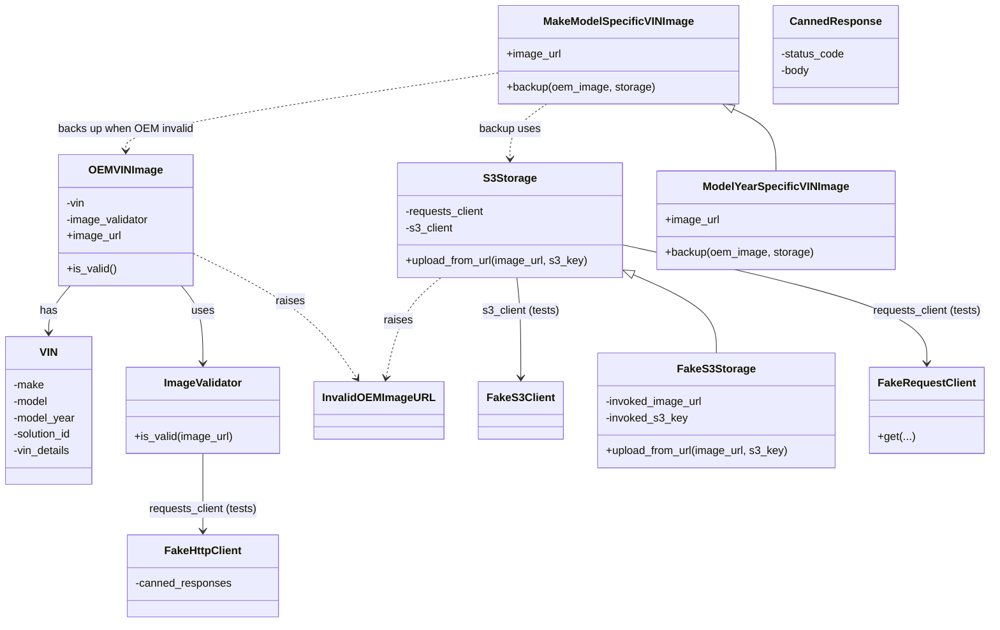
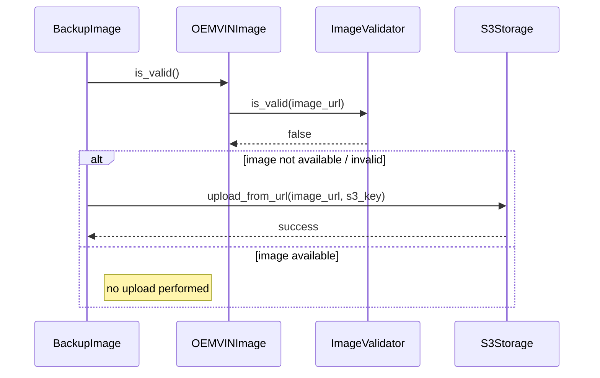

# Diagram: entity_core/entity_service/entity_service_tests/add_finished_vehicle_references_tests/test_vin_images.py

> Auto-generated by Obscura crawlers

## Diagram 1

### SVG

<svg id="container" width="1417.0390625" xmlns="http://www.w3.org/2000/svg" class="classDiagram" height="910" viewBox="0 0 1417.0390625 910" role="graphics-document document" aria-roledescription="class"><g><defs><marker id="container_class-aggregationStart" class="marker aggregation class" refX="18" refY="7" markerWidth="190" markerHeight="240" orient="auto"><path d="M 18,7 L9,13 L1,7 L9,1 Z"></path></marker></defs><defs><marker id="container_class-aggregationEnd" class="marker aggregation class" refX="1" refY="7" markerWidth="20" markerHeight="28" orient="auto"><path d="M 18,7 L9,13 L1,7 L9,1 Z"></path></marker></defs><defs><marker id="container_class-extensionStart" class="marker extension class" refX="18" refY="7" markerWidth="190" markerHeight="240" orient="auto"><path d="M 1,7 L18,13 V 1 Z"></path></marker></defs><defs><marker id="container_class-extensionEnd" class="marker extension class" refX="1" refY="7" markerWidth="20" markerHeight="28" orient="auto"><path d="M 1,1 V 13 L18,7 Z"></path></marker></defs><defs><marker id="container_class-compositionStart" class="marker composition class" refX="18" refY="7" markerWidth="190" markerHeight="240" orient="auto"><path d="M 18,7 L9,13 L1,7 L9,1 Z"></path></marker></defs><defs><marker id="container_class-compositionEnd" class="marker composition class" refX="1" refY="7" markerWidth="20" markerHeight="28" orient="auto"><path d="M 18,7 L9,13 L1,7 L9,1 Z"></path></marker></defs><defs><marker id="container_class-dependencyStart" class="marker dependency class" refX="6" refY="7" markerWidth="190" markerHeight="240" orient="auto"><path d="M 5,7 L9,13 L1,7 L9,1 Z"></path></marker></defs><defs><marker id="container_class-dependencyEnd" class="marker dependency class" refX="13" refY="7" markerWidth="20" markerHeight="28" orient="auto"><path d="M 18,7 L9,13 L14,7 L9,1 Z"></path></marker></defs><defs><marker id="container_class-lollipopStart" class="marker lollipop class" refX="13" refY="7" markerWidth="190" markerHeight="240" orient="auto"><circle stroke="black" fill="transparent" cx="7" cy="7" r="6"></circle></marker></defs><defs><marker id="container_class-lollipopEnd" class="marker lollipop class" refX="1" refY="7" markerWidth="190" markerHeight="240" orient="auto"><circle stroke="black" fill="transparent" cx="7" cy="7" r="6"></circle></marker></defs><g class="root"><g class="clusters"></g><g class="edgePaths"><path d="M297.824,663L297.824,676.667C297.824,690.333,297.824,717.667,297.824,736.5C297.824,755.333,297.824,765.667,297.824,770.833L297.824,776" id="id_ImageValidator_FakeHttpClient_1" class="edge-thickness-normal edge-pattern-solid relation" style=";;;" data-edge="true" data-et="edge" data-id="id_ImageValidator_FakeHttpClient_1" data-points="W3sieCI6Mjk3LjgyNDIxODc1LCJ5Ijo2NjN9LHsieCI6Mjk3LjgyNDIxODc1LCJ5Ijo3NDV9LHsieCI6Mjk3LjgyNDIxODc1LCJ5Ijo3ODJ9XQ==" marker-end="url(#container_class-dependencyEnd)"></path><path d="M103.455,418L98.221,424.167C92.987,430.333,82.519,442.667,77.285,454C72.051,465.333,72.051,475.667,72.051,480.833L72.051,486" id="id_OEMVINImage_VIN_2" class="edge-thickness-normal edge-pattern-solid relation" style=";;;" data-edge="true" data-et="edge" data-id="id_OEMVINImage_VIN_2" data-points="W3sieCI6MTAzLjQ1NTM1NzE0Mjg1NzE0LCJ5Ijo0MTh9LHsieCI6NzIuMDUwNzgxMjUsInkiOjQ1NX0seyJ4Ijo3Mi4wNTA3ODEyNSwieSI6NDkyfV0=" marker-end="url(#container_class-dependencyEnd)"></path><path d="M266.42,418L271.654,424.167C276.888,430.333,287.356,442.667,292.59,461.5C297.824,480.333,297.824,505.667,297.824,518.333L297.824,531" id="id_OEMVINImage_ImageValidator_3" class="edge-thickness-normal edge-pattern-solid relation" style=";;;" data-edge="true" data-et="edge" data-id="id_OEMVINImage_ImageValidator_3" data-points="W3sieCI6MjY2LjQxOTY0Mjg1NzE0MjksInkiOjQxOH0seyJ4IjoyOTcuODI0MjE4NzUsInkiOjQ1NX0seyJ4IjoyOTcuODI0MjE4NzUsInkiOjUzN31d" marker-end="url(#container_class-dependencyEnd)"></path><path d="M894.039,358.43L966.478,374.525C1038.917,390.62,1183.794,422.81,1256.233,451.572C1328.672,480.333,1328.672,505.667,1328.672,518.333L1328.672,531" id="id_S3Storage_FakeRequestClient_4" class="edge-thickness-normal edge-pattern-solid relation" style=";;;" data-edge="true" data-et="edge" data-id="id_S3Storage_FakeRequestClient_4" data-points="W3sieCI6ODk0LjAzOTA2MjUsInkiOjM1OC40MzAwNTc0MjYyNTk0NX0seyJ4IjoxMzI4LjY3MTg3NSwieSI6NDU1fSx7IngiOjEzMjguNjcxODc1LCJ5Ijo1Mzd9XQ==" marker-end="url(#container_class-dependencyEnd)"></path><path d="M740.07,406L741.041,414.167C742.013,422.333,743.956,438.667,744.927,463C745.898,487.333,745.898,519.667,745.898,535.833L745.898,552" id="id_S3Storage_FakeS3Client_5" class="edge-thickness-normal edge-pattern-solid relation" style=";;;" data-edge="true" data-et="edge" data-id="id_S3Storage_FakeS3Client_5" data-points="W3sieCI6NzQwLjA2OTkwMTMxNTc4OTUsInkiOjQwNn0seyJ4Ijo3NDUuODk4NDM3NSwieSI6NDU1fSx7IngiOjc0NS44OTg0Mzc1LCJ5Ijo1NTh9XQ==" marker-end="url(#container_class-dependencyEnd)"></path><path d="M909.779,402.584L929.26,411.32C948.741,420.056,987.702,437.528,1007.183,456.431C1026.664,475.333,1026.664,495.667,1026.664,505.833L1026.664,516" id="id_S3Storage_FakeS3Storage_6" class="edge-thickness-normal edge-pattern-solid relation" style=";;;" data-edge="true" data-et="edge" data-id="id_S3Storage_FakeS3Storage_6" data-points="W3sieCI6ODk0LjAzOTA2MjUsInkiOjM5NS41MjYwOTExOTQwNTczNn0seyJ4IjoxMDI2LjY2NDA2MjUsInkiOjQ1NX0seyJ4IjoxMDI2LjY2NDA2MjUsInkiOjUxNn1d" marker-start="url(#container_class-extensionStart)"></path><path d="M1052.713,159.43L1063.039,164.358C1073.366,169.287,1094.019,179.143,1104.345,194.238C1114.672,209.333,1114.672,229.667,1114.672,239.833L1114.672,250" id="id_MakeModelSpecificVINImage_ModelYearSpecificVINImage_7" class="edge-thickness-normal edge-pattern-solid relation" style=";;;" data-edge="true" data-et="edge" data-id="id_MakeModelSpecificVINImage_ModelYearSpecificVINImage_7" data-points="W3sieCI6MTAzNy4xNDQ3ODIxMTAwOTE3LCJ5IjoxNTJ9LHsieCI6MTExNC42NzE4NzUsInkiOjE4OX0seyJ4IjoxMTE0LjY3MTg3NSwieSI6MjUwfV0=" marker-start="url(#container_class-extensionStart)"></path><path d="M283.16,370.914L311.302,384.928C339.443,398.943,395.727,426.971,434.732,457.32C473.738,487.668,495.467,520.336,506.331,536.67L517.195,553.004" id="id_OEMVINImage_InvalidOEMImageURL_8" class="edge-thickness-normal edge-pattern-dashed relation" style=";;;" data-edge="true" data-et="edge" data-id="id_OEMVINImage_InvalidOEMImageURL_8" data-points="W3sieCI6MjgzLjE2MDE1NjI1LCJ5IjozNzAuOTE0MTUxNTcxMjE4NTV9LHsieCI6NDUyLjAwOTc2NTYyNSwieSI6NDU1fSx7IngiOjUyMC41MTc4MDcxMTIwNjksInkiOjU1OH1d" marker-end="url(#container_class-dependencyEnd)"></path><path d="M635.104,406L625.871,414.167C616.637,422.333,598.17,438.667,585.448,463.022C572.725,487.378,565.747,519.756,562.258,535.946L558.769,552.135" id="id_S3Storage_InvalidOEMImageURL_9" class="edge-thickness-normal edge-pattern-dashed relation" style=";;;" data-edge="true" data-et="edge" data-id="id_S3Storage_InvalidOEMImageURL_9" data-points="W3sieCI6NjM1LjEwNDQ0MDc4OTQ3MzYsInkiOjQwNn0seyJ4Ijo1NzkuNzAzMTI1LCJ5Ijo0NTV9LHsieCI6NTU3LjUwNDg0OTEzNzkzMSwieSI6NTU4fV0=" marker-end="url(#container_class-dependencyEnd)"></path><path d="M783.101,152L774.264,158.167C765.427,164.333,747.752,176.667,738.915,190C730.078,203.333,730.078,217.667,730.078,224.833L730.078,232" id="id_MakeModelSpecificVINImage_S3Storage_10" class="edge-thickness-normal edge-pattern-dashed relation" style=";;;" data-edge="true" data-et="edge" data-id="id_MakeModelSpecificVINImage_S3Storage_10" data-points="W3sieCI6NzgzLjEwMTIwNDEyODQ0MDQsInkiOjE1Mn0seyJ4Ijo3MzAuMDc4MTI1LCJ5IjoxODl9LHsieCI6NzMwLjA3ODEyNSwieSI6MjM4fV0=" marker-end="url(#container_class-dependencyEnd)"></path><path d="M714.023,106.772L625.842,120.476C537.661,134.181,361.299,161.591,273.118,180.462C184.938,199.333,184.938,209.667,184.938,214.833L184.938,220" id="id_MakeModelSpecificVINImage_OEMVINImage_11" class="edge-thickness-normal edge-pattern-dashed relation" style=";;;" data-edge="true" data-et="edge" data-id="id_MakeModelSpecificVINImage_OEMVINImage_11" data-points="W3sieCI6NzE0LjAyMzQzNzUsInkiOjEwNi43NzE2MTAzMDE2NTMwOH0seyJ4IjoxODQuOTM3NSwieSI6MTg5fSx7IngiOjE4NC45Mzc1LCJ5IjoyMjZ9XQ==" marker-end="url(#container_class-dependencyEnd)"></path></g><g class="edgeLabels"><g class="edgeLabel" transform="translate(297.82421875, 745)"><g class="label" data-id="id_ImageValidator_FakeHttpClient_1" transform="translate(-80.3671875, -12)"><foreignObject width="160.734375" height="24">

requests_client (tests)

</foreignObject></g></g><g class="edgeLabel" transform="translate(72.05078125, 455)"><g class="label" data-id="id_OEMVINImage_VIN_2" transform="translate(-12.703125, -12)"><foreignObject width="25.40625" height="24">

has

</foreignObject></g></g><g class="edgeLabel" transform="translate(297.82421875, 455)"><g class="label" data-id="id_OEMVINImage_ImageValidator_3" transform="translate(-16.4921875, -12)"><foreignObject width="32.984375" height="24">

uses

</foreignObject></g></g><g class="edgeLabel" transform="translate(1328.671875, 455)"><g class="label" data-id="id_S3Storage_FakeRequestClient_4" transform="translate(-80.3671875, -12)"><foreignObject width="160.734375" height="24">

requests_client (tests)

</foreignObject></g></g><g class="edgeLabel" transform="translate(745.8984375, 455)"><g class="label" data-id="id_S3Storage_FakeS3Client_5" transform="translate(-56.7265625, -12)"><foreignObject width="113.453125" height="24">

s3_client (tests)

</foreignObject></g></g><g class="edgeLabel"><g class="label" data-id="id_S3Storage_FakeS3Storage_6" transform="translate(0, 0)"><foreignObject width="0" height="0">

</foreignObject></g></g><g class="edgeLabel"><g class="label" data-id="id_MakeModelSpecificVINImage_ModelYearSpecificVINImage_7" transform="translate(0, 0)"><foreignObject width="0" height="0">

</foreignObject></g></g><g class="edgeLabel" transform="translate(422.95087, 440.52888)"><g class="label" data-id="id_OEMVINImage_InvalidOEMImageURL_8" transform="translate(-21.25, -12)"><foreignObject width="42.5" height="24">

raises

</foreignObject></g></g><g class="edgeLabel" transform="translate(576.39509, 470.34927)"><g class="label" data-id="id_S3Storage_InvalidOEMImageURL_9" transform="translate(-21.25, -12)"><foreignObject width="42.5" height="24">

raises

</foreignObject></g></g><g class="edgeLabel" transform="translate(730.078125, 189)"><g class="label" data-id="id_MakeModelSpecificVINImage_S3Storage_10" transform="translate(-44.90625, -12)"><foreignObject width="89.8125" height="24">

backup uses

</foreignObject></g></g><g class="edgeLabel" transform="translate(184.9375, 189)"><g class="label" data-id="id_MakeModelSpecificVINImage_OEMVINImage_11" transform="translate(-98.3984375, -12)"><foreignObject width="196.796875" height="24">

backs up when OEM invalid

</foreignObject></g></g></g><g class="nodes"><g class="node default" id="classId-VIN-0" transform="translate(72.05078125, 600)"><g class="basic label-container"><path d="M-64.05078125 -108 L64.05078125 -108 L64.05078125 108 L-64.05078125 108" stroke="none" stroke-width="0" fill="#ECECFF" style=""></path><path d="M-64.05078125 -108 C-20.78532449008948 -108, 22.48013226982104 -108, 64.05078125 -108 M-64.05078125 -108 C-17.236922825904422 -108, 29.576935598191156 -108, 64.05078125 -108 M64.05078125 -108 C64.05078125 -38.030484822620195, 64.05078125 31.93903035475961, 64.05078125 108 M64.05078125 -108 C64.05078125 -44.336590660632204, 64.05078125 19.32681867873559, 64.05078125 108 M64.05078125 108 C17.47117545530012 108, -29.10843033939976 108, -64.05078125 108 M64.05078125 108 C29.580628408574917 108, -4.889524432850166 108, -64.05078125 108 M-64.05078125 108 C-64.05078125 63.27558552311257, -64.05078125 18.551171046225136, -64.05078125 -108 M-64.05078125 108 C-64.05078125 60.21028529432798, -64.05078125 12.420570588655963, -64.05078125 -108" stroke="#9370DB" stroke-width="1.3" fill="none" stroke-dasharray="0 0" style=""></path></g><g class="annotation-group text" transform="translate(0, -84)"></g><g class="label-group text" transform="translate(-12.2109375, -84)"><g class="label" style="font-weight: bolder" transform="translate(0,-12)"><foreignObject width="24.421875" height="24">

VIN

</foreignObject></g></g><g class="members-group text" transform="translate(-52.05078125, -36)"><g class="label" style="" transform="translate(0,-12)"><foreignObject width="45.640625" height="24">

-make

</foreignObject></g><g class="label" style="" transform="translate(0,12)"><foreignObject width="52.484375" height="24">

-model

</foreignObject></g><g class="label" style="" transform="translate(0,36)"><foreignObject width="91.890625" height="24">

-model_year

</foreignObject></g><g class="label" style="" transform="translate(0,60)"><foreignObject width="88.6875" height="24">

-solution_id

</foreignObject></g><g class="label" style="" transform="translate(0,84)"><foreignObject width="85.390625" height="24">

-vin_details

</foreignObject></g></g><g class="methods-group text" transform="translate(-52.05078125, 108)"></g><g class="divider" style=""><path d="M-64.05078125 -60 C-15.691215061044566 -60, 32.66835112791087 -60, 64.05078125 -60 M-64.05078125 -60 C-30.2722654391522 -60, 3.5062503716956 -60, 64.05078125 -60" stroke="#9370DB" stroke-width="1.3" fill="none" stroke-dasharray="0 0" style=""></path></g><g class="divider" style=""><path d="M-64.05078125 84 C-26.176640550885793 84, 11.697500148228414 84, 64.05078125 84 M-64.05078125 84 C-20.377160658987805 84, 23.29645993202439 84, 64.05078125 84" stroke="#9370DB" stroke-width="1.3" fill="none" stroke-dasharray="0 0" style=""></path></g></g><g class="node default" id="classId-ImageValidator-1" transform="translate(297.82421875, 600)"><g class="basic label-container"><path d="M-111.72265625 -63 L111.72265625 -63 L111.72265625 63 L-111.72265625 63" stroke="none" stroke-width="0" fill="#ECECFF" style=""></path><path d="M-111.72265625 -63 C-32.42321140338419 -63, 46.87623344323163 -63, 111.72265625 -63 M-111.72265625 -63 C-57.55153751018483 -63, -3.3804187703696584 -63, 111.72265625 -63 M111.72265625 -63 C111.72265625 -33.75354401562542, 111.72265625 -4.507088031250845, 111.72265625 63 M111.72265625 -63 C111.72265625 -35.41567405313891, 111.72265625 -7.831348106277815, 111.72265625 63 M111.72265625 63 C66.33966751685142 63, 20.956678783702827 63, -111.72265625 63 M111.72265625 63 C63.26751270612967 63, 14.812369162259344 63, -111.72265625 63 M-111.72265625 63 C-111.72265625 25.471302778369626, -111.72265625 -12.057394443260748, -111.72265625 -63 M-111.72265625 63 C-111.72265625 13.739398349657556, -111.72265625 -35.52120330068489, -111.72265625 -63" stroke="#9370DB" stroke-width="1.3" fill="none" stroke-dasharray="0 0" style=""></path></g><g class="annotation-group text" transform="translate(0, -39)"></g><g class="label-group text" transform="translate(-55.2421875, -39)"><g class="label" style="font-weight: bolder" transform="translate(0,-12)"><foreignObject width="110.484375" height="24">

ImageValidator

</foreignObject></g></g><g class="members-group text" transform="translate(-99.72265625, 9)"></g><g class="methods-group text" transform="translate(-99.72265625, 39)"><g class="label" style="" transform="translate(0,-12)"><foreignObject width="144.203125" height="24">

+is_valid(image_url)

</foreignObject></g></g><g class="divider" style=""><path d="M-111.72265625 -15 C-52.08601888415798 -15, 7.55061848168404 -15, 111.72265625 -15 M-111.72265625 -15 C-31.46602257001028 -15, 48.79061110997944 -15, 111.72265625 -15" stroke="#9370DB" stroke-width="1.3" fill="none" stroke-dasharray="0 0" style=""></path></g><g class="divider" style=""><path d="M-111.72265625 9 C-37.64421020430467 9, 36.43423584139066 9, 111.72265625 9 M-111.72265625 9 C-45.654519398534646 9, 20.41361745293071 9, 111.72265625 9" stroke="#9370DB" stroke-width="1.3" fill="none" stroke-dasharray="0 0" style=""></path></g></g><g class="node default" id="classId-OEMVINImage-2" transform="translate(184.9375, 322)"><g class="basic label-container"><path d="M-98.22265625 -96 L98.22265625 -96 L98.22265625 96 L-98.22265625 96" stroke="none" stroke-width="0" fill="#ECECFF" style=""></path><path d="M-98.22265625 -96 C-40.56745222607824 -96, 17.087751797843524 -96, 98.22265625 -96 M-98.22265625 -96 C-37.48668658423927 -96, 23.249283081521455 -96, 98.22265625 -96 M98.22265625 -96 C98.22265625 -48.75083092588261, 98.22265625 -1.5016618517652205, 98.22265625 96 M98.22265625 -96 C98.22265625 -20.803286808799385, 98.22265625 54.39342638240123, 98.22265625 96 M98.22265625 96 C39.05260269989956 96, -20.117450850200882 96, -98.22265625 96 M98.22265625 96 C30.445808949677954 96, -37.33103835064409 96, -98.22265625 96 M-98.22265625 96 C-98.22265625 41.071320274211146, -98.22265625 -13.857359451577707, -98.22265625 -96 M-98.22265625 96 C-98.22265625 32.389264101510165, -98.22265625 -31.22147179697967, -98.22265625 -96" stroke="#9370DB" stroke-width="1.3" fill="none" stroke-dasharray="0 0" style=""></path></g><g class="annotation-group text" transform="translate(0, -72)"></g><g class="label-group text" transform="translate(-50.2265625, -72)"><g class="label" style="font-weight: bolder" transform="translate(0,-12)"><foreignObject width="100.453125" height="24">

OEMVINImage

</foreignObject></g></g><g class="members-group text" transform="translate(-86.22265625, -24)"><g class="label" style="" transform="translate(0,-12)"><foreignObject width="28.0625" height="24">

-vin

</foreignObject></g><g class="label" style="" transform="translate(0,12)"><foreignObject width="122.21875" height="24">

-image_validator

</foreignObject></g><g class="label" style="" transform="translate(0,36)"><foreignObject width="79.40625" height="24">

+image_url

</foreignObject></g></g><g class="methods-group text" transform="translate(-86.22265625, 72)"><g class="label" style="" transform="translate(0,-12)"><foreignObject width="72.796875" height="24">

+is_valid()

</foreignObject></g></g><g class="divider" style=""><path d="M-98.22265625 -48 C-56.97111356615088 -48, -15.719570882301767 -48, 98.22265625 -48 M-98.22265625 -48 C-20.924190874478356 -48, 56.37427450104329 -48, 98.22265625 -48" stroke="#9370DB" stroke-width="1.3" fill="none" stroke-dasharray="0 0" style=""></path></g><g class="divider" style=""><path d="M-98.22265625 48 C-40.10456632095299 48, 18.01352360809402 48, 98.22265625 48 M-98.22265625 48 C-27.08951259396541 48, 44.04363106206918 48, 98.22265625 48" stroke="#9370DB" stroke-width="1.3" fill="none" stroke-dasharray="0 0" style=""></path></g></g><g class="node default" id="classId-S3Storage-3" transform="translate(730.078125, 322)"><g class="basic label-container"><path d="M-163.9609375 -84 L163.9609375 -84 L163.9609375 84 L-163.9609375 84" stroke="none" stroke-width="0" fill="#ECECFF" style=""></path><path d="M-163.9609375 -84 C-71.06404014822324 -84, 21.832857203553516 -84, 163.9609375 -84 M-163.9609375 -84 C-60.640322669159644 -84, 42.68029216168071 -84, 163.9609375 -84 M163.9609375 -84 C163.9609375 -18.370000545696413, 163.9609375 47.25999890860717, 163.9609375 84 M163.9609375 -84 C163.9609375 -48.56023473336087, 163.9609375 -13.120469466721744, 163.9609375 84 M163.9609375 84 C34.485548522675515 84, -94.98984045464897 84, -163.9609375 84 M163.9609375 84 C97.90230140102753 84, 31.843665302055058 84, -163.9609375 84 M-163.9609375 84 C-163.9609375 36.11460650898064, -163.9609375 -11.770786982038715, -163.9609375 -84 M-163.9609375 84 C-163.9609375 46.63126957387038, -163.9609375 9.262539147740753, -163.9609375 -84" stroke="#9370DB" stroke-width="1.3" fill="none" stroke-dasharray="0 0" style=""></path></g><g class="annotation-group text" transform="translate(0, -60)"></g><g class="label-group text" transform="translate(-36.8125, -60)"><g class="label" style="font-weight: bolder" transform="translate(0,-12)"><foreignObject width="73.625" height="24">

S3Storage

</foreignObject></g></g><g class="members-group text" transform="translate(-151.9609375, -12)"><g class="label" style="" transform="translate(0,-12)"><foreignObject width="117.59375" height="24">

-requests_client

</foreignObject></g><g class="label" style="" transform="translate(0,12)"><foreignObject width="70.3125" height="24">

-s3_client

</foreignObject></g></g><g class="methods-group text" transform="translate(-151.9609375, 60)"><g class="label" style="" transform="translate(0,-12)"><foreignObject width="267.109375" height="24">

+upload_from_url(image_url, s3_key)

</foreignObject></g></g><g class="divider" style=""><path d="M-163.9609375 -36 C-89.16650904960217 -36, -14.372080599204338 -36, 163.9609375 -36 M-163.9609375 -36 C-84.83456631216947 -36, -5.708195124338943 -36, 163.9609375 -36" stroke="#9370DB" stroke-width="1.3" fill="none" stroke-dasharray="0 0" style=""></path></g><g class="divider" style=""><path d="M-163.9609375 36 C-44.427120439229526 36, 75.10669662154095 36, 163.9609375 36 M-163.9609375 36 C-36.3551237976169 36, 91.2506899047662 36, 163.9609375 36" stroke="#9370DB" stroke-width="1.3" fill="none" stroke-dasharray="0 0" style=""></path></g></g><g class="node default" id="classId-MakeModelSpecificVINImage-4" transform="translate(886.28125, 80)"><g class="basic label-container"><path d="M-172.2578125 -72 L172.2578125 -72 L172.2578125 72 L-172.2578125 72" stroke="none" stroke-width="0" fill="#ECECFF" style=""></path><path d="M-172.2578125 -72 C-84.8194201308892 -72, 2.618972238221602 -72, 172.2578125 -72 M-172.2578125 -72 C-95.85210061482914 -72, -19.44638872965828 -72, 172.2578125 -72 M172.2578125 -72 C172.2578125 -22.054294016573586, 172.2578125 27.89141196685283, 172.2578125 72 M172.2578125 -72 C172.2578125 -27.963847453944986, 172.2578125 16.072305092110028, 172.2578125 72 M172.2578125 72 C100.14002158794881 72, 28.022230675897617 72, -172.2578125 72 M172.2578125 72 C96.7251304409573 72, 21.192448381914602 72, -172.2578125 72 M-172.2578125 72 C-172.2578125 41.54925055728453, -172.2578125 11.09850111456906, -172.2578125 -72 M-172.2578125 72 C-172.2578125 35.77343046712501, -172.2578125 -0.45313906574997986, -172.2578125 -72" stroke="#9370DB" stroke-width="1.3" fill="none" stroke-dasharray="0 0" style=""></path></g><g class="annotation-group text" transform="translate(0, -48)"></g><g class="label-group text" transform="translate(-104.703125, -48)"><g class="label" style="font-weight: bolder" transform="translate(0,-12)"><foreignObject width="209.40625" height="24">

MakeModelSpecificVINImage

</foreignObject></g></g><g class="members-group text" transform="translate(-160.2578125, 0)"><g class="label" style="" transform="translate(0,-12)"><foreignObject width="79.40625" height="24">

+image_url

</foreignObject></g></g><g class="methods-group text" transform="translate(-160.2578125, 48)"><g class="label" style="" transform="translate(0,-12)"><foreignObject width="215.8125" height="24">

+backup(oem_image, storage)

</foreignObject></g></g><g class="divider" style=""><path d="M-172.2578125 -24 C-50.08252857485135 -24, 72.0927553502973 -24, 172.2578125 -24 M-172.2578125 -24 C-103.34148354547122 -24, -34.42515459094244 -24, 172.2578125 -24" stroke="#9370DB" stroke-width="1.3" fill="none" stroke-dasharray="0 0" style=""></path></g><g class="divider" style=""><path d="M-172.2578125 24 C-43.57476783761595 24, 85.1082768247681 24, 172.2578125 24 M-172.2578125 24 C-86.16409301465747 24, -0.07037352931493501 24, 172.2578125 24" stroke="#9370DB" stroke-width="1.3" fill="none" stroke-dasharray="0 0" style=""></path></g></g><g class="node default" id="classId-ModelYearSpecificVINImage-5" transform="translate(1114.671875, 322)"><g class="basic label-container"><path d="M-170.6328125 -72 L170.6328125 -72 L170.6328125 72 L-170.6328125 72" stroke="none" stroke-width="0" fill="#ECECFF" style=""></path><path d="M-170.6328125 -72 C-60.472312282868 -72, 49.68818793426399 -72, 170.6328125 -72 M-170.6328125 -72 C-61.53970755706908 -72, 47.55339738586184 -72, 170.6328125 -72 M170.6328125 -72 C170.6328125 -40.82264881771623, 170.6328125 -9.645297635432463, 170.6328125 72 M170.6328125 -72 C170.6328125 -32.06496360620347, 170.6328125 7.87007278759306, 170.6328125 72 M170.6328125 72 C91.83027959821875 72, 13.027746696437504 72, -170.6328125 72 M170.6328125 72 C74.3217517936897 72, -21.9893089126206 72, -170.6328125 72 M-170.6328125 72 C-170.6328125 17.876470205240416, -170.6328125 -36.24705958951917, -170.6328125 -72 M-170.6328125 72 C-170.6328125 34.897205991422744, -170.6328125 -2.2055880171545112, -170.6328125 -72" stroke="#9370DB" stroke-width="1.3" fill="none" stroke-dasharray="0 0" style=""></path></g><g class="annotation-group text" transform="translate(0, -48)"></g><g class="label-group text" transform="translate(-101.453125, -48)"><g class="label" style="font-weight: bolder" transform="translate(0,-12)"><foreignObject width="202.90625" height="24">

ModelYearSpecificVINImage

</foreignObject></g></g><g class="members-group text" transform="translate(-158.6328125, 0)"><g class="label" style="" transform="translate(0,-12)"><foreignObject width="79.40625" height="24">

+image_url

</foreignObject></g></g><g class="methods-group text" transform="translate(-158.6328125, 48)"><g class="label" style="" transform="translate(0,-12)"><foreignObject width="215.8125" height="24">

+backup(oem_image, storage)

</foreignObject></g></g><g class="divider" style=""><path d="M-170.6328125 -24 C-73.7567160844135 -24, 23.119380331173005 -24, 170.6328125 -24 M-170.6328125 -24 C-62.09314163940461 -24, 46.44652922119079 -24, 170.6328125 -24" stroke="#9370DB" stroke-width="1.3" fill="none" stroke-dasharray="0 0" style=""></path></g><g class="divider" style=""><path d="M-170.6328125 24 C-65.9535671522453 24, 38.7256781955094 24, 170.6328125 24 M-170.6328125 24 C-59.562823444521655 24, 51.50716561095669 24, 170.6328125 24" stroke="#9370DB" stroke-width="1.3" fill="none" stroke-dasharray="0 0" style=""></path></g></g><g class="node default" id="classId-InvalidOEMImageURL-6" transform="translate(548.453125, 600)"><g class="basic label-container"><path d="M-88.90625 -42 L88.90625 -42 L88.90625 42 L-88.90625 42" stroke="none" stroke-width="0" fill="#ECECFF" style=""></path><path d="M-88.90625 -42 C-29.02431283479158 -42, 30.85762433041684 -42, 88.90625 -42 M-88.90625 -42 C-26.76355195891535 -42, 35.3791460821693 -42, 88.90625 -42 M88.90625 -42 C88.90625 -11.45345101972326, 88.90625 19.09309796055348, 88.90625 42 M88.90625 -42 C88.90625 -22.361938927848495, 88.90625 -2.7238778556969905, 88.90625 42 M88.90625 42 C51.24229531623536 42, 13.578340632470713 42, -88.90625 42 M88.90625 42 C22.940157281896532 42, -43.025935436206936 42, -88.90625 42 M-88.90625 42 C-88.90625 22.011207574578247, -88.90625 2.022415149156494, -88.90625 -42 M-88.90625 42 C-88.90625 13.439757610118779, -88.90625 -15.120484779762442, -88.90625 -42" stroke="#9370DB" stroke-width="1.3" fill="none" stroke-dasharray="0 0" style=""></path></g><g class="annotation-group text" transform="translate(0, -18)"></g><g class="label-group text" transform="translate(-76.90625, -18)"><g class="label" style="font-weight: bolder" transform="translate(0,-12)"><foreignObject width="153.8125" height="24">

InvalidOEMImageURL

</foreignObject></g></g><g class="members-group text" transform="translate(-76.90625, 30)"></g><g class="methods-group text" transform="translate(-76.90625, 60)"></g><g class="divider" style=""><path d="M-88.90625 6 C-51.020635372323554 6, -13.135020744647107 6, 88.90625 6 M-88.90625 6 C-47.67446365890056 6, -6.442677317801113 6, 88.90625 6" stroke="#9370DB" stroke-width="1.3" fill="none" stroke-dasharray="0 0" style=""></path></g><g class="divider" style=""><path d="M-88.90625 24 C-21.195195315726863 24, 46.51585936854627 24, 88.90625 24 M-88.90625 24 C-17.818864470542238 24, 53.268521058915525 24, 88.90625 24" stroke="#9370DB" stroke-width="1.3" fill="none" stroke-dasharray="0 0" style=""></path></g></g><g class="node default" id="classId-FakeHttpClient-7" transform="translate(297.82421875, 842)"><g class="basic label-container"><path d="M-109.93359375 -60 L109.93359375 -60 L109.93359375 60 L-109.93359375 60" stroke="none" stroke-width="0" fill="#ECECFF" style=""></path><path d="M-109.93359375 -60 C-41.23508114515599 -60, 27.463431459688024 -60, 109.93359375 -60 M-109.93359375 -60 C-42.17859696433142 -60, 25.576399821337162 -60, 109.93359375 -60 M109.93359375 -60 C109.93359375 -32.318185956474764, 109.93359375 -4.636371912949528, 109.93359375 60 M109.93359375 -60 C109.93359375 -13.256506802425974, 109.93359375 33.48698639514805, 109.93359375 60 M109.93359375 60 C36.30159942324768 60, -37.33039490350464 60, -109.93359375 60 M109.93359375 60 C60.425267746238944 60, 10.916941742477889 60, -109.93359375 60 M-109.93359375 60 C-109.93359375 34.64452180601593, -109.93359375 9.289043612031861, -109.93359375 -60 M-109.93359375 60 C-109.93359375 14.605951597549357, -109.93359375 -30.788096804901286, -109.93359375 -60" stroke="#9370DB" stroke-width="1.3" fill="none" stroke-dasharray="0 0" style=""></path></g><g class="annotation-group text" transform="translate(0, -36)"></g><g class="label-group text" transform="translate(-54.0859375, -36)"><g class="label" style="font-weight: bolder" transform="translate(0,-12)"><foreignObject width="108.171875" height="24">

FakeHttpClient

</foreignObject></g></g><g class="members-group text" transform="translate(-97.93359375, 12)"><g class="label" style="" transform="translate(0,-12)"><foreignObject width="141.78125" height="24">

-canned_responses

</foreignObject></g></g><g class="methods-group text" transform="translate(-97.93359375, 60)"></g><g class="divider" style=""><path d="M-109.93359375 -12 C-36.52710890311914 -12, 36.879375943761715 -12, 109.93359375 -12 M-109.93359375 -12 C-35.190485374975665 -12, 39.55262300004867 -12, 109.93359375 -12" stroke="#9370DB" stroke-width="1.3" fill="none" stroke-dasharray="0 0" style=""></path></g><g class="divider" style=""><path d="M-109.93359375 36 C-26.479346231958942 36, 56.974901286082115 36, 109.93359375 36 M-109.93359375 36 C-52.36131894846662 36, 5.210955853066764 36, 109.93359375 36" stroke="#9370DB" stroke-width="1.3" fill="none" stroke-dasharray="0 0" style=""></path></g></g><g class="node default" id="classId-CannedResponse-8" transform="translate(1198.6875, 80)"><g class="basic label-container"><path d="M-90.1484375 -72 L90.1484375 -72 L90.1484375 72 L-90.1484375 72" stroke="none" stroke-width="0" fill="#ECECFF" style=""></path><path d="M-90.1484375 -72 C-35.173023421870994 -72, 19.802390656258012 -72, 90.1484375 -72 M-90.1484375 -72 C-52.17141314369353 -72, -14.194388787387055 -72, 90.1484375 -72 M90.1484375 -72 C90.1484375 -36.64861966705806, 90.1484375 -1.2972393341161137, 90.1484375 72 M90.1484375 -72 C90.1484375 -38.52844876636752, 90.1484375 -5.056897532735036, 90.1484375 72 M90.1484375 72 C25.893866082495308 72, -38.360705335009385 72, -90.1484375 72 M90.1484375 72 C33.74815145639272 72, -22.65213458721456 72, -90.1484375 72 M-90.1484375 72 C-90.1484375 21.341061560520217, -90.1484375 -29.317876878959567, -90.1484375 -72 M-90.1484375 72 C-90.1484375 16.374545292780383, -90.1484375 -39.250909414439235, -90.1484375 -72" stroke="#9370DB" stroke-width="1.3" fill="none" stroke-dasharray="0 0" style=""></path></g><g class="annotation-group text" transform="translate(0, -48)"></g><g class="label-group text" transform="translate(-62.796875, -48)"><g class="label" style="font-weight: bolder" transform="translate(0,-12)"><foreignObject width="125.59375" height="24">

CannedResponse

</foreignObject></g></g><g class="members-group text" transform="translate(-78.1484375, 0)"><g class="label" style="" transform="translate(0,-12)"><foreignObject width="93.5" height="24">

-status_code

</foreignObject></g><g class="label" style="" transform="translate(0,12)"><foreignObject width="42.75" height="24">

-body

</foreignObject></g></g><g class="methods-group text" transform="translate(-78.1484375, 72)"></g><g class="divider" style=""><path d="M-90.1484375 -24 C-36.2539350533654 -24, 17.640567393269194 -24, 90.1484375 -24 M-90.1484375 -24 C-35.97669903645942 -24, 18.195039427081156 -24, 90.1484375 -24" stroke="#9370DB" stroke-width="1.3" fill="none" stroke-dasharray="0 0" style=""></path></g><g class="divider" style=""><path d="M-90.1484375 48 C-41.85773552788088 48, 6.432966444238247 48, 90.1484375 48 M-90.1484375 48 C-18.413658512690162 48, 53.321120474619676 48, 90.1484375 48" stroke="#9370DB" stroke-width="1.3" fill="none" stroke-dasharray="0 0" style=""></path></g></g><g class="node default" id="classId-FakeS3Client-9" transform="translate(745.8984375, 600)"><g class="basic label-container"><path d="M-58.5390625 -42 L58.5390625 -42 L58.5390625 42 L-58.5390625 42" stroke="none" stroke-width="0" fill="#ECECFF" style=""></path><path d="M-58.5390625 -42 C-19.439914691749607 -42, 19.659233116500786 -42, 58.5390625 -42 M-58.5390625 -42 C-32.381676341066225 -42, -6.2242901821324494 -42, 58.5390625 -42 M58.5390625 -42 C58.5390625 -24.82907893900382, 58.5390625 -7.658157878007643, 58.5390625 42 M58.5390625 -42 C58.5390625 -17.368894635647145, 58.5390625 7.2622107287057105, 58.5390625 42 M58.5390625 42 C19.21114359373572 42, -20.11677531252856 42, -58.5390625 42 M58.5390625 42 C34.71668770696765 42, 10.894312913935288 42, -58.5390625 42 M-58.5390625 42 C-58.5390625 8.937752422675011, -58.5390625 -24.124495154649978, -58.5390625 -42 M-58.5390625 42 C-58.5390625 19.89927965585766, -58.5390625 -2.201440688284677, -58.5390625 -42" stroke="#9370DB" stroke-width="1.3" fill="none" stroke-dasharray="0 0" style=""></path></g><g class="annotation-group text" transform="translate(0, -18)"></g><g class="label-group text" transform="translate(-46.5390625, -18)"><g class="label" style="font-weight: bolder" transform="translate(0,-12)"><foreignObject width="93.078125" height="24">

FakeS3Client

</foreignObject></g></g><g class="members-group text" transform="translate(-46.5390625, 30)"></g><g class="methods-group text" transform="translate(-46.5390625, 60)"></g><g class="divider" style=""><path d="M-58.5390625 6 C-31.885627784805084 6, -5.232193069610169 6, 58.5390625 6 M-58.5390625 6 C-11.713385502204076 6, 35.11229149559185 6, 58.5390625 6" stroke="#9370DB" stroke-width="1.3" fill="none" stroke-dasharray="0 0" style=""></path></g><g class="divider" style=""><path d="M-58.5390625 24 C-20.122641462649042 24, 18.293779574701915 24, 58.5390625 24 M-58.5390625 24 C-26.261096195941924 24, 6.0168701081161515 24, 58.5390625 24" stroke="#9370DB" stroke-width="1.3" fill="none" stroke-dasharray="0 0" style=""></path></g></g><g class="node default" id="classId-FakeS3Storage-10" transform="translate(1026.6640625, 600)"><g class="basic label-container"><path d="M-172.2265625 -84 L172.2265625 -84 L172.2265625 84 L-172.2265625 84" stroke="none" stroke-width="0" fill="#ECECFF" style=""></path><path d="M-172.2265625 -84 C-51.00939082826055 -84, 70.2077808434789 -84, 172.2265625 -84 M-172.2265625 -84 C-79.87690394449943 -84, 12.472754611001136 -84, 172.2265625 -84 M172.2265625 -84 C172.2265625 -20.124006041968755, 172.2265625 43.75198791606249, 172.2265625 84 M172.2265625 -84 C172.2265625 -37.658951761965646, 172.2265625 8.682096476068708, 172.2265625 84 M172.2265625 84 C39.513364208920024 84, -93.19983408215995 84, -172.2265625 84 M172.2265625 84 C44.18024021130836 84, -83.86608207738328 84, -172.2265625 84 M-172.2265625 84 C-172.2265625 33.32672549632199, -172.2265625 -17.346549007356018, -172.2265625 -84 M-172.2265625 84 C-172.2265625 31.203744774315723, -172.2265625 -21.592510451368554, -172.2265625 -84" stroke="#9370DB" stroke-width="1.3" fill="none" stroke-dasharray="0 0" style=""></path></g><g class="annotation-group text" transform="translate(0, -60)"></g><g class="label-group text" transform="translate(-53.34375, -60)"><g class="label" style="font-weight: bolder" transform="translate(0,-12)"><foreignObject width="106.6875" height="24">

FakeS3Storage

</foreignObject></g></g><g class="members-group text" transform="translate(-160.2265625, -12)"><g class="label" style="" transform="translate(0,-12)"><foreignObject width="143.453125" height="24">

-invoked_image_url

</foreignObject></g><g class="label" style="" transform="translate(0,12)"><foreignObject width="120.078125" height="24">

-invoked_s3_key

</foreignObject></g></g><g class="methods-group text" transform="translate(-160.2265625, 60)"><g class="label" style="" transform="translate(0,-12)"><foreignObject width="267.109375" height="24">

+upload_from_url(image_url, s3_key)

</foreignObject></g></g><g class="divider" style=""><path d="M-172.2265625 -36 C-39.87721404582288 -36, 92.47213440835424 -36, 172.2265625 -36 M-172.2265625 -36 C-35.41474573795878 -36, 101.39707102408244 -36, 172.2265625 -36" stroke="#9370DB" stroke-width="1.3" fill="none" stroke-dasharray="0 0" style=""></path></g><g class="divider" style=""><path d="M-172.2265625 36 C-97.63103363859088 36, -23.035504777181757 36, 172.2265625 36 M-172.2265625 36 C-58.18568162348386 36, 55.85519925303228 36, 172.2265625 36" stroke="#9370DB" stroke-width="1.3" fill="none" stroke-dasharray="0 0" style=""></path></g></g><g class="node default" id="classId-FakeRequestClient-11" transform="translate(1328.671875, 600)"><g class="basic label-container"><path d="M-79.78125 -63 L79.78125 -63 L79.78125 63 L-79.78125 63" stroke="none" stroke-width="0" fill="#ECECFF" style=""></path><path d="M-79.78125 -63 C-46.204707014230884 -63, -12.628164028461768 -63, 79.78125 -63 M-79.78125 -63 C-40.73368029612152 -63, -1.6861105922430397 -63, 79.78125 -63 M79.78125 -63 C79.78125 -15.334207527597805, 79.78125 32.33158494480439, 79.78125 63 M79.78125 -63 C79.78125 -27.94430866135061, 79.78125 7.111382677298778, 79.78125 63 M79.78125 63 C18.090738076593226 63, -43.59977384681355 63, -79.78125 63 M79.78125 63 C17.28721662633128 63, -45.20681674733744 63, -79.78125 63 M-79.78125 63 C-79.78125 19.256081370499473, -79.78125 -24.487837259001054, -79.78125 -63 M-79.78125 63 C-79.78125 36.2612955392928, -79.78125 9.522591078585613, -79.78125 -63" stroke="#9370DB" stroke-width="1.3" fill="none" stroke-dasharray="0 0" style=""></path></g><g class="annotation-group text" transform="translate(0, -39)"></g><g class="label-group text" transform="translate(-67.78125, -39)"><g class="label" style="font-weight: bolder" transform="translate(0,-12)"><foreignObject width="135.5625" height="24">

FakeRequestClient

</foreignObject></g></g><g class="members-group text" transform="translate(-67.78125, 9)"></g><g class="methods-group text" transform="translate(-67.78125, 39)"><g class="label" style="" transform="translate(0,-12)"><foreignObject width="52.4375" height="24">

+get(...)

</foreignObject></g></g><g class="divider" style=""><path d="M-79.78125 -15 C-33.250969054980665 -15, 13.27931189003867 -15, 79.78125 -15 M-79.78125 -15 C-17.24338757745351 -15, 45.29447484509298 -15, 79.78125 -15" stroke="#9370DB" stroke-width="1.3" fill="none" stroke-dasharray="0 0" style=""></path></g><g class="divider" style=""><path d="M-79.78125 9 C-20.70252668690577 9, 38.37619662618846 9, 79.78125 9 M-79.78125 9 C-36.48383013953245 9, 6.813589720935099 9, 79.78125 9" stroke="#9370DB" stroke-width="1.3" fill="none" stroke-dasharray="0 0" style=""></path></g></g></g></g></g></svg>

## Diagram 2

### SVG

<svg id="container" width="881" xmlns="http://www.w3.org/2000/svg" height="560" viewBox="-50 -10 881 560" role="graphics-document document" aria-roledescription="sequence"><g><rect x="631" y="474" fill="#eaeaea" stroke="#666" width="150" height="65" name="Storage" rx="3" ry="3" class="actor actor-bottom"></rect><text x="706" y="506.5" dominant-baseline="central" alignment-baseline="central" class="actor actor-box" style="text-anchor: middle; font-size: 16px; font-weight: 400;"><tspan x="706" dy="0">S3Storage</tspan></text></g><g><rect x="431" y="474" fill="#eaeaea" stroke="#666" width="150" height="65" name="Validator" rx="3" ry="3" class="actor actor-bottom"></rect><text x="506" y="506.5" dominant-baseline="central" alignment-baseline="central" class="actor actor-box" style="text-anchor: middle; font-size: 16px; font-weight: 400;"><tspan x="506" dy="0">ImageValidator</tspan></text></g><g><rect x="225" y="474" fill="#eaeaea" stroke="#666" width="150" height="65" name="OEMVINImage" rx="3" ry="3" class="actor actor-bottom"></rect><text x="300" y="506.5" dominant-baseline="central" alignment-baseline="central" class="actor actor-box" style="text-anchor: middle; font-size: 16px; font-weight: 400;"><tspan x="300" dy="0">OEMVINImage</tspan></text></g><g><rect x="0" y="474" fill="#eaeaea" stroke="#666" width="150" height="65" name="BackupImage" rx="3" ry="3" class="actor actor-bottom"></rect><text x="75" y="506.5" dominant-baseline="central" alignment-baseline="central" class="actor actor-box" style="text-anchor: middle; font-size: 16px; font-weight: 400;"><tspan x="75" dy="0">BackupImage</tspan></text></g><g><line id="actor3" x1="706" y1="65" x2="706" y2="474" class="actor-line 200" stroke-width="0.5px" stroke="#999" name="Storage"></line><g id="root-3"><rect x="631" y="0" fill="#eaeaea" stroke="#666" width="150" height="65" name="Storage" rx="3" ry="3" class="actor actor-top"></rect><text x="706" y="32.5" dominant-baseline="central" alignment-baseline="central" class="actor actor-box" style="text-anchor: middle; font-size: 16px; font-weight: 400;"><tspan x="706" dy="0">S3Storage</tspan></text></g></g><g><line id="actor2" x1="506" y1="65" x2="506" y2="474" class="actor-line 200" stroke-width="0.5px" stroke="#999" name="Validator"></line><g id="root-2"><rect x="431" y="0" fill="#eaeaea" stroke="#666" width="150" height="65" name="Validator" rx="3" ry="3" class="actor actor-top"></rect><text x="506" y="32.5" dominant-baseline="central" alignment-baseline="central" class="actor actor-box" style="text-anchor: middle; font-size: 16px; font-weight: 400;"><tspan x="506" dy="0">ImageValidator</tspan></text></g></g><g><line id="actor1" x1="300" y1="65" x2="300" y2="474" class="actor-line 200" stroke-width="0.5px" stroke="#999" name="OEMVINImage"></line><g id="root-1"><rect x="225" y="0" fill="#eaeaea" stroke="#666" width="150" height="65" name="OEMVINImage" rx="3" ry="3" class="actor actor-top"></rect><text x="300" y="32.5" dominant-baseline="central" alignment-baseline="central" class="actor actor-box" style="text-anchor: middle; font-size: 16px; font-weight: 400;"><tspan x="300" dy="0">OEMVINImage</tspan></text></g></g><g><line id="actor0" x1="75" y1="65" x2="75" y2="474" class="actor-line 200" stroke-width="0.5px" stroke="#999" name="BackupImage"></line><g id="root-0"><rect x="0" y="0" fill="#eaeaea" stroke="#666" width="150" height="65" name="BackupImage" rx="3" ry="3" class="actor actor-top"></rect><text x="75" y="32.5" dominant-baseline="central" alignment-baseline="central" class="actor actor-box" style="text-anchor: middle; font-size: 16px; font-weight: 400;"><tspan x="75" dy="0">BackupImage</tspan></text></g></g><g></g><defs><symbol id="computer" width="24" height="24"><path transform="scale(.5)" d="M2 2v13h20v-13h-20zm18 11h-16v-9h16v9zm-10.228 6l.466-1h3.524l.467 1h-4.457zm14.228 3h-24l2-6h2.104l-1.33 4h18.45l-1.297-4h2.073l2 6zm-5-10h-14v-7h14v7z"></path></symbol></defs><defs><symbol id="database" fill-rule="evenodd" clip-rule="evenodd"><path transform="scale(.5)" d="M12.258.001l.256.004.255.005.253.008.251.01.249.012.247.015.246.016.242.019.241.02.239.023.236.024.233.027.231.028.229.031.225.032.223.034.22.036.217.038.214.04.211.041.208.043.205.045.201.046.198.048.194.05.191.051.187.053.183.054.18.056.175.057.172.059.168.06.163.061.16.063.155.064.15.066.074.033.073.033.071.034.07.034.069.035.068.035.067.035.066.035.064.036.064.036.062.036.06.036.06.037.058.037.058.037.055.038.055.038.053.038.052.038.051.039.05.039.048.039.047.039.045.04.044.04.043.04.041.04.04.041.039.041.037.041.036.041.034.041.033.042.032.042.03.042.029.042.027.042.026.043.024.043.023.043.021.043.02.043.018.044.017.043.015.044.013.044.012.044.011.045.009.044.007.045.006.045.004.045.002.045.001.045v17l-.001.045-.002.045-.004.045-.006.045-.007.045-.009.044-.011.045-.012.044-.013.044-.015.044-.017.043-.018.044-.02.043-.021.043-.023.043-.024.043-.026.043-.027.042-.029.042-.03.042-.032.042-.033.042-.034.041-.036.041-.037.041-.039.041-.04.041-.041.04-.043.04-.044.04-.045.04-.047.039-.048.039-.05.039-.051.039-.052.038-.053.038-.055.038-.055.038-.058.037-.058.037-.06.037-.06.036-.062.036-.064.036-.064.036-.066.035-.067.035-.068.035-.069.035-.07.034-.071.034-.073.033-.074.033-.15.066-.155.064-.16.063-.163.061-.168.06-.172.059-.175.057-.18.056-.183.054-.187.053-.191.051-.194.05-.198.048-.201.046-.205.045-.208.043-.211.041-.214.04-.217.038-.22.036-.223.034-.225.032-.229.031-.231.028-.233.027-.236.024-.239.023-.241.02-.242.019-.246.016-.247.015-.249.012-.251.01-.253.008-.255.005-.256.004-.258.001-.258-.001-.256-.004-.255-.005-.253-.008-.251-.01-.249-.012-.247-.015-.245-.016-.243-.019-.241-.02-.238-.023-.236-.024-.234-.027-.231-.028-.228-.031-.226-.032-.223-.034-.22-.036-.217-.038-.214-.04-.211-.041-.208-.043-.204-.045-.201-.046-.198-.048-.195-.05-.19-.051-.187-.053-.184-.054-.179-.056-.176-.057-.172-.059-.167-.06-.164-.061-.159-.063-.155-.064-.151-.066-.074-.033-.072-.033-.072-.034-.07-.034-.069-.035-.068-.035-.067-.035-.066-.035-.064-.036-.063-.036-.062-.036-.061-.036-.06-.037-.058-.037-.057-.037-.056-.038-.055-.038-.053-.038-.052-.038-.051-.039-.049-.039-.049-.039-.046-.039-.046-.04-.044-.04-.043-.04-.041-.04-.04-.041-.039-.041-.037-.041-.036-.041-.034-.041-.033-.042-.032-.042-.03-.042-.029-.042-.027-.042-.026-.043-.024-.043-.023-.043-.021-.043-.02-.043-.018-.044-.017-.043-.015-.044-.013-.044-.012-.044-.011-.045-.009-.044-.007-.045-.006-.045-.004-.045-.002-.045-.001-.045v-17l.001-.045.002-.045.004-.045.006-.045.007-.045.009-.044.011-.045.012-.044.013-.044.015-.044.017-.043.018-.044.02-.043.021-.043.023-.043.024-.043.026-.043.027-.042.029-.042.03-.042.032-.042.033-.042.034-.041.036-.041.037-.041.039-.041.04-.041.041-.04.043-.04.044-.04.046-.04.046-.039.049-.039.049-.039.051-.039.052-.038.053-.038.055-.038.056-.038.057-.037.058-.037.06-.037.061-.036.062-.036.063-.036.064-.036.066-.035.067-.035.068-.035.069-.035.07-.034.072-.034.072-.033.074-.033.151-.066.155-.064.159-.063.164-.061.167-.06.172-.059.176-.057.179-.056.184-.054.187-.053.19-.051.195-.05.198-.048.201-.046.204-.045.208-.043.211-.041.214-.04.217-.038.22-.036.223-.034.226-.032.228-.031.231-.028.234-.027.236-.024.238-.023.241-.02.243-.019.245-.016.247-.015.249-.012.251-.01.253-.008.255-.005.256-.004.258-.001.258.001zm-9.258 20.499v.01l.001.021.003.021.004.022.005.021.006.022.007.022.009.023.01.022.011.023.012.023.013.023.015.023.016.024.017.023.018.024.019.024.021.024.022.025.023.024.024.025.052.049.056.05.061.051.066.051.07.051.075.051.079.052.084.052.088.052.092.052.097.052.102.051.105.052.11.052.114.051.119.051.123.051.127.05.131.05.135.05.139.048.144.049.147.047.152.047.155.047.16.045.163.045.167.043.171.043.176.041.178.041.183.039.187.039.19.037.194.035.197.035.202.033.204.031.209.03.212.029.216.027.219.025.222.024.226.021.23.02.233.018.236.016.24.015.243.012.246.01.249.008.253.005.256.004.259.001.26-.001.257-.004.254-.005.25-.008.247-.011.244-.012.241-.014.237-.016.233-.018.231-.021.226-.021.224-.024.22-.026.216-.027.212-.028.21-.031.205-.031.202-.034.198-.034.194-.036.191-.037.187-.039.183-.04.179-.04.175-.042.172-.043.168-.044.163-.045.16-.046.155-.046.152-.047.148-.048.143-.049.139-.049.136-.05.131-.05.126-.05.123-.051.118-.052.114-.051.11-.052.106-.052.101-.052.096-.052.092-.052.088-.053.083-.051.079-.052.074-.052.07-.051.065-.051.06-.051.056-.05.051-.05.023-.024.023-.025.021-.024.02-.024.019-.024.018-.024.017-.024.015-.023.014-.024.013-.023.012-.023.01-.023.01-.022.008-.022.006-.022.006-.022.004-.022.004-.021.001-.021.001-.021v-4.127l-.077.055-.08.053-.083.054-.085.053-.087.052-.09.052-.093.051-.095.05-.097.05-.1.049-.102.049-.105.048-.106.047-.109.047-.111.046-.114.045-.115.045-.118.044-.12.043-.122.042-.124.042-.126.041-.128.04-.13.04-.132.038-.134.038-.135.037-.138.037-.139.035-.142.035-.143.034-.144.033-.147.032-.148.031-.15.03-.151.03-.153.029-.154.027-.156.027-.158.026-.159.025-.161.024-.162.023-.163.022-.165.021-.166.02-.167.019-.169.018-.169.017-.171.016-.173.015-.173.014-.175.013-.175.012-.177.011-.178.01-.179.008-.179.008-.181.006-.182.005-.182.004-.184.003-.184.002h-.37l-.184-.002-.184-.003-.182-.004-.182-.005-.181-.006-.179-.008-.179-.008-.178-.01-.176-.011-.176-.012-.175-.013-.173-.014-.172-.015-.171-.016-.17-.017-.169-.018-.167-.019-.166-.02-.165-.021-.163-.022-.162-.023-.161-.024-.159-.025-.157-.026-.156-.027-.155-.027-.153-.029-.151-.03-.15-.03-.148-.031-.146-.032-.145-.033-.143-.034-.141-.035-.14-.035-.137-.037-.136-.037-.134-.038-.132-.038-.13-.04-.128-.04-.126-.041-.124-.042-.122-.042-.12-.044-.117-.043-.116-.045-.113-.045-.112-.046-.109-.047-.106-.047-.105-.048-.102-.049-.1-.049-.097-.05-.095-.05-.093-.052-.09-.051-.087-.052-.085-.053-.083-.054-.08-.054-.077-.054v4.127zm0-5.654v.011l.001.021.003.021.004.021.005.022.006.022.007.022.009.022.01.022.011.023.012.023.013.023.015.024.016.023.017.024.018.024.019.024.021.024.022.024.023.025.024.024.052.05.056.05.061.05.066.051.07.051.075.052.079.051.084.052.088.052.092.052.097.052.102.052.105.052.11.051.114.051.119.052.123.05.127.051.131.05.135.049.139.049.144.048.147.048.152.047.155.046.16.045.163.045.167.044.171.042.176.042.178.04.183.04.187.038.19.037.194.036.197.034.202.033.204.032.209.03.212.028.216.027.219.025.222.024.226.022.23.02.233.018.236.016.24.014.243.012.246.01.249.008.253.006.256.003.259.001.26-.001.257-.003.254-.006.25-.008.247-.01.244-.012.241-.015.237-.016.233-.018.231-.02.226-.022.224-.024.22-.025.216-.027.212-.029.21-.03.205-.032.202-.033.198-.035.194-.036.191-.037.187-.039.183-.039.179-.041.175-.042.172-.043.168-.044.163-.045.16-.045.155-.047.152-.047.148-.048.143-.048.139-.05.136-.049.131-.05.126-.051.123-.051.118-.051.114-.052.11-.052.106-.052.101-.052.096-.052.092-.052.088-.052.083-.052.079-.052.074-.051.07-.052.065-.051.06-.05.056-.051.051-.049.023-.025.023-.024.021-.025.02-.024.019-.024.018-.024.017-.024.015-.023.014-.023.013-.024.012-.022.01-.023.01-.023.008-.022.006-.022.006-.022.004-.021.004-.022.001-.021.001-.021v-4.139l-.077.054-.08.054-.083.054-.085.052-.087.053-.09.051-.093.051-.095.051-.097.05-.1.049-.102.049-.105.048-.106.047-.109.047-.111.046-.114.045-.115.044-.118.044-.12.044-.122.042-.124.042-.126.041-.128.04-.13.039-.132.039-.134.038-.135.037-.138.036-.139.036-.142.035-.143.033-.144.033-.147.033-.148.031-.15.03-.151.03-.153.028-.154.028-.156.027-.158.026-.159.025-.161.024-.162.023-.163.022-.165.021-.166.02-.167.019-.169.018-.169.017-.171.016-.173.015-.173.014-.175.013-.175.012-.177.011-.178.009-.179.009-.179.007-.181.007-.182.005-.182.004-.184.003-.184.002h-.37l-.184-.002-.184-.003-.182-.004-.182-.005-.181-.007-.179-.007-.179-.009-.178-.009-.176-.011-.176-.012-.175-.013-.173-.014-.172-.015-.171-.016-.17-.017-.169-.018-.167-.019-.166-.02-.165-.021-.163-.022-.162-.023-.161-.024-.159-.025-.157-.026-.156-.027-.155-.028-.153-.028-.151-.03-.15-.03-.148-.031-.146-.033-.145-.033-.143-.033-.141-.035-.14-.036-.137-.036-.136-.037-.134-.038-.132-.039-.13-.039-.128-.04-.126-.041-.124-.042-.122-.043-.12-.043-.117-.044-.116-.044-.113-.046-.112-.046-.109-.046-.106-.047-.105-.048-.102-.049-.1-.049-.097-.05-.095-.051-.093-.051-.09-.051-.087-.053-.085-.052-.083-.054-.08-.054-.077-.054v4.139zm0-5.666v.011l.001.02.003.022.004.021.005.022.006.021.007.022.009.023.01.022.011.023.012.023.013.023.015.023.016.024.017.024.018.023.019.024.021.025.022.024.023.024.024.025.052.05.056.05.061.05.066.051.07.051.075.052.079.051.084.052.088.052.092.052.097.052.102.052.105.051.11.052.114.051.119.051.123.051.127.05.131.05.135.05.139.049.144.048.147.048.152.047.155.046.16.045.163.045.167.043.171.043.176.042.178.04.183.04.187.038.19.037.194.036.197.034.202.033.204.032.209.03.212.028.216.027.219.025.222.024.226.021.23.02.233.018.236.017.24.014.243.012.246.01.249.008.253.006.256.003.259.001.26-.001.257-.003.254-.006.25-.008.247-.01.244-.013.241-.014.237-.016.233-.018.231-.02.226-.022.224-.024.22-.025.216-.027.212-.029.21-.03.205-.032.202-.033.198-.035.194-.036.191-.037.187-.039.183-.039.179-.041.175-.042.172-.043.168-.044.163-.045.16-.045.155-.047.152-.047.148-.048.143-.049.139-.049.136-.049.131-.051.126-.05.123-.051.118-.052.114-.051.11-.052.106-.052.101-.052.096-.052.092-.052.088-.052.083-.052.079-.052.074-.052.07-.051.065-.051.06-.051.056-.05.051-.049.023-.025.023-.025.021-.024.02-.024.019-.024.018-.024.017-.024.015-.023.014-.024.013-.023.012-.023.01-.022.01-.023.008-.022.006-.022.006-.022.004-.022.004-.021.001-.021.001-.021v-4.153l-.077.054-.08.054-.083.053-.085.053-.087.053-.09.051-.093.051-.095.051-.097.05-.1.049-.102.048-.105.048-.106.048-.109.046-.111.046-.114.046-.115.044-.118.044-.12.043-.122.043-.124.042-.126.041-.128.04-.13.039-.132.039-.134.038-.135.037-.138.036-.139.036-.142.034-.143.034-.144.033-.147.032-.148.032-.15.03-.151.03-.153.028-.154.028-.156.027-.158.026-.159.024-.161.024-.162.023-.163.023-.165.021-.166.02-.167.019-.169.018-.169.017-.171.016-.173.015-.173.014-.175.013-.175.012-.177.01-.178.01-.179.009-.179.007-.181.006-.182.006-.182.004-.184.003-.184.001-.185.001-.185-.001-.184-.001-.184-.003-.182-.004-.182-.006-.181-.006-.179-.007-.179-.009-.178-.01-.176-.01-.176-.012-.175-.013-.173-.014-.172-.015-.171-.016-.17-.017-.169-.018-.167-.019-.166-.02-.165-.021-.163-.023-.162-.023-.161-.024-.159-.024-.157-.026-.156-.027-.155-.028-.153-.028-.151-.03-.15-.03-.148-.032-.146-.032-.145-.033-.143-.034-.141-.034-.14-.036-.137-.036-.136-.037-.134-.038-.132-.039-.13-.039-.128-.041-.126-.041-.124-.041-.122-.043-.12-.043-.117-.044-.116-.044-.113-.046-.112-.046-.109-.046-.106-.048-.105-.048-.102-.048-.1-.05-.097-.049-.095-.051-.093-.051-.09-.052-.087-.052-.085-.053-.083-.053-.08-.054-.077-.054v4.153zm8.74-8.179l-.257.004-.254.005-.25.008-.247.011-.244.012-.241.014-.237.016-.233.018-.231.021-.226.022-.224.023-.22.026-.216.027-.212.028-.21.031-.205.032-.202.033-.198.034-.194.036-.191.038-.187.038-.183.04-.179.041-.175.042-.172.043-.168.043-.163.045-.16.046-.155.046-.152.048-.148.048-.143.048-.139.049-.136.05-.131.05-.126.051-.123.051-.118.051-.114.052-.11.052-.106.052-.101.052-.096.052-.092.052-.088.052-.083.052-.079.052-.074.051-.07.052-.065.051-.06.05-.056.05-.051.05-.023.025-.023.024-.021.024-.02.025-.019.024-.018.024-.017.023-.015.024-.014.023-.013.023-.012.023-.01.023-.01.022-.008.022-.006.023-.006.021-.004.022-.004.021-.001.021-.001.021.001.021.001.021.004.021.004.022.006.021.006.023.008.022.01.022.01.023.012.023.013.023.014.023.015.024.017.023.018.024.019.024.02.025.021.024.023.024.023.025.051.05.056.05.06.05.065.051.07.052.074.051.079.052.083.052.088.052.092.052.096.052.101.052.106.052.11.052.114.052.118.051.123.051.126.051.131.05.136.05.139.049.143.048.148.048.152.048.155.046.16.046.163.045.168.043.172.043.175.042.179.041.183.04.187.038.191.038.194.036.198.034.202.033.205.032.21.031.212.028.216.027.22.026.224.023.226.022.231.021.233.018.237.016.241.014.244.012.247.011.25.008.254.005.257.004.26.001.26-.001.257-.004.254-.005.25-.008.247-.011.244-.012.241-.014.237-.016.233-.018.231-.021.226-.022.224-.023.22-.026.216-.027.212-.028.21-.031.205-.032.202-.033.198-.034.194-.036.191-.038.187-.038.183-.04.179-.041.175-.042.172-.043.168-.043.163-.045.16-.046.155-.046.152-.048.148-.048.143-.048.139-.049.136-.05.131-.05.126-.051.123-.051.118-.051.114-.052.11-.052.106-.052.101-.052.096-.052.092-.052.088-.052.083-.052.079-.052.074-.051.07-.052.065-.051.06-.05.056-.05.051-.05.023-.025.023-.024.021-.024.02-.025.019-.024.018-.024.017-.023.015-.024.014-.023.013-.023.012-.023.01-.023.01-.022.008-.022.006-.023.006-.021.004-.022.004-.021.001-.021.001-.021-.001-.021-.001-.021-.004-.021-.004-.022-.006-.021-.006-.023-.008-.022-.01-.022-.01-.023-.012-.023-.013-.023-.014-.023-.015-.024-.017-.023-.018-.024-.019-.024-.02-.025-.021-.024-.023-.024-.023-.025-.051-.05-.056-.05-.06-.05-.065-.051-.07-.052-.074-.051-.079-.052-.083-.052-.088-.052-.092-.052-.096-.052-.101-.052-.106-.052-.11-.052-.114-.052-.118-.051-.123-.051-.126-.051-.131-.05-.136-.05-.139-.049-.143-.048-.148-.048-.152-.048-.155-.046-.16-.046-.163-.045-.168-.043-.172-.043-.175-.042-.179-.041-.183-.04-.187-.038-.191-.038-.194-.036-.198-.034-.202-.033-.205-.032-.21-.031-.212-.028-.216-.027-.22-.026-.224-.023-.226-.022-.231-.021-.233-.018-.237-.016-.241-.014-.244-.012-.247-.011-.25-.008-.254-.005-.257-.004-.26-.001-.26.001z"></path></symbol></defs><defs><symbol id="clock" width="24" height="24"><path transform="scale(.5)" d="M12 2c5.514 0 10 4.486 10 10s-4.486 10-10 10-10-4.486-10-10 4.486-10 10-10zm0-2c-6.627 0-12 5.373-12 12s5.373 12 12 12 12-5.373 12-12-5.373-12-12-12zm5.848 12.459c.202.038.202.333.001.372-1.907.361-6.045 1.111-6.547 1.111-.719 0-1.301-.582-1.301-1.301 0-.512.77-5.447 1.125-7.445.034-.192.312-.181.343.014l.985 6.238 5.394 1.011z"></path></symbol></defs><defs><marker id="arrowhead" refX="7.9" refY="5" markerUnits="userSpaceOnUse" markerWidth="12" markerHeight="12" orient="auto-start-reverse"><path d="M -1 0 L 10 5 L 0 10 z"></path></marker></defs><defs><marker id="crosshead" markerWidth="15" markerHeight="8" orient="auto" refX="4" refY="4.5"><path fill="none" stroke="#000000" stroke-width="1pt" d="M 1,2 L 6,7 M 6,2 L 1,7" style="stroke-dasharray: 0, 0;"></path></marker></defs><defs><marker id="filled-head" refX="15.5" refY="7" markerWidth="20" markerHeight="28" orient="auto"><path d="M 18,7 L9,13 L14,7 L9,1 Z"></path></marker></defs><defs><marker id="sequencenumber" refX="15" refY="15" markerWidth="60" markerHeight="40" orient="auto"><circle cx="15" cy="15" r="6"></circle></marker></defs><g><rect x="100" y="405" fill="#EDF2AE" stroke="#666" width="175" height="39" class="note"></rect><text x="188" y="410" text-anchor="middle" dominant-baseline="middle" alignment-baseline="middle" class="noteText" dy="1em" style="font-size: 16px; font-weight: 400;"><tspan x="188">no upload performed</tspan></text></g><g><line x1="64" y1="219" x2="717" y2="219" class="loopLine"></line><line x1="717" y1="219" x2="717" y2="454" class="loopLine"></line><line x1="64" y1="454" x2="717" y2="454" class="loopLine"></line><line x1="64" y1="219" x2="64" y2="454" class="loopLine"></line><line x1="64" y1="365" x2="717" y2="365" class="loopLine" style="stroke-dasharray: 3, 3;"></line><polygon points="64,219 114,219 114,232 105.6,239 64,239" class="labelBox"></polygon><text x="89" y="232" text-anchor="middle" dominant-baseline="middle" alignment-baseline="middle" class="labelText" style="font-size: 16px; font-weight: 400;">alt</text><text x="415.5" y="237" text-anchor="middle" class="loopText" style="font-size: 16px; font-weight: 400;"><tspan x="415.5">[image not available / invalid]</tspan></text><text x="390.5" y="383" text-anchor="middle" class="loopText" style="font-size: 16px; font-weight: 400;">[image available]</text></g><text x="186" y="80" text-anchor="middle" dominant-baseline="middle" alignment-baseline="middle" class="messageText" dy="1em" style="font-size: 16px; font-weight: 400;">is_valid()</text><line x1="76" y1="113" x2="296" y2="113" class="messageLine0" stroke-width="2" stroke="none" marker-end="url(#arrowhead)" style="fill: none;"></line><text x="402" y="128" text-anchor="middle" dominant-baseline="middle" alignment-baseline="middle" class="messageText" dy="1em" style="font-size: 16px; font-weight: 400;">is_valid(image_url)</text><line x1="301" y1="161" x2="502" y2="161" class="messageLine0" stroke-width="2" stroke="none" marker-end="url(#arrowhead)" style="fill: none;"></line><text x="405" y="176" text-anchor="middle" dominant-baseline="middle" alignment-baseline="middle" class="messageText" dy="1em" style="font-size: 16px; font-weight: 400;">false</text><line x1="505" y1="209" x2="304" y2="209" class="messageLine1" stroke-width="2" stroke="none" marker-end="url(#arrowhead)" style="stroke-dasharray: 3, 3; fill: none;"></line><text x="389" y="269" text-anchor="middle" dominant-baseline="middle" alignment-baseline="middle" class="messageText" dy="1em" style="font-size: 16px; font-weight: 400;">upload_from_url(image_url, s3_key)</text><line x1="76" y1="302" x2="702" y2="302" class="messageLine0" stroke-width="2" stroke="none" marker-end="url(#arrowhead)" style="fill: none;"></line><text x="392" y="317" text-anchor="middle" dominant-baseline="middle" alignment-baseline="middle" class="messageText" dy="1em" style="font-size: 16px; font-weight: 400;">success</text><line x1="705" y1="350" x2="79" y2="350" class="messageLine1" stroke-width="2" stroke="none" marker-end="url(#arrowhead)" style="stroke-dasharray: 3, 3; fill: none;"></line></svg>
