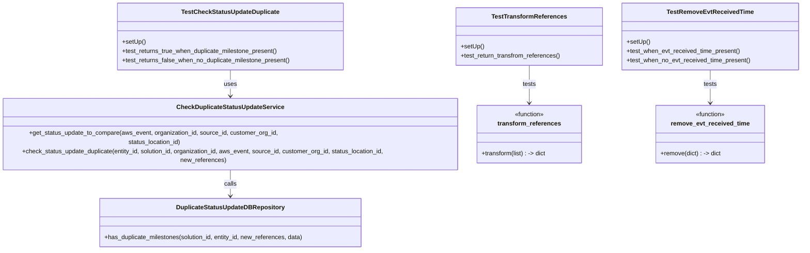
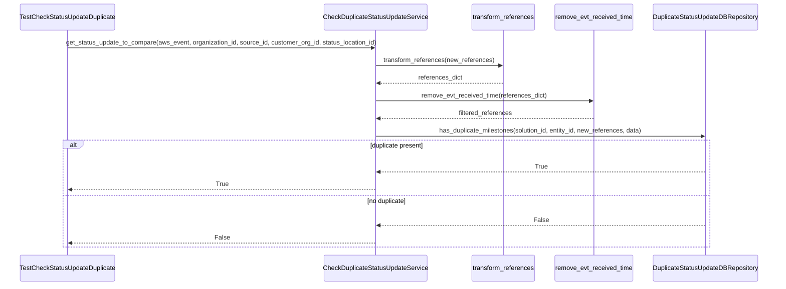

# Diagram: entity_core/entity_service/entity_service_tests/add_status_update_tests/test_status_update_duplicate.py

> Auto-generated by Obscura crawlers

## Diagram 1

### SVG

<svg id="container" width="2128.70703125" xmlns="http://www.w3.org/2000/svg" class="classDiagram" height="614" viewBox="0 0 2128.70703125 614" role="graphics-document document" aria-roledescription="class"><g><defs><marker id="container_class-aggregationStart" class="marker aggregation class" refX="18" refY="7" markerWidth="190" markerHeight="240" orient="auto"><path d="M 18,7 L9,13 L1,7 L9,1 Z"></path></marker></defs><defs><marker id="container_class-aggregationEnd" class="marker aggregation class" refX="1" refY="7" markerWidth="20" markerHeight="28" orient="auto"><path d="M 18,7 L9,13 L1,7 L9,1 Z"></path></marker></defs><defs><marker id="container_class-extensionStart" class="marker extension class" refX="18" refY="7" markerWidth="190" markerHeight="240" orient="auto"><path d="M 1,7 L18,13 V 1 Z"></path></marker></defs><defs><marker id="container_class-extensionEnd" class="marker extension class" refX="1" refY="7" markerWidth="20" markerHeight="28" orient="auto"><path d="M 1,1 V 13 L18,7 Z"></path></marker></defs><defs><marker id="container_class-compositionStart" class="marker composition class" refX="18" refY="7" markerWidth="190" markerHeight="240" orient="auto"><path d="M 18,7 L9,13 L1,7 L9,1 Z"></path></marker></defs><defs><marker id="container_class-compositionEnd" class="marker composition class" refX="1" refY="7" markerWidth="20" markerHeight="28" orient="auto"><path d="M 18,7 L9,13 L1,7 L9,1 Z"></path></marker></defs><defs><marker id="container_class-dependencyStart" class="marker dependency class" refX="6" refY="7" markerWidth="190" markerHeight="240" orient="auto"><path d="M 5,7 L9,13 L1,7 L9,1 Z"></path></marker></defs><defs><marker id="container_class-dependencyEnd" class="marker dependency class" refX="13" refY="7" markerWidth="20" markerHeight="28" orient="auto"><path d="M 18,7 L9,13 L14,7 L9,1 Z"></path></marker></defs><defs><marker id="container_class-lollipopStart" class="marker lollipop class" refX="13" refY="7" markerWidth="190" markerHeight="240" orient="auto"><circle stroke="black" fill="transparent" cx="7" cy="7" r="6"></circle></marker></defs><defs><marker id="container_class-lollipopEnd" class="marker lollipop class" refX="1" refY="7" markerWidth="190" markerHeight="240" orient="auto"><circle stroke="black" fill="transparent" cx="7" cy="7" r="6"></circle></marker></defs><g class="root"><g class="clusters"></g><g class="edgePaths"><path d="M624.559,182L624.559,188.167C624.559,194.333,624.559,206.667,624.559,218C624.559,229.333,624.559,239.667,624.559,244.833L624.559,250" id="id_TestCheckStatusUpdateDuplicate_CheckDuplicateStatusUpdateService_1" class="edge-thickness-normal edge-pattern-solid relation" style=";;;" data-edge="true" data-et="edge" data-id="id_TestCheckStatusUpdateDuplicate_CheckDuplicateStatusUpdateService_1" data-points="W3sieCI6NjI0LjU1ODU5Mzc1LCJ5IjoxODJ9LHsieCI6NjI0LjU1ODU5Mzc1LCJ5IjoyMTl9LHsieCI6NjI0LjU1ODU5Mzc1LCJ5IjoyNTZ9XQ==" marker-end="url(#container_class-dependencyEnd)"></path><path d="M624.559,406L624.559,412.167C624.559,418.333,624.559,430.667,624.559,442C624.559,453.333,624.559,463.667,624.559,468.833L624.559,474" id="id_CheckDuplicateStatusUpdateService_DuplicateStatusUpdateDBRepository_2" class="edge-thickness-normal edge-pattern-solid relation" style=";;;" data-edge="true" data-et="edge" data-id="id_CheckDuplicateStatusUpdateService_DuplicateStatusUpdateDBRepository_2" data-points="W3sieCI6NjI0LjU1ODU5Mzc1LCJ5Ijo0MDZ9LHsieCI6NjI0LjU1ODU5Mzc1LCJ5Ijo0NDN9LHsieCI6NjI0LjU1ODU5Mzc1LCJ5Ijo0ODB9XQ==" marker-end="url(#container_class-dependencyEnd)"></path><path d="M1427.906,170L1427.906,178.167C1427.906,186.333,1427.906,202.667,1427.906,216C1427.906,229.333,1427.906,239.667,1427.906,244.833L1427.906,250" id="id_TestTransformReferences_transform_references_3" class="edge-thickness-normal edge-pattern-solid relation" style=";;;" data-edge="true" data-et="edge" data-id="id_TestTransformReferences_transform_references_3" data-points="W3sieCI6MTQyNy45MDYyNSwieSI6MTcwfSx7IngiOjE0MjcuOTA2MjUsInkiOjIxOX0seyJ4IjoxNDI3LjkwNjI1LCJ5IjoyNTZ9XQ==" marker-end="url(#container_class-dependencyEnd)"></path><path d="M1894.078,182L1894.078,188.167C1894.078,194.333,1894.078,206.667,1894.078,218C1894.078,229.333,1894.078,239.667,1894.078,244.833L1894.078,250" id="id_TestRemoveEvtReceivedTime_remove_evt_received_time_4" class="edge-thickness-normal edge-pattern-solid relation" style=";;;" data-edge="true" data-et="edge" data-id="id_TestRemoveEvtReceivedTime_remove_evt_received_time_4" data-points="W3sieCI6MTg5NC4wNzgxMjUsInkiOjE4Mn0seyJ4IjoxODk0LjA3ODEyNSwieSI6MjE5fSx7IngiOjE4OTQuMDc4MTI1LCJ5IjoyNTZ9XQ==" marker-end="url(#container_class-dependencyEnd)"></path></g><g class="edgeLabels"><g class="edgeLabel" transform="translate(624.55859375, 219)"><g class="label" data-id="id_TestCheckStatusUpdateDuplicate_CheckDuplicateStatusUpdateService_1" transform="translate(-16.4921875, -12)"><foreignObject width="32.984375" height="24">

uses

</foreignObject></g></g><g class="edgeLabel" transform="translate(624.55859375, 443)"><g class="label" data-id="id_CheckDuplicateStatusUpdateService_DuplicateStatusUpdateDBRepository_2" transform="translate(-16.4453125, -12)"><foreignObject width="32.890625" height="24">

calls

</foreignObject></g></g><g class="edgeLabel" transform="translate(1427.90625, 219)"><g class="label" data-id="id_TestTransformReferences_transform_references_3" transform="translate(-17.4921875, -12)"><foreignObject width="34.984375" height="24">

tests

</foreignObject></g></g><g class="edgeLabel" transform="translate(1894.078125, 219)"><g class="label" data-id="id_TestRemoveEvtReceivedTime_remove_evt_received_time_4" transform="translate(-17.4921875, -12)"><foreignObject width="34.984375" height="24">

tests

</foreignObject></g></g></g><g class="nodes"><g class="node default" id="classId-TestCheckStatusUpdateDuplicate-0" transform="translate(624.55859375, 95)"><g class="basic label-container"><path d="M-293.5703125 -87 L293.5703125 -87 L293.5703125 87 L-293.5703125 87" stroke="none" stroke-width="0" fill="#ECECFF" style=""></path><path d="M-293.5703125 -87 C-157.52462960908665 -87, -21.47894671817329 -87, 293.5703125 -87 M-293.5703125 -87 C-97.59835496655802 -87, 98.37360256688396 -87, 293.5703125 -87 M293.5703125 -87 C293.5703125 -32.038311601152245, 293.5703125 22.92337679769551, 293.5703125 87 M293.5703125 -87 C293.5703125 -33.92789044778734, 293.5703125 19.144219104425318, 293.5703125 87 M293.5703125 87 C62.37963205243432 87, -168.81104839513137 87, -293.5703125 87 M293.5703125 87 C64.4959570718527 87, -164.5783983562946 87, -293.5703125 87 M-293.5703125 87 C-293.5703125 23.38200118710192, -293.5703125 -40.23599762579616, -293.5703125 -87 M-293.5703125 87 C-293.5703125 42.14224067110963, -293.5703125 -2.715518657780734, -293.5703125 -87" stroke="#9370DB" stroke-width="1.3" fill="none" stroke-dasharray="0 0" style=""></path></g><g class="annotation-group text" transform="translate(0, -63)"></g><g class="label-group text" transform="translate(-121.75, -63)"><g class="label" style="font-weight: bolder" transform="translate(0,-12)"><foreignObject width="243.5" height="24">

TestCheckStatusUpdateDuplicate

</foreignObject></g></g><g class="members-group text" transform="translate(-281.5703125, -15)"></g><g class="methods-group text" transform="translate(-281.5703125, 15)"><g class="label" style="" transform="translate(0,-12)"><foreignObject width="60.421875" height="24">

+setUp()

</foreignObject></g><g class="label" style="" transform="translate(0,12)"><foreignObject width="410.21875" height="24">

+test_returns_true_when_duplicate_milestone_present()

</foreignObject></g><g class="label" style="" transform="translate(0,36)"><foreignObject width="441.390625" height="24">

+test_returns_false_when_no_duplicate_milestone_present()

</foreignObject></g></g><g class="divider" style=""><path d="M-293.5703125 -39 C-107.99132544484786 -39, 77.58766161030428 -39, 293.5703125 -39 M-293.5703125 -39 C-102.09171699521175 -39, 89.38687850957649 -39, 293.5703125 -39" stroke="#9370DB" stroke-width="1.3" fill="none" stroke-dasharray="0 0" style=""></path></g><g class="divider" style=""><path d="M-293.5703125 -15 C-159.7584905476972 -15, -25.946668595394385 -15, 293.5703125 -15 M-293.5703125 -15 C-148.61754523650362 -15, -3.664777973007233 -15, 293.5703125 -15" stroke="#9370DB" stroke-width="1.3" fill="none" stroke-dasharray="0 0" style=""></path></g></g><g class="node default" id="classId-TestRemoveEvtReceivedTime-1" transform="translate(1894.078125, 95)"><g class="basic label-container"><path d="M-226.62890625 -87 L226.62890625 -87 L226.62890625 87 L-226.62890625 87" stroke="none" stroke-width="0" fill="#ECECFF" style=""></path><path d="M-226.62890625 -87 C-103.1237184619273 -87, 20.381469326145407 -87, 226.62890625 -87 M-226.62890625 -87 C-78.80659396858371 -87, 69.01571831283258 -87, 226.62890625 -87 M226.62890625 -87 C226.62890625 -47.86197096443077, 226.62890625 -8.723941928861535, 226.62890625 87 M226.62890625 -87 C226.62890625 -49.10050266414279, 226.62890625 -11.201005328285575, 226.62890625 87 M226.62890625 87 C74.00331029230594 87, -78.62228566538812 87, -226.62890625 87 M226.62890625 87 C133.18119789913294 87, 39.73348954826588 87, -226.62890625 87 M-226.62890625 87 C-226.62890625 32.93225658590752, -226.62890625 -21.135486828184966, -226.62890625 -87 M-226.62890625 87 C-226.62890625 32.823999239793224, -226.62890625 -21.352001520413552, -226.62890625 -87" stroke="#9370DB" stroke-width="1.3" fill="none" stroke-dasharray="0 0" style=""></path></g><g class="annotation-group text" transform="translate(0, -63)"></g><g class="label-group text" transform="translate(-106.1328125, -63)"><g class="label" style="font-weight: bolder" transform="translate(0,-12)"><foreignObject width="212.265625" height="24">

TestRemoveEvtReceivedTime

</foreignObject></g></g><g class="members-group text" transform="translate(-214.62890625, -15)"></g><g class="methods-group text" transform="translate(-214.62890625, 15)"><g class="label" style="" transform="translate(0,-12)"><foreignObject width="60.421875" height="24">

+setUp()

</foreignObject></g><g class="label" style="" transform="translate(0,12)"><foreignObject width="296.40625" height="24">

+test_when_evt_received_time_present()

</foreignObject></g><g class="label" style="" transform="translate(0,36)"><foreignObject width="323.125" height="24">

+test_when_no_evt_received_time_present()

</foreignObject></g></g><g class="divider" style=""><path d="M-226.62890625 -39 C-48.174240215605295 -39, 130.2804258187894 -39, 226.62890625 -39 M-226.62890625 -39 C-113.30533488870233 -39, 0.018236472595333453 -39, 226.62890625 -39" stroke="#9370DB" stroke-width="1.3" fill="none" stroke-dasharray="0 0" style=""></path></g><g class="divider" style=""><path d="M-226.62890625 -15 C-72.72631930741537 -15, 81.17626763516927 -15, 226.62890625 -15 M-226.62890625 -15 C-54.22191185811579 -15, 118.18508253376842 -15, 226.62890625 -15" stroke="#9370DB" stroke-width="1.3" fill="none" stroke-dasharray="0 0" style=""></path></g></g><g class="node default" id="classId-TestTransformReferences-2" transform="translate(1427.90625, 95)"><g class="basic label-container"><path d="M-189.54296875 -75 L189.54296875 -75 L189.54296875 75 L-189.54296875 75" stroke="none" stroke-width="0" fill="#ECECFF" style=""></path><path d="M-189.54296875 -75 C-50.962059163054505 -75, 87.61885042389099 -75, 189.54296875 -75 M-189.54296875 -75 C-100.25340932211714 -75, -10.963849894234272 -75, 189.54296875 -75 M189.54296875 -75 C189.54296875 -18.90007748380819, 189.54296875 37.19984503238362, 189.54296875 75 M189.54296875 -75 C189.54296875 -26.903338276868112, 189.54296875 21.193323446263776, 189.54296875 75 M189.54296875 75 C83.66117153599971 75, -22.220625678000573 75, -189.54296875 75 M189.54296875 75 C68.7312115194019 75, -52.08054571119621 75, -189.54296875 75 M-189.54296875 75 C-189.54296875 42.61560097744826, -189.54296875 10.23120195489652, -189.54296875 -75 M-189.54296875 75 C-189.54296875 36.681063068782095, -189.54296875 -1.6378738624358107, -189.54296875 -75" stroke="#9370DB" stroke-width="1.3" fill="none" stroke-dasharray="0 0" style=""></path></g><g class="annotation-group text" transform="translate(0, -51)"></g><g class="label-group text" transform="translate(-92.8984375, -51)"><g class="label" style="font-weight: bolder" transform="translate(0,-12)"><foreignObject width="185.796875" height="24">

TestTransformReferences

</foreignObject></g></g><g class="members-group text" transform="translate(-177.54296875, -3)"></g><g class="methods-group text" transform="translate(-177.54296875, 27)"><g class="label" style="" transform="translate(0,-12)"><foreignObject width="60.421875" height="24">

+setUp()

</foreignObject></g><g class="label" style="" transform="translate(0,12)"><foreignObject width="262.1875" height="24">

+test_return_transfrom_references()

</foreignObject></g></g><g class="divider" style=""><path d="M-189.54296875 -27 C-69.39725324186563 -27, 50.748462266268746 -27, 189.54296875 -27 M-189.54296875 -27 C-52.02712487293104 -27, 85.48871900413792 -27, 189.54296875 -27" stroke="#9370DB" stroke-width="1.3" fill="none" stroke-dasharray="0 0" style=""></path></g><g class="divider" style=""><path d="M-189.54296875 -3 C-38.89067398821447 -3, 111.76162077357105 -3, 189.54296875 -3 M-189.54296875 -3 C-57.02566755546866 -3, 75.49163363906268 -3, 189.54296875 -3" stroke="#9370DB" stroke-width="1.3" fill="none" stroke-dasharray="0 0" style=""></path></g></g><g class="node default" id="classId-CheckDuplicateStatusUpdateService-3" transform="translate(624.55859375, 331)"><g class="basic label-container"><path d="M-616.55859375 -75 L616.55859375 -75 L616.55859375 75 L-616.55859375 75" stroke="none" stroke-width="0" fill="#ECECFF" style=""></path><path d="M-616.55859375 -75 C-125.6658813960562 -75, 365.2268309578876 -75, 616.55859375 -75 M-616.55859375 -75 C-356.70054899134107 -75, -96.84250423268213 -75, 616.55859375 -75 M616.55859375 -75 C616.55859375 -35.8824774911864, 616.55859375 3.2350450176272005, 616.55859375 75 M616.55859375 -75 C616.55859375 -20.85895664494386, 616.55859375 33.28208671011228, 616.55859375 75 M616.55859375 75 C239.5204741240368 75, -137.51764550192638 75, -616.55859375 75 M616.55859375 75 C197.53168900315944 75, -221.49521574368111 75, -616.55859375 75 M-616.55859375 75 C-616.55859375 34.67824624724684, -616.55859375 -5.643507505506321, -616.55859375 -75 M-616.55859375 75 C-616.55859375 15.196030390624614, -616.55859375 -44.60793921875077, -616.55859375 -75" stroke="#9370DB" stroke-width="1.3" fill="none" stroke-dasharray="0 0" style=""></path></g><g class="annotation-group text" transform="translate(0, -51)"></g><g class="label-group text" transform="translate(-133.1484375, -51)"><g class="label" style="font-weight: bolder" transform="translate(0,-12)"><foreignObject width="266.296875" height="24">

CheckDuplicateStatusUpdateService

</foreignObject></g></g><g class="members-group text" transform="translate(-604.55859375, -3)"></g><g class="methods-group text" transform="translate(-604.55859375, 27)"><g class="label" style="" transform="translate(0,-12)"><foreignObject width="790.765625" height="24">

+get_status_update_to_compare(aws_event, organization_id, source_id, customer_org_id, status_location_id)

</foreignObject></g><g class="label" style="" transform="translate(0,12)"><foreignObject width="1075.96875" height="24">

+check_status_update_duplicate(entity_id, solution_id, organization_id, aws_event, source_id, customer_org_id, status_location_id, new_references)

</foreignObject></g></g><g class="divider" style=""><path d="M-616.55859375 -27 C-143.8475487136683 -27, 328.8634963226634 -27, 616.55859375 -27 M-616.55859375 -27 C-287.89077867317854 -27, 40.77703640364291 -27, 616.55859375 -27" stroke="#9370DB" stroke-width="1.3" fill="none" stroke-dasharray="0 0" style=""></path></g><g class="divider" style=""><path d="M-616.55859375 -3 C-318.2532539087524 -3, -19.947914067504826 -3, 616.55859375 -3 M-616.55859375 -3 C-279.5051112678706 -3, 57.54837121425885 -3, 616.55859375 -3" stroke="#9370DB" stroke-width="1.3" fill="none" stroke-dasharray="0 0" style=""></path></g></g><g class="node default" id="classId-DuplicateStatusUpdateDBRepository-4" transform="translate(624.55859375, 543)"><g class="basic label-container"><path d="M-340.8671875 -63 L340.8671875 -63 L340.8671875 63 L-340.8671875 63" stroke="none" stroke-width="0" fill="#ECECFF" style=""></path><path d="M-340.8671875 -63 C-180.3758220155393 -63, -19.884456531078627 -63, 340.8671875 -63 M-340.8671875 -63 C-179.63769216375712 -63, -18.408196827514246 -63, 340.8671875 -63 M340.8671875 -63 C340.8671875 -36.34398256000719, 340.8671875 -9.687965120014375, 340.8671875 63 M340.8671875 -63 C340.8671875 -16.22438920365724, 340.8671875 30.551221592685522, 340.8671875 63 M340.8671875 63 C146.12568485006457 63, -48.615817799870854 63, -340.8671875 63 M340.8671875 63 C124.04227768767998 63, -92.78263212464003 63, -340.8671875 63 M-340.8671875 63 C-340.8671875 33.716131600727465, -340.8671875 4.43226320145493, -340.8671875 -63 M-340.8671875 63 C-340.8671875 19.713999626694395, -340.8671875 -23.57200074661121, -340.8671875 -63" stroke="#9370DB" stroke-width="1.3" fill="none" stroke-dasharray="0 0" style=""></path></g><g class="annotation-group text" transform="translate(0, -39)"></g><g class="label-group text" transform="translate(-134.609375, -39)"><g class="label" style="font-weight: bolder" transform="translate(0,-12)"><foreignObject width="269.21875" height="24">

DuplicateStatusUpdateDBRepository

</foreignObject></g></g><g class="members-group text" transform="translate(-328.8671875, 9)"></g><g class="methods-group text" transform="translate(-328.8671875, 39)"><g class="label" style="" transform="translate(0,-12)"><foreignObject width="523.125" height="24">

+has_duplicate_milestones(solution_id, entity_id, new_references, data)

</foreignObject></g></g><g class="divider" style=""><path d="M-340.8671875 -15 C-117.62498746902673 -15, 105.61721256194653 -15, 340.8671875 -15 M-340.8671875 -15 C-92.55093563615742 -15, 155.76531622768516 -15, 340.8671875 -15" stroke="#9370DB" stroke-width="1.3" fill="none" stroke-dasharray="0 0" style=""></path></g><g class="divider" style=""><path d="M-340.8671875 9 C-194.38550621669725 9, -47.9038249333945 9, 340.8671875 9 M-340.8671875 9 C-84.82964891840993 9, 171.20788966318014 9, 340.8671875 9" stroke="#9370DB" stroke-width="1.3" fill="none" stroke-dasharray="0 0" style=""></path></g></g><g class="node default" id="classId-transform_references-5" transform="translate(1427.90625, 331)"><g class="basic label-container"><path d="M-136.7890625 -75 L136.7890625 -75 L136.7890625 75 L-136.7890625 75" stroke="none" stroke-width="0" fill="#ECECFF" style=""></path><path d="M-136.7890625 -75 C-55.365192084252726 -75, 26.058678331494548 -75, 136.7890625 -75 M-136.7890625 -75 C-56.73614401260315 -75, 23.316774474793704 -75, 136.7890625 -75 M136.7890625 -75 C136.7890625 -38.210603006437, 136.7890625 -1.421206012873995, 136.7890625 75 M136.7890625 -75 C136.7890625 -39.526632832383726, 136.7890625 -4.053265664767451, 136.7890625 75 M136.7890625 75 C48.652561955993036 75, -39.48393858801393 75, -136.7890625 75 M136.7890625 75 C31.10246480551055 75, -74.5841328889789 75, -136.7890625 75 M-136.7890625 75 C-136.7890625 17.94895119583562, -136.7890625 -39.10209760832876, -136.7890625 -75 M-136.7890625 75 C-136.7890625 43.910970409875766, -136.7890625 12.821940819751532, -136.7890625 -75" stroke="#9370DB" stroke-width="1.3" fill="none" stroke-dasharray="0 0" style=""></path></g><g class="annotation-group text" transform="translate(-39.484375, -51)"><g class="label" style="" transform="translate(0,-12)"><foreignObject width="78.96875" height="24">

«function»

</foreignObject></g></g><g class="label-group text" transform="translate(-78.96875, -27)"><g class="label" style="font-weight: bolder" transform="translate(0,-12)"><foreignObject width="157.9375" height="24">

transform_references

</foreignObject></g></g><g class="members-group text" transform="translate(-124.7890625, 21)"></g><g class="methods-group text" transform="translate(-124.7890625, 51)"><g class="label" style="" transform="translate(0,-12)"><foreignObject width="170.609375" height="24">

+transform(list) : -&gt; dict

</foreignObject></g></g><g class="divider" style=""><path d="M-136.7890625 -3 C-57.010288556286994 -3, 22.76848538742601 -3, 136.7890625 -3 M-136.7890625 -3 C-58.565411763472696 -3, 19.65823897305461 -3, 136.7890625 -3" stroke="#9370DB" stroke-width="1.3" fill="none" stroke-dasharray="0 0" style=""></path></g><g class="divider" style=""><path d="M-136.7890625 21 C-65.6430052363522 21, 5.50305202729561 21, 136.7890625 21 M-136.7890625 21 C-63.674050335784514 21, 9.440961828430972 21, 136.7890625 21" stroke="#9370DB" stroke-width="1.3" fill="none" stroke-dasharray="0 0" style=""></path></g></g><g class="node default" id="classId-remove_evt_received_time-6" transform="translate(1894.078125, 331)"><g class="basic label-container"><path d="M-140.28515625 -75 L140.28515625 -75 L140.28515625 75 L-140.28515625 75" stroke="none" stroke-width="0" fill="#ECECFF" style=""></path><path d="M-140.28515625 -75 C-49.79228128507387 -75, 40.70059367985226 -75, 140.28515625 -75 M-140.28515625 -75 C-63.78573084247829 -75, 12.713694565043426 -75, 140.28515625 -75 M140.28515625 -75 C140.28515625 -25.53347076803429, 140.28515625 23.933058463931417, 140.28515625 75 M140.28515625 -75 C140.28515625 -43.52187457737388, 140.28515625 -12.043749154747758, 140.28515625 75 M140.28515625 75 C71.81538601708066 75, 3.3456157841613106 75, -140.28515625 75 M140.28515625 75 C40.630902351147924 75, -59.02335154770415 75, -140.28515625 75 M-140.28515625 75 C-140.28515625 37.59181876746458, -140.28515625 0.18363753492916146, -140.28515625 -75 M-140.28515625 75 C-140.28515625 43.391080029415676, -140.28515625 11.782160058831359, -140.28515625 -75" stroke="#9370DB" stroke-width="1.3" fill="none" stroke-dasharray="0 0" style=""></path></g><g class="annotation-group text" transform="translate(-39.484375, -51)"><g class="label" style="" transform="translate(0,-12)"><foreignObject width="78.96875" height="24">

«function»

</foreignObject></g></g><g class="label-group text" transform="translate(-98.2578125, -27)"><g class="label" style="font-weight: bolder" transform="translate(0,-12)"><foreignObject width="196.515625" height="24">

remove_evt_received_time

</foreignObject></g></g><g class="members-group text" transform="translate(-128.28515625, 21)"></g><g class="methods-group text" transform="translate(-128.28515625, 51)"><g class="label" style="" transform="translate(0,-12)"><foreignObject width="158.3125" height="24">

+remove(dict) : -&gt; dict

</foreignObject></g></g><g class="divider" style=""><path d="M-140.28515625 -3 C-51.277883696319066 -3, 37.72938885736187 -3, 140.28515625 -3 M-140.28515625 -3 C-77.83159594553217 -3, -15.378035641064344 -3, 140.28515625 -3" stroke="#9370DB" stroke-width="1.3" fill="none" stroke-dasharray="0 0" style=""></path></g><g class="divider" style=""><path d="M-140.28515625 21 C-79.42075168369823 21, -18.55634711739644 21, 140.28515625 21 M-140.28515625 21 C-29.559958868593043 21, 81.16523851281391 21, 140.28515625 21" stroke="#9370DB" stroke-width="1.3" fill="none" stroke-dasharray="0 0" style=""></path></g></g></g></g></g></svg>

## Diagram 2

### SVG

<svg id="container" width="2118" xmlns="http://www.w3.org/2000/svg" height="751" viewBox="-50 -10 2118 751" role="graphics-document document" aria-roledescription="sequence"><g><rect x="1733" y="665" fill="#eaeaea" stroke="#666" width="285" height="65" name="Repo" rx="3" ry="3" class="actor actor-bottom"></rect><text x="1875.5" y="697.5" dominant-baseline="central" alignment-baseline="central" class="actor actor-box" style="text-anchor: middle; font-size: 16px; font-weight: 400;"><tspan x="1875.5" dy="0">DuplicateStatusUpdateDBRepository</tspan></text></g><g><rect x="1469" y="665" fill="#eaeaea" stroke="#666" width="214" height="65" name="Remove" rx="3" ry="3" class="actor actor-bottom"></rect><text x="1576" y="697.5" dominant-baseline="central" alignment-baseline="central" class="actor actor-box" style="text-anchor: middle; font-size: 16px; font-weight: 400;"><tspan x="1576" dy="0">remove_evt_received_time</tspan></text></g><g><rect x="1244" y="665" fill="#eaeaea" stroke="#666" width="175" height="65" name="Transform" rx="3" ry="3" class="actor actor-bottom"></rect><text x="1331.5" y="697.5" dominant-baseline="central" alignment-baseline="central" class="actor actor-box" style="text-anchor: middle; font-size: 16px; font-weight: 400;"><tspan x="1331.5" dy="0">transform_references</tspan></text></g><g><rect x="841.5" y="665" fill="#eaeaea" stroke="#666" width="282" height="65" name="Service" rx="3" ry="3" class="actor actor-bottom"></rect><text x="982.5" y="697.5" dominant-baseline="central" alignment-baseline="central" class="actor actor-box" style="text-anchor: middle; font-size: 16px; font-weight: 400;"><tspan x="982.5" dy="0">CheckDuplicateStatusUpdateService</tspan></text></g><g><rect x="0" y="665" fill="#eaeaea" stroke="#666" width="259" height="65" name="Test" rx="3" ry="3" class="actor actor-bottom"></rect><text x="129.5" y="697.5" dominant-baseline="central" alignment-baseline="central" class="actor actor-box" style="text-anchor: middle; font-size: 16px; font-weight: 400;"><tspan x="129.5" dy="0">TestCheckStatusUpdateDuplicate</tspan></text></g><g><line id="actor4" x1="1875.5" y1="65" x2="1875.5" y2="665" class="actor-line 200" stroke-width="0.5px" stroke="#999" name="Repo"></line><g id="root-4"><rect x="1733" y="0" fill="#eaeaea" stroke="#666" width="285" height="65" name="Repo" rx="3" ry="3" class="actor actor-top"></rect><text x="1875.5" y="32.5" dominant-baseline="central" alignment-baseline="central" class="actor actor-box" style="text-anchor: middle; font-size: 16px; font-weight: 400;"><tspan x="1875.5" dy="0">DuplicateStatusUpdateDBRepository</tspan></text></g></g><g><line id="actor3" x1="1576" y1="65" x2="1576" y2="665" class="actor-line 200" stroke-width="0.5px" stroke="#999" name="Remove"></line><g id="root-3"><rect x="1469" y="0" fill="#eaeaea" stroke="#666" width="214" height="65" name="Remove" rx="3" ry="3" class="actor actor-top"></rect><text x="1576" y="32.5" dominant-baseline="central" alignment-baseline="central" class="actor actor-box" style="text-anchor: middle; font-size: 16px; font-weight: 400;"><tspan x="1576" dy="0">remove_evt_received_time</tspan></text></g></g><g><line id="actor2" x1="1331.5" y1="65" x2="1331.5" y2="665" class="actor-line 200" stroke-width="0.5px" stroke="#999" name="Transform"></line><g id="root-2"><rect x="1244" y="0" fill="#eaeaea" stroke="#666" width="175" height="65" name="Transform" rx="3" ry="3" class="actor actor-top"></rect><text x="1331.5" y="32.5" dominant-baseline="central" alignment-baseline="central" class="actor actor-box" style="text-anchor: middle; font-size: 16px; font-weight: 400;"><tspan x="1331.5" dy="0">transform_references</tspan></text></g></g><g><line id="actor1" x1="982.5" y1="65" x2="982.5" y2="665" class="actor-line 200" stroke-width="0.5px" stroke="#999" name="Service"></line><g id="root-1"><rect x="841.5" y="0" fill="#eaeaea" stroke="#666" width="282" height="65" name="Service" rx="3" ry="3" class="actor actor-top"></rect><text x="982.5" y="32.5" dominant-baseline="central" alignment-baseline="central" class="actor actor-box" style="text-anchor: middle; font-size: 16px; font-weight: 400;"><tspan x="982.5" dy="0">CheckDuplicateStatusUpdateService</tspan></text></g></g><g><line id="actor0" x1="129.5" y1="65" x2="129.5" y2="665" class="actor-line 200" stroke-width="0.5px" stroke="#999" name="Test"></line><g id="root-0"><rect x="0" y="0" fill="#eaeaea" stroke="#666" width="259" height="65" name="Test" rx="3" ry="3" class="actor actor-top"></rect><text x="129.5" y="32.5" dominant-baseline="central" alignment-baseline="central" class="actor actor-box" style="text-anchor: middle; font-size: 16px; font-weight: 400;"><tspan x="129.5" dy="0">TestCheckStatusUpdateDuplicate</tspan></text></g></g><g></g><defs><symbol id="computer" width="24" height="24"><path transform="scale(.5)" d="M2 2v13h20v-13h-20zm18 11h-16v-9h16v9zm-10.228 6l.466-1h3.524l.467 1h-4.457zm14.228 3h-24l2-6h2.104l-1.33 4h18.45l-1.297-4h2.073l2 6zm-5-10h-14v-7h14v7z"></path></symbol></defs><defs><symbol id="database" fill-rule="evenodd" clip-rule="evenodd"><path transform="scale(.5)" d="M12.258.001l.256.004.255.005.253.008.251.01.249.012.247.015.246.016.242.019.241.02.239.023.236.024.233.027.231.028.229.031.225.032.223.034.22.036.217.038.214.04.211.041.208.043.205.045.201.046.198.048.194.05.191.051.187.053.183.054.18.056.175.057.172.059.168.06.163.061.16.063.155.064.15.066.074.033.073.033.071.034.07.034.069.035.068.035.067.035.066.035.064.036.064.036.062.036.06.036.06.037.058.037.058.037.055.038.055.038.053.038.052.038.051.039.05.039.048.039.047.039.045.04.044.04.043.04.041.04.04.041.039.041.037.041.036.041.034.041.033.042.032.042.03.042.029.042.027.042.026.043.024.043.023.043.021.043.02.043.018.044.017.043.015.044.013.044.012.044.011.045.009.044.007.045.006.045.004.045.002.045.001.045v17l-.001.045-.002.045-.004.045-.006.045-.007.045-.009.044-.011.045-.012.044-.013.044-.015.044-.017.043-.018.044-.02.043-.021.043-.023.043-.024.043-.026.043-.027.042-.029.042-.03.042-.032.042-.033.042-.034.041-.036.041-.037.041-.039.041-.04.041-.041.04-.043.04-.044.04-.045.04-.047.039-.048.039-.05.039-.051.039-.052.038-.053.038-.055.038-.055.038-.058.037-.058.037-.06.037-.06.036-.062.036-.064.036-.064.036-.066.035-.067.035-.068.035-.069.035-.07.034-.071.034-.073.033-.074.033-.15.066-.155.064-.16.063-.163.061-.168.06-.172.059-.175.057-.18.056-.183.054-.187.053-.191.051-.194.05-.198.048-.201.046-.205.045-.208.043-.211.041-.214.04-.217.038-.22.036-.223.034-.225.032-.229.031-.231.028-.233.027-.236.024-.239.023-.241.02-.242.019-.246.016-.247.015-.249.012-.251.01-.253.008-.255.005-.256.004-.258.001-.258-.001-.256-.004-.255-.005-.253-.008-.251-.01-.249-.012-.247-.015-.245-.016-.243-.019-.241-.02-.238-.023-.236-.024-.234-.027-.231-.028-.228-.031-.226-.032-.223-.034-.22-.036-.217-.038-.214-.04-.211-.041-.208-.043-.204-.045-.201-.046-.198-.048-.195-.05-.19-.051-.187-.053-.184-.054-.179-.056-.176-.057-.172-.059-.167-.06-.164-.061-.159-.063-.155-.064-.151-.066-.074-.033-.072-.033-.072-.034-.07-.034-.069-.035-.068-.035-.067-.035-.066-.035-.064-.036-.063-.036-.062-.036-.061-.036-.06-.037-.058-.037-.057-.037-.056-.038-.055-.038-.053-.038-.052-.038-.051-.039-.049-.039-.049-.039-.046-.039-.046-.04-.044-.04-.043-.04-.041-.04-.04-.041-.039-.041-.037-.041-.036-.041-.034-.041-.033-.042-.032-.042-.03-.042-.029-.042-.027-.042-.026-.043-.024-.043-.023-.043-.021-.043-.02-.043-.018-.044-.017-.043-.015-.044-.013-.044-.012-.044-.011-.045-.009-.044-.007-.045-.006-.045-.004-.045-.002-.045-.001-.045v-17l.001-.045.002-.045.004-.045.006-.045.007-.045.009-.044.011-.045.012-.044.013-.044.015-.044.017-.043.018-.044.02-.043.021-.043.023-.043.024-.043.026-.043.027-.042.029-.042.03-.042.032-.042.033-.042.034-.041.036-.041.037-.041.039-.041.04-.041.041-.04.043-.04.044-.04.046-.04.046-.039.049-.039.049-.039.051-.039.052-.038.053-.038.055-.038.056-.038.057-.037.058-.037.06-.037.061-.036.062-.036.063-.036.064-.036.066-.035.067-.035.068-.035.069-.035.07-.034.072-.034.072-.033.074-.033.151-.066.155-.064.159-.063.164-.061.167-.06.172-.059.176-.057.179-.056.184-.054.187-.053.19-.051.195-.05.198-.048.201-.046.204-.045.208-.043.211-.041.214-.04.217-.038.22-.036.223-.034.226-.032.228-.031.231-.028.234-.027.236-.024.238-.023.241-.02.243-.019.245-.016.247-.015.249-.012.251-.01.253-.008.255-.005.256-.004.258-.001.258.001zm-9.258 20.499v.01l.001.021.003.021.004.022.005.021.006.022.007.022.009.023.01.022.011.023.012.023.013.023.015.023.016.024.017.023.018.024.019.024.021.024.022.025.023.024.024.025.052.049.056.05.061.051.066.051.07.051.075.051.079.052.084.052.088.052.092.052.097.052.102.051.105.052.11.052.114.051.119.051.123.051.127.05.131.05.135.05.139.048.144.049.147.047.152.047.155.047.16.045.163.045.167.043.171.043.176.041.178.041.183.039.187.039.19.037.194.035.197.035.202.033.204.031.209.03.212.029.216.027.219.025.222.024.226.021.23.02.233.018.236.016.24.015.243.012.246.01.249.008.253.005.256.004.259.001.26-.001.257-.004.254-.005.25-.008.247-.011.244-.012.241-.014.237-.016.233-.018.231-.021.226-.021.224-.024.22-.026.216-.027.212-.028.21-.031.205-.031.202-.034.198-.034.194-.036.191-.037.187-.039.183-.04.179-.04.175-.042.172-.043.168-.044.163-.045.16-.046.155-.046.152-.047.148-.048.143-.049.139-.049.136-.05.131-.05.126-.05.123-.051.118-.052.114-.051.11-.052.106-.052.101-.052.096-.052.092-.052.088-.053.083-.051.079-.052.074-.052.07-.051.065-.051.06-.051.056-.05.051-.05.023-.024.023-.025.021-.024.02-.024.019-.024.018-.024.017-.024.015-.023.014-.024.013-.023.012-.023.01-.023.01-.022.008-.022.006-.022.006-.022.004-.022.004-.021.001-.021.001-.021v-4.127l-.077.055-.08.053-.083.054-.085.053-.087.052-.09.052-.093.051-.095.05-.097.05-.1.049-.102.049-.105.048-.106.047-.109.047-.111.046-.114.045-.115.045-.118.044-.12.043-.122.042-.124.042-.126.041-.128.04-.13.04-.132.038-.134.038-.135.037-.138.037-.139.035-.142.035-.143.034-.144.033-.147.032-.148.031-.15.03-.151.03-.153.029-.154.027-.156.027-.158.026-.159.025-.161.024-.162.023-.163.022-.165.021-.166.02-.167.019-.169.018-.169.017-.171.016-.173.015-.173.014-.175.013-.175.012-.177.011-.178.01-.179.008-.179.008-.181.006-.182.005-.182.004-.184.003-.184.002h-.37l-.184-.002-.184-.003-.182-.004-.182-.005-.181-.006-.179-.008-.179-.008-.178-.01-.176-.011-.176-.012-.175-.013-.173-.014-.172-.015-.171-.016-.17-.017-.169-.018-.167-.019-.166-.02-.165-.021-.163-.022-.162-.023-.161-.024-.159-.025-.157-.026-.156-.027-.155-.027-.153-.029-.151-.03-.15-.03-.148-.031-.146-.032-.145-.033-.143-.034-.141-.035-.14-.035-.137-.037-.136-.037-.134-.038-.132-.038-.13-.04-.128-.04-.126-.041-.124-.042-.122-.042-.12-.044-.117-.043-.116-.045-.113-.045-.112-.046-.109-.047-.106-.047-.105-.048-.102-.049-.1-.049-.097-.05-.095-.05-.093-.052-.09-.051-.087-.052-.085-.053-.083-.054-.08-.054-.077-.054v4.127zm0-5.654v.011l.001.021.003.021.004.021.005.022.006.022.007.022.009.022.01.022.011.023.012.023.013.023.015.024.016.023.017.024.018.024.019.024.021.024.022.024.023.025.024.024.052.05.056.05.061.05.066.051.07.051.075.052.079.051.084.052.088.052.092.052.097.052.102.052.105.052.11.051.114.051.119.052.123.05.127.051.131.05.135.049.139.049.144.048.147.048.152.047.155.046.16.045.163.045.167.044.171.042.176.042.178.04.183.04.187.038.19.037.194.036.197.034.202.033.204.032.209.03.212.028.216.027.219.025.222.024.226.022.23.02.233.018.236.016.24.014.243.012.246.01.249.008.253.006.256.003.259.001.26-.001.257-.003.254-.006.25-.008.247-.01.244-.012.241-.015.237-.016.233-.018.231-.02.226-.022.224-.024.22-.025.216-.027.212-.029.21-.03.205-.032.202-.033.198-.035.194-.036.191-.037.187-.039.183-.039.179-.041.175-.042.172-.043.168-.044.163-.045.16-.045.155-.047.152-.047.148-.048.143-.048.139-.05.136-.049.131-.05.126-.051.123-.051.118-.051.114-.052.11-.052.106-.052.101-.052.096-.052.092-.052.088-.052.083-.052.079-.052.074-.051.07-.052.065-.051.06-.05.056-.051.051-.049.023-.025.023-.024.021-.025.02-.024.019-.024.018-.024.017-.024.015-.023.014-.023.013-.024.012-.022.01-.023.01-.023.008-.022.006-.022.006-.022.004-.021.004-.022.001-.021.001-.021v-4.139l-.077.054-.08.054-.083.054-.085.052-.087.053-.09.051-.093.051-.095.051-.097.05-.1.049-.102.049-.105.048-.106.047-.109.047-.111.046-.114.045-.115.044-.118.044-.12.044-.122.042-.124.042-.126.041-.128.04-.13.039-.132.039-.134.038-.135.037-.138.036-.139.036-.142.035-.143.033-.144.033-.147.033-.148.031-.15.03-.151.03-.153.028-.154.028-.156.027-.158.026-.159.025-.161.024-.162.023-.163.022-.165.021-.166.02-.167.019-.169.018-.169.017-.171.016-.173.015-.173.014-.175.013-.175.012-.177.011-.178.009-.179.009-.179.007-.181.007-.182.005-.182.004-.184.003-.184.002h-.37l-.184-.002-.184-.003-.182-.004-.182-.005-.181-.007-.179-.007-.179-.009-.178-.009-.176-.011-.176-.012-.175-.013-.173-.014-.172-.015-.171-.016-.17-.017-.169-.018-.167-.019-.166-.02-.165-.021-.163-.022-.162-.023-.161-.024-.159-.025-.157-.026-.156-.027-.155-.028-.153-.028-.151-.03-.15-.03-.148-.031-.146-.033-.145-.033-.143-.033-.141-.035-.14-.036-.137-.036-.136-.037-.134-.038-.132-.039-.13-.039-.128-.04-.126-.041-.124-.042-.122-.043-.12-.043-.117-.044-.116-.044-.113-.046-.112-.046-.109-.046-.106-.047-.105-.048-.102-.049-.1-.049-.097-.05-.095-.051-.093-.051-.09-.051-.087-.053-.085-.052-.083-.054-.08-.054-.077-.054v4.139zm0-5.666v.011l.001.02.003.022.004.021.005.022.006.021.007.022.009.023.01.022.011.023.012.023.013.023.015.023.016.024.017.024.018.023.019.024.021.025.022.024.023.024.024.025.052.05.056.05.061.05.066.051.07.051.075.052.079.051.084.052.088.052.092.052.097.052.102.052.105.051.11.052.114.051.119.051.123.051.127.05.131.05.135.05.139.049.144.048.147.048.152.047.155.046.16.045.163.045.167.043.171.043.176.042.178.04.183.04.187.038.19.037.194.036.197.034.202.033.204.032.209.03.212.028.216.027.219.025.222.024.226.021.23.02.233.018.236.017.24.014.243.012.246.01.249.008.253.006.256.003.259.001.26-.001.257-.003.254-.006.25-.008.247-.01.244-.013.241-.014.237-.016.233-.018.231-.02.226-.022.224-.024.22-.025.216-.027.212-.029.21-.03.205-.032.202-.033.198-.035.194-.036.191-.037.187-.039.183-.039.179-.041.175-.042.172-.043.168-.044.163-.045.16-.045.155-.047.152-.047.148-.048.143-.049.139-.049.136-.049.131-.051.126-.05.123-.051.118-.052.114-.051.11-.052.106-.052.101-.052.096-.052.092-.052.088-.052.083-.052.079-.052.074-.052.07-.051.065-.051.06-.051.056-.05.051-.049.023-.025.023-.025.021-.024.02-.024.019-.024.018-.024.017-.024.015-.023.014-.024.013-.023.012-.023.01-.022.01-.023.008-.022.006-.022.006-.022.004-.022.004-.021.001-.021.001-.021v-4.153l-.077.054-.08.054-.083.053-.085.053-.087.053-.09.051-.093.051-.095.051-.097.05-.1.049-.102.048-.105.048-.106.048-.109.046-.111.046-.114.046-.115.044-.118.044-.12.043-.122.043-.124.042-.126.041-.128.04-.13.039-.132.039-.134.038-.135.037-.138.036-.139.036-.142.034-.143.034-.144.033-.147.032-.148.032-.15.03-.151.03-.153.028-.154.028-.156.027-.158.026-.159.024-.161.024-.162.023-.163.023-.165.021-.166.02-.167.019-.169.018-.169.017-.171.016-.173.015-.173.014-.175.013-.175.012-.177.01-.178.01-.179.009-.179.007-.181.006-.182.006-.182.004-.184.003-.184.001-.185.001-.185-.001-.184-.001-.184-.003-.182-.004-.182-.006-.181-.006-.179-.007-.179-.009-.178-.01-.176-.01-.176-.012-.175-.013-.173-.014-.172-.015-.171-.016-.17-.017-.169-.018-.167-.019-.166-.02-.165-.021-.163-.023-.162-.023-.161-.024-.159-.024-.157-.026-.156-.027-.155-.028-.153-.028-.151-.03-.15-.03-.148-.032-.146-.032-.145-.033-.143-.034-.141-.034-.14-.036-.137-.036-.136-.037-.134-.038-.132-.039-.13-.039-.128-.041-.126-.041-.124-.041-.122-.043-.12-.043-.117-.044-.116-.044-.113-.046-.112-.046-.109-.046-.106-.048-.105-.048-.102-.048-.1-.05-.097-.049-.095-.051-.093-.051-.09-.052-.087-.052-.085-.053-.083-.053-.08-.054-.077-.054v4.153zm8.74-8.179l-.257.004-.254.005-.25.008-.247.011-.244.012-.241.014-.237.016-.233.018-.231.021-.226.022-.224.023-.22.026-.216.027-.212.028-.21.031-.205.032-.202.033-.198.034-.194.036-.191.038-.187.038-.183.04-.179.041-.175.042-.172.043-.168.043-.163.045-.16.046-.155.046-.152.048-.148.048-.143.048-.139.049-.136.05-.131.05-.126.051-.123.051-.118.051-.114.052-.11.052-.106.052-.101.052-.096.052-.092.052-.088.052-.083.052-.079.052-.074.051-.07.052-.065.051-.06.05-.056.05-.051.05-.023.025-.023.024-.021.024-.02.025-.019.024-.018.024-.017.023-.015.024-.014.023-.013.023-.012.023-.01.023-.01.022-.008.022-.006.023-.006.021-.004.022-.004.021-.001.021-.001.021.001.021.001.021.004.021.004.022.006.021.006.023.008.022.01.022.01.023.012.023.013.023.014.023.015.024.017.023.018.024.019.024.02.025.021.024.023.024.023.025.051.05.056.05.06.05.065.051.07.052.074.051.079.052.083.052.088.052.092.052.096.052.101.052.106.052.11.052.114.052.118.051.123.051.126.051.131.05.136.05.139.049.143.048.148.048.152.048.155.046.16.046.163.045.168.043.172.043.175.042.179.041.183.04.187.038.191.038.194.036.198.034.202.033.205.032.21.031.212.028.216.027.22.026.224.023.226.022.231.021.233.018.237.016.241.014.244.012.247.011.25.008.254.005.257.004.26.001.26-.001.257-.004.254-.005.25-.008.247-.011.244-.012.241-.014.237-.016.233-.018.231-.021.226-.022.224-.023.22-.026.216-.027.212-.028.21-.031.205-.032.202-.033.198-.034.194-.036.191-.038.187-.038.183-.04.179-.041.175-.042.172-.043.168-.043.163-.045.16-.046.155-.046.152-.048.148-.048.143-.048.139-.049.136-.05.131-.05.126-.051.123-.051.118-.051.114-.052.11-.052.106-.052.101-.052.096-.052.092-.052.088-.052.083-.052.079-.052.074-.051.07-.052.065-.051.06-.05.056-.05.051-.05.023-.025.023-.024.021-.024.02-.025.019-.024.018-.024.017-.023.015-.024.014-.023.013-.023.012-.023.01-.023.01-.022.008-.022.006-.023.006-.021.004-.022.004-.021.001-.021.001-.021-.001-.021-.001-.021-.004-.021-.004-.022-.006-.021-.006-.023-.008-.022-.01-.022-.01-.023-.012-.023-.013-.023-.014-.023-.015-.024-.017-.023-.018-.024-.019-.024-.02-.025-.021-.024-.023-.024-.023-.025-.051-.05-.056-.05-.06-.05-.065-.051-.07-.052-.074-.051-.079-.052-.083-.052-.088-.052-.092-.052-.096-.052-.101-.052-.106-.052-.11-.052-.114-.052-.118-.051-.123-.051-.126-.051-.131-.05-.136-.05-.139-.049-.143-.048-.148-.048-.152-.048-.155-.046-.16-.046-.163-.045-.168-.043-.172-.043-.175-.042-.179-.041-.183-.04-.187-.038-.191-.038-.194-.036-.198-.034-.202-.033-.205-.032-.21-.031-.212-.028-.216-.027-.22-.026-.224-.023-.226-.022-.231-.021-.233-.018-.237-.016-.241-.014-.244-.012-.247-.011-.25-.008-.254-.005-.257-.004-.26-.001-.26.001z"></path></symbol></defs><defs><symbol id="clock" width="24" height="24"><path transform="scale(.5)" d="M12 2c5.514 0 10 4.486 10 10s-4.486 10-10 10-10-4.486-10-10 4.486-10 10-10zm0-2c-6.627 0-12 5.373-12 12s5.373 12 12 12 12-5.373 12-12-5.373-12-12-12zm5.848 12.459c.202.038.202.333.001.372-1.907.361-6.045 1.111-6.547 1.111-.719 0-1.301-.582-1.301-1.301 0-.512.77-5.447 1.125-7.445.034-.192.312-.181.343.014l.985 6.238 5.394 1.011z"></path></symbol></defs><defs><marker id="arrowhead" refX="7.9" refY="5" markerUnits="userSpaceOnUse" markerWidth="12" markerHeight="12" orient="auto-start-reverse"><path d="M -1 0 L 10 5 L 0 10 z"></path></marker></defs><defs><marker id="crosshead" markerWidth="15" markerHeight="8" orient="auto" refX="4" refY="4.5"><path fill="none" stroke="#000000" stroke-width="1pt" d="M 1,2 L 6,7 M 6,2 L 1,7" style="stroke-dasharray: 0, 0;"></path></marker></defs><defs><marker id="filled-head" refX="15.5" refY="7" markerWidth="20" markerHeight="28" orient="auto"><path d="M 18,7 L9,13 L14,7 L9,1 Z"></path></marker></defs><defs><marker id="sequencenumber" refX="15" refY="15" markerWidth="60" markerHeight="40" orient="auto"><circle cx="15" cy="15" r="6"></circle></marker></defs><g><line x1="118.5" y1="363" x2="1886.5" y2="363" class="loopLine"></line><line x1="1886.5" y1="363" x2="1886.5" y2="645" class="loopLine"></line><line x1="118.5" y1="645" x2="1886.5" y2="645" class="loopLine"></line><line x1="118.5" y1="363" x2="118.5" y2="645" class="loopLine"></line><line x1="118.5" y1="509" x2="1886.5" y2="509" class="loopLine" style="stroke-dasharray: 3, 3;"></line><polygon points="118.5,363 168.5,363 168.5,376 160.1,383 118.5,383" class="labelBox"></polygon><text x="144" y="376" text-anchor="middle" dominant-baseline="middle" alignment-baseline="middle" class="labelText" style="font-size: 16px; font-weight: 400;">alt</text><text x="1027.5" y="381" text-anchor="middle" class="loopText" style="font-size: 16px; font-weight: 400;"><tspan x="1027.5">[duplicate present]</tspan></text><text x="1002.5" y="527" text-anchor="middle" class="loopText" style="font-size: 16px; font-weight: 400;">[no duplicate]</text></g><text x="555" y="80" text-anchor="middle" dominant-baseline="middle" alignment-baseline="middle" class="messageText" dy="1em" style="font-size: 16px; font-weight: 400;">get_status_update_to_compare(aws_event, organization_id, source_id, customer_org_id, status_location_id)</text><line x1="130.5" y1="113" x2="978.5" y2="113" class="messageLine0" stroke-width="2" stroke="none" marker-end="url(#arrowhead)" style="fill: none;"></line><text x="1156" y="128" text-anchor="middle" dominant-baseline="middle" alignment-baseline="middle" class="messageText" dy="1em" style="font-size: 16px; font-weight: 400;">transform_references(new_references)</text><line x1="983.5" y1="161" x2="1327.5" y2="161" class="messageLine0" stroke-width="2" stroke="none" marker-end="url(#arrowhead)" style="fill: none;"></line><text x="1159" y="176" text-anchor="middle" dominant-baseline="middle" alignment-baseline="middle" class="messageText" dy="1em" style="font-size: 16px; font-weight: 400;">references_dict</text><line x1="1330.5" y1="209" x2="986.5" y2="209" class="messageLine1" stroke-width="2" stroke="none" marker-end="url(#arrowhead)" style="stroke-dasharray: 3, 3; fill: none;"></line><text x="1278" y="224" text-anchor="middle" dominant-baseline="middle" alignment-baseline="middle" class="messageText" dy="1em" style="font-size: 16px; font-weight: 400;">remove_evt_received_time(references_dict)</text><line x1="983.5" y1="257" x2="1572" y2="257" class="messageLine0" stroke-width="2" stroke="none" marker-end="url(#arrowhead)" style="fill: none;"></line><text x="1281" y="272" text-anchor="middle" dominant-baseline="middle" alignment-baseline="middle" class="messageText" dy="1em" style="font-size: 16px; font-weight: 400;">filtered_references</text><line x1="1575" y1="305" x2="986.5" y2="305" class="messageLine1" stroke-width="2" stroke="none" marker-end="url(#arrowhead)" style="stroke-dasharray: 3, 3; fill: none;"></line><text x="1428" y="320" text-anchor="middle" dominant-baseline="middle" alignment-baseline="middle" class="messageText" dy="1em" style="font-size: 16px; font-weight: 400;">has_duplicate_milestones(solution_id, entity_id, new_references, data)</text><line x1="983.5" y1="353" x2="1871.5" y2="353" class="messageLine0" stroke-width="2" stroke="none" marker-end="url(#arrowhead)" style="fill: none;"></line><text x="1431" y="413" text-anchor="middle" dominant-baseline="middle" alignment-baseline="middle" class="messageText" dy="1em" style="font-size: 16px; font-weight: 400;">True</text><line x1="1874.5" y1="446" x2="986.5" y2="446" class="messageLine1" stroke-width="2" stroke="none" marker-end="url(#arrowhead)" style="stroke-dasharray: 3, 3; fill: none;"></line><text x="558" y="461" text-anchor="middle" dominant-baseline="middle" alignment-baseline="middle" class="messageText" dy="1em" style="font-size: 16px; font-weight: 400;">True</text><line x1="981.5" y1="494" x2="133.5" y2="494" class="messageLine1" stroke-width="2" stroke="none" marker-end="url(#arrowhead)" style="stroke-dasharray: 3, 3; fill: none;"></line><text x="1431" y="554" text-anchor="middle" dominant-baseline="middle" alignment-baseline="middle" class="messageText" dy="1em" style="font-size: 16px; font-weight: 400;">False</text><line x1="1874.5" y1="587" x2="986.5" y2="587" class="messageLine1" stroke-width="2" stroke="none" marker-end="url(#arrowhead)" style="stroke-dasharray: 3, 3; fill: none;"></line><text x="558" y="602" text-anchor="middle" dominant-baseline="middle" alignment-baseline="middle" class="messageText" dy="1em" style="font-size: 16px; font-weight: 400;">False</text><line x1="981.5" y1="635" x2="133.5" y2="635" class="messageLine1" stroke-width="2" stroke="none" marker-end="url(#arrowhead)" style="stroke-dasharray: 3, 3; fill: none;"></line></svg>
