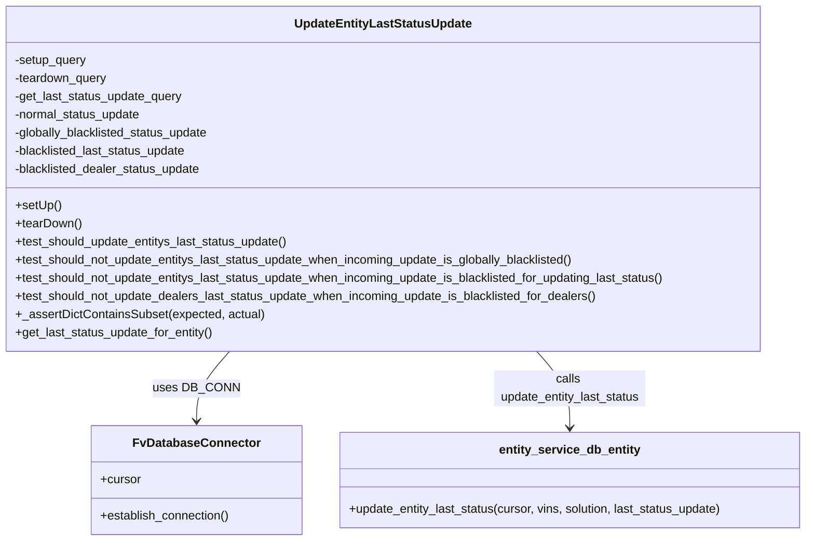
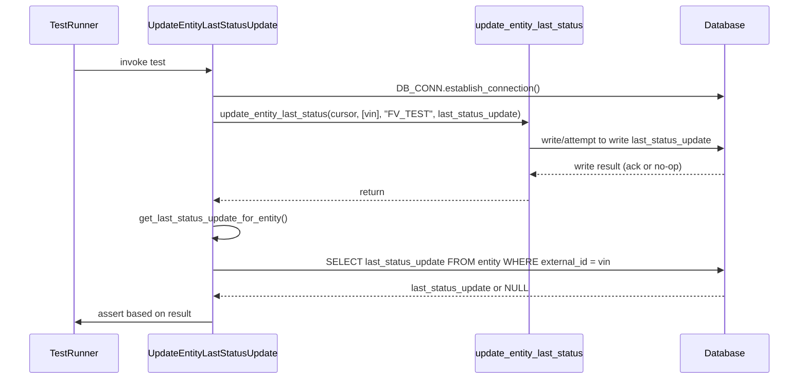
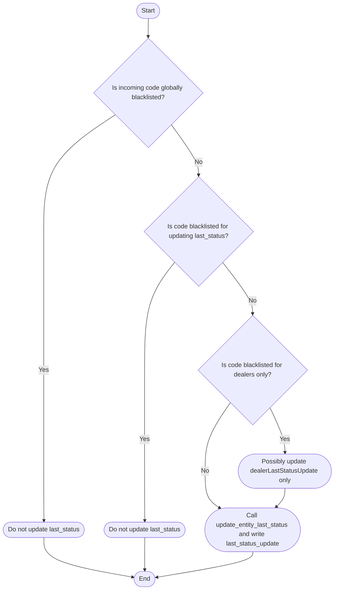

# Diagram: entity_core/entity_service/entity_service_tests/add_status_update_tests/update_entity_last_status_update_integration_test.py

> Auto-generated by Obscura crawlers

## Diagram 1

### SVG

<svg id="container" width="1078.279296875" xmlns="http://www.w3.org/2000/svg" class="classDiagram" height="714" viewBox="0 0 1078.279296875 714" role="graphics-document document" aria-roledescription="class"><g><defs><marker id="container_class-aggregationStart" class="marker aggregation class" refX="18" refY="7" markerWidth="190" markerHeight="240" orient="auto"><path d="M 18,7 L9,13 L1,7 L9,1 Z"></path></marker></defs><defs><marker id="container_class-aggregationEnd" class="marker aggregation class" refX="1" refY="7" markerWidth="20" markerHeight="28" orient="auto"><path d="M 18,7 L9,13 L1,7 L9,1 Z"></path></marker></defs><defs><marker id="container_class-extensionStart" class="marker extension class" refX="18" refY="7" markerWidth="190" markerHeight="240" orient="auto"><path d="M 1,7 L18,13 V 1 Z"></path></marker></defs><defs><marker id="container_class-extensionEnd" class="marker extension class" refX="1" refY="7" markerWidth="20" markerHeight="28" orient="auto"><path d="M 1,1 V 13 L18,7 Z"></path></marker></defs><defs><marker id="container_class-compositionStart" class="marker composition class" refX="18" refY="7" markerWidth="190" markerHeight="240" orient="auto"><path d="M 18,7 L9,13 L1,7 L9,1 Z"></path></marker></defs><defs><marker id="container_class-compositionEnd" class="marker composition class" refX="1" refY="7" markerWidth="20" markerHeight="28" orient="auto"><path d="M 18,7 L9,13 L1,7 L9,1 Z"></path></marker></defs><defs><marker id="container_class-dependencyStart" class="marker dependency class" refX="6" refY="7" markerWidth="190" markerHeight="240" orient="auto"><path d="M 5,7 L9,13 L1,7 L9,1 Z"></path></marker></defs><defs><marker id="container_class-dependencyEnd" class="marker dependency class" refX="13" refY="7" markerWidth="20" markerHeight="28" orient="auto"><path d="M 18,7 L9,13 L14,7 L9,1 Z"></path></marker></defs><defs><marker id="container_class-lollipopStart" class="marker lollipop class" refX="13" refY="7" markerWidth="190" markerHeight="240" orient="auto"><circle stroke="black" fill="transparent" cx="7" cy="7" r="6"></circle></marker></defs><defs><marker id="container_class-lollipopEnd" class="marker lollipop class" refX="1" refY="7" markerWidth="190" markerHeight="240" orient="auto"><circle stroke="black" fill="transparent" cx="7" cy="7" r="6"></circle></marker></defs><g class="root"><g class="clusters"></g><g class="edgePaths"><path d="M309.621,464L302.303,472.167C294.985,480.333,280.349,496.667,273.031,512C265.713,527.333,265.713,541.667,265.713,548.833L265.713,556" id="id_UpdateEntityLastStatusUpdate_FvDatabaseConnector_1" class="edge-thickness-normal edge-pattern-solid relation" style=";;;" data-edge="true" data-et="edge" data-id="id_UpdateEntityLastStatusUpdate_FvDatabaseConnector_1" data-points="W3sieCI6MzA5LjYyMDU4NjA3ODUxOTg2LCJ5Ijo0NjR9LHsieCI6MjY1LjcxMjg5MDYyNSwieSI6NTEzfSx7IngiOjI2NS43MTI4OTA2MjUsInkiOjU2Mn1d" marker-end="url(#container_class-dependencyEnd)"></path><path d="M718.231,464L725.549,472.167C732.867,480.333,747.503,496.667,754.821,513.5C762.139,530.333,762.139,547.667,762.139,556.333L762.139,565" id="id_UpdateEntityLastStatusUpdate_entity_service_db_entity_2" class="edge-thickness-normal edge-pattern-solid relation" style=";;;" data-edge="true" data-et="edge" data-id="id_UpdateEntityLastStatusUpdate_entity_service_db_entity_2" data-points="W3sieCI6NzE4LjIzMDk3NjQyMTQ4MDEsInkiOjQ2NH0seyJ4Ijo3NjIuMTM4NjcxODc1LCJ5Ijo1MTN9LHsieCI6NzYyLjEzODY3MTg3NSwieSI6NTcxfV0=" marker-end="url(#container_class-dependencyEnd)"></path></g><g class="edgeLabels"><g class="edgeLabel" transform="translate(265.712890625, 513)"><g class="label" data-id="id_UpdateEntityLastStatusUpdate_FvDatabaseConnector_1" transform="translate(-53.09375, -12)"><foreignObject width="106.1875" height="24">

uses DB_CONN

</foreignObject></g></g><g class="edgeLabel" transform="translate(762.138671875, 513)"><g class="label" data-id="id_UpdateEntityLastStatusUpdate_entity_service_db_entity_2" transform="translate(-100, -24)"><foreignObject width="200" height="48">

calls update_entity_last_status

</foreignObject></g></g></g><g class="nodes"><g class="node default" id="classId-UpdateEntityLastStatusUpdate-0" transform="translate(513.92578125, 236)"><g class="basic label-container"><path d="M-505.92578125 -228 L505.92578125 -228 L505.92578125 228 L-505.92578125 228" stroke="none" stroke-width="0" fill="#ECECFF" style=""></path><path d="M-505.92578125 -228 C-153.33188299744717 -228, 199.26201525510567 -228, 505.92578125 -228 M-505.92578125 -228 C-219.93807933546856 -228, 66.04962257906288 -228, 505.92578125 -228 M505.92578125 -228 C505.92578125 -73.97736845447889, 505.92578125 80.04526309104222, 505.92578125 228 M505.92578125 -228 C505.92578125 -126.9929449357709, 505.92578125 -25.985889871541787, 505.92578125 228 M505.92578125 228 C139.80054979152936 228, -226.32468166694127 228, -505.92578125 228 M505.92578125 228 C295.4516140125949 228, 84.97744677518983 228, -505.92578125 228 M-505.92578125 228 C-505.92578125 132.09086850834507, -505.92578125 36.18173701669011, -505.92578125 -228 M-505.92578125 228 C-505.92578125 68.13043243958941, -505.92578125 -91.73913512082117, -505.92578125 -228" stroke="#9370DB" stroke-width="1.3" fill="none" stroke-dasharray="0 0" style=""></path></g><g class="annotation-group text" transform="translate(0, -204)"></g><g class="label-group text" transform="translate(-113.1015625, -204)"><g class="label" style="font-weight: bolder" transform="translate(0,-12)"><foreignObject width="226.203125" height="24">

UpdateEntityLastStatusUpdate

</foreignObject></g></g><g class="members-group text" transform="translate(-493.92578125, -156)"><g class="label" style="" transform="translate(0,-12)"><foreignObject width="96.5625" height="24">

-setup_query

</foreignObject></g><g class="label" style="" transform="translate(0,12)"><foreignObject width="124.28125" height="24">

-teardown_query

</foreignObject></g><g class="label" style="" transform="translate(0,36)"><foreignObject width="224.640625" height="24">

-get_last_status_update_query

</foreignObject></g><g class="label" style="" transform="translate(0,60)"><foreignObject width="170.046875" height="24">

-normal_status_update

</foreignObject></g><g class="label" style="" transform="translate(0,84)"><foreignObject width="262.4375" height="24">

-globally_blacklisted_status_update

</foreignObject></g><g class="label" style="" transform="translate(0,108)"><foreignObject width="231.90625" height="24">

-blacklisted_last_status_update

</foreignObject></g><g class="label" style="" transform="translate(0,132)"><foreignObject width="250.25" height="24">

-blacklisted_dealer_status_update

</foreignObject></g></g><g class="methods-group text" transform="translate(-493.92578125, 36)"><g class="label" style="" transform="translate(0,-12)"><foreignObject width="60.421875" height="24">

+setUp()

</foreignObject></g><g class="label" style="" transform="translate(0,12)"><foreignObject width="87.75" height="24">

+tearDown()

</foreignObject></g><g class="label" style="" transform="translate(0,36)"><foreignObject width="366.109375" height="24">

+test_should_update_entitys_last_status_update()

</foreignObject></g><g class="label" style="" transform="translate(0,60)"><foreignObject width="752.125" height="24">

+test_should_not_update_entitys_last_status_update_when_incoming_update_is_globally_blacklisted()

</foreignObject></g><g class="label" style="" transform="translate(0,84)"><foreignObject width="874.75" height="24">

+test_should_not_update_entitys_last_status_update_when_incoming_update_is_blacklisted_for_updating_last_status()

</foreignObject></g><g class="label" style="" transform="translate(0,108)"><foreignObject width="779.828125" height="24">

+test_should_not_update_dealers_last_status_update_when_incoming_update_is_blacklisted_for_dealers()

</foreignObject></g><g class="label" style="" transform="translate(0,132)"><foreignObject width="328.703125" height="24">

+_assertDictContainsSubset(expected, actual)

</foreignObject></g><g class="label" style="" transform="translate(0,156)"><foreignObject width="264.296875" height="24">

+get_last_status_update_for_entity()

</foreignObject></g></g><g class="divider" style=""><path d="M-505.92578125 -180 C-211.20701212990792 -180, 83.51175699018415 -180, 505.92578125 -180 M-505.92578125 -180 C-228.36200526746387 -180, 49.20177071507226 -180, 505.92578125 -180" stroke="#9370DB" stroke-width="1.3" fill="none" stroke-dasharray="0 0" style=""></path></g><g class="divider" style=""><path d="M-505.92578125 12 C-290.4372485759666 12, -74.9487159019331 12, 505.92578125 12 M-505.92578125 12 C-275.669721512258 12, -45.41366177451596 12, 505.92578125 12" stroke="#9370DB" stroke-width="1.3" fill="none" stroke-dasharray="0 0" style=""></path></g></g><g class="node default" id="classId-FvDatabaseConnector-1" transform="translate(265.712890625, 634)"><g class="basic label-container"><path d="M-138.28515625 -72 L138.28515625 -72 L138.28515625 72 L-138.28515625 72" stroke="none" stroke-width="0" fill="#ECECFF" style=""></path><path d="M-138.28515625 -72 C-47.04123989650465 -72, 44.2026764569907 -72, 138.28515625 -72 M-138.28515625 -72 C-67.30691606253059 -72, 3.6713241249388204 -72, 138.28515625 -72 M138.28515625 -72 C138.28515625 -32.719044714945, 138.28515625 6.561910570110001, 138.28515625 72 M138.28515625 -72 C138.28515625 -33.32449980543388, 138.28515625 5.351000389132238, 138.28515625 72 M138.28515625 72 C28.284481053847713 72, -81.71619414230457 72, -138.28515625 72 M138.28515625 72 C78.64443056527358 72, 19.003704880547147 72, -138.28515625 72 M-138.28515625 72 C-138.28515625 32.52335920583732, -138.28515625 -6.953281588325353, -138.28515625 -72 M-138.28515625 72 C-138.28515625 31.4151490215923, -138.28515625 -9.169701956815402, -138.28515625 -72" stroke="#9370DB" stroke-width="1.3" fill="none" stroke-dasharray="0 0" style=""></path></g><g class="annotation-group text" transform="translate(0, -48)"></g><g class="label-group text" transform="translate(-79.3046875, -48)"><g class="label" style="font-weight: bolder" transform="translate(0,-12)"><foreignObject width="158.609375" height="24">

FvDatabaseConnector

</foreignObject></g></g><g class="members-group text" transform="translate(-126.28515625, 0)"><g class="label" style="" transform="translate(0,-12)"><foreignObject width="53.71875" height="24">

+cursor

</foreignObject></g></g><g class="methods-group text" transform="translate(-126.28515625, 48)"><g class="label" style="" transform="translate(0,-12)"><foreignObject width="173.265625" height="24">

+establish_connection()

</foreignObject></g></g><g class="divider" style=""><path d="M-138.28515625 -24 C-42.71980584613368 -24, 52.84554455773264 -24, 138.28515625 -24 M-138.28515625 -24 C-66.80141383600437 -24, 4.682328577991257 -24, 138.28515625 -24" stroke="#9370DB" stroke-width="1.3" fill="none" stroke-dasharray="0 0" style=""></path></g><g class="divider" style=""><path d="M-138.28515625 24 C-55.199056558168735 24, 27.88704313366253 24, 138.28515625 24 M-138.28515625 24 C-63.20207513410949 24, 11.881005981781016 24, 138.28515625 24" stroke="#9370DB" stroke-width="1.3" fill="none" stroke-dasharray="0 0" style=""></path></g></g><g class="node default" id="classId-entity_service_db_entity-2" transform="translate(762.138671875, 634)"><g class="basic label-container"><path d="M-308.140625 -63 L308.140625 -63 L308.140625 63 L-308.140625 63" stroke="none" stroke-width="0" fill="#ECECFF" style=""></path><path d="M-308.140625 -63 C-146.2704425338731 -63, 15.599739932253783 -63, 308.140625 -63 M-308.140625 -63 C-111.56326973453062 -63, 85.01408553093876 -63, 308.140625 -63 M308.140625 -63 C308.140625 -22.214842552425694, 308.140625 18.570314895148613, 308.140625 63 M308.140625 -63 C308.140625 -13.599911856927257, 308.140625 35.800176286145486, 308.140625 63 M308.140625 63 C166.15705025865094 63, 24.17347551730188 63, -308.140625 63 M308.140625 63 C156.01837217416227 63, 3.8961193483245324 63, -308.140625 63 M-308.140625 63 C-308.140625 25.26016312450598, -308.140625 -12.479673750988042, -308.140625 -63 M-308.140625 63 C-308.140625 30.32884164937777, -308.140625 -2.3423167012444566, -308.140625 -63" stroke="#9370DB" stroke-width="1.3" fill="none" stroke-dasharray="0 0" style=""></path></g><g class="annotation-group text" transform="translate(0, -39)"></g><g class="label-group text" transform="translate(-90.25, -39)"><g class="label" style="font-weight: bolder" transform="translate(0,-12)"><foreignObject width="180.5" height="24">

entity_service_db_entity

</foreignObject></g></g><g class="members-group text" transform="translate(-296.140625, 9)"></g><g class="methods-group text" transform="translate(-296.140625, 39)"><g class="label" style="" transform="translate(0,-12)"><foreignObject width="502.03125" height="24">

+update_entity_last_status(cursor, vins, solution, last_status_update)

</foreignObject></g></g><g class="divider" style=""><path d="M-308.140625 -15 C-63.59333257659887 -15, 180.95395984680226 -15, 308.140625 -15 M-308.140625 -15 C-66.52047028175915 -15, 175.0996844364817 -15, 308.140625 -15" stroke="#9370DB" stroke-width="1.3" fill="none" stroke-dasharray="0 0" style=""></path></g><g class="divider" style=""><path d="M-308.140625 9 C-126.7389935983206 9, 54.66263780335879 9, 308.140625 9 M-308.140625 9 C-96.4153540973416 9, 115.30991680531679 9, 308.140625 9" stroke="#9370DB" stroke-width="1.3" fill="none" stroke-dasharray="0 0" style=""></path></g></g></g></g></g></svg>

## Diagram 2

### SVG

<svg id="container" width="1445" xmlns="http://www.w3.org/2000/svg" height="681" viewBox="-50 -10 1445 681" role="graphics-document document" aria-roledescription="sequence"><g><rect x="1195" y="595" fill="#eaeaea" stroke="#666" width="150" height="65" name="DB" rx="3" ry="3" class="actor actor-bottom"></rect><text x="1270" y="627.5" dominant-baseline="central" alignment-baseline="central" class="actor actor-box" style="text-anchor: middle; font-size: 16px; font-weight: 400;"><tspan x="1270" dy="0">Database</tspan></text></g><g><rect x="792" y="595" fill="#eaeaea" stroke="#666" width="208" height="65" name="EntityService" rx="3" ry="3" class="actor actor-bottom"></rect><text x="896" y="627.5" dominant-baseline="central" alignment-baseline="central" class="actor actor-box" style="text-anchor: middle; font-size: 16px; font-weight: 400;"><tspan x="896" dy="0">update_entity_last_status</tspan></text></g><g><rect x="200" y="595" fill="#eaeaea" stroke="#666" width="242" height="65" name="TestCase" rx="3" ry="3" class="actor actor-bottom"></rect><text x="321" y="627.5" dominant-baseline="central" alignment-baseline="central" class="actor actor-box" style="text-anchor: middle; font-size: 16px; font-weight: 400;"><tspan x="321" dy="0">UpdateEntityLastStatusUpdate</tspan></text></g><g><rect x="0" y="595" fill="#eaeaea" stroke="#666" width="150" height="65" name="Runner" rx="3" ry="3" class="actor actor-bottom"></rect><text x="75" y="627.5" dominant-baseline="central" alignment-baseline="central" class="actor actor-box" style="text-anchor: middle; font-size: 16px; font-weight: 400;"><tspan x="75" dy="0">TestRunner</tspan></text></g><g><line id="actor3" x1="1270" y1="65" x2="1270" y2="595" class="actor-line 200" stroke-width="0.5px" stroke="#999" name="DB"></line><g id="root-3"><rect x="1195" y="0" fill="#eaeaea" stroke="#666" width="150" height="65" name="DB" rx="3" ry="3" class="actor actor-top"></rect><text x="1270" y="32.5" dominant-baseline="central" alignment-baseline="central" class="actor actor-box" style="text-anchor: middle; font-size: 16px; font-weight: 400;"><tspan x="1270" dy="0">Database</tspan></text></g></g><g><line id="actor2" x1="896" y1="65" x2="896" y2="595" class="actor-line 200" stroke-width="0.5px" stroke="#999" name="EntityService"></line><g id="root-2"><rect x="792" y="0" fill="#eaeaea" stroke="#666" width="208" height="65" name="EntityService" rx="3" ry="3" class="actor actor-top"></rect><text x="896" y="32.5" dominant-baseline="central" alignment-baseline="central" class="actor actor-box" style="text-anchor: middle; font-size: 16px; font-weight: 400;"><tspan x="896" dy="0">update_entity_last_status</tspan></text></g></g><g><line id="actor1" x1="321" y1="65" x2="321" y2="595" class="actor-line 200" stroke-width="0.5px" stroke="#999" name="TestCase"></line><g id="root-1"><rect x="200" y="0" fill="#eaeaea" stroke="#666" width="242" height="65" name="TestCase" rx="3" ry="3" class="actor actor-top"></rect><text x="321" y="32.5" dominant-baseline="central" alignment-baseline="central" class="actor actor-box" style="text-anchor: middle; font-size: 16px; font-weight: 400;"><tspan x="321" dy="0">UpdateEntityLastStatusUpdate</tspan></text></g></g><g><line id="actor0" x1="75" y1="65" x2="75" y2="595" class="actor-line 200" stroke-width="0.5px" stroke="#999" name="Runner"></line><g id="root-0"><rect x="0" y="0" fill="#eaeaea" stroke="#666" width="150" height="65" name="Runner" rx="3" ry="3" class="actor actor-top"></rect><text x="75" y="32.5" dominant-baseline="central" alignment-baseline="central" class="actor actor-box" style="text-anchor: middle; font-size: 16px; font-weight: 400;"><tspan x="75" dy="0">TestRunner</tspan></text></g></g><g></g><defs><symbol id="computer" width="24" height="24"><path transform="scale(.5)" d="M2 2v13h20v-13h-20zm18 11h-16v-9h16v9zm-10.228 6l.466-1h3.524l.467 1h-4.457zm14.228 3h-24l2-6h2.104l-1.33 4h18.45l-1.297-4h2.073l2 6zm-5-10h-14v-7h14v7z"></path></symbol></defs><defs><symbol id="database" fill-rule="evenodd" clip-rule="evenodd"><path transform="scale(.5)" d="M12.258.001l.256.004.255.005.253.008.251.01.249.012.247.015.246.016.242.019.241.02.239.023.236.024.233.027.231.028.229.031.225.032.223.034.22.036.217.038.214.04.211.041.208.043.205.045.201.046.198.048.194.05.191.051.187.053.183.054.18.056.175.057.172.059.168.06.163.061.16.063.155.064.15.066.074.033.073.033.071.034.07.034.069.035.068.035.067.035.066.035.064.036.064.036.062.036.06.036.06.037.058.037.058.037.055.038.055.038.053.038.052.038.051.039.05.039.048.039.047.039.045.04.044.04.043.04.041.04.04.041.039.041.037.041.036.041.034.041.033.042.032.042.03.042.029.042.027.042.026.043.024.043.023.043.021.043.02.043.018.044.017.043.015.044.013.044.012.044.011.045.009.044.007.045.006.045.004.045.002.045.001.045v17l-.001.045-.002.045-.004.045-.006.045-.007.045-.009.044-.011.045-.012.044-.013.044-.015.044-.017.043-.018.044-.02.043-.021.043-.023.043-.024.043-.026.043-.027.042-.029.042-.03.042-.032.042-.033.042-.034.041-.036.041-.037.041-.039.041-.04.041-.041.04-.043.04-.044.04-.045.04-.047.039-.048.039-.05.039-.051.039-.052.038-.053.038-.055.038-.055.038-.058.037-.058.037-.06.037-.06.036-.062.036-.064.036-.064.036-.066.035-.067.035-.068.035-.069.035-.07.034-.071.034-.073.033-.074.033-.15.066-.155.064-.16.063-.163.061-.168.06-.172.059-.175.057-.18.056-.183.054-.187.053-.191.051-.194.05-.198.048-.201.046-.205.045-.208.043-.211.041-.214.04-.217.038-.22.036-.223.034-.225.032-.229.031-.231.028-.233.027-.236.024-.239.023-.241.02-.242.019-.246.016-.247.015-.249.012-.251.01-.253.008-.255.005-.256.004-.258.001-.258-.001-.256-.004-.255-.005-.253-.008-.251-.01-.249-.012-.247-.015-.245-.016-.243-.019-.241-.02-.238-.023-.236-.024-.234-.027-.231-.028-.228-.031-.226-.032-.223-.034-.22-.036-.217-.038-.214-.04-.211-.041-.208-.043-.204-.045-.201-.046-.198-.048-.195-.05-.19-.051-.187-.053-.184-.054-.179-.056-.176-.057-.172-.059-.167-.06-.164-.061-.159-.063-.155-.064-.151-.066-.074-.033-.072-.033-.072-.034-.07-.034-.069-.035-.068-.035-.067-.035-.066-.035-.064-.036-.063-.036-.062-.036-.061-.036-.06-.037-.058-.037-.057-.037-.056-.038-.055-.038-.053-.038-.052-.038-.051-.039-.049-.039-.049-.039-.046-.039-.046-.04-.044-.04-.043-.04-.041-.04-.04-.041-.039-.041-.037-.041-.036-.041-.034-.041-.033-.042-.032-.042-.03-.042-.029-.042-.027-.042-.026-.043-.024-.043-.023-.043-.021-.043-.02-.043-.018-.044-.017-.043-.015-.044-.013-.044-.012-.044-.011-.045-.009-.044-.007-.045-.006-.045-.004-.045-.002-.045-.001-.045v-17l.001-.045.002-.045.004-.045.006-.045.007-.045.009-.044.011-.045.012-.044.013-.044.015-.044.017-.043.018-.044.02-.043.021-.043.023-.043.024-.043.026-.043.027-.042.029-.042.03-.042.032-.042.033-.042.034-.041.036-.041.037-.041.039-.041.04-.041.041-.04.043-.04.044-.04.046-.04.046-.039.049-.039.049-.039.051-.039.052-.038.053-.038.055-.038.056-.038.057-.037.058-.037.06-.037.061-.036.062-.036.063-.036.064-.036.066-.035.067-.035.068-.035.069-.035.07-.034.072-.034.072-.033.074-.033.151-.066.155-.064.159-.063.164-.061.167-.06.172-.059.176-.057.179-.056.184-.054.187-.053.19-.051.195-.05.198-.048.201-.046.204-.045.208-.043.211-.041.214-.04.217-.038.22-.036.223-.034.226-.032.228-.031.231-.028.234-.027.236-.024.238-.023.241-.02.243-.019.245-.016.247-.015.249-.012.251-.01.253-.008.255-.005.256-.004.258-.001.258.001zm-9.258 20.499v.01l.001.021.003.021.004.022.005.021.006.022.007.022.009.023.01.022.011.023.012.023.013.023.015.023.016.024.017.023.018.024.019.024.021.024.022.025.023.024.024.025.052.049.056.05.061.051.066.051.07.051.075.051.079.052.084.052.088.052.092.052.097.052.102.051.105.052.11.052.114.051.119.051.123.051.127.05.131.05.135.05.139.048.144.049.147.047.152.047.155.047.16.045.163.045.167.043.171.043.176.041.178.041.183.039.187.039.19.037.194.035.197.035.202.033.204.031.209.03.212.029.216.027.219.025.222.024.226.021.23.02.233.018.236.016.24.015.243.012.246.01.249.008.253.005.256.004.259.001.26-.001.257-.004.254-.005.25-.008.247-.011.244-.012.241-.014.237-.016.233-.018.231-.021.226-.021.224-.024.22-.026.216-.027.212-.028.21-.031.205-.031.202-.034.198-.034.194-.036.191-.037.187-.039.183-.04.179-.04.175-.042.172-.043.168-.044.163-.045.16-.046.155-.046.152-.047.148-.048.143-.049.139-.049.136-.05.131-.05.126-.05.123-.051.118-.052.114-.051.11-.052.106-.052.101-.052.096-.052.092-.052.088-.053.083-.051.079-.052.074-.052.07-.051.065-.051.06-.051.056-.05.051-.05.023-.024.023-.025.021-.024.02-.024.019-.024.018-.024.017-.024.015-.023.014-.024.013-.023.012-.023.01-.023.01-.022.008-.022.006-.022.006-.022.004-.022.004-.021.001-.021.001-.021v-4.127l-.077.055-.08.053-.083.054-.085.053-.087.052-.09.052-.093.051-.095.05-.097.05-.1.049-.102.049-.105.048-.106.047-.109.047-.111.046-.114.045-.115.045-.118.044-.12.043-.122.042-.124.042-.126.041-.128.04-.13.04-.132.038-.134.038-.135.037-.138.037-.139.035-.142.035-.143.034-.144.033-.147.032-.148.031-.15.03-.151.03-.153.029-.154.027-.156.027-.158.026-.159.025-.161.024-.162.023-.163.022-.165.021-.166.02-.167.019-.169.018-.169.017-.171.016-.173.015-.173.014-.175.013-.175.012-.177.011-.178.01-.179.008-.179.008-.181.006-.182.005-.182.004-.184.003-.184.002h-.37l-.184-.002-.184-.003-.182-.004-.182-.005-.181-.006-.179-.008-.179-.008-.178-.01-.176-.011-.176-.012-.175-.013-.173-.014-.172-.015-.171-.016-.17-.017-.169-.018-.167-.019-.166-.02-.165-.021-.163-.022-.162-.023-.161-.024-.159-.025-.157-.026-.156-.027-.155-.027-.153-.029-.151-.03-.15-.03-.148-.031-.146-.032-.145-.033-.143-.034-.141-.035-.14-.035-.137-.037-.136-.037-.134-.038-.132-.038-.13-.04-.128-.04-.126-.041-.124-.042-.122-.042-.12-.044-.117-.043-.116-.045-.113-.045-.112-.046-.109-.047-.106-.047-.105-.048-.102-.049-.1-.049-.097-.05-.095-.05-.093-.052-.09-.051-.087-.052-.085-.053-.083-.054-.08-.054-.077-.054v4.127zm0-5.654v.011l.001.021.003.021.004.021.005.022.006.022.007.022.009.022.01.022.011.023.012.023.013.023.015.024.016.023.017.024.018.024.019.024.021.024.022.024.023.025.024.024.052.05.056.05.061.05.066.051.07.051.075.052.079.051.084.052.088.052.092.052.097.052.102.052.105.052.11.051.114.051.119.052.123.05.127.051.131.05.135.049.139.049.144.048.147.048.152.047.155.046.16.045.163.045.167.044.171.042.176.042.178.04.183.04.187.038.19.037.194.036.197.034.202.033.204.032.209.03.212.028.216.027.219.025.222.024.226.022.23.02.233.018.236.016.24.014.243.012.246.01.249.008.253.006.256.003.259.001.26-.001.257-.003.254-.006.25-.008.247-.01.244-.012.241-.015.237-.016.233-.018.231-.02.226-.022.224-.024.22-.025.216-.027.212-.029.21-.03.205-.032.202-.033.198-.035.194-.036.191-.037.187-.039.183-.039.179-.041.175-.042.172-.043.168-.044.163-.045.16-.045.155-.047.152-.047.148-.048.143-.048.139-.05.136-.049.131-.05.126-.051.123-.051.118-.051.114-.052.11-.052.106-.052.101-.052.096-.052.092-.052.088-.052.083-.052.079-.052.074-.051.07-.052.065-.051.06-.05.056-.051.051-.049.023-.025.023-.024.021-.025.02-.024.019-.024.018-.024.017-.024.015-.023.014-.023.013-.024.012-.022.01-.023.01-.023.008-.022.006-.022.006-.022.004-.021.004-.022.001-.021.001-.021v-4.139l-.077.054-.08.054-.083.054-.085.052-.087.053-.09.051-.093.051-.095.051-.097.05-.1.049-.102.049-.105.048-.106.047-.109.047-.111.046-.114.045-.115.044-.118.044-.12.044-.122.042-.124.042-.126.041-.128.04-.13.039-.132.039-.134.038-.135.037-.138.036-.139.036-.142.035-.143.033-.144.033-.147.033-.148.031-.15.03-.151.03-.153.028-.154.028-.156.027-.158.026-.159.025-.161.024-.162.023-.163.022-.165.021-.166.02-.167.019-.169.018-.169.017-.171.016-.173.015-.173.014-.175.013-.175.012-.177.011-.178.009-.179.009-.179.007-.181.007-.182.005-.182.004-.184.003-.184.002h-.37l-.184-.002-.184-.003-.182-.004-.182-.005-.181-.007-.179-.007-.179-.009-.178-.009-.176-.011-.176-.012-.175-.013-.173-.014-.172-.015-.171-.016-.17-.017-.169-.018-.167-.019-.166-.02-.165-.021-.163-.022-.162-.023-.161-.024-.159-.025-.157-.026-.156-.027-.155-.028-.153-.028-.151-.03-.15-.03-.148-.031-.146-.033-.145-.033-.143-.033-.141-.035-.14-.036-.137-.036-.136-.037-.134-.038-.132-.039-.13-.039-.128-.04-.126-.041-.124-.042-.122-.043-.12-.043-.117-.044-.116-.044-.113-.046-.112-.046-.109-.046-.106-.047-.105-.048-.102-.049-.1-.049-.097-.05-.095-.051-.093-.051-.09-.051-.087-.053-.085-.052-.083-.054-.08-.054-.077-.054v4.139zm0-5.666v.011l.001.02.003.022.004.021.005.022.006.021.007.022.009.023.01.022.011.023.012.023.013.023.015.023.016.024.017.024.018.023.019.024.021.025.022.024.023.024.024.025.052.05.056.05.061.05.066.051.07.051.075.052.079.051.084.052.088.052.092.052.097.052.102.052.105.051.11.052.114.051.119.051.123.051.127.05.131.05.135.05.139.049.144.048.147.048.152.047.155.046.16.045.163.045.167.043.171.043.176.042.178.04.183.04.187.038.19.037.194.036.197.034.202.033.204.032.209.03.212.028.216.027.219.025.222.024.226.021.23.02.233.018.236.017.24.014.243.012.246.01.249.008.253.006.256.003.259.001.26-.001.257-.003.254-.006.25-.008.247-.01.244-.013.241-.014.237-.016.233-.018.231-.02.226-.022.224-.024.22-.025.216-.027.212-.029.21-.03.205-.032.202-.033.198-.035.194-.036.191-.037.187-.039.183-.039.179-.041.175-.042.172-.043.168-.044.163-.045.16-.045.155-.047.152-.047.148-.048.143-.049.139-.049.136-.049.131-.051.126-.05.123-.051.118-.052.114-.051.11-.052.106-.052.101-.052.096-.052.092-.052.088-.052.083-.052.079-.052.074-.052.07-.051.065-.051.06-.051.056-.05.051-.049.023-.025.023-.025.021-.024.02-.024.019-.024.018-.024.017-.024.015-.023.014-.024.013-.023.012-.023.01-.022.01-.023.008-.022.006-.022.006-.022.004-.022.004-.021.001-.021.001-.021v-4.153l-.077.054-.08.054-.083.053-.085.053-.087.053-.09.051-.093.051-.095.051-.097.05-.1.049-.102.048-.105.048-.106.048-.109.046-.111.046-.114.046-.115.044-.118.044-.12.043-.122.043-.124.042-.126.041-.128.04-.13.039-.132.039-.134.038-.135.037-.138.036-.139.036-.142.034-.143.034-.144.033-.147.032-.148.032-.15.03-.151.03-.153.028-.154.028-.156.027-.158.026-.159.024-.161.024-.162.023-.163.023-.165.021-.166.02-.167.019-.169.018-.169.017-.171.016-.173.015-.173.014-.175.013-.175.012-.177.01-.178.01-.179.009-.179.007-.181.006-.182.006-.182.004-.184.003-.184.001-.185.001-.185-.001-.184-.001-.184-.003-.182-.004-.182-.006-.181-.006-.179-.007-.179-.009-.178-.01-.176-.01-.176-.012-.175-.013-.173-.014-.172-.015-.171-.016-.17-.017-.169-.018-.167-.019-.166-.02-.165-.021-.163-.023-.162-.023-.161-.024-.159-.024-.157-.026-.156-.027-.155-.028-.153-.028-.151-.03-.15-.03-.148-.032-.146-.032-.145-.033-.143-.034-.141-.034-.14-.036-.137-.036-.136-.037-.134-.038-.132-.039-.13-.039-.128-.041-.126-.041-.124-.041-.122-.043-.12-.043-.117-.044-.116-.044-.113-.046-.112-.046-.109-.046-.106-.048-.105-.048-.102-.048-.1-.05-.097-.049-.095-.051-.093-.051-.09-.052-.087-.052-.085-.053-.083-.053-.08-.054-.077-.054v4.153zm8.74-8.179l-.257.004-.254.005-.25.008-.247.011-.244.012-.241.014-.237.016-.233.018-.231.021-.226.022-.224.023-.22.026-.216.027-.212.028-.21.031-.205.032-.202.033-.198.034-.194.036-.191.038-.187.038-.183.04-.179.041-.175.042-.172.043-.168.043-.163.045-.16.046-.155.046-.152.048-.148.048-.143.048-.139.049-.136.05-.131.05-.126.051-.123.051-.118.051-.114.052-.11.052-.106.052-.101.052-.096.052-.092.052-.088.052-.083.052-.079.052-.074.051-.07.052-.065.051-.06.05-.056.05-.051.05-.023.025-.023.024-.021.024-.02.025-.019.024-.018.024-.017.023-.015.024-.014.023-.013.023-.012.023-.01.023-.01.022-.008.022-.006.023-.006.021-.004.022-.004.021-.001.021-.001.021.001.021.001.021.004.021.004.022.006.021.006.023.008.022.01.022.01.023.012.023.013.023.014.023.015.024.017.023.018.024.019.024.02.025.021.024.023.024.023.025.051.05.056.05.06.05.065.051.07.052.074.051.079.052.083.052.088.052.092.052.096.052.101.052.106.052.11.052.114.052.118.051.123.051.126.051.131.05.136.05.139.049.143.048.148.048.152.048.155.046.16.046.163.045.168.043.172.043.175.042.179.041.183.04.187.038.191.038.194.036.198.034.202.033.205.032.21.031.212.028.216.027.22.026.224.023.226.022.231.021.233.018.237.016.241.014.244.012.247.011.25.008.254.005.257.004.26.001.26-.001.257-.004.254-.005.25-.008.247-.011.244-.012.241-.014.237-.016.233-.018.231-.021.226-.022.224-.023.22-.026.216-.027.212-.028.21-.031.205-.032.202-.033.198-.034.194-.036.191-.038.187-.038.183-.04.179-.041.175-.042.172-.043.168-.043.163-.045.16-.046.155-.046.152-.048.148-.048.143-.048.139-.049.136-.05.131-.05.126-.051.123-.051.118-.051.114-.052.11-.052.106-.052.101-.052.096-.052.092-.052.088-.052.083-.052.079-.052.074-.051.07-.052.065-.051.06-.05.056-.05.051-.05.023-.025.023-.024.021-.024.02-.025.019-.024.018-.024.017-.023.015-.024.014-.023.013-.023.012-.023.01-.023.01-.022.008-.022.006-.023.006-.021.004-.022.004-.021.001-.021.001-.021-.001-.021-.001-.021-.004-.021-.004-.022-.006-.021-.006-.023-.008-.022-.01-.022-.01-.023-.012-.023-.013-.023-.014-.023-.015-.024-.017-.023-.018-.024-.019-.024-.02-.025-.021-.024-.023-.024-.023-.025-.051-.05-.056-.05-.06-.05-.065-.051-.07-.052-.074-.051-.079-.052-.083-.052-.088-.052-.092-.052-.096-.052-.101-.052-.106-.052-.11-.052-.114-.052-.118-.051-.123-.051-.126-.051-.131-.05-.136-.05-.139-.049-.143-.048-.148-.048-.152-.048-.155-.046-.16-.046-.163-.045-.168-.043-.172-.043-.175-.042-.179-.041-.183-.04-.187-.038-.191-.038-.194-.036-.198-.034-.202-.033-.205-.032-.21-.031-.212-.028-.216-.027-.22-.026-.224-.023-.226-.022-.231-.021-.233-.018-.237-.016-.241-.014-.244-.012-.247-.011-.25-.008-.254-.005-.257-.004-.26-.001-.26.001z"></path></symbol></defs><defs><symbol id="clock" width="24" height="24"><path transform="scale(.5)" d="M12 2c5.514 0 10 4.486 10 10s-4.486 10-10 10-10-4.486-10-10 4.486-10 10-10zm0-2c-6.627 0-12 5.373-12 12s5.373 12 12 12 12-5.373 12-12-5.373-12-12-12zm5.848 12.459c.202.038.202.333.001.372-1.907.361-6.045 1.111-6.547 1.111-.719 0-1.301-.582-1.301-1.301 0-.512.77-5.447 1.125-7.445.034-.192.312-.181.343.014l.985 6.238 5.394 1.011z"></path></symbol></defs><defs><marker id="arrowhead" refX="7.9" refY="5" markerUnits="userSpaceOnUse" markerWidth="12" markerHeight="12" orient="auto-start-reverse"><path d="M -1 0 L 10 5 L 0 10 z"></path></marker></defs><defs><marker id="crosshead" markerWidth="15" markerHeight="8" orient="auto" refX="4" refY="4.5"><path fill="none" stroke="#000000" stroke-width="1pt" d="M 1,2 L 6,7 M 6,2 L 1,7" style="stroke-dasharray: 0, 0;"></path></marker></defs><defs><marker id="filled-head" refX="15.5" refY="7" markerWidth="20" markerHeight="28" orient="auto"><path d="M 18,7 L9,13 L14,7 L9,1 Z"></path></marker></defs><defs><marker id="sequencenumber" refX="15" refY="15" markerWidth="60" markerHeight="40" orient="auto"><circle cx="15" cy="15" r="6"></circle></marker></defs><text x="197" y="80" text-anchor="middle" dominant-baseline="middle" alignment-baseline="middle" class="messageText" dy="1em" style="font-size: 16px; font-weight: 400;">invoke test</text><line x1="76" y1="113" x2="317" y2="113" class="messageLine0" stroke-width="2" stroke="none" marker-end="url(#arrowhead)" style="fill: none;"></line><text x="794" y="128" text-anchor="middle" dominant-baseline="middle" alignment-baseline="middle" class="messageText" dy="1em" style="font-size: 16px; font-weight: 400;">DB_CONN.establish_connection()</text><line x1="322" y1="161" x2="1266" y2="161" class="messageLine0" stroke-width="2" stroke="none" marker-end="url(#arrowhead)" style="fill: none;"></line><text x="607" y="176" text-anchor="middle" dominant-baseline="middle" alignment-baseline="middle" class="messageText" dy="1em" style="font-size: 16px; font-weight: 400;">update_entity_last_status(cursor, [vin], "FV_TEST", last_status_update)</text><line x1="322" y1="209" x2="892" y2="209" class="messageLine0" stroke-width="2" stroke="none" marker-end="url(#arrowhead)" style="fill: none;"></line><text x="1082" y="224" text-anchor="middle" dominant-baseline="middle" alignment-baseline="middle" class="messageText" dy="1em" style="font-size: 16px; font-weight: 400;">write/attempt to write last_status_update</text><line x1="897" y1="257" x2="1266" y2="257" class="messageLine0" stroke-width="2" stroke="none" marker-end="url(#arrowhead)" style="fill: none;"></line><text x="1085" y="272" text-anchor="middle" dominant-baseline="middle" alignment-baseline="middle" class="messageText" dy="1em" style="font-size: 16px; font-weight: 400;">write result (ack or no-op)</text><line x1="1269" y1="305" x2="900" y2="305" class="messageLine1" stroke-width="2" stroke="none" marker-end="url(#arrowhead)" style="stroke-dasharray: 3, 3; fill: none;"></line><text x="610" y="320" text-anchor="middle" dominant-baseline="middle" alignment-baseline="middle" class="messageText" dy="1em" style="font-size: 16px; font-weight: 400;">return</text><line x1="895" y1="353" x2="325" y2="353" class="messageLine1" stroke-width="2" stroke="none" marker-end="url(#arrowhead)" style="stroke-dasharray: 3, 3; fill: none;"></line><text x="322" y="368" text-anchor="middle" dominant-baseline="middle" alignment-baseline="middle" class="messageText" dy="1em" style="font-size: 16px; font-weight: 400;">get_last_status_update_for_entity()</text><path d="M 322,401 C 382,391 382,431 322,421" class="messageLine0" stroke-width="2" stroke="none" marker-end="url(#arrowhead)" style="fill: none;"></path><text x="794" y="446" text-anchor="middle" dominant-baseline="middle" alignment-baseline="middle" class="messageText" dy="1em" style="font-size: 16px; font-weight: 400;">SELECT last_status_update FROM entity WHERE external_id = vin</text><line x1="322" y1="479" x2="1266" y2="479" class="messageLine0" stroke-width="2" stroke="none" marker-end="url(#arrowhead)" style="fill: none;"></line><text x="797" y="494" text-anchor="middle" dominant-baseline="middle" alignment-baseline="middle" class="messageText" dy="1em" style="font-size: 16px; font-weight: 400;">last_status_update or NULL</text><line x1="1269" y1="527" x2="325" y2="527" class="messageLine1" stroke-width="2" stroke="none" marker-end="url(#arrowhead)" style="stroke-dasharray: 3, 3; fill: none;"></line><text x="200" y="542" text-anchor="middle" dominant-baseline="middle" alignment-baseline="middle" class="messageText" dy="1em" style="font-size: 16px; font-weight: 400;">assert based on result</text><line x1="320" y1="575" x2="79" y2="575" class="messageLine0" stroke-width="2" stroke="none" marker-end="url(#arrowhead)" style="fill: none;"></line></svg>

## Diagram 3

### SVG

<svg id="container" width="861.5932006835938" xmlns="http://www.w3.org/2000/svg" class="flowchart" height="1498" viewBox="0 0 861.5932006835938 1498" role="graphics-document document" aria-roledescription="flowchart-v2"><g><marker id="container_flowchart-v2-pointEnd" class="marker flowchart-v2" viewBox="0 0 10 10" refX="5" refY="5" markerUnits="userSpaceOnUse" markerWidth="8" markerHeight="8" orient="auto"><path d="M 0 0 L 10 5 L 0 10 z" class="arrowMarkerPath" style="stroke-width: 1; stroke-dasharray: 1, 0;"></path></marker><marker id="container_flowchart-v2-pointStart" class="marker flowchart-v2" viewBox="0 0 10 10" refX="4.5" refY="5" markerUnits="userSpaceOnUse" markerWidth="8" markerHeight="8" orient="auto"><path d="M 0 5 L 10 10 L 10 0 z" class="arrowMarkerPath" style="stroke-width: 1; stroke-dasharray: 1, 0;"></path></marker><marker id="container_flowchart-v2-circleEnd" class="marker flowchart-v2" viewBox="0 0 10 10" refX="11" refY="5" markerUnits="userSpaceOnUse" markerWidth="11" markerHeight="11" orient="auto"><circle cx="5" cy="5" r="5" class="arrowMarkerPath" style="stroke-width: 1; stroke-dasharray: 1, 0;"></circle></marker><marker id="container_flowchart-v2-circleStart" class="marker flowchart-v2" viewBox="0 0 10 10" refX="-1" refY="5" markerUnits="userSpaceOnUse" markerWidth="11" markerHeight="11" orient="auto"><circle cx="5" cy="5" r="5" class="arrowMarkerPath" style="stroke-width: 1; stroke-dasharray: 1, 0;"></circle></marker><marker id="container_flowchart-v2-crossEnd" class="marker cross flowchart-v2" viewBox="0 0 11 11" refX="12" refY="5.2" markerUnits="userSpaceOnUse" markerWidth="11" markerHeight="11" orient="auto"><path d="M 1,1 l 9,9 M 10,1 l -9,9" class="arrowMarkerPath" style="stroke-width: 2; stroke-dasharray: 1, 0;"></path></marker><marker id="container_flowchart-v2-crossStart" class="marker cross flowchart-v2" viewBox="0 0 11 11" refX="-1" refY="5.2" markerUnits="userSpaceOnUse" markerWidth="11" markerHeight="11" orient="auto"><path d="M 1,1 l 9,9 M 10,1 l -9,9" class="arrowMarkerPath" style="stroke-width: 2; stroke-dasharray: 1, 0;"></path></marker><g class="root"><g class="clusters"></g><g class="edgePaths"><path d="M384.265,47.5L384.182,51.583C384.099,55.667,383.932,63.833,383.849,71.417C383.765,79,383.765,86,383.765,89.5L383.765,93" id="L_Start_CheckGlob_0" class="edge-thickness-normal edge-pattern-solid edge-thickness-normal edge-pattern-solid flowchart-link" style=";" data-edge="true" data-et="edge" data-id="L_Start_CheckGlob_0" data-points="W3sieCI6Mzg0LjI2NTM4NDY3NDA3MjI3LCJ5Ijo0Ny41fSx7IngiOjM4My43NjUzODQ2NzQwNzIyNywieSI6NzJ9LHsieCI6MzgzLjc2NTM4NDY3NDA3MjI3LCJ5Ijo5N31d" marker-end="url(#container_flowchart-v2-pointEnd)"></path><path d="M299.651,290.885L268.715,311.071C237.779,331.257,175.908,371.628,144.973,421.148C114.037,470.667,114.037,529.333,114.037,588C114.037,646.667,114.037,705.333,114.037,764C114.037,822.667,114.037,881.333,114.037,940C114.037,998.667,114.037,1057.333,114.037,1100.083C114.037,1142.833,114.037,1169.667,114.037,1194.5C114.037,1219.333,114.037,1242.167,114.115,1263.167C114.193,1284.167,114.349,1303.333,114.426,1312.917L114.504,1322.5" id="L_CheckGlob_NoUpdate1_0" class="edge-thickness-normal edge-pattern-solid edge-thickness-normal edge-pattern-solid flowchart-link" style=";" data-edge="true" data-et="edge" data-id="L_CheckGlob_NoUpdate1_0" data-points="W3sieCI6Mjk5LjY1MDgxMDQ3NTQzMTk3LCJ5IjoyOTAuODg1NDI1ODAxMzU5NzZ9LHsieCI6MTE0LjAzNjg1NzYwNDk4MDQ3LCJ5Ijo0MTJ9LHsieCI6MTE0LjAzNjg1NzYwNDk4MDQ3LCJ5Ijo1ODh9LHsieCI6MTE0LjAzNjg1NzYwNDk4MDQ3LCJ5Ijo3NjR9LHsieCI6MTE0LjAzNjg1NzYwNDk4MDQ3LCJ5Ijo5NDB9LHsieCI6MTE0LjAzNjg1NzYwNDk4MDQ3LCJ5IjoxMTE2fSx7IngiOjExNC4wMzY4NTc2MDQ5ODA0NywieSI6MTE5Ni41fSx7IngiOjExNC4wMzY4NTc2MDQ5ODA0NywieSI6MTI2NX0seyJ4IjoxMTQuNTM2ODU3NjA0OTgwNDcsInkiOjEzMjYuNX1d" marker-end="url(#container_flowchart-v2-pointEnd)"></path><path d="M443.088,315.678L455.04,331.731C466.993,347.785,490.897,379.893,502.85,401.446C514.802,423,514.802,434,514.802,439.5L514.802,445" id="L_CheckGlob_CheckLast_0" class="edge-thickness-normal edge-pattern-solid edge-thickness-normal edge-pattern-solid flowchart-link" style=";" data-edge="true" data-et="edge" data-id="L_CheckGlob_CheckLast_0" data-points="W3sieCI6NDQzLjA4NzY1NDE1MzkzMzA0LCJ5IjozMTUuNjc3NzMwNTIwMTM5Mn0seyJ4Ijo1MTQuODAyMjQyMjc5MDUyNywieSI6NDEyfSx7IngiOjUxNC44MDIyNDIyNzkwNTI3LCJ5Ijo0NDl9XQ==" marker-end="url(#container_flowchart-v2-pointEnd)"></path><path d="M453.542,665.74L440.637,682.116C427.731,698.493,401.921,731.247,389.016,776.957C376.111,822.667,376.111,881.333,376.111,940C376.111,998.667,376.111,1057.333,376.111,1100.083C376.111,1142.833,376.111,1169.667,376.111,1194.5C376.111,1219.333,376.111,1242.167,376.188,1263.167C376.266,1284.167,376.422,1303.333,376.5,1312.917L376.578,1322.5" id="L_CheckLast_NoUpdate2_0" class="edge-thickness-normal edge-pattern-solid edge-thickness-normal edge-pattern-solid flowchart-link" style=";" data-edge="true" data-et="edge" data-id="L_CheckLast_NoUpdate2_0" data-points="W3sieCI6NDUzLjU0MTgyNzk1NTU5NjksInkiOjY2NS43Mzk1ODU2NzY1NDQyfSx7IngiOjM3Ni4xMTA1NzI4MTQ5NDE0LCJ5Ijo3NjR9LHsieCI6Mzc2LjExMDU3MjgxNDk0MTQsInkiOjk0MH0seyJ4IjozNzYuMTEwNTcyODE0OTQxNCwieSI6MTExNn0seyJ4IjozNzYuMTEwNTcyODE0OTQxNCwieSI6MTE5Ni41fSx7IngiOjM3Ni4xMTA1NzI4MTQ5NDE0LCJ5IjoxMjY1fSx7IngiOjM3Ni42MTA1NzI4MTQ5NDE0LCJ5IjoxMzI2LjQ5OTk5OTk5OTk5OTh9XQ==" marker-end="url(#container_flowchart-v2-pointEnd)"></path><path d="M576.063,665.74L588.968,682.116C601.873,698.493,627.683,731.247,640.589,753.123C653.494,775,653.494,786,653.494,791.5L653.494,797" id="L_CheckLast_CheckDealer_0" class="edge-thickness-normal edge-pattern-solid edge-thickness-normal edge-pattern-solid flowchart-link" style=";" data-edge="true" data-et="edge" data-id="L_CheckLast_CheckDealer_0" data-points="W3sieCI6NTc2LjA2MjY1NjYwMjUwODYsInkiOjY2NS43Mzk1ODU2NzY1NDQyfSx7IngiOjY1My40OTM5MTE3NDMxNjQxLCJ5Ijo3NjR9LHsieCI6NjUzLjQ5MzkxMTc0MzE2NDEsInkiOjgwMX1d" marker-end="url(#container_flowchart-v2-pointEnd)"></path><path d="M697.579,1034.915L703.856,1048.429C710.133,1061.943,722.687,1088.972,729.038,1108.069C735.389,1127.167,735.538,1138.334,735.613,1143.917L735.687,1149.5" id="L_CheckDealer_DealerPath_0" class="edge-thickness-normal edge-pattern-solid edge-thickness-normal edge-pattern-solid flowchart-link" style=";" data-edge="true" data-et="edge" data-id="L_CheckDealer_DealerPath_0" data-points="W3sieCI6Njk3LjU3ODk5ODEyNDc5ODQsInkiOjEwMzQuOTE0OTEzNjE4MzY1NX0seyJ4Ijo3MzUuMjQwNTUwOTk0ODczLCJ5IjoxMTE2fSx7IngiOjczNS43NDA1NTA5OTQ4NzMsInkiOjExNTMuNX1d" marker-end="url(#container_flowchart-v2-pointEnd)"></path><path d="M596.402,1021.908L585.471,1037.59C574.541,1053.272,552.679,1084.636,541.749,1113.735C530.818,1142.833,530.818,1169.667,530.818,1194.5C530.818,1219.333,530.818,1242.167,537.252,1257.832C543.686,1273.497,556.555,1281.994,562.989,1286.242L569.423,1290.491" id="L_CheckDealer_Update_0" class="edge-thickness-normal edge-pattern-solid edge-thickness-normal edge-pattern-solid flowchart-link" style=";" data-edge="true" data-et="edge" data-id="L_CheckDealer_Update_0" data-points="W3sieCI6NTk2LjQwMjA1NDIwNTMyMTIsInkiOjEwMjEuOTA4MTQyNDYyMTU3MX0seyJ4Ijo1MzAuODE3ODY3Mjc5MDUyNywieSI6MTExNn0seyJ4Ijo1MzAuODE3ODY3Mjc5MDUyNywieSI6MTE5Ni41fSx7IngiOjUzMC44MTc4NjcyNzkwNTI3LCJ5IjoxMjY1fSx7IngiOjU3Mi43NjEwODUxMDMyNDU4LCJ5IjoxMjkyLjY5NTAzMjY1MjIyN31d" marker-end="url(#container_flowchart-v2-pointEnd)"></path><path d="M114.537,1365.5L114.454,1375.583C114.37,1385.667,114.204,1405.833,152.965,1422.58C191.726,1439.328,269.414,1452.655,308.259,1459.319L347.103,1465.983" id="L_NoUpdate1_End_0" class="edge-thickness-normal edge-pattern-solid edge-thickness-normal edge-pattern-solid flowchart-link" style=";" data-edge="true" data-et="edge" data-id="L_NoUpdate1_End_0" data-points="W3sieCI6MTE0LjUzNjg1NzYwNDk4MDQ3LCJ5IjoxMzY1LjQ5OTk5OTk5OTk5OTh9LHsieCI6MTE0LjAzNjg1NzYwNDk4MDQ3LCJ5IjoxNDI2fSx7IngiOjM1MS4wNDUyNjg1NTc1MTU0NCwieSI6MTQ2Ni42NTkwMjI3MzUwOTUzfV0=" marker-end="url(#container_flowchart-v2-pointEnd)"></path><path d="M376.611,1365.5L376.527,1375.583C376.444,1385.667,376.277,1405.833,376.264,1419.5C376.251,1433.167,376.392,1440.334,376.462,1443.917L376.532,1447.501" id="L_NoUpdate2_End_0" class="edge-thickness-normal edge-pattern-solid edge-thickness-normal edge-pattern-solid flowchart-link" style=";" data-edge="true" data-et="edge" data-id="L_NoUpdate2_End_0" data-points="W3sieCI6Mzc2LjYxMDU3MjgxNDk0MTQsInkiOjEzNjUuNTAwMDAwMDAwMDAwMn0seyJ4IjozNzYuMTEwNTcyODE0OTQxNCwieSI6MTQyNn0seyJ4IjozNzYuNjEwNTcyODE0OTQxNCwieSI6MTQ1MS41fV0=" marker-end="url(#container_flowchart-v2-pointEnd)"></path><path d="M735.741,1240.5L735.657,1244.583C735.574,1248.667,735.407,1256.833,731.642,1264.69C727.876,1272.546,720.512,1280.092,716.829,1283.864L713.147,1287.637" id="L_DealerPath_Update_0" class="edge-thickness-normal edge-pattern-solid edge-thickness-normal edge-pattern-solid flowchart-link" style=";" data-edge="true" data-et="edge" data-id="L_DealerPath_Update_0" data-points="W3sieCI6NzM1Ljc0MDU1MDk5NDg3MywieSI6MTI0MC41fSx7IngiOjczNS4yNDA1NTA5OTQ4NzMsInkiOjEyNjV9LHsieCI6NzEwLjM1MzM5NTk0Nzc1ODUsInkiOjEyOTAuNX1d" marker-end="url(#container_flowchart-v2-pointEnd)"></path><path d="M653.994,1401.5L653.911,1405.583C653.827,1409.667,653.661,1417.833,612.356,1428.625C571.052,1439.416,488.611,1452.833,447.39,1459.541L406.169,1466.249" id="L_Update_End_0" class="edge-thickness-normal edge-pattern-solid edge-thickness-normal edge-pattern-solid flowchart-link" style=";" data-edge="true" data-et="edge" data-id="L_Update_End_0" data-points="W3sieCI6NjUzLjk5MzkxMTc0MzE2NDEsInkiOjE0MDEuNX0seyJ4Ijo2NTMuNDkzOTExNzQzMTY0MSwieSI6MTQyNn0seyJ4Ijo0MDIuMjIxMjQzOTE3MTIxNSwieSI6MTQ2Ni44OTEzMzYyNjk2ODg1fV0=" marker-end="url(#container_flowchart-v2-pointEnd)"></path></g><g class="edgeLabels"><g class="edgeLabel"><g class="label" data-id="L_Start_CheckGlob_0" transform="translate(0, 0)"><foreignObject width="0" height="0">

</foreignObject></g></g><g class="edgeLabel" transform="translate(114.03685760498047, 940)"><g class="label" data-id="L_CheckGlob_NoUpdate1_0" transform="translate(-12.03125, -12)"><foreignObject width="24.0625" height="24">

Yes

</foreignObject></g></g><g class="edgeLabel" transform="translate(514.8022422790527, 412)"><g class="label" data-id="L_CheckGlob_CheckLast_0" transform="translate(-10.140625, -12)"><foreignObject width="20.28125" height="24">

No

</foreignObject></g></g><g class="edgeLabel" transform="translate(376.1105728149414, 1116)"><g class="label" data-id="L_CheckLast_NoUpdate2_0" transform="translate(-12.03125, -12)"><foreignObject width="24.0625" height="24">

Yes

</foreignObject></g></g><g class="edgeLabel" transform="translate(653.4939117431641, 764)"><g class="label" data-id="L_CheckLast_CheckDealer_0" transform="translate(-10.140625, -12)"><foreignObject width="20.28125" height="24">

No

</foreignObject></g></g><g class="edgeLabel" transform="translate(735.240550994873, 1116)"><g class="label" data-id="L_CheckDealer_DealerPath_0" transform="translate(-12.03125, -12)"><foreignObject width="24.0625" height="24">

Yes

</foreignObject></g></g><g class="edgeLabel" transform="translate(530.8178672790527, 1196.5)"><g class="label" data-id="L_CheckDealer_Update_0" transform="translate(-10.140625, -12)"><foreignObject width="20.28125" height="24">

No

</foreignObject></g></g><g class="edgeLabel"><g class="label" data-id="L_NoUpdate1_End_0" transform="translate(0, 0)"><foreignObject width="0" height="0">

</foreignObject></g></g><g class="edgeLabel"><g class="label" data-id="L_NoUpdate2_End_0" transform="translate(0, 0)"><foreignObject width="0" height="0">

</foreignObject></g></g><g class="edgeLabel"><g class="label" data-id="L_DealerPath_Update_0" transform="translate(0, 0)"><foreignObject width="0" height="0">

</foreignObject></g></g><g class="edgeLabel"><g class="label" data-id="L_Update_End_0" transform="translate(0, 0)"><foreignObject width="0" height="0">

</foreignObject></g></g></g><g class="nodes"><g class="node default" id="flowchart-Start-0" transform="translate(383.76538467407227, 27.5)"><g class="basic label-container outer-path"><path d="M-10.3984375 -19.5 C-3.422080142193437 -19.5, 3.5542772156131264 -19.5, 10.3984375 -19.5 C10.3984375 -19.5, 10.398437499999998 -19.5, 10.398437499999998 -19.5 C10.869087447848194 -19.484907172237058, 11.33973739569639 -19.469814344474116, 11.6478067896239 -19.45993515863156 C12.005358770348963 -19.425442549070183, 12.362910751074025 -19.390949939508808, 12.892042152847864 -19.3399052695533 C13.36049496996815 -19.264169450987147, 13.828947787088435 -19.188433632420995, 14.126030759676757 -19.140403561325776 C14.589051521876218 -19.034722093846597, 15.05207228407568 -18.929040626367414, 15.34470188623539 -18.862249829261074 C15.742938428969795 -18.744055313763774, 16.141174971704203 -18.625860798266473, 16.543047751460602 -18.50658706670804 C16.842564650986574 -18.396362078978612, 17.14208155051255 -18.286137091249184, 17.716144095147794 -18.074876768247425 C18.018516114728577 -17.941025644726285, 18.320888134309364 -17.807174521205145, 18.85917041279238 -17.568892924097174 C19.229237512451018 -17.375829155244553, 19.599304612109655 -17.18276538639193, 19.967429764076783 -16.990714730406097 C20.254947806994426 -16.816419603145853, 20.542465849912066 -16.64212447588561, 21.036368073605697 -16.342718045390892 C21.31233810567609 -16.15021329756873, 21.588308137746484 -15.957708549746568, 22.061592844578712 -15.627565626425154 C22.34151825715562 -15.404332559023143, 22.62144366973253 -15.18109949162113, 23.03889120850187 -14.848196188198123 C23.40660172475636 -14.51425122642292, 23.774312241010847 -14.180306264647715, 23.964247236767985 -14.007812326905688 C24.14270722009109 -13.823537742287463, 24.321167203414195 -13.63926315766924, 24.833858442968648 -13.10986736009568 C25.113767335985532 -12.781070447090837, 25.393676229002416 -12.452273534085995, 25.644151408126582 -12.158051136245305 C25.88685212451371 -11.832854286776673, 26.129552840900836 -11.50765743730804, 26.391796464640635 -11.156274872382312 C26.629784594051724 -10.790661196846061, 26.867772723462814 -10.42504752130981, 27.073721378604247 -10.108655082055241 C27.22334568320106 -9.842981978139832, 27.372969987797873 -9.577308874224423, 27.6871239742735 -9.019496659696287 C27.867223997640075 -8.645515107652416, 28.047324021006652 -8.271533555608546, 28.22948364880834 -7.893275190886684 C28.347415926637794 -7.601980184582456, 28.465348204467247 -7.310685178278229, 28.698571729970325 -6.734618561215508 C28.781831362054227 -6.483853814999665, 28.865090994138125 -6.233089068783822, 29.09246063421488 -5.548287939305138 C29.166752260028485 -5.264981771883562, 29.24104388584209 -4.981675604461987, 29.40953178754556 -4.339158212148133 C29.460691268303858 -4.0764650910143585, 29.51185074906216 -3.813771969880584, 29.648482276581777 -3.1121979531509023 C29.68883209465429 -2.7992527321533003, 29.729181912726805 -2.4863075111556983, 29.808330202509367 -1.872449005199798 C29.83881814224353 -1.3975747344182092, 29.86930608197769 -0.9227004636366204, 29.888418715913414 -0.6250057626472757 C29.888418715913414 -0.2698407472701698, 29.888418715913414 0.08532426810693605, 29.888418715913414 0.625005762647271 C29.856514812743935 1.121934806879058, 29.824610909574453 1.6188638511108449, 29.808330202509367 1.8724490051997846 C29.775395990441975 2.1278802503986944, 29.742461778374583 2.3833114955976042, 29.648482276581777 3.1121979531508885 C29.5629123842536 3.5515812650529397, 29.47734249192542 3.9909645769549904, 29.40953178754556 4.339158212148129 C29.33238616310825 4.633347913252727, 29.25524053867094 4.927537614357326, 29.092460634214884 5.548287939305125 C28.944095852100773 5.995139024315001, 28.79573106998666 6.441990109324876, 28.69857172997033 6.734618561215495 C28.537122841371794 7.133400437455796, 28.375673952773255 7.532182313696097, 28.229483648808344 7.893275190886679 C28.106522658838752 8.148606317502251, 27.983561668869164 8.403937444117823, 27.687123974273504 9.019496659696284 C27.56289712024971 9.24007401834856, 27.43867026622591 9.460651377000838, 27.07372137860425 10.108655082055236 C26.812367990664328 10.510164069142196, 26.551014602724404 10.911673056229153, 26.39179646464064 11.156274872382301 C26.14704891200152 11.48421429595799, 25.902301359362397 11.812153719533677, 25.644151408126582 12.158051136245302 C25.382990458713568 12.464825647904831, 25.12182950930055 12.77160015956436, 24.83385844296866 13.10986736009567 C24.586897999731182 13.364874293567834, 24.339937556493705 13.619881227039999, 23.96424723676799 14.007812326905684 C23.747999520832714 14.20420278091707, 23.531751804897443 14.400593234928458, 23.038891208501887 14.848196188198111 C22.726574231516523 15.097260666240137, 22.414257254531158 15.346325144282165, 22.061592844578715 15.627565626425152 C21.683895771665302 15.891030754246783, 21.30619869875189 16.154495882068414, 21.036368073605708 16.34271804539089 C20.728302907609354 16.529468959409744, 20.420237741612997 16.716219873428603, 19.967429764076787 16.990714730406093 C19.63494834852348 17.164170071935743, 19.302466932970173 17.337625413465393, 18.859170412792388 17.56889292409717 C18.49260461237476 17.73116073015393, 18.12603881195713 17.893428536210692, 17.716144095147804 18.07487676824742 C17.27814197532918 18.236065597187885, 16.840139855510554 18.397254426128352, 16.543047751460616 18.506587066708033 C16.078906499757284 18.644341753886437, 15.614765248053956 18.78209644106484, 15.344701886235413 18.86224982926107 C14.869450264341156 18.97072291065177, 14.394198642446897 19.079195992042468, 14.126030759676766 19.140403561325773 C13.805256211678099 19.192263902602424, 13.484481663679432 19.244124243879078, 12.892042152847878 19.3399052695533 C12.492971109989627 19.378403173104687, 12.093900067131374 19.41690107665607, 11.6478067896239 19.45993515863156 C11.285259012565717 19.471561360185376, 10.922711235507537 19.483187561739193, 10.398437500000004 19.5 C10.398437500000002 19.5, 10.398437500000002 19.5, 10.3984375 19.5 C5.177190706157274 19.5, -0.04405608768545122 19.5, -10.398437499999996 19.5 C-10.831385945338832 19.48611618604101, -11.264334390677668 19.47223237208202, -11.647806789623893 19.45993515863156 C-12.06193521329445 19.41998468766236, -12.476063636965009 19.380034216693158, -12.892042152847871 19.3399052695533 C-13.35017101076394 19.265838548647782, -13.808299868680008 19.19177182774227, -14.126030759676759 19.140403561325773 C-14.552289478938182 19.04311279025245, -14.978548198199606 18.94582201917913, -15.344701886235388 18.862249829261074 C-15.677576544518208 18.76345437797747, -16.01045120280103 18.664658926693868, -16.54304775146059 18.506587066708043 C-16.84862442697174 18.39413202540012, -17.154201102482883 18.281676984092194, -17.716144095147797 18.074876768247425 C-17.965135052052318 17.964655857680103, -18.21412600895684 17.85443494711278, -18.85917041279238 17.568892924097174 C-19.225413238158556 17.377824276693367, -19.59165606352473 17.186755629289557, -19.96742976407678 16.990714730406097 C-20.307279817754267 16.784695630686205, -20.647129871431755 16.578676530966312, -21.036368073605686 16.3427180453909 C-21.27779070905993 16.17431206591547, -21.51921334451417 16.00590608644004, -22.061592844578712 15.627565626425156 C-22.32567892688539 15.41696400341137, -22.589765009192067 15.206362380397586, -23.03889120850187 14.848196188198125 C-23.28392173517115 14.625665947029555, -23.52895226184043 14.403135705860985, -23.964247236767974 14.007812326905697 C-24.15665234799853 13.809138252806738, -24.349057459229083 13.61046417870778, -24.833858442968655 13.109867360095677 C-25.0424987882163 12.86478653859583, -25.251139133463948 12.61970571709598, -25.64415140812658 12.158051136245307 C-25.802833010886907 11.94543224473787, -25.961514613647235 11.732813353230432, -26.391796464640635 11.156274872382316 C-26.640155318741435 10.774728978793162, -26.88851417284224 10.393183085204008, -27.073721378604244 10.108655082055249 C-27.265982141989923 9.76727662815059, -27.458242905375602 9.425898174245933, -27.6871239742735 9.019496659696289 C-27.831265970253785 8.720182720898581, -27.975407966234073 8.420868782100875, -28.22948364880834 7.893275190886686 C-28.323779204219708 7.660363345940064, -28.41807475963108 7.427451500993442, -28.698571729970325 6.73461856121551 C-28.831653180963045 6.333798434475142, -28.964734631955764 5.932978307734774, -29.09246063421488 5.5482879393051325 C-29.15873569308164 5.295552416053968, -29.2250107519484 5.0428168928028025, -29.409531787545557 4.339158212148136 C-29.474299162205202 4.006591431860349, -29.539066536864844 3.674024651572562, -29.648482276581777 3.112197953150904 C-29.68066264660297 2.8626133579993795, -29.71284301662416 2.613028762847855, -29.808330202509364 1.872449005199809 C-29.835564957876006 1.4482457068655172, -29.862799713242648 1.0240424085312254, -29.888418715913414 0.6250057626472781 C-29.888418715913414 0.13118404162078956, -29.888418715913414 -0.362637679405699, -29.888418715913414 -0.6250057626472687 C-29.865089613826846 -0.988375358557831, -29.84176051174028 -1.3517449544683933, -29.808330202509367 -1.8724490051997822 C-29.768375579075297 -2.18232917462163, -29.728420955641226 -2.492209344043477, -29.648482276581777 -3.112197953150895 C-29.557731316692898 -3.5781849519581277, -29.46698035680402 -4.04417195076536, -29.40953178754556 -4.339158212148126 C-29.301451092528854 -4.751316744716355, -29.19337039751215 -5.1634752772845856, -29.092460634214884 -5.548287939305123 C-28.951069414188918 -5.974135766391736, -28.809678194162952 -6.399983593478349, -28.698571729970332 -6.734618561215485 C-28.514351915536285 -7.1896450645154015, -28.330132101102237 -7.644671567815317, -28.229483648808344 -7.893275190886676 C-28.090968242153618 -8.180905396560131, -27.952452835498896 -8.468535602233587, -27.687123974273504 -9.019496659696282 C-27.495004414694165 -9.360624391944352, -27.302884855114822 -9.701752124192422, -27.073721378604247 -10.108655082055243 C-26.92356402171873 -10.33933710512746, -26.773406664833214 -10.570019128199675, -26.39179646464064 -11.156274872382308 C-26.10810276781431 -11.536398581102132, -25.824409070987976 -11.916522289821955, -25.644151408126586 -12.158051136245302 C-25.39441525446245 -12.451405432728901, -25.144679100798317 -12.744759729212499, -24.833858442968662 -13.10986736009567 C-24.649515321004824 -13.300216768375117, -24.465172199040982 -13.490566176654564, -23.964247236767996 -14.007812326905677 C-23.765576117211243 -14.188240181137347, -23.56690499765449 -14.368668035369016, -23.038891208501887 -14.848196188198107 C-22.67730710448638 -15.136549888993361, -22.315723000470875 -15.424903589788617, -22.06159284457872 -15.627565626425149 C-21.820377543211542 -15.795826978616791, -21.57916224184437 -15.964088330808433, -21.03636807360571 -16.342718045390885 C-20.714944753649558 -16.537566750841396, -20.393521433693405 -16.73241545629191, -19.96742976407679 -16.99071473040609 C-19.618541519888172 -17.172729503925705, -19.269653275699554 -17.354744277445324, -18.859170412792388 -17.56889292409717 C-18.41153300635187 -17.767048725236517, -17.963895599911357 -17.965204526375864, -17.716144095147804 -18.07487676824742 C-17.365728929715793 -18.203832788328683, -17.01531376428378 -18.332788808409944, -16.54304775146062 -18.506587066708033 C-16.15678787272272 -18.621226971197963, -15.770527993984821 -18.735866875687893, -15.344701886235413 -18.862249829261067 C-14.861573072596697 -18.97252082826396, -14.37844425895798 -19.082791827266853, -14.126030759676768 -19.140403561325773 C-13.65726650250223 -19.216189731104645, -13.188502245327692 -19.291975900883518, -12.89204215284788 -19.3399052695533 C-12.490673366561467 -19.37862483364976, -12.089304580275053 -19.41734439774622, -11.647806789623903 -19.45993515863156 C-11.34865687834348 -19.469528314026345, -11.049506967063056 -19.479121469421127, -10.398437500000005 -19.5 C-10.398437500000004 -19.5, -10.398437500000002 -19.5, -10.3984375 -19.5" stroke="none" stroke-width="0" fill="#ECECFF" style=""></path><path d="M-10.3984375 -19.5 C-2.333366291315622 -19.5, 5.731704917368756 -19.5, 10.3984375 -19.5 M-10.3984375 -19.5 C-4.905542687618273 -19.5, 0.5873521247634539 -19.5, 10.3984375 -19.5 M10.3984375 -19.5 C10.3984375 -19.5, 10.3984375 -19.5, 10.398437499999998 -19.5 M10.3984375 -19.5 C10.3984375 -19.5, 10.398437499999998 -19.5, 10.398437499999998 -19.5 M10.398437499999998 -19.5 C10.656545898746762 -19.491722966029712, 10.914654297493527 -19.483445932059425, 11.6478067896239 -19.45993515863156 M10.398437499999998 -19.5 C10.718407758880458 -19.48973917658203, 11.038378017760918 -19.479478353164062, 11.6478067896239 -19.45993515863156 M11.6478067896239 -19.45993515863156 C12.04416803156177 -19.421698666315947, 12.440529273499637 -19.38346217400034, 12.892042152847864 -19.3399052695533 M11.6478067896239 -19.45993515863156 C12.128601270307165 -19.413553493320006, 12.60939575099043 -19.367171828008452, 12.892042152847864 -19.3399052695533 M12.892042152847864 -19.3399052695533 C13.301273411868 -19.273743933230737, 13.710504670888133 -19.207582596908175, 14.126030759676757 -19.140403561325776 M12.892042152847864 -19.3399052695533 C13.320085400625953 -19.2707025567775, 13.748128648404041 -19.201499844001706, 14.126030759676757 -19.140403561325776 M14.126030759676757 -19.140403561325776 C14.49128349326981 -19.057037008379996, 14.856536226862863 -18.97367045543422, 15.34470188623539 -18.862249829261074 M14.126030759676757 -19.140403561325776 C14.37256194667085 -19.084134426660718, 14.61909313366494 -19.027865291995656, 15.34470188623539 -18.862249829261074 M15.34470188623539 -18.862249829261074 C15.6207857677154 -18.780309582431673, 15.896869649195413 -18.698369335602273, 16.543047751460602 -18.50658706670804 M15.34470188623539 -18.862249829261074 C15.587067383509297 -18.790317021872635, 15.829432880783203 -18.718384214484196, 16.543047751460602 -18.50658706670804 M16.543047751460602 -18.50658706670804 C16.97769365823748 -18.34663335519143, 17.412339565014356 -18.18667964367482, 17.716144095147794 -18.074876768247425 M16.543047751460602 -18.50658706670804 C16.783611698761185 -18.418057310352673, 17.024175646061767 -18.329527553997305, 17.716144095147794 -18.074876768247425 M17.716144095147794 -18.074876768247425 C18.01853599760921 -17.94101684316483, 18.320927900070625 -17.807156918082242, 18.85917041279238 -17.568892924097174 M17.716144095147794 -18.074876768247425 C18.09256016890644 -17.908248538380573, 18.46897624266509 -17.741620308513717, 18.85917041279238 -17.568892924097174 M18.85917041279238 -17.568892924097174 C19.27694057224736 -17.35094249950407, 19.694710731702337 -17.13299207491097, 19.967429764076783 -16.990714730406097 M18.85917041279238 -17.568892924097174 C19.2833942924796 -17.347575597792716, 19.707618172166818 -17.126258271488258, 19.967429764076783 -16.990714730406097 M19.967429764076783 -16.990714730406097 C20.196599395483844 -16.851790753096896, 20.425769026890904 -16.712866775787692, 21.036368073605697 -16.342718045390892 M19.967429764076783 -16.990714730406097 C20.231374992721644 -16.83070958168725, 20.495320221366505 -16.670704432968396, 21.036368073605697 -16.342718045390892 M21.036368073605697 -16.342718045390892 C21.26479225663162 -16.183379223635523, 21.49321643965754 -16.02404040188015, 22.061592844578712 -15.627565626425154 M21.036368073605697 -16.342718045390892 C21.395341653195583 -16.092313615984793, 21.75431523278547 -15.841909186578695, 22.061592844578712 -15.627565626425154 M22.061592844578712 -15.627565626425154 C22.315786593528564 -15.424852876017392, 22.569980342478416 -15.22214012560963, 23.03889120850187 -14.848196188198123 M22.061592844578712 -15.627565626425154 C22.27678622251482 -15.455954634057395, 22.491979600450925 -15.284343641689635, 23.03889120850187 -14.848196188198123 M23.03889120850187 -14.848196188198123 C23.283720736538665 -14.625848488669444, 23.52855026457546 -14.403500789140764, 23.964247236767985 -14.007812326905688 M23.03889120850187 -14.848196188198123 C23.278314354986072 -14.630758421350492, 23.517737501470275 -14.41332065450286, 23.964247236767985 -14.007812326905688 M23.964247236767985 -14.007812326905688 C24.138436716201632 -13.82794738816822, 24.31262619563528 -13.64808244943075, 24.833858442968648 -13.10986736009568 M23.964247236767985 -14.007812326905688 C24.21520579547134 -13.74867701096362, 24.466164354174698 -13.48954169502155, 24.833858442968648 -13.10986736009568 M24.833858442968648 -13.10986736009568 C25.071514394858617 -12.830703155998972, 25.309170346748587 -12.551538951902263, 25.644151408126582 -12.158051136245305 M24.833858442968648 -13.10986736009568 C25.153220531402493 -12.73472647880366, 25.472582619836338 -12.35958559751164, 25.644151408126582 -12.158051136245305 M25.644151408126582 -12.158051136245305 C25.881278381866647 -11.840322594145334, 26.11840535560671 -11.522594052045363, 26.391796464640635 -11.156274872382312 M25.644151408126582 -12.158051136245305 C25.82144620046706 -11.920492266396918, 25.99874099280754 -11.682933396548533, 26.391796464640635 -11.156274872382312 M26.391796464640635 -11.156274872382312 C26.593603324717897 -10.846245342574008, 26.795410184795163 -10.536215812765704, 27.073721378604247 -10.108655082055241 M26.391796464640635 -11.156274872382312 C26.60710394424243 -10.825504765560382, 26.82241142384422 -10.494734658738452, 27.073721378604247 -10.108655082055241 M27.073721378604247 -10.108655082055241 C27.26086247351948 -9.776367117942506, 27.448003568434718 -9.444079153829769, 27.6871239742735 -9.019496659696287 M27.073721378604247 -10.108655082055241 C27.31176519760021 -9.685984176877431, 27.54980901659617 -9.263313271699621, 27.6871239742735 -9.019496659696287 M27.6871239742735 -9.019496659696287 C27.810225343269515 -8.763874033028717, 27.93332671226553 -8.508251406361145, 28.22948364880834 -7.893275190886684 M27.6871239742735 -9.019496659696287 C27.799718223778633 -8.785692291467877, 27.912312473283766 -8.551887923239464, 28.22948364880834 -7.893275190886684 M28.22948364880834 -7.893275190886684 C28.394310393607558 -7.4861499445242945, 28.55913713840678 -7.079024698161905, 28.698571729970325 -6.734618561215508 M28.22948364880834 -7.893275190886684 C28.415036766462062 -7.43495540285651, 28.600589884115788 -6.976635614826336, 28.698571729970325 -6.734618561215508 M28.698571729970325 -6.734618561215508 C28.777744481918567 -6.496162846812346, 28.85691723386681 -6.257707132409184, 29.09246063421488 -5.548287939305138 M28.698571729970325 -6.734618561215508 C28.787351665030343 -6.467227541976436, 28.87613160009036 -6.199836522737362, 29.09246063421488 -5.548287939305138 M29.09246063421488 -5.548287939305138 C29.19906774539908 -5.141748820545521, 29.305674856583284 -4.735209701785903, 29.40953178754556 -4.339158212148133 M29.09246063421488 -5.548287939305138 C29.215124018866124 -5.080519290982749, 29.337787403517368 -4.61275064266036, 29.40953178754556 -4.339158212148133 M29.40953178754556 -4.339158212148133 C29.458436328943005 -4.088043728050739, 29.50734087034045 -3.8369292439533442, 29.648482276581777 -3.1121979531509023 M29.40953178754556 -4.339158212148133 C29.47322975208267 -4.0120826268196454, 29.536927716619783 -3.6850070414911573, 29.648482276581777 -3.1121979531509023 M29.648482276581777 -3.1121979531509023 C29.69914937670061 -2.7192339299798434, 29.74981647681944 -2.326269906808784, 29.808330202509367 -1.872449005199798 M29.648482276581777 -3.1121979531509023 C29.68794923142643 -2.806100045007538, 29.727416186271082 -2.5000021368641736, 29.808330202509367 -1.872449005199798 M29.808330202509367 -1.872449005199798 C29.835522556757965 -1.4489061385046023, 29.86271491100656 -1.0253632718094066, 29.888418715913414 -0.6250057626472757 M29.808330202509367 -1.872449005199798 C29.836367752686932 -1.4357415296810212, 29.8644053028645 -0.9990340541622444, 29.888418715913414 -0.6250057626472757 M29.888418715913414 -0.6250057626472757 C29.888418715913414 -0.34921424019706193, 29.888418715913414 -0.07342271774684817, 29.888418715913414 0.625005762647271 M29.888418715913414 -0.6250057626472757 C29.888418715913414 -0.2734316460326069, 29.888418715913414 0.07814247058206192, 29.888418715913414 0.625005762647271 M29.888418715913414 0.625005762647271 C29.857565611988345 1.1055677604574607, 29.826712508063277 1.5861297582676506, 29.808330202509367 1.8724490051997846 M29.888418715913414 0.625005762647271 C29.865436984838894 0.9829647746523658, 29.842455253764374 1.3409237866574604, 29.808330202509367 1.8724490051997846 M29.808330202509367 1.8724490051997846 C29.75395644964187 2.294161095128125, 29.69958269677437 2.7158731850564646, 29.648482276581777 3.1121979531508885 M29.808330202509367 1.8724490051997846 C29.767628589899644 2.1881226751582834, 29.726926977289924 2.5037963451167817, 29.648482276581777 3.1121979531508885 M29.648482276581777 3.1121979531508885 C29.59766163899622 3.373151186207167, 29.546841001410662 3.6341044192634455, 29.40953178754556 4.339158212148129 M29.648482276581777 3.1121979531508885 C29.58566904362145 3.434730628820689, 29.52285581066112 3.757263304490489, 29.40953178754556 4.339158212148129 M29.40953178754556 4.339158212148129 C29.288526295071094 4.800604599065449, 29.16752080259663 5.262050985982769, 29.092460634214884 5.548287939305125 M29.40953178754556 4.339158212148129 C29.287855727684047 4.803161763138007, 29.166179667822533 5.267165314127887, 29.092460634214884 5.548287939305125 M29.092460634214884 5.548287939305125 C28.970940186087578 5.9142881674105245, 28.849419737960275 6.280288395515924, 28.69857172997033 6.734618561215495 M29.092460634214884 5.548287939305125 C29.00434459301228 5.813679416022784, 28.91622855180968 6.079070892740442, 28.69857172997033 6.734618561215495 M28.69857172997033 6.734618561215495 C28.53928484742625 7.128060240701742, 28.379997964882172 7.521501920187988, 28.229483648808344 7.893275190886679 M28.69857172997033 6.734618561215495 C28.528294414656393 7.155206822128851, 28.358017099342458 7.575795083042207, 28.229483648808344 7.893275190886679 M28.229483648808344 7.893275190886679 C28.028441173530098 8.310744192421824, 27.82739869825185 8.728213193956968, 27.687123974273504 9.019496659696284 M28.229483648808344 7.893275190886679 C28.045094997845037 8.276162169897097, 27.860706346881727 8.659049148907513, 27.687123974273504 9.019496659696284 M27.687123974273504 9.019496659696284 C27.473066893015663 9.399576683099482, 27.25900981175782 9.779656706502681, 27.07372137860425 10.108655082055236 M27.687123974273504 9.019496659696284 C27.541304335297223 9.278414194538271, 27.39548469632094 9.537331729380261, 27.07372137860425 10.108655082055236 M27.07372137860425 10.108655082055236 C26.885655481205166 10.397574803224735, 26.69758958380608 10.686494524394234, 26.39179646464064 11.156274872382301 M27.07372137860425 10.108655082055236 C26.814232019809587 10.507300419813166, 26.554742661014924 10.905945757571095, 26.39179646464064 11.156274872382301 M26.39179646464064 11.156274872382301 C26.166260657486536 11.458472307234087, 25.940724850332426 11.760669742085875, 25.644151408126582 12.158051136245302 M26.39179646464064 11.156274872382301 C26.200807333278014 11.412182908940418, 26.009818201915383 11.668090945498532, 25.644151408126582 12.158051136245302 M25.644151408126582 12.158051136245302 C25.378979376370765 12.469537293461734, 25.11380734461495 12.781023450678166, 24.83385844296866 13.10986736009567 M25.644151408126582 12.158051136245302 C25.377633503831227 12.471118231928996, 25.11111559953587 12.784185327612688, 24.83385844296866 13.10986736009567 M24.83385844296866 13.10986736009567 C24.524420723952126 13.429387210289446, 24.214983004935593 13.748907060483223, 23.96424723676799 14.007812326905684 M24.83385844296866 13.10986736009567 C24.63673819354688 13.313410201497112, 24.439617944125104 13.516953042898555, 23.96424723676799 14.007812326905684 M23.96424723676799 14.007812326905684 C23.62960425261127 14.31172623094865, 23.29496126845455 14.615640134991615, 23.038891208501887 14.848196188198111 M23.96424723676799 14.007812326905684 C23.665755538420477 14.278894589687336, 23.36726384007296 14.549976852468989, 23.038891208501887 14.848196188198111 M23.038891208501887 14.848196188198111 C22.805079245058728 15.034655007046375, 22.571267281615572 15.221113825894639, 22.061592844578715 15.627565626425152 M23.038891208501887 14.848196188198111 C22.723118698490786 15.100016361872568, 22.407346188479682 15.351836535547026, 22.061592844578715 15.627565626425152 M22.061592844578715 15.627565626425152 C21.84015426499649 15.782031593620102, 21.618715685414262 15.936497560815052, 21.036368073605708 16.34271804539089 M22.061592844578715 15.627565626425152 C21.752423523111492 15.84322876135647, 21.443254201644265 16.058891896287786, 21.036368073605708 16.34271804539089 M21.036368073605708 16.34271804539089 C20.62479300451446 16.59221727095758, 20.21321793542321 16.84171649652427, 19.967429764076787 16.990714730406093 M21.036368073605708 16.34271804539089 C20.694717257401514 16.549828777936924, 20.353066441197324 16.756939510482958, 19.967429764076787 16.990714730406093 M19.967429764076787 16.990714730406093 C19.553051383763847 17.206895665993333, 19.138673003450908 17.423076601580572, 18.859170412792388 17.56889292409717 M19.967429764076787 16.990714730406093 C19.7246176231896 17.11738966877834, 19.481805482302416 17.244064607150584, 18.859170412792388 17.56889292409717 M18.859170412792388 17.56889292409717 C18.511696730516014 17.72270921580036, 18.16422304823964 17.87652550750355, 17.716144095147804 18.07487676824742 M18.859170412792388 17.56889292409717 C18.416362827228703 17.76491070680589, 17.973555241665018 17.96092848951461, 17.716144095147804 18.07487676824742 M17.716144095147804 18.07487676824742 C17.36011405389267 18.205899114534933, 17.00408401263753 18.33692146082245, 16.543047751460616 18.506587066708033 M17.716144095147804 18.07487676824742 C17.365959033735503 18.20374810792237, 17.015773972323206 18.332619447597317, 16.543047751460616 18.506587066708033 M16.543047751460616 18.506587066708033 C16.27884474585222 18.58500113194273, 16.014641740243825 18.663415197177425, 15.344701886235413 18.86224982926107 M16.543047751460616 18.506587066708033 C16.070915063774308 18.64671357013828, 15.598782376088 18.78684007356853, 15.344701886235413 18.86224982926107 M15.344701886235413 18.86224982926107 C15.06504999860098 18.926078547714518, 14.785398110966547 18.989907266167965, 14.126030759676766 19.140403561325773 M15.344701886235413 18.86224982926107 C15.094186152643376 18.919428410685516, 14.843670419051339 18.976606992109957, 14.126030759676766 19.140403561325773 M14.126030759676766 19.140403561325773 C13.78117261372641 19.19615755194816, 13.436314467776056 19.25191154257055, 12.892042152847878 19.3399052695533 M14.126030759676766 19.140403561325773 C13.878358039279606 19.180445366028952, 13.630685318882444 19.220487170732135, 12.892042152847878 19.3399052695533 M12.892042152847878 19.3399052695533 C12.4731686220789 19.380313495297457, 12.054295091309921 19.420721721041616, 11.6478067896239 19.45993515863156 M12.892042152847878 19.3399052695533 C12.547821071650283 19.37311186327001, 12.20359999045269 19.406318456986725, 11.6478067896239 19.45993515863156 M11.6478067896239 19.45993515863156 C11.28965616765456 19.47142035198022, 10.931505545685217 19.482905545328883, 10.398437500000004 19.5 M11.6478067896239 19.45993515863156 C11.292572246918352 19.471326838994035, 10.937337704212805 19.48271851935651, 10.398437500000004 19.5 M10.398437500000004 19.5 C10.398437500000002 19.5, 10.398437500000002 19.5, 10.3984375 19.5 M10.398437500000004 19.5 C10.398437500000002 19.5, 10.398437500000002 19.5, 10.3984375 19.5 M10.3984375 19.5 C5.707962269546723 19.5, 1.0174870390934458 19.5, -10.398437499999996 19.5 M10.3984375 19.5 C2.4211400708032746 19.5, -5.556157358393451 19.5, -10.398437499999996 19.5 M-10.398437499999996 19.5 C-10.757400616098957 19.488488751546026, -11.116363732197918 19.47697750309205, -11.647806789623893 19.45993515863156 M-10.398437499999996 19.5 C-10.833916969517961 19.486035021021927, -11.269396439035924 19.47207004204385, -11.647806789623893 19.45993515863156 M-11.647806789623893 19.45993515863156 C-12.079429012297846 19.418297081911874, -12.511051234971799 19.376659005192188, -12.892042152847871 19.3399052695533 M-11.647806789623893 19.45993515863156 C-12.063223321597455 19.419860425403545, -12.478639853571016 19.37978569217553, -12.892042152847871 19.3399052695533 M-12.892042152847871 19.3399052695533 C-13.239951194654493 19.283658033748917, -13.587860236461113 19.22741079794454, -14.126030759676759 19.140403561325773 M-12.892042152847871 19.3399052695533 C-13.306468344349415 19.272904056834445, -13.720894535850961 19.205902844115588, -14.126030759676759 19.140403561325773 M-14.126030759676759 19.140403561325773 C-14.585565925614532 19.03551765844768, -15.045101091552304 18.930631755569593, -15.344701886235388 18.862249829261074 M-14.126030759676759 19.140403561325773 C-14.429311677184426 19.07118167099759, -14.732592594692093 19.00195978066941, -15.344701886235388 18.862249829261074 M-15.344701886235388 18.862249829261074 C-15.75121598205985 18.741598579456408, -16.15773007788431 18.62094732965174, -16.54304775146059 18.506587066708043 M-15.344701886235388 18.862249829261074 C-15.606853898543443 18.784444488072037, -15.869005910851497 18.706639146883, -16.54304775146059 18.506587066708043 M-16.54304775146059 18.506587066708043 C-16.951837838901728 18.356148535715562, -17.360627926342868 18.205710004723077, -17.716144095147797 18.074876768247425 M-16.54304775146059 18.506587066708043 C-17.01028418884771 18.334639738663302, -17.47752062623483 18.16269241061856, -17.716144095147797 18.074876768247425 M-17.716144095147797 18.074876768247425 C-18.021961109546414 17.93950064771257, -18.32777812394503 17.804124527177713, -18.85917041279238 17.568892924097174 M-17.716144095147797 18.074876768247425 C-18.103412317107164 17.90344461428965, -18.490680539066535 17.732012460331877, -18.85917041279238 17.568892924097174 M-18.85917041279238 17.568892924097174 C-19.122426428796498 17.43155242917135, -19.385682444800615 17.29421193424553, -19.96742976407678 16.990714730406097 M-18.85917041279238 17.568892924097174 C-19.11890468244627 17.43338972198648, -19.378638952100157 17.297886519875785, -19.96742976407678 16.990714730406097 M-19.96742976407678 16.990714730406097 C-20.19305969041672 16.853936543110198, -20.418689616756662 16.717158355814302, -21.036368073605686 16.3427180453909 M-19.96742976407678 16.990714730406097 C-20.239451869706272 16.825813331394166, -20.511473975335768 16.660911932382234, -21.036368073605686 16.3427180453909 M-21.036368073605686 16.3427180453909 C-21.312365543757057 16.150194157951223, -21.588363013908427 15.957670270511548, -22.061592844578712 15.627565626425156 M-21.036368073605686 16.3427180453909 C-21.25277009591171 16.19176536252278, -21.469172118217738 16.040812679654657, -22.061592844578712 15.627565626425156 M-22.061592844578712 15.627565626425156 C-22.407883242071858 15.35140824959886, -22.754173639565007 15.075250872772566, -23.03889120850187 14.848196188198125 M-22.061592844578712 15.627565626425156 C-22.258246661424636 15.470739440668376, -22.454900478270563 15.313913254911595, -23.03889120850187 14.848196188198125 M-23.03889120850187 14.848196188198125 C-23.37084986758196 14.546720117166405, -23.70280852666205 14.245244046134683, -23.964247236767974 14.007812326905697 M-23.03889120850187 14.848196188198125 C-23.269857411442317 14.638438793718466, -23.500823614382764 14.428681399238807, -23.964247236767974 14.007812326905697 M-23.964247236767974 14.007812326905697 C-24.143633763706504 13.822581009933902, -24.323020290645037 13.637349692962106, -24.833858442968655 13.109867360095677 M-23.964247236767974 14.007812326905697 C-24.25776630376178 13.704729791871026, -24.551285370755583 13.401647256836357, -24.833858442968655 13.109867360095677 M-24.833858442968655 13.109867360095677 C-25.068919359228552 12.833751432511757, -25.303980275488453 12.55763550492784, -25.64415140812658 12.158051136245307 M-24.833858442968655 13.109867360095677 C-25.062097279016616 12.841765036116062, -25.290336115064576 12.573662712136446, -25.64415140812658 12.158051136245307 M-25.64415140812658 12.158051136245307 C-25.858481187962205 11.870868757110197, -26.07281096779783 11.583686377975084, -26.391796464640635 11.156274872382316 M-25.64415140812658 12.158051136245307 C-25.883227860180504 11.83771047080589, -26.122304312234434 11.517369805366474, -26.391796464640635 11.156274872382316 M-26.391796464640635 11.156274872382316 C-26.59800152887927 10.839488519898962, -26.8042065931179 10.52270216741561, -27.073721378604244 10.108655082055249 M-26.391796464640635 11.156274872382316 C-26.579504519382603 10.867904893628358, -26.767212574124567 10.579534914874401, -27.073721378604244 10.108655082055249 M-27.073721378604244 10.108655082055249 C-27.236255567296535 9.820059171660796, -27.398789755988826 9.531463261266346, -27.6871239742735 9.019496659696289 M-27.073721378604244 10.108655082055249 C-27.21789480102003 9.852660571413926, -27.362068223435816 9.596666060772602, -27.6871239742735 9.019496659696289 M-27.6871239742735 9.019496659696289 C-27.856107543083944 8.668598663392249, -28.025091111894387 8.317700667088209, -28.22948364880834 7.893275190886686 M-27.6871239742735 9.019496659696289 C-27.827990680730498 8.726983929673658, -27.968857387187498 8.434471199651028, -28.22948364880834 7.893275190886686 M-28.22948364880834 7.893275190886686 C-28.351541607576344 7.591789672899625, -28.473599566344348 7.2903041549125644, -28.698571729970325 6.73461856121551 M-28.22948364880834 7.893275190886686 C-28.38589732601986 7.506930384121505, -28.542311003231383 7.120585577356325, -28.698571729970325 6.73461856121551 M-28.698571729970325 6.73461856121551 C-28.795840825555075 6.441659543039996, -28.89310992113982 6.148700524864481, -29.09246063421488 5.5482879393051325 M-28.698571729970325 6.73461856121551 C-28.779625636915185 6.490497107683883, -28.860679543860044 6.2463756541522555, -29.09246063421488 5.5482879393051325 M-29.09246063421488 5.5482879393051325 C-29.182931741694713 5.203282396058517, -29.273402849174545 4.858276852811901, -29.409531787545557 4.339158212148136 M-29.09246063421488 5.5482879393051325 C-29.157296297798908 5.301041454104882, -29.22213196138294 5.053794968904632, -29.409531787545557 4.339158212148136 M-29.409531787545557 4.339158212148136 C-29.46862758114511 4.035713801914835, -29.527723374744664 3.7322693916815357, -29.648482276581777 3.112197953150904 M-29.409531787545557 4.339158212148136 C-29.46625778368197 4.047882211031187, -29.522983779818382 3.756606209914237, -29.648482276581777 3.112197953150904 M-29.648482276581777 3.112197953150904 C-29.71129948270066 2.6250001071532596, -29.774116688819543 2.1378022611556147, -29.808330202509364 1.872449005199809 M-29.648482276581777 3.112197953150904 C-29.71065553436866 2.629994443254267, -29.772828792155543 2.14779093335763, -29.808330202509364 1.872449005199809 M-29.808330202509364 1.872449005199809 C-29.83603458246967 1.4409309247450521, -29.863738962429974 1.0094128442902952, -29.888418715913414 0.6250057626472781 M-29.808330202509364 1.872449005199809 C-29.83384130022142 1.4750930661471253, -29.859352397933474 1.0777371270944416, -29.888418715913414 0.6250057626472781 M-29.888418715913414 0.6250057626472781 C-29.888418715913414 0.3117779762499749, -29.888418715913414 -0.0014498101473283675, -29.888418715913414 -0.6250057626472687 M-29.888418715913414 0.6250057626472781 C-29.888418715913414 0.3430478050309985, -29.888418715913414 0.0610898474147189, -29.888418715913414 -0.6250057626472687 M-29.888418715913414 -0.6250057626472687 C-29.864480743809644 -0.9978590005467843, -29.840542771705874 -1.3707122384463, -29.808330202509367 -1.8724490051997822 M-29.888418715913414 -0.6250057626472687 C-29.872197926040556 -0.8776576581029711, -29.855977136167695 -1.1303095535586736, -29.808330202509367 -1.8724490051997822 M-29.808330202509367 -1.8724490051997822 C-29.764020755391293 -2.2161043271575527, -29.71971130827322 -2.5597596491153234, -29.648482276581777 -3.112197953150895 M-29.808330202509367 -1.8724490051997822 C-29.768422974203563 -2.1819615873660174, -29.72851574589776 -2.4914741695322524, -29.648482276581777 -3.112197953150895 M-29.648482276581777 -3.112197953150895 C-29.592026672920163 -3.4020855460572337, -29.535571069258545 -3.691973138963572, -29.40953178754556 -4.339158212148126 M-29.648482276581777 -3.112197953150895 C-29.598113367078028 -3.370831657979855, -29.54774445757428 -3.6294653628088147, -29.40953178754556 -4.339158212148126 M-29.40953178754556 -4.339158212148126 C-29.292943653793525 -4.783759295761439, -29.17635552004149 -5.228360379374752, -29.092460634214884 -5.548287939305123 M-29.40953178754556 -4.339158212148126 C-29.319162750314497 -4.683774517298663, -29.228793713083434 -5.0283908224492, -29.092460634214884 -5.548287939305123 M-29.092460634214884 -5.548287939305123 C-29.003469456223513 -5.81631518859644, -28.914478278232142 -6.0843424378877575, -28.698571729970332 -6.734618561215485 M-29.092460634214884 -5.548287939305123 C-28.94750682177154 -5.984865727130864, -28.802553009328193 -6.421443514956605, -28.698571729970332 -6.734618561215485 M-28.698571729970332 -6.734618561215485 C-28.580822284814257 -7.025461967281648, -28.463072839658178 -7.316305373347809, -28.229483648808344 -7.893275190886676 M-28.698571729970332 -6.734618561215485 C-28.51276450973769 -7.193565987528333, -28.326957289505046 -7.6525134138411826, -28.229483648808344 -7.893275190886676 M-28.229483648808344 -7.893275190886676 C-28.092556812276733 -8.177606696709534, -27.95562997574512 -8.461938202532389, -27.687123974273504 -9.019496659696282 M-28.229483648808344 -7.893275190886676 C-28.037502579241984 -8.291927989578062, -27.845521509675628 -8.690580788269449, -27.687123974273504 -9.019496659696282 M-27.687123974273504 -9.019496659696282 C-27.54956297105849 -9.263750150466587, -27.412001967843473 -9.508003641236892, -27.073721378604247 -10.108655082055243 M-27.687123974273504 -9.019496659696282 C-27.54051973481874 -9.279807332137224, -27.39391549536398 -9.540118004578169, -27.073721378604247 -10.108655082055243 M-27.073721378604247 -10.108655082055243 C-26.933680309352113 -10.323795770718997, -26.793639240099974 -10.538936459382748, -26.39179646464064 -11.156274872382308 M-27.073721378604247 -10.108655082055243 C-26.895881064678278 -10.381865561056406, -26.71804075075231 -10.655076040057569, -26.39179646464064 -11.156274872382308 M-26.39179646464064 -11.156274872382308 C-26.209444110837527 -11.400610413837295, -26.027091757034416 -11.64494595529228, -25.644151408126586 -12.158051136245302 M-26.39179646464064 -11.156274872382308 C-26.10824715796472 -11.536205111454795, -25.824697851288796 -11.91613535052728, -25.644151408126586 -12.158051136245302 M-25.644151408126586 -12.158051136245302 C-25.387947678848676 -12.459002615060319, -25.131743949570765 -12.759954093875338, -24.833858442968662 -13.10986736009567 M-25.644151408126586 -12.158051136245302 C-25.37252123721246 -12.477123391195615, -25.10089106629833 -12.796195646145927, -24.833858442968662 -13.10986736009567 M-24.833858442968662 -13.10986736009567 C-24.638017677943875 -13.312089028809595, -24.44217691291909 -13.51431069752352, -23.964247236767996 -14.007812326905677 M-24.833858442968662 -13.10986736009567 C-24.498785747099465 -13.455857428560561, -24.163713051230268 -13.801847497025452, -23.964247236767996 -14.007812326905677 M-23.964247236767996 -14.007812326905677 C-23.771647307865386 -14.182726486420156, -23.579047378962777 -14.357640645934634, -23.038891208501887 -14.848196188198107 M-23.964247236767996 -14.007812326905677 C-23.59725342920102 -14.341106392813954, -23.230259621634048 -14.674400458722229, -23.038891208501887 -14.848196188198107 M-23.038891208501887 -14.848196188198107 C-22.664545204852292 -15.146727164343137, -22.290199201202697 -15.445258140488166, -22.06159284457872 -15.627565626425149 M-23.038891208501887 -14.848196188198107 C-22.79139112269553 -15.045570920374791, -22.543891036889168 -15.242945652551477, -22.06159284457872 -15.627565626425149 M-22.06159284457872 -15.627565626425149 C-21.78107373127129 -15.823243616391714, -21.500554617963864 -16.01892160635828, -21.03636807360571 -16.342718045390885 M-22.06159284457872 -15.627565626425149 C-21.74400838460613 -15.849098797692333, -21.426423924633543 -16.070631968959518, -21.03636807360571 -16.342718045390885 M-21.03636807360571 -16.342718045390885 C-20.70510206162569 -16.54353344858834, -20.373836049645675 -16.7443488517858, -19.96742976407679 -16.99071473040609 M-21.03636807360571 -16.342718045390885 C-20.79217658139816 -16.490748362995596, -20.547985089190608 -16.638778680600307, -19.96742976407679 -16.99071473040609 M-19.96742976407679 -16.99071473040609 C-19.566027754042803 -17.200125901930562, -19.164625744008816 -17.409537073455038, -18.859170412792388 -17.56889292409717 M-19.96742976407679 -16.99071473040609 C-19.65885301236228 -17.151699024122706, -19.350276260647767 -17.312683317839326, -18.859170412792388 -17.56889292409717 M-18.859170412792388 -17.56889292409717 C-18.447243670388747 -17.751240673586604, -18.035316927985107 -17.933588423076035, -17.716144095147804 -18.07487676824742 M-18.859170412792388 -17.56889292409717 C-18.404738122980184 -17.77005661854211, -17.95030583316798 -17.97122031298705, -17.716144095147804 -18.07487676824742 M-17.716144095147804 -18.07487676824742 C-17.344602598003636 -18.211607473688424, -16.973061100859468 -18.348338179129428, -16.54304775146062 -18.506587066708033 M-17.716144095147804 -18.07487676824742 C-17.25183806542902 -18.245745679181823, -16.787532035710235 -18.416614590116225, -16.54304775146062 -18.506587066708033 M-16.54304775146062 -18.506587066708033 C-16.1711955278869 -18.61695085477256, -15.79934330431318 -18.727314642837086, -15.344701886235413 -18.862249829261067 M-16.54304775146062 -18.506587066708033 C-16.294483987816406 -18.580359487019816, -16.045920224172193 -18.654131907331596, -15.344701886235413 -18.862249829261067 M-15.344701886235413 -18.862249829261067 C-14.938786158061902 -18.954897445369, -14.53287042988839 -19.047545061476928, -14.126030759676768 -19.140403561325773 M-15.344701886235413 -18.862249829261067 C-14.88424614511698 -18.96734584741683, -14.42379040399855 -19.072441865572593, -14.126030759676768 -19.140403561325773 M-14.126030759676768 -19.140403561325773 C-13.737407881232768 -19.203233094497165, -13.348785002788768 -19.266062627668557, -12.89204215284788 -19.3399052695533 M-14.126030759676768 -19.140403561325773 C-13.868777016692416 -19.18199435145891, -13.611523273708064 -19.223585141592046, -12.89204215284788 -19.3399052695533 M-12.89204215284788 -19.3399052695533 C-12.502633470306886 -19.37747105682557, -12.11322478776589 -19.415036844097838, -11.647806789623903 -19.45993515863156 M-12.89204215284788 -19.3399052695533 C-12.451991275289036 -19.38235644847279, -12.011940397730191 -19.42480762739228, -11.647806789623903 -19.45993515863156 M-11.647806789623903 -19.45993515863156 C-11.35863466319024 -19.469208345886887, -11.069462536756577 -19.478481533142215, -10.398437500000005 -19.5 M-11.647806789623903 -19.45993515863156 C-11.31314972354235 -19.47066695937033, -10.978492657460798 -19.481398760109105, -10.398437500000005 -19.5 M-10.398437500000005 -19.5 C-10.398437500000004 -19.5, -10.398437500000002 -19.5, -10.3984375 -19.5 M-10.398437500000005 -19.5 C-10.398437500000004 -19.5, -10.398437500000002 -19.5, -10.3984375 -19.5" stroke="#9370DB" stroke-width="1.3" fill="none" stroke-dasharray="0 0" style=""></path></g><g class="label" style="" transform="translate(-17.5234375, -12)"><rect></rect><foreignObject width="35.046875" height="24">

Start

</foreignObject></g></g><g class="node default" id="flowchart-CheckGlob-1" transform="translate(383.76538467407227, 236)"><polygon points="139,0 278,-139 139,-278 0,-139" class="label-container" transform="translate(-138.5, 139)"></polygon><g class="label" style="" transform="translate(-100, -24)"><rect></rect><foreignObject width="200" height="48">

Is incoming code globally blacklisted?

</foreignObject></g></g><g class="node default" id="flowchart-NoUpdate1-3" transform="translate(114.03685760498047, 1345.5)"><g class="basic label-container outer-path"><path d="M-86.546875 -19.5 C-25.294734081941414 -19.5, 35.95740683611717 -19.5, 86.546875 -19.5 C86.546875 -19.5, 86.546875 -19.5, 86.546875 -19.5 C86.8223018697464 -19.491167596373113, 87.09772873949281 -19.482335192746227, 87.7962442896239 -19.45993515863156 C88.17951848491485 -19.4229611579665, 88.56279268020579 -19.385987157301443, 89.04047965284786 -19.3399052695533 C89.29854642676266 -19.298183034884477, 89.55661320067745 -19.256460800215656, 90.27446825967675 -19.140403561325776 C90.57061333429182 -19.0728103805721, 90.8667584089069 -19.005217199818425, 91.49313938623538 -18.862249829261074 C91.95849512950173 -18.724134687361765, 92.42385087276809 -18.58601954546246, 92.6914852514606 -18.50658706670804 C93.07582677214165 -18.365145834283343, 93.4601682928227 -18.22370460185865, 93.8645815951478 -18.074876768247425 C94.13708445347017 -17.954247836378197, 94.40958731179254 -17.83361890450897, 95.00760791279238 -17.568892924097174 C95.3201427415681 -17.405843704112993, 95.63267757034383 -17.242794484128808, 96.11586726407678 -16.990714730406097 C96.40397366941336 -16.81606293438989, 96.69208007474995 -16.641411138373684, 97.1848055736057 -16.342718045390892 C97.55032171800713 -16.087749805995326, 97.91583786240855 -15.832781566599763, 98.21003034457871 -15.627565626425154 C98.42718698461886 -15.454388984774027, 98.64434362465899 -15.281212343122903, 99.18732870850187 -14.848196188198123 C99.49233064404682 -14.571201500245195, 99.79733257959178 -14.294206812292265, 100.11268473676799 -14.007812326905688 C100.3450396721606 -13.76788677941784, 100.57739460755322 -13.527961231929991, 100.98229594296865 -13.10986736009568 C101.28273549472488 -12.756953967108023, 101.5831750464811 -12.404040574120367, 101.79258890812658 -12.158051136245305 C101.96101389844836 -11.932376993046386, 102.12943888877014 -11.706702849847465, 102.54023396464063 -11.156274872382312 C102.73432001086925 -10.858106585974332, 102.92840605709787 -10.559938299566351, 103.22215887860425 -10.108655082055241 C103.45723837626225 -9.691247629583055, 103.69231787392026 -9.273840177110868, 103.8355614742735 -9.019496659696287 C103.95527498041852 -8.770909002727466, 104.07498848656354 -8.522321345758645, 104.37792114880834 -7.893275190886684 C104.52152559428121 -7.538569434165608, 104.66513003975409 -7.183863677444531, 104.84700922997033 -6.734618561215508 C104.9933015322771 -6.294009455180542, 105.13959383458386 -5.853400349145575, 105.24089813421489 -5.548287939305138 C105.30801053045626 -5.292359285740266, 105.37512292669763 -5.036430632175394, 105.55796928754556 -4.339158212148133 C105.64284616511323 -3.9033333845725875, 105.72772304268089 -3.467508556997042, 105.79691977658177 -3.1121979531509023 C105.85244264272173 -2.681573567599527, 105.90796550886166 -2.250949182048152, 105.95676770250937 -1.872449005199798 C105.98378722000328 -1.4515982104700458, 106.0108067374972 -1.0307474157402936, 106.03685621591342 -0.6250057626472757 C106.03685621591342 -0.1508599794689348, 106.03685621591342 0.32328580370940607, 106.03685621591342 0.625005762647271 C106.0142670248969 0.9768506463963318, 105.99167783388039 1.3286955301453927, 105.95676770250937 1.8724490051997846 C105.8975436623231 2.3317789657748658, 105.83831962213685 2.7911089263499473, 105.79691977658177 3.1121979531508885 C105.70981540023703 3.5594605161647035, 105.62271102389228 4.006723079178519, 105.55796928754556 4.339158212148129 C105.47945469725404 4.638568373368405, 105.40094010696251 4.937978534588681, 105.24089813421489 5.548287939305125 C105.10650263790923 5.953065761163367, 104.97210714160357 6.357843583021608, 104.84700922997033 6.734618561215495 C104.72641843729382 7.03248015059085, 104.6058276446173 7.3303417399662045, 104.37792114880834 7.893275190886679 C104.19534598619288 8.272396422540352, 104.01277082357743 8.651517654194025, 103.8355614742735 9.019496659696284 C103.67615525824259 9.302538537888877, 103.51674904221169 9.58558041608147, 103.22215887860425 10.108655082055236 C102.99304653746145 10.460633163328524, 102.76393419631866 10.81261124460181, 102.54023396464065 11.156274872382301 C102.27907940624885 11.506198188957587, 102.01792484785707 11.856121505532874, 101.79258890812659 12.158051136245302 C101.49462935176278 12.508051385529285, 101.19666979539898 12.858051634813267, 100.98229594296866 13.10986736009567 C100.75169022792652 13.347986693958, 100.52108451288437 13.58610602782033, 100.11268473676799 14.007812326905684 C99.74934988612718 14.337783424944313, 99.38601503548638 14.667754522982943, 99.1873287085019 14.848196188198111 C98.98958017090561 15.005895384621562, 98.79183163330931 15.163594581045013, 98.21003034457871 15.627565626425152 C97.87939321050695 15.85820377810277, 97.54875607643518 16.088841929780386, 97.1848055736057 16.34271804539089 C96.9532370360346 16.483096253714272, 96.72166849846349 16.623474462037656, 96.11586726407678 16.990714730406093 C95.7187437408089 17.197893818125184, 95.32162021754104 17.40507290584428, 95.00760791279238 17.56889292409717 C94.65272343859475 17.72598975355057, 94.2978389643971 17.883086583003973, 93.8645815951478 18.07487676824742 C93.46331190456736 18.22254772367738, 93.06204221398693 18.37021867910734, 92.69148525146062 18.506587066708033 C92.24033169845603 18.64048707308647, 91.78917814545144 18.77438707946491, 91.49313938623541 18.86224982926107 C91.06353272385343 18.960304746504292, 90.63392606147143 19.058359663747513, 90.27446825967677 19.140403561325773 C89.83287909672511 19.21179627261669, 89.39128993377345 19.283188983907614, 89.04047965284788 19.3399052695533 C88.69693576292603 19.373046535442082, 88.35339187300418 19.406187801330866, 87.7962442896239 19.45993515863156 C87.42287469556335 19.471908394793253, 87.04950510150282 19.483881630954947, 86.546875 19.5 C86.546875 19.5, 86.546875 19.5, 86.546875 19.5 C46.639269411661445 19.5, 6.73166382332289 19.5, -86.546875 19.5 C-86.80215194400374 19.49181376527223, -87.0574288880075 19.483627530544457, -87.7962442896239 19.45993515863156 C-88.04708191071012 19.435737155001746, -88.29791953179635 19.411539151371933, -89.04047965284786 19.3399052695533 C-89.36301579391407 19.287760127570845, -89.68555193498028 19.23561498558839, -90.27446825967675 19.140403561325773 C-90.64164883213965 19.056596991738274, -91.00882940460257 18.97279042215078, -91.49313938623538 18.862249829261074 C-91.9321223977916 18.731961975700038, -92.37110540934783 18.601674122139002, -92.69148525146059 18.506587066708043 C-93.14675575403801 18.33904331328516, -93.60202625661545 18.171499559862273, -93.8645815951478 18.074876768247425 C-94.17303417241403 17.938333962212266, -94.48148674968029 17.80179115617711, -95.00760791279238 17.568892924097174 C-95.32282219057669 17.40444583728148, -95.63803646836101 17.239998750465784, -96.11586726407678 16.990714730406097 C-96.47193182029572 16.774866303958586, -96.82799637651466 16.55901787751107, -97.18480557360569 16.3427180453909 C-97.46286037584538 16.148759052146875, -97.74091517808509 15.954800058902855, -98.21003034457871 15.627565626425156 C-98.4115948047962 15.466823333257267, -98.61315926501368 15.306081040089376, -99.18732870850187 14.848196188198125 C-99.39078955209345 14.663418433327175, -99.59425039568504 14.478640678456223, -100.11268473676797 14.007812326905697 C-100.30567743274206 13.808531523317434, -100.49867012871614 13.609250719729173, -100.98229594296865 13.109867360095677 C-101.14834729512734 12.91481399326048, -101.31439864728601 12.719760626425286, -101.79258890812658 12.158051136245307 C-102.02944300507538 11.840688224186042, -102.26629710202418 11.523325312126778, -102.54023396464063 11.156274872382316 C-102.74713983834448 10.838411888366696, -102.95404571204834 10.520548904351077, -103.22215887860425 10.108655082055249 C-103.35999608776315 9.863911159662697, -103.49783329692204 9.619167237270146, -103.8355614742735 9.019496659696289 C-103.97463070981026 8.73071641649926, -104.11369994534701 8.44193617330223, -104.37792114880834 7.893275190886686 C-104.53328670266352 7.509519269075771, -104.6886522565187 7.125763347264854, -104.84700922997033 6.73461856121551 C-104.96568942375418 6.377172726659487, -105.08436961753806 6.019726892103464, -105.24089813421489 5.5482879393051325 C-105.32915680521586 5.211719375228421, -105.41741547621685 4.87515081115171, -105.55796928754556 4.339158212148136 C-105.64550980972352 3.8896561324602192, -105.73305033190148 3.440154052772303, -105.79691977658177 3.112197953150904 C-105.85318407036385 2.675823201218618, -105.90944836414593 2.239448449286332, -105.95676770250937 1.872449005199809 C-105.97472932300417 1.5926822676341188, -105.99269094349897 1.3129155300684285, -106.03685621591342 0.6250057626472781 C-106.03685621591342 0.23205193090579695, -106.03685621591342 -0.16090190083568423, -106.03685621591342 -0.6250057626472687 C-106.00886396139276 -1.0610077217475753, -105.98087170687211 -1.4970096808478819, -105.95676770250937 -1.8724490051997822 C-105.91721892353767 -2.179181525114457, -105.87767014456598 -2.4859140450291317, -105.79691977658177 -3.112197953150895 C-105.73468220148911 -3.431774747335575, -105.67244462639644 -3.751351541520255, -105.55796928754556 -4.339158212148126 C-105.4577624317435 -4.7212903832473945, -105.35755557594145 -5.103422554346663, -105.24089813421489 -5.548287939305123 C-105.12097453803406 -5.9094787037715095, -105.00105094185325 -6.270669468237897, -104.84700922997033 -6.734618561215485 C-104.68323013388242 -7.139156095006038, -104.51945103779451 -7.543693628796593, -104.37792114880834 -7.893275190886676 C-104.17612295527887 -8.312313457540274, -103.9743247617494 -8.731351724193871, -103.8355614742735 -9.019496659696282 C-103.70670682896736 -9.248291130385054, -103.57785218366121 -9.477085601073824, -103.22215887860425 -10.108655082055243 C-103.00272152655113 -10.445769781988444, -102.78328417449801 -10.782884481921647, -102.54023396464063 -11.156274872382308 C-102.34967082735486 -11.411612115686303, -102.15910769006908 -11.666949358990298, -101.79258890812659 -12.158051136245302 C-101.50012586774119 -12.501594865100422, -101.20766282735579 -12.845138593955543, -100.98229594296866 -13.10986736009567 C-100.66939986562086 -13.432958249202978, -100.35650378827306 -13.756049138310285, -100.11268473676799 -14.007812326905677 C-99.79162419285632 -14.299391018089771, -99.47056364894465 -14.590969709273867, -99.1873287085019 -14.848196188198107 C-98.959790267874 -15.029652039546647, -98.73225182724612 -15.211107890895185, -98.21003034457871 -15.627565626425149 C-97.80914111164714 -15.907208601103022, -97.40825187871557 -16.186851575780896, -97.18480557360571 -16.342718045390885 C-96.85353301546137 -16.543537416911622, -96.52226045731703 -16.744356788432363, -96.11586726407678 -16.99071473040609 C-95.82106614742925 -17.14451228413198, -95.52626503078172 -17.298309837857875, -95.0076079127924 -17.56889292409717 C-94.70247450478098 -17.703966432362872, -94.39734109676957 -17.839039940628577, -93.86458159514781 -18.07487676824742 C-93.40213638721355 -18.24506087956387, -92.9396911792793 -18.415244990880318, -92.69148525146062 -18.506587066708033 C-92.24158574220277 -18.640114879485047, -91.79168623294491 -18.773642692262065, -91.49313938623541 -18.862249829261067 C-91.10185206822796 -18.951558606207893, -90.7105647502205 -19.04086738315472, -90.27446825967677 -19.140403561325773 C-89.90120947799554 -19.20074914648291, -89.5279506963143 -19.26109473164005, -89.04047965284788 -19.3399052695533 C-88.58903390893964 -19.383455697525186, -88.13758816503139 -19.42700612549707, -87.7962442896239 -19.45993515863156 C-87.49207825290564 -19.46968917140584, -87.1879122161874 -19.47944318418012, -86.546875 -19.5 C-86.546875 -19.5, -86.546875 -19.5, -86.546875 -19.5" stroke="none" stroke-width="0" fill="#ECECFF" style=""></path><path d="M-86.546875 -19.5 C-39.39648077176986 -19.5, 7.753913456460282 -19.5, 86.546875 -19.5 M-86.546875 -19.5 C-49.836039021242975 -19.5, -13.12520304248595 -19.5, 86.546875 -19.5 M86.546875 -19.5 C86.546875 -19.5, 86.546875 -19.5, 86.546875 -19.5 M86.546875 -19.5 C86.546875 -19.5, 86.546875 -19.5, 86.546875 -19.5 M86.546875 -19.5 C87.02259232898619 -19.48474467118702, 87.49830965797238 -19.469489342374043, 87.7962442896239 -19.45993515863156 M86.546875 -19.5 C87.04113630903362 -19.484150001840568, 87.53539761806722 -19.468300003681136, 87.7962442896239 -19.45993515863156 M87.7962442896239 -19.45993515863156 C88.28095106898601 -19.413176078571684, 88.76565784834813 -19.366416998511813, 89.04047965284786 -19.3399052695533 M87.7962442896239 -19.45993515863156 C88.05613477698336 -19.434863835880034, 88.31602526434283 -19.409792513128505, 89.04047965284786 -19.3399052695533 M89.04047965284786 -19.3399052695533 C89.34842570389714 -19.290118940176946, 89.6563717549464 -19.240332610800593, 90.27446825967675 -19.140403561325776 M89.04047965284786 -19.3399052695533 C89.49267793730117 -19.26679735777296, 89.94487622175447 -19.19368944599262, 90.27446825967675 -19.140403561325776 M90.27446825967675 -19.140403561325776 C90.58990091592267 -19.068408115928094, 90.90533357216859 -18.99641267053041, 91.49313938623538 -18.862249829261074 M90.27446825967675 -19.140403561325776 C90.6456770255145 -19.05567758288689, 91.01688579135224 -18.970951604448004, 91.49313938623538 -18.862249829261074 M91.49313938623538 -18.862249829261074 C91.83270763064985 -18.76146775674895, 92.17227587506432 -18.660685684236828, 92.6914852514606 -18.50658706670804 M91.49313938623538 -18.862249829261074 C91.8192259114552 -18.76546906023893, 92.14531243667503 -18.66868829121679, 92.6914852514606 -18.50658706670804 M92.6914852514606 -18.50658706670804 C92.9801263152735 -18.40036448705615, 93.26876737908638 -18.294141907404263, 93.8645815951478 -18.074876768247425 M92.6914852514606 -18.50658706670804 C93.07892498694244 -18.36400566259707, 93.46636472242427 -18.2214242584861, 93.8645815951478 -18.074876768247425 M93.8645815951478 -18.074876768247425 C94.11360369597125 -17.964642071191044, 94.3626257967947 -17.85440737413466, 95.00760791279238 -17.568892924097174 M93.8645815951478 -18.074876768247425 C94.32026119367296 -17.873160927235354, 94.77594079219813 -17.671445086223283, 95.00760791279238 -17.568892924097174 M95.00760791279238 -17.568892924097174 C95.39467227964957 -17.36696169183434, 95.78173664650674 -17.16503045957151, 96.11586726407678 -16.990714730406097 M95.00760791279238 -17.568892924097174 C95.34784472524028 -17.391391596975183, 95.68808153768819 -17.21389026985319, 96.11586726407678 -16.990714730406097 M96.11586726407678 -16.990714730406097 C96.3701847988228 -16.83654594630733, 96.62450233356884 -16.682377162208564, 97.1848055736057 -16.342718045390892 M96.11586726407678 -16.990714730406097 C96.40090934948819 -16.81792054313648, 96.68595143489958 -16.645126355866864, 97.1848055736057 -16.342718045390892 M97.1848055736057 -16.342718045390892 C97.47994845275659 -16.136839149424556, 97.77509133190746 -15.930960253458217, 98.21003034457871 -15.627565626425154 M97.1848055736057 -16.342718045390892 C97.43895340220668 -16.16543552204103, 97.69310123080766 -15.988152998691165, 98.21003034457871 -15.627565626425154 M98.21003034457871 -15.627565626425154 C98.40820121082234 -15.469529634144083, 98.60637207706597 -15.311493641863011, 99.18732870850187 -14.848196188198123 M98.21003034457871 -15.627565626425154 C98.52689387112096 -15.374875396100279, 98.8437573976632 -15.122185165775404, 99.18732870850187 -14.848196188198123 M99.18732870850187 -14.848196188198123 C99.52097670455781 -14.545185906022342, 99.85462470061375 -14.24217562384656, 100.11268473676799 -14.007812326905688 M99.18732870850187 -14.848196188198123 C99.55610920341701 -14.5132795001134, 99.92488969833215 -14.178362812028675, 100.11268473676799 -14.007812326905688 M100.11268473676799 -14.007812326905688 C100.42316243403184 -13.687218613787756, 100.73364013129569 -13.366624900669827, 100.98229594296865 -13.10986736009568 M100.11268473676799 -14.007812326905688 C100.40613459240058 -13.70480125828383, 100.69958444803316 -13.401790189661973, 100.98229594296865 -13.10986736009568 M100.98229594296865 -13.10986736009568 C101.25111112678306 -12.794101749169998, 101.51992631059747 -12.478336138244318, 101.79258890812658 -12.158051136245305 M100.98229594296865 -13.10986736009568 C101.2910866587411 -12.747144214659889, 101.59987737451353 -12.384421069224096, 101.79258890812658 -12.158051136245305 M101.79258890812658 -12.158051136245305 C102.0671886640869 -11.790112479810889, 102.34178842004721 -11.422173823376472, 102.54023396464063 -11.156274872382312 M101.79258890812658 -12.158051136245305 C101.99938682858559 -11.880960762508359, 102.2061847490446 -11.603870388771412, 102.54023396464063 -11.156274872382312 M102.54023396464063 -11.156274872382312 C102.73099322271945 -10.863217425940146, 102.92175248079826 -10.570159979497978, 103.22215887860425 -10.108655082055241 M102.54023396464063 -11.156274872382312 C102.69402811180595 -10.920005762825392, 102.84782225897128 -10.683736653268472, 103.22215887860425 -10.108655082055241 M103.22215887860425 -10.108655082055241 C103.36924387503245 -9.847490776926035, 103.51632887146066 -9.586326471796829, 103.8355614742735 -9.019496659696287 M103.22215887860425 -10.108655082055241 C103.38204853137118 -9.824754812984562, 103.54193818413812 -9.540854543913884, 103.8355614742735 -9.019496659696287 M103.8355614742735 -9.019496659696287 C104.04457198980128 -8.585481852094238, 104.25358250532906 -8.151467044492192, 104.37792114880834 -7.893275190886684 M103.8355614742735 -9.019496659696287 C103.96496053033974 -8.750796751078484, 104.09435958640597 -8.482096842460683, 104.37792114880834 -7.893275190886684 M104.37792114880834 -7.893275190886684 C104.54849471896335 -7.471955174788166, 104.71906828911837 -7.050635158689647, 104.84700922997033 -6.734618561215508 M104.37792114880834 -7.893275190886684 C104.55272908643443 -7.461496205268711, 104.7275370240605 -7.0297172196507365, 104.84700922997033 -6.734618561215508 M104.84700922997033 -6.734618561215508 C105.00095620429866 -6.270954802657927, 105.15490317862701 -5.807291044100348, 105.24089813421489 -5.548287939305138 M104.84700922997033 -6.734618561215508 C104.97838017405707 -6.3389502087436815, 105.10975111814382 -5.943281856271855, 105.24089813421489 -5.548287939305138 M105.24089813421489 -5.548287939305138 C105.31974365340986 -5.24761580275052, 105.39858917260483 -4.946943666195903, 105.55796928754556 -4.339158212148133 M105.24089813421489 -5.548287939305138 C105.34293257771341 -5.159186384237733, 105.44496702121192 -4.770084829170328, 105.55796928754556 -4.339158212148133 M105.55796928754556 -4.339158212148133 C105.6241008748182 -3.999586488419059, 105.69023246209083 -3.6600147646899845, 105.79691977658177 -3.1121979531509023 M105.55796928754556 -4.339158212148133 C105.61848506401125 -4.028422490010715, 105.67900084047693 -3.7176867678732965, 105.79691977658177 -3.1121979531509023 M105.79691977658177 -3.1121979531509023 C105.85643851911875 -2.650582339339183, 105.91595726165573 -2.1889667255274636, 105.95676770250937 -1.872449005199798 M105.79691977658177 -3.1121979531509023 C105.83224729519358 -2.83820469500532, 105.86757481380539 -2.564211436859738, 105.95676770250937 -1.872449005199798 M105.95676770250937 -1.872449005199798 C105.97995441490981 -1.5112972435855656, 106.00314112731024 -1.1501454819713333, 106.03685621591342 -0.6250057626472757 M105.95676770250937 -1.872449005199798 C105.97602682405503 -1.572472641443143, 105.99528594560067 -1.2724962776864877, 106.03685621591342 -0.6250057626472757 M106.03685621591342 -0.6250057626472757 C106.03685621591342 -0.2194651371666314, 106.03685621591342 0.18607548831401288, 106.03685621591342 0.625005762647271 M106.03685621591342 -0.6250057626472757 C106.03685621591342 -0.2508498604954135, 106.03685621591342 0.12330604165644865, 106.03685621591342 0.625005762647271 M106.03685621591342 0.625005762647271 C106.0143862161484 0.9749941464447851, 105.99191621638337 1.324982530242299, 105.95676770250937 1.8724490051997846 M106.03685621591342 0.625005762647271 C106.00953110784684 1.0506163772145332, 105.98220599978025 1.4762269917817952, 105.95676770250937 1.8724490051997846 M105.95676770250937 1.8724490051997846 C105.8966185146272 2.3389542286132086, 105.83646932674505 2.805459452026632, 105.79691977658177 3.1121979531508885 M105.95676770250937 1.8724490051997846 C105.91217032350879 2.218337469979712, 105.8675729445082 2.5642259347596394, 105.79691977658177 3.1121979531508885 M105.79691977658177 3.1121979531508885 C105.70655851351046 3.5761839411623813, 105.61619725043914 4.040169929173874, 105.55796928754556 4.339158212148129 M105.79691977658177 3.1121979531508885 C105.72558207302016 3.478501983710816, 105.65424436945854 3.844806014270743, 105.55796928754556 4.339158212148129 M105.55796928754556 4.339158212148129 C105.44192157621407 4.781698430851356, 105.32587386488258 5.224238649554584, 105.24089813421489 5.548287939305125 M105.55796928754556 4.339158212148129 C105.46699661022207 4.686076458590395, 105.37602393289856 5.03299470503266, 105.24089813421489 5.548287939305125 M105.24089813421489 5.548287939305125 C105.09532626147559 5.986727226267735, 104.9497543887363 6.425166513230345, 104.84700922997033 6.734618561215495 M105.24089813421489 5.548287939305125 C105.12091735694602 5.9096509240981305, 105.00093657967716 6.271013908891136, 104.84700922997033 6.734618561215495 M104.84700922997033 6.734618561215495 C104.6988106519315 7.100671914195982, 104.55061207389268 7.46672526717647, 104.37792114880834 7.893275190886679 M104.84700922997033 6.734618561215495 C104.71051995467151 7.071749710044177, 104.57403067937271 7.408880858872859, 104.37792114880834 7.893275190886679 M104.37792114880834 7.893275190886679 C104.20851373168442 8.245053317282572, 104.03910631456048 8.596831443678465, 103.8355614742735 9.019496659696284 M104.37792114880834 7.893275190886679 C104.2561033490409 8.146232458587134, 104.13428554927346 8.399189726287588, 103.8355614742735 9.019496659696284 M103.8355614742735 9.019496659696284 C103.68601958357539 9.285023429389245, 103.53647769287727 9.550550199082206, 103.22215887860425 10.108655082055236 M103.8355614742735 9.019496659696284 C103.61531929946736 9.41055894300313, 103.39507712466121 9.801621226309976, 103.22215887860425 10.108655082055236 M103.22215887860425 10.108655082055236 C102.98564840803535 10.471998676802924, 102.74913793746646 10.835342271550614, 102.54023396464065 11.156274872382301 M103.22215887860425 10.108655082055236 C103.069495962865 10.343186316363528, 102.91683304712578 10.577717550671823, 102.54023396464065 11.156274872382301 M102.54023396464065 11.156274872382301 C102.34416036702885 11.418995630509903, 102.14808676941705 11.681716388637504, 101.79258890812659 12.158051136245302 M102.54023396464065 11.156274872382301 C102.3560279439255 11.403094158626892, 102.17182192321035 11.649913444871483, 101.79258890812659 12.158051136245302 M101.79258890812659 12.158051136245302 C101.52302033006251 12.474701726926002, 101.25345175199841 12.791352317606702, 100.98229594296866 13.10986736009567 M101.79258890812659 12.158051136245302 C101.56096926003329 12.430124754427034, 101.32934961193997 12.702198372608766, 100.98229594296866 13.10986736009567 M100.98229594296866 13.10986736009567 C100.68329034283198 13.41861519105311, 100.3842847426953 13.72736302201055, 100.11268473676799 14.007812326905684 M100.98229594296866 13.10986736009567 C100.67109931334704 13.431203429898446, 100.35990268372542 13.752539499701223, 100.11268473676799 14.007812326905684 M100.11268473676799 14.007812326905684 C99.80086721264912 14.290996752070848, 99.48904968853027 14.574181177236012, 99.1873287085019 14.848196188198111 M100.11268473676799 14.007812326905684 C99.7790791991597 14.31078404944271, 99.44547366155139 14.613755771979733, 99.1873287085019 14.848196188198111 M99.1873287085019 14.848196188198111 C98.87183931047521 15.099790587598918, 98.55634991244852 15.351384986999724, 98.21003034457871 15.627565626425152 M99.1873287085019 14.848196188198111 C98.82524825279516 15.136945716258639, 98.46316779708843 15.425695244319169, 98.21003034457871 15.627565626425152 M98.21003034457871 15.627565626425152 C97.96244288146562 15.80027192280431, 97.71485541835253 15.972978219183469, 97.1848055736057 16.34271804539089 M98.21003034457871 15.627565626425152 C97.94812004891088 15.810262910769065, 97.68620975324305 15.992960195112978, 97.1848055736057 16.34271804539089 M97.1848055736057 16.34271804539089 C96.84562560763332 16.54833093400607, 96.50644564166095 16.753943822621252, 96.11586726407678 16.990714730406093 M97.1848055736057 16.34271804539089 C96.96732183170222 16.474557967809112, 96.74983808979874 16.60639789022733, 96.11586726407678 16.990714730406093 M96.11586726407678 16.990714730406093 C95.85264268067941 17.128038826961113, 95.58941809728204 17.265362923516133, 95.00760791279238 17.56889292409717 M96.11586726407678 16.990714730406093 C95.69340348804126 17.211113811762868, 95.27093971200571 17.431512893119642, 95.00760791279238 17.56889292409717 M95.00760791279238 17.56889292409717 C94.56035484274659 17.766878590915507, 94.11310177270079 17.964864257733847, 93.8645815951478 18.07487676824742 M95.00760791279238 17.56889292409717 C94.70496630204691 17.70286338762978, 94.40232469130143 17.836833851162393, 93.8645815951478 18.07487676824742 M93.8645815951478 18.07487676824742 C93.43143004324878 18.23428054335531, 92.99827849134978 18.3936843184632, 92.69148525146062 18.506587066708033 M93.8645815951478 18.07487676824742 C93.54234664444216 18.193462208814324, 93.22011169373654 18.312047649381228, 92.69148525146062 18.506587066708033 M92.69148525146062 18.506587066708033 C92.28942981926177 18.625915008552624, 91.8873743870629 18.745242950397216, 91.49313938623541 18.86224982926107 M92.69148525146062 18.506587066708033 C92.22495266145347 18.645051490542617, 91.75842007144634 18.7835159143772, 91.49313938623541 18.86224982926107 M91.49313938623541 18.86224982926107 C91.18964057359909 18.93152145273047, 90.88614176096277 19.000793076199866, 90.27446825967677 19.140403561325773 M91.49313938623541 18.86224982926107 C91.07045208404311 18.95872544769404, 90.64776478185081 19.05520106612701, 90.27446825967677 19.140403561325773 M90.27446825967677 19.140403561325773 C89.7916396613759 19.218463544707355, 89.30881106307503 19.29652352808894, 89.04047965284788 19.3399052695533 M90.27446825967677 19.140403561325773 C89.87309043296311 19.2052952156173, 89.47171260624945 19.270186869908834, 89.04047965284788 19.3399052695533 M89.04047965284788 19.3399052695533 C88.63542600994104 19.378980307336242, 88.23037236703422 19.418055345119186, 87.7962442896239 19.45993515863156 M89.04047965284788 19.3399052695533 C88.5452478618995 19.38767968482272, 88.0500160709511 19.435454100092144, 87.7962442896239 19.45993515863156 M87.7962442896239 19.45993515863156 C87.35175530035137 19.474189055372197, 86.90726631107886 19.488442952112834, 86.546875 19.5 M87.7962442896239 19.45993515863156 C87.44432113170234 19.471220649329233, 87.09239797378078 19.482506140026903, 86.546875 19.5 M86.546875 19.5 C86.546875 19.5, 86.546875 19.5, 86.546875 19.5 M86.546875 19.5 C86.546875 19.5, 86.546875 19.5, 86.546875 19.5 M86.546875 19.5 C49.60301795607842 19.5, 12.659160912156835 19.5, -86.546875 19.5 M86.546875 19.5 C22.132014244683262 19.5, -42.282846510633476 19.5, -86.546875 19.5 M-86.546875 19.5 C-86.81881569060377 19.49127939135278, -87.09075638120756 19.48255878270556, -87.7962442896239 19.45993515863156 M-86.546875 19.5 C-86.89355377123405 19.488882686575817, -87.24023254246812 19.477765373151634, -87.7962442896239 19.45993515863156 M-87.7962442896239 19.45993515863156 C-88.05307865085469 19.435158656692135, -88.30991301208549 19.41038215475271, -89.04047965284786 19.3399052695533 M-87.7962442896239 19.45993515863156 C-88.22102864455587 19.4189567227892, -88.64581299948784 19.377978286946846, -89.04047965284786 19.3399052695533 M-89.04047965284786 19.3399052695533 C-89.34440314037266 19.290769277052135, -89.64832662789748 19.24163328455097, -90.27446825967675 19.140403561325773 M-89.04047965284786 19.3399052695533 C-89.52757667438591 19.261155200604843, -90.01467369592397 19.18240513165639, -90.27446825967675 19.140403561325773 M-90.27446825967675 19.140403561325773 C-90.64625718910114 19.055545164334156, -91.01804611852552 18.970686767342542, -91.49313938623538 18.862249829261074 M-90.27446825967675 19.140403561325773 C-90.58915171087257 19.068579117091755, -90.90383516206839 18.99675467285774, -91.49313938623538 18.862249829261074 M-91.49313938623538 18.862249829261074 C-91.88521560086933 18.74588366680777, -92.27729181550326 18.629517504354464, -92.69148525146059 18.506587066708043 M-91.49313938623538 18.862249829261074 C-91.81562217073291 18.76653863156889, -92.13810495523043 18.670827433876703, -92.69148525146059 18.506587066708043 M-92.69148525146059 18.506587066708043 C-93.08934082100006 18.36017253938095, -93.48719639053952 18.21375801205386, -93.8645815951478 18.074876768247425 M-92.69148525146059 18.506587066708043 C-93.15775848183122 18.334994207749155, -93.62403171220187 18.16340134879027, -93.8645815951478 18.074876768247425 M-93.8645815951478 18.074876768247425 C-94.26133582974151 17.899245437888993, -94.65809006433523 17.723614107530558, -95.00760791279238 17.568892924097174 M-93.8645815951478 18.074876768247425 C-94.24670330629242 17.905722821961522, -94.62882501743702 17.736568875675623, -95.00760791279238 17.568892924097174 M-95.00760791279238 17.568892924097174 C-95.3078666815524 17.412248116759994, -95.60812545031241 17.255603309422817, -96.11586726407678 16.990714730406097 M-95.00760791279238 17.568892924097174 C-95.37041215616068 17.37961818271914, -95.73321639952898 17.190343441341106, -96.11586726407678 16.990714730406097 M-96.11586726407678 16.990714730406097 C-96.37262610169326 16.835066014160578, -96.62938493930973 16.67941729791506, -97.18480557360569 16.3427180453909 M-96.11586726407678 16.990714730406097 C-96.47259697393623 16.774463083912824, -96.8293266837957 16.55821143741955, -97.18480557360569 16.3427180453909 M-97.18480557360569 16.3427180453909 C-97.54867294119838 16.088899921322717, -97.91254030879105 15.835081797254535, -98.21003034457871 15.627565626425156 M-97.18480557360569 16.3427180453909 C-97.4786585852936 16.13773890512926, -97.77251159698153 15.932759764867626, -98.21003034457871 15.627565626425156 M-98.21003034457871 15.627565626425156 C-98.47620479392961 15.415298586267388, -98.74237924328051 15.20303154610962, -99.18732870850187 14.848196188198125 M-98.21003034457871 15.627565626425156 C-98.47388982555572 15.417144711941674, -98.7377493065327 15.206723797458194, -99.18732870850187 14.848196188198125 M-99.18732870850187 14.848196188198125 C-99.45329150987743 14.60665580897895, -99.719254311253 14.365115429759774, -100.11268473676797 14.007812326905697 M-99.18732870850187 14.848196188198125 C-99.41645196375039 14.640112510050546, -99.64557521899891 14.432028831902965, -100.11268473676797 14.007812326905697 M-100.11268473676797 14.007812326905697 C-100.35616137131689 13.75640271193048, -100.59963800586581 13.504993096955266, -100.98229594296865 13.109867360095677 M-100.11268473676797 14.007812326905697 C-100.3699259658556 13.742189637975041, -100.62716719494323 13.476566949044384, -100.98229594296865 13.109867360095677 M-100.98229594296865 13.109867360095677 C-101.27370996223156 12.76755587114202, -101.56512398149447 12.425244382188364, -101.79258890812658 12.158051136245307 M-100.98229594296865 13.109867360095677 C-101.1758146759354 12.882549244825077, -101.36933340890216 12.655231129554474, -101.79258890812658 12.158051136245307 M-101.79258890812658 12.158051136245307 C-101.95957197628091 11.934309037388953, -102.12655504443525 11.710566938532601, -102.54023396464063 11.156274872382316 M-101.79258890812658 12.158051136245307 C-102.0072768022097 11.870388916643424, -102.22196469629283 11.582726697041544, -102.54023396464063 11.156274872382316 M-102.54023396464063 11.156274872382316 C-102.76270010957482 10.814507133239038, -102.985166254509 10.47273939409576, -103.22215887860425 10.108655082055249 M-102.54023396464063 11.156274872382316 C-102.71020983625019 10.895146288677633, -102.88018570785972 10.634017704972953, -103.22215887860425 10.108655082055249 M-103.22215887860425 10.108655082055249 C-103.44272392384278 9.717019509601519, -103.66328896908131 9.32538393714779, -103.8355614742735 9.019496659696289 M-103.22215887860425 10.108655082055249 C-103.35971699063842 9.864406724869296, -103.49727510267259 9.620158367683343, -103.8355614742735 9.019496659696289 M-103.8355614742735 9.019496659696289 C-103.97550724794198 8.728896266313848, -104.11545302161043 8.438295872931407, -104.37792114880834 7.893275190886686 M-103.8355614742735 9.019496659696289 C-103.95933150863732 8.762485535085345, -104.08310154300112 8.5054744104744, -104.37792114880834 7.893275190886686 M-104.37792114880834 7.893275190886686 C-104.47958133332936 7.6421725696537965, -104.58124151785039 7.391069948420906, -104.84700922997033 6.73461856121551 M-104.37792114880834 7.893275190886686 C-104.48825536922489 7.620747533290786, -104.59858958964143 7.348219875694887, -104.84700922997033 6.73461856121551 M-104.84700922997033 6.73461856121551 C-105.003407282006 6.26357254712964, -105.15980533404168 5.79252653304377, -105.24089813421489 5.5482879393051325 M-104.84700922997033 6.73461856121551 C-104.95249164678327 6.416922328115694, -105.05797406359622 6.099226095015879, -105.24089813421489 5.5482879393051325 M-105.24089813421489 5.5482879393051325 C-105.34877544904842 5.136904983520858, -105.45665276388196 4.7255220277365835, -105.55796928754556 4.339158212148136 M-105.24089813421489 5.5482879393051325 C-105.32078254725573 5.243654050256759, -105.40066696029658 4.939020161208386, -105.55796928754556 4.339158212148136 M-105.55796928754556 4.339158212148136 C-105.6328101547257 3.9548661768009956, -105.70765102190583 3.5705741414538554, -105.79691977658177 3.112197953150904 M-105.55796928754556 4.339158212148136 C-105.62239470518023 4.008347308910929, -105.68682012281491 3.6775364056737225, -105.79691977658177 3.112197953150904 M-105.79691977658177 3.112197953150904 C-105.83771532075768 2.795795768514025, -105.87851086493357 2.4793935838771457, -105.95676770250937 1.872449005199809 M-105.79691977658177 3.112197953150904 C-105.83890449179732 2.786572792758848, -105.88088920701288 2.460947632366792, -105.95676770250937 1.872449005199809 M-105.95676770250937 1.872449005199809 C-105.97746949326157 1.5500019040496746, -105.99817128401375 1.2275548028995404, -106.03685621591342 0.6250057626472781 M-105.95676770250937 1.872449005199809 C-105.98134950869544 1.4895675317749302, -106.00593131488151 1.1066860583500513, -106.03685621591342 0.6250057626472781 M-106.03685621591342 0.6250057626472781 C-106.03685621591342 0.18681653653790098, -106.03685621591342 -0.2513726895714762, -106.03685621591342 -0.6250057626472687 M-106.03685621591342 0.6250057626472781 C-106.03685621591342 0.28199138351724035, -106.03685621591342 -0.06102299561279745, -106.03685621591342 -0.6250057626472687 M-106.03685621591342 -0.6250057626472687 C-106.01352972377916 -0.9883347064440136, -105.99020323164488 -1.3516636502407584, -105.95676770250937 -1.8724490051997822 M-106.03685621591342 -0.6250057626472687 C-106.01399941423729 -0.9810188984312871, -105.99114261256115 -1.3370320342153055, -105.95676770250937 -1.8724490051997822 M-105.95676770250937 -1.8724490051997822 C-105.90753939559762 -2.2542540323785416, -105.85831108868587 -2.636059059557301, -105.79691977658177 -3.112197953150895 M-105.95676770250937 -1.8724490051997822 C-105.90518485171083 -2.2725154098072613, -105.85360200091228 -2.67258181441474, -105.79691977658177 -3.112197953150895 M-105.79691977658177 -3.112197953150895 C-105.73489391514407 -3.430687642463018, -105.67286805370638 -3.749177331775141, -105.55796928754556 -4.339158212148126 M-105.79691977658177 -3.112197953150895 C-105.71955940635553 -3.509427104142641, -105.64219903612928 -3.9066562551343864, -105.55796928754556 -4.339158212148126 M-105.55796928754556 -4.339158212148126 C-105.48154308760586 -4.630604435842791, -105.40511688766615 -4.922050659537456, -105.24089813421489 -5.548287939305123 M-105.55796928754556 -4.339158212148126 C-105.47037165141356 -4.6732059637751275, -105.38277401528154 -5.007253715402129, -105.24089813421489 -5.548287939305123 M-105.24089813421489 -5.548287939305123 C-105.09020262391627 -6.0021588062556175, -104.93950711361765 -6.456029673206112, -104.84700922997033 -6.734618561215485 M-105.24089813421489 -5.548287939305123 C-105.16070774380917 -5.789808618603508, -105.08051735340347 -6.031329297901893, -104.84700922997033 -6.734618561215485 M-104.84700922997033 -6.734618561215485 C-104.6775644892692 -7.153150346738477, -104.50811974856806 -7.571682132261469, -104.37792114880834 -7.893275190886676 M-104.84700922997033 -6.734618561215485 C-104.67192840599192 -7.16707158139959, -104.49684758201353 -7.599524601583694, -104.37792114880834 -7.893275190886676 M-104.37792114880834 -7.893275190886676 C-104.23946074944242 -8.180791172747963, -104.1010003500765 -8.46830715460925, -103.8355614742735 -9.019496659696282 M-104.37792114880834 -7.893275190886676 C-104.18505775712488 -8.2937601503329, -103.99219436544142 -8.694245109779127, -103.8355614742735 -9.019496659696282 M-103.8355614742735 -9.019496659696282 C-103.62322439143583 -9.396522651735745, -103.41088730859816 -9.773548643775207, -103.22215887860425 -10.108655082055243 M-103.8355614742735 -9.019496659696282 C-103.65114108090987 -9.34695374270326, -103.46672068754621 -9.674410825710236, -103.22215887860425 -10.108655082055243 M-103.22215887860425 -10.108655082055243 C-102.9801121003259 -10.480503932151425, -102.73806532204755 -10.852352782247607, -102.54023396464063 -11.156274872382308 M-103.22215887860425 -10.108655082055243 C-103.0738481893729 -10.336500127710957, -102.92553750014154 -10.564345173366672, -102.54023396464063 -11.156274872382308 M-102.54023396464063 -11.156274872382308 C-102.38364718162285 -11.366086896276752, -102.22706039860505 -11.575898920171195, -101.79258890812659 -12.158051136245302 M-102.54023396464063 -11.156274872382308 C-102.32309391045068 -11.447222763130966, -102.10595385626073 -11.738170653879626, -101.79258890812659 -12.158051136245302 M-101.79258890812659 -12.158051136245302 C-101.58434589733267 -12.402665226086837, -101.37610288653875 -12.64727931592837, -100.98229594296866 -13.10986736009567 M-101.79258890812659 -12.158051136245302 C-101.47874749123842 -12.526707122604664, -101.16490607435024 -12.895363108964027, -100.98229594296866 -13.10986736009567 M-100.98229594296866 -13.10986736009567 C-100.68297968550544 -13.418935970248203, -100.38366342804221 -13.728004580400734, -100.11268473676799 -14.007812326905677 M-100.98229594296866 -13.10986736009567 C-100.68219429231355 -13.4197469532008, -100.38209264165846 -13.729626546305928, -100.11268473676799 -14.007812326905677 M-100.11268473676799 -14.007812326905677 C-99.81157183177027 -14.281275100213719, -99.51045892677256 -14.554737873521763, -99.1873287085019 -14.848196188198107 M-100.11268473676799 -14.007812326905677 C-99.77513645471701 -14.314364745626238, -99.43758817266604 -14.620917164346796, -99.1873287085019 -14.848196188198107 M-99.1873287085019 -14.848196188198107 C-98.95046850142977 -15.037085900223303, -98.71360829435764 -15.225975612248499, -98.21003034457871 -15.627565626425149 M-99.1873287085019 -14.848196188198107 C-98.94151485025807 -15.044226198766061, -98.69570099201427 -15.240256209334015, -98.21003034457871 -15.627565626425149 M-98.21003034457871 -15.627565626425149 C-97.85518950675369 -15.875087234079595, -97.50034866892865 -16.122608841734042, -97.18480557360571 -16.342718045390885 M-98.21003034457871 -15.627565626425149 C-97.84226433004225 -15.884103277831604, -97.4744983155058 -16.14064092923806, -97.18480557360571 -16.342718045390885 M-97.18480557360571 -16.342718045390885 C-96.76255600008191 -16.598688218274933, -96.34030642655812 -16.854658391158985, -96.11586726407678 -16.99071473040609 M-97.18480557360571 -16.342718045390885 C-96.7782718614879 -16.589161170733973, -96.37173814937009 -16.835604296077065, -96.11586726407678 -16.99071473040609 M-96.11586726407678 -16.99071473040609 C-95.83187240586969 -17.138874666025345, -95.5478775476626 -17.287034601644603, -95.0076079127924 -17.56889292409717 M-96.11586726407678 -16.99071473040609 C-95.73075740720505 -17.191626296061443, -95.34564755033331 -17.392537861716793, -95.0076079127924 -17.56889292409717 M-95.0076079127924 -17.56889292409717 C-94.62967963294832 -17.73619056274004, -94.25175135310427 -17.903488201382906, -93.86458159514781 -18.07487676824742 M-95.0076079127924 -17.56889292409717 C-94.61120545022123 -17.74436853541616, -94.21480298765009 -17.919844146735155, -93.86458159514781 -18.07487676824742 M-93.86458159514781 -18.07487676824742 C-93.48939952344142 -18.212947238780426, -93.11421745173502 -18.35101770931343, -92.69148525146062 -18.506587066708033 M-93.86458159514781 -18.07487676824742 C-93.484866561321 -18.21461541074298, -93.1051515274942 -18.354354053238538, -92.69148525146062 -18.506587066708033 M-92.69148525146062 -18.506587066708033 C-92.28714589604586 -18.626592864974548, -91.8828065406311 -18.746598663241063, -91.49313938623541 -18.862249829261067 M-92.69148525146062 -18.506587066708033 C-92.28435324051478 -18.627421710477226, -91.87722122956892 -18.74825635424642, -91.49313938623541 -18.862249829261067 M-91.49313938623541 -18.862249829261067 C-91.13055115180896 -18.945008227659553, -90.7679629173825 -19.027766626058035, -90.27446825967677 -19.140403561325773 M-91.49313938623541 -18.862249829261067 C-91.02404749902948 -18.969316991405183, -90.55495561182354 -19.0763841535493, -90.27446825967677 -19.140403561325773 M-90.27446825967677 -19.140403561325773 C-89.97531129123503 -19.188768939986492, -89.6761543227933 -19.237134318647215, -89.04047965284788 -19.3399052695533 M-90.27446825967677 -19.140403561325773 C-89.9132039848162 -19.198809967638933, -89.55193970995565 -19.257216373952094, -89.04047965284788 -19.3399052695533 M-89.04047965284788 -19.3399052695533 C-88.71276973790631 -19.371519050918874, -88.38505982296476 -19.403132832284452, -87.7962442896239 -19.45993515863156 M-89.04047965284788 -19.3399052695533 C-88.65811869121441 -19.376791171665744, -88.27575772958095 -19.41367707377819, -87.7962442896239 -19.45993515863156 M-87.7962442896239 -19.45993515863156 C-87.45370063939302 -19.470919866773695, -87.11115698916213 -19.481904574915834, -86.546875 -19.5 M-87.7962442896239 -19.45993515863156 C-87.34096539865094 -19.47453506651846, -86.88568650767797 -19.48913497440536, -86.546875 -19.5 M-86.546875 -19.5 C-86.546875 -19.5, -86.546875 -19.5, -86.546875 -19.5 M-86.546875 -19.5 C-86.546875 -19.5, -86.546875 -19.5, -86.546875 -19.5" stroke="#9370DB" stroke-width="1.3" fill="none" stroke-dasharray="0 0" style=""></path></g><g class="label" style="" transform="translate(-93.671875, -12)"><rect></rect><foreignObject width="187.34375" height="24">

Do not update last_status

</foreignObject></g></g><g class="node default" id="flowchart-CheckLast-5" transform="translate(514.8022422790527, 588)"><polygon points="139,0 278,-139 139,-278 0,-139" class="label-container" transform="translate(-138.5, 139)"></polygon><g class="label" style="" transform="translate(-100, -24)"><rect></rect><foreignObject width="200" height="48">

Is code blacklisted for updating last_status?

</foreignObject></g></g><g class="node default" id="flowchart-NoUpdate2-7" transform="translate(376.1105728149414, 1345.5)"><g class="basic label-container outer-path"><path d="M-86.546875 -19.5 C-26.970704419256997 -19.5, 32.60546616148601 -19.5, 86.546875 -19.5 C86.546875 -19.5, 86.546875 -19.5, 86.546875 -19.5 C86.88145445451846 -19.489270688112995, 87.21603390903692 -19.478541376225987, 87.7962442896239 -19.45993515863156 C88.13358653199968 -19.427392158222972, 88.47092877437547 -19.394849157814384, 89.04047965284786 -19.3399052695533 C89.2999561058545 -19.297955128901133, 89.55943255886113 -19.256004988248968, 90.27446825967675 -19.140403561325776 C90.5305805928164 -19.081947592575816, 90.78669292595605 -19.02349162382585, 91.49313938623538 -18.862249829261074 C91.89165686987974 -18.743971931976393, 92.29017435352408 -18.62569403469171, 92.6914852514606 -18.50658706670804 C93.13359409542818 -18.343886925318618, 93.57570293939575 -18.1811867839292, 93.8645815951478 -18.074876768247425 C94.12362370535037 -17.960206510271924, 94.38266581555294 -17.845536252296426, 95.00760791279238 -17.568892924097174 C95.44365616539864 -17.341406830014726, 95.87970441800489 -17.113920735932282, 96.11586726407678 -16.990714730406097 C96.49849998824291 -16.758760524417113, 96.88113271240904 -16.52680631842813, 97.1848055736057 -16.342718045390892 C97.40053719052945 -16.192233008296068, 97.6162688074532 -16.041747971201243, 98.21003034457871 -15.627565626425154 C98.58464991551533 -15.328816487648663, 98.95926948645193 -15.030067348872171, 99.18732870850187 -14.848196188198123 C99.55687292020774 -14.512585912730906, 99.9264171319136 -14.176975637263686, 100.11268473676799 -14.007812326905688 C100.44069678750795 -13.669112954226485, 100.76870883824789 -13.330413581547282, 100.98229594296865 -13.10986736009568 C101.15303438250388 -12.909308273725168, 101.3237728220391 -12.708749187354655, 101.79258890812658 -12.158051136245305 C102.06332664377852 -11.795287235186812, 102.33406437943047 -11.432523334128318, 102.54023396464063 -11.156274872382312 C102.7918731248288 -10.769689547757446, 103.04351228501697 -10.38310422313258, 103.22215887860425 -10.108655082055241 C103.45478694565223 -9.695600392865424, 103.68741501270021 -9.282545703675607, 103.8355614742735 -9.019496659696287 C104.01917099802273 -8.638227555016558, 104.20278052177196 -8.256958450336828, 104.37792114880834 -7.893275190886684 C104.53683988428044 -7.500742841785864, 104.69575861975254 -7.108210492685044, 104.84700922997033 -6.734618561215508 C104.96770182007636 -6.371111709568913, 105.0883944101824 -6.007604857922318, 105.24089813421489 -5.548287939305138 C105.34318633724426 -5.158218689166526, 105.44547454027362 -4.768149439027915, 105.55796928754556 -4.339158212148133 C105.60585249943202 -4.0932880392315845, 105.65373571131848 -3.8474178663150367, 105.79691977658177 -3.1121979531509023 C105.84240178186852 -2.7594485015846977, 105.88788378715527 -2.4066990500184926, 105.95676770250937 -1.872449005199798 C105.97389249951874 -1.605716468891552, 105.9910172965281 -1.338983932583306, 106.03685621591342 -0.6250057626472757 C106.03685621591342 -0.18505139937790616, 106.03685621591342 0.2549029638914634, 106.03685621591342 0.625005762647271 C106.00832648045312 1.0693794212293204, 105.97979674499283 1.5137530798113696, 105.95676770250937 1.8724490051997846 C105.92439252844932 2.1235444620082404, 105.89201735438928 2.3746399188166962, 105.79691977658177 3.1121979531508885 C105.70173948274652 3.6009286456327168, 105.60655918891126 4.089659338114545, 105.55796928754556 4.339158212148129 C105.46675797544363 4.686986476425532, 105.3755466633417 5.034814740702935, 105.24089813421489 5.548287939305125 C105.12888740554413 5.8856464075754245, 105.01687667687338 6.2230048758457235, 104.84700922997033 6.734618561215495 C104.75091625762389 6.971970060742429, 104.65482328527744 7.2093215602693625, 104.37792114880834 7.893275190886679 C104.26477272605541 8.128230311721563, 104.15162430330247 8.363185432556447, 103.8355614742735 9.019496659696284 C103.68714750275096 9.283020694678823, 103.5387335312284 9.546544729661363, 103.22215887860425 10.108655082055236 C103.0328478203591 10.39948770465681, 102.84353676211393 10.690320327258386, 102.54023396464065 11.156274872382301 C102.27994796955007 11.505034393261717, 102.01966197445948 11.853793914141132, 101.79258890812659 12.158051136245302 C101.52382694036012 12.473754236572987, 101.25506497259366 12.789457336900673, 100.98229594296866 13.10986736009567 C100.79938458975114 13.298738349594146, 100.61647323653361 13.487609339092621, 100.11268473676799 14.007812326905684 C99.89358308281605 14.20679465191275, 99.6744814288641 14.405776976919814, 99.1873287085019 14.848196188198111 C98.83074397878542 15.13256302102882, 98.47415924906895 15.41692985385953, 98.21003034457871 15.627565626425152 C97.98464215710163 15.784786669111785, 97.75925396962454 15.942007711798418, 97.1848055736057 16.34271804539089 C96.81479382526783 16.5670213416637, 96.44478207692995 16.791324637936512, 96.11586726407678 16.990714730406093 C95.71329831451297 17.200734693535818, 95.31072936494915 17.41075465666554, 95.00760791279238 17.56889292409717 C94.5545810158083 17.769434492826598, 94.10155411882421 17.96997606155603, 93.8645815951478 18.07487676824742 C93.49919174127042 18.20934361210108, 93.13380188739305 18.34381045595474, 92.69148525146062 18.506587066708033 C92.23957587069603 18.64071139879822, 91.78766648993142 18.77483573088841, 91.49313938623541 18.86224982926107 C91.16589371803246 18.93694151755084, 90.83864804982952 19.011633205840603, 90.27446825967677 19.140403561325773 C89.97877824716429 19.188208429438497, 89.68308823465182 19.236013297551217, 89.04047965284788 19.3399052695533 C88.77531414603199 19.365485467087648, 88.5101486392161 19.391065664621998, 87.7962442896239 19.45993515863156 C87.31981205357577 19.475213413122532, 86.84337981752766 19.490491667613504, 86.546875 19.5 C86.546875 19.5, 86.546875 19.5, 86.546875 19.5 C18.092448425176457 19.5, -50.361978149647086 19.5, -86.546875 19.5 C-87.02722750254584 19.484596030192783, -87.50758000509168 19.469192060385563, -87.7962442896239 19.45993515863156 C-88.26652250875229 19.41456798442455, -88.73680072788068 19.369200810217542, -89.04047965284786 19.3399052695533 C-89.31197873285448 19.296011403804638, -89.58347781286112 19.252117538055977, -90.27446825967675 19.140403561325773 C-90.66053020448057 19.052287441713933, -91.04659214928438 18.964171322102093, -91.49313938623538 18.862249829261074 C-91.85668646961246 18.754350963212342, -92.22023355298951 18.646452097163614, -92.69148525146059 18.506587066708043 C-92.93430282011857 18.417227956860906, -93.17712038877656 18.327868847013768, -93.8645815951478 18.074876768247425 C-94.29485190622205 17.884408865050144, -94.7251222172963 17.693940961852864, -95.00760791279238 17.568892924097174 C-95.35481526258503 17.387755072107268, -95.70202261237769 17.20661722011736, -96.11586726407678 16.990714730406097 C-96.48608683564703 16.76628545046852, -96.85630640721726 16.541856170530945, -97.18480557360569 16.3427180453909 C-97.54263995297279 16.09310827274503, -97.90047433233988 15.843498500099166, -98.21003034457871 15.627565626425156 C-98.43395537793792 15.448991371216577, -98.65788041129714 15.270417116007998, -99.18732870850187 14.848196188198125 C-99.55468954700856 14.514568794501496, -99.92205038551526 14.180941400804869, -100.11268473676797 14.007812326905697 C-100.37312703536196 13.738884270897023, -100.63356933395595 13.46995621488835, -100.98229594296865 13.109867360095677 C-101.26885776975733 12.773255532519823, -101.55541959654602 12.43664370494397, -101.79258890812658 12.158051136245307 C-101.94218751355511 11.957602633684399, -102.09178611898363 11.75715413112349, -102.54023396464063 11.156274872382316 C-102.7797150020517 10.788367689256173, -103.01919603946277 10.420460506130032, -103.22215887860425 10.108655082055249 C-103.41811208376289 9.760720323882415, -103.61406528892154 9.412785565709582, -103.8355614742735 9.019496659696289 C-104.04712859442887 8.580173007882486, -104.25869571458423 8.140849356068683, -104.37792114880834 7.893275190886686 C-104.55860017488037 7.446994503297438, -104.73927920095241 7.000713815708189, -104.84700922997033 6.73461856121551 C-104.92879534569593 6.488291811497896, -105.01058146142154 6.241965061780282, -105.24089813421489 5.5482879393051325 C-105.35280875073367 5.121524256150989, -105.46471936725246 4.694760572996846, -105.55796928754556 4.339158212148136 C-105.62134128449296 4.013756401499515, -105.68471328144037 3.688354590850895, -105.79691977658177 3.112197953150904 C-105.84898978632847 2.708353239941899, -105.90105979607519 2.304508526732894, -105.95676770250937 1.872449005199809 C-105.97750442327586 1.5494578408820316, -105.99824114404234 1.2264666765642542, -106.03685621591342 0.6250057626472781 C-106.03685621591342 0.12596518576985272, -106.03685621591342 -0.3730753911075727, -106.03685621591342 -0.6250057626472687 C-106.01190279674238 -1.0136754082736283, -105.98694937757134 -1.402345053899988, -105.95676770250937 -1.8724490051997822 C-105.90538638212503 -2.2709523797113507, -105.8540050617407 -2.669455754222919, -105.79691977658177 -3.112197953150895 C-105.70688887461539 -3.5744876067104476, -105.61685797264899 -4.03677726027, -105.55796928754556 -4.339158212148126 C-105.48427697647261 -4.620178932718947, -105.41058466539965 -4.901199653289768, -105.24089813421489 -5.548287939305123 C-105.11261087906321 -5.934668712023616, -104.98432362391155 -6.321049484742109, -104.84700922997033 -6.734618561215485 C-104.7260107502118 -7.033487145565527, -104.60501227045326 -7.332355729915568, -104.37792114880834 -7.893275190886676 C-104.2539318194953 -8.150741686151843, -104.12994249018227 -8.408208181417011, -103.8355614742735 -9.019496659696282 C-103.68893106551954 -9.279853798377875, -103.54230065676559 -9.540210937059468, -103.22215887860425 -10.108655082055243 C-103.0514960576009 -10.370839004500533, -102.88083323659757 -10.633022926945824, -102.54023396464063 -11.156274872382308 C-102.36122837235004 -11.396126058306772, -102.18222278005945 -11.635977244231233, -101.79258890812659 -12.158051136245302 C-101.58741438374027 -12.399060807350649, -101.38223985935393 -12.640070478455995, -100.98229594296866 -13.10986736009567 C-100.76580314646509 -13.333413946874751, -100.54931034996153 -13.556960533653832, -100.11268473676799 -14.007812326905677 C-99.77011262828464 -14.318927251868963, -99.42754051980128 -14.63004217683225, -99.1873287085019 -14.848196188198107 C-98.93782277377586 -15.04717053151035, -98.68831683904982 -15.24614487482259, -98.21003034457871 -15.627565626425149 C-97.81235638288263 -15.904965767075995, -97.41468242118655 -16.18236590772684, -97.18480557360571 -16.342718045390885 C-96.83322246174498 -16.555849793932563, -96.48163934988425 -16.76898154247424, -96.11586726407678 -16.99071473040609 C-95.82192145223055 -17.144066072164996, -95.52797564038431 -17.2974174139239, -95.0076079127924 -17.56889292409717 C-94.58824778991875 -17.754531210617277, -94.16888766704511 -17.940169497137383, -93.86458159514781 -18.07487676824742 C-93.51625567276368 -18.20306392757431, -93.16792975037956 -18.331251086901197, -92.69148525146062 -18.506587066708033 C-92.24401650524025 -18.63939344177486, -91.79654775901987 -18.772199816841685, -91.49313938623541 -18.862249829261067 C-91.17933619410624 -18.93387336010735, -90.86553300197707 -19.00549689095363, -90.27446825967677 -19.140403561325773 C-89.80429270923628 -19.21641789805514, -89.33411715879579 -19.292432234784506, -89.04047965284788 -19.3399052695533 C-88.63056836468836 -19.379448918531597, -88.22065707652885 -19.418992567509893, -87.7962442896239 -19.45993515863156 C-87.50050163106091 -19.46941905006351, -87.20475897249791 -19.478902941495463, -86.546875 -19.5 C-86.546875 -19.5, -86.546875 -19.5, -86.546875 -19.5" stroke="none" stroke-width="0" fill="#ECECFF" style=""></path><path d="M-86.546875 -19.5 C-45.52575968693348 -19.5, -4.504644373866967 -19.5, 86.546875 -19.5 M-86.546875 -19.5 C-18.713337276418386 -19.5, 49.12020044716323 -19.5, 86.546875 -19.5 M86.546875 -19.5 C86.546875 -19.5, 86.546875 -19.5, 86.546875 -19.5 M86.546875 -19.5 C86.546875 -19.5, 86.546875 -19.5, 86.546875 -19.5 M86.546875 -19.5 C86.93100844530828 -19.487681588079358, 87.31514189061656 -19.475363176158712, 87.7962442896239 -19.45993515863156 M86.546875 -19.5 C86.81974007623751 -19.491249748104714, 87.092605152475 -19.482499496209428, 87.7962442896239 -19.45993515863156 M87.7962442896239 -19.45993515863156 C88.06232157651128 -19.43426700277029, 88.32839886339866 -19.40859884690902, 89.04047965284786 -19.3399052695533 M87.7962442896239 -19.45993515863156 C88.29052870408768 -19.41225213563222, 88.78481311855147 -19.36456911263288, 89.04047965284786 -19.3399052695533 M89.04047965284786 -19.3399052695533 C89.49504797424575 -19.26641418857967, 89.94961629564364 -19.192923107606045, 90.27446825967675 -19.140403561325776 M89.04047965284786 -19.3399052695533 C89.4317156717415 -19.276653264099217, 89.82295169063512 -19.213401258645135, 90.27446825967675 -19.140403561325776 M90.27446825967675 -19.140403561325776 C90.53886345105161 -19.08005708423433, 90.80325864242647 -19.01971060714288, 91.49313938623538 -18.862249829261074 M90.27446825967675 -19.140403561325776 C90.73218897499089 -19.03593179496213, 91.18990969030504 -18.931460028598487, 91.49313938623538 -18.862249829261074 M91.49313938623538 -18.862249829261074 C91.91973269160906 -18.735639175460125, 92.34632599698273 -18.609028521659173, 92.6914852514606 -18.50658706670804 M91.49313938623538 -18.862249829261074 C91.73458882827717 -18.790588902257056, 91.97603827031897 -18.718927975253038, 92.6914852514606 -18.50658706670804 M92.6914852514606 -18.50658706670804 C93.1029426942884 -18.355166924276503, 93.5144001371162 -18.203746781844963, 93.8645815951478 -18.074876768247425 M92.6914852514606 -18.50658706670804 C93.02007022603279 -18.38566475865927, 93.34865520060495 -18.264742450610502, 93.8645815951478 -18.074876768247425 M93.8645815951478 -18.074876768247425 C94.2846402793389 -17.88892924935416, 94.70469896353002 -17.7029817304609, 95.00760791279238 -17.568892924097174 M93.8645815951478 -18.074876768247425 C94.18811266392811 -17.931659161306545, 94.51164373270842 -17.788441554365665, 95.00760791279238 -17.568892924097174 M95.00760791279238 -17.568892924097174 C95.39873342380183 -17.36484299553139, 95.78985893481129 -17.160793066965603, 96.11586726407678 -16.990714730406097 M95.00760791279238 -17.568892924097174 C95.42811467971777 -17.349514813139642, 95.84862144664315 -17.13013670218211, 96.11586726407678 -16.990714730406097 M96.11586726407678 -16.990714730406097 C96.38436016343583 -16.82795275697523, 96.65285306279488 -16.665190783544357, 97.1848055736057 -16.342718045390892 M96.11586726407678 -16.990714730406097 C96.45426213626605 -16.785577770255962, 96.79265700845531 -16.580440810105827, 97.1848055736057 -16.342718045390892 M97.1848055736057 -16.342718045390892 C97.52505329172715 -16.1053759663157, 97.86530100984858 -15.868033887240511, 98.21003034457871 -15.627565626425154 M97.1848055736057 -16.342718045390892 C97.40615346339266 -16.188315339471224, 97.62750135317961 -16.03391263355156, 98.21003034457871 -15.627565626425154 M98.21003034457871 -15.627565626425154 C98.43078747376282 -15.451517690494754, 98.65154460294693 -15.275469754564353, 99.18732870850187 -14.848196188198123 M98.21003034457871 -15.627565626425154 C98.55676810080169 -15.351051492916536, 98.90350585702465 -15.07453735940792, 99.18732870850187 -14.848196188198123 M99.18732870850187 -14.848196188198123 C99.50169927171228 -14.56269316047973, 99.8160698349227 -14.277190132761337, 100.11268473676799 -14.007812326905688 M99.18732870850187 -14.848196188198123 C99.37616700779012 -14.676698241172145, 99.56500530707835 -14.505200294146167, 100.11268473676799 -14.007812326905688 M100.11268473676799 -14.007812326905688 C100.29312280746436 -13.821495204670569, 100.47356087816074 -13.63517808243545, 100.98229594296865 -13.10986736009568 M100.11268473676799 -14.007812326905688 C100.30011616019644 -13.814273993809769, 100.48754758362487 -13.620735660713851, 100.98229594296865 -13.10986736009568 M100.98229594296865 -13.10986736009568 C101.29070778515904 -12.747589261127874, 101.59911962734944 -12.385311162160068, 101.79258890812658 -12.158051136245305 M100.98229594296865 -13.10986736009568 C101.27870688500249 -12.761686201322329, 101.57511782703632 -12.413505042548977, 101.79258890812658 -12.158051136245305 M101.79258890812658 -12.158051136245305 C102.0666295396979 -11.790861655554853, 102.34067017126924 -11.423672174864398, 102.54023396464063 -11.156274872382312 M101.79258890812658 -12.158051136245305 C102.0531977977025 -11.808858966171824, 102.31380668727843 -11.459666796098343, 102.54023396464063 -11.156274872382312 M102.54023396464063 -11.156274872382312 C102.8104781654478 -10.741107209213734, 103.08072236625496 -10.325939546045154, 103.22215887860425 -10.108655082055241 M102.54023396464063 -11.156274872382312 C102.70394990955225 -10.90476321711134, 102.86766585446387 -10.653251561840367, 103.22215887860425 -10.108655082055241 M103.22215887860425 -10.108655082055241 C103.36353491093442 -9.857627620777384, 103.50491094326459 -9.606600159499527, 103.8355614742735 -9.019496659696287 M103.22215887860425 -10.108655082055241 C103.37077930741805 -9.844764461246006, 103.51939973623186 -9.580873840436773, 103.8355614742735 -9.019496659696287 M103.8355614742735 -9.019496659696287 C104.04471417729992 -8.585186596710972, 104.25386688032636 -8.15087653372566, 104.37792114880834 -7.893275190886684 M103.8355614742735 -9.019496659696287 C104.05246136273293 -8.569099400396144, 104.26936125119235 -8.118702141096, 104.37792114880834 -7.893275190886684 M104.37792114880834 -7.893275190886684 C104.56485573142189 -7.431543157696937, 104.75179031403543 -6.9698111245071885, 104.84700922997033 -6.734618561215508 M104.37792114880834 -7.893275190886684 C104.5436683014849 -7.483876519272378, 104.70941545416147 -7.074477847658072, 104.84700922997033 -6.734618561215508 M104.84700922997033 -6.734618561215508 C104.97599911605246 -6.346121576083491, 105.10498900213459 -5.957624590951475, 105.24089813421489 -5.548287939305138 M104.84700922997033 -6.734618561215508 C104.96985335875708 -6.364631617863751, 105.09269748754382 -5.994644674511995, 105.24089813421489 -5.548287939305138 M105.24089813421489 -5.548287939305138 C105.34435740110324 -5.15375291512993, 105.44781666799159 -4.759217890954722, 105.55796928754556 -4.339158212148133 M105.24089813421489 -5.548287939305138 C105.3297321948265 -5.2095251652676176, 105.41856625543812 -4.870762391230098, 105.55796928754556 -4.339158212148133 M105.55796928754556 -4.339158212148133 C105.6152454815184 -4.045057061425506, 105.67252167549123 -3.7509559107028787, 105.79691977658177 -3.1121979531509023 M105.55796928754556 -4.339158212148133 C105.60606169172873 -4.092213881000792, 105.65415409591189 -3.8452695498534513, 105.79691977658177 -3.1121979531509023 M105.79691977658177 -3.1121979531509023 C105.83958364560316 -2.781305409954885, 105.88224751462455 -2.4504128667588674, 105.95676770250937 -1.872449005199798 M105.79691977658177 -3.1121979531509023 C105.83932332011078 -2.7833244430667397, 105.88172686363978 -2.454450932982577, 105.95676770250937 -1.872449005199798 M105.95676770250937 -1.872449005199798 C105.98553221909584 -1.4244184410656011, 106.01429673568231 -0.9763878769314044, 106.03685621591342 -0.6250057626472757 M105.95676770250937 -1.872449005199798 C105.97373356689245 -1.6081919728340126, 105.99069943127553 -1.3439349404682273, 106.03685621591342 -0.6250057626472757 M106.03685621591342 -0.6250057626472757 C106.03685621591342 -0.34581740862837124, 106.03685621591342 -0.06662905460946678, 106.03685621591342 0.625005762647271 M106.03685621591342 -0.6250057626472757 C106.03685621591342 -0.3588583098522271, 106.03685621591342 -0.09271085705717852, 106.03685621591342 0.625005762647271 M106.03685621591342 0.625005762647271 C106.015779476014 0.9532929994188599, 105.99470273611459 1.281580236190449, 105.95676770250937 1.8724490051997846 M106.03685621591342 0.625005762647271 C106.01645086103287 0.9428356358178736, 105.99604550615231 1.260665508988476, 105.95676770250937 1.8724490051997846 M105.95676770250937 1.8724490051997846 C105.90615523094735 2.2649893400718577, 105.85554275938532 2.6575296749439303, 105.79691977658177 3.1121979531508885 M105.95676770250937 1.8724490051997846 C105.92028095063255 2.155433047632351, 105.88379419875571 2.438417090064917, 105.79691977658177 3.1121979531508885 M105.79691977658177 3.1121979531508885 C105.72637548546493 3.474427978494692, 105.65583119434808 3.8366580038384948, 105.55796928754556 4.339158212148129 M105.79691977658177 3.1121979531508885 C105.72160679864983 3.498914177427914, 105.64629382071789 3.8856304017049403, 105.55796928754556 4.339158212148129 M105.55796928754556 4.339158212148129 C105.48581980763979 4.61429544881124, 105.41367032773401 4.88943268547435, 105.24089813421489 5.548287939305125 M105.55796928754556 4.339158212148129 C105.45497646483905 4.7319144824998, 105.35198364213252 5.124670752851472, 105.24089813421489 5.548287939305125 M105.24089813421489 5.548287939305125 C105.11169816694999 5.937417655487731, 104.9824981996851 6.326547371670336, 104.84700922997033 6.734618561215495 M105.24089813421489 5.548287939305125 C105.11984638753806 5.912876513319114, 104.99879464086123 6.277465087333103, 104.84700922997033 6.734618561215495 M104.84700922997033 6.734618561215495 C104.7074329299955 7.079374720677476, 104.56785663002069 7.424130880139457, 104.37792114880834 7.893275190886679 M104.84700922997033 6.734618561215495 C104.68699739820072 7.129850879304725, 104.52698556643112 7.525083197393956, 104.37792114880834 7.893275190886679 M104.37792114880834 7.893275190886679 C104.22739264500075 8.205850849837162, 104.07686414119316 8.518426508787645, 103.8355614742735 9.019496659696284 M104.37792114880834 7.893275190886679 C104.23128889642489 8.197760200388526, 104.08465664404143 8.502245209890372, 103.8355614742735 9.019496659696284 M103.8355614742735 9.019496659696284 C103.70860750451855 9.24491628847963, 103.5816535347636 9.470335917262974, 103.22215887860425 10.108655082055236 M103.8355614742735 9.019496659696284 C103.66506508816796 9.322230257857866, 103.49456870206244 9.624963856019448, 103.22215887860425 10.108655082055236 M103.22215887860425 10.108655082055236 C103.03776268799467 10.391937148141798, 102.85336649738511 10.67521921422836, 102.54023396464065 11.156274872382301 M103.22215887860425 10.108655082055236 C103.0251530286615 10.41130897104519, 102.82814717871877 10.713962860035142, 102.54023396464065 11.156274872382301 M102.54023396464065 11.156274872382301 C102.30237862904895 11.474979353008338, 102.06452329345724 11.793683833634375, 101.79258890812659 12.158051136245302 M102.54023396464065 11.156274872382301 C102.34735654093902 11.414713048647716, 102.15447911723737 11.67315122491313, 101.79258890812659 12.158051136245302 M101.79258890812659 12.158051136245302 C101.53972848664837 12.4550753754792, 101.28686806517014 12.752099614713101, 100.98229594296866 13.10986736009567 M101.79258890812659 12.158051136245302 C101.55361623601229 12.438762034841016, 101.31464356389799 12.71947293343673, 100.98229594296866 13.10986736009567 M100.98229594296866 13.10986736009567 C100.66243754516027 13.44014741669567, 100.3425791473519 13.770427473295669, 100.11268473676799 14.007812326905684 M100.98229594296866 13.10986736009567 C100.79490167308292 13.30336732910838, 100.60750740319719 13.496867298121089, 100.11268473676799 14.007812326905684 M100.11268473676799 14.007812326905684 C99.90221948556588 14.19895129944204, 99.69175423436378 14.390090271978396, 99.1873287085019 14.848196188198111 M100.11268473676799 14.007812326905684 C99.87243891578592 14.225997224965507, 99.63219309480385 14.44418212302533, 99.1873287085019 14.848196188198111 M99.1873287085019 14.848196188198111 C98.95361691155148 15.034575126933959, 98.71990511460105 15.220954065669805, 98.21003034457871 15.627565626425152 M99.1873287085019 14.848196188198111 C98.81692610107841 15.143582410790998, 98.44652349365491 15.438968633383887, 98.21003034457871 15.627565626425152 M98.21003034457871 15.627565626425152 C97.9369923155606 15.818025135842408, 97.66395428654249 16.008484645259664, 97.1848055736057 16.34271804539089 M98.21003034457871 15.627565626425152 C97.90080432636371 15.84326831055335, 97.59157830814873 16.058970994681548, 97.1848055736057 16.34271804539089 M97.1848055736057 16.34271804539089 C96.84572503956151 16.54827065778688, 96.50664450551731 16.753823270182867, 96.11586726407678 16.990714730406093 M97.1848055736057 16.34271804539089 C96.76557642740275 16.59685721748304, 96.34634728119981 16.85099638957519, 96.11586726407678 16.990714730406093 M96.11586726407678 16.990714730406093 C95.70702036600012 17.20400989525375, 95.29817346792346 17.41730506010141, 95.00760791279238 17.56889292409717 M96.11586726407678 16.990714730406093 C95.88588926441585 17.110694105521258, 95.65591126475493 17.230673480636423, 95.00760791279238 17.56889292409717 M95.00760791279238 17.56889292409717 C94.75591023600313 17.68031201926547, 94.50421255921387 17.79173111443377, 93.8645815951478 18.07487676824742 M95.00760791279238 17.56889292409717 C94.60586982631611 17.746730457843295, 94.20413173983984 17.924567991589424, 93.8645815951478 18.07487676824742 M93.8645815951478 18.07487676824742 C93.57546262499805 18.18127522184899, 93.28634365484831 18.28767367545056, 92.69148525146062 18.506587066708033 M93.8645815951478 18.07487676824742 C93.51727430514171 18.202689061443056, 93.16996701513563 18.33050135463869, 92.69148525146062 18.506587066708033 M92.69148525146062 18.506587066708033 C92.29250025726749 18.625003718669582, 91.89351526307436 18.74342037063113, 91.49313938623541 18.86224982926107 M92.69148525146062 18.506587066708033 C92.23383389991439 18.642415585585994, 91.77618254836814 18.77824410446395, 91.49313938623541 18.86224982926107 M91.49313938623541 18.86224982926107 C91.12150652442627 18.947072604837942, 90.74987366261713 19.031895380414817, 90.27446825967677 19.140403561325773 M91.49313938623541 18.86224982926107 C91.23697451949913 18.920717788461648, 90.98080965276286 18.979185747662225, 90.27446825967677 19.140403561325773 M90.27446825967677 19.140403561325773 C89.91145354038008 19.199092965920467, 89.54843882108338 19.257782370515166, 89.04047965284788 19.3399052695533 M90.27446825967677 19.140403561325773 C89.8916688168371 19.202291606590073, 89.50886937399744 19.264179651854377, 89.04047965284788 19.3399052695533 M89.04047965284788 19.3399052695533 C88.69426209502684 19.37330446096876, 88.3480445372058 19.406703652384223, 87.7962442896239 19.45993515863156 M89.04047965284788 19.3399052695533 C88.58701361849427 19.383650592514694, 88.13354758414067 19.42739591547609, 87.7962442896239 19.45993515863156 M87.7962442896239 19.45993515863156 C87.47950038527442 19.47009251913944, 87.16275648092493 19.480249879647317, 86.546875 19.5 M87.7962442896239 19.45993515863156 C87.38383844504789 19.473160211367833, 86.97143260047187 19.486385264104104, 86.546875 19.5 M86.546875 19.5 C86.546875 19.5, 86.546875 19.5, 86.546875 19.5 M86.546875 19.5 C86.546875 19.5, 86.546875 19.5, 86.546875 19.5 M86.546875 19.5 C30.948644708763347 19.5, -24.649585582473307 19.5, -86.546875 19.5 M86.546875 19.5 C29.504029584343456 19.5, -27.538815831313087 19.5, -86.546875 19.5 M-86.546875 19.5 C-87.03010176507375 19.484503858187924, -87.51332853014752 19.46900771637585, -87.7962442896239 19.45993515863156 M-86.546875 19.5 C-87.04265750843884 19.484101219936477, -87.53844001687767 19.468202439872954, -87.7962442896239 19.45993515863156 M-87.7962442896239 19.45993515863156 C-88.13153606026661 19.42758996476501, -88.46682783090932 19.395244770898458, -89.04047965284786 19.3399052695533 M-87.7962442896239 19.45993515863156 C-88.16919957867063 19.423956610441582, -88.54215486771734 19.3879780622516, -89.04047965284786 19.3399052695533 M-89.04047965284786 19.3399052695533 C-89.52076745057401 19.262256063104434, -90.00105524830015 19.18460685665557, -90.27446825967675 19.140403561325773 M-89.04047965284786 19.3399052695533 C-89.42752797733998 19.277330298054, -89.81457630183209 19.214755326554698, -90.27446825967675 19.140403561325773 M-90.27446825967675 19.140403561325773 C-90.56408963427886 19.074299372528937, -90.85371100888095 19.008195183732106, -91.49313938623538 18.862249829261074 M-90.27446825967675 19.140403561325773 C-90.7553071994135 19.030655211098182, -91.23614613915024 18.92090686087059, -91.49313938623538 18.862249829261074 M-91.49313938623538 18.862249829261074 C-91.91612024826246 18.736711329683292, -92.33910111028953 18.61117283010551, -92.69148525146059 18.506587066708043 M-91.49313938623538 18.862249829261074 C-91.89273704737279 18.74365134096642, -92.2923347085102 18.625052852671764, -92.69148525146059 18.506587066708043 M-92.69148525146059 18.506587066708043 C-93.13207305217604 18.34444668329577, -93.5726608528915 18.1823062998835, -93.8645815951478 18.074876768247425 M-92.69148525146059 18.506587066708043 C-93.08679193321152 18.361110553648796, -93.48209861496242 18.215634040589553, -93.8645815951478 18.074876768247425 M-93.8645815951478 18.074876768247425 C-94.29231019428074 17.885534005529355, -94.72003879341369 17.69619124281128, -95.00760791279238 17.568892924097174 M-93.8645815951478 18.074876768247425 C-94.26814959718398 17.896229185165442, -94.67171759922016 17.71758160208346, -95.00760791279238 17.568892924097174 M-95.00760791279238 17.568892924097174 C-95.24437539433883 17.4453714806312, -95.4811428758853 17.32185003716522, -96.11586726407678 16.990714730406097 M-95.00760791279238 17.568892924097174 C-95.34501614373796 17.39286726613315, -95.68242437468356 17.21684160816912, -96.11586726407678 16.990714730406097 M-96.11586726407678 16.990714730406097 C-96.36048548491146 16.842425727399885, -96.60510370574613 16.694136724393676, -97.18480557360569 16.3427180453909 M-96.11586726407678 16.990714730406097 C-96.40663518569986 16.814449507576217, -96.69740310732293 16.638184284746337, -97.18480557360569 16.3427180453909 M-97.18480557360569 16.3427180453909 C-97.46586537751426 16.146662893067095, -97.74692518142284 15.95060774074329, -98.21003034457871 15.627565626425156 M-97.18480557360569 16.3427180453909 C-97.52581550696185 16.104844277963732, -97.86682544031802 15.866970510536563, -98.21003034457871 15.627565626425156 M-98.21003034457871 15.627565626425156 C-98.57866444770372 15.333589738948428, -98.94729855082873 15.039613851471701, -99.18732870850187 14.848196188198125 M-98.21003034457871 15.627565626425156 C-98.41302292262577 15.465684447291991, -98.61601550067283 15.303803268158827, -99.18732870850187 14.848196188198125 M-99.18732870850187 14.848196188198125 C-99.37338586789552 14.67922399883949, -99.55944302728916 14.510251809480854, -100.11268473676797 14.007812326905697 M-99.18732870850187 14.848196188198125 C-99.42830543976238 14.629347496762247, -99.6692821710229 14.410498805326366, -100.11268473676797 14.007812326905697 M-100.11268473676797 14.007812326905697 C-100.32567570524022 13.787881665074377, -100.53866667371247 13.567951003243058, -100.98229594296865 13.109867360095677 M-100.11268473676797 14.007812326905697 C-100.41423252021862 13.69643948295945, -100.71578030366928 13.385066639013203, -100.98229594296865 13.109867360095677 M-100.98229594296865 13.109867360095677 C-101.26684736439555 12.775617069053075, -101.55139878582246 12.441366778010472, -101.79258890812658 12.158051136245307 M-100.98229594296865 13.109867360095677 C-101.1471519407266 12.916218124557172, -101.31200793848456 12.722568889018666, -101.79258890812658 12.158051136245307 M-101.79258890812658 12.158051136245307 C-101.94617362568832 11.952261606568179, -102.09975834325006 11.746472076891052, -102.54023396464063 11.156274872382316 M-101.79258890812658 12.158051136245307 C-102.05022708282786 11.81283945346616, -102.30786525752913 11.467627770687011, -102.54023396464063 11.156274872382316 M-102.54023396464063 11.156274872382316 C-102.6976299373354 10.91447239158658, -102.85502591003018 10.672669910790846, -103.22215887860425 10.108655082055249 M-102.54023396464063 11.156274872382316 C-102.7827040711921 10.78377567637907, -103.02517417774357 10.411276480375824, -103.22215887860425 10.108655082055249 M-103.22215887860425 10.108655082055249 C-103.39829760904462 9.795902930177856, -103.57443633948498 9.483150778300462, -103.8355614742735 9.019496659696289 M-103.22215887860425 10.108655082055249 C-103.37799542743664 9.831951509441625, -103.53383197626903 9.555247936828001, -103.8355614742735 9.019496659696289 M-103.8355614742735 9.019496659696289 C-104.02236609947232 8.631592858492272, -104.20917072467114 8.243689057288258, -104.37792114880834 7.893275190886686 M-103.8355614742735 9.019496659696289 C-103.95638404793641 8.768606000296337, -104.0772066215993 8.517715340896387, -104.37792114880834 7.893275190886686 M-104.37792114880834 7.893275190886686 C-104.51672821417135 7.550419055788001, -104.65553527953436 7.207562920689316, -104.84700922997033 6.73461856121551 M-104.37792114880834 7.893275190886686 C-104.52187210551868 7.537713544709715, -104.66582306222904 7.1821518985327435, -104.84700922997033 6.73461856121551 M-104.84700922997033 6.73461856121551 C-104.99029033164011 6.303078711729484, -105.13357143330988 5.871538862243459, -105.24089813421489 5.5482879393051325 M-104.84700922997033 6.73461856121551 C-104.931540115123 6.480025003303207, -105.01607100027566 6.225431445390905, -105.24089813421489 5.5482879393051325 M-105.24089813421489 5.5482879393051325 C-105.3600412447831 5.093943621757737, -105.47918435535134 4.639599304210342, -105.55796928754556 4.339158212148136 M-105.24089813421489 5.5482879393051325 C-105.31345649384937 5.271591467026855, -105.38601485348386 4.994894994748578, -105.55796928754556 4.339158212148136 M-105.55796928754556 4.339158212148136 C-105.63218199023527 3.9580916686967416, -105.70639469292497 3.5770251252453478, -105.79691977658177 3.112197953150904 M-105.55796928754556 4.339158212148136 C-105.61324343847001 4.055337129347018, -105.66851758939445 3.7715160465459, -105.79691977658177 3.112197953150904 M-105.79691977658177 3.112197953150904 C-105.85628633766177 2.651762628667907, -105.91565289874178 2.191327304184909, -105.95676770250937 1.872449005199809 M-105.79691977658177 3.112197953150904 C-105.83392213854603 2.8252149406989577, -105.8709245005103 2.5382319282470114, -105.95676770250937 1.872449005199809 M-105.95676770250937 1.872449005199809 C-105.97512127518257 1.5865772960773896, -105.99347484785578 1.3007055869549702, -106.03685621591342 0.6250057626472781 M-105.95676770250937 1.872449005199809 C-105.9852059226223 1.4295007720228607, -106.01364414273522 0.9865525388459127, -106.03685621591342 0.6250057626472781 M-106.03685621591342 0.6250057626472781 C-106.03685621591342 0.1994176378178114, -106.03685621591342 -0.22617048701165532, -106.03685621591342 -0.6250057626472687 M-106.03685621591342 0.6250057626472781 C-106.03685621591342 0.14906399916330532, -106.03685621591342 -0.3268777643206675, -106.03685621591342 -0.6250057626472687 M-106.03685621591342 -0.6250057626472687 C-106.01135350180255 -1.0222311203444947, -105.98585078769166 -1.4194564780417207, -105.95676770250937 -1.8724490051997822 M-106.03685621591342 -0.6250057626472687 C-106.01550993451283 -0.9574913258694708, -105.99416365311227 -1.289976889091673, -105.95676770250937 -1.8724490051997822 M-105.95676770250937 -1.8724490051997822 C-105.92061860252191 -2.1528142862552757, -105.88446950253446 -2.4331795673107695, -105.79691977658177 -3.112197953150895 M-105.95676770250937 -1.8724490051997822 C-105.91865583082209 -2.1680371559659406, -105.88054395913483 -2.463625306732099, -105.79691977658177 -3.112197953150895 M-105.79691977658177 -3.112197953150895 C-105.71085936651296 -3.554099969980137, -105.62479895644415 -3.9960019868093783, -105.55796928754556 -4.339158212148126 M-105.79691977658177 -3.112197953150895 C-105.70824965866065 -3.5675002682398342, -105.61957954073952 -4.022802583328773, -105.55796928754556 -4.339158212148126 M-105.55796928754556 -4.339158212148126 C-105.43545016314995 -4.806376733593, -105.31293103875434 -5.273595255037875, -105.24089813421489 -5.548287939305123 M-105.55796928754556 -4.339158212148126 C-105.49067727112167 -4.595771835316825, -105.42338525469778 -4.852385458485523, -105.24089813421489 -5.548287939305123 M-105.24089813421489 -5.548287939305123 C-105.0895838773975 -6.004022372186265, -104.93826962058012 -6.459756805067407, -104.84700922997033 -6.734618561215485 M-105.24089813421489 -5.548287939305123 C-105.14057094563823 -5.850457446331323, -105.04024375706156 -6.152626953357523, -104.84700922997033 -6.734618561215485 M-104.84700922997033 -6.734618561215485 C-104.73348289837502 -7.01503079513822, -104.61995656677969 -7.295443029060955, -104.37792114880834 -7.893275190886676 M-104.84700922997033 -6.734618561215485 C-104.72990825523775 -7.023860232798288, -104.61280728050517 -7.313101904381092, -104.37792114880834 -7.893275190886676 M-104.37792114880834 -7.893275190886676 C-104.24743286373015 -8.164236906853557, -104.11694457865197 -8.435198622820439, -103.8355614742735 -9.019496659696282 M-104.37792114880834 -7.893275190886676 C-104.25982432431948 -8.138505773805036, -104.14172749983062 -8.383736356723396, -103.8355614742735 -9.019496659696282 M-103.8355614742735 -9.019496659696282 C-103.61935681846518 -9.403389919179372, -103.40315216265685 -9.787283178662463, -103.22215887860425 -10.108655082055243 M-103.8355614742735 -9.019496659696282 C-103.65841456865105 -9.334038928698266, -103.48126766302862 -9.648581197700253, -103.22215887860425 -10.108655082055243 M-103.22215887860425 -10.108655082055243 C-103.00347390828104 -10.444613921608507, -102.78478893795784 -10.780572761161771, -102.54023396464063 -11.156274872382308 M-103.22215887860425 -10.108655082055243 C-102.96397832636983 -10.505289741472867, -102.7057977741354 -10.901924400890488, -102.54023396464063 -11.156274872382308 M-102.54023396464063 -11.156274872382308 C-102.26481913099617 -11.525305658658384, -101.98940429735171 -11.89433644493446, -101.79258890812659 -12.158051136245302 M-102.54023396464063 -11.156274872382308 C-102.28175923474096 -11.502607462915567, -102.02328450484129 -11.848940053448823, -101.79258890812659 -12.158051136245302 M-101.79258890812659 -12.158051136245302 C-101.58166065467141 -12.405819464911383, -101.37073240121623 -12.653587793577465, -100.98229594296866 -13.10986736009567 M-101.79258890812659 -12.158051136245302 C-101.55306734808494 -12.439406789833088, -101.31354578804329 -12.720762443420874, -100.98229594296866 -13.10986736009567 M-100.98229594296866 -13.10986736009567 C-100.7146581042887 -13.386225402007932, -100.44702026560874 -13.662583443920193, -100.11268473676799 -14.007812326905677 M-100.98229594296866 -13.10986736009567 C-100.69621673443478 -13.405267630446719, -100.41013752590092 -13.70066790079777, -100.11268473676799 -14.007812326905677 M-100.11268473676799 -14.007812326905677 C-99.8256901890579 -14.268453181676371, -99.53869564134779 -14.529094036447063, -99.1873287085019 -14.848196188198107 M-100.11268473676799 -14.007812326905677 C-99.81842927921251 -14.275047347884792, -99.52417382165704 -14.542282368863905, -99.1873287085019 -14.848196188198107 M-99.1873287085019 -14.848196188198107 C-98.95471278746996 -15.033701195051451, -98.72209686643801 -15.219206201904793, -98.21003034457871 -15.627565626425149 M-99.1873287085019 -14.848196188198107 C-98.94573626377075 -15.040859733826228, -98.70414381903963 -15.233523279454348, -98.21003034457871 -15.627565626425149 M-98.21003034457871 -15.627565626425149 C-97.99431250694548 -15.778041051683408, -97.77859466931226 -15.928516476941665, -97.18480557360571 -16.342718045390885 M-98.21003034457871 -15.627565626425149 C-97.90863161204521 -15.837808334899675, -97.60723287951171 -16.0480510433742, -97.18480557360571 -16.342718045390885 M-97.18480557360571 -16.342718045390885 C-96.83151497952753 -16.55688487968706, -96.47822438544934 -16.77105171398324, -96.11586726407678 -16.99071473040609 M-97.18480557360571 -16.342718045390885 C-96.85521654337913 -16.54251685239437, -96.52562751315254 -16.742315659397857, -96.11586726407678 -16.99071473040609 M-96.11586726407678 -16.99071473040609 C-95.74289539726728 -17.185293914420733, -95.36992353045777 -17.37987309843537, -95.0076079127924 -17.56889292409717 M-96.11586726407678 -16.99071473040609 C-95.72519705853878 -17.194527126399056, -95.3345268530008 -17.39833952239202, -95.0076079127924 -17.56889292409717 M-95.0076079127924 -17.56889292409717 C-94.65080859862817 -17.72683739640207, -94.29400928446397 -17.884781868706963, -93.86458159514781 -18.07487676824742 M-95.0076079127924 -17.56889292409717 C-94.7551078310865 -17.68066722011957, -94.50260774938062 -17.79244151614197, -93.86458159514781 -18.07487676824742 M-93.86458159514781 -18.07487676824742 C-93.47140268044937 -18.21957024336249, -93.07822376575095 -18.364263718477556, -92.69148525146062 -18.506587066708033 M-93.86458159514781 -18.07487676824742 C-93.50866189824691 -18.205858506792563, -93.15274220134602 -18.336840245337704, -92.69148525146062 -18.506587066708033 M-92.69148525146062 -18.506587066708033 C-92.2584151250414 -18.635120006997777, -91.82534499862219 -18.763652947287518, -91.49313938623541 -18.862249829261067 M-92.69148525146062 -18.506587066708033 C-92.22494295262295 -18.64505437207255, -91.7584006537853 -18.78352167743707, -91.49313938623541 -18.862249829261067 M-91.49313938623541 -18.862249829261067 C-91.18484692676068 -18.932615571339866, -90.87655446728594 -19.002981313418662, -90.27446825967677 -19.140403561325773 M-91.49313938623541 -18.862249829261067 C-91.06422960466912 -18.960145688005678, -90.63531982310282 -19.058041546750292, -90.27446825967677 -19.140403561325773 M-90.27446825967677 -19.140403561325773 C-89.95887878410912 -19.191425620302617, -89.64328930854147 -19.242447679279458, -89.04047965284788 -19.3399052695533 M-90.27446825967677 -19.140403561325773 C-89.87721131294526 -19.20462898369969, -89.47995436621376 -19.268854406073608, -89.04047965284788 -19.3399052695533 M-89.04047965284788 -19.3399052695533 C-88.72372380279852 -19.370462325452916, -88.40696795274916 -19.401019381352533, -87.7962442896239 -19.45993515863156 M-89.04047965284788 -19.3399052695533 C-88.58458335058275 -19.383885037537294, -88.12868704831762 -19.42786480552129, -87.7962442896239 -19.45993515863156 M-87.7962442896239 -19.45993515863156 C-87.51779910492743 -19.468864353744102, -87.23935392023095 -19.477793548856646, -86.546875 -19.5 M-87.7962442896239 -19.45993515863156 C-87.33607238923591 -19.474691975806735, -86.87590048884792 -19.48944879298191, -86.546875 -19.5 M-86.546875 -19.5 C-86.546875 -19.5, -86.546875 -19.5, -86.546875 -19.5 M-86.546875 -19.5 C-86.546875 -19.5, -86.546875 -19.5, -86.546875 -19.5" stroke="#9370DB" stroke-width="1.3" fill="none" stroke-dasharray="0 0" style=""></path></g><g class="label" style="" transform="translate(-93.671875, -12)"><rect></rect><foreignObject width="187.34375" height="24">

Do not update last_status

</foreignObject></g></g><g class="node default" id="flowchart-CheckDealer-9" transform="translate(653.4939117431641, 940)"><polygon points="139,0 278,-139 139,-278 0,-139" class="label-container" transform="translate(-138.5, 139)"></polygon><g class="label" style="" transform="translate(-100, -24)"><rect></rect><foreignObject width="200" height="48">

Is code blacklisted for dealers only?

</foreignObject></g></g><g class="node default" id="flowchart-DealerPath-11" transform="translate(735.240550994873, 1196.5)"><g class="basic label-container outer-path"><path d="M-74.875 -43.5 C-24.330054829004006 -43.5, 26.21489034199199 -43.5, 74.875 -43.5 C74.875 -43.5, 74.875 -43.5, 74.875 -43.5 C75.55266808932039 -43.47826850337641, 76.23033617864077 -43.456537006752825, 77.66205456916101 -43.41062458463963 C78.75521065779593 -43.30516913148156, 79.84836674643084 -43.1997136783235, 80.43765653327601 -43.14286560131121 C81.32506137079487 -42.99939686910845, 82.21246620831374 -42.8559281369057, 83.19040034850968 -42.697823329111344 C83.74317267689625 -42.571656652333665, 84.2959450052828 -42.44548997555598, 85.90897440006356 -42.07732654219778 C86.59777777156452 -41.872893317138974, 87.28658114306549 -41.66846009208017, 88.58220748402749 -41.28392499496409 C89.31100126092186 -41.015722148171136, 90.03979503781623 -40.74751930137818, 91.19911471225277 -40.32087894455194 C91.80952073965626 -40.05067030327187, 92.41992676705976 -39.7804616619918, 93.74894265161377 -39.192145753755234 C94.6587912761463 -38.71747830912247, 95.56863990067883 -38.242810864489705, 96.22121351217129 -37.90236362936744 C96.75174372985974 -37.58075309366308, 97.2822739475482 -37.25914255795871, 98.60576820265887 -36.45683256279507 C99.36883079599802 -35.92455313012895, 100.1318933893372 -35.39227369746283, 100.8928080763679 -34.86149255125611 C101.66610937021599 -34.24480534782393, 102.43941066406407 -33.62811814439174, 103.07293519588879 -33.12289918905735 C103.77288180062536 -32.48722620220793, 104.47282840536191 -31.8515532153585, 105.13719095125165 -31.248196729251152 C105.88400354171387 -30.477051415144956, 106.63081613217607 -29.705906101038757, 107.07709287277622 -29.24508872636729 C107.58465304129746 -28.6488796714305, 108.09221320981868 -28.052670616493707, 108.8846694873593 -27.12180638085491 C109.33225226819748 -26.52208623016193, 109.77983504903564 -25.922366079468944, 110.55249307496757 -24.88707471531439 C111.02019276261812 -24.16856240013206, 111.48789245026867 -23.45005008494973, 112.07371019073256 -22.550076721507846 C112.57177548765678 -21.665711352238645, 113.06984078458099 -20.781345982969448, 113.44206982722551 -20.120415625476333 C113.71414120725122 -19.55545358345798, 113.98621258727692 -18.990491541439628, 114.65194910118784 -17.60807542582414 C114.86326544075906 -17.086119981559722, 115.07458178033029 -16.564164537295305, 115.69837635916457 -15.023379867326902 C115.97362328401783 -14.1943799843108, 116.24887020887108 -13.365380101294699, 116.57705160709475 -12.376950018449923 C116.84314397496198 -11.362224494610391, 117.1092363428292 -10.347498970770861, 117.28436417990932 -9.67966062709968 C117.45900944582505 -8.782894097912445, 117.63365471174079 -7.886127568725211, 117.81740757852859 -6.942595433952013 C117.91079616154838 -6.2182920257121514, 118.00418474456816 -5.493988617472289, 118.17399141329012 -4.177001626984165 C118.21165797779204 -3.5903144809631633, 118.24932454229396 -3.003627334942162, 118.35265040472993 -1.3942436243669998 C118.35265040472993 -0.33567020623184174, 118.35265040472993 0.7229032119033163, 118.35265040472993 1.3942436243669891 C118.31590588740322 1.9665691413711321, 118.2791613700765 2.538894658375275, 118.17399141329012 4.177001626984135 C118.05588223639377 5.093033079697248, 117.93777305949742 6.0090645324103615, 117.81740757852859 6.942595433951983 C117.65840171311017 7.759056946973971, 117.49939584769176 8.57551845999596, 117.28436417990932 9.679660627099672 C117.0324890421164 10.640169690879372, 116.78061390432346 11.60067875465907, 116.57705160709475 12.376950018449895 C116.36421465994401 13.017980992305553, 116.15137771279329 13.659011966161211, 115.69837635916457 15.023379867326874 C115.47901404528692 15.565209023686505, 115.25965173140926 16.107038180046136, 114.65194910118785 17.60807542582413 C114.35765110206003 18.21919151798146, 114.06335310293223 18.830307610138792, 113.44206982722551 20.120415625476323 C112.93428234584285 21.02204371772942, 112.42649486446018 21.92367180998252, 112.07371019073256 22.550076721507835 C111.64555454358909 23.207838771409616, 111.21739889644562 23.865600821311393, 110.5524930749676 24.887074715314366 C110.1766684394982 25.390645488514718, 109.8008438040288 25.89421626171507, 108.8846694873593 27.121806380854903 C108.48882146436931 27.586791993049538, 108.09297344137933 28.051777605244173, 107.07709287277623 29.245088726367264 C106.61843693849023 29.718688634870084, 106.15978100420422 30.192288543372904, 105.13719095125167 31.24819672925114 C104.36224175713656 31.951985083314387, 103.58729256302145 32.65577343737763, 103.07293519588882 33.12289918905732 C102.56098000271962 33.531169831909914, 102.04902480955042 33.93944047476251, 100.89280807636791 34.861492551256106 C100.09705594150213 35.41657479298375, 99.30130380663635 35.9716570347114, 98.60576820265888 36.45683256279506 C97.72630853231816 36.9899661832343, 96.84684886197742 37.523099803673546, 96.22121351217129 37.90236362936744 C95.2820961446264 38.39230055848223, 94.34297877708148 38.882237487597024, 93.74894265161379 39.19214575375523 C92.8225975157141 39.6022112663659, 91.89625237981441 40.01227677897656, 91.1991147122528 40.32087894455194 C90.42951655016627 40.6040981822872, 89.65991838807976 40.88731742002247, 88.58220748402752 41.283924994964075 C87.59783860984258 41.57608050976451, 86.61346973565765 41.86823602456494, 85.90897440006361 42.077326542197774 C85.27537784133261 42.22194082212418, 84.64178128260163 42.36655510205058, 83.19040034850971 42.697823329111344 C82.26982535823191 42.84665475437379, 81.34925036795411 42.995486179636224, 80.43765653327604 43.1428656013112 C79.7742382491913 43.206864765299635, 79.11081996510654 43.27086392928807, 77.66205456916101 43.41062458463963 C76.77051135611538 43.439214640198415, 75.87896814306973 43.467804695757195, 74.87500000000001 43.5 C74.87500000000001 43.5, 74.875 43.5, 74.875 43.5 C39.46079736264146 43.5, 4.046594725282915 43.5, -74.87499999999999 43.5 C-75.71526271702966 43.47305441013702, -76.55552543405935 43.446108820274034, -77.66205456916099 43.41062458463963 C-78.29975974901689 43.34910593289162, -78.93746492887279 43.28758728114361, -80.43765653327603 43.1428656013112 C-81.19656385462041 43.02017135101042, -81.95547117596477 42.89747710070964, -83.1904003485097 42.697823329111344 C-83.96455728705668 42.521127059734134, -84.73871422560367 42.34443079035693, -85.90897440006356 42.07732654219778 C-86.47650550250125 41.90888629002582, -87.04403660493895 41.740446037853864, -88.58220748402748 41.283924994964096 C-89.43047437367274 40.97175493828147, -90.278741263318 40.659584881598846, -91.19911471225278 40.32087894455194 C-91.80395078086634 40.05313595880122, -92.4087868494799 39.7853929730505, -93.74894265161377 39.192145753755234 C-94.29726102665691 38.906088408709905, -94.84557940170005 38.620031063664584, -96.22121351217127 37.90236362936745 C-96.86770065405449 37.5104593247777, -97.51418779593769 37.118555020187955, -98.60576820265884 36.456832562795086 C-99.08519665161708 36.12240403092487, -99.56462510057533 35.78797549905466, -100.89280807636788 34.86149255125612 C-101.53291636076577 34.35102322844564, -102.17302464516365 33.84055390563516, -103.07293519588879 33.12289918905736 C-103.78125365172147 32.47962310854947, -104.48957210755417 31.836347028041583, -105.13719095125164 31.24819672925117 C-105.90297168458343 30.457465250318638, -106.66875241791521 29.666733771386106, -107.07709287277623 29.245088726367282 C-107.49165148437598 28.75812459212897, -107.90621009597572 28.27116045789066, -108.88466948735929 27.121806380854917 C-109.48576901048104 26.316387781164885, -110.08686853360278 25.510969181474852, -110.55249307496757 24.887074715314395 C-111.03680989944708 24.14303401563676, -111.52112672392659 23.398993315959125, -112.07371019073254 22.550076721507864 C-112.56626551424229 21.675494867981378, -113.05882083775204 20.80091301445489, -113.44206982722551 20.120415625476337 C-113.84311344262761 19.287639977135154, -114.2441570580297 18.45486432879397, -114.65194910118784 17.608075425824147 C-114.98116818199195 16.794897931220085, -115.31038726279606 15.981720436616024, -115.69837635916457 15.023379867326907 C-115.95512198221451 14.250102957560285, -116.21186760526444 13.476826047793663, -116.57705160709475 12.37695001844991 C-116.72936932591105 11.796096541686374, -116.88168704472737 11.21524306492284, -117.28436417990932 9.679660627099686 C-117.48554894151215 8.646619396683594, -117.68673370311498 7.6135781662675, -117.81740757852859 6.942595433952017 C-117.9337302248854 6.040419959313216, -118.0500528712422 5.138244484674415, -118.17399141329011 4.17700162698419 C-118.24306706285252 3.101092628189088, -118.31214271241491 2.0251836293939864, -118.35265040472993 1.394243624367005 C-118.35265040472993 0.6442212402689668, -118.35265040472993 -0.10580114382907158, -118.35265040472993 -1.394243624366984 C-118.3034294417263 -2.1608998535947608, -118.25420847872266 -2.927556082822538, -118.17399141329012 -4.177001626984129 C-118.08103773471838 -4.897932002206576, -117.98808405614663 -5.618862377429023, -117.81740757852859 -6.942595433951997 C-117.65668274593178 -7.767883480131173, -117.49595791333498 -8.59317152631035, -117.28436417990932 -9.679660627099667 C-117.1373800514417 -10.240174812270965, -116.99039592297407 -10.800688997442263, -116.57705160709475 -12.37695001844989 C-116.27169193132778 -13.296644709402813, -115.9663322555608 -14.216339400355736, -115.6983763591646 -15.023379867326852 C-115.32412335516297 -15.947792022900478, -114.94987035116134 -16.872204178474103, -114.65194910118785 -17.608075425824126 C-114.28676552482912 -18.36638693580984, -113.92158194847039 -19.124698445795552, -113.44206982722551 -20.12041562547632 C-112.95436125512332 -20.98639158109191, -112.46665268302112 -21.8523675367075, -112.07371019073256 -22.55007672150785 C-111.61621895621533 -23.2529061113239, -111.1587277216981 -23.955735501139948, -110.55249307496757 -24.88707471531438 C-110.17463364422099 -25.393371928812503, -109.79677421347441 -25.899669142310625, -108.8846694873593 -27.121806380854903 C-108.4088136233555 -27.68077375567949, -107.9329577593517 -28.239741130504072, -107.07709287277623 -29.245088726367264 C-106.4425770984994 -29.900278358022, -105.80806132422256 -30.555467989676732, -105.13719095125168 -31.248196729251127 C-104.54856492857749 -31.782771308852716, -103.95993890590329 -32.317345888454305, -103.07293519588883 -33.12289918905732 C-102.30454601089632 -33.73566911639389, -101.5361568259038 -34.34843904373046, -100.89280807636791 -34.861492551256106 C-100.34050303144808 -35.24675664169213, -99.78819798652825 -35.632020732128154, -98.6057682026589 -36.45683256279505 C-97.84761995986618 -36.91642648294961, -97.08947171707347 -37.37602040310417, -96.2212135121713 -37.902363629367436 C-95.54716601571637 -38.25401377651995, -94.87311851926142 -38.60566392367246, -93.74894265161379 -39.19214575375523 C-92.97594764286593 -39.53432771404567, -92.20295263411808 -39.87650967433612, -91.1991147122528 -40.320878944551936 C-90.61575955923072 -40.53555903333998, -90.03240440620867 -40.75023912212802, -88.58220748402753 -41.283924994964075 C-88.00389616883938 -41.455564757693885, -87.4255848536512 -41.62720452042369, -85.90897440006361 -42.07732654219777 C-84.99705070421017 -42.28546717491807, -84.08512700835671 -42.49360780763836, -83.19040034850971 -42.69782332911134 C-82.50277342810682 -42.80899351697567, -81.81514650770393 -42.92016370483999, -80.43765653327604 -43.1428656013112 C-79.46256338842511 -43.23693166427389, -78.48747024357417 -43.33099772723658, -77.66205456916101 -43.41062458463963 C-76.77699360568626 -43.439006767071604, -75.89193264221149 -43.46738894950359, -74.87500000000001 -43.5 C-74.87500000000001 -43.5, -74.875 -43.5, -74.875 -43.5" stroke="none" stroke-width="0" fill="#ECECFF" style=""></path><path d="M-74.875 -43.5 C-26.03995326073767 -43.5, 22.795093478524663 -43.5, 74.875 -43.5 M-74.875 -43.5 C-32.05170099277036 -43.5, 10.771598014459286 -43.5, 74.875 -43.5 M74.875 -43.5 C74.875 -43.5, 74.875 -43.5, 74.875 -43.5 M74.875 -43.5 C74.875 -43.5, 74.875 -43.5, 74.875 -43.5 M74.875 -43.5 C75.84796366307384 -43.4687989490841, 76.82092732614767 -43.43759789816821, 77.66205456916101 -43.41062458463963 M74.875 -43.5 C75.56908867474247 -43.477741927162654, 76.26317734948495 -43.45548385432531, 77.66205456916101 -43.41062458463963 M77.66205456916101 -43.41062458463963 C78.74791380566565 -43.305873050030826, 79.83377304217028 -43.201121515422024, 80.43765653327601 -43.14286560131121 M77.66205456916101 -43.41062458463963 C78.26977352899033 -43.35199866747388, 78.87749248881963 -43.29337275030813, 80.43765653327601 -43.14286560131121 M80.43765653327601 -43.14286560131121 C81.21718280059845 -43.016837839727, 81.9967090679209 -42.8908100781428, 83.19040034850968 -42.697823329111344 M80.43765653327601 -43.14286560131121 C81.00195846033365 -43.051633641971335, 81.56626038739128 -42.960401682631456, 83.19040034850968 -42.697823329111344 M83.19040034850968 -42.697823329111344 C84.25733978178583 -42.454301365896534, 85.32427921506199 -42.21077940268173, 85.90897440006356 -42.07732654219778 M83.19040034850968 -42.697823329111344 C83.97226242131505 -42.51936841312036, 84.75412449412042 -42.340913497129385, 85.90897440006356 -42.07732654219778 M85.90897440006356 -42.07732654219778 C86.79455825862684 -41.814489901500735, 87.68014211719012 -41.55165326080369, 88.58220748402749 -41.28392499496409 M85.90897440006356 -42.07732654219778 C86.76753899525194 -41.82250907704339, 87.62610359044032 -41.56769161188901, 88.58220748402749 -41.28392499496409 M88.58220748402749 -41.28392499496409 C89.46331634415515 -40.95966878955609, 90.3444252042828 -40.63541258414809, 91.19911471225277 -40.32087894455194 M88.58220748402749 -41.28392499496409 C89.50387639809209 -40.94474231477427, 90.42554531215669 -40.605559634584445, 91.19911471225277 -40.32087894455194 M91.19911471225277 -40.32087894455194 C91.94523789140872 -39.99059234609733, 92.69136107056468 -39.66030574764271, 93.74894265161377 -39.192145753755234 M91.19911471225277 -40.32087894455194 C92.07061860123919 -39.935090025141996, 92.9421224902256 -39.54930110573205, 93.74894265161377 -39.192145753755234 M93.74894265161377 -39.192145753755234 C94.34644149032853 -38.88043099231402, 94.94394032904327 -38.56871623087281, 96.22121351217129 -37.90236362936744 M93.74894265161377 -39.192145753755234 C94.26247849643694 -38.9242344324464, 94.77601434126011 -38.65632311113755, 96.22121351217129 -37.90236362936744 M96.22121351217129 -37.90236362936744 C97.14969836779098 -37.33951065350813, 98.07818322341065 -36.77665767764882, 98.60576820265887 -36.45683256279507 M96.22121351217129 -37.90236362936744 C96.92547147381121 -37.47543831434215, 97.62972943545115 -37.048512999316856, 98.60576820265887 -36.45683256279507 M98.60576820265887 -36.45683256279507 C99.18011004919933 -36.05619655350627, 99.75445189573978 -35.65556054421746, 100.8928080763679 -34.86149255125611 M98.60576820265887 -36.45683256279507 C99.08580582112126 -36.121979100649284, 99.56584343958365 -35.787125638503504, 100.8928080763679 -34.86149255125611 M100.8928080763679 -34.86149255125611 C101.75453267858309 -34.174290112444226, 102.61625728079828 -33.48708767363234, 103.07293519588879 -33.12289918905735 M100.8928080763679 -34.86149255125611 C101.65485547783844 -34.25378002751636, 102.41690287930899 -33.64606750377662, 103.07293519588879 -33.12289918905735 M103.07293519588879 -33.12289918905735 C103.89780821075581 -32.37377134189913, 104.72268122562282 -31.6246434947409, 105.13719095125165 -31.248196729251152 M103.07293519588879 -33.12289918905735 C103.49682094698191 -32.73793736531697, 103.92070669807504 -32.352975541576576, 105.13719095125165 -31.248196729251152 M105.13719095125165 -31.248196729251152 C105.91075343201663 -30.449429957200497, 106.68431591278163 -29.650663185149842, 107.07709287277622 -29.24508872636729 M105.13719095125165 -31.248196729251152 C105.84130293512064 -30.52114329723745, 106.54541491898964 -29.794089865223754, 107.07709287277622 -29.24508872636729 M107.07709287277622 -29.24508872636729 C107.4445619565032 -28.81343863103838, 107.81203104023017 -28.38178853570947, 108.8846694873593 -27.12180638085491 M107.07709287277622 -29.24508872636729 C107.56829093280673 -28.66809953509404, 108.05948899283726 -28.09111034382079, 108.8846694873593 -27.12180638085491 M108.8846694873593 -27.12180638085491 C109.33710751372104 -26.51558064348231, 109.78954554008278 -25.909354906109712, 110.55249307496757 -24.88707471531439 M108.8846694873593 -27.12180638085491 C109.47664557798932 -26.32861234954199, 110.06862166861933 -25.535418318229073, 110.55249307496757 -24.88707471531439 M110.55249307496757 -24.88707471531439 C111.02339953447816 -24.16363593741624, 111.49430599398873 -23.44019715951809, 112.07371019073256 -22.550076721507846 M110.55249307496757 -24.88707471531439 C110.97675085084153 -24.235300842407593, 111.40100862671548 -23.583526969500795, 112.07371019073256 -22.550076721507846 M112.07371019073256 -22.550076721507846 C112.5634727034173 -21.680453786403895, 113.05323521610205 -20.810830851299944, 113.44206982722551 -20.120415625476333 M112.07371019073256 -22.550076721507846 C112.59212296067201 -21.62958235349502, 113.11053573061147 -20.709087985482196, 113.44206982722551 -20.120415625476333 M113.44206982722551 -20.120415625476333 C113.70616791689145 -19.57201029149114, 113.97026600655738 -19.023604957505945, 114.65194910118784 -17.60807542582414 M113.44206982722551 -20.120415625476333 C113.85021978475054 -19.272883505665515, 114.25836974227556 -18.425351385854697, 114.65194910118784 -17.60807542582414 M114.65194910118784 -17.60807542582414 C114.89739313501548 -17.001823916932285, 115.14283716884313 -16.395572408040433, 115.69837635916457 -15.023379867326902 M114.65194910118784 -17.60807542582414 C114.86394454039201 -17.08444259233686, 115.07593997959617 -16.560809758849576, 115.69837635916457 -15.023379867326902 M115.69837635916457 -15.023379867326902 C116.00574199408292 -14.097643547016235, 116.31310762900127 -13.171907226705567, 116.57705160709475 -12.376950018449923 M115.69837635916457 -15.023379867326902 C115.9745629799366 -14.191549769923704, 116.2507496007086 -13.359719672520503, 116.57705160709475 -12.376950018449923 M116.57705160709475 -12.376950018449923 C116.72593656059203 -11.809187163617706, 116.87482151408933 -11.241424308785488, 117.28436417990932 -9.67966062709968 M116.57705160709475 -12.376950018449923 C116.78946410109191 -11.566929118681461, 117.00187659508907 -10.756908218912999, 117.28436417990932 -9.67966062709968 M117.28436417990932 -9.67966062709968 C117.45837088147287 -8.786172990900258, 117.63237758303643 -7.892685354700836, 117.81740757852859 -6.942595433952013 M117.28436417990932 -9.67966062709968 C117.44175896632798 -8.871471664239731, 117.59915375274666 -8.063282701379784, 117.81740757852859 -6.942595433952013 M117.81740757852859 -6.942595433952013 C117.92352212298181 -6.119591981859731, 118.02963666743503 -5.296588529767449, 118.17399141329012 -4.177001626984165 M117.81740757852859 -6.942595433952013 C117.92562235137181 -6.1033030252038225, 118.03383712421505 -5.264010616455632, 118.17399141329012 -4.177001626984165 M118.17399141329012 -4.177001626984165 C118.22824512404704 -3.3319562891381653, 118.28249883480395 -2.486910951292166, 118.35265040472993 -1.3942436243669998 M118.17399141329012 -4.177001626984165 C118.24506819243123 -3.069923419717949, 118.31614497157234 -1.9628452124517333, 118.35265040472993 -1.3942436243669998 M118.35265040472993 -1.3942436243669998 C118.35265040472993 -0.6493975672611998, 118.35265040472993 0.09544848984460019, 118.35265040472993 1.3942436243669891 M118.35265040472993 -1.3942436243669998 C118.35265040472993 -0.6264837741674171, 118.35265040472993 0.14127607603216563, 118.35265040472993 1.3942436243669891 M118.35265040472993 1.3942436243669891 C118.29523932244973 2.2884675722725265, 118.23782824016953 3.1826915201780634, 118.17399141329012 4.177001626984135 M118.35265040472993 1.3942436243669891 C118.31481372474731 1.9835804563146446, 118.27697704476469 2.5729172882622997, 118.17399141329012 4.177001626984135 M118.17399141329012 4.177001626984135 C118.0568107713384 5.0858315460266725, 117.93963012938667 5.9946614650692105, 117.81740757852859 6.942595433951983 M118.17399141329012 4.177001626984135 C118.08167696438193 4.89297426316631, 117.98936251547373 5.608946899348484, 117.81740757852859 6.942595433951983 M117.81740757852859 6.942595433951983 C117.68621719366845 7.616230333111063, 117.55502680880834 8.289865232270143, 117.28436417990932 9.679660627099672 M117.81740757852859 6.942595433951983 C117.60821977153958 8.016730610981833, 117.39903196455057 9.090865788011683, 117.28436417990932 9.679660627099672 M117.28436417990932 9.679660627099672 C117.03570223538586 10.627916392336155, 116.78704029086238 11.57617215757264, 116.57705160709475 12.376950018449895 M117.28436417990932 9.679660627099672 C117.09193633935506 10.413471381886708, 116.89950849880081 11.147282136673745, 116.57705160709475 12.376950018449895 M116.57705160709475 12.376950018449895 C116.27162049934405 13.296859851156613, 115.96618939159337 14.216769683863332, 115.69837635916457 15.023379867326874 M116.57705160709475 12.376950018449895 C116.26292041023204 13.323063133391052, 115.94878921336934 14.26917624833221, 115.69837635916457 15.023379867326874 M115.69837635916457 15.023379867326874 C115.29432115311589 16.021404038143103, 114.8902659470672 17.019428208959337, 114.65194910118785 17.60807542582413 M115.69837635916457 15.023379867326874 C115.45259154365033 15.630473113573185, 115.2068067281361 16.237566359819496, 114.65194910118785 17.60807542582413 M114.65194910118785 17.60807542582413 C114.26289753480772 18.415949327782442, 113.8738459684276 19.223823229740756, 113.44206982722551 20.120415625476323 M114.65194910118785 17.60807542582413 C114.3149883436787 18.307781648597082, 113.97802758616957 19.007487871370035, 113.44206982722551 20.120415625476323 M113.44206982722551 20.120415625476323 C112.9305988249943 21.02858418199293, 112.4191278227631 21.93675273850954, 112.07371019073256 22.550076721507835 M113.44206982722551 20.120415625476323 C113.01667681452258 20.875743995243866, 112.59128380181967 21.631072365011406, 112.07371019073256 22.550076721507835 M112.07371019073256 22.550076721507835 C111.72887589485185 23.079834800954394, 111.38404159897117 23.609592880400957, 110.5524930749676 24.887074715314366 M112.07371019073256 22.550076721507835 C111.67220443664765 23.166897379173363, 111.27069868256275 23.783718036838895, 110.5524930749676 24.887074715314366 M110.5524930749676 24.887074715314366 C110.00676481751958 25.618300863427685, 109.46103656007156 26.349527011541003, 108.8846694873593 27.121806380854903 M110.5524930749676 24.887074715314366 C110.09395404606738 25.501475240275756, 109.63541501716716 26.115875765237146, 108.8846694873593 27.121806380854903 M108.8846694873593 27.121806380854903 C108.5106348969798 27.561168693885794, 108.13660030660029 28.00053100691668, 107.07709287277623 29.245088726367264 M108.8846694873593 27.121806380854903 C108.24279106223584 27.875793302921984, 107.60091263711239 28.629780224989062, 107.07709287277623 29.245088726367264 M107.07709287277623 29.245088726367264 C106.4419735326201 29.90090158934605, 105.80685419246397 30.556714452324837, 105.13719095125167 31.24819672925114 M107.07709287277623 29.245088726367264 C106.47349034568326 29.86835789227986, 105.8698878185903 30.491627058192456, 105.13719095125167 31.24819672925114 M105.13719095125167 31.24819672925114 C104.38997603645635 31.926797544644977, 103.64276112166102 32.60539836003881, 103.07293519588882 33.12289918905732 M105.13719095125167 31.24819672925114 C104.32947153582855 31.98174613125379, 103.52175212040541 32.71529553325644, 103.07293519588882 33.12289918905732 M103.07293519588882 33.12289918905732 C102.57769543311858 33.51783972098303, 102.08245567034834 33.91278025290873, 100.89280807636791 34.861492551256106 M103.07293519588882 33.12289918905732 C102.53302429030704 33.553463768626195, 101.99311338472526 33.98402834819507, 100.89280807636791 34.861492551256106 M100.89280807636791 34.861492551256106 C100.19499947394054 35.34825362466191, 99.49719087151315 35.8350146980677, 98.60576820265888 36.45683256279506 M100.89280807636791 34.861492551256106 C100.38917783884246 35.21280320315226, 99.885547601317 35.56411385504842, 98.60576820265888 36.45683256279506 M98.60576820265888 36.45683256279506 C97.99266368323649 36.828500125470995, 97.37955916381411 37.20016768814693, 96.22121351217129 37.90236362936744 M98.60576820265888 36.45683256279506 C97.9390241040893 36.86101675357118, 97.27228000551972 37.2652009443473, 96.22121351217129 37.90236362936744 M96.22121351217129 37.90236362936744 C95.33412888811509 38.36515510953274, 94.4470442640589 38.82794658969804, 93.74894265161379 39.19214575375523 M96.22121351217129 37.90236362936744 C95.41989843127277 38.32040919380539, 94.61858335037425 38.73845475824334, 93.74894265161379 39.19214575375523 M93.74894265161379 39.19214575375523 C93.1424625718941 39.460616494454776, 92.53598249217441 39.729087235154324, 91.1991147122528 40.32087894455194 M93.74894265161379 39.19214575375523 C92.8294495536742 39.59917807241945, 91.9099564557346 40.00621039108367, 91.1991147122528 40.32087894455194 M91.1991147122528 40.32087894455194 C90.27552113779325 40.66076991755846, 89.35192756333372 41.00066089056498, 88.58220748402752 41.283924994964075 M91.1991147122528 40.32087894455194 C90.36645690690776 40.627304713923294, 89.5337991015627 40.933730483294646, 88.58220748402752 41.283924994964075 M88.58220748402752 41.283924994964075 C87.99873820006354 41.45709561575182, 87.41526891609956 41.630266236539555, 85.90897440006361 42.077326542197774 M88.58220748402752 41.283924994964075 C87.74533325329298 41.53230487380361, 86.90845902255845 41.78068475264315, 85.90897440006361 42.077326542197774 M85.90897440006361 42.077326542197774 C85.34473950792524 42.206109474351585, 84.78050461578687 42.3348924065054, 83.19040034850971 42.697823329111344 M85.90897440006361 42.077326542197774 C84.97001612902717 42.2916376402865, 84.03105785799072 42.50594873837523, 83.19040034850971 42.697823329111344 M83.19040034850971 42.697823329111344 C82.56863182024668 42.79834604287396, 81.94686329198365 42.898868756636574, 80.43765653327604 43.1428656013112 M83.19040034850971 42.697823329111344 C82.2056285767377 42.85703359215229, 81.22085680496568 43.01624385519324, 80.43765653327604 43.1428656013112 M80.43765653327604 43.1428656013112 C79.60325446088964 43.223359365719006, 78.76885238850325 43.30385313012681, 77.66205456916101 43.41062458463963 M80.43765653327604 43.1428656013112 C79.78339290731886 43.205981626440156, 79.12912928136168 43.26909765156911, 77.66205456916101 43.41062458463963 M77.66205456916101 43.41062458463963 C76.65151960742297 43.44303047397559, 75.64098464568494 43.47543636331155, 74.87500000000001 43.5 M77.66205456916101 43.41062458463963 C76.84520028380948 43.43681951166044, 76.02834599845794 43.46301443868125, 74.87500000000001 43.5 M74.87500000000001 43.5 C74.87500000000001 43.5, 74.87500000000001 43.5, 74.875 43.5 M74.87500000000001 43.5 C74.87500000000001 43.5, 74.875 43.5, 74.875 43.5 M74.875 43.5 C29.88971613719788 43.5, -15.09556772560424 43.5, -74.87499999999999 43.5 M74.875 43.5 C15.723704424432945 43.5, -43.42759115113411 43.5, -74.87499999999999 43.5 M-74.87499999999999 43.5 C-75.84265020249649 43.4689693414228, -76.81030040499297 43.43793868284559, -77.66205456916099 43.41062458463963 M-74.87499999999999 43.5 C-75.58879757535443 43.47710990108108, -76.30259515070887 43.45421980216216, -77.66205456916099 43.41062458463963 M-77.66205456916099 43.41062458463963 C-78.68959265683101 43.31149922111745, -79.71713074450103 43.21237385759528, -80.43765653327603 43.1428656013112 M-77.66205456916099 43.41062458463963 C-78.67958048920785 43.31246508288667, -79.69710640925473 43.21430558113371, -80.43765653327603 43.1428656013112 M-80.43765653327603 43.1428656013112 C-81.19134386048755 43.02101527918016, -81.94503118769907 42.89916495704912, -83.1904003485097 42.697823329111344 M-80.43765653327603 43.1428656013112 C-81.15944682820543 43.02617214399435, -81.88123712313484 42.9094786866775, -83.1904003485097 42.697823329111344 M-83.1904003485097 42.697823329111344 C-84.1329316353604 42.48269671347912, -85.0754629222111 42.26757009784689, -85.90897440006356 42.07732654219778 M-83.1904003485097 42.697823329111344 C-83.88613595050766 42.5390262180544, -84.58187155250562 42.38022910699747, -85.90897440006356 42.07732654219778 M-85.90897440006356 42.07732654219778 C-86.70044733271479 41.842421530313096, -87.49192026536602 41.60751651842842, -88.58220748402748 41.283924994964096 M-85.90897440006356 42.07732654219778 C-86.65854034562162 41.85485930410809, -87.40810629117968 41.63239206601839, -88.58220748402748 41.283924994964096 M-88.58220748402748 41.283924994964096 C-89.2909704881818 41.023093657701914, -89.99973349233613 40.76226232043973, -91.19911471225278 40.32087894455194 M-88.58220748402748 41.283924994964096 C-89.4423349479586 40.967390137306325, -90.30246241188972 40.65085527964855, -91.19911471225278 40.32087894455194 M-91.19911471225278 40.32087894455194 C-91.70961211608086 40.09489688724469, -92.22010951990895 39.86891482993744, -93.74894265161377 39.192145753755234 M-91.19911471225278 40.32087894455194 C-92.2092463483084 39.87372363376046, -93.21937798436402 39.42656832296899, -93.74894265161377 39.192145753755234 M-93.74894265161377 39.192145753755234 C-94.30648064509724 38.90127853967504, -94.86401863858069 38.61041132559485, -96.22121351217127 37.90236362936745 M-93.74894265161377 39.192145753755234 C-94.42973200702413 38.83697838310405, -95.11052136243448 38.48181101245286, -96.22121351217127 37.90236362936745 M-96.22121351217127 37.90236362936745 C-96.9802134696685 37.44225339475379, -97.73921342716571 36.98214316014013, -98.60576820265884 36.456832562795086 M-96.22121351217127 37.90236362936745 C-96.76839363474694 37.570659823474756, -97.31557375732261 37.238956017582055, -98.60576820265884 36.456832562795086 M-98.60576820265884 36.456832562795086 C-99.23743412642656 36.01620975875185, -99.86910005019429 35.575586954708605, -100.89280807636788 34.86149255125612 M-98.60576820265884 36.456832562795086 C-99.3199340400634 35.95866139036249, -100.03409987746797 35.46049021792989, -100.89280807636788 34.86149255125612 M-100.89280807636788 34.86149255125612 C-101.70764521525984 34.21168161671671, -102.5224823541518 33.56187068217729, -103.07293519588879 33.12289918905736 M-100.89280807636788 34.86149255125612 C-101.3681080652157 34.482453458413886, -101.8434080540635 34.10341436557166, -103.07293519588879 33.12289918905736 M-103.07293519588879 33.12289918905736 C-103.65455541240561 32.594687097244424, -104.23617562892244 32.066475005431485, -105.13719095125164 31.24819672925117 M-103.07293519588879 33.12289918905736 C-103.48764944702526 32.74626667891301, -103.90236369816174 32.369634168768656, -105.13719095125164 31.24819672925117 M-105.13719095125164 31.24819672925117 C-105.61456760697037 30.75526613886925, -106.09194426268911 30.262335548487325, -107.07709287277623 29.245088726367282 M-105.13719095125164 31.24819672925117 C-105.64189367375918 30.727049731397987, -106.14659639626674 30.205902733544804, -107.07709287277623 29.245088726367282 M-107.07709287277623 29.245088726367282 C-107.51075292495662 28.735686953120187, -107.944412977137 28.22628517987309, -108.88466948735929 27.121806380854917 M-107.07709287277623 29.245088726367282 C-107.69836113129752 28.515311678742822, -108.31962938981879 27.785534631118363, -108.88466948735929 27.121806380854917 M-108.88466948735929 27.121806380854917 C-109.32185592173664 26.536016387292797, -109.75904235611398 25.950226393730677, -110.55249307496757 24.887074715314395 M-108.88466948735929 27.121806380854917 C-109.5291409392332 26.25827334790097, -110.17361239110711 25.394740314947025, -110.55249307496757 24.887074715314395 M-110.55249307496757 24.887074715314395 C-110.91353177012815 24.33242232708348, -111.27457046528872 23.77776993885257, -112.07371019073254 22.550076721507864 M-110.55249307496757 24.887074715314395 C-111.14396084515552 23.97842138897093, -111.73542861534347 23.069768062627464, -112.07371019073254 22.550076721507864 M-112.07371019073254 22.550076721507864 C-112.52566548704391 21.747584327470644, -112.97762078335529 20.94509193343342, -113.44206982722551 20.120415625476337 M-112.07371019073254 22.550076721507864 C-112.5471758248323 21.709390544569473, -113.02064145893206 20.86870436763108, -113.44206982722551 20.120415625476337 M-113.44206982722551 20.120415625476337 C-113.7145327428564 19.55464055139629, -113.9869956584873 18.988865477316242, -114.65194910118784 17.608075425824147 M-113.44206982722551 20.120415625476337 C-113.82540718074533 19.32440740878702, -114.20874453426515 18.5283991920977, -114.65194910118784 17.608075425824147 M-114.65194910118784 17.608075425824147 C-114.97296573684989 16.815158129304475, -115.29398237251192 16.0222408327848, -115.69837635916457 15.023379867326907 M-114.65194910118784 17.608075425824147 C-115.06471688145893 16.5885310282324, -115.47748466173003 15.56898663064065, -115.69837635916457 15.023379867326907 M-115.69837635916457 15.023379867326907 C-115.94951825791931 14.26698048230521, -116.20066015667403 13.510581097283511, -116.57705160709475 12.37695001844991 M-115.69837635916457 15.023379867326907 C-116.04806632914507 13.970169393276024, -116.39775629912559 12.916958919225141, -116.57705160709475 12.37695001844991 M-116.57705160709475 12.37695001844991 C-116.85367349828206 11.322070858666619, -117.13029538946938 10.267191698883325, -117.28436417990932 9.679660627099686 M-116.57705160709475 12.37695001844991 C-116.78467041516565 11.585209520714926, -116.99228922323655 10.79346902297994, -117.28436417990932 9.679660627099686 M-117.28436417990932 9.679660627099686 C-117.4427232083252 8.866520485376666, -117.60108223674108 8.053380343653647, -117.81740757852859 6.942595433952017 M-117.28436417990932 9.679660627099686 C-117.39500270060948 9.11155520676397, -117.50564122130966 8.543449786428253, -117.81740757852859 6.942595433952017 M-117.81740757852859 6.942595433952017 C-117.90861730234816 6.235190827404602, -117.99982702616772 5.527786220857187, -118.17399141329011 4.17700162698419 M-117.81740757852859 6.942595433952017 C-117.91087312041839 6.217695147913512, -118.0043386623082 5.492794861875006, -118.17399141329011 4.17700162698419 M-118.17399141329011 4.17700162698419 C-118.21488073861421 3.5401173797919463, -118.25577006393833 2.903233132599703, -118.35265040472993 1.394243624367005 M-118.17399141329011 4.17700162698419 C-118.22787521024638 3.3377179951723965, -118.28175900720264 2.498434363360604, -118.35265040472993 1.394243624367005 M-118.35265040472993 1.394243624367005 C-118.35265040472993 0.3725891013522433, -118.35265040472993 -0.6490654216625185, -118.35265040472993 -1.394243624366984 M-118.35265040472993 1.394243624367005 C-118.35265040472993 0.7377260176636132, -118.35265040472993 0.08120841096022136, -118.35265040472993 -1.394243624366984 M-118.35265040472993 -1.394243624366984 C-118.30162672737464 -2.1889785847467307, -118.25060305001934 -2.983713545126478, -118.17399141329012 -4.177001626984129 M-118.35265040472993 -1.394243624366984 C-118.29887928820673 -2.2317721674797513, -118.24510817168354 -3.0693007105925183, -118.17399141329012 -4.177001626984129 M-118.17399141329012 -4.177001626984129 C-118.0986094857788 -4.761648970916723, -118.02322755826746 -5.346296314849317, -117.81740757852859 -6.942595433951997 M-118.17399141329012 -4.177001626984129 C-118.09831217989684 -4.763954816627496, -118.02263294650355 -5.350908006270864, -117.81740757852859 -6.942595433951997 M-117.81740757852859 -6.942595433951997 C-117.62751862750646 -7.917635064406589, -117.43762967648433 -8.892674694861181, -117.28436417990932 -9.679660627099667 M-117.81740757852859 -6.942595433951997 C-117.67866049158492 -7.655032401200484, -117.53991340464125 -8.36746936844897, -117.28436417990932 -9.679660627099667 M-117.28436417990932 -9.679660627099667 C-117.0838713981952 -10.444226497896896, -116.88337861648107 -11.208792368694125, -116.57705160709475 -12.37695001844989 M-117.28436417990932 -9.679660627099667 C-117.02971328735178 -10.650754846816561, -116.77506239479423 -11.621849066533455, -116.57705160709475 -12.37695001844989 M-116.57705160709475 -12.37695001844989 C-116.3723560173472 -12.993460520956326, -116.16766042759966 -13.609971023462764, -115.6983763591646 -15.023379867326852 M-116.57705160709475 -12.37695001844989 C-116.32899631036754 -13.124053049947916, -116.08094101364034 -13.871156081445942, -115.6983763591646 -15.023379867326852 M-115.6983763591646 -15.023379867326852 C-115.46361783173833 -15.6032379688171, -115.22885930431205 -16.183096070307347, -114.65194910118785 -17.608075425824126 M-115.6983763591646 -15.023379867326852 C-115.37799224466583 -15.814734824344255, -115.05760813016708 -16.606089781361657, -114.65194910118785 -17.608075425824126 M-114.65194910118785 -17.608075425824126 C-114.29719494286002 -18.344730026114885, -113.94244078453218 -19.081384626405644, -113.44206982722551 -20.12041562547632 M-114.65194910118785 -17.608075425824126 C-114.34071308968764 -18.254363663088153, -114.02947707818743 -18.900651900352184, -113.44206982722551 -20.12041562547632 M-113.44206982722551 -20.12041562547632 C-112.97787959148246 -20.94463239339644, -112.51368935573943 -21.76884916131656, -112.07371019073256 -22.55007672150785 M-113.44206982722551 -20.12041562547632 C-113.00713768755637 -20.89268168111375, -112.57220554788721 -21.664947736751177, -112.07371019073256 -22.55007672150785 M-112.07371019073256 -22.55007672150785 C-111.755701564741 -23.038623368303696, -111.43769293874945 -23.527170015099546, -110.55249307496757 -24.88707471531438 M-112.07371019073256 -22.55007672150785 C-111.54565587483616 -23.361309953162735, -111.01760155893977 -24.17254318481762, -110.55249307496757 -24.88707471531438 M-110.55249307496757 -24.88707471531438 C-110.1119644837438 -25.477342894573958, -109.67143589252004 -26.06761107383354, -108.8846694873593 -27.121806380854903 M-110.55249307496757 -24.88707471531438 C-110.20905839497917 -25.34724589895585, -109.86562371499076 -25.80741708259732, -108.8846694873593 -27.121806380854903 M-108.8846694873593 -27.121806380854903 C-108.49140715471002 -27.5837546940454, -108.09814482206073 -28.045703007235897, -107.07709287277623 -29.245088726367264 M-108.8846694873593 -27.121806380854903 C-108.49680939334552 -27.577408917148055, -108.10894929933173 -28.03301145344121, -107.07709287277623 -29.245088726367264 M-107.07709287277623 -29.245088726367264 C-106.3913630889746 -29.953161027604725, -105.70563330517298 -30.661233328842187, -105.13719095125168 -31.248196729251127 M-107.07709287277623 -29.245088726367264 C-106.48091985713037 -29.860686311736483, -105.88474684148451 -30.476283897105702, -105.13719095125168 -31.248196729251127 M-105.13719095125168 -31.248196729251127 C-104.53848816756236 -31.79192275659016, -103.93978538387304 -32.335648783929194, -103.07293519588883 -33.12289918905732 M-105.13719095125168 -31.248196729251127 C-104.52678751551323 -31.802548979198892, -103.91638407977479 -32.35690122914666, -103.07293519588883 -33.12289918905732 M-103.07293519588883 -33.12289918905732 C-102.43233634255988 -33.63375972753575, -101.79173748923093 -34.14462026601417, -100.89280807636791 -34.861492551256106 M-103.07293519588883 -33.12289918905732 C-102.45757862151547 -33.61362968179392, -101.8422220471421 -34.10436017453051, -100.89280807636791 -34.861492551256106 M-100.89280807636791 -34.861492551256106 C-100.01640682158938 -35.47283212779075, -99.14000556681086 -36.0841717043254, -98.6057682026589 -36.45683256279505 M-100.89280807636791 -34.861492551256106 C-100.37895519895537 -35.21993407420655, -99.86510232154282 -35.578375597157, -98.6057682026589 -36.45683256279505 M-98.6057682026589 -36.45683256279505 C-97.90875264538975 -36.87936748972968, -97.21173708812061 -37.30190241666432, -96.2212135121713 -37.902363629367436 M-98.6057682026589 -36.45683256279505 C-97.78985351373834 -36.95144484206563, -96.9739388248178 -37.446057121336196, -96.2212135121713 -37.902363629367436 M-96.2212135121713 -37.902363629367436 C-95.71275134847993 -38.16762801447967, -95.20428918478855 -38.4328923995919, -93.74894265161379 -39.19214575375523 M-96.2212135121713 -37.902363629367436 C-95.50307626790304 -38.27701536971333, -94.78493902363478 -38.65166711005923, -93.74894265161379 -39.19214575375523 M-93.74894265161379 -39.19214575375523 C-92.87112189903488 -39.58073096129448, -91.99330114645596 -39.96931616883373, -91.1991147122528 -40.320878944551936 M-93.74894265161379 -39.19214575375523 C-93.14113606898073 -39.46120369794521, -92.53332948634768 -39.7302616421352, -91.1991147122528 -40.320878944551936 M-91.1991147122528 -40.320878944551936 C-90.29902978867476 -40.652118516722474, -89.39894486509674 -40.98335808889302, -88.58220748402753 -41.283924994964075 M-91.1991147122528 -40.320878944551936 C-90.22638919114544 -40.67885092809559, -89.25366367003808 -41.03682291163925, -88.58220748402753 -41.283924994964075 M-88.58220748402753 -41.283924994964075 C-87.75967847087901 -41.52804728852366, -86.9371494577305 -41.772169582083244, -85.90897440006361 -42.07732654219777 M-88.58220748402753 -41.283924994964075 C-88.03693845540339 -41.44575798048418, -87.49166942677924 -41.607590966004295, -85.90897440006361 -42.07732654219777 M-85.90897440006361 -42.07732654219777 C-85.11250356761865 -42.25911581224542, -84.31603273517368 -42.44090508229308, -83.19040034850971 -42.69782332911134 M-85.90897440006361 -42.07732654219777 C-85.163766341934 -42.24741541852881, -84.41855828380437 -42.41750429485985, -83.19040034850971 -42.69782332911134 M-83.19040034850971 -42.69782332911134 C-82.2690133634218 -42.84678603139756, -81.3476263783339 -42.99574873368379, -80.43765653327604 -43.1428656013112 M-83.19040034850971 -42.69782332911134 C-82.1148235708531 -42.871714241300374, -81.03924679319648 -43.045605153489404, -80.43765653327604 -43.1428656013112 M-80.43765653327604 -43.1428656013112 C-79.57805218950115 -43.225790598529684, -78.71844784572626 -43.308715595748176, -77.66205456916101 -43.41062458463963 M-80.43765653327604 -43.1428656013112 C-79.51920679720972 -43.231467342752104, -78.6007570611434 -43.32006908419301, -77.66205456916101 -43.41062458463963 M-77.66205456916101 -43.41062458463963 C-76.76980394316888 -43.43923732555471, -75.87755331717675 -43.46785006646979, -74.87500000000001 -43.5 M-77.66205456916101 -43.41062458463963 C-76.9495729116943 -43.43347248463317, -76.23709125422761 -43.45632038462671, -74.87500000000001 -43.5 M-74.87500000000001 -43.5 C-74.87500000000001 -43.5, -74.875 -43.5, -74.875 -43.5 M-74.87500000000001 -43.5 C-74.87500000000001 -43.5, -74.875 -43.5, -74.875 -43.5" stroke="#9370DB" stroke-width="1.3" fill="none" stroke-dasharray="0 0" style=""></path></g><g class="label" style="" transform="translate(-100, -36)"><rect></rect><foreignObject width="200" height="72">

Possibly update dealerLastStatusUpdate only

</foreignObject></g></g><g class="node default" id="flowchart-Update-13" transform="translate(653.4939117431641, 1345.5)"><g class="basic label-container outer-path"><path d="M-65.875 -55.5 C-14.352154111556537 -55.5, 37.170691776886926 -55.5, 65.875 -55.5 C65.875 -55.5, 65.875 -55.5, 65.875 -55.5 C66.73060547146291 -55.472562397865204, 67.58621094292583 -55.44512479573041, 69.43089720892957 -55.38596929764367 C70.60896571807393 -55.27232244540119, 71.7870342272183 -55.158675593158705, 72.97218247349008 -55.044345767190165 C74.31712668419667 -54.82690561740125, 75.66207089490327 -54.60946546761234, 76.48430389292615 -54.47653321300413 C77.79240849504416 -54.177966873750975, 79.10051309716218 -53.87940053449781, 79.95282940697766 -53.684864898666135 C81.26778768441754 -53.29459218427883, 82.58274596185743 -52.90431946989152, 83.36350610031094 -52.67259395909211 C84.14156401627885 -52.386261453727386, 84.91962193224677 -52.09992894836266, 86.70231877080526 -51.44388003270421 C87.5156775616613 -51.08383022342352, 88.32903635251736 -50.72378041414282, 89.95554752102447 -50.00377216858426 C91.13757096562496 -49.38711129465834, 92.31959441022545 -48.770450420732416, 93.10982413621853 -48.358188078848116 C94.14383058866281 -47.731367290879994, 95.1778370411071 -47.10454650291188, 96.15218701718544 -46.51388982149716 C96.95101872048522 -45.95665940614232, 97.749850423785 -45.399428990787484, 99.07013444226249 -44.47845601367159 C99.949503305092 -43.77718274655327, 100.82887216792152 -43.07590947943495, 101.85167593958224 -42.260250689486966 C102.44034779701246 -41.72563448397267, 103.0290196544427 -41.19101827845838, 104.48538155849349 -39.86838893042388 C105.01239547872927 -39.324203789132895, 105.53940939896506 -38.780018647841906, 106.96042883768001 -37.3126994095031 C107.57304494693244 -36.59308566873106, 108.18566105618488 -35.873471927959024, 109.26664727697565 -34.603684003159714 C110.11400172235747 -33.468306241926115, 110.96135616773928 -32.332928480692516, 111.39456013013104 -31.752474636780427 C111.92581824971329 -30.936319502322327, 112.45707636929552 -30.120164367864227, 113.33542334679672 -28.770787541234146 C113.79722342088822 -27.95081474735645, 114.25902349497971 -27.130841953478754, 115.08126150370151 -25.670875108366356 C115.68352411509856 -24.42026390944484, 116.28578672649562 -23.169652710523327, 116.62490057737759 -22.46547554329287 C116.95298432968123 -21.65510233203503, 117.28106808198488 -20.844729120777192, 117.95999742376169 -19.1677605203826 C118.29896089300352 -18.146856557520806, 118.63792436224536 -17.125952594659008, 119.08106584353466 -15.791281058022316 C119.31739028133242 -14.890073553040216, 119.55371471913018 -13.988866048058116, 119.9834991260912 -12.349911834575455 C120.21187972497736 -11.177225727551695, 120.44026032386353 -10.004539620527938, 120.66358897950198 -8.857794174352568 C120.77301051057341 -8.0091423870878, 120.88243204164486 -7.160490599823033, 121.1185407686805 -5.3292779378763475 C121.1831496388589 -4.3229426335066305, 121.24775850903727 -3.3166073291369136, 121.34648499913817 -1.7788625552268618 C121.34648499913817 -0.6560565364828879, 121.34648499913817 0.46674948226108603, 121.34648499913817 1.7788625552268482 C121.28991516035425 2.659983456638447, 121.23334532157033 3.5411043580500454, 121.1185407686805 5.32927793787631 C121.00386467123788 6.218683104284537, 120.88918857379525 7.108088270692763, 120.66358897950198 8.857794174352529 C120.46199810803967 9.89292069306578, 120.26040723657734 10.928047211779027, 119.9834991260912 12.349911834575442 C119.71089315171852 13.389476563035142, 119.43828717734584 14.429041291494844, 119.08106584353467 15.79128105802228 C118.78394205547069 16.686170567424284, 118.48681826740672 17.58106007682629, 117.9599974237617 19.16776052038256 C117.49808327244392 20.308697404640068, 117.03616912112614 21.449634288897574, 116.62490057737759 22.465475543292854 C116.2016211878269 23.34442425242293, 115.77834179827623 24.223372961553, 115.08126150370151 25.670875108366346 C114.48389204451512 26.73156507336888, 113.8865225853287 27.792255038371415, 113.33542334679672 28.770787541234135 C112.8676561265575 29.489403604607688, 112.3998889063183 30.20801966798124, 111.39456013013105 31.7524746367804 C110.67803874334045 32.71254801863862, 109.96151735654983 33.67262140049684, 109.26664727697566 34.6036840031597 C108.45675812104457 35.555025889714834, 107.64686896511347 36.506367776269975, 106.96042883768003 37.31269940950306 C106.44470357489891 37.84522808515609, 105.92897831211779 38.37775676080912, 104.48538155849351 39.86838893042387 C103.94518943613014 40.35897712325394, 103.40499731376677 40.84956531608402, 101.8516759395823 42.26025068948693 C101.00298140170665 42.9370619987326, 100.15428686383102 43.613873307978274, 99.0701344422625 44.47845601367158 C98.005051140569 45.22141201821996, 96.93996783887549 45.964368022768326, 96.15218701718548 46.51388982149714 C94.96534411589866 47.23336096292028, 93.77850121461182 47.95283210434342, 93.10982413621855 48.358188078848116 C92.06894845099323 48.901212257117464, 91.02807276576792 49.44423643538681, 89.95554752102449 50.003772168584256 C89.08554673898304 50.38889570713775, 88.21554595694161 50.77401924569124, 86.70231877080529 51.4438800327042 C85.77698880656988 51.784410013199256, 84.85165884233444 52.12493999369432, 83.36350610031099 52.6725939590921 C82.37935036912276 52.96468621416991, 81.39519463793454 53.25677846924773, 79.95282940697771 53.68486489866612 C78.64681994656029 53.9829530354982, 77.34081048614287 54.281041172330276, 76.48430389292618 54.476533213004124 C75.42144252492476 54.648368396369584, 74.35858115692334 54.820203579735036, 72.97218247349011 55.04434576719016 C72.01532815883411 55.13665235213934, 71.05847384417812 55.22895893708853, 69.43089720892957 55.38596929764367 C68.11388273760477 55.4282033883259, 66.79686826627997 55.470437479008126, 65.87500000000001 55.5 C65.87500000000001 55.5, 65.875 55.5, 65.875 55.5 C29.039314391163288 55.5, -7.796371217673425 55.5, -65.87499999999999 55.5 C-66.70141784601304 55.47349838820312, -67.52783569202609 55.44699677640623, -69.43089720892954 55.38596929764367 C-70.27813070159318 55.30423770155376, -71.12536419425683 55.22250610546385, -72.9721824734901 55.04434576719016 C-74.32962807859326 54.82488448890497, -75.68707368369643 54.605423210619776, -76.48430389292616 54.476533213004124 C-77.61725977047857 54.21794342718082, -78.75021564803097 53.959353641357524, -79.95282940697764 53.684864898666135 C-80.97778284608984 53.38066409802803, -82.00273628520203 53.076463297389914, -83.36350610031091 52.67259395909212 C-84.64973236706592 52.199250803181, -85.93595863382093 51.72590764726989, -86.70231877080526 51.44388003270421 C-87.73916548266588 50.984898750328426, -88.7760121945265 50.525917467952645, -89.95554752102447 50.00377216858427 C-90.63076270078223 49.65151284180061, -91.30597788053998 49.29925351501695, -93.10982413621852 48.35818807884812 C-93.78530547198748 47.948707323536034, -94.46078680775645 47.53922656822394, -96.15218701718541 46.51388982149718 C-97.10936456299147 45.84620420109101, -98.06654210879752 45.178518580684845, -99.07013444226249 44.4784560136716 C-99.99716911978771 43.73917052777405, -100.92420379731293 42.9998850418765, -101.85167593958224 42.26025068948697 C-102.42731996266708 41.73746601842755, -103.00296398575193 41.21468134736812, -104.48538155849347 39.868388930423905 C-105.1334684879936 39.19918596678856, -105.78155541749372 38.52998300315322, -106.96042883768001 37.31269940950308 C-107.5561958242068 36.61287760702684, -108.15196281073358 35.9130558045506, -109.26664727697565 34.60368400315972 C-109.93143675912354 33.71292666064927, -110.59622624127144 32.822169318138826, -111.39456013013104 31.752474636780434 C-112.04756224183367 30.749288037586098, -112.7005643535363 29.746101438391765, -113.33542334679669 28.77078754123417 C-113.86383182810776 27.832544775505504, -114.39224030941884 26.894302009776837, -115.0812615037015 25.670875108366364 C-115.39178772569555 25.02606076419894, -115.7023139476896 24.38124642003152, -116.62490057737759 22.465475543292875 C-116.89584378700236 21.796240577189067, -117.16678699662715 21.127005611085256, -117.95999742376169 19.167760520382608 C-118.33810759083704 18.028952940825526, -118.71621775791239 16.89014536126845, -119.08106584353466 15.791281058022301 C-119.28572707440294 15.010819083982993, -119.49038830527122 14.230357109943686, -119.9834991260912 12.349911834575463 C-120.24072143680223 11.029129633028983, -120.49794374751325 9.708347431482501, -120.66358897950198 8.857794174352573 C-120.83529191479006 7.526100114837922, -121.00699485007813 6.19440605532327, -121.1185407686805 5.3292779378763795 C-121.20826023952537 3.9318247592141686, -121.29797971037023 2.5343715805519573, -121.34648499913817 1.7788625552268686 C-121.34648499913817 0.4005104534852437, -121.34648499913817 -0.9778416482563812, -121.34648499913817 -1.7788625552268416 C-121.25551075435767 -3.195859850771889, -121.16453650957716 -4.612857146316937, -121.1185407686805 -5.329277937876303 C-120.9894472339744 -6.330501900654992, -120.8603536992683 -7.3317258634336815, -120.66358897950198 -8.857794174352547 C-120.49726831638677 -9.71181562756459, -120.33094765327154 -10.565837080776634, -119.9834991260912 -12.349911834575437 C-119.7535771970696 -13.226703798729183, -119.523655268048 -14.103495762882929, -119.08106584353467 -15.791281058022273 C-118.75829624521052 -16.763411661823003, -118.43552664688634 -17.73554226562373, -117.95999742376172 -19.167760520382537 C-117.60961516124065 -20.03321148298976, -117.25923289871959 -20.898662445596987, -116.62490057737759 -22.46547554329285 C-116.11726668345436 -23.519588185649773, -115.60963278953113 -24.573700828006697, -115.08126150370151 -25.67087510836634 C-114.72309057556879 -26.306843860005316, -114.36491964743607 -26.942812611644293, -113.33542334679672 -28.770787541234153 C-112.90040488157928 -29.439092722622217, -112.46538641636185 -30.107397904010284, -111.39456013013105 -31.752474636780416 C-110.65994135076704 -32.736796875980616, -109.92532257140303 -33.72111911518082, -109.26664727697568 -34.6036840031597 C-108.63906855395155 -35.34087368146481, -108.01148983092742 -36.078063359769914, -106.96042883768004 -37.31269940950306 C-106.02857685054026 -38.27491309269584, -105.0967248634005 -39.23712677588861, -104.48538155849351 -39.86838893042385 C-103.59957630398912 -40.67285382544202, -102.71377104948473 -41.47731872046019, -101.8516759395823 -42.260250689486924 C-101.10163909204029 -42.85838511608293, -100.35160224449828 -43.456519542678926, -99.07013444226251 -44.47845601367158 C-97.93310252450702 -45.2716002581794, -96.79607060675154 -46.06474450268721, -96.15218701718548 -46.51388982149714 C-95.52767836569491 -46.89247063605092, -94.90316971420434 -47.271051450604716, -93.10982413621855 -48.35818807884811 C-91.88043378296574 -48.999560238678, -90.65104342971291 -49.6409323985079, -89.9555475210245 -50.003772168584256 C-89.109616950423 -50.378240538550735, -88.26368637982152 -50.752708908517214, -86.70231877080529 -51.44388003270419 C-85.78339398191389 -51.78205284946386, -84.8644691930225 -52.120225666223526, -83.36350610031099 -52.6725939590921 C-82.38364897963032 -52.963410409135136, -81.40379185894966 -53.254226859178175, -79.95282940697771 -53.68486489866611 C-78.96999722979555 -53.90918992952861, -77.98716505261339 -54.133514960391096, -76.48430389292619 -54.47653321300412 C-75.66711180300211 -54.608650492683736, -74.84991971307802 -54.740767772363355, -72.97218247349012 -55.04434576719016 C-71.67992704005216 -55.169008094689374, -70.38767160661422 -55.2936704221886, -69.43089720892957 -55.38596929764367 C-68.27903483341919 -55.422907282062184, -67.12717245790881 -55.4598452664807, -65.87500000000001 -55.5 C-65.87500000000001 -55.5, -65.875 -55.5, -65.875 -55.5" stroke="none" stroke-width="0" fill="#ECECFF" style=""></path><path d="M-65.875 -55.5 C-16.976265041836193 -55.5, 31.922469916327614 -55.5, 65.875 -55.5 M-65.875 -55.5 C-19.4262715219769 -55.5, 27.0224569560462 -55.5, 65.875 -55.5 M65.875 -55.5 C65.875 -55.5, 65.875 -55.5, 65.875 -55.5 M65.875 -55.5 C65.875 -55.5, 65.875 -55.5, 65.875 -55.5 M65.875 -55.5 C66.8159041931165 -55.469827033885664, 67.75680838623299 -55.43965406777133, 69.43089720892957 -55.38596929764367 M65.875 -55.5 C67.02821245844534 -55.46301872104954, 68.18142491689066 -55.42603744209908, 69.43089720892957 -55.38596929764367 M69.43089720892957 -55.38596929764367 C70.31976505342423 -55.300221285705256, 71.20863289791889 -55.21447327376684, 72.97218247349008 -55.044345767190165 M69.43089720892957 -55.38596929764367 C70.66323180312403 -55.267087461440916, 71.8955663973185 -55.14820562523816, 72.97218247349008 -55.044345767190165 M72.97218247349008 -55.044345767190165 C73.87464213353222 -54.89844308803374, 74.77710179357437 -54.752540408877316, 76.48430389292615 -54.47653321300413 M72.97218247349008 -55.044345767190165 C73.81018063540664 -54.908864723144305, 74.6481787973232 -54.77338367909844, 76.48430389292615 -54.47653321300413 M76.48430389292615 -54.47653321300413 C77.84315397496643 -54.16638454910392, 79.20200405700672 -53.8562358852037, 79.95282940697766 -53.684864898666135 M76.48430389292615 -54.47653321300413 C77.44959334847891 -54.25621219387659, 78.41488280403166 -54.035891174749054, 79.95282940697766 -53.684864898666135 M79.95282940697766 -53.684864898666135 C80.65038082254338 -53.477835300048326, 81.34793223810912 -53.27080570143051, 83.36350610031094 -52.67259395909211 M79.95282940697766 -53.684864898666135 C80.95644855124654 -53.38699600475152, 81.9600676955154 -53.08912711083691, 83.36350610031094 -52.67259395909211 M83.36350610031094 -52.67259395909211 C84.19629672164973 -52.366119312207324, 85.02908734298853 -52.05964466532253, 86.70231877080526 -51.44388003270421 M83.36350610031094 -52.67259395909211 C84.09806655055735 -52.40226892319907, 84.83262700080377 -52.13194388730602, 86.70231877080526 -51.44388003270421 M86.70231877080526 -51.44388003270421 C87.53913444150358 -51.073446558540965, 88.37595011220189 -50.70301308437772, 89.95554752102447 -50.00377216858426 M86.70231877080526 -51.44388003270421 C87.65939563277524 -51.020210496586486, 88.61647249474524 -50.59654096046876, 89.95554752102447 -50.00377216858426 M89.95554752102447 -50.00377216858426 C91.15835004814221 -49.376270860618725, 92.36115257525995 -48.74876955265319, 93.10982413621853 -48.358188078848116 M89.95554752102447 -50.00377216858426 C90.91806610466077 -49.50162684002378, 91.88058468829706 -48.99948151146331, 93.10982413621853 -48.358188078848116 M93.10982413621853 -48.358188078848116 C94.13070114863291 -47.739326434583276, 95.1515781610473 -47.12046479031844, 96.15218701718544 -46.51388982149716 M93.10982413621853 -48.358188078848116 C93.94104022475669 -47.85430000120835, 94.77225631329483 -47.350411923568586, 96.15218701718544 -46.51388982149716 M96.15218701718544 -46.51388982149716 C97.12829292293802 -45.83300059658779, 98.10439882869059 -45.15211137167842, 99.07013444226249 -44.47845601367159 M96.15218701718544 -46.51388982149716 C96.77440065978008 -46.079860519617604, 97.39661430237473 -45.64583121773805, 99.07013444226249 -44.47845601367159 M99.07013444226249 -44.47845601367159 C100.04753757661898 -43.699003023812026, 101.02494071097549 -42.91955003395246, 101.85167593958224 -42.260250689486966 M99.07013444226249 -44.47845601367159 C100.10099065265004 -43.65637561812335, 101.13184686303761 -42.83429522257511, 101.85167593958224 -42.260250689486966 M101.85167593958224 -42.260250689486966 C102.44758560597572 -41.71906129737418, 103.04349527236919 -41.177871905261405, 104.48538155849349 -39.86838893042388 M101.85167593958224 -42.260250689486966 C102.89973291910256 -41.308433070754724, 103.94778989862289 -40.35661545202248, 104.48538155849349 -39.86838893042388 M104.48538155849349 -39.86838893042388 C105.19383202489935 -39.136855658994826, 105.90228249130521 -38.40532238756577, 106.96042883768001 -37.3126994095031 M104.48538155849349 -39.86838893042388 C105.24921532424837 -39.07966785536353, 106.01304909000324 -38.29094678030317, 106.96042883768001 -37.3126994095031 M106.96042883768001 -37.3126994095031 C107.54434163408887 -36.62680221326189, 108.12825443049773 -35.94090501702068, 109.26664727697565 -34.603684003159714 M106.96042883768001 -37.3126994095031 C107.52115200475751 -36.6540420714018, 108.08187517183501 -35.99538473330049, 109.26664727697565 -34.603684003159714 M109.26664727697565 -34.603684003159714 C109.86317923733758 -33.80438552145431, 110.4597111976995 -33.0050870397489, 111.39456013013104 -31.752474636780427 M109.26664727697565 -34.603684003159714 C110.10772693785601 -33.476713881513426, 110.9488065987364 -32.34974375986713, 111.39456013013104 -31.752474636780427 M111.39456013013104 -31.752474636780427 C111.82523109451688 -31.09084838413712, 112.25590205890272 -30.42922213149382, 113.33542334679672 -28.770787541234146 M111.39456013013104 -31.752474636780427 C111.9767161551578 -30.858126651558237, 112.55887218018455 -29.96377866633605, 113.33542334679672 -28.770787541234146 M113.33542334679672 -28.770787541234146 C113.85250368882605 -27.852659033898707, 114.36958403085538 -26.93453052656327, 115.08126150370151 -25.670875108366356 M113.33542334679672 -28.770787541234146 C113.91128867464118 -27.748280338958647, 114.48715400248564 -26.72577313668315, 115.08126150370151 -25.670875108366356 M115.08126150370151 -25.670875108366356 C115.48061239799763 -24.84161443162017, 115.87996329229375 -24.01235375487398, 116.62490057737759 -22.46547554329287 M115.08126150370151 -25.670875108366356 C115.54640996739934 -24.70498437091506, 116.01155843109717 -23.739093633463764, 116.62490057737759 -22.46547554329287 M116.62490057737759 -22.46547554329287 C117.06965415023386 -21.36692561961251, 117.51440772309013 -20.268375695932143, 117.95999742376169 -19.1677605203826 M116.62490057737759 -22.46547554329287 C117.00522974277231 -21.526055151603725, 117.38555890816703 -20.586634759914578, 117.95999742376169 -19.1677605203826 M117.95999742376169 -19.1677605203826 C118.2788049797118 -18.207562956946823, 118.5976125356619 -17.247365393511046, 119.08106584353466 -15.791281058022316 M117.95999742376169 -19.1677605203826 C118.40009400101836 -17.842259749552625, 118.84019057827504 -16.51675897872265, 119.08106584353466 -15.791281058022316 M119.08106584353466 -15.791281058022316 C119.34771667142908 -14.77442588406102, 119.6143674993235 -13.757570710099728, 119.9834991260912 -12.349911834575455 M119.08106584353466 -15.791281058022316 C119.263033133699 -15.097360915503279, 119.44500042386332 -14.403440772984242, 119.9834991260912 -12.349911834575455 M119.9834991260912 -12.349911834575455 C120.24497183402868 -11.007304741592918, 120.50644454196616 -9.66469764861038, 120.66358897950198 -8.857794174352568 M119.9834991260912 -12.349911834575455 C120.24077865374046 -11.028835836143951, 120.49805818138972 -9.707759837712448, 120.66358897950198 -8.857794174352568 M120.66358897950198 -8.857794174352568 C120.83254665851499 -7.547391780395244, 121.00150433752798 -6.236989386437919, 121.1185407686805 -5.3292779378763475 M120.66358897950198 -8.857794174352568 C120.84492748733466 -7.451368516940994, 121.02626599516734 -6.044942859529419, 121.1185407686805 -5.3292779378763475 M121.1185407686805 -5.3292779378763475 C121.2038466552688 -4.000569896591259, 121.28915254185709 -2.67186185530617, 121.34648499913817 -1.7788625552268618 M121.1185407686805 -5.3292779378763475 C121.1859135165391 -4.279893007675279, 121.25328626439772 -3.2305080774742096, 121.34648499913817 -1.7788625552268618 M121.34648499913817 -1.7788625552268618 C121.34648499913817 -0.8695089863386314, 121.34648499913817 0.039844582549598995, 121.34648499913817 1.7788625552268482 M121.34648499913817 -1.7788625552268618 C121.34648499913817 -1.0478436363496915, 121.34648499913817 -0.31682471747252094, 121.34648499913817 1.7788625552268482 M121.34648499913817 1.7788625552268482 C121.28667602353079 2.7104356272480277, 121.2268670479234 3.6420086992692067, 121.1185407686805 5.32927793787631 M121.34648499913817 1.7788625552268482 C121.29224271923037 2.623729848371155, 121.23800043932258 3.468597141515462, 121.1185407686805 5.32927793787631 M121.1185407686805 5.32927793787631 C120.95591343127438 6.590583452398009, 120.79328609386826 7.851888966919708, 120.66358897950198 8.857794174352529 M121.1185407686805 5.32927793787631 C121.00901893934343 6.1787076186831635, 120.89949711000637 7.028137299490018, 120.66358897950198 8.857794174352529 M120.66358897950198 8.857794174352529 C120.43234318057516 10.04519247802481, 120.20109738164835 11.23259078169709, 119.9834991260912 12.349911834575442 M120.66358897950198 8.857794174352529 C120.39856486493136 10.218636989806216, 120.13354075036074 11.5794798052599, 119.9834991260912 12.349911834575442 M119.9834991260912 12.349911834575442 C119.7295100401975 13.318482298654315, 119.47552095430379 14.287052762733188, 119.08106584353467 15.79128105802228 M119.9834991260912 12.349911834575442 C119.66227051852856 13.574895736571037, 119.3410419109659 14.79987963856663, 119.08106584353467 15.79128105802228 M119.08106584353467 15.79128105802228 C118.70983474749171 16.909369971660936, 118.33860365144875 18.027458885299595, 117.9599974237617 19.16776052038256 M119.08106584353467 15.79128105802228 C118.75702405948529 16.767243282532114, 118.43298227543589 17.74320550704195, 117.9599974237617 19.16776052038256 M117.9599974237617 19.16776052038256 C117.44900510823668 20.429921419093716, 116.93801279271165 21.69208231780487, 116.62490057737759 22.465475543292854 M117.9599974237617 19.16776052038256 C117.505312508605 20.290841051554438, 117.05062759344828 21.413921582726317, 116.62490057737759 22.465475543292854 M116.62490057737759 22.465475543292854 C116.12585256822088 23.50175941222359, 115.62680455906417 24.538043281154323, 115.08126150370151 25.670875108366346 M116.62490057737759 22.465475543292854 C116.30388331832816 23.132074750378, 115.98286605927873 23.798673957463144, 115.08126150370151 25.670875108366346 M115.08126150370151 25.670875108366346 C114.62229655001599 26.48581385887616, 114.16333159633047 27.300752609385974, 113.33542334679672 28.770787541234135 M115.08126150370151 25.670875108366346 C114.6075031473216 26.51208104335451, 114.13374479094168 27.353286978342677, 113.33542334679672 28.770787541234135 M113.33542334679672 28.770787541234135 C112.6088060961923 29.88706676221426, 111.88218884558786 31.003345983194382, 111.39456013013105 31.7524746367804 M113.33542334679672 28.770787541234135 C112.61707059264316 29.8743702763377, 111.89871783848959 30.977953011441265, 111.39456013013105 31.7524746367804 M111.39456013013105 31.7524746367804 C110.72973864542699 32.64327485980061, 110.06491716072294 33.53407508282083, 109.26664727697566 34.6036840031597 M111.39456013013105 31.7524746367804 C110.6730320825443 32.71925648798927, 109.95150403495755 33.68603833919814, 109.26664727697566 34.6036840031597 M109.26664727697566 34.6036840031597 C108.79687220631818 35.15550853211274, 108.32709713566072 35.70733306106578, 106.96042883768003 37.31269940950306 M109.26664727697566 34.6036840031597 C108.74025182435479 35.22201805455796, 108.21385637173391 35.840352105956214, 106.96042883768003 37.31269940950306 M106.96042883768003 37.31269940950306 C106.45445347744568 37.83516051029467, 105.94847811721132 38.35762161108627, 104.48538155849351 39.86838893042387 M106.96042883768003 37.31269940950306 C106.22072441537495 38.07650495639558, 105.48101999306985 38.840310503288094, 104.48538155849351 39.86838893042387 M104.48538155849351 39.86838893042387 C103.73682960341714 40.54820401042482, 102.98827764834076 41.22801909042576, 101.8516759395823 42.26025068948693 M104.48538155849351 39.86838893042387 C103.88839567761235 40.4105557120593, 103.29140979673117 40.95272249369473, 101.8516759395823 42.26025068948693 M101.8516759395823 42.26025068948693 C101.00943853552695 42.93191260634246, 100.16720113147163 43.603574523197985, 99.0701344422625 44.47845601367158 M101.8516759395823 42.26025068948693 C100.80195012036438 43.097379095936, 99.75222430114646 43.934507502385074, 99.0701344422625 44.47845601367158 M99.0701344422625 44.47845601367158 C97.90726869684336 45.289620818029185, 96.74440295142423 46.10078562238679, 96.15218701718548 46.51388982149714 M99.0701344422625 44.47845601367158 C98.46294259028588 44.90200676469885, 97.85575073830924 45.32555751572611, 96.15218701718548 46.51388982149714 M96.15218701718548 46.51388982149714 C95.4212187024177 46.95700710955599, 94.69025038764994 47.400124397614846, 93.10982413621855 48.358188078848116 M96.15218701718548 46.51388982149714 C95.1207950213481 47.1391257105059, 94.08940302551073 47.764361599514665, 93.10982413621855 48.358188078848116 M93.10982413621855 48.358188078848116 C91.91461902468387 48.98172581997034, 90.71941391314921 49.60526356109256, 89.95554752102449 50.003772168584256 M93.10982413621855 48.358188078848116 C92.31745048761645 48.77156890378428, 91.52507683901436 49.18494972872045, 89.95554752102449 50.003772168584256 M89.95554752102449 50.003772168584256 C88.81684466071265 50.5078421464241, 87.67814180040082 51.01191212426395, 86.70231877080529 51.4438800327042 M89.95554752102449 50.003772168584256 C88.92672660358278 50.459200669847526, 87.89790568614107 50.91462917111079, 86.70231877080529 51.4438800327042 M86.70231877080529 51.4438800327042 C85.77589442223848 51.78481275674959, 84.84947007367168 52.12574548079497, 83.36350610031099 52.6725939590921 M86.70231877080529 51.4438800327042 C85.39266114637766 51.92584614483594, 84.08300352195002 52.407812256967674, 83.36350610031099 52.6725939590921 M83.36350610031099 52.6725939590921 C82.45594721456887 52.94195267250655, 81.54838832882676 53.211311385921015, 79.95282940697771 53.68486489866612 M83.36350610031099 52.6725939590921 C82.12367710182221 53.04056869784835, 80.88384810333343 53.4085434366046, 79.95282940697771 53.68486489866612 M79.95282940697771 53.68486489866612 C79.15024511114116 53.868049526838824, 78.34766081530462 54.051234155011535, 76.48430389292618 54.476533213004124 M79.95282940697771 53.68486489866612 C79.25809101322164 53.84343440344924, 78.56335261946556 54.00200390823236, 76.48430389292618 54.476533213004124 M76.48430389292618 54.476533213004124 C75.25672553193976 54.67499856239604, 74.02914717095334 54.87346391178795, 72.97218247349011 55.04434576719016 M76.48430389292618 54.476533213004124 C75.19020024066563 54.6857538555779, 73.89609658840507 54.894974498151676, 72.97218247349011 55.04434576719016 M72.97218247349011 55.04434576719016 C72.00880777259908 55.13728136595753, 71.04543307170808 55.23021696472489, 69.43089720892957 55.38596929764367 M72.97218247349011 55.04434576719016 C71.56491341239752 55.18010332102509, 70.15764435130492 55.315860874860036, 69.43089720892957 55.38596929764367 M69.43089720892957 55.38596929764367 C68.52667341891166 55.41496599462471, 67.62244962889373 55.44396269160574, 65.87500000000001 55.5 M69.43089720892957 55.38596929764367 C68.0256915925499 55.43103150669416, 66.62048597617024 55.476093715744646, 65.87500000000001 55.5 M65.87500000000001 55.5 C65.87500000000001 55.5, 65.875 55.5, 65.875 55.5 M65.87500000000001 55.5 C65.87500000000001 55.5, 65.875 55.5, 65.875 55.5 M65.875 55.5 C13.738722909575031 55.5, -38.39755418084994 55.5, -65.87499999999999 55.5 M65.875 55.5 C31.22173778144014 55.5, -3.4315244371197196 55.5, -65.87499999999999 55.5 M-65.87499999999999 55.5 C-67.09719951025428 55.46080644057317, -68.31939902050857 55.42161288114635, -69.43089720892954 55.38596929764367 M-65.87499999999999 55.5 C-67.07946476716336 55.461375159265515, -68.28392953432673 55.42275031853104, -69.43089720892954 55.38596929764367 M-69.43089720892954 55.38596929764367 C-70.56193705667381 55.27685924380621, -71.69297690441809 55.16774918996875, -72.9721824734901 55.04434576719016 M-69.43089720892954 55.38596929764367 C-70.21162500339736 55.31065342627391, -70.9923527978652 55.23533755490414, -72.9721824734901 55.04434576719016 M-72.9721824734901 55.04434576719016 C-73.99589420546934 54.8788399933668, -75.01960593744859 54.71333421954345, -76.48430389292616 54.476533213004124 M-72.9721824734901 55.04434576719016 C-74.37276133801687 54.81791103802478, -75.77334020254366 54.591476308859406, -76.48430389292616 54.476533213004124 M-76.48430389292616 54.476533213004124 C-77.52533061340937 54.23892565738805, -78.56635733389258 54.001318101771986, -79.95282940697764 53.684864898666135 M-76.48430389292616 54.476533213004124 C-77.79813148599696 54.176660638412, -79.11195907906774 53.87678806381987, -79.95282940697764 53.684864898666135 M-79.95282940697764 53.684864898666135 C-80.68753319076907 53.466808672175695, -81.4222369745605 53.24875244568526, -83.36350610031091 52.67259395909212 M-79.95282940697764 53.684864898666135 C-80.9604608227102 53.38580518364194, -81.96809223844278 53.08674546861775, -83.36350610031091 52.67259395909212 M-83.36350610031091 52.67259395909212 C-84.45563713785911 52.27067964172574, -85.5477681754073 51.868765324359366, -86.70231877080526 51.44388003270421 M-83.36350610031091 52.67259395909212 C-84.12822330295741 52.39117095954988, -84.89294050560389 52.109747960007645, -86.70231877080526 51.44388003270421 M-86.70231877080526 51.44388003270421 C-87.81243836619655 50.95246301835226, -88.92255796158783 50.46104600400032, -89.95554752102447 50.00377216858427 M-86.70231877080526 51.44388003270421 C-87.7454879344222 50.98209998848477, -88.78865709803915 50.520319944265324, -89.95554752102447 50.00377216858427 M-89.95554752102447 50.00377216858427 C-90.88690786337038 49.517882074547174, -91.81826820571631 49.03199198051008, -93.10982413621852 48.35818807884812 M-89.95554752102447 50.00377216858427 C-91.13909324587438 49.386317122027286, -92.32263897072428 48.76886207547031, -93.10982413621852 48.35818807884812 M-93.10982413621852 48.35818807884812 C-94.23409482833226 47.67664857834083, -95.358365520446 46.99510907783354, -96.15218701718541 46.51388982149718 M-93.10982413621852 48.35818807884812 C-93.81458196663698 47.93095974043173, -94.51933979705542 47.50373140201534, -96.15218701718541 46.51388982149718 M-96.15218701718541 46.51388982149718 C-96.98736890788892 45.93130308898375, -97.82255079859245 45.34871635647032, -99.07013444226249 44.4784560136716 M-96.15218701718541 46.51388982149718 C-97.17950179851957 45.797279501778604, -98.20681657985372 45.08066918206002, -99.07013444226249 44.4784560136716 M-99.07013444226249 44.4784560136716 C-99.71873706884843 43.96121267901008, -100.36733969543437 43.44396934434856, -101.85167593958224 42.26025068948697 M-99.07013444226249 44.4784560136716 C-99.73277586280345 43.95001711441894, -100.39541728334441 43.421578215166285, -101.85167593958224 42.26025068948697 M-101.85167593958224 42.26025068948697 C-102.67344162942119 41.51394483270392, -103.49520731926016 40.76763897592087, -104.48538155849347 39.868388930423905 M-101.85167593958224 42.26025068948697 C-102.80246359406479 41.39677049814873, -103.75325124854733 40.53329030681049, -104.48538155849347 39.868388930423905 M-104.48538155849347 39.868388930423905 C-105.37400266465731 38.950814681160104, -106.26262377082115 38.03324043189631, -106.96042883768001 37.31269940950308 M-104.48538155849347 39.868388930423905 C-105.08632130736943 39.24786930163853, -105.68726105624539 38.627349672853164, -106.96042883768001 37.31269940950308 M-106.96042883768001 37.31269940950308 C-107.80415588777906 36.32160960702755, -108.6478829378781 35.33051980455202, -109.26664727697565 34.60368400315972 M-106.96042883768001 37.31269940950308 C-107.57007382670682 36.59657571560961, -108.17971881573361 35.88045202171614, -109.26664727697565 34.60368400315972 M-109.26664727697565 34.60368400315972 C-109.87223503154243 33.792251582219635, -110.47782278610921 32.98081916127954, -111.39456013013104 31.752474636780434 M-109.26664727697565 34.60368400315972 C-110.0876461506235 33.503620307007665, -110.90864502427135 32.40355661085561, -111.39456013013104 31.752474636780434 M-111.39456013013104 31.752474636780434 C-111.89129004287727 30.989364100144186, -112.3880199556235 30.226253563507942, -113.33542334679669 28.77078754123417 M-111.39456013013104 31.752474636780434 C-112.07282308923705 30.710480592487194, -112.75108604834307 29.668486548193954, -113.33542334679669 28.77078754123417 M-113.33542334679669 28.77078754123417 C-113.9616362594902 27.65888310381337, -114.58784917218372 26.54697866639257, -115.0812615037015 25.670875108366364 M-113.33542334679669 28.77078754123417 C-113.72854776036608 28.07275533677819, -114.12167217393548 27.37472313232221, -115.0812615037015 25.670875108366364 M-115.0812615037015 25.670875108366364 C-115.55687640718058 24.683250584763357, -116.03249131065967 23.69562606116035, -116.62490057737759 22.465475543292875 M-115.0812615037015 25.670875108366364 C-115.39939714659938 25.01025963887662, -115.71753278949726 24.349644169386877, -116.62490057737759 22.465475543292875 M-116.62490057737759 22.465475543292875 C-117.0745765070886 21.354767303014036, -117.5242524367996 20.244059062735193, -117.95999742376169 19.167760520382608 M-116.62490057737759 22.465475543292875 C-116.95677282086564 21.64574468556407, -117.28864506435369 20.826013827835265, -117.95999742376169 19.167760520382608 M-117.95999742376169 19.167760520382608 C-118.22324015582008 18.374915353456267, -118.48648288787845 17.582070186529922, -119.08106584353466 15.791281058022301 M-117.95999742376169 19.167760520382608 C-118.34359969411854 18.012411600789488, -118.72720196447537 16.85706268119637, -119.08106584353466 15.791281058022301 M-119.08106584353466 15.791281058022301 C-119.42767206630457 14.469521310513471, -119.77427828907446 13.147761563004643, -119.9834991260912 12.349911834575463 M-119.08106584353466 15.791281058022301 C-119.28136271123441 15.027462292271593, -119.48165957893414 14.263643526520884, -119.9834991260912 12.349911834575463 M-119.9834991260912 12.349911834575463 C-120.19984120271289 11.239040995037236, -120.41618327933456 10.128170155499008, -120.66358897950198 8.857794174352573 M-119.9834991260912 12.349911834575463 C-120.1507860474794 11.490928849350418, -120.31807296886761 10.631945864125372, -120.66358897950198 8.857794174352573 M-120.66358897950198 8.857794174352573 C-120.82592052681179 7.5987827494075635, -120.98825207412158 6.3397713244625535, -121.1185407686805 5.3292779378763795 M-120.66358897950198 8.857794174352573 C-120.78298971613454 7.93174563937283, -120.9023904527671 7.005697104393085, -121.1185407686805 5.3292779378763795 M-121.1185407686805 5.3292779378763795 C-121.18808531473417 4.246065497743406, -121.25762986078782 3.162853057610433, -121.34648499913817 1.7788625552268686 M-121.1185407686805 5.3292779378763795 C-121.1948318986954 4.1409820068025125, -121.2711230287103 2.9526860757286455, -121.34648499913817 1.7788625552268686 M-121.34648499913817 1.7788625552268686 C-121.34648499913817 0.8685835347577681, -121.34648499913817 -0.041695485711332525, -121.34648499913817 -1.7788625552268416 M-121.34648499913817 1.7788625552268686 C-121.34648499913817 0.8886668004695328, -121.34648499913817 -0.001528954287802975, -121.34648499913817 -1.7788625552268416 M-121.34648499913817 -1.7788625552268416 C-121.29124668185132 -2.6392439345367307, -121.23600836456447 -3.49962531384662, -121.1185407686805 -5.329277937876303 M-121.34648499913817 -1.7788625552268416 C-121.26511045199095 -3.0463368113970812, -121.18373590484373 -4.31381106756732, -121.1185407686805 -5.329277937876303 M-121.1185407686805 -5.329277937876303 C-121.00037354965573 -6.245759553875658, -120.88220633063098 -7.1622411698750135, -120.66358897950198 -8.857794174352547 M-121.1185407686805 -5.329277937876303 C-121.00042709626068 -6.245344256981686, -120.88231342384086 -7.161410576087069, -120.66358897950198 -8.857794174352547 M-120.66358897950198 -8.857794174352547 C-120.45485208031539 -9.929614035116392, -120.2461151811288 -11.00143389588024, -119.9834991260912 -12.349911834575437 M-120.66358897950198 -8.857794174352547 C-120.51760191515321 -9.607406895406546, -120.37161485080442 -10.357019616460546, -119.9834991260912 -12.349911834575437 M-119.9834991260912 -12.349911834575437 C-119.70612097111963 -13.407674955934896, -119.42874281614804 -14.465438077294355, -119.08106584353467 -15.791281058022273 M-119.9834991260912 -12.349911834575437 C-119.65572067218658 -13.599873139394372, -119.32794221828193 -14.849834444213306, -119.08106584353467 -15.791281058022273 M-119.08106584353467 -15.791281058022273 C-118.83189834437371 -16.54173386604539, -118.58273084521275 -17.292186674068507, -117.95999742376172 -19.167760520382537 M-119.08106584353467 -15.791281058022273 C-118.8494964052648 -16.48873131051167, -118.61792696699493 -17.18618156300107, -117.95999742376172 -19.167760520382537 M-117.95999742376172 -19.167760520382537 C-117.42971475462022 -20.477568965479982, -116.89943208547872 -21.787377410577424, -116.62490057737759 -22.46547554329285 M-117.95999742376172 -19.167760520382537 C-117.47588617805249 -20.363524656938537, -116.99177493234326 -21.559288793494535, -116.62490057737759 -22.46547554329285 M-116.62490057737759 -22.46547554329285 C-116.09882232301949 -23.557888294738873, -115.5727440686614 -24.650301046184897, -115.08126150370151 -25.67087510836634 M-116.62490057737759 -22.46547554329285 C-116.06709490689383 -23.623770953181747, -115.50928923641008 -24.782066363070648, -115.08126150370151 -25.67087510836634 M-115.08126150370151 -25.67087510836634 C-114.5417060163886 -26.628910512008034, -114.00215052907568 -27.586945915649732, -113.33542334679672 -28.770787541234153 M-115.08126150370151 -25.67087510836634 C-114.66448667307426 -26.410901023172972, -114.247711842447 -27.15092693797961, -113.33542334679672 -28.770787541234153 M-113.33542334679672 -28.770787541234153 C-112.7325184262118 -29.697011401892272, -112.12961350562688 -30.623235262550388, -111.39456013013105 -31.752474636780416 M-113.33542334679672 -28.770787541234153 C-112.84888302713956 -29.51824412659671, -112.3623427074824 -30.265700711959266, -111.39456013013105 -31.752474636780416 M-111.39456013013105 -31.752474636780416 C-110.77297046947021 -32.58534815408291, -110.15138080880938 -33.4182216713854, -109.26664727697568 -34.6036840031597 M-111.39456013013105 -31.752474636780416 C-110.83615327588788 -32.50068894955531, -110.27774642164471 -33.24890326233021, -109.26664727697568 -34.6036840031597 M-109.26664727697568 -34.6036840031597 C-108.57904127084068 -35.411385143856, -107.89143526470569 -36.2190862845523, -106.96042883768004 -37.31269940950306 M-109.26664727697568 -34.6036840031597 C-108.64420018325835 -35.334845777683064, -108.02175308954102 -36.06600755220643, -106.96042883768004 -37.31269940950306 M-106.96042883768004 -37.31269940950306 C-106.27324503034627 -38.022273109415, -105.5860612230125 -38.731846809326946, -104.48538155849351 -39.86838893042385 M-106.96042883768004 -37.31269940950306 C-106.13039002894489 -38.16978262697567, -105.30035122020973 -39.026865844448274, -104.48538155849351 -39.86838893042385 M-104.48538155849351 -39.86838893042385 C-103.5497818894554 -40.71807579523354, -102.61418222041728 -41.56776266004323, -101.8516759395823 -42.260250689486924 M-104.48538155849351 -39.86838893042385 C-103.43842438471356 -40.81920773468197, -102.39146721093358 -41.77002653894009, -101.8516759395823 -42.260250689486924 M-101.8516759395823 -42.260250689486924 C-101.22561470141795 -42.75951786673376, -100.5995534632536 -43.2587850439806, -99.07013444226251 -44.47845601367158 M-101.8516759395823 -42.260250689486924 C-101.12928829422057 -42.83633561312032, -100.40690064885885 -43.412420536753714, -99.07013444226251 -44.47845601367158 M-99.07013444226251 -44.47845601367158 C-98.41819637534385 -44.933219787209985, -97.76625830842518 -45.38798356074838, -96.15218701718548 -46.51388982149714 M-99.07013444226251 -44.47845601367158 C-97.91406661748812 -45.284878882864646, -96.75799879271374 -46.09130175205772, -96.15218701718548 -46.51388982149714 M-96.15218701718548 -46.51388982149714 C-95.49662109543172 -46.91129773579725, -94.84105517367796 -47.30870565009736, -93.10982413621855 -48.35818807884811 M-96.15218701718548 -46.51388982149714 C-95.2283931295114 -47.073899105020644, -94.30459924183731 -47.63390838854414, -93.10982413621855 -48.35818807884811 M-93.10982413621855 -48.35818807884811 C-92.0598054831611 -48.90598213757914, -91.00978683010365 -49.453776196310166, -89.9555475210245 -50.003772168584256 M-93.10982413621855 -48.35818807884811 C-92.03975740642379 -48.91644120637159, -90.96969067662901 -49.474694333895066, -89.9555475210245 -50.003772168584256 M-89.9555475210245 -50.003772168584256 C-89.25018082506597 -50.31601708092549, -88.54481412910744 -50.628261993266726, -86.70231877080529 -51.44388003270419 M-89.9555475210245 -50.003772168584256 C-88.67847144500433 -50.56909586432258, -87.40139536898415 -51.1344195600609, -86.70231877080529 -51.44388003270419 M-86.70231877080529 -51.44388003270419 C-85.50164688043306 -51.88573838725046, -84.30097499006082 -52.32759674179674, -83.36350610031099 -52.6725939590921 M-86.70231877080529 -51.44388003270419 C-85.49536332749602 -51.88805079281582, -84.28840788418677 -52.33222155292744, -83.36350610031099 -52.6725939590921 M-83.36350610031099 -52.6725939590921 C-82.45175484084201 -52.943196947022464, -81.54000358137304 -53.21379993495283, -79.95282940697771 -53.68486489866611 M-83.36350610031099 -52.6725939590921 C-82.01526989130814 -53.072743388887865, -80.66703368230529 -53.47289281868363, -79.95282940697771 -53.68486489866611 M-79.95282940697771 -53.68486489866611 C-78.89738531444375 -53.92576312537062, -77.84194122190979 -54.16666135207514, -76.48430389292619 -54.47653321300412 M-79.95282940697771 -53.68486489866611 C-78.79223131646029 -53.94976383921639, -77.63163322594288 -54.214662779766655, -76.48430389292619 -54.47653321300412 M-76.48430389292619 -54.47653321300412 C-75.43404580224285 -54.64633079623267, -74.38378771155949 -54.81612837946122, -72.97218247349012 -55.04434576719016 M-76.48430389292619 -54.47653321300412 C-75.19768921701677 -54.68454309595933, -73.91107454110734 -54.89255297891453, -72.97218247349012 -55.04434576719016 M-72.97218247349012 -55.04434576719016 C-72.08161490682295 -55.130257749282336, -71.19104734015578 -55.21616973137452, -69.43089720892957 -55.38596929764367 M-72.97218247349012 -55.04434576719016 C-71.79561027588021 -55.157848272058494, -70.6190380782703 -55.27135077692683, -69.43089720892957 -55.38596929764367 M-69.43089720892957 -55.38596929764367 C-68.63373301998121 -55.411532801597275, -67.83656883103285 -55.43709630555089, -65.87500000000001 -55.5 M-69.43089720892957 -55.38596929764367 C-68.27652524709161 -55.4229877596111, -67.12215328525366 -55.460006221578524, -65.87500000000001 -55.5 M-65.87500000000001 -55.5 C-65.87500000000001 -55.5, -65.875 -55.5, -65.875 -55.5 M-65.87500000000001 -55.5 C-65.87500000000001 -55.5, -65.875 -55.5, -65.875 -55.5" stroke="#9370DB" stroke-width="1.3" fill="none" stroke-dasharray="0 0" style=""></path></g><g class="label" style="" transform="translate(-100, -48)"><rect></rect><foreignObject width="200" height="96">

Call update_entity_last_status and write last_status_update

</foreignObject></g></g><g class="node default" id="flowchart-End-15" transform="translate(376.1105728149414, 1470.5)"><g class="basic label-container outer-path"><path d="M-6.5546875 -19.5 C-3.5957878900168336 -19.5, -0.6368882800336673 -19.5, 6.5546875 -19.5 C6.5546875 -19.5, 6.5546875 -19.5, 6.554687499999999 -19.5 C6.864909376923528 -19.490051788217315, 7.175131253847057 -19.48010357643463, 7.8040567896239 -19.45993515863156 C8.10538265344957 -19.430866614945668, 8.406708517275243 -19.401798071259776, 9.048292152847864 -19.3399052695533 C9.349737176848157 -19.291169975814007, 9.651182200848451 -19.242434682074716, 10.282280759676757 -19.140403561325776 C10.650006972553058 -19.05647245287456, 11.017733185429359 -18.972541344423338, 11.50095188623539 -18.862249829261074 C11.790841049705561 -18.7762122472024, 12.080730213175732 -18.690174665143722, 12.699297751460602 -18.50658706670804 C12.964601936103891 -18.40895267431431, 13.229906120747179 -18.31131828192058, 13.872394095147794 -18.074876768247425 C14.156567954591575 -17.949081430389693, 14.440741814035357 -17.823286092531966, 15.015420412792382 -17.568892924097174 C15.383018284933454 -17.37711734965885, 15.750616157074528 -17.18534177522053, 16.123679764076783 -16.990714730406097 C16.452475605515467 -16.79139675910713, 16.78127144695415 -16.59207878780816, 17.192618073605697 -16.342718045390892 C17.4507108385298 -16.16268370523556, 17.708803603453905 -15.982649365080226, 18.217842844578712 -15.627565626425154 C18.48315802797319 -15.415983828001602, 18.748473211367667 -15.204402029578052, 19.19514120850187 -14.848196188198123 C19.38419669370786 -14.676500998668072, 19.57325217891385 -14.504805809138022, 20.120497236767985 -14.007812326905688 C20.3971949073181 -13.72209926476146, 20.67389257786821 -13.436386202617232, 20.990108442968648 -13.10986736009568 C21.296044437723946 -12.750497532404852, 21.601980432479248 -12.391127704714023, 21.800401408126582 -12.158051136245305 C21.969614276967416 -11.931321307608068, 22.13882714580825 -11.704591478970832, 22.548046464640635 -11.156274872382312 C22.803384517044197 -10.764007056022963, 23.05872256944776 -10.371739239663615, 23.229971378604247 -10.108655082055241 C23.35604906998414 -9.884791374259608, 23.482126761364036 -9.660927666463975, 23.8433739742735 -9.019496659696287 C24.055731137533016 -8.578532466472495, 24.268088300792535 -8.137568273248705, 24.38573364880834 -7.893275190886684 C24.534682021366585 -7.525369830946946, 24.683630393924826 -7.1574644710072075, 24.854821729970325 -6.734618561215508 C24.96594498661914 -6.39993301727583, 25.077068243267952 -6.065247473336153, 25.24871063421488 -5.548287939305138 C25.312679383185944 -5.3043473752473, 25.376648132157005 -5.060406811189462, 25.56578178754556 -4.339158212148133 C25.638836162094705 -3.964039438885805, 25.71189053664385 -3.588920665623477, 25.804732276581777 -3.1121979531509023 C25.855289087534278 -2.7200893109748514, 25.905845898486778 -2.327980668798801, 25.964580202509367 -1.872449005199798 C25.983081196393776 -1.5842810917166466, 26.001582190278185 -1.296113178233495, 26.044668715913414 -0.6250057626472757 C26.044668715913414 -0.3544246310402621, 26.044668715913414 -0.08384349943324854, 26.044668715913414 0.625005762647271 C26.014354391690706 1.0971758316980493, 25.984040067467998 1.5693459007488277, 25.964580202509367 1.8724490051997846 C25.923332905052412 2.1923548990757524, 25.88208560759546 2.51226079295172, 25.804732276581777 3.1121979531508885 C25.738435941300814 3.452615623083215, 25.67213960601985 3.793033293015542, 25.56578178754556 4.339158212148129 C25.475059319595363 4.68512230180856, 25.384336851645166 5.0310863914689925, 25.248710634214884 5.548287939305125 C25.146890870302414 5.854952845433199, 25.045071106389948 6.161617751561272, 24.85482172997033 6.734618561215495 C24.74438442325756 7.007400843956104, 24.633947116544793 7.280183126696712, 24.385733648808344 7.893275190886679 C24.268371387886415 8.136980436841174, 24.15100912696448 8.380685682795669, 23.843373974273504 9.019496659696284 C23.697462152565915 9.27857787431222, 23.551550330858326 9.537659088928153, 23.22997137860425 10.108655082055236 C23.036184795954316 10.406363311989123, 22.842398213304378 10.70407154192301, 22.54804646464064 11.156274872382301 C22.27597677349323 11.520823472461075, 22.003907082345815 11.885372072539848, 21.800401408126582 12.158051136245302 C21.490670424198527 12.521878774159454, 21.180939440270468 12.885706412073606, 20.99010844296866 13.10986736009567 C20.645588940453457 13.465612032019811, 20.301069437938256 13.821356703943952, 20.12049723676799 14.007812326905684 C19.913354375997617 14.195933992357574, 19.706211515227245 14.384055657809462, 19.195141208501887 14.848196188198111 C18.897893149042932 15.085243605513563, 18.600645089583974 15.322291022829015, 18.217842844578715 15.627565626425152 C17.829606377491857 15.898382579379158, 17.441369910405 16.169199532333163, 17.192618073605708 16.34271804539089 C16.9242667752258 16.505394179476063, 16.65591547684589 16.668070313561238, 16.123679764076787 16.990714730406093 C15.71142236598557 17.205789150926815, 15.29916496789435 17.420863571447537, 15.015420412792386 17.56889292409717 C14.576469594549206 17.76320343032004, 14.137518776306027 17.95751393654291, 13.872394095147804 18.07487676824742 C13.46830403398953 18.223585646121244, 13.064213972831253 18.372294523995066, 12.699297751460616 18.506587066708033 C12.264122146185214 18.635744902070407, 11.828946540909811 18.764902737432784, 11.500951886235413 18.86224982926107 C11.191674516432023 18.932840370695242, 10.882397146628632 19.003430912129417, 10.282280759676766 19.140403561325773 C9.929533238031047 19.197433045027566, 9.576785716385327 19.25446252872936, 9.048292152847878 19.3399052695533 C8.585215109713339 19.384577754972863, 8.1221380665788 19.429250240392424, 7.804056789623901 19.45993515863156 C7.368112825407317 19.473915033050535, 6.932168861190733 19.48789490746951, 6.5546875000000036 19.5 C6.554687500000003 19.5, 6.554687500000002 19.5, 6.5546875 19.5 C3.4249155521455377 19.5, 0.29514360429107533 19.5, -6.5546874999999964 19.5 C-6.923719345812472 19.488165866981706, -7.292751191624948 19.476331733963413, -7.8040567896238935 19.45993515863156 C-8.299986274683253 19.412093437650352, -8.795915759742611 19.364251716669145, -9.048292152847871 19.3399052695533 C-9.4446482567648 19.275825488459503, -9.84100436068173 19.211745707365704, -10.282280759676759 19.140403561325773 C-10.753205792050618 19.03291799575947, -11.224130824424478 18.925432430193165, -11.500951886235388 18.862249829261074 C-11.96943281666344 18.723207148216613, -12.437913747091494 18.584164467172155, -12.699297751460593 18.506587066708043 C-13.063686329747503 18.372488701527367, -13.42807490803441 18.238390336346693, -13.872394095147797 18.074876768247425 C-14.281507073411582 17.893774588675356, -14.690620051675367 17.71267240910329, -15.01542041279238 17.568892924097174 C-15.423158792757388 17.356176072438327, -15.830897172722395 17.14345922077948, -16.12367976407678 16.990714730406097 C-16.52248576919941 16.74895618645653, -16.921291774322036 16.507197642506966, -17.192618073605686 16.3427180453909 C-17.58141646622441 16.07150911751123, -17.970214858843136 15.80030018963156, -18.217842844578712 15.627565626425156 C-18.606486092255608 15.317632978633997, -18.995129339932504 15.00770033084284, -19.19514120850187 14.848196188198125 C-19.49172083389606 14.578850419482002, -19.78830045929025 14.309504650765879, -20.120497236767974 14.007812326905697 C-20.33696592350193 13.784290635443188, -20.55343461023588 13.560768943980682, -20.990108442968655 13.109867360095677 C-21.187326887582046 12.878203353005384, -21.384545332195437 12.64653934591509, -21.80040140812658 12.158051136245307 C-21.995187712297522 11.897055234053608, -22.18997401646847 11.636059331861912, -22.548046464640635 11.156274872382316 C-22.729036012309784 10.878226324663965, -22.91002555997893 10.600177776945612, -23.229971378604244 10.108655082055249 C-23.353010191170966 9.890187211312252, -23.476049003737685 9.671719340569256, -23.8433739742735 9.019496659696289 C-24.021453915682898 8.649709851059328, -24.199533857092295 8.279923042422366, -24.38573364880834 7.893275190886686 C-24.51706421370208 7.568886156495409, -24.648394778595822 7.244497122104131, -24.854821729970325 6.73461856121551 C-24.98976337497714 6.328195826486351, -25.124705019983953 5.921773091757194, -25.24871063421488 5.5482879393051325 C-25.317801951178076 5.28481280335828, -25.38689326814127 5.021337667411427, -25.565781787545557 4.339158212148136 C-25.649277635445955 3.910424680033294, -25.732773483346357 3.4816911479184522, -25.804732276581777 3.112197953150904 C-25.839945079778516 2.83909440511148, -25.875157882975255 2.565990857072056, -25.964580202509364 1.872449005199809 C-25.982387911740744 1.59507955979688, -26.000195620972125 1.3177101143939514, -26.044668715913414 0.6250057626472781 C-26.044668715913414 0.32107127215842185, -26.044668715913414 0.01713678166956556, -26.044668715913414 -0.6250057626472687 C-26.019118397136026 -1.0229726014511809, -25.993568078358642 -1.420939440255093, -25.964580202509367 -1.8724490051997822 C-25.9272860859384 -2.1616948087679035, -25.889991969367433 -2.450940612336025, -25.804732276581777 -3.112197953150895 C-25.733428594119907 -3.47832729255398, -25.662124911658033 -3.844456631957065, -25.56578178754556 -4.339158212148126 C-25.44487679649434 -4.800221343581018, -25.323971805443122 -5.261284475013911, -25.248710634214884 -5.548287939305123 C-25.1254063563763 -5.919660778286236, -25.00210207853771 -6.291033617267348, -24.854821729970332 -6.734618561215485 C-24.678363527470573 -7.170473732977149, -24.501905324970814 -7.606328904738812, -24.385733648808344 -7.893275190886676 C-24.226722035962464 -8.223466207264627, -24.06771042311658 -8.553657223642578, -23.843373974273504 -9.019496659696282 C-23.615294653021294 -9.424474590115254, -23.38721533176908 -9.829452520534227, -23.229971378604247 -10.108655082055243 C-23.08626846867897 -10.329421341334843, -22.942565558753692 -10.550187600614443, -22.54804646464064 -11.156274872382308 C-22.29217606161735 -11.499117902160267, -22.03630565859406 -11.841960931938225, -21.800401408126586 -12.158051136245302 C-21.613614884004402 -12.37746121593353, -21.426828359882222 -12.59687129562176, -20.990108442968662 -13.10986736009567 C-20.790361471695142 -13.31612250746691, -20.590614500421626 -13.522377654838147, -20.120497236767996 -14.007812326905677 C-19.820295737354627 -14.280447385776483, -19.520094237941255 -14.553082444647288, -19.195141208501887 -14.848196188198107 C-18.92404854561379 -15.064385372772636, -18.652955882725692 -15.280574557347164, -18.21784284457872 -15.627565626425149 C-17.981602143593907 -15.792356912737032, -17.745361442609095 -15.957148199048918, -17.19261807360571 -16.342718045390885 C-16.964190901762844 -16.481191939349095, -16.735763729919977 -16.619665833307305, -16.12367976407679 -16.99071473040609 C-15.860647627660466 -17.127938427494364, -15.597615491244143 -17.265162124582634, -15.01542041279239 -17.56889292409717 C-14.71583175547532 -17.70151193570967, -14.41624309815825 -17.834130947322176, -13.872394095147806 -18.07487676824742 C-13.515848380840348 -18.206088886985018, -13.15930266653289 -18.337301005722615, -12.699297751460618 -18.506587066708033 C-12.231399867132573 -18.64545670273048, -11.76350198280453 -18.784326338752933, -11.500951886235413 -18.862249829261067 C-11.19268954125128 -18.932608697903902, -10.884427196267145 -19.002967566546737, -10.282280759676768 -19.140403561325773 C-9.897821996223444 -19.202559872678666, -9.513363232770118 -19.26471618403156, -9.04829215284788 -19.3399052695533 C-8.633797755512377 -19.37989104556181, -8.219303358176873 -19.41987682157032, -7.804056789623903 -19.45993515863156 C-7.434424220623734 -19.471788555673246, -7.064791651623565 -19.48364195271493, -6.554687500000006 -19.5 C-6.5546875000000036 -19.5, -6.554687500000002 -19.5, -6.5546875 -19.5" stroke="none" stroke-width="0" fill="#ECECFF" style=""></path><path d="M-6.5546875 -19.5 C-3.7310384964394245 -19.5, -0.9073894928788491 -19.5, 6.5546875 -19.5 M-6.5546875 -19.5 C-2.507809572132939 -19.5, 1.5390683557341216 -19.5, 6.5546875 -19.5 M6.5546875 -19.5 C6.5546875 -19.5, 6.554687499999999 -19.5, 6.554687499999999 -19.5 M6.5546875 -19.5 C6.5546875 -19.5, 6.554687499999999 -19.5, 6.554687499999999 -19.5 M6.554687499999999 -19.5 C6.9994833934110545 -19.485736261440994, 7.444279286822109 -19.471472522881985, 7.8040567896239 -19.45993515863156 M6.554687499999999 -19.5 C6.874255086289574 -19.489752089508265, 7.1938226725791505 -19.47950417901653, 7.8040567896239 -19.45993515863156 M7.8040567896239 -19.45993515863156 C8.221229028363323 -19.419691054483387, 8.638401267102747 -19.37944695033522, 9.048292152847864 -19.3399052695533 M7.8040567896239 -19.45993515863156 C8.085086962727908 -19.432824515820446, 8.366117135831919 -19.405713873009336, 9.048292152847864 -19.3399052695533 M9.048292152847864 -19.3399052695533 C9.499185042034327 -19.26700840395621, 9.95007793122079 -19.194111538359124, 10.282280759676757 -19.140403561325776 M9.048292152847864 -19.3399052695533 C9.435025214134235 -19.277381267364202, 9.821758275420605 -19.214857265175105, 10.282280759676757 -19.140403561325776 M10.282280759676757 -19.140403561325776 C10.753707796269854 -19.032803416572314, 11.225134832862953 -18.92520327181885, 11.50095188623539 -18.862249829261074 M10.282280759676757 -19.140403561325776 C10.682264786809817 -19.049109817272363, 11.08224881394288 -18.957816073218947, 11.50095188623539 -18.862249829261074 M11.50095188623539 -18.862249829261074 C11.801082987291474 -18.773172493887927, 12.10121408834756 -18.68409515851478, 12.699297751460602 -18.50658706670804 M11.50095188623539 -18.862249829261074 C11.915406807867 -18.73924178403909, 12.32986172949861 -18.616233738817108, 12.699297751460602 -18.50658706670804 M12.699297751460602 -18.50658706670804 C12.946185493703421 -18.41573009535741, 13.193073235946242 -18.324873124006782, 13.872394095147794 -18.074876768247425 M12.699297751460602 -18.50658706670804 C13.132287622172761 -18.347242791771475, 13.565277492884922 -18.187898516834913, 13.872394095147794 -18.074876768247425 M13.872394095147794 -18.074876768247425 C14.285766743441092 -17.891888959111913, 14.699139391734391 -17.708901149976406, 15.015420412792382 -17.568892924097174 M13.872394095147794 -18.074876768247425 C14.21409176683947 -17.923617345090815, 14.555789438531146 -17.772357921934205, 15.015420412792382 -17.568892924097174 M15.015420412792382 -17.568892924097174 C15.253975628028522 -17.44443882111039, 15.492530843264662 -17.319984718123603, 16.123679764076783 -16.990714730406097 M15.015420412792382 -17.568892924097174 C15.23911168411839 -17.452193331127493, 15.462802955444397 -17.335493738157812, 16.123679764076783 -16.990714730406097 M16.123679764076783 -16.990714730406097 C16.527220986335806 -16.746085670001225, 16.930762208594825 -16.501456609596353, 17.192618073605697 -16.342718045390892 M16.123679764076783 -16.990714730406097 C16.397828684717542 -16.824524043635783, 16.6719776053583 -16.65833335686547, 17.192618073605697 -16.342718045390892 M17.192618073605697 -16.342718045390892 C17.443257849441032 -16.167882587789187, 17.69389762527637 -15.993047130187481, 18.217842844578712 -15.627565626425154 M17.192618073605697 -16.342718045390892 C17.505381123417738 -16.124548081136222, 17.818144173229783 -15.906378116881553, 18.217842844578712 -15.627565626425154 M18.217842844578712 -15.627565626425154 C18.521303906292275 -15.385563505146587, 18.824764968005834 -15.143561383868022, 19.19514120850187 -14.848196188198123 M18.217842844578712 -15.627565626425154 C18.45745293037307 -15.436482959296322, 18.69706301616743 -15.245400292167492, 19.19514120850187 -14.848196188198123 M19.19514120850187 -14.848196188198123 C19.434680988336805 -14.630652498027306, 19.674220768171736 -14.413108807856489, 20.120497236767985 -14.007812326905688 M19.19514120850187 -14.848196188198123 C19.49471008321574 -14.576135662341072, 19.79427895792961 -14.30407513648402, 20.120497236767985 -14.007812326905688 M20.120497236767985 -14.007812326905688 C20.438083052387213 -13.679878897998456, 20.755668868006442 -13.351945469091225, 20.990108442968648 -13.10986736009568 M20.120497236767985 -14.007812326905688 C20.4240077324858 -13.69441282140192, 20.727518228203618 -13.381013315898151, 20.990108442968648 -13.10986736009568 M20.990108442968648 -13.10986736009568 C21.265824220169044 -12.785995919523934, 21.541539997369437 -12.46212447895219, 21.800401408126582 -12.158051136245305 M20.990108442968648 -13.10986736009568 C21.18367096556483 -12.88249780703466, 21.377233488161007 -12.65512825397364, 21.800401408126582 -12.158051136245305 M21.800401408126582 -12.158051136245305 C22.045520146043796 -11.829614358212647, 22.290638883961012 -11.50117758017999, 22.548046464640635 -11.156274872382312 M21.800401408126582 -12.158051136245305 C22.069044142794763 -11.798094345646543, 22.337686877462946 -11.438137555047781, 22.548046464640635 -11.156274872382312 M22.548046464640635 -11.156274872382312 C22.757641528548245 -10.834280570065038, 22.96723659245586 -10.512286267747763, 23.229971378604247 -10.108655082055241 M22.548046464640635 -11.156274872382312 C22.72169461601087 -10.889504680820028, 22.895342767381102 -10.622734489257743, 23.229971378604247 -10.108655082055241 M23.229971378604247 -10.108655082055241 C23.3540799955958 -9.888287665226509, 23.478188612587356 -9.667920248397776, 23.8433739742735 -9.019496659696287 M23.229971378604247 -10.108655082055241 C23.45783869258153 -9.704053592020971, 23.68570600655881 -9.2994521019867, 23.8433739742735 -9.019496659696287 M23.8433739742735 -9.019496659696287 C23.963881559468906 -8.769260080588769, 24.084389144664307 -8.51902350148125, 24.38573364880834 -7.893275190886684 M23.8433739742735 -9.019496659696287 C24.025420832580863 -8.64147246324228, 24.207467690888222 -8.263448266788272, 24.38573364880834 -7.893275190886684 M24.38573364880834 -7.893275190886684 C24.564799579869394 -7.450978879161628, 24.743865510930444 -7.008682567436573, 24.854821729970325 -6.734618561215508 M24.38573364880834 -7.893275190886684 C24.524093602236523 -7.551523430911359, 24.6624535556647 -7.209771670936033, 24.854821729970325 -6.734618561215508 M24.854821729970325 -6.734618561215508 C24.978799364843255 -6.361217678131826, 25.102776999716188 -5.987816795048144, 25.24871063421488 -5.548287939305138 M24.854821729970325 -6.734618561215508 C24.997496619500296 -6.304904526107799, 25.140171509030264 -5.8751904910000885, 25.24871063421488 -5.548287939305138 M25.24871063421488 -5.548287939305138 C25.37396938600067 -5.070622031259499, 25.499228137786456 -4.5929561232138605, 25.56578178754556 -4.339158212148133 M25.24871063421488 -5.548287939305138 C25.358623304297783 -5.129143291826484, 25.468535974380686 -4.709998644347831, 25.56578178754556 -4.339158212148133 M25.56578178754556 -4.339158212148133 C25.655039630101555 -3.880838055274811, 25.744297472657546 -3.4225178984014897, 25.804732276581777 -3.1121979531509023 M25.56578178754556 -4.339158212148133 C25.629561508291612 -4.011662825965905, 25.693341229037667 -3.684167439783676, 25.804732276581777 -3.1121979531509023 M25.804732276581777 -3.1121979531509023 C25.86784839621269 -2.622681792981095, 25.930964515843606 -2.133165632811288, 25.964580202509367 -1.872449005199798 M25.804732276581777 -3.1121979531509023 C25.841122214094817 -2.8299647838057185, 25.877512151607856 -2.547731614460535, 25.964580202509367 -1.872449005199798 M25.964580202509367 -1.872449005199798 C25.994453547287527 -1.4071475469500279, 26.02432689206569 -0.9418460887002578, 26.044668715913414 -0.6250057626472757 M25.964580202509367 -1.872449005199798 C25.987532228640063 -1.5149526716721713, 26.01048425477076 -1.1574563381445446, 26.044668715913414 -0.6250057626472757 M26.044668715913414 -0.6250057626472757 C26.044668715913414 -0.3124346388675952, 26.044668715913414 0.00013648491208528846, 26.044668715913414 0.625005762647271 M26.044668715913414 -0.6250057626472757 C26.044668715913414 -0.22553373996647558, 26.044668715913414 0.17393828271432454, 26.044668715913414 0.625005762647271 M26.044668715913414 0.625005762647271 C26.02124461629618 0.9898550217785689, 25.99782051667895 1.3547042809098666, 25.964580202509367 1.8724490051997846 M26.044668715913414 0.625005762647271 C26.02219877484972 0.9749932321242849, 25.999728833786026 1.3249807016012989, 25.964580202509367 1.8724490051997846 M25.964580202509367 1.8724490051997846 C25.907018752238443 2.3188842467070376, 25.849457301967522 2.76531948821429, 25.804732276581777 3.1121979531508885 M25.964580202509367 1.8724490051997846 C25.926329057915087 2.169117329130148, 25.88807791332081 2.4657856530605113, 25.804732276581777 3.1121979531508885 M25.804732276581777 3.1121979531508885 C25.733439868128443 3.4782694029029018, 25.662147459675108 3.8443408526549145, 25.56578178754556 4.339158212148129 M25.804732276581777 3.1121979531508885 C25.732479378722907 3.483201313000821, 25.660226480864036 3.8542046728507535, 25.56578178754556 4.339158212148129 M25.56578178754556 4.339158212148129 C25.45698378729712 4.7540521404470235, 25.348185787048678 5.168946068745918, 25.248710634214884 5.548287939305125 M25.56578178754556 4.339158212148129 C25.47026491301941 4.703405451991634, 25.374748038493255 5.06765269183514, 25.248710634214884 5.548287939305125 M25.248710634214884 5.548287939305125 C25.13726808755671 5.883935133881045, 25.025825540898534 6.219582328456966, 24.85482172997033 6.734618561215495 M25.248710634214884 5.548287939305125 C25.10623000693432 5.9774168874691025, 24.963749379653763 6.4065458356330796, 24.85482172997033 6.734618561215495 M24.85482172997033 6.734618561215495 C24.702042065193833 7.111987287007313, 24.549262400417337 7.4893560127991305, 24.385733648808344 7.893275190886679 M24.85482172997033 6.734618561215495 C24.729542839044313 7.044059843905334, 24.604263948118298 7.353501126595173, 24.385733648808344 7.893275190886679 M24.385733648808344 7.893275190886679 C24.19309587011583 8.293291660129851, 24.000458091423315 8.693308129373024, 23.843373974273504 9.019496659696284 M24.385733648808344 7.893275190886679 C24.1748798417663 8.331117632758223, 23.964026034724252 8.768960074629769, 23.843373974273504 9.019496659696284 M23.843373974273504 9.019496659696284 C23.651329356966947 9.360491324350296, 23.45928473966039 9.701485989004308, 23.22997137860425 10.108655082055236 M23.843373974273504 9.019496659696284 C23.662857676466132 9.340021625710559, 23.48234137865876 9.660546591724836, 23.22997137860425 10.108655082055236 M23.22997137860425 10.108655082055236 C23.051617086587967 10.382655169425563, 22.873262794571684 10.65665525679589, 22.54804646464064 11.156274872382301 M23.22997137860425 10.108655082055236 C22.959135613578304 10.5247315467211, 22.688299848552358 10.940808011386965, 22.54804646464064 11.156274872382301 M22.54804646464064 11.156274872382301 C22.364251169054054 11.402543824372444, 22.180455873467466 11.648812776362586, 21.800401408126582 12.158051136245302 M22.54804646464064 11.156274872382301 C22.376369461358852 11.386306416683153, 22.204692458077062 11.616337960984005, 21.800401408126582 12.158051136245302 M21.800401408126582 12.158051136245302 C21.554113621289474 12.447354784836245, 21.307825834452366 12.736658433427186, 20.99010844296866 13.10986736009567 M21.800401408126582 12.158051136245302 C21.624297190916874 12.364913170393658, 21.44819297370716 12.571775204542014, 20.99010844296866 13.10986736009567 M20.99010844296866 13.10986736009567 C20.732390340881054 13.37598245955081, 20.474672238793445 13.642097559005949, 20.12049723676799 14.007812326905684 M20.99010844296866 13.10986736009567 C20.759009247293562 13.348496253227035, 20.527910051618463 13.587125146358398, 20.12049723676799 14.007812326905684 M20.12049723676799 14.007812326905684 C19.91685580654129 14.192754085780585, 19.713214376314593 14.377695844655486, 19.195141208501887 14.848196188198111 M20.12049723676799 14.007812326905684 C19.820274427139122 14.280466739150368, 19.52005161751025 14.553121151395054, 19.195141208501887 14.848196188198111 M19.195141208501887 14.848196188198111 C18.907372609833995 15.077683987791735, 18.619604011166103 15.307171787385359, 18.217842844578715 15.627565626425152 M19.195141208501887 14.848196188198111 C18.94980909462605 15.043842020452358, 18.704476980750215 15.239487852706606, 18.217842844578715 15.627565626425152 M18.217842844578715 15.627565626425152 C17.936728322752188 15.823658947599823, 17.65561380092566 16.019752268774493, 17.192618073605708 16.34271804539089 M18.217842844578715 15.627565626425152 C17.887166257200487 15.858231299021451, 17.55648966982226 16.08889697161775, 17.192618073605708 16.34271804539089 M17.192618073605708 16.34271804539089 C16.89530490584542 16.522951034893286, 16.59799173808514 16.70318402439568, 16.123679764076787 16.990714730406093 M17.192618073605708 16.34271804539089 C16.912175656706015 16.51272388657806, 16.63173323980632 16.682729727765224, 16.123679764076787 16.990714730406093 M16.123679764076787 16.990714730406093 C15.754661444515545 17.18323135135368, 15.385643124954305 17.375747972301262, 15.015420412792386 17.56889292409717 M16.123679764076787 16.990714730406093 C15.889428242413333 17.112923599212657, 15.655176720749878 17.23513246801922, 15.015420412792386 17.56889292409717 M15.015420412792386 17.56889292409717 C14.752847016626758 17.68512637761664, 14.490273620461132 17.801359831136107, 13.872394095147804 18.07487676824742 M15.015420412792386 17.56889292409717 C14.616056509510194 17.74567947737092, 14.216692606228003 17.92246603064467, 13.872394095147804 18.07487676824742 M13.872394095147804 18.07487676824742 C13.418236184799959 18.24201107744513, 12.964078274452115 18.409145386642837, 12.699297751460616 18.506587066708033 M13.872394095147804 18.07487676824742 C13.455385945208448 18.228339622206185, 13.03837779526909 18.38180247616495, 12.699297751460616 18.506587066708033 M12.699297751460616 18.506587066708033 C12.22595512042446 18.647072674973394, 11.752612489388307 18.787558283238752, 11.500951886235413 18.86224982926107 M12.699297751460616 18.506587066708033 C12.263144349421786 18.636035107017232, 11.826990947382956 18.765483147326435, 11.500951886235413 18.86224982926107 M11.500951886235413 18.86224982926107 C11.041915000449277 18.96702200294613, 10.582878114663144 19.071794176631194, 10.282280759676766 19.140403561325773 M11.500951886235413 18.86224982926107 C11.178870386184414 18.9357628298695, 10.856788886133415 19.009275830477932, 10.282280759676766 19.140403561325773 M10.282280759676766 19.140403561325773 C9.949114300218676 19.194267330746477, 9.615947840760585 19.24813110016718, 9.048292152847878 19.3399052695533 M10.282280759676766 19.140403561325773 C10.009217505352407 19.184550310647772, 9.736154251028047 19.228697059969768, 9.048292152847878 19.3399052695533 M9.048292152847878 19.3399052695533 C8.569408370845865 19.386102612061023, 8.09052458884385 19.432299954568744, 7.804056789623901 19.45993515863156 M9.048292152847878 19.3399052695533 C8.766420632863834 19.367097076086058, 8.48454911287979 19.39428888261882, 7.804056789623901 19.45993515863156 M7.804056789623901 19.45993515863156 C7.5361904245931886 19.468525111587844, 7.268324059562477 19.47711506454413, 6.5546875000000036 19.5 M7.804056789623901 19.45993515863156 C7.359643801680693 19.474186618157493, 6.915230813737484 19.488438077683426, 6.5546875000000036 19.5 M6.5546875000000036 19.5 C6.554687500000003 19.5, 6.554687500000002 19.5, 6.5546875 19.5 M6.5546875000000036 19.5 C6.554687500000003 19.5, 6.554687500000001 19.5, 6.5546875 19.5 M6.5546875 19.5 C3.9266214021889314 19.5, 1.2985553043778628 19.5, -6.5546874999999964 19.5 M6.5546875 19.5 C1.4800341701005824 19.5, -3.5946191597988353 19.5, -6.5546874999999964 19.5 M-6.5546874999999964 19.5 C-7.042203266519547 19.484366318259593, -7.529719033039098 19.468732636519185, -7.8040567896238935 19.45993515863156 M-6.5546874999999964 19.5 C-6.914487647938032 19.48846190956413, -7.274287795876067 19.47692381912826, -7.8040567896238935 19.45993515863156 M-7.8040567896238935 19.45993515863156 C-8.117794439578129 19.429669264865204, -8.431532089532363 19.399403371098845, -9.048292152847871 19.3399052695533 M-7.8040567896238935 19.45993515863156 C-8.093245958935547 19.432037427268924, -8.382435128247202 19.40413969590629, -9.048292152847871 19.3399052695533 M-9.048292152847871 19.3399052695533 C-9.439926075515267 19.276588934102865, -9.83155999818266 19.21327259865243, -10.282280759676759 19.140403561325773 M-9.048292152847871 19.3399052695533 C-9.32870930973699 19.294569598294995, -9.609126466626108 19.249233927036695, -10.282280759676759 19.140403561325773 M-10.282280759676759 19.140403561325773 C-10.573784122754986 19.073869820940384, -10.865287485833214 19.007336080554996, -11.500951886235388 18.862249829261074 M-10.282280759676759 19.140403561325773 C-10.547148303681581 19.079949272828927, -10.812015847686405 19.01949498433208, -11.500951886235388 18.862249829261074 M-11.500951886235388 18.862249829261074 C-11.934804498017131 18.733484651423083, -12.368657109798875 18.604719473585096, -12.699297751460593 18.506587066708043 M-11.500951886235388 18.862249829261074 C-11.91322640716328 18.739888915522798, -12.325500928091174 18.61752800178452, -12.699297751460593 18.506587066708043 M-12.699297751460593 18.506587066708043 C-13.112763185546067 18.354427964932015, -13.52622861963154 18.202268863155986, -13.872394095147797 18.074876768247425 M-12.699297751460593 18.506587066708043 C-13.010673501768833 18.391997912268728, -13.322049252077075 18.277408757829413, -13.872394095147797 18.074876768247425 M-13.872394095147797 18.074876768247425 C-14.197292262059356 17.93105398751737, -14.522190428970914 17.78723120678731, -15.01542041279238 17.568892924097174 M-13.872394095147797 18.074876768247425 C-14.192095163582984 17.93335458884641, -14.511796232018169 17.791832409445394, -15.01542041279238 17.568892924097174 M-15.01542041279238 17.568892924097174 C-15.376430194870359 17.380554352024895, -15.737439976948336 17.192215779952615, -16.12367976407678 16.990714730406097 M-15.01542041279238 17.568892924097174 C-15.259532389361764 17.44153986228211, -15.503644365931148 17.314186800467045, -16.12367976407678 16.990714730406097 M-16.12367976407678 16.990714730406097 C-16.534524087298905 16.741658487279608, -16.945368410521034 16.49260224415312, -17.192618073605686 16.3427180453909 M-16.12367976407678 16.990714730406097 C-16.421687960888985 16.810060410207985, -16.71969615770119 16.62940609000987, -17.192618073605686 16.3427180453909 M-17.192618073605686 16.3427180453909 C-17.425788944948973 16.180068139346158, -17.658959816292263 16.01741823330142, -18.217842844578712 15.627565626425156 M-17.192618073605686 16.3427180453909 C-17.534856644804112 16.103987233391845, -17.877095216002537 15.865256421392793, -18.217842844578712 15.627565626425156 M-18.217842844578712 15.627565626425156 C-18.509477355186828 15.39499486493544, -18.801111865794947 15.162424103445723, -19.19514120850187 14.848196188198125 M-18.217842844578712 15.627565626425156 C-18.50374374861226 15.39956726360098, -18.789644652645805 15.171568900776803, -19.19514120850187 14.848196188198125 M-19.19514120850187 14.848196188198125 C-19.551203862949652 14.524829506330235, -19.90726651739744 14.201462824462343, -20.120497236767974 14.007812326905697 M-19.19514120850187 14.848196188198125 C-19.5191695353276 14.55392223509472, -19.843197862153332 14.259648281991316, -20.120497236767974 14.007812326905697 M-20.120497236767974 14.007812326905697 C-20.369610148642323 13.750582792845002, -20.618723060516675 13.493353258784305, -20.990108442968655 13.109867360095677 M-20.120497236767974 14.007812326905697 C-20.40989784504153 13.70898243863143, -20.69929845331509 13.410152550357164, -20.990108442968655 13.109867360095677 M-20.990108442968655 13.109867360095677 C-21.17724734581707 12.890043356304698, -21.364386248665486 12.670219352513717, -21.80040140812658 12.158051136245307 M-20.990108442968655 13.109867360095677 C-21.253424314106717 12.800561554759387, -21.51674018524478 12.491255749423097, -21.80040140812658 12.158051136245307 M-21.80040140812658 12.158051136245307 C-21.974642974121906 11.924583311544787, -22.14888454011723 11.691115486844266, -22.548046464640635 11.156274872382316 M-21.80040140812658 12.158051136245307 C-22.003575179915217 11.885816791559918, -22.206748951703858 11.613582446874528, -22.548046464640635 11.156274872382316 M-22.548046464640635 11.156274872382316 C-22.763600195745884 10.82512645712329, -22.979153926851133 10.493978041864262, -23.229971378604244 10.108655082055249 M-22.548046464640635 11.156274872382316 C-22.7051285476984 10.914954610360189, -22.862210630756163 10.673634348338064, -23.229971378604244 10.108655082055249 M-23.229971378604244 10.108655082055249 C-23.38905525073638 9.82618555809579, -23.548139122868513 9.543716034136333, -23.8433739742735 9.019496659696289 M-23.229971378604244 10.108655082055249 C-23.437394940610233 9.740353543800374, -23.644818502616225 9.3720520055455, -23.8433739742735 9.019496659696289 M-23.8433739742735 9.019496659696289 C-23.95369349387149 8.790415816791478, -24.064013013469484 8.561334973886668, -24.38573364880834 7.893275190886686 M-23.8433739742735 9.019496659696289 C-23.955764205258784 8.786115940289637, -24.068154436244072 8.552735220882987, -24.38573364880834 7.893275190886686 M-24.38573364880834 7.893275190886686 C-24.569451645462014 7.439488187206287, -24.753169642115687 6.9857011835258875, -24.854821729970325 6.73461856121551 M-24.38573364880834 7.893275190886686 C-24.501701278366987 7.606832903795244, -24.61766890792563 7.320390616703801, -24.854821729970325 6.73461856121551 M-24.854821729970325 6.73461856121551 C-24.968221641539014 6.393076095392872, -25.0816215531077 6.051533629570234, -25.24871063421488 5.5482879393051325 M-24.854821729970325 6.73461856121551 C-24.97481753282559 6.373210321750262, -25.094813335680854 6.011802082285015, -25.24871063421488 5.5482879393051325 M-25.24871063421488 5.5482879393051325 C-25.364358764293215 5.107271497099805, -25.480006894371552 4.666255054894476, -25.565781787545557 4.339158212148136 M-25.24871063421488 5.5482879393051325 C-25.359098203189557 5.12733229652966, -25.469485772164234 4.706376653754187, -25.565781787545557 4.339158212148136 M-25.565781787545557 4.339158212148136 C-25.63468838333377 3.9853374061898346, -25.703594979121988 3.6315166002315333, -25.804732276581777 3.112197953150904 M-25.565781787545557 4.339158212148136 C-25.65174738119646 3.897743057585404, -25.737712974847366 3.4563279030226726, -25.804732276581777 3.112197953150904 M-25.804732276581777 3.112197953150904 C-25.840734145854267 2.8329745644466997, -25.876736015126752 2.5537511757424953, -25.964580202509364 1.872449005199809 M-25.804732276581777 3.112197953150904 C-25.85782136708292 2.7004494508507375, -25.910910457584063 2.288700948550571, -25.964580202509364 1.872449005199809 M-25.964580202509364 1.872449005199809 C-25.991235100717027 1.4572774501688694, -26.01788999892469 1.0421058951379298, -26.044668715913414 0.6250057626472781 M-25.964580202509364 1.872449005199809 C-25.98946705731283 1.4848161533282231, -26.01435391211629 1.0971833014566372, -26.044668715913414 0.6250057626472781 M-26.044668715913414 0.6250057626472781 C-26.044668715913414 0.1964306897462882, -26.044668715913414 -0.23214438315470176, -26.044668715913414 -0.6250057626472687 M-26.044668715913414 0.6250057626472781 C-26.044668715913414 0.3747541064705398, -26.044668715913414 0.12450245029380147, -26.044668715913414 -0.6250057626472687 M-26.044668715913414 -0.6250057626472687 C-26.022572094339612 -0.9691784797311411, -26.00047547276581 -1.3133511968150136, -25.964580202509367 -1.8724490051997822 M-26.044668715913414 -0.6250057626472687 C-26.021510662934634 -0.9857111306357013, -25.99835260995585 -1.3464164986241338, -25.964580202509367 -1.8724490051997822 M-25.964580202509367 -1.8724490051997822 C-25.923922488352993 -2.1877822074228397, -25.883264774196622 -2.503115409645897, -25.804732276581777 -3.112197953150895 M-25.964580202509367 -1.8724490051997822 C-25.911096004049988 -2.287261886801151, -25.857611805590604 -2.70207476840252, -25.804732276581777 -3.112197953150895 M-25.804732276581777 -3.112197953150895 C-25.7204237953962 -3.5451041854350196, -25.636115314210624 -3.978010417719144, -25.56578178754556 -4.339158212148126 M-25.804732276581777 -3.112197953150895 C-25.71523525780043 -3.5717462293915063, -25.62573823901908 -4.031294505632117, -25.56578178754556 -4.339158212148126 M-25.56578178754556 -4.339158212148126 C-25.47678618830121 -4.678537003003534, -25.38779058905686 -5.017915793858942, -25.248710634214884 -5.548287939305123 M-25.56578178754556 -4.339158212148126 C-25.480088064194245 -4.665945519181329, -25.39439434084293 -4.992732826214532, -25.248710634214884 -5.548287939305123 M-25.248710634214884 -5.548287939305123 C-25.10796975689439 -5.972177037780886, -24.9672288795739 -6.39606613625665, -24.854821729970332 -6.734618561215485 M-25.248710634214884 -5.548287939305123 C-25.143148839948417 -5.866223244647868, -25.037587045681953 -6.184158549990612, -24.854821729970332 -6.734618561215485 M-24.854821729970332 -6.734618561215485 C-24.742898252517485 -7.011071714417245, -24.63097477506464 -7.2875248676190045, -24.385733648808344 -7.893275190886676 M-24.854821729970332 -6.734618561215485 C-24.74225109651162 -7.012670202263646, -24.629680463052907 -7.2907218433118075, -24.385733648808344 -7.893275190886676 M-24.385733648808344 -7.893275190886676 C-24.19692076477902 -8.2853491845221, -24.008107880749694 -8.677423178157525, -23.843373974273504 -9.019496659696282 M-24.385733648808344 -7.893275190886676 C-24.244383776879243 -8.186791224350216, -24.10303390495014 -8.480307257813756, -23.843373974273504 -9.019496659696282 M-23.843373974273504 -9.019496659696282 C-23.64951426267046 -9.363714208071933, -23.45565455106742 -9.707931756447586, -23.229971378604247 -10.108655082055243 M-23.843373974273504 -9.019496659696282 C-23.66472991961085 -9.33669726842194, -23.48608586494819 -9.653897877147598, -23.229971378604247 -10.108655082055243 M-23.229971378604247 -10.108655082055243 C-23.003664301924236 -10.456323523794705, -22.777357225244227 -10.803991965534166, -22.54804646464064 -11.156274872382308 M-23.229971378604247 -10.108655082055243 C-22.985946640126688 -10.483542610174098, -22.74192190164913 -10.85843013829295, -22.54804646464064 -11.156274872382308 M-22.54804646464064 -11.156274872382308 C-22.38674373964667 -11.372405828893681, -22.225441014652695 -11.588536785405056, -21.800401408126586 -12.158051136245302 M-22.54804646464064 -11.156274872382308 C-22.268078907741028 -11.53140589305866, -21.98811135084141 -11.90653691373501, -21.800401408126586 -12.158051136245302 M-21.800401408126586 -12.158051136245302 C-21.586452468628085 -12.409367734619776, -21.37250352912958 -12.660684332994249, -20.990108442968662 -13.10986736009567 M-21.800401408126586 -12.158051136245302 C-21.556952749630952 -12.444019783135369, -21.313504091135318 -12.729988430025436, -20.990108442968662 -13.10986736009567 M-20.990108442968662 -13.10986736009567 C-20.73299067193172 -13.375362568452902, -20.475872900894778 -13.640857776810133, -20.120497236767996 -14.007812326905677 M-20.990108442968662 -13.10986736009567 C-20.65422337519669 -13.45669626924715, -20.31833830742472 -13.80352517839863, -20.120497236767996 -14.007812326905677 M-20.120497236767996 -14.007812326905677 C-19.843538180591736 -14.259339213789888, -19.566579124415476 -14.5108661006741, -19.195141208501887 -14.848196188198107 M-20.120497236767996 -14.007812326905677 C-19.791215040352366 -14.306857705360855, -19.46193284393674 -14.605903083816031, -19.195141208501887 -14.848196188198107 M-19.195141208501887 -14.848196188198107 C-18.91314386424733 -15.073081565976628, -18.631146519992775 -15.297966943755148, -18.21784284457872 -15.627565626425149 M-19.195141208501887 -14.848196188198107 C-18.898936644846092 -15.08441144537913, -18.602732081190297 -15.320626702560153, -18.21784284457872 -15.627565626425149 M-18.21784284457872 -15.627565626425149 C-17.969346005242674 -15.800906264291175, -17.72084916590663 -15.974246902157203, -17.19261807360571 -16.342718045390885 M-18.21784284457872 -15.627565626425149 C-17.842738060555273 -15.889222485735516, -17.467633276531828 -16.150879345045883, -17.19261807360571 -16.342718045390885 M-17.19261807360571 -16.342718045390885 C-16.90512694743897 -16.51699685555855, -16.61763582127223 -16.691275665726216, -16.12367976407679 -16.99071473040609 M-17.19261807360571 -16.342718045390885 C-16.93909808283974 -16.49640335364205, -16.685578092073776 -16.650088661893218, -16.12367976407679 -16.99071473040609 M-16.12367976407679 -16.99071473040609 C-15.82068699946099 -17.148785861630024, -15.517694234845191 -17.30685699285396, -15.01542041279239 -17.56889292409717 M-16.12367976407679 -16.99071473040609 C-15.757467626830167 -17.181767367837587, -15.391255489583541 -17.37282000526908, -15.01542041279239 -17.56889292409717 M-15.01542041279239 -17.56889292409717 C-14.59988554881869 -17.752837881974546, -14.184350684844992 -17.93678283985192, -13.872394095147806 -18.07487676824742 M-15.01542041279239 -17.56889292409717 C-14.590113688482704 -17.757163594673347, -14.164806964173021 -17.945434265249524, -13.872394095147806 -18.07487676824742 M-13.872394095147806 -18.07487676824742 C-13.602327209566317 -18.174263878612333, -13.33226032398483 -18.27365098897724, -12.699297751460618 -18.506587066708033 M-13.872394095147806 -18.07487676824742 C-13.550530203711922 -18.193325655573023, -13.22866631227604 -18.311774542898625, -12.699297751460618 -18.506587066708033 M-12.699297751460618 -18.506587066708033 C-12.281717688816203 -18.63052263737842, -11.864137626171786 -18.754458208048803, -11.500951886235413 -18.862249829261067 M-12.699297751460618 -18.506587066708033 C-12.326006216038476 -18.61737803497407, -11.952714680616332 -18.728169003240108, -11.500951886235413 -18.862249829261067 M-11.500951886235413 -18.862249829261067 C-11.1887481008151 -18.933508305963155, -10.876544315394788 -19.004766782665246, -10.282280759676768 -19.140403561325773 M-11.500951886235413 -18.862249829261067 C-11.145495408869525 -18.943380450649542, -10.790038931503638 -19.024511072038017, -10.282280759676768 -19.140403561325773 M-10.282280759676768 -19.140403561325773 C-10.027669946535395 -19.181567063058125, -9.773059133394023 -19.222730564790478, -9.04829215284788 -19.3399052695533 M-10.282280759676768 -19.140403561325773 C-9.844458362400307 -19.21118729115403, -9.406635965123845 -19.28197102098229, -9.04829215284788 -19.3399052695533 M-9.04829215284788 -19.3399052695533 C-8.778470564483936 -19.365934633674833, -8.508648976119993 -19.391963997796363, -7.804056789623903 -19.45993515863156 M-9.04829215284788 -19.3399052695533 C-8.758231210690242 -19.367887099793926, -8.468170268532603 -19.395868930034553, -7.804056789623903 -19.45993515863156 M-7.804056789623903 -19.45993515863156 C-7.543141315440995 -19.468302210047444, -7.282225841258088 -19.47666926146333, -6.554687500000006 -19.5 M-7.804056789623903 -19.45993515863156 C-7.4413039453785075 -19.47156793629093, -7.078551101133112 -19.483200713950303, -6.554687500000006 -19.5 M-6.554687500000006 -19.5 C-6.554687500000004 -19.5, -6.554687500000003 -19.5, -6.5546875 -19.5 M-6.554687500000006 -19.5 C-6.554687500000004 -19.5, -6.554687500000003 -19.5, -6.5546875 -19.5" stroke="#9370DB" stroke-width="1.3" fill="none" stroke-dasharray="0 0" style=""></path></g><g class="label" style="" transform="translate(-13.6796875, -12)"><rect></rect><foreignObject width="27.359375" height="24">

End

</foreignObject></g></g></g></g></g></svg>
