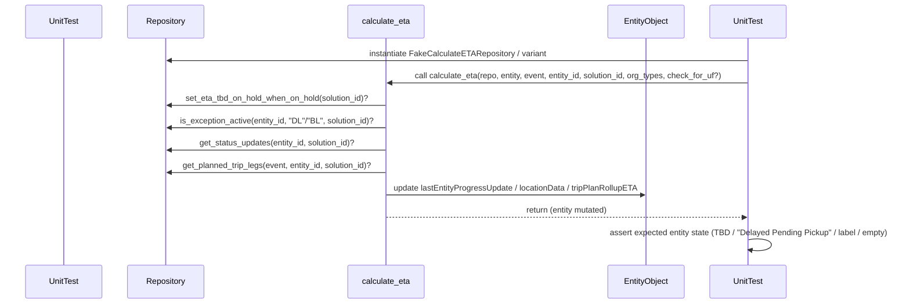

# Diagram: entity_core/entity_service/entity_service_tests/calculate_eta_tests/test_calculate_eta.py

> Auto-generated by Obscura crawlers

## Diagram 1

```mermaid
classDiagram
class FakeCalculateETARepository {
  +set_eta_tbd_on_hold_when_on_hold(solution_id) bool
  +get_planned_trip_legs(event, entity_id, solution_id) list
  +get_status_updates(entity_id, solution_id) list
  +is_exception_active(entity_id, exception, solution_id) bool
}
class FakeRepoWithTBDOnHoldConfig {
  -_set_tbd_on_hold_when_on_hold bool
  +set_eta_tbd_on_hold_when_on_hold(solution_id) bool
}
class FakeRepoWithException {
  -_blacklist_exception bool
  -_delayed_exception bool
  -_is_exception_active_calls list
  +is_exception_active(entity_id, exception, solution_id) bool
}
class FakeRepoWithUpfitterData {
  +get_status_updates(entity_id, solution_id) list
  +get_planned_trip_legs(event, entity_id, solution_id) list
}
class CalculateETAFunction {
  +calculate_eta(repo, entity, event, entity_id, solution_id, org_types, check_for_uf=False)
}
class CalculateEtaForNonCorporateOrganizationUserTests {
  +setUp()
  +test_does_not_show_actual_eta_for_dealer_when_show_eta_for_non_corporate_user_is_disabled()
  +test_does_not_show_actual_eta_for_dealer_when_show_eta_for_non_corporate_user_is_enabled_but_not_in_transit()
  +test_shows_actual_eta_to_dealer_when_show_eta_for_non_corporate_user_is_enabled()
  +...()
}
class CalculateEtaTest {
  +setUp()
  +test_shows_actual_eta_for_corporate_users_when_pending_dispatch_is_not_configured_for_the_solution()
  +test_updates_eta_as_Delayed_when_actual_eta_is_in_the_past()
  +...()
}
class CalculateEtaWithInTransitValueTest {
  +setUp()
  +test_updates_eta_as_TBD_when_inTransit_as_false_and_etaLabel_is_not_available()
  +...()
}
class CalculateEtaWithActiveAndClearHoldsTest {
  +setUp()
  +test_updates_eta_as_TBD_On_Hold_when_entity_has_activeHolds_and_TBD_On_Hold_is_not_configured_for_solution()
  +...()
}
class CalculateEtaWithExceptionsTests {
  +setUp()
  +test_updates_eta_as_TBD_when_exception_has_Delayed_reasonCode()
  +...()
}
class CalculateEtaWithUpfitterLocationCheckTest {
  +setUp()
  +test_updates_eta_as_TBD_when_actual_eta_is_in_past_and_is_on_upfitter_location()
  +...()
}
class CalculateEtaWithoutEntityProgressUpdateTests {
  +setUp()
  +test_returns_empty_data_when_entity_data_is_empty()
  +...()
}
FakeCalculateETARepository <|-- FakeRepoWithTBDOnHoldConfig
FakeCalculateETARepository <|-- FakeRepoWithException
FakeCalculateETARepository <|-- FakeRepoWithUpfitterData
CalculateEtaForNonCorporateOrganizationUserTests --> CalculateETAFunction : calls
CalculateEtaTest --> CalculateETAFunction : calls
CalculateEtaWithInTransitValueTest --> CalculateETAFunction : calls
CalculateEtaWithActiveAndClearHoldsTest --> CalculateETAFunction : calls
CalculateEtaWithExceptionsTests --> CalculateETAFunction : calls
CalculateEtaWithUpfitterLocationCheckTest --> CalculateETAFunction : calls
CalculateEtaWithoutEntityProgressUpdateTests --> CalculateETAFunction : calls
CalculateEtaForNonCorporateOrganizationUserTests --> FakeCalculateETARepository : uses
CalculateEtaTest --> FakeCalculateETARepository : uses
CalculateEtaWithInTransitValueTest --> FakeCalculateETARepository : uses
CalculateEtaWithActiveAndClearHoldsTest --> FakeRepoWithTBDOnHoldConfig : uses
CalculateEtaWithExceptionsTests --> FakeRepoWithException : uses
CalculateEtaWithUpfitterLocationCheckTest --> FakeRepoWithUpfitterData : uses
```

### SVG

<svg id="container" width="5636.404296875" xmlns="http://www.w3.org/2000/svg" class="classDiagram" height="776" viewBox="0 0 5636.404296875 776" role="graphics-document document" aria-roledescription="class"><g><defs><marker id="container_class-aggregationStart" class="marker aggregation class" refX="18" refY="7" markerWidth="190" markerHeight="240" orient="auto"><path d="M 18,7 L9,13 L1,7 L9,1 Z"></path></marker></defs><defs><marker id="container_class-aggregationEnd" class="marker aggregation class" refX="1" refY="7" markerWidth="20" markerHeight="28" orient="auto"><path d="M 18,7 L9,13 L1,7 L9,1 Z"></path></marker></defs><defs><marker id="container_class-extensionStart" class="marker extension class" refX="18" refY="7" markerWidth="190" markerHeight="240" orient="auto"><path d="M 1,7 L18,13 V 1 Z"></path></marker></defs><defs><marker id="container_class-extensionEnd" class="marker extension class" refX="1" refY="7" markerWidth="20" markerHeight="28" orient="auto"><path d="M 1,1 V 13 L18,7 Z"></path></marker></defs><defs><marker id="container_class-compositionStart" class="marker composition class" refX="18" refY="7" markerWidth="190" markerHeight="240" orient="auto"><path d="M 18,7 L9,13 L1,7 L9,1 Z"></path></marker></defs><defs><marker id="container_class-compositionEnd" class="marker composition class" refX="1" refY="7" markerWidth="20" markerHeight="28" orient="auto"><path d="M 18,7 L9,13 L1,7 L9,1 Z"></path></marker></defs><defs><marker id="container_class-dependencyStart" class="marker dependency class" refX="6" refY="7" markerWidth="190" markerHeight="240" orient="auto"><path d="M 5,7 L9,13 L1,7 L9,1 Z"></path></marker></defs><defs><marker id="container_class-dependencyEnd" class="marker dependency class" refX="13" refY="7" markerWidth="20" markerHeight="28" orient="auto"><path d="M 18,7 L9,13 L14,7 L9,1 Z"></path></marker></defs><defs><marker id="container_class-lollipopStart" class="marker lollipop class" refX="13" refY="7" markerWidth="190" markerHeight="240" orient="auto"><circle stroke="black" fill="transparent" cx="7" cy="7" r="6"></circle></marker></defs><defs><marker id="container_class-lollipopEnd" class="marker lollipop class" refX="1" refY="7" markerWidth="190" markerHeight="240" orient="auto"><circle stroke="black" fill="transparent" cx="7" cy="7" r="6"></circle></marker></defs><g class="root"><g class="clusters"></g><g class="edgePaths"><path d="M4987.865,428.907L4775.656,447.256C4563.447,465.605,4139.029,502.302,3951.938,530.818C3764.848,559.333,3815.084,579.667,3840.202,589.833L3865.321,600" id="id_FakeCalculateETARepository_FakeRepoWithTBDOnHoldConfig_1" class="edge-thickness-normal edge-pattern-solid relation" style=";;;" data-edge="true" data-et="edge" data-id="id_FakeCalculateETARepository_FakeRepoWithTBDOnHoldConfig_1" data-points="W3sieCI6NTAwNS4wNTA3ODEyNSwieSI6NDI3LjQyMTE3Mjg4NTU3Mzd9LHsieCI6MzcxNC42MTEzMjgxMjUsInkiOjUzOX0seyJ4IjozODY1LjMyMDYzNTU3MzMwOCwieSI6NjAwfV0=" marker-start="url(#container_class-extensionStart)"></path><path d="M4987.984,447.044L4883.767,462.37C4779.55,477.696,4571.116,508.348,4480.019,529.841C4388.923,551.333,4415.165,563.667,4428.285,569.833L4441.406,576" id="id_FakeCalculateETARepository_FakeRepoWithException_2" class="edge-thickness-normal edge-pattern-solid relation" style=";;;" data-edge="true" data-et="edge" data-id="id_FakeCalculateETARepository_FakeRepoWithException_2" data-points="W3sieCI6NTAwNS4wNTA3ODEyNSwieSI6NDQ0LjUzNDYyODIyNjc2MTl9LHsieCI6NDM2Mi42ODE2NDA2MjUsInkiOjUzOX0seyJ4Ijo0NDQxLjQwNjA3Mzc3ODE5NiwieSI6NTc2fV0=" marker-start="url(#container_class-extensionStart)"></path><path d="M5105.087,510.775L5097.125,515.479C5089.164,520.183,5073.241,529.592,5085.547,543.963C5097.854,558.333,5138.389,577.667,5158.657,587.333L5178.925,597" id="id_FakeCalculateETARepository_FakeRepoWithUpfitterData_3" class="edge-thickness-normal edge-pattern-solid relation" style=";;;" data-edge="true" data-et="edge" data-id="id_FakeCalculateETARepository_FakeRepoWithUpfitterData_3" data-points="W3sieCI6NTExOS45MzgxMTc1MzIxNjksInkiOjUwMn0seyJ4Ijo1MDU3LjMxODM1OTM3NSwieSI6NTM5fSx7IngiOjUxNzguOTI0NTAzNjQxOTE3LCJ5Ijo1OTd9XQ==" marker-start="url(#container_class-extensionStart)"></path><path d="M547.703,230L547.703,236.167C547.703,242.333,547.703,254.667,547.703,283.5C547.703,312.333,547.703,357.667,547.703,403C547.703,448.333,547.703,493.667,703.329,532.184C858.955,570.702,1170.207,602.404,1325.833,618.255L1481.459,634.106" id="id_CalculateEtaForNonCorporateOrganizationUserTests_CalculateETAFunction_4" class="edge-thickness-normal edge-pattern-solid relation" style=";;;" data-edge="true" data-et="edge" data-id="id_CalculateEtaForNonCorporateOrganizationUserTests_CalculateETAFunction_4" data-points="W3sieCI6NTQ3LjcwMzEyNSwieSI6MjMwfSx7IngiOjU0Ny43MDMxMjUsInkiOjI2N30seyJ4Ijo1NDcuNzAzMTI1LCJ5Ijo0MDN9LHsieCI6NTQ3LjcwMzEyNSwieSI6NTM5fSx7IngiOjE0ODcuNDI3NzM0Mzc1LCJ5Ijo2MzQuNzEzODIzOTYxODUzfV0=" marker-end="url(#container_class-dependencyEnd)"></path><path d="M1246.852,218L1220.061,226.167C1193.27,234.333,1139.689,250.667,1112.898,281.5C1086.107,312.333,1086.107,357.667,1086.107,403C1086.107,448.333,1086.107,493.667,1152.438,527.829C1218.768,561.992,1351.429,584.984,1417.759,596.479L1484.089,607.975" id="id_CalculateEtaTest_CalculateETAFunction_5" class="edge-thickness-normal edge-pattern-solid relation" style=";;;" data-edge="true" data-et="edge" data-id="id_CalculateEtaTest_CalculateETAFunction_5" data-points="W3sieCI6MTI0Ni44NTE4MTMyMzkwMjAyLCJ5IjoyMTh9LHsieCI6MTA4Ni4xMDc0MjE4NzUsInkiOjI2N30seyJ4IjoxMDg2LjEwNzQyMTg3NSwieSI6NDAzfSx7IngiOjEwODYuMTA3NDIxODc1LCJ5Ijo1Mzl9LHsieCI6MTQ5MC4wMDEzMzYzNDg2ODQyLCJ5Ijo2MDl9XQ==" marker-end="url(#container_class-dependencyEnd)"></path><path d="M2925.307,151.39L2695.697,170.658C2466.087,189.927,2006.867,228.463,1777.257,270.398C1547.646,312.333,1547.646,357.667,1547.646,403C1547.646,448.333,1547.646,493.667,1573.559,527.601C1599.472,561.536,1651.297,584.072,1677.21,595.339L1703.123,606.607" id="id_CalculateEtaWithInTransitValueTest_CalculateETAFunction_6" class="edge-thickness-normal edge-pattern-solid relation" style=";;;" data-edge="true" data-et="edge" data-id="id_CalculateEtaWithInTransitValueTest_CalculateETAFunction_6" data-points="W3sieCI6MjkyNS4zMDY2NDA2MjUsInkiOjE1MS4zODk5MzU1NDY3NDUyMn0seyJ4IjoxNTQ3LjY0NjQ4NDM3NSwieSI6MjY3fSx7IngiOjE1NDcuNjQ2NDg0Mzc1LCJ5Ijo0MDN9LHsieCI6MTU0Ny42NDY0ODQzNzUsInkiOjUzOX0seyJ4IjoxNzA4LjYyNTEwMjc5NjA1MjcsInkiOjYwOX1d" marker-end="url(#container_class-dependencyEnd)"></path><path d="M2092.637,490L2082.529,498.167C2072.42,506.333,2052.203,522.667,2027.241,541.902C2002.278,561.138,1972.569,583.277,1957.715,594.346L1942.86,605.415" id="id_CalculateEtaWithActiveAndClearHoldsTest_CalculateETAFunction_7" class="edge-thickness-normal edge-pattern-solid relation" style=";;;" data-edge="true" data-et="edge" data-id="id_CalculateEtaWithActiveAndClearHoldsTest_CalculateETAFunction_7" data-points="W3sieCI6MjA5Mi42Mzc0Nzk4OTQzMDE2LCJ5Ijo0OTB9LHsieCI6MjAzMS45ODYzMjgxMjUsInkiOjUzOX0seyJ4IjoxOTM4LjA0OTIzOTMwOTIxMDQsInkiOjYwOX1d" marker-end="url(#container_class-dependencyEnd)"></path><path d="M3431.418,483.208L3392.821,492.507C3354.225,501.806,3277.031,520.403,3076.054,545.742C2875.077,571.082,2550.316,603.164,2387.935,619.205L2225.555,635.246" id="id_CalculateEtaWithExceptionsTests_CalculateETAFunction_8" class="edge-thickness-normal edge-pattern-solid relation" style=";;;" data-edge="true" data-et="edge" data-id="id_CalculateEtaWithExceptionsTests_CalculateETAFunction_8" data-points="W3sieCI6MzQzMS40MTc5Njg3NSwieSI6NDgzLjIwODQyMTk5MjI1NjgzfSx7IngiOjMxOTkuODM3ODkwNjI1LCJ5Ijo1Mzl9LHsieCI6MjIxOS41ODM5ODQzNzUsInkiOjYzNS44MzYyNjgxMDExMTk3fV0=" marker-end="url(#container_class-dependencyEnd)"></path><path d="M4147.277,461.97L4059.346,474.808C3971.415,487.646,3795.553,513.323,3475.268,543.659C3154.983,573.994,2690.275,608.988,2457.921,626.485L2225.567,643.982" id="id_CalculateEtaWithUpfitterLocationCheckTest_CalculateETAFunction_9" class="edge-thickness-normal edge-pattern-solid relation" style=";;;" data-edge="true" data-et="edge" data-id="id_CalculateEtaWithUpfitterLocationCheckTest_CalculateETAFunction_9" data-points="W3sieCI6NDE0Ny4yNzczNDM3NSwieSI6NDYxLjk2OTYyNTU1MDkzNzl9LHsieCI6MzYxOS42OTE0MDYyNSwieSI6NTM5fSx7IngiOjIyMTkuNTgzOTg0Mzc1LCJ5Ijo2NDQuNDMzMDI2MjQwNTYzfV0=" marker-end="url(#container_class-dependencyEnd)"></path><path d="M3381.418,472.425L3429.945,483.521C3478.473,494.617,3575.527,516.808,3382.886,545.537C3190.244,574.266,2707.906,609.531,2466.737,627.164L2225.568,644.797" id="id_CalculateEtaWithoutEntityProgressUpdateTests_CalculateETAFunction_10" class="edge-thickness-normal edge-pattern-solid relation" style=";;;" data-edge="true" data-et="edge" data-id="id_CalculateEtaWithoutEntityProgressUpdateTests_CalculateETAFunction_10" data-points="W3sieCI6MzM4MS40MTc5Njg3NSwieSI6NDcyLjQyNTQ4NjY0MTk3MzM1fSx7IngiOjM2NzIuNTgyMDMxMjUsInkiOjUzOX0seyJ4IjoyMjE5LjU4Mzk4NDM3NSwieSI6NjQ1LjIzNDU1MDkzNDI3MTl9XQ==" marker-end="url(#container_class-dependencyEnd)"></path><path d="M1087.406,147.296L1467.942,167.246C1848.477,187.197,2609.548,227.099,3261.491,266.305C3913.435,305.512,4456.25,344.024,4727.658,363.281L4999.066,382.537" id="id_CalculateEtaForNonCorporateOrganizationUserTests_FakeCalculateETARepository_11" class="edge-thickness-normal edge-pattern-solid relation" style=";;;" data-edge="true" data-et="edge" data-id="id_CalculateEtaForNonCorporateOrganizationUserTests_FakeCalculateETARepository_11" data-points="W3sieCI6MTA4Ny40MDYyNSwieSI6MTQ3LjI5NTU4NTg2MTUyODF9LHsieCI6MzM3MC42MTkxNDA2MjUsInkiOjI2N30seyJ4Ijo1MDA1LjA1MDc4MTI1LCJ5IjozODIuOTYxMzM0MjQ3NjM4OTR9XQ==" marker-end="url(#container_class-dependencyEnd)"></path><path d="M2005.836,136.294L2552.778,158.079C3099.72,179.863,4193.604,223.431,4740.546,250.382C5287.488,277.333,5287.488,287.667,5287.488,292.833L5287.488,298" id="id_CalculateEtaTest_FakeCalculateETARepository_12" class="edge-thickness-normal edge-pattern-solid relation" style=";;;" data-edge="true" data-et="edge" data-id="id_CalculateEtaTest_FakeCalculateETARepository_12" data-points="W3sieCI6MjAwNS44MzU5Mzc1LCJ5IjoxMzYuMjk0NDI3ODIzMjQ5NTJ9LHsieCI6NTI4Ny40ODgyODEyNSwieSI6MjY3fSx7IngiOjUyODcuNDg4MjgxMjUsInkiOjMwNH1d" marker-end="url(#container_class-dependencyEnd)"></path><path d="M3697.252,142.433L4039.222,163.194C4381.193,183.955,5065.133,225.478,5378.205,254.753C5691.277,284.029,5633.479,301.059,5604.58,309.573L5575.681,318.088" id="id_CalculateEtaWithInTransitValueTest_FakeCalculateETARepository_13" class="edge-thickness-normal edge-pattern-solid relation" style=";;;" data-edge="true" data-et="edge" data-id="id_CalculateEtaWithInTransitValueTest_FakeCalculateETARepository_13" data-points="W3sieCI6MzY5Ny4yNTE5NTMxMjUsInkiOjE0Mi40MzI2MzI3NTAzNjQzNX0seyJ4Ijo1NzQ5LjA3NDIxODc1LCJ5IjoyNjd9LHsieCI6NTU2OS45MjU3ODEyNSwieSI6MzE5Ljc4MzY0MzM0OTE4Njd9XQ==" marker-end="url(#container_class-dependencyEnd)"></path><path d="M2724.152,436.511L2991.159,453.593C3258.165,470.674,3792.177,504.837,4038.457,531.66C4284.737,558.483,4243.284,577.965,4222.557,587.707L4201.831,597.448" id="id_CalculateEtaWithActiveAndClearHoldsTest_FakeRepoWithTBDOnHoldConfig_14" class="edge-thickness-normal edge-pattern-solid relation" style=";;;" data-edge="true" data-et="edge" data-id="id_CalculateEtaWithActiveAndClearHoldsTest_FakeRepoWithTBDOnHoldConfig_14" data-points="W3sieCI6MjcyNC4xNTIzNDM3NSwieSI6NDM2LjUxMTM1NTIxMTA2NzU1fSx7IngiOjQzMjYuMTg5NDUzMTI1LCJ5Ijo1Mzl9LHsieCI6NDE5Ni40MDA1MjI3OTEzNTMsInkiOjYwMH1d" marker-end="url(#container_class-dependencyEnd)"></path><path d="M4097.277,453.334L4191.716,467.612C4286.155,481.889,4475.033,510.445,4568.761,529.898C4662.49,549.352,4661.07,559.704,4660.36,564.88L4659.65,570.056" id="id_CalculateEtaWithExceptionsTests_FakeRepoWithException_15" class="edge-thickness-normal edge-pattern-solid relation" style=";;;" data-edge="true" data-et="edge" data-id="id_CalculateEtaWithExceptionsTests_FakeRepoWithException_15" data-points="W3sieCI6NDA5Ny4yNzczNDM3NSwieSI6NDUzLjMzMzg0Mjg0MDI2OTZ9LHsieCI6NDY2My45MTAxNTYyNSwieSI6NTM5fSx7IngiOjQ2NTguODM0MTc1MjgxOTU1LCJ5Ijo1NzZ9XQ==" marker-end="url(#container_class-dependencyEnd)"></path><path d="M4955.051,471.382L5021.612,482.652C5088.174,493.922,5221.297,516.461,5286.668,536.406C5352.039,556.352,5349.659,573.704,5348.469,582.38L5347.278,591.056" id="id_CalculateEtaWithUpfitterLocationCheckTest_FakeRepoWithUpfitterData_16" class="edge-thickness-normal edge-pattern-solid relation" style=";;;" data-edge="true" data-et="edge" data-id="id_CalculateEtaWithUpfitterLocationCheckTest_FakeRepoWithUpfitterData_16" data-points="W3sieCI6NDk1NS4wNTA3ODEyNSwieSI6NDcxLjM4MjQzNzY4NjQ2NjQ2fSx7IngiOjUzNTQuNDE5OTIxODc1LCJ5Ijo1Mzl9LHsieCI6NTM0Ni40NjI5Nzg3MzU5MDMsInkiOjU5N31d" marker-end="url(#container_class-dependencyEnd)"></path></g><g class="edgeLabels"><g class="edgeLabel"><g class="label" data-id="id_FakeCalculateETARepository_FakeRepoWithTBDOnHoldConfig_1" transform="translate(0, 0)"><foreignObject width="0" height="0">

</foreignObject></g></g><g class="edgeLabel"><g class="label" data-id="id_FakeCalculateETARepository_FakeRepoWithException_2" transform="translate(0, 0)"><foreignObject width="0" height="0">

</foreignObject></g></g><g class="edgeLabel"><g class="label" data-id="id_FakeCalculateETARepository_FakeRepoWithUpfitterData_3" transform="translate(0, 0)"><foreignObject width="0" height="0">

</foreignObject></g></g><g class="edgeLabel" transform="translate(547.703125, 403)"><g class="label" data-id="id_CalculateEtaForNonCorporateOrganizationUserTests_CalculateETAFunction_4" transform="translate(-16.4453125, -12)"><foreignObject width="32.890625" height="24">

calls

</foreignObject></g></g><g class="edgeLabel" transform="translate(1086.107421875, 403)"><g class="label" data-id="id_CalculateEtaTest_CalculateETAFunction_5" transform="translate(-16.4453125, -12)"><foreignObject width="32.890625" height="24">

calls

</foreignObject></g></g><g class="edgeLabel" transform="translate(1547.646484375, 403)"><g class="label" data-id="id_CalculateEtaWithInTransitValueTest_CalculateETAFunction_6" transform="translate(-16.4453125, -12)"><foreignObject width="32.890625" height="24">

calls

</foreignObject></g></g><g class="edgeLabel" transform="translate(2016.27858, 550.70509)"><g class="label" data-id="id_CalculateEtaWithActiveAndClearHoldsTest_CalculateETAFunction_7" transform="translate(-16.4453125, -12)"><foreignObject width="32.890625" height="24">

calls

</foreignObject></g></g><g class="edgeLabel" transform="translate(2828.23693, 575.70932)"><g class="label" data-id="id_CalculateEtaWithExceptionsTests_CalculateETAFunction_8" transform="translate(-16.4453125, -12)"><foreignObject width="32.890625" height="24">

calls

</foreignObject></g></g><g class="edgeLabel" transform="translate(3185.47488, 571.69804)"><g class="label" data-id="id_CalculateEtaWithUpfitterLocationCheckTest_CalculateETAFunction_9" transform="translate(-16.4453125, -12)"><foreignObject width="32.890625" height="24">

calls

</foreignObject></g></g><g class="edgeLabel" transform="translate(3095.02455, 581.22756)"><g class="label" data-id="id_CalculateEtaWithoutEntityProgressUpdateTests_CalculateETAFunction_10" transform="translate(-16.4453125, -12)"><foreignObject width="32.890625" height="24">

calls

</foreignObject></g></g><g class="edgeLabel" transform="translate(3047.15912, 250.04162)"><g class="label" data-id="id_CalculateEtaForNonCorporateOrganizationUserTests_FakeCalculateETARepository_11" transform="translate(-16.4921875, -12)"><foreignObject width="32.984375" height="24">

uses

</foreignObject></g></g><g class="edgeLabel" transform="translate(5287.48828125, 267)"><g class="label" data-id="id_CalculateEtaTest_FakeCalculateETARepository_12" transform="translate(-16.4921875, -12)"><foreignObject width="32.984375" height="24">

uses

</foreignObject></g></g><g class="edgeLabel" transform="translate(4816.37278, 210.37513)"><g class="label" data-id="id_CalculateEtaWithInTransitValueTest_FakeCalculateETARepository_13" transform="translate(-16.4921875, -12)"><foreignObject width="32.984375" height="24">

uses

</foreignObject></g></g><g class="edgeLabel" transform="translate(3596.72916, 492.33354)"><g class="label" data-id="id_CalculateEtaWithActiveAndClearHoldsTest_FakeRepoWithTBDOnHoldConfig_14" transform="translate(-16.4921875, -12)"><foreignObject width="32.984375" height="24">

uses

</foreignObject></g></g><g class="edgeLabel" transform="translate(4399.05721, 498.95831)"><g class="label" data-id="id_CalculateEtaWithExceptionsTests_FakeRepoWithException_15" transform="translate(-16.4921875, -12)"><foreignObject width="32.984375" height="24">

uses

</foreignObject></g></g><g class="edgeLabel" transform="translate(5183.59624, 510.07768)"><g class="label" data-id="id_CalculateEtaWithUpfitterLocationCheckTest_FakeRepoWithUpfitterData_16" transform="translate(-16.4921875, -12)"><foreignObject width="32.984375" height="24">

uses

</foreignObject></g></g></g><g class="nodes"><g class="node default" id="classId-FakeCalculateETARepository-0" transform="translate(5287.48828125, 403)"><g class="basic label-container"><path d="M-282.4375 -99 L282.4375 -99 L282.4375 99 L-282.4375 99" stroke="none" stroke-width="0" fill="#ECECFF" style=""></path><path d="M-282.4375 -99 C-116.87876061982274 -99, 48.679978760354516 -99, 282.4375 -99 M-282.4375 -99 C-149.65465112873466 -99, -16.871802257469312 -99, 282.4375 -99 M282.4375 -99 C282.4375 -22.080082251786862, 282.4375 54.839835496426275, 282.4375 99 M282.4375 -99 C282.4375 -37.8239683373496, 282.4375 23.352063325300804, 282.4375 99 M282.4375 99 C83.54731373270872 99, -115.34287253458257 99, -282.4375 99 M282.4375 99 C81.24746077585189 99, -119.94257844829622 99, -282.4375 99 M-282.4375 99 C-282.4375 52.675440129847686, -282.4375 6.350880259695373, -282.4375 -99 M-282.4375 99 C-282.4375 55.53239765426531, -282.4375 12.06479530853062, -282.4375 -99" stroke="#9370DB" stroke-width="1.3" fill="none" stroke-dasharray="0 0" style=""></path></g><g class="annotation-group text" transform="translate(0, -75)"></g><g class="label-group text" transform="translate(-102.71875, -75)"><g class="label" style="font-weight: bolder" transform="translate(0,-12)"><foreignObject width="205.4375" height="24">

FakeCalculateETARepository

</foreignObject></g></g><g class="members-group text" transform="translate(-270.4375, -27)"></g><g class="methods-group text" transform="translate(-270.4375, 3)"><g class="label" style="" transform="translate(0,-12)"><foreignObject width="414.5" height="24">

+set_eta_tbd_on_hold_when_on_hold(solution_id) : bool

</foreignObject></g><g class="label" style="" transform="translate(0,12)"><foreignObject width="417.34375" height="24">

+get_planned_trip_legs(event, entity_id, solution_id) : list

</foreignObject></g><g class="label" style="" transform="translate(0,36)"><foreignObject width="349.078125" height="24">

+get_status_updates(entity_id, solution_id) : list

</foreignObject></g><g class="label" style="" transform="translate(0,60)"><foreignObject width="438.15625" height="24">

+is_exception_active(entity_id, exception, solution_id) : bool

</foreignObject></g></g><g class="divider" style=""><path d="M-282.4375 -51 C-168.0105654531381 -51, -53.58363090627623 -51, 282.4375 -51 M-282.4375 -51 C-97.58185389185371 -51, 87.27379221629258 -51, 282.4375 -51" stroke="#9370DB" stroke-width="1.3" fill="none" stroke-dasharray="0 0" style=""></path></g><g class="divider" style=""><path d="M-282.4375 -27 C-87.63097277870935 -27, 107.1755544425813 -27, 282.4375 -27 M-282.4375 -27 C-75.59649204599498 -27, 131.24451590801004 -27, 282.4375 -27" stroke="#9370DB" stroke-width="1.3" fill="none" stroke-dasharray="0 0" style=""></path></g></g><g class="node default" id="classId-FakeRepoWithTBDOnHoldConfig-1" transform="translate(4043.20703125, 672)"><g class="basic label-container"><path d="M-277.55859375 -72 L277.55859375 -72 L277.55859375 72 L-277.55859375 72" stroke="none" stroke-width="0" fill="#ECECFF" style=""></path><path d="M-277.55859375 -72 C-142.83523446168027 -72, -8.111875173360545 -72, 277.55859375 -72 M-277.55859375 -72 C-143.49445441422387 -72, -9.430315078447734 -72, 277.55859375 -72 M277.55859375 -72 C277.55859375 -17.337699541901557, 277.55859375 37.324600916196886, 277.55859375 72 M277.55859375 -72 C277.55859375 -21.554438775922378, 277.55859375 28.891122448155244, 277.55859375 72 M277.55859375 72 C151.39789398397022 72, 25.23719421794047 72, -277.55859375 72 M277.55859375 72 C94.0232357169146 72, -89.5121223161708 72, -277.55859375 72 M-277.55859375 72 C-277.55859375 38.17661536967111, -277.55859375 4.353230739342223, -277.55859375 -72 M-277.55859375 72 C-277.55859375 28.506007516932797, -277.55859375 -14.987984966134405, -277.55859375 -72" stroke="#9370DB" stroke-width="1.3" fill="none" stroke-dasharray="0 0" style=""></path></g><g class="annotation-group text" transform="translate(0, -48)"></g><g class="label-group text" transform="translate(-116.6171875, -48)"><g class="label" style="font-weight: bolder" transform="translate(0,-12)"><foreignObject width="233.234375" height="24">

FakeRepoWithTBDOnHoldConfig

</foreignObject></g></g><g class="members-group text" transform="translate(-265.55859375, 0)"><g class="label" style="" transform="translate(0,-12)"><foreignObject width="288.25" height="24">

-_set_tbd_on_hold_when_on_hold bool

</foreignObject></g></g><g class="methods-group text" transform="translate(-265.55859375, 48)"><g class="label" style="" transform="translate(0,-12)"><foreignObject width="414.5" height="24">

+set_eta_tbd_on_hold_when_on_hold(solution_id) : bool

</foreignObject></g></g><g class="divider" style=""><path d="M-277.55859375 -24 C-63.534433114221144 -24, 150.4897275215577 -24, 277.55859375 -24 M-277.55859375 -24 C-121.03695956490938 -24, 35.48467462018124 -24, 277.55859375 -24" stroke="#9370DB" stroke-width="1.3" fill="none" stroke-dasharray="0 0" style=""></path></g><g class="divider" style=""><path d="M-277.55859375 24 C-55.75583371701251 24, 166.04692631597499 24, 277.55859375 24 M-277.55859375 24 C-74.09514147336878 24, 129.36831080326243 24, 277.55859375 24" stroke="#9370DB" stroke-width="1.3" fill="none" stroke-dasharray="0 0" style=""></path></g></g><g class="node default" id="classId-FakeRepoWithException-2" transform="translate(4645.6640625, 672)"><g class="basic label-container"><path d="M-274.8984375 -96 L274.8984375 -96 L274.8984375 96 L-274.8984375 96" stroke="none" stroke-width="0" fill="#ECECFF" style=""></path><path d="M-274.8984375 -96 C-100.18404677632427 -96, 74.53034394735147 -96, 274.8984375 -96 M-274.8984375 -96 C-141.90647054343134 -96, -8.91450358686268 -96, 274.8984375 -96 M274.8984375 -96 C274.8984375 -26.6552161903181, 274.8984375 42.6895676193638, 274.8984375 96 M274.8984375 -96 C274.8984375 -20.87476259767952, 274.8984375 54.25047480464096, 274.8984375 96 M274.8984375 96 C76.29590615670665 96, -122.3066251865867 96, -274.8984375 96 M274.8984375 96 C65.17478751820894 96, -144.5488624635821 96, -274.8984375 96 M-274.8984375 96 C-274.8984375 20.518130476652573, -274.8984375 -54.963739046694855, -274.8984375 -96 M-274.8984375 96 C-274.8984375 21.705362140683036, -274.8984375 -52.58927571863393, -274.8984375 -96" stroke="#9370DB" stroke-width="1.3" fill="none" stroke-dasharray="0 0" style=""></path></g><g class="annotation-group text" transform="translate(0, -72)"></g><g class="label-group text" transform="translate(-87.640625, -72)"><g class="label" style="font-weight: bolder" transform="translate(0,-12)"><foreignObject width="175.28125" height="24">

FakeRepoWithException

</foreignObject></g></g><g class="members-group text" transform="translate(-262.8984375, -24)"><g class="label" style="" transform="translate(0,-12)"><foreignObject width="190.46875" height="24">

-_blacklist_exception bool

</foreignObject></g><g class="label" style="" transform="translate(0,12)"><foreignObject width="186.5" height="24">

-_delayed_exception bool

</foreignObject></g><g class="label" style="" transform="translate(0,36)"><foreignObject width="222.328125" height="24">

-_is_exception_active_calls list

</foreignObject></g></g><g class="methods-group text" transform="translate(-262.8984375, 72)"><g class="label" style="" transform="translate(0,-12)"><foreignObject width="438.15625" height="24">

+is_exception_active(entity_id, exception, solution_id) : bool

</foreignObject></g></g><g class="divider" style=""><path d="M-274.8984375 -48 C-87.05196114849991 -48, 100.79451520300017 -48, 274.8984375 -48 M-274.8984375 -48 C-152.42050501354834 -48, -29.942572527096672 -48, 274.8984375 -48" stroke="#9370DB" stroke-width="1.3" fill="none" stroke-dasharray="0 0" style=""></path></g><g class="divider" style=""><path d="M-274.8984375 48 C-108.46044977908426 48, 57.977537941831486 48, 274.8984375 48 M-274.8984375 48 C-126.93495792789349 48, 21.028521644213015 48, 274.8984375 48" stroke="#9370DB" stroke-width="1.3" fill="none" stroke-dasharray="0 0" style=""></path></g></g><g class="node default" id="classId-FakeRepoWithUpfitterData-3" transform="translate(5336.173828125, 672)"><g class="basic label-container"><path d="M-269.3046875 -75 L269.3046875 -75 L269.3046875 75 L-269.3046875 75" stroke="none" stroke-width="0" fill="#ECECFF" style=""></path><path d="M-269.3046875 -75 C-88.74454938269216 -75, 91.81558873461569 -75, 269.3046875 -75 M-269.3046875 -75 C-158.53512314128642 -75, -47.76555878257284 -75, 269.3046875 -75 M269.3046875 -75 C269.3046875 -39.76082437938344, 269.3046875 -4.5216487587668865, 269.3046875 75 M269.3046875 -75 C269.3046875 -19.74912276653189, 269.3046875 35.50175446693622, 269.3046875 75 M269.3046875 75 C137.97627438155473 75, 6.647861263109462 75, -269.3046875 75 M269.3046875 75 C155.93548834412874 75, 42.566289188257485 75, -269.3046875 75 M-269.3046875 75 C-269.3046875 40.49732184304546, -269.3046875 5.9946436860909245, -269.3046875 -75 M-269.3046875 75 C-269.3046875 23.287571867953723, -269.3046875 -28.424856264092554, -269.3046875 -75" stroke="#9370DB" stroke-width="1.3" fill="none" stroke-dasharray="0 0" style=""></path></g><g class="annotation-group text" transform="translate(0, -51)"></g><g class="label-group text" transform="translate(-97.265625, -51)"><g class="label" style="font-weight: bolder" transform="translate(0,-12)"><foreignObject width="194.53125" height="24">

FakeRepoWithUpfitterData

</foreignObject></g></g><g class="members-group text" transform="translate(-257.3046875, -3)"></g><g class="methods-group text" transform="translate(-257.3046875, 27)"><g class="label" style="" transform="translate(0,-12)"><foreignObject width="349.078125" height="24">

+get_status_updates(entity_id, solution_id) : list

</foreignObject></g><g class="label" style="" transform="translate(0,12)"><foreignObject width="417.34375" height="24">

+get_planned_trip_legs(event, entity_id, solution_id) : list

</foreignObject></g></g><g class="divider" style=""><path d="M-269.3046875 -27 C-74.06449889270476 -27, 121.17568971459048 -27, 269.3046875 -27 M-269.3046875 -27 C-94.23233331611527 -27, 80.84002086776945 -27, 269.3046875 -27" stroke="#9370DB" stroke-width="1.3" fill="none" stroke-dasharray="0 0" style=""></path></g><g class="divider" style=""><path d="M-269.3046875 -3 C-71.50199183837131 -3, 126.30070382325738 -3, 269.3046875 -3 M-269.3046875 -3 C-134.86117874720938 -3, -0.41766999441875896 -3, 269.3046875 -3" stroke="#9370DB" stroke-width="1.3" fill="none" stroke-dasharray="0 0" style=""></path></g></g><g class="node default" id="classId-CalculateETAFunction-4" transform="translate(1853.505859375, 672)"><g class="basic label-container"><path d="M-366.078125 -63 L366.078125 -63 L366.078125 63 L-366.078125 63" stroke="none" stroke-width="0" fill="#ECECFF" style=""></path><path d="M-366.078125 -63 C-188.16096440312708 -63, -10.243803806254164 -63, 366.078125 -63 M-366.078125 -63 C-79.58050090217569 -63, 206.91712319564863 -63, 366.078125 -63 M366.078125 -63 C366.078125 -20.22863467763154, 366.078125 22.54273064473692, 366.078125 63 M366.078125 -63 C366.078125 -35.4151883214011, 366.078125 -7.830376642802193, 366.078125 63 M366.078125 63 C79.77437774232124 63, -206.52936951535753 63, -366.078125 63 M366.078125 63 C150.918424489278 63, -64.24127602144398 63, -366.078125 63 M-366.078125 63 C-366.078125 19.653930542117706, -366.078125 -23.692138915764588, -366.078125 -63 M-366.078125 63 C-366.078125 30.975412315952987, -366.078125 -1.0491753680940263, -366.078125 -63" stroke="#9370DB" stroke-width="1.3" fill="none" stroke-dasharray="0 0" style=""></path></g><g class="annotation-group text" transform="translate(0, -39)"></g><g class="label-group text" transform="translate(-77.6875, -39)"><g class="label" style="font-weight: bolder" transform="translate(0,-12)"><foreignObject width="155.375" height="24">

CalculateETAFunction

</foreignObject></g></g><g class="members-group text" transform="translate(-354.078125, 9)"></g><g class="methods-group text" transform="translate(-354.078125, 39)"><g class="label" style="" transform="translate(0,-12)"><foreignObject width="630.46875" height="24">

+calculate_eta(repo, entity, event, entity_id, solution_id, org_types, check_for_uf=False)

</foreignObject></g></g><g class="divider" style=""><path d="M-366.078125 -15 C-112.36460298553604 -15, 141.34891902892792 -15, 366.078125 -15 M-366.078125 -15 C-92.45361533785132 -15, 181.17089432429736 -15, 366.078125 -15" stroke="#9370DB" stroke-width="1.3" fill="none" stroke-dasharray="0 0" style=""></path></g><g class="divider" style=""><path d="M-366.078125 9 C-92.71032133685452 9, 180.65748232629096 9, 366.078125 9 M-366.078125 9 C-128.48006056898234 9, 109.11800386203532 9, 366.078125 9" stroke="#9370DB" stroke-width="1.3" fill="none" stroke-dasharray="0 0" style=""></path></g></g><g class="node default" id="classId-CalculateEtaForNonCorporateOrganizationUserTests-5" transform="translate(547.703125, 119)"><g class="basic label-container"><path d="M-539.703125 -111 L539.703125 -111 L539.703125 111 L-539.703125 111" stroke="none" stroke-width="0" fill="#ECECFF" style=""></path><path d="M-539.703125 -111 C-260.79469586832744 -111, 18.113733263345125 -111, 539.703125 -111 M-539.703125 -111 C-175.98883974079712 -111, 187.72544551840576 -111, 539.703125 -111 M539.703125 -111 C539.703125 -24.283798641972794, 539.703125 62.43240271605441, 539.703125 111 M539.703125 -111 C539.703125 -25.492584264245053, 539.703125 60.01483147150989, 539.703125 111 M539.703125 111 C295.50013822381413 111, 51.29715144762821 111, -539.703125 111 M539.703125 111 C208.0485741976051 111, -123.60597660478982 111, -539.703125 111 M-539.703125 111 C-539.703125 53.564091550848, -539.703125 -3.8718168983040044, -539.703125 -111 M-539.703125 111 C-539.703125 36.3647070227147, -539.703125 -38.270585954570606, -539.703125 -111" stroke="#9370DB" stroke-width="1.3" fill="none" stroke-dasharray="0 0" style=""></path></g><g class="annotation-group text" transform="translate(0, -87)"></g><g class="label-group text" transform="translate(-190, -87)"><g class="label" style="font-weight: bolder" transform="translate(0,-12)"><foreignObject width="380" height="24">

CalculateEtaForNonCorporateOrganizationUserTests

</foreignObject></g></g><g class="members-group text" transform="translate(-527.703125, -39)"></g><g class="methods-group text" transform="translate(-527.703125, -9)"><g class="label" style="" transform="translate(0,-12)"><foreignObject width="60.421875" height="24">

+setUp()

</foreignObject></g><g class="label" style="" transform="translate(0,12)"><foreignObject width="725.53125" height="24">

+test_does_not_show_actual_eta_for_dealer_when_show_eta_for_non_corporate_user_is_disabled()

</foreignObject></g><g class="label" style="" transform="translate(0,36)"><foreignObject width="865.40625" height="24">

+test_does_not_show_actual_eta_for_dealer_when_show_eta_for_non_corporate_user_is_enabled_but_not_in_transit()

</foreignObject></g><g class="label" style="" transform="translate(0,60)"><foreignObject width="649.21875" height="24">

+test_shows_actual_eta_to_dealer_when_show_eta_for_non_corporate_user_is_enabled()

</foreignObject></g><g class="label" style="" transform="translate(0,84)"><foreignObject width="29.078125" height="24">

+...()

</foreignObject></g></g><g class="divider" style=""><path d="M-539.703125 -63 C-186.21322721705565 -63, 167.2766705658887 -63, 539.703125 -63 M-539.703125 -63 C-255.8078409440729 -63, 28.087443111854213 -63, 539.703125 -63" stroke="#9370DB" stroke-width="1.3" fill="none" stroke-dasharray="0 0" style=""></path></g><g class="divider" style=""><path d="M-539.703125 -39 C-212.48123336319878 -39, 114.74065827360243 -39, 539.703125 -39 M-539.703125 -39 C-174.8241525444219 -39, 190.0548199111562 -39, 539.703125 -39" stroke="#9370DB" stroke-width="1.3" fill="none" stroke-dasharray="0 0" style=""></path></g></g><g class="node default" id="classId-CalculateEtaTest-6" transform="translate(1571.62109375, 119)"><g class="basic label-container"><path d="M-434.21484375 -99 L434.21484375 -99 L434.21484375 99 L-434.21484375 99" stroke="none" stroke-width="0" fill="#ECECFF" style=""></path><path d="M-434.21484375 -99 C-218.7599778015066 -99, -3.3051118530132158 -99, 434.21484375 -99 M-434.21484375 -99 C-259.9825019037176 -99, -85.75016005743521 -99, 434.21484375 -99 M434.21484375 -99 C434.21484375 -20.50247485846927, 434.21484375 57.99505028306146, 434.21484375 99 M434.21484375 -99 C434.21484375 -49.322530462153324, 434.21484375 0.3549390756933519, 434.21484375 99 M434.21484375 99 C245.90165515772404 99, 57.58846656544807 99, -434.21484375 99 M434.21484375 99 C188.97596493818835 99, -56.26291387362329 99, -434.21484375 99 M-434.21484375 99 C-434.21484375 59.15741204858806, -434.21484375 19.314824097176114, -434.21484375 -99 M-434.21484375 99 C-434.21484375 58.96289994077692, -434.21484375 18.925799881553843, -434.21484375 -99" stroke="#9370DB" stroke-width="1.3" fill="none" stroke-dasharray="0 0" style=""></path></g><g class="annotation-group text" transform="translate(0, -75)"></g><g class="label-group text" transform="translate(-60.2578125, -75)"><g class="label" style="font-weight: bolder" transform="translate(0,-12)"><foreignObject width="120.515625" height="24">

CalculateEtaTest

</foreignObject></g></g><g class="members-group text" transform="translate(-422.21484375, -27)"></g><g class="methods-group text" transform="translate(-422.21484375, 3)"><g class="label" style="" transform="translate(0,-12)"><foreignObject width="60.421875" height="24">

+setUp()

</foreignObject></g><g class="label" style="" transform="translate(0,12)"><foreignObject width="784.171875" height="24">

+test_shows_actual_eta_for_corporate_users_when_pending_dispatch_is_not_configured_for_the_solution()

</foreignObject></g><g class="label" style="" transform="translate(0,36)"><foreignObject width="477.484375" height="24">

+test_updates_eta_as_Delayed_when_actual_eta_is_in_the_past()

</foreignObject></g><g class="label" style="" transform="translate(0,60)"><foreignObject width="29.078125" height="24">

+...()

</foreignObject></g></g><g class="divider" style=""><path d="M-434.21484375 -51 C-139.37696290659085 -51, 155.4609179368183 -51, 434.21484375 -51 M-434.21484375 -51 C-116.46540492054248 -51, 201.28403390891503 -51, 434.21484375 -51" stroke="#9370DB" stroke-width="1.3" fill="none" stroke-dasharray="0 0" style=""></path></g><g class="divider" style=""><path d="M-434.21484375 -27 C-107.73329353629862 -27, 218.74825667740276 -27, 434.21484375 -27 M-434.21484375 -27 C-242.9839491033735 -27, -51.75305445674701 -27, 434.21484375 -27" stroke="#9370DB" stroke-width="1.3" fill="none" stroke-dasharray="0 0" style=""></path></g></g><g class="node default" id="classId-CalculateEtaWithInTransitValueTest-7" transform="translate(3311.279296875, 119)"><g class="basic label-container"><path d="M-385.97265625 -87 L385.97265625 -87 L385.97265625 87 L-385.97265625 87" stroke="none" stroke-width="0" fill="#ECECFF" style=""></path><path d="M-385.97265625 -87 C-168.81765891307586 -87, 48.33733842384828 -87, 385.97265625 -87 M-385.97265625 -87 C-148.3304152702871 -87, 89.31182570942582 -87, 385.97265625 -87 M385.97265625 -87 C385.97265625 -43.5699962460801, 385.97265625 -0.1399924921602036, 385.97265625 87 M385.97265625 -87 C385.97265625 -39.44131253675342, 385.97265625 8.117374926493156, 385.97265625 87 M385.97265625 87 C192.12863420572373 87, -1.7153878385525445 87, -385.97265625 87 M385.97265625 87 C143.76347061255385 87, -98.44571502489231 87, -385.97265625 87 M-385.97265625 87 C-385.97265625 18.357113861492877, -385.97265625 -50.285772277014246, -385.97265625 -87 M-385.97265625 87 C-385.97265625 32.34544982591484, -385.97265625 -22.30910034817032, -385.97265625 -87" stroke="#9370DB" stroke-width="1.3" fill="none" stroke-dasharray="0 0" style=""></path></g><g class="annotation-group text" transform="translate(0, -63)"></g><g class="label-group text" transform="translate(-129.0859375, -63)"><g class="label" style="font-weight: bolder" transform="translate(0,-12)"><foreignObject width="258.171875" height="24">

CalculateEtaWithInTransitValueTest

</foreignObject></g></g><g class="members-group text" transform="translate(-373.97265625, -15)"></g><g class="methods-group text" transform="translate(-373.97265625, 15)"><g class="label" style="" transform="translate(0,-12)"><foreignObject width="60.421875" height="24">

+setUp()

</foreignObject></g><g class="label" style="" transform="translate(0,12)"><foreignObject width="618.859375" height="24">

+test_updates_eta_as_TBD_when_inTransit_as_false_and_etaLabel_is_not_available()

</foreignObject></g><g class="label" style="" transform="translate(0,36)"><foreignObject width="29.078125" height="24">

+...()

</foreignObject></g></g><g class="divider" style=""><path d="M-385.97265625 -39 C-179.0711616604576 -39, 27.83033292908482 -39, 385.97265625 -39 M-385.97265625 -39 C-211.2918960128255 -39, -36.61113577565101 -39, 385.97265625 -39" stroke="#9370DB" stroke-width="1.3" fill="none" stroke-dasharray="0 0" style=""></path></g><g class="divider" style=""><path d="M-385.97265625 -15 C-142.73156187457027 -15, 100.50953250085945 -15, 385.97265625 -15 M-385.97265625 -15 C-207.4900155498477 -15, -29.007374849695395 -15, 385.97265625 -15" stroke="#9370DB" stroke-width="1.3" fill="none" stroke-dasharray="0 0" style=""></path></g></g><g class="node default" id="classId-CalculateEtaWithActiveAndClearHoldsTest-8" transform="translate(2200.32421875, 403)"><g class="basic label-container"><path d="M-523.828125 -87 L523.828125 -87 L523.828125 87 L-523.828125 87" stroke="none" stroke-width="0" fill="#ECECFF" style=""></path><path d="M-523.828125 -87 C-277.4291932328749 -87, -31.030261465749845 -87, 523.828125 -87 M-523.828125 -87 C-154.25787925382838 -87, 215.31236649234324 -87, 523.828125 -87 M523.828125 -87 C523.828125 -21.59661042428644, 523.828125 43.80677915142712, 523.828125 87 M523.828125 -87 C523.828125 -29.82489156080984, 523.828125 27.350216878380323, 523.828125 87 M523.828125 87 C244.12468626311767 87, -35.578752473764666 87, -523.828125 87 M523.828125 87 C219.27487138734034 87, -85.27838222531932 87, -523.828125 87 M-523.828125 87 C-523.828125 49.078950455718115, -523.828125 11.15790091143623, -523.828125 -87 M-523.828125 87 C-523.828125 44.2097081473984, -523.828125 1.4194162947968039, -523.828125 -87" stroke="#9370DB" stroke-width="1.3" fill="none" stroke-dasharray="0 0" style=""></path></g><g class="annotation-group text" transform="translate(0, -63)"></g><g class="label-group text" transform="translate(-153.265625, -63)"><g class="label" style="font-weight: bolder" transform="translate(0,-12)"><foreignObject width="306.53125" height="24">

CalculateEtaWithActiveAndClearHoldsTest

</foreignObject></g></g><g class="members-group text" transform="translate(-511.828125, -15)"></g><g class="methods-group text" transform="translate(-511.828125, 15)"><g class="label" style="" transform="translate(0,-12)"><foreignObject width="60.421875" height="24">

+setUp()

</foreignObject></g><g class="label" style="" transform="translate(0,12)"><foreignObject width="870.390625" height="24">

+test_updates_eta_as_TBD_On_Hold_when_entity_has_activeHolds_and_TBD_On_Hold_is_not_configured_for_solution()

</foreignObject></g><g class="label" style="" transform="translate(0,36)"><foreignObject width="29.078125" height="24">

+...()

</foreignObject></g></g><g class="divider" style=""><path d="M-523.828125 -39 C-238.50767416302932 -39, 46.81277667394136 -39, 523.828125 -39 M-523.828125 -39 C-155.65351711668376 -39, 212.52109076663248 -39, 523.828125 -39" stroke="#9370DB" stroke-width="1.3" fill="none" stroke-dasharray="0 0" style=""></path></g><g class="divider" style=""><path d="M-523.828125 -15 C-173.97358816595084 -15, 175.8809486680983 -15, 523.828125 -15 M-523.828125 -15 C-252.79534221758394 -15, 18.237440564832127 -15, 523.828125 -15" stroke="#9370DB" stroke-width="1.3" fill="none" stroke-dasharray="0 0" style=""></path></g></g><g class="node default" id="classId-CalculateEtaWithExceptionsTests-9" transform="translate(3764.34765625, 403)"><g class="basic label-container"><path d="M-332.9296875 -87 L332.9296875 -87 L332.9296875 87 L-332.9296875 87" stroke="none" stroke-width="0" fill="#ECECFF" style=""></path><path d="M-332.9296875 -87 C-92.90438394232442 -87, 147.12091961535117 -87, 332.9296875 -87 M-332.9296875 -87 C-162.48022262618784 -87, 7.969242247624322 -87, 332.9296875 -87 M332.9296875 -87 C332.9296875 -24.24166735309074, 332.9296875 38.51666529381852, 332.9296875 87 M332.9296875 -87 C332.9296875 -21.210830491992056, 332.9296875 44.57833901601589, 332.9296875 87 M332.9296875 87 C179.34177311180932 87, 25.753858723618634 87, -332.9296875 87 M332.9296875 87 C163.89246309561364 87, -5.144761308772729 87, -332.9296875 87 M-332.9296875 87 C-332.9296875 51.21638701752494, -332.9296875 15.432774035049874, -332.9296875 -87 M-332.9296875 87 C-332.9296875 30.49132491751191, -332.9296875 -26.01735016497618, -332.9296875 -87" stroke="#9370DB" stroke-width="1.3" fill="none" stroke-dasharray="0 0" style=""></path></g><g class="annotation-group text" transform="translate(0, -63)"></g><g class="label-group text" transform="translate(-120.421875, -63)"><g class="label" style="font-weight: bolder" transform="translate(0,-12)"><foreignObject width="240.84375" height="24">

CalculateEtaWithExceptionsTests

</foreignObject></g></g><g class="members-group text" transform="translate(-320.9296875, -15)"></g><g class="methods-group text" transform="translate(-320.9296875, 15)"><g class="label" style="" transform="translate(0,-12)"><foreignObject width="60.421875" height="24">

+setUp()

</foreignObject></g><g class="label" style="" transform="translate(0,12)"><foreignObject width="521.4375" height="24">

+test_updates_eta_as_TBD_when_exception_has_Delayed_reasonCode()

</foreignObject></g><g class="label" style="" transform="translate(0,36)"><foreignObject width="29.078125" height="24">

+...()

</foreignObject></g></g><g class="divider" style=""><path d="M-332.9296875 -39 C-118.36134211274933 -39, 96.20700327450135 -39, 332.9296875 -39 M-332.9296875 -39 C-121.71998850105098 -39, 89.48971049789805 -39, 332.9296875 -39" stroke="#9370DB" stroke-width="1.3" fill="none" stroke-dasharray="0 0" style=""></path></g><g class="divider" style=""><path d="M-332.9296875 -15 C-105.83836101178446 -15, 121.25296547643109 -15, 332.9296875 -15 M-332.9296875 -15 C-78.04831067900778 -15, 176.83306614198443 -15, 332.9296875 -15" stroke="#9370DB" stroke-width="1.3" fill="none" stroke-dasharray="0 0" style=""></path></g></g><g class="node default" id="classId-CalculateEtaWithUpfitterLocationCheckTest-10" transform="translate(4551.1640625, 403)"><g class="basic label-container"><path d="M-403.88671875 -87 L403.88671875 -87 L403.88671875 87 L-403.88671875 87" stroke="none" stroke-width="0" fill="#ECECFF" style=""></path><path d="M-403.88671875 -87 C-102.20951206692479 -87, 199.46769461615042 -87, 403.88671875 -87 M-403.88671875 -87 C-132.65443739349587 -87, 138.57784396300826 -87, 403.88671875 -87 M403.88671875 -87 C403.88671875 -40.54298606294275, 403.88671875 5.914027874114495, 403.88671875 87 M403.88671875 -87 C403.88671875 -46.654713709574786, 403.88671875 -6.309427419149571, 403.88671875 87 M403.88671875 87 C160.48793994976873 87, -82.91083885046254 87, -403.88671875 87 M403.88671875 87 C158.34043873479405 87, -87.2058412804119 87, -403.88671875 87 M-403.88671875 87 C-403.88671875 30.778358939965464, -403.88671875 -25.44328212006907, -403.88671875 -87 M-403.88671875 87 C-403.88671875 35.20303966138776, -403.88671875 -16.593920677224475, -403.88671875 -87" stroke="#9370DB" stroke-width="1.3" fill="none" stroke-dasharray="0 0" style=""></path></g><g class="annotation-group text" transform="translate(0, -63)"></g><g class="label-group text" transform="translate(-158.5703125, -63)"><g class="label" style="font-weight: bolder" transform="translate(0,-12)"><foreignObject width="317.140625" height="24">

CalculateEtaWithUpfitterLocationCheckTest

</foreignObject></g></g><g class="members-group text" transform="translate(-391.88671875, -15)"></g><g class="methods-group text" transform="translate(-391.88671875, 15)"><g class="label" style="" transform="translate(0,-12)"><foreignObject width="60.421875" height="24">

+setUp()

</foreignObject></g><g class="label" style="" transform="translate(0,12)"><foreignObject width="625.203125" height="24">

+test_updates_eta_as_TBD_when_actual_eta_is_in_past_and_is_on_upfitter_location()

</foreignObject></g><g class="label" style="" transform="translate(0,36)"><foreignObject width="29.078125" height="24">

+...()

</foreignObject></g></g><g class="divider" style=""><path d="M-403.88671875 -39 C-168.91235597427138 -39, 66.06200680145724 -39, 403.88671875 -39 M-403.88671875 -39 C-239.0238823285499 -39, -74.16104590709978 -39, 403.88671875 -39" stroke="#9370DB" stroke-width="1.3" fill="none" stroke-dasharray="0 0" style=""></path></g><g class="divider" style=""><path d="M-403.88671875 -15 C-172.75301020197458 -15, 58.38069834605085 -15, 403.88671875 -15 M-403.88671875 -15 C-200.51652468469763 -15, 2.8536693806047424 -15, 403.88671875 -15" stroke="#9370DB" stroke-width="1.3" fill="none" stroke-dasharray="0 0" style=""></path></g></g><g class="node default" id="classId-CalculateEtaWithoutEntityProgressUpdateTests-11" transform="translate(3077.78515625, 403)"><g class="basic label-container"><path d="M-303.6328125 -87 L303.6328125 -87 L303.6328125 87 L-303.6328125 87" stroke="none" stroke-width="0" fill="#ECECFF" style=""></path><path d="M-303.6328125 -87 C-170.99767193679344 -87, -38.362531373586876 -87, 303.6328125 -87 M-303.6328125 -87 C-94.49922215140668 -87, 114.63436819718663 -87, 303.6328125 -87 M303.6328125 -87 C303.6328125 -30.718010838230917, 303.6328125 25.563978323538166, 303.6328125 87 M303.6328125 -87 C303.6328125 -51.567578861322026, 303.6328125 -16.135157722644053, 303.6328125 87 M303.6328125 87 C106.37467268877197 87, -90.88346712245607 87, -303.6328125 87 M303.6328125 87 C88.20832519823475 87, -127.21616210353051 87, -303.6328125 87 M-303.6328125 87 C-303.6328125 31.884812977160145, -303.6328125 -23.23037404567971, -303.6328125 -87 M-303.6328125 87 C-303.6328125 49.23188627158379, -303.6328125 11.463772543167579, -303.6328125 -87" stroke="#9370DB" stroke-width="1.3" fill="none" stroke-dasharray="0 0" style=""></path></g><g class="annotation-group text" transform="translate(0, -63)"></g><g class="label-group text" transform="translate(-172.75, -63)"><g class="label" style="font-weight: bolder" transform="translate(0,-12)"><foreignObject width="345.5" height="24">

CalculateEtaWithoutEntityProgressUpdateTests

</foreignObject></g></g><g class="members-group text" transform="translate(-291.6328125, -15)"></g><g class="methods-group text" transform="translate(-291.6328125, 15)"><g class="label" style="" transform="translate(0,-12)"><foreignObject width="60.421875" height="24">

+setUp()

</foreignObject></g><g class="label" style="" transform="translate(0,12)"><foreignObject width="410.515625" height="24">

+test_returns_empty_data_when_entity_data_is_empty()

</foreignObject></g><g class="label" style="" transform="translate(0,36)"><foreignObject width="29.078125" height="24">

+...()

</foreignObject></g></g><g class="divider" style=""><path d="M-303.6328125 -39 C-124.56093544083038 -39, 54.510941618339245 -39, 303.6328125 -39 M-303.6328125 -39 C-101.985724757458 -39, 99.661362985084 -39, 303.6328125 -39" stroke="#9370DB" stroke-width="1.3" fill="none" stroke-dasharray="0 0" style=""></path></g><g class="divider" style=""><path d="M-303.6328125 -15 C-117.17470673826307 -15, 69.28339902347386 -15, 303.6328125 -15 M-303.6328125 -15 C-124.2421046009429 -15, 55.14860329811421 -15, 303.6328125 -15" stroke="#9370DB" stroke-width="1.3" fill="none" stroke-dasharray="0 0" style=""></path></g></g></g></g></g></svg>

## Diagram 2

### SVG

<svg id="container" width="1877" xmlns="http://www.w3.org/2000/svg" height="633" viewBox="-50 -10 1877 633" role="graphics-document document" aria-roledescription="sequence"><g><rect x="1420" y="547" fill="#eaeaea" stroke="#666" width="150" height="65" name="UnitTest" rx="3" ry="3" class="actor actor-bottom"></rect><text x="1495" y="579.5" dominant-baseline="central" alignment-baseline="central" class="actor actor-box" style="text-anchor: middle; font-size: 16px; font-weight: 400;"><tspan x="1495" dy="0">UnitTest</tspan></text></g><g><rect x="1220" y="547" fill="#eaeaea" stroke="#666" width="150" height="65" name="Entity" rx="3" ry="3" class="actor actor-bottom"></rect><text x="1295" y="579.5" dominant-baseline="central" alignment-baseline="central" class="actor actor-box" style="text-anchor: middle; font-size: 16px; font-weight: 400;"><tspan x="1295" dy="0">EntityObject</tspan></text></g><g><rect x="655" y="547" fill="#eaeaea" stroke="#666" width="150" height="65" name="Calc" rx="3" ry="3" class="actor actor-bottom"></rect><text x="730" y="579.5" dominant-baseline="central" alignment-baseline="central" class="actor actor-box" style="text-anchor: middle; font-size: 16px; font-weight: 400;"><tspan x="730" dy="0">calculate_eta</tspan></text></g><g><rect x="200" y="547" fill="#eaeaea" stroke="#666" width="150" height="65" name="Repo" rx="3" ry="3" class="actor actor-bottom"></rect><text x="275" y="579.5" dominant-baseline="central" alignment-baseline="central" class="actor actor-box" style="text-anchor: middle; font-size: 16px; font-weight: 400;"><tspan x="275" dy="0">Repository</tspan></text></g><g><rect x="0" y="547" fill="#eaeaea" stroke="#666" width="150" height="65" name="Test" rx="3" ry="3" class="actor actor-bottom"></rect><text x="75" y="579.5" dominant-baseline="central" alignment-baseline="central" class="actor actor-box" style="text-anchor: middle; font-size: 16px; font-weight: 400;"><tspan x="75" dy="0">UnitTest</tspan></text></g><g><line id="actor4" x1="1495" y1="65" x2="1495" y2="547" class="actor-line 200" stroke-width="0.5px" stroke="#999" name="UnitTest"></line><g id="root-4"><rect x="1420" y="0" fill="#eaeaea" stroke="#666" width="150" height="65" name="UnitTest" rx="3" ry="3" class="actor actor-top"></rect><text x="1495" y="32.5" dominant-baseline="central" alignment-baseline="central" class="actor actor-box" style="text-anchor: middle; font-size: 16px; font-weight: 400;"><tspan x="1495" dy="0">UnitTest</tspan></text></g></g><g><line id="actor3" x1="1295" y1="65" x2="1295" y2="547" class="actor-line 200" stroke-width="0.5px" stroke="#999" name="Entity"></line><g id="root-3"><rect x="1220" y="0" fill="#eaeaea" stroke="#666" width="150" height="65" name="Entity" rx="3" ry="3" class="actor actor-top"></rect><text x="1295" y="32.5" dominant-baseline="central" alignment-baseline="central" class="actor actor-box" style="text-anchor: middle; font-size: 16px; font-weight: 400;"><tspan x="1295" dy="0">EntityObject</tspan></text></g></g><g><line id="actor2" x1="730" y1="65" x2="730" y2="547" class="actor-line 200" stroke-width="0.5px" stroke="#999" name="Calc"></line><g id="root-2"><rect x="655" y="0" fill="#eaeaea" stroke="#666" width="150" height="65" name="Calc" rx="3" ry="3" class="actor actor-top"></rect><text x="730" y="32.5" dominant-baseline="central" alignment-baseline="central" class="actor actor-box" style="text-anchor: middle; font-size: 16px; font-weight: 400;"><tspan x="730" dy="0">calculate_eta</tspan></text></g></g><g><line id="actor1" x1="275" y1="65" x2="275" y2="547" class="actor-line 200" stroke-width="0.5px" stroke="#999" name="Repo"></line><g id="root-1"><rect x="200" y="0" fill="#eaeaea" stroke="#666" width="150" height="65" name="Repo" rx="3" ry="3" class="actor actor-top"></rect><text x="275" y="32.5" dominant-baseline="central" alignment-baseline="central" class="actor actor-box" style="text-anchor: middle; font-size: 16px; font-weight: 400;"><tspan x="275" dy="0">Repository</tspan></text></g></g><g><line id="actor0" x1="75" y1="65" x2="75" y2="547" class="actor-line 200" stroke-width="0.5px" stroke="#999" name="Test"></line><g id="root-0"><rect x="0" y="0" fill="#eaeaea" stroke="#666" width="150" height="65" name="Test" rx="3" ry="3" class="actor actor-top"></rect><text x="75" y="32.5" dominant-baseline="central" alignment-baseline="central" class="actor actor-box" style="text-anchor: middle; font-size: 16px; font-weight: 400;"><tspan x="75" dy="0">UnitTest</tspan></text></g></g><g></g><defs><symbol id="computer" width="24" height="24"><path transform="scale(.5)" d="M2 2v13h20v-13h-20zm18 11h-16v-9h16v9zm-10.228 6l.466-1h3.524l.467 1h-4.457zm14.228 3h-24l2-6h2.104l-1.33 4h18.45l-1.297-4h2.073l2 6zm-5-10h-14v-7h14v7z"></path></symbol></defs><defs><symbol id="database" fill-rule="evenodd" clip-rule="evenodd"><path transform="scale(.5)" d="M12.258.001l.256.004.255.005.253.008.251.01.249.012.247.015.246.016.242.019.241.02.239.023.236.024.233.027.231.028.229.031.225.032.223.034.22.036.217.038.214.04.211.041.208.043.205.045.201.046.198.048.194.05.191.051.187.053.183.054.18.056.175.057.172.059.168.06.163.061.16.063.155.064.15.066.074.033.073.033.071.034.07.034.069.035.068.035.067.035.066.035.064.036.064.036.062.036.06.036.06.037.058.037.058.037.055.038.055.038.053.038.052.038.051.039.05.039.048.039.047.039.045.04.044.04.043.04.041.04.04.041.039.041.037.041.036.041.034.041.033.042.032.042.03.042.029.042.027.042.026.043.024.043.023.043.021.043.02.043.018.044.017.043.015.044.013.044.012.044.011.045.009.044.007.045.006.045.004.045.002.045.001.045v17l-.001.045-.002.045-.004.045-.006.045-.007.045-.009.044-.011.045-.012.044-.013.044-.015.044-.017.043-.018.044-.02.043-.021.043-.023.043-.024.043-.026.043-.027.042-.029.042-.03.042-.032.042-.033.042-.034.041-.036.041-.037.041-.039.041-.04.041-.041.04-.043.04-.044.04-.045.04-.047.039-.048.039-.05.039-.051.039-.052.038-.053.038-.055.038-.055.038-.058.037-.058.037-.06.037-.06.036-.062.036-.064.036-.064.036-.066.035-.067.035-.068.035-.069.035-.07.034-.071.034-.073.033-.074.033-.15.066-.155.064-.16.063-.163.061-.168.06-.172.059-.175.057-.18.056-.183.054-.187.053-.191.051-.194.05-.198.048-.201.046-.205.045-.208.043-.211.041-.214.04-.217.038-.22.036-.223.034-.225.032-.229.031-.231.028-.233.027-.236.024-.239.023-.241.02-.242.019-.246.016-.247.015-.249.012-.251.01-.253.008-.255.005-.256.004-.258.001-.258-.001-.256-.004-.255-.005-.253-.008-.251-.01-.249-.012-.247-.015-.245-.016-.243-.019-.241-.02-.238-.023-.236-.024-.234-.027-.231-.028-.228-.031-.226-.032-.223-.034-.22-.036-.217-.038-.214-.04-.211-.041-.208-.043-.204-.045-.201-.046-.198-.048-.195-.05-.19-.051-.187-.053-.184-.054-.179-.056-.176-.057-.172-.059-.167-.06-.164-.061-.159-.063-.155-.064-.151-.066-.074-.033-.072-.033-.072-.034-.07-.034-.069-.035-.068-.035-.067-.035-.066-.035-.064-.036-.063-.036-.062-.036-.061-.036-.06-.037-.058-.037-.057-.037-.056-.038-.055-.038-.053-.038-.052-.038-.051-.039-.049-.039-.049-.039-.046-.039-.046-.04-.044-.04-.043-.04-.041-.04-.04-.041-.039-.041-.037-.041-.036-.041-.034-.041-.033-.042-.032-.042-.03-.042-.029-.042-.027-.042-.026-.043-.024-.043-.023-.043-.021-.043-.02-.043-.018-.044-.017-.043-.015-.044-.013-.044-.012-.044-.011-.045-.009-.044-.007-.045-.006-.045-.004-.045-.002-.045-.001-.045v-17l.001-.045.002-.045.004-.045.006-.045.007-.045.009-.044.011-.045.012-.044.013-.044.015-.044.017-.043.018-.044.02-.043.021-.043.023-.043.024-.043.026-.043.027-.042.029-.042.03-.042.032-.042.033-.042.034-.041.036-.041.037-.041.039-.041.04-.041.041-.04.043-.04.044-.04.046-.04.046-.039.049-.039.049-.039.051-.039.052-.038.053-.038.055-.038.056-.038.057-.037.058-.037.06-.037.061-.036.062-.036.063-.036.064-.036.066-.035.067-.035.068-.035.069-.035.07-.034.072-.034.072-.033.074-.033.151-.066.155-.064.159-.063.164-.061.167-.06.172-.059.176-.057.179-.056.184-.054.187-.053.19-.051.195-.05.198-.048.201-.046.204-.045.208-.043.211-.041.214-.04.217-.038.22-.036.223-.034.226-.032.228-.031.231-.028.234-.027.236-.024.238-.023.241-.02.243-.019.245-.016.247-.015.249-.012.251-.01.253-.008.255-.005.256-.004.258-.001.258.001zm-9.258 20.499v.01l.001.021.003.021.004.022.005.021.006.022.007.022.009.023.01.022.011.023.012.023.013.023.015.023.016.024.017.023.018.024.019.024.021.024.022.025.023.024.024.025.052.049.056.05.061.051.066.051.07.051.075.051.079.052.084.052.088.052.092.052.097.052.102.051.105.052.11.052.114.051.119.051.123.051.127.05.131.05.135.05.139.048.144.049.147.047.152.047.155.047.16.045.163.045.167.043.171.043.176.041.178.041.183.039.187.039.19.037.194.035.197.035.202.033.204.031.209.03.212.029.216.027.219.025.222.024.226.021.23.02.233.018.236.016.24.015.243.012.246.01.249.008.253.005.256.004.259.001.26-.001.257-.004.254-.005.25-.008.247-.011.244-.012.241-.014.237-.016.233-.018.231-.021.226-.021.224-.024.22-.026.216-.027.212-.028.21-.031.205-.031.202-.034.198-.034.194-.036.191-.037.187-.039.183-.04.179-.04.175-.042.172-.043.168-.044.163-.045.16-.046.155-.046.152-.047.148-.048.143-.049.139-.049.136-.05.131-.05.126-.05.123-.051.118-.052.114-.051.11-.052.106-.052.101-.052.096-.052.092-.052.088-.053.083-.051.079-.052.074-.052.07-.051.065-.051.06-.051.056-.05.051-.05.023-.024.023-.025.021-.024.02-.024.019-.024.018-.024.017-.024.015-.023.014-.024.013-.023.012-.023.01-.023.01-.022.008-.022.006-.022.006-.022.004-.022.004-.021.001-.021.001-.021v-4.127l-.077.055-.08.053-.083.054-.085.053-.087.052-.09.052-.093.051-.095.05-.097.05-.1.049-.102.049-.105.048-.106.047-.109.047-.111.046-.114.045-.115.045-.118.044-.12.043-.122.042-.124.042-.126.041-.128.04-.13.04-.132.038-.134.038-.135.037-.138.037-.139.035-.142.035-.143.034-.144.033-.147.032-.148.031-.15.03-.151.03-.153.029-.154.027-.156.027-.158.026-.159.025-.161.024-.162.023-.163.022-.165.021-.166.02-.167.019-.169.018-.169.017-.171.016-.173.015-.173.014-.175.013-.175.012-.177.011-.178.01-.179.008-.179.008-.181.006-.182.005-.182.004-.184.003-.184.002h-.37l-.184-.002-.184-.003-.182-.004-.182-.005-.181-.006-.179-.008-.179-.008-.178-.01-.176-.011-.176-.012-.175-.013-.173-.014-.172-.015-.171-.016-.17-.017-.169-.018-.167-.019-.166-.02-.165-.021-.163-.022-.162-.023-.161-.024-.159-.025-.157-.026-.156-.027-.155-.027-.153-.029-.151-.03-.15-.03-.148-.031-.146-.032-.145-.033-.143-.034-.141-.035-.14-.035-.137-.037-.136-.037-.134-.038-.132-.038-.13-.04-.128-.04-.126-.041-.124-.042-.122-.042-.12-.044-.117-.043-.116-.045-.113-.045-.112-.046-.109-.047-.106-.047-.105-.048-.102-.049-.1-.049-.097-.05-.095-.05-.093-.052-.09-.051-.087-.052-.085-.053-.083-.054-.08-.054-.077-.054v4.127zm0-5.654v.011l.001.021.003.021.004.021.005.022.006.022.007.022.009.022.01.022.011.023.012.023.013.023.015.024.016.023.017.024.018.024.019.024.021.024.022.024.023.025.024.024.052.05.056.05.061.05.066.051.07.051.075.052.079.051.084.052.088.052.092.052.097.052.102.052.105.052.11.051.114.051.119.052.123.05.127.051.131.05.135.049.139.049.144.048.147.048.152.047.155.046.16.045.163.045.167.044.171.042.176.042.178.04.183.04.187.038.19.037.194.036.197.034.202.033.204.032.209.03.212.028.216.027.219.025.222.024.226.022.23.02.233.018.236.016.24.014.243.012.246.01.249.008.253.006.256.003.259.001.26-.001.257-.003.254-.006.25-.008.247-.01.244-.012.241-.015.237-.016.233-.018.231-.02.226-.022.224-.024.22-.025.216-.027.212-.029.21-.03.205-.032.202-.033.198-.035.194-.036.191-.037.187-.039.183-.039.179-.041.175-.042.172-.043.168-.044.163-.045.16-.045.155-.047.152-.047.148-.048.143-.048.139-.05.136-.049.131-.05.126-.051.123-.051.118-.051.114-.052.11-.052.106-.052.101-.052.096-.052.092-.052.088-.052.083-.052.079-.052.074-.051.07-.052.065-.051.06-.05.056-.051.051-.049.023-.025.023-.024.021-.025.02-.024.019-.024.018-.024.017-.024.015-.023.014-.023.013-.024.012-.022.01-.023.01-.023.008-.022.006-.022.006-.022.004-.021.004-.022.001-.021.001-.021v-4.139l-.077.054-.08.054-.083.054-.085.052-.087.053-.09.051-.093.051-.095.051-.097.05-.1.049-.102.049-.105.048-.106.047-.109.047-.111.046-.114.045-.115.044-.118.044-.12.044-.122.042-.124.042-.126.041-.128.04-.13.039-.132.039-.134.038-.135.037-.138.036-.139.036-.142.035-.143.033-.144.033-.147.033-.148.031-.15.03-.151.03-.153.028-.154.028-.156.027-.158.026-.159.025-.161.024-.162.023-.163.022-.165.021-.166.02-.167.019-.169.018-.169.017-.171.016-.173.015-.173.014-.175.013-.175.012-.177.011-.178.009-.179.009-.179.007-.181.007-.182.005-.182.004-.184.003-.184.002h-.37l-.184-.002-.184-.003-.182-.004-.182-.005-.181-.007-.179-.007-.179-.009-.178-.009-.176-.011-.176-.012-.175-.013-.173-.014-.172-.015-.171-.016-.17-.017-.169-.018-.167-.019-.166-.02-.165-.021-.163-.022-.162-.023-.161-.024-.159-.025-.157-.026-.156-.027-.155-.028-.153-.028-.151-.03-.15-.03-.148-.031-.146-.033-.145-.033-.143-.033-.141-.035-.14-.036-.137-.036-.136-.037-.134-.038-.132-.039-.13-.039-.128-.04-.126-.041-.124-.042-.122-.043-.12-.043-.117-.044-.116-.044-.113-.046-.112-.046-.109-.046-.106-.047-.105-.048-.102-.049-.1-.049-.097-.05-.095-.051-.093-.051-.09-.051-.087-.053-.085-.052-.083-.054-.08-.054-.077-.054v4.139zm0-5.666v.011l.001.02.003.022.004.021.005.022.006.021.007.022.009.023.01.022.011.023.012.023.013.023.015.023.016.024.017.024.018.023.019.024.021.025.022.024.023.024.024.025.052.05.056.05.061.05.066.051.07.051.075.052.079.051.084.052.088.052.092.052.097.052.102.052.105.051.11.052.114.051.119.051.123.051.127.05.131.05.135.05.139.049.144.048.147.048.152.047.155.046.16.045.163.045.167.043.171.043.176.042.178.04.183.04.187.038.19.037.194.036.197.034.202.033.204.032.209.03.212.028.216.027.219.025.222.024.226.021.23.02.233.018.236.017.24.014.243.012.246.01.249.008.253.006.256.003.259.001.26-.001.257-.003.254-.006.25-.008.247-.01.244-.013.241-.014.237-.016.233-.018.231-.02.226-.022.224-.024.22-.025.216-.027.212-.029.21-.03.205-.032.202-.033.198-.035.194-.036.191-.037.187-.039.183-.039.179-.041.175-.042.172-.043.168-.044.163-.045.16-.045.155-.047.152-.047.148-.048.143-.049.139-.049.136-.049.131-.051.126-.05.123-.051.118-.052.114-.051.11-.052.106-.052.101-.052.096-.052.092-.052.088-.052.083-.052.079-.052.074-.052.07-.051.065-.051.06-.051.056-.05.051-.049.023-.025.023-.025.021-.024.02-.024.019-.024.018-.024.017-.024.015-.023.014-.024.013-.023.012-.023.01-.022.01-.023.008-.022.006-.022.006-.022.004-.022.004-.021.001-.021.001-.021v-4.153l-.077.054-.08.054-.083.053-.085.053-.087.053-.09.051-.093.051-.095.051-.097.05-.1.049-.102.048-.105.048-.106.048-.109.046-.111.046-.114.046-.115.044-.118.044-.12.043-.122.043-.124.042-.126.041-.128.04-.13.039-.132.039-.134.038-.135.037-.138.036-.139.036-.142.034-.143.034-.144.033-.147.032-.148.032-.15.03-.151.03-.153.028-.154.028-.156.027-.158.026-.159.024-.161.024-.162.023-.163.023-.165.021-.166.02-.167.019-.169.018-.169.017-.171.016-.173.015-.173.014-.175.013-.175.012-.177.01-.178.01-.179.009-.179.007-.181.006-.182.006-.182.004-.184.003-.184.001-.185.001-.185-.001-.184-.001-.184-.003-.182-.004-.182-.006-.181-.006-.179-.007-.179-.009-.178-.01-.176-.01-.176-.012-.175-.013-.173-.014-.172-.015-.171-.016-.17-.017-.169-.018-.167-.019-.166-.02-.165-.021-.163-.023-.162-.023-.161-.024-.159-.024-.157-.026-.156-.027-.155-.028-.153-.028-.151-.03-.15-.03-.148-.032-.146-.032-.145-.033-.143-.034-.141-.034-.14-.036-.137-.036-.136-.037-.134-.038-.132-.039-.13-.039-.128-.041-.126-.041-.124-.041-.122-.043-.12-.043-.117-.044-.116-.044-.113-.046-.112-.046-.109-.046-.106-.048-.105-.048-.102-.048-.1-.05-.097-.049-.095-.051-.093-.051-.09-.052-.087-.052-.085-.053-.083-.053-.08-.054-.077-.054v4.153zm8.74-8.179l-.257.004-.254.005-.25.008-.247.011-.244.012-.241.014-.237.016-.233.018-.231.021-.226.022-.224.023-.22.026-.216.027-.212.028-.21.031-.205.032-.202.033-.198.034-.194.036-.191.038-.187.038-.183.04-.179.041-.175.042-.172.043-.168.043-.163.045-.16.046-.155.046-.152.048-.148.048-.143.048-.139.049-.136.05-.131.05-.126.051-.123.051-.118.051-.114.052-.11.052-.106.052-.101.052-.096.052-.092.052-.088.052-.083.052-.079.052-.074.051-.07.052-.065.051-.06.05-.056.05-.051.05-.023.025-.023.024-.021.024-.02.025-.019.024-.018.024-.017.023-.015.024-.014.023-.013.023-.012.023-.01.023-.01.022-.008.022-.006.023-.006.021-.004.022-.004.021-.001.021-.001.021.001.021.001.021.004.021.004.022.006.021.006.023.008.022.01.022.01.023.012.023.013.023.014.023.015.024.017.023.018.024.019.024.02.025.021.024.023.024.023.025.051.05.056.05.06.05.065.051.07.052.074.051.079.052.083.052.088.052.092.052.096.052.101.052.106.052.11.052.114.052.118.051.123.051.126.051.131.05.136.05.139.049.143.048.148.048.152.048.155.046.16.046.163.045.168.043.172.043.175.042.179.041.183.04.187.038.191.038.194.036.198.034.202.033.205.032.21.031.212.028.216.027.22.026.224.023.226.022.231.021.233.018.237.016.241.014.244.012.247.011.25.008.254.005.257.004.26.001.26-.001.257-.004.254-.005.25-.008.247-.011.244-.012.241-.014.237-.016.233-.018.231-.021.226-.022.224-.023.22-.026.216-.027.212-.028.21-.031.205-.032.202-.033.198-.034.194-.036.191-.038.187-.038.183-.04.179-.041.175-.042.172-.043.168-.043.163-.045.16-.046.155-.046.152-.048.148-.048.143-.048.139-.049.136-.05.131-.05.126-.051.123-.051.118-.051.114-.052.11-.052.106-.052.101-.052.096-.052.092-.052.088-.052.083-.052.079-.052.074-.051.07-.052.065-.051.06-.05.056-.05.051-.05.023-.025.023-.024.021-.024.02-.025.019-.024.018-.024.017-.023.015-.024.014-.023.013-.023.012-.023.01-.023.01-.022.008-.022.006-.023.006-.021.004-.022.004-.021.001-.021.001-.021-.001-.021-.001-.021-.004-.021-.004-.022-.006-.021-.006-.023-.008-.022-.01-.022-.01-.023-.012-.023-.013-.023-.014-.023-.015-.024-.017-.023-.018-.024-.019-.024-.02-.025-.021-.024-.023-.024-.023-.025-.051-.05-.056-.05-.06-.05-.065-.051-.07-.052-.074-.051-.079-.052-.083-.052-.088-.052-.092-.052-.096-.052-.101-.052-.106-.052-.11-.052-.114-.052-.118-.051-.123-.051-.126-.051-.131-.05-.136-.05-.139-.049-.143-.048-.148-.048-.152-.048-.155-.046-.16-.046-.163-.045-.168-.043-.172-.043-.175-.042-.179-.041-.183-.04-.187-.038-.191-.038-.194-.036-.198-.034-.202-.033-.205-.032-.21-.031-.212-.028-.216-.027-.22-.026-.224-.023-.226-.022-.231-.021-.233-.018-.237-.016-.241-.014-.244-.012-.247-.011-.25-.008-.254-.005-.257-.004-.26-.001-.26.001z"></path></symbol></defs><defs><symbol id="clock" width="24" height="24"><path transform="scale(.5)" d="M12 2c5.514 0 10 4.486 10 10s-4.486 10-10 10-10-4.486-10-10 4.486-10 10-10zm0-2c-6.627 0-12 5.373-12 12s5.373 12 12 12 12-5.373 12-12-5.373-12-12-12zm5.848 12.459c.202.038.202.333.001.372-1.907.361-6.045 1.111-6.547 1.111-.719 0-1.301-.582-1.301-1.301 0-.512.77-5.447 1.125-7.445.034-.192.312-.181.343.014l.985 6.238 5.394 1.011z"></path></symbol></defs><defs><marker id="arrowhead" refX="7.9" refY="5" markerUnits="userSpaceOnUse" markerWidth="12" markerHeight="12" orient="auto-start-reverse"><path d="M -1 0 L 10 5 L 0 10 z"></path></marker></defs><defs><marker id="crosshead" markerWidth="15" markerHeight="8" orient="auto" refX="4" refY="4.5"><path fill="none" stroke="#000000" stroke-width="1pt" d="M 1,2 L 6,7 M 6,2 L 1,7" style="stroke-dasharray: 0, 0;"></path></marker></defs><defs><marker id="filled-head" refX="15.5" refY="7" markerWidth="20" markerHeight="28" orient="auto"><path d="M 18,7 L9,13 L14,7 L9,1 Z"></path></marker></defs><defs><marker id="sequencenumber" refX="15" refY="15" markerWidth="60" markerHeight="40" orient="auto"><circle cx="15" cy="15" r="6"></circle></marker></defs><text x="887" y="80" text-anchor="middle" dominant-baseline="middle" alignment-baseline="middle" class="messageText" dy="1em" style="font-size: 16px; font-weight: 400;">instantiate FakeCalculateETARepository / variant</text><line x1="1494" y1="113" x2="279" y2="113" class="messageLine0" stroke-width="2" stroke="none" marker-end="url(#arrowhead)" style="fill: none;"></line><text x="1114" y="128" text-anchor="middle" dominant-baseline="middle" alignment-baseline="middle" class="messageText" dy="1em" style="font-size: 16px; font-weight: 400;">call calculate_eta(repo, entity, event, entity_id, solution_id, org_types, check_for_uf?)</text><line x1="1494" y1="161" x2="734" y2="161" class="messageLine0" stroke-width="2" stroke="none" marker-end="url(#arrowhead)" style="fill: none;"></line><text x="504" y="176" text-anchor="middle" dominant-baseline="middle" alignment-baseline="middle" class="messageText" dy="1em" style="font-size: 16px; font-weight: 400;">set_eta_tbd_on_hold_when_on_hold(solution_id)?</text><line x1="729" y1="209" x2="279" y2="209" class="messageLine0" stroke-width="2" stroke="none" marker-end="url(#arrowhead)" style="fill: none;"></line><text x="504" y="224" text-anchor="middle" dominant-baseline="middle" alignment-baseline="middle" class="messageText" dy="1em" style="font-size: 16px; font-weight: 400;">is_exception_active(entity_id, "DL"/"BL", solution_id)?</text><line x1="729" y1="257" x2="279" y2="257" class="messageLine0" stroke-width="2" stroke="none" marker-end="url(#arrowhead)" style="fill: none;"></line><text x="504" y="272" text-anchor="middle" dominant-baseline="middle" alignment-baseline="middle" class="messageText" dy="1em" style="font-size: 16px; font-weight: 400;">get_status_updates(entity_id, solution_id)?</text><line x1="729" y1="305" x2="279" y2="305" class="messageLine0" stroke-width="2" stroke="none" marker-end="url(#arrowhead)" style="fill: none;"></line><text x="504" y="320" text-anchor="middle" dominant-baseline="middle" alignment-baseline="middle" class="messageText" dy="1em" style="font-size: 16px; font-weight: 400;">get_planned_trip_legs(event, entity_id, solution_id)?</text><line x1="729" y1="353" x2="279" y2="353" class="messageLine0" stroke-width="2" stroke="none" marker-end="url(#arrowhead)" style="fill: none;"></line><text x="1011" y="368" text-anchor="middle" dominant-baseline="middle" alignment-baseline="middle" class="messageText" dy="1em" style="font-size: 16px; font-weight: 400;">update lastEntityProgressUpdate / locationData / tripPlanRollupETA</text><line x1="731" y1="401" x2="1291" y2="401" class="messageLine0" stroke-width="2" stroke="none" marker-end="url(#arrowhead)" style="fill: none;"></line><text x="1111" y="416" text-anchor="middle" dominant-baseline="middle" alignment-baseline="middle" class="messageText" dy="1em" style="font-size: 16px; font-weight: 400;">return (entity mutated)</text><line x1="731" y1="449" x2="1491" y2="449" class="messageLine1" stroke-width="2" stroke="none" marker-end="url(#arrowhead)" style="stroke-dasharray: 3, 3; fill: none;"></line><text x="1496" y="464" text-anchor="middle" dominant-baseline="middle" alignment-baseline="middle" class="messageText" dy="1em" style="font-size: 16px; font-weight: 400;">assert expected entity state (TBD / "Delayed Pending Pickup" / label / empty)</text><path d="M 1496,497 C 1556,487 1556,527 1496,517" class="messageLine0" stroke-width="2" stroke="none" marker-end="url(#arrowhead)" style="fill: none;"></path></svg>
