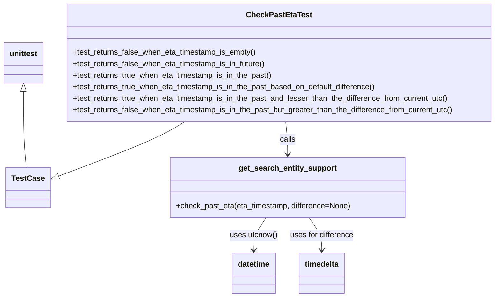
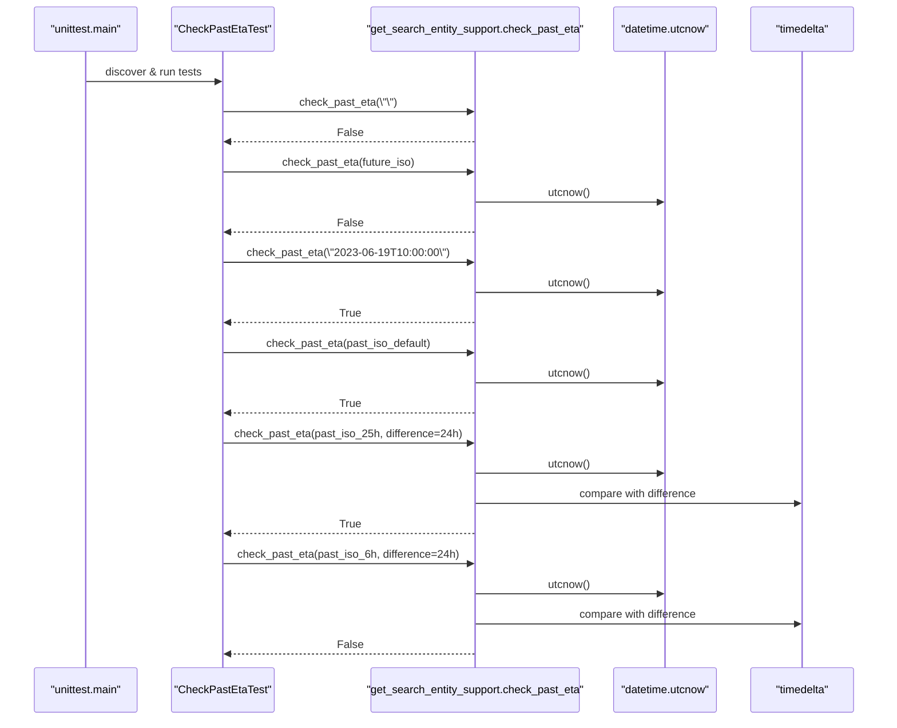

# Diagram: entity_core/entity_service/entity_service_tests/calculate_eta_tests/test_check_past_eta.py

> Auto-generated by Obscura crawlers

## Diagram 1

### SVG

<svg id="container" width="1039.5703125" xmlns="http://www.w3.org/2000/svg" class="classDiagram" height="620" viewBox="0 0 1039.5703125 620" role="graphics-document document" aria-roledescription="class"><g><defs><marker id="container_class-aggregationStart" class="marker aggregation class" refX="18" refY="7" markerWidth="190" markerHeight="240" orient="auto"><path d="M 18,7 L9,13 L1,7 L9,1 Z"></path></marker></defs><defs><marker id="container_class-aggregationEnd" class="marker aggregation class" refX="1" refY="7" markerWidth="20" markerHeight="28" orient="auto"><path d="M 18,7 L9,13 L1,7 L9,1 Z"></path></marker></defs><defs><marker id="container_class-extensionStart" class="marker extension class" refX="18" refY="7" markerWidth="190" markerHeight="240" orient="auto"><path d="M 1,7 L18,13 V 1 Z"></path></marker></defs><defs><marker id="container_class-extensionEnd" class="marker extension class" refX="1" refY="7" markerWidth="20" markerHeight="28" orient="auto"><path d="M 1,1 V 13 L18,7 Z"></path></marker></defs><defs><marker id="container_class-compositionStart" class="marker composition class" refX="18" refY="7" markerWidth="190" markerHeight="240" orient="auto"><path d="M 18,7 L9,13 L1,7 L9,1 Z"></path></marker></defs><defs><marker id="container_class-compositionEnd" class="marker composition class" refX="1" refY="7" markerWidth="20" markerHeight="28" orient="auto"><path d="M 18,7 L9,13 L1,7 L9,1 Z"></path></marker></defs><defs><marker id="container_class-dependencyStart" class="marker dependency class" refX="6" refY="7" markerWidth="190" markerHeight="240" orient="auto"><path d="M 5,7 L9,13 L1,7 L9,1 Z"></path></marker></defs><defs><marker id="container_class-dependencyEnd" class="marker dependency class" refX="13" refY="7" markerWidth="20" markerHeight="28" orient="auto"><path d="M 18,7 L9,13 L14,7 L9,1 Z"></path></marker></defs><defs><marker id="container_class-lollipopStart" class="marker lollipop class" refX="13" refY="7" markerWidth="190" markerHeight="240" orient="auto"><circle stroke="black" fill="transparent" cx="7" cy="7" r="6"></circle></marker></defs><defs><marker id="container_class-lollipopEnd" class="marker lollipop class" refX="1" refY="7" markerWidth="190" markerHeight="240" orient="auto"><circle stroke="black" fill="transparent" cx="7" cy="7" r="6"></circle></marker></defs><g class="root"><g class="clusters"></g><g class="edgePaths"><path d="M386.997,254L377.039,260.167C367.08,266.333,347.162,278.667,302.558,297.742C257.955,316.817,188.665,342.633,154.02,355.541L119.375,368.45" id="id_CheckPastEtaTest_TestCase_1" class="edge-thickness-normal edge-pattern-solid relation" style=";;;" data-edge="true" data-et="edge" data-id="id_CheckPastEtaTest_TestCase_1" data-points="W3sieCI6Mzg2Ljk5NzQyNDMxNjQwNjI0LCJ5IjoyNTR9LHsieCI6MzI3LjI0NDE0MDYyNSwieSI6MjkxfSx7IngiOjEwMy4yMTA5Mzc1LCJ5IjozNzQuNDcyMjA1MDQwMTMzM31d" marker-end="url(#container_class-extensionEnd)"></path><path d="M599.645,254L600.348,260.167C601.05,266.333,602.455,278.667,603.157,290C603.859,301.333,603.859,311.667,603.859,316.833L603.859,322" id="id_CheckPastEtaTest_get_search_entity_support_2" class="edge-thickness-normal edge-pattern-solid relation" style=";;;" data-edge="true" data-et="edge" data-id="id_CheckPastEtaTest_get_search_entity_support_2" data-points="W3sieCI6NTk5LjY0NTM4NTc0MjE4NzUsInkiOjI1NH0seyJ4Ijo2MDMuODU5Mzc1LCJ5IjoyOTF9LHsieCI6NjAzLjg1OTM3NSwieSI6MzI4fV0=" marker-end="url(#container_class-dependencyEnd)"></path><path d="M558.952,454L554.557,460.167C550.161,466.333,541.369,478.667,536.974,490C532.578,501.333,532.578,511.667,532.578,516.833L532.578,522" id="id_get_search_entity_support_datetime_3" class="edge-thickness-normal edge-pattern-solid relation" style=";;;" data-edge="true" data-et="edge" data-id="id_get_search_entity_support_datetime_3" data-points="W3sieCI6NTU4Ljk1MjE4NzUsInkiOjQ1NH0seyJ4Ijo1MzIuNTc4MTI1LCJ5Ijo0OTF9LHsieCI6NTMyLjU3ODEyNSwieSI6NTI4fV0=" marker-end="url(#container_class-dependencyEnd)"></path><path d="M648.767,454L653.162,460.167C657.558,466.333,666.349,478.667,670.745,490C675.141,501.333,675.141,511.667,675.141,516.833L675.141,522" id="id_get_search_entity_support_timedelta_4" class="edge-thickness-normal edge-pattern-solid relation" style=";;;" data-edge="true" data-et="edge" data-id="id_get_search_entity_support_timedelta_4" data-points="W3sieCI6NjQ4Ljc2NjU2MjUsInkiOjQ1NH0seyJ4Ijo2NzUuMTQwNjI1LCJ5Ijo0OTF9LHsieCI6Njc1LjE0MDYyNSwieSI6NTI4fV0=" marker-end="url(#container_class-dependencyEnd)"></path><path d="M48.852,190.25L48.852,207.042C48.852,223.833,48.852,257.417,49.818,283.875C50.785,310.333,52.718,329.667,53.685,339.333L54.652,349" id="id_unittest_TestCase_5" class="edge-thickness-normal edge-pattern-solid relation" style=";;;" data-edge="true" data-et="edge" data-id="id_unittest_TestCase_5" data-points="W3sieCI6NDguODUxNTYyNSwieSI6MTczfSx7IngiOjQ4Ljg1MTU2MjUsInkiOjI5MX0seyJ4Ijo1NC42NTE1NjI1LCJ5IjozNDl9XQ==" marker-start="url(#container_class-extensionStart)"></path></g><g class="edgeLabels"><g class="edgeLabel"><g class="label" data-id="id_CheckPastEtaTest_TestCase_1" transform="translate(0, 0)"><foreignObject width="0" height="0">

</foreignObject></g></g><g class="edgeLabel" transform="translate(603.859375, 291)"><g class="label" data-id="id_CheckPastEtaTest_get_search_entity_support_2" transform="translate(-16.4453125, -12)"><foreignObject width="32.890625" height="24">

calls

</foreignObject></g></g><g class="edgeLabel" transform="translate(532.578125, 491)"><g class="label" data-id="id_get_search_entity_support_datetime_3" transform="translate(-50.140625, -12)"><foreignObject width="100.28125" height="24">

uses utcnow()

</foreignObject></g></g><g class="edgeLabel" transform="translate(675.140625, 491)"><g class="label" data-id="id_get_search_entity_support_timedelta_4" transform="translate(-67.6953125, -12)"><foreignObject width="135.390625" height="24">

uses for difference

</foreignObject></g></g><g class="edgeLabel"><g class="label" data-id="id_unittest_TestCase_5" transform="translate(0, 0)"><foreignObject width="0" height="0">

</foreignObject></g></g></g><g class="nodes"><g class="node default" id="classId-CheckPastEtaTest-0" transform="translate(585.63671875, 131)"><g class="basic label-container"><path d="M-445.93359375 -123 L445.93359375 -123 L445.93359375 123 L-445.93359375 123" stroke="none" stroke-width="0" fill="#ECECFF" style=""></path><path d="M-445.93359375 -123 C-223.59677951291854 -123, -1.2599652758370894 -123, 445.93359375 -123 M-445.93359375 -123 C-236.83912331281883 -123, -27.744652875637655 -123, 445.93359375 -123 M445.93359375 -123 C445.93359375 -34.651512323439846, 445.93359375 53.69697535312031, 445.93359375 123 M445.93359375 -123 C445.93359375 -39.72912011024101, 445.93359375 43.541759779517974, 445.93359375 123 M445.93359375 123 C199.262435752047 123, -47.408722245906006 123, -445.93359375 123 M445.93359375 123 C143.02916160193456 123, -159.87527054613088 123, -445.93359375 123 M-445.93359375 123 C-445.93359375 50.036661500016066, -445.93359375 -22.926676999967867, -445.93359375 -123 M-445.93359375 123 C-445.93359375 59.271398855643824, -445.93359375 -4.457202288712352, -445.93359375 -123" stroke="#9370DB" stroke-width="1.3" fill="none" stroke-dasharray="0 0" style=""></path></g><g class="annotation-group text" transform="translate(0, -99)"></g><g class="label-group text" transform="translate(-64.1328125, -99)"><g class="label" style="font-weight: bolder" transform="translate(0,-12)"><foreignObject width="128.265625" height="24">

CheckPastEtaTest

</foreignObject></g></g><g class="members-group text" transform="translate(-433.93359375, -51)"></g><g class="methods-group text" transform="translate(-433.93359375, -21)"><g class="label" style="" transform="translate(0,-12)"><foreignObject width="385.40625" height="24">

+test_returns_false_when_eta_timestamp_is_empty()

</foreignObject></g><g class="label" style="" transform="translate(0,12)"><foreignObject width="406.28125" height="24">

+test_returns_false_when_eta_timestamp_is_in_future()

</foreignObject></g><g class="label" style="" transform="translate(0,36)"><foreignObject width="420.671875" height="24">

+test_returns_true_when_eta_timestamp_is_in_the_past()

</foreignObject></g><g class="label" style="" transform="translate(0,60)"><foreignObject width="640.328125" height="24">

+test_returns_true_when_eta_timestamp_is_in_the_past_based_on_default_difference()

</foreignObject></g><g class="label" style="" transform="translate(0,84)"><foreignObject width="793.015625" height="24">

+test_returns_true_when_eta_timestamp_is_in_the_past_and_lesser_than_the_difference_from_current_utc()

</foreignObject></g><g class="label" style="" transform="translate(0,108)"><foreignObject width="803.734375" height="24">

+test_returns_false_when_eta_timestamp_is_in_the_past_but_greater_than_the_difference_from_current_utc()

</foreignObject></g></g><g class="divider" style=""><path d="M-445.93359375 -75 C-194.345194402049 -75, 57.243204945901994 -75, 445.93359375 -75 M-445.93359375 -75 C-111.35775170096974 -75, 223.2180903480605 -75, 445.93359375 -75" stroke="#9370DB" stroke-width="1.3" fill="none" stroke-dasharray="0 0" style=""></path></g><g class="divider" style=""><path d="M-445.93359375 -51 C-213.1854867312145 -51, 19.562620287571008 -51, 445.93359375 -51 M-445.93359375 -51 C-124.3316962862691 -51, 197.2702011774618 -51, 445.93359375 -51" stroke="#9370DB" stroke-width="1.3" fill="none" stroke-dasharray="0 0" style=""></path></g></g><g class="node default" id="classId-TestCase-1" transform="translate(58.8515625, 391)"><g class="basic label-container"><path d="M-44.359375 -42 L44.359375 -42 L44.359375 42 L-44.359375 42" stroke="none" stroke-width="0" fill="#ECECFF" style=""></path><path d="M-44.359375 -42 C-19.22044458374934 -42, 5.918485832501318 -42, 44.359375 -42 M-44.359375 -42 C-17.48843199980295 -42, 9.382511000394103 -42, 44.359375 -42 M44.359375 -42 C44.359375 -15.448114718851858, 44.359375 11.103770562296283, 44.359375 42 M44.359375 -42 C44.359375 -11.58775162610387, 44.359375 18.82449674779226, 44.359375 42 M44.359375 42 C23.3629546367011 42, 2.366534273402202 42, -44.359375 42 M44.359375 42 C9.522122320938045 42, -25.31513035812391 42, -44.359375 42 M-44.359375 42 C-44.359375 16.15182477981547, -44.359375 -9.69635044036906, -44.359375 -42 M-44.359375 42 C-44.359375 14.864079218889156, -44.359375 -12.271841562221688, -44.359375 -42" stroke="#9370DB" stroke-width="1.3" fill="none" stroke-dasharray="0 0" style=""></path></g><g class="annotation-group text" transform="translate(0, -18)"></g><g class="label-group text" transform="translate(-32.359375, -18)"><g class="label" style="font-weight: bolder" transform="translate(0,-12)"><foreignObject width="64.71875" height="24">

TestCase

</foreignObject></g></g><g class="members-group text" transform="translate(-32.359375, 30)"></g><g class="methods-group text" transform="translate(-32.359375, 60)"></g><g class="divider" style=""><path d="M-44.359375 6 C-21.02280409489626 6, 2.3137668102074826 6, 44.359375 6 M-44.359375 6 C-22.023816966979005 6, 0.31174106604198926 6, 44.359375 6" stroke="#9370DB" stroke-width="1.3" fill="none" stroke-dasharray="0 0" style=""></path></g><g class="divider" style=""><path d="M-44.359375 24 C-16.307851274904966 24, 11.743672450190068 24, 44.359375 24 M-44.359375 24 C-20.216079896181526 24, 3.927215207636948 24, 44.359375 24" stroke="#9370DB" stroke-width="1.3" fill="none" stroke-dasharray="0 0" style=""></path></g></g><g class="node default" id="classId-get_search_entity_support-2" transform="translate(603.859375, 391)"><g class="basic label-container"><path d="M-244.59765625 -63 L244.59765625 -63 L244.59765625 63 L-244.59765625 63" stroke="none" stroke-width="0" fill="#ECECFF" style=""></path><path d="M-244.59765625 -63 C-72.48427548552425 -63, 99.6291052789515 -63, 244.59765625 -63 M-244.59765625 -63 C-106.605006613814 -63, 31.387643022372004 -63, 244.59765625 -63 M244.59765625 -63 C244.59765625 -29.810172346625613, 244.59765625 3.3796553067487736, 244.59765625 63 M244.59765625 -63 C244.59765625 -29.46266389944813, 244.59765625 4.074672201103738, 244.59765625 63 M244.59765625 63 C121.27880456349916 63, -2.0400471230016706 63, -244.59765625 63 M244.59765625 63 C87.42328297600693 63, -69.75109029798614 63, -244.59765625 63 M-244.59765625 63 C-244.59765625 17.421365194127198, -244.59765625 -28.157269611745605, -244.59765625 -63 M-244.59765625 63 C-244.59765625 35.825743666678775, -244.59765625 8.651487333357544, -244.59765625 -63" stroke="#9370DB" stroke-width="1.3" fill="none" stroke-dasharray="0 0" style=""></path></g><g class="annotation-group text" transform="translate(0, -39)"></g><g class="label-group text" transform="translate(-98.3515625, -39)"><g class="label" style="font-weight: bolder" transform="translate(0,-12)"><foreignObject width="196.703125" height="24">

get_search_entity_support

</foreignObject></g></g><g class="members-group text" transform="translate(-232.59765625, 9)"></g><g class="methods-group text" transform="translate(-232.59765625, 39)"><g class="label" style="" transform="translate(0,-12)"><foreignObject width="366.84375" height="24">

+check_past_eta(eta_timestamp, difference=None)

</foreignObject></g></g><g class="divider" style=""><path d="M-244.59765625 -15 C-91.64357156004144 -15, 61.310513129917126 -15, 244.59765625 -15 M-244.59765625 -15 C-51.04285630752048 -15, 142.51194363495904 -15, 244.59765625 -15" stroke="#9370DB" stroke-width="1.3" fill="none" stroke-dasharray="0 0" style=""></path></g><g class="divider" style=""><path d="M-244.59765625 9 C-123.9908691698834 9, -3.3840820897667925 9, 244.59765625 9 M-244.59765625 9 C-141.84490663455267 9, -39.092157019105315 9, 244.59765625 9" stroke="#9370DB" stroke-width="1.3" fill="none" stroke-dasharray="0 0" style=""></path></g></g><g class="node default" id="classId-datetime-3" transform="translate(532.578125, 570)"><g class="basic label-container"><path d="M-45.0703125 -42 L45.0703125 -42 L45.0703125 42 L-45.0703125 42" stroke="none" stroke-width="0" fill="#ECECFF" style=""></path><path d="M-45.0703125 -42 C-24.023755281467228 -42, -2.9771980629344554 -42, 45.0703125 -42 M-45.0703125 -42 C-17.02468076837934 -42, 11.020950963241319 -42, 45.0703125 -42 M45.0703125 -42 C45.0703125 -13.883620898468028, 45.0703125 14.232758203063945, 45.0703125 42 M45.0703125 -42 C45.0703125 -24.808014233821105, 45.0703125 -7.616028467642209, 45.0703125 42 M45.0703125 42 C10.928819030351278 42, -23.212674439297444 42, -45.0703125 42 M45.0703125 42 C15.916894562164703 42, -13.236523375670593 42, -45.0703125 42 M-45.0703125 42 C-45.0703125 12.149970067285818, -45.0703125 -17.700059865428365, -45.0703125 -42 M-45.0703125 42 C-45.0703125 21.996942256041184, -45.0703125 1.9938845120823672, -45.0703125 -42" stroke="#9370DB" stroke-width="1.3" fill="none" stroke-dasharray="0 0" style=""></path></g><g class="annotation-group text" transform="translate(0, -18)"></g><g class="label-group text" transform="translate(-33.0703125, -18)"><g class="label" style="font-weight: bolder" transform="translate(0,-12)"><foreignObject width="66.140625" height="24">

datetime

</foreignObject></g></g><g class="members-group text" transform="translate(-33.0703125, 30)"></g><g class="methods-group text" transform="translate(-33.0703125, 60)"></g><g class="divider" style=""><path d="M-45.0703125 6 C-10.190597938828894 6, 24.689116622342212 6, 45.0703125 6 M-45.0703125 6 C-24.587257570604173 6, -4.104202641208346 6, 45.0703125 6" stroke="#9370DB" stroke-width="1.3" fill="none" stroke-dasharray="0 0" style=""></path></g><g class="divider" style=""><path d="M-45.0703125 24 C-23.67663000064955 24, -2.2829475012990983 24, 45.0703125 24 M-45.0703125 24 C-22.699976984734516 24, -0.3296414694690313 24, 45.0703125 24" stroke="#9370DB" stroke-width="1.3" fill="none" stroke-dasharray="0 0" style=""></path></g></g><g class="node default" id="classId-timedelta-4" transform="translate(675.140625, 570)"><g class="basic label-container"><path d="M-47.4921875 -42 L47.4921875 -42 L47.4921875 42 L-47.4921875 42" stroke="none" stroke-width="0" fill="#ECECFF" style=""></path><path d="M-47.4921875 -42 C-10.720947354926658 -42, 26.050292790146685 -42, 47.4921875 -42 M-47.4921875 -42 C-23.50120015153486 -42, 0.48978719693027983 -42, 47.4921875 -42 M47.4921875 -42 C47.4921875 -17.119909479829662, 47.4921875 7.760181040340676, 47.4921875 42 M47.4921875 -42 C47.4921875 -18.437778371289767, 47.4921875 5.124443257420467, 47.4921875 42 M47.4921875 42 C22.067254861683274 42, -3.3576777766334516 42, -47.4921875 42 M47.4921875 42 C24.39771604605654 42, 1.3032445921130815 42, -47.4921875 42 M-47.4921875 42 C-47.4921875 12.166246802893262, -47.4921875 -17.667506394213476, -47.4921875 -42 M-47.4921875 42 C-47.4921875 17.89914499105987, -47.4921875 -6.201710017880259, -47.4921875 -42" stroke="#9370DB" stroke-width="1.3" fill="none" stroke-dasharray="0 0" style=""></path></g><g class="annotation-group text" transform="translate(0, -18)"></g><g class="label-group text" transform="translate(-35.4921875, -18)"><g class="label" style="font-weight: bolder" transform="translate(0,-12)"><foreignObject width="70.984375" height="24">

timedelta

</foreignObject></g></g><g class="members-group text" transform="translate(-35.4921875, 30)"></g><g class="methods-group text" transform="translate(-35.4921875, 60)"></g><g class="divider" style=""><path d="M-47.4921875 6 C-11.286634078531435 6, 24.91891934293713 6, 47.4921875 6 M-47.4921875 6 C-22.41900445856176 6, 2.654178582876483 6, 47.4921875 6" stroke="#9370DB" stroke-width="1.3" fill="none" stroke-dasharray="0 0" style=""></path></g><g class="divider" style=""><path d="M-47.4921875 24 C-10.715150856607572 24, 26.061885786784856 24, 47.4921875 24 M-47.4921875 24 C-17.776113764514733 24, 11.939959970970534 24, 47.4921875 24" stroke="#9370DB" stroke-width="1.3" fill="none" stroke-dasharray="0 0" style=""></path></g></g><g class="node default" id="classId-unittest-5" transform="translate(48.8515625, 131)"><g class="basic label-container"><path d="M-40.8515625 -42 L40.8515625 -42 L40.8515625 42 L-40.8515625 42" stroke="none" stroke-width="0" fill="#ECECFF" style=""></path><path d="M-40.8515625 -42 C-24.33101029901967 -42, -7.810458098039341 -42, 40.8515625 -42 M-40.8515625 -42 C-10.712616199208007 -42, 19.426330101583986 -42, 40.8515625 -42 M40.8515625 -42 C40.8515625 -13.01947041017051, 40.8515625 15.961059179658982, 40.8515625 42 M40.8515625 -42 C40.8515625 -19.506577736639596, 40.8515625 2.986844526720809, 40.8515625 42 M40.8515625 42 C22.410387294932164 42, 3.969212089864328 42, -40.8515625 42 M40.8515625 42 C20.077822881335813 42, -0.6959167373283748 42, -40.8515625 42 M-40.8515625 42 C-40.8515625 13.380504414743573, -40.8515625 -15.238991170512854, -40.8515625 -42 M-40.8515625 42 C-40.8515625 23.7633867625812, -40.8515625 5.5267735251623975, -40.8515625 -42" stroke="#9370DB" stroke-width="1.3" fill="none" stroke-dasharray="0 0" style=""></path></g><g class="annotation-group text" transform="translate(0, -18)"></g><g class="label-group text" transform="translate(-28.8515625, -18)"><g class="label" style="font-weight: bolder" transform="translate(0,-12)"><foreignObject width="57.703125" height="24">

unittest

</foreignObject></g></g><g class="members-group text" transform="translate(-28.8515625, 30)"></g><g class="methods-group text" transform="translate(-28.8515625, 60)"></g><g class="divider" style=""><path d="M-40.8515625 6 C-10.566464629554009 6, 19.718633240891982 6, 40.8515625 6 M-40.8515625 6 C-15.893384445127207 6, 9.064793609745585 6, 40.8515625 6" stroke="#9370DB" stroke-width="1.3" fill="none" stroke-dasharray="0 0" style=""></path></g><g class="divider" style=""><path d="M-40.8515625 24 C-11.08010023680588 24, 18.69136202638824 24, 40.8515625 24 M-40.8515625 24 C-22.616784095727347 24, -4.382005691454694 24, 40.8515625 24" stroke="#9370DB" stroke-width="1.3" fill="none" stroke-dasharray="0 0" style=""></path></g></g></g></g></g></svg>

## Diagram 2

### SVG

<svg id="container" width="1366" xmlns="http://www.w3.org/2000/svg" height="1131" viewBox="-50 -10 1366 1131" role="graphics-document document" aria-roledescription="sequence"><g><rect x="1116" y="1045" fill="#eaeaea" stroke="#666" width="150" height="65" name="Timedelta" rx="3" ry="3" class="actor actor-bottom"></rect><text x="1191" y="1077.5" dominant-baseline="central" alignment-baseline="central" class="actor actor-box" style="text-anchor: middle; font-size: 16px; font-weight: 400;"><tspan x="1191" dy="0">"timedelta"</tspan></text></g><g><rect x="912" y="1045" fill="#eaeaea" stroke="#666" width="154" height="65" name="Date" rx="3" ry="3" class="actor actor-bottom"></rect><text x="989" y="1077.5" dominant-baseline="central" alignment-baseline="central" class="actor actor-box" style="text-anchor: middle; font-size: 16px; font-weight: 400;"><tspan x="989" dy="0">"datetime.utcnow"</tspan></text></g><g><rect x="520" y="1045" fill="#eaeaea" stroke="#666" width="342" height="65" name="Support" rx="3" ry="3" class="actor actor-bottom"></rect><text x="691" y="1077.5" dominant-baseline="central" alignment-baseline="central" class="actor actor-box" style="text-anchor: middle; font-size: 16px; font-weight: 400;"><tspan x="691" dy="0">"get_search_entity_support.check_past_eta"</tspan></text></g><g><rect x="211" y="1045" fill="#eaeaea" stroke="#666" width="158" height="65" name="Test" rx="3" ry="3" class="actor actor-bottom"></rect><text x="290" y="1077.5" dominant-baseline="central" alignment-baseline="central" class="actor actor-box" style="text-anchor: middle; font-size: 16px; font-weight: 400;"><tspan x="290" dy="0">"CheckPastEtaTest"</tspan></text></g><g><rect x="0" y="1045" fill="#eaeaea" stroke="#666" width="150" height="65" name="Runner" rx="3" ry="3" class="actor actor-bottom"></rect><text x="75" y="1077.5" dominant-baseline="central" alignment-baseline="central" class="actor actor-box" style="text-anchor: middle; font-size: 16px; font-weight: 400;"><tspan x="75" dy="0">"unittest.main"</tspan></text></g><g><line id="actor4" x1="1191" y1="65" x2="1191" y2="1045" class="actor-line 200" stroke-width="0.5px" stroke="#999" name="Timedelta"></line><g id="root-4"><rect x="1116" y="0" fill="#eaeaea" stroke="#666" width="150" height="65" name="Timedelta" rx="3" ry="3" class="actor actor-top"></rect><text x="1191" y="32.5" dominant-baseline="central" alignment-baseline="central" class="actor actor-box" style="text-anchor: middle; font-size: 16px; font-weight: 400;"><tspan x="1191" dy="0">"timedelta"</tspan></text></g></g><g><line id="actor3" x1="989" y1="65" x2="989" y2="1045" class="actor-line 200" stroke-width="0.5px" stroke="#999" name="Date"></line><g id="root-3"><rect x="912" y="0" fill="#eaeaea" stroke="#666" width="154" height="65" name="Date" rx="3" ry="3" class="actor actor-top"></rect><text x="989" y="32.5" dominant-baseline="central" alignment-baseline="central" class="actor actor-box" style="text-anchor: middle; font-size: 16px; font-weight: 400;"><tspan x="989" dy="0">"datetime.utcnow"</tspan></text></g></g><g><line id="actor2" x1="691" y1="65" x2="691" y2="1045" class="actor-line 200" stroke-width="0.5px" stroke="#999" name="Support"></line><g id="root-2"><rect x="520" y="0" fill="#eaeaea" stroke="#666" width="342" height="65" name="Support" rx="3" ry="3" class="actor actor-top"></rect><text x="691" y="32.5" dominant-baseline="central" alignment-baseline="central" class="actor actor-box" style="text-anchor: middle; font-size: 16px; font-weight: 400;"><tspan x="691" dy="0">"get_search_entity_support.check_past_eta"</tspan></text></g></g><g><line id="actor1" x1="290" y1="65" x2="290" y2="1045" class="actor-line 200" stroke-width="0.5px" stroke="#999" name="Test"></line><g id="root-1"><rect x="211" y="0" fill="#eaeaea" stroke="#666" width="158" height="65" name="Test" rx="3" ry="3" class="actor actor-top"></rect><text x="290" y="32.5" dominant-baseline="central" alignment-baseline="central" class="actor actor-box" style="text-anchor: middle; font-size: 16px; font-weight: 400;"><tspan x="290" dy="0">"CheckPastEtaTest"</tspan></text></g></g><g><line id="actor0" x1="75" y1="65" x2="75" y2="1045" class="actor-line 200" stroke-width="0.5px" stroke="#999" name="Runner"></line><g id="root-0"><rect x="0" y="0" fill="#eaeaea" stroke="#666" width="150" height="65" name="Runner" rx="3" ry="3" class="actor actor-top"></rect><text x="75" y="32.5" dominant-baseline="central" alignment-baseline="central" class="actor actor-box" style="text-anchor: middle; font-size: 16px; font-weight: 400;"><tspan x="75" dy="0">"unittest.main"</tspan></text></g></g><g></g><defs><symbol id="computer" width="24" height="24"><path transform="scale(.5)" d="M2 2v13h20v-13h-20zm18 11h-16v-9h16v9zm-10.228 6l.466-1h3.524l.467 1h-4.457zm14.228 3h-24l2-6h2.104l-1.33 4h18.45l-1.297-4h2.073l2 6zm-5-10h-14v-7h14v7z"></path></symbol></defs><defs><symbol id="database" fill-rule="evenodd" clip-rule="evenodd"><path transform="scale(.5)" d="M12.258.001l.256.004.255.005.253.008.251.01.249.012.247.015.246.016.242.019.241.02.239.023.236.024.233.027.231.028.229.031.225.032.223.034.22.036.217.038.214.04.211.041.208.043.205.045.201.046.198.048.194.05.191.051.187.053.183.054.18.056.175.057.172.059.168.06.163.061.16.063.155.064.15.066.074.033.073.033.071.034.07.034.069.035.068.035.067.035.066.035.064.036.064.036.062.036.06.036.06.037.058.037.058.037.055.038.055.038.053.038.052.038.051.039.05.039.048.039.047.039.045.04.044.04.043.04.041.04.04.041.039.041.037.041.036.041.034.041.033.042.032.042.03.042.029.042.027.042.026.043.024.043.023.043.021.043.02.043.018.044.017.043.015.044.013.044.012.044.011.045.009.044.007.045.006.045.004.045.002.045.001.045v17l-.001.045-.002.045-.004.045-.006.045-.007.045-.009.044-.011.045-.012.044-.013.044-.015.044-.017.043-.018.044-.02.043-.021.043-.023.043-.024.043-.026.043-.027.042-.029.042-.03.042-.032.042-.033.042-.034.041-.036.041-.037.041-.039.041-.04.041-.041.04-.043.04-.044.04-.045.04-.047.039-.048.039-.05.039-.051.039-.052.038-.053.038-.055.038-.055.038-.058.037-.058.037-.06.037-.06.036-.062.036-.064.036-.064.036-.066.035-.067.035-.068.035-.069.035-.07.034-.071.034-.073.033-.074.033-.15.066-.155.064-.16.063-.163.061-.168.06-.172.059-.175.057-.18.056-.183.054-.187.053-.191.051-.194.05-.198.048-.201.046-.205.045-.208.043-.211.041-.214.04-.217.038-.22.036-.223.034-.225.032-.229.031-.231.028-.233.027-.236.024-.239.023-.241.02-.242.019-.246.016-.247.015-.249.012-.251.01-.253.008-.255.005-.256.004-.258.001-.258-.001-.256-.004-.255-.005-.253-.008-.251-.01-.249-.012-.247-.015-.245-.016-.243-.019-.241-.02-.238-.023-.236-.024-.234-.027-.231-.028-.228-.031-.226-.032-.223-.034-.22-.036-.217-.038-.214-.04-.211-.041-.208-.043-.204-.045-.201-.046-.198-.048-.195-.05-.19-.051-.187-.053-.184-.054-.179-.056-.176-.057-.172-.059-.167-.06-.164-.061-.159-.063-.155-.064-.151-.066-.074-.033-.072-.033-.072-.034-.07-.034-.069-.035-.068-.035-.067-.035-.066-.035-.064-.036-.063-.036-.062-.036-.061-.036-.06-.037-.058-.037-.057-.037-.056-.038-.055-.038-.053-.038-.052-.038-.051-.039-.049-.039-.049-.039-.046-.039-.046-.04-.044-.04-.043-.04-.041-.04-.04-.041-.039-.041-.037-.041-.036-.041-.034-.041-.033-.042-.032-.042-.03-.042-.029-.042-.027-.042-.026-.043-.024-.043-.023-.043-.021-.043-.02-.043-.018-.044-.017-.043-.015-.044-.013-.044-.012-.044-.011-.045-.009-.044-.007-.045-.006-.045-.004-.045-.002-.045-.001-.045v-17l.001-.045.002-.045.004-.045.006-.045.007-.045.009-.044.011-.045.012-.044.013-.044.015-.044.017-.043.018-.044.02-.043.021-.043.023-.043.024-.043.026-.043.027-.042.029-.042.03-.042.032-.042.033-.042.034-.041.036-.041.037-.041.039-.041.04-.041.041-.04.043-.04.044-.04.046-.04.046-.039.049-.039.049-.039.051-.039.052-.038.053-.038.055-.038.056-.038.057-.037.058-.037.06-.037.061-.036.062-.036.063-.036.064-.036.066-.035.067-.035.068-.035.069-.035.07-.034.072-.034.072-.033.074-.033.151-.066.155-.064.159-.063.164-.061.167-.06.172-.059.176-.057.179-.056.184-.054.187-.053.19-.051.195-.05.198-.048.201-.046.204-.045.208-.043.211-.041.214-.04.217-.038.22-.036.223-.034.226-.032.228-.031.231-.028.234-.027.236-.024.238-.023.241-.02.243-.019.245-.016.247-.015.249-.012.251-.01.253-.008.255-.005.256-.004.258-.001.258.001zm-9.258 20.499v.01l.001.021.003.021.004.022.005.021.006.022.007.022.009.023.01.022.011.023.012.023.013.023.015.023.016.024.017.023.018.024.019.024.021.024.022.025.023.024.024.025.052.049.056.05.061.051.066.051.07.051.075.051.079.052.084.052.088.052.092.052.097.052.102.051.105.052.11.052.114.051.119.051.123.051.127.05.131.05.135.05.139.048.144.049.147.047.152.047.155.047.16.045.163.045.167.043.171.043.176.041.178.041.183.039.187.039.19.037.194.035.197.035.202.033.204.031.209.03.212.029.216.027.219.025.222.024.226.021.23.02.233.018.236.016.24.015.243.012.246.01.249.008.253.005.256.004.259.001.26-.001.257-.004.254-.005.25-.008.247-.011.244-.012.241-.014.237-.016.233-.018.231-.021.226-.021.224-.024.22-.026.216-.027.212-.028.21-.031.205-.031.202-.034.198-.034.194-.036.191-.037.187-.039.183-.04.179-.04.175-.042.172-.043.168-.044.163-.045.16-.046.155-.046.152-.047.148-.048.143-.049.139-.049.136-.05.131-.05.126-.05.123-.051.118-.052.114-.051.11-.052.106-.052.101-.052.096-.052.092-.052.088-.053.083-.051.079-.052.074-.052.07-.051.065-.051.06-.051.056-.05.051-.05.023-.024.023-.025.021-.024.02-.024.019-.024.018-.024.017-.024.015-.023.014-.024.013-.023.012-.023.01-.023.01-.022.008-.022.006-.022.006-.022.004-.022.004-.021.001-.021.001-.021v-4.127l-.077.055-.08.053-.083.054-.085.053-.087.052-.09.052-.093.051-.095.05-.097.05-.1.049-.102.049-.105.048-.106.047-.109.047-.111.046-.114.045-.115.045-.118.044-.12.043-.122.042-.124.042-.126.041-.128.04-.13.04-.132.038-.134.038-.135.037-.138.037-.139.035-.142.035-.143.034-.144.033-.147.032-.148.031-.15.03-.151.03-.153.029-.154.027-.156.027-.158.026-.159.025-.161.024-.162.023-.163.022-.165.021-.166.02-.167.019-.169.018-.169.017-.171.016-.173.015-.173.014-.175.013-.175.012-.177.011-.178.01-.179.008-.179.008-.181.006-.182.005-.182.004-.184.003-.184.002h-.37l-.184-.002-.184-.003-.182-.004-.182-.005-.181-.006-.179-.008-.179-.008-.178-.01-.176-.011-.176-.012-.175-.013-.173-.014-.172-.015-.171-.016-.17-.017-.169-.018-.167-.019-.166-.02-.165-.021-.163-.022-.162-.023-.161-.024-.159-.025-.157-.026-.156-.027-.155-.027-.153-.029-.151-.03-.15-.03-.148-.031-.146-.032-.145-.033-.143-.034-.141-.035-.14-.035-.137-.037-.136-.037-.134-.038-.132-.038-.13-.04-.128-.04-.126-.041-.124-.042-.122-.042-.12-.044-.117-.043-.116-.045-.113-.045-.112-.046-.109-.047-.106-.047-.105-.048-.102-.049-.1-.049-.097-.05-.095-.05-.093-.052-.09-.051-.087-.052-.085-.053-.083-.054-.08-.054-.077-.054v4.127zm0-5.654v.011l.001.021.003.021.004.021.005.022.006.022.007.022.009.022.01.022.011.023.012.023.013.023.015.024.016.023.017.024.018.024.019.024.021.024.022.024.023.025.024.024.052.05.056.05.061.05.066.051.07.051.075.052.079.051.084.052.088.052.092.052.097.052.102.052.105.052.11.051.114.051.119.052.123.05.127.051.131.05.135.049.139.049.144.048.147.048.152.047.155.046.16.045.163.045.167.044.171.042.176.042.178.04.183.04.187.038.19.037.194.036.197.034.202.033.204.032.209.03.212.028.216.027.219.025.222.024.226.022.23.02.233.018.236.016.24.014.243.012.246.01.249.008.253.006.256.003.259.001.26-.001.257-.003.254-.006.25-.008.247-.01.244-.012.241-.015.237-.016.233-.018.231-.02.226-.022.224-.024.22-.025.216-.027.212-.029.21-.03.205-.032.202-.033.198-.035.194-.036.191-.037.187-.039.183-.039.179-.041.175-.042.172-.043.168-.044.163-.045.16-.045.155-.047.152-.047.148-.048.143-.048.139-.05.136-.049.131-.05.126-.051.123-.051.118-.051.114-.052.11-.052.106-.052.101-.052.096-.052.092-.052.088-.052.083-.052.079-.052.074-.051.07-.052.065-.051.06-.05.056-.051.051-.049.023-.025.023-.024.021-.025.02-.024.019-.024.018-.024.017-.024.015-.023.014-.023.013-.024.012-.022.01-.023.01-.023.008-.022.006-.022.006-.022.004-.021.004-.022.001-.021.001-.021v-4.139l-.077.054-.08.054-.083.054-.085.052-.087.053-.09.051-.093.051-.095.051-.097.05-.1.049-.102.049-.105.048-.106.047-.109.047-.111.046-.114.045-.115.044-.118.044-.12.044-.122.042-.124.042-.126.041-.128.04-.13.039-.132.039-.134.038-.135.037-.138.036-.139.036-.142.035-.143.033-.144.033-.147.033-.148.031-.15.03-.151.03-.153.028-.154.028-.156.027-.158.026-.159.025-.161.024-.162.023-.163.022-.165.021-.166.02-.167.019-.169.018-.169.017-.171.016-.173.015-.173.014-.175.013-.175.012-.177.011-.178.009-.179.009-.179.007-.181.007-.182.005-.182.004-.184.003-.184.002h-.37l-.184-.002-.184-.003-.182-.004-.182-.005-.181-.007-.179-.007-.179-.009-.178-.009-.176-.011-.176-.012-.175-.013-.173-.014-.172-.015-.171-.016-.17-.017-.169-.018-.167-.019-.166-.02-.165-.021-.163-.022-.162-.023-.161-.024-.159-.025-.157-.026-.156-.027-.155-.028-.153-.028-.151-.03-.15-.03-.148-.031-.146-.033-.145-.033-.143-.033-.141-.035-.14-.036-.137-.036-.136-.037-.134-.038-.132-.039-.13-.039-.128-.04-.126-.041-.124-.042-.122-.043-.12-.043-.117-.044-.116-.044-.113-.046-.112-.046-.109-.046-.106-.047-.105-.048-.102-.049-.1-.049-.097-.05-.095-.051-.093-.051-.09-.051-.087-.053-.085-.052-.083-.054-.08-.054-.077-.054v4.139zm0-5.666v.011l.001.02.003.022.004.021.005.022.006.021.007.022.009.023.01.022.011.023.012.023.013.023.015.023.016.024.017.024.018.023.019.024.021.025.022.024.023.024.024.025.052.05.056.05.061.05.066.051.07.051.075.052.079.051.084.052.088.052.092.052.097.052.102.052.105.051.11.052.114.051.119.051.123.051.127.05.131.05.135.05.139.049.144.048.147.048.152.047.155.046.16.045.163.045.167.043.171.043.176.042.178.04.183.04.187.038.19.037.194.036.197.034.202.033.204.032.209.03.212.028.216.027.219.025.222.024.226.021.23.02.233.018.236.017.24.014.243.012.246.01.249.008.253.006.256.003.259.001.26-.001.257-.003.254-.006.25-.008.247-.01.244-.013.241-.014.237-.016.233-.018.231-.02.226-.022.224-.024.22-.025.216-.027.212-.029.21-.03.205-.032.202-.033.198-.035.194-.036.191-.037.187-.039.183-.039.179-.041.175-.042.172-.043.168-.044.163-.045.16-.045.155-.047.152-.047.148-.048.143-.049.139-.049.136-.049.131-.051.126-.05.123-.051.118-.052.114-.051.11-.052.106-.052.101-.052.096-.052.092-.052.088-.052.083-.052.079-.052.074-.052.07-.051.065-.051.06-.051.056-.05.051-.049.023-.025.023-.025.021-.024.02-.024.019-.024.018-.024.017-.024.015-.023.014-.024.013-.023.012-.023.01-.022.01-.023.008-.022.006-.022.006-.022.004-.022.004-.021.001-.021.001-.021v-4.153l-.077.054-.08.054-.083.053-.085.053-.087.053-.09.051-.093.051-.095.051-.097.05-.1.049-.102.048-.105.048-.106.048-.109.046-.111.046-.114.046-.115.044-.118.044-.12.043-.122.043-.124.042-.126.041-.128.04-.13.039-.132.039-.134.038-.135.037-.138.036-.139.036-.142.034-.143.034-.144.033-.147.032-.148.032-.15.03-.151.03-.153.028-.154.028-.156.027-.158.026-.159.024-.161.024-.162.023-.163.023-.165.021-.166.02-.167.019-.169.018-.169.017-.171.016-.173.015-.173.014-.175.013-.175.012-.177.01-.178.01-.179.009-.179.007-.181.006-.182.006-.182.004-.184.003-.184.001-.185.001-.185-.001-.184-.001-.184-.003-.182-.004-.182-.006-.181-.006-.179-.007-.179-.009-.178-.01-.176-.01-.176-.012-.175-.013-.173-.014-.172-.015-.171-.016-.17-.017-.169-.018-.167-.019-.166-.02-.165-.021-.163-.023-.162-.023-.161-.024-.159-.024-.157-.026-.156-.027-.155-.028-.153-.028-.151-.03-.15-.03-.148-.032-.146-.032-.145-.033-.143-.034-.141-.034-.14-.036-.137-.036-.136-.037-.134-.038-.132-.039-.13-.039-.128-.041-.126-.041-.124-.041-.122-.043-.12-.043-.117-.044-.116-.044-.113-.046-.112-.046-.109-.046-.106-.048-.105-.048-.102-.048-.1-.05-.097-.049-.095-.051-.093-.051-.09-.052-.087-.052-.085-.053-.083-.053-.08-.054-.077-.054v4.153zm8.74-8.179l-.257.004-.254.005-.25.008-.247.011-.244.012-.241.014-.237.016-.233.018-.231.021-.226.022-.224.023-.22.026-.216.027-.212.028-.21.031-.205.032-.202.033-.198.034-.194.036-.191.038-.187.038-.183.04-.179.041-.175.042-.172.043-.168.043-.163.045-.16.046-.155.046-.152.048-.148.048-.143.048-.139.049-.136.05-.131.05-.126.051-.123.051-.118.051-.114.052-.11.052-.106.052-.101.052-.096.052-.092.052-.088.052-.083.052-.079.052-.074.051-.07.052-.065.051-.06.05-.056.05-.051.05-.023.025-.023.024-.021.024-.02.025-.019.024-.018.024-.017.023-.015.024-.014.023-.013.023-.012.023-.01.023-.01.022-.008.022-.006.023-.006.021-.004.022-.004.021-.001.021-.001.021.001.021.001.021.004.021.004.022.006.021.006.023.008.022.01.022.01.023.012.023.013.023.014.023.015.024.017.023.018.024.019.024.02.025.021.024.023.024.023.025.051.05.056.05.06.05.065.051.07.052.074.051.079.052.083.052.088.052.092.052.096.052.101.052.106.052.11.052.114.052.118.051.123.051.126.051.131.05.136.05.139.049.143.048.148.048.152.048.155.046.16.046.163.045.168.043.172.043.175.042.179.041.183.04.187.038.191.038.194.036.198.034.202.033.205.032.21.031.212.028.216.027.22.026.224.023.226.022.231.021.233.018.237.016.241.014.244.012.247.011.25.008.254.005.257.004.26.001.26-.001.257-.004.254-.005.25-.008.247-.011.244-.012.241-.014.237-.016.233-.018.231-.021.226-.022.224-.023.22-.026.216-.027.212-.028.21-.031.205-.032.202-.033.198-.034.194-.036.191-.038.187-.038.183-.04.179-.041.175-.042.172-.043.168-.043.163-.045.16-.046.155-.046.152-.048.148-.048.143-.048.139-.049.136-.05.131-.05.126-.051.123-.051.118-.051.114-.052.11-.052.106-.052.101-.052.096-.052.092-.052.088-.052.083-.052.079-.052.074-.051.07-.052.065-.051.06-.05.056-.05.051-.05.023-.025.023-.024.021-.024.02-.025.019-.024.018-.024.017-.023.015-.024.014-.023.013-.023.012-.023.01-.023.01-.022.008-.022.006-.023.006-.021.004-.022.004-.021.001-.021.001-.021-.001-.021-.001-.021-.004-.021-.004-.022-.006-.021-.006-.023-.008-.022-.01-.022-.01-.023-.012-.023-.013-.023-.014-.023-.015-.024-.017-.023-.018-.024-.019-.024-.02-.025-.021-.024-.023-.024-.023-.025-.051-.05-.056-.05-.06-.05-.065-.051-.07-.052-.074-.051-.079-.052-.083-.052-.088-.052-.092-.052-.096-.052-.101-.052-.106-.052-.11-.052-.114-.052-.118-.051-.123-.051-.126-.051-.131-.05-.136-.05-.139-.049-.143-.048-.148-.048-.152-.048-.155-.046-.16-.046-.163-.045-.168-.043-.172-.043-.175-.042-.179-.041-.183-.04-.187-.038-.191-.038-.194-.036-.198-.034-.202-.033-.205-.032-.21-.031-.212-.028-.216-.027-.22-.026-.224-.023-.226-.022-.231-.021-.233-.018-.237-.016-.241-.014-.244-.012-.247-.011-.25-.008-.254-.005-.257-.004-.26-.001-.26.001z"></path></symbol></defs><defs><symbol id="clock" width="24" height="24"><path transform="scale(.5)" d="M12 2c5.514 0 10 4.486 10 10s-4.486 10-10 10-10-4.486-10-10 4.486-10 10-10zm0-2c-6.627 0-12 5.373-12 12s5.373 12 12 12 12-5.373 12-12-5.373-12-12-12zm5.848 12.459c.202.038.202.333.001.372-1.907.361-6.045 1.111-6.547 1.111-.719 0-1.301-.582-1.301-1.301 0-.512.77-5.447 1.125-7.445.034-.192.312-.181.343.014l.985 6.238 5.394 1.011z"></path></symbol></defs><defs><marker id="arrowhead" refX="7.9" refY="5" markerUnits="userSpaceOnUse" markerWidth="12" markerHeight="12" orient="auto-start-reverse"><path d="M -1 0 L 10 5 L 0 10 z"></path></marker></defs><defs><marker id="crosshead" markerWidth="15" markerHeight="8" orient="auto" refX="4" refY="4.5"><path fill="none" stroke="#000000" stroke-width="1pt" d="M 1,2 L 6,7 M 6,2 L 1,7" style="stroke-dasharray: 0, 0;"></path></marker></defs><defs><marker id="filled-head" refX="15.5" refY="7" markerWidth="20" markerHeight="28" orient="auto"><path d="M 18,7 L9,13 L14,7 L9,1 Z"></path></marker></defs><defs><marker id="sequencenumber" refX="15" refY="15" markerWidth="60" markerHeight="40" orient="auto"><circle cx="15" cy="15" r="6"></circle></marker></defs><text x="181" y="80" text-anchor="middle" dominant-baseline="middle" alignment-baseline="middle" class="messageText" dy="1em" style="font-size: 16px; font-weight: 400;">discover &amp; run tests</text><line x1="76" y1="113" x2="286" y2="113" class="messageLine0" stroke-width="2" stroke="none" marker-end="url(#arrowhead)" style="fill: none;"></line><text x="489" y="128" text-anchor="middle" dominant-baseline="middle" alignment-baseline="middle" class="messageText" dy="1em" style="font-size: 16px; font-weight: 400;">check_past_eta(\"\")</text><line x1="291" y1="161" x2="687" y2="161" class="messageLine0" stroke-width="2" stroke="none" marker-end="url(#arrowhead)" style="fill: none;"></line><text x="492" y="176" text-anchor="middle" dominant-baseline="middle" alignment-baseline="middle" class="messageText" dy="1em" style="font-size: 16px; font-weight: 400;">False</text><line x1="690" y1="209" x2="294" y2="209" class="messageLine1" stroke-width="2" stroke="none" marker-end="url(#arrowhead)" style="stroke-dasharray: 3, 3; fill: none;"></line><text x="489" y="224" text-anchor="middle" dominant-baseline="middle" alignment-baseline="middle" class="messageText" dy="1em" style="font-size: 16px; font-weight: 400;">check_past_eta(future_iso)</text><line x1="291" y1="257" x2="687" y2="257" class="messageLine0" stroke-width="2" stroke="none" marker-end="url(#arrowhead)" style="fill: none;"></line><text x="839" y="272" text-anchor="middle" dominant-baseline="middle" alignment-baseline="middle" class="messageText" dy="1em" style="font-size: 16px; font-weight: 400;">utcnow()</text><line x1="692" y1="305" x2="985" y2="305" class="messageLine0" stroke-width="2" stroke="none" marker-end="url(#arrowhead)" style="fill: none;"></line><text x="492" y="320" text-anchor="middle" dominant-baseline="middle" alignment-baseline="middle" class="messageText" dy="1em" style="font-size: 16px; font-weight: 400;">False</text><line x1="690" y1="353" x2="294" y2="353" class="messageLine1" stroke-width="2" stroke="none" marker-end="url(#arrowhead)" style="stroke-dasharray: 3, 3; fill: none;"></line><text x="489" y="368" text-anchor="middle" dominant-baseline="middle" alignment-baseline="middle" class="messageText" dy="1em" style="font-size: 16px; font-weight: 400;">check_past_eta(\"2023-06-19T10:00:00\")</text><line x1="291" y1="401" x2="687" y2="401" class="messageLine0" stroke-width="2" stroke="none" marker-end="url(#arrowhead)" style="fill: none;"></line><text x="839" y="416" text-anchor="middle" dominant-baseline="middle" alignment-baseline="middle" class="messageText" dy="1em" style="font-size: 16px; font-weight: 400;">utcnow()</text><line x1="692" y1="449" x2="985" y2="449" class="messageLine0" stroke-width="2" stroke="none" marker-end="url(#arrowhead)" style="fill: none;"></line><text x="492" y="464" text-anchor="middle" dominant-baseline="middle" alignment-baseline="middle" class="messageText" dy="1em" style="font-size: 16px; font-weight: 400;">True</text><line x1="690" y1="497" x2="294" y2="497" class="messageLine1" stroke-width="2" stroke="none" marker-end="url(#arrowhead)" style="stroke-dasharray: 3, 3; fill: none;"></line><text x="489" y="512" text-anchor="middle" dominant-baseline="middle" alignment-baseline="middle" class="messageText" dy="1em" style="font-size: 16px; font-weight: 400;">check_past_eta(past_iso_default)</text><line x1="291" y1="545" x2="687" y2="545" class="messageLine0" stroke-width="2" stroke="none" marker-end="url(#arrowhead)" style="fill: none;"></line><text x="839" y="560" text-anchor="middle" dominant-baseline="middle" alignment-baseline="middle" class="messageText" dy="1em" style="font-size: 16px; font-weight: 400;">utcnow()</text><line x1="692" y1="593" x2="985" y2="593" class="messageLine0" stroke-width="2" stroke="none" marker-end="url(#arrowhead)" style="fill: none;"></line><text x="492" y="608" text-anchor="middle" dominant-baseline="middle" alignment-baseline="middle" class="messageText" dy="1em" style="font-size: 16px; font-weight: 400;">True</text><line x1="690" y1="641" x2="294" y2="641" class="messageLine1" stroke-width="2" stroke="none" marker-end="url(#arrowhead)" style="stroke-dasharray: 3, 3; fill: none;"></line><text x="489" y="656" text-anchor="middle" dominant-baseline="middle" alignment-baseline="middle" class="messageText" dy="1em" style="font-size: 16px; font-weight: 400;">check_past_eta(past_iso_25h, difference=24h)</text><line x1="291" y1="689" x2="687" y2="689" class="messageLine0" stroke-width="2" stroke="none" marker-end="url(#arrowhead)" style="fill: none;"></line><text x="839" y="704" text-anchor="middle" dominant-baseline="middle" alignment-baseline="middle" class="messageText" dy="1em" style="font-size: 16px; font-weight: 400;">utcnow()</text><line x1="692" y1="737" x2="985" y2="737" class="messageLine0" stroke-width="2" stroke="none" marker-end="url(#arrowhead)" style="fill: none;"></line><text x="940" y="752" text-anchor="middle" dominant-baseline="middle" alignment-baseline="middle" class="messageText" dy="1em" style="font-size: 16px; font-weight: 400;">compare with difference</text><line x1="692" y1="785" x2="1187" y2="785" class="messageLine0" stroke-width="2" stroke="none" marker-end="url(#arrowhead)" style="fill: none;"></line><text x="492" y="800" text-anchor="middle" dominant-baseline="middle" alignment-baseline="middle" class="messageText" dy="1em" style="font-size: 16px; font-weight: 400;">True</text><line x1="690" y1="833" x2="294" y2="833" class="messageLine1" stroke-width="2" stroke="none" marker-end="url(#arrowhead)" style="stroke-dasharray: 3, 3; fill: none;"></line><text x="489" y="848" text-anchor="middle" dominant-baseline="middle" alignment-baseline="middle" class="messageText" dy="1em" style="font-size: 16px; font-weight: 400;">check_past_eta(past_iso_6h, difference=24h)</text><line x1="291" y1="881" x2="687" y2="881" class="messageLine0" stroke-width="2" stroke="none" marker-end="url(#arrowhead)" style="fill: none;"></line><text x="839" y="896" text-anchor="middle" dominant-baseline="middle" alignment-baseline="middle" class="messageText" dy="1em" style="font-size: 16px; font-weight: 400;">utcnow()</text><line x1="692" y1="929" x2="985" y2="929" class="messageLine0" stroke-width="2" stroke="none" marker-end="url(#arrowhead)" style="fill: none;"></line><text x="940" y="944" text-anchor="middle" dominant-baseline="middle" alignment-baseline="middle" class="messageText" dy="1em" style="font-size: 16px; font-weight: 400;">compare with difference</text><line x1="692" y1="977" x2="1187" y2="977" class="messageLine0" stroke-width="2" stroke="none" marker-end="url(#arrowhead)" style="fill: none;"></line><text x="492" y="992" text-anchor="middle" dominant-baseline="middle" alignment-baseline="middle" class="messageText" dy="1em" style="font-size: 16px; font-weight: 400;">False</text><line x1="690" y1="1025" x2="294" y2="1025" class="messageLine1" stroke-width="2" stroke="none" marker-end="url(#arrowhead)" style="stroke-dasharray: 3, 3; fill: none;"></line></svg>
