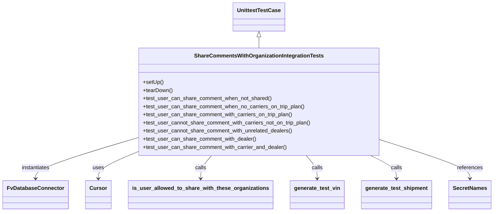
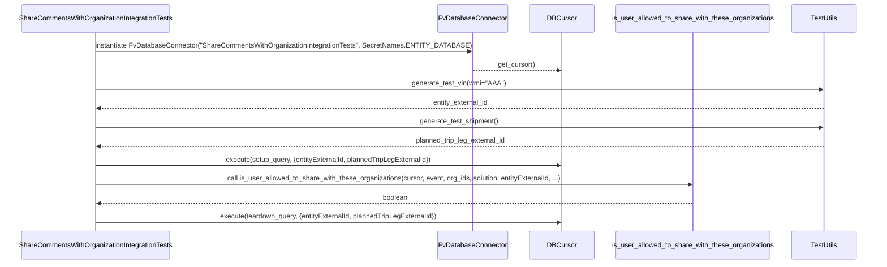

# Diagram: entity_core/entity_service/entity_service_tests/comment_tests/test_share_comments.py

> Auto-generated by Obscura crawlers

## Diagram 1

### SVG

<svg id="container" width="1405.171875" xmlns="http://www.w3.org/2000/svg" class="classDiagram" height="626" viewBox="0 0 1405.171875 626" role="graphics-document document" aria-roledescription="class"><g><defs><marker id="container_class-aggregationStart" class="marker aggregation class" refX="18" refY="7" markerWidth="190" markerHeight="240" orient="auto"><path d="M 18,7 L9,13 L1,7 L9,1 Z"></path></marker></defs><defs><marker id="container_class-aggregationEnd" class="marker aggregation class" refX="1" refY="7" markerWidth="20" markerHeight="28" orient="auto"><path d="M 18,7 L9,13 L1,7 L9,1 Z"></path></marker></defs><defs><marker id="container_class-extensionStart" class="marker extension class" refX="18" refY="7" markerWidth="190" markerHeight="240" orient="auto"><path d="M 1,7 L18,13 V 1 Z"></path></marker></defs><defs><marker id="container_class-extensionEnd" class="marker extension class" refX="1" refY="7" markerWidth="20" markerHeight="28" orient="auto"><path d="M 1,1 V 13 L18,7 Z"></path></marker></defs><defs><marker id="container_class-compositionStart" class="marker composition class" refX="18" refY="7" markerWidth="190" markerHeight="240" orient="auto"><path d="M 18,7 L9,13 L1,7 L9,1 Z"></path></marker></defs><defs><marker id="container_class-compositionEnd" class="marker composition class" refX="1" refY="7" markerWidth="20" markerHeight="28" orient="auto"><path d="M 18,7 L9,13 L1,7 L9,1 Z"></path></marker></defs><defs><marker id="container_class-dependencyStart" class="marker dependency class" refX="6" refY="7" markerWidth="190" markerHeight="240" orient="auto"><path d="M 5,7 L9,13 L1,7 L9,1 Z"></path></marker></defs><defs><marker id="container_class-dependencyEnd" class="marker dependency class" refX="13" refY="7" markerWidth="20" markerHeight="28" orient="auto"><path d="M 18,7 L9,13 L14,7 L9,1 Z"></path></marker></defs><defs><marker id="container_class-lollipopStart" class="marker lollipop class" refX="13" refY="7" markerWidth="190" markerHeight="240" orient="auto"><circle stroke="black" fill="transparent" cx="7" cy="7" r="6"></circle></marker></defs><defs><marker id="container_class-lollipopEnd" class="marker lollipop class" refX="1" refY="7" markerWidth="190" markerHeight="240" orient="auto"><circle stroke="black" fill="transparent" cx="7" cy="7" r="6"></circle></marker></defs><g class="root"><g class="clusters"></g><g class="edgePaths"><path d="M731.938,109.25L731.938,110.542C731.938,111.833,731.938,114.417,731.938,119.875C731.938,125.333,731.938,133.667,731.938,137.833L731.938,142" id="id_UnittestTestCase_ShareCommentsWithOrganizationIntegrationTests_1" class="edge-thickness-normal edge-pattern-solid relation" style=";;;" data-edge="true" data-et="edge" data-id="id_UnittestTestCase_ShareCommentsWithOrganizationIntegrationTests_1" data-points="W3sieCI6NzMxLjkzNzUsInkiOjkyfSx7IngiOjczMS45Mzc1LCJ5IjoxMTd9LHsieCI6NzMxLjkzNzUsInkiOjE0Mn1d" marker-start="url(#container_class-extensionStart)"></path><path d="M377.605,410.778L331.222,425.148C284.839,439.519,192.072,468.259,145.688,487.796C99.305,507.333,99.305,517.667,99.305,522.833L99.305,528" id="id_ShareCommentsWithOrganizationIntegrationTests_FvDatabaseConnector_2" class="edge-thickness-normal edge-pattern-solid relation" style=";;;" data-edge="true" data-et="edge" data-id="id_ShareCommentsWithOrganizationIntegrationTests_FvDatabaseConnector_2" data-points="W3sieCI6Mzc3LjYwNTQ2ODc1LCJ5Ijo0MTAuNzc3ODYyODQ5OTQ1MDV9LHsieCI6OTkuMzA0Njg3NSwieSI6NDk3fSx7IngiOjk5LjMwNDY4NzUsInkiOjUzNH1d" marker-end="url(#container_class-dependencyEnd)"></path><path d="M377.605,453.494L360.757,460.745C343.909,467.996,310.212,482.498,293.364,494.916C276.516,507.333,276.516,517.667,276.516,522.833L276.516,528" id="id_ShareCommentsWithOrganizationIntegrationTests_Cursor_3" class="edge-thickness-normal edge-pattern-solid relation" style=";;;" data-edge="true" data-et="edge" data-id="id_ShareCommentsWithOrganizationIntegrationTests_Cursor_3" data-points="W3sieCI6Mzc3LjYwNTQ2ODc1LCJ5Ijo0NTMuNDkzOTQ0NDg4MjgzNTV9LHsieCI6Mjc2LjUxNTYyNSwieSI6NDk3fSx7IngiOjI3Ni41MTU2MjUsInkiOjUzNH1d" marker-end="url(#container_class-dependencyEnd)"></path><path d="M597.566,460L592.354,466.167C587.143,472.333,576.72,484.667,571.508,496C566.297,507.333,566.297,517.667,566.297,522.833L566.297,528" id="id_ShareCommentsWithOrganizationIntegrationTests_is_user_allowed_to_share_with_these_organizations_4" class="edge-thickness-normal edge-pattern-solid relation" style=";;;" data-edge="true" data-et="edge" data-id="id_ShareCommentsWithOrganizationIntegrationTests_is_user_allowed_to_share_with_these_organizations_4" data-points="W3sieCI6NTk3LjU2NTc2ODQ5NDg5OCwieSI6NDYwfSx7IngiOjU2Ni4yOTY4NzUsInkiOjQ5N30seyJ4Ijo1NjYuMjk2ODc1LCJ5Ijo1MzR9XQ==" marker-end="url(#container_class-dependencyEnd)"></path><path d="M866.309,460L871.521,466.167C876.732,472.333,887.155,484.667,892.367,496C897.578,507.333,897.578,517.667,897.578,522.833L897.578,528" id="id_ShareCommentsWithOrganizationIntegrationTests_generate_test_vin_5" class="edge-thickness-normal edge-pattern-solid relation" style=";;;" data-edge="true" data-et="edge" data-id="id_ShareCommentsWithOrganizationIntegrationTests_generate_test_vin_5" data-points="W3sieCI6ODY2LjMwOTIzMTUwNTEwMiwieSI6NDYwfSx7IngiOjg5Ny41NzgxMjUsInkiOjQ5N30seyJ4Ijo4OTcuNTc4MTI1LCJ5Ijo1MzR9XQ==" marker-end="url(#container_class-dependencyEnd)"></path><path d="M1051.649,460L1064.048,466.167C1076.448,472.333,1101.247,484.667,1113.647,496C1126.047,507.333,1126.047,517.667,1126.047,522.833L1126.047,528" id="id_ShareCommentsWithOrganizationIntegrationTests_generate_test_shipment_6" class="edge-thickness-normal edge-pattern-solid relation" style=";;;" data-edge="true" data-et="edge" data-id="id_ShareCommentsWithOrganizationIntegrationTests_generate_test_shipment_6" data-points="W3sieCI6MTA1MS42NDg2NzY2NTgxNjM0LCJ5Ijo0NjB9LHsieCI6MTEyNi4wNDY4NzUsInkiOjQ5N30seyJ4IjoxMTI2LjA0Njg3NSwieSI6NTM0fV0=" marker-end="url(#container_class-dependencyEnd)"></path><path d="M1086.27,415.753L1128.081,429.294C1169.893,442.836,1253.517,469.918,1295.329,488.626C1337.141,507.333,1337.141,517.667,1337.141,522.833L1337.141,528" id="id_ShareCommentsWithOrganizationIntegrationTests_SecretNames_7" class="edge-thickness-normal edge-pattern-solid relation" style=";;;" data-edge="true" data-et="edge" data-id="id_ShareCommentsWithOrganizationIntegrationTests_SecretNames_7" data-points="W3sieCI6MTA4Ni4yNjk1MzEyNSwieSI6NDE1Ljc1MzMzNjk0NzgyMjN9LHsieCI6MTMzNy4xNDA2MjUsInkiOjQ5N30seyJ4IjoxMzM3LjE0MDYyNSwieSI6NTM0fV0=" marker-end="url(#container_class-dependencyEnd)"></path></g><g class="edgeLabels"><g class="edgeLabel"><g class="label" data-id="id_UnittestTestCase_ShareCommentsWithOrganizationIntegrationTests_1" transform="translate(0, 0)"><foreignObject width="0" height="0">

</foreignObject></g></g><g class="edgeLabel" transform="translate(99.3046875, 497)"><g class="label" data-id="id_ShareCommentsWithOrganizationIntegrationTests_FvDatabaseConnector_2" transform="translate(-42.9140625, -12)"><foreignObject width="85.828125" height="24">

instantiates

</foreignObject></g></g><g class="edgeLabel" transform="translate(276.515625, 497)"><g class="label" data-id="id_ShareCommentsWithOrganizationIntegrationTests_Cursor_3" transform="translate(-16.4921875, -12)"><foreignObject width="32.984375" height="24">

uses

</foreignObject></g></g><g class="edgeLabel" transform="translate(566.296875, 497)"><g class="label" data-id="id_ShareCommentsWithOrganizationIntegrationTests_is_user_allowed_to_share_with_these_organizations_4" transform="translate(-16.4453125, -12)"><foreignObject width="32.890625" height="24">

calls

</foreignObject></g></g><g class="edgeLabel" transform="translate(897.578125, 497)"><g class="label" data-id="id_ShareCommentsWithOrganizationIntegrationTests_generate_test_vin_5" transform="translate(-16.4453125, -12)"><foreignObject width="32.890625" height="24">

calls

</foreignObject></g></g><g class="edgeLabel" transform="translate(1126.046875, 497)"><g class="label" data-id="id_ShareCommentsWithOrganizationIntegrationTests_generate_test_shipment_6" transform="translate(-16.4453125, -12)"><foreignObject width="32.890625" height="24">

calls

</foreignObject></g></g><g class="edgeLabel" transform="translate(1337.140625, 497)"><g class="label" data-id="id_ShareCommentsWithOrganizationIntegrationTests_SecretNames_7" transform="translate(-37.828125, -12)"><foreignObject width="75.65625" height="24">

references

</foreignObject></g></g></g><g class="nodes"><g class="node default" id="classId-UnittestTestCase-0" transform="translate(731.9375, 50)"><g class="basic label-container"><path d="M-73.8359375 -42 L73.8359375 -42 L73.8359375 42 L-73.8359375 42" stroke="none" stroke-width="0" fill="#ECECFF" style=""></path><path d="M-73.8359375 -42 C-29.006322906216845 -42, 15.82329168756631 -42, 73.8359375 -42 M-73.8359375 -42 C-25.801111083194463 -42, 22.233715333611073 -42, 73.8359375 -42 M73.8359375 -42 C73.8359375 -20.251630454980074, 73.8359375 1.4967390900398527, 73.8359375 42 M73.8359375 -42 C73.8359375 -12.954639491175005, 73.8359375 16.09072101764999, 73.8359375 42 M73.8359375 42 C15.77199770704182 42, -42.29194208591636 42, -73.8359375 42 M73.8359375 42 C31.082996231176836 42, -11.669945037646329 42, -73.8359375 42 M-73.8359375 42 C-73.8359375 13.465262088682739, -73.8359375 -15.069475822634523, -73.8359375 -42 M-73.8359375 42 C-73.8359375 17.12946224410127, -73.8359375 -7.741075511797462, -73.8359375 -42" stroke="#9370DB" stroke-width="1.3" fill="none" stroke-dasharray="0 0" style=""></path></g><g class="annotation-group text" transform="translate(0, -18)"></g><g class="label-group text" transform="translate(-61.8359375, -18)"><g class="label" style="font-weight: bolder" transform="translate(0,-12)"><foreignObject width="123.671875" height="24">

UnittestTestCase

</foreignObject></g></g><g class="members-group text" transform="translate(-61.8359375, 30)"></g><g class="methods-group text" transform="translate(-61.8359375, 60)"></g><g class="divider" style=""><path d="M-73.8359375 6 C-21.456924768538457 6, 30.922087962923086 6, 73.8359375 6 M-73.8359375 6 C-15.87470635548916 6, 42.08652478902168 6, 73.8359375 6" stroke="#9370DB" stroke-width="1.3" fill="none" stroke-dasharray="0 0" style=""></path></g><g class="divider" style=""><path d="M-73.8359375 24 C-38.29266909428122 24, -2.749400688562446 24, 73.8359375 24 M-73.8359375 24 C-42.1182650388869 24, -10.400592577773807 24, 73.8359375 24" stroke="#9370DB" stroke-width="1.3" fill="none" stroke-dasharray="0 0" style=""></path></g></g><g class="node default" id="classId-ShareCommentsWithOrganizationIntegrationTests-1" transform="translate(731.9375, 301)"><g class="basic label-container"><path d="M-354.33203125 -159 L354.33203125 -159 L354.33203125 159 L-354.33203125 159" stroke="none" stroke-width="0" fill="#ECECFF" style=""></path><path d="M-354.33203125 -159 C-73.14063761037636 -159, 208.05075602924728 -159, 354.33203125 -159 M-354.33203125 -159 C-147.94405762835638 -159, 58.44391599328725 -159, 354.33203125 -159 M354.33203125 -159 C354.33203125 -65.37811965042545, 354.33203125 28.243760699149107, 354.33203125 159 M354.33203125 -159 C354.33203125 -94.8658558933917, 354.33203125 -30.731711786783393, 354.33203125 159 M354.33203125 159 C188.50158130199358 159, 22.671131353987164 159, -354.33203125 159 M354.33203125 159 C183.79048811918508 159, 13.24894498837017 159, -354.33203125 159 M-354.33203125 159 C-354.33203125 70.7339130609212, -354.33203125 -17.532173878157607, -354.33203125 -159 M-354.33203125 159 C-354.33203125 71.67635618070913, -354.33203125 -15.64728763858173, -354.33203125 -159" stroke="#9370DB" stroke-width="1.3" fill="none" stroke-dasharray="0 0" style=""></path></g><g class="annotation-group text" transform="translate(0, -135)"></g><g class="label-group text" transform="translate(-182.7890625, -135)"><g class="label" style="font-weight: bolder" transform="translate(0,-12)"><foreignObject width="365.578125" height="24">

ShareCommentsWithOrganizationIntegrationTests

</foreignObject></g></g><g class="members-group text" transform="translate(-342.33203125, -87)"></g><g class="methods-group text" transform="translate(-342.33203125, -57)"><g class="label" style="" transform="translate(0,-12)"><foreignObject width="60.421875" height="24">

+setUp()

</foreignObject></g><g class="label" style="" transform="translate(0,12)"><foreignObject width="87.75" height="24">

+tearDown()

</foreignObject></g><g class="label" style="" transform="translate(0,36)"><foreignObject width="379.296875" height="24">

+test_user_can_share_comment_when_not_shared()

</foreignObject></g><g class="label" style="" transform="translate(0,60)"><foreignObject width="479.09375" height="24">

+test_user_can_share_comment_when_no_carriers_on_trip_plan()

</foreignObject></g><g class="label" style="" transform="translate(0,84)"><foreignObject width="444.5625" height="24">

+test_user_can_share_comment_with_carriers_on_trip_plan()

</foreignObject></g><g class="label" style="" transform="translate(0,108)"><foreignObject width="501.875" height="24">

+test_user_cannot_share_comment_with_carriers_not_on_trip_plan()

</foreignObject></g><g class="label" style="" transform="translate(0,132)"><foreignObject width="444.96875" height="24">

+test_user_cannot_share_comment_with_unrelated_dealers()

</foreignObject></g><g class="label" style="" transform="translate(0,156)"><foreignObject width="335" height="24">

+test_user_can_share_comment_with_dealer()

</foreignObject></g><g class="label" style="" transform="translate(0,180)"><foreignObject width="425.328125" height="24">

+test_user_can_share_comment_with_carrier_and_dealer()

</foreignObject></g></g><g class="divider" style=""><path d="M-354.33203125 -111 C-109.7913653145811 -111, 134.7493006208378 -111, 354.33203125 -111 M-354.33203125 -111 C-157.11413318860355 -111, 40.10376487279291 -111, 354.33203125 -111" stroke="#9370DB" stroke-width="1.3" fill="none" stroke-dasharray="0 0" style=""></path></g><g class="divider" style=""><path d="M-354.33203125 -87 C-197.26609514544805 -87, -40.2001590408961 -87, 354.33203125 -87 M-354.33203125 -87 C-154.78158915973694 -87, 44.76885293052612 -87, 354.33203125 -87" stroke="#9370DB" stroke-width="1.3" fill="none" stroke-dasharray="0 0" style=""></path></g></g><g class="node default" id="classId-FvDatabaseConnector-2" transform="translate(99.3046875, 576)"><g class="basic label-container"><path d="M-91.3046875 -42 L91.3046875 -42 L91.3046875 42 L-91.3046875 42" stroke="none" stroke-width="0" fill="#ECECFF" style=""></path><path d="M-91.3046875 -42 C-43.41918688507077 -42, 4.466313729858456 -42, 91.3046875 -42 M-91.3046875 -42 C-27.81236166164809 -42, 35.67996417670382 -42, 91.3046875 -42 M91.3046875 -42 C91.3046875 -10.462167283027526, 91.3046875 21.07566543394495, 91.3046875 42 M91.3046875 -42 C91.3046875 -8.426505752165461, 91.3046875 25.146988495669078, 91.3046875 42 M91.3046875 42 C51.62683213153389 42, 11.948976763067776 42, -91.3046875 42 M91.3046875 42 C40.89818138753074 42, -9.508324724938518 42, -91.3046875 42 M-91.3046875 42 C-91.3046875 17.113731487400827, -91.3046875 -7.772537025198346, -91.3046875 -42 M-91.3046875 42 C-91.3046875 23.141821430465342, -91.3046875 4.283642860930684, -91.3046875 -42" stroke="#9370DB" stroke-width="1.3" fill="none" stroke-dasharray="0 0" style=""></path></g><g class="annotation-group text" transform="translate(0, -18)"></g><g class="label-group text" transform="translate(-79.3046875, -18)"><g class="label" style="font-weight: bolder" transform="translate(0,-12)"><foreignObject width="158.609375" height="24">

FvDatabaseConnector

</foreignObject></g></g><g class="members-group text" transform="translate(-79.3046875, 30)"></g><g class="methods-group text" transform="translate(-79.3046875, 60)"></g><g class="divider" style=""><path d="M-91.3046875 6 C-51.366701562571286 6, -11.428715625142573 6, 91.3046875 6 M-91.3046875 6 C-37.63514332741214 6, 16.034400845175725 6, 91.3046875 6" stroke="#9370DB" stroke-width="1.3" fill="none" stroke-dasharray="0 0" style=""></path></g><g class="divider" style=""><path d="M-91.3046875 24 C-42.37459983260223 24, 6.555487834795542 24, 91.3046875 24 M-91.3046875 24 C-29.589671038777674 24, 32.12534542244465 24, 91.3046875 24" stroke="#9370DB" stroke-width="1.3" fill="none" stroke-dasharray="0 0" style=""></path></g></g><g class="node default" id="classId-Cursor-3" transform="translate(276.515625, 576)"><g class="basic label-container"><path d="M-35.90625 -42 L35.90625 -42 L35.90625 42 L-35.90625 42" stroke="none" stroke-width="0" fill="#ECECFF" style=""></path><path d="M-35.90625 -42 C-16.7786740249057 -42, 2.3489019501885977 -42, 35.90625 -42 M-35.90625 -42 C-8.185970301939825 -42, 19.53430939612035 -42, 35.90625 -42 M35.90625 -42 C35.90625 -23.87320472872806, 35.90625 -5.746409457456117, 35.90625 42 M35.90625 -42 C35.90625 -17.3774439483599, 35.90625 7.245112103280199, 35.90625 42 M35.90625 42 C20.154221224993982 42, 4.402192449987961 42, -35.90625 42 M35.90625 42 C21.485247116518487 42, 7.064244233036977 42, -35.90625 42 M-35.90625 42 C-35.90625 15.398512578303901, -35.90625 -11.202974843392198, -35.90625 -42 M-35.90625 42 C-35.90625 21.015999992986778, -35.90625 0.03199998597355602, -35.90625 -42" stroke="#9370DB" stroke-width="1.3" fill="none" stroke-dasharray="0 0" style=""></path></g><g class="annotation-group text" transform="translate(0, -18)"></g><g class="label-group text" transform="translate(-23.90625, -18)"><g class="label" style="font-weight: bolder" transform="translate(0,-12)"><foreignObject width="47.8125" height="24">

Cursor

</foreignObject></g></g><g class="members-group text" transform="translate(-23.90625, 30)"></g><g class="methods-group text" transform="translate(-23.90625, 60)"></g><g class="divider" style=""><path d="M-35.90625 6 C-12.712750616961042 6, 10.480748766077916 6, 35.90625 6 M-35.90625 6 C-18.10567884166325 6, -0.3051076833264972 6, 35.90625 6" stroke="#9370DB" stroke-width="1.3" fill="none" stroke-dasharray="0 0" style=""></path></g><g class="divider" style=""><path d="M-35.90625 24 C-19.410267103838958 24, -2.914284207677916 24, 35.90625 24 M-35.90625 24 C-9.53883884243189 24, 16.82857231513622 24, 35.90625 24" stroke="#9370DB" stroke-width="1.3" fill="none" stroke-dasharray="0 0" style=""></path></g></g><g class="node default" id="classId-is_user_allowed_to_share_with_these_organizations-4" transform="translate(566.296875, 576)"><g class="basic label-container"><path d="M-203.875 -42 L203.875 -42 L203.875 42 L-203.875 42" stroke="none" stroke-width="0" fill="#ECECFF" style=""></path><path d="M-203.875 -42 C-119.97273825502707 -42, -36.070476510054135 -42, 203.875 -42 M-203.875 -42 C-59.11277606230138 -42, 85.64944787539724 -42, 203.875 -42 M203.875 -42 C203.875 -18.505124053174917, 203.875 4.9897518936501655, 203.875 42 M203.875 -42 C203.875 -24.36592753594986, 203.875 -6.731855071899723, 203.875 42 M203.875 42 C83.43250630397348 42, -37.009987392053034 42, -203.875 42 M203.875 42 C72.33981838843175 42, -59.195363223136496 42, -203.875 42 M-203.875 42 C-203.875 19.481661323807014, -203.875 -3.036677352385972, -203.875 -42 M-203.875 42 C-203.875 13.810570615288487, -203.875 -14.378858769423026, -203.875 -42" stroke="#9370DB" stroke-width="1.3" fill="none" stroke-dasharray="0 0" style=""></path></g><g class="annotation-group text" transform="translate(0, -18)"></g><g class="label-group text" transform="translate(-191.875, -18)"><g class="label" style="font-weight: bolder" transform="translate(0,-12)"><foreignObject width="383.75" height="24">

is_user_allowed_to_share_with_these_organizations

</foreignObject></g></g><g class="members-group text" transform="translate(-191.875, 30)"></g><g class="methods-group text" transform="translate(-191.875, 60)"></g><g class="divider" style=""><path d="M-203.875 6 C-85.55224717261105 6, 32.77050565477791 6, 203.875 6 M-203.875 6 C-74.4668181599707 6, 54.9413636800586 6, 203.875 6" stroke="#9370DB" stroke-width="1.3" fill="none" stroke-dasharray="0 0" style=""></path></g><g class="divider" style=""><path d="M-203.875 24 C-53.175169349365575 24, 97.52466130126885 24, 203.875 24 M-203.875 24 C-54.47928645631876 24, 94.91642708736248 24, 203.875 24" stroke="#9370DB" stroke-width="1.3" fill="none" stroke-dasharray="0 0" style=""></path></g></g><g class="node default" id="classId-generate_test_vin-5" transform="translate(897.578125, 576)"><g class="basic label-container"><path d="M-77.40625 -42 L77.40625 -42 L77.40625 42 L-77.40625 42" stroke="none" stroke-width="0" fill="#ECECFF" style=""></path><path d="M-77.40625 -42 C-31.53329173696678 -42, 14.339666526066438 -42, 77.40625 -42 M-77.40625 -42 C-18.229376916728924 -42, 40.94749616654215 -42, 77.40625 -42 M77.40625 -42 C77.40625 -19.944733778091603, 77.40625 2.110532443816794, 77.40625 42 M77.40625 -42 C77.40625 -10.913654786899528, 77.40625 20.172690426200944, 77.40625 42 M77.40625 42 C21.19309250674152 42, -35.02006498651696 42, -77.40625 42 M77.40625 42 C24.19534514307027 42, -29.01555971385946 42, -77.40625 42 M-77.40625 42 C-77.40625 8.905244015877557, -77.40625 -24.189511968244886, -77.40625 -42 M-77.40625 42 C-77.40625 14.025467769321697, -77.40625 -13.949064461356606, -77.40625 -42" stroke="#9370DB" stroke-width="1.3" fill="none" stroke-dasharray="0 0" style=""></path></g><g class="annotation-group text" transform="translate(0, -18)"></g><g class="label-group text" transform="translate(-65.40625, -18)"><g class="label" style="font-weight: bolder" transform="translate(0,-12)"><foreignObject width="130.8125" height="24">

generate_test_vin

</foreignObject></g></g><g class="members-group text" transform="translate(-65.40625, 30)"></g><g class="methods-group text" transform="translate(-65.40625, 60)"></g><g class="divider" style=""><path d="M-77.40625 6 C-30.97689263078049 6, 15.45246473843902 6, 77.40625 6 M-77.40625 6 C-26.825615661488683 6, 23.755018677022633 6, 77.40625 6" stroke="#9370DB" stroke-width="1.3" fill="none" stroke-dasharray="0 0" style=""></path></g><g class="divider" style=""><path d="M-77.40625 24 C-22.743113277165662 24, 31.920023445668676 24, 77.40625 24 M-77.40625 24 C-17.61067824275603 24, 42.18489351448794 24, 77.40625 24" stroke="#9370DB" stroke-width="1.3" fill="none" stroke-dasharray="0 0" style=""></path></g></g><g class="node default" id="classId-generate_test_shipment-6" transform="translate(1126.046875, 576)"><g class="basic label-container"><path d="M-101.0625 -42 L101.0625 -42 L101.0625 42 L-101.0625 42" stroke="none" stroke-width="0" fill="#ECECFF" style=""></path><path d="M-101.0625 -42 C-36.56767255900374 -42, 27.92715488199252 -42, 101.0625 -42 M-101.0625 -42 C-56.06074354208528 -42, -11.058987084170553 -42, 101.0625 -42 M101.0625 -42 C101.0625 -9.293229390071915, 101.0625 23.41354121985617, 101.0625 42 M101.0625 -42 C101.0625 -22.63226390475011, 101.0625 -3.2645278095002226, 101.0625 42 M101.0625 42 C50.135181487802065 42, -0.7921370243958705 42, -101.0625 42 M101.0625 42 C60.23025963266644 42, 19.398019265332877 42, -101.0625 42 M-101.0625 42 C-101.0625 14.788088526305, -101.0625 -12.42382294739, -101.0625 -42 M-101.0625 42 C-101.0625 25.15578843999129, -101.0625 8.311576879982582, -101.0625 -42" stroke="#9370DB" stroke-width="1.3" fill="none" stroke-dasharray="0 0" style=""></path></g><g class="annotation-group text" transform="translate(0, -18)"></g><g class="label-group text" transform="translate(-89.0625, -18)"><g class="label" style="font-weight: bolder" transform="translate(0,-12)"><foreignObject width="178.125" height="24">

generate_test_shipment

</foreignObject></g></g><g class="members-group text" transform="translate(-89.0625, 30)"></g><g class="methods-group text" transform="translate(-89.0625, 60)"></g><g class="divider" style=""><path d="M-101.0625 6 C-58.00053212843946 6, -14.93856425687892 6, 101.0625 6 M-101.0625 6 C-34.123100580635324 6, 32.81629883872935 6, 101.0625 6" stroke="#9370DB" stroke-width="1.3" fill="none" stroke-dasharray="0 0" style=""></path></g><g class="divider" style=""><path d="M-101.0625 24 C-25.89040275482091 24, 49.28169449035818 24, 101.0625 24 M-101.0625 24 C-60.32677760345735 24, -19.591055206914703 24, 101.0625 24" stroke="#9370DB" stroke-width="1.3" fill="none" stroke-dasharray="0 0" style=""></path></g></g><g class="node default" id="classId-SecretNames-7" transform="translate(1337.140625, 576)"><g class="basic label-container"><path d="M-60.03125 -42 L60.03125 -42 L60.03125 42 L-60.03125 42" stroke="none" stroke-width="0" fill="#ECECFF" style=""></path><path d="M-60.03125 -42 C-12.393406707517954 -42, 35.24443658496409 -42, 60.03125 -42 M-60.03125 -42 C-34.46571789252026 -42, -8.90018578504052 -42, 60.03125 -42 M60.03125 -42 C60.03125 -16.958610856212704, 60.03125 8.082778287574591, 60.03125 42 M60.03125 -42 C60.03125 -10.541991532597134, 60.03125 20.916016934805732, 60.03125 42 M60.03125 42 C29.299516716950812 42, -1.4322165660983757 42, -60.03125 42 M60.03125 42 C12.43827702362048 42, -35.15469595275904 42, -60.03125 42 M-60.03125 42 C-60.03125 8.604069956088686, -60.03125 -24.791860087822627, -60.03125 -42 M-60.03125 42 C-60.03125 11.110657911337693, -60.03125 -19.778684177324614, -60.03125 -42" stroke="#9370DB" stroke-width="1.3" fill="none" stroke-dasharray="0 0" style=""></path></g><g class="annotation-group text" transform="translate(0, -18)"></g><g class="label-group text" transform="translate(-48.03125, -18)"><g class="label" style="font-weight: bolder" transform="translate(0,-12)"><foreignObject width="96.0625" height="24">

SecretNames

</foreignObject></g></g><g class="members-group text" transform="translate(-48.03125, 30)"></g><g class="methods-group text" transform="translate(-48.03125, 60)"></g><g class="divider" style=""><path d="M-60.03125 6 C-12.161250563622268 6, 35.708748872755464 6, 60.03125 6 M-60.03125 6 C-22.857872524826867 6, 14.315504950346266 6, 60.03125 6" stroke="#9370DB" stroke-width="1.3" fill="none" stroke-dasharray="0 0" style=""></path></g><g class="divider" style=""><path d="M-60.03125 24 C-35.90009360424369 24, -11.768937208487394 24, 60.03125 24 M-60.03125 24 C-25.389581930676272 24, 9.252086138647456 24, 60.03125 24" stroke="#9370DB" stroke-width="1.3" fill="none" stroke-dasharray="0 0" style=""></path></g></g></g></g></g></svg>

## Diagram 2

### SVG

<svg id="container" width="2151.5" xmlns="http://www.w3.org/2000/svg" height="651" viewBox="-50 -10 2151.5 651" role="graphics-document document" aria-roledescription="sequence"><g><rect x="1901.5" y="565" fill="#eaeaea" stroke="#666" width="150" height="65" name="Utils" rx="3" ry="3" class="actor actor-bottom"></rect><text x="1976.5" y="597.5" dominant-baseline="central" alignment-baseline="central" class="actor actor-box" style="text-anchor: middle; font-size: 16px; font-weight: 400;"><tspan x="1976.5" dy="0">TestUtils</tspan></text></g><g><rect x="1453.5" y="565" fill="#eaeaea" stroke="#666" width="398" height="65" name="Service" rx="3" ry="3" class="actor actor-bottom"></rect><text x="1652.5" y="597.5" dominant-baseline="central" alignment-baseline="central" class="actor actor-box" style="text-anchor: middle; font-size: 16px; font-weight: 400;"><tspan x="1652.5" dy="0">is_user_allowed_to_share_with_these_organizations</tspan></text></g><g><rect x="1253.5" y="565" fill="#eaeaea" stroke="#666" width="150" height="65" name="Cursor" rx="3" ry="3" class="actor actor-bottom"></rect><text x="1328.5" y="597.5" dominant-baseline="central" alignment-baseline="central" class="actor actor-box" style="text-anchor: middle; font-size: 16px; font-weight: 400;"><tspan x="1328.5" dy="0">DBCursor</tspan></text></g><g><rect x="1026.5" y="565" fill="#eaeaea" stroke="#666" width="177" height="65" name="DB" rx="3" ry="3" class="actor actor-bottom"></rect><text x="1115" y="597.5" dominant-baseline="central" alignment-baseline="central" class="actor actor-box" style="text-anchor: middle; font-size: 16px; font-weight: 400;"><tspan x="1115" dy="0">FvDatabaseConnector</tspan></text></g><g><rect x="0" y="565" fill="#eaeaea" stroke="#666" width="380" height="65" name="Test" rx="3" ry="3" class="actor actor-bottom"></rect><text x="190" y="597.5" dominant-baseline="central" alignment-baseline="central" class="actor actor-box" style="text-anchor: middle; font-size: 16px; font-weight: 400;"><tspan x="190" dy="0">ShareCommentsWithOrganizationIntegrationTests</tspan></text></g><g><line id="actor4" x1="1976.5" y1="65" x2="1976.5" y2="565" class="actor-line 200" stroke-width="0.5px" stroke="#999" name="Utils"></line><g id="root-4"><rect x="1901.5" y="0" fill="#eaeaea" stroke="#666" width="150" height="65" name="Utils" rx="3" ry="3" class="actor actor-top"></rect><text x="1976.5" y="32.5" dominant-baseline="central" alignment-baseline="central" class="actor actor-box" style="text-anchor: middle; font-size: 16px; font-weight: 400;"><tspan x="1976.5" dy="0">TestUtils</tspan></text></g></g><g><line id="actor3" x1="1652.5" y1="65" x2="1652.5" y2="565" class="actor-line 200" stroke-width="0.5px" stroke="#999" name="Service"></line><g id="root-3"><rect x="1453.5" y="0" fill="#eaeaea" stroke="#666" width="398" height="65" name="Service" rx="3" ry="3" class="actor actor-top"></rect><text x="1652.5" y="32.5" dominant-baseline="central" alignment-baseline="central" class="actor actor-box" style="text-anchor: middle; font-size: 16px; font-weight: 400;"><tspan x="1652.5" dy="0">is_user_allowed_to_share_with_these_organizations</tspan></text></g></g><g><line id="actor2" x1="1328.5" y1="65" x2="1328.5" y2="565" class="actor-line 200" stroke-width="0.5px" stroke="#999" name="Cursor"></line><g id="root-2"><rect x="1253.5" y="0" fill="#eaeaea" stroke="#666" width="150" height="65" name="Cursor" rx="3" ry="3" class="actor actor-top"></rect><text x="1328.5" y="32.5" dominant-baseline="central" alignment-baseline="central" class="actor actor-box" style="text-anchor: middle; font-size: 16px; font-weight: 400;"><tspan x="1328.5" dy="0">DBCursor</tspan></text></g></g><g><line id="actor1" x1="1115" y1="65" x2="1115" y2="565" class="actor-line 200" stroke-width="0.5px" stroke="#999" name="DB"></line><g id="root-1"><rect x="1026.5" y="0" fill="#eaeaea" stroke="#666" width="177" height="65" name="DB" rx="3" ry="3" class="actor actor-top"></rect><text x="1115" y="32.5" dominant-baseline="central" alignment-baseline="central" class="actor actor-box" style="text-anchor: middle; font-size: 16px; font-weight: 400;"><tspan x="1115" dy="0">FvDatabaseConnector</tspan></text></g></g><g><line id="actor0" x1="190" y1="65" x2="190" y2="565" class="actor-line 200" stroke-width="0.5px" stroke="#999" name="Test"></line><g id="root-0"><rect x="0" y="0" fill="#eaeaea" stroke="#666" width="380" height="65" name="Test" rx="3" ry="3" class="actor actor-top"></rect><text x="190" y="32.5" dominant-baseline="central" alignment-baseline="central" class="actor actor-box" style="text-anchor: middle; font-size: 16px; font-weight: 400;"><tspan x="190" dy="0">ShareCommentsWithOrganizationIntegrationTests</tspan></text></g></g><g></g><defs><symbol id="computer" width="24" height="24"><path transform="scale(.5)" d="M2 2v13h20v-13h-20zm18 11h-16v-9h16v9zm-10.228 6l.466-1h3.524l.467 1h-4.457zm14.228 3h-24l2-6h2.104l-1.33 4h18.45l-1.297-4h2.073l2 6zm-5-10h-14v-7h14v7z"></path></symbol></defs><defs><symbol id="database" fill-rule="evenodd" clip-rule="evenodd"><path transform="scale(.5)" d="M12.258.001l.256.004.255.005.253.008.251.01.249.012.247.015.246.016.242.019.241.02.239.023.236.024.233.027.231.028.229.031.225.032.223.034.22.036.217.038.214.04.211.041.208.043.205.045.201.046.198.048.194.05.191.051.187.053.183.054.18.056.175.057.172.059.168.06.163.061.16.063.155.064.15.066.074.033.073.033.071.034.07.034.069.035.068.035.067.035.066.035.064.036.064.036.062.036.06.036.06.037.058.037.058.037.055.038.055.038.053.038.052.038.051.039.05.039.048.039.047.039.045.04.044.04.043.04.041.04.04.041.039.041.037.041.036.041.034.041.033.042.032.042.03.042.029.042.027.042.026.043.024.043.023.043.021.043.02.043.018.044.017.043.015.044.013.044.012.044.011.045.009.044.007.045.006.045.004.045.002.045.001.045v17l-.001.045-.002.045-.004.045-.006.045-.007.045-.009.044-.011.045-.012.044-.013.044-.015.044-.017.043-.018.044-.02.043-.021.043-.023.043-.024.043-.026.043-.027.042-.029.042-.03.042-.032.042-.033.042-.034.041-.036.041-.037.041-.039.041-.04.041-.041.04-.043.04-.044.04-.045.04-.047.039-.048.039-.05.039-.051.039-.052.038-.053.038-.055.038-.055.038-.058.037-.058.037-.06.037-.06.036-.062.036-.064.036-.064.036-.066.035-.067.035-.068.035-.069.035-.07.034-.071.034-.073.033-.074.033-.15.066-.155.064-.16.063-.163.061-.168.06-.172.059-.175.057-.18.056-.183.054-.187.053-.191.051-.194.05-.198.048-.201.046-.205.045-.208.043-.211.041-.214.04-.217.038-.22.036-.223.034-.225.032-.229.031-.231.028-.233.027-.236.024-.239.023-.241.02-.242.019-.246.016-.247.015-.249.012-.251.01-.253.008-.255.005-.256.004-.258.001-.258-.001-.256-.004-.255-.005-.253-.008-.251-.01-.249-.012-.247-.015-.245-.016-.243-.019-.241-.02-.238-.023-.236-.024-.234-.027-.231-.028-.228-.031-.226-.032-.223-.034-.22-.036-.217-.038-.214-.04-.211-.041-.208-.043-.204-.045-.201-.046-.198-.048-.195-.05-.19-.051-.187-.053-.184-.054-.179-.056-.176-.057-.172-.059-.167-.06-.164-.061-.159-.063-.155-.064-.151-.066-.074-.033-.072-.033-.072-.034-.07-.034-.069-.035-.068-.035-.067-.035-.066-.035-.064-.036-.063-.036-.062-.036-.061-.036-.06-.037-.058-.037-.057-.037-.056-.038-.055-.038-.053-.038-.052-.038-.051-.039-.049-.039-.049-.039-.046-.039-.046-.04-.044-.04-.043-.04-.041-.04-.04-.041-.039-.041-.037-.041-.036-.041-.034-.041-.033-.042-.032-.042-.03-.042-.029-.042-.027-.042-.026-.043-.024-.043-.023-.043-.021-.043-.02-.043-.018-.044-.017-.043-.015-.044-.013-.044-.012-.044-.011-.045-.009-.044-.007-.045-.006-.045-.004-.045-.002-.045-.001-.045v-17l.001-.045.002-.045.004-.045.006-.045.007-.045.009-.044.011-.045.012-.044.013-.044.015-.044.017-.043.018-.044.02-.043.021-.043.023-.043.024-.043.026-.043.027-.042.029-.042.03-.042.032-.042.033-.042.034-.041.036-.041.037-.041.039-.041.04-.041.041-.04.043-.04.044-.04.046-.04.046-.039.049-.039.049-.039.051-.039.052-.038.053-.038.055-.038.056-.038.057-.037.058-.037.06-.037.061-.036.062-.036.063-.036.064-.036.066-.035.067-.035.068-.035.069-.035.07-.034.072-.034.072-.033.074-.033.151-.066.155-.064.159-.063.164-.061.167-.06.172-.059.176-.057.179-.056.184-.054.187-.053.19-.051.195-.05.198-.048.201-.046.204-.045.208-.043.211-.041.214-.04.217-.038.22-.036.223-.034.226-.032.228-.031.231-.028.234-.027.236-.024.238-.023.241-.02.243-.019.245-.016.247-.015.249-.012.251-.01.253-.008.255-.005.256-.004.258-.001.258.001zm-9.258 20.499v.01l.001.021.003.021.004.022.005.021.006.022.007.022.009.023.01.022.011.023.012.023.013.023.015.023.016.024.017.023.018.024.019.024.021.024.022.025.023.024.024.025.052.049.056.05.061.051.066.051.07.051.075.051.079.052.084.052.088.052.092.052.097.052.102.051.105.052.11.052.114.051.119.051.123.051.127.05.131.05.135.05.139.048.144.049.147.047.152.047.155.047.16.045.163.045.167.043.171.043.176.041.178.041.183.039.187.039.19.037.194.035.197.035.202.033.204.031.209.03.212.029.216.027.219.025.222.024.226.021.23.02.233.018.236.016.24.015.243.012.246.01.249.008.253.005.256.004.259.001.26-.001.257-.004.254-.005.25-.008.247-.011.244-.012.241-.014.237-.016.233-.018.231-.021.226-.021.224-.024.22-.026.216-.027.212-.028.21-.031.205-.031.202-.034.198-.034.194-.036.191-.037.187-.039.183-.04.179-.04.175-.042.172-.043.168-.044.163-.045.16-.046.155-.046.152-.047.148-.048.143-.049.139-.049.136-.05.131-.05.126-.05.123-.051.118-.052.114-.051.11-.052.106-.052.101-.052.096-.052.092-.052.088-.053.083-.051.079-.052.074-.052.07-.051.065-.051.06-.051.056-.05.051-.05.023-.024.023-.025.021-.024.02-.024.019-.024.018-.024.017-.024.015-.023.014-.024.013-.023.012-.023.01-.023.01-.022.008-.022.006-.022.006-.022.004-.022.004-.021.001-.021.001-.021v-4.127l-.077.055-.08.053-.083.054-.085.053-.087.052-.09.052-.093.051-.095.05-.097.05-.1.049-.102.049-.105.048-.106.047-.109.047-.111.046-.114.045-.115.045-.118.044-.12.043-.122.042-.124.042-.126.041-.128.04-.13.04-.132.038-.134.038-.135.037-.138.037-.139.035-.142.035-.143.034-.144.033-.147.032-.148.031-.15.03-.151.03-.153.029-.154.027-.156.027-.158.026-.159.025-.161.024-.162.023-.163.022-.165.021-.166.02-.167.019-.169.018-.169.017-.171.016-.173.015-.173.014-.175.013-.175.012-.177.011-.178.01-.179.008-.179.008-.181.006-.182.005-.182.004-.184.003-.184.002h-.37l-.184-.002-.184-.003-.182-.004-.182-.005-.181-.006-.179-.008-.179-.008-.178-.01-.176-.011-.176-.012-.175-.013-.173-.014-.172-.015-.171-.016-.17-.017-.169-.018-.167-.019-.166-.02-.165-.021-.163-.022-.162-.023-.161-.024-.159-.025-.157-.026-.156-.027-.155-.027-.153-.029-.151-.03-.15-.03-.148-.031-.146-.032-.145-.033-.143-.034-.141-.035-.14-.035-.137-.037-.136-.037-.134-.038-.132-.038-.13-.04-.128-.04-.126-.041-.124-.042-.122-.042-.12-.044-.117-.043-.116-.045-.113-.045-.112-.046-.109-.047-.106-.047-.105-.048-.102-.049-.1-.049-.097-.05-.095-.05-.093-.052-.09-.051-.087-.052-.085-.053-.083-.054-.08-.054-.077-.054v4.127zm0-5.654v.011l.001.021.003.021.004.021.005.022.006.022.007.022.009.022.01.022.011.023.012.023.013.023.015.024.016.023.017.024.018.024.019.024.021.024.022.024.023.025.024.024.052.05.056.05.061.05.066.051.07.051.075.052.079.051.084.052.088.052.092.052.097.052.102.052.105.052.11.051.114.051.119.052.123.05.127.051.131.05.135.049.139.049.144.048.147.048.152.047.155.046.16.045.163.045.167.044.171.042.176.042.178.04.183.04.187.038.19.037.194.036.197.034.202.033.204.032.209.03.212.028.216.027.219.025.222.024.226.022.23.02.233.018.236.016.24.014.243.012.246.01.249.008.253.006.256.003.259.001.26-.001.257-.003.254-.006.25-.008.247-.01.244-.012.241-.015.237-.016.233-.018.231-.02.226-.022.224-.024.22-.025.216-.027.212-.029.21-.03.205-.032.202-.033.198-.035.194-.036.191-.037.187-.039.183-.039.179-.041.175-.042.172-.043.168-.044.163-.045.16-.045.155-.047.152-.047.148-.048.143-.048.139-.05.136-.049.131-.05.126-.051.123-.051.118-.051.114-.052.11-.052.106-.052.101-.052.096-.052.092-.052.088-.052.083-.052.079-.052.074-.051.07-.052.065-.051.06-.05.056-.051.051-.049.023-.025.023-.024.021-.025.02-.024.019-.024.018-.024.017-.024.015-.023.014-.023.013-.024.012-.022.01-.023.01-.023.008-.022.006-.022.006-.022.004-.021.004-.022.001-.021.001-.021v-4.139l-.077.054-.08.054-.083.054-.085.052-.087.053-.09.051-.093.051-.095.051-.097.05-.1.049-.102.049-.105.048-.106.047-.109.047-.111.046-.114.045-.115.044-.118.044-.12.044-.122.042-.124.042-.126.041-.128.04-.13.039-.132.039-.134.038-.135.037-.138.036-.139.036-.142.035-.143.033-.144.033-.147.033-.148.031-.15.03-.151.03-.153.028-.154.028-.156.027-.158.026-.159.025-.161.024-.162.023-.163.022-.165.021-.166.02-.167.019-.169.018-.169.017-.171.016-.173.015-.173.014-.175.013-.175.012-.177.011-.178.009-.179.009-.179.007-.181.007-.182.005-.182.004-.184.003-.184.002h-.37l-.184-.002-.184-.003-.182-.004-.182-.005-.181-.007-.179-.007-.179-.009-.178-.009-.176-.011-.176-.012-.175-.013-.173-.014-.172-.015-.171-.016-.17-.017-.169-.018-.167-.019-.166-.02-.165-.021-.163-.022-.162-.023-.161-.024-.159-.025-.157-.026-.156-.027-.155-.028-.153-.028-.151-.03-.15-.03-.148-.031-.146-.033-.145-.033-.143-.033-.141-.035-.14-.036-.137-.036-.136-.037-.134-.038-.132-.039-.13-.039-.128-.04-.126-.041-.124-.042-.122-.043-.12-.043-.117-.044-.116-.044-.113-.046-.112-.046-.109-.046-.106-.047-.105-.048-.102-.049-.1-.049-.097-.05-.095-.051-.093-.051-.09-.051-.087-.053-.085-.052-.083-.054-.08-.054-.077-.054v4.139zm0-5.666v.011l.001.02.003.022.004.021.005.022.006.021.007.022.009.023.01.022.011.023.012.023.013.023.015.023.016.024.017.024.018.023.019.024.021.025.022.024.023.024.024.025.052.05.056.05.061.05.066.051.07.051.075.052.079.051.084.052.088.052.092.052.097.052.102.052.105.051.11.052.114.051.119.051.123.051.127.05.131.05.135.05.139.049.144.048.147.048.152.047.155.046.16.045.163.045.167.043.171.043.176.042.178.04.183.04.187.038.19.037.194.036.197.034.202.033.204.032.209.03.212.028.216.027.219.025.222.024.226.021.23.02.233.018.236.017.24.014.243.012.246.01.249.008.253.006.256.003.259.001.26-.001.257-.003.254-.006.25-.008.247-.01.244-.013.241-.014.237-.016.233-.018.231-.02.226-.022.224-.024.22-.025.216-.027.212-.029.21-.03.205-.032.202-.033.198-.035.194-.036.191-.037.187-.039.183-.039.179-.041.175-.042.172-.043.168-.044.163-.045.16-.045.155-.047.152-.047.148-.048.143-.049.139-.049.136-.049.131-.051.126-.05.123-.051.118-.052.114-.051.11-.052.106-.052.101-.052.096-.052.092-.052.088-.052.083-.052.079-.052.074-.052.07-.051.065-.051.06-.051.056-.05.051-.049.023-.025.023-.025.021-.024.02-.024.019-.024.018-.024.017-.024.015-.023.014-.024.013-.023.012-.023.01-.022.01-.023.008-.022.006-.022.006-.022.004-.022.004-.021.001-.021.001-.021v-4.153l-.077.054-.08.054-.083.053-.085.053-.087.053-.09.051-.093.051-.095.051-.097.05-.1.049-.102.048-.105.048-.106.048-.109.046-.111.046-.114.046-.115.044-.118.044-.12.043-.122.043-.124.042-.126.041-.128.04-.13.039-.132.039-.134.038-.135.037-.138.036-.139.036-.142.034-.143.034-.144.033-.147.032-.148.032-.15.03-.151.03-.153.028-.154.028-.156.027-.158.026-.159.024-.161.024-.162.023-.163.023-.165.021-.166.02-.167.019-.169.018-.169.017-.171.016-.173.015-.173.014-.175.013-.175.012-.177.01-.178.01-.179.009-.179.007-.181.006-.182.006-.182.004-.184.003-.184.001-.185.001-.185-.001-.184-.001-.184-.003-.182-.004-.182-.006-.181-.006-.179-.007-.179-.009-.178-.01-.176-.01-.176-.012-.175-.013-.173-.014-.172-.015-.171-.016-.17-.017-.169-.018-.167-.019-.166-.02-.165-.021-.163-.023-.162-.023-.161-.024-.159-.024-.157-.026-.156-.027-.155-.028-.153-.028-.151-.03-.15-.03-.148-.032-.146-.032-.145-.033-.143-.034-.141-.034-.14-.036-.137-.036-.136-.037-.134-.038-.132-.039-.13-.039-.128-.041-.126-.041-.124-.041-.122-.043-.12-.043-.117-.044-.116-.044-.113-.046-.112-.046-.109-.046-.106-.048-.105-.048-.102-.048-.1-.05-.097-.049-.095-.051-.093-.051-.09-.052-.087-.052-.085-.053-.083-.053-.08-.054-.077-.054v4.153zm8.74-8.179l-.257.004-.254.005-.25.008-.247.011-.244.012-.241.014-.237.016-.233.018-.231.021-.226.022-.224.023-.22.026-.216.027-.212.028-.21.031-.205.032-.202.033-.198.034-.194.036-.191.038-.187.038-.183.04-.179.041-.175.042-.172.043-.168.043-.163.045-.16.046-.155.046-.152.048-.148.048-.143.048-.139.049-.136.05-.131.05-.126.051-.123.051-.118.051-.114.052-.11.052-.106.052-.101.052-.096.052-.092.052-.088.052-.083.052-.079.052-.074.051-.07.052-.065.051-.06.05-.056.05-.051.05-.023.025-.023.024-.021.024-.02.025-.019.024-.018.024-.017.023-.015.024-.014.023-.013.023-.012.023-.01.023-.01.022-.008.022-.006.023-.006.021-.004.022-.004.021-.001.021-.001.021.001.021.001.021.004.021.004.022.006.021.006.023.008.022.01.022.01.023.012.023.013.023.014.023.015.024.017.023.018.024.019.024.02.025.021.024.023.024.023.025.051.05.056.05.06.05.065.051.07.052.074.051.079.052.083.052.088.052.092.052.096.052.101.052.106.052.11.052.114.052.118.051.123.051.126.051.131.05.136.05.139.049.143.048.148.048.152.048.155.046.16.046.163.045.168.043.172.043.175.042.179.041.183.04.187.038.191.038.194.036.198.034.202.033.205.032.21.031.212.028.216.027.22.026.224.023.226.022.231.021.233.018.237.016.241.014.244.012.247.011.25.008.254.005.257.004.26.001.26-.001.257-.004.254-.005.25-.008.247-.011.244-.012.241-.014.237-.016.233-.018.231-.021.226-.022.224-.023.22-.026.216-.027.212-.028.21-.031.205-.032.202-.033.198-.034.194-.036.191-.038.187-.038.183-.04.179-.041.175-.042.172-.043.168-.043.163-.045.16-.046.155-.046.152-.048.148-.048.143-.048.139-.049.136-.05.131-.05.126-.051.123-.051.118-.051.114-.052.11-.052.106-.052.101-.052.096-.052.092-.052.088-.052.083-.052.079-.052.074-.051.07-.052.065-.051.06-.05.056-.05.051-.05.023-.025.023-.024.021-.024.02-.025.019-.024.018-.024.017-.023.015-.024.014-.023.013-.023.012-.023.01-.023.01-.022.008-.022.006-.023.006-.021.004-.022.004-.021.001-.021.001-.021-.001-.021-.001-.021-.004-.021-.004-.022-.006-.021-.006-.023-.008-.022-.01-.022-.01-.023-.012-.023-.013-.023-.014-.023-.015-.024-.017-.023-.018-.024-.019-.024-.02-.025-.021-.024-.023-.024-.023-.025-.051-.05-.056-.05-.06-.05-.065-.051-.07-.052-.074-.051-.079-.052-.083-.052-.088-.052-.092-.052-.096-.052-.101-.052-.106-.052-.11-.052-.114-.052-.118-.051-.123-.051-.126-.051-.131-.05-.136-.05-.139-.049-.143-.048-.148-.048-.152-.048-.155-.046-.16-.046-.163-.045-.168-.043-.172-.043-.175-.042-.179-.041-.183-.04-.187-.038-.191-.038-.194-.036-.198-.034-.202-.033-.205-.032-.21-.031-.212-.028-.216-.027-.22-.026-.224-.023-.226-.022-.231-.021-.233-.018-.237-.016-.241-.014-.244-.012-.247-.011-.25-.008-.254-.005-.257-.004-.26-.001-.26.001z"></path></symbol></defs><defs><symbol id="clock" width="24" height="24"><path transform="scale(.5)" d="M12 2c5.514 0 10 4.486 10 10s-4.486 10-10 10-10-4.486-10-10 4.486-10 10-10zm0-2c-6.627 0-12 5.373-12 12s5.373 12 12 12 12-5.373 12-12-5.373-12-12-12zm5.848 12.459c.202.038.202.333.001.372-1.907.361-6.045 1.111-6.547 1.111-.719 0-1.301-.582-1.301-1.301 0-.512.77-5.447 1.125-7.445.034-.192.312-.181.343.014l.985 6.238 5.394 1.011z"></path></symbol></defs><defs><marker id="arrowhead" refX="7.9" refY="5" markerUnits="userSpaceOnUse" markerWidth="12" markerHeight="12" orient="auto-start-reverse"><path d="M -1 0 L 10 5 L 0 10 z"></path></marker></defs><defs><marker id="crosshead" markerWidth="15" markerHeight="8" orient="auto" refX="4" refY="4.5"><path fill="none" stroke="#000000" stroke-width="1pt" d="M 1,2 L 6,7 M 6,2 L 1,7" style="stroke-dasharray: 0, 0;"></path></marker></defs><defs><marker id="filled-head" refX="15.5" refY="7" markerWidth="20" markerHeight="28" orient="auto"><path d="M 18,7 L9,13 L14,7 L9,1 Z"></path></marker></defs><defs><marker id="sequencenumber" refX="15" refY="15" markerWidth="60" markerHeight="40" orient="auto"><circle cx="15" cy="15" r="6"></circle></marker></defs><text x="651" y="80" text-anchor="middle" dominant-baseline="middle" alignment-baseline="middle" class="messageText" dy="1em" style="font-size: 16px; font-weight: 400;">instantiate FvDatabaseConnector("ShareCommentsWithOrganizationIntegrationTests", SecretNames.ENTITY_DATABASE)</text><line x1="191" y1="113" x2="1111" y2="113" class="messageLine0" stroke-width="2" stroke="none" marker-end="url(#arrowhead)" style="fill: none;"></line><text x="1220" y="128" text-anchor="middle" dominant-baseline="middle" alignment-baseline="middle" class="messageText" dy="1em" style="font-size: 16px; font-weight: 400;">get_cursor()</text><line x1="1116" y1="161" x2="1324.5" y2="161" class="messageLine1" stroke-width="2" stroke="none" marker-end="url(#arrowhead)" style="stroke-dasharray: 3, 3; fill: none;"></line><text x="1082" y="176" text-anchor="middle" dominant-baseline="middle" alignment-baseline="middle" class="messageText" dy="1em" style="font-size: 16px; font-weight: 400;">generate_test_vin(wmi="AAA")</text><line x1="191" y1="209" x2="1972.5" y2="209" class="messageLine0" stroke-width="2" stroke="none" marker-end="url(#arrowhead)" style="fill: none;"></line><text x="1085" y="224" text-anchor="middle" dominant-baseline="middle" alignment-baseline="middle" class="messageText" dy="1em" style="font-size: 16px; font-weight: 400;">entity_external_id</text><line x1="1975.5" y1="257" x2="194" y2="257" class="messageLine1" stroke-width="2" stroke="none" marker-end="url(#arrowhead)" style="stroke-dasharray: 3, 3; fill: none;"></line><text x="1082" y="272" text-anchor="middle" dominant-baseline="middle" alignment-baseline="middle" class="messageText" dy="1em" style="font-size: 16px; font-weight: 400;">generate_test_shipment()</text><line x1="191" y1="305" x2="1972.5" y2="305" class="messageLine0" stroke-width="2" stroke="none" marker-end="url(#arrowhead)" style="fill: none;"></line><text x="1085" y="320" text-anchor="middle" dominant-baseline="middle" alignment-baseline="middle" class="messageText" dy="1em" style="font-size: 16px; font-weight: 400;">planned_trip_leg_external_id</text><line x1="1975.5" y1="353" x2="194" y2="353" class="messageLine1" stroke-width="2" stroke="none" marker-end="url(#arrowhead)" style="stroke-dasharray: 3, 3; fill: none;"></line><text x="758" y="368" text-anchor="middle" dominant-baseline="middle" alignment-baseline="middle" class="messageText" dy="1em" style="font-size: 16px; font-weight: 400;">execute(setup_query, {entityExternalId, plannedTripLegExternalId})</text><line x1="191" y1="401" x2="1324.5" y2="401" class="messageLine0" stroke-width="2" stroke="none" marker-end="url(#arrowhead)" style="fill: none;"></line><text x="920" y="416" text-anchor="middle" dominant-baseline="middle" alignment-baseline="middle" class="messageText" dy="1em" style="font-size: 16px; font-weight: 400;">call is_user_allowed_to_share_with_these_organizations(cursor, event, org_ids, solution, entityExternalId, ...)</text><line x1="191" y1="449" x2="1648.5" y2="449" class="messageLine0" stroke-width="2" stroke="none" marker-end="url(#arrowhead)" style="fill: none;"></line><text x="923" y="464" text-anchor="middle" dominant-baseline="middle" alignment-baseline="middle" class="messageText" dy="1em" style="font-size: 16px; font-weight: 400;">boolean</text><line x1="1651.5" y1="497" x2="194" y2="497" class="messageLine1" stroke-width="2" stroke="none" marker-end="url(#arrowhead)" style="stroke-dasharray: 3, 3; fill: none;"></line><text x="758" y="512" text-anchor="middle" dominant-baseline="middle" alignment-baseline="middle" class="messageText" dy="1em" style="font-size: 16px; font-weight: 400;">execute(teardown_query, {entityExternalId, plannedTripLegExternalId})</text><line x1="191" y1="545" x2="1324.5" y2="545" class="messageLine0" stroke-width="2" stroke="none" marker-end="url(#arrowhead)" style="fill: none;"></line></svg>
