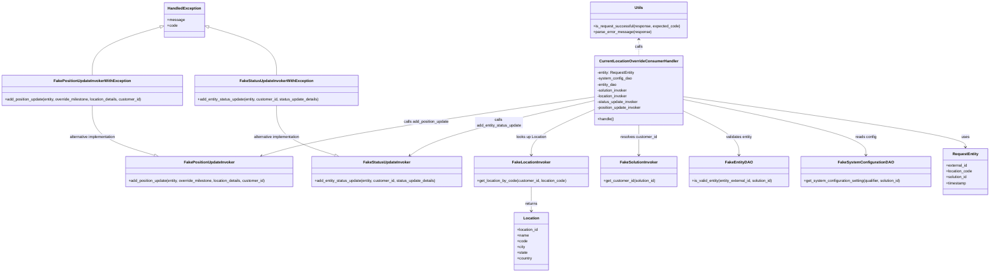
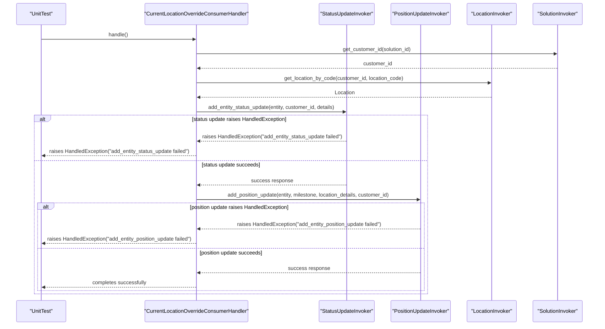

# Diagram: entity_core/entity_service/entity_service_tests/current_location_override_tests/test_current_location_override_consumer_handler.py

> Auto-generated by Obscura crawlers

## Diagram 1

### SVG

<svg id="container" width="4155.197265625" xmlns="http://www.w3.org/2000/svg" class="classDiagram" height="1132" viewBox="0 0 4155.197265625 1132" role="graphics-document document" aria-roledescription="class"><g><defs><marker id="container_class-aggregationStart" class="marker aggregation class" refX="18" refY="7" markerWidth="190" markerHeight="240" orient="auto"><path d="M 18,7 L9,13 L1,7 L9,1 Z"></path></marker></defs><defs><marker id="container_class-aggregationEnd" class="marker aggregation class" refX="1" refY="7" markerWidth="20" markerHeight="28" orient="auto"><path d="M 18,7 L9,13 L1,7 L9,1 Z"></path></marker></defs><defs><marker id="container_class-extensionStart" class="marker extension class" refX="18" refY="7" markerWidth="190" markerHeight="240" orient="auto"><path d="M 1,7 L18,13 V 1 Z"></path></marker></defs><defs><marker id="container_class-extensionEnd" class="marker extension class" refX="1" refY="7" markerWidth="20" markerHeight="28" orient="auto"><path d="M 1,1 V 13 L18,7 Z"></path></marker></defs><defs><marker id="container_class-compositionStart" class="marker composition class" refX="18" refY="7" markerWidth="190" markerHeight="240" orient="auto"><path d="M 18,7 L9,13 L1,7 L9,1 Z"></path></marker></defs><defs><marker id="container_class-compositionEnd" class="marker composition class" refX="1" refY="7" markerWidth="20" markerHeight="28" orient="auto"><path d="M 18,7 L9,13 L1,7 L9,1 Z"></path></marker></defs><defs><marker id="container_class-dependencyStart" class="marker dependency class" refX="6" refY="7" markerWidth="190" markerHeight="240" orient="auto"><path d="M 5,7 L9,13 L1,7 L9,1 Z"></path></marker></defs><defs><marker id="container_class-dependencyEnd" class="marker dependency class" refX="13" refY="7" markerWidth="20" markerHeight="28" orient="auto"><path d="M 18,7 L9,13 L14,7 L9,1 Z"></path></marker></defs><defs><marker id="container_class-lollipopStart" class="marker lollipop class" refX="13" refY="7" markerWidth="190" markerHeight="240" orient="auto"><circle stroke="black" fill="transparent" cx="7" cy="7" r="6"></circle></marker></defs><defs><marker id="container_class-lollipopEnd" class="marker lollipop class" refX="1" refY="7" markerWidth="190" markerHeight="240" orient="auto"><circle stroke="black" fill="transparent" cx="7" cy="7" r="6"></circle></marker></defs><g class="root"><g class="clusters"></g><g class="edgePaths"><path d="M2871.354,401.958L3068.547,429.798C3265.74,457.639,3660.127,513.319,3857.32,548.326C4054.514,583.333,4054.514,597.667,4054.514,604.833L4054.514,612" id="id_CurrentLocationOverrideConsumerHandler_RequestEntity_1" class="edge-thickness-normal edge-pattern-solid relation" style=";;;" data-edge="true" data-et="edge" data-id="id_CurrentLocationOverrideConsumerHandler_RequestEntity_1" data-points="W3sieCI6Mjg3MS4zNTM1MTU2MjUsInkiOjQwMS45NTc4MjkxMDQ3MTg2fSx7IngiOjQwNTQuNTEzNjcxODc1LCJ5Ijo1Njl9LHsieCI6NDA1NC41MTM2NzE4NzUsInkiOjYxOH1d" marker-end="url(#container_class-dependencyEnd)"></path><path d="M2871.354,413.25L2999.479,439.208C3127.604,465.167,3383.854,517.083,3511.979,555.708C3640.104,594.333,3640.104,619.667,3640.104,632.333L3640.104,645" id="id_CurrentLocationOverrideConsumerHandler_FakeSystemConfigurationDAO_2" class="edge-thickness-normal edge-pattern-solid relation" style=";;;" data-edge="true" data-et="edge" data-id="id_CurrentLocationOverrideConsumerHandler_FakeSystemConfigurationDAO_2" data-points="W3sieCI6Mjg3MS4zNTM1MTU2MjUsInkiOjQxMy4yNTAxNjgxMjM3MzkwNn0seyJ4IjozNjQwLjEwMzUxNTYyNSwieSI6NTY5fSx7IngiOjM2NDAuMTAzNTE1NjI1LCJ5Ijo2NTF9XQ==" marker-end="url(#container_class-dependencyEnd)"></path><path d="M2871.354,460.452L2910.74,478.543C2950.127,496.634,3028.9,532.817,3068.287,563.575C3107.674,594.333,3107.674,619.667,3107.674,632.333L3107.674,645" id="id_CurrentLocationOverrideConsumerHandler_FakeEntityDAO_3" class="edge-thickness-normal edge-pattern-solid relation" style=";;;" data-edge="true" data-et="edge" data-id="id_CurrentLocationOverrideConsumerHandler_FakeEntityDAO_3" data-points="W3sieCI6Mjg3MS4zNTM1MTU2MjUsInkiOjQ2MC40NTE2Mjk2OTcxMTYyfSx7IngiOjMxMDcuNjczODI4MTI1LCJ5Ijo1Njl9LHsieCI6MzEwNy42NzM4MjgxMjUsInkiOjY1MX1d" marker-end="url(#container_class-dependencyEnd)"></path><path d="M2687.494,520L2687.494,528.167C2687.494,536.333,2687.494,552.667,2687.494,573.5C2687.494,594.333,2687.494,619.667,2687.494,632.333L2687.494,645" id="id_CurrentLocationOverrideConsumerHandler_FakeSolutionInvoker_4" class="edge-thickness-normal edge-pattern-solid relation" style=";;;" data-edge="true" data-et="edge" data-id="id_CurrentLocationOverrideConsumerHandler_FakeSolutionInvoker_4" data-points="W3sieCI6MjY4Ny40OTQxNDA2MjUsInkiOjUyMH0seyJ4IjoyNjg3LjQ5NDE0MDYyNSwieSI6NTY5fSx7IngiOjI2ODcuNDk0MTQwNjI1LCJ5Ijo2NTF9XQ==" marker-end="url(#container_class-dependencyEnd)"></path><path d="M2503.635,455.401L2459.794,474.334C2415.952,493.267,2328.27,531.134,2284.429,562.734C2240.588,594.333,2240.588,619.667,2240.588,632.333L2240.588,645" id="id_CurrentLocationOverrideConsumerHandler_FakeLocationInvoker_5" class="edge-thickness-normal edge-pattern-solid relation" style=";;;" data-edge="true" data-et="edge" data-id="id_CurrentLocationOverrideConsumerHandler_FakeLocationInvoker_5" data-points="W3sieCI6MjUwMy42MzQ3NjU2MjUsInkiOjQ1NS40MDExMjU3OTUzOTg5fSx7IngiOjIyNDAuNTg3ODkwNjI1LCJ5Ijo1Njl9LHsieCI6MjI0MC41ODc4OTA2MjUsInkiOjY1MX1d" marker-end="url(#container_class-dependencyEnd)"></path><path d="M2503.635,418.208L2394.16,443.34C2284.685,468.472,2065.735,518.736,1936.732,556.977C1807.729,595.219,1768.673,621.437,1749.145,634.547L1729.617,647.656" id="id_CurrentLocationOverrideConsumerHandler_FakeStatusUpdateInvoker_6" class="edge-thickness-normal edge-pattern-solid relation" style=";;;" data-edge="true" data-et="edge" data-id="id_CurrentLocationOverrideConsumerHandler_FakeStatusUpdateInvoker_6" data-points="W3sieCI6MjUwMy42MzQ3NjU2MjUsInkiOjQxOC4yMDgyNTUyMTYxMzc4fSx7IngiOjE4NDYuNzg1MTU2MjUsInkiOjU2OX0seyJ4IjoxNzI0LjYzNTY0MTE2Mzc5MywieSI6NjUxfV0=" marker-end="url(#container_class-dependencyEnd)"></path><path d="M2503.635,403.103L2316.064,430.752C2128.493,458.402,1753.352,513.701,1520.128,554.736C1286.904,595.771,1195.597,622.541,1149.944,635.927L1104.29,649.312" id="id_CurrentLocationOverrideConsumerHandler_FakePositionUpdateInvoker_7" class="edge-thickness-normal edge-pattern-solid relation" style=";;;" data-edge="true" data-et="edge" data-id="id_CurrentLocationOverrideConsumerHandler_FakePositionUpdateInvoker_7" data-points="W3sieCI6MjUwMy42MzQ3NjU2MjUsInkiOjQwMy4xMDI1MDg2NzgyNjM1fSx7IngiOjEzNzguMjEwOTM3NSwieSI6NTY5fSx7IngiOjEwOTguNTMyODM5NDM5NjU1MiwieSI6NjUxfV0=" marker-end="url(#container_class-dependencyEnd)"></path><path d="M2240.588,777L2240.588,788.667C2240.588,800.333,2240.588,823.667,2240.588,840.5C2240.588,857.333,2240.588,867.667,2240.588,872.833L2240.588,878" id="id_FakeLocationInvoker_Location_8" class="edge-thickness-normal edge-pattern-solid relation" style=";;;" data-edge="true" data-et="edge" data-id="id_FakeLocationInvoker_Location_8" data-points="W3sieCI6MjI0MC41ODc4OTA2MjUsInkiOjc3N30seyJ4IjoyMjQwLjU4Nzg5MDYyNSwieSI6ODQ3fSx7IngiOjIyNDAuNTg3ODkwNjI1LCJ5Ijo4ODR9XQ==" marker-end="url(#container_class-dependencyEnd)"></path><path d="M1162.453,439L1162.453,460.667C1162.453,482.333,1162.453,525.667,1203.849,560.15C1245.244,594.633,1328.036,620.265,1369.431,633.082L1410.827,645.898" id="id_FakeStatusUpdateInvokerWithException_FakeStatusUpdateInvoker_9" class="edge-thickness-normal edge-pattern-solid relation" style=";;;" data-edge="true" data-et="edge" data-id="id_FakeStatusUpdateInvokerWithException_FakeStatusUpdateInvoker_9" data-points="W3sieCI6MTE2Mi40NTMxMjUsInkiOjQzOX0seyJ4IjoxMTYyLjQ1MzEyNSwieSI6NTY5fSx7IngiOjE0MjcuMzA1MTcyNDEzNzkzMSwieSI6NjUxfV0=" marker-end="url(#container_class-extensionEnd)"></path><path d="M389.105,439L389.105,460.667C389.105,482.333,389.105,525.667,432.96,560.191C476.814,594.716,564.522,620.431,608.376,633.289L652.23,646.147" id="id_FakePositionUpdateInvokerWithException_FakePositionUpdateInvoker_10" class="edge-thickness-normal edge-pattern-solid relation" style=";;;" data-edge="true" data-et="edge" data-id="id_FakePositionUpdateInvokerWithException_FakePositionUpdateInvoker_10" data-points="W3sieCI6Mzg5LjEwNTQ2ODc1LCJ5Ijo0Mzl9LHsieCI6Mzg5LjEwNTQ2ODc1LCJ5Ijo1Njl9LHsieCI6NjY4Ljc4MzU2NjgxMDM0NDgsInkiOjY1MX1d" marker-end="url(#container_class-extensionEnd)"></path><path d="M2687.494,164L2687.494,169.167C2687.494,174.333,2687.494,184.667,2687.494,196C2687.494,207.333,2687.494,219.667,2687.494,225.833L2687.494,232" id="id_Utils_CurrentLocationOverrideConsumerHandler_11" class="edge-thickness-normal edge-pattern-dashed relation" style=";;;" data-edge="true" data-et="edge" data-id="id_Utils_CurrentLocationOverrideConsumerHandler_11" data-points="W3sieCI6MjY4Ny40OTQxNDA2MjUsInkiOjE1OH0seyJ4IjoyNjg3LjQ5NDE0MDYyNSwieSI6MTk1fSx7IngiOjI2ODcuNDk0MTQwNjI1LCJ5IjoyMzJ9XQ==" marker-start="url(#container_class-dependencyStart)"></path><path d="M872.727,111.081L921.015,125.067C969.302,139.054,1065.878,167.027,1114.165,200.68C1162.453,234.333,1162.453,273.667,1162.453,293.333L1162.453,313" id="id_HandledException_FakeStatusUpdateInvokerWithException_12" class="edge-thickness-normal edge-pattern-solid relation" style=";;;" data-edge="true" data-et="edge" data-id="id_HandledException_FakeStatusUpdateInvokerWithException_12" data-points="W3sieCI6ODU2LjE1ODIwMzEyNSwieSI6MTA2LjI4MTczNDc0Njk2NTU1fSx7IngiOjExNjIuNDUzMTI1LCJ5IjoxOTV9LHsieCI6MTE2Mi40NTMxMjUsInkiOjMxM31d" marker-start="url(#container_class-extensionStart)"></path><path d="M678.831,111.081L630.544,125.067C582.256,139.054,485.681,167.027,437.393,200.68C389.105,234.333,389.105,273.667,389.105,293.333L389.105,313" id="id_HandledException_FakePositionUpdateInvokerWithException_13" class="edge-thickness-normal edge-pattern-solid relation" style=";;;" data-edge="true" data-et="edge" data-id="id_HandledException_FakePositionUpdateInvokerWithException_13" data-points="W3sieCI6Njk1LjQwMDM5MDYyNSwieSI6MTA2LjI4MTczNDc0Njk2NTU1fSx7IngiOjM4OS4xMDU0Njg3NSwieSI6MTk1fSx7IngiOjM4OS4xMDU0Njg3NSwieSI6MzEzfV0=" marker-start="url(#container_class-extensionStart)"></path></g><g class="edgeLabels"><g class="edgeLabel" transform="translate(4054.513671875, 569)"><g class="label" data-id="id_CurrentLocationOverrideConsumerHandler_RequestEntity_1" transform="translate(-16.4921875, -12)"><foreignObject width="32.984375" height="24">

uses

</foreignObject></g></g><g class="edgeLabel" transform="translate(3640.103515625, 569)"><g class="label" data-id="id_CurrentLocationOverrideConsumerHandler_FakeSystemConfigurationDAO_2" transform="translate(-43.90625, -12)"><foreignObject width="87.8125" height="24">

reads config

</foreignObject></g></g><g class="edgeLabel" transform="translate(3107.673828125, 569)"><g class="label" data-id="id_CurrentLocationOverrideConsumerHandler_FakeEntityDAO_3" transform="translate(-55.78125, -12)"><foreignObject width="111.5625" height="24">

validates entity

</foreignObject></g></g><g class="edgeLabel" transform="translate(2687.494140625, 569)"><g class="label" data-id="id_CurrentLocationOverrideConsumerHandler_FakeSolutionInvoker_4" transform="translate(-76.4453125, -12)"><foreignObject width="152.890625" height="24">

resolves customer_id

</foreignObject></g></g><g class="edgeLabel" transform="translate(2240.587890625, 569)"><g class="label" data-id="id_CurrentLocationOverrideConsumerHandler_FakeLocationInvoker_5" transform="translate(-64.1484375, -12)"><foreignObject width="128.296875" height="24">

looks up Location

</foreignObject></g></g><g class="edgeLabel" transform="translate(2103.51458, 510.0631)"><g class="label" data-id="id_CurrentLocationOverrideConsumerHandler_FakeStatusUpdateInvoker_6" transform="translate(-100, -24)"><foreignObject width="200" height="48">

calls add_entity_status_update

</foreignObject></g></g><g class="edgeLabel" transform="translate(1796.75514, 507.30286)"><g class="label" data-id="id_CurrentLocationOverrideConsumerHandler_FakePositionUpdateInvoker_7" transform="translate(-96.234375, -12)"><foreignObject width="192.46875" height="24">

calls add_position_update

</foreignObject></g></g><g class="edgeLabel" transform="translate(2240.587890625, 847)"><g class="label" data-id="id_FakeLocationInvoker_Location_8" transform="translate(-26.265625, -12)"><foreignObject width="52.53125" height="24">

returns

</foreignObject></g></g><g class="edgeLabel" transform="translate(1162.453125, 569)"><g class="label" data-id="id_FakeStatusUpdateInvokerWithException_FakeStatusUpdateInvoker_9" transform="translate(-99.5234375, -12)"><foreignObject width="199.046875" height="24">

alternative implementation

</foreignObject></g></g><g class="edgeLabel" transform="translate(389.10546875, 569)"><g class="label" data-id="id_FakePositionUpdateInvokerWithException_FakePositionUpdateInvoker_10" transform="translate(-99.5234375, -12)"><foreignObject width="199.046875" height="24">

alternative implementation

</foreignObject></g></g><g class="edgeLabel" transform="translate(2687.494140625, 195)"><g class="label" data-id="id_Utils_CurrentLocationOverrideConsumerHandler_11" transform="translate(-16.4453125, -12)"><foreignObject width="32.890625" height="24">

calls

</foreignObject></g></g><g class="edgeLabel"><g class="label" data-id="id_HandledException_FakeStatusUpdateInvokerWithException_12" transform="translate(0, 0)"><foreignObject width="0" height="0">

</foreignObject></g></g><g class="edgeLabel"><g class="label" data-id="id_HandledException_FakePositionUpdateInvokerWithException_13" transform="translate(0, 0)"><foreignObject width="0" height="0">

</foreignObject></g></g></g><g class="nodes"><g class="node default" id="classId-CurrentLocationOverrideConsumerHandler-0" transform="translate(2687.494140625, 376)"><g class="basic label-container"><path d="M-183.859375 -144 L183.859375 -144 L183.859375 144 L-183.859375 144" stroke="none" stroke-width="0" fill="#ECECFF" style=""></path><path d="M-183.859375 -144 C-61.250162514609016 -144, 61.35904997078197 -144, 183.859375 -144 M-183.859375 -144 C-77.34600006148055 -144, 29.167374877038895 -144, 183.859375 -144 M183.859375 -144 C183.859375 -52.512985311981836, 183.859375 38.97402937603633, 183.859375 144 M183.859375 -144 C183.859375 -83.93435771921268, 183.859375 -23.86871543842537, 183.859375 144 M183.859375 144 C44.71475857976097 144, -94.42985784047806 144, -183.859375 144 M183.859375 144 C39.749917625390424 144, -104.35953974921915 144, -183.859375 144 M-183.859375 144 C-183.859375 64.83424642639125, -183.859375 -14.331507147217508, -183.859375 -144 M-183.859375 144 C-183.859375 84.34765841805547, -183.859375 24.695316836110948, -183.859375 -144" stroke="#9370DB" stroke-width="1.3" fill="none" stroke-dasharray="0 0" style=""></path></g><g class="annotation-group text" transform="translate(0, -120)"></g><g class="label-group text" transform="translate(-156.203125, -120)"><g class="label" style="font-weight: bolder" transform="translate(0,-12)"><foreignObject width="312.40625" height="24">

CurrentLocationOverrideConsumerHandler

</foreignObject></g></g><g class="members-group text" transform="translate(-171.859375, -72)"><g class="label" style="" transform="translate(0,-12)"><foreignObject width="157.1875" height="24">

-entity: RequestEntity

</foreignObject></g><g class="label" style="" transform="translate(0,12)"><foreignObject width="144.109375" height="24">

-system_config_dao

</foreignObject></g><g class="label" style="" transform="translate(0,36)"><foreignObject width="83.546875" height="24">

-entity_dao

</foreignObject></g><g class="label" style="" transform="translate(0,60)"><foreignObject width="128.46875" height="24">

-solution_invoker

</foreignObject></g><g class="label" style="" transform="translate(0,84)"><foreignObject width="127.796875" height="24">

-location_invoker

</foreignObject></g><g class="label" style="" transform="translate(0,108)"><foreignObject width="171.75" height="24">

-status_update_invoker

</foreignObject></g><g class="label" style="" transform="translate(0,132)"><foreignObject width="187.515625" height="24">

-position_update_invoker

</foreignObject></g></g><g class="methods-group text" transform="translate(-171.859375, 120)"><g class="label" style="" transform="translate(0,-12)"><foreignObject width="68.71875" height="24">

+handle()

</foreignObject></g></g><g class="divider" style=""><path d="M-183.859375 -96 C-74.33417578019657 -96, 35.19102343960685 -96, 183.859375 -96 M-183.859375 -96 C-104.40448673086121 -96, -24.949598461722417 -96, 183.859375 -96" stroke="#9370DB" stroke-width="1.3" fill="none" stroke-dasharray="0 0" style=""></path></g><g class="divider" style=""><path d="M-183.859375 96 C-94.0541160327151 96, -4.248857065430201 96, 183.859375 96 M-183.859375 96 C-96.64239785793953 96, -9.425420715879056 96, 183.859375 96" stroke="#9370DB" stroke-width="1.3" fill="none" stroke-dasharray="0 0" style=""></path></g></g><g class="node default" id="classId-RequestEntity-1" transform="translate(4054.513671875, 714)"><g class="basic label-container"><path d="M-92.68359375 -96 L92.68359375 -96 L92.68359375 96 L-92.68359375 96" stroke="none" stroke-width="0" fill="#ECECFF" style=""></path><path d="M-92.68359375 -96 C-43.58336294498744 -96, 5.5168678600251155 -96, 92.68359375 -96 M-92.68359375 -96 C-27.016782409926833 -96, 38.650028930146334 -96, 92.68359375 -96 M92.68359375 -96 C92.68359375 -50.246237836835256, 92.68359375 -4.492475673670512, 92.68359375 96 M92.68359375 -96 C92.68359375 -33.17638797224938, 92.68359375 29.64722405550124, 92.68359375 96 M92.68359375 96 C24.977244485327503 96, -42.72910477934499 96, -92.68359375 96 M92.68359375 96 C41.314335301448885 96, -10.05492314710223 96, -92.68359375 96 M-92.68359375 96 C-92.68359375 23.809005144841308, -92.68359375 -48.381989710317384, -92.68359375 -96 M-92.68359375 96 C-92.68359375 28.814926879714704, -92.68359375 -38.37014624057059, -92.68359375 -96" stroke="#9370DB" stroke-width="1.3" fill="none" stroke-dasharray="0 0" style=""></path></g><g class="annotation-group text" transform="translate(0, -72)"></g><g class="label-group text" transform="translate(-51.2578125, -72)"><g class="label" style="font-weight: bolder" transform="translate(0,-12)"><foreignObject width="102.515625" height="24">

RequestEntity

</foreignObject></g></g><g class="members-group text" transform="translate(-80.68359375, -24)"><g class="label" style="" transform="translate(0,-12)"><foreignObject width="89.765625" height="24">

+external_id

</foreignObject></g><g class="label" style="" transform="translate(0,12)"><foreignObject width="110.109375" height="24">

+location_code

</foreignObject></g><g class="label" style="" transform="translate(0,36)"><foreignObject width="90.21875" height="24">

+solution_id

</foreignObject></g><g class="label" style="" transform="translate(0,60)"><foreignObject width="85.6875" height="24">

+timestamp

</foreignObject></g></g><g class="methods-group text" transform="translate(-80.68359375, 96)"></g><g class="divider" style=""><path d="M-92.68359375 -48 C-49.95753381815528 -48, -7.231473886310553 -48, 92.68359375 -48 M-92.68359375 -48 C-54.93509936356454 -48, -17.18660497712908 -48, 92.68359375 -48" stroke="#9370DB" stroke-width="1.3" fill="none" stroke-dasharray="0 0" style=""></path></g><g class="divider" style=""><path d="M-92.68359375 72 C-52.43635582316861 72, -12.189117896337223 72, 92.68359375 72 M-92.68359375 72 C-36.36564107361915 72, 19.952311602761696 72, 92.68359375 72" stroke="#9370DB" stroke-width="1.3" fill="none" stroke-dasharray="0 0" style=""></path></g></g><g class="node default" id="classId-Location-2" transform="translate(2240.587890625, 1004)"><g class="basic label-container"><path d="M-72.44921875 -120 L72.44921875 -120 L72.44921875 120 L-72.44921875 120" stroke="none" stroke-width="0" fill="#ECECFF" style=""></path><path d="M-72.44921875 -120 C-43.00291804551185 -120, -13.556617341023696 -120, 72.44921875 -120 M-72.44921875 -120 C-34.31380188641731 -120, 3.821614977165382 -120, 72.44921875 -120 M72.44921875 -120 C72.44921875 -64.31408857136768, 72.44921875 -8.628177142735339, 72.44921875 120 M72.44921875 -120 C72.44921875 -61.677147020891816, 72.44921875 -3.354294041783632, 72.44921875 120 M72.44921875 120 C41.999538024091855 120, 11.54985729818371 120, -72.44921875 120 M72.44921875 120 C25.06997582233484 120, -22.30926710533032 120, -72.44921875 120 M-72.44921875 120 C-72.44921875 59.13725043339969, -72.44921875 -1.7254991332006142, -72.44921875 -120 M-72.44921875 120 C-72.44921875 45.906366899860146, -72.44921875 -28.18726620027971, -72.44921875 -120" stroke="#9370DB" stroke-width="1.3" fill="none" stroke-dasharray="0 0" style=""></path></g><g class="annotation-group text" transform="translate(0, -96)"></g><g class="label-group text" transform="translate(-31.3515625, -96)"><g class="label" style="font-weight: bolder" transform="translate(0,-12)"><foreignObject width="62.703125" height="24">

Location

</foreignObject></g></g><g class="members-group text" transform="translate(-60.44921875, -48)"><g class="label" style="" transform="translate(0,-12)"><foreignObject width="89.546875" height="24">

+location_id

</foreignObject></g><g class="label" style="" transform="translate(0,12)"><foreignObject width="48.5" height="24">

+name

</foreignObject></g><g class="label" style="" transform="translate(0,36)"><foreignObject width="42.953125" height="24">

+code

</foreignObject></g><g class="label" style="" transform="translate(0,60)"><foreignObject width="33.71875" height="24">

+city

</foreignObject></g><g class="label" style="" transform="translate(0,84)"><foreignObject width="44.09375" height="24">

+state

</foreignObject></g><g class="label" style="" transform="translate(0,108)"><foreignObject width="63.171875" height="24">

+country

</foreignObject></g></g><g class="methods-group text" transform="translate(-60.44921875, 120)"></g><g class="divider" style=""><path d="M-72.44921875 -72 C-20.009062145461662 -72, 32.431094459076675 -72, 72.44921875 -72 M-72.44921875 -72 C-42.084923269550025 -72, -11.72062778910005 -72, 72.44921875 -72" stroke="#9370DB" stroke-width="1.3" fill="none" stroke-dasharray="0 0" style=""></path></g><g class="divider" style=""><path d="M-72.44921875 96 C-29.61853923080548 96, 13.212140288389037 96, 72.44921875 96 M-72.44921875 96 C-36.40092897257442 96, -0.35263919514883924 96, 72.44921875 96" stroke="#9370DB" stroke-width="1.3" fill="none" stroke-dasharray="0 0" style=""></path></g></g><g class="node default" id="classId-HandledException-3" transform="translate(775.779296875, 83)"><g class="basic label-container"><path d="M-80.37890625 -72 L80.37890625 -72 L80.37890625 72 L-80.37890625 72" stroke="none" stroke-width="0" fill="#ECECFF" style=""></path><path d="M-80.37890625 -72 C-47.882062396070154 -72, -15.385218542140308 -72, 80.37890625 -72 M-80.37890625 -72 C-47.176371738690754 -72, -13.973837227381509 -72, 80.37890625 -72 M80.37890625 -72 C80.37890625 -36.52703197182699, 80.37890625 -1.0540639436539863, 80.37890625 72 M80.37890625 -72 C80.37890625 -15.818556658227962, 80.37890625 40.362886683544076, 80.37890625 72 M80.37890625 72 C34.789479525857644 72, -10.799947198284713 72, -80.37890625 72 M80.37890625 72 C30.11917156118406 72, -20.14056312763188 72, -80.37890625 72 M-80.37890625 72 C-80.37890625 24.677726547113018, -80.37890625 -22.644546905773964, -80.37890625 -72 M-80.37890625 72 C-80.37890625 40.77230883343423, -80.37890625 9.544617666868461, -80.37890625 -72" stroke="#9370DB" stroke-width="1.3" fill="none" stroke-dasharray="0 0" style=""></path></g><g class="annotation-group text" transform="translate(0, -48)"></g><g class="label-group text" transform="translate(-66.3828125, -48)"><g class="label" style="font-weight: bolder" transform="translate(0,-12)"><foreignObject width="132.765625" height="24">

HandledException

</foreignObject></g></g><g class="members-group text" transform="translate(-68.37890625, 0)"><g class="label" style="" transform="translate(0,-12)"><foreignObject width="70.375" height="24">

+message

</foreignObject></g><g class="label" style="" transform="translate(0,12)"><foreignObject width="42.953125" height="24">

+code

</foreignObject></g></g><g class="methods-group text" transform="translate(-68.37890625, 72)"></g><g class="divider" style=""><path d="M-80.37890625 -24 C-43.92058107237866 -24, -7.46225589475732 -24, 80.37890625 -24 M-80.37890625 -24 C-28.407428791097246 -24, 23.56404866780551 -24, 80.37890625 -24" stroke="#9370DB" stroke-width="1.3" fill="none" stroke-dasharray="0 0" style=""></path></g><g class="divider" style=""><path d="M-80.37890625 48 C-38.336399768397754 48, 3.706106713204491 48, 80.37890625 48 M-80.37890625 48 C-42.54877192618123 48, -4.718637602362463 48, 80.37890625 48" stroke="#9370DB" stroke-width="1.3" fill="none" stroke-dasharray="0 0" style=""></path></g></g><g class="node default" id="classId-Utils-4" transform="translate(2687.494140625, 83)"><g class="basic label-container"><path d="M-200.125 -75 L200.125 -75 L200.125 75 L-200.125 75" stroke="none" stroke-width="0" fill="#ECECFF" style=""></path><path d="M-200.125 -75 C-51.6046411228634 -75, 96.9157177542732 -75, 200.125 -75 M-200.125 -75 C-106.87266651717196 -75, -13.620333034343929 -75, 200.125 -75 M200.125 -75 C200.125 -42.74012738623426, 200.125 -10.480254772468527, 200.125 75 M200.125 -75 C200.125 -23.80134628881605, 200.125 27.397307422367902, 200.125 75 M200.125 75 C64.97482573098873 75, -70.17534853802255 75, -200.125 75 M200.125 75 C51.19648147607913 75, -97.73203704784174 75, -200.125 75 M-200.125 75 C-200.125 39.06320436942281, -200.125 3.126408738845626, -200.125 -75 M-200.125 75 C-200.125 28.98999679186074, -200.125 -17.02000641627852, -200.125 -75" stroke="#9370DB" stroke-width="1.3" fill="none" stroke-dasharray="0 0" style=""></path></g><g class="annotation-group text" transform="translate(0, -51)"></g><g class="label-group text" transform="translate(-16.796875, -51)"><g class="label" style="font-weight: bolder" transform="translate(0,-12)"><foreignObject width="33.59375" height="24">

Utils

</foreignObject></g></g><g class="members-group text" transform="translate(-188.125, -3)"></g><g class="methods-group text" transform="translate(-188.125, 27)"><g class="label" style="" transform="translate(0,-12)"><foreignObject width="359.453125" height="24">

+is_request_successful(response, expected_code)

</foreignObject></g><g class="label" style="" transform="translate(0,12)"><foreignObject width="238.0625" height="24">

+parse_error_message(response)

</foreignObject></g></g><g class="divider" style=""><path d="M-200.125 -27 C-98.39850680302546 -27, 3.3279863939490895 -27, 200.125 -27 M-200.125 -27 C-55.32185913961504 -27, 89.48128172076991 -27, 200.125 -27" stroke="#9370DB" stroke-width="1.3" fill="none" stroke-dasharray="0 0" style=""></path></g><g class="divider" style=""><path d="M-200.125 -3 C-55.07717106618105 -3, 89.9706578676379 -3, 200.125 -3 M-200.125 -3 C-66.09050397150676 -3, 67.94399205698647 -3, 200.125 -3" stroke="#9370DB" stroke-width="1.3" fill="none" stroke-dasharray="0 0" style=""></path></g></g><g class="node default" id="classId-FakePositionUpdateInvoker-5" transform="translate(883.658203125, 714)"><g class="basic label-container"><path d="M-354.88671875 -63 L354.88671875 -63 L354.88671875 63 L-354.88671875 63" stroke="none" stroke-width="0" fill="#ECECFF" style=""></path><path d="M-354.88671875 -63 C-192.31478315115638 -63, -29.742847552312753 -63, 354.88671875 -63 M-354.88671875 -63 C-108.78738527235765 -63, 137.3119482052847 -63, 354.88671875 -63 M354.88671875 -63 C354.88671875 -20.730375179530277, 354.88671875 21.539249640939445, 354.88671875 63 M354.88671875 -63 C354.88671875 -15.383425249507702, 354.88671875 32.233149500984595, 354.88671875 63 M354.88671875 63 C111.96621728989791 63, -130.95428417020418 63, -354.88671875 63 M354.88671875 63 C144.34284623630168 63, -66.20102627739664 63, -354.88671875 63 M-354.88671875 63 C-354.88671875 37.611536067693976, -354.88671875 12.223072135387959, -354.88671875 -63 M-354.88671875 63 C-354.88671875 34.90478633855616, -354.88671875 6.809572677112314, -354.88671875 -63" stroke="#9370DB" stroke-width="1.3" fill="none" stroke-dasharray="0 0" style=""></path></g><g class="annotation-group text" transform="translate(0, -39)"></g><g class="label-group text" transform="translate(-100.6015625, -39)"><g class="label" style="font-weight: bolder" transform="translate(0,-12)"><foreignObject width="201.203125" height="24">

FakePositionUpdateInvoker

</foreignObject></g></g><g class="members-group text" transform="translate(-342.88671875, 9)"></g><g class="methods-group text" transform="translate(-342.88671875, 39)"><g class="label" style="" transform="translate(0,-12)"><foreignObject width="585.171875" height="24">

+add_position_update(entity, override_milestone, location_details, customer_id)

</foreignObject></g></g><g class="divider" style=""><path d="M-354.88671875 -15 C-175.82746758263778 -15, 3.2317835847244396 -15, 354.88671875 -15 M-354.88671875 -15 C-186.90730110414162 -15, -18.927883458283247 -15, 354.88671875 -15" stroke="#9370DB" stroke-width="1.3" fill="none" stroke-dasharray="0 0" style=""></path></g><g class="divider" style=""><path d="M-354.88671875 9 C-109.781415750827 9, 135.323887248346 9, 354.88671875 9 M-354.88671875 9 C-192.04244885709446 9, -29.198178964188912 9, 354.88671875 9" stroke="#9370DB" stroke-width="1.3" fill="none" stroke-dasharray="0 0" style=""></path></g></g><g class="node default" id="classId-FakePositionUpdateInvokerWithException-6" transform="translate(389.10546875, 376)"><g class="basic label-container"><path d="M-381.10546875 -63 L381.10546875 -63 L381.10546875 63 L-381.10546875 63" stroke="none" stroke-width="0" fill="#ECECFF" style=""></path><path d="M-381.10546875 -63 C-117.27844878128917 -63, 146.54857118742166 -63, 381.10546875 -63 M-381.10546875 -63 C-101.70496779201494 -63, 177.69553316597012 -63, 381.10546875 -63 M381.10546875 -63 C381.10546875 -29.479172219526866, 381.10546875 4.041655560946268, 381.10546875 63 M381.10546875 -63 C381.10546875 -18.11174557022059, 381.10546875 26.776508859558817, 381.10546875 63 M381.10546875 63 C108.38995290756941 63, -164.32556293486118 63, -381.10546875 63 M381.10546875 63 C145.32481828526107 63, -90.45583217947785 63, -381.10546875 63 M-381.10546875 63 C-381.10546875 13.105168319478636, -381.10546875 -36.78966336104273, -381.10546875 -63 M-381.10546875 63 C-381.10546875 34.00031807151524, -381.10546875 5.000636143030469, -381.10546875 -63" stroke="#9370DB" stroke-width="1.3" fill="none" stroke-dasharray="0 0" style=""></path></g><g class="annotation-group text" transform="translate(0, -39)"></g><g class="label-group text" transform="translate(-153.0390625, -39)"><g class="label" style="font-weight: bolder" transform="translate(0,-12)"><foreignObject width="306.078125" height="24">

FakePositionUpdateInvokerWithException

</foreignObject></g></g><g class="members-group text" transform="translate(-369.10546875, 9)"></g><g class="methods-group text" transform="translate(-369.10546875, 39)"><g class="label" style="" transform="translate(0,-12)"><foreignObject width="585.171875" height="24">

+add_position_update(entity, override_milestone, location_details, customer_id)

</foreignObject></g></g><g class="divider" style=""><path d="M-381.10546875 -15 C-191.2033798719008 -15, -1.301290993801615 -15, 381.10546875 -15 M-381.10546875 -15 C-128.1345136274393 -15, 124.83644149512139 -15, 381.10546875 -15" stroke="#9370DB" stroke-width="1.3" fill="none" stroke-dasharray="0 0" style=""></path></g><g class="divider" style=""><path d="M-381.10546875 9 C-99.54712253015333 9, 182.01122368969334 9, 381.10546875 9 M-381.10546875 9 C-81.7041951498428 9, 217.6970784503144 9, 381.10546875 9" stroke="#9370DB" stroke-width="1.3" fill="none" stroke-dasharray="0 0" style=""></path></g></g><g class="node default" id="classId-FakeStatusUpdateInvoker-7" transform="translate(1630.7890625, 714)"><g class="basic label-container"><path d="M-316.02734375 -63 L316.02734375 -63 L316.02734375 63 L-316.02734375 63" stroke="none" stroke-width="0" fill="#ECECFF" style=""></path><path d="M-316.02734375 -63 C-75.62901341370318 -63, 164.76931692259365 -63, 316.02734375 -63 M-316.02734375 -63 C-152.60164072477198 -63, 10.824062300456035 -63, 316.02734375 -63 M316.02734375 -63 C316.02734375 -20.235888238097758, 316.02734375 22.528223523804485, 316.02734375 63 M316.02734375 -63 C316.02734375 -36.29248360568833, 316.02734375 -9.584967211376664, 316.02734375 63 M316.02734375 63 C142.26052609306092 63, -31.506291563878165 63, -316.02734375 63 M316.02734375 63 C176.22544907394416 63, 36.423554397888324 63, -316.02734375 63 M-316.02734375 63 C-316.02734375 27.20735751938811, -316.02734375 -8.585284961223778, -316.02734375 -63 M-316.02734375 63 C-316.02734375 36.218585943753254, -316.02734375 9.437171887506508, -316.02734375 -63" stroke="#9370DB" stroke-width="1.3" fill="none" stroke-dasharray="0 0" style=""></path></g><g class="annotation-group text" transform="translate(0, -39)"></g><g class="label-group text" transform="translate(-94.1015625, -39)"><g class="label" style="font-weight: bolder" transform="translate(0,-12)"><foreignObject width="188.203125" height="24">

FakeStatusUpdateInvoker

</foreignObject></g></g><g class="members-group text" transform="translate(-304.02734375, 9)"></g><g class="methods-group text" transform="translate(-304.02734375, 39)"><g class="label" style="" transform="translate(0,-12)"><foreignObject width="513.953125" height="24">

+add_entity_status_update(entity, customer_id, status_update_details)

</foreignObject></g></g><g class="divider" style=""><path d="M-316.02734375 -15 C-163.81845955894883 -15, -11.609575367897662 -15, 316.02734375 -15 M-316.02734375 -15 C-93.29977023682613 -15, 129.42780327634773 -15, 316.02734375 -15" stroke="#9370DB" stroke-width="1.3" fill="none" stroke-dasharray="0 0" style=""></path></g><g class="divider" style=""><path d="M-316.02734375 9 C-149.80055242423532 9, 16.42623890152936 9, 316.02734375 9 M-316.02734375 9 C-160.32558238559886 9, -4.6238210211977275 9, 316.02734375 9" stroke="#9370DB" stroke-width="1.3" fill="none" stroke-dasharray="0 0" style=""></path></g></g><g class="node default" id="classId-FakeStatusUpdateInvokerWithException-8" transform="translate(1162.453125, 376)"><g class="basic label-container"><path d="M-342.2421875 -63 L342.2421875 -63 L342.2421875 63 L-342.2421875 63" stroke="none" stroke-width="0" fill="#ECECFF" style=""></path><path d="M-342.2421875 -63 C-109.84650150253344 -63, 122.54918449493312 -63, 342.2421875 -63 M-342.2421875 -63 C-189.0502381097234 -63, -35.85828871944682 -63, 342.2421875 -63 M342.2421875 -63 C342.2421875 -22.282145936508165, 342.2421875 18.43570812698367, 342.2421875 63 M342.2421875 -63 C342.2421875 -26.221979521956023, 342.2421875 10.556040956087955, 342.2421875 63 M342.2421875 63 C158.0463683661985 63, -26.149450767603014 63, -342.2421875 63 M342.2421875 63 C86.73719720517838 63, -168.76779308964325 63, -342.2421875 63 M-342.2421875 63 C-342.2421875 32.157531617992504, -342.2421875 1.315063235985015, -342.2421875 -63 M-342.2421875 63 C-342.2421875 22.28476607628332, -342.2421875 -18.430467847433363, -342.2421875 -63" stroke="#9370DB" stroke-width="1.3" fill="none" stroke-dasharray="0 0" style=""></path></g><g class="annotation-group text" transform="translate(0, -39)"></g><g class="label-group text" transform="translate(-146.53125, -39)"><g class="label" style="font-weight: bolder" transform="translate(0,-12)"><foreignObject width="293.0625" height="24">

FakeStatusUpdateInvokerWithException

</foreignObject></g></g><g class="members-group text" transform="translate(-330.2421875, 9)"></g><g class="methods-group text" transform="translate(-330.2421875, 39)"><g class="label" style="" transform="translate(0,-12)"><foreignObject width="513.953125" height="24">

+add_entity_status_update(entity, customer_id, status_update_details)

</foreignObject></g></g><g class="divider" style=""><path d="M-342.2421875 -15 C-117.04653382735137 -15, 108.14911984529726 -15, 342.2421875 -15 M-342.2421875 -15 C-120.81898945607671 -15, 100.60420858784659 -15, 342.2421875 -15" stroke="#9370DB" stroke-width="1.3" fill="none" stroke-dasharray="0 0" style=""></path></g><g class="divider" style=""><path d="M-342.2421875 9 C-154.9666720203786 9, 32.30884345924278 9, 342.2421875 9 M-342.2421875 9 C-86.76645438087263 9, 168.70927873825474 9, 342.2421875 9" stroke="#9370DB" stroke-width="1.3" fill="none" stroke-dasharray="0 0" style=""></path></g></g><g class="node default" id="classId-FakeLocationInvoker-9" transform="translate(2240.587890625, 714)"><g class="basic label-container"><path d="M-237.4296875 -63 L237.4296875 -63 L237.4296875 63 L-237.4296875 63" stroke="none" stroke-width="0" fill="#ECECFF" style=""></path><path d="M-237.4296875 -63 C-114.52729542747232 -63, 8.37509664505535 -63, 237.4296875 -63 M-237.4296875 -63 C-67.98307432213085 -63, 101.4635388557383 -63, 237.4296875 -63 M237.4296875 -63 C237.4296875 -21.014379209467656, 237.4296875 20.97124158106469, 237.4296875 63 M237.4296875 -63 C237.4296875 -26.66058312512913, 237.4296875 9.678833749741742, 237.4296875 63 M237.4296875 63 C56.824188616166964 63, -123.78131026766607 63, -237.4296875 63 M237.4296875 63 C81.17302828492214 63, -75.08363093015572 63, -237.4296875 63 M-237.4296875 63 C-237.4296875 26.32279538801796, -237.4296875 -10.354409223964083, -237.4296875 -63 M-237.4296875 63 C-237.4296875 29.331242639796407, -237.4296875 -4.337514720407185, -237.4296875 -63" stroke="#9370DB" stroke-width="1.3" fill="none" stroke-dasharray="0 0" style=""></path></g><g class="annotation-group text" transform="translate(0, -39)"></g><g class="label-group text" transform="translate(-75.4375, -39)"><g class="label" style="font-weight: bolder" transform="translate(0,-12)"><foreignObject width="150.875" height="24">

FakeLocationInvoker

</foreignObject></g></g><g class="members-group text" transform="translate(-225.4296875, 9)"></g><g class="methods-group text" transform="translate(-225.4296875, 39)"><g class="label" style="" transform="translate(0,-12)"><foreignObject width="375.421875" height="24">

+get_location_by_code(customer_id, location_code)

</foreignObject></g></g><g class="divider" style=""><path d="M-237.4296875 -15 C-72.28339059256919 -15, 92.86290631486162 -15, 237.4296875 -15 M-237.4296875 -15 C-75.95761990808413 -15, 85.51444768383175 -15, 237.4296875 -15" stroke="#9370DB" stroke-width="1.3" fill="none" stroke-dasharray="0 0" style=""></path></g><g class="divider" style=""><path d="M-237.4296875 9 C-123.03216424550558 9, -8.634640991011167 9, 237.4296875 9 M-237.4296875 9 C-48.495340319113666 9, 140.43900686177267 9, 237.4296875 9" stroke="#9370DB" stroke-width="1.3" fill="none" stroke-dasharray="0 0" style=""></path></g></g><g class="node default" id="classId-FakeSolutionInvoker-10" transform="translate(2687.494140625, 714)"><g class="basic label-container"><path d="M-159.4765625 -63 L159.4765625 -63 L159.4765625 63 L-159.4765625 63" stroke="none" stroke-width="0" fill="#ECECFF" style=""></path><path d="M-159.4765625 -63 C-52.565892768417726 -63, 54.34477696316455 -63, 159.4765625 -63 M-159.4765625 -63 C-47.17381027910449 -63, 65.12894194179103 -63, 159.4765625 -63 M159.4765625 -63 C159.4765625 -34.43484281524198, 159.4765625 -5.869685630483964, 159.4765625 63 M159.4765625 -63 C159.4765625 -34.2966268329365, 159.4765625 -5.593253665872986, 159.4765625 63 M159.4765625 63 C76.29769779832768 63, -6.881166903344649 63, -159.4765625 63 M159.4765625 63 C72.93832141858515 63, -13.599919662829706 63, -159.4765625 63 M-159.4765625 63 C-159.4765625 32.98435716982549, -159.4765625 2.9687143396509867, -159.4765625 -63 M-159.4765625 63 C-159.4765625 18.736162320252085, -159.4765625 -25.52767535949583, -159.4765625 -63" stroke="#9370DB" stroke-width="1.3" fill="none" stroke-dasharray="0 0" style=""></path></g><g class="annotation-group text" transform="translate(0, -39)"></g><g class="label-group text" transform="translate(-74.921875, -39)"><g class="label" style="font-weight: bolder" transform="translate(0,-12)"><foreignObject width="149.84375" height="24">

FakeSolutionInvoker

</foreignObject></g></g><g class="members-group text" transform="translate(-147.4765625, 9)"></g><g class="methods-group text" transform="translate(-147.4765625, 39)"><g class="label" style="" transform="translate(0,-12)"><foreignObject width="220.03125" height="24">

+get_customer_id(solution_id)

</foreignObject></g></g><g class="divider" style=""><path d="M-159.4765625 -15 C-48.57311294856345 -15, 62.3303366028731 -15, 159.4765625 -15 M-159.4765625 -15 C-44.55481613750342 -15, 70.36693022499315 -15, 159.4765625 -15" stroke="#9370DB" stroke-width="1.3" fill="none" stroke-dasharray="0 0" style=""></path></g><g class="divider" style=""><path d="M-159.4765625 9 C-44.106911272889676 9, 71.26273995422065 9, 159.4765625 9 M-159.4765625 9 C-82.27954658365763 9, -5.082530667315268 9, 159.4765625 9" stroke="#9370DB" stroke-width="1.3" fill="none" stroke-dasharray="0 0" style=""></path></g></g><g class="node default" id="classId-FakeSystemConfigurationDAO-11" transform="translate(3640.103515625, 714)"><g class="basic label-container"><path d="M-271.7265625 -63 L271.7265625 -63 L271.7265625 63 L-271.7265625 63" stroke="none" stroke-width="0" fill="#ECECFF" style=""></path><path d="M-271.7265625 -63 C-128.96345316703184 -63, 13.799656165936312 -63, 271.7265625 -63 M-271.7265625 -63 C-142.51550324893 -63, -13.304443997860005 -63, 271.7265625 -63 M271.7265625 -63 C271.7265625 -21.7149309843851, 271.7265625 19.570138031229803, 271.7265625 63 M271.7265625 -63 C271.7265625 -27.2343407928833, 271.7265625 8.531318414233397, 271.7265625 63 M271.7265625 63 C87.30203464178234 63, -97.12249321643532 63, -271.7265625 63 M271.7265625 63 C100.99723813716514 63, -69.73208622566972 63, -271.7265625 63 M-271.7265625 63 C-271.7265625 31.16940023415798, -271.7265625 -0.6611995316840407, -271.7265625 -63 M-271.7265625 63 C-271.7265625 35.215953639277785, -271.7265625 7.43190727855557, -271.7265625 -63" stroke="#9370DB" stroke-width="1.3" fill="none" stroke-dasharray="0 0" style=""></path></g><g class="annotation-group text" transform="translate(0, -39)"></g><g class="label-group text" transform="translate(-107.75, -39)"><g class="label" style="font-weight: bolder" transform="translate(0,-12)"><foreignObject width="215.5" height="24">

FakeSystemConfigurationDAO

</foreignObject></g></g><g class="members-group text" transform="translate(-259.7265625, 9)"></g><g class="methods-group text" transform="translate(-259.7265625, 39)"><g class="label" style="" transform="translate(0,-12)"><foreignObject width="411.703125" height="24">

+get_system_configuration_setting(qualifier, solution_id)

</foreignObject></g></g><g class="divider" style=""><path d="M-271.7265625 -15 C-104.3514048322046 -15, 63.02375283559081 -15, 271.7265625 -15 M-271.7265625 -15 C-81.78572107075684 -15, 108.15512035848633 -15, 271.7265625 -15" stroke="#9370DB" stroke-width="1.3" fill="none" stroke-dasharray="0 0" style=""></path></g><g class="divider" style=""><path d="M-271.7265625 9 C-104.0092349019821 9, 63.708092696035806 9, 271.7265625 9 M-271.7265625 9 C-100.95178465067463 9, 69.82299319865075 9, 271.7265625 9" stroke="#9370DB" stroke-width="1.3" fill="none" stroke-dasharray="0 0" style=""></path></g></g><g class="node default" id="classId-FakeEntityDAO-12" transform="translate(3107.673828125, 714)"><g class="basic label-container"><path d="M-210.703125 -63 L210.703125 -63 L210.703125 63 L-210.703125 63" stroke="none" stroke-width="0" fill="#ECECFF" style=""></path><path d="M-210.703125 -63 C-72.44338147925711 -63, 65.81636204148577 -63, 210.703125 -63 M-210.703125 -63 C-69.27406904312431 -63, 72.15498691375137 -63, 210.703125 -63 M210.703125 -63 C210.703125 -17.12969411672327, 210.703125 28.740611766553457, 210.703125 63 M210.703125 -63 C210.703125 -34.43667150689005, 210.703125 -5.873343013780094, 210.703125 63 M210.703125 63 C54.38422769428098 63, -101.93466961143804 63, -210.703125 63 M210.703125 63 C112.82165338135613 63, 14.940181762712257 63, -210.703125 63 M-210.703125 63 C-210.703125 20.935815725108696, -210.703125 -21.128368549782607, -210.703125 -63 M-210.703125 63 C-210.703125 19.502321796662443, -210.703125 -23.995356406675114, -210.703125 -63" stroke="#9370DB" stroke-width="1.3" fill="none" stroke-dasharray="0 0" style=""></path></g><g class="annotation-group text" transform="translate(0, -39)"></g><g class="label-group text" transform="translate(-53.109375, -39)"><g class="label" style="font-weight: bolder" transform="translate(0,-12)"><foreignObject width="106.21875" height="24">

FakeEntityDAO

</foreignObject></g></g><g class="members-group text" transform="translate(-198.703125, 9)"></g><g class="methods-group text" transform="translate(-198.703125, 39)"><g class="label" style="" transform="translate(0,-12)"><foreignObject width="344.296875" height="24">

+is_valid_entity(entity_external_id, solution_id)

</foreignObject></g></g><g class="divider" style=""><path d="M-210.703125 -15 C-78.35030241702378 -15, 54.00252016595243 -15, 210.703125 -15 M-210.703125 -15 C-42.55984672763728 -15, 125.58343154472544 -15, 210.703125 -15" stroke="#9370DB" stroke-width="1.3" fill="none" stroke-dasharray="0 0" style=""></path></g><g class="divider" style=""><path d="M-210.703125 9 C-72.61470878750725 9, 65.47370742498549 9, 210.703125 9 M-210.703125 9 C-105.73365202714106 9, -0.7641790542821241 9, 210.703125 9" stroke="#9370DB" stroke-width="1.3" fill="none" stroke-dasharray="0 0" style=""></path></g></g></g></g></g></svg>

## Diagram 2

### SVG

<svg id="container" width="1944.5" xmlns="http://www.w3.org/2000/svg" height="1043" viewBox="-50 -10 1944.5 1043" role="graphics-document document" aria-roledescription="sequence"><g><rect x="1694.5" y="957" fill="#eaeaea" stroke="#666" width="150" height="65" name="SolutionInvoker" rx="3" ry="3" class="actor actor-bottom"></rect><text x="1769.5" y="989.5" dominant-baseline="central" alignment-baseline="central" class="actor actor-box" style="text-anchor: middle; font-size: 16px; font-weight: 400;"><tspan x="1769.5" dy="0">"SolutionInvoker"</tspan></text></g><g><rect x="1494.5" y="957" fill="#eaeaea" stroke="#666" width="150" height="65" name="LocationInvoker" rx="3" ry="3" class="actor actor-bottom"></rect><text x="1569.5" y="989.5" dominant-baseline="central" alignment-baseline="central" class="actor actor-box" style="text-anchor: middle; font-size: 16px; font-weight: 400;"><tspan x="1569.5" dy="0">"LocationInvoker"</tspan></text></g><g><rect x="1245.5" y="957" fill="#eaeaea" stroke="#666" width="199" height="65" name="PositionInvoker" rx="3" ry="3" class="actor actor-bottom"></rect><text x="1345" y="989.5" dominant-baseline="central" alignment-baseline="central" class="actor actor-box" style="text-anchor: middle; font-size: 16px; font-weight: 400;"><tspan x="1345" dy="0">"PositionUpdateInvoker"</tspan></text></g><g><rect x="1010.5" y="957" fill="#eaeaea" stroke="#666" width="185" height="65" name="StatusInvoker" rx="3" ry="3" class="actor actor-bottom"></rect><text x="1103" y="989.5" dominant-baseline="central" alignment-baseline="central" class="actor actor-box" style="text-anchor: middle; font-size: 16px; font-weight: 400;"><tspan x="1103" dy="0">"StatusUpdateInvoker"</tspan></text></g><g><rect x="426" y="957" fill="#eaeaea" stroke="#666" width="342" height="65" name="Handler" rx="3" ry="3" class="actor actor-bottom"></rect><text x="597" y="989.5" dominant-baseline="central" alignment-baseline="central" class="actor actor-box" style="text-anchor: middle; font-size: 16px; font-weight: 400;"><tspan x="597" dy="0">"CurrentLocationOverrideConsumerHandler"</tspan></text></g><g><rect x="0" y="957" fill="#eaeaea" stroke="#666" width="150" height="65" name="Test" rx="3" ry="3" class="actor actor-bottom"></rect><text x="75" y="989.5" dominant-baseline="central" alignment-baseline="central" class="actor actor-box" style="text-anchor: middle; font-size: 16px; font-weight: 400;"><tspan x="75" dy="0">"UnitTest"</tspan></text></g><g><line id="actor5" x1="1769.5" y1="65" x2="1769.5" y2="957" class="actor-line 200" stroke-width="0.5px" stroke="#999" name="SolutionInvoker"></line><g id="root-5"><rect x="1694.5" y="0" fill="#eaeaea" stroke="#666" width="150" height="65" name="SolutionInvoker" rx="3" ry="3" class="actor actor-top"></rect><text x="1769.5" y="32.5" dominant-baseline="central" alignment-baseline="central" class="actor actor-box" style="text-anchor: middle; font-size: 16px; font-weight: 400;"><tspan x="1769.5" dy="0">"SolutionInvoker"</tspan></text></g></g><g><line id="actor4" x1="1569.5" y1="65" x2="1569.5" y2="957" class="actor-line 200" stroke-width="0.5px" stroke="#999" name="LocationInvoker"></line><g id="root-4"><rect x="1494.5" y="0" fill="#eaeaea" stroke="#666" width="150" height="65" name="LocationInvoker" rx="3" ry="3" class="actor actor-top"></rect><text x="1569.5" y="32.5" dominant-baseline="central" alignment-baseline="central" class="actor actor-box" style="text-anchor: middle; font-size: 16px; font-weight: 400;"><tspan x="1569.5" dy="0">"LocationInvoker"</tspan></text></g></g><g><line id="actor3" x1="1345" y1="65" x2="1345" y2="957" class="actor-line 200" stroke-width="0.5px" stroke="#999" name="PositionInvoker"></line><g id="root-3"><rect x="1245.5" y="0" fill="#eaeaea" stroke="#666" width="199" height="65" name="PositionInvoker" rx="3" ry="3" class="actor actor-top"></rect><text x="1345" y="32.5" dominant-baseline="central" alignment-baseline="central" class="actor actor-box" style="text-anchor: middle; font-size: 16px; font-weight: 400;"><tspan x="1345" dy="0">"PositionUpdateInvoker"</tspan></text></g></g><g><line id="actor2" x1="1103" y1="65" x2="1103" y2="957" class="actor-line 200" stroke-width="0.5px" stroke="#999" name="StatusInvoker"></line><g id="root-2"><rect x="1010.5" y="0" fill="#eaeaea" stroke="#666" width="185" height="65" name="StatusInvoker" rx="3" ry="3" class="actor actor-top"></rect><text x="1103" y="32.5" dominant-baseline="central" alignment-baseline="central" class="actor actor-box" style="text-anchor: middle; font-size: 16px; font-weight: 400;"><tspan x="1103" dy="0">"StatusUpdateInvoker"</tspan></text></g></g><g><line id="actor1" x1="597" y1="65" x2="597" y2="957" class="actor-line 200" stroke-width="0.5px" stroke="#999" name="Handler"></line><g id="root-1"><rect x="426" y="0" fill="#eaeaea" stroke="#666" width="342" height="65" name="Handler" rx="3" ry="3" class="actor actor-top"></rect><text x="597" y="32.5" dominant-baseline="central" alignment-baseline="central" class="actor actor-box" style="text-anchor: middle; font-size: 16px; font-weight: 400;"><tspan x="597" dy="0">"CurrentLocationOverrideConsumerHandler"</tspan></text></g></g><g><line id="actor0" x1="75" y1="65" x2="75" y2="957" class="actor-line 200" stroke-width="0.5px" stroke="#999" name="Test"></line><g id="root-0"><rect x="0" y="0" fill="#eaeaea" stroke="#666" width="150" height="65" name="Test" rx="3" ry="3" class="actor actor-top"></rect><text x="75" y="32.5" dominant-baseline="central" alignment-baseline="central" class="actor actor-box" style="text-anchor: middle; font-size: 16px; font-weight: 400;"><tspan x="75" dy="0">"UnitTest"</tspan></text></g></g><g></g><defs><symbol id="computer" width="24" height="24"><path transform="scale(.5)" d="M2 2v13h20v-13h-20zm18 11h-16v-9h16v9zm-10.228 6l.466-1h3.524l.467 1h-4.457zm14.228 3h-24l2-6h2.104l-1.33 4h18.45l-1.297-4h2.073l2 6zm-5-10h-14v-7h14v7z"></path></symbol></defs><defs><symbol id="database" fill-rule="evenodd" clip-rule="evenodd"><path transform="scale(.5)" d="M12.258.001l.256.004.255.005.253.008.251.01.249.012.247.015.246.016.242.019.241.02.239.023.236.024.233.027.231.028.229.031.225.032.223.034.22.036.217.038.214.04.211.041.208.043.205.045.201.046.198.048.194.05.191.051.187.053.183.054.18.056.175.057.172.059.168.06.163.061.16.063.155.064.15.066.074.033.073.033.071.034.07.034.069.035.068.035.067.035.066.035.064.036.064.036.062.036.06.036.06.037.058.037.058.037.055.038.055.038.053.038.052.038.051.039.05.039.048.039.047.039.045.04.044.04.043.04.041.04.04.041.039.041.037.041.036.041.034.041.033.042.032.042.03.042.029.042.027.042.026.043.024.043.023.043.021.043.02.043.018.044.017.043.015.044.013.044.012.044.011.045.009.044.007.045.006.045.004.045.002.045.001.045v17l-.001.045-.002.045-.004.045-.006.045-.007.045-.009.044-.011.045-.012.044-.013.044-.015.044-.017.043-.018.044-.02.043-.021.043-.023.043-.024.043-.026.043-.027.042-.029.042-.03.042-.032.042-.033.042-.034.041-.036.041-.037.041-.039.041-.04.041-.041.04-.043.04-.044.04-.045.04-.047.039-.048.039-.05.039-.051.039-.052.038-.053.038-.055.038-.055.038-.058.037-.058.037-.06.037-.06.036-.062.036-.064.036-.064.036-.066.035-.067.035-.068.035-.069.035-.07.034-.071.034-.073.033-.074.033-.15.066-.155.064-.16.063-.163.061-.168.06-.172.059-.175.057-.18.056-.183.054-.187.053-.191.051-.194.05-.198.048-.201.046-.205.045-.208.043-.211.041-.214.04-.217.038-.22.036-.223.034-.225.032-.229.031-.231.028-.233.027-.236.024-.239.023-.241.02-.242.019-.246.016-.247.015-.249.012-.251.01-.253.008-.255.005-.256.004-.258.001-.258-.001-.256-.004-.255-.005-.253-.008-.251-.01-.249-.012-.247-.015-.245-.016-.243-.019-.241-.02-.238-.023-.236-.024-.234-.027-.231-.028-.228-.031-.226-.032-.223-.034-.22-.036-.217-.038-.214-.04-.211-.041-.208-.043-.204-.045-.201-.046-.198-.048-.195-.05-.19-.051-.187-.053-.184-.054-.179-.056-.176-.057-.172-.059-.167-.06-.164-.061-.159-.063-.155-.064-.151-.066-.074-.033-.072-.033-.072-.034-.07-.034-.069-.035-.068-.035-.067-.035-.066-.035-.064-.036-.063-.036-.062-.036-.061-.036-.06-.037-.058-.037-.057-.037-.056-.038-.055-.038-.053-.038-.052-.038-.051-.039-.049-.039-.049-.039-.046-.039-.046-.04-.044-.04-.043-.04-.041-.04-.04-.041-.039-.041-.037-.041-.036-.041-.034-.041-.033-.042-.032-.042-.03-.042-.029-.042-.027-.042-.026-.043-.024-.043-.023-.043-.021-.043-.02-.043-.018-.044-.017-.043-.015-.044-.013-.044-.012-.044-.011-.045-.009-.044-.007-.045-.006-.045-.004-.045-.002-.045-.001-.045v-17l.001-.045.002-.045.004-.045.006-.045.007-.045.009-.044.011-.045.012-.044.013-.044.015-.044.017-.043.018-.044.02-.043.021-.043.023-.043.024-.043.026-.043.027-.042.029-.042.03-.042.032-.042.033-.042.034-.041.036-.041.037-.041.039-.041.04-.041.041-.04.043-.04.044-.04.046-.04.046-.039.049-.039.049-.039.051-.039.052-.038.053-.038.055-.038.056-.038.057-.037.058-.037.06-.037.061-.036.062-.036.063-.036.064-.036.066-.035.067-.035.068-.035.069-.035.07-.034.072-.034.072-.033.074-.033.151-.066.155-.064.159-.063.164-.061.167-.06.172-.059.176-.057.179-.056.184-.054.187-.053.19-.051.195-.05.198-.048.201-.046.204-.045.208-.043.211-.041.214-.04.217-.038.22-.036.223-.034.226-.032.228-.031.231-.028.234-.027.236-.024.238-.023.241-.02.243-.019.245-.016.247-.015.249-.012.251-.01.253-.008.255-.005.256-.004.258-.001.258.001zm-9.258 20.499v.01l.001.021.003.021.004.022.005.021.006.022.007.022.009.023.01.022.011.023.012.023.013.023.015.023.016.024.017.023.018.024.019.024.021.024.022.025.023.024.024.025.052.049.056.05.061.051.066.051.07.051.075.051.079.052.084.052.088.052.092.052.097.052.102.051.105.052.11.052.114.051.119.051.123.051.127.05.131.05.135.05.139.048.144.049.147.047.152.047.155.047.16.045.163.045.167.043.171.043.176.041.178.041.183.039.187.039.19.037.194.035.197.035.202.033.204.031.209.03.212.029.216.027.219.025.222.024.226.021.23.02.233.018.236.016.24.015.243.012.246.01.249.008.253.005.256.004.259.001.26-.001.257-.004.254-.005.25-.008.247-.011.244-.012.241-.014.237-.016.233-.018.231-.021.226-.021.224-.024.22-.026.216-.027.212-.028.21-.031.205-.031.202-.034.198-.034.194-.036.191-.037.187-.039.183-.04.179-.04.175-.042.172-.043.168-.044.163-.045.16-.046.155-.046.152-.047.148-.048.143-.049.139-.049.136-.05.131-.05.126-.05.123-.051.118-.052.114-.051.11-.052.106-.052.101-.052.096-.052.092-.052.088-.053.083-.051.079-.052.074-.052.07-.051.065-.051.06-.051.056-.05.051-.05.023-.024.023-.025.021-.024.02-.024.019-.024.018-.024.017-.024.015-.023.014-.024.013-.023.012-.023.01-.023.01-.022.008-.022.006-.022.006-.022.004-.022.004-.021.001-.021.001-.021v-4.127l-.077.055-.08.053-.083.054-.085.053-.087.052-.09.052-.093.051-.095.05-.097.05-.1.049-.102.049-.105.048-.106.047-.109.047-.111.046-.114.045-.115.045-.118.044-.12.043-.122.042-.124.042-.126.041-.128.04-.13.04-.132.038-.134.038-.135.037-.138.037-.139.035-.142.035-.143.034-.144.033-.147.032-.148.031-.15.03-.151.03-.153.029-.154.027-.156.027-.158.026-.159.025-.161.024-.162.023-.163.022-.165.021-.166.02-.167.019-.169.018-.169.017-.171.016-.173.015-.173.014-.175.013-.175.012-.177.011-.178.01-.179.008-.179.008-.181.006-.182.005-.182.004-.184.003-.184.002h-.37l-.184-.002-.184-.003-.182-.004-.182-.005-.181-.006-.179-.008-.179-.008-.178-.01-.176-.011-.176-.012-.175-.013-.173-.014-.172-.015-.171-.016-.17-.017-.169-.018-.167-.019-.166-.02-.165-.021-.163-.022-.162-.023-.161-.024-.159-.025-.157-.026-.156-.027-.155-.027-.153-.029-.151-.03-.15-.03-.148-.031-.146-.032-.145-.033-.143-.034-.141-.035-.14-.035-.137-.037-.136-.037-.134-.038-.132-.038-.13-.04-.128-.04-.126-.041-.124-.042-.122-.042-.12-.044-.117-.043-.116-.045-.113-.045-.112-.046-.109-.047-.106-.047-.105-.048-.102-.049-.1-.049-.097-.05-.095-.05-.093-.052-.09-.051-.087-.052-.085-.053-.083-.054-.08-.054-.077-.054v4.127zm0-5.654v.011l.001.021.003.021.004.021.005.022.006.022.007.022.009.022.01.022.011.023.012.023.013.023.015.024.016.023.017.024.018.024.019.024.021.024.022.024.023.025.024.024.052.05.056.05.061.05.066.051.07.051.075.052.079.051.084.052.088.052.092.052.097.052.102.052.105.052.11.051.114.051.119.052.123.05.127.051.131.05.135.049.139.049.144.048.147.048.152.047.155.046.16.045.163.045.167.044.171.042.176.042.178.04.183.04.187.038.19.037.194.036.197.034.202.033.204.032.209.03.212.028.216.027.219.025.222.024.226.022.23.02.233.018.236.016.24.014.243.012.246.01.249.008.253.006.256.003.259.001.26-.001.257-.003.254-.006.25-.008.247-.01.244-.012.241-.015.237-.016.233-.018.231-.02.226-.022.224-.024.22-.025.216-.027.212-.029.21-.03.205-.032.202-.033.198-.035.194-.036.191-.037.187-.039.183-.039.179-.041.175-.042.172-.043.168-.044.163-.045.16-.045.155-.047.152-.047.148-.048.143-.048.139-.05.136-.049.131-.05.126-.051.123-.051.118-.051.114-.052.11-.052.106-.052.101-.052.096-.052.092-.052.088-.052.083-.052.079-.052.074-.051.07-.052.065-.051.06-.05.056-.051.051-.049.023-.025.023-.024.021-.025.02-.024.019-.024.018-.024.017-.024.015-.023.014-.023.013-.024.012-.022.01-.023.01-.023.008-.022.006-.022.006-.022.004-.021.004-.022.001-.021.001-.021v-4.139l-.077.054-.08.054-.083.054-.085.052-.087.053-.09.051-.093.051-.095.051-.097.05-.1.049-.102.049-.105.048-.106.047-.109.047-.111.046-.114.045-.115.044-.118.044-.12.044-.122.042-.124.042-.126.041-.128.04-.13.039-.132.039-.134.038-.135.037-.138.036-.139.036-.142.035-.143.033-.144.033-.147.033-.148.031-.15.03-.151.03-.153.028-.154.028-.156.027-.158.026-.159.025-.161.024-.162.023-.163.022-.165.021-.166.02-.167.019-.169.018-.169.017-.171.016-.173.015-.173.014-.175.013-.175.012-.177.011-.178.009-.179.009-.179.007-.181.007-.182.005-.182.004-.184.003-.184.002h-.37l-.184-.002-.184-.003-.182-.004-.182-.005-.181-.007-.179-.007-.179-.009-.178-.009-.176-.011-.176-.012-.175-.013-.173-.014-.172-.015-.171-.016-.17-.017-.169-.018-.167-.019-.166-.02-.165-.021-.163-.022-.162-.023-.161-.024-.159-.025-.157-.026-.156-.027-.155-.028-.153-.028-.151-.03-.15-.03-.148-.031-.146-.033-.145-.033-.143-.033-.141-.035-.14-.036-.137-.036-.136-.037-.134-.038-.132-.039-.13-.039-.128-.04-.126-.041-.124-.042-.122-.043-.12-.043-.117-.044-.116-.044-.113-.046-.112-.046-.109-.046-.106-.047-.105-.048-.102-.049-.1-.049-.097-.05-.095-.051-.093-.051-.09-.051-.087-.053-.085-.052-.083-.054-.08-.054-.077-.054v4.139zm0-5.666v.011l.001.02.003.022.004.021.005.022.006.021.007.022.009.023.01.022.011.023.012.023.013.023.015.023.016.024.017.024.018.023.019.024.021.025.022.024.023.024.024.025.052.05.056.05.061.05.066.051.07.051.075.052.079.051.084.052.088.052.092.052.097.052.102.052.105.051.11.052.114.051.119.051.123.051.127.05.131.05.135.05.139.049.144.048.147.048.152.047.155.046.16.045.163.045.167.043.171.043.176.042.178.04.183.04.187.038.19.037.194.036.197.034.202.033.204.032.209.03.212.028.216.027.219.025.222.024.226.021.23.02.233.018.236.017.24.014.243.012.246.01.249.008.253.006.256.003.259.001.26-.001.257-.003.254-.006.25-.008.247-.01.244-.013.241-.014.237-.016.233-.018.231-.02.226-.022.224-.024.22-.025.216-.027.212-.029.21-.03.205-.032.202-.033.198-.035.194-.036.191-.037.187-.039.183-.039.179-.041.175-.042.172-.043.168-.044.163-.045.16-.045.155-.047.152-.047.148-.048.143-.049.139-.049.136-.049.131-.051.126-.05.123-.051.118-.052.114-.051.11-.052.106-.052.101-.052.096-.052.092-.052.088-.052.083-.052.079-.052.074-.052.07-.051.065-.051.06-.051.056-.05.051-.049.023-.025.023-.025.021-.024.02-.024.019-.024.018-.024.017-.024.015-.023.014-.024.013-.023.012-.023.01-.022.01-.023.008-.022.006-.022.006-.022.004-.022.004-.021.001-.021.001-.021v-4.153l-.077.054-.08.054-.083.053-.085.053-.087.053-.09.051-.093.051-.095.051-.097.05-.1.049-.102.048-.105.048-.106.048-.109.046-.111.046-.114.046-.115.044-.118.044-.12.043-.122.043-.124.042-.126.041-.128.04-.13.039-.132.039-.134.038-.135.037-.138.036-.139.036-.142.034-.143.034-.144.033-.147.032-.148.032-.15.03-.151.03-.153.028-.154.028-.156.027-.158.026-.159.024-.161.024-.162.023-.163.023-.165.021-.166.02-.167.019-.169.018-.169.017-.171.016-.173.015-.173.014-.175.013-.175.012-.177.01-.178.01-.179.009-.179.007-.181.006-.182.006-.182.004-.184.003-.184.001-.185.001-.185-.001-.184-.001-.184-.003-.182-.004-.182-.006-.181-.006-.179-.007-.179-.009-.178-.01-.176-.01-.176-.012-.175-.013-.173-.014-.172-.015-.171-.016-.17-.017-.169-.018-.167-.019-.166-.02-.165-.021-.163-.023-.162-.023-.161-.024-.159-.024-.157-.026-.156-.027-.155-.028-.153-.028-.151-.03-.15-.03-.148-.032-.146-.032-.145-.033-.143-.034-.141-.034-.14-.036-.137-.036-.136-.037-.134-.038-.132-.039-.13-.039-.128-.041-.126-.041-.124-.041-.122-.043-.12-.043-.117-.044-.116-.044-.113-.046-.112-.046-.109-.046-.106-.048-.105-.048-.102-.048-.1-.05-.097-.049-.095-.051-.093-.051-.09-.052-.087-.052-.085-.053-.083-.053-.08-.054-.077-.054v4.153zm8.74-8.179l-.257.004-.254.005-.25.008-.247.011-.244.012-.241.014-.237.016-.233.018-.231.021-.226.022-.224.023-.22.026-.216.027-.212.028-.21.031-.205.032-.202.033-.198.034-.194.036-.191.038-.187.038-.183.04-.179.041-.175.042-.172.043-.168.043-.163.045-.16.046-.155.046-.152.048-.148.048-.143.048-.139.049-.136.05-.131.05-.126.051-.123.051-.118.051-.114.052-.11.052-.106.052-.101.052-.096.052-.092.052-.088.052-.083.052-.079.052-.074.051-.07.052-.065.051-.06.05-.056.05-.051.05-.023.025-.023.024-.021.024-.02.025-.019.024-.018.024-.017.023-.015.024-.014.023-.013.023-.012.023-.01.023-.01.022-.008.022-.006.023-.006.021-.004.022-.004.021-.001.021-.001.021.001.021.001.021.004.021.004.022.006.021.006.023.008.022.01.022.01.023.012.023.013.023.014.023.015.024.017.023.018.024.019.024.02.025.021.024.023.024.023.025.051.05.056.05.06.05.065.051.07.052.074.051.079.052.083.052.088.052.092.052.096.052.101.052.106.052.11.052.114.052.118.051.123.051.126.051.131.05.136.05.139.049.143.048.148.048.152.048.155.046.16.046.163.045.168.043.172.043.175.042.179.041.183.04.187.038.191.038.194.036.198.034.202.033.205.032.21.031.212.028.216.027.22.026.224.023.226.022.231.021.233.018.237.016.241.014.244.012.247.011.25.008.254.005.257.004.26.001.26-.001.257-.004.254-.005.25-.008.247-.011.244-.012.241-.014.237-.016.233-.018.231-.021.226-.022.224-.023.22-.026.216-.027.212-.028.21-.031.205-.032.202-.033.198-.034.194-.036.191-.038.187-.038.183-.04.179-.041.175-.042.172-.043.168-.043.163-.045.16-.046.155-.046.152-.048.148-.048.143-.048.139-.049.136-.05.131-.05.126-.051.123-.051.118-.051.114-.052.11-.052.106-.052.101-.052.096-.052.092-.052.088-.052.083-.052.079-.052.074-.051.07-.052.065-.051.06-.05.056-.05.051-.05.023-.025.023-.024.021-.024.02-.025.019-.024.018-.024.017-.023.015-.024.014-.023.013-.023.012-.023.01-.023.01-.022.008-.022.006-.023.006-.021.004-.022.004-.021.001-.021.001-.021-.001-.021-.001-.021-.004-.021-.004-.022-.006-.021-.006-.023-.008-.022-.01-.022-.01-.023-.012-.023-.013-.023-.014-.023-.015-.024-.017-.023-.018-.024-.019-.024-.02-.025-.021-.024-.023-.024-.023-.025-.051-.05-.056-.05-.06-.05-.065-.051-.07-.052-.074-.051-.079-.052-.083-.052-.088-.052-.092-.052-.096-.052-.101-.052-.106-.052-.11-.052-.114-.052-.118-.051-.123-.051-.126-.051-.131-.05-.136-.05-.139-.049-.143-.048-.148-.048-.152-.048-.155-.046-.16-.046-.163-.045-.168-.043-.172-.043-.175-.042-.179-.041-.183-.04-.187-.038-.191-.038-.194-.036-.198-.034-.202-.033-.205-.032-.21-.031-.212-.028-.216-.027-.22-.026-.224-.023-.226-.022-.231-.021-.233-.018-.237-.016-.241-.014-.244-.012-.247-.011-.25-.008-.254-.005-.257-.004-.26-.001-.26.001z"></path></symbol></defs><defs><symbol id="clock" width="24" height="24"><path transform="scale(.5)" d="M12 2c5.514 0 10 4.486 10 10s-4.486 10-10 10-10-4.486-10-10 4.486-10 10-10zm0-2c-6.627 0-12 5.373-12 12s5.373 12 12 12 12-5.373 12-12-5.373-12-12-12zm5.848 12.459c.202.038.202.333.001.372-1.907.361-6.045 1.111-6.547 1.111-.719 0-1.301-.582-1.301-1.301 0-.512.77-5.447 1.125-7.445.034-.192.312-.181.343.014l.985 6.238 5.394 1.011z"></path></symbol></defs><defs><marker id="arrowhead" refX="7.9" refY="5" markerUnits="userSpaceOnUse" markerWidth="12" markerHeight="12" orient="auto-start-reverse"><path d="M -1 0 L 10 5 L 0 10 z"></path></marker></defs><defs><marker id="crosshead" markerWidth="15" markerHeight="8" orient="auto" refX="4" refY="4.5"><path fill="none" stroke="#000000" stroke-width="1pt" d="M 1,2 L 6,7 M 6,2 L 1,7" style="stroke-dasharray: 0, 0;"></path></marker></defs><defs><marker id="filled-head" refX="15.5" refY="7" markerWidth="20" markerHeight="28" orient="auto"><path d="M 18,7 L9,13 L14,7 L9,1 Z"></path></marker></defs><defs><marker id="sequencenumber" refX="15" refY="15" markerWidth="60" markerHeight="40" orient="auto"><circle cx="15" cy="15" r="6"></circle></marker></defs><g><line x1="64" y1="645" x2="1356" y2="645" class="loopLine"></line><line x1="1356" y1="645" x2="1356" y2="927" class="loopLine"></line><line x1="64" y1="927" x2="1356" y2="927" class="loopLine"></line><line x1="64" y1="645" x2="64" y2="927" class="loopLine"></line><line x1="64" y1="791" x2="1356" y2="791" class="loopLine" style="stroke-dasharray: 3, 3;"></line><polygon points="64,645 114,645 114,658 105.6,665 64,665" class="labelBox"></polygon><text x="89" y="658" text-anchor="middle" dominant-baseline="middle" alignment-baseline="middle" class="labelText" style="font-size: 16px; font-weight: 400;">alt</text><text x="735" y="663" text-anchor="middle" class="loopText" style="font-size: 16px; font-weight: 400;"><tspan x="735">[position update raises HandledException]</tspan></text><text x="710" y="809" text-anchor="middle" class="loopText" style="font-size: 16px; font-weight: 400;">[position update succeeds]</text></g><g><line x1="54" y1="363" x2="1366" y2="363" class="loopLine"></line><line x1="1366" y1="363" x2="1366" y2="937" class="loopLine"></line><line x1="54" y1="937" x2="1366" y2="937" class="loopLine"></line><line x1="54" y1="363" x2="54" y2="937" class="loopLine"></line><line x1="54" y1="509" x2="1366" y2="509" class="loopLine" style="stroke-dasharray: 3, 3;"></line><polygon points="54,363 104,363 104,376 95.6,383 54,383" class="labelBox"></polygon><text x="79" y="376" text-anchor="middle" dominant-baseline="middle" alignment-baseline="middle" class="labelText" style="font-size: 16px; font-weight: 400;">alt</text><text x="735" y="381" text-anchor="middle" class="loopText" style="font-size: 16px; font-weight: 400;"><tspan x="735">[status update raises HandledException]</tspan></text><text x="710" y="527" text-anchor="middle" class="loopText" style="font-size: 16px; font-weight: 400;">[status update succeeds]</text></g><text x="335" y="80" text-anchor="middle" dominant-baseline="middle" alignment-baseline="middle" class="messageText" dy="1em" style="font-size: 16px; font-weight: 400;">handle()</text><line x1="76" y1="113" x2="593" y2="113" class="messageLine0" stroke-width="2" stroke="none" marker-end="url(#arrowhead)" style="fill: none;"></line><text x="1182" y="128" text-anchor="middle" dominant-baseline="middle" alignment-baseline="middle" class="messageText" dy="1em" style="font-size: 16px; font-weight: 400;">get_customer_id(solution_id)</text><line x1="598" y1="161" x2="1765.5" y2="161" class="messageLine0" stroke-width="2" stroke="none" marker-end="url(#arrowhead)" style="fill: none;"></line><text x="1185" y="176" text-anchor="middle" dominant-baseline="middle" alignment-baseline="middle" class="messageText" dy="1em" style="font-size: 16px; font-weight: 400;">customer_id</text><line x1="1768.5" y1="209" x2="601" y2="209" class="messageLine1" stroke-width="2" stroke="none" marker-end="url(#arrowhead)" style="stroke-dasharray: 3, 3; fill: none;"></line><text x="1082" y="224" text-anchor="middle" dominant-baseline="middle" alignment-baseline="middle" class="messageText" dy="1em" style="font-size: 16px; font-weight: 400;">get_location_by_code(customer_id, location_code)</text><line x1="598" y1="257" x2="1565.5" y2="257" class="messageLine0" stroke-width="2" stroke="none" marker-end="url(#arrowhead)" style="fill: none;"></line><text x="1085" y="272" text-anchor="middle" dominant-baseline="middle" alignment-baseline="middle" class="messageText" dy="1em" style="font-size: 16px; font-weight: 400;">Location</text><line x1="1568.5" y1="305" x2="601" y2="305" class="messageLine1" stroke-width="2" stroke="none" marker-end="url(#arrowhead)" style="stroke-dasharray: 3, 3; fill: none;"></line><text x="849" y="320" text-anchor="middle" dominant-baseline="middle" alignment-baseline="middle" class="messageText" dy="1em" style="font-size: 16px; font-weight: 400;">add_entity_status_update(entity, customer_id, details)</text><line x1="598" y1="353" x2="1099" y2="353" class="messageLine0" stroke-width="2" stroke="none" marker-end="url(#arrowhead)" style="fill: none;"></line><text x="852" y="413" text-anchor="middle" dominant-baseline="middle" alignment-baseline="middle" class="messageText" dy="1em" style="font-size: 16px; font-weight: 400;">raises HandledException("add_entity_status_update failed")</text><line x1="1102" y1="446" x2="601" y2="446" class="messageLine1" stroke-width="2" stroke="none" marker-end="url(#arrowhead)" style="stroke-dasharray: 3, 3; fill: none;"></line><text x="338" y="461" text-anchor="middle" dominant-baseline="middle" alignment-baseline="middle" class="messageText" dy="1em" style="font-size: 16px; font-weight: 400;">raises HandledException("add_entity_status_update failed")</text><line x1="596" y1="494" x2="79" y2="494" class="messageLine1" stroke-width="2" stroke="none" marker-end="url(#arrowhead)" style="stroke-dasharray: 3, 3; fill: none;"></line><text x="852" y="554" text-anchor="middle" dominant-baseline="middle" alignment-baseline="middle" class="messageText" dy="1em" style="font-size: 16px; font-weight: 400;">success response</text><line x1="1102" y1="587" x2="601" y2="587" class="messageLine1" stroke-width="2" stroke="none" marker-end="url(#arrowhead)" style="stroke-dasharray: 3, 3; fill: none;"></line><text x="970" y="602" text-anchor="middle" dominant-baseline="middle" alignment-baseline="middle" class="messageText" dy="1em" style="font-size: 16px; font-weight: 400;">add_position_update(entity, milestone, location_details, customer_id)</text><line x1="598" y1="635" x2="1341" y2="635" class="messageLine0" stroke-width="2" stroke="none" marker-end="url(#arrowhead)" style="fill: none;"></line><text x="973" y="695" text-anchor="middle" dominant-baseline="middle" alignment-baseline="middle" class="messageText" dy="1em" style="font-size: 16px; font-weight: 400;">raises HandledException("add_entity_position_update failed")</text><line x1="1344" y1="728" x2="601" y2="728" class="messageLine1" stroke-width="2" stroke="none" marker-end="url(#arrowhead)" style="stroke-dasharray: 3, 3; fill: none;"></line><text x="338" y="743" text-anchor="middle" dominant-baseline="middle" alignment-baseline="middle" class="messageText" dy="1em" style="font-size: 16px; font-weight: 400;">raises HandledException("add_entity_position_update failed")</text><line x1="596" y1="776" x2="79" y2="776" class="messageLine1" stroke-width="2" stroke="none" marker-end="url(#arrowhead)" style="stroke-dasharray: 3, 3; fill: none;"></line><text x="973" y="836" text-anchor="middle" dominant-baseline="middle" alignment-baseline="middle" class="messageText" dy="1em" style="font-size: 16px; font-weight: 400;">success response</text><line x1="1344" y1="869" x2="601" y2="869" class="messageLine1" stroke-width="2" stroke="none" marker-end="url(#arrowhead)" style="stroke-dasharray: 3, 3; fill: none;"></line><text x="338" y="884" text-anchor="middle" dominant-baseline="middle" alignment-baseline="middle" class="messageText" dy="1em" style="font-size: 16px; font-weight: 400;">completes successfully</text><line x1="596" y1="917" x2="79" y2="917" class="messageLine1" stroke-width="2" stroke="none" marker-end="url(#arrowhead)" style="stroke-dasharray: 3, 3; fill: none;"></line></svg>
