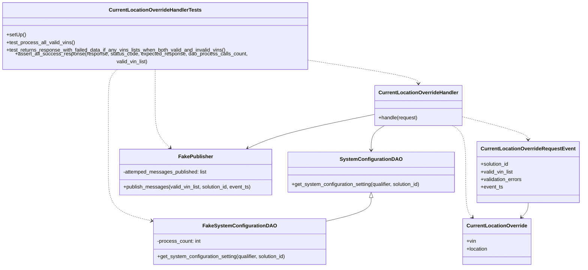
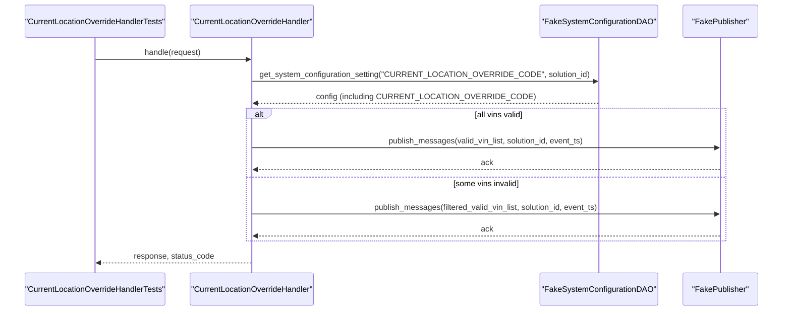

# Diagram: entity_core/entity_service/entity_service_tests/current_location_override_tests/test_current_location_override_handler.py

> Auto-generated by Obscura crawlers

## Diagram 1

### SVG

<svg id="container" width="1831.779296875" xmlns="http://www.w3.org/2000/svg" class="classDiagram" height="826" viewBox="0 0 1831.779296875 826" role="graphics-document document" aria-roledescription="class"><g><defs><marker id="container_class-aggregationStart" class="marker aggregation class" refX="18" refY="7" markerWidth="190" markerHeight="240" orient="auto"><path d="M 18,7 L9,13 L1,7 L9,1 Z"></path></marker></defs><defs><marker id="container_class-aggregationEnd" class="marker aggregation class" refX="1" refY="7" markerWidth="20" markerHeight="28" orient="auto"><path d="M 18,7 L9,13 L1,7 L9,1 Z"></path></marker></defs><defs><marker id="container_class-extensionStart" class="marker extension class" refX="18" refY="7" markerWidth="190" markerHeight="240" orient="auto"><path d="M 1,7 L18,13 V 1 Z"></path></marker></defs><defs><marker id="container_class-extensionEnd" class="marker extension class" refX="1" refY="7" markerWidth="20" markerHeight="28" orient="auto"><path d="M 1,1 V 13 L18,7 Z"></path></marker></defs><defs><marker id="container_class-compositionStart" class="marker composition class" refX="18" refY="7" markerWidth="190" markerHeight="240" orient="auto"><path d="M 18,7 L9,13 L1,7 L9,1 Z"></path></marker></defs><defs><marker id="container_class-compositionEnd" class="marker composition class" refX="1" refY="7" markerWidth="20" markerHeight="28" orient="auto"><path d="M 18,7 L9,13 L1,7 L9,1 Z"></path></marker></defs><defs><marker id="container_class-dependencyStart" class="marker dependency class" refX="6" refY="7" markerWidth="190" markerHeight="240" orient="auto"><path d="M 5,7 L9,13 L1,7 L9,1 Z"></path></marker></defs><defs><marker id="container_class-dependencyEnd" class="marker dependency class" refX="13" refY="7" markerWidth="20" markerHeight="28" orient="auto"><path d="M 18,7 L9,13 L14,7 L9,1 Z"></path></marker></defs><defs><marker id="container_class-lollipopStart" class="marker lollipop class" refX="13" refY="7" markerWidth="190" markerHeight="240" orient="auto"><circle stroke="black" fill="transparent" cx="7" cy="7" r="6"></circle></marker></defs><defs><marker id="container_class-lollipopEnd" class="marker lollipop class" refX="1" refY="7" markerWidth="190" markerHeight="240" orient="auto"><circle stroke="black" fill="transparent" cx="7" cy="7" r="6"></circle></marker></defs><g class="root"><g class="clusters"></g><g class="edgePaths"><path d="M1184.818,608.25L1184.818,615.042C1184.818,621.833,1184.818,635.417,1160.96,647.786C1137.102,660.156,1089.386,671.313,1065.528,676.891L1041.67,682.469" id="id_SystemConfigurationDAO_FakeSystemConfigurationDAO_1" class="edge-thickness-normal edge-pattern-solid relation" style=";;;" data-edge="true" data-et="edge" data-id="id_SystemConfigurationDAO_FakeSystemConfigurationDAO_1" data-points="W3sieCI6MTE4NC44MTgzNTkzNzUsInkiOjU5MX0seyJ4IjoxMTg0LjgxODM1OTM3NSwieSI6NjQ5fSx7IngiOjEwNDEuNjY5OTIxODc1LCJ5Ijo2ODIuNDY4ODcyNDAxMzI1N31d" marker-start="url(#container_class-extensionStart)"></path><path d="M1227.213,382L1220.148,386.167C1213.082,390.333,1198.95,398.667,1191.884,411.5C1184.818,424.333,1184.818,441.667,1184.818,450.333L1184.818,459" id="id_CurrentLocationOverrideHandler_SystemConfigurationDAO_2" class="edge-thickness-normal edge-pattern-solid relation" style=";;;" data-edge="true" data-et="edge" data-id="id_CurrentLocationOverrideHandler_SystemConfigurationDAO_2" data-points="W3sieCI6MTIyNy4yMTMzNzg5MDYyNSwieSI6MzgyfSx7IngiOjExODQuODE4MzU5Mzc1LCJ5Ijo0MDd9LHsieCI6MTE4NC44MTgzNTkzNzUsInkiOjQ2NX1d" marker-end="url(#container_class-dependencyEnd)"></path><path d="M1200.24,345.99L1149.828,356.158C1099.415,366.326,998.59,386.663,931.065,404.586C863.539,422.508,829.312,438.016,812.199,445.77L795.085,453.524" id="id_CurrentLocationOverrideHandler_FakePublisher_3" class="edge-thickness-normal edge-pattern-solid relation" style=";;;" data-edge="true" data-et="edge" data-id="id_CurrentLocationOverrideHandler_FakePublisher_3" data-points="W3sieCI6MTIwMC4yNDAyMzQzNzUsInkiOjM0NS45ODk3MDc5ODI0NjkxfSx7IngiOjg5Ny43NjU2MjUsInkiOjQwN30seyJ4Ijo3ODkuNjIwMzAyODE1MDgyNiwieSI6NDU2fV0=" marker-end="url(#container_class-dependencyEnd)"></path><path d="M1467.857,353.943L1501.719,362.786C1535.581,371.629,1603.305,389.314,1637.167,401.324C1671.029,413.333,1671.029,419.667,1671.029,422.833L1671.029,426" id="id_CurrentLocationOverrideHandler_CurrentLocationOverrideRequestEvent_4" class="edge-thickness-normal edge-pattern-dashed relation" style=";;;" data-edge="true" data-et="edge" data-id="id_CurrentLocationOverrideHandler_CurrentLocationOverrideRequestEvent_4" data-points="W3sieCI6MTQ2Ny44NTc0MjE4NzUsInkiOjM1My45NDMxNDE2NDE2NDc0Nn0seyJ4IjoxNjcxLjAyOTI5Njg3NSwieSI6NDA3fSx7IngiOjE2NzEuMDI5Mjk2ODc1LCJ5Ijo0MzJ9XQ==" marker-end="url(#container_class-dependencyEnd)"></path><path d="M997.781,180.832L1053.826,189.194C1109.87,197.555,1221.96,214.277,1278.004,225.805C1334.049,237.333,1334.049,243.667,1334.049,246.833L1334.049,250" id="id_CurrentLocationOverrideHandlerTests_CurrentLocationOverrideHandler_5" class="edge-thickness-normal edge-pattern-dashed relation" style=";;;" data-edge="true" data-et="edge" data-id="id_CurrentLocationOverrideHandlerTests_CurrentLocationOverrideHandler_5" data-points="W3sieCI6OTk3Ljc4MTI1LCJ5IjoxODAuODMyNDM5MjAyNjM3NX0seyJ4IjoxMzM0LjA0ODgyODEyNSwieSI6MjMxfSx7IngiOjEzMzQuMDQ4ODI4MTI1LCJ5IjoyNTZ9XQ==" marker-end="url(#container_class-dependencyEnd)"></path><path d="M502.891,206L502.891,210.167C502.891,214.333,502.891,222.667,502.891,241.5C502.891,260.333,502.891,289.667,502.891,319C502.891,348.333,502.891,377.667,510.792,399.813C518.692,421.958,534.494,436.917,542.395,444.396L550.296,451.875" id="id_CurrentLocationOverrideHandlerTests_FakePublisher_6" class="edge-thickness-normal edge-pattern-dashed relation" style=";;;" data-edge="true" data-et="edge" data-id="id_CurrentLocationOverrideHandlerTests_FakePublisher_6" data-points="W3sieCI6NTAyLjg5MDYyNSwieSI6MjA2fSx7IngiOjUwMi44OTA2MjUsInkiOjIzMX0seyJ4Ijo1MDIuODkwNjI1LCJ5IjozMTl9LHsieCI6NTAyLjg5MDYyNSwieSI6NDA3fSx7IngiOjU1NC42NTMzNjA2NjYzMjIzLCJ5Ijo0NTZ9XQ==" marker-end="url(#container_class-dependencyEnd)"></path><path d="M384.871,206L379.904,210.167C374.937,214.333,365.003,222.667,360.036,241.5C355.068,260.333,355.068,289.667,355.068,319C355.068,348.333,355.068,377.667,355.068,412.5C355.068,447.333,355.068,487.667,355.068,528C355.068,568.333,355.068,608.667,377.953,634.184C400.837,659.701,446.606,670.402,469.49,675.752L492.374,681.103" id="id_CurrentLocationOverrideHandlerTests_FakeSystemConfigurationDAO_7" class="edge-thickness-normal edge-pattern-dashed relation" style=";;;" data-edge="true" data-et="edge" data-id="id_CurrentLocationOverrideHandlerTests_FakeSystemConfigurationDAO_7" data-points="W3sieCI6Mzg0Ljg3MTIzNTUwOTA3MjU2LCJ5IjoyMDZ9LHsieCI6MzU1LjA2ODM1OTM3NSwieSI6MjMxfSx7IngiOjM1NS4wNjgzNTkzNzUsInkiOjMxOX0seyJ4IjozNTUuMDY4MzU5Mzc1LCJ5Ijo0MDd9LHsieCI6MzU1LjA2ODM1OTM3NSwieSI6NTI4fSx7IngiOjM1NS4wNjgzNTkzNzUsInkiOjY0OX0seyJ4Ijo0OTguMjE2Nzk2ODc1LCJ5Ijo2ODIuNDY4ODcyNDAxMzI1N31d" marker-end="url(#container_class-dependencyEnd)"></path><path d="M1671.029,624L1671.029,628.167C1671.029,632.333,1671.029,640.667,1667.692,648.281C1664.355,655.896,1657.681,662.792,1654.344,666.24L1651.007,669.688" id="id_CurrentLocationOverrideRequestEvent_CurrentLocationOverride_8" class="edge-thickness-normal edge-pattern-solid relation" style=";;;" data-edge="true" data-et="edge" data-id="id_CurrentLocationOverrideRequestEvent_CurrentLocationOverride_8" data-points="W3sieCI6MTY3MS4wMjkyOTY4NzUsInkiOjYyNH0seyJ4IjoxNjcxLjAyOTI5Njg3NSwieSI6NjQ5fSx7IngiOjE2NDYuODM0NzA5MjQ2MTM0LCJ5Ijo2NzR9XQ==" marker-end="url(#container_class-dependencyEnd)"></path><path d="M1440.884,382L1447.95,386.167C1455.016,390.333,1469.148,398.667,1476.213,423C1483.279,447.333,1483.279,487.667,1483.279,528C1483.279,568.333,1483.279,608.667,1486.616,632.281C1489.953,655.896,1496.627,662.792,1499.964,666.24L1503.301,669.688" id="id_CurrentLocationOverrideHandler_CurrentLocationOverride_9" class="edge-thickness-normal edge-pattern-dashed relation" style=";;;" data-edge="true" data-et="edge" data-id="id_CurrentLocationOverrideHandler_CurrentLocationOverride_9" data-points="W3sieCI6MTQ0MC44ODQyNzczNDM3NSwieSI6MzgyfSx7IngiOjE0ODMuMjc5Mjk2ODc1LCJ5Ijo0MDd9LHsieCI6MTQ4My4yNzkyOTY4NzUsInkiOjUyOH0seyJ4IjoxNDgzLjI3OTI5Njg3NSwieSI6NjQ5fSx7IngiOjE1MDcuNDczODg0NTAzODY2LCJ5Ijo2NzR9XQ==" marker-end="url(#container_class-dependencyEnd)"></path></g><g class="edgeLabels"><g class="edgeLabel"><g class="label" data-id="id_SystemConfigurationDAO_FakeSystemConfigurationDAO_1" transform="translate(0, 0)"><foreignObject width="0" height="0">

</foreignObject></g></g><g class="edgeLabel"><g class="label" data-id="id_CurrentLocationOverrideHandler_SystemConfigurationDAO_2" transform="translate(0, 0)"><foreignObject width="0" height="0">

</foreignObject></g></g><g class="edgeLabel"><g class="label" data-id="id_CurrentLocationOverrideHandler_FakePublisher_3" transform="translate(0, 0)"><foreignObject width="0" height="0">

</foreignObject></g></g><g class="edgeLabel"><g class="label" data-id="id_CurrentLocationOverrideHandler_CurrentLocationOverrideRequestEvent_4" transform="translate(0, 0)"><foreignObject width="0" height="0">

</foreignObject></g></g><g class="edgeLabel"><g class="label" data-id="id_CurrentLocationOverrideHandlerTests_CurrentLocationOverrideHandler_5" transform="translate(0, 0)"><foreignObject width="0" height="0">

</foreignObject></g></g><g class="edgeLabel"><g class="label" data-id="id_CurrentLocationOverrideHandlerTests_FakePublisher_6" transform="translate(0, 0)"><foreignObject width="0" height="0">

</foreignObject></g></g><g class="edgeLabel"><g class="label" data-id="id_CurrentLocationOverrideHandlerTests_FakeSystemConfigurationDAO_7" transform="translate(0, 0)"><foreignObject width="0" height="0">

</foreignObject></g></g><g class="edgeLabel"><g class="label" data-id="id_CurrentLocationOverrideRequestEvent_CurrentLocationOverride_8" transform="translate(0, 0)"><foreignObject width="0" height="0">

</foreignObject></g></g><g class="edgeLabel"><g class="label" data-id="id_CurrentLocationOverrideHandler_CurrentLocationOverride_9" transform="translate(0, 0)"><foreignObject width="0" height="0">

</foreignObject></g></g></g><g class="nodes"><g class="node default" id="classId-SystemConfigurationDAO-0" transform="translate(1184.818359375, 528)"><g class="basic label-container"><path d="M-263.4609375 -63 L263.4609375 -63 L263.4609375 63 L-263.4609375 63" stroke="none" stroke-width="0" fill="#ECECFF" style=""></path><path d="M-263.4609375 -63 C-120.22139953063257 -63, 23.018138438734866 -63, 263.4609375 -63 M-263.4609375 -63 C-87.07420833682752 -63, 89.31252082634495 -63, 263.4609375 -63 M263.4609375 -63 C263.4609375 -36.6391912014642, 263.4609375 -10.278382402928408, 263.4609375 63 M263.4609375 -63 C263.4609375 -24.89712110133088, 263.4609375 13.205757797338237, 263.4609375 63 M263.4609375 63 C141.76982146488592 63, 20.078705429771873 63, -263.4609375 63 M263.4609375 63 C139.43843760267563 63, 15.415937705351269 63, -263.4609375 63 M-263.4609375 63 C-263.4609375 32.91744412282145, -263.4609375 2.834888245642901, -263.4609375 -63 M-263.4609375 63 C-263.4609375 13.375394561894993, -263.4609375 -36.249210876210014, -263.4609375 -63" stroke="#9370DB" stroke-width="1.3" fill="none" stroke-dasharray="0 0" style=""></path></g><g class="annotation-group text" transform="translate(0, -39)"></g><g class="label-group text" transform="translate(-91.21875, -39)"><g class="label" style="font-weight: bolder" transform="translate(0,-12)"><foreignObject width="182.4375" height="24">

SystemConfigurationDAO

</foreignObject></g></g><g class="members-group text" transform="translate(-251.4609375, 9)"></g><g class="methods-group text" transform="translate(-251.4609375, 39)"><g class="label" style="" transform="translate(0,-12)"><foreignObject width="411.703125" height="24">

+get_system_configuration_setting(qualifier, solution_id)

</foreignObject></g></g><g class="divider" style=""><path d="M-263.4609375 -15 C-52.80561634374365 -15, 157.8497048125127 -15, 263.4609375 -15 M-263.4609375 -15 C-111.73716348819758 -15, 39.98661052360484 -15, 263.4609375 -15" stroke="#9370DB" stroke-width="1.3" fill="none" stroke-dasharray="0 0" style=""></path></g><g class="divider" style=""><path d="M-263.4609375 9 C-96.61958349798726 9, 70.22177050402547 9, 263.4609375 9 M-263.4609375 9 C-71.93931498759918 9, 119.58230752480165 9, 263.4609375 9" stroke="#9370DB" stroke-width="1.3" fill="none" stroke-dasharray="0 0" style=""></path></g></g><g class="node default" id="classId-FakeSystemConfigurationDAO-1" transform="translate(769.943359375, 746)"><g class="basic label-container"><path d="M-271.7265625 -72 L271.7265625 -72 L271.7265625 72 L-271.7265625 72" stroke="none" stroke-width="0" fill="#ECECFF" style=""></path><path d="M-271.7265625 -72 C-104.99857040879724 -72, 61.72942168240553 -72, 271.7265625 -72 M-271.7265625 -72 C-130.8742151997016 -72, 9.978132100596781 -72, 271.7265625 -72 M271.7265625 -72 C271.7265625 -23.167957541457525, 271.7265625 25.66408491708495, 271.7265625 72 M271.7265625 -72 C271.7265625 -39.99402916748019, 271.7265625 -7.988058334960385, 271.7265625 72 M271.7265625 72 C85.01584927208643 72, -101.69486395582715 72, -271.7265625 72 M271.7265625 72 C112.86097553870357 72, -46.00461142259286 72, -271.7265625 72 M-271.7265625 72 C-271.7265625 40.20054849212508, -271.7265625 8.40109698425016, -271.7265625 -72 M-271.7265625 72 C-271.7265625 30.416926460794258, -271.7265625 -11.166147078411484, -271.7265625 -72" stroke="#9370DB" stroke-width="1.3" fill="none" stroke-dasharray="0 0" style=""></path></g><g class="annotation-group text" transform="translate(0, -48)"></g><g class="label-group text" transform="translate(-107.75, -48)"><g class="label" style="font-weight: bolder" transform="translate(0,-12)"><foreignObject width="215.5" height="24">

FakeSystemConfigurationDAO

</foreignObject></g></g><g class="members-group text" transform="translate(-259.7265625, 0)"><g class="label" style="" transform="translate(0,-12)"><foreignObject width="138.453125" height="24">

-process_count: int

</foreignObject></g></g><g class="methods-group text" transform="translate(-259.7265625, 48)"><g class="label" style="" transform="translate(0,-12)"><foreignObject width="411.703125" height="24">

+get_system_configuration_setting(qualifier, solution_id)

</foreignObject></g></g><g class="divider" style=""><path d="M-271.7265625 -24 C-145.51829804522157 -24, -19.310033590443112 -24, 271.7265625 -24 M-271.7265625 -24 C-69.54229506736772 -24, 132.64197236526456 -24, 271.7265625 -24" stroke="#9370DB" stroke-width="1.3" fill="none" stroke-dasharray="0 0" style=""></path></g><g class="divider" style=""><path d="M-271.7265625 24 C-137.87697976106932 24, -4.0273970221386435 24, 271.7265625 24 M-271.7265625 24 C-144.17777928308175 24, -16.628996066163467 24, 271.7265625 24" stroke="#9370DB" stroke-width="1.3" fill="none" stroke-dasharray="0 0" style=""></path></g></g><g class="node default" id="classId-FakePublisher-2" transform="translate(630.712890625, 528)"><g class="basic label-container"><path d="M-240.64453125 -72 L240.64453125 -72 L240.64453125 72 L-240.64453125 72" stroke="none" stroke-width="0" fill="#ECECFF" style=""></path><path d="M-240.64453125 -72 C-66.82745955118796 -72, 106.98961214762409 -72, 240.64453125 -72 M-240.64453125 -72 C-69.72429626649193 -72, 101.19593871701613 -72, 240.64453125 -72 M240.64453125 -72 C240.64453125 -19.396169697513812, 240.64453125 33.207660604972375, 240.64453125 72 M240.64453125 -72 C240.64453125 -29.22930647662824, 240.64453125 13.541387046743523, 240.64453125 72 M240.64453125 72 C70.74116783284884 72, -99.16219558430231 72, -240.64453125 72 M240.64453125 72 C112.83776260665333 72, -14.969006036693344 72, -240.64453125 72 M-240.64453125 72 C-240.64453125 33.90286508855657, -240.64453125 -4.1942698228868665, -240.64453125 -72 M-240.64453125 72 C-240.64453125 20.867473195950993, -240.64453125 -30.265053608098015, -240.64453125 -72" stroke="#9370DB" stroke-width="1.3" fill="none" stroke-dasharray="0 0" style=""></path></g><g class="annotation-group text" transform="translate(0, -48)"></g><g class="label-group text" transform="translate(-51.2109375, -48)"><g class="label" style="font-weight: bolder" transform="translate(0,-12)"><foreignObject width="102.421875" height="24">

FakePublisher

</foreignObject></g></g><g class="members-group text" transform="translate(-228.64453125, 0)"><g class="label" style="" transform="translate(0,-12)"><foreignObject width="265.8125" height="24">

-attemped_messages_published: list

</foreignObject></g></g><g class="methods-group text" transform="translate(-228.64453125, 48)"><g class="label" style="" transform="translate(0,-12)"><foreignObject width="406.078125" height="24">

+publish_messages(valid_vin_list, solution_id, event_ts)

</foreignObject></g></g><g class="divider" style=""><path d="M-240.64453125 -24 C-59.04914449342428 -24, 122.54624226315144 -24, 240.64453125 -24 M-240.64453125 -24 C-89.34107509208755 -24, 61.9623810658249 -24, 240.64453125 -24" stroke="#9370DB" stroke-width="1.3" fill="none" stroke-dasharray="0 0" style=""></path></g><g class="divider" style=""><path d="M-240.64453125 24 C-132.46464964109722 24, -24.28476803219445 24, 240.64453125 24 M-240.64453125 24 C-100.5873072837355 24, 39.469916682529 24, 240.64453125 24" stroke="#9370DB" stroke-width="1.3" fill="none" stroke-dasharray="0 0" style=""></path></g></g><g class="node default" id="classId-CurrentLocationOverrideHandler-3" transform="translate(1334.048828125, 319)"><g class="basic label-container"><path d="M-133.80859375 -63 L133.80859375 -63 L133.80859375 63 L-133.80859375 63" stroke="none" stroke-width="0" fill="#ECECFF" style=""></path><path d="M-133.80859375 -63 C-28.434575306085534 -63, 76.93944313782893 -63, 133.80859375 -63 M-133.80859375 -63 C-61.1484657898835 -63, 11.511662170232995 -63, 133.80859375 -63 M133.80859375 -63 C133.80859375 -22.463581275713103, 133.80859375 18.072837448573793, 133.80859375 63 M133.80859375 -63 C133.80859375 -26.206158773004965, 133.80859375 10.58768245399007, 133.80859375 63 M133.80859375 63 C44.81071144090221 63, -44.18717086819558 63, -133.80859375 63 M133.80859375 63 C74.89085580573072 63, 15.973117861461432 63, -133.80859375 63 M-133.80859375 63 C-133.80859375 37.620930023545796, -133.80859375 12.241860047091599, -133.80859375 -63 M-133.80859375 63 C-133.80859375 18.68667148928086, -133.80859375 -25.626657021438277, -133.80859375 -63" stroke="#9370DB" stroke-width="1.3" fill="none" stroke-dasharray="0 0" style=""></path></g><g class="annotation-group text" transform="translate(0, -39)"></g><g class="label-group text" transform="translate(-119.6484375, -39)"><g class="label" style="font-weight: bolder" transform="translate(0,-12)"><foreignObject width="239.296875" height="24">

CurrentLocationOverrideHandler

</foreignObject></g></g><g class="members-group text" transform="translate(-121.80859375, 9)"></g><g class="methods-group text" transform="translate(-121.80859375, 39)"><g class="label" style="" transform="translate(0,-12)"><foreignObject width="123.96875" height="24">

+handle(request)

</foreignObject></g></g><g class="divider" style=""><path d="M-133.80859375 -15 C-29.99411898503608 -15, 73.82035577992784 -15, 133.80859375 -15 M-133.80859375 -15 C-74.84253454442283 -15, -15.876475338845665 -15, 133.80859375 -15" stroke="#9370DB" stroke-width="1.3" fill="none" stroke-dasharray="0 0" style=""></path></g><g class="divider" style=""><path d="M-133.80859375 9 C-47.483313575344454 9, 38.84196659931109 9, 133.80859375 9 M-133.80859375 9 C-35.62022512713696 9, 62.568143495726076 9, 133.80859375 9" stroke="#9370DB" stroke-width="1.3" fill="none" stroke-dasharray="0 0" style=""></path></g></g><g class="node default" id="classId-CurrentLocationOverrideRequestEvent-4" transform="translate(1671.029296875, 528)"><g class="basic label-container"><path d="M-152.75 -96 L152.75 -96 L152.75 96 L-152.75 96" stroke="none" stroke-width="0" fill="#ECECFF" style=""></path><path d="M-152.75 -96 C-31.114823237079577 -96, 90.52035352584085 -96, 152.75 -96 M-152.75 -96 C-50.10876254901963 -96, 52.53247490196074 -96, 152.75 -96 M152.75 -96 C152.75 -49.920198943122166, 152.75 -3.8403978862443324, 152.75 96 M152.75 -96 C152.75 -51.755696784185446, 152.75 -7.511393568370892, 152.75 96 M152.75 96 C85.28464909043734 96, 17.819298180874682 96, -152.75 96 M152.75 96 C87.71423384632264 96, 22.678467692645285 96, -152.75 96 M-152.75 96 C-152.75 19.30095470761617, -152.75 -57.39809058476766, -152.75 -96 M-152.75 96 C-152.75 21.818585431383994, -152.75 -52.36282913723201, -152.75 -96" stroke="#9370DB" stroke-width="1.3" fill="none" stroke-dasharray="0 0" style=""></path></g><g class="annotation-group text" transform="translate(0, -72)"></g><g class="label-group text" transform="translate(-140.75, -72)"><g class="label" style="font-weight: bolder" transform="translate(0,-12)"><foreignObject width="281.5" height="24">

CurrentLocationOverrideRequestEvent

</foreignObject></g></g><g class="members-group text" transform="translate(-140.75, -24)"><g class="label" style="" transform="translate(0,-12)"><foreignObject width="90.21875" height="24">

+solution_id

</foreignObject></g><g class="label" style="" transform="translate(0,12)"><foreignObject width="102.96875" height="24">

+valid_vin_list

</foreignObject></g><g class="label" style="" transform="translate(0,36)"><foreignObject width="131.8125" height="24">

+validation_errors

</foreignObject></g><g class="label" style="" transform="translate(0,60)"><foreignObject width="69.578125" height="24">

+event_ts

</foreignObject></g></g><g class="methods-group text" transform="translate(-140.75, 96)"></g><g class="divider" style=""><path d="M-152.75 -48 C-53.93476653048316 -48, 44.88046693903368 -48, 152.75 -48 M-152.75 -48 C-55.285848984759 -48, 42.178302030482 -48, 152.75 -48" stroke="#9370DB" stroke-width="1.3" fill="none" stroke-dasharray="0 0" style=""></path></g><g class="divider" style=""><path d="M-152.75 72 C-50.10792316853819 72, 52.534153662923615 72, 152.75 72 M-152.75 72 C-47.821080910133915 72, 57.10783817973217 72, 152.75 72" stroke="#9370DB" stroke-width="1.3" fill="none" stroke-dasharray="0 0" style=""></path></g></g><g class="node default" id="classId-CurrentLocationOverride-5" transform="translate(1577.154296875, 746)"><g class="basic label-container"><path d="M-102.5625 -72 L102.5625 -72 L102.5625 72 L-102.5625 72" stroke="none" stroke-width="0" fill="#ECECFF" style=""></path><path d="M-102.5625 -72 C-26.8196639913038 -72, 48.9231720173924 -72, 102.5625 -72 M-102.5625 -72 C-55.74896890904404 -72, -8.935437818088076 -72, 102.5625 -72 M102.5625 -72 C102.5625 -23.005624250402825, 102.5625 25.98875149919435, 102.5625 72 M102.5625 -72 C102.5625 -15.13933680370095, 102.5625 41.7213263925981, 102.5625 72 M102.5625 72 C46.43537315283212 72, -9.691753694335759 72, -102.5625 72 M102.5625 72 C47.82132581196451 72, -6.9198483760709735 72, -102.5625 72 M-102.5625 72 C-102.5625 30.060320141523533, -102.5625 -11.879359716952933, -102.5625 -72 M-102.5625 72 C-102.5625 31.672349237054682, -102.5625 -8.655301525890636, -102.5625 -72" stroke="#9370DB" stroke-width="1.3" fill="none" stroke-dasharray="0 0" style=""></path></g><g class="annotation-group text" transform="translate(0, -48)"></g><g class="label-group text" transform="translate(-90.5625, -48)"><g class="label" style="font-weight: bolder" transform="translate(0,-12)"><foreignObject width="181.125" height="24">

CurrentLocationOverride

</foreignObject></g></g><g class="members-group text" transform="translate(-90.5625, 0)"><g class="label" style="" transform="translate(0,-12)"><foreignObject width="29.59375" height="24">

+vin

</foreignObject></g><g class="label" style="" transform="translate(0,12)"><foreignObject width="67.140625" height="24">

+location

</foreignObject></g></g><g class="methods-group text" transform="translate(-90.5625, 72)"></g><g class="divider" style=""><path d="M-102.5625 -24 C-36.46961392127582 -24, 29.623272157448355 -24, 102.5625 -24 M-102.5625 -24 C-58.870243506436275 -24, -15.17798701287255 -24, 102.5625 -24" stroke="#9370DB" stroke-width="1.3" fill="none" stroke-dasharray="0 0" style=""></path></g><g class="divider" style=""><path d="M-102.5625 48 C-50.6531677539368 48, 1.256164492126402 48, 102.5625 48 M-102.5625 48 C-44.012846691949285 48, 14.53680661610143 48, 102.5625 48" stroke="#9370DB" stroke-width="1.3" fill="none" stroke-dasharray="0 0" style=""></path></g></g><g class="node default" id="classId-CurrentLocationOverrideHandlerTests-6" transform="translate(502.890625, 107)"><g class="basic label-container"><path d="M-494.890625 -99 L494.890625 -99 L494.890625 99 L-494.890625 99" stroke="none" stroke-width="0" fill="#ECECFF" style=""></path><path d="M-494.890625 -99 C-158.83556610511704 -99, 177.21949278976592 -99, 494.890625 -99 M-494.890625 -99 C-208.07925667474672 -99, 78.73211165050657 -99, 494.890625 -99 M494.890625 -99 C494.890625 -44.961945381137795, 494.890625 9.07610923772441, 494.890625 99 M494.890625 -99 C494.890625 -46.287644915034484, 494.890625 6.424710169931032, 494.890625 99 M494.890625 99 C287.8634351904462 99, 80.83624538089236 99, -494.890625 99 M494.890625 99 C152.93943312481304 99, -189.01175875037393 99, -494.890625 99 M-494.890625 99 C-494.890625 42.34091877279431, -494.890625 -14.318162454411379, -494.890625 -99 M-494.890625 99 C-494.890625 40.04926603671956, -494.890625 -18.901467926560883, -494.890625 -99" stroke="#9370DB" stroke-width="1.3" fill="none" stroke-dasharray="0 0" style=""></path></g><g class="annotation-group text" transform="translate(0, -75)"></g><g class="label-group text" transform="translate(-138.765625, -75)"><g class="label" style="font-weight: bolder" transform="translate(0,-12)"><foreignObject width="277.53125" height="24">

CurrentLocationOverrideHandlerTests

</foreignObject></g></g><g class="members-group text" transform="translate(-482.890625, -27)"></g><g class="methods-group text" transform="translate(-482.890625, 3)"><g class="label" style="" transform="translate(0,-12)"><foreignObject width="60.421875" height="24">

+setUp()

</foreignObject></g><g class="label" style="" transform="translate(0,12)"><foreignObject width="214.921875" height="24">

+test_process_all_valid_vins()

</foreignObject></g><g class="label" style="" transform="translate(0,36)"><foreignObject width="696.875" height="24">

+test_returns_response_with_failed_data_if_any_vins_lists_when_both_valid_and_invalid_vins()

</foreignObject></g><g class="label" style="" transform="translate(0,60)"><foreignObject width="827.015625" height="24">

+assert_all_success_response(response, status_code, expected_response, dao_process_calls_count, valid_vin_list)

</foreignObject></g></g><g class="divider" style=""><path d="M-494.890625 -51 C-256.2776055228045 -51, -17.664586045608928 -51, 494.890625 -51 M-494.890625 -51 C-204.3814179137113 -51, 86.12778917257742 -51, 494.890625 -51" stroke="#9370DB" stroke-width="1.3" fill="none" stroke-dasharray="0 0" style=""></path></g><g class="divider" style=""><path d="M-494.890625 -27 C-152.43664208577343 -27, 190.01734082845314 -27, 494.890625 -27 M-494.890625 -27 C-295.23205795023534 -27, -95.57349090047069 -27, 494.890625 -27" stroke="#9370DB" stroke-width="1.3" fill="none" stroke-dasharray="0 0" style=""></path></g></g></g></g></g></svg>

## Diagram 2

### SVG

<svg id="container" width="1607.5" xmlns="http://www.w3.org/2000/svg" height="655" viewBox="-50 -10 1607.5 655" role="graphics-document document" aria-roledescription="sequence"><g><rect x="1357.5" y="569" fill="#eaeaea" stroke="#666" width="150" height="65" name="Publisher" rx="3" ry="3" class="actor actor-bottom"></rect><text x="1432.5" y="601.5" dominant-baseline="central" alignment-baseline="central" class="actor actor-box" style="text-anchor: middle; font-size: 16px; font-weight: 400;"><tspan x="1432.5" dy="0">"FakePublisher"</tspan></text></g><g><rect x="1063.5" y="569" fill="#eaeaea" stroke="#666" width="244" height="65" name="DAO" rx="3" ry="3" class="actor actor-bottom"></rect><text x="1185.5" y="601.5" dominant-baseline="central" alignment-baseline="central" class="actor actor-box" style="text-anchor: middle; font-size: 16px; font-weight: 400;"><tspan x="1185.5" dy="0">"FakeSystemConfigurationDAO"</tspan></text></g><g><rect x="356" y="569" fill="#eaeaea" stroke="#666" width="269" height="65" name="Handler" rx="3" ry="3" class="actor actor-bottom"></rect><text x="490.5" y="601.5" dominant-baseline="central" alignment-baseline="central" class="actor actor-box" style="text-anchor: middle; font-size: 16px; font-weight: 400;"><tspan x="490.5" dy="0">"CurrentLocationOverrideHandler"</tspan></text></g><g><rect x="0" y="569" fill="#eaeaea" stroke="#666" width="306" height="65" name="Tests" rx="3" ry="3" class="actor actor-bottom"></rect><text x="153" y="601.5" dominant-baseline="central" alignment-baseline="central" class="actor actor-box" style="text-anchor: middle; font-size: 16px; font-weight: 400;"><tspan x="153" dy="0">"CurrentLocationOverrideHandlerTests"</tspan></text></g><g><line id="actor3" x1="1432.5" y1="65" x2="1432.5" y2="569" class="actor-line 200" stroke-width="0.5px" stroke="#999" name="Publisher"></line><g id="root-3"><rect x="1357.5" y="0" fill="#eaeaea" stroke="#666" width="150" height="65" name="Publisher" rx="3" ry="3" class="actor actor-top"></rect><text x="1432.5" y="32.5" dominant-baseline="central" alignment-baseline="central" class="actor actor-box" style="text-anchor: middle; font-size: 16px; font-weight: 400;"><tspan x="1432.5" dy="0">"FakePublisher"</tspan></text></g></g><g><line id="actor2" x1="1185.5" y1="65" x2="1185.5" y2="569" class="actor-line 200" stroke-width="0.5px" stroke="#999" name="DAO"></line><g id="root-2"><rect x="1063.5" y="0" fill="#eaeaea" stroke="#666" width="244" height="65" name="DAO" rx="3" ry="3" class="actor actor-top"></rect><text x="1185.5" y="32.5" dominant-baseline="central" alignment-baseline="central" class="actor actor-box" style="text-anchor: middle; font-size: 16px; font-weight: 400;"><tspan x="1185.5" dy="0">"FakeSystemConfigurationDAO"</tspan></text></g></g><g><line id="actor1" x1="490.5" y1="65" x2="490.5" y2="569" class="actor-line 200" stroke-width="0.5px" stroke="#999" name="Handler"></line><g id="root-1"><rect x="356" y="0" fill="#eaeaea" stroke="#666" width="269" height="65" name="Handler" rx="3" ry="3" class="actor actor-top"></rect><text x="490.5" y="32.5" dominant-baseline="central" alignment-baseline="central" class="actor actor-box" style="text-anchor: middle; font-size: 16px; font-weight: 400;"><tspan x="490.5" dy="0">"CurrentLocationOverrideHandler"</tspan></text></g></g><g><line id="actor0" x1="153" y1="65" x2="153" y2="569" class="actor-line 200" stroke-width="0.5px" stroke="#999" name="Tests"></line><g id="root-0"><rect x="0" y="0" fill="#eaeaea" stroke="#666" width="306" height="65" name="Tests" rx="3" ry="3" class="actor actor-top"></rect><text x="153" y="32.5" dominant-baseline="central" alignment-baseline="central" class="actor actor-box" style="text-anchor: middle; font-size: 16px; font-weight: 400;"><tspan x="153" dy="0">"CurrentLocationOverrideHandlerTests"</tspan></text></g></g><g></g><defs><symbol id="computer" width="24" height="24"><path transform="scale(.5)" d="M2 2v13h20v-13h-20zm18 11h-16v-9h16v9zm-10.228 6l.466-1h3.524l.467 1h-4.457zm14.228 3h-24l2-6h2.104l-1.33 4h18.45l-1.297-4h2.073l2 6zm-5-10h-14v-7h14v7z"></path></symbol></defs><defs><symbol id="database" fill-rule="evenodd" clip-rule="evenodd"><path transform="scale(.5)" d="M12.258.001l.256.004.255.005.253.008.251.01.249.012.247.015.246.016.242.019.241.02.239.023.236.024.233.027.231.028.229.031.225.032.223.034.22.036.217.038.214.04.211.041.208.043.205.045.201.046.198.048.194.05.191.051.187.053.183.054.18.056.175.057.172.059.168.06.163.061.16.063.155.064.15.066.074.033.073.033.071.034.07.034.069.035.068.035.067.035.066.035.064.036.064.036.062.036.06.036.06.037.058.037.058.037.055.038.055.038.053.038.052.038.051.039.05.039.048.039.047.039.045.04.044.04.043.04.041.04.04.041.039.041.037.041.036.041.034.041.033.042.032.042.03.042.029.042.027.042.026.043.024.043.023.043.021.043.02.043.018.044.017.043.015.044.013.044.012.044.011.045.009.044.007.045.006.045.004.045.002.045.001.045v17l-.001.045-.002.045-.004.045-.006.045-.007.045-.009.044-.011.045-.012.044-.013.044-.015.044-.017.043-.018.044-.02.043-.021.043-.023.043-.024.043-.026.043-.027.042-.029.042-.03.042-.032.042-.033.042-.034.041-.036.041-.037.041-.039.041-.04.041-.041.04-.043.04-.044.04-.045.04-.047.039-.048.039-.05.039-.051.039-.052.038-.053.038-.055.038-.055.038-.058.037-.058.037-.06.037-.06.036-.062.036-.064.036-.064.036-.066.035-.067.035-.068.035-.069.035-.07.034-.071.034-.073.033-.074.033-.15.066-.155.064-.16.063-.163.061-.168.06-.172.059-.175.057-.18.056-.183.054-.187.053-.191.051-.194.05-.198.048-.201.046-.205.045-.208.043-.211.041-.214.04-.217.038-.22.036-.223.034-.225.032-.229.031-.231.028-.233.027-.236.024-.239.023-.241.02-.242.019-.246.016-.247.015-.249.012-.251.01-.253.008-.255.005-.256.004-.258.001-.258-.001-.256-.004-.255-.005-.253-.008-.251-.01-.249-.012-.247-.015-.245-.016-.243-.019-.241-.02-.238-.023-.236-.024-.234-.027-.231-.028-.228-.031-.226-.032-.223-.034-.22-.036-.217-.038-.214-.04-.211-.041-.208-.043-.204-.045-.201-.046-.198-.048-.195-.05-.19-.051-.187-.053-.184-.054-.179-.056-.176-.057-.172-.059-.167-.06-.164-.061-.159-.063-.155-.064-.151-.066-.074-.033-.072-.033-.072-.034-.07-.034-.069-.035-.068-.035-.067-.035-.066-.035-.064-.036-.063-.036-.062-.036-.061-.036-.06-.037-.058-.037-.057-.037-.056-.038-.055-.038-.053-.038-.052-.038-.051-.039-.049-.039-.049-.039-.046-.039-.046-.04-.044-.04-.043-.04-.041-.04-.04-.041-.039-.041-.037-.041-.036-.041-.034-.041-.033-.042-.032-.042-.03-.042-.029-.042-.027-.042-.026-.043-.024-.043-.023-.043-.021-.043-.02-.043-.018-.044-.017-.043-.015-.044-.013-.044-.012-.044-.011-.045-.009-.044-.007-.045-.006-.045-.004-.045-.002-.045-.001-.045v-17l.001-.045.002-.045.004-.045.006-.045.007-.045.009-.044.011-.045.012-.044.013-.044.015-.044.017-.043.018-.044.02-.043.021-.043.023-.043.024-.043.026-.043.027-.042.029-.042.03-.042.032-.042.033-.042.034-.041.036-.041.037-.041.039-.041.04-.041.041-.04.043-.04.044-.04.046-.04.046-.039.049-.039.049-.039.051-.039.052-.038.053-.038.055-.038.056-.038.057-.037.058-.037.06-.037.061-.036.062-.036.063-.036.064-.036.066-.035.067-.035.068-.035.069-.035.07-.034.072-.034.072-.033.074-.033.151-.066.155-.064.159-.063.164-.061.167-.06.172-.059.176-.057.179-.056.184-.054.187-.053.19-.051.195-.05.198-.048.201-.046.204-.045.208-.043.211-.041.214-.04.217-.038.22-.036.223-.034.226-.032.228-.031.231-.028.234-.027.236-.024.238-.023.241-.02.243-.019.245-.016.247-.015.249-.012.251-.01.253-.008.255-.005.256-.004.258-.001.258.001zm-9.258 20.499v.01l.001.021.003.021.004.022.005.021.006.022.007.022.009.023.01.022.011.023.012.023.013.023.015.023.016.024.017.023.018.024.019.024.021.024.022.025.023.024.024.025.052.049.056.05.061.051.066.051.07.051.075.051.079.052.084.052.088.052.092.052.097.052.102.051.105.052.11.052.114.051.119.051.123.051.127.05.131.05.135.05.139.048.144.049.147.047.152.047.155.047.16.045.163.045.167.043.171.043.176.041.178.041.183.039.187.039.19.037.194.035.197.035.202.033.204.031.209.03.212.029.216.027.219.025.222.024.226.021.23.02.233.018.236.016.24.015.243.012.246.01.249.008.253.005.256.004.259.001.26-.001.257-.004.254-.005.25-.008.247-.011.244-.012.241-.014.237-.016.233-.018.231-.021.226-.021.224-.024.22-.026.216-.027.212-.028.21-.031.205-.031.202-.034.198-.034.194-.036.191-.037.187-.039.183-.04.179-.04.175-.042.172-.043.168-.044.163-.045.16-.046.155-.046.152-.047.148-.048.143-.049.139-.049.136-.05.131-.05.126-.05.123-.051.118-.052.114-.051.11-.052.106-.052.101-.052.096-.052.092-.052.088-.053.083-.051.079-.052.074-.052.07-.051.065-.051.06-.051.056-.05.051-.05.023-.024.023-.025.021-.024.02-.024.019-.024.018-.024.017-.024.015-.023.014-.024.013-.023.012-.023.01-.023.01-.022.008-.022.006-.022.006-.022.004-.022.004-.021.001-.021.001-.021v-4.127l-.077.055-.08.053-.083.054-.085.053-.087.052-.09.052-.093.051-.095.05-.097.05-.1.049-.102.049-.105.048-.106.047-.109.047-.111.046-.114.045-.115.045-.118.044-.12.043-.122.042-.124.042-.126.041-.128.04-.13.04-.132.038-.134.038-.135.037-.138.037-.139.035-.142.035-.143.034-.144.033-.147.032-.148.031-.15.03-.151.03-.153.029-.154.027-.156.027-.158.026-.159.025-.161.024-.162.023-.163.022-.165.021-.166.02-.167.019-.169.018-.169.017-.171.016-.173.015-.173.014-.175.013-.175.012-.177.011-.178.01-.179.008-.179.008-.181.006-.182.005-.182.004-.184.003-.184.002h-.37l-.184-.002-.184-.003-.182-.004-.182-.005-.181-.006-.179-.008-.179-.008-.178-.01-.176-.011-.176-.012-.175-.013-.173-.014-.172-.015-.171-.016-.17-.017-.169-.018-.167-.019-.166-.02-.165-.021-.163-.022-.162-.023-.161-.024-.159-.025-.157-.026-.156-.027-.155-.027-.153-.029-.151-.03-.15-.03-.148-.031-.146-.032-.145-.033-.143-.034-.141-.035-.14-.035-.137-.037-.136-.037-.134-.038-.132-.038-.13-.04-.128-.04-.126-.041-.124-.042-.122-.042-.12-.044-.117-.043-.116-.045-.113-.045-.112-.046-.109-.047-.106-.047-.105-.048-.102-.049-.1-.049-.097-.05-.095-.05-.093-.052-.09-.051-.087-.052-.085-.053-.083-.054-.08-.054-.077-.054v4.127zm0-5.654v.011l.001.021.003.021.004.021.005.022.006.022.007.022.009.022.01.022.011.023.012.023.013.023.015.024.016.023.017.024.018.024.019.024.021.024.022.024.023.025.024.024.052.05.056.05.061.05.066.051.07.051.075.052.079.051.084.052.088.052.092.052.097.052.102.052.105.052.11.051.114.051.119.052.123.05.127.051.131.05.135.049.139.049.144.048.147.048.152.047.155.046.16.045.163.045.167.044.171.042.176.042.178.04.183.04.187.038.19.037.194.036.197.034.202.033.204.032.209.03.212.028.216.027.219.025.222.024.226.022.23.02.233.018.236.016.24.014.243.012.246.01.249.008.253.006.256.003.259.001.26-.001.257-.003.254-.006.25-.008.247-.01.244-.012.241-.015.237-.016.233-.018.231-.02.226-.022.224-.024.22-.025.216-.027.212-.029.21-.03.205-.032.202-.033.198-.035.194-.036.191-.037.187-.039.183-.039.179-.041.175-.042.172-.043.168-.044.163-.045.16-.045.155-.047.152-.047.148-.048.143-.048.139-.05.136-.049.131-.05.126-.051.123-.051.118-.051.114-.052.11-.052.106-.052.101-.052.096-.052.092-.052.088-.052.083-.052.079-.052.074-.051.07-.052.065-.051.06-.05.056-.051.051-.049.023-.025.023-.024.021-.025.02-.024.019-.024.018-.024.017-.024.015-.023.014-.023.013-.024.012-.022.01-.023.01-.023.008-.022.006-.022.006-.022.004-.021.004-.022.001-.021.001-.021v-4.139l-.077.054-.08.054-.083.054-.085.052-.087.053-.09.051-.093.051-.095.051-.097.05-.1.049-.102.049-.105.048-.106.047-.109.047-.111.046-.114.045-.115.044-.118.044-.12.044-.122.042-.124.042-.126.041-.128.04-.13.039-.132.039-.134.038-.135.037-.138.036-.139.036-.142.035-.143.033-.144.033-.147.033-.148.031-.15.03-.151.03-.153.028-.154.028-.156.027-.158.026-.159.025-.161.024-.162.023-.163.022-.165.021-.166.02-.167.019-.169.018-.169.017-.171.016-.173.015-.173.014-.175.013-.175.012-.177.011-.178.009-.179.009-.179.007-.181.007-.182.005-.182.004-.184.003-.184.002h-.37l-.184-.002-.184-.003-.182-.004-.182-.005-.181-.007-.179-.007-.179-.009-.178-.009-.176-.011-.176-.012-.175-.013-.173-.014-.172-.015-.171-.016-.17-.017-.169-.018-.167-.019-.166-.02-.165-.021-.163-.022-.162-.023-.161-.024-.159-.025-.157-.026-.156-.027-.155-.028-.153-.028-.151-.03-.15-.03-.148-.031-.146-.033-.145-.033-.143-.033-.141-.035-.14-.036-.137-.036-.136-.037-.134-.038-.132-.039-.13-.039-.128-.04-.126-.041-.124-.042-.122-.043-.12-.043-.117-.044-.116-.044-.113-.046-.112-.046-.109-.046-.106-.047-.105-.048-.102-.049-.1-.049-.097-.05-.095-.051-.093-.051-.09-.051-.087-.053-.085-.052-.083-.054-.08-.054-.077-.054v4.139zm0-5.666v.011l.001.02.003.022.004.021.005.022.006.021.007.022.009.023.01.022.011.023.012.023.013.023.015.023.016.024.017.024.018.023.019.024.021.025.022.024.023.024.024.025.052.05.056.05.061.05.066.051.07.051.075.052.079.051.084.052.088.052.092.052.097.052.102.052.105.051.11.052.114.051.119.051.123.051.127.05.131.05.135.05.139.049.144.048.147.048.152.047.155.046.16.045.163.045.167.043.171.043.176.042.178.04.183.04.187.038.19.037.194.036.197.034.202.033.204.032.209.03.212.028.216.027.219.025.222.024.226.021.23.02.233.018.236.017.24.014.243.012.246.01.249.008.253.006.256.003.259.001.26-.001.257-.003.254-.006.25-.008.247-.01.244-.013.241-.014.237-.016.233-.018.231-.02.226-.022.224-.024.22-.025.216-.027.212-.029.21-.03.205-.032.202-.033.198-.035.194-.036.191-.037.187-.039.183-.039.179-.041.175-.042.172-.043.168-.044.163-.045.16-.045.155-.047.152-.047.148-.048.143-.049.139-.049.136-.049.131-.051.126-.05.123-.051.118-.052.114-.051.11-.052.106-.052.101-.052.096-.052.092-.052.088-.052.083-.052.079-.052.074-.052.07-.051.065-.051.06-.051.056-.05.051-.049.023-.025.023-.025.021-.024.02-.024.019-.024.018-.024.017-.024.015-.023.014-.024.013-.023.012-.023.01-.022.01-.023.008-.022.006-.022.006-.022.004-.022.004-.021.001-.021.001-.021v-4.153l-.077.054-.08.054-.083.053-.085.053-.087.053-.09.051-.093.051-.095.051-.097.05-.1.049-.102.048-.105.048-.106.048-.109.046-.111.046-.114.046-.115.044-.118.044-.12.043-.122.043-.124.042-.126.041-.128.04-.13.039-.132.039-.134.038-.135.037-.138.036-.139.036-.142.034-.143.034-.144.033-.147.032-.148.032-.15.03-.151.03-.153.028-.154.028-.156.027-.158.026-.159.024-.161.024-.162.023-.163.023-.165.021-.166.02-.167.019-.169.018-.169.017-.171.016-.173.015-.173.014-.175.013-.175.012-.177.01-.178.01-.179.009-.179.007-.181.006-.182.006-.182.004-.184.003-.184.001-.185.001-.185-.001-.184-.001-.184-.003-.182-.004-.182-.006-.181-.006-.179-.007-.179-.009-.178-.01-.176-.01-.176-.012-.175-.013-.173-.014-.172-.015-.171-.016-.17-.017-.169-.018-.167-.019-.166-.02-.165-.021-.163-.023-.162-.023-.161-.024-.159-.024-.157-.026-.156-.027-.155-.028-.153-.028-.151-.03-.15-.03-.148-.032-.146-.032-.145-.033-.143-.034-.141-.034-.14-.036-.137-.036-.136-.037-.134-.038-.132-.039-.13-.039-.128-.041-.126-.041-.124-.041-.122-.043-.12-.043-.117-.044-.116-.044-.113-.046-.112-.046-.109-.046-.106-.048-.105-.048-.102-.048-.1-.05-.097-.049-.095-.051-.093-.051-.09-.052-.087-.052-.085-.053-.083-.053-.08-.054-.077-.054v4.153zm8.74-8.179l-.257.004-.254.005-.25.008-.247.011-.244.012-.241.014-.237.016-.233.018-.231.021-.226.022-.224.023-.22.026-.216.027-.212.028-.21.031-.205.032-.202.033-.198.034-.194.036-.191.038-.187.038-.183.04-.179.041-.175.042-.172.043-.168.043-.163.045-.16.046-.155.046-.152.048-.148.048-.143.048-.139.049-.136.05-.131.05-.126.051-.123.051-.118.051-.114.052-.11.052-.106.052-.101.052-.096.052-.092.052-.088.052-.083.052-.079.052-.074.051-.07.052-.065.051-.06.05-.056.05-.051.05-.023.025-.023.024-.021.024-.02.025-.019.024-.018.024-.017.023-.015.024-.014.023-.013.023-.012.023-.01.023-.01.022-.008.022-.006.023-.006.021-.004.022-.004.021-.001.021-.001.021.001.021.001.021.004.021.004.022.006.021.006.023.008.022.01.022.01.023.012.023.013.023.014.023.015.024.017.023.018.024.019.024.02.025.021.024.023.024.023.025.051.05.056.05.06.05.065.051.07.052.074.051.079.052.083.052.088.052.092.052.096.052.101.052.106.052.11.052.114.052.118.051.123.051.126.051.131.05.136.05.139.049.143.048.148.048.152.048.155.046.16.046.163.045.168.043.172.043.175.042.179.041.183.04.187.038.191.038.194.036.198.034.202.033.205.032.21.031.212.028.216.027.22.026.224.023.226.022.231.021.233.018.237.016.241.014.244.012.247.011.25.008.254.005.257.004.26.001.26-.001.257-.004.254-.005.25-.008.247-.011.244-.012.241-.014.237-.016.233-.018.231-.021.226-.022.224-.023.22-.026.216-.027.212-.028.21-.031.205-.032.202-.033.198-.034.194-.036.191-.038.187-.038.183-.04.179-.041.175-.042.172-.043.168-.043.163-.045.16-.046.155-.046.152-.048.148-.048.143-.048.139-.049.136-.05.131-.05.126-.051.123-.051.118-.051.114-.052.11-.052.106-.052.101-.052.096-.052.092-.052.088-.052.083-.052.079-.052.074-.051.07-.052.065-.051.06-.05.056-.05.051-.05.023-.025.023-.024.021-.024.02-.025.019-.024.018-.024.017-.023.015-.024.014-.023.013-.023.012-.023.01-.023.01-.022.008-.022.006-.023.006-.021.004-.022.004-.021.001-.021.001-.021-.001-.021-.001-.021-.004-.021-.004-.022-.006-.021-.006-.023-.008-.022-.01-.022-.01-.023-.012-.023-.013-.023-.014-.023-.015-.024-.017-.023-.018-.024-.019-.024-.02-.025-.021-.024-.023-.024-.023-.025-.051-.05-.056-.05-.06-.05-.065-.051-.07-.052-.074-.051-.079-.052-.083-.052-.088-.052-.092-.052-.096-.052-.101-.052-.106-.052-.11-.052-.114-.052-.118-.051-.123-.051-.126-.051-.131-.05-.136-.05-.139-.049-.143-.048-.148-.048-.152-.048-.155-.046-.16-.046-.163-.045-.168-.043-.172-.043-.175-.042-.179-.041-.183-.04-.187-.038-.191-.038-.194-.036-.198-.034-.202-.033-.205-.032-.21-.031-.212-.028-.216-.027-.22-.026-.224-.023-.226-.022-.231-.021-.233-.018-.237-.016-.241-.014-.244-.012-.247-.011-.25-.008-.254-.005-.257-.004-.26-.001-.26.001z"></path></symbol></defs><defs><symbol id="clock" width="24" height="24"><path transform="scale(.5)" d="M12 2c5.514 0 10 4.486 10 10s-4.486 10-10 10-10-4.486-10-10 4.486-10 10-10zm0-2c-6.627 0-12 5.373-12 12s5.373 12 12 12 12-5.373 12-12-5.373-12-12-12zm5.848 12.459c.202.038.202.333.001.372-1.907.361-6.045 1.111-6.547 1.111-.719 0-1.301-.582-1.301-1.301 0-.512.77-5.447 1.125-7.445.034-.192.312-.181.343.014l.985 6.238 5.394 1.011z"></path></symbol></defs><defs><marker id="arrowhead" refX="7.9" refY="5" markerUnits="userSpaceOnUse" markerWidth="12" markerHeight="12" orient="auto-start-reverse"><path d="M -1 0 L 10 5 L 0 10 z"></path></marker></defs><defs><marker id="crosshead" markerWidth="15" markerHeight="8" orient="auto" refX="4" refY="4.5"><path fill="none" stroke="#000000" stroke-width="1pt" d="M 1,2 L 6,7 M 6,2 L 1,7" style="stroke-dasharray: 0, 0;"></path></marker></defs><defs><marker id="filled-head" refX="15.5" refY="7" markerWidth="20" markerHeight="28" orient="auto"><path d="M 18,7 L9,13 L14,7 L9,1 Z"></path></marker></defs><defs><marker id="sequencenumber" refX="15" refY="15" markerWidth="60" markerHeight="40" orient="auto"><circle cx="15" cy="15" r="6"></circle></marker></defs><g><line x1="479.5" y1="219" x2="1443.5" y2="219" class="loopLine"></line><line x1="1443.5" y1="219" x2="1443.5" y2="501" class="loopLine"></line><line x1="479.5" y1="501" x2="1443.5" y2="501" class="loopLine"></line><line x1="479.5" y1="219" x2="479.5" y2="501" class="loopLine"></line><line x1="479.5" y1="365" x2="1443.5" y2="365" class="loopLine" style="stroke-dasharray: 3, 3;"></line><polygon points="479.5,219 529.5,219 529.5,232 521.1,239 479.5,239" class="labelBox"></polygon><text x="505" y="232" text-anchor="middle" dominant-baseline="middle" alignment-baseline="middle" class="labelText" style="font-size: 16px; font-weight: 400;">alt</text><text x="986.5" y="237" text-anchor="middle" class="loopText" style="font-size: 16px; font-weight: 400;"><tspan x="986.5">[all vins valid]</tspan></text><text x="961.5" y="383" text-anchor="middle" class="loopText" style="font-size: 16px; font-weight: 400;">[some vins invalid]</text></g><text x="320" y="80" text-anchor="middle" dominant-baseline="middle" alignment-baseline="middle" class="messageText" dy="1em" style="font-size: 16px; font-weight: 400;">handle(request)</text><line x1="154" y1="113" x2="486.5" y2="113" class="messageLine0" stroke-width="2" stroke="none" marker-end="url(#arrowhead)" style="fill: none;"></line><text x="837" y="128" text-anchor="middle" dominant-baseline="middle" alignment-baseline="middle" class="messageText" dy="1em" style="font-size: 16px; font-weight: 400;">get_system_configuration_setting("CURRENT_LOCATION_OVERRIDE_CODE", solution_id)</text><line x1="491.5" y1="161" x2="1181.5" y2="161" class="messageLine0" stroke-width="2" stroke="none" marker-end="url(#arrowhead)" style="fill: none;"></line><text x="840" y="176" text-anchor="middle" dominant-baseline="middle" alignment-baseline="middle" class="messageText" dy="1em" style="font-size: 16px; font-weight: 400;">config (including CURRENT_LOCATION_OVERRIDE_CODE)</text><line x1="1184.5" y1="209" x2="494.5" y2="209" class="messageLine1" stroke-width="2" stroke="none" marker-end="url(#arrowhead)" style="stroke-dasharray: 3, 3; fill: none;"></line><text x="960" y="269" text-anchor="middle" dominant-baseline="middle" alignment-baseline="middle" class="messageText" dy="1em" style="font-size: 16px; font-weight: 400;">publish_messages(valid_vin_list, solution_id, event_ts)</text><line x1="491.5" y1="302" x2="1428.5" y2="302" class="messageLine0" stroke-width="2" stroke="none" marker-end="url(#arrowhead)" style="fill: none;"></line><text x="963" y="317" text-anchor="middle" dominant-baseline="middle" alignment-baseline="middle" class="messageText" dy="1em" style="font-size: 16px; font-weight: 400;">ack</text><line x1="1431.5" y1="350" x2="494.5" y2="350" class="messageLine1" stroke-width="2" stroke="none" marker-end="url(#arrowhead)" style="stroke-dasharray: 3, 3; fill: none;"></line><text x="960" y="410" text-anchor="middle" dominant-baseline="middle" alignment-baseline="middle" class="messageText" dy="1em" style="font-size: 16px; font-weight: 400;">publish_messages(filtered_valid_vin_list, solution_id, event_ts)</text><line x1="491.5" y1="443" x2="1428.5" y2="443" class="messageLine0" stroke-width="2" stroke="none" marker-end="url(#arrowhead)" style="fill: none;"></line><text x="963" y="458" text-anchor="middle" dominant-baseline="middle" alignment-baseline="middle" class="messageText" dy="1em" style="font-size: 16px; font-weight: 400;">ack</text><line x1="1431.5" y1="491" x2="494.5" y2="491" class="messageLine1" stroke-width="2" stroke="none" marker-end="url(#arrowhead)" style="stroke-dasharray: 3, 3; fill: none;"></line><text x="323" y="516" text-anchor="middle" dominant-baseline="middle" alignment-baseline="middle" class="messageText" dy="1em" style="font-size: 16px; font-weight: 400;">response, status_code</text><line x1="489.5" y1="549" x2="157" y2="549" class="messageLine1" stroke-width="2" stroke="none" marker-end="url(#arrowhead)" style="stroke-dasharray: 3, 3; fill: none;"></line></svg>
