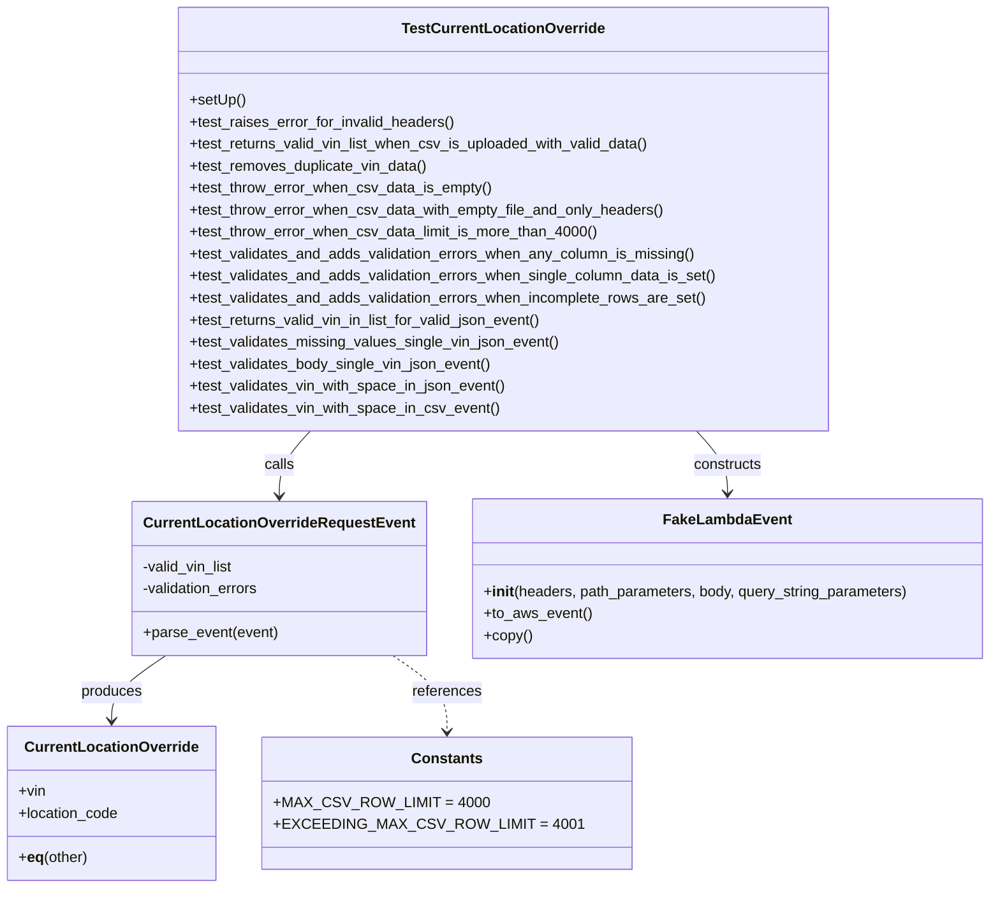

# Diagram: entity_core/entity_service/entity_service_tests/current_location_override_tests/test_current_location_override_request.py


> Auto-generated by Obscura crawlers

## Diagram 1



### SVG

<svg id="container" width="1061.208984375" xmlns="http://www.w3.org/2000/svg" class="classDiagram" height="968" viewBox="0 0 1061.208984375 968" role="graphics-document document" aria-roledescription="class"><style>#container{font-family:"trebuchet ms",verdana,arial,sans-serif;font-size:16px;fill:#333;}@keyframes edge-animation-frame{from{stroke-dashoffset:0;}}@keyframes dash{to{stroke-dashoffset:0;}}#container .edge-animation-slow{stroke-dasharray:9,5!important;stroke-dashoffset:900;animation:dash 50s linear infinite;stroke-linecap:round;}#container .edge-animation-fast{stroke-dasharray:9,5!important;stroke-dashoffset:900;animation:dash 20s linear infinite;stroke-linecap:round;}#container .error-icon{fill:#552222;}#container .error-text{fill:#552222;stroke:#552222;}#container .edge-thickness-normal{stroke-width:1px;}#container .edge-thickness-thick{stroke-width:3.5px;}#container .edge-pattern-solid{stroke-dasharray:0;}#container .edge-thickness-invisible{stroke-width:0;fill:none;}#container .edge-pattern-dashed{stroke-dasharray:3;}#container .edge-pattern-dotted{stroke-dasharray:2;}#container .marker{fill:#333333;stroke:#333333;}#container .marker.cross{stroke:#333333;}#container svg{font-family:"trebuchet ms",verdana,arial,sans-serif;font-size:16px;}#container p{margin:0;}#container g.classGroup text{fill:#9370DB;stroke:none;font-family:"trebuchet ms",verdana,arial,sans-serif;font-size:10px;}#container g.classGroup text .title{font-weight:bolder;}#container .nodeLabel,#container .edgeLabel{color:#131300;}#container .edgeLabel .label rect{fill:#ECECFF;}#container .label text{fill:#131300;}#container .labelBkg{background:#ECECFF;}#container .edgeLabel .label span{background:#ECECFF;}#container .classTitle{font-weight:bolder;}#container .node rect,#container .node circle,#container .node ellipse,#container .node polygon,#container .node path{fill:#ECECFF;stroke:#9370DB;stroke-width:1px;}#container .divider{stroke:#9370DB;stroke-width:1;}#container g.clickable{cursor:pointer;}#container g.classGroup rect{fill:#ECECFF;stroke:#9370DB;}#container g.classGroup line{stroke:#9370DB;stroke-width:1;}#container .classLabel .box{stroke:none;stroke-width:0;fill:#ECECFF;opacity:0.5;}#container .classLabel .label{fill:#9370DB;font-size:10px;}#container .relation{stroke:#333333;stroke-width:1;fill:none;}#container .dashed-line{stroke-dasharray:3;}#container .dotted-line{stroke-dasharray:1 2;}#container #compositionStart,#container .composition{fill:#333333!important;stroke:#333333!important;stroke-width:1;}#container #compositionEnd,#container .composition{fill:#333333!important;stroke:#333333!important;stroke-width:1;}#container #dependencyStart,#container .dependency{fill:#333333!important;stroke:#333333!important;stroke-width:1;}#container #dependencyStart,#container .dependency{fill:#333333!important;stroke:#333333!important;stroke-width:1;}#container #extensionStart,#container .extension{fill:transparent!important;stroke:#333333!important;stroke-width:1;}#container #extensionEnd,#container .extension{fill:transparent!important;stroke:#333333!important;stroke-width:1;}#container #aggregationStart,#container .aggregation{fill:transparent!important;stroke:#333333!important;stroke-width:1;}#container #aggregationEnd,#container .aggregation{fill:transparent!important;stroke:#333333!important;stroke-width:1;}#container #lollipopStart,#container .lollipop{fill:#ECECFF!important;stroke:#333333!important;stroke-width:1;}#container #lollipopEnd,#container .lollipop{fill:#ECECFF!important;stroke:#333333!important;stroke-width:1;}#container .edgeTerminals{font-size:11px;line-height:initial;}#container .classTitleText{text-anchor:middle;font-size:18px;fill:#333;}#container .label-icon{display:inline-block;height:1em;overflow:visible;vertical-align:-0.125em;}#container .node .label-icon path{fill:currentColor;stroke:revert;stroke-width:revert;}#container :root{--mermaid-font-family:"trebuchet ms",verdana,arial,sans-serif;}</style><g><defs><marker id="container_class-aggregationStart" class="marker aggregation class" refX="18" refY="7" markerWidth="190" markerHeight="240" orient="auto"><path d="M 18,7 L9,13 L1,7 L9,1 Z"></path></marker></defs><defs><marker id="container_class-aggregationEnd" class="marker aggregation class" refX="1" refY="7" markerWidth="20" markerHeight="28" orient="auto"><path d="M 18,7 L9,13 L1,7 L9,1 Z"></path></marker></defs><defs><marker id="container_class-extensionStart" class="marker extension class" refX="18" refY="7" markerWidth="190" markerHeight="240" orient="auto"><path d="M 1,7 L18,13 V 1 Z"></path></marker></defs><defs><marker id="container_class-extensionEnd" class="marker extension class" refX="1" refY="7" markerWidth="20" markerHeight="28" orient="auto"><path d="M 1,1 V 13 L18,7 Z"></path></marker></defs><defs><marker id="container_class-compositionStart" class="marker composition class" refX="18" refY="7" markerWidth="190" markerHeight="240" orient="auto"><path d="M 18,7 L9,13 L1,7 L9,1 Z"></path></marker></defs><defs><marker id="container_class-compositionEnd" class="marker composition class" refX="1" refY="7" markerWidth="20" markerHeight="28" orient="auto"><path d="M 18,7 L9,13 L1,7 L9,1 Z"></path></marker></defs><defs><marker id="container_class-dependencyStart" class="marker dependency class" refX="6" refY="7" markerWidth="190" markerHeight="240" orient="auto"><path d="M 5,7 L9,13 L1,7 L9,1 Z"></path></marker></defs><defs><marker id="container_class-dependencyEnd" class="marker dependency class" refX="13" refY="7" markerWidth="20" markerHeight="28" orient="auto"><path d="M 18,7 L9,13 L14,7 L9,1 Z"></path></marker></defs><defs><marker id="container_class-lollipopStart" class="marker lollipop class" refX="13" refY="7" markerWidth="190" markerHeight="240" orient="auto"><circle stroke="black" fill="transparent" cx="7" cy="7" r="6"></circle></marker></defs><defs><marker id="container_class-lollipopEnd" class="marker lollipop class" refX="1" refY="7" markerWidth="190" markerHeight="240" orient="auto"><circle stroke="black" fill="transparent" cx="7" cy="7" r="6"></circle></marker></defs><g class="root"><g class="clusters"></g><g class="edgePaths"><path d="M323.98,470L318.408,476.167C312.837,482.333,301.695,494.667,296.124,506.5C290.553,518.333,290.553,529.667,290.553,535.333L290.553,541" id="id_TestCurrentLocationOverride_CurrentLocationOverrideRequestEvent_1" class="edge-thickness-normal edge-pattern-solid relation" style=";;;" data-edge="true" data-et="edge" data-id="id_TestCurrentLocationOverride_CurrentLocationOverrideRequestEvent_1" data-points="W3sieCI6MzIzLjk3OTYzMDY1NTMxNzEsInkiOjQ3MH0seyJ4IjoyOTAuNTUyNzM0Mzc1LCJ5Ijo1MDd9LHsieCI6MjkwLjU1MjczNDM3NSwieSI6NTQ3fV0=" marker-end="url(#container_class-dependencyEnd)"></path><path d="M741.364,470L746.935,476.167C752.506,482.333,763.649,494.667,769.22,506C774.791,517.333,774.791,527.667,774.791,532.833L774.791,538" id="id_TestCurrentLocationOverride_FakeLambdaEvent_2" class="edge-thickness-normal edge-pattern-solid relation" style=";;;" data-edge="true" data-et="edge" data-id="id_TestCurrentLocationOverride_FakeLambdaEvent_2" data-points="W3sieCI6NzQxLjM2NDExOTM0NDY4MjksInkiOjQ3MH0seyJ4Ijo3NzQuNzkxMDE1NjI1LCJ5Ijo1MDd9LHsieCI6Nzc0Ljc5MTAxNTYyNSwieSI6NTQ0fV0=" marker-end="url(#container_class-dependencyEnd)"></path><path d="M175.245,715L166.093,721.667C156.942,728.333,138.639,741.667,129.487,753.5C120.336,765.333,120.336,775.667,120.336,780.833L120.336,786" id="id_CurrentLocationOverrideRequestEvent_CurrentLocationOverride_3" class="edge-thickness-normal edge-pattern-solid relation" style=";;;" data-edge="true" data-et="edge" data-id="id_CurrentLocationOverrideRequestEvent_CurrentLocationOverride_3" data-points="W3sieCI6MTc1LjI0NDU4MTY1MzIyNTgsInkiOjcxNX0seyJ4IjoxMjAuMzM1OTM3NSwieSI6NzU1fSx7IngiOjEyMC4zMzU5Mzc1LCJ5Ijo3OTJ9XQ==" marker-end="url(#container_class-dependencyEnd)"></path><path d="M405.861,715L415.012,721.667C424.164,728.333,442.467,741.667,451.618,755.5C460.77,769.333,460.77,783.667,460.77,790.833L460.77,798" id="id_CurrentLocationOverrideRequestEvent_Constants_4" class="edge-thickness-normal edge-pattern-dashed relation" style=";;;" data-edge="true" data-et="edge" data-id="id_CurrentLocationOverrideRequestEvent_Constants_4" data-points="W3sieCI6NDA1Ljg2MDg4NzA5Njc3NDIsInkiOjcxNX0seyJ4Ijo0NjAuNzY5NTMxMjUsInkiOjc1NX0seyJ4Ijo0NjAuNzY5NTMxMjUsInkiOjgwNH1d" marker-end="url(#container_class-dependencyEnd)"></path></g><g class="edgeLabels"><g class="edgeLabel" transform="translate(290.552734375, 507)"><g class="label" data-id="id_TestCurrentLocationOverride_CurrentLocationOverrideRequestEvent_1" transform="translate(-16.4453125, -12)"><foreignObject width="32.890625" height="24"><div xmlns="http://www.w3.org/1999/xhtml" class="labelBkg" style="display: table-cell; white-space: nowrap; line-height: 1.5; max-width: 200px; text-align: center;"><span class="edgeLabel"><p>calls</p></span></div></foreignObject></g></g><g class="edgeLabel" transform="translate(774.791015625, 507)"><g class="label" data-id="id_TestCurrentLocationOverride_FakeLambdaEvent_2" transform="translate(-37.84375, -12)"><foreignObject width="75.6875" height="24"><div xmlns="http://www.w3.org/1999/xhtml" class="labelBkg" style="display: table-cell; white-space: nowrap; line-height: 1.5; max-width: 200px; text-align: center;"><span class="edgeLabel"><p>constructs</p></span></div></foreignObject></g></g><g class="edgeLabel" transform="translate(120.3359375, 755)"><g class="label" data-id="id_CurrentLocationOverrideRequestEvent_CurrentLocationOverride_3" transform="translate(-33.4765625, -12)"><foreignObject width="66.953125" height="24"><div xmlns="http://www.w3.org/1999/xhtml" class="labelBkg" style="display: table-cell; white-space: nowrap; line-height: 1.5; max-width: 200px; text-align: center;"><span class="edgeLabel"><p>produces</p></span></div></foreignObject></g></g><g class="edgeLabel" transform="translate(460.76953125, 755)"><g class="label" data-id="id_CurrentLocationOverrideRequestEvent_Constants_4" transform="translate(-37.828125, -12)"><foreignObject width="75.65625" height="24"><div xmlns="http://www.w3.org/1999/xhtml" class="labelBkg" style="display: table-cell; white-space: nowrap; line-height: 1.5; max-width: 200px; text-align: center;"><span class="edgeLabel"><p>references</p></span></div></foreignObject></g></g></g><g class="nodes"><g class="node default" id="classId-TestCurrentLocationOverride-0" transform="translate(532.671875, 239)"><g class="basic label-container"><path d="M-354.625 -231 L354.625 -231 L354.625 231 L-354.625 231" stroke="none" stroke-width="0" fill="#ECECFF" style=""></path><path d="M-354.625 -231 C-203.24681892435945 -231, -51.86863784871889 -231, 354.625 -231 M-354.625 -231 C-137.98375872584356 -231, 78.65748254831288 -231, 354.625 -231 M354.625 -231 C354.625 -123.92985752979921, 354.625 -16.859715059598415, 354.625 231 M354.625 -231 C354.625 -86.18635788718777, 354.625 58.627284225624464, 354.625 231 M354.625 231 C201.55380896830948 231, 48.482617936618965 231, -354.625 231 M354.625 231 C199.38198672169793 231, 44.138973443395855 231, -354.625 231 M-354.625 231 C-354.625 56.27936132191422, -354.625 -118.44127735617155, -354.625 -231 M-354.625 231 C-354.625 79.60579690559308, -354.625 -71.78840618881384, -354.625 -231" stroke="#9370DB" stroke-width="1.3" fill="none" stroke-dasharray="0 0" style=""></path></g><g class="annotation-group text" transform="translate(0, -207)"></g><g class="label-group text" transform="translate(-105.8125, -207)"><g class="label" style="font-weight: bolder" transform="translate(0,-12)"><foreignObject width="211.625" height="24"><div xmlns="http://www.w3.org/1999/xhtml" style="display: table-cell; white-space: nowrap; line-height: 1.5; max-width: 258px; text-align: center;"><span class="nodeLabel markdown-node-label" style=""><p>TestCurrentLocationOverride</p></span></div></foreignObject></g></g><g class="members-group text" transform="translate(-342.625, -159)"></g><g class="methods-group text" transform="translate(-342.625, -129)"><g class="label" style="" transform="translate(0,-12)"><foreignObject width="60.421875" height="24"><div xmlns="http://www.w3.org/1999/xhtml" style="display: table-cell; white-space: nowrap; line-height: 1.5; max-width: 118px; text-align: center;"><span class="nodeLabel markdown-node-label" style=""><p>+setUp()</p></span></div></foreignObject></g><g class="label" style="" transform="translate(0,12)"><foreignObject width="290.234375" height="24"><div xmlns="http://www.w3.org/1999/xhtml" style="display: table-cell; white-space: nowrap; line-height: 1.5; max-width: 348px; text-align: center;"><span class="nodeLabel markdown-node-label" style=""><p>+test_raises_error_for_invalid_headers()</p></span></div></foreignObject></g><g class="label" style="" transform="translate(0,36)"><foreignObject width="506.171875" height="24"><div xmlns="http://www.w3.org/1999/xhtml" style="display: table-cell; white-space: nowrap; line-height: 1.5; max-width: 564px; text-align: center;"><span class="nodeLabel markdown-node-label" style=""><p>+test_returns_valid_vin_list_when_csv_is_uploaded_with_valid_data()</p></span></div></foreignObject></g><g class="label" style="" transform="translate(0,60)"><foreignObject width="261.140625" height="24"><div xmlns="http://www.w3.org/1999/xhtml" style="display: table-cell; white-space: nowrap; line-height: 1.5; max-width: 319px; text-align: center;"><span class="nodeLabel markdown-node-label" style=""><p>+test_removes_duplicate_vin_data()</p></span></div></foreignObject></g><g class="label" style="" transform="translate(0,84)"><foreignObject width="329.265625" height="24"><div xmlns="http://www.w3.org/1999/xhtml" style="display: table-cell; white-space: nowrap; line-height: 1.5; max-width: 387px; text-align: center;"><span class="nodeLabel markdown-node-label" style=""><p>+test_throw_error_when_csv_data_is_empty()</p></span></div></foreignObject></g><g class="label" style="" transform="translate(0,108)"><foreignObject width="519.09375" height="24"><div xmlns="http://www.w3.org/1999/xhtml" style="display: table-cell; white-space: nowrap; line-height: 1.5; max-width: 576px; text-align: center;"><span class="nodeLabel markdown-node-label" style=""><p>+test_throw_error_when_csv_data_with_empty_file_and_only_headers()</p></span></div></foreignObject></g><g class="label" style="" transform="translate(0,132)"><foreignObject width="445.53125" height="24"><div xmlns="http://www.w3.org/1999/xhtml" style="display: table-cell; white-space: nowrap; line-height: 1.5; max-width: 503px; text-align: center;"><span class="nodeLabel markdown-node-label" style=""><p>+test_throw_error_when_csv_data_limit_is_more_than_4000()</p></span></div></foreignObject></g><g class="label" style="" transform="translate(0,156)"><foreignObject width="554.390625" height="24"><div xmlns="http://www.w3.org/1999/xhtml" style="display: table-cell; white-space: nowrap; line-height: 1.5; max-width: 612px; text-align: center;"><span class="nodeLabel markdown-node-label" style=""><p>+test_validates_and_adds_validation_errors_when_any_column_is_missing()</p></span></div></foreignObject></g><g class="label" style="" transform="translate(0,180)"><foreignObject width="579.4375" height="24"><div xmlns="http://www.w3.org/1999/xhtml" style="display: table-cell; white-space: nowrap; line-height: 1.5; max-width: 637px; text-align: center;"><span class="nodeLabel markdown-node-label" style=""><p>+test_validates_and_adds_validation_errors_when_single_column_data_is_set()</p></span></div></foreignObject></g><g class="label" style="" transform="translate(0,204)"><foreignObject width="568.1875" height="24"><div xmlns="http://www.w3.org/1999/xhtml" style="display: table-cell; white-space: nowrap; line-height: 1.5; max-width: 626px; text-align: center;"><span class="nodeLabel markdown-node-label" style=""><p>+test_validates_and_adds_validation_errors_when_incomplete_rows_are_set()</p></span></div></foreignObject></g><g class="label" style="" transform="translate(0,228)"><foreignObject width="389.609375" height="24"><div xmlns="http://www.w3.org/1999/xhtml" style="display: table-cell; white-space: nowrap; line-height: 1.5; max-width: 447px; text-align: center;"><span class="nodeLabel markdown-node-label" style=""><p>+test_returns_valid_vin_in_list_for_valid_json_event()</p></span></div></foreignObject></g><g class="label" style="" transform="translate(0,252)"><foreignObject width="404.65625" height="24"><div xmlns="http://www.w3.org/1999/xhtml" style="display: table-cell; white-space: nowrap; line-height: 1.5; max-width: 462px; text-align: center;"><span class="nodeLabel markdown-node-label" style=""><p>+test_validates_missing_values_single_vin_json_event()</p></span></div></foreignObject></g><g class="label" style="" transform="translate(0,276)"><foreignObject width="331.296875" height="24"><div xmlns="http://www.w3.org/1999/xhtml" style="display: table-cell; white-space: nowrap; line-height: 1.5; max-width: 389px; text-align: center;"><span class="nodeLabel markdown-node-label" style=""><p>+test_validates_body_single_vin_json_event()</p></span></div></foreignObject></g><g class="label" style="" transform="translate(0,300)"><foreignObject width="347.078125" height="24"><div xmlns="http://www.w3.org/1999/xhtml" style="display: table-cell; white-space: nowrap; line-height: 1.5; max-width: 404px; text-align: center;"><span class="nodeLabel markdown-node-label" style=""><p>+test_validates_vin_with_space_in_json_event()</p></span></div></foreignObject></g><g class="label" style="" transform="translate(0,324)"><foreignObject width="337.75" height="24"><div xmlns="http://www.w3.org/1999/xhtml" style="display: table-cell; white-space: nowrap; line-height: 1.5; max-width: 395px; text-align: center;"><span class="nodeLabel markdown-node-label" style=""><p>+test_validates_vin_with_space_in_csv_event()</p></span></div></foreignObject></g></g><g class="divider" style=""><path d="M-354.625 -183 C-177.66974029328622 -183, -0.7144805865724493 -183, 354.625 -183 M-354.625 -183 C-122.17811760916643 -183, 110.26876478166713 -183, 354.625 -183" stroke="#9370DB" stroke-width="1.3" fill="none" stroke-dasharray="0 0" style=""></path></g><g class="divider" style=""><path d="M-354.625 -159 C-73.41145493220347 -159, 207.80209013559306 -159, 354.625 -159 M-354.625 -159 C-148.71407490348813 -159, 57.19685019302375 -159, 354.625 -159" stroke="#9370DB" stroke-width="1.3" fill="none" stroke-dasharray="0 0" style=""></path></g></g><g class="node default" id="classId-CurrentLocationOverrideRequestEvent-1" transform="translate(290.552734375, 631)"><g class="basic label-container"><path d="M-155.8203125 -84 L155.8203125 -84 L155.8203125 84 L-155.8203125 84" stroke="none" stroke-width="0" fill="#ECECFF" style=""></path><path d="M-155.8203125 -84 C-62.09862854387255 -84, 31.6230554122549 -84, 155.8203125 -84 M-155.8203125 -84 C-51.7907112902607 -84, 52.238889919478595 -84, 155.8203125 -84 M155.8203125 -84 C155.8203125 -30.6527754249938, 155.8203125 22.694449150012403, 155.8203125 84 M155.8203125 -84 C155.8203125 -21.525044716056975, 155.8203125 40.94991056788605, 155.8203125 84 M155.8203125 84 C92.11540715885718 84, 28.410501817714348 84, -155.8203125 84 M155.8203125 84 C55.6857095936424 84, -44.4488933127152 84, -155.8203125 84 M-155.8203125 84 C-155.8203125 24.390093547637036, -155.8203125 -35.21981290472593, -155.8203125 -84 M-155.8203125 84 C-155.8203125 37.02317890263136, -155.8203125 -9.953642194737284, -155.8203125 -84" stroke="#9370DB" stroke-width="1.3" fill="none" stroke-dasharray="0 0" style=""></path></g><g class="annotation-group text" transform="translate(0, -60)"></g><g class="label-group text" transform="translate(-140.75, -60)"><g class="label" style="font-weight: bolder" transform="translate(0,-12)"><foreignObject width="281.5" height="24"><div xmlns="http://www.w3.org/1999/xhtml" style="display: table-cell; white-space: nowrap; line-height: 1.5; max-width: 328px; text-align: center;"><span class="nodeLabel markdown-node-label" style=""><p>CurrentLocationOverrideRequestEvent</p></span></div></foreignObject></g></g><g class="members-group text" transform="translate(-143.8203125, -12)"><g class="label" style="" transform="translate(0,-12)"><foreignObject width="101.4375" height="24"><div xmlns="http://www.w3.org/1999/xhtml" style="display: table-cell; white-space: nowrap; line-height: 1.5; max-width: 159px; text-align: center;"><span class="nodeLabel markdown-node-label" style=""><p>-valid_vin_list</p></span></div></foreignObject></g><g class="label" style="" transform="translate(0,12)"><foreignObject width="130.28125" height="24"><div xmlns="http://www.w3.org/1999/xhtml" style="display: table-cell; white-space: nowrap; line-height: 1.5; max-width: 188px; text-align: center;"><span class="nodeLabel markdown-node-label" style=""><p>-validation_errors</p></span></div></foreignObject></g></g><g class="methods-group text" transform="translate(-143.8203125, 60)"><g class="label" style="" transform="translate(0,-12)"><foreignObject width="146.890625" height="24"><div xmlns="http://www.w3.org/1999/xhtml" style="display: table-cell; white-space: nowrap; line-height: 1.5; max-width: 204px; text-align: center;"><span class="nodeLabel markdown-node-label" style=""><p>+parse_event(event)</p></span></div></foreignObject></g></g><g class="divider" style=""><path d="M-155.8203125 -36 C-37.903014299733854 -36, 80.01428390053229 -36, 155.8203125 -36 M-155.8203125 -36 C-47.188957594851175 -36, 61.44239731029765 -36, 155.8203125 -36" stroke="#9370DB" stroke-width="1.3" fill="none" stroke-dasharray="0 0" style=""></path></g><g class="divider" style=""><path d="M-155.8203125 36 C-34.87593376043617 36, 86.06844497912766 36, 155.8203125 36 M-155.8203125 36 C-40.32205520986385 36, 75.1762020802723 36, 155.8203125 36" stroke="#9370DB" stroke-width="1.3" fill="none" stroke-dasharray="0 0" style=""></path></g></g><g class="node default" id="classId-CurrentLocationOverride-2" transform="translate(120.3359375, 876)"><g class="basic label-container"><path d="M-112.3359375 -84 L112.3359375 -84 L112.3359375 84 L-112.3359375 84" stroke="none" stroke-width="0" fill="#ECECFF" style=""></path><path d="M-112.3359375 -84 C-25.331140001020216 -84, 61.67365749795957 -84, 112.3359375 -84 M-112.3359375 -84 C-24.95202214522068 -84, 62.43189320955864 -84, 112.3359375 -84 M112.3359375 -84 C112.3359375 -30.579629992264564, 112.3359375 22.84074001547087, 112.3359375 84 M112.3359375 -84 C112.3359375 -45.29561607970716, 112.3359375 -6.591232159414318, 112.3359375 84 M112.3359375 84 C27.9039629326073 84, -56.5280116347854 84, -112.3359375 84 M112.3359375 84 C48.81824412743326 84, -14.69944924513348 84, -112.3359375 84 M-112.3359375 84 C-112.3359375 18.427967639010234, -112.3359375 -47.14406472197953, -112.3359375 -84 M-112.3359375 84 C-112.3359375 48.450548516505734, -112.3359375 12.901097033011467, -112.3359375 -84" stroke="#9370DB" stroke-width="1.3" fill="none" stroke-dasharray="0 0" style=""></path></g><g class="annotation-group text" transform="translate(0, -60)"></g><g class="label-group text" transform="translate(-90.5625, -60)"><g class="label" style="font-weight: bolder" transform="translate(0,-12)"><foreignObject width="181.125" height="24"><div xmlns="http://www.w3.org/1999/xhtml" style="display: table-cell; white-space: nowrap; line-height: 1.5; max-width: 229px; text-align: center;"><span class="nodeLabel markdown-node-label" style=""><p>CurrentLocationOverride</p></span></div></foreignObject></g></g><g class="members-group text" transform="translate(-100.3359375, -12)"><g class="label" style="" transform="translate(0,-12)"><foreignObject width="29.59375" height="24"><div xmlns="http://www.w3.org/1999/xhtml" style="display: table-cell; white-space: nowrap; line-height: 1.5; max-width: 87px; text-align: center;"><span class="nodeLabel markdown-node-label" style=""><p>+vin</p></span></div></foreignObject></g><g class="label" style="" transform="translate(0,12)"><foreignObject width="110.109375" height="24"><div xmlns="http://www.w3.org/1999/xhtml" style="display: table-cell; white-space: nowrap; line-height: 1.5; max-width: 167px; text-align: center;"><span class="nodeLabel markdown-node-label" style=""><p>+location_code</p></span></div></foreignObject></g></g><g class="methods-group text" transform="translate(-100.3359375, 60)"><g class="label" style="" transform="translate(0,-12)"><foreignObject width="76.1875" height="24"><div xmlns="http://www.w3.org/1999/xhtml" style="display: table-cell; white-space: nowrap; line-height: 1.5; max-width: 165px; text-align: center;"><span class="nodeLabel markdown-node-label" style=""><p>+<strong>eq</strong>(other)</p></span></div></foreignObject></g></g><g class="divider" style=""><path d="M-112.3359375 -36 C-51.58120564734918 -36, 9.173526205301641 -36, 112.3359375 -36 M-112.3359375 -36 C-57.57921346760732 -36, -2.822489435214635 -36, 112.3359375 -36" stroke="#9370DB" stroke-width="1.3" fill="none" stroke-dasharray="0 0" style=""></path></g><g class="divider" style=""><path d="M-112.3359375 36 C-25.658665033994055 36, 61.01860743201189 36, 112.3359375 36 M-112.3359375 36 C-37.08310063410704 36, 38.16973623178592 36, 112.3359375 36" stroke="#9370DB" stroke-width="1.3" fill="none" stroke-dasharray="0 0" style=""></path></g></g><g class="node default" id="classId-FakeLambdaEvent-3" transform="translate(774.791015625, 631)"><g class="basic label-container"><path d="M-278.41796875 -87 L278.41796875 -87 L278.41796875 87 L-278.41796875 87" stroke="none" stroke-width="0" fill="#ECECFF" style=""></path><path d="M-278.41796875 -87 C-124.54631409446245 -87, 29.32534056107511 -87, 278.41796875 -87 M-278.41796875 -87 C-139.8401490307721 -87, -1.2623293115441925 -87, 278.41796875 -87 M278.41796875 -87 C278.41796875 -37.186379515776956, 278.41796875 12.627240968446088, 278.41796875 87 M278.41796875 -87 C278.41796875 -40.263853002276576, 278.41796875 6.472293995446847, 278.41796875 87 M278.41796875 87 C111.62532671601656 87, -55.16731531796688 87, -278.41796875 87 M278.41796875 87 C66.76911180664811 87, -144.87974513670378 87, -278.41796875 87 M-278.41796875 87 C-278.41796875 42.95127027895242, -278.41796875 -1.0974594420951576, -278.41796875 -87 M-278.41796875 87 C-278.41796875 38.929626676259595, -278.41796875 -9.14074664748081, -278.41796875 -87" stroke="#9370DB" stroke-width="1.3" fill="none" stroke-dasharray="0 0" style=""></path></g><g class="annotation-group text" transform="translate(0, -63)"></g><g class="label-group text" transform="translate(-65.8671875, -63)"><g class="label" style="font-weight: bolder" transform="translate(0,-12)"><foreignObject width="131.734375" height="24"><div xmlns="http://www.w3.org/1999/xhtml" style="display: table-cell; white-space: nowrap; line-height: 1.5; max-width: 181px; text-align: center;"><span class="nodeLabel markdown-node-label" style=""><p>FakeLambdaEvent</p></span></div></foreignObject></g></g><g class="members-group text" transform="translate(-266.41796875, -15)"></g><g class="methods-group text" transform="translate(-266.41796875, 15)"><g class="label" style="" transform="translate(0,-12)"><foreignObject width="466.96875" height="24"><div xmlns="http://www.w3.org/1999/xhtml" style="display: table-cell; white-space: nowrap; line-height: 1.5; max-width: 556px; text-align: center;"><span class="nodeLabel markdown-node-label" style=""><p>+<strong>init</strong>(headers, path_parameters, body, query_string_parameters)</p></span></div></foreignObject></g><g class="label" style="" transform="translate(0,12)"><foreignObject width="116.421875" height="24"><div xmlns="http://www.w3.org/1999/xhtml" style="display: table-cell; white-space: nowrap; line-height: 1.5; max-width: 174px; text-align: center;"><span class="nodeLabel markdown-node-label" style=""><p>+to_aws_event()</p></span></div></foreignObject></g><g class="label" style="" transform="translate(0,36)"><foreignObject width="52.34375" height="24"><div xmlns="http://www.w3.org/1999/xhtml" style="display: table-cell; white-space: nowrap; line-height: 1.5; max-width: 110px; text-align: center;"><span class="nodeLabel markdown-node-label" style=""><p>+copy()</p></span></div></foreignObject></g></g><g class="divider" style=""><path d="M-278.41796875 -39 C-142.1164104689567 -39, -5.814852187913402 -39, 278.41796875 -39 M-278.41796875 -39 C-127.99127210908759 -39, 22.43542453182482 -39, 278.41796875 -39" stroke="#9370DB" stroke-width="1.3" fill="none" stroke-dasharray="0 0" style=""></path></g><g class="divider" style=""><path d="M-278.41796875 -15 C-127.46130248572291 -15, 23.49536377855418 -15, 278.41796875 -15 M-278.41796875 -15 C-84.58801441358267 -15, 109.24193992283466 -15, 278.41796875 -15" stroke="#9370DB" stroke-width="1.3" fill="none" stroke-dasharray="0 0" style=""></path></g></g><g class="node default" id="classId-Constants-4" transform="translate(460.76953125, 876)"><g class="basic label-container"><path d="M-178.09765625 -72 L178.09765625 -72 L178.09765625 72 L-178.09765625 72" stroke="none" stroke-width="0" fill="#ECECFF" style=""></path><path d="M-178.09765625 -72 C-83.72214107174298 -72, 10.653374106514036 -72, 178.09765625 -72 M-178.09765625 -72 C-46.65226161097664 -72, 84.79313302804673 -72, 178.09765625 -72 M178.09765625 -72 C178.09765625 -38.34666861262194, 178.09765625 -4.69333722524388, 178.09765625 72 M178.09765625 -72 C178.09765625 -33.92869696603772, 178.09765625 4.142606067924561, 178.09765625 72 M178.09765625 72 C59.19843462887634 72, -59.700786992247316 72, -178.09765625 72 M178.09765625 72 C36.26491194263767 72, -105.56783236472467 72, -178.09765625 72 M-178.09765625 72 C-178.09765625 32.32207877431792, -178.09765625 -7.355842451364154, -178.09765625 -72 M-178.09765625 72 C-178.09765625 37.05072097000449, -178.09765625 2.101441940008982, -178.09765625 -72" stroke="#9370DB" stroke-width="1.3" fill="none" stroke-dasharray="0 0" style=""></path></g><g class="annotation-group text" transform="translate(0, -48)"></g><g class="label-group text" transform="translate(-36.5390625, -48)"><g class="label" style="font-weight: bolder" transform="translate(0,-12)"><foreignObject width="73.078125" height="24"><div xmlns="http://www.w3.org/1999/xhtml" style="display: table-cell; white-space: nowrap; line-height: 1.5; max-width: 122px; text-align: center;"><span class="nodeLabel markdown-node-label" style=""><p>Constants</p></span></div></foreignObject></g></g><g class="members-group text" transform="translate(-166.09765625, 0)"><g class="label" style="" transform="translate(0,-12)"><foreignObject width="210.625" height="24"><div xmlns="http://www.w3.org/1999/xhtml" style="display: table-cell; white-space: nowrap; line-height: 1.5; max-width: 268px; text-align: center;"><span class="nodeLabel markdown-node-label" style=""><p>+MAX_CSV_ROW_LIMIT = 4000</p></span></div></foreignObject></g><g class="label" style="" transform="translate(0,12)"><foreignObject width="295.65625" height="24"><div xmlns="http://www.w3.org/1999/xhtml" style="display: table-cell; white-space: nowrap; line-height: 1.5; max-width: 353px; text-align: center;"><span class="nodeLabel markdown-node-label" style=""><p>+EXCEEDING_MAX_CSV_ROW_LIMIT = 4001</p></span></div></foreignObject></g></g><g class="methods-group text" transform="translate(-166.09765625, 72)"></g><g class="divider" style=""><path d="M-178.09765625 -24 C-92.57712249707409 -24, -7.056588744148172 -24, 178.09765625 -24 M-178.09765625 -24 C-69.96767245395864 -24, 38.16231134208272 -24, 178.09765625 -24" stroke="#9370DB" stroke-width="1.3" fill="none" stroke-dasharray="0 0" style=""></path></g><g class="divider" style=""><path d="M-178.09765625 48 C-75.27539744801032 48, 27.546861353979352 48, 178.09765625 48 M-178.09765625 48 C-98.51872743935881 48, -18.939798628717625 48, 178.09765625 48" stroke="#9370DB" stroke-width="1.3" fill="none" stroke-dasharray="0 0" style=""></path></g></g></g></g></g></svg>

## Diagram 2

```mermaid
flowchart TD
Start([Start])
ReceiveEvent[Receive AWS Lambda event]
CheckHeader{Content-Type header}
InvalidHeader[(BadRequestError: unsupported accept headers)]
IsCSV[/Content-Type == text/csv/]
IsJSON[/Content-Type == application/json/]
CSVParse[Parse CSV body (csvData)]
JSONParse[Parse JSON body]
CSVRowsPresent{csvData present and non-empty}
RowCountCheck{row count <= MAX_CSV_ROW_LIMIT}
TooManyRows[(BadRequestError: CSV row count exceeds limit)]
CSVValidate[Validate each CSV row columns and values]
JSONValidate[Validate JSON fields (vin, locationCode)]
HasValidationErrors{Any validation errors found?}
CollectErrors[Collect validation_errors map]
Deduplicate[Deduplicate VINs (last occurrence wins)]
BuildValidList[Build valid_vin_list of CurrentLocationOverride objects]
ReturnSuccess[(Return request object with valid_vin_list and validation_errors)]
MissingCSV[(BadRequestError: MISSING_CSV_DATA)]
InvalidBody[(BadRequestError: invalid body structure)]

Start --> ReceiveEvent
ReceiveEvent --> CheckHeader
CheckHeader -- text/csv --> IsCSV
CheckHeader -- application/json --> IsJSON
CheckHeader -- other --> InvalidHeader
IsCSV --> CSVParse
CSVParse --> CSVRowsPresent
CSVRowsPresent -- no --> MissingCSV
CSVRowsPresent -- yes --> RowCountCheck
RowCountCheck -- no --> TooManyRows
RowCountCheck -- yes --> CSVValidate
CSVValidate --> HasValidationErrors
IsJSON --> JSONParse
JSONParse --> JSONValidate
JSONValidate --> HasValidationErrors
HasValidationErrors -- yes --> CollectErrors --> ReturnSuccess
HasValidationErrors -- no --> Deduplicate --> BuildValidList --> ReturnSuccess
JSONParse -- invalid structure --> InvalidBody --> ReturnSuccess
```

> SVG rendering failed for this diagram.
