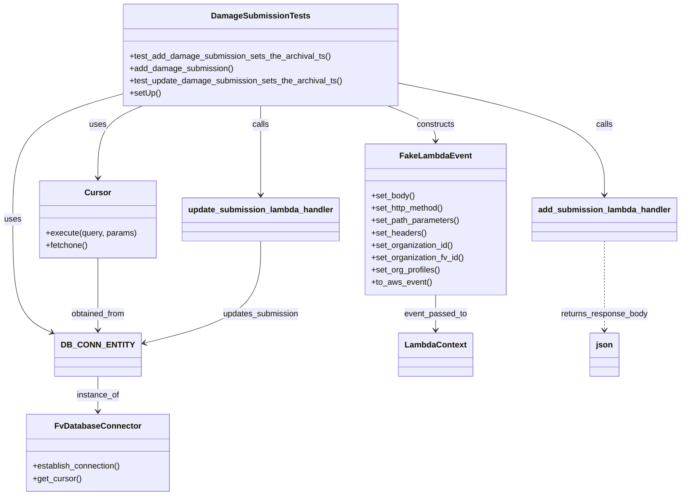
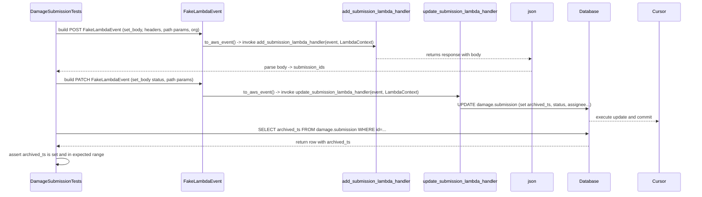

# Diagram: entity_core/entity_service/entity_service_tests/damageview_tests/integration_tests/test_damage_submission.py

> Auto-generated by Obscura crawlers

## Diagram 1

### SVG

<svg id="container" width="1296.6640625" xmlns="http://www.w3.org/2000/svg" class="classDiagram" height="964" viewBox="0 0 1296.6640625 964" role="graphics-document document" aria-roledescription="class"><g><defs><marker id="container_class-aggregationStart" class="marker aggregation class" refX="18" refY="7" markerWidth="190" markerHeight="240" orient="auto"><path d="M 18,7 L9,13 L1,7 L9,1 Z"></path></marker></defs><defs><marker id="container_class-aggregationEnd" class="marker aggregation class" refX="1" refY="7" markerWidth="20" markerHeight="28" orient="auto"><path d="M 18,7 L9,13 L1,7 L9,1 Z"></path></marker></defs><defs><marker id="container_class-extensionStart" class="marker extension class" refX="18" refY="7" markerWidth="190" markerHeight="240" orient="auto"><path d="M 1,7 L18,13 V 1 Z"></path></marker></defs><defs><marker id="container_class-extensionEnd" class="marker extension class" refX="1" refY="7" markerWidth="20" markerHeight="28" orient="auto"><path d="M 1,1 V 13 L18,7 Z"></path></marker></defs><defs><marker id="container_class-compositionStart" class="marker composition class" refX="18" refY="7" markerWidth="190" markerHeight="240" orient="auto"><path d="M 18,7 L9,13 L1,7 L9,1 Z"></path></marker></defs><defs><marker id="container_class-compositionEnd" class="marker composition class" refX="1" refY="7" markerWidth="20" markerHeight="28" orient="auto"><path d="M 18,7 L9,13 L1,7 L9,1 Z"></path></marker></defs><defs><marker id="container_class-dependencyStart" class="marker dependency class" refX="6" refY="7" markerWidth="190" markerHeight="240" orient="auto"><path d="M 5,7 L9,13 L1,7 L9,1 Z"></path></marker></defs><defs><marker id="container_class-dependencyEnd" class="marker dependency class" refX="13" refY="7" markerWidth="20" markerHeight="28" orient="auto"><path d="M 18,7 L9,13 L14,7 L9,1 Z"></path></marker></defs><defs><marker id="container_class-lollipopStart" class="marker lollipop class" refX="13" refY="7" markerWidth="190" markerHeight="240" orient="auto"><circle stroke="black" fill="transparent" cx="7" cy="7" r="6"></circle></marker></defs><defs><marker id="container_class-lollipopEnd" class="marker lollipop class" refX="1" refY="7" markerWidth="190" markerHeight="240" orient="auto"><circle stroke="black" fill="transparent" cx="7" cy="7" r="6"></circle></marker></defs><g class="root"><g class="clusters"></g><g class="edgePaths"><path d="M233.18,183.095L198.398,193.079C163.617,203.063,94.055,223.032,59.273,263.682C24.492,304.333,24.492,365.667,24.492,427C24.492,488.333,24.492,549.667,38.278,586.977C52.063,624.287,79.634,637.573,93.419,644.217L107.204,650.86" id="id_DamageSubmissionTests_DB_CONN_ENTITY_1" class="edge-thickness-normal edge-pattern-solid relation" style=";;;" data-edge="true" data-et="edge" data-id="id_DamageSubmissionTests_DB_CONN_ENTITY_1" data-points="W3sieCI6MjMzLjE3OTY4NzUsInkiOjE4My4wOTQ3ODQyMjkwMTI0Mn0seyJ4IjoyNC40OTIxODc1LCJ5IjoyNDN9LHsieCI6MjQuNDkyMTg3NSwieSI6NDI3fSx7IngiOjI0LjQ5MjE4NzUsInkiOjYxMX0seyJ4IjoxMTIuNjA5Mzc1LCJ5Ijo2NTMuNDY0OTAwMTU3MjcwMn1d" marker-end="url(#container_class-dependencyEnd)"></path><path d="M188.422,732L188.422,738.167C188.422,744.333,188.422,756.667,188.422,768C188.422,779.333,188.422,789.667,188.422,794.833L188.422,800" id="id_DB_CONN_ENTITY_FvDatabaseConnector_2" class="edge-thickness-normal edge-pattern-solid relation" style=";;;" data-edge="true" data-et="edge" data-id="id_DB_CONN_ENTITY_FvDatabaseConnector_2" data-points="W3sieCI6MTg4LjQyMTg3NSwieSI6NzMyfSx7IngiOjE4OC40MjE4NzUsInkiOjc2OX0seyJ4IjoxODguNDIxODc1LCJ5Ijo4MDZ9XQ==" marker-end="url(#container_class-dependencyEnd)"></path><path d="M740.855,206L755.966,212.167C771.076,218.333,801.298,230.667,816.409,242C831.52,253.333,831.52,263.667,831.52,268.833L831.52,274" id="id_DamageSubmissionTests_FakeLambdaEvent_3" class="edge-thickness-normal edge-pattern-solid relation" style=";;;" data-edge="true" data-et="edge" data-id="id_DamageSubmissionTests_FakeLambdaEvent_3" data-points="W3sieCI6NzQwLjg1NDg2NTU3OTA0NDEsInkiOjIwNn0seyJ4Ijo4MzEuNTE5NTMxMjUsInkiOjI0M30seyJ4Ijo4MzEuNTE5NTMxMjUsInkiOjI4MH1d" marker-end="url(#container_class-dependencyEnd)"></path><path d="M763.352,162.062L828.296,175.551C893.24,189.041,1023.128,216.021,1088.072,252.177C1153.016,288.333,1153.016,333.667,1153.016,356.333L1153.016,379" id="id_DamageSubmissionTests_add_submission_lambda_handler_4" class="edge-thickness-normal edge-pattern-solid relation" style=";;;" data-edge="true" data-et="edge" data-id="id_DamageSubmissionTests_add_submission_lambda_handler_4" data-points="W3sieCI6NzYzLjM1MTU2MjUsInkiOjE2Mi4wNjE3NjAyMTM4MjIwOH0seyJ4IjoxMTUzLjAxNTYyNSwieSI6MjQzfSx7IngiOjExNTMuMDE1NjI1LCJ5IjozODV9XQ==" marker-end="url(#container_class-dependencyEnd)"></path><path d="M498.266,206L498.266,212.167C498.266,218.333,498.266,230.667,498.266,259.5C498.266,288.333,498.266,333.667,498.266,356.333L498.266,379" id="id_DamageSubmissionTests_update_submission_lambda_handler_5" class="edge-thickness-normal edge-pattern-solid relation" style=";;;" data-edge="true" data-et="edge" data-id="id_DamageSubmissionTests_update_submission_lambda_handler_5" data-points="W3sieCI6NDk4LjI2NTYyNSwieSI6MjA2fSx7IngiOjQ5OC4yNjU2MjUsInkiOjI0M30seyJ4Ijo0OTguMjY1NjI1LCJ5IjozODV9XQ==" marker-end="url(#container_class-dependencyEnd)"></path><path d="M272.718,206L258.668,212.167C244.619,218.333,216.52,230.667,202.471,254C188.422,277.333,188.422,311.667,188.422,328.833L188.422,346" id="id_DamageSubmissionTests_Cursor_6" class="edge-thickness-normal edge-pattern-solid relation" style=";;;" data-edge="true" data-et="edge" data-id="id_DamageSubmissionTests_Cursor_6" data-points="W3sieCI6MjcyLjcxNzYwMTEwMjk0MTIsInkiOjIwNn0seyJ4IjoxODguNDIxODc1LCJ5IjoyNDN9LHsieCI6MTg4LjQyMTg3NSwieSI6MzUyfV0=" marker-end="url(#container_class-dependencyEnd)"></path><path d="M188.422,502L188.422,520.167C188.422,538.333,188.422,574.667,188.422,598C188.422,621.333,188.422,631.667,188.422,636.833L188.422,642" id="id_Cursor_DB_CONN_ENTITY_7" class="edge-thickness-normal edge-pattern-solid relation" style=";;;" data-edge="true" data-et="edge" data-id="id_Cursor_DB_CONN_ENTITY_7" data-points="W3sieCI6MTg4LjQyMTg3NSwieSI6NTAyfSx7IngiOjE4OC40MjE4NzUsInkiOjYxMX0seyJ4IjoxODguNDIxODc1LCJ5Ijo2NDh9XQ==" marker-end="url(#container_class-dependencyEnd)"></path><path d="M1153.016,469L1153.016,492.667C1153.016,516.333,1153.016,563.667,1153.016,592.5C1153.016,621.333,1153.016,631.667,1153.016,636.833L1153.016,642" id="id_add_submission_lambda_handler_json_8" class="edge-thickness-normal edge-pattern-dashed relation" style=";;;" data-edge="true" data-et="edge" data-id="id_add_submission_lambda_handler_json_8" data-points="W3sieCI6MTE1My4wMTU2MjUsInkiOjQ2OX0seyJ4IjoxMTUzLjAxNTYyNSwieSI6NjExfSx7IngiOjExNTMuMDE1NjI1LCJ5Ijo2NDh9XQ==" marker-end="url(#container_class-dependencyEnd)"></path><path d="M498.266,469L498.266,492.667C498.266,516.333,498.266,563.667,460.229,597.031C422.193,630.396,346.121,649.792,308.085,659.49L270.048,669.188" id="id_update_submission_lambda_handler_DB_CONN_ENTITY_9" class="edge-thickness-normal edge-pattern-solid relation" style=";;;" data-edge="true" data-et="edge" data-id="id_update_submission_lambda_handler_DB_CONN_ENTITY_9" data-points="W3sieCI6NDk4LjI2NTYyNSwieSI6NDY5fSx7IngiOjQ5OC4yNjU2MjUsInkiOjYxMX0seyJ4IjoyNjQuMjM0Mzc1LCJ5Ijo2NzAuNjcwMjk3NTI4OTk2NX1d" marker-end="url(#container_class-dependencyEnd)"></path><path d="M831.52,574L831.52,580.167C831.52,586.333,831.52,598.667,831.52,610C831.52,621.333,831.52,631.667,831.52,636.833L831.52,642" id="id_FakeLambdaEvent_LambdaContext_10" class="edge-thickness-normal edge-pattern-solid relation" style=";;;" data-edge="true" data-et="edge" data-id="id_FakeLambdaEvent_LambdaContext_10" data-points="W3sieCI6ODMxLjUxOTUzMTI1LCJ5Ijo1NzR9LHsieCI6ODMxLjUxOTUzMTI1LCJ5Ijo2MTF9LHsieCI6ODMxLjUxOTUzMTI1LCJ5Ijo2NDh9XQ==" marker-end="url(#container_class-dependencyEnd)"></path></g><g class="edgeLabels"><g class="edgeLabel" transform="translate(24.4921875, 427)"><g class="label" data-id="id_DamageSubmissionTests_DB_CONN_ENTITY_1" transform="translate(-16.4921875, -12)"><foreignObject width="32.984375" height="24">

uses

</foreignObject></g></g><g class="edgeLabel" transform="translate(188.421875, 769)"><g class="label" data-id="id_DB_CONN_ENTITY_FvDatabaseConnector_2" transform="translate(-41.7734375, -12)"><foreignObject width="83.546875" height="24">

instance_of

</foreignObject></g></g><g class="edgeLabel" transform="translate(831.51953125, 243)"><g class="label" data-id="id_DamageSubmissionTests_FakeLambdaEvent_3" transform="translate(-37.84375, -12)"><foreignObject width="75.6875" height="24">

constructs

</foreignObject></g></g><g class="edgeLabel" transform="translate(1153.015625, 243)"><g class="label" data-id="id_DamageSubmissionTests_add_submission_lambda_handler_4" transform="translate(-16.4453125, -12)"><foreignObject width="32.890625" height="24">

calls

</foreignObject></g></g><g class="edgeLabel" transform="translate(498.265625, 243)"><g class="label" data-id="id_DamageSubmissionTests_update_submission_lambda_handler_5" transform="translate(-16.4453125, -12)"><foreignObject width="32.890625" height="24">

calls

</foreignObject></g></g><g class="edgeLabel" transform="translate(188.421875, 243)"><g class="label" data-id="id_DamageSubmissionTests_Cursor_6" transform="translate(-16.4921875, -12)"><foreignObject width="32.984375" height="24">

uses

</foreignObject></g></g><g class="edgeLabel" transform="translate(188.421875, 611)"><g class="label" data-id="id_Cursor_DB_CONN_ENTITY_7" transform="translate(-53.7578125, -12)"><foreignObject width="107.515625" height="24">

obtained_from

</foreignObject></g></g><g class="edgeLabel" transform="translate(1153.015625, 611)"><g class="label" data-id="id_add_submission_lambda_handler_json_8" transform="translate(-85.5625, -12)"><foreignObject width="171.125" height="24">

returns_response_body

</foreignObject></g></g><g class="edgeLabel" transform="translate(498.265625, 611)"><g class="label" data-id="id_update_submission_lambda_handler_DB_CONN_ENTITY_9" transform="translate(-74.6796875, -12)"><foreignObject width="149.359375" height="24">

updates_submission

</foreignObject></g></g><g class="edgeLabel" transform="translate(831.51953125, 611)"><g class="label" data-id="id_FakeLambdaEvent_LambdaContext_10" transform="translate(-61.25, -12)"><foreignObject width="122.5" height="24">

event_passed_to

</foreignObject></g></g></g><g class="nodes"><g class="node default" id="classId-DamageSubmissionTests-0" transform="translate(498.265625, 107)"><g class="basic label-container"><path d="M-265.0859375 -99 L265.0859375 -99 L265.0859375 99 L-265.0859375 99" stroke="none" stroke-width="0" fill="#ECECFF" style=""></path><path d="M-265.0859375 -99 C-102.43735849529764 -99, 60.21122050940471 -99, 265.0859375 -99 M-265.0859375 -99 C-68.66429303023082 -99, 127.75735143953835 -99, 265.0859375 -99 M265.0859375 -99 C265.0859375 -39.32655344399873, 265.0859375 20.346893112002533, 265.0859375 99 M265.0859375 -99 C265.0859375 -58.91896507394583, 265.0859375 -18.837930147891655, 265.0859375 99 M265.0859375 99 C61.17598244191052 99, -142.73397261617896 99, -265.0859375 99 M265.0859375 99 C107.64778380709083 99, -49.790369885818336 99, -265.0859375 99 M-265.0859375 99 C-265.0859375 24.576345170251173, -265.0859375 -49.847309659497654, -265.0859375 -99 M-265.0859375 99 C-265.0859375 47.08300798492511, -265.0859375 -4.833984030149779, -265.0859375 -99" stroke="#9370DB" stroke-width="1.3" fill="none" stroke-dasharray="0 0" style=""></path></g><g class="annotation-group text" transform="translate(0, -75)"></g><g class="label-group text" transform="translate(-90.5, -75)"><g class="label" style="font-weight: bolder" transform="translate(0,-12)"><foreignObject width="181" height="24">

DamageSubmissionTests

</foreignObject></g></g><g class="members-group text" transform="translate(-253.0859375, -27)"></g><g class="methods-group text" transform="translate(-253.0859375, 3)"><g class="label" style="" transform="translate(0,-12)"><foreignObject width="392.484375" height="24">

+test_add_damage_submission_sets_the_archival_ts()

</foreignObject></g><g class="label" style="" transform="translate(0,12)"><foreignObject width="201.796875" height="24">

+add_damage_submission()

</foreignObject></g><g class="label" style="" transform="translate(0,36)"><foreignObject width="415.671875" height="24">

+test_update_damage_submission_sets_the_archival_ts()

</foreignObject></g><g class="label" style="" transform="translate(0,60)"><foreignObject width="60.421875" height="24">

+setUp()

</foreignObject></g></g><g class="divider" style=""><path d="M-265.0859375 -51 C-127.08577442895802 -51, 10.914388642083964 -51, 265.0859375 -51 M-265.0859375 -51 C-93.77044101614752 -51, 77.54505546770497 -51, 265.0859375 -51" stroke="#9370DB" stroke-width="1.3" fill="none" stroke-dasharray="0 0" style=""></path></g><g class="divider" style=""><path d="M-265.0859375 -27 C-99.01353412786071 -27, 67.05886924427858 -27, 265.0859375 -27 M-265.0859375 -27 C-75.8299987527767 -27, 113.4259399944466 -27, 265.0859375 -27" stroke="#9370DB" stroke-width="1.3" fill="none" stroke-dasharray="0 0" style=""></path></g></g><g class="node default" id="classId-FvDatabaseConnector-1" transform="translate(188.421875, 881)"><g class="basic label-container"><path d="M-138.28515625 -75 L138.28515625 -75 L138.28515625 75 L-138.28515625 75" stroke="none" stroke-width="0" fill="#ECECFF" style=""></path><path d="M-138.28515625 -75 C-55.209681421416036 -75, 27.865793407167928 -75, 138.28515625 -75 M-138.28515625 -75 C-60.16940159878287 -75, 17.94635305243426 -75, 138.28515625 -75 M138.28515625 -75 C138.28515625 -44.64953884004211, 138.28515625 -14.299077680084217, 138.28515625 75 M138.28515625 -75 C138.28515625 -42.52299731470698, 138.28515625 -10.045994629413954, 138.28515625 75 M138.28515625 75 C32.61350020486678 75, -73.05815584026644 75, -138.28515625 75 M138.28515625 75 C40.85543535092516 75, -56.574285548149675 75, -138.28515625 75 M-138.28515625 75 C-138.28515625 21.436512623211705, -138.28515625 -32.12697475357659, -138.28515625 -75 M-138.28515625 75 C-138.28515625 22.546621559186228, -138.28515625 -29.906756881627544, -138.28515625 -75" stroke="#9370DB" stroke-width="1.3" fill="none" stroke-dasharray="0 0" style=""></path></g><g class="annotation-group text" transform="translate(0, -51)"></g><g class="label-group text" transform="translate(-79.3046875, -51)"><g class="label" style="font-weight: bolder" transform="translate(0,-12)"><foreignObject width="158.609375" height="24">

FvDatabaseConnector

</foreignObject></g></g><g class="members-group text" transform="translate(-126.28515625, -3)"></g><g class="methods-group text" transform="translate(-126.28515625, 27)"><g class="label" style="" transform="translate(0,-12)"><foreignObject width="173.265625" height="24">

+establish_connection()

</foreignObject></g><g class="label" style="" transform="translate(0,12)"><foreignObject width="94.640625" height="24">

+get_cursor()

</foreignObject></g></g><g class="divider" style=""><path d="M-138.28515625 -27 C-51.63523516381055 -27, 35.0146859223789 -27, 138.28515625 -27 M-138.28515625 -27 C-32.73308043911699 -27, 72.81899537176602 -27, 138.28515625 -27" stroke="#9370DB" stroke-width="1.3" fill="none" stroke-dasharray="0 0" style=""></path></g><g class="divider" style=""><path d="M-138.28515625 -3 C-43.10860176480118 -3, 52.06795272039764 -3, 138.28515625 -3 M-138.28515625 -3 C-69.54074847924379 -3, -0.7963407084875769 -3, 138.28515625 -3" stroke="#9370DB" stroke-width="1.3" fill="none" stroke-dasharray="0 0" style=""></path></g></g><g class="node default" id="classId-DB_CONN_ENTITY-2" transform="translate(188.421875, 690)"><g class="basic label-container"><path d="M-75.8125 -42 L75.8125 -42 L75.8125 42 L-75.8125 42" stroke="none" stroke-width="0" fill="#ECECFF" style=""></path><path d="M-75.8125 -42 C-40.41189378093222 -42, -5.011287561864435 -42, 75.8125 -42 M-75.8125 -42 C-15.910129034874387 -42, 43.992241930251225 -42, 75.8125 -42 M75.8125 -42 C75.8125 -15.691103520864072, 75.8125 10.617792958271856, 75.8125 42 M75.8125 -42 C75.8125 -17.86786787889929, 75.8125 6.2642642422014205, 75.8125 42 M75.8125 42 C33.06873944314147 42, -9.675021113717065 42, -75.8125 42 M75.8125 42 C32.93734885977205 42, -9.937802280455898 42, -75.8125 42 M-75.8125 42 C-75.8125 18.024983791996295, -75.8125 -5.95003241600741, -75.8125 -42 M-75.8125 42 C-75.8125 13.897120710826542, -75.8125 -14.205758578346916, -75.8125 -42" stroke="#9370DB" stroke-width="1.3" fill="none" stroke-dasharray="0 0" style=""></path></g><g class="annotation-group text" transform="translate(0, -18)"></g><g class="label-group text" transform="translate(-63.8125, -18)"><g class="label" style="font-weight: bolder" transform="translate(0,-12)"><foreignObject width="127.625" height="24">

DB_CONN_ENTITY

</foreignObject></g></g><g class="members-group text" transform="translate(-63.8125, 30)"></g><g class="methods-group text" transform="translate(-63.8125, 60)"></g><g class="divider" style=""><path d="M-75.8125 6 C-25.702146375277735 6, 24.40820724944453 6, 75.8125 6 M-75.8125 6 C-17.97040102897214 6, 39.87169794205572 6, 75.8125 6" stroke="#9370DB" stroke-width="1.3" fill="none" stroke-dasharray="0 0" style=""></path></g><g class="divider" style=""><path d="M-75.8125 24 C-22.27709870587946 24, 31.25830258824108 24, 75.8125 24 M-75.8125 24 C-32.57505281267193 24, 10.662394374656145 24, 75.8125 24" stroke="#9370DB" stroke-width="1.3" fill="none" stroke-dasharray="0 0" style=""></path></g></g><g class="node default" id="classId-FakeLambdaEvent-3" transform="translate(831.51953125, 427)"><g class="basic label-container"><path d="M-135.84765625 -147 L135.84765625 -147 L135.84765625 147 L-135.84765625 147" stroke="none" stroke-width="0" fill="#ECECFF" style=""></path><path d="M-135.84765625 -147 C-70.27047794975122 -147, -4.69329964950245 -147, 135.84765625 -147 M-135.84765625 -147 C-49.60908160512477 -147, 36.62949303975046 -147, 135.84765625 -147 M135.84765625 -147 C135.84765625 -32.37267916748782, 135.84765625 82.25464166502437, 135.84765625 147 M135.84765625 -147 C135.84765625 -64.57507111611363, 135.84765625 17.849857767772733, 135.84765625 147 M135.84765625 147 C58.541352427750866 147, -18.76495139449827 147, -135.84765625 147 M135.84765625 147 C44.07335544380706 147, -47.70094536238588 147, -135.84765625 147 M-135.84765625 147 C-135.84765625 59.22570539000806, -135.84765625 -28.54858921998388, -135.84765625 -147 M-135.84765625 147 C-135.84765625 80.40098307658982, -135.84765625 13.801966153179649, -135.84765625 -147" stroke="#9370DB" stroke-width="1.3" fill="none" stroke-dasharray="0 0" style=""></path></g><g class="annotation-group text" transform="translate(0, -123)"></g><g class="label-group text" transform="translate(-65.8671875, -123)"><g class="label" style="font-weight: bolder" transform="translate(0,-12)"><foreignObject width="131.734375" height="24">

FakeLambdaEvent

</foreignObject></g></g><g class="members-group text" transform="translate(-123.84765625, -75)"></g><g class="methods-group text" transform="translate(-123.84765625, -45)"><g class="label" style="" transform="translate(0,-12)"><foreignObject width="84.9375" height="24">

+set_body()

</foreignObject></g><g class="label" style="" transform="translate(0,12)"><foreignObject width="143.578125" height="24">

+set_http_method()

</foreignObject></g><g class="label" style="" transform="translate(0,36)"><foreignObject width="172.625" height="24">

+set_path_parameters()

</foreignObject></g><g class="label" style="" transform="translate(0,60)"><foreignObject width="106.984375" height="24">

+set_headers()

</foreignObject></g><g class="label" style="" transform="translate(0,84)"><foreignObject width="161.078125" height="24">

+set_organization_id()

</foreignObject></g><g class="label" style="" transform="translate(0,108)"><foreignObject width="181.828125" height="24">

+set_organization_fv_id()

</foreignObject></g><g class="label" style="" transform="translate(0,132)"><foreignObject width="134.859375" height="24">

+set_org_profiles()

</foreignObject></g><g class="label" style="" transform="translate(0,156)"><foreignObject width="116.421875" height="24">

+to_aws_event()

</foreignObject></g></g><g class="divider" style=""><path d="M-135.84765625 -99 C-48.597805265409775 -99, 38.65204571918045 -99, 135.84765625 -99 M-135.84765625 -99 C-61.882177801450425 -99, 12.08330064709915 -99, 135.84765625 -99" stroke="#9370DB" stroke-width="1.3" fill="none" stroke-dasharray="0 0" style=""></path></g><g class="divider" style=""><path d="M-135.84765625 -75 C-30.664641591819958 -75, 74.51837306636008 -75, 135.84765625 -75 M-135.84765625 -75 C-73.42704354261252 -75, -11.00643083522506 -75, 135.84765625 -75" stroke="#9370DB" stroke-width="1.3" fill="none" stroke-dasharray="0 0" style=""></path></g></g><g class="node default" id="classId-LambdaContext-4" transform="translate(831.51953125, 690)"><g class="basic label-container"><path d="M-69.296875 -42 L69.296875 -42 L69.296875 42 L-69.296875 42" stroke="none" stroke-width="0" fill="#ECECFF" style=""></path><path d="M-69.296875 -42 C-38.74024773040118 -42, -8.18362046080236 -42, 69.296875 -42 M-69.296875 -42 C-38.47554135450238 -42, -7.654207709004773 -42, 69.296875 -42 M69.296875 -42 C69.296875 -20.453427117250293, 69.296875 1.0931457654994148, 69.296875 42 M69.296875 -42 C69.296875 -24.381970498191375, 69.296875 -6.76394099638275, 69.296875 42 M69.296875 42 C15.168368253303655 42, -38.96013849339269 42, -69.296875 42 M69.296875 42 C33.666053553514615 42, -1.9647678929707695 42, -69.296875 42 M-69.296875 42 C-69.296875 21.27533201910344, -69.296875 0.5506640382068824, -69.296875 -42 M-69.296875 42 C-69.296875 13.913260885025995, -69.296875 -14.17347822994801, -69.296875 -42" stroke="#9370DB" stroke-width="1.3" fill="none" stroke-dasharray="0 0" style=""></path></g><g class="annotation-group text" transform="translate(0, -18)"></g><g class="label-group text" transform="translate(-57.296875, -18)"><g class="label" style="font-weight: bolder" transform="translate(0,-12)"><foreignObject width="114.59375" height="24">

LambdaContext

</foreignObject></g></g><g class="members-group text" transform="translate(-57.296875, 30)"></g><g class="methods-group text" transform="translate(-57.296875, 60)"></g><g class="divider" style=""><path d="M-69.296875 6 C-29.57401003920109 6, 10.148854921597817 6, 69.296875 6 M-69.296875 6 C-36.30348874928959 6, -3.310102498579184 6, 69.296875 6" stroke="#9370DB" stroke-width="1.3" fill="none" stroke-dasharray="0 0" style=""></path></g><g class="divider" style=""><path d="M-69.296875 24 C-16.95343728336104 24, 35.39000043327792 24, 69.296875 24 M-69.296875 24 C-18.997117458265514 24, 31.302640083468972 24, 69.296875 24" stroke="#9370DB" stroke-width="1.3" fill="none" stroke-dasharray="0 0" style=""></path></g></g><g class="node default" id="classId-add_submission_lambda_handler-5" transform="translate(1153.015625, 427)"><g class="basic label-container"><path d="M-135.6484375 -42 L135.6484375 -42 L135.6484375 42 L-135.6484375 42" stroke="none" stroke-width="0" fill="#ECECFF" style=""></path><path d="M-135.6484375 -42 C-74.07384632865275 -42, -12.499255157305498 -42, 135.6484375 -42 M-135.6484375 -42 C-43.856655933262104 -42, 47.93512563347579 -42, 135.6484375 -42 M135.6484375 -42 C135.6484375 -8.413268241977562, 135.6484375 25.173463516044876, 135.6484375 42 M135.6484375 -42 C135.6484375 -9.3109806041956, 135.6484375 23.3780387916088, 135.6484375 42 M135.6484375 42 C37.27127871913913 42, -61.105880061721734 42, -135.6484375 42 M135.6484375 42 C63.32843935967762 42, -8.991558780644766 42, -135.6484375 42 M-135.6484375 42 C-135.6484375 22.605103432731433, -135.6484375 3.2102068654628653, -135.6484375 -42 M-135.6484375 42 C-135.6484375 16.193976178431072, -135.6484375 -9.612047643137856, -135.6484375 -42" stroke="#9370DB" stroke-width="1.3" fill="none" stroke-dasharray="0 0" style=""></path></g><g class="annotation-group text" transform="translate(0, -18)"></g><g class="label-group text" transform="translate(-123.6484375, -18)"><g class="label" style="font-weight: bolder" transform="translate(0,-12)"><foreignObject width="247.296875" height="24">

add_submission_lambda_handler

</foreignObject></g></g><g class="members-group text" transform="translate(-123.6484375, 30)"></g><g class="methods-group text" transform="translate(-123.6484375, 60)"></g><g class="divider" style=""><path d="M-135.6484375 6 C-74.9074551804024 6, -14.166472860804802 6, 135.6484375 6 M-135.6484375 6 C-51.76258719505542 6, 32.123263109889166 6, 135.6484375 6" stroke="#9370DB" stroke-width="1.3" fill="none" stroke-dasharray="0 0" style=""></path></g><g class="divider" style=""><path d="M-135.6484375 24 C-80.49857867341387 24, -25.348719846827763 24, 135.6484375 24 M-135.6484375 24 C-66.35481137821974 24, 2.9388147435605276 24, 135.6484375 24" stroke="#9370DB" stroke-width="1.3" fill="none" stroke-dasharray="0 0" style=""></path></g></g><g class="node default" id="classId-update_submission_lambda_handler-6" transform="translate(498.265625, 427)"><g class="basic label-container"><path d="M-147.40625 -42 L147.40625 -42 L147.40625 42 L-147.40625 42" stroke="none" stroke-width="0" fill="#ECECFF" style=""></path><path d="M-147.40625 -42 C-65.39740000036643 -42, 16.611449999267137 -42, 147.40625 -42 M-147.40625 -42 C-34.9090937562796 -42, 77.5880624874408 -42, 147.40625 -42 M147.40625 -42 C147.40625 -24.05192441396624, 147.40625 -6.103848827932481, 147.40625 42 M147.40625 -42 C147.40625 -15.088061900195672, 147.40625 11.823876199608655, 147.40625 42 M147.40625 42 C36.72640062940266 42, -73.95344874119468 42, -147.40625 42 M147.40625 42 C41.579731622154554 42, -64.24678675569089 42, -147.40625 42 M-147.40625 42 C-147.40625 21.206540380746844, -147.40625 0.41308076149368844, -147.40625 -42 M-147.40625 42 C-147.40625 20.171510974038693, -147.40625 -1.6569780519226143, -147.40625 -42" stroke="#9370DB" stroke-width="1.3" fill="none" stroke-dasharray="0 0" style=""></path></g><g class="annotation-group text" transform="translate(0, -18)"></g><g class="label-group text" transform="translate(-135.40625, -18)"><g class="label" style="font-weight: bolder" transform="translate(0,-12)"><foreignObject width="270.8125" height="24">

update_submission_lambda_handler

</foreignObject></g></g><g class="members-group text" transform="translate(-135.40625, 30)"></g><g class="methods-group text" transform="translate(-135.40625, 60)"></g><g class="divider" style=""><path d="M-147.40625 6 C-41.515233680910995 6, 64.37578263817801 6, 147.40625 6 M-147.40625 6 C-81.20358666651862 6, -15.000923333037235 6, 147.40625 6" stroke="#9370DB" stroke-width="1.3" fill="none" stroke-dasharray="0 0" style=""></path></g><g class="divider" style=""><path d="M-147.40625 24 C-87.31049862935325 24, -27.214747258706495 24, 147.40625 24 M-147.40625 24 C-73.67774518489092 24, 0.05075963021815255 24, 147.40625 24" stroke="#9370DB" stroke-width="1.3" fill="none" stroke-dasharray="0 0" style=""></path></g></g><g class="node default" id="classId-json-7" transform="translate(1153.015625, 690)"><g class="basic label-container"><path d="M-27.40625 -42 L27.40625 -42 L27.40625 42 L-27.40625 42" stroke="none" stroke-width="0" fill="#ECECFF" style=""></path><path d="M-27.40625 -42 C-7.6258904204044065 -42, 12.154469159191187 -42, 27.40625 -42 M-27.40625 -42 C-14.730495854106929 -42, -2.0547417082138573 -42, 27.40625 -42 M27.40625 -42 C27.40625 -16.083046631575666, 27.40625 9.833906736848668, 27.40625 42 M27.40625 -42 C27.40625 -10.181122151409646, 27.40625 21.637755697180708, 27.40625 42 M27.40625 42 C10.901880925401333 42, -5.602488149197335 42, -27.40625 42 M27.40625 42 C6.5661271798655605 42, -14.273995640268879 42, -27.40625 42 M-27.40625 42 C-27.40625 23.052426607532418, -27.40625 4.104853215064836, -27.40625 -42 M-27.40625 42 C-27.40625 24.102482061081947, -27.40625 6.204964122163894, -27.40625 -42" stroke="#9370DB" stroke-width="1.3" fill="none" stroke-dasharray="0 0" style=""></path></g><g class="annotation-group text" transform="translate(0, -18)"></g><g class="label-group text" transform="translate(-15.40625, -18)"><g class="label" style="font-weight: bolder" transform="translate(0,-12)"><foreignObject width="30.8125" height="24">

json

</foreignObject></g></g><g class="members-group text" transform="translate(-15.40625, 30)"></g><g class="methods-group text" transform="translate(-15.40625, 60)"></g><g class="divider" style=""><path d="M-27.40625 6 C-12.881040790345516 6, 1.6441684193089685 6, 27.40625 6 M-27.40625 6 C-7.93319962117743 6, 11.53985075764514 6, 27.40625 6" stroke="#9370DB" stroke-width="1.3" fill="none" stroke-dasharray="0 0" style=""></path></g><g class="divider" style=""><path d="M-27.40625 24 C-10.307354369198087 24, 6.791541261603825 24, 27.40625 24 M-27.40625 24 C-8.40191169868346 24, 10.60242660263308 24, 27.40625 24" stroke="#9370DB" stroke-width="1.3" fill="none" stroke-dasharray="0 0" style=""></path></g></g><g class="node default" id="classId-Cursor-8" transform="translate(188.421875, 427)"><g class="basic label-container"><path d="M-112.4375 -75 L112.4375 -75 L112.4375 75 L-112.4375 75" stroke="none" stroke-width="0" fill="#ECECFF" style=""></path><path d="M-112.4375 -75 C-48.9566021281765 -75, 14.524295743647002 -75, 112.4375 -75 M-112.4375 -75 C-52.44048525011922 -75, 7.556529499761567 -75, 112.4375 -75 M112.4375 -75 C112.4375 -23.721500396135283, 112.4375 27.556999207729433, 112.4375 75 M112.4375 -75 C112.4375 -35.920719228122174, 112.4375 3.1585615437556527, 112.4375 75 M112.4375 75 C41.58376174660164 75, -29.269976506796723 75, -112.4375 75 M112.4375 75 C41.61197814076574 75, -29.213543718468514 75, -112.4375 75 M-112.4375 75 C-112.4375 25.571639174125032, -112.4375 -23.856721651749936, -112.4375 -75 M-112.4375 75 C-112.4375 30.28100011697137, -112.4375 -14.43799976605726, -112.4375 -75" stroke="#9370DB" stroke-width="1.3" fill="none" stroke-dasharray="0 0" style=""></path></g><g class="annotation-group text" transform="translate(0, -51)"></g><g class="label-group text" transform="translate(-23.90625, -51)"><g class="label" style="font-weight: bolder" transform="translate(0,-12)"><foreignObject width="47.8125" height="24">

Cursor

</foreignObject></g></g><g class="members-group text" transform="translate(-100.4375, -3)"></g><g class="methods-group text" transform="translate(-100.4375, 27)"><g class="label" style="" transform="translate(0,-12)"><foreignObject width="176.96875" height="24">

+execute(query, params)

</foreignObject></g><g class="label" style="" transform="translate(0,12)"><foreignObject width="82.046875" height="24">

+fetchone()

</foreignObject></g></g><g class="divider" style=""><path d="M-112.4375 -27 C-30.853262809995243 -27, 50.73097438000951 -27, 112.4375 -27 M-112.4375 -27 C-26.45751338652009 -27, 59.52247322695982 -27, 112.4375 -27" stroke="#9370DB" stroke-width="1.3" fill="none" stroke-dasharray="0 0" style=""></path></g><g class="divider" style=""><path d="M-112.4375 -3 C-58.76189932236294 -3, -5.086298644725886 -3, 112.4375 -3 M-112.4375 -3 C-40.546800967220676 -3, 31.343898065558648 -3, 112.4375 -3" stroke="#9370DB" stroke-width="1.3" fill="none" stroke-dasharray="0 0" style=""></path></g></g></g></g></g></svg>

## Diagram 2

### SVG

<svg id="container" width="2648" xmlns="http://www.w3.org/2000/svg" height="729" viewBox="-119 -10 2648 729" role="graphics-document document" aria-roledescription="sequence"><g><rect x="2329" y="643" fill="#eaeaea" stroke="#666" width="150" height="65" name="Cursor" rx="3" ry="3" class="actor actor-bottom"></rect><text x="2404" y="675.5" dominant-baseline="central" alignment-baseline="central" class="actor actor-box" style="text-anchor: middle; font-size: 16px; font-weight: 400;"><tspan x="2404" dy="0">Cursor</tspan></text></g><g><rect x="2057" y="643" fill="#eaeaea" stroke="#666" width="150" height="65" name="DB" rx="3" ry="3" class="actor actor-bottom"></rect><text x="2132" y="675.5" dominant-baseline="central" alignment-baseline="central" class="actor actor-box" style="text-anchor: middle; font-size: 16px; font-weight: 400;"><tspan x="2132" dy="0">Database</tspan></text></g><g><rect x="1857" y="643" fill="#eaeaea" stroke="#666" width="150" height="65" name="JSON" rx="3" ry="3" class="actor actor-bottom"></rect><text x="1932" y="675.5" dominant-baseline="central" alignment-baseline="central" class="actor actor-box" style="text-anchor: middle; font-size: 16px; font-weight: 400;"><tspan x="1932" dy="0">json</tspan></text></g><g><rect x="1516" y="643" fill="#eaeaea" stroke="#666" width="291" height="65" name="UpdateHandler" rx="3" ry="3" class="actor actor-bottom"></rect><text x="1661.5" y="675.5" dominant-baseline="central" alignment-baseline="central" class="actor actor-box" style="text-anchor: middle; font-size: 16px; font-weight: 400;"><tspan x="1661.5" dy="0">update_submission_lambda_handler</tspan></text></g><g><rect x="1199" y="643" fill="#eaeaea" stroke="#666" width="267" height="65" name="AddHandler" rx="3" ry="3" class="actor actor-bottom"></rect><text x="1332.5" y="675.5" dominant-baseline="central" alignment-baseline="central" class="actor actor-box" style="text-anchor: middle; font-size: 16px; font-weight: 400;"><tspan x="1332.5" dy="0">add_submission_lambda_handler</tspan></text></g><g><rect x="585" y="643" fill="#eaeaea" stroke="#666" width="151" height="65" name="Event" rx="3" ry="3" class="actor actor-bottom"></rect><text x="660.5" y="675.5" dominant-baseline="central" alignment-baseline="central" class="actor actor-box" style="text-anchor: middle; font-size: 16px; font-weight: 400;"><tspan x="660.5" dy="0">FakeLambdaEvent</tspan></text></g><g><rect x="0" y="643" fill="#eaeaea" stroke="#666" width="199" height="65" name="Test" rx="3" ry="3" class="actor actor-bottom"></rect><text x="99.5" y="675.5" dominant-baseline="central" alignment-baseline="central" class="actor actor-box" style="text-anchor: middle; font-size: 16px; font-weight: 400;"><tspan x="99.5" dy="0">DamageSubmissionTests</tspan></text></g><g><line id="actor6" x1="2404" y1="65" x2="2404" y2="643" class="actor-line 200" stroke-width="0.5px" stroke="#999" name="Cursor"></line><g id="root-6"><rect x="2329" y="0" fill="#eaeaea" stroke="#666" width="150" height="65" name="Cursor" rx="3" ry="3" class="actor actor-top"></rect><text x="2404" y="32.5" dominant-baseline="central" alignment-baseline="central" class="actor actor-box" style="text-anchor: middle; font-size: 16px; font-weight: 400;"><tspan x="2404" dy="0">Cursor</tspan></text></g></g><g><line id="actor5" x1="2132" y1="65" x2="2132" y2="643" class="actor-line 200" stroke-width="0.5px" stroke="#999" name="DB"></line><g id="root-5"><rect x="2057" y="0" fill="#eaeaea" stroke="#666" width="150" height="65" name="DB" rx="3" ry="3" class="actor actor-top"></rect><text x="2132" y="32.5" dominant-baseline="central" alignment-baseline="central" class="actor actor-box" style="text-anchor: middle; font-size: 16px; font-weight: 400;"><tspan x="2132" dy="0">Database</tspan></text></g></g><g><line id="actor4" x1="1932" y1="65" x2="1932" y2="643" class="actor-line 200" stroke-width="0.5px" stroke="#999" name="JSON"></line><g id="root-4"><rect x="1857" y="0" fill="#eaeaea" stroke="#666" width="150" height="65" name="JSON" rx="3" ry="3" class="actor actor-top"></rect><text x="1932" y="32.5" dominant-baseline="central" alignment-baseline="central" class="actor actor-box" style="text-anchor: middle; font-size: 16px; font-weight: 400;"><tspan x="1932" dy="0">json</tspan></text></g></g><g><line id="actor3" x1="1661.5" y1="65" x2="1661.5" y2="643" class="actor-line 200" stroke-width="0.5px" stroke="#999" name="UpdateHandler"></line><g id="root-3"><rect x="1516" y="0" fill="#eaeaea" stroke="#666" width="291" height="65" name="UpdateHandler" rx="3" ry="3" class="actor actor-top"></rect><text x="1661.5" y="32.5" dominant-baseline="central" alignment-baseline="central" class="actor actor-box" style="text-anchor: middle; font-size: 16px; font-weight: 400;"><tspan x="1661.5" dy="0">update_submission_lambda_handler</tspan></text></g></g><g><line id="actor2" x1="1332.5" y1="65" x2="1332.5" y2="643" class="actor-line 200" stroke-width="0.5px" stroke="#999" name="AddHandler"></line><g id="root-2"><rect x="1199" y="0" fill="#eaeaea" stroke="#666" width="267" height="65" name="AddHandler" rx="3" ry="3" class="actor actor-top"></rect><text x="1332.5" y="32.5" dominant-baseline="central" alignment-baseline="central" class="actor actor-box" style="text-anchor: middle; font-size: 16px; font-weight: 400;"><tspan x="1332.5" dy="0">add_submission_lambda_handler</tspan></text></g></g><g><line id="actor1" x1="660.5" y1="65" x2="660.5" y2="643" class="actor-line 200" stroke-width="0.5px" stroke="#999" name="Event"></line><g id="root-1"><rect x="585" y="0" fill="#eaeaea" stroke="#666" width="151" height="65" name="Event" rx="3" ry="3" class="actor actor-top"></rect><text x="660.5" y="32.5" dominant-baseline="central" alignment-baseline="central" class="actor actor-box" style="text-anchor: middle; font-size: 16px; font-weight: 400;"><tspan x="660.5" dy="0">FakeLambdaEvent</tspan></text></g></g><g><line id="actor0" x1="99.5" y1="65" x2="99.5" y2="643" class="actor-line 200" stroke-width="0.5px" stroke="#999" name="Test"></line><g id="root-0"><rect x="0" y="0" fill="#eaeaea" stroke="#666" width="199" height="65" name="Test" rx="3" ry="3" class="actor actor-top"></rect><text x="99.5" y="32.5" dominant-baseline="central" alignment-baseline="central" class="actor actor-box" style="text-anchor: middle; font-size: 16px; font-weight: 400;"><tspan x="99.5" dy="0">DamageSubmissionTests</tspan></text></g></g><g></g><defs><symbol id="computer" width="24" height="24"><path transform="scale(.5)" d="M2 2v13h20v-13h-20zm18 11h-16v-9h16v9zm-10.228 6l.466-1h3.524l.467 1h-4.457zm14.228 3h-24l2-6h2.104l-1.33 4h18.45l-1.297-4h2.073l2 6zm-5-10h-14v-7h14v7z"></path></symbol></defs><defs><symbol id="database" fill-rule="evenodd" clip-rule="evenodd"><path transform="scale(.5)" d="M12.258.001l.256.004.255.005.253.008.251.01.249.012.247.015.246.016.242.019.241.02.239.023.236.024.233.027.231.028.229.031.225.032.223.034.22.036.217.038.214.04.211.041.208.043.205.045.201.046.198.048.194.05.191.051.187.053.183.054.18.056.175.057.172.059.168.06.163.061.16.063.155.064.15.066.074.033.073.033.071.034.07.034.069.035.068.035.067.035.066.035.064.036.064.036.062.036.06.036.06.037.058.037.058.037.055.038.055.038.053.038.052.038.051.039.05.039.048.039.047.039.045.04.044.04.043.04.041.04.04.041.039.041.037.041.036.041.034.041.033.042.032.042.03.042.029.042.027.042.026.043.024.043.023.043.021.043.02.043.018.044.017.043.015.044.013.044.012.044.011.045.009.044.007.045.006.045.004.045.002.045.001.045v17l-.001.045-.002.045-.004.045-.006.045-.007.045-.009.044-.011.045-.012.044-.013.044-.015.044-.017.043-.018.044-.02.043-.021.043-.023.043-.024.043-.026.043-.027.042-.029.042-.03.042-.032.042-.033.042-.034.041-.036.041-.037.041-.039.041-.04.041-.041.04-.043.04-.044.04-.045.04-.047.039-.048.039-.05.039-.051.039-.052.038-.053.038-.055.038-.055.038-.058.037-.058.037-.06.037-.06.036-.062.036-.064.036-.064.036-.066.035-.067.035-.068.035-.069.035-.07.034-.071.034-.073.033-.074.033-.15.066-.155.064-.16.063-.163.061-.168.06-.172.059-.175.057-.18.056-.183.054-.187.053-.191.051-.194.05-.198.048-.201.046-.205.045-.208.043-.211.041-.214.04-.217.038-.22.036-.223.034-.225.032-.229.031-.231.028-.233.027-.236.024-.239.023-.241.02-.242.019-.246.016-.247.015-.249.012-.251.01-.253.008-.255.005-.256.004-.258.001-.258-.001-.256-.004-.255-.005-.253-.008-.251-.01-.249-.012-.247-.015-.245-.016-.243-.019-.241-.02-.238-.023-.236-.024-.234-.027-.231-.028-.228-.031-.226-.032-.223-.034-.22-.036-.217-.038-.214-.04-.211-.041-.208-.043-.204-.045-.201-.046-.198-.048-.195-.05-.19-.051-.187-.053-.184-.054-.179-.056-.176-.057-.172-.059-.167-.06-.164-.061-.159-.063-.155-.064-.151-.066-.074-.033-.072-.033-.072-.034-.07-.034-.069-.035-.068-.035-.067-.035-.066-.035-.064-.036-.063-.036-.062-.036-.061-.036-.06-.037-.058-.037-.057-.037-.056-.038-.055-.038-.053-.038-.052-.038-.051-.039-.049-.039-.049-.039-.046-.039-.046-.04-.044-.04-.043-.04-.041-.04-.04-.041-.039-.041-.037-.041-.036-.041-.034-.041-.033-.042-.032-.042-.03-.042-.029-.042-.027-.042-.026-.043-.024-.043-.023-.043-.021-.043-.02-.043-.018-.044-.017-.043-.015-.044-.013-.044-.012-.044-.011-.045-.009-.044-.007-.045-.006-.045-.004-.045-.002-.045-.001-.045v-17l.001-.045.002-.045.004-.045.006-.045.007-.045.009-.044.011-.045.012-.044.013-.044.015-.044.017-.043.018-.044.02-.043.021-.043.023-.043.024-.043.026-.043.027-.042.029-.042.03-.042.032-.042.033-.042.034-.041.036-.041.037-.041.039-.041.04-.041.041-.04.043-.04.044-.04.046-.04.046-.039.049-.039.049-.039.051-.039.052-.038.053-.038.055-.038.056-.038.057-.037.058-.037.06-.037.061-.036.062-.036.063-.036.064-.036.066-.035.067-.035.068-.035.069-.035.07-.034.072-.034.072-.033.074-.033.151-.066.155-.064.159-.063.164-.061.167-.06.172-.059.176-.057.179-.056.184-.054.187-.053.19-.051.195-.05.198-.048.201-.046.204-.045.208-.043.211-.041.214-.04.217-.038.22-.036.223-.034.226-.032.228-.031.231-.028.234-.027.236-.024.238-.023.241-.02.243-.019.245-.016.247-.015.249-.012.251-.01.253-.008.255-.005.256-.004.258-.001.258.001zm-9.258 20.499v.01l.001.021.003.021.004.022.005.021.006.022.007.022.009.023.01.022.011.023.012.023.013.023.015.023.016.024.017.023.018.024.019.024.021.024.022.025.023.024.024.025.052.049.056.05.061.051.066.051.07.051.075.051.079.052.084.052.088.052.092.052.097.052.102.051.105.052.11.052.114.051.119.051.123.051.127.05.131.05.135.05.139.048.144.049.147.047.152.047.155.047.16.045.163.045.167.043.171.043.176.041.178.041.183.039.187.039.19.037.194.035.197.035.202.033.204.031.209.03.212.029.216.027.219.025.222.024.226.021.23.02.233.018.236.016.24.015.243.012.246.01.249.008.253.005.256.004.259.001.26-.001.257-.004.254-.005.25-.008.247-.011.244-.012.241-.014.237-.016.233-.018.231-.021.226-.021.224-.024.22-.026.216-.027.212-.028.21-.031.205-.031.202-.034.198-.034.194-.036.191-.037.187-.039.183-.04.179-.04.175-.042.172-.043.168-.044.163-.045.16-.046.155-.046.152-.047.148-.048.143-.049.139-.049.136-.05.131-.05.126-.05.123-.051.118-.052.114-.051.11-.052.106-.052.101-.052.096-.052.092-.052.088-.053.083-.051.079-.052.074-.052.07-.051.065-.051.06-.051.056-.05.051-.05.023-.024.023-.025.021-.024.02-.024.019-.024.018-.024.017-.024.015-.023.014-.024.013-.023.012-.023.01-.023.01-.022.008-.022.006-.022.006-.022.004-.022.004-.021.001-.021.001-.021v-4.127l-.077.055-.08.053-.083.054-.085.053-.087.052-.09.052-.093.051-.095.05-.097.05-.1.049-.102.049-.105.048-.106.047-.109.047-.111.046-.114.045-.115.045-.118.044-.12.043-.122.042-.124.042-.126.041-.128.04-.13.04-.132.038-.134.038-.135.037-.138.037-.139.035-.142.035-.143.034-.144.033-.147.032-.148.031-.15.03-.151.03-.153.029-.154.027-.156.027-.158.026-.159.025-.161.024-.162.023-.163.022-.165.021-.166.02-.167.019-.169.018-.169.017-.171.016-.173.015-.173.014-.175.013-.175.012-.177.011-.178.01-.179.008-.179.008-.181.006-.182.005-.182.004-.184.003-.184.002h-.37l-.184-.002-.184-.003-.182-.004-.182-.005-.181-.006-.179-.008-.179-.008-.178-.01-.176-.011-.176-.012-.175-.013-.173-.014-.172-.015-.171-.016-.17-.017-.169-.018-.167-.019-.166-.02-.165-.021-.163-.022-.162-.023-.161-.024-.159-.025-.157-.026-.156-.027-.155-.027-.153-.029-.151-.03-.15-.03-.148-.031-.146-.032-.145-.033-.143-.034-.141-.035-.14-.035-.137-.037-.136-.037-.134-.038-.132-.038-.13-.04-.128-.04-.126-.041-.124-.042-.122-.042-.12-.044-.117-.043-.116-.045-.113-.045-.112-.046-.109-.047-.106-.047-.105-.048-.102-.049-.1-.049-.097-.05-.095-.05-.093-.052-.09-.051-.087-.052-.085-.053-.083-.054-.08-.054-.077-.054v4.127zm0-5.654v.011l.001.021.003.021.004.021.005.022.006.022.007.022.009.022.01.022.011.023.012.023.013.023.015.024.016.023.017.024.018.024.019.024.021.024.022.024.023.025.024.024.052.05.056.05.061.05.066.051.07.051.075.052.079.051.084.052.088.052.092.052.097.052.102.052.105.052.11.051.114.051.119.052.123.05.127.051.131.05.135.049.139.049.144.048.147.048.152.047.155.046.16.045.163.045.167.044.171.042.176.042.178.04.183.04.187.038.19.037.194.036.197.034.202.033.204.032.209.03.212.028.216.027.219.025.222.024.226.022.23.02.233.018.236.016.24.014.243.012.246.01.249.008.253.006.256.003.259.001.26-.001.257-.003.254-.006.25-.008.247-.01.244-.012.241-.015.237-.016.233-.018.231-.02.226-.022.224-.024.22-.025.216-.027.212-.029.21-.03.205-.032.202-.033.198-.035.194-.036.191-.037.187-.039.183-.039.179-.041.175-.042.172-.043.168-.044.163-.045.16-.045.155-.047.152-.047.148-.048.143-.048.139-.05.136-.049.131-.05.126-.051.123-.051.118-.051.114-.052.11-.052.106-.052.101-.052.096-.052.092-.052.088-.052.083-.052.079-.052.074-.051.07-.052.065-.051.06-.05.056-.051.051-.049.023-.025.023-.024.021-.025.02-.024.019-.024.018-.024.017-.024.015-.023.014-.023.013-.024.012-.022.01-.023.01-.023.008-.022.006-.022.006-.022.004-.021.004-.022.001-.021.001-.021v-4.139l-.077.054-.08.054-.083.054-.085.052-.087.053-.09.051-.093.051-.095.051-.097.05-.1.049-.102.049-.105.048-.106.047-.109.047-.111.046-.114.045-.115.044-.118.044-.12.044-.122.042-.124.042-.126.041-.128.04-.13.039-.132.039-.134.038-.135.037-.138.036-.139.036-.142.035-.143.033-.144.033-.147.033-.148.031-.15.03-.151.03-.153.028-.154.028-.156.027-.158.026-.159.025-.161.024-.162.023-.163.022-.165.021-.166.02-.167.019-.169.018-.169.017-.171.016-.173.015-.173.014-.175.013-.175.012-.177.011-.178.009-.179.009-.179.007-.181.007-.182.005-.182.004-.184.003-.184.002h-.37l-.184-.002-.184-.003-.182-.004-.182-.005-.181-.007-.179-.007-.179-.009-.178-.009-.176-.011-.176-.012-.175-.013-.173-.014-.172-.015-.171-.016-.17-.017-.169-.018-.167-.019-.166-.02-.165-.021-.163-.022-.162-.023-.161-.024-.159-.025-.157-.026-.156-.027-.155-.028-.153-.028-.151-.03-.15-.03-.148-.031-.146-.033-.145-.033-.143-.033-.141-.035-.14-.036-.137-.036-.136-.037-.134-.038-.132-.039-.13-.039-.128-.04-.126-.041-.124-.042-.122-.043-.12-.043-.117-.044-.116-.044-.113-.046-.112-.046-.109-.046-.106-.047-.105-.048-.102-.049-.1-.049-.097-.05-.095-.051-.093-.051-.09-.051-.087-.053-.085-.052-.083-.054-.08-.054-.077-.054v4.139zm0-5.666v.011l.001.02.003.022.004.021.005.022.006.021.007.022.009.023.01.022.011.023.012.023.013.023.015.023.016.024.017.024.018.023.019.024.021.025.022.024.023.024.024.025.052.05.056.05.061.05.066.051.07.051.075.052.079.051.084.052.088.052.092.052.097.052.102.052.105.051.11.052.114.051.119.051.123.051.127.05.131.05.135.05.139.049.144.048.147.048.152.047.155.046.16.045.163.045.167.043.171.043.176.042.178.04.183.04.187.038.19.037.194.036.197.034.202.033.204.032.209.03.212.028.216.027.219.025.222.024.226.021.23.02.233.018.236.017.24.014.243.012.246.01.249.008.253.006.256.003.259.001.26-.001.257-.003.254-.006.25-.008.247-.01.244-.013.241-.014.237-.016.233-.018.231-.02.226-.022.224-.024.22-.025.216-.027.212-.029.21-.03.205-.032.202-.033.198-.035.194-.036.191-.037.187-.039.183-.039.179-.041.175-.042.172-.043.168-.044.163-.045.16-.045.155-.047.152-.047.148-.048.143-.049.139-.049.136-.049.131-.051.126-.05.123-.051.118-.052.114-.051.11-.052.106-.052.101-.052.096-.052.092-.052.088-.052.083-.052.079-.052.074-.052.07-.051.065-.051.06-.051.056-.05.051-.049.023-.025.023-.025.021-.024.02-.024.019-.024.018-.024.017-.024.015-.023.014-.024.013-.023.012-.023.01-.022.01-.023.008-.022.006-.022.006-.022.004-.022.004-.021.001-.021.001-.021v-4.153l-.077.054-.08.054-.083.053-.085.053-.087.053-.09.051-.093.051-.095.051-.097.05-.1.049-.102.048-.105.048-.106.048-.109.046-.111.046-.114.046-.115.044-.118.044-.12.043-.122.043-.124.042-.126.041-.128.04-.13.039-.132.039-.134.038-.135.037-.138.036-.139.036-.142.034-.143.034-.144.033-.147.032-.148.032-.15.03-.151.03-.153.028-.154.028-.156.027-.158.026-.159.024-.161.024-.162.023-.163.023-.165.021-.166.02-.167.019-.169.018-.169.017-.171.016-.173.015-.173.014-.175.013-.175.012-.177.01-.178.01-.179.009-.179.007-.181.006-.182.006-.182.004-.184.003-.184.001-.185.001-.185-.001-.184-.001-.184-.003-.182-.004-.182-.006-.181-.006-.179-.007-.179-.009-.178-.01-.176-.01-.176-.012-.175-.013-.173-.014-.172-.015-.171-.016-.17-.017-.169-.018-.167-.019-.166-.02-.165-.021-.163-.023-.162-.023-.161-.024-.159-.024-.157-.026-.156-.027-.155-.028-.153-.028-.151-.03-.15-.03-.148-.032-.146-.032-.145-.033-.143-.034-.141-.034-.14-.036-.137-.036-.136-.037-.134-.038-.132-.039-.13-.039-.128-.041-.126-.041-.124-.041-.122-.043-.12-.043-.117-.044-.116-.044-.113-.046-.112-.046-.109-.046-.106-.048-.105-.048-.102-.048-.1-.05-.097-.049-.095-.051-.093-.051-.09-.052-.087-.052-.085-.053-.083-.053-.08-.054-.077-.054v4.153zm8.74-8.179l-.257.004-.254.005-.25.008-.247.011-.244.012-.241.014-.237.016-.233.018-.231.021-.226.022-.224.023-.22.026-.216.027-.212.028-.21.031-.205.032-.202.033-.198.034-.194.036-.191.038-.187.038-.183.04-.179.041-.175.042-.172.043-.168.043-.163.045-.16.046-.155.046-.152.048-.148.048-.143.048-.139.049-.136.05-.131.05-.126.051-.123.051-.118.051-.114.052-.11.052-.106.052-.101.052-.096.052-.092.052-.088.052-.083.052-.079.052-.074.051-.07.052-.065.051-.06.05-.056.05-.051.05-.023.025-.023.024-.021.024-.02.025-.019.024-.018.024-.017.023-.015.024-.014.023-.013.023-.012.023-.01.023-.01.022-.008.022-.006.023-.006.021-.004.022-.004.021-.001.021-.001.021.001.021.001.021.004.021.004.022.006.021.006.023.008.022.01.022.01.023.012.023.013.023.014.023.015.024.017.023.018.024.019.024.02.025.021.024.023.024.023.025.051.05.056.05.06.05.065.051.07.052.074.051.079.052.083.052.088.052.092.052.096.052.101.052.106.052.11.052.114.052.118.051.123.051.126.051.131.05.136.05.139.049.143.048.148.048.152.048.155.046.16.046.163.045.168.043.172.043.175.042.179.041.183.04.187.038.191.038.194.036.198.034.202.033.205.032.21.031.212.028.216.027.22.026.224.023.226.022.231.021.233.018.237.016.241.014.244.012.247.011.25.008.254.005.257.004.26.001.26-.001.257-.004.254-.005.25-.008.247-.011.244-.012.241-.014.237-.016.233-.018.231-.021.226-.022.224-.023.22-.026.216-.027.212-.028.21-.031.205-.032.202-.033.198-.034.194-.036.191-.038.187-.038.183-.04.179-.041.175-.042.172-.043.168-.043.163-.045.16-.046.155-.046.152-.048.148-.048.143-.048.139-.049.136-.05.131-.05.126-.051.123-.051.118-.051.114-.052.11-.052.106-.052.101-.052.096-.052.092-.052.088-.052.083-.052.079-.052.074-.051.07-.052.065-.051.06-.05.056-.05.051-.05.023-.025.023-.024.021-.024.02-.025.019-.024.018-.024.017-.023.015-.024.014-.023.013-.023.012-.023.01-.023.01-.022.008-.022.006-.023.006-.021.004-.022.004-.021.001-.021.001-.021-.001-.021-.001-.021-.004-.021-.004-.022-.006-.021-.006-.023-.008-.022-.01-.022-.01-.023-.012-.023-.013-.023-.014-.023-.015-.024-.017-.023-.018-.024-.019-.024-.02-.025-.021-.024-.023-.024-.023-.025-.051-.05-.056-.05-.06-.05-.065-.051-.07-.052-.074-.051-.079-.052-.083-.052-.088-.052-.092-.052-.096-.052-.101-.052-.106-.052-.11-.052-.114-.052-.118-.051-.123-.051-.126-.051-.131-.05-.136-.05-.139-.049-.143-.048-.148-.048-.152-.048-.155-.046-.16-.046-.163-.045-.168-.043-.172-.043-.175-.042-.179-.041-.183-.04-.187-.038-.191-.038-.194-.036-.198-.034-.202-.033-.205-.032-.21-.031-.212-.028-.216-.027-.22-.026-.224-.023-.226-.022-.231-.021-.233-.018-.237-.016-.241-.014-.244-.012-.247-.011-.25-.008-.254-.005-.257-.004-.26-.001-.26.001z"></path></symbol></defs><defs><symbol id="clock" width="24" height="24"><path transform="scale(.5)" d="M12 2c5.514 0 10 4.486 10 10s-4.486 10-10 10-10-4.486-10-10 4.486-10 10-10zm0-2c-6.627 0-12 5.373-12 12s5.373 12 12 12 12-5.373 12-12-5.373-12-12-12zm5.848 12.459c.202.038.202.333.001.372-1.907.361-6.045 1.111-6.547 1.111-.719 0-1.301-.582-1.301-1.301 0-.512.77-5.447 1.125-7.445.034-.192.312-.181.343.014l.985 6.238 5.394 1.011z"></path></symbol></defs><defs><marker id="arrowhead" refX="7.9" refY="5" markerUnits="userSpaceOnUse" markerWidth="12" markerHeight="12" orient="auto-start-reverse"><path d="M -1 0 L 10 5 L 0 10 z"></path></marker></defs><defs><marker id="crosshead" markerWidth="15" markerHeight="8" orient="auto" refX="4" refY="4.5"><path fill="none" stroke="#000000" stroke-width="1pt" d="M 1,2 L 6,7 M 6,2 L 1,7" style="stroke-dasharray: 0, 0;"></path></marker></defs><defs><marker id="filled-head" refX="15.5" refY="7" markerWidth="20" markerHeight="28" orient="auto"><path d="M 18,7 L9,13 L14,7 L9,1 Z"></path></marker></defs><defs><marker id="sequencenumber" refX="15" refY="15" markerWidth="60" markerHeight="40" orient="auto"><circle cx="15" cy="15" r="6"></circle></marker></defs><text x="379" y="80" text-anchor="middle" dominant-baseline="middle" alignment-baseline="middle" class="messageText" dy="1em" style="font-size: 16px; font-weight: 400;">build POST FakeLambdaEvent (set_body, headers, path params, org)</text><line x1="100.5" y1="113" x2="656.5" y2="113" class="messageLine0" stroke-width="2" stroke="none" marker-end="url(#arrowhead)" style="fill: none;"></line><text x="995" y="128" text-anchor="middle" dominant-baseline="middle" alignment-baseline="middle" class="messageText" dy="1em" style="font-size: 16px; font-weight: 400;">to_aws_event() -&gt; invoke add_submission_lambda_handler(event, LambdaContext)</text><line x1="661.5" y1="161" x2="1328.5" y2="161" class="messageLine0" stroke-width="2" stroke="none" marker-end="url(#arrowhead)" style="fill: none;"></line><text x="1631" y="176" text-anchor="middle" dominant-baseline="middle" alignment-baseline="middle" class="messageText" dy="1em" style="font-size: 16px; font-weight: 400;">returns response with body</text><line x1="1333.5" y1="209" x2="1928" y2="209" class="messageLine1" stroke-width="2" stroke="none" marker-end="url(#arrowhead)" style="stroke-dasharray: 3, 3; fill: none;"></line><text x="1017" y="224" text-anchor="middle" dominant-baseline="middle" alignment-baseline="middle" class="messageText" dy="1em" style="font-size: 16px; font-weight: 400;">parse body -&gt; submission_ids</text><line x1="1931" y1="257" x2="103.5" y2="257" class="messageLine1" stroke-width="2" stroke="none" marker-end="url(#arrowhead)" style="stroke-dasharray: 3, 3; fill: none;"></line><text x="379" y="272" text-anchor="middle" dominant-baseline="middle" alignment-baseline="middle" class="messageText" dy="1em" style="font-size: 16px; font-weight: 400;">build PATCH FakeLambdaEvent (set_body status, path params)</text><line x1="100.5" y1="305" x2="656.5" y2="305" class="messageLine0" stroke-width="2" stroke="none" marker-end="url(#arrowhead)" style="fill: none;"></line><text x="1160" y="320" text-anchor="middle" dominant-baseline="middle" alignment-baseline="middle" class="messageText" dy="1em" style="font-size: 16px; font-weight: 400;">to_aws_event() -&gt; invoke update_submission_lambda_handler(event, LambdaContext)</text><line x1="661.5" y1="353" x2="1657.5" y2="353" class="messageLine0" stroke-width="2" stroke="none" marker-end="url(#arrowhead)" style="fill: none;"></line><text x="1895" y="368" text-anchor="middle" dominant-baseline="middle" alignment-baseline="middle" class="messageText" dy="1em" style="font-size: 16px; font-weight: 400;">UPDATE damage.submission (set archived_ts, status, assignee...)</text><line x1="1662.5" y1="401" x2="2128" y2="401" class="messageLine0" stroke-width="2" stroke="none" marker-end="url(#arrowhead)" style="fill: none;"></line><text x="2267" y="416" text-anchor="middle" dominant-baseline="middle" alignment-baseline="middle" class="messageText" dy="1em" style="font-size: 16px; font-weight: 400;">execute update and commit</text><line x1="2133" y1="449" x2="2400" y2="449" class="messageLine1" stroke-width="2" stroke="none" marker-end="url(#arrowhead)" style="stroke-dasharray: 3, 3; fill: none;"></line><text x="1114" y="464" text-anchor="middle" dominant-baseline="middle" alignment-baseline="middle" class="messageText" dy="1em" style="font-size: 16px; font-weight: 400;">SELECT archived_ts FROM damage.submission WHERE id=...</text><line x1="100.5" y1="497" x2="2128" y2="497" class="messageLine0" stroke-width="2" stroke="none" marker-end="url(#arrowhead)" style="fill: none;"></line><text x="1117" y="512" text-anchor="middle" dominant-baseline="middle" alignment-baseline="middle" class="messageText" dy="1em" style="font-size: 16px; font-weight: 400;">return row with archived_ts</text><line x1="2131" y1="545" x2="103.5" y2="545" class="messageLine1" stroke-width="2" stroke="none" marker-end="url(#arrowhead)" style="stroke-dasharray: 3, 3; fill: none;"></line><text x="101" y="560" text-anchor="middle" dominant-baseline="middle" alignment-baseline="middle" class="messageText" dy="1em" style="font-size: 16px; font-weight: 400;">assert archived_ts is set and in expected range</text><path d="M 100.5,593 C 160.5,583 160.5,623 100.5,613" class="messageLine0" stroke-width="2" stroke="none" marker-end="url(#arrowhead)" style="fill: none;"></path></svg>
