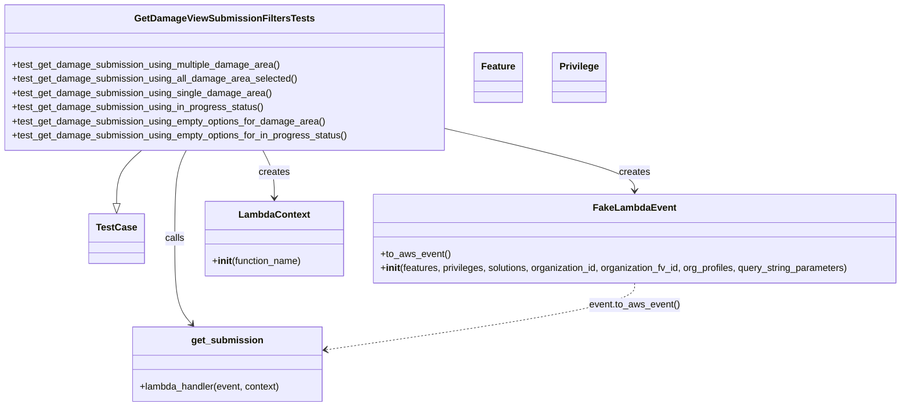
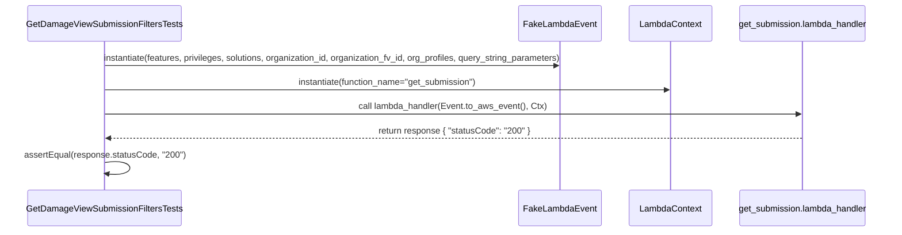

# Diagram: entity_core/entity_service/entity_service_tests/damageview_tests/integration_tests/test_get_damage_submission.py

> Auto-generated by Obscura crawlers

## Diagram 1

### SVG

<svg id="container" width="1527.328125" xmlns="http://www.w3.org/2000/svg" class="classDiagram" height="686" viewBox="0 0 1527.328125 686" role="graphics-document document" aria-roledescription="class"><g><defs><marker id="container_class-aggregationStart" class="marker aggregation class" refX="18" refY="7" markerWidth="190" markerHeight="240" orient="auto"><path d="M 18,7 L9,13 L1,7 L9,1 Z"></path></marker></defs><defs><marker id="container_class-aggregationEnd" class="marker aggregation class" refX="1" refY="7" markerWidth="20" markerHeight="28" orient="auto"><path d="M 18,7 L9,13 L1,7 L9,1 Z"></path></marker></defs><defs><marker id="container_class-extensionStart" class="marker extension class" refX="18" refY="7" markerWidth="190" markerHeight="240" orient="auto"><path d="M 1,7 L18,13 V 1 Z"></path></marker></defs><defs><marker id="container_class-extensionEnd" class="marker extension class" refX="1" refY="7" markerWidth="20" markerHeight="28" orient="auto"><path d="M 1,1 V 13 L18,7 Z"></path></marker></defs><defs><marker id="container_class-compositionStart" class="marker composition class" refX="18" refY="7" markerWidth="190" markerHeight="240" orient="auto"><path d="M 18,7 L9,13 L1,7 L9,1 Z"></path></marker></defs><defs><marker id="container_class-compositionEnd" class="marker composition class" refX="1" refY="7" markerWidth="20" markerHeight="28" orient="auto"><path d="M 18,7 L9,13 L1,7 L9,1 Z"></path></marker></defs><defs><marker id="container_class-dependencyStart" class="marker dependency class" refX="6" refY="7" markerWidth="190" markerHeight="240" orient="auto"><path d="M 5,7 L9,13 L1,7 L9,1 Z"></path></marker></defs><defs><marker id="container_class-dependencyEnd" class="marker dependency class" refX="13" refY="7" markerWidth="20" markerHeight="28" orient="auto"><path d="M 18,7 L9,13 L14,7 L9,1 Z"></path></marker></defs><defs><marker id="container_class-lollipopStart" class="marker lollipop class" refX="13" refY="7" markerWidth="190" markerHeight="240" orient="auto"><circle stroke="black" fill="transparent" cx="7" cy="7" r="6"></circle></marker></defs><defs><marker id="container_class-lollipopEnd" class="marker lollipop class" refX="1" refY="7" markerWidth="190" markerHeight="240" orient="auto"><circle stroke="black" fill="transparent" cx="7" cy="7" r="6"></circle></marker></defs><g class="root"><g class="clusters"></g><g class="edgePaths"><path d="M237.274,254L230.339,260.167C223.404,266.333,209.534,278.667,202.599,293.625C195.664,308.583,195.664,326.167,195.664,334.958L195.664,343.75" id="id_GetDamageViewSubmissionFiltersTests_TestCase_1" class="edge-thickness-normal edge-pattern-solid relation" style=";;;" data-edge="true" data-et="edge" data-id="id_GetDamageViewSubmissionFiltersTests_TestCase_1" data-points="W3sieCI6MjM3LjI3MzcwNjA1NDY4NzUsInkiOjI1NH0seyJ4IjoxOTUuNjY0MDYyNSwieSI6MjkxfSx7IngiOjE5NS42NjQwNjI1LCJ5IjozNjF9XQ==" marker-end="url(#container_class-extensionEnd)"></path><path d="M743.195,215.343L798.152,227.953C853.108,240.562,963.021,265.781,1017.977,283.557C1072.934,301.333,1072.934,311.667,1072.934,316.833L1072.934,322" id="id_GetDamageViewSubmissionFiltersTests_FakeLambdaEvent_2" class="edge-thickness-normal edge-pattern-solid relation" style=";;;" data-edge="true" data-et="edge" data-id="id_GetDamageViewSubmissionFiltersTests_FakeLambdaEvent_2" data-points="W3sieCI6NzQzLjE5NTMxMjUsInkiOjIxNS4zNDMzMTU1MjAwMDM1OX0seyJ4IjoxMDcyLjkzMzU5Mzc1LCJ5IjoyOTF9LHsieCI6MTA3Mi45MzM1OTM3NSwieSI6MzI4fV0=" marker-end="url(#container_class-dependencyEnd)"></path><path d="M440.272,254L443.514,260.167C446.757,266.333,453.242,278.667,456.484,292C459.727,305.333,459.727,319.667,459.727,326.833L459.727,334" id="id_GetDamageViewSubmissionFiltersTests_LambdaContext_3" class="edge-thickness-normal edge-pattern-solid relation" style=";;;" data-edge="true" data-et="edge" data-id="id_GetDamageViewSubmissionFiltersTests_LambdaContext_3" data-points="W3sieCI6NDQwLjI3MTc1MjkyOTY4NzUsInkiOjI1NH0seyJ4Ijo0NTkuNzI2NTYyNSwieSI6MjkxfSx7IngiOjQ1OS43MjY1NjI1LCJ5IjozNDB9XQ==" marker-end="url(#container_class-dependencyEnd)"></path><path d="M310.924,254L307.681,260.167C304.439,266.333,297.954,278.667,294.711,303.5C291.469,328.333,291.469,365.667,291.469,403C291.469,440.333,291.469,477.667,296.674,501.777C301.878,525.888,312.288,536.775,317.493,542.219L322.698,547.663" id="id_GetDamageViewSubmissionFiltersTests_get_submission_4" class="edge-thickness-normal edge-pattern-solid relation" style=";;;" data-edge="true" data-et="edge" data-id="id_GetDamageViewSubmissionFiltersTests_get_submission_4" data-points="W3sieCI6MzEwLjkyMzU1OTU3MDMxMjUsInkiOjI1NH0seyJ4IjoyOTEuNDY4NzUsInkiOjI5MX0seyJ4IjoyOTEuNDY4NzUsInkiOjQwM30seyJ4IjoyOTEuNDY4NzUsInkiOjUxNX0seyJ4IjozMjYuODQ0MjE4NzUsInkiOjU1Mn1d" marker-end="url(#container_class-dependencyEnd)"></path><path d="M1072.934,478L1072.934,484.167C1072.934,490.333,1072.934,502.667,986.409,521.449C899.884,540.231,726.834,565.462,640.31,578.078L553.785,590.694" id="id_FakeLambdaEvent_get_submission_5" class="edge-thickness-normal edge-pattern-dashed relation" style=";;;" data-edge="true" data-et="edge" data-id="id_FakeLambdaEvent_get_submission_5" data-points="W3sieCI6MTA3Mi45MzM1OTM3NSwieSI6NDc4fSx7IngiOjEwNzIuOTMzNTkzNzUsInkiOjUxNX0seyJ4Ijo1NDcuODQ3NjU2MjUsInkiOjU5MS41NTkyNjk2MTY1MjU5fV0=" marker-end="url(#container_class-dependencyEnd)"></path></g><g class="edgeLabels"><g class="edgeLabel"><g class="label" data-id="id_GetDamageViewSubmissionFiltersTests_TestCase_1" transform="translate(0, 0)"><foreignObject width="0" height="0">

</foreignObject></g></g><g class="edgeLabel" transform="translate(1072.93359375, 291)"><g class="label" data-id="id_GetDamageViewSubmissionFiltersTests_FakeLambdaEvent_2" transform="translate(-26.171875, -12)"><foreignObject width="52.34375" height="24">

creates

</foreignObject></g></g><g class="edgeLabel" transform="translate(459.7265625, 291)"><g class="label" data-id="id_GetDamageViewSubmissionFiltersTests_LambdaContext_3" transform="translate(-26.171875, -12)"><foreignObject width="52.34375" height="24">

creates

</foreignObject></g></g><g class="edgeLabel" transform="translate(291.46875, 403)"><g class="label" data-id="id_GetDamageViewSubmissionFiltersTests_get_submission_4" transform="translate(-16.4453125, -12)"><foreignObject width="32.890625" height="24">

calls

</foreignObject></g></g><g class="edgeLabel" transform="translate(1072.93359375, 515)"><g class="label" data-id="id_FakeLambdaEvent_get_submission_5" transform="translate(-76.140625, -12)"><foreignObject width="152.28125" height="24">

event.to_aws_event()

</foreignObject></g></g></g><g class="nodes"><g class="node default" id="classId-GetDamageViewSubmissionFiltersTests-0" transform="translate(375.59765625, 131)"><g class="basic label-container"><path d="M-367.59765625 -123 L367.59765625 -123 L367.59765625 123 L-367.59765625 123" stroke="none" stroke-width="0" fill="#ECECFF" style=""></path><path d="M-367.59765625 -123 C-130.9736960663977 -123, 105.65026411720459 -123, 367.59765625 -123 M-367.59765625 -123 C-117.39898416127284 -123, 132.79968792745433 -123, 367.59765625 -123 M367.59765625 -123 C367.59765625 -60.60742428706925, 367.59765625 1.7851514258614998, 367.59765625 123 M367.59765625 -123 C367.59765625 -26.308540006469585, 367.59765625 70.38291998706083, 367.59765625 123 M367.59765625 123 C182.590604936378 123, -2.4164463772439717 123, -367.59765625 123 M367.59765625 123 C137.24876959859395 123, -93.1001170528121 123, -367.59765625 123 M-367.59765625 123 C-367.59765625 66.34996261838072, -367.59765625 9.699925236761416, -367.59765625 -123 M-367.59765625 123 C-367.59765625 38.884997749755954, -367.59765625 -45.23000450048809, -367.59765625 -123" stroke="#9370DB" stroke-width="1.3" fill="none" stroke-dasharray="0 0" style=""></path></g><g class="annotation-group text" transform="translate(0, -99)"></g><g class="label-group text" transform="translate(-143.0234375, -99)"><g class="label" style="font-weight: bolder" transform="translate(0,-12)"><foreignObject width="286.046875" height="24">

GetDamageViewSubmissionFiltersTests

</foreignObject></g></g><g class="members-group text" transform="translate(-355.59765625, -51)"></g><g class="methods-group text" transform="translate(-355.59765625, -21)"><g class="label" style="" transform="translate(0,-12)"><foreignObject width="453.1875" height="24">

+test_get_damage_submission_using_multiple_damage_area()

</foreignObject></g><g class="label" style="" transform="translate(0,12)"><foreignObject width="479.59375" height="24">

+test_get_damage_submission_using_all_damage_area_selected()

</foreignObject></g><g class="label" style="" transform="translate(0,36)"><foreignObject width="435.375" height="24">

+test_get_damage_submission_using_single_damage_area()

</foreignObject></g><g class="label" style="" transform="translate(0,60)"><foreignObject width="424.703125" height="24">

+test_get_damage_submission_using_in_progress_status()

</foreignObject></g><g class="label" style="" transform="translate(0,84)"><foreignObject width="527.828125" height="24">

+test_get_damage_submission_using_empty_options_for_damage_area()

</foreignObject></g><g class="label" style="" transform="translate(0,108)"><foreignObject width="568.171875" height="24">

+test_get_damage_submission_using_empty_options_for_in_progress_status()

</foreignObject></g></g><g class="divider" style=""><path d="M-367.59765625 -75 C-215.6047766934214 -75, -63.6118971368428 -75, 367.59765625 -75 M-367.59765625 -75 C-153.81946253241904 -75, 59.95873118516192 -75, 367.59765625 -75" stroke="#9370DB" stroke-width="1.3" fill="none" stroke-dasharray="0 0" style=""></path></g><g class="divider" style=""><path d="M-367.59765625 -51 C-97.73082293442309 -51, 172.13601038115382 -51, 367.59765625 -51 M-367.59765625 -51 C-113.76825478729404 -51, 140.06114667541192 -51, 367.59765625 -51" stroke="#9370DB" stroke-width="1.3" fill="none" stroke-dasharray="0 0" style=""></path></g></g><g class="node default" id="classId-TestCase-1" transform="translate(195.6640625, 403)"><g class="basic label-container"><path d="M-44.359375 -42 L44.359375 -42 L44.359375 42 L-44.359375 42" stroke="none" stroke-width="0" fill="#ECECFF" style=""></path><path d="M-44.359375 -42 C-9.238437048233031 -42, 25.882500903533938 -42, 44.359375 -42 M-44.359375 -42 C-17.40739431329998 -42, 9.544586373400037 -42, 44.359375 -42 M44.359375 -42 C44.359375 -18.375552181270145, 44.359375 5.248895637459711, 44.359375 42 M44.359375 -42 C44.359375 -9.00507595649097, 44.359375 23.98984808701806, 44.359375 42 M44.359375 42 C11.154573900001715 42, -22.05022719999657 42, -44.359375 42 M44.359375 42 C13.61237603529441 42, -17.13462292941118 42, -44.359375 42 M-44.359375 42 C-44.359375 23.893317297316806, -44.359375 5.786634594633611, -44.359375 -42 M-44.359375 42 C-44.359375 15.22103799678473, -44.359375 -11.55792400643054, -44.359375 -42" stroke="#9370DB" stroke-width="1.3" fill="none" stroke-dasharray="0 0" style=""></path></g><g class="annotation-group text" transform="translate(0, -18)"></g><g class="label-group text" transform="translate(-32.359375, -18)"><g class="label" style="font-weight: bolder" transform="translate(0,-12)"><foreignObject width="64.71875" height="24">

TestCase

</foreignObject></g></g><g class="members-group text" transform="translate(-32.359375, 30)"></g><g class="methods-group text" transform="translate(-32.359375, 60)"></g><g class="divider" style=""><path d="M-44.359375 6 C-21.349777172789167 6, 1.6598206544216652 6, 44.359375 6 M-44.359375 6 C-12.012298459176634 6, 20.334778081646732 6, 44.359375 6" stroke="#9370DB" stroke-width="1.3" fill="none" stroke-dasharray="0 0" style=""></path></g><g class="divider" style=""><path d="M-44.359375 24 C-21.244881478570676 24, 1.8696120428586482 24, 44.359375 24 M-44.359375 24 C-24.78936500504882 24, -5.219355010097637 24, 44.359375 24" stroke="#9370DB" stroke-width="1.3" fill="none" stroke-dasharray="0 0" style=""></path></g></g><g class="node default" id="classId-FakeLambdaEvent-2" transform="translate(1072.93359375, 403)"><g class="basic label-container"><path d="M-446.39453125 -75 L446.39453125 -75 L446.39453125 75 L-446.39453125 75" stroke="none" stroke-width="0" fill="#ECECFF" style=""></path><path d="M-446.39453125 -75 C-123.6438910126214 -75, 199.1067492247572 -75, 446.39453125 -75 M-446.39453125 -75 C-202.98743013372476 -75, 40.419670982550485 -75, 446.39453125 -75 M446.39453125 -75 C446.39453125 -39.11330178704603, 446.39453125 -3.226603574092053, 446.39453125 75 M446.39453125 -75 C446.39453125 -42.634358671425574, 446.39453125 -10.268717342851147, 446.39453125 75 M446.39453125 75 C132.59756076730378 75, -181.19940971539245 75, -446.39453125 75 M446.39453125 75 C95.49514830782317 75, -255.40423463435366 75, -446.39453125 75 M-446.39453125 75 C-446.39453125 29.449134948421595, -446.39453125 -16.10173010315681, -446.39453125 -75 M-446.39453125 75 C-446.39453125 34.30509919942988, -446.39453125 -6.389801601140235, -446.39453125 -75" stroke="#9370DB" stroke-width="1.3" fill="none" stroke-dasharray="0 0" style=""></path></g><g class="annotation-group text" transform="translate(0, -51)"></g><g class="label-group text" transform="translate(-65.8671875, -51)"><g class="label" style="font-weight: bolder" transform="translate(0,-12)"><foreignObject width="131.734375" height="24">

FakeLambdaEvent

</foreignObject></g></g><g class="members-group text" transform="translate(-434.39453125, -3)"></g><g class="methods-group text" transform="translate(-434.39453125, 27)"><g class="label" style="" transform="translate(0,-12)"><foreignObject width="116.421875" height="24">

+to_aws_event()

</foreignObject></g><g class="label" style="" transform="translate(0,12)"><foreignObject width="802.921875" height="24">

+<strong>init</strong>(features, privileges, solutions, organization_id, organization_fv_id, org_profiles, query_string_parameters)

</foreignObject></g></g><g class="divider" style=""><path d="M-446.39453125 -27 C-216.67205260041132 -27, 13.05042604917736 -27, 446.39453125 -27 M-446.39453125 -27 C-196.1742546167573 -27, 54.04602201648538 -27, 446.39453125 -27" stroke="#9370DB" stroke-width="1.3" fill="none" stroke-dasharray="0 0" style=""></path></g><g class="divider" style=""><path d="M-446.39453125 -3 C-204.5614135863429 -3, 37.27170407731421 -3, 446.39453125 -3 M-446.39453125 -3 C-149.14139206039687 -3, 148.11174712920626 -3, 446.39453125 -3" stroke="#9370DB" stroke-width="1.3" fill="none" stroke-dasharray="0 0" style=""></path></g></g><g class="node default" id="classId-LambdaContext-3" transform="translate(459.7265625, 403)"><g class="basic label-container"><path d="M-116.8125 -63 L116.8125 -63 L116.8125 63 L-116.8125 63" stroke="none" stroke-width="0" fill="#ECECFF" style=""></path><path d="M-116.8125 -63 C-29.071921826876547 -63, 58.668656346246905 -63, 116.8125 -63 M-116.8125 -63 C-52.580300226890685 -63, 11.65189954621863 -63, 116.8125 -63 M116.8125 -63 C116.8125 -21.484862639353892, 116.8125 20.030274721292216, 116.8125 63 M116.8125 -63 C116.8125 -27.641271844783645, 116.8125 7.717456310432709, 116.8125 63 M116.8125 63 C65.40894613312324 63, 14.00539226624646 63, -116.8125 63 M116.8125 63 C52.01715763721927 63, -12.77818472556146 63, -116.8125 63 M-116.8125 63 C-116.8125 30.975913498026678, -116.8125 -1.0481730039466441, -116.8125 -63 M-116.8125 63 C-116.8125 35.804931318910405, -116.8125 8.609862637820811, -116.8125 -63" stroke="#9370DB" stroke-width="1.3" fill="none" stroke-dasharray="0 0" style=""></path></g><g class="annotation-group text" transform="translate(0, -39)"></g><g class="label-group text" transform="translate(-57.296875, -39)"><g class="label" style="font-weight: bolder" transform="translate(0,-12)"><foreignObject width="114.59375" height="24">

LambdaContext

</foreignObject></g></g><g class="members-group text" transform="translate(-104.8125, 9)"></g><g class="methods-group text" transform="translate(-104.8125, 39)"><g class="label" style="" transform="translate(0,-12)"><foreignObject width="152.328125" height="24">

+<strong>init</strong>(function_name)

</foreignObject></g></g><g class="divider" style=""><path d="M-116.8125 -15 C-28.281597635378304 -15, 60.24930472924339 -15, 116.8125 -15 M-116.8125 -15 C-61.921559542427715 -15, -7.030619084855431 -15, 116.8125 -15" stroke="#9370DB" stroke-width="1.3" fill="none" stroke-dasharray="0 0" style=""></path></g><g class="divider" style=""><path d="M-116.8125 9 C-54.24558520167391 9, 8.321329596652177 9, 116.8125 9 M-116.8125 9 C-36.88885213632625 9, 43.0347957273475 9, 116.8125 9" stroke="#9370DB" stroke-width="1.3" fill="none" stroke-dasharray="0 0" style=""></path></g></g><g class="node default" id="classId-get_submission-4" transform="translate(387.078125, 615)"><g class="basic label-container"><path d="M-160.76953125 -63 L160.76953125 -63 L160.76953125 63 L-160.76953125 63" stroke="none" stroke-width="0" fill="#ECECFF" style=""></path><path d="M-160.76953125 -63 C-45.45581617165223 -63, 69.85789890669554 -63, 160.76953125 -63 M-160.76953125 -63 C-54.0908430107543 -63, 52.5878452284914 -63, 160.76953125 -63 M160.76953125 -63 C160.76953125 -27.436159811000735, 160.76953125 8.12768037799853, 160.76953125 63 M160.76953125 -63 C160.76953125 -18.575600698002063, 160.76953125 25.848798603995874, 160.76953125 63 M160.76953125 63 C71.63694820321538 63, -17.495634843569235 63, -160.76953125 63 M160.76953125 63 C66.7033424948285 63, -27.36284626034299 63, -160.76953125 63 M-160.76953125 63 C-160.76953125 20.892492180611313, -160.76953125 -21.215015638777373, -160.76953125 -63 M-160.76953125 63 C-160.76953125 21.448128499025536, -160.76953125 -20.103743001948928, -160.76953125 -63" stroke="#9370DB" stroke-width="1.3" fill="none" stroke-dasharray="0 0" style=""></path></g><g class="annotation-group text" transform="translate(0, -39)"></g><g class="label-group text" transform="translate(-57.3515625, -39)"><g class="label" style="font-weight: bolder" transform="translate(0,-12)"><foreignObject width="114.703125" height="24">

get_submission

</foreignObject></g></g><g class="members-group text" transform="translate(-148.76953125, 9)"></g><g class="methods-group text" transform="translate(-148.76953125, 39)"><g class="label" style="" transform="translate(0,-12)"><foreignObject width="240.1875" height="24">

+lambda_handler(event, context)

</foreignObject></g></g><g class="divider" style=""><path d="M-160.76953125 -15 C-44.73353521474121 -15, 71.30246082051758 -15, 160.76953125 -15 M-160.76953125 -15 C-67.18734568441398 -15, 26.394839881172032 -15, 160.76953125 -15" stroke="#9370DB" stroke-width="1.3" fill="none" stroke-dasharray="0 0" style=""></path></g><g class="divider" style=""><path d="M-160.76953125 9 C-76.11645141627054 9, 8.536628417458928 9, 160.76953125 9 M-160.76953125 9 C-75.97587664765938 9, 8.817777954681247 9, 160.76953125 9" stroke="#9370DB" stroke-width="1.3" fill="none" stroke-dasharray="0 0" style=""></path></g></g><g class="node default" id="classId-Feature-5" transform="translate(832.5859375, 131)"><g class="basic label-container"><path d="M-39.390625 -42 L39.390625 -42 L39.390625 42 L-39.390625 42" stroke="none" stroke-width="0" fill="#ECECFF" style=""></path><path d="M-39.390625 -42 C-8.436278199697867 -42, 22.518068600604266 -42, 39.390625 -42 M-39.390625 -42 C-7.888604230466441 -42, 23.613416539067117 -42, 39.390625 -42 M39.390625 -42 C39.390625 -20.335950918927978, 39.390625 1.3280981621440446, 39.390625 42 M39.390625 -42 C39.390625 -11.20817306669202, 39.390625 19.58365386661596, 39.390625 42 M39.390625 42 C12.717411934437735 42, -13.955801131124531 42, -39.390625 42 M39.390625 42 C16.180361985999497 42, -7.029901028001007 42, -39.390625 42 M-39.390625 42 C-39.390625 15.353769359140866, -39.390625 -11.292461281718268, -39.390625 -42 M-39.390625 42 C-39.390625 21.490383585775884, -39.390625 0.9807671715517685, -39.390625 -42" stroke="#9370DB" stroke-width="1.3" fill="none" stroke-dasharray="0 0" style=""></path></g><g class="annotation-group text" transform="translate(0, -18)"></g><g class="label-group text" transform="translate(-27.390625, -18)"><g class="label" style="font-weight: bolder" transform="translate(0,-12)"><foreignObject width="54.78125" height="24">

Feature

</foreignObject></g></g><g class="members-group text" transform="translate(-27.390625, 30)"></g><g class="methods-group text" transform="translate(-27.390625, 60)"></g><g class="divider" style=""><path d="M-39.390625 6 C-7.914581139178804 6, 23.561462721642393 6, 39.390625 6 M-39.390625 6 C-22.1755925040994 6, -4.960560008198797 6, 39.390625 6" stroke="#9370DB" stroke-width="1.3" fill="none" stroke-dasharray="0 0" style=""></path></g><g class="divider" style=""><path d="M-39.390625 24 C-17.508394498335235 24, 4.373836003329529 24, 39.390625 24 M-39.390625 24 C-11.038883462167394 24, 17.31285807566521 24, 39.390625 24" stroke="#9370DB" stroke-width="1.3" fill="none" stroke-dasharray="0 0" style=""></path></g></g><g class="node default" id="classId-Privilege-6" transform="translate(965.84375, 131)"><g class="basic label-container"><path d="M-43.8671875 -42 L43.8671875 -42 L43.8671875 42 L-43.8671875 42" stroke="none" stroke-width="0" fill="#ECECFF" style=""></path><path d="M-43.8671875 -42 C-25.2090268802582 -42, -6.5508662605164005 -42, 43.8671875 -42 M-43.8671875 -42 C-21.95951159160926 -42, -0.0518356832185205 -42, 43.8671875 -42 M43.8671875 -42 C43.8671875 -10.185186365513324, 43.8671875 21.62962726897335, 43.8671875 42 M43.8671875 -42 C43.8671875 -24.776549724992556, 43.8671875 -7.553099449985112, 43.8671875 42 M43.8671875 42 C22.58649714643457 42, 1.3058067928691415 42, -43.8671875 42 M43.8671875 42 C24.071139102491443 42, 4.275090704982887 42, -43.8671875 42 M-43.8671875 42 C-43.8671875 15.87257110666257, -43.8671875 -10.254857786674862, -43.8671875 -42 M-43.8671875 42 C-43.8671875 17.08931188633773, -43.8671875 -7.821376227324542, -43.8671875 -42" stroke="#9370DB" stroke-width="1.3" fill="none" stroke-dasharray="0 0" style=""></path></g><g class="annotation-group text" transform="translate(0, -18)"></g><g class="label-group text" transform="translate(-31.8671875, -18)"><g class="label" style="font-weight: bolder" transform="translate(0,-12)"><foreignObject width="63.734375" height="24">

Privilege

</foreignObject></g></g><g class="members-group text" transform="translate(-31.8671875, 30)"></g><g class="methods-group text" transform="translate(-31.8671875, 60)"></g><g class="divider" style=""><path d="M-43.8671875 6 C-9.56069088522969 6, 24.74580572954062 6, 43.8671875 6 M-43.8671875 6 C-22.551957088360496 6, -1.2367266767209912 6, 43.8671875 6" stroke="#9370DB" stroke-width="1.3" fill="none" stroke-dasharray="0 0" style=""></path></g><g class="divider" style=""><path d="M-43.8671875 24 C-9.372108104848301 24, 25.122971290303397 24, 43.8671875 24 M-43.8671875 24 C-22.955956234938025 24, -2.04472496987605 24, 43.8671875 24" stroke="#9370DB" stroke-width="1.3" fill="none" stroke-dasharray="0 0" style=""></path></g></g></g></g></g></svg>

## Diagram 2

### SVG

<svg id="container" width="1753" xmlns="http://www.w3.org/2000/svg" height="441" viewBox="-50 -10 1753 441" role="graphics-document document" aria-roledescription="sequence"><g><rect x="1395" y="355" fill="#eaeaea" stroke="#666" width="258" height="65" name="Handler" rx="3" ry="3" class="actor actor-bottom"></rect><text x="1524" y="387.5" dominant-baseline="central" alignment-baseline="central" class="actor actor-box" style="text-anchor: middle; font-size: 16px; font-weight: 400;"><tspan x="1524" dy="0">get_submission.lambda_handler</tspan></text></g><g><rect x="1195" y="355" fill="#eaeaea" stroke="#666" width="150" height="65" name="Ctx" rx="3" ry="3" class="actor actor-bottom"></rect><text x="1270" y="387.5" dominant-baseline="central" alignment-baseline="central" class="actor actor-box" style="text-anchor: middle; font-size: 16px; font-weight: 400;"><tspan x="1270" dy="0">LambdaContext</tspan></text></g><g><rect x="994" y="355" fill="#eaeaea" stroke="#666" width="151" height="65" name="Event" rx="3" ry="3" class="actor actor-bottom"></rect><text x="1069.5" y="387.5" dominant-baseline="central" alignment-baseline="central" class="actor actor-box" style="text-anchor: middle; font-size: 16px; font-weight: 400;"><tspan x="1069.5" dy="0">FakeLambdaEvent</tspan></text></g><g><rect x="0" y="355" fill="#eaeaea" stroke="#666" width="301" height="65" name="Test" rx="3" ry="3" class="actor actor-bottom"></rect><text x="150.5" y="387.5" dominant-baseline="central" alignment-baseline="central" class="actor actor-box" style="text-anchor: middle; font-size: 16px; font-weight: 400;"><tspan x="150.5" dy="0">GetDamageViewSubmissionFiltersTests</tspan></text></g><g><line id="actor3" x1="1524" y1="65" x2="1524" y2="355" class="actor-line 200" stroke-width="0.5px" stroke="#999" name="Handler"></line><g id="root-3"><rect x="1395" y="0" fill="#eaeaea" stroke="#666" width="258" height="65" name="Handler" rx="3" ry="3" class="actor actor-top"></rect><text x="1524" y="32.5" dominant-baseline="central" alignment-baseline="central" class="actor actor-box" style="text-anchor: middle; font-size: 16px; font-weight: 400;"><tspan x="1524" dy="0">get_submission.lambda_handler</tspan></text></g></g><g><line id="actor2" x1="1270" y1="65" x2="1270" y2="355" class="actor-line 200" stroke-width="0.5px" stroke="#999" name="Ctx"></line><g id="root-2"><rect x="1195" y="0" fill="#eaeaea" stroke="#666" width="150" height="65" name="Ctx" rx="3" ry="3" class="actor actor-top"></rect><text x="1270" y="32.5" dominant-baseline="central" alignment-baseline="central" class="actor actor-box" style="text-anchor: middle; font-size: 16px; font-weight: 400;"><tspan x="1270" dy="0">LambdaContext</tspan></text></g></g><g><line id="actor1" x1="1069.5" y1="65" x2="1069.5" y2="355" class="actor-line 200" stroke-width="0.5px" stroke="#999" name="Event"></line><g id="root-1"><rect x="994" y="0" fill="#eaeaea" stroke="#666" width="151" height="65" name="Event" rx="3" ry="3" class="actor actor-top"></rect><text x="1069.5" y="32.5" dominant-baseline="central" alignment-baseline="central" class="actor actor-box" style="text-anchor: middle; font-size: 16px; font-weight: 400;"><tspan x="1069.5" dy="0">FakeLambdaEvent</tspan></text></g></g><g><line id="actor0" x1="150.5" y1="65" x2="150.5" y2="355" class="actor-line 200" stroke-width="0.5px" stroke="#999" name="Test"></line><g id="root-0"><rect x="0" y="0" fill="#eaeaea" stroke="#666" width="301" height="65" name="Test" rx="3" ry="3" class="actor actor-top"></rect><text x="150.5" y="32.5" dominant-baseline="central" alignment-baseline="central" class="actor actor-box" style="text-anchor: middle; font-size: 16px; font-weight: 400;"><tspan x="150.5" dy="0">GetDamageViewSubmissionFiltersTests</tspan></text></g></g><g></g><defs><symbol id="computer" width="24" height="24"><path transform="scale(.5)" d="M2 2v13h20v-13h-20zm18 11h-16v-9h16v9zm-10.228 6l.466-1h3.524l.467 1h-4.457zm14.228 3h-24l2-6h2.104l-1.33 4h18.45l-1.297-4h2.073l2 6zm-5-10h-14v-7h14v7z"></path></symbol></defs><defs><symbol id="database" fill-rule="evenodd" clip-rule="evenodd"><path transform="scale(.5)" d="M12.258.001l.256.004.255.005.253.008.251.01.249.012.247.015.246.016.242.019.241.02.239.023.236.024.233.027.231.028.229.031.225.032.223.034.22.036.217.038.214.04.211.041.208.043.205.045.201.046.198.048.194.05.191.051.187.053.183.054.18.056.175.057.172.059.168.06.163.061.16.063.155.064.15.066.074.033.073.033.071.034.07.034.069.035.068.035.067.035.066.035.064.036.064.036.062.036.06.036.06.037.058.037.058.037.055.038.055.038.053.038.052.038.051.039.05.039.048.039.047.039.045.04.044.04.043.04.041.04.04.041.039.041.037.041.036.041.034.041.033.042.032.042.03.042.029.042.027.042.026.043.024.043.023.043.021.043.02.043.018.044.017.043.015.044.013.044.012.044.011.045.009.044.007.045.006.045.004.045.002.045.001.045v17l-.001.045-.002.045-.004.045-.006.045-.007.045-.009.044-.011.045-.012.044-.013.044-.015.044-.017.043-.018.044-.02.043-.021.043-.023.043-.024.043-.026.043-.027.042-.029.042-.03.042-.032.042-.033.042-.034.041-.036.041-.037.041-.039.041-.04.041-.041.04-.043.04-.044.04-.045.04-.047.039-.048.039-.05.039-.051.039-.052.038-.053.038-.055.038-.055.038-.058.037-.058.037-.06.037-.06.036-.062.036-.064.036-.064.036-.066.035-.067.035-.068.035-.069.035-.07.034-.071.034-.073.033-.074.033-.15.066-.155.064-.16.063-.163.061-.168.06-.172.059-.175.057-.18.056-.183.054-.187.053-.191.051-.194.05-.198.048-.201.046-.205.045-.208.043-.211.041-.214.04-.217.038-.22.036-.223.034-.225.032-.229.031-.231.028-.233.027-.236.024-.239.023-.241.02-.242.019-.246.016-.247.015-.249.012-.251.01-.253.008-.255.005-.256.004-.258.001-.258-.001-.256-.004-.255-.005-.253-.008-.251-.01-.249-.012-.247-.015-.245-.016-.243-.019-.241-.02-.238-.023-.236-.024-.234-.027-.231-.028-.228-.031-.226-.032-.223-.034-.22-.036-.217-.038-.214-.04-.211-.041-.208-.043-.204-.045-.201-.046-.198-.048-.195-.05-.19-.051-.187-.053-.184-.054-.179-.056-.176-.057-.172-.059-.167-.06-.164-.061-.159-.063-.155-.064-.151-.066-.074-.033-.072-.033-.072-.034-.07-.034-.069-.035-.068-.035-.067-.035-.066-.035-.064-.036-.063-.036-.062-.036-.061-.036-.06-.037-.058-.037-.057-.037-.056-.038-.055-.038-.053-.038-.052-.038-.051-.039-.049-.039-.049-.039-.046-.039-.046-.04-.044-.04-.043-.04-.041-.04-.04-.041-.039-.041-.037-.041-.036-.041-.034-.041-.033-.042-.032-.042-.03-.042-.029-.042-.027-.042-.026-.043-.024-.043-.023-.043-.021-.043-.02-.043-.018-.044-.017-.043-.015-.044-.013-.044-.012-.044-.011-.045-.009-.044-.007-.045-.006-.045-.004-.045-.002-.045-.001-.045v-17l.001-.045.002-.045.004-.045.006-.045.007-.045.009-.044.011-.045.012-.044.013-.044.015-.044.017-.043.018-.044.02-.043.021-.043.023-.043.024-.043.026-.043.027-.042.029-.042.03-.042.032-.042.033-.042.034-.041.036-.041.037-.041.039-.041.04-.041.041-.04.043-.04.044-.04.046-.04.046-.039.049-.039.049-.039.051-.039.052-.038.053-.038.055-.038.056-.038.057-.037.058-.037.06-.037.061-.036.062-.036.063-.036.064-.036.066-.035.067-.035.068-.035.069-.035.07-.034.072-.034.072-.033.074-.033.151-.066.155-.064.159-.063.164-.061.167-.06.172-.059.176-.057.179-.056.184-.054.187-.053.19-.051.195-.05.198-.048.201-.046.204-.045.208-.043.211-.041.214-.04.217-.038.22-.036.223-.034.226-.032.228-.031.231-.028.234-.027.236-.024.238-.023.241-.02.243-.019.245-.016.247-.015.249-.012.251-.01.253-.008.255-.005.256-.004.258-.001.258.001zm-9.258 20.499v.01l.001.021.003.021.004.022.005.021.006.022.007.022.009.023.01.022.011.023.012.023.013.023.015.023.016.024.017.023.018.024.019.024.021.024.022.025.023.024.024.025.052.049.056.05.061.051.066.051.07.051.075.051.079.052.084.052.088.052.092.052.097.052.102.051.105.052.11.052.114.051.119.051.123.051.127.05.131.05.135.05.139.048.144.049.147.047.152.047.155.047.16.045.163.045.167.043.171.043.176.041.178.041.183.039.187.039.19.037.194.035.197.035.202.033.204.031.209.03.212.029.216.027.219.025.222.024.226.021.23.02.233.018.236.016.24.015.243.012.246.01.249.008.253.005.256.004.259.001.26-.001.257-.004.254-.005.25-.008.247-.011.244-.012.241-.014.237-.016.233-.018.231-.021.226-.021.224-.024.22-.026.216-.027.212-.028.21-.031.205-.031.202-.034.198-.034.194-.036.191-.037.187-.039.183-.04.179-.04.175-.042.172-.043.168-.044.163-.045.16-.046.155-.046.152-.047.148-.048.143-.049.139-.049.136-.05.131-.05.126-.05.123-.051.118-.052.114-.051.11-.052.106-.052.101-.052.096-.052.092-.052.088-.053.083-.051.079-.052.074-.052.07-.051.065-.051.06-.051.056-.05.051-.05.023-.024.023-.025.021-.024.02-.024.019-.024.018-.024.017-.024.015-.023.014-.024.013-.023.012-.023.01-.023.01-.022.008-.022.006-.022.006-.022.004-.022.004-.021.001-.021.001-.021v-4.127l-.077.055-.08.053-.083.054-.085.053-.087.052-.09.052-.093.051-.095.05-.097.05-.1.049-.102.049-.105.048-.106.047-.109.047-.111.046-.114.045-.115.045-.118.044-.12.043-.122.042-.124.042-.126.041-.128.04-.13.04-.132.038-.134.038-.135.037-.138.037-.139.035-.142.035-.143.034-.144.033-.147.032-.148.031-.15.03-.151.03-.153.029-.154.027-.156.027-.158.026-.159.025-.161.024-.162.023-.163.022-.165.021-.166.02-.167.019-.169.018-.169.017-.171.016-.173.015-.173.014-.175.013-.175.012-.177.011-.178.01-.179.008-.179.008-.181.006-.182.005-.182.004-.184.003-.184.002h-.37l-.184-.002-.184-.003-.182-.004-.182-.005-.181-.006-.179-.008-.179-.008-.178-.01-.176-.011-.176-.012-.175-.013-.173-.014-.172-.015-.171-.016-.17-.017-.169-.018-.167-.019-.166-.02-.165-.021-.163-.022-.162-.023-.161-.024-.159-.025-.157-.026-.156-.027-.155-.027-.153-.029-.151-.03-.15-.03-.148-.031-.146-.032-.145-.033-.143-.034-.141-.035-.14-.035-.137-.037-.136-.037-.134-.038-.132-.038-.13-.04-.128-.04-.126-.041-.124-.042-.122-.042-.12-.044-.117-.043-.116-.045-.113-.045-.112-.046-.109-.047-.106-.047-.105-.048-.102-.049-.1-.049-.097-.05-.095-.05-.093-.052-.09-.051-.087-.052-.085-.053-.083-.054-.08-.054-.077-.054v4.127zm0-5.654v.011l.001.021.003.021.004.021.005.022.006.022.007.022.009.022.01.022.011.023.012.023.013.023.015.024.016.023.017.024.018.024.019.024.021.024.022.024.023.025.024.024.052.05.056.05.061.05.066.051.07.051.075.052.079.051.084.052.088.052.092.052.097.052.102.052.105.052.11.051.114.051.119.052.123.05.127.051.131.05.135.049.139.049.144.048.147.048.152.047.155.046.16.045.163.045.167.044.171.042.176.042.178.04.183.04.187.038.19.037.194.036.197.034.202.033.204.032.209.03.212.028.216.027.219.025.222.024.226.022.23.02.233.018.236.016.24.014.243.012.246.01.249.008.253.006.256.003.259.001.26-.001.257-.003.254-.006.25-.008.247-.01.244-.012.241-.015.237-.016.233-.018.231-.02.226-.022.224-.024.22-.025.216-.027.212-.029.21-.03.205-.032.202-.033.198-.035.194-.036.191-.037.187-.039.183-.039.179-.041.175-.042.172-.043.168-.044.163-.045.16-.045.155-.047.152-.047.148-.048.143-.048.139-.05.136-.049.131-.05.126-.051.123-.051.118-.051.114-.052.11-.052.106-.052.101-.052.096-.052.092-.052.088-.052.083-.052.079-.052.074-.051.07-.052.065-.051.06-.05.056-.051.051-.049.023-.025.023-.024.021-.025.02-.024.019-.024.018-.024.017-.024.015-.023.014-.023.013-.024.012-.022.01-.023.01-.023.008-.022.006-.022.006-.022.004-.021.004-.022.001-.021.001-.021v-4.139l-.077.054-.08.054-.083.054-.085.052-.087.053-.09.051-.093.051-.095.051-.097.05-.1.049-.102.049-.105.048-.106.047-.109.047-.111.046-.114.045-.115.044-.118.044-.12.044-.122.042-.124.042-.126.041-.128.04-.13.039-.132.039-.134.038-.135.037-.138.036-.139.036-.142.035-.143.033-.144.033-.147.033-.148.031-.15.03-.151.03-.153.028-.154.028-.156.027-.158.026-.159.025-.161.024-.162.023-.163.022-.165.021-.166.02-.167.019-.169.018-.169.017-.171.016-.173.015-.173.014-.175.013-.175.012-.177.011-.178.009-.179.009-.179.007-.181.007-.182.005-.182.004-.184.003-.184.002h-.37l-.184-.002-.184-.003-.182-.004-.182-.005-.181-.007-.179-.007-.179-.009-.178-.009-.176-.011-.176-.012-.175-.013-.173-.014-.172-.015-.171-.016-.17-.017-.169-.018-.167-.019-.166-.02-.165-.021-.163-.022-.162-.023-.161-.024-.159-.025-.157-.026-.156-.027-.155-.028-.153-.028-.151-.03-.15-.03-.148-.031-.146-.033-.145-.033-.143-.033-.141-.035-.14-.036-.137-.036-.136-.037-.134-.038-.132-.039-.13-.039-.128-.04-.126-.041-.124-.042-.122-.043-.12-.043-.117-.044-.116-.044-.113-.046-.112-.046-.109-.046-.106-.047-.105-.048-.102-.049-.1-.049-.097-.05-.095-.051-.093-.051-.09-.051-.087-.053-.085-.052-.083-.054-.08-.054-.077-.054v4.139zm0-5.666v.011l.001.02.003.022.004.021.005.022.006.021.007.022.009.023.01.022.011.023.012.023.013.023.015.023.016.024.017.024.018.023.019.024.021.025.022.024.023.024.024.025.052.05.056.05.061.05.066.051.07.051.075.052.079.051.084.052.088.052.092.052.097.052.102.052.105.051.11.052.114.051.119.051.123.051.127.05.131.05.135.05.139.049.144.048.147.048.152.047.155.046.16.045.163.045.167.043.171.043.176.042.178.04.183.04.187.038.19.037.194.036.197.034.202.033.204.032.209.03.212.028.216.027.219.025.222.024.226.021.23.02.233.018.236.017.24.014.243.012.246.01.249.008.253.006.256.003.259.001.26-.001.257-.003.254-.006.25-.008.247-.01.244-.013.241-.014.237-.016.233-.018.231-.02.226-.022.224-.024.22-.025.216-.027.212-.029.21-.03.205-.032.202-.033.198-.035.194-.036.191-.037.187-.039.183-.039.179-.041.175-.042.172-.043.168-.044.163-.045.16-.045.155-.047.152-.047.148-.048.143-.049.139-.049.136-.049.131-.051.126-.05.123-.051.118-.052.114-.051.11-.052.106-.052.101-.052.096-.052.092-.052.088-.052.083-.052.079-.052.074-.052.07-.051.065-.051.06-.051.056-.05.051-.049.023-.025.023-.025.021-.024.02-.024.019-.024.018-.024.017-.024.015-.023.014-.024.013-.023.012-.023.01-.022.01-.023.008-.022.006-.022.006-.022.004-.022.004-.021.001-.021.001-.021v-4.153l-.077.054-.08.054-.083.053-.085.053-.087.053-.09.051-.093.051-.095.051-.097.05-.1.049-.102.048-.105.048-.106.048-.109.046-.111.046-.114.046-.115.044-.118.044-.12.043-.122.043-.124.042-.126.041-.128.04-.13.039-.132.039-.134.038-.135.037-.138.036-.139.036-.142.034-.143.034-.144.033-.147.032-.148.032-.15.03-.151.03-.153.028-.154.028-.156.027-.158.026-.159.024-.161.024-.162.023-.163.023-.165.021-.166.02-.167.019-.169.018-.169.017-.171.016-.173.015-.173.014-.175.013-.175.012-.177.01-.178.01-.179.009-.179.007-.181.006-.182.006-.182.004-.184.003-.184.001-.185.001-.185-.001-.184-.001-.184-.003-.182-.004-.182-.006-.181-.006-.179-.007-.179-.009-.178-.01-.176-.01-.176-.012-.175-.013-.173-.014-.172-.015-.171-.016-.17-.017-.169-.018-.167-.019-.166-.02-.165-.021-.163-.023-.162-.023-.161-.024-.159-.024-.157-.026-.156-.027-.155-.028-.153-.028-.151-.03-.15-.03-.148-.032-.146-.032-.145-.033-.143-.034-.141-.034-.14-.036-.137-.036-.136-.037-.134-.038-.132-.039-.13-.039-.128-.041-.126-.041-.124-.041-.122-.043-.12-.043-.117-.044-.116-.044-.113-.046-.112-.046-.109-.046-.106-.048-.105-.048-.102-.048-.1-.05-.097-.049-.095-.051-.093-.051-.09-.052-.087-.052-.085-.053-.083-.053-.08-.054-.077-.054v4.153zm8.74-8.179l-.257.004-.254.005-.25.008-.247.011-.244.012-.241.014-.237.016-.233.018-.231.021-.226.022-.224.023-.22.026-.216.027-.212.028-.21.031-.205.032-.202.033-.198.034-.194.036-.191.038-.187.038-.183.04-.179.041-.175.042-.172.043-.168.043-.163.045-.16.046-.155.046-.152.048-.148.048-.143.048-.139.049-.136.05-.131.05-.126.051-.123.051-.118.051-.114.052-.11.052-.106.052-.101.052-.096.052-.092.052-.088.052-.083.052-.079.052-.074.051-.07.052-.065.051-.06.05-.056.05-.051.05-.023.025-.023.024-.021.024-.02.025-.019.024-.018.024-.017.023-.015.024-.014.023-.013.023-.012.023-.01.023-.01.022-.008.022-.006.023-.006.021-.004.022-.004.021-.001.021-.001.021.001.021.001.021.004.021.004.022.006.021.006.023.008.022.01.022.01.023.012.023.013.023.014.023.015.024.017.023.018.024.019.024.02.025.021.024.023.024.023.025.051.05.056.05.06.05.065.051.07.052.074.051.079.052.083.052.088.052.092.052.096.052.101.052.106.052.11.052.114.052.118.051.123.051.126.051.131.05.136.05.139.049.143.048.148.048.152.048.155.046.16.046.163.045.168.043.172.043.175.042.179.041.183.04.187.038.191.038.194.036.198.034.202.033.205.032.21.031.212.028.216.027.22.026.224.023.226.022.231.021.233.018.237.016.241.014.244.012.247.011.25.008.254.005.257.004.26.001.26-.001.257-.004.254-.005.25-.008.247-.011.244-.012.241-.014.237-.016.233-.018.231-.021.226-.022.224-.023.22-.026.216-.027.212-.028.21-.031.205-.032.202-.033.198-.034.194-.036.191-.038.187-.038.183-.04.179-.041.175-.042.172-.043.168-.043.163-.045.16-.046.155-.046.152-.048.148-.048.143-.048.139-.049.136-.05.131-.05.126-.051.123-.051.118-.051.114-.052.11-.052.106-.052.101-.052.096-.052.092-.052.088-.052.083-.052.079-.052.074-.051.07-.052.065-.051.06-.05.056-.05.051-.05.023-.025.023-.024.021-.024.02-.025.019-.024.018-.024.017-.023.015-.024.014-.023.013-.023.012-.023.01-.023.01-.022.008-.022.006-.023.006-.021.004-.022.004-.021.001-.021.001-.021-.001-.021-.001-.021-.004-.021-.004-.022-.006-.021-.006-.023-.008-.022-.01-.022-.01-.023-.012-.023-.013-.023-.014-.023-.015-.024-.017-.023-.018-.024-.019-.024-.02-.025-.021-.024-.023-.024-.023-.025-.051-.05-.056-.05-.06-.05-.065-.051-.07-.052-.074-.051-.079-.052-.083-.052-.088-.052-.092-.052-.096-.052-.101-.052-.106-.052-.11-.052-.114-.052-.118-.051-.123-.051-.126-.051-.131-.05-.136-.05-.139-.049-.143-.048-.148-.048-.152-.048-.155-.046-.16-.046-.163-.045-.168-.043-.172-.043-.175-.042-.179-.041-.183-.04-.187-.038-.191-.038-.194-.036-.198-.034-.202-.033-.205-.032-.21-.031-.212-.028-.216-.027-.22-.026-.224-.023-.226-.022-.231-.021-.233-.018-.237-.016-.241-.014-.244-.012-.247-.011-.25-.008-.254-.005-.257-.004-.26-.001-.26.001z"></path></symbol></defs><defs><symbol id="clock" width="24" height="24"><path transform="scale(.5)" d="M12 2c5.514 0 10 4.486 10 10s-4.486 10-10 10-10-4.486-10-10 4.486-10 10-10zm0-2c-6.627 0-12 5.373-12 12s5.373 12 12 12 12-5.373 12-12-5.373-12-12-12zm5.848 12.459c.202.038.202.333.001.372-1.907.361-6.045 1.111-6.547 1.111-.719 0-1.301-.582-1.301-1.301 0-.512.77-5.447 1.125-7.445.034-.192.312-.181.343.014l.985 6.238 5.394 1.011z"></path></symbol></defs><defs><marker id="arrowhead" refX="7.9" refY="5" markerUnits="userSpaceOnUse" markerWidth="12" markerHeight="12" orient="auto-start-reverse"><path d="M -1 0 L 10 5 L 0 10 z"></path></marker></defs><defs><marker id="crosshead" markerWidth="15" markerHeight="8" orient="auto" refX="4" refY="4.5"><path fill="none" stroke="#000000" stroke-width="1pt" d="M 1,2 L 6,7 M 6,2 L 1,7" style="stroke-dasharray: 0, 0;"></path></marker></defs><defs><marker id="filled-head" refX="15.5" refY="7" markerWidth="20" markerHeight="28" orient="auto"><path d="M 18,7 L9,13 L14,7 L9,1 Z"></path></marker></defs><defs><marker id="sequencenumber" refX="15" refY="15" markerWidth="60" markerHeight="40" orient="auto"><circle cx="15" cy="15" r="6"></circle></marker></defs><text x="609" y="80" text-anchor="middle" dominant-baseline="middle" alignment-baseline="middle" class="messageText" dy="1em" style="font-size: 16px; font-weight: 400;">instantiate(features, privileges, solutions, organization_id, organization_fv_id, org_profiles, query_string_parameters)</text><line x1="151.5" y1="113" x2="1065.5" y2="113" class="messageLine0" stroke-width="2" stroke="none" marker-end="url(#arrowhead)" style="fill: none;"></line><text x="709" y="128" text-anchor="middle" dominant-baseline="middle" alignment-baseline="middle" class="messageText" dy="1em" style="font-size: 16px; font-weight: 400;">instantiate(function_name="get_submission")</text><line x1="151.5" y1="161" x2="1266" y2="161" class="messageLine0" stroke-width="2" stroke="none" marker-end="url(#arrowhead)" style="fill: none;"></line><text x="836" y="176" text-anchor="middle" dominant-baseline="middle" alignment-baseline="middle" class="messageText" dy="1em" style="font-size: 16px; font-weight: 400;">call lambda_handler(Event.to_aws_event(), Ctx)</text><line x1="151.5" y1="209" x2="1520" y2="209" class="messageLine0" stroke-width="2" stroke="none" marker-end="url(#arrowhead)" style="fill: none;"></line><text x="839" y="224" text-anchor="middle" dominant-baseline="middle" alignment-baseline="middle" class="messageText" dy="1em" style="font-size: 16px; font-weight: 400;">return response { "statusCode": "200" }</text><line x1="1523" y1="257" x2="154.5" y2="257" class="messageLine1" stroke-width="2" stroke="none" marker-end="url(#arrowhead)" style="stroke-dasharray: 3, 3; fill: none;"></line><text x="152" y="272" text-anchor="middle" dominant-baseline="middle" alignment-baseline="middle" class="messageText" dy="1em" style="font-size: 16px; font-weight: 400;">assertEqual(response.statusCode, "200")</text><path d="M 151.5,305 C 211.5,295 211.5,335 151.5,325" class="messageLine0" stroke-width="2" stroke="none" marker-end="url(#arrowhead)" style="fill: none;"></path></svg>
