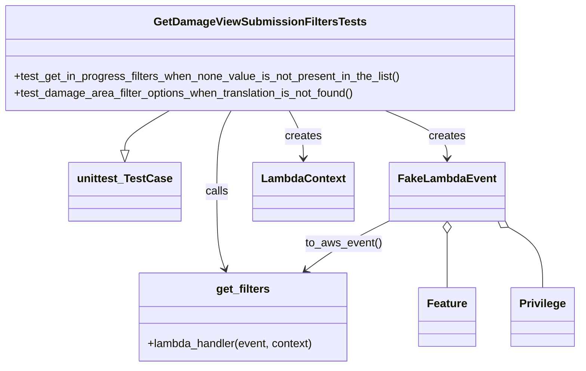
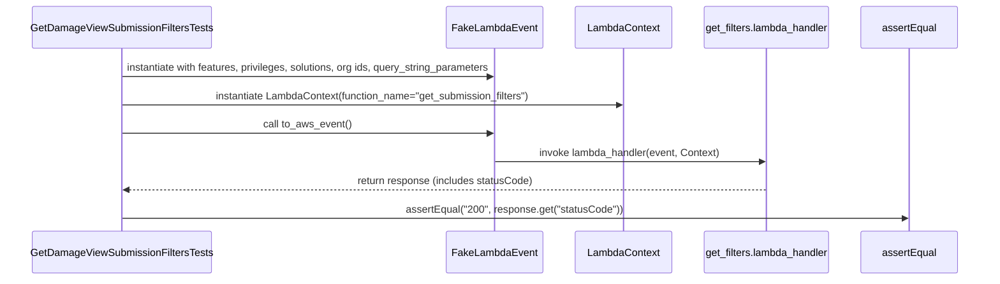

# Diagram: entity_core/entity_service/entity_service_tests/damageview_tests/integration_tests/test_get_submission_filters.py

> Auto-generated by Obscura crawlers

## Diagram 1

### SVG

<svg id="container" width="812.78125" xmlns="http://www.w3.org/2000/svg" class="classDiagram" height="524" viewBox="0 0 812.78125 524" role="graphics-document document" aria-roledescription="class"><g><defs><marker id="container_class-aggregationStart" class="marker aggregation class" refX="18" refY="7" markerWidth="190" markerHeight="240" orient="auto"><path d="M 18,7 L9,13 L1,7 L9,1 Z"></path></marker></defs><defs><marker id="container_class-aggregationEnd" class="marker aggregation class" refX="1" refY="7" markerWidth="20" markerHeight="28" orient="auto"><path d="M 18,7 L9,13 L1,7 L9,1 Z"></path></marker></defs><defs><marker id="container_class-extensionStart" class="marker extension class" refX="18" refY="7" markerWidth="190" markerHeight="240" orient="auto"><path d="M 1,7 L18,13 V 1 Z"></path></marker></defs><defs><marker id="container_class-extensionEnd" class="marker extension class" refX="1" refY="7" markerWidth="20" markerHeight="28" orient="auto"><path d="M 1,1 V 13 L18,7 Z"></path></marker></defs><defs><marker id="container_class-compositionStart" class="marker composition class" refX="18" refY="7" markerWidth="190" markerHeight="240" orient="auto"><path d="M 18,7 L9,13 L1,7 L9,1 Z"></path></marker></defs><defs><marker id="container_class-compositionEnd" class="marker composition class" refX="1" refY="7" markerWidth="20" markerHeight="28" orient="auto"><path d="M 18,7 L9,13 L1,7 L9,1 Z"></path></marker></defs><defs><marker id="container_class-dependencyStart" class="marker dependency class" refX="6" refY="7" markerWidth="190" markerHeight="240" orient="auto"><path d="M 5,7 L9,13 L1,7 L9,1 Z"></path></marker></defs><defs><marker id="container_class-dependencyEnd" class="marker dependency class" refX="13" refY="7" markerWidth="20" markerHeight="28" orient="auto"><path d="M 18,7 L9,13 L14,7 L9,1 Z"></path></marker></defs><defs><marker id="container_class-lollipopStart" class="marker lollipop class" refX="13" refY="7" markerWidth="190" markerHeight="240" orient="auto"><circle stroke="black" fill="transparent" cx="7" cy="7" r="6"></circle></marker></defs><defs><marker id="container_class-lollipopEnd" class="marker lollipop class" refX="1" refY="7" markerWidth="190" markerHeight="240" orient="auto"><circle stroke="black" fill="transparent" cx="7" cy="7" r="6"></circle></marker></defs><g class="root"><g class="clusters"></g><g class="edgePaths"><path d="M243.708,158L233.314,164.167C222.92,170.333,202.132,182.667,191.738,192.125C181.344,201.583,181.344,208.167,181.344,211.458L181.344,214.75" id="id_GetDamageViewSubmissionFiltersTests_unittest_TestCase_1" class="edge-thickness-normal edge-pattern-solid relation" style=";;;" data-edge="true" data-et="edge" data-id="id_GetDamageViewSubmissionFiltersTests_unittest_TestCase_1" data-points="W3sieCI6MjQzLjcwNzY5MzkxNzQxMDcyLCJ5IjoxNTh9LHsieCI6MTgxLjM0Mzc1LCJ5IjoxOTV9LHsieCI6MTgxLjM0Mzc1LCJ5IjoyMzJ9XQ==" marker-end="url(#container_class-extensionEnd)"></path><path d="M542.578,158L556.757,164.167C570.937,170.333,599.297,182.667,613.476,194C627.656,205.333,627.656,215.667,627.656,220.833L627.656,226" id="id_GetDamageViewSubmissionFiltersTests_FakeLambdaEvent_2" class="edge-thickness-normal edge-pattern-solid relation" style=";;;" data-edge="true" data-et="edge" data-id="id_GetDamageViewSubmissionFiltersTests_FakeLambdaEvent_2" data-points="W3sieCI6NTQyLjU3NzY3MTU5NTk4MjEsInkiOjE1OH0seyJ4Ijo2MjcuNjU2MjUsInkiOjE5NX0seyJ4Ijo2MjcuNjU2MjUsInkiOjIzMn1d" marker-end="url(#container_class-dependencyEnd)"></path><path d="M410.548,158L413.872,164.167C417.196,170.333,423.844,182.667,427.168,194C430.492,205.333,430.492,215.667,430.492,220.833L430.492,226" id="id_GetDamageViewSubmissionFiltersTests_LambdaContext_3" class="edge-thickness-normal edge-pattern-solid relation" style=";;;" data-edge="true" data-et="edge" data-id="id_GetDamageViewSubmissionFiltersTests_LambdaContext_3" data-points="W3sieCI6NDEwLjU0ODE2NTQ1NzU4OTMsInkiOjE1OH0seyJ4Ijo0MzAuNDkyMTg3NSwieSI6MTk1fSx7IngiOjQzMC40OTIxODc1LCJ5IjoyMzJ9XQ==" marker-end="url(#container_class-dependencyEnd)"></path><path d="M329.694,158L326.37,164.167C323.046,170.333,316.398,182.667,313.074,202C309.75,221.333,309.75,247.667,309.75,274C309.75,300.333,309.75,326.667,311.692,345.063C313.633,363.458,317.516,373.917,319.458,379.146L321.399,384.375" id="id_GetDamageViewSubmissionFiltersTests_get_filters_4" class="edge-thickness-normal edge-pattern-solid relation" style=";;;" data-edge="true" data-et="edge" data-id="id_GetDamageViewSubmissionFiltersTests_get_filters_4" data-points="W3sieCI6MzI5LjY5NDAyMjA0MjQxMDcsInkiOjE1OH0seyJ4IjozMDkuNzUsInkiOjE5NX0seyJ4IjozMDkuNzUsInkiOjI3NH0seyJ4IjozMDkuNzUsInkiOjM1M30seyJ4IjozMjMuNDg3Njk1MzEyNSwieSI6MzkwfV0=" marker-end="url(#container_class-dependencyEnd)"></path><path d="M549.789,313.136L536.57,319.78C523.351,326.424,496.913,339.712,476.849,351.894C456.786,364.075,443.097,375.151,436.253,380.688L429.409,386.226" id="id_FakeLambdaEvent_get_filters_5" class="edge-thickness-normal edge-pattern-solid relation" style=";;;" data-edge="true" data-et="edge" data-id="id_FakeLambdaEvent_get_filters_5" data-points="W3sieCI6NTQ5Ljc4OTA2MjUsInkiOjMxMy4xMzYyOTk4MTIzNjg3NX0seyJ4Ijo0NzAuNDc0NjA5Mzc1LCJ5IjozNTN9LHsieCI6NDI0Ljc0NDE5OTIxODc1LCJ5IjozOTB9XQ==" marker-end="url(#container_class-dependencyEnd)"></path><path d="M627.656,333.25L627.656,336.542C627.656,339.833,627.656,346.417,627.656,359.375C627.656,372.333,627.656,391.667,627.656,401.333L627.656,411" id="id_FakeLambdaEvent_Feature_6" class="edge-thickness-normal edge-pattern-solid relation" style=";;;" data-edge="true" data-et="edge" data-id="id_FakeLambdaEvent_Feature_6" data-points="W3sieCI6NjI3LjY1NjI1LCJ5IjozMTZ9LHsieCI6NjI3LjY1NjI1LCJ5IjozNTN9LHsieCI6NjI3LjY1NjI1LCJ5Ijo0MTF9XQ==" marker-start="url(#container_class-aggregationStart)"></path><path d="M713.341,324.797L721.27,329.497C729.198,334.198,745.056,343.599,752.985,357.966C760.914,372.333,760.914,391.667,760.914,401.333L760.914,411" id="id_FakeLambdaEvent_Privilege_7" class="edge-thickness-normal edge-pattern-solid relation" style=";;;" data-edge="true" data-et="edge" data-id="id_FakeLambdaEvent_Privilege_7" data-points="W3sieCI6Njk4LjUwMjE3NTYzMjkxMTQsInkiOjMxNn0seyJ4Ijo3NjAuOTE0MDYyNSwieSI6MzUzfSx7IngiOjc2MC45MTQwNjI1LCJ5Ijo0MTF9XQ==" marker-start="url(#container_class-aggregationStart)"></path></g><g class="edgeLabels"><g class="edgeLabel"><g class="label" data-id="id_GetDamageViewSubmissionFiltersTests_unittest_TestCase_1" transform="translate(0, 0)"><foreignObject width="0" height="0">

</foreignObject></g></g><g class="edgeLabel" transform="translate(627.65625, 195)"><g class="label" data-id="id_GetDamageViewSubmissionFiltersTests_FakeLambdaEvent_2" transform="translate(-26.171875, -12)"><foreignObject width="52.34375" height="24">

creates

</foreignObject></g></g><g class="edgeLabel" transform="translate(430.4921875, 195)"><g class="label" data-id="id_GetDamageViewSubmissionFiltersTests_LambdaContext_3" transform="translate(-26.171875, -12)"><foreignObject width="52.34375" height="24">

creates

</foreignObject></g></g><g class="edgeLabel" transform="translate(309.75, 274)"><g class="label" data-id="id_GetDamageViewSubmissionFiltersTests_get_filters_4" transform="translate(-16.4453125, -12)"><foreignObject width="32.890625" height="24">

calls

</foreignObject></g></g><g class="edgeLabel" transform="translate(483.85234, 346.27631)"><g class="label" data-id="id_FakeLambdaEvent_get_filters_5" transform="translate(-54.2578125, -12)"><foreignObject width="108.515625" height="24">

to_aws_event()

</foreignObject></g></g><g class="edgeLabel"><g class="label" data-id="id_FakeLambdaEvent_Feature_6" transform="translate(0, 0)"><foreignObject width="0" height="0">

</foreignObject></g></g><g class="edgeLabel"><g class="label" data-id="id_FakeLambdaEvent_Privilege_7" transform="translate(0, 0)"><foreignObject width="0" height="0">

</foreignObject></g></g></g><g class="nodes"><g class="node default" id="classId-GetDamageViewSubmissionFiltersTests-0" transform="translate(370.12109375, 83)"><g class="basic label-container"><path d="M-362.12109375 -75 L362.12109375 -75 L362.12109375 75 L-362.12109375 75" stroke="none" stroke-width="0" fill="#ECECFF" style=""></path><path d="M-362.12109375 -75 C-181.5159213641924 -75, -0.9107489783847882 -75, 362.12109375 -75 M-362.12109375 -75 C-121.80013682362429 -75, 118.52082010275143 -75, 362.12109375 -75 M362.12109375 -75 C362.12109375 -30.06614515663994, 362.12109375 14.867709686720119, 362.12109375 75 M362.12109375 -75 C362.12109375 -25.008673933490975, 362.12109375 24.98265213301805, 362.12109375 75 M362.12109375 75 C121.68653921774757 75, -118.74801531450487 75, -362.12109375 75 M362.12109375 75 C99.10874183722103 75, -163.90361007555794 75, -362.12109375 75 M-362.12109375 75 C-362.12109375 22.841333447159187, -362.12109375 -29.317333105681627, -362.12109375 -75 M-362.12109375 75 C-362.12109375 24.78767681928349, -362.12109375 -25.42464636143302, -362.12109375 -75" stroke="#9370DB" stroke-width="1.3" fill="none" stroke-dasharray="0 0" style=""></path></g><g class="annotation-group text" transform="translate(0, -51)"></g><g class="label-group text" transform="translate(-143.0234375, -51)"><g class="label" style="font-weight: bolder" transform="translate(0,-12)"><foreignObject width="286.046875" height="24">

GetDamageViewSubmissionFiltersTests

</foreignObject></g></g><g class="members-group text" transform="translate(-350.12109375, -3)"></g><g class="methods-group text" transform="translate(-350.12109375, 27)"><g class="label" style="" transform="translate(0,-12)"><foreignObject width="557.21875" height="24">

+test_get_in_progress_filters_when_none_value_is_not_present_in_the_list()

</foreignObject></g><g class="label" style="" transform="translate(0,12)"><foreignObject width="492.296875" height="24">

+test_damage_area_filter_options_when_translation_is_not_found()

</foreignObject></g></g><g class="divider" style=""><path d="M-362.12109375 -27 C-212.9260847563536 -27, -63.73107576270718 -27, 362.12109375 -27 M-362.12109375 -27 C-163.96874614087423 -27, 34.18360146825154 -27, 362.12109375 -27" stroke="#9370DB" stroke-width="1.3" fill="none" stroke-dasharray="0 0" style=""></path></g><g class="divider" style=""><path d="M-362.12109375 -3 C-177.21940770192307 -3, 7.682278346153851 -3, 362.12109375 -3 M-362.12109375 -3 C-140.77287961391633 -3, 80.57533452216734 -3, 362.12109375 -3" stroke="#9370DB" stroke-width="1.3" fill="none" stroke-dasharray="0 0" style=""></path></g></g><g class="node default" id="classId-unittest_TestCase-1" transform="translate(181.34375, 274)"><g class="basic label-container"><path d="M-76.9609375 -42 L76.9609375 -42 L76.9609375 42 L-76.9609375 42" stroke="none" stroke-width="0" fill="#ECECFF" style=""></path><path d="M-76.9609375 -42 C-36.446215036384444 -42, 4.068507427231111 -42, 76.9609375 -42 M-76.9609375 -42 C-38.78282396850747 -42, -0.6047104370149441 -42, 76.9609375 -42 M76.9609375 -42 C76.9609375 -10.309069271195664, 76.9609375 21.38186145760867, 76.9609375 42 M76.9609375 -42 C76.9609375 -9.840376748986934, 76.9609375 22.319246502026132, 76.9609375 42 M76.9609375 42 C43.94188992671875 42, 10.922842353437503 42, -76.9609375 42 M76.9609375 42 C41.93522048407244 42, 6.909503468144877 42, -76.9609375 42 M-76.9609375 42 C-76.9609375 23.452856879700256, -76.9609375 4.905713759400513, -76.9609375 -42 M-76.9609375 42 C-76.9609375 11.558282609804614, -76.9609375 -18.883434780390772, -76.9609375 -42" stroke="#9370DB" stroke-width="1.3" fill="none" stroke-dasharray="0 0" style=""></path></g><g class="annotation-group text" transform="translate(0, -18)"></g><g class="label-group text" transform="translate(-64.9609375, -18)"><g class="label" style="font-weight: bolder" transform="translate(0,-12)"><foreignObject width="129.921875" height="24">

unittest_TestCase

</foreignObject></g></g><g class="members-group text" transform="translate(-64.9609375, 30)"></g><g class="methods-group text" transform="translate(-64.9609375, 60)"></g><g class="divider" style=""><path d="M-76.9609375 6 C-24.314068709233823 6, 28.332800081532355 6, 76.9609375 6 M-76.9609375 6 C-45.966643076091465 6, -14.97234865218293 6, 76.9609375 6" stroke="#9370DB" stroke-width="1.3" fill="none" stroke-dasharray="0 0" style=""></path></g><g class="divider" style=""><path d="M-76.9609375 24 C-28.096236916910392 24, 20.768463666179215 24, 76.9609375 24 M-76.9609375 24 C-44.257755854657304 24, -11.554574209314609 24, 76.9609375 24" stroke="#9370DB" stroke-width="1.3" fill="none" stroke-dasharray="0 0" style=""></path></g></g><g class="node default" id="classId-FakeLambdaEvent-2" transform="translate(627.65625, 274)"><g class="basic label-container"><path d="M-77.8671875 -42 L77.8671875 -42 L77.8671875 42 L-77.8671875 42" stroke="none" stroke-width="0" fill="#ECECFF" style=""></path><path d="M-77.8671875 -42 C-16.926916094588734 -42, 44.01335531082253 -42, 77.8671875 -42 M-77.8671875 -42 C-30.752347105743695 -42, 16.36249328851261 -42, 77.8671875 -42 M77.8671875 -42 C77.8671875 -24.949512513965104, 77.8671875 -7.899025027930207, 77.8671875 42 M77.8671875 -42 C77.8671875 -16.82065811356916, 77.8671875 8.358683772861681, 77.8671875 42 M77.8671875 42 C44.20313760812481 42, 10.539087716249625 42, -77.8671875 42 M77.8671875 42 C33.32101789941657 42, -11.225151701166865 42, -77.8671875 42 M-77.8671875 42 C-77.8671875 19.402678748942012, -77.8671875 -3.1946425021159754, -77.8671875 -42 M-77.8671875 42 C-77.8671875 9.623721438982408, -77.8671875 -22.752557122035185, -77.8671875 -42" stroke="#9370DB" stroke-width="1.3" fill="none" stroke-dasharray="0 0" style=""></path></g><g class="annotation-group text" transform="translate(0, -18)"></g><g class="label-group text" transform="translate(-65.8671875, -18)"><g class="label" style="font-weight: bolder" transform="translate(0,-12)"><foreignObject width="131.734375" height="24">

FakeLambdaEvent

</foreignObject></g></g><g class="members-group text" transform="translate(-65.8671875, 30)"></g><g class="methods-group text" transform="translate(-65.8671875, 60)"></g><g class="divider" style=""><path d="M-77.8671875 6 C-25.667993777753807 6, 26.531199944492386 6, 77.8671875 6 M-77.8671875 6 C-21.82053365120106 6, 34.22612019759788 6, 77.8671875 6" stroke="#9370DB" stroke-width="1.3" fill="none" stroke-dasharray="0 0" style=""></path></g><g class="divider" style=""><path d="M-77.8671875 24 C-40.47845854618439 24, -3.0897295923687835 24, 77.8671875 24 M-77.8671875 24 C-16.447966364343188 24, 44.971254771313625 24, 77.8671875 24" stroke="#9370DB" stroke-width="1.3" fill="none" stroke-dasharray="0 0" style=""></path></g></g><g class="node default" id="classId-LambdaContext-3" transform="translate(430.4921875, 274)"><g class="basic label-container"><path d="M-69.296875 -42 L69.296875 -42 L69.296875 42 L-69.296875 42" stroke="none" stroke-width="0" fill="#ECECFF" style=""></path><path d="M-69.296875 -42 C-16.892448951948488 -42, 35.511977096103024 -42, 69.296875 -42 M-69.296875 -42 C-27.08744658502524 -42, 15.121981829949519 -42, 69.296875 -42 M69.296875 -42 C69.296875 -20.202150114652568, 69.296875 1.5956997706948641, 69.296875 42 M69.296875 -42 C69.296875 -21.83916657849923, 69.296875 -1.6783331569984625, 69.296875 42 M69.296875 42 C32.451439784508075 42, -4.39399543098385 42, -69.296875 42 M69.296875 42 C39.76788058762044 42, 10.238886175240872 42, -69.296875 42 M-69.296875 42 C-69.296875 19.51420151952729, -69.296875 -2.971596960945419, -69.296875 -42 M-69.296875 42 C-69.296875 9.172900462955866, -69.296875 -23.654199074088268, -69.296875 -42" stroke="#9370DB" stroke-width="1.3" fill="none" stroke-dasharray="0 0" style=""></path></g><g class="annotation-group text" transform="translate(0, -18)"></g><g class="label-group text" transform="translate(-57.296875, -18)"><g class="label" style="font-weight: bolder" transform="translate(0,-12)"><foreignObject width="114.59375" height="24">

LambdaContext

</foreignObject></g></g><g class="members-group text" transform="translate(-57.296875, 30)"></g><g class="methods-group text" transform="translate(-57.296875, 60)"></g><g class="divider" style=""><path d="M-69.296875 6 C-20.043099579888974 6, 29.210675840222052 6, 69.296875 6 M-69.296875 6 C-21.587551949526002 6, 26.121771100947996 6, 69.296875 6" stroke="#9370DB" stroke-width="1.3" fill="none" stroke-dasharray="0 0" style=""></path></g><g class="divider" style=""><path d="M-69.296875 24 C-37.53129149932285 24, -5.765707998645702 24, 69.296875 24 M-69.296875 24 C-31.865624891893887 24, 5.565625216212226 24, 69.296875 24" stroke="#9370DB" stroke-width="1.3" fill="none" stroke-dasharray="0 0" style=""></path></g></g><g class="node default" id="classId-get_filters-4" transform="translate(346.87890625, 453)"><g class="basic label-container"><path d="M-150.71484375 -63 L150.71484375 -63 L150.71484375 63 L-150.71484375 63" stroke="none" stroke-width="0" fill="#ECECFF" style=""></path><path d="M-150.71484375 -63 C-35.81733578726289 -63, 79.08017217547422 -63, 150.71484375 -63 M-150.71484375 -63 C-52.35935026642994 -63, 45.996143217140116 -63, 150.71484375 -63 M150.71484375 -63 C150.71484375 -26.703231653566398, 150.71484375 9.593536692867204, 150.71484375 63 M150.71484375 -63 C150.71484375 -16.737901283746893, 150.71484375 29.524197432506213, 150.71484375 63 M150.71484375 63 C47.61906390818946 63, -55.47671593362108 63, -150.71484375 63 M150.71484375 63 C86.66874959693298 63, 22.622655443865966 63, -150.71484375 63 M-150.71484375 63 C-150.71484375 15.041888604809905, -150.71484375 -32.91622279038019, -150.71484375 -63 M-150.71484375 63 C-150.71484375 24.22884765610697, -150.71484375 -14.542304687786057, -150.71484375 -63" stroke="#9370DB" stroke-width="1.3" fill="none" stroke-dasharray="0 0" style=""></path></g><g class="annotation-group text" transform="translate(0, -39)"></g><g class="label-group text" transform="translate(-37.2421875, -39)"><g class="label" style="font-weight: bolder" transform="translate(0,-12)"><foreignObject width="74.484375" height="24">

get_filters

</foreignObject></g></g><g class="members-group text" transform="translate(-138.71484375, 9)"></g><g class="methods-group text" transform="translate(-138.71484375, 39)"><g class="label" style="" transform="translate(0,-12)"><foreignObject width="240.1875" height="24">

+lambda_handler(event, context)

</foreignObject></g></g><g class="divider" style=""><path d="M-150.71484375 -15 C-45.479616053111286 -15, 59.75561164377743 -15, 150.71484375 -15 M-150.71484375 -15 C-45.907760452647324 -15, 58.89932284470535 -15, 150.71484375 -15" stroke="#9370DB" stroke-width="1.3" fill="none" stroke-dasharray="0 0" style=""></path></g><g class="divider" style=""><path d="M-150.71484375 9 C-32.30477136958196 9, 86.10530101083609 9, 150.71484375 9 M-150.71484375 9 C-54.050502897696745 9, 42.61383795460651 9, 150.71484375 9" stroke="#9370DB" stroke-width="1.3" fill="none" stroke-dasharray="0 0" style=""></path></g></g><g class="node default" id="classId-Feature-5" transform="translate(627.65625, 453)"><g class="basic label-container"><path d="M-39.390625 -42 L39.390625 -42 L39.390625 42 L-39.390625 42" stroke="none" stroke-width="0" fill="#ECECFF" style=""></path><path d="M-39.390625 -42 C-8.274829101982945 -42, 22.84096679603411 -42, 39.390625 -42 M-39.390625 -42 C-8.910311220794629 -42, 21.570002558410742 -42, 39.390625 -42 M39.390625 -42 C39.390625 -16.665177939826844, 39.390625 8.669644120346312, 39.390625 42 M39.390625 -42 C39.390625 -19.29271314771976, 39.390625 3.414573704560482, 39.390625 42 M39.390625 42 C13.202430724180786 42, -12.985763551638428 42, -39.390625 42 M39.390625 42 C8.942173569721646 42, -21.506277860556708 42, -39.390625 42 M-39.390625 42 C-39.390625 13.4359872806033, -39.390625 -15.1280254387934, -39.390625 -42 M-39.390625 42 C-39.390625 15.757622240594927, -39.390625 -10.484755518810147, -39.390625 -42" stroke="#9370DB" stroke-width="1.3" fill="none" stroke-dasharray="0 0" style=""></path></g><g class="annotation-group text" transform="translate(0, -18)"></g><g class="label-group text" transform="translate(-27.390625, -18)"><g class="label" style="font-weight: bolder" transform="translate(0,-12)"><foreignObject width="54.78125" height="24">

Feature

</foreignObject></g></g><g class="members-group text" transform="translate(-27.390625, 30)"></g><g class="methods-group text" transform="translate(-27.390625, 60)"></g><g class="divider" style=""><path d="M-39.390625 6 C-9.810061466389993 6, 19.770502067220015 6, 39.390625 6 M-39.390625 6 C-21.800687451417815 6, -4.21074990283563 6, 39.390625 6" stroke="#9370DB" stroke-width="1.3" fill="none" stroke-dasharray="0 0" style=""></path></g><g class="divider" style=""><path d="M-39.390625 24 C-13.530394535145039 24, 12.329835929709922 24, 39.390625 24 M-39.390625 24 C-8.506103665410137 24, 22.378417669179726 24, 39.390625 24" stroke="#9370DB" stroke-width="1.3" fill="none" stroke-dasharray="0 0" style=""></path></g></g><g class="node default" id="classId-Privilege-6" transform="translate(760.9140625, 453)"><g class="basic label-container"><path d="M-43.8671875 -42 L43.8671875 -42 L43.8671875 42 L-43.8671875 42" stroke="none" stroke-width="0" fill="#ECECFF" style=""></path><path d="M-43.8671875 -42 C-15.507716455685024 -42, 12.851754588629952 -42, 43.8671875 -42 M-43.8671875 -42 C-11.393819788796044 -42, 21.07954792240791 -42, 43.8671875 -42 M43.8671875 -42 C43.8671875 -17.510228866664146, 43.8671875 6.979542266671707, 43.8671875 42 M43.8671875 -42 C43.8671875 -23.036509417675514, 43.8671875 -4.073018835351029, 43.8671875 42 M43.8671875 42 C11.47512819228826 42, -20.91693111542348 42, -43.8671875 42 M43.8671875 42 C22.070549791498635 42, 0.27391208299727055 42, -43.8671875 42 M-43.8671875 42 C-43.8671875 25.029723946892855, -43.8671875 8.059447893785709, -43.8671875 -42 M-43.8671875 42 C-43.8671875 8.518824974124222, -43.8671875 -24.962350051751557, -43.8671875 -42" stroke="#9370DB" stroke-width="1.3" fill="none" stroke-dasharray="0 0" style=""></path></g><g class="annotation-group text" transform="translate(0, -18)"></g><g class="label-group text" transform="translate(-31.8671875, -18)"><g class="label" style="font-weight: bolder" transform="translate(0,-12)"><foreignObject width="63.734375" height="24">

Privilege

</foreignObject></g></g><g class="members-group text" transform="translate(-31.8671875, 30)"></g><g class="methods-group text" transform="translate(-31.8671875, 60)"></g><g class="divider" style=""><path d="M-43.8671875 6 C-17.94454075835252 6, 7.9781059832949595 6, 43.8671875 6 M-43.8671875 6 C-9.200860148234938 6, 25.465467203530125 6, 43.8671875 6" stroke="#9370DB" stroke-width="1.3" fill="none" stroke-dasharray="0 0" style=""></path></g><g class="divider" style=""><path d="M-43.8671875 24 C-19.97533983588012 24, 3.9165078282397587 24, 43.8671875 24 M-43.8671875 24 C-12.244228829632572 24, 19.378729840734856 24, 43.8671875 24" stroke="#9370DB" stroke-width="1.3" fill="none" stroke-dasharray="0 0" style=""></path></g></g></g></g></g></svg>

## Diagram 2

### SVG

<svg id="container" width="1641" xmlns="http://www.w3.org/2000/svg" height="459" viewBox="-50 -10 1641 459" role="graphics-document document" aria-roledescription="sequence"><g><rect x="1391" y="373" fill="#eaeaea" stroke="#666" width="150" height="65" name="Assertion" rx="3" ry="3" class="actor actor-bottom"></rect><text x="1466" y="405.5" dominant-baseline="central" alignment-baseline="central" class="actor actor-box" style="text-anchor: middle; font-size: 16px; font-weight: 400;"><tspan x="1466" dy="0">assertEqual</tspan></text></g><g><rect x="1125" y="373" fill="#eaeaea" stroke="#666" width="216" height="65" name="Handler" rx="3" ry="3" class="actor actor-bottom"></rect><text x="1233" y="405.5" dominant-baseline="central" alignment-baseline="central" class="actor actor-box" style="text-anchor: middle; font-size: 16px; font-weight: 400;"><tspan x="1233" dy="0">get_filters.lambda_handler</tspan></text></g><g><rect x="925" y="373" fill="#eaeaea" stroke="#666" width="150" height="65" name="Context" rx="3" ry="3" class="actor actor-bottom"></rect><text x="1000" y="405.5" dominant-baseline="central" alignment-baseline="central" class="actor actor-box" style="text-anchor: middle; font-size: 16px; font-weight: 400;"><tspan x="1000" dy="0">LambdaContext</tspan></text></g><g><rect x="724" y="373" fill="#eaeaea" stroke="#666" width="151" height="65" name="Event" rx="3" ry="3" class="actor actor-bottom"></rect><text x="799.5" y="405.5" dominant-baseline="central" alignment-baseline="central" class="actor actor-box" style="text-anchor: middle; font-size: 16px; font-weight: 400;"><tspan x="799.5" dy="0">FakeLambdaEvent</tspan></text></g><g><rect x="0" y="373" fill="#eaeaea" stroke="#666" width="301" height="65" name="Test" rx="3" ry="3" class="actor actor-bottom"></rect><text x="150.5" y="405.5" dominant-baseline="central" alignment-baseline="central" class="actor actor-box" style="text-anchor: middle; font-size: 16px; font-weight: 400;"><tspan x="150.5" dy="0">GetDamageViewSubmissionFiltersTests</tspan></text></g><g><line id="actor4" x1="1466" y1="65" x2="1466" y2="373" class="actor-line 200" stroke-width="0.5px" stroke="#999" name="Assertion"></line><g id="root-4"><rect x="1391" y="0" fill="#eaeaea" stroke="#666" width="150" height="65" name="Assertion" rx="3" ry="3" class="actor actor-top"></rect><text x="1466" y="32.5" dominant-baseline="central" alignment-baseline="central" class="actor actor-box" style="text-anchor: middle; font-size: 16px; font-weight: 400;"><tspan x="1466" dy="0">assertEqual</tspan></text></g></g><g><line id="actor3" x1="1233" y1="65" x2="1233" y2="373" class="actor-line 200" stroke-width="0.5px" stroke="#999" name="Handler"></line><g id="root-3"><rect x="1125" y="0" fill="#eaeaea" stroke="#666" width="216" height="65" name="Handler" rx="3" ry="3" class="actor actor-top"></rect><text x="1233" y="32.5" dominant-baseline="central" alignment-baseline="central" class="actor actor-box" style="text-anchor: middle; font-size: 16px; font-weight: 400;"><tspan x="1233" dy="0">get_filters.lambda_handler</tspan></text></g></g><g><line id="actor2" x1="1000" y1="65" x2="1000" y2="373" class="actor-line 200" stroke-width="0.5px" stroke="#999" name="Context"></line><g id="root-2"><rect x="925" y="0" fill="#eaeaea" stroke="#666" width="150" height="65" name="Context" rx="3" ry="3" class="actor actor-top"></rect><text x="1000" y="32.5" dominant-baseline="central" alignment-baseline="central" class="actor actor-box" style="text-anchor: middle; font-size: 16px; font-weight: 400;"><tspan x="1000" dy="0">LambdaContext</tspan></text></g></g><g><line id="actor1" x1="799.5" y1="65" x2="799.5" y2="373" class="actor-line 200" stroke-width="0.5px" stroke="#999" name="Event"></line><g id="root-1"><rect x="724" y="0" fill="#eaeaea" stroke="#666" width="151" height="65" name="Event" rx="3" ry="3" class="actor actor-top"></rect><text x="799.5" y="32.5" dominant-baseline="central" alignment-baseline="central" class="actor actor-box" style="text-anchor: middle; font-size: 16px; font-weight: 400;"><tspan x="799.5" dy="0">FakeLambdaEvent</tspan></text></g></g><g><line id="actor0" x1="150.5" y1="65" x2="150.5" y2="373" class="actor-line 200" stroke-width="0.5px" stroke="#999" name="Test"></line><g id="root-0"><rect x="0" y="0" fill="#eaeaea" stroke="#666" width="301" height="65" name="Test" rx="3" ry="3" class="actor actor-top"></rect><text x="150.5" y="32.5" dominant-baseline="central" alignment-baseline="central" class="actor actor-box" style="text-anchor: middle; font-size: 16px; font-weight: 400;"><tspan x="150.5" dy="0">GetDamageViewSubmissionFiltersTests</tspan></text></g></g><g></g><defs><symbol id="computer" width="24" height="24"><path transform="scale(.5)" d="M2 2v13h20v-13h-20zm18 11h-16v-9h16v9zm-10.228 6l.466-1h3.524l.467 1h-4.457zm14.228 3h-24l2-6h2.104l-1.33 4h18.45l-1.297-4h2.073l2 6zm-5-10h-14v-7h14v7z"></path></symbol></defs><defs><symbol id="database" fill-rule="evenodd" clip-rule="evenodd"><path transform="scale(.5)" d="M12.258.001l.256.004.255.005.253.008.251.01.249.012.247.015.246.016.242.019.241.02.239.023.236.024.233.027.231.028.229.031.225.032.223.034.22.036.217.038.214.04.211.041.208.043.205.045.201.046.198.048.194.05.191.051.187.053.183.054.18.056.175.057.172.059.168.06.163.061.16.063.155.064.15.066.074.033.073.033.071.034.07.034.069.035.068.035.067.035.066.035.064.036.064.036.062.036.06.036.06.037.058.037.058.037.055.038.055.038.053.038.052.038.051.039.05.039.048.039.047.039.045.04.044.04.043.04.041.04.04.041.039.041.037.041.036.041.034.041.033.042.032.042.03.042.029.042.027.042.026.043.024.043.023.043.021.043.02.043.018.044.017.043.015.044.013.044.012.044.011.045.009.044.007.045.006.045.004.045.002.045.001.045v17l-.001.045-.002.045-.004.045-.006.045-.007.045-.009.044-.011.045-.012.044-.013.044-.015.044-.017.043-.018.044-.02.043-.021.043-.023.043-.024.043-.026.043-.027.042-.029.042-.03.042-.032.042-.033.042-.034.041-.036.041-.037.041-.039.041-.04.041-.041.04-.043.04-.044.04-.045.04-.047.039-.048.039-.05.039-.051.039-.052.038-.053.038-.055.038-.055.038-.058.037-.058.037-.06.037-.06.036-.062.036-.064.036-.064.036-.066.035-.067.035-.068.035-.069.035-.07.034-.071.034-.073.033-.074.033-.15.066-.155.064-.16.063-.163.061-.168.06-.172.059-.175.057-.18.056-.183.054-.187.053-.191.051-.194.05-.198.048-.201.046-.205.045-.208.043-.211.041-.214.04-.217.038-.22.036-.223.034-.225.032-.229.031-.231.028-.233.027-.236.024-.239.023-.241.02-.242.019-.246.016-.247.015-.249.012-.251.01-.253.008-.255.005-.256.004-.258.001-.258-.001-.256-.004-.255-.005-.253-.008-.251-.01-.249-.012-.247-.015-.245-.016-.243-.019-.241-.02-.238-.023-.236-.024-.234-.027-.231-.028-.228-.031-.226-.032-.223-.034-.22-.036-.217-.038-.214-.04-.211-.041-.208-.043-.204-.045-.201-.046-.198-.048-.195-.05-.19-.051-.187-.053-.184-.054-.179-.056-.176-.057-.172-.059-.167-.06-.164-.061-.159-.063-.155-.064-.151-.066-.074-.033-.072-.033-.072-.034-.07-.034-.069-.035-.068-.035-.067-.035-.066-.035-.064-.036-.063-.036-.062-.036-.061-.036-.06-.037-.058-.037-.057-.037-.056-.038-.055-.038-.053-.038-.052-.038-.051-.039-.049-.039-.049-.039-.046-.039-.046-.04-.044-.04-.043-.04-.041-.04-.04-.041-.039-.041-.037-.041-.036-.041-.034-.041-.033-.042-.032-.042-.03-.042-.029-.042-.027-.042-.026-.043-.024-.043-.023-.043-.021-.043-.02-.043-.018-.044-.017-.043-.015-.044-.013-.044-.012-.044-.011-.045-.009-.044-.007-.045-.006-.045-.004-.045-.002-.045-.001-.045v-17l.001-.045.002-.045.004-.045.006-.045.007-.045.009-.044.011-.045.012-.044.013-.044.015-.044.017-.043.018-.044.02-.043.021-.043.023-.043.024-.043.026-.043.027-.042.029-.042.03-.042.032-.042.033-.042.034-.041.036-.041.037-.041.039-.041.04-.041.041-.04.043-.04.044-.04.046-.04.046-.039.049-.039.049-.039.051-.039.052-.038.053-.038.055-.038.056-.038.057-.037.058-.037.06-.037.061-.036.062-.036.063-.036.064-.036.066-.035.067-.035.068-.035.069-.035.07-.034.072-.034.072-.033.074-.033.151-.066.155-.064.159-.063.164-.061.167-.06.172-.059.176-.057.179-.056.184-.054.187-.053.19-.051.195-.05.198-.048.201-.046.204-.045.208-.043.211-.041.214-.04.217-.038.22-.036.223-.034.226-.032.228-.031.231-.028.234-.027.236-.024.238-.023.241-.02.243-.019.245-.016.247-.015.249-.012.251-.01.253-.008.255-.005.256-.004.258-.001.258.001zm-9.258 20.499v.01l.001.021.003.021.004.022.005.021.006.022.007.022.009.023.01.022.011.023.012.023.013.023.015.023.016.024.017.023.018.024.019.024.021.024.022.025.023.024.024.025.052.049.056.05.061.051.066.051.07.051.075.051.079.052.084.052.088.052.092.052.097.052.102.051.105.052.11.052.114.051.119.051.123.051.127.05.131.05.135.05.139.048.144.049.147.047.152.047.155.047.16.045.163.045.167.043.171.043.176.041.178.041.183.039.187.039.19.037.194.035.197.035.202.033.204.031.209.03.212.029.216.027.219.025.222.024.226.021.23.02.233.018.236.016.24.015.243.012.246.01.249.008.253.005.256.004.259.001.26-.001.257-.004.254-.005.25-.008.247-.011.244-.012.241-.014.237-.016.233-.018.231-.021.226-.021.224-.024.22-.026.216-.027.212-.028.21-.031.205-.031.202-.034.198-.034.194-.036.191-.037.187-.039.183-.04.179-.04.175-.042.172-.043.168-.044.163-.045.16-.046.155-.046.152-.047.148-.048.143-.049.139-.049.136-.05.131-.05.126-.05.123-.051.118-.052.114-.051.11-.052.106-.052.101-.052.096-.052.092-.052.088-.053.083-.051.079-.052.074-.052.07-.051.065-.051.06-.051.056-.05.051-.05.023-.024.023-.025.021-.024.02-.024.019-.024.018-.024.017-.024.015-.023.014-.024.013-.023.012-.023.01-.023.01-.022.008-.022.006-.022.006-.022.004-.022.004-.021.001-.021.001-.021v-4.127l-.077.055-.08.053-.083.054-.085.053-.087.052-.09.052-.093.051-.095.05-.097.05-.1.049-.102.049-.105.048-.106.047-.109.047-.111.046-.114.045-.115.045-.118.044-.12.043-.122.042-.124.042-.126.041-.128.04-.13.04-.132.038-.134.038-.135.037-.138.037-.139.035-.142.035-.143.034-.144.033-.147.032-.148.031-.15.03-.151.03-.153.029-.154.027-.156.027-.158.026-.159.025-.161.024-.162.023-.163.022-.165.021-.166.02-.167.019-.169.018-.169.017-.171.016-.173.015-.173.014-.175.013-.175.012-.177.011-.178.01-.179.008-.179.008-.181.006-.182.005-.182.004-.184.003-.184.002h-.37l-.184-.002-.184-.003-.182-.004-.182-.005-.181-.006-.179-.008-.179-.008-.178-.01-.176-.011-.176-.012-.175-.013-.173-.014-.172-.015-.171-.016-.17-.017-.169-.018-.167-.019-.166-.02-.165-.021-.163-.022-.162-.023-.161-.024-.159-.025-.157-.026-.156-.027-.155-.027-.153-.029-.151-.03-.15-.03-.148-.031-.146-.032-.145-.033-.143-.034-.141-.035-.14-.035-.137-.037-.136-.037-.134-.038-.132-.038-.13-.04-.128-.04-.126-.041-.124-.042-.122-.042-.12-.044-.117-.043-.116-.045-.113-.045-.112-.046-.109-.047-.106-.047-.105-.048-.102-.049-.1-.049-.097-.05-.095-.05-.093-.052-.09-.051-.087-.052-.085-.053-.083-.054-.08-.054-.077-.054v4.127zm0-5.654v.011l.001.021.003.021.004.021.005.022.006.022.007.022.009.022.01.022.011.023.012.023.013.023.015.024.016.023.017.024.018.024.019.024.021.024.022.024.023.025.024.024.052.05.056.05.061.05.066.051.07.051.075.052.079.051.084.052.088.052.092.052.097.052.102.052.105.052.11.051.114.051.119.052.123.05.127.051.131.05.135.049.139.049.144.048.147.048.152.047.155.046.16.045.163.045.167.044.171.042.176.042.178.04.183.04.187.038.19.037.194.036.197.034.202.033.204.032.209.03.212.028.216.027.219.025.222.024.226.022.23.02.233.018.236.016.24.014.243.012.246.01.249.008.253.006.256.003.259.001.26-.001.257-.003.254-.006.25-.008.247-.01.244-.012.241-.015.237-.016.233-.018.231-.02.226-.022.224-.024.22-.025.216-.027.212-.029.21-.03.205-.032.202-.033.198-.035.194-.036.191-.037.187-.039.183-.039.179-.041.175-.042.172-.043.168-.044.163-.045.16-.045.155-.047.152-.047.148-.048.143-.048.139-.05.136-.049.131-.05.126-.051.123-.051.118-.051.114-.052.11-.052.106-.052.101-.052.096-.052.092-.052.088-.052.083-.052.079-.052.074-.051.07-.052.065-.051.06-.05.056-.051.051-.049.023-.025.023-.024.021-.025.02-.024.019-.024.018-.024.017-.024.015-.023.014-.023.013-.024.012-.022.01-.023.01-.023.008-.022.006-.022.006-.022.004-.021.004-.022.001-.021.001-.021v-4.139l-.077.054-.08.054-.083.054-.085.052-.087.053-.09.051-.093.051-.095.051-.097.05-.1.049-.102.049-.105.048-.106.047-.109.047-.111.046-.114.045-.115.044-.118.044-.12.044-.122.042-.124.042-.126.041-.128.04-.13.039-.132.039-.134.038-.135.037-.138.036-.139.036-.142.035-.143.033-.144.033-.147.033-.148.031-.15.03-.151.03-.153.028-.154.028-.156.027-.158.026-.159.025-.161.024-.162.023-.163.022-.165.021-.166.02-.167.019-.169.018-.169.017-.171.016-.173.015-.173.014-.175.013-.175.012-.177.011-.178.009-.179.009-.179.007-.181.007-.182.005-.182.004-.184.003-.184.002h-.37l-.184-.002-.184-.003-.182-.004-.182-.005-.181-.007-.179-.007-.179-.009-.178-.009-.176-.011-.176-.012-.175-.013-.173-.014-.172-.015-.171-.016-.17-.017-.169-.018-.167-.019-.166-.02-.165-.021-.163-.022-.162-.023-.161-.024-.159-.025-.157-.026-.156-.027-.155-.028-.153-.028-.151-.03-.15-.03-.148-.031-.146-.033-.145-.033-.143-.033-.141-.035-.14-.036-.137-.036-.136-.037-.134-.038-.132-.039-.13-.039-.128-.04-.126-.041-.124-.042-.122-.043-.12-.043-.117-.044-.116-.044-.113-.046-.112-.046-.109-.046-.106-.047-.105-.048-.102-.049-.1-.049-.097-.05-.095-.051-.093-.051-.09-.051-.087-.053-.085-.052-.083-.054-.08-.054-.077-.054v4.139zm0-5.666v.011l.001.02.003.022.004.021.005.022.006.021.007.022.009.023.01.022.011.023.012.023.013.023.015.023.016.024.017.024.018.023.019.024.021.025.022.024.023.024.024.025.052.05.056.05.061.05.066.051.07.051.075.052.079.051.084.052.088.052.092.052.097.052.102.052.105.051.11.052.114.051.119.051.123.051.127.05.131.05.135.05.139.049.144.048.147.048.152.047.155.046.16.045.163.045.167.043.171.043.176.042.178.04.183.04.187.038.19.037.194.036.197.034.202.033.204.032.209.03.212.028.216.027.219.025.222.024.226.021.23.02.233.018.236.017.24.014.243.012.246.01.249.008.253.006.256.003.259.001.26-.001.257-.003.254-.006.25-.008.247-.01.244-.013.241-.014.237-.016.233-.018.231-.02.226-.022.224-.024.22-.025.216-.027.212-.029.21-.03.205-.032.202-.033.198-.035.194-.036.191-.037.187-.039.183-.039.179-.041.175-.042.172-.043.168-.044.163-.045.16-.045.155-.047.152-.047.148-.048.143-.049.139-.049.136-.049.131-.051.126-.05.123-.051.118-.052.114-.051.11-.052.106-.052.101-.052.096-.052.092-.052.088-.052.083-.052.079-.052.074-.052.07-.051.065-.051.06-.051.056-.05.051-.049.023-.025.023-.025.021-.024.02-.024.019-.024.018-.024.017-.024.015-.023.014-.024.013-.023.012-.023.01-.022.01-.023.008-.022.006-.022.006-.022.004-.022.004-.021.001-.021.001-.021v-4.153l-.077.054-.08.054-.083.053-.085.053-.087.053-.09.051-.093.051-.095.051-.097.05-.1.049-.102.048-.105.048-.106.048-.109.046-.111.046-.114.046-.115.044-.118.044-.12.043-.122.043-.124.042-.126.041-.128.04-.13.039-.132.039-.134.038-.135.037-.138.036-.139.036-.142.034-.143.034-.144.033-.147.032-.148.032-.15.03-.151.03-.153.028-.154.028-.156.027-.158.026-.159.024-.161.024-.162.023-.163.023-.165.021-.166.02-.167.019-.169.018-.169.017-.171.016-.173.015-.173.014-.175.013-.175.012-.177.01-.178.01-.179.009-.179.007-.181.006-.182.006-.182.004-.184.003-.184.001-.185.001-.185-.001-.184-.001-.184-.003-.182-.004-.182-.006-.181-.006-.179-.007-.179-.009-.178-.01-.176-.01-.176-.012-.175-.013-.173-.014-.172-.015-.171-.016-.17-.017-.169-.018-.167-.019-.166-.02-.165-.021-.163-.023-.162-.023-.161-.024-.159-.024-.157-.026-.156-.027-.155-.028-.153-.028-.151-.03-.15-.03-.148-.032-.146-.032-.145-.033-.143-.034-.141-.034-.14-.036-.137-.036-.136-.037-.134-.038-.132-.039-.13-.039-.128-.041-.126-.041-.124-.041-.122-.043-.12-.043-.117-.044-.116-.044-.113-.046-.112-.046-.109-.046-.106-.048-.105-.048-.102-.048-.1-.05-.097-.049-.095-.051-.093-.051-.09-.052-.087-.052-.085-.053-.083-.053-.08-.054-.077-.054v4.153zm8.74-8.179l-.257.004-.254.005-.25.008-.247.011-.244.012-.241.014-.237.016-.233.018-.231.021-.226.022-.224.023-.22.026-.216.027-.212.028-.21.031-.205.032-.202.033-.198.034-.194.036-.191.038-.187.038-.183.04-.179.041-.175.042-.172.043-.168.043-.163.045-.16.046-.155.046-.152.048-.148.048-.143.048-.139.049-.136.05-.131.05-.126.051-.123.051-.118.051-.114.052-.11.052-.106.052-.101.052-.096.052-.092.052-.088.052-.083.052-.079.052-.074.051-.07.052-.065.051-.06.05-.056.05-.051.05-.023.025-.023.024-.021.024-.02.025-.019.024-.018.024-.017.023-.015.024-.014.023-.013.023-.012.023-.01.023-.01.022-.008.022-.006.023-.006.021-.004.022-.004.021-.001.021-.001.021.001.021.001.021.004.021.004.022.006.021.006.023.008.022.01.022.01.023.012.023.013.023.014.023.015.024.017.023.018.024.019.024.02.025.021.024.023.024.023.025.051.05.056.05.06.05.065.051.07.052.074.051.079.052.083.052.088.052.092.052.096.052.101.052.106.052.11.052.114.052.118.051.123.051.126.051.131.05.136.05.139.049.143.048.148.048.152.048.155.046.16.046.163.045.168.043.172.043.175.042.179.041.183.04.187.038.191.038.194.036.198.034.202.033.205.032.21.031.212.028.216.027.22.026.224.023.226.022.231.021.233.018.237.016.241.014.244.012.247.011.25.008.254.005.257.004.26.001.26-.001.257-.004.254-.005.25-.008.247-.011.244-.012.241-.014.237-.016.233-.018.231-.021.226-.022.224-.023.22-.026.216-.027.212-.028.21-.031.205-.032.202-.033.198-.034.194-.036.191-.038.187-.038.183-.04.179-.041.175-.042.172-.043.168-.043.163-.045.16-.046.155-.046.152-.048.148-.048.143-.048.139-.049.136-.05.131-.05.126-.051.123-.051.118-.051.114-.052.11-.052.106-.052.101-.052.096-.052.092-.052.088-.052.083-.052.079-.052.074-.051.07-.052.065-.051.06-.05.056-.05.051-.05.023-.025.023-.024.021-.024.02-.025.019-.024.018-.024.017-.023.015-.024.014-.023.013-.023.012-.023.01-.023.01-.022.008-.022.006-.023.006-.021.004-.022.004-.021.001-.021.001-.021-.001-.021-.001-.021-.004-.021-.004-.022-.006-.021-.006-.023-.008-.022-.01-.022-.01-.023-.012-.023-.013-.023-.014-.023-.015-.024-.017-.023-.018-.024-.019-.024-.02-.025-.021-.024-.023-.024-.023-.025-.051-.05-.056-.05-.06-.05-.065-.051-.07-.052-.074-.051-.079-.052-.083-.052-.088-.052-.092-.052-.096-.052-.101-.052-.106-.052-.11-.052-.114-.052-.118-.051-.123-.051-.126-.051-.131-.05-.136-.05-.139-.049-.143-.048-.148-.048-.152-.048-.155-.046-.16-.046-.163-.045-.168-.043-.172-.043-.175-.042-.179-.041-.183-.04-.187-.038-.191-.038-.194-.036-.198-.034-.202-.033-.205-.032-.21-.031-.212-.028-.216-.027-.22-.026-.224-.023-.226-.022-.231-.021-.233-.018-.237-.016-.241-.014-.244-.012-.247-.011-.25-.008-.254-.005-.257-.004-.26-.001-.26.001z"></path></symbol></defs><defs><symbol id="clock" width="24" height="24"><path transform="scale(.5)" d="M12 2c5.514 0 10 4.486 10 10s-4.486 10-10 10-10-4.486-10-10 4.486-10 10-10zm0-2c-6.627 0-12 5.373-12 12s5.373 12 12 12 12-5.373 12-12-5.373-12-12-12zm5.848 12.459c.202.038.202.333.001.372-1.907.361-6.045 1.111-6.547 1.111-.719 0-1.301-.582-1.301-1.301 0-.512.77-5.447 1.125-7.445.034-.192.312-.181.343.014l.985 6.238 5.394 1.011z"></path></symbol></defs><defs><marker id="arrowhead" refX="7.9" refY="5" markerUnits="userSpaceOnUse" markerWidth="12" markerHeight="12" orient="auto-start-reverse"><path d="M -1 0 L 10 5 L 0 10 z"></path></marker></defs><defs><marker id="crosshead" markerWidth="15" markerHeight="8" orient="auto" refX="4" refY="4.5"><path fill="none" stroke="#000000" stroke-width="1pt" d="M 1,2 L 6,7 M 6,2 L 1,7" style="stroke-dasharray: 0, 0;"></path></marker></defs><defs><marker id="filled-head" refX="15.5" refY="7" markerWidth="20" markerHeight="28" orient="auto"><path d="M 18,7 L9,13 L14,7 L9,1 Z"></path></marker></defs><defs><marker id="sequencenumber" refX="15" refY="15" markerWidth="60" markerHeight="40" orient="auto"><circle cx="15" cy="15" r="6"></circle></marker></defs><text x="474" y="80" text-anchor="middle" dominant-baseline="middle" alignment-baseline="middle" class="messageText" dy="1em" style="font-size: 16px; font-weight: 400;">instantiate with features, privileges, solutions, org ids, query_string_parameters</text><line x1="151.5" y1="113" x2="795.5" y2="113" class="messageLine0" stroke-width="2" stroke="none" marker-end="url(#arrowhead)" style="fill: none;"></line><text x="574" y="128" text-anchor="middle" dominant-baseline="middle" alignment-baseline="middle" class="messageText" dy="1em" style="font-size: 16px; font-weight: 400;">instantiate LambdaContext(function_name="get_submission_filters")</text><line x1="151.5" y1="161" x2="996" y2="161" class="messageLine0" stroke-width="2" stroke="none" marker-end="url(#arrowhead)" style="fill: none;"></line><text x="474" y="176" text-anchor="middle" dominant-baseline="middle" alignment-baseline="middle" class="messageText" dy="1em" style="font-size: 16px; font-weight: 400;">call to_aws_event()</text><line x1="151.5" y1="209" x2="795.5" y2="209" class="messageLine0" stroke-width="2" stroke="none" marker-end="url(#arrowhead)" style="fill: none;"></line><text x="1015" y="224" text-anchor="middle" dominant-baseline="middle" alignment-baseline="middle" class="messageText" dy="1em" style="font-size: 16px; font-weight: 400;">invoke lambda_handler(event, Context)</text><line x1="800.5" y1="257" x2="1229" y2="257" class="messageLine0" stroke-width="2" stroke="none" marker-end="url(#arrowhead)" style="fill: none;"></line><text x="693" y="272" text-anchor="middle" dominant-baseline="middle" alignment-baseline="middle" class="messageText" dy="1em" style="font-size: 16px; font-weight: 400;">return response (includes statusCode)</text><line x1="1232" y1="305" x2="154.5" y2="305" class="messageLine1" stroke-width="2" stroke="none" marker-end="url(#arrowhead)" style="stroke-dasharray: 3, 3; fill: none;"></line><text x="807" y="320" text-anchor="middle" dominant-baseline="middle" alignment-baseline="middle" class="messageText" dy="1em" style="font-size: 16px; font-weight: 400;">assertEqual("200", response.get("statusCode"))</text><line x1="151.5" y1="353" x2="1462" y2="353" class="messageLine0" stroke-width="2" stroke="none" marker-end="url(#arrowhead)" style="fill: none;"></line></svg>
