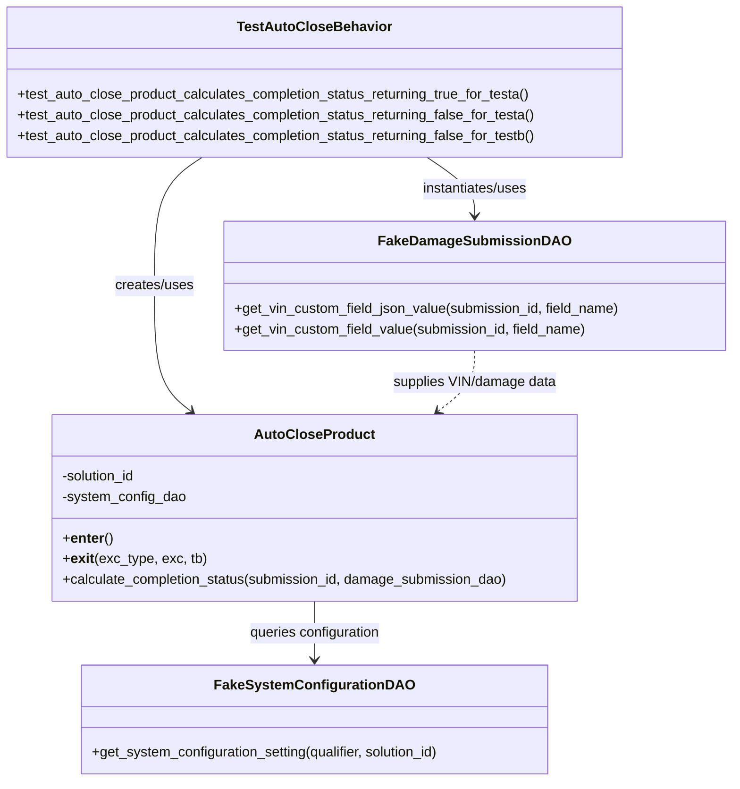

# Diagram: entity_core/entity_service/entity_service_tests/damageview_tests/test_autoclose_behavior.py

> Auto-generated by Obscura crawlers

## Mermaid

### SVG

<svg id="container" width="850.197265625" xmlns="http://www.w3.org/2000/svg" class="classDiagram" height="904" viewBox="0 0 850.197265625 904" role="graphics-document document" aria-roledescription="class"><g><defs><marker id="container_class-aggregationStart" class="marker aggregation class" refX="18" refY="7" markerWidth="190" markerHeight="240" orient="auto"><path d="M 18,7 L9,13 L1,7 L9,1 Z"></path></marker></defs><defs><marker id="container_class-aggregationEnd" class="marker aggregation class" refX="1" refY="7" markerWidth="20" markerHeight="28" orient="auto"><path d="M 18,7 L9,13 L1,7 L9,1 Z"></path></marker></defs><defs><marker id="container_class-extensionStart" class="marker extension class" refX="18" refY="7" markerWidth="190" markerHeight="240" orient="auto"><path d="M 1,7 L18,13 V 1 Z"></path></marker></defs><defs><marker id="container_class-extensionEnd" class="marker extension class" refX="1" refY="7" markerWidth="20" markerHeight="28" orient="auto"><path d="M 1,1 V 13 L18,7 Z"></path></marker></defs><defs><marker id="container_class-compositionStart" class="marker composition class" refX="18" refY="7" markerWidth="190" markerHeight="240" orient="auto"><path d="M 18,7 L9,13 L1,7 L9,1 Z"></path></marker></defs><defs><marker id="container_class-compositionEnd" class="marker composition class" refX="1" refY="7" markerWidth="20" markerHeight="28" orient="auto"><path d="M 18,7 L9,13 L1,7 L9,1 Z"></path></marker></defs><defs><marker id="container_class-dependencyStart" class="marker dependency class" refX="6" refY="7" markerWidth="190" markerHeight="240" orient="auto"><path d="M 5,7 L9,13 L1,7 L9,1 Z"></path></marker></defs><defs><marker id="container_class-dependencyEnd" class="marker dependency class" refX="13" refY="7" markerWidth="20" markerHeight="28" orient="auto"><path d="M 18,7 L9,13 L14,7 L9,1 Z"></path></marker></defs><defs><marker id="container_class-lollipopStart" class="marker lollipop class" refX="13" refY="7" markerWidth="190" markerHeight="240" orient="auto"><circle stroke="black" fill="transparent" cx="7" cy="7" r="6"></circle></marker></defs><defs><marker id="container_class-lollipopEnd" class="marker lollipop class" refX="1" refY="7" markerWidth="190" markerHeight="240" orient="auto"><circle stroke="black" fill="transparent" cx="7" cy="7" r="6"></circle></marker></defs><g class="root"><g class="clusters"></g><g class="edgePaths"><path d="M237.061,182L227.835,188.167C218.609,194.333,200.157,206.667,190.931,231.5C181.705,256.333,181.705,293.667,181.705,331C181.705,368.333,181.705,405.667,188.807,429.884C195.909,454.102,210.113,465.203,217.215,470.754L224.317,476.305" id="id_TestAutoCloseBehavior_AutoCloseProduct_1" class="edge-thickness-normal edge-pattern-solid relation" style=";;;" data-edge="true" data-et="edge" data-id="id_TestAutoCloseBehavior_AutoCloseProduct_1" data-points="W3sieCI6MjM3LjA2MTEyOTY2MjI5ODM4LCJ5IjoxODJ9LHsieCI6MTgxLjcwNTA3ODEyNSwieSI6MjE5fSx7IngiOjE4MS43MDUwNzgxMjUsInkiOjMzMX0seyJ4IjoxODEuNzA1MDc4MTI1LCJ5Ijo0NDN9LHsieCI6MjI5LjA0NDA0NjMzNjIwNjksInkiOjQ4MH1d" marker-end="url(#container_class-dependencyEnd)"></path><path d="M497.384,182L506.61,188.167C515.836,194.333,534.288,206.667,543.514,218C552.74,229.333,552.74,239.667,552.74,244.833L552.74,250" id="id_TestAutoCloseBehavior_FakeDamageSubmissionDAO_2" class="edge-thickness-normal edge-pattern-solid relation" style=";;;" data-edge="true" data-et="edge" data-id="id_TestAutoCloseBehavior_FakeDamageSubmissionDAO_2" data-points="W3sieCI6NDk3LjM4NDE4MjgzNzcwMTYsInkiOjE4Mn0seyJ4Ijo1NTIuNzQwMjM0Mzc1LCJ5IjoyMTl9LHsieCI6NTUyLjc0MDIzNDM3NSwieSI6MjU2fV0=" marker-end="url(#container_class-dependencyEnd)"></path><path d="M367.223,696L367.223,702.167C367.223,708.333,367.223,720.667,367.223,732C367.223,743.333,367.223,753.667,367.223,758.833L367.223,764" id="id_AutoCloseProduct_FakeSystemConfigurationDAO_3" class="edge-thickness-normal edge-pattern-solid relation" style=";;;" data-edge="true" data-et="edge" data-id="id_AutoCloseProduct_FakeSystemConfigurationDAO_3" data-points="W3sieCI6MzY3LjIyMjY1NjI1LCJ5Ijo2OTZ9LHsieCI6MzY3LjIyMjY1NjI1LCJ5Ijo3MzN9LHsieCI6MzY3LjIyMjY1NjI1LCJ5Ijo3NzB9XQ==" marker-end="url(#container_class-dependencyEnd)"></path><path d="M552.74,406L552.74,412.167C552.74,418.333,552.74,430.667,545.638,442.384C538.536,454.102,524.332,465.203,517.231,470.754L510.129,476.305" id="id_FakeDamageSubmissionDAO_AutoCloseProduct_4" class="edge-thickness-normal edge-pattern-dashed relation" style=";;;" data-edge="true" data-et="edge" data-id="id_FakeDamageSubmissionDAO_AutoCloseProduct_4" data-points="W3sieCI6NTUyLjc0MDIzNDM3NSwieSI6NDA2fSx7IngiOjU1Mi43NDAyMzQzNzUsInkiOjQ0M30seyJ4Ijo1MDUuNDAxMjY2MTYzNzkzMTQsInkiOjQ4MH1d" marker-end="url(#container_class-dependencyEnd)"></path></g><g class="edgeLabels"><g class="edgeLabel" transform="translate(181.705078125, 331)"><g class="label" data-id="id_TestAutoCloseBehavior_AutoCloseProduct_1" transform="translate(-46.578125, -12)"><foreignObject width="93.15625" height="24">

creates/uses

</foreignObject></g></g><g class="edgeLabel" transform="translate(552.740234375, 219)"><g class="label" data-id="id_TestAutoCloseBehavior_FakeDamageSubmissionDAO_2" transform="translate(-63.3203125, -12)"><foreignObject width="126.640625" height="24">

instantiates/uses

</foreignObject></g></g><g class="edgeLabel" transform="translate(367.22265625, 733)"><g class="label" data-id="id_AutoCloseProduct_FakeSystemConfigurationDAO_3" transform="translate(-77.390625, -12)"><foreignObject width="154.78125" height="24">

queries configuration

</foreignObject></g></g><g class="edgeLabel" transform="translate(552.740234375, 443)"><g class="label" data-id="id_FakeDamageSubmissionDAO_AutoCloseProduct_4" transform="translate(-95.84375, -12)"><foreignObject width="191.6875" height="24">

supplies VIN/damage data

</foreignObject></g></g></g><g class="nodes"><g class="node default" id="classId-FakeSystemConfigurationDAO-0" transform="translate(367.22265625, 833)"><g class="basic label-container"><path d="M-271.7265625 -63 L271.7265625 -63 L271.7265625 63 L-271.7265625 63" stroke="none" stroke-width="0" fill="#ECECFF" style=""></path><path d="M-271.7265625 -63 C-116.67874597691053 -63, 38.36907054617893 -63, 271.7265625 -63 M-271.7265625 -63 C-70.25679426639883 -63, 131.21297396720234 -63, 271.7265625 -63 M271.7265625 -63 C271.7265625 -21.078877347478645, 271.7265625 20.84224530504271, 271.7265625 63 M271.7265625 -63 C271.7265625 -34.64992011211895, 271.7265625 -6.29984022423789, 271.7265625 63 M271.7265625 63 C131.95909188761524 63, -7.808378724769511 63, -271.7265625 63 M271.7265625 63 C153.6335803250136 63, 35.54059815002719 63, -271.7265625 63 M-271.7265625 63 C-271.7265625 18.27086416539359, -271.7265625 -26.45827166921282, -271.7265625 -63 M-271.7265625 63 C-271.7265625 27.75214609702296, -271.7265625 -7.495707805954083, -271.7265625 -63" stroke="#9370DB" stroke-width="1.3" fill="none" stroke-dasharray="0 0" style=""></path></g><g class="annotation-group text" transform="translate(0, -39)"></g><g class="label-group text" transform="translate(-107.75, -39)"><g class="label" style="font-weight: bolder" transform="translate(0,-12)"><foreignObject width="215.5" height="24">

FakeSystemConfigurationDAO

</foreignObject></g></g><g class="members-group text" transform="translate(-259.7265625, 9)"></g><g class="methods-group text" transform="translate(-259.7265625, 39)"><g class="label" style="" transform="translate(0,-12)"><foreignObject width="411.703125" height="24">

+get_system_configuration_setting(qualifier, solution_id)

</foreignObject></g></g><g class="divider" style=""><path d="M-271.7265625 -15 C-66.99357155398963 -15, 137.73941939202075 -15, 271.7265625 -15 M-271.7265625 -15 C-122.92893990865426 -15, 25.868682682691485 -15, 271.7265625 -15" stroke="#9370DB" stroke-width="1.3" fill="none" stroke-dasharray="0 0" style=""></path></g><g class="divider" style=""><path d="M-271.7265625 9 C-62.54320050181275 9, 146.6401614963745 9, 271.7265625 9 M-271.7265625 9 C-147.2451416498813 9, -22.763720799762638 9, 271.7265625 9" stroke="#9370DB" stroke-width="1.3" fill="none" stroke-dasharray="0 0" style=""></path></g></g><g class="node default" id="classId-FakeDamageSubmissionDAO-1" transform="translate(552.740234375, 331)"><g class="basic label-container"><path d="M-289.45703125 -75 L289.45703125 -75 L289.45703125 75 L-289.45703125 75" stroke="none" stroke-width="0" fill="#ECECFF" style=""></path><path d="M-289.45703125 -75 C-104.64149117520873 -75, 80.17404889958254 -75, 289.45703125 -75 M-289.45703125 -75 C-166.16340577514217 -75, -42.86978030028436 -75, 289.45703125 -75 M289.45703125 -75 C289.45703125 -18.22316721195648, 289.45703125 38.55366557608704, 289.45703125 75 M289.45703125 -75 C289.45703125 -38.79215628864483, 289.45703125 -2.5843125772896656, 289.45703125 75 M289.45703125 75 C147.3022840538298 75, 5.147536857659588 75, -289.45703125 75 M289.45703125 75 C121.69302211721009 75, -46.07098701557982 75, -289.45703125 75 M-289.45703125 75 C-289.45703125 28.68652486423442, -289.45703125 -17.626950271531157, -289.45703125 -75 M-289.45703125 75 C-289.45703125 43.52344459830381, -289.45703125 12.046889196607623, -289.45703125 -75" stroke="#9370DB" stroke-width="1.3" fill="none" stroke-dasharray="0 0" style=""></path></g><g class="annotation-group text" transform="translate(0, -51)"></g><g class="label-group text" transform="translate(-103.2109375, -51)"><g class="label" style="font-weight: bolder" transform="translate(0,-12)"><foreignObject width="206.421875" height="24">

FakeDamageSubmissionDAO

</foreignObject></g></g><g class="members-group text" transform="translate(-277.45703125, -3)"></g><g class="methods-group text" transform="translate(-277.45703125, 27)"><g class="label" style="" transform="translate(0,-12)"><foreignObject width="451.703125" height="24">

+get_vin_custom_field_json_value(submission_id, field_name)

</foreignObject></g><g class="label" style="" transform="translate(0,12)"><foreignObject width="412.140625" height="24">

+get_vin_custom_field_value(submission_id, field_name)

</foreignObject></g></g><g class="divider" style=""><path d="M-289.45703125 -27 C-122.77831304830414 -27, 43.900405153391716 -27, 289.45703125 -27 M-289.45703125 -27 C-149.33644440541775 -27, -9.215857560835502 -27, 289.45703125 -27" stroke="#9370DB" stroke-width="1.3" fill="none" stroke-dasharray="0 0" style=""></path></g><g class="divider" style=""><path d="M-289.45703125 -3 C-64.28668243187991 -3, 160.88366638624018 -3, 289.45703125 -3 M-289.45703125 -3 C-128.77450440847582 -3, 31.90802243304836 -3, 289.45703125 -3" stroke="#9370DB" stroke-width="1.3" fill="none" stroke-dasharray="0 0" style=""></path></g></g><g class="node default" id="classId-AutoCloseProduct-2" transform="translate(367.22265625, 588)"><g class="basic label-container"><path d="M-305.875 -108 L305.875 -108 L305.875 108 L-305.875 108" stroke="none" stroke-width="0" fill="#ECECFF" style=""></path><path d="M-305.875 -108 C-90.1215877554229 -108, 125.63182448915421 -108, 305.875 -108 M-305.875 -108 C-101.19366067062549 -108, 103.48767865874902 -108, 305.875 -108 M305.875 -108 C305.875 -48.41941079038985, 305.875 11.161178419220306, 305.875 108 M305.875 -108 C305.875 -45.45393003806959, 305.875 17.092139923860813, 305.875 108 M305.875 108 C111.45964475794818 108, -82.95571048410363 108, -305.875 108 M305.875 108 C89.00831816487039 108, -127.85836367025922 108, -305.875 108 M-305.875 108 C-305.875 24.5932087319662, -305.875 -58.8135825360676, -305.875 -108 M-305.875 108 C-305.875 41.149157476672784, -305.875 -25.701685046654433, -305.875 -108" stroke="#9370DB" stroke-width="1.3" fill="none" stroke-dasharray="0 0" style=""></path></g><g class="annotation-group text" transform="translate(0, -84)"></g><g class="label-group text" transform="translate(-65.296875, -84)"><g class="label" style="font-weight: bolder" transform="translate(0,-12)"><foreignObject width="130.59375" height="24">

AutoCloseProduct

</foreignObject></g></g><g class="members-group text" transform="translate(-293.875, -36)"><g class="label" style="" transform="translate(0,-12)"><foreignObject width="88.6875" height="24">

-solution_id

</foreignObject></g><g class="label" style="" transform="translate(0,12)"><foreignObject width="144.109375" height="24">

-system_config_dao

</foreignObject></g></g><g class="methods-group text" transform="translate(-293.875, 36)"><g class="label" style="" transform="translate(0,-12)"><foreignObject width="57.5625" height="24">

+<strong>enter</strong>()

</foreignObject></g><g class="label" style="" transform="translate(0,12)"><foreignObject width="164.78125" height="24">

+<strong>exit</strong>(exc_type, exc, tb)

</foreignObject></g><g class="label" style="" transform="translate(0,36)"><foreignObject width="522.453125" height="24">

+calculate_completion_status(submission_id, damage_submission_dao)

</foreignObject></g></g><g class="divider" style=""><path d="M-305.875 -60 C-117.97251621750442 -60, 69.92996756499116 -60, 305.875 -60 M-305.875 -60 C-84.57035188903771 -60, 136.73429622192458 -60, 305.875 -60" stroke="#9370DB" stroke-width="1.3" fill="none" stroke-dasharray="0 0" style=""></path></g><g class="divider" style=""><path d="M-305.875 12 C-126.35498433036477 12, 53.165031339270456 12, 305.875 12 M-305.875 12 C-159.46027015611654 12, -13.045540312233072 12, 305.875 12" stroke="#9370DB" stroke-width="1.3" fill="none" stroke-dasharray="0 0" style=""></path></g></g><g class="node default" id="classId-TestAutoCloseBehavior-3" transform="translate(367.22265625, 95)"><g class="basic label-container"><path d="M-359.22265625 -87 L359.22265625 -87 L359.22265625 87 L-359.22265625 87" stroke="none" stroke-width="0" fill="#ECECFF" style=""></path><path d="M-359.22265625 -87 C-96.21906637393778 -87, 166.78452350212444 -87, 359.22265625 -87 M-359.22265625 -87 C-74.64863489501869 -87, 209.92538645996262 -87, 359.22265625 -87 M359.22265625 -87 C359.22265625 -45.708476500090654, 359.22265625 -4.416953000181309, 359.22265625 87 M359.22265625 -87 C359.22265625 -39.81954598515742, 359.22265625 7.360908029685163, 359.22265625 87 M359.22265625 87 C173.07363988103612 87, -13.07537648792777 87, -359.22265625 87 M359.22265625 87 C208.70162153925048 87, 58.180586828500964 87, -359.22265625 87 M-359.22265625 87 C-359.22265625 47.829776012588184, -359.22265625 8.659552025176367, -359.22265625 -87 M-359.22265625 87 C-359.22265625 32.58770378427141, -359.22265625 -21.824592431457177, -359.22265625 -87" stroke="#9370DB" stroke-width="1.3" fill="none" stroke-dasharray="0 0" style=""></path></g><g class="annotation-group text" transform="translate(0, -63)"></g><g class="label-group text" transform="translate(-84.4453125, -63)"><g class="label" style="font-weight: bolder" transform="translate(0,-12)"><foreignObject width="168.890625" height="24">

TestAutoCloseBehavior

</foreignObject></g></g><g class="members-group text" transform="translate(-347.22265625, -15)"></g><g class="methods-group text" transform="translate(-347.22265625, 15)"><g class="label" style="" transform="translate(0,-12)"><foreignObject width="604.640625" height="24">

+test_auto_close_product_calculates_completion_status_returning_true_for_testa()

</foreignObject></g><g class="label" style="" transform="translate(0,12)"><foreignObject width="609.078125" height="24">

+test_auto_close_product_calculates_completion_status_returning_false_for_testa()

</foreignObject></g><g class="label" style="" transform="translate(0,36)"><foreignObject width="610" height="24">

+test_auto_close_product_calculates_completion_status_returning_false_for_testb()

</foreignObject></g></g><g class="divider" style=""><path d="M-359.22265625 -39 C-211.46950048385193 -39, -63.71634471770386 -39, 359.22265625 -39 M-359.22265625 -39 C-146.02166273042553 -39, 67.17933078914893 -39, 359.22265625 -39" stroke="#9370DB" stroke-width="1.3" fill="none" stroke-dasharray="0 0" style=""></path></g><g class="divider" style=""><path d="M-359.22265625 -15 C-86.06347488049039 -15, 187.09570648901922 -15, 359.22265625 -15 M-359.22265625 -15 C-92.56185444373796 -15, 174.0989473625241 -15, 359.22265625 -15" stroke="#9370DB" stroke-width="1.3" fill="none" stroke-dasharray="0 0" style=""></path></g></g></g></g></g></svg>
