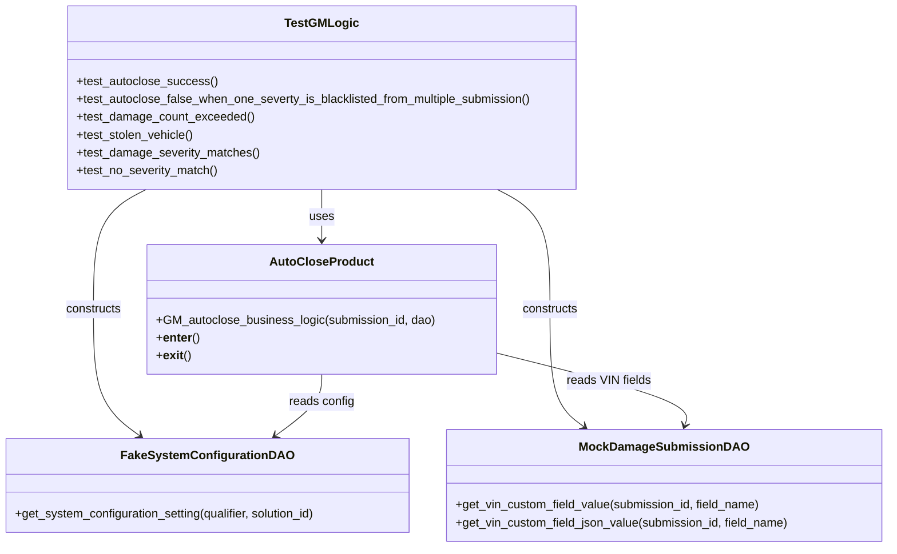
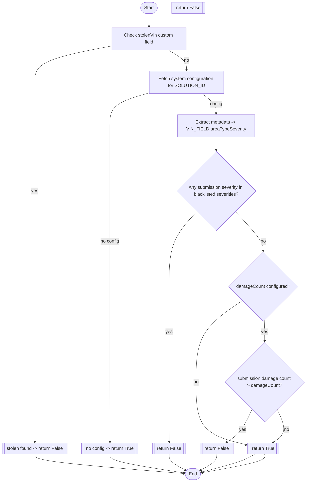

# Diagram: entity_core/entity_service/entity_service_tests/damageview_tests/test_gm_autoclose_business_logic.py

> Auto-generated by Obscura crawlers

## Diagram 1

### SVG

<svg id="container" width="1191.046875" xmlns="http://www.w3.org/2000/svg" class="classDiagram" height="734" viewBox="0 0 1191.046875 734" role="graphics-document document" aria-roledescription="class"><g><defs><marker id="container_class-aggregationStart" class="marker aggregation class" refX="18" refY="7" markerWidth="190" markerHeight="240" orient="auto"><path d="M 18,7 L9,13 L1,7 L9,1 Z"></path></marker></defs><defs><marker id="container_class-aggregationEnd" class="marker aggregation class" refX="1" refY="7" markerWidth="20" markerHeight="28" orient="auto"><path d="M 18,7 L9,13 L1,7 L9,1 Z"></path></marker></defs><defs><marker id="container_class-extensionStart" class="marker extension class" refX="18" refY="7" markerWidth="190" markerHeight="240" orient="auto"><path d="M 1,7 L18,13 V 1 Z"></path></marker></defs><defs><marker id="container_class-extensionEnd" class="marker extension class" refX="1" refY="7" markerWidth="20" markerHeight="28" orient="auto"><path d="M 1,1 V 13 L18,7 Z"></path></marker></defs><defs><marker id="container_class-compositionStart" class="marker composition class" refX="18" refY="7" markerWidth="190" markerHeight="240" orient="auto"><path d="M 18,7 L9,13 L1,7 L9,1 Z"></path></marker></defs><defs><marker id="container_class-compositionEnd" class="marker composition class" refX="1" refY="7" markerWidth="20" markerHeight="28" orient="auto"><path d="M 18,7 L9,13 L1,7 L9,1 Z"></path></marker></defs><defs><marker id="container_class-dependencyStart" class="marker dependency class" refX="6" refY="7" markerWidth="190" markerHeight="240" orient="auto"><path d="M 5,7 L9,13 L1,7 L9,1 Z"></path></marker></defs><defs><marker id="container_class-dependencyEnd" class="marker dependency class" refX="13" refY="7" markerWidth="20" markerHeight="28" orient="auto"><path d="M 18,7 L9,13 L14,7 L9,1 Z"></path></marker></defs><defs><marker id="container_class-lollipopStart" class="marker lollipop class" refX="13" refY="7" markerWidth="190" markerHeight="240" orient="auto"><circle stroke="black" fill="transparent" cx="7" cy="7" r="6"></circle></marker></defs><defs><marker id="container_class-lollipopEnd" class="marker lollipop class" refX="1" refY="7" markerWidth="190" markerHeight="240" orient="auto"><circle stroke="black" fill="transparent" cx="7" cy="7" r="6"></circle></marker></defs><g class="root"><g class="clusters"></g><g class="edgePaths"><path d="M433.699,254L433.699,260.167C433.699,266.333,433.699,278.667,433.699,290C433.699,301.333,433.699,311.667,433.699,316.833L433.699,322" id="id_TestGMLogic_AutoCloseProduct_1" class="edge-thickness-normal edge-pattern-solid relation" style=";;;" data-edge="true" data-et="edge" data-id="id_TestGMLogic_AutoCloseProduct_1" data-points="W3sieCI6NDMzLjY5OTIxODc1LCJ5IjoyNTR9LHsieCI6NDMzLjY5OTIxODc1LCJ5IjoyOTF9LHsieCI6NDMzLjY5OTIxODc1LCJ5IjozMjh9XQ==" marker-end="url(#container_class-dependencyEnd)"></path><path d="M667.844,254L679.583,260.167C691.322,266.333,714.799,278.667,726.538,305.5C738.277,332.333,738.277,373.667,738.277,415C738.277,456.333,738.277,497.667,745.946,523.912C753.615,550.157,768.953,561.314,776.622,566.892L784.291,572.471" id="id_TestGMLogic_MockDamageSubmissionDAO_2" class="edge-thickness-normal edge-pattern-solid relation" style=";;;" data-edge="true" data-et="edge" data-id="id_TestGMLogic_MockDamageSubmissionDAO_2" data-points="W3sieCI6NjY3Ljg0MzY1MjM0Mzc1LCJ5IjoyNTR9LHsieCI6NzM4LjI3NzM0Mzc1LCJ5IjoyOTF9LHsieCI6NzM4LjI3NzM0Mzc1LCJ5Ijo0MTV9LHsieCI6NzM4LjI3NzM0Mzc1LCJ5Ijo1Mzl9LHsieCI6Nzg5LjE0MzMxMDU0Njg3NSwieSI6NTc2fV0=" marker-end="url(#container_class-dependencyEnd)"></path><path d="M198.261,254L186.457,260.167C174.653,266.333,151.045,278.667,139.241,305.5C127.438,332.333,127.438,373.667,127.438,415C127.438,456.333,127.438,497.667,137.736,525.908C148.035,554.148,168.633,569.297,178.932,576.871L189.23,584.445" id="id_TestGMLogic_FakeSystemConfigurationDAO_3" class="edge-thickness-normal edge-pattern-solid relation" style=";;;" data-edge="true" data-et="edge" data-id="id_TestGMLogic_FakeSystemConfigurationDAO_3" data-points="W3sieCI6MTk4LjI2MDUyMjQ2MDkzNzUsInkiOjI1NH0seyJ4IjoxMjcuNDM3NSwieSI6MjkxfSx7IngiOjEyNy40Mzc1LCJ5Ijo0MTV9LHsieCI6MTI3LjQzNzUsInkiOjUzOX0seyJ4IjoxOTQuMDYzOTY0ODQzNzUsInkiOjU4OH1d" marker-end="url(#container_class-dependencyEnd)"></path><path d="M433.699,502L433.699,508.167C433.699,514.333,433.699,526.667,423.281,540.412C412.862,554.157,392.025,569.314,381.607,576.892L371.188,584.471" id="id_AutoCloseProduct_FakeSystemConfigurationDAO_4" class="edge-thickness-normal edge-pattern-solid relation" style=";;;" data-edge="true" data-et="edge" data-id="id_AutoCloseProduct_FakeSystemConfigurationDAO_4" data-points="W3sieCI6NDMzLjY5OTIxODc1LCJ5Ijo1MDJ9LHsieCI6NDMzLjY5OTIxODc1LCJ5Ijo1Mzl9LHsieCI6MzY2LjMzNjE4MTY0MDYyNSwieSI6NTg4fV0=" marker-end="url(#container_class-dependencyEnd)"></path><path d="M665.434,472.852L709.594,483.877C753.755,494.901,842.077,516.951,884.46,533.195C926.842,549.44,923.286,559.88,921.508,565.1L919.73,570.32" id="id_AutoCloseProduct_MockDamageSubmissionDAO_5" class="edge-thickness-normal edge-pattern-solid relation" style=";;;" data-edge="true" data-et="edge" data-id="id_AutoCloseProduct_MockDamageSubmissionDAO_5" data-points="W3sieCI6NjY1LjQzMzU5Mzc1LCJ5Ijo0NzIuODUyMDM4ODUwMjIyMn0seyJ4Ijo5MzAuMzk4NDM3NSwieSI6NTM5fSx7IngiOjkxNy43OTU4Mjg2ODMwMzU3LCJ5Ijo1NzZ9XQ==" marker-end="url(#container_class-dependencyEnd)"></path></g><g class="edgeLabels"><g class="edgeLabel" transform="translate(433.69921875, 291)"><g class="label" data-id="id_TestGMLogic_AutoCloseProduct_1" transform="translate(-16.4921875, -12)"><foreignObject width="32.984375" height="24">

uses

</foreignObject></g></g><g class="edgeLabel" transform="translate(738.27734375, 415)"><g class="label" data-id="id_TestGMLogic_MockDamageSubmissionDAO_2" transform="translate(-37.84375, -12)"><foreignObject width="75.6875" height="24">

constructs

</foreignObject></g></g><g class="edgeLabel" transform="translate(127.4375, 415)"><g class="label" data-id="id_TestGMLogic_FakeSystemConfigurationDAO_3" transform="translate(-37.84375, -12)"><foreignObject width="75.6875" height="24">

constructs

</foreignObject></g></g><g class="edgeLabel" transform="translate(433.69921875, 539)"><g class="label" data-id="id_AutoCloseProduct_FakeSystemConfigurationDAO_4" transform="translate(-43.90625, -12)"><foreignObject width="87.8125" height="24">

reads config

</foreignObject></g></g><g class="edgeLabel" transform="translate(816.87776, 510.65978)"><g class="label" data-id="id_AutoCloseProduct_MockDamageSubmissionDAO_5" transform="translate(-56.296875, -12)"><foreignObject width="112.59375" height="24">

reads VIN fields

</foreignObject></g></g></g><g class="nodes"><g class="node default" id="classId-AutoCloseProduct-0" transform="translate(433.69921875, 415)"><g class="basic label-container"><path d="M-231.734375 -87 L231.734375 -87 L231.734375 87 L-231.734375 87" stroke="none" stroke-width="0" fill="#ECECFF" style=""></path><path d="M-231.734375 -87 C-133.83461104361498 -87, -35.93484708722997 -87, 231.734375 -87 M-231.734375 -87 C-78.76548707656656 -87, 74.20340084686688 -87, 231.734375 -87 M231.734375 -87 C231.734375 -31.52924365638156, 231.734375 23.94151268723688, 231.734375 87 M231.734375 -87 C231.734375 -32.412486803291095, 231.734375 22.17502639341781, 231.734375 87 M231.734375 87 C101.84616690090337 87, -28.04204119819326 87, -231.734375 87 M231.734375 87 C59.05094200736161 87, -113.63249098527677 87, -231.734375 87 M-231.734375 87 C-231.734375 17.51270798956871, -231.734375 -51.97458402086258, -231.734375 -87 M-231.734375 87 C-231.734375 48.48772648373508, -231.734375 9.975452967470162, -231.734375 -87" stroke="#9370DB" stroke-width="1.3" fill="none" stroke-dasharray="0 0" style=""></path></g><g class="annotation-group text" transform="translate(0, -63)"></g><g class="label-group text" transform="translate(-65.296875, -63)"><g class="label" style="font-weight: bolder" transform="translate(0,-12)"><foreignObject width="130.59375" height="24">

AutoCloseProduct

</foreignObject></g></g><g class="members-group text" transform="translate(-219.734375, -15)"></g><g class="methods-group text" transform="translate(-219.734375, 15)"><g class="label" style="" transform="translate(0,-12)"><foreignObject width="374.171875" height="24">

+GM_autoclose_business_logic(submission_id, dao)

</foreignObject></g><g class="label" style="" transform="translate(0,12)"><foreignObject width="57.5625" height="24">

+<strong>enter</strong>()

</foreignObject></g><g class="label" style="" transform="translate(0,36)"><foreignObject width="45.875" height="24">

+<strong>exit</strong>()

</foreignObject></g></g><g class="divider" style=""><path d="M-231.734375 -39 C-109.84929391521442 -39, 12.035787169571165 -39, 231.734375 -39 M-231.734375 -39 C-100.91977894269928 -39, 29.894817114601437 -39, 231.734375 -39" stroke="#9370DB" stroke-width="1.3" fill="none" stroke-dasharray="0 0" style=""></path></g><g class="divider" style=""><path d="M-231.734375 -15 C-107.54601121788652 -15, 16.642352564226968 -15, 231.734375 -15 M-231.734375 -15 C-87.87406424671096 -15, 55.986246506578084 -15, 231.734375 -15" stroke="#9370DB" stroke-width="1.3" fill="none" stroke-dasharray="0 0" style=""></path></g></g><g class="node default" id="classId-FakeSystemConfigurationDAO-1" transform="translate(279.7265625, 651)"><g class="basic label-container"><path d="M-271.7265625 -63 L271.7265625 -63 L271.7265625 63 L-271.7265625 63" stroke="none" stroke-width="0" fill="#ECECFF" style=""></path><path d="M-271.7265625 -63 C-158.3992735509123 -63, -45.071984601824624 -63, 271.7265625 -63 M-271.7265625 -63 C-92.39287741652225 -63, 86.9408076669555 -63, 271.7265625 -63 M271.7265625 -63 C271.7265625 -18.31785427019659, 271.7265625 26.364291459606818, 271.7265625 63 M271.7265625 -63 C271.7265625 -14.96966540440551, 271.7265625 33.06066919118898, 271.7265625 63 M271.7265625 63 C135.20482743175467 63, -1.3169076364906687 63, -271.7265625 63 M271.7265625 63 C136.96127260230364 63, 2.1959827046072746 63, -271.7265625 63 M-271.7265625 63 C-271.7265625 18.56670223754692, -271.7265625 -25.86659552490616, -271.7265625 -63 M-271.7265625 63 C-271.7265625 18.78785627889158, -271.7265625 -25.424287442216837, -271.7265625 -63" stroke="#9370DB" stroke-width="1.3" fill="none" stroke-dasharray="0 0" style=""></path></g><g class="annotation-group text" transform="translate(0, -39)"></g><g class="label-group text" transform="translate(-107.75, -39)"><g class="label" style="font-weight: bolder" transform="translate(0,-12)"><foreignObject width="215.5" height="24">

FakeSystemConfigurationDAO

</foreignObject></g></g><g class="members-group text" transform="translate(-259.7265625, 9)"></g><g class="methods-group text" transform="translate(-259.7265625, 39)"><g class="label" style="" transform="translate(0,-12)"><foreignObject width="411.703125" height="24">

+get_system_configuration_setting(qualifier, solution_id)

</foreignObject></g></g><g class="divider" style=""><path d="M-271.7265625 -15 C-145.71276028703238 -15, -19.698958074064763 -15, 271.7265625 -15 M-271.7265625 -15 C-142.0683041103715 -15, -12.410045720743028 -15, 271.7265625 -15" stroke="#9370DB" stroke-width="1.3" fill="none" stroke-dasharray="0 0" style=""></path></g><g class="divider" style=""><path d="M-271.7265625 9 C-142.24301929131272 9, -12.75947608262544 9, 271.7265625 9 M-271.7265625 9 C-157.55683529481075 9, -43.387108089621535 9, 271.7265625 9" stroke="#9370DB" stroke-width="1.3" fill="none" stroke-dasharray="0 0" style=""></path></g></g><g class="node default" id="classId-MockDamageSubmissionDAO-2" transform="translate(892.25, 651)"><g class="basic label-container"><path d="M-290.796875 -75 L290.796875 -75 L290.796875 75 L-290.796875 75" stroke="none" stroke-width="0" fill="#ECECFF" style=""></path><path d="M-290.796875 -75 C-122.78111481679565 -75, 45.2346453664087 -75, 290.796875 -75 M-290.796875 -75 C-127.2990961166814 -75, 36.198682766637205 -75, 290.796875 -75 M290.796875 -75 C290.796875 -38.257493565689174, 290.796875 -1.5149871313783478, 290.796875 75 M290.796875 -75 C290.796875 -26.504033575143495, 290.796875 21.99193284971301, 290.796875 75 M290.796875 75 C151.5464853469843 75, 12.296095693968596 75, -290.796875 75 M290.796875 75 C151.9200028529757 75, 13.043130705951398 75, -290.796875 75 M-290.796875 75 C-290.796875 21.174639409657814, -290.796875 -32.65072118068437, -290.796875 -75 M-290.796875 75 C-290.796875 36.03775662688988, -290.796875 -2.9244867462202393, -290.796875 -75" stroke="#9370DB" stroke-width="1.3" fill="none" stroke-dasharray="0 0" style=""></path></g><g class="annotation-group text" transform="translate(0, -51)"></g><g class="label-group text" transform="translate(-105.890625, -51)"><g class="label" style="font-weight: bolder" transform="translate(0,-12)"><foreignObject width="211.78125" height="24">

MockDamageSubmissionDAO

</foreignObject></g></g><g class="members-group text" transform="translate(-278.796875, -3)"></g><g class="methods-group text" transform="translate(-278.796875, 27)"><g class="label" style="" transform="translate(0,-12)"><foreignObject width="412.140625" height="24">

+get_vin_custom_field_value(submission_id, field_name)

</foreignObject></g><g class="label" style="" transform="translate(0,12)"><foreignObject width="451.703125" height="24">

+get_vin_custom_field_json_value(submission_id, field_name)

</foreignObject></g></g><g class="divider" style=""><path d="M-290.796875 -27 C-94.96151394392035 -27, 100.8738471121593 -27, 290.796875 -27 M-290.796875 -27 C-169.1514101819197 -27, -47.50594536383937 -27, 290.796875 -27" stroke="#9370DB" stroke-width="1.3" fill="none" stroke-dasharray="0 0" style=""></path></g><g class="divider" style=""><path d="M-290.796875 -3 C-62.93671225013253 -3, 164.92345049973494 -3, 290.796875 -3 M-290.796875 -3 C-145.0839148408602 -3, 0.6290453182796227 -3, 290.796875 -3" stroke="#9370DB" stroke-width="1.3" fill="none" stroke-dasharray="0 0" style=""></path></g></g><g class="node default" id="classId-TestGMLogic-3" transform="translate(433.69921875, 131)"><g class="basic label-container"><path d="M-343.79296875 -123 L343.79296875 -123 L343.79296875 123 L-343.79296875 123" stroke="none" stroke-width="0" fill="#ECECFF" style=""></path><path d="M-343.79296875 -123 C-165.17123838514095 -123, 13.450491979718095 -123, 343.79296875 -123 M-343.79296875 -123 C-184.69156467419327 -123, -25.590160598386547 -123, 343.79296875 -123 M343.79296875 -123 C343.79296875 -65.45027254287902, 343.79296875 -7.900545085758054, 343.79296875 123 M343.79296875 -123 C343.79296875 -54.1258679980524, 343.79296875 14.748264003895201, 343.79296875 123 M343.79296875 123 C193.5084759409229 123, 43.223983131845785 123, -343.79296875 123 M343.79296875 123 C180.79826217302366 123, 17.803555596047318 123, -343.79296875 123 M-343.79296875 123 C-343.79296875 55.81718498256653, -343.79296875 -11.365630034866939, -343.79296875 -123 M-343.79296875 123 C-343.79296875 56.87974789985448, -343.79296875 -9.240504200291042, -343.79296875 -123" stroke="#9370DB" stroke-width="1.3" fill="none" stroke-dasharray="0 0" style=""></path></g><g class="annotation-group text" transform="translate(0, -99)"></g><g class="label-group text" transform="translate(-45.7734375, -99)"><g class="label" style="font-weight: bolder" transform="translate(0,-12)"><foreignObject width="91.546875" height="24">

TestGMLogic

</foreignObject></g></g><g class="members-group text" transform="translate(-331.79296875, -51)"></g><g class="methods-group text" transform="translate(-331.79296875, -21)"><g class="label" style="" transform="translate(0,-12)"><foreignObject width="187.421875" height="24">

+test_autoclose_success()

</foreignObject></g><g class="label" style="" transform="translate(0,12)"><foreignObject width="617.8125" height="24">

+test_autoclose_false_when_one_severty_is_blacklisted_from_multiple_submission()

</foreignObject></g><g class="label" style="" transform="translate(0,36)"><foreignObject width="236.734375" height="24">

+test_damage_count_exceeded()

</foreignObject></g><g class="label" style="" transform="translate(0,60)"><foreignObject width="158.390625" height="24">

+test_stolen_vehicle()

</foreignObject></g><g class="label" style="" transform="translate(0,84)"><foreignObject width="245.015625" height="24">

+test_damage_severity_matches()

</foreignObject></g><g class="label" style="" transform="translate(0,108)"><foreignObject width="190.546875" height="24">

+test_no_severity_match()

</foreignObject></g></g><g class="divider" style=""><path d="M-343.79296875 -75 C-161.4881725053236 -75, 20.816623739352792 -75, 343.79296875 -75 M-343.79296875 -75 C-139.95473666801368 -75, 63.88349541397264 -75, 343.79296875 -75" stroke="#9370DB" stroke-width="1.3" fill="none" stroke-dasharray="0 0" style=""></path></g><g class="divider" style=""><path d="M-343.79296875 -51 C-92.20928145892884 -51, 159.37440583214232 -51, 343.79296875 -51 M-343.79296875 -51 C-183.5438379547844 -51, -23.294707159568816 -51, 343.79296875 -51" stroke="#9370DB" stroke-width="1.3" fill="none" stroke-dasharray="0 0" style=""></path></g></g></g></g></g></svg>

## Diagram 2

### SVG

<svg id="container" width="1081.8203125" xmlns="http://www.w3.org/2000/svg" class="flowchart" height="1709.0625" viewBox="0 0 1081.8203125 1709.0625" role="graphics-document document" aria-roledescription="flowchart-v2"><g><marker id="container_flowchart-v2-pointEnd" class="marker flowchart-v2" viewBox="0 0 10 10" refX="5" refY="5" markerUnits="userSpaceOnUse" markerWidth="8" markerHeight="8" orient="auto"><path d="M 0 0 L 10 5 L 0 10 z" class="arrowMarkerPath" style="stroke-width: 1; stroke-dasharray: 1, 0;"></path></marker><marker id="container_flowchart-v2-pointStart" class="marker flowchart-v2" viewBox="0 0 10 10" refX="4.5" refY="5" markerUnits="userSpaceOnUse" markerWidth="8" markerHeight="8" orient="auto"><path d="M 0 5 L 10 10 L 10 0 z" class="arrowMarkerPath" style="stroke-width: 1; stroke-dasharray: 1, 0;"></path></marker><marker id="container_flowchart-v2-circleEnd" class="marker flowchart-v2" viewBox="0 0 10 10" refX="11" refY="5" markerUnits="userSpaceOnUse" markerWidth="11" markerHeight="11" orient="auto"><circle cx="5" cy="5" r="5" class="arrowMarkerPath" style="stroke-width: 1; stroke-dasharray: 1, 0;"></circle></marker><marker id="container_flowchart-v2-circleStart" class="marker flowchart-v2" viewBox="0 0 10 10" refX="-1" refY="5" markerUnits="userSpaceOnUse" markerWidth="11" markerHeight="11" orient="auto"><circle cx="5" cy="5" r="5" class="arrowMarkerPath" style="stroke-width: 1; stroke-dasharray: 1, 0;"></circle></marker><marker id="container_flowchart-v2-crossEnd" class="marker cross flowchart-v2" viewBox="0 0 11 11" refX="12" refY="5.2" markerUnits="userSpaceOnUse" markerWidth="11" markerHeight="11" orient="auto"><path d="M 1,1 l 9,9 M 10,1 l -9,9" class="arrowMarkerPath" style="stroke-width: 2; stroke-dasharray: 1, 0;"></path></marker><marker id="container_flowchart-v2-crossStart" class="marker cross flowchart-v2" viewBox="0 0 11 11" refX="-1" refY="5.2" markerUnits="userSpaceOnUse" markerWidth="11" markerHeight="11" orient="auto"><path d="M 1,1 l 9,9 M 10,1 l -9,9" class="arrowMarkerPath" style="stroke-width: 2; stroke-dasharray: 1, 0;"></path></marker><g class="root"><g class="clusters"></g><g class="edgePaths"><path d="M527.332,47.5L527.249,51.583C527.165,55.667,526.999,63.833,526.915,71.417C526.832,79,526.832,86,526.832,89.5L526.832,93" id="L_Start_CheckStolen_0" class="edge-thickness-normal edge-pattern-solid edge-thickness-normal edge-pattern-solid flowchart-link" style=";" data-edge="true" data-et="edge" data-id="L_Start_CheckStolen_0" data-points="W3sieCI6NTI3LjMzMjAzMTI1LCJ5Ijo0Ny41fSx7IngiOjUyNi44MzIwMzEyNSwieSI6NzJ9LHsieCI6NTI2LjgzMjAzMTI1LCJ5Ijo5N31d" marker-end="url(#container_flowchart-v2-pointEnd)"></path><path d="M396.832,160.496L351.277,169.08C305.721,177.664,214.611,194.832,169.055,216.083C123.5,237.333,123.5,262.667,123.5,288C123.5,313.333,123.5,338.667,123.5,364C123.5,389.333,123.5,414.667,123.5,438C123.5,461.333,123.5,482.667,123.5,520.667C123.5,558.667,123.5,613.333,123.5,670C123.5,726.667,123.5,785.333,123.5,841.005C123.5,896.677,123.5,949.354,123.5,1002.031C123.5,1054.708,123.5,1107.385,123.5,1163.057C123.5,1218.729,123.5,1277.396,123.5,1336.063C123.5,1394.729,123.5,1453.396,123.574,1488.313C123.649,1523.229,123.798,1534.396,123.872,1539.979L123.947,1545.563" id="L_CheckStolen_StolenTrue_0" class="edge-thickness-normal edge-pattern-solid edge-thickness-normal edge-pattern-solid flowchart-link" style=";" data-edge="true" data-et="edge" data-id="L_CheckStolen_StolenTrue_0" data-points="W3sieCI6Mzk2LjgzMjAzMTI1LCJ5IjoxNjAuNDk1OTQ2ODQ5MDAxOTd9LHsieCI6MTIzLjUsInkiOjIxMn0seyJ4IjoxMjMuNSwieSI6Mjg4fSx7IngiOjEyMy41LCJ5IjozNjR9LHsieCI6MTIzLjUsInkiOjQ0MH0seyJ4IjoxMjMuNSwieSI6NTA0fSx7IngiOjEyMy41LCJ5Ijo2Njh9LHsieCI6MTIzLjUsInkiOjg0NH0seyJ4IjoxMjMuNSwieSI6MTAwMi4wMzEyNX0seyJ4IjoxMjMuNSwieSI6MTE2MC4wNjI1fSx7IngiOjEyMy41LCJ5IjoxMzM2LjA2MjV9LHsieCI6MTIzLjUsInkiOjE1MTIuMDYyNX0seyJ4IjoxMjQsInkiOjE1NDkuNTYyNX1d" marker-end="url(#container_flowchart-v2-pointEnd)"></path><path d="M124,1612.563L123.917,1616.646C123.833,1620.729,123.667,1628.896,211.827,1640.081C299.988,1651.267,476.476,1665.472,564.72,1672.574L652.964,1679.676" id="L_StolenTrue_End_0" class="edge-thickness-normal edge-pattern-solid edge-thickness-normal edge-pattern-solid flowchart-link" style=";" data-edge="true" data-et="edge" data-id="L_StolenTrue_End_0" data-points="W3sieCI6MTI0LCJ5IjoxNjEyLjU2MjV9LHsieCI6MTIzLjUsInkiOjE2MzcuMDYyNX0seyJ4Ijo2NTYuOTUwOTE5OTQxNjAzOCwieSI6MTY3OS45OTcxMjgzMDkyNTM2fV0=" marker-end="url(#container_flowchart-v2-pointEnd)"></path><path d="M595.18,175L605.987,181.167C616.795,187.333,638.409,199.667,649.216,211.333C660.023,223,660.023,234,660.023,239.5L660.023,245" id="L_CheckStolen_FetchConfig_0" class="edge-thickness-normal edge-pattern-solid edge-thickness-normal edge-pattern-solid flowchart-link" style=";" data-edge="true" data-et="edge" data-id="L_CheckStolen_FetchConfig_0" data-points="W3sieCI6NTk1LjE4MDI1Mjg3ODI4OTUsInkiOjE3NX0seyJ4Ijo2NjAuMDIzNDM3NSwieSI6MjEyfSx7IngiOjY2MC4wMjM0Mzc1LCJ5IjoyNDl9XQ==" marker-end="url(#container_flowchart-v2-pointEnd)"></path><path d="M530.023,324.574L506.667,331.145C483.31,337.716,436.596,350.858,413.24,370.096C389.883,389.333,389.883,414.667,389.883,438C389.883,461.333,389.883,482.667,389.883,520.667C389.883,558.667,389.883,613.333,389.883,670C389.883,726.667,389.883,785.333,389.883,841.005C389.883,896.677,389.883,949.354,389.883,1002.031C389.883,1054.708,389.883,1107.385,389.883,1163.057C389.883,1218.729,389.883,1277.396,389.883,1336.063C389.883,1394.729,389.883,1453.396,389.959,1490.313C390.036,1527.229,390.189,1542.396,390.266,1549.979L390.342,1557.563" id="L_FetchConfig_NoConfig_0" class="edge-thickness-normal edge-pattern-solid edge-thickness-normal edge-pattern-solid flowchart-link" style=";" data-edge="true" data-et="edge" data-id="L_FetchConfig_NoConfig_0" data-points="W3sieCI6NTMwLjAyMzQzNzUsInkiOjMyNC41NzM1NDM4NzE4MjZ9LHsieCI6Mzg5Ljg4MjgxMjUsInkiOjM2NH0seyJ4IjozODkuODgyODEyNSwieSI6NDQwfSx7IngiOjM4OS44ODI4MTI1LCJ5Ijo1MDR9LHsieCI6Mzg5Ljg4MjgxMjUsInkiOjY2OH0seyJ4IjozODkuODgyODEyNSwieSI6ODQ0fSx7IngiOjM4OS44ODI4MTI1LCJ5IjoxMDAyLjAzMTI1fSx7IngiOjM4OS44ODI4MTI1LCJ5IjoxMTYwLjA2MjV9LHsieCI6Mzg5Ljg4MjgxMjUsInkiOjEzMzYuMDYyNX0seyJ4IjozODkuODgyODEyNSwieSI6MTUxMi4wNjI1fSx7IngiOjM5MC4zODI4MTI1LCJ5IjoxNTYxLjU2MjV9XQ==" marker-end="url(#container_flowchart-v2-pointEnd)"></path><path d="M390.383,1600.563L390.299,1606.646C390.216,1612.729,390.049,1624.896,433.867,1637.727C477.684,1650.559,565.485,1664.056,609.386,1670.804L653.286,1677.552" id="L_NoConfig_End_0" class="edge-thickness-normal edge-pattern-solid edge-thickness-normal edge-pattern-solid flowchart-link" style=";" data-edge="true" data-et="edge" data-id="L_NoConfig_End_0" data-points="W3sieCI6MzkwLjM4MjgxMjUsInkiOjE2MDAuNTYyNX0seyJ4IjozODkuODgyODEyNSwieSI6MTYzNy4wNjI1fSx7IngiOjY1Ny4yMzk3NzIwNzIwOTI0LCJ5IjoxNjc4LjE2MDE2Njc3NDk5NjV9XQ==" marker-end="url(#container_flowchart-v2-pointEnd)"></path><path d="M713.699,327L722.186,333.167C730.673,339.333,747.647,351.667,756.134,363.333C764.621,375,764.621,386,764.621,391.5L764.621,397" id="L_FetchConfig_ParseMeta_0" class="edge-thickness-normal edge-pattern-solid edge-thickness-normal edge-pattern-solid flowchart-link" style=";" data-edge="true" data-et="edge" data-id="L_FetchConfig_ParseMeta_0" data-points="W3sieCI6NzEzLjY5ODU1MDU3NTY1NzksInkiOjMyN30seyJ4Ijo3NjQuNjIxMDkzNzUsInkiOjM2NH0seyJ4Ijo3NjQuNjIxMDkzNzUsInkiOjQwMX1d" marker-end="url(#container_flowchart-v2-pointEnd)"></path><path d="M764.621,479L764.621,483.167C764.621,487.333,764.621,495.667,764.621,503.333C764.621,511,764.621,518,764.621,521.5L764.621,525" id="L_ParseMeta_SeverityMatch_0" class="edge-thickness-normal edge-pattern-solid edge-thickness-normal edge-pattern-solid flowchart-link" style=";" data-edge="true" data-et="edge" data-id="L_ParseMeta_SeverityMatch_0" data-points="W3sieCI6NzY0LjYyMTA5Mzc1LCJ5Ijo0Nzl9LHsieCI6NzY0LjYyMTA5Mzc1LCJ5Ijo1MDR9LHsieCI6NzY0LjYyMTA5Mzc1LCJ5Ijo1Mjl9XQ==" marker-end="url(#container_flowchart-v2-pointEnd)"></path><path d="M697.249,739.628L680.887,757.023C664.525,774.419,631.802,809.209,615.44,852.943C599.078,896.677,599.078,949.354,599.078,1002.031C599.078,1054.708,599.078,1107.385,599.078,1163.057C599.078,1218.729,599.078,1277.396,599.078,1336.063C599.078,1394.729,599.078,1453.396,599.155,1490.313C599.231,1527.229,599.385,1542.396,599.461,1549.979L599.538,1557.563" id="L_SeverityMatch_ReturnFalse1_0" class="edge-thickness-normal edge-pattern-solid edge-thickness-normal edge-pattern-solid flowchart-link" style=";" data-edge="true" data-et="edge" data-id="L_SeverityMatch_ReturnFalse1_0" data-points="W3sieCI6Njk3LjI0ODk3NzMyMDY1MjQsInkiOjczOS42Mjc4ODM1NzA2NTI0fSx7IngiOjU5OS4wNzgxMjUsInkiOjg0NH0seyJ4Ijo1OTkuMDc4MTI1LCJ5IjoxMDAyLjAzMTI1fSx7IngiOjU5OS4wNzgxMjUsInkiOjExNjAuMDYyNX0seyJ4Ijo1OTkuMDc4MTI1LCJ5IjoxMzM2LjA2MjV9LHsieCI6NTk5LjA3ODEyNSwieSI6MTUxMi4wNjI1fSx7IngiOjU5OS41NzgxMjUsInkiOjE1NjEuNTYyNX1d" marker-end="url(#container_flowchart-v2-pointEnd)"></path><path d="M599.578,1600.563L599.495,1606.646C599.411,1612.729,599.245,1624.896,608.864,1636.198C618.483,1647.501,637.888,1657.939,647.591,1663.158L657.293,1668.377" id="L_ReturnFalse1_End_0" class="edge-thickness-normal edge-pattern-solid edge-thickness-normal edge-pattern-solid flowchart-link" style=";" data-edge="true" data-et="edge" data-id="L_ReturnFalse1_End_0" data-points="W3sieCI6NTk5LjU3ODEyNSwieSI6MTYwMC41NjI1fSx7IngiOjU5OS4wNzgxMjUsInkiOjE2MzcuMDYyNX0seyJ4Ijo2NjAuODE2MDk2OTIzMjEwNSwieSI6MTY3MC4yNzE3NTQzMjA1NzQ3fV0=" marker-end="url(#container_flowchart-v2-pointEnd)"></path><path d="M831.993,739.628L848.355,757.023C864.717,774.419,897.44,809.209,913.802,832.105C930.164,855,930.164,866,930.164,871.5L930.164,877" id="L_SeverityMatch_DamageCountConfigured_0" class="edge-thickness-normal edge-pattern-solid edge-thickness-normal edge-pattern-solid flowchart-link" style=";" data-edge="true" data-et="edge" data-id="L_SeverityMatch_DamageCountConfigured_0" data-points="W3sieCI6ODMxLjk5MzIxMDE3OTM0NzYsInkiOjczOS42Mjc4ODM1NzA2NTI0fSx7IngiOjkzMC4xNjQwNjI1LCJ5Ijo4NDR9LHsieCI6OTMwLjE2NDA2MjUsInkiOjg4MX1d" marker-end="url(#container_flowchart-v2-pointEnd)"></path><path d="M857.543,1050.441L830.135,1068.712C802.728,1086.982,747.913,1123.522,720.505,1171.126C693.098,1218.729,693.098,1277.396,693.098,1336.063C693.098,1394.729,693.098,1453.396,722.694,1491.339C752.29,1529.282,811.482,1546.502,841.079,1555.111L870.675,1563.721" id="L_DamageCountConfigured_ReturnTrue_0" class="edge-thickness-normal edge-pattern-solid edge-thickness-normal edge-pattern-solid flowchart-link" style=";" data-edge="true" data-et="edge" data-id="L_DamageCountConfigured_ReturnTrue_0" data-points="W3sieCI6ODU3LjU0MjkxOTI3NzM5ODgsInkiOjEwNTAuNDQxMzU2Nzc3Mzk4OH0seyJ4Ijo2OTMuMDk3NjU2MjUsInkiOjExNjAuMDYyNX0seyJ4Ijo2OTMuMDk3NjU2MjUsInkiOjEzMzYuMDYyNX0seyJ4Ijo2OTMuMDk3NjU2MjUsInkiOjE1MTIuMDYyNX0seyJ4Ijo4NzQuNTE1NjI1LCJ5IjoxNTY0LjgzODQ4OTA1ODk3Mjh9XQ==" marker-end="url(#container_flowchart-v2-pointEnd)"></path><path d="M905.735,1600.563L897.768,1606.646C889.801,1612.729,873.867,1624.896,841.537,1637.257C809.206,1649.618,760.479,1662.174,736.115,1668.452L711.752,1674.73" id="L_ReturnTrue_End_0" class="edge-thickness-normal edge-pattern-solid edge-thickness-normal edge-pattern-solid flowchart-link" style=";" data-edge="true" data-et="edge" data-id="L_ReturnTrue_End_0" data-points="W3sieCI6OTA1LjczNDk2MjY2NTkyOTIsInkiOjE2MDAuNTYyNX0seyJ4Ijo4NTcuOTMzNTkzNzUsInkiOjE2MzcuMDYyNX0seyJ4Ijo3MDcuODc4MzQwNDAxMDA4OSwieSI6MTY3NS43MjgxMzQ0NDExNjl9XQ==" marker-end="url(#container_flowchart-v2-pointEnd)"></path><path d="M933.266,1119.961L933.441,1126.645C933.617,1133.328,933.969,1146.695,934.145,1158.879C934.32,1171.063,934.32,1182.063,934.32,1187.563L934.32,1193.063" id="L_DamageCountConfigured_DamageCountExceeded_0" class="edge-thickness-normal edge-pattern-solid edge-thickness-normal edge-pattern-solid flowchart-link" style=";" data-edge="true" data-et="edge" data-id="L_DamageCountConfigured_DamageCountExceeded_0" data-points="W3sieCI6OTMzLjI2NTYzNDAzMTc5MTksInkiOjExMTkuOTYwOTI4NDY4MjA4fSx7IngiOjkzNC4zMjAzMTI1LCJ5IjoxMTYwLjA2MjV9LHsieCI6OTM0LjMyMDMxMjUsInkiOjExOTcuMDYyNX1d" marker-end="url(#container_flowchart-v2-pointEnd)"></path><path d="M890.057,1430.8L883.729,1444.343C877.402,1457.887,864.746,1484.975,848.721,1506.35C832.696,1527.725,813.301,1543.387,803.604,1551.218L793.907,1559.049" id="L_DamageCountExceeded_ReturnFalse2_0" class="edge-thickness-normal edge-pattern-solid edge-thickness-normal edge-pattern-solid flowchart-link" style=";" data-edge="true" data-et="edge" data-id="L_DamageCountExceeded_ReturnFalse2_0" data-points="W3sieCI6ODkwLjA1NzM5MDI2Nzg2MTMsInkiOjE0MzAuNzk5NTc3NzY3ODYxMX0seyJ4Ijo4NTIuMDg5ODQzNzUsInkiOjE1MTIuMDYyNX0seyJ4Ijo3OTAuNzk0OTY0NjQ0MTYwNiwieSI6MTU2MS41NjI1fV0=" marker-end="url(#container_flowchart-v2-pointEnd)"></path><path d="M766.203,1600.563L766.12,1606.646C766.036,1612.729,765.87,1624.896,756.248,1636.194C746.627,1647.493,727.551,1657.923,718.013,1663.138L708.475,1668.353" id="L_ReturnFalse2_End_0" class="edge-thickness-normal edge-pattern-solid edge-thickness-normal edge-pattern-solid flowchart-link" style=";" data-edge="true" data-et="edge" data-id="L_ReturnFalse2_End_0" data-points="W3sieCI6NzY2LjIwMzEyNSwieSI6MTYwMC41NjI1fSx7IngiOjc2NS43MDMxMjUsInkiOjE2MzcuMDYyNX0seyJ4Ijo3MDQuOTY1MTUzODE3Nzc5NywieSI6MTY3MC4yNzE3NTM5MjQ3ODd9XQ==" marker-end="url(#container_flowchart-v2-pointEnd)"></path><path d="M978.583,1430.8L984.911,1444.343C991.239,1457.887,1003.895,1484.975,1000.526,1506.35C997.156,1527.725,977.762,1543.387,968.065,1551.218L958.368,1559.049" id="L_DamageCountExceeded_ReturnTrue_0" class="edge-thickness-normal edge-pattern-solid edge-thickness-normal edge-pattern-solid flowchart-link" style=";" data-edge="true" data-et="edge" data-id="L_DamageCountExceeded_ReturnTrue_0" data-points="W3sieCI6OTc4LjU4MzIzNDczMjEzODcsInkiOjE0MzAuNzk5NTc3NzY3ODYxMX0seyJ4IjoxMDE2LjU1MDc4MTI1LCJ5IjoxNTEyLjA2MjV9LHsieCI6OTU1LjI1NTkwMjE0NDE2MDYsInkiOjE1NjEuNTYyNX1d" marker-end="url(#container_flowchart-v2-pointEnd)"></path><path d="M934.115,1600.563L935.124,1606.646C936.132,1612.729,938.148,1624.896,901.192,1637.629C864.235,1650.362,788.307,1663.662,750.342,1670.312L712.378,1676.962" id="L_ReturnTrue_End_2" class="edge-thickness-normal edge-pattern-solid edge-thickness-normal edge-pattern-solid flowchart-link" style=";" data-edge="true" data-et="edge" data-id="L_ReturnTrue_End_2" data-points="W3sieCI6OTM0LjExNTM4OTkzMzYyODMsInkiOjE2MDAuNTYyNX0seyJ4Ijo5NDAuMTY0MDYyNSwieSI6MTYzNy4wNjI1fSx7IngiOjcwOC40Mzc3NjI0ODgxMTMsInkiOjE2NzcuNjUyMjQxMDE3MzU3NX1d" marker-end="url(#container_flowchart-v2-pointEnd)"></path></g><g class="edgeLabels"><g class="edgeLabel"><g class="label" data-id="L_Start_CheckStolen_0" transform="translate(0, 0)"><foreignObject width="0" height="0">

</foreignObject></g></g><g class="edgeLabel" transform="translate(123.5, 668)"><g class="label" data-id="L_CheckStolen_StolenTrue_0" transform="translate(-12.0078125, -12)"><foreignObject width="24.015625" height="24">

yes

</foreignObject></g></g><g class="edgeLabel"><g class="label" data-id="L_StolenTrue_End_0" transform="translate(0, 0)"><foreignObject width="0" height="0">

</foreignObject></g></g><g class="edgeLabel" transform="translate(660.0234375, 212)"><g class="label" data-id="L_CheckStolen_FetchConfig_0" transform="translate(-9.3671875, -12)"><foreignObject width="18.734375" height="24">

no

</foreignObject></g></g><g class="edgeLabel" transform="translate(389.8828125, 844)"><g class="label" data-id="L_FetchConfig_NoConfig_0" transform="translate(-33.265625, -12)"><foreignObject width="66.53125" height="24">

no config

</foreignObject></g></g><g class="edgeLabel"><g class="label" data-id="L_NoConfig_End_0" transform="translate(0, 0)"><foreignObject width="0" height="0">

</foreignObject></g></g><g class="edgeLabel" transform="translate(764.62109375, 364)"><g class="label" data-id="L_FetchConfig_ParseMeta_0" transform="translate(-21.7890625, -12)"><foreignObject width="43.578125" height="24">

config

</foreignObject></g></g><g class="edgeLabel"><g class="label" data-id="L_ParseMeta_SeverityMatch_0" transform="translate(0, 0)"><foreignObject width="0" height="0">

</foreignObject></g></g><g class="edgeLabel" transform="translate(599.078125, 1160.0625)"><g class="label" data-id="L_SeverityMatch_ReturnFalse1_0" transform="translate(-12.0078125, -12)"><foreignObject width="24.015625" height="24">

yes

</foreignObject></g></g><g class="edgeLabel"><g class="label" data-id="L_ReturnFalse1_End_0" transform="translate(0, 0)"><foreignObject width="0" height="0">

</foreignObject></g></g><g class="edgeLabel" transform="translate(930.1640625, 844)"><g class="label" data-id="L_SeverityMatch_DamageCountConfigured_0" transform="translate(-9.3671875, -12)"><foreignObject width="18.734375" height="24">

no

</foreignObject></g></g><g class="edgeLabel" transform="translate(693.09765625, 1336.0625)"><g class="label" data-id="L_DamageCountConfigured_ReturnTrue_0" transform="translate(-9.3671875, -12)"><foreignObject width="18.734375" height="24">

no

</foreignObject></g></g><g class="edgeLabel"><g class="label" data-id="L_ReturnTrue_End_0" transform="translate(0, 0)"><foreignObject width="0" height="0">

</foreignObject></g></g><g class="edgeLabel" transform="translate(934.3203125, 1160.0625)"><g class="label" data-id="L_DamageCountConfigured_DamageCountExceeded_0" transform="translate(-12.0078125, -12)"><foreignObject width="24.015625" height="24">

yes

</foreignObject></g></g><g class="edgeLabel" transform="translate(854.39861, 1507.12098)"><g class="label" data-id="L_DamageCountExceeded_ReturnFalse2_0" transform="translate(-12.0078125, -12)"><foreignObject width="24.015625" height="24">

yes

</foreignObject></g></g><g class="edgeLabel"><g class="label" data-id="L_ReturnFalse2_End_0" transform="translate(0, 0)"><foreignObject width="0" height="0">

</foreignObject></g></g><g class="edgeLabel" transform="translate(1014.24201, 1507.12098)"><g class="label" data-id="L_DamageCountExceeded_ReturnTrue_0" transform="translate(-9.3671875, -12)"><foreignObject width="18.734375" height="24">

no

</foreignObject></g></g><g class="edgeLabel"><g class="label" data-id="L_ReturnTrue_End_2" transform="translate(0, 0)"><foreignObject width="0" height="0">

</foreignObject></g></g></g><g class="nodes"><g class="node default" id="flowchart-Start-0" transform="translate(526.83203125, 27.5)"><g class="basic label-container outer-path"><path d="M-10.3984375 -19.5 C-2.3950233694472924 -19.5, 5.608390761105415 -19.5, 10.3984375 -19.5 C10.3984375 -19.5, 10.3984375 -19.5, 10.398437499999998 -19.5 C10.769034428922268 -19.488115677812626, 11.139631357844536 -19.47623135562525, 11.6478067896239 -19.45993515863156 C12.11411065885343 -19.41495138517944, 12.580414528082963 -19.36996761172732, 12.892042152847864 -19.3399052695533 C13.21808964484832 -19.28719243958273, 13.544137136848775 -19.234479609612162, 14.126030759676757 -19.140403561325776 C14.605565361557563 -19.030952917702205, 15.085099963438369 -18.92150227407863, 15.34470188623539 -18.862249829261074 C15.632642023573837 -18.776790707927645, 15.920582160912284 -18.69133158659422, 16.543047751460602 -18.50658706670804 C16.83942143582166 -18.397518811214866, 17.135795120182713 -18.288450555721692, 17.716144095147794 -18.074876768247425 C17.988605730919137 -17.954266084378713, 18.26106736669048 -17.83365540051, 18.85917041279238 -17.568892924097174 C19.17900825203113 -17.402033728232233, 19.49884609126988 -17.235174532367292, 19.967429764076783 -16.990714730406097 C20.30939779238329 -16.783411702019492, 20.6513658206898 -16.576108673632884, 21.036368073605697 -16.342718045390892 C21.43820456940192 -16.06241430114499, 21.840041065198136 -15.78211055689909, 22.061592844578712 -15.627565626425154 C22.273814539045436 -15.458324472544412, 22.486036233512156 -15.289083318663668, 23.03889120850187 -14.848196188198123 C23.40210251638263 -14.51833728842541, 23.76531382426339 -14.188478388652698, 23.964247236767985 -14.007812326905688 C24.285159952887938 -13.676443600087847, 24.60607266900789 -13.345074873270008, 24.833858442968648 -13.10986736009568 C25.08263171089913 -12.817644123984582, 25.33140497882961 -12.525420887873485, 25.644151408126582 -12.158051136245305 C25.889548186317583 -11.829241809575763, 26.134944964508584 -11.500432482906222, 26.391796464640635 -11.156274872382312 C26.612494884916284 -10.817222833015071, 26.833193305191937 -10.47817079364783, 27.073721378604247 -10.108655082055241 C27.201700625699587 -9.881414969533438, 27.329679872794927 -9.654174857011636, 27.6871239742735 -9.019496659696287 C27.820632791875717 -8.742262743314214, 27.954141609477933 -8.46502882693214, 28.22948364880834 -7.893275190886684 C28.409978721093676 -7.447448872707079, 28.590473793379015 -7.001622554527472, 28.698571729970325 -6.734618561215508 C28.84168904951646 -6.303571997390758, 28.984806369062596 -5.872525433566009, 29.09246063421488 -5.548287939305138 C29.170256723645757 -5.251617733266765, 29.248052813076633 -4.954947527228393, 29.40953178754556 -4.339158212148133 C29.473770570153214 -4.0093056403293446, 29.538009352760866 -3.6794530685105555, 29.648482276581777 -3.1121979531509023 C29.695902942165034 -2.744412635156766, 29.743323607748287 -2.3766273171626295, 29.808330202509367 -1.872449005199798 C29.83661894764804 -1.4318289654008298, 29.86490769278672 -0.9912089256018618, 29.888418715913414 -0.6250057626472757 C29.888418715913414 -0.34865148030634124, 29.888418715913414 -0.07229719796540679, 29.888418715913414 0.625005762647271 C29.859260005859113 1.0791762082301177, 29.830101295804816 1.5333466538129645, 29.808330202509367 1.8724490051997846 C29.75414808193996 2.292674832866224, 29.69996596137055 2.712900660532663, 29.648482276581777 3.1121979531508885 C29.59861737184609 3.368243700017296, 29.548752467110404 3.6242894468837035, 29.40953178754556 4.339158212148129 C29.305943831301672 4.734183984610313, 29.20235587505778 5.129209757072497, 29.092460634214884 5.548287939305125 C28.96676905183164 5.9268509592094185, 28.841077469448397 6.305413979113712, 28.69857172997033 6.734618561215495 C28.546045211319438 7.111362011182825, 28.393518692668547 7.488105461150155, 28.229483648808344 7.893275190886679 C28.067880168567967 8.228848275366378, 27.90627668832759 8.564421359846076, 27.687123974273504 9.019496659696284 C27.552688096565394 9.258201173675806, 27.418252218857283 9.496905687655328, 27.07372137860425 10.108655082055236 C26.817195808430277 10.502747244603107, 26.560670238256304 10.896839407150978, 26.39179646464064 11.156274872382301 C26.101539098913257 11.545193299466996, 25.811281733185872 11.934111726551693, 25.644151408126582 12.158051136245302 C25.40355879415126 12.440664910728275, 25.162966180175935 12.72327868521125, 24.83385844296866 13.10986736009567 C24.58305834653135 13.368839050738053, 24.332258250094036 13.627810741380436, 23.96424723676799 14.007812326905684 C23.661348736887117 14.282896730242355, 23.358450237006245 14.557981133579023, 23.038891208501887 14.848196188198111 C22.780557933358686 15.05421010058765, 22.522224658215485 15.260224012977188, 22.061592844578715 15.627565626425152 C21.669480909583214 15.901085938025927, 21.27736897458771 16.174606249626702, 21.036368073605708 16.34271804539089 C20.709478967474116 16.540880142541475, 20.382589861342527 16.73904223969206, 19.967429764076787 16.990714730406093 C19.651805422033725 17.15537574748292, 19.336181079990663 17.320036764559745, 18.859170412792388 17.56889292409717 C18.629469390053746 17.670574753024823, 18.399768367315104 17.772256581952476, 17.716144095147804 18.07487676824742 C17.293910744760797 18.230262544272144, 16.871677394373794 18.385648320296866, 16.543047751460616 18.506587066708033 C16.296268219294564 18.57982993648272, 16.049488687128516 18.653072806257406, 15.344701886235413 18.86224982926107 C15.011962710874519 18.938195374711153, 14.679223535513625 19.01414092016124, 14.126030759676766 19.140403561325773 C13.660224502963947 19.21571150452963, 13.194418246251129 19.291019447733486, 12.892042152847878 19.3399052695533 C12.450531509149592 19.382497270356637, 12.009020865451307 19.425089271159973, 11.6478067896239 19.45993515863156 C11.295032739808098 19.47124793577612, 10.942258689992297 19.48256071292068, 10.398437500000004 19.5 C10.398437500000002 19.5, 10.398437500000002 19.5, 10.3984375 19.5 C5.39652030849797 19.5, 0.3946031169959401 19.5, -10.398437499999996 19.5 C-10.700779000821875 19.490304496540674, -11.003120501643755 19.480608993081347, -11.647806789623893 19.45993515863156 C-12.058691077100704 19.420297645579325, -12.469575364577516 19.38066013252709, -12.892042152847871 19.3399052695533 C-13.144509160327427 19.29908836169489, -13.396976167806985 19.25827145383648, -14.126030759676759 19.140403561325773 C-14.600541118988582 19.032099668282324, -15.075051478300404 18.923795775238876, -15.344701886235388 18.862249829261074 C-15.671487870116254 18.76526146457987, -15.99827385399712 18.66827309989866, -16.54304775146059 18.506587066708043 C-16.937847725271784 18.361297026854572, -17.332647699082973 18.216006987001105, -17.716144095147797 18.074876768247425 C-18.16667280861961 17.875441071252897, -18.617201522091417 17.676005374258374, -18.85917041279238 17.568892924097174 C-19.243386707339052 17.368447529334457, -19.627603001885728 17.16800213457174, -19.96742976407678 16.990714730406097 C-20.277877117936562 16.802519720105142, -20.58832447179634 16.614324709804187, -21.036368073605686 16.3427180453909 C-21.392272058972743 16.094454832034053, -21.748176044339797 15.84619161867721, -22.061592844578712 15.627565626425156 C-22.31832180278288 15.42283111410183, -22.575050760987043 15.218096601778504, -23.03889120850187 14.848196188198125 C-23.351012614636847 14.564735785426205, -23.663134020771825 14.281275382654286, -23.964247236767974 14.007812326905697 C-24.2305131838168 13.732870875736978, -24.496779130865622 13.45792942456826, -24.833858442968655 13.109867360095677 C-25.008490587296787 12.904734506517341, -25.18312273162492 12.699601652939005, -25.64415140812658 12.158051136245307 C-25.903807611371704 11.81013547906359, -26.16346381461683 11.46221982188187, -26.391796464640635 11.156274872382316 C-26.624247925699507 10.799167006238696, -26.85669938675838 10.442059140095076, -27.073721378604244 10.108655082055249 C-27.30152146876404 9.704172954716077, -27.529321558923833 9.299690827376905, -27.6871239742735 9.019496659696289 C-27.86643710603205 8.647149104913273, -28.045750237790593 8.274801550130258, -28.22948364880834 7.893275190886686 C-28.371686649342617 7.5420310302590385, -28.513889649876898 7.19078686963139, -28.698571729970325 6.73461856121551 C-28.780345933656363 6.488327688663157, -28.862120137342398 6.2420368161108035, -29.09246063421488 5.5482879393051325 C-29.16599606867124 5.267865457264135, -29.2395315031276 4.987442975223137, -29.409531787545557 4.339158212148136 C-29.499802491829996 3.875637224367649, -29.59007319611444 3.4121162365871625, -29.648482276581777 3.112197953150904 C-29.70943028199141 2.639497258738769, -29.77037828740104 2.166796564326634, -29.808330202509364 1.872449005199809 C-29.826427669053338 1.590566355765365, -29.84452513559731 1.3086837063309213, -29.888418715913414 0.6250057626472781 C-29.888418715913414 0.3362709650352301, -29.888418715913414 0.04753616742318201, -29.888418715913414 -0.6250057626472687 C-29.866631126738096 -0.9643650506783263, -29.844843537562774 -1.303724338709384, -29.808330202509367 -1.8724490051997822 C-29.775867122680573 -2.1242262417917224, -29.743404042851775 -2.3760034783836623, -29.648482276581777 -3.112197953150895 C-29.584654687808772 -3.4399391315346186, -29.520827099035763 -3.767680309918342, -29.40953178754556 -4.339158212148126 C-29.29757849475834 -4.766084638409821, -29.18562520197112 -5.193011064671516, -29.092460634214884 -5.548287939305123 C-28.99740986942649 -5.834565698565027, -28.902359104638098 -6.1208434578249316, -28.698571729970332 -6.734618561215485 C-28.553968068289784 -7.091792401288049, -28.409364406609235 -7.448966241360612, -28.229483648808344 -7.893275190886676 C-28.0250294144646 -8.317828783121271, -27.82057518012086 -8.742382375355868, -27.687123974273504 -9.019496659696282 C-27.542822855655945 -9.275717907874498, -27.398521737038386 -9.531939156052712, -27.073721378604247 -10.108655082055243 C-26.835269569908842 -10.474981093487525, -26.596817761213437 -10.841307104919807, -26.39179646464064 -11.156274872382308 C-26.137991235678182 -11.496350757059977, -25.884186006715726 -11.836426641737644, -25.644151408126586 -12.158051136245302 C-25.3367743390848 -12.519113731792489, -25.029397270043017 -12.880176327339676, -24.833858442968662 -13.10986736009567 C-24.631963856318926 -13.318340096665356, -24.430069269669186 -13.526812833235041, -23.964247236767996 -14.007812326905677 C-23.70525591409266 -14.243021393624526, -23.446264591417325 -14.478230460343374, -23.038891208501887 -14.848196188198107 C-22.667572732548102 -15.144312791571622, -22.29625425659432 -15.440429394945136, -22.06159284457872 -15.627565626425149 C-21.721760958286023 -15.864617639217679, -21.381929071993323 -16.10166965201021, -21.03636807360571 -16.342718045390885 C-20.776172652755495 -16.500450038588305, -20.515977231905275 -16.658182031785724, -19.96742976407679 -16.99071473040609 C-19.620904508791842 -17.17149673412823, -19.274379253506893 -17.352278737850366, -18.859170412792388 -17.56889292409717 C-18.522630719094145 -17.71786906340207, -18.186091025395907 -17.866845202706966, -17.716144095147804 -18.07487676824742 C-17.38929446445141 -18.19516045370856, -17.062444833755013 -18.3154441391697, -16.54304775146062 -18.506587066708033 C-16.082566754755547 -18.64325540941602, -15.622085758050474 -18.779923752124013, -15.344701886235413 -18.862249829261067 C-14.931558152928613 -18.95654719037353, -14.518414419621813 -19.05084455148599, -14.126030759676768 -19.140403561325773 C-13.73206241300167 -19.204097308346043, -13.33809406632657 -19.267791055366317, -12.89204215284788 -19.3399052695533 C-12.550367499248631 -19.372866212462128, -12.208692845649383 -19.405827155370954, -11.647806789623903 -19.45993515863156 C-11.360861697711446 -19.46913692922445, -11.073916605798987 -19.478338699817346, -10.398437500000005 -19.5 C-10.398437500000004 -19.5, -10.398437500000002 -19.5, -10.3984375 -19.5" stroke="none" stroke-width="0" fill="#ECECFF" style=""></path><path d="M-10.3984375 -19.5 C-5.744254278175362 -19.5, -1.0900710563507232 -19.5, 10.3984375 -19.5 M-10.3984375 -19.5 C-5.743976604019516 -19.5, -1.0895157080390323 -19.5, 10.3984375 -19.5 M10.3984375 -19.5 C10.3984375 -19.5, 10.398437499999998 -19.5, 10.398437499999998 -19.5 M10.3984375 -19.5 C10.3984375 -19.5, 10.398437499999998 -19.5, 10.398437499999998 -19.5 M10.398437499999998 -19.5 C10.843267877577299 -19.4857351556009, 11.288098255154598 -19.471470311201802, 11.6478067896239 -19.45993515863156 M10.398437499999998 -19.5 C10.700269515521661 -19.490320834742597, 11.002101531043323 -19.4806416694852, 11.6478067896239 -19.45993515863156 M11.6478067896239 -19.45993515863156 C11.915137162244182 -19.43414611909669, 12.182467534864465 -19.408357079561824, 12.892042152847864 -19.3399052695533 M11.6478067896239 -19.45993515863156 C11.983893159168689 -19.42751331076457, 12.319979528713478 -19.39509146289758, 12.892042152847864 -19.3399052695533 M12.892042152847864 -19.3399052695533 C13.231551089008665 -19.285016097685943, 13.571060025169466 -19.23012692581859, 14.126030759676757 -19.140403561325776 M12.892042152847864 -19.3399052695533 C13.327863311115689 -19.26944508452812, 13.763684469383511 -19.19898489950294, 14.126030759676757 -19.140403561325776 M14.126030759676757 -19.140403561325776 C14.524103502087062 -19.049546055538034, 14.922176244497367 -18.95868854975029, 15.34470188623539 -18.862249829261074 M14.126030759676757 -19.140403561325776 C14.521319693521804 -19.050181441677005, 14.916608627366852 -18.959959322028233, 15.34470188623539 -18.862249829261074 M15.34470188623539 -18.862249829261074 C15.75584697148536 -18.740224126103474, 16.16699205673533 -18.618198422945877, 16.543047751460602 -18.50658706670804 M15.34470188623539 -18.862249829261074 C15.620224067464608 -18.780476292117683, 15.895746248693827 -18.698702754974295, 16.543047751460602 -18.50658706670804 M16.543047751460602 -18.50658706670804 C16.8146582524439 -18.40663189160624, 17.08626875342719 -18.306676716504438, 17.716144095147794 -18.074876768247425 M16.543047751460602 -18.50658706670804 C16.85618459616726 -18.391349813250727, 17.16932144087392 -18.276112559793415, 17.716144095147794 -18.074876768247425 M17.716144095147794 -18.074876768247425 C18.109183413477265 -17.900889921120097, 18.50222273180674 -17.72690307399277, 18.85917041279238 -17.568892924097174 M17.716144095147794 -18.074876768247425 C17.94851994104525 -17.972010874453176, 18.180895786942706 -17.869144980658923, 18.85917041279238 -17.568892924097174 M18.85917041279238 -17.568892924097174 C19.14345346728527 -17.42058263666022, 19.42773652177816 -17.272272349223268, 19.967429764076783 -16.990714730406097 M18.85917041279238 -17.568892924097174 C19.08860748214078 -17.449195751979573, 19.318044551489177 -17.32949857986197, 19.967429764076783 -16.990714730406097 M19.967429764076783 -16.990714730406097 C20.252454762039388 -16.817930901648356, 20.53747976000199 -16.645147072890616, 21.036368073605697 -16.342718045390892 M19.967429764076783 -16.990714730406097 C20.337226221374106 -16.76654194482726, 20.707022678671425 -16.54236915924842, 21.036368073605697 -16.342718045390892 M21.036368073605697 -16.342718045390892 C21.252064281146854 -16.192257708348514, 21.467760488688015 -16.041797371306135, 22.061592844578712 -15.627565626425154 M21.036368073605697 -16.342718045390892 C21.39351173214035 -16.093590089696917, 21.750655390675007 -15.84446213400294, 22.061592844578712 -15.627565626425154 M22.061592844578712 -15.627565626425154 C22.27103590763568 -15.460540357151203, 22.480478970692648 -15.293515087877251, 23.03889120850187 -14.848196188198123 M22.061592844578712 -15.627565626425154 C22.446646357436677 -15.320495696625237, 22.831699870294642 -15.013425766825321, 23.03889120850187 -14.848196188198123 M23.03889120850187 -14.848196188198123 C23.237664150150753 -14.667675861836447, 23.436437091799633 -14.487155535474772, 23.964247236767985 -14.007812326905688 M23.03889120850187 -14.848196188198123 C23.359120889067558 -14.557372065121417, 23.67935056963325 -14.26654794204471, 23.964247236767985 -14.007812326905688 M23.964247236767985 -14.007812326905688 C24.189541644500846 -13.775177353906637, 24.414836052233706 -13.542542380907586, 24.833858442968648 -13.10986736009568 M23.964247236767985 -14.007812326905688 C24.158738366722137 -13.806984267209293, 24.35322949667629 -13.606156207512898, 24.833858442968648 -13.10986736009568 M24.833858442968648 -13.10986736009568 C25.03968130151124 -12.868096118799123, 25.245504160053837 -12.626324877502565, 25.644151408126582 -12.158051136245305 M24.833858442968648 -13.10986736009568 C25.061259321144117 -12.842749349114246, 25.28866019931959 -12.575631338132812, 25.644151408126582 -12.158051136245305 M25.644151408126582 -12.158051136245305 C25.884719295224333 -11.83571208371969, 26.125287182322086 -11.513373031194075, 26.391796464640635 -11.156274872382312 M25.644151408126582 -12.158051136245305 C25.890059006784043 -11.828557356687408, 26.135966605441507 -11.499063577129512, 26.391796464640635 -11.156274872382312 M26.391796464640635 -11.156274872382312 C26.62117330248541 -10.803890453147483, 26.85055014033018 -10.451506033912654, 27.073721378604247 -10.108655082055241 M26.391796464640635 -11.156274872382312 C26.54602901438905 -10.919332258730178, 26.700261564137467 -10.682389645078045, 27.073721378604247 -10.108655082055241 M27.073721378604247 -10.108655082055241 C27.299471959468796 -9.707812066005099, 27.525222540333345 -9.306969049954958, 27.6871239742735 -9.019496659696287 M27.073721378604247 -10.108655082055241 C27.27617631204685 -9.749175846942864, 27.47863124548945 -9.389696611830486, 27.6871239742735 -9.019496659696287 M27.6871239742735 -9.019496659696287 C27.83024165030447 -8.722309743190273, 27.973359326335437 -8.425122826684259, 28.22948364880834 -7.893275190886684 M27.6871239742735 -9.019496659696287 C27.831782801149284 -8.719109510485666, 27.97644162802507 -8.418722361275044, 28.22948364880834 -7.893275190886684 M28.22948364880834 -7.893275190886684 C28.369363480337693 -7.547769302616618, 28.50924331186705 -7.20226341434655, 28.698571729970325 -6.734618561215508 M28.22948364880834 -7.893275190886684 C28.3475655748458 -7.6016105506154314, 28.465647500883257 -7.309945910344179, 28.698571729970325 -6.734618561215508 M28.698571729970325 -6.734618561215508 C28.80369519150906 -6.418003444209852, 28.9088186530478 -6.101388327204195, 29.09246063421488 -5.548287939305138 M28.698571729970325 -6.734618561215508 C28.80925396017588 -6.401261318654902, 28.919936190381435 -6.067904076094296, 29.09246063421488 -5.548287939305138 M29.09246063421488 -5.548287939305138 C29.183475549088946 -5.201208622776696, 29.274490463963012 -4.854129306248254, 29.40953178754556 -4.339158212148133 M29.09246063421488 -5.548287939305138 C29.17695218370997 -5.22608504221116, 29.261443733205066 -4.9038821451171835, 29.40953178754556 -4.339158212148133 M29.40953178754556 -4.339158212148133 C29.461517402163214 -4.0722230682500165, 29.51350301678087 -3.8052879243519007, 29.648482276581777 -3.1121979531509023 M29.40953178754556 -4.339158212148133 C29.49417371851861 -3.9045397856799644, 29.578815649491663 -3.4699213592117957, 29.648482276581777 -3.1121979531509023 M29.648482276581777 -3.1121979531509023 C29.696171744894063 -2.7423278542715126, 29.743861213206348 -2.372457755392123, 29.808330202509367 -1.872449005199798 M29.648482276581777 -3.1121979531509023 C29.684182150576266 -2.8353167801871626, 29.71988202457075 -2.558435607223423, 29.808330202509367 -1.872449005199798 M29.808330202509367 -1.872449005199798 C29.827282060244475 -1.5772585233112608, 29.846233917979582 -1.2820680414227237, 29.888418715913414 -0.6250057626472757 M29.808330202509367 -1.872449005199798 C29.830447592918432 -1.5279527967423927, 29.852564983327497 -1.1834565882849875, 29.888418715913414 -0.6250057626472757 M29.888418715913414 -0.6250057626472757 C29.888418715913414 -0.3093971396333915, 29.888418715913414 0.0062114833804927105, 29.888418715913414 0.625005762647271 M29.888418715913414 -0.6250057626472757 C29.888418715913414 -0.1711542589608695, 29.888418715913414 0.2826972447255367, 29.888418715913414 0.625005762647271 M29.888418715913414 0.625005762647271 C29.87221526822845 0.8773875395281033, 29.856011820543493 1.1297693164089355, 29.808330202509367 1.8724490051997846 M29.888418715913414 0.625005762647271 C29.857013351985408 1.11416965577946, 29.825607988057403 1.6033335489116491, 29.808330202509367 1.8724490051997846 M29.808330202509367 1.8724490051997846 C29.760321483717288 2.244795147757332, 29.712312764925205 2.6171412903148794, 29.648482276581777 3.1121979531508885 M29.808330202509367 1.8724490051997846 C29.7743012336818 2.136370967646431, 29.740272264854237 2.4002929300930766, 29.648482276581777 3.1121979531508885 M29.648482276581777 3.1121979531508885 C29.552962059298064 3.6026740806976827, 29.457441842014354 4.093150208244476, 29.40953178754556 4.339158212148129 M29.648482276581777 3.1121979531508885 C29.56558544031775 3.537855687114114, 29.482688604053727 3.963513421077339, 29.40953178754556 4.339158212148129 M29.40953178754556 4.339158212148129 C29.306480295460247 4.732138214268628, 29.20342880337493 5.125118216389127, 29.092460634214884 5.548287939305125 M29.40953178754556 4.339158212148129 C29.327735029858278 4.651084700148773, 29.245938272170996 4.963011188149418, 29.092460634214884 5.548287939305125 M29.092460634214884 5.548287939305125 C28.949015185252804 5.980322776650376, 28.805569736290725 6.412357613995627, 28.69857172997033 6.734618561215495 M29.092460634214884 5.548287939305125 C28.980981989119254 5.884043856623157, 28.869503344023624 6.219799773941189, 28.69857172997033 6.734618561215495 M28.69857172997033 6.734618561215495 C28.578097117849637 7.032193182371777, 28.457622505728942 7.329767803528059, 28.229483648808344 7.893275190886679 M28.69857172997033 6.734618561215495 C28.547910428627024 7.106754888371567, 28.397249127283715 7.478891215527639, 28.229483648808344 7.893275190886679 M28.229483648808344 7.893275190886679 C28.097215653769016 8.167932512667566, 27.96494765872969 8.442589834448452, 27.687123974273504 9.019496659696284 M28.229483648808344 7.893275190886679 C28.117120969652827 8.1265986983293, 28.004758290497314 8.35992220577192, 27.687123974273504 9.019496659696284 M27.687123974273504 9.019496659696284 C27.47139024578957 9.402553740028347, 27.255656517305642 9.78561082036041, 27.07372137860425 10.108655082055236 M27.687123974273504 9.019496659696284 C27.49790351810431 9.355476740273584, 27.308683061935117 9.691456820850885, 27.07372137860425 10.108655082055236 M27.07372137860425 10.108655082055236 C26.883977852721703 10.400152091081658, 26.694234326839155 10.69164910010808, 26.39179646464064 11.156274872382301 M27.07372137860425 10.108655082055236 C26.85499317630552 10.444680337532324, 26.63626497400679 10.780705593009412, 26.39179646464064 11.156274872382301 M26.39179646464064 11.156274872382301 C26.129084943388445 11.5082843773483, 25.86637342213625 11.860293882314298, 25.644151408126582 12.158051136245302 M26.39179646464064 11.156274872382301 C26.216629521591464 11.390982618031401, 26.041462578542287 11.6256903636805, 25.644151408126582 12.158051136245302 M25.644151408126582 12.158051136245302 C25.462610931755037 12.371298909737058, 25.281070455383492 12.584546683228814, 24.83385844296866 13.10986736009567 M25.644151408126582 12.158051136245302 C25.418335304332672 12.423307581061938, 25.192519200538765 12.688564025878573, 24.83385844296866 13.10986736009567 M24.83385844296866 13.10986736009567 C24.551375849317843 13.401553830292393, 24.268893255667027 13.693240300489117, 23.96424723676799 14.007812326905684 M24.83385844296866 13.10986736009567 C24.64112084635682 13.308884752648364, 24.448383249744982 13.507902145201056, 23.96424723676799 14.007812326905684 M23.96424723676799 14.007812326905684 C23.604183375126613 14.334812799280654, 23.244119513485238 14.661813271655623, 23.038891208501887 14.848196188198111 M23.96424723676799 14.007812326905684 C23.74307239534538 14.20867746592007, 23.521897553922773 14.409542604934458, 23.038891208501887 14.848196188198111 M23.038891208501887 14.848196188198111 C22.70474002719669 15.114672863152627, 22.37058884589149 15.381149538107142, 22.061592844578715 15.627565626425152 M23.038891208501887 14.848196188198111 C22.653966838715476 15.155163129835104, 22.26904246892906 15.4621300714721, 22.061592844578715 15.627565626425152 M22.061592844578715 15.627565626425152 C21.7044260496009 15.876709721100317, 21.347259254623086 16.125853815775482, 21.036368073605708 16.34271804539089 M22.061592844578715 15.627565626425152 C21.73530764784435 15.855168055008528, 21.409022451109987 16.082770483591904, 21.036368073605708 16.34271804539089 M21.036368073605708 16.34271804539089 C20.721003851128813 16.533893690342264, 20.40563962865192 16.725069335293643, 19.967429764076787 16.990714730406093 M21.036368073605708 16.34271804539089 C20.614274247165834 16.598593803477396, 20.19218042072596 16.854469561563903, 19.967429764076787 16.990714730406093 M19.967429764076787 16.990714730406093 C19.56115156162298 17.202669808392635, 19.154873359169173 17.414624886379176, 18.859170412792388 17.56889292409717 M19.967429764076787 16.990714730406093 C19.63230022013907 17.165551598817682, 19.297170676201354 17.34038846722927, 18.859170412792388 17.56889292409717 M18.859170412792388 17.56889292409717 C18.434661488200685 17.756810432404087, 18.01015256360898 17.944727940711, 17.716144095147804 18.07487676824742 M18.859170412792388 17.56889292409717 C18.613890527383063 17.677471053398595, 18.36861064197374 17.786049182700015, 17.716144095147804 18.07487676824742 M17.716144095147804 18.07487676824742 C17.361987076614938 18.205209824859107, 17.007830058082067 18.335542881470793, 16.543047751460616 18.506587066708033 M17.716144095147804 18.07487676824742 C17.27228923248448 18.238219460656897, 16.82843436982115 18.401562153066376, 16.543047751460616 18.506587066708033 M16.543047751460616 18.506587066708033 C16.090515923246368 18.640896137933982, 15.637984095032122 18.775205209159935, 15.344701886235413 18.86224982926107 M16.543047751460616 18.506587066708033 C16.127020720736624 18.63006170565647, 15.71099369001263 18.753536344604903, 15.344701886235413 18.86224982926107 M15.344701886235413 18.86224982926107 C15.065529727328789 18.925969052762916, 14.786357568422167 18.989688276264765, 14.126030759676766 19.140403561325773 M15.344701886235413 18.86224982926107 C14.865192304965834 18.971694762093406, 14.385682723696254 19.08113969492574, 14.126030759676766 19.140403561325773 M14.126030759676766 19.140403561325773 C13.729831815229375 19.204457934095323, 13.333632870781983 19.268512306864878, 12.892042152847878 19.3399052695533 M14.126030759676766 19.140403561325773 C13.6820108419029 19.212189258205562, 13.237990924129031 19.283974955085352, 12.892042152847878 19.3399052695533 M12.892042152847878 19.3399052695533 C12.578777014708319 19.37012558067317, 12.265511876568757 19.400345891793044, 11.6478067896239 19.45993515863156 M12.892042152847878 19.3399052695533 C12.563556620431374 19.371593873803867, 12.23507108801487 19.403282478054436, 11.6478067896239 19.45993515863156 M11.6478067896239 19.45993515863156 C11.227529112186739 19.473412645726096, 10.807251434749578 19.486890132820633, 10.398437500000004 19.5 M11.6478067896239 19.45993515863156 C11.362908974559152 19.46907127704073, 11.078011159494407 19.4782073954499, 10.398437500000004 19.5 M10.398437500000004 19.5 C10.398437500000002 19.5, 10.398437500000002 19.5, 10.3984375 19.5 M10.398437500000004 19.5 C10.398437500000002 19.5, 10.398437500000002 19.5, 10.3984375 19.5 M10.3984375 19.5 C3.3592224215903848 19.5, -3.6799926568192305 19.5, -10.398437499999996 19.5 M10.3984375 19.5 C3.368417277538396 19.5, -3.6616029449232084 19.5, -10.398437499999996 19.5 M-10.398437499999996 19.5 C-10.835557825732614 19.485982401956853, -11.272678151465232 19.471964803913707, -11.647806789623893 19.45993515863156 M-10.398437499999996 19.5 C-10.776735028341145 19.487868734577567, -11.155032556682293 19.47573746915514, -11.647806789623893 19.45993515863156 M-11.647806789623893 19.45993515863156 C-11.912057494807735 19.434443210910445, -12.176308199991578 19.40895126318933, -12.892042152847871 19.3399052695533 M-11.647806789623893 19.45993515863156 C-12.087715366766778 19.417497707262054, -12.527623943909663 19.37506025589255, -12.892042152847871 19.3399052695533 M-12.892042152847871 19.3399052695533 C-13.238078890515427 19.28396073336219, -13.58411562818298 19.228016197171076, -14.126030759676759 19.140403561325773 M-12.892042152847871 19.3399052695533 C-13.179862578227883 19.293372695258594, -13.467683003607895 19.24684012096389, -14.126030759676759 19.140403561325773 M-14.126030759676759 19.140403561325773 C-14.397874050080961 19.078357104234268, -14.669717340485164 19.016310647142763, -15.344701886235388 18.862249829261074 M-14.126030759676759 19.140403561325773 C-14.561232107146417 19.041071693720024, -14.996433454616074 18.941739826114276, -15.344701886235388 18.862249829261074 M-15.344701886235388 18.862249829261074 C-15.727696853133347 18.748578933467368, -16.110691820031306 18.634908037673657, -16.54304775146059 18.506587066708043 M-15.344701886235388 18.862249829261074 C-15.813119688251495 18.723225884397912, -16.281537490267603 18.584201939534747, -16.54304775146059 18.506587066708043 M-16.54304775146059 18.506587066708043 C-16.9761753328723 18.34719211296106, -17.40930291428401 18.18779715921408, -17.716144095147797 18.074876768247425 M-16.54304775146059 18.506587066708043 C-16.871411872136537 18.385746034934638, -17.199775992812484 18.264905003161232, -17.716144095147797 18.074876768247425 M-17.716144095147797 18.074876768247425 C-18.156254706011868 17.880052856235313, -18.59636531687594 17.685228944223198, -18.85917041279238 17.568892924097174 M-17.716144095147797 18.074876768247425 C-17.97476469962326 17.960393098353794, -18.23338530409872 17.84590942846016, -18.85917041279238 17.568892924097174 M-18.85917041279238 17.568892924097174 C-19.148836258709295 17.41777443782215, -19.43850210462621 17.266655951547122, -19.96742976407678 16.990714730406097 M-18.85917041279238 17.568892924097174 C-19.178069369838827 17.402523542470576, -19.49696832688527 17.236154160843974, -19.96742976407678 16.990714730406097 M-19.96742976407678 16.990714730406097 C-20.36925540599271 16.747125664887076, -20.771081047908645 16.503536599368058, -21.036368073605686 16.3427180453909 M-19.96742976407678 16.990714730406097 C-20.373124831073003 16.74477999666414, -20.778819898069226 16.498845262922178, -21.036368073605686 16.3427180453909 M-21.036368073605686 16.3427180453909 C-21.323849213031554 16.142183647385362, -21.611330352457426 15.941649249379829, -22.061592844578712 15.627565626425156 M-21.036368073605686 16.3427180453909 C-21.36843839548708 16.11108016393899, -21.700508717368468 15.879442282487082, -22.061592844578712 15.627565626425156 M-22.061592844578712 15.627565626425156 C-22.279399794032436 15.453870380322156, -22.497206743486156 15.280175134219157, -23.03889120850187 14.848196188198125 M-22.061592844578712 15.627565626425156 C-22.395478972339426 15.361300324618995, -22.729365100100143 15.095035022812834, -23.03889120850187 14.848196188198125 M-23.03889120850187 14.848196188198125 C-23.256782324402568 14.65031324182012, -23.474673440303267 14.452430295442117, -23.964247236767974 14.007812326905697 M-23.03889120850187 14.848196188198125 C-23.34515846957738 14.570052365077022, -23.651425730652893 14.29190854195592, -23.964247236767974 14.007812326905697 M-23.964247236767974 14.007812326905697 C-24.21149926009836 13.752504313048433, -24.45875128342875 13.497196299191168, -24.833858442968655 13.109867360095677 M-23.964247236767974 14.007812326905697 C-24.172755323209937 13.79251060882211, -24.381263409651897 13.577208890738522, -24.833858442968655 13.109867360095677 M-24.833858442968655 13.109867360095677 C-25.007532648655857 12.90585975575323, -25.18120685434306 12.701852151410783, -25.64415140812658 12.158051136245307 M-24.833858442968655 13.109867360095677 C-25.06120878534669 12.84280871133748, -25.288559127724724 12.57575006257928, -25.64415140812658 12.158051136245307 M-25.64415140812658 12.158051136245307 C-25.86981468493876 11.855682903664428, -26.095477961750937 11.55331467108355, -26.391796464640635 11.156274872382316 M-25.64415140812658 12.158051136245307 C-25.92774957420224 11.778055430028353, -26.211347740277905 11.398059723811398, -26.391796464640635 11.156274872382316 M-26.391796464640635 11.156274872382316 C-26.536394574547284 10.934133345536477, -26.680992684453933 10.711991818690636, -27.073721378604244 10.108655082055249 M-26.391796464640635 11.156274872382316 C-26.64625095759396 10.765364440607467, -26.90070545054728 10.374454008832618, -27.073721378604244 10.108655082055249 M-27.073721378604244 10.108655082055249 C-27.202384176127495 9.880201256531704, -27.331046973650746 9.65174743100816, -27.6871239742735 9.019496659696289 M-27.073721378604244 10.108655082055249 C-27.22267477720639 9.84417323966997, -27.37162817580853 9.579691397284693, -27.6871239742735 9.019496659696289 M-27.6871239742735 9.019496659696289 C-27.81834595694773 8.747011404972604, -27.949567939621964 8.474526150248916, -28.22948364880834 7.893275190886686 M-27.6871239742735 9.019496659696289 C-27.88624289305751 8.606021964378947, -28.085361811841516 8.192547269061604, -28.22948364880834 7.893275190886686 M-28.22948364880834 7.893275190886686 C-28.384527975502063 7.510312706375057, -28.539572302195786 7.127350221863427, -28.698571729970325 6.73461856121551 M-28.22948364880834 7.893275190886686 C-28.415265269786286 7.434390995227871, -28.60104689076423 6.975506799569057, -28.698571729970325 6.73461856121551 M-28.698571729970325 6.73461856121551 C-28.83437970339709 6.325586583316146, -28.97018767682386 5.916554605416781, -29.09246063421488 5.5482879393051325 M-28.698571729970325 6.73461856121551 C-28.77803158924135 6.495298125300465, -28.857491448512377 6.2559776893854195, -29.09246063421488 5.5482879393051325 M-29.09246063421488 5.5482879393051325 C-29.170475346315616 5.25078403027492, -29.24849005841635 4.953280121244708, -29.409531787545557 4.339158212148136 M-29.09246063421488 5.5482879393051325 C-29.19159443342885 5.170247798041898, -29.290728232642824 4.792207656778663, -29.409531787545557 4.339158212148136 M-29.409531787545557 4.339158212148136 C-29.49725488373846 3.888718653480534, -29.584977979931363 3.4382790948129323, -29.648482276581777 3.112197953150904 M-29.409531787545557 4.339158212148136 C-29.487337286941433 3.9396434169484382, -29.565142786337308 3.540128621748741, -29.648482276581777 3.112197953150904 M-29.648482276581777 3.112197953150904 C-29.699225288694056 2.718645171549178, -29.749968300806337 2.3250923899474523, -29.808330202509364 1.872449005199809 M-29.648482276581777 3.112197953150904 C-29.69812195359129 2.7272024207280756, -29.747761630600802 2.342206888305247, -29.808330202509364 1.872449005199809 M-29.808330202509364 1.872449005199809 C-29.834730831981535 1.461237890966188, -29.861131461453706 1.050026776732567, -29.888418715913414 0.6250057626472781 M-29.808330202509364 1.872449005199809 C-29.829878343368947 1.5368193179655607, -29.85142648422853 1.2011896307313124, -29.888418715913414 0.6250057626472781 M-29.888418715913414 0.6250057626472781 C-29.888418715913414 0.22063970170353392, -29.888418715913414 -0.1837263592402103, -29.888418715913414 -0.6250057626472687 M-29.888418715913414 0.6250057626472781 C-29.888418715913414 0.19114964966500586, -29.888418715913414 -0.24270646331726642, -29.888418715913414 -0.6250057626472687 M-29.888418715913414 -0.6250057626472687 C-29.86538694186596 -0.9837442343497704, -29.842355167818507 -1.3424827060522722, -29.808330202509367 -1.8724490051997822 M-29.888418715913414 -0.6250057626472687 C-29.871377055238966 -0.8904433834327021, -29.85433539456452 -1.1558810042181356, -29.808330202509367 -1.8724490051997822 M-29.808330202509367 -1.8724490051997822 C-29.75104656638872 -2.3167295750181225, -29.69376293026807 -2.7610101448364626, -29.648482276581777 -3.112197953150895 M-29.808330202509367 -1.8724490051997822 C-29.75959412871663 -2.250436369509953, -29.710858054923886 -2.628423733820124, -29.648482276581777 -3.112197953150895 M-29.648482276581777 -3.112197953150895 C-29.593694504385663 -3.39352158397819, -29.53890673218955 -3.674845214805485, -29.40953178754556 -4.339158212148126 M-29.648482276581777 -3.112197953150895 C-29.593067331810623 -3.3967419825980576, -29.537652387039465 -3.68128601204522, -29.40953178754556 -4.339158212148126 M-29.40953178754556 -4.339158212148126 C-29.305077537795242 -4.7374875372043, -29.200623288044923 -5.135816862260476, -29.092460634214884 -5.548287939305123 M-29.40953178754556 -4.339158212148126 C-29.333934156765316 -4.627444742533633, -29.258336525985072 -4.915731272919141, -29.092460634214884 -5.548287939305123 M-29.092460634214884 -5.548287939305123 C-29.010285559945892 -5.7957861701832805, -28.9281104856769 -6.043284401061439, -28.698571729970332 -6.734618561215485 M-29.092460634214884 -5.548287939305123 C-28.94817487202556 -5.982853666205106, -28.803889109836238 -6.417419393105089, -28.698571729970332 -6.734618561215485 M-28.698571729970332 -6.734618561215485 C-28.51192348117408 -7.195643344340628, -28.32527523237783 -7.656668127465771, -28.229483648808344 -7.893275190886676 M-28.698571729970332 -6.734618561215485 C-28.599201129339193 -6.980065865974267, -28.499830528708053 -7.22551317073305, -28.229483648808344 -7.893275190886676 M-28.229483648808344 -7.893275190886676 C-28.067634066960988 -8.229359310619, -27.90578448511363 -8.565443430351323, -27.687123974273504 -9.019496659696282 M-28.229483648808344 -7.893275190886676 C-28.10311754250492 -8.155677114427272, -27.976751436201496 -8.41807903796787, -27.687123974273504 -9.019496659696282 M-27.687123974273504 -9.019496659696282 C-27.441930974030143 -9.454861660111954, -27.19673797378678 -9.890226660527624, -27.073721378604247 -10.108655082055243 M-27.687123974273504 -9.019496659696282 C-27.472082250013905 -9.401325016455019, -27.257040525754306 -9.783153373213757, -27.073721378604247 -10.108655082055243 M-27.073721378604247 -10.108655082055243 C-26.901553388765844 -10.373151348025612, -26.729385398927445 -10.63764761399598, -26.39179646464064 -11.156274872382308 M-27.073721378604247 -10.108655082055243 C-26.81520494230873 -10.505805749588216, -26.55668850601321 -10.902956417121189, -26.39179646464064 -11.156274872382308 M-26.39179646464064 -11.156274872382308 C-26.102146570004063 -11.54437934354708, -25.81249667536748 -11.93248381471185, -25.644151408126586 -12.158051136245302 M-26.39179646464064 -11.156274872382308 C-26.223814879888426 -11.381354892513084, -26.055833295136214 -11.60643491264386, -25.644151408126586 -12.158051136245302 M-25.644151408126586 -12.158051136245302 C-25.370263484355025 -12.479775476171735, -25.096375560583464 -12.801499816098167, -24.833858442968662 -13.10986736009567 M-25.644151408126586 -12.158051136245302 C-25.413219229337773 -12.429317213863865, -25.18228705054896 -12.700583291482427, -24.833858442968662 -13.10986736009567 M-24.833858442968662 -13.10986736009567 C-24.49312597423085 -13.461701608723402, -24.152393505493038 -13.813535857351134, -23.964247236767996 -14.007812326905677 M-24.833858442968662 -13.10986736009567 C-24.539622770038967 -13.41368984959359, -24.245387097109273 -13.71751233909151, -23.964247236767996 -14.007812326905677 M-23.964247236767996 -14.007812326905677 C-23.671054131123775 -14.274082547987279, -23.377861025479554 -14.54035276906888, -23.038891208501887 -14.848196188198107 M-23.964247236767996 -14.007812326905677 C-23.60271832997156 -14.3361433145275, -23.241189423175122 -14.664474302149326, -23.038891208501887 -14.848196188198107 M-23.038891208501887 -14.848196188198107 C-22.6624896572303 -15.148366408871256, -22.28608810595871 -15.448536629544403, -22.06159284457872 -15.627565626425149 M-23.038891208501887 -14.848196188198107 C-22.67451121482277 -15.138779536598346, -22.31013122114365 -15.429362884998584, -22.06159284457872 -15.627565626425149 M-22.06159284457872 -15.627565626425149 C-21.788912961537303 -15.817775308712953, -21.516233078495887 -16.007984991000757, -21.03636807360571 -16.342718045390885 M-22.06159284457872 -15.627565626425149 C-21.75275465059852 -15.842997781155795, -21.44391645661832 -16.05842993588644, -21.03636807360571 -16.342718045390885 M-21.03636807360571 -16.342718045390885 C-20.760143717885583 -16.51016687310292, -20.48391936216545 -16.67761570081496, -19.96742976407679 -16.99071473040609 M-21.03636807360571 -16.342718045390885 C-20.730358972657154 -16.52822256069499, -20.424349871708593 -16.713727075999092, -19.96742976407679 -16.99071473040609 M-19.96742976407679 -16.99071473040609 C-19.641796548124397 -17.160597370590423, -19.316163332172003 -17.33048001077476, -18.859170412792388 -17.56889292409717 M-19.96742976407679 -16.99071473040609 C-19.65002902513016 -17.156302492609672, -19.332628286183528 -17.321890254813255, -18.859170412792388 -17.56889292409717 M-18.859170412792388 -17.56889292409717 C-18.448018056584136 -17.750897875789256, -18.036865700375884 -17.93290282748134, -17.716144095147804 -18.07487676824742 M-18.859170412792388 -17.56889292409717 C-18.62279957669809 -17.673527281544388, -18.38642874060379 -17.77816163899161, -17.716144095147804 -18.07487676824742 M-17.716144095147804 -18.07487676824742 C-17.35865485281029 -18.206436114021958, -17.001165610472775 -18.337995459796492, -16.54304775146062 -18.506587066708033 M-17.716144095147804 -18.07487676824742 C-17.44717403662247 -18.17386023611671, -17.178203978097137 -18.272843703986, -16.54304775146062 -18.506587066708033 M-16.54304775146062 -18.506587066708033 C-16.30195426590878 -18.57814234769429, -16.060860780356936 -18.649697628680546, -15.344701886235413 -18.862249829261067 M-16.54304775146062 -18.506587066708033 C-16.14712593021914 -18.624094585016454, -15.75120410897766 -18.741602103324876, -15.344701886235413 -18.862249829261067 M-15.344701886235413 -18.862249829261067 C-14.873040986341607 -18.969903351786815, -14.401380086447803 -19.077556874312563, -14.126030759676768 -19.140403561325773 M-15.344701886235413 -18.862249829261067 C-15.068180994176148 -18.925363918406138, -14.79166010211688 -18.98847800755121, -14.126030759676768 -19.140403561325773 M-14.126030759676768 -19.140403561325773 C-13.723549664215504 -19.20547358355244, -13.32106856875424 -19.270543605779103, -12.89204215284788 -19.3399052695533 M-14.126030759676768 -19.140403561325773 C-13.847305496727328 -19.185465700292742, -13.568580233777887 -19.23052783925971, -12.89204215284788 -19.3399052695533 M-12.89204215284788 -19.3399052695533 C-12.47966613688882 -19.37968668785815, -12.06729012092976 -19.419468106163, -11.647806789623903 -19.45993515863156 M-12.89204215284788 -19.3399052695533 C-12.616156147739444 -19.366519660664643, -12.340270142631008 -19.39313405177599, -11.647806789623903 -19.45993515863156 M-11.647806789623903 -19.45993515863156 C-11.341051313358514 -19.469772209692078, -11.034295837093126 -19.479609260752596, -10.398437500000005 -19.5 M-11.647806789623903 -19.45993515863156 C-11.212403051528511 -19.473897709050313, -10.776999313433121 -19.48786025946907, -10.398437500000005 -19.5 M-10.398437500000005 -19.5 C-10.398437500000004 -19.5, -10.398437500000004 -19.5, -10.3984375 -19.5 M-10.398437500000005 -19.5 C-10.398437500000004 -19.5, -10.398437500000002 -19.5, -10.3984375 -19.5" stroke="#9370DB" stroke-width="1.3" fill="none" stroke-dasharray="0 0" style=""></path></g><g class="label" style="" transform="translate(-17.5234375, -12)"><rect></rect><foreignObject width="35.046875" height="24">

Start

</foreignObject></g></g><g class="node default" id="flowchart-CheckStolen-1" transform="translate(526.83203125, 136)"><rect class="basic label-container" style="" x="-130" y="-39" width="260" height="78"></rect><g class="label" style="" transform="translate(-100, -24)"><rect></rect><foreignObject width="200" height="48">

Check stolenVin custom field

</foreignObject></g></g><g class="node default" id="flowchart-StolenTrue-2" transform="translate(123.5, 1580.5625)"><polygon points="0,0 215,0 215,-63 0,-63 0,0 -8,0 223,0 223,-63 -8,-63 -8,0" class="label-container" transform="translate(-107.5,31.5)"></polygon><g class="label" style="" transform="translate(-100, -24)"><rect></rect><foreignObject width="200" height="48">

stolen found -&gt; return False

</foreignObject></g></g><g class="node default" id="flowchart-FetchConfig-3" transform="translate(660.0234375, 288)"><rect class="basic label-container" style="" x="-130" y="-39" width="260" height="78"></rect><g class="label" style="" transform="translate(-100, -24)"><rect></rect><foreignObject width="200" height="48">

Fetch system configuration for SOLUTION_ID

</foreignObject></g></g><g class="node default" id="flowchart-NoConfig-4" transform="translate(389.8828125, 1580.5625)"><polygon points="0,0 185.765625,0 185.765625,-39 0,-39 0,0 -8,0 193.765625,0 193.765625,-39 -8,-39 -8,0" class="label-container" transform="translate(-92.8828125,19.5)"></polygon><g class="label" style="" transform="translate(-85.3828125, -12)"><rect></rect><foreignObject width="170.765625" height="24">

no config -&gt; return True

</foreignObject></g></g><g class="node default" id="flowchart-ParseMeta-5" transform="translate(764.62109375, 440)"><rect class="basic label-container" style="" x="-130" y="-39" width="260" height="78"></rect><g class="label" style="" transform="translate(-100, -24)"><rect></rect><foreignObject width="200" height="48">

Extract metadata -&gt; VIN_FIELD.areaTypeSeverity

</foreignObject></g></g><g class="node default" id="flowchart-SeverityMatch-6" transform="translate(764.62109375, 668)"><polygon points="139,0 278,-139 139,-278 0,-139" class="label-container" transform="translate(-138.5, 139)"></polygon><g class="label" style="" transform="translate(-100, -24)"><rect></rect><foreignObject width="200" height="48">

Any submission severity in blacklisted severities?

</foreignObject></g></g><g class="node default" id="flowchart-DamageCountConfigured-7" transform="translate(930.1640625, 1002.03125)"><polygon points="121.03125,0 242.0625,-121.03125 121.03125,-242.0625 0,-121.03125" class="label-container" transform="translate(-120.53125, 121.03125)"></polygon><g class="label" style="" transform="translate(-94.03125, -12)"><rect></rect><foreignObject width="188.0625" height="24">

damageCount configured?

</foreignObject></g></g><g class="node default" id="flowchart-DamageCountExceeded-8" transform="translate(934.3203125, 1336.0625)"><polygon points="139,0 278,-139 139,-278 0,-139" class="label-container" transform="translate(-138.5, 139)"></polygon><g class="label" style="" transform="translate(-100, -24)"><rect></rect><foreignObject width="200" height="48">

submission damage count &gt; damageCount?

</foreignObject></g></g><g class="node default" id="flowchart-ReturnFalse1-9" transform="translate(599.078125, 1580.5625)"><polygon points="0,0 100.625,0 100.625,-39 0,-39 0,0 -8,0 108.625,0 108.625,-39 -8,-39 -8,0" class="label-container" transform="translate(-50.3125,19.5)"></polygon><g class="label" style="" transform="translate(-42.8125, -12)"><rect></rect><foreignObject width="85.625" height="24">

return False

</foreignObject></g></g><g class="node default" id="flowchart-ReturnFalse2-10" transform="translate(765.703125, 1580.5625)"><polygon points="0,0 100.625,0 100.625,-39 0,-39 0,0 -8,0 108.625,0 108.625,-39 -8,-39 -8,0" class="label-container" transform="translate(-50.3125,19.5)"></polygon><g class="label" style="" transform="translate(-42.8125, -12)"><rect></rect><foreignObject width="85.625" height="24">

return False

</foreignObject></g></g><g class="node default" id="flowchart-ReturnFalse3-11" transform="translate(665.0329494476318, 27.5)"><polygon points="0,0 100.625,0 100.625,-39 0,-39 0,0 -8,0 108.625,0 108.625,-39 -8,-39 -8,0" class="label-container" transform="translate(-50.3125,19.5)"></polygon><g class="label" style="" transform="translate(-42.8125, -12)"><rect></rect><foreignObject width="85.625" height="24">

return False

</foreignObject></g></g><g class="node default" id="flowchart-ReturnTrue-12" transform="translate(930.1640625, 1580.5625)"><polygon points="0,0 96.296875,0 96.296875,-39 0,-39 0,0 -8,0 104.296875,0 104.296875,-39 -8,-39 -8,0" class="label-container" transform="translate(-48.1484375,19.5)"></polygon><g class="label" style="" transform="translate(-40.6484375, -12)"><rect></rect><foreignObject width="81.296875" height="24">

return True

</foreignObject></g></g><g class="node default" id="flowchart-End-13" transform="translate(682.390625, 1681.5625)"><g class="basic label-container outer-path"><path d="M-6.5546875 -19.5 C-2.827309175148299 -19.5, 0.9000691497034019 -19.5, 6.5546875 -19.5 C6.5546875 -19.5, 6.554687499999999 -19.5, 6.554687499999999 -19.5 C7.029840504184552 -19.484762767985018, 7.504993508369106 -19.469525535970035, 7.8040567896239 -19.45993515863156 C8.25428721790764 -19.416501970696338, 8.70451764619138 -19.373068782761116, 9.048292152847864 -19.3399052695533 C9.366567914815537 -19.288448912623764, 9.684843676783208 -19.23699255569423, 10.282280759676757 -19.140403561325776 C10.570366859766747 -19.07464978891773, 10.858452959856738 -19.00889601650968, 11.50095188623539 -18.862249829261074 C11.76706386849404 -18.783269189777005, 12.033175850752688 -18.70428855029294, 12.699297751460602 -18.50658706670804 C13.02993666299079 -18.384908890872335, 13.360575574520977 -18.263230715036634, 13.872394095147794 -18.074876768247425 C14.126319780586103 -17.962471399741716, 14.38024546602441 -17.850066031236008, 15.015420412792382 -17.568892924097174 C15.328869324341671 -17.405366827715522, 15.642318235890958 -17.241840731333866, 16.123679764076783 -16.990714730406097 C16.390166762956326 -16.829168745633883, 16.65665376183587 -16.66762276086167, 17.192618073605697 -16.342718045390892 C17.592132543582235 -16.064034045837925, 17.991647013558776 -15.785350046284954, 18.217842844578712 -15.627565626425154 C18.565379004293472 -15.350414787378247, 18.912915164008233 -15.073263948331341, 19.19514120850187 -14.848196188198123 C19.411154223510973 -14.65201888335804, 19.627167238520077 -14.455841578517953, 20.120497236767985 -14.007812326905688 C20.342810552659703 -13.778255575984808, 20.56512386855142 -13.548698825063928, 20.990108442968648 -13.10986736009568 C21.16223338560396 -12.90767960828955, 21.334358328239272 -12.705491856483421, 21.800401408126582 -12.158051136245305 C22.08382287998735 -11.778292184179136, 22.367244351848115 -11.398533232112968, 22.548046464640635 -11.156274872382312 C22.802809537615836 -10.76489037882852, 23.057572610591038 -10.373505885274728, 23.229971378604247 -10.108655082055241 C23.356868863203555 -9.883335748385477, 23.48376634780286 -9.65801641471571, 23.8433739742735 -9.019496659696287 C24.007507376454434 -8.678670138175368, 24.171640778635368 -8.337843616654448, 24.38573364880834 -7.893275190886684 C24.520425579591564 -7.560583517760794, 24.65511751037479 -7.227891844634903, 24.854821729970325 -6.734618561215508 C24.996628392250052 -6.307519488252307, 25.138435054529776 -5.880420415289107, 25.24871063421488 -5.548287939305138 C25.331330048911056 -5.2332243035877815, 25.413949463607235 -4.918160667870425, 25.56578178754556 -4.339158212148133 C25.643937955054643 -3.937842810300853, 25.722094122563725 -3.5365274084535727, 25.804732276581777 -3.1121979531509023 C25.865884172183797 -2.6379159266692946, 25.927036067785817 -2.1636339001876874, 25.964580202509367 -1.872449005199798 C25.983736797933922 -1.5740695685368373, 26.002893393358477 -1.2756901318738767, 26.044668715913414 -0.6250057626472757 C26.044668715913414 -0.37285966553860916, 26.044668715913414 -0.12071356842994263, 26.044668715913414 0.625005762647271 C26.014486200658112 1.0951228006363998, 25.98430368540281 1.5652398386255284, 25.964580202509367 1.8724490051997846 C25.906008247932316 2.32672151855871, 25.84743629335527 2.780994031917635, 25.804732276581777 3.1121979531508885 C25.741831584688917 3.4351797119547927, 25.678930892796057 3.7581614707586968, 25.56578178754556 4.339158212148129 C25.453075956440895 4.768954393166416, 25.340370125336225 5.198750574184704, 25.248710634214884 5.548287939305125 C25.153289866723075 5.835680087755798, 25.057869099231265 6.12307223620647, 24.85482172997033 6.734618561215495 C24.746880251659903 7.001236099548758, 24.638938773349476 7.267853637882022, 24.385733648808344 7.893275190886679 C24.17457290170346 8.33175500036617, 23.963412154598576 8.770234809845661, 23.843373974273504 9.019496659696284 C23.64512629094191 9.371505496206298, 23.446878607610316 9.723514332716315, 23.22997137860425 10.108655082055236 C22.980310280277575 10.492201572476871, 22.7306491819509 10.875748062898506, 22.54804646464064 11.156274872382301 C22.293679925925456 11.497102860992255, 22.03931338721027 11.837930849602207, 21.800401408126582 12.158051136245302 C21.483994509109355 12.529720683893524, 21.167587610092127 12.901390231541747, 20.99010844296866 13.10986736009567 C20.65134181941772 13.459671712169065, 20.31257519586678 13.80947606424246, 20.12049723676799 14.007812326905684 C19.788535428306414 14.309291258122341, 19.45657361984484 14.610770189338998, 19.195141208501887 14.848196188198111 C18.96792933104773 15.029391614105812, 18.74071745359357 15.210587040013513, 18.217842844578715 15.627565626425152 C18.00997574009412 15.772564720091683, 17.802108635609525 15.917563813758214, 17.192618073605708 16.34271804539089 C16.816870927881563 16.57049817326419, 16.44112378215742 16.798278301137497, 16.123679764076787 16.990714730406093 C15.860118961981389 17.128214232040513, 15.596558159885989 17.26571373367493, 15.015420412792386 17.56889292409717 C14.754476366951646 17.68440511256077, 14.493532321110907 17.799917301024372, 13.872394095147804 18.07487676824742 C13.5343954860458 18.19926338082185, 13.196396876943794 18.32364999339628, 12.699297751460616 18.506587066708033 C12.412863877506794 18.591599136975443, 12.126430003552972 18.676611207242853, 11.500951886235413 18.86224982926107 C11.118695448059217 18.94949736681841, 10.73643900988302 19.036744904375748, 10.282280759676766 19.140403561325773 C9.840808139583682 19.21177743087112, 9.399335519490599 19.28315130041647, 9.048292152847878 19.3399052695533 C8.62668277073029 19.380577419586714, 8.205073388612703 19.42124956962013, 7.804056789623901 19.45993515863156 C7.376449543811551 19.473647690717748, 6.948842297999202 19.48736022280394, 6.5546875000000036 19.5 C6.554687500000003 19.5, 6.554687500000002 19.5, 6.5546875 19.5 C2.589106632964513 19.5, -1.3764742340709741 19.5, -6.5546874999999964 19.5 C-6.949074059268221 19.487352790671135, -7.3434606185364455 19.474705581342274, -7.8040567896238935 19.45993515863156 C-8.287763946134309 19.413272510985966, -8.771471102644725 19.366609863340376, -9.048292152847871 19.3399052695533 C-9.427663231843384 19.27857149556796, -9.807034310838898 19.217237721582624, -10.282280759676759 19.140403561325773 C-10.619050494356188 19.06353806701309, -10.955820229035618 18.98667257270041, -11.500951886235388 18.862249829261074 C-11.748658440372594 18.788731824231387, -11.9963649945098 18.7152138192017, -12.699297751460593 18.506587066708043 C-13.0694808407668 18.37035626790839, -13.43966393007301 18.234125469108744, -13.872394095147797 18.074876768247425 C-14.130197260133144 17.960754954567587, -14.38800042511849 17.846633140887747, -15.01542041279238 17.568892924097174 C-15.410942017232319 17.362549556404538, -15.806463621672258 17.1562061887119, -16.12367976407678 16.990714730406097 C-16.545525683089444 16.734989255258828, -16.96737160210211 16.479263780111562, -17.192618073605686 16.3427180453909 C-17.45441307968901 16.16010118207033, -17.716208085772337 15.977484318749765, -18.217842844578712 15.627565626425156 C-18.53539978184459 15.37432241950062, -18.852956719110466 15.121079212576083, -19.19514120850187 14.848196188198125 C-19.433462324362498 14.63175925640469, -19.671783440223127 14.415322324611255, -20.120497236767974 14.007812326905697 C-20.31355980227725 13.808459377285958, -20.506622367786527 13.60910642766622, -20.990108442968655 13.109867360095677 C-21.24571267193529 12.809620088458818, -21.501316900901923 12.509372816821958, -21.80040140812658 12.158051136245307 C-21.99624496510008 11.895638611615897, -22.19208852207358 11.633226086986488, -22.548046464640635 11.156274872382316 C-22.781544578201146 10.797559066930631, -23.015042691761654 10.438843261478947, -23.229971378604244 10.108655082055249 C-23.41162345493049 9.786113426270665, -23.593275531256737 9.46357177048608, -23.8433739742735 9.019496659696289 C-24.040916310055646 8.609295772715784, -24.238458645837795 8.199094885735281, -24.38573364880834 7.893275190886686 C-24.47973063149065 7.661100826353356, -24.573727614172956 7.428926461820026, -24.854821729970325 6.73461856121551 C-24.990048325150287 6.327337601965477, -25.12527492033025 5.920056642715442, -25.24871063421488 5.5482879393051325 C-25.35712659889155 5.134850878216666, -25.46554256356822 4.721413817128199, -25.565781787545557 4.339158212148136 C-25.634454033431865 3.986540743406255, -25.703126279318173 3.633923274664374, -25.804732276581777 3.112197953150904 C-25.865235181418463 2.6429493708874876, -25.92573808625515 2.1737007886240716, -25.964580202509364 1.872449005199809 C-25.98194548250598 1.6019707522507565, -25.9993107625026 1.331492499301704, -26.044668715913414 0.6250057626472781 C-26.044668715913414 0.3495851726769032, -26.044668715913414 0.07416458270652826, -26.044668715913414 -0.6250057626472687 C-26.01790061935444 -1.0419404733719795, -25.99113252279546 -1.4588751840966903, -25.964580202509367 -1.8724490051997822 C-25.914165609333555 -2.2634546343839106, -25.863751016157746 -2.6544602635680388, -25.804732276581777 -3.112197953150895 C-25.717357670406845 -3.5608480892296215, -25.62998306423191 -4.009498225308348, -25.56578178754556 -4.339158212148126 C-25.4861520396158 -4.642820952755375, -25.406522291686034 -4.946483693362625, -25.248710634214884 -5.548287939305123 C-25.103221493653173 -5.986478050130428, -24.957732353091462 -6.424668160955732, -24.854821729970332 -6.734618561215485 C-24.690786942490487 -7.1397876576875765, -24.526752155010637 -7.544956754159668, -24.385733648808344 -7.893275190886676 C-24.17179937352853 -8.337514290965407, -23.957865098248714 -8.78175339104414, -23.843373974273504 -9.019496659696282 C-23.718297428090025 -9.241582732818735, -23.59322088190655 -9.463668805941186, -23.229971378604247 -10.108655082055243 C-23.014899201894085 -10.439063700447957, -22.799827025183927 -10.76947231884067, -22.54804646464064 -11.156274872382308 C-22.324887869335505 -11.455287059924927, -22.10172927403037 -11.754299247467547, -21.800401408126586 -12.158051136245302 C-21.5794067191329 -12.41764407289132, -21.358412030139217 -12.677237009537338, -20.990108442968662 -13.10986736009567 C-20.680913686064372 -13.429136331960995, -20.371718929160078 -13.74840530382632, -20.120497236767996 -14.007812326905677 C-19.868009179957966 -14.23711529963264, -19.61552112314794 -14.466418272359602, -19.195141208501887 -14.848196188198107 C-18.99640605382788 -15.00668218548606, -18.797670899153868 -15.16516818277401, -18.21784284457872 -15.627565626425149 C-17.973609969575914 -15.797931907356348, -17.72937709457311 -15.968298188287548, -17.19261807360571 -16.342718045390885 C-16.850601445388925 -16.550050535328705, -16.50858481717214 -16.757383025266527, -16.12367976407679 -16.99071473040609 C-15.732671071309586 -17.19470371496972, -15.341662378542383 -17.39869269953335, -15.01542041279239 -17.56889292409717 C-14.619638344170955 -17.74409390541795, -14.22385627554952 -17.919294886738736, -13.872394095147806 -18.07487676824742 C-13.451861364267502 -18.229636700573323, -13.031328633387199 -18.384396632899225, -12.699297751460618 -18.506587066708033 C-12.41331555771742 -18.591465080659844, -12.12733336397422 -18.67634309461166, -11.500951886235413 -18.862249829261067 C-11.13202978788155 -18.94645389076866, -10.763107689527686 -19.03065795227625, -10.282280759676768 -19.140403561325773 C-9.94820729430633 -19.19441396842845, -9.614133828935893 -19.248424375531123, -9.04829215284788 -19.3399052695533 C-8.698676646459985 -19.373632256980375, -8.349061140072088 -19.407359244407452, -7.804056789623903 -19.45993515863156 C-7.409504677613606 -19.47258767691463, -7.014952565603309 -19.485240195197704, -6.554687500000006 -19.5 C-6.554687500000004 -19.5, -6.554687500000003 -19.5, -6.5546875 -19.5" stroke="none" stroke-width="0" fill="#ECECFF" style=""></path><path d="M-6.5546875 -19.5 C-2.2233546752916107 -19.5, 2.1079781494167786 -19.5, 6.5546875 -19.5 M-6.5546875 -19.5 C-3.671759521977419 -19.5, -0.7888315439548377 -19.5, 6.5546875 -19.5 M6.5546875 -19.5 C6.5546875 -19.5, 6.554687499999999 -19.5, 6.554687499999999 -19.5 M6.5546875 -19.5 C6.5546875 -19.5, 6.554687499999999 -19.5, 6.554687499999999 -19.5 M6.554687499999999 -19.5 C6.935918451201046 -19.487774665416012, 7.317149402402093 -19.475549330832028, 7.8040567896239 -19.45993515863156 M6.554687499999999 -19.5 C6.816635894188314 -19.49159982485, 7.078584288376629 -19.483199649699998, 7.8040567896239 -19.45993515863156 M7.8040567896239 -19.45993515863156 C8.140791463534612 -19.427450769622087, 8.477526137445324 -19.39496638061262, 9.048292152847864 -19.3399052695533 M7.8040567896239 -19.45993515863156 C8.096891124167326 -19.43168578256297, 8.389725458710755 -19.40343640649438, 9.048292152847864 -19.3399052695533 M9.048292152847864 -19.3399052695533 C9.453613282585149 -19.274376092609682, 9.858934412322432 -19.208846915666065, 10.282280759676757 -19.140403561325776 M9.048292152847864 -19.3399052695533 C9.328569785257445 -19.29459215553082, 9.608847417667024 -19.24927904150834, 10.282280759676757 -19.140403561325776 M10.282280759676757 -19.140403561325776 C10.703342834689325 -19.04429889039098, 11.124404909701894 -18.948194219456187, 11.50095188623539 -18.862249829261074 M10.282280759676757 -19.140403561325776 C10.683987477505 -19.048716624362793, 11.085694195333243 -18.95702968739981, 11.50095188623539 -18.862249829261074 M11.50095188623539 -18.862249829261074 C11.87020715861153 -18.752656802680313, 12.23946243098767 -18.643063776099552, 12.699297751460602 -18.50658706670804 M11.50095188623539 -18.862249829261074 C11.92310773576761 -18.736956189061186, 12.345263585299831 -18.611662548861297, 12.699297751460602 -18.50658706670804 M12.699297751460602 -18.50658706670804 C12.957275146747877 -18.411649000525422, 13.215252542035152 -18.316710934342805, 13.872394095147794 -18.074876768247425 M12.699297751460602 -18.50658706670804 C12.982058041340625 -18.402528666224725, 13.26481833122065 -18.298470265741408, 13.872394095147794 -18.074876768247425 M13.872394095147794 -18.074876768247425 C14.14694243667063 -17.953342361642452, 14.421490778193464 -17.831807955037483, 15.015420412792382 -17.568892924097174 M13.872394095147794 -18.074876768247425 C14.214907071667326 -17.92325643382868, 14.55742004818686 -17.771636099409935, 15.015420412792382 -17.568892924097174 M15.015420412792382 -17.568892924097174 C15.305643148172901 -17.41748390894569, 15.59586588355342 -17.266074893794208, 16.123679764076783 -16.990714730406097 M15.015420412792382 -17.568892924097174 C15.410508204067511 -17.362775876454748, 15.80559599534264 -17.156658828812322, 16.123679764076783 -16.990714730406097 M16.123679764076783 -16.990714730406097 C16.506146551219082 -16.75886111641611, 16.88861333836138 -16.527007502426127, 17.192618073605697 -16.342718045390892 M16.123679764076783 -16.990714730406097 C16.476680920223 -16.776723355085206, 16.829682076369213 -16.56273197976431, 17.192618073605697 -16.342718045390892 M17.192618073605697 -16.342718045390892 C17.475090932090946 -16.145677207364546, 17.7575637905762 -15.948636369338196, 18.217842844578712 -15.627565626425154 M17.192618073605697 -16.342718045390892 C17.5876967821236 -16.067128241010447, 17.982775490641508 -15.791538436630002, 18.217842844578712 -15.627565626425154 M18.217842844578712 -15.627565626425154 C18.437346033090012 -15.452517674812555, 18.65684922160131 -15.277469723199957, 19.19514120850187 -14.848196188198123 M18.217842844578712 -15.627565626425154 C18.424426514802494 -15.46282064684403, 18.631010185026273 -15.298075667262907, 19.19514120850187 -14.848196188198123 M19.19514120850187 -14.848196188198123 C19.423891221531893 -14.640451478757942, 19.652641234561916 -14.43270676931776, 20.120497236767985 -14.007812326905688 M19.19514120850187 -14.848196188198123 C19.469166870397956 -14.599333332385807, 19.74319253229404 -14.350470476573493, 20.120497236767985 -14.007812326905688 M20.120497236767985 -14.007812326905688 C20.44700288458845 -13.670668438918835, 20.77350853240892 -13.333524550931982, 20.990108442968648 -13.10986736009568 M20.120497236767985 -14.007812326905688 C20.350471222629405 -13.770345305288387, 20.58044520849083 -13.532878283671089, 20.990108442968648 -13.10986736009568 M20.990108442968648 -13.10986736009568 C21.257989547748604 -12.795198971554473, 21.52587065252856 -12.480530583013264, 21.800401408126582 -12.158051136245305 M20.990108442968648 -13.10986736009568 C21.240684998775883 -12.81552587943456, 21.491261554583122 -12.521184398773437, 21.800401408126582 -12.158051136245305 M21.800401408126582 -12.158051136245305 C21.95456231059637 -11.951489571282922, 22.10872321306616 -11.74492800632054, 22.548046464640635 -11.156274872382312 M21.800401408126582 -12.158051136245305 C22.029635244902444 -11.850898678597797, 22.258869081678302 -11.54374622095029, 22.548046464640635 -11.156274872382312 M22.548046464640635 -11.156274872382312 C22.81148929866325 -10.751555935017501, 23.07493213268587 -10.34683699765269, 23.229971378604247 -10.108655082055241 M22.548046464640635 -11.156274872382312 C22.80984070193124 -10.754088622308076, 23.07163493922185 -10.351902372233843, 23.229971378604247 -10.108655082055241 M23.229971378604247 -10.108655082055241 C23.41419718274626 -9.78154351191556, 23.598422986888274 -9.45443194177588, 23.8433739742735 -9.019496659696287 M23.229971378604247 -10.108655082055241 C23.392132012928823 -9.820722455267148, 23.554292647253398 -9.532789828479055, 23.8433739742735 -9.019496659696287 M23.8433739742735 -9.019496659696287 C23.961859990196462 -8.77345791243765, 24.08034600611942 -8.527419165179014, 24.38573364880834 -7.893275190886684 M23.8433739742735 -9.019496659696287 C23.984036118539965 -8.727408707439226, 24.124698262806433 -8.435320755182165, 24.38573364880834 -7.893275190886684 M24.38573364880834 -7.893275190886684 C24.5584173737662 -7.466743051628072, 24.73110109872406 -7.040210912369459, 24.854821729970325 -6.734618561215508 M24.38573364880834 -7.893275190886684 C24.53480139543102 -7.5250749746998435, 24.6838691420537 -7.156874758513004, 24.854821729970325 -6.734618561215508 M24.854821729970325 -6.734618561215508 C24.968703098331098 -6.391626024244837, 25.08258446669187 -6.048633487274166, 25.24871063421488 -5.548287939305138 M24.854821729970325 -6.734618561215508 C24.959210870665412 -6.4202151015927855, 25.0636000113605 -6.105811641970062, 25.24871063421488 -5.548287939305138 M25.24871063421488 -5.548287939305138 C25.32928927303888 -5.241006666466251, 25.40986791186288 -4.933725393627364, 25.56578178754556 -4.339158212148133 M25.24871063421488 -5.548287939305138 C25.369670227396195 -5.087016586285484, 25.49062982057751 -4.62574523326583, 25.56578178754556 -4.339158212148133 M25.56578178754556 -4.339158212148133 C25.64278848171749 -3.9437451129458547, 25.71979517588942 -3.548332013743576, 25.804732276581777 -3.1121979531509023 M25.56578178754556 -4.339158212148133 C25.64099314775692 -3.9529637733894103, 25.716204507968282 -3.5667693346306875, 25.804732276581777 -3.1121979531509023 M25.804732276581777 -3.1121979531509023 C25.85457201838954 -2.7256507576601297, 25.9044117601973 -2.3391035621693566, 25.964580202509367 -1.872449005199798 M25.804732276581777 -3.1121979531509023 C25.864099560849713 -2.651757019765077, 25.923466845117648 -2.191316086379252, 25.964580202509367 -1.872449005199798 M25.964580202509367 -1.872449005199798 C25.988657095086495 -1.497431968793117, 26.012733987663626 -1.122414932386436, 26.044668715913414 -0.6250057626472757 M25.964580202509367 -1.872449005199798 C25.995093099255463 -1.397186008812369, 26.025605996001563 -0.9219230124249405, 26.044668715913414 -0.6250057626472757 M26.044668715913414 -0.6250057626472757 C26.044668715913414 -0.12997794869775214, 26.044668715913414 0.3650498652517714, 26.044668715913414 0.625005762647271 M26.044668715913414 -0.6250057626472757 C26.044668715913414 -0.2224576298596484, 26.044668715913414 0.1800905029279789, 26.044668715913414 0.625005762647271 M26.044668715913414 0.625005762647271 C26.02774001046308 0.8886840146412947, 26.010811305012748 1.1523622666353184, 25.964580202509367 1.8724490051997846 M26.044668715913414 0.625005762647271 C26.021858655047517 0.9802908725833797, 25.999048594181616 1.3355759825194884, 25.964580202509367 1.8724490051997846 M25.964580202509367 1.8724490051997846 C25.916571687645146 2.2447935661331195, 25.868563172780927 2.6171381270664544, 25.804732276581777 3.1121979531508885 M25.964580202509367 1.8724490051997846 C25.91733890466609 2.2388431824228388, 25.870097606822807 2.605237359645893, 25.804732276581777 3.1121979531508885 M25.804732276581777 3.1121979531508885 C25.716219419822693 3.566692765409898, 25.627706563063605 4.021187577668907, 25.56578178754556 4.339158212148129 M25.804732276581777 3.1121979531508885 C25.7459702566777 3.413928506001013, 25.68720823677363 3.715659058851138, 25.56578178754556 4.339158212148129 M25.56578178754556 4.339158212148129 C25.446347093581757 4.794614463555916, 25.326912399617953 5.250070714963703, 25.248710634214884 5.548287939305125 M25.56578178754556 4.339158212148129 C25.473667503770216 4.690429898766649, 25.38155321999487 5.041701585385168, 25.248710634214884 5.548287939305125 M25.248710634214884 5.548287939305125 C25.142735546808787 5.867468017735119, 25.03676045940269 6.186648096165111, 24.85482172997033 6.734618561215495 M25.248710634214884 5.548287939305125 C25.14098003870495 5.87275532844164, 25.033249443195018 6.197222717578155, 24.85482172997033 6.734618561215495 M24.85482172997033 6.734618561215495 C24.751212546472523 6.990535247602363, 24.64760336297472 7.246451933989231, 24.385733648808344 7.893275190886679 M24.85482172997033 6.734618561215495 C24.71442981591862 7.081389303216219, 24.574037901866916 7.428160045216943, 24.385733648808344 7.893275190886679 M24.385733648808344 7.893275190886679 C24.207065290461895 8.264283859883532, 24.02839693211545 8.635292528880386, 23.843373974273504 9.019496659696284 M24.385733648808344 7.893275190886679 C24.17743841075345 8.325804709511797, 23.969143172698555 8.758334228136915, 23.843373974273504 9.019496659696284 M23.843373974273504 9.019496659696284 C23.70114480990127 9.272038943303809, 23.558915645529034 9.524581226911334, 23.22997137860425 10.108655082055236 M23.843373974273504 9.019496659696284 C23.636768979226808 9.386344749426039, 23.430163984180112 9.753192839155796, 23.22997137860425 10.108655082055236 M23.22997137860425 10.108655082055236 C23.0914530865934 10.32145637595343, 22.95293479458255 10.534257669851623, 22.54804646464064 11.156274872382301 M23.22997137860425 10.108655082055236 C23.025985887707005 10.422031573847324, 22.822000396809756 10.735408065639412, 22.54804646464064 11.156274872382301 M22.54804646464064 11.156274872382301 C22.352058745553823 11.418880561110122, 22.156071026467004 11.68148624983794, 21.800401408126582 12.158051136245302 M22.54804646464064 11.156274872382301 C22.332663102640737 11.444868955634238, 22.117279740640832 11.733463038886173, 21.800401408126582 12.158051136245302 M21.800401408126582 12.158051136245302 C21.577673403791533 12.419680123719724, 21.354945399456486 12.681309111194146, 20.99010844296866 13.10986736009567 M21.800401408126582 12.158051136245302 C21.547413678357824 12.455224919041314, 21.294425948589065 12.752398701837325, 20.99010844296866 13.10986736009567 M20.99010844296866 13.10986736009567 C20.67005506243134 13.440348752371676, 20.350001681894025 13.77083014464768, 20.12049723676799 14.007812326905684 M20.99010844296866 13.10986736009567 C20.689400993855593 13.420372489845626, 20.38869354474253 13.730877619595583, 20.12049723676799 14.007812326905684 M20.12049723676799 14.007812326905684 C19.81535739830898 14.28493225463645, 19.510217559849966 14.562052182367218, 19.195141208501887 14.848196188198111 M20.12049723676799 14.007812326905684 C19.900837565590347 14.2073014283928, 19.68117789441271 14.406790529879915, 19.195141208501887 14.848196188198111 M19.195141208501887 14.848196188198111 C18.99500290801034 15.007801156936273, 18.794864607518786 15.167406125674434, 18.217842844578715 15.627565626425152 M19.195141208501887 14.848196188198111 C18.83477413622617 15.135579338567458, 18.47440706395045 15.422962488936806, 18.217842844578715 15.627565626425152 M18.217842844578715 15.627565626425152 C17.970038660699043 15.800423097829386, 17.72223447681937 15.97328056923362, 17.192618073605708 16.34271804539089 M18.217842844578715 15.627565626425152 C17.985650431977557 15.789533002008179, 17.7534580193764 15.951500377591206, 17.192618073605708 16.34271804539089 M17.192618073605708 16.34271804539089 C16.79272956648945 16.585132808410478, 16.392841059373193 16.827547571430067, 16.123679764076787 16.990714730406093 M17.192618073605708 16.34271804539089 C16.822628388284073 16.5670079669336, 16.45263870296244 16.791297888476308, 16.123679764076787 16.990714730406093 M16.123679764076787 16.990714730406093 C15.826306900118489 17.145853963056727, 15.528934036160193 17.30099319570736, 15.015420412792386 17.56889292409717 M16.123679764076787 16.990714730406093 C15.87024944722028 17.122929164380267, 15.616819130363773 17.255143598354444, 15.015420412792386 17.56889292409717 M15.015420412792386 17.56889292409717 C14.693214606553504 17.711523876623474, 14.371008800314621 17.854154829149778, 13.872394095147804 18.07487676824742 M15.015420412792386 17.56889292409717 C14.621894106262202 17.74309534645496, 14.228367799732016 17.917297768812755, 13.872394095147804 18.07487676824742 M13.872394095147804 18.07487676824742 C13.478766354055026 18.219735415624513, 13.085138612962247 18.364594063001608, 12.699297751460616 18.506587066708033 M13.872394095147804 18.07487676824742 C13.575423073131823 18.184164849519338, 13.278452051115842 18.29345293079125, 12.699297751460616 18.506587066708033 M12.699297751460616 18.506587066708033 C12.279586641862968 18.631155120928046, 11.859875532265322 18.755723175148056, 11.500951886235413 18.86224982926107 M12.699297751460616 18.506587066708033 C12.400612215498835 18.59523536594912, 12.101926679537055 18.683883665190205, 11.500951886235413 18.86224982926107 M11.500951886235413 18.86224982926107 C11.14374394951701 18.943780209817415, 10.786536012798607 19.02531059037376, 10.282280759676766 19.140403561325773 M11.500951886235413 18.86224982926107 C11.218879827129342 18.926630936059823, 10.936807768023272 18.991012042858575, 10.282280759676766 19.140403561325773 M10.282280759676766 19.140403561325773 C9.850920128504116 19.21014260292211, 9.419559497331464 19.27988164451845, 9.048292152847878 19.3399052695533 M10.282280759676766 19.140403561325773 C9.897446078810038 19.202620648090782, 9.51261139794331 19.264837734855792, 9.048292152847878 19.3399052695533 M9.048292152847878 19.3399052695533 C8.715183192070505 19.372039890377355, 8.382074231293132 19.404174511201408, 7.804056789623901 19.45993515863156 M9.048292152847878 19.3399052695533 C8.768928748096537 19.36685512122601, 8.489565343345195 19.39380497289872, 7.804056789623901 19.45993515863156 M7.804056789623901 19.45993515863156 C7.525054442190493 19.468882220868625, 7.2460520947570854 19.477829283105688, 6.5546875000000036 19.5 M7.804056789623901 19.45993515863156 C7.431306410056134 19.4718885377897, 7.058556030488367 19.483841916947835, 6.5546875000000036 19.5 M6.5546875000000036 19.5 C6.554687500000003 19.5, 6.554687500000001 19.5, 6.5546875 19.5 M6.5546875000000036 19.5 C6.554687500000002 19.5, 6.554687500000001 19.5, 6.5546875 19.5 M6.5546875 19.5 C1.8408221383166188 19.5, -2.8730432233667624 19.5, -6.5546874999999964 19.5 M6.5546875 19.5 C3.0260154949944673 19.5, -0.5026565100110654 19.5, -6.5546874999999964 19.5 M-6.5546874999999964 19.5 C-6.935840700541864 19.48777715872832, -7.316993901083732 19.47555431745664, -7.8040567896238935 19.45993515863156 M-6.5546874999999964 19.5 C-6.828070353964987 19.491233143980786, -7.101453207929978 19.482466287961575, -7.8040567896238935 19.45993515863156 M-7.8040567896238935 19.45993515863156 C-8.150449163895505 19.426519102883358, -8.496841538167116 19.393103047135156, -9.048292152847871 19.3399052695533 M-7.8040567896238935 19.45993515863156 C-8.05889660776747 19.43535106786497, -8.313736425911049 19.410766977098383, -9.048292152847871 19.3399052695533 M-9.048292152847871 19.3399052695533 C-9.531859693305334 19.26172581973442, -10.015427233762798 19.18354636991554, -10.282280759676759 19.140403561325773 M-9.048292152847871 19.3399052695533 C-9.312103941653998 19.297254225430102, -9.575915730460125 19.254603181306905, -10.282280759676759 19.140403561325773 M-10.282280759676759 19.140403561325773 C-10.73017136367285 19.038175453723003, -11.178061967668942 18.935947346120233, -11.500951886235388 18.862249829261074 M-10.282280759676759 19.140403561325773 C-10.758483342786782 19.031713429243176, -11.234685925896803 18.923023297160583, -11.500951886235388 18.862249829261074 M-11.500951886235388 18.862249829261074 C-11.803900354220287 18.772336314172115, -12.106848822205189 18.682422799083156, -12.699297751460593 18.506587066708043 M-11.500951886235388 18.862249829261074 C-11.975845334139011 18.721303946689858, -12.450738782042633 18.580358064118638, -12.699297751460593 18.506587066708043 M-12.699297751460593 18.506587066708043 C-12.9935302885575 18.398306773200623, -13.287762825654404 18.290026479693207, -13.872394095147797 18.074876768247425 M-12.699297751460593 18.506587066708043 C-13.111208613352325 18.355000061869617, -13.523119475244059 18.203413057031195, -13.872394095147797 18.074876768247425 M-13.872394095147797 18.074876768247425 C-14.23600165684988 17.913918486717, -14.599609218551961 17.75296020518658, -15.01542041279238 17.568892924097174 M-13.872394095147797 18.074876768247425 C-14.293092607994385 17.888646016188222, -14.713791120840972 17.702415264129023, -15.01542041279238 17.568892924097174 M-15.01542041279238 17.568892924097174 C-15.237420645971193 17.453075544645724, -15.459420879150004 17.337258165194275, -16.12367976407678 16.990714730406097 M-15.01542041279238 17.568892924097174 C-15.333814066255771 17.402787159026193, -15.65220771971916 17.23668139395521, -16.12367976407678 16.990714730406097 M-16.12367976407678 16.990714730406097 C-16.473418935955035 16.77870078911799, -16.82315810783329 16.56668684782988, -17.192618073605686 16.3427180453909 M-16.12367976407678 16.990714730406097 C-16.54227672868765 16.736958790510172, -16.960873693298524 16.483202850614248, -17.192618073605686 16.3427180453909 M-17.192618073605686 16.3427180453909 C-17.444495274317717 16.16701941376247, -17.696372475029744 15.991320782134046, -18.217842844578712 15.627565626425156 M-17.192618073605686 16.3427180453909 C-17.52398335897529 16.111571966889073, -17.855348644344893 15.88042588838725, -18.217842844578712 15.627565626425156 M-18.217842844578712 15.627565626425156 C-18.600058953614038 15.322758450667308, -18.98227506264936 15.01795127490946, -19.19514120850187 14.848196188198125 M-18.217842844578712 15.627565626425156 C-18.43757732059508 15.452333229182084, -18.65731179661144 15.277100831939014, -19.19514120850187 14.848196188198125 M-19.19514120850187 14.848196188198125 C-19.52015733988558 14.553025137131042, -19.845173471269284 14.257854086063958, -20.120497236767974 14.007812326905697 M-19.19514120850187 14.848196188198125 C-19.505013251521483 14.566778597492691, -19.814885294541096 14.285361006787259, -20.120497236767974 14.007812326905697 M-20.120497236767974 14.007812326905697 C-20.37529199211416 13.744715822972305, -20.630086747460346 13.481619319038915, -20.990108442968655 13.109867360095677 M-20.120497236767974 14.007812326905697 C-20.42791506072292 13.69037818419948, -20.735332884677867 13.372944041493264, -20.990108442968655 13.109867360095677 M-20.990108442968655 13.109867360095677 C-21.189536881665276 12.875607368202994, -21.388965320361898 12.64134737631031, -21.80040140812658 12.158051136245307 M-20.990108442968655 13.109867360095677 C-21.17914479306493 12.887814506799554, -21.368181143161205 12.66576165350343, -21.80040140812658 12.158051136245307 M-21.80040140812658 12.158051136245307 C-22.039665129030713 11.837459547607157, -22.278928849934847 11.516867958969005, -22.548046464640635 11.156274872382316 M-21.80040140812658 12.158051136245307 C-22.04730149570302 11.82722751195358, -22.294201583279463 11.496403887661852, -22.548046464640635 11.156274872382316 M-22.548046464640635 11.156274872382316 C-22.772962600160863 10.810743289784277, -22.997878735681095 10.465211707186238, -23.229971378604244 10.108655082055249 M-22.548046464640635 11.156274872382316 C-22.730898324346565 10.875365313274662, -22.913750184052496 10.594455754167008, -23.229971378604244 10.108655082055249 M-23.229971378604244 10.108655082055249 C-23.36024001236712 9.877349931679694, -23.49050864613 9.64604478130414, -23.8433739742735 9.019496659696289 M-23.229971378604244 10.108655082055249 C-23.4584560454886 9.702957419420708, -23.68694071237296 9.297259756786165, -23.8433739742735 9.019496659696289 M-23.8433739742735 9.019496659696289 C-24.01149540789377 8.670388905561383, -24.17961684151404 8.32128115142648, -24.38573364880834 7.893275190886686 M-23.8433739742735 9.019496659696289 C-23.990329128082244 8.71434113847585, -24.13728428189099 8.409185617255414, -24.38573364880834 7.893275190886686 M-24.38573364880834 7.893275190886686 C-24.49553037031787 7.622075165982951, -24.605327091827398 7.350875141079215, -24.854821729970325 6.73461856121551 M-24.38573364880834 7.893275190886686 C-24.50967046176166 7.587148866736713, -24.633607274714983 7.281022542586739, -24.854821729970325 6.73461856121551 M-24.854821729970325 6.73461856121551 C-24.94226840040726 6.4712431225942915, -25.029715070844194 6.207867683973072, -25.24871063421488 5.5482879393051325 M-24.854821729970325 6.73461856121551 C-24.96887550725533 6.391106756034674, -25.082929284540338 6.047594950853838, -25.24871063421488 5.5482879393051325 M-25.24871063421488 5.5482879393051325 C-25.36932035848944 5.088350788061081, -25.489930082763998 4.628413636817031, -25.565781787545557 4.339158212148136 M-25.24871063421488 5.5482879393051325 C-25.3126591889382 5.30442438466619, -25.376607743661513 5.060560830027247, -25.565781787545557 4.339158212148136 M-25.565781787545557 4.339158212148136 C-25.648709040915737 3.913344292773477, -25.731636294285916 3.4875303733988186, -25.804732276581777 3.112197953150904 M-25.565781787545557 4.339158212148136 C-25.624212753886695 4.039127549375497, -25.682643720227837 3.7390968866028578, -25.804732276581777 3.112197953150904 M-25.804732276581777 3.112197953150904 C-25.84636598729981 2.789295114327951, -25.88799969801784 2.4663922755049987, -25.964580202509364 1.872449005199809 M-25.804732276581777 3.112197953150904 C-25.847903064637848 2.7773738460243624, -25.891073852693918 2.442549738897821, -25.964580202509364 1.872449005199809 M-25.964580202509364 1.872449005199809 C-25.985825375332517 1.5415382896843608, -26.00707054815567 1.2106275741689125, -26.044668715913414 0.6250057626472781 M-25.964580202509364 1.872449005199809 C-25.993799730484948 1.4173312714016024, -26.023019258460533 0.962213537603396, -26.044668715913414 0.6250057626472781 M-26.044668715913414 0.6250057626472781 C-26.044668715913414 0.3652350698115045, -26.044668715913414 0.10546437697573086, -26.044668715913414 -0.6250057626472687 M-26.044668715913414 0.6250057626472781 C-26.044668715913414 0.2022018798724609, -26.044668715913414 -0.22060200290235632, -26.044668715913414 -0.6250057626472687 M-26.044668715913414 -0.6250057626472687 C-26.023997300308817 -0.9469797463552289, -26.00332588470422 -1.268953730063189, -25.964580202509367 -1.8724490051997822 M-26.044668715913414 -0.6250057626472687 C-26.025882930622835 -0.9176095321609887, -26.007097145332256 -1.2102133016747088, -25.964580202509367 -1.8724490051997822 M-25.964580202509367 -1.8724490051997822 C-25.903368881553764 -2.3471919229889298, -25.84215756059816 -2.821934840778077, -25.804732276581777 -3.112197953150895 M-25.964580202509367 -1.8724490051997822 C-25.924049915973544 -2.1867939039612816, -25.88351962943772 -2.5011388027227808, -25.804732276581777 -3.112197953150895 M-25.804732276581777 -3.112197953150895 C-25.7360448052411 -3.4648936013830722, -25.66735733390042 -3.8175892496152493, -25.56578178754556 -4.339158212148126 M-25.804732276581777 -3.112197953150895 C-25.74805855030683 -3.403205559576455, -25.691384824031886 -3.6942131660020157, -25.56578178754556 -4.339158212148126 M-25.56578178754556 -4.339158212148126 C-25.43983093832872 -4.819463387655298, -25.313880089111876 -5.299768563162471, -25.248710634214884 -5.548287939305123 M-25.56578178754556 -4.339158212148126 C-25.478299225006303 -4.6727671382927625, -25.390816662467042 -5.006376064437399, -25.248710634214884 -5.548287939305123 M-25.248710634214884 -5.548287939305123 C-25.131734475494035 -5.900601491752466, -25.014758316773186 -6.25291504419981, -24.854821729970332 -6.734618561215485 M-25.248710634214884 -5.548287939305123 C-25.132447113706938 -5.898455138998683, -25.016183593198992 -6.248622338692243, -24.854821729970332 -6.734618561215485 M-24.854821729970332 -6.734618561215485 C-24.674135981315743 -7.180915853713622, -24.493450232661154 -7.62721314621176, -24.385733648808344 -7.893275190886676 M-24.854821729970332 -6.734618561215485 C-24.709428707380628 -7.09374213799492, -24.564035684790923 -7.452865714774355, -24.385733648808344 -7.893275190886676 M-24.385733648808344 -7.893275190886676 C-24.27606494335346 -8.121004604298134, -24.166396237898574 -8.348734017709592, -23.843373974273504 -9.019496659696282 M-24.385733648808344 -7.893275190886676 C-24.19841546652617 -8.28224540436265, -24.011097284243995 -8.671215617838623, -23.843373974273504 -9.019496659696282 M-23.843373974273504 -9.019496659696282 C-23.63717600739222 -9.385622029702278, -23.430978040510936 -9.751747399708275, -23.229971378604247 -10.108655082055243 M-23.843373974273504 -9.019496659696282 C-23.66354438627617 -9.338802302905933, -23.483714798278832 -9.658107946115582, -23.229971378604247 -10.108655082055243 M-23.229971378604247 -10.108655082055243 C-22.97611411942977 -10.498648002366059, -22.722256860255296 -10.888640922676874, -22.54804646464064 -11.156274872382308 M-23.229971378604247 -10.108655082055243 C-23.041915452555088 -10.397559484553573, -22.853859526505932 -10.686463887051906, -22.54804646464064 -11.156274872382308 M-22.54804646464064 -11.156274872382308 C-22.320804351065526 -11.460758602390534, -22.093562237490406 -11.76524233239876, -21.800401408126586 -12.158051136245302 M-22.54804646464064 -11.156274872382308 C-22.394758855430407 -11.36166630393554, -22.241471246220176 -11.567057735488772, -21.800401408126586 -12.158051136245302 M-21.800401408126586 -12.158051136245302 C-21.486957315993717 -12.526240402338669, -21.173513223860848 -12.894429668432034, -20.990108442968662 -13.10986736009567 M-21.800401408126586 -12.158051136245302 C-21.512589054955107 -12.496131903267354, -21.224776701783632 -12.834212670289405, -20.990108442968662 -13.10986736009567 M-20.990108442968662 -13.10986736009567 C-20.70605320184669 -13.40317771792312, -20.421997960724717 -13.69648807575057, -20.120497236767996 -14.007812326905677 M-20.990108442968662 -13.10986736009567 C-20.75586822177831 -13.351739619954525, -20.52162800058796 -13.593611879813379, -20.120497236767996 -14.007812326905677 M-20.120497236767996 -14.007812326905677 C-19.7567299264539 -14.338176173377327, -19.39296261613981 -14.668540019848976, -19.195141208501887 -14.848196188198107 M-20.120497236767996 -14.007812326905677 C-19.787711928427004 -14.310039138924209, -19.45492662008601 -14.612265950942739, -19.195141208501887 -14.848196188198107 M-19.195141208501887 -14.848196188198107 C-18.91974734443106 -15.067815466256093, -18.644353480360227 -15.28743474431408, -18.21784284457872 -15.627565626425149 M-19.195141208501887 -14.848196188198107 C-18.90425037647972 -15.080173885805648, -18.613359544457555 -15.312151583413188, -18.21784284457872 -15.627565626425149 M-18.21784284457872 -15.627565626425149 C-17.82941563432425 -15.898515633555743, -17.440988424069776 -16.169465640686337, -17.19261807360571 -16.342718045390885 M-18.21784284457872 -15.627565626425149 C-18.00369851023863 -15.776943443901969, -17.789554175898544 -15.926321261378789, -17.19261807360571 -16.342718045390885 M-17.19261807360571 -16.342718045390885 C-16.96831190052291 -16.47869376568307, -16.744005727440104 -16.614669485975252, -16.12367976407679 -16.99071473040609 M-17.19261807360571 -16.342718045390885 C-16.7943806315057 -16.58413192309489, -16.39614318940569 -16.825545800798896, -16.12367976407679 -16.99071473040609 M-16.12367976407679 -16.99071473040609 C-15.68466417762921 -17.21974888065289, -15.245648591181629 -17.44878303089969, -15.01542041279239 -17.56889292409717 M-16.12367976407679 -16.99071473040609 C-15.756194557171465 -17.18243152746309, -15.388709350266138 -17.37414832452009, -15.01542041279239 -17.56889292409717 M-15.01542041279239 -17.56889292409717 C-14.63213196996358 -17.738563347889798, -14.24884352713477 -17.90823377168243, -13.872394095147806 -18.07487676824742 M-15.01542041279239 -17.56889292409717 C-14.596431849295682 -17.754366732303026, -14.177443285798972 -17.93984054050888, -13.872394095147806 -18.07487676824742 M-13.872394095147806 -18.07487676824742 C-13.594518437463453 -18.177137578929685, -13.316642779779102 -18.27939838961195, -12.699297751460618 -18.506587066708033 M-13.872394095147806 -18.07487676824742 C-13.58950247305478 -18.17898350019914, -13.306610850961754 -18.283090232150865, -12.699297751460618 -18.506587066708033 M-12.699297751460618 -18.506587066708033 C-12.411149928135375 -18.592107828152177, -12.123002104810134 -18.677628589596317, -11.500951886235413 -18.862249829261067 M-12.699297751460618 -18.506587066708033 C-12.227819657253754 -18.646519290229612, -11.756341563046892 -18.78645151375119, -11.500951886235413 -18.862249829261067 M-11.500951886235413 -18.862249829261067 C-11.152179022470655 -18.94185495945974, -10.803406158705895 -19.02146008965841, -10.282280759676768 -19.140403561325773 M-11.500951886235413 -18.862249829261067 C-11.209890037218562 -18.928682796943093, -10.918828188201713 -18.995115764625123, -10.282280759676768 -19.140403561325773 M-10.282280759676768 -19.140403561325773 C-9.820740890348707 -19.21502174810359, -9.359201021020649 -19.289639934881407, -9.04829215284788 -19.3399052695533 M-10.282280759676768 -19.140403561325773 C-9.826111167843859 -19.214153523285297, -9.36994157601095 -19.287903485244826, -9.04829215284788 -19.3399052695533 M-9.04829215284788 -19.3399052695533 C-8.590389315680723 -19.38407860554608, -8.132486478513563 -19.428251941538864, -7.804056789623903 -19.45993515863156 M-9.04829215284788 -19.3399052695533 C-8.62755781735622 -19.38049300489111, -8.206823481864557 -19.42108074022892, -7.804056789623903 -19.45993515863156 M-7.804056789623903 -19.45993515863156 C-7.508054534012221 -19.469427374835586, -7.212052278400537 -19.478919591039617, -6.554687500000006 -19.5 M-7.804056789623903 -19.45993515863156 C-7.3585144946313745 -19.474222832836503, -6.912972199638846 -19.488510507041443, -6.554687500000006 -19.5 M-6.554687500000006 -19.5 C-6.5546875000000036 -19.5, -6.554687500000002 -19.5, -6.5546875 -19.5 M-6.554687500000006 -19.5 C-6.554687500000005 -19.5, -6.5546875000000036 -19.5, -6.5546875 -19.5" stroke="#9370DB" stroke-width="1.3" fill="none" stroke-dasharray="0 0" style=""></path></g><g class="label" style="" transform="translate(-13.6796875, -12)"><rect></rect><foreignObject width="27.359375" height="24">

End

</foreignObject></g></g></g></g></g></svg>
