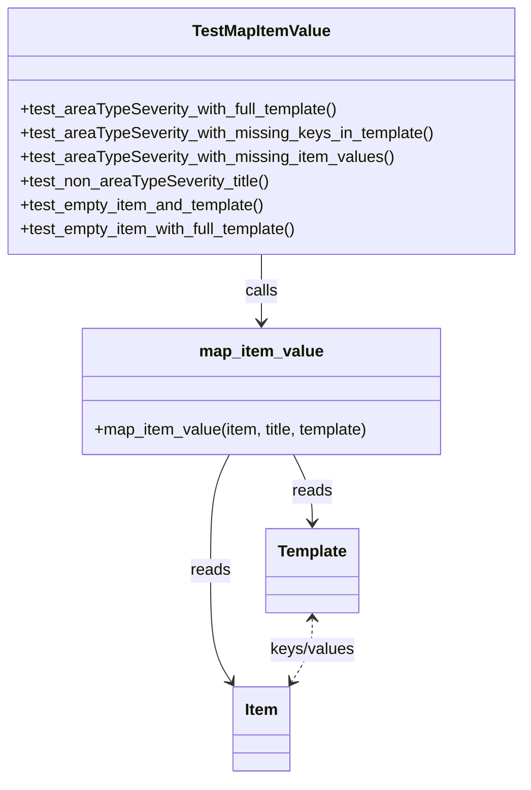

# Diagram: entity_core/entity_service/entity_service_tests/damageview_tests/test_map_item_value.py


> Auto-generated by Obscura crawlers

## Diagram 1



### SVG

<svg id="container" width="521.859375" xmlns="http://www.w3.org/2000/svg" class="classDiagram" height="778" viewBox="0 0 521.859375 778" role="graphics-document document" aria-roledescription="class"><style>#container{font-family:"trebuchet ms",verdana,arial,sans-serif;font-size:16px;fill:#333;}@keyframes edge-animation-frame{from{stroke-dashoffset:0;}}@keyframes dash{to{stroke-dashoffset:0;}}#container .edge-animation-slow{stroke-dasharray:9,5!important;stroke-dashoffset:900;animation:dash 50s linear infinite;stroke-linecap:round;}#container .edge-animation-fast{stroke-dasharray:9,5!important;stroke-dashoffset:900;animation:dash 20s linear infinite;stroke-linecap:round;}#container .error-icon{fill:#552222;}#container .error-text{fill:#552222;stroke:#552222;}#container .edge-thickness-normal{stroke-width:1px;}#container .edge-thickness-thick{stroke-width:3.5px;}#container .edge-pattern-solid{stroke-dasharray:0;}#container .edge-thickness-invisible{stroke-width:0;fill:none;}#container .edge-pattern-dashed{stroke-dasharray:3;}#container .edge-pattern-dotted{stroke-dasharray:2;}#container .marker{fill:#333333;stroke:#333333;}#container .marker.cross{stroke:#333333;}#container svg{font-family:"trebuchet ms",verdana,arial,sans-serif;font-size:16px;}#container p{margin:0;}#container g.classGroup text{fill:#9370DB;stroke:none;font-family:"trebuchet ms",verdana,arial,sans-serif;font-size:10px;}#container g.classGroup text .title{font-weight:bolder;}#container .nodeLabel,#container .edgeLabel{color:#131300;}#container .edgeLabel .label rect{fill:#ECECFF;}#container .label text{fill:#131300;}#container .labelBkg{background:#ECECFF;}#container .edgeLabel .label span{background:#ECECFF;}#container .classTitle{font-weight:bolder;}#container .node rect,#container .node circle,#container .node ellipse,#container .node polygon,#container .node path{fill:#ECECFF;stroke:#9370DB;stroke-width:1px;}#container .divider{stroke:#9370DB;stroke-width:1;}#container g.clickable{cursor:pointer;}#container g.classGroup rect{fill:#ECECFF;stroke:#9370DB;}#container g.classGroup line{stroke:#9370DB;stroke-width:1;}#container .classLabel .box{stroke:none;stroke-width:0;fill:#ECECFF;opacity:0.5;}#container .classLabel .label{fill:#9370DB;font-size:10px;}#container .relation{stroke:#333333;stroke-width:1;fill:none;}#container .dashed-line{stroke-dasharray:3;}#container .dotted-line{stroke-dasharray:1 2;}#container #compositionStart,#container .composition{fill:#333333!important;stroke:#333333!important;stroke-width:1;}#container #compositionEnd,#container .composition{fill:#333333!important;stroke:#333333!important;stroke-width:1;}#container #dependencyStart,#container .dependency{fill:#333333!important;stroke:#333333!important;stroke-width:1;}#container #dependencyStart,#container .dependency{fill:#333333!important;stroke:#333333!important;stroke-width:1;}#container #extensionStart,#container .extension{fill:transparent!important;stroke:#333333!important;stroke-width:1;}#container #extensionEnd,#container .extension{fill:transparent!important;stroke:#333333!important;stroke-width:1;}#container #aggregationStart,#container .aggregation{fill:transparent!important;stroke:#333333!important;stroke-width:1;}#container #aggregationEnd,#container .aggregation{fill:transparent!important;stroke:#333333!important;stroke-width:1;}#container #lollipopStart,#container .lollipop{fill:#ECECFF!important;stroke:#333333!important;stroke-width:1;}#container #lollipopEnd,#container .lollipop{fill:#ECECFF!important;stroke:#333333!important;stroke-width:1;}#container .edgeTerminals{font-size:11px;line-height:initial;}#container .classTitleText{text-anchor:middle;font-size:18px;fill:#333;}#container .label-icon{display:inline-block;height:1em;overflow:visible;vertical-align:-0.125em;}#container .node .label-icon path{fill:currentColor;stroke:revert;stroke-width:revert;}#container :root{--mermaid-font-family:"trebuchet ms",verdana,arial,sans-serif;}</style><g><defs><marker id="container_class-aggregationStart" class="marker aggregation class" refX="18" refY="7" markerWidth="190" markerHeight="240" orient="auto"><path d="M 18,7 L9,13 L1,7 L9,1 Z"></path></marker></defs><defs><marker id="container_class-aggregationEnd" class="marker aggregation class" refX="1" refY="7" markerWidth="20" markerHeight="28" orient="auto"><path d="M 18,7 L9,13 L1,7 L9,1 Z"></path></marker></defs><defs><marker id="container_class-extensionStart" class="marker extension class" refX="18" refY="7" markerWidth="190" markerHeight="240" orient="auto"><path d="M 1,7 L18,13 V 1 Z"></path></marker></defs><defs><marker id="container_class-extensionEnd" class="marker extension class" refX="1" refY="7" markerWidth="20" markerHeight="28" orient="auto"><path d="M 1,1 V 13 L18,7 Z"></path></marker></defs><defs><marker id="container_class-compositionStart" class="marker composition class" refX="18" refY="7" markerWidth="190" markerHeight="240" orient="auto"><path d="M 18,7 L9,13 L1,7 L9,1 Z"></path></marker></defs><defs><marker id="container_class-compositionEnd" class="marker composition class" refX="1" refY="7" markerWidth="20" markerHeight="28" orient="auto"><path d="M 18,7 L9,13 L1,7 L9,1 Z"></path></marker></defs><defs><marker id="container_class-dependencyStart" class="marker dependency class" refX="6" refY="7" markerWidth="190" markerHeight="240" orient="auto"><path d="M 5,7 L9,13 L1,7 L9,1 Z"></path></marker></defs><defs><marker id="container_class-dependencyEnd" class="marker dependency class" refX="13" refY="7" markerWidth="20" markerHeight="28" orient="auto"><path d="M 18,7 L9,13 L14,7 L9,1 Z"></path></marker></defs><defs><marker id="container_class-lollipopStart" class="marker lollipop class" refX="13" refY="7" markerWidth="190" markerHeight="240" orient="auto"><circle stroke="black" fill="transparent" cx="7" cy="7" r="6"></circle></marker></defs><defs><marker id="container_class-lollipopEnd" class="marker lollipop class" refX="1" refY="7" markerWidth="190" markerHeight="240" orient="auto"><circle stroke="black" fill="transparent" cx="7" cy="7" r="6"></circle></marker></defs><g class="root"><g class="clusters"></g><g class="edgePaths"><path d="M260.93,254L260.93,260.167C260.93,266.333,260.93,278.667,260.93,290C260.93,301.333,260.93,311.667,260.93,316.833L260.93,322" id="id_TestMapItemValue_map_item_value_1" class="edge-thickness-normal edge-pattern-solid relation" style=";;;" data-edge="true" data-et="edge" data-id="id_TestMapItemValue_map_item_value_1" data-points="W3sieCI6MjYwLjkyOTY4NzUsInkiOjI1NH0seyJ4IjoyNjAuOTI5Njg3NSwieSI6MjkxfSx7IngiOjI2MC45Mjk2ODc1LCJ5IjozMjh9XQ==" marker-end="url(#container_class-dependencyEnd)"></path><path d="M292.72,454L295.832,460.167C298.944,466.333,305.167,478.667,308.279,490C311.391,501.333,311.391,511.667,311.391,516.833L311.391,522" id="id_map_item_value_Template_2" class="edge-thickness-normal edge-pattern-solid relation" style=";;;" data-edge="true" data-et="edge" data-id="id_map_item_value_Template_2" data-points="W3sieCI6MjkyLjcyMDA3ODEyNSwieSI6NDU0fSx7IngiOjMxMS4zOTA2MjUsInkiOjQ5MX0seyJ4IjozMTEuMzkwNjI1LCJ5Ijo1Mjh9XQ==" marker-end="url(#container_class-dependencyEnd)"></path><path d="M229.139,454L226.028,460.167C222.916,466.333,216.692,478.667,213.581,498C210.469,517.333,210.469,543.667,210.469,570C210.469,596.333,210.469,622.667,213.869,641.157C217.27,659.648,224.071,670.296,227.472,675.62L230.873,680.943" id="id_map_item_value_Item_3" class="edge-thickness-normal edge-pattern-solid relation" style=";;;" data-edge="true" data-et="edge" data-id="id_map_item_value_Item_3" data-points="W3sieCI6MjI5LjEzOTI5Njg3NSwieSI6NDU0fSx7IngiOjIxMC40Njg3NSwieSI6NDkxfSx7IngiOjIxMC40Njg3NSwieSI6NTcwfSx7IngiOjIxMC40Njg3NSwieSI6NjQ5fSx7IngiOjIzNC4xMDIzNTM2MzkyNDA1LCJ5Ijo2ODZ9XQ==" marker-end="url(#container_class-dependencyEnd)"></path><path d="M311.391,618L311.391,623.167C311.391,628.333,311.391,638.667,307.99,649.157C304.589,659.648,297.788,670.296,294.387,675.62L290.987,680.943" id="id_Template_Item_4" class="edge-thickness-normal edge-pattern-dashed relation" style=";;;" data-edge="true" data-et="edge" data-id="id_Template_Item_4" data-points="W3sieCI6MzExLjM5MDYyNSwieSI6NjEyfSx7IngiOjMxMS4zOTA2MjUsInkiOjY0OX0seyJ4IjoyODcuNzU3MDIxMzYwNzU5NSwieSI6Njg2fV0=" marker-start="url(#container_class-dependencyStart)" marker-end="url(#container_class-dependencyEnd)"></path></g><g class="edgeLabels"><g class="edgeLabel" transform="translate(260.9296875, 291)"><g class="label" data-id="id_TestMapItemValue_map_item_value_1" transform="translate(-16.4453125, -12)"><foreignObject width="32.890625" height="24"><div xmlns="http://www.w3.org/1999/xhtml" class="labelBkg" style="display: table-cell; white-space: nowrap; line-height: 1.5; max-width: 200px; text-align: center;"><span class="edgeLabel"><p>calls</p></span></div></foreignObject></g></g><g class="edgeLabel" transform="translate(311.390625, 491)"><g class="label" data-id="id_map_item_value_Template_2" transform="translate(-20.0078125, -12)"><foreignObject width="40.015625" height="24"><div xmlns="http://www.w3.org/1999/xhtml" class="labelBkg" style="display: table-cell; white-space: nowrap; line-height: 1.5; max-width: 200px; text-align: center;"><span class="edgeLabel"><p>reads</p></span></div></foreignObject></g></g><g class="edgeLabel" transform="translate(210.46875, 570)"><g class="label" data-id="id_map_item_value_Item_3" transform="translate(-20.0078125, -12)"><foreignObject width="40.015625" height="24"><div xmlns="http://www.w3.org/1999/xhtml" class="labelBkg" style="display: table-cell; white-space: nowrap; line-height: 1.5; max-width: 200px; text-align: center;"><span class="edgeLabel"><p>reads</p></span></div></foreignObject></g></g><g class="edgeLabel" transform="translate(311.390625, 649)"><g class="label" data-id="id_Template_Item_4" transform="translate(-43.1484375, -12)"><foreignObject width="86.296875" height="24"><div xmlns="http://www.w3.org/1999/xhtml" class="labelBkg" style="display: table-cell; white-space: nowrap; line-height: 1.5; max-width: 200px; text-align: center;"><span class="edgeLabel"><p>keys/values</p></span></div></foreignObject></g></g></g><g class="nodes"><g class="node default" id="classId-TestMapItemValue-0" transform="translate(260.9296875, 131)"><g class="basic label-container"><path d="M-252.9296875 -123 L252.9296875 -123 L252.9296875 123 L-252.9296875 123" stroke="none" stroke-width="0" fill="#ECECFF" style=""></path><path d="M-252.9296875 -123 C-82.70976948244709 -123, 87.51014853510583 -123, 252.9296875 -123 M-252.9296875 -123 C-118.49954049228418 -123, 15.930606515431634 -123, 252.9296875 -123 M252.9296875 -123 C252.9296875 -66.7793708138826, 252.9296875 -10.558741627765187, 252.9296875 123 M252.9296875 -123 C252.9296875 -37.64471341636184, 252.9296875 47.71057316727632, 252.9296875 123 M252.9296875 123 C72.12757099862836 123, -108.67454550274329 123, -252.9296875 123 M252.9296875 123 C56.18159847947666 123, -140.56649054104668 123, -252.9296875 123 M-252.9296875 123 C-252.9296875 52.621404761600374, -252.9296875 -17.757190476799252, -252.9296875 -123 M-252.9296875 123 C-252.9296875 61.889193740602856, -252.9296875 0.7783874812057121, -252.9296875 -123" stroke="#9370DB" stroke-width="1.3" fill="none" stroke-dasharray="0 0" style=""></path></g><g class="annotation-group text" transform="translate(0, -99)"></g><g class="label-group text" transform="translate(-67.078125, -99)"><g class="label" style="font-weight: bolder" transform="translate(0,-12)"><foreignObject width="134.15625" height="24"><div xmlns="http://www.w3.org/1999/xhtml" style="display: table-cell; white-space: nowrap; line-height: 1.5; max-width: 182px; text-align: center;"><span class="nodeLabel markdown-node-label" style=""><p>TestMapItemValue</p></span></div></foreignObject></g></g><g class="members-group text" transform="translate(-240.9296875, -51)"></g><g class="methods-group text" transform="translate(-240.9296875, -21)"><g class="label" style="" transform="translate(0,-12)"><foreignObject width="321.078125" height="24"><div xmlns="http://www.w3.org/1999/xhtml" style="display: table-cell; white-space: nowrap; line-height: 1.5; max-width: 378px; text-align: center;"><span class="nodeLabel markdown-node-label" style=""><p>+test_areaTypeSeverity_with_full_template()</p></span></div></foreignObject></g><g class="label" style="" transform="translate(0,12)"><foreignObject width="414.78125" height="24"><div xmlns="http://www.w3.org/1999/xhtml" style="display: table-cell; white-space: nowrap; line-height: 1.5; max-width: 472px; text-align: center;"><span class="nodeLabel markdown-node-label" style=""><p>+test_areaTypeSeverity_with_missing_keys_in_template()</p></span></div></foreignObject></g><g class="label" style="" transform="translate(0,36)"><foreignObject width="374.578125" height="24"><div xmlns="http://www.w3.org/1999/xhtml" style="display: table-cell; white-space: nowrap; line-height: 1.5; max-width: 432px; text-align: center;"><span class="nodeLabel markdown-node-label" style=""><p>+test_areaTypeSeverity_with_missing_item_values()</p></span></div></foreignObject></g><g class="label" style="" transform="translate(0,60)"><foreignObject width="250.5" height="24"><div xmlns="http://www.w3.org/1999/xhtml" style="display: table-cell; white-space: nowrap; line-height: 1.5; max-width: 308px; text-align: center;"><span class="nodeLabel markdown-node-label" style=""><p>+test_non_areaTypeSeverity_title()</p></span></div></foreignObject></g><g class="label" style="" transform="translate(0,84)"><foreignObject width="248.296875" height="24"><div xmlns="http://www.w3.org/1999/xhtml" style="display: table-cell; white-space: nowrap; line-height: 1.5; max-width: 306px; text-align: center;"><span class="nodeLabel markdown-node-label" style=""><p>+test_empty_item_and_template()</p></span></div></foreignObject></g><g class="label" style="" transform="translate(0,108)"><foreignObject width="283.828125" height="24"><div xmlns="http://www.w3.org/1999/xhtml" style="display: table-cell; white-space: nowrap; line-height: 1.5; max-width: 341px; text-align: center;"><span class="nodeLabel markdown-node-label" style=""><p>+test_empty_item_with_full_template()</p></span></div></foreignObject></g></g><g class="divider" style=""><path d="M-252.9296875 -75 C-57.89412774997774 -75, 137.14143200004452 -75, 252.9296875 -75 M-252.9296875 -75 C-109.75823220902163 -75, 33.413223081956744 -75, 252.9296875 -75" stroke="#9370DB" stroke-width="1.3" fill="none" stroke-dasharray="0 0" style=""></path></g><g class="divider" style=""><path d="M-252.9296875 -51 C-57.12190320519923 -51, 138.68588108960154 -51, 252.9296875 -51 M-252.9296875 -51 C-147.97581645771913 -51, -43.02194541543824 -51, 252.9296875 -51" stroke="#9370DB" stroke-width="1.3" fill="none" stroke-dasharray="0 0" style=""></path></g></g><g class="node default" id="classId-map_item_value-1" transform="translate(260.9296875, 391)"><g class="basic label-container"><path d="M-182.02734375 -63 L182.02734375 -63 L182.02734375 63 L-182.02734375 63" stroke="none" stroke-width="0" fill="#ECECFF" style=""></path><path d="M-182.02734375 -63 C-47.41157129576467 -63, 87.20420115847065 -63, 182.02734375 -63 M-182.02734375 -63 C-81.06954422501556 -63, 19.888255299968876 -63, 182.02734375 -63 M182.02734375 -63 C182.02734375 -32.34904830336944, 182.02734375 -1.6980966067388934, 182.02734375 63 M182.02734375 -63 C182.02734375 -21.119729319892265, 182.02734375 20.76054136021547, 182.02734375 63 M182.02734375 63 C78.93349268428702 63, -24.160358381425965 63, -182.02734375 63 M182.02734375 63 C90.36888648977136 63, -1.2895707704572885 63, -182.02734375 63 M-182.02734375 63 C-182.02734375 27.628669419391983, -182.02734375 -7.742661161216034, -182.02734375 -63 M-182.02734375 63 C-182.02734375 19.554571570689824, -182.02734375 -23.890856858620353, -182.02734375 -63" stroke="#9370DB" stroke-width="1.3" fill="none" stroke-dasharray="0 0" style=""></path></g><g class="annotation-group text" transform="translate(0, -39)"></g><g class="label-group text" transform="translate(-59.8203125, -39)"><g class="label" style="font-weight: bolder" transform="translate(0,-12)"><foreignObject width="119.640625" height="24"><div xmlns="http://www.w3.org/1999/xhtml" style="display: table-cell; white-space: nowrap; line-height: 1.5; max-width: 169px; text-align: center;"><span class="nodeLabel markdown-node-label" style=""><p>map_item_value</p></span></div></foreignObject></g></g><g class="members-group text" transform="translate(-170.02734375, 9)"></g><g class="methods-group text" transform="translate(-170.02734375, 39)"><g class="label" style="" transform="translate(0,-12)"><foreignObject width="280.234375" height="24"><div xmlns="http://www.w3.org/1999/xhtml" style="display: table-cell; white-space: nowrap; line-height: 1.5; max-width: 338px; text-align: center;"><span class="nodeLabel markdown-node-label" style=""><p>+map_item_value(item, title, template)</p></span></div></foreignObject></g></g><g class="divider" style=""><path d="M-182.02734375 -15 C-107.77856935837136 -15, -33.52979496674271 -15, 182.02734375 -15 M-182.02734375 -15 C-85.30118255159728 -15, 11.424978646805442 -15, 182.02734375 -15" stroke="#9370DB" stroke-width="1.3" fill="none" stroke-dasharray="0 0" style=""></path></g><g class="divider" style=""><path d="M-182.02734375 9 C-100.96899997753688 9, -19.910656205073764 9, 182.02734375 9 M-182.02734375 9 C-69.3733856850715 9, 43.280572379857006 9, 182.02734375 9" stroke="#9370DB" stroke-width="1.3" fill="none" stroke-dasharray="0 0" style=""></path></g></g><g class="node default" id="classId-Template-2" transform="translate(311.390625, 570)"><g class="basic label-container"><path d="M-45.9140625 -42 L45.9140625 -42 L45.9140625 42 L-45.9140625 42" stroke="none" stroke-width="0" fill="#ECECFF" style=""></path><path d="M-45.9140625 -42 C-18.298043731970143 -42, 9.317975036059714 -42, 45.9140625 -42 M-45.9140625 -42 C-15.10090923013648 -42, 15.71224403972704 -42, 45.9140625 -42 M45.9140625 -42 C45.9140625 -13.8151294598205, 45.9140625 14.369741080358999, 45.9140625 42 M45.9140625 -42 C45.9140625 -20.58218516581751, 45.9140625 0.8356296683649802, 45.9140625 42 M45.9140625 42 C11.192201252818016 42, -23.529659994363968 42, -45.9140625 42 M45.9140625 42 C17.105250038374013 42, -11.703562423251974 42, -45.9140625 42 M-45.9140625 42 C-45.9140625 12.628243363716258, -45.9140625 -16.743513272567483, -45.9140625 -42 M-45.9140625 42 C-45.9140625 14.542320111656984, -45.9140625 -12.915359776686032, -45.9140625 -42" stroke="#9370DB" stroke-width="1.3" fill="none" stroke-dasharray="0 0" style=""></path></g><g class="annotation-group text" transform="translate(0, -18)"></g><g class="label-group text" transform="translate(-33.9140625, -18)"><g class="label" style="font-weight: bolder" transform="translate(0,-12)"><foreignObject width="67.828125" height="24"><div xmlns="http://www.w3.org/1999/xhtml" style="display: table-cell; white-space: nowrap; line-height: 1.5; max-width: 117px; text-align: center;"><span class="nodeLabel markdown-node-label" style=""><p>Template</p></span></div></foreignObject></g></g><g class="members-group text" transform="translate(-33.9140625, 30)"></g><g class="methods-group text" transform="translate(-33.9140625, 60)"></g><g class="divider" style=""><path d="M-45.9140625 6 C-20.62147959792725 6, 4.671103304145497 6, 45.9140625 6 M-45.9140625 6 C-18.392704973046925 6, 9.12865255390615 6, 45.9140625 6" stroke="#9370DB" stroke-width="1.3" fill="none" stroke-dasharray="0 0" style=""></path></g><g class="divider" style=""><path d="M-45.9140625 24 C-16.709379862913966 24, 12.495302774172067 24, 45.9140625 24 M-45.9140625 24 C-13.813060060658366 24, 18.28794237868327 24, 45.9140625 24" stroke="#9370DB" stroke-width="1.3" fill="none" stroke-dasharray="0 0" style=""></path></g></g><g class="node default" id="classId-Item-3" transform="translate(260.9296875, 728)"><g class="basic label-container"><path d="M-28.46875 -42 L28.46875 -42 L28.46875 42 L-28.46875 42" stroke="none" stroke-width="0" fill="#ECECFF" style=""></path><path d="M-28.46875 -42 C-11.758493097732714 -42, 4.951763804534572 -42, 28.46875 -42 M-28.46875 -42 C-14.674639943325642 -42, -0.880529886651285 -42, 28.46875 -42 M28.46875 -42 C28.46875 -20.768997799214446, 28.46875 0.46200440157110734, 28.46875 42 M28.46875 -42 C28.46875 -15.208815081098397, 28.46875 11.582369837803206, 28.46875 42 M28.46875 42 C6.891281840614798 42, -14.686186318770403 42, -28.46875 42 M28.46875 42 C7.6954589032343605 42, -13.077832193531279 42, -28.46875 42 M-28.46875 42 C-28.46875 24.421541826124255, -28.46875 6.8430836522485095, -28.46875 -42 M-28.46875 42 C-28.46875 23.605195777983962, -28.46875 5.210391555967924, -28.46875 -42" stroke="#9370DB" stroke-width="1.3" fill="none" stroke-dasharray="0 0" style=""></path></g><g class="annotation-group text" transform="translate(0, -18)"></g><g class="label-group text" transform="translate(-16.46875, -18)"><g class="label" style="font-weight: bolder" transform="translate(0,-12)"><foreignObject width="32.9375" height="24"><div xmlns="http://www.w3.org/1999/xhtml" style="display: table-cell; white-space: nowrap; line-height: 1.5; max-width: 83px; text-align: center;"><span class="nodeLabel markdown-node-label" style=""><p>Item</p></span></div></foreignObject></g></g><g class="members-group text" transform="translate(-16.46875, 30)"></g><g class="methods-group text" transform="translate(-16.46875, 60)"></g><g class="divider" style=""><path d="M-28.46875 6 C-15.625700812340565 6, -2.7826516246811295 6, 28.46875 6 M-28.46875 6 C-14.025010064855806 6, 0.41872987028838793 6, 28.46875 6" stroke="#9370DB" stroke-width="1.3" fill="none" stroke-dasharray="0 0" style=""></path></g><g class="divider" style=""><path d="M-28.46875 24 C-15.896136248164243 24, -3.3235224963284864 24, 28.46875 24 M-28.46875 24 C-12.896429215637644 24, 2.675891568724712 24, 28.46875 24" stroke="#9370DB" stroke-width="1.3" fill="none" stroke-dasharray="0 0" style=""></path></g></g></g></g></g></svg>

## Diagram 2

```mermaid
flowchart TD
    Start([Start]) --> CheckTitle{title == "areaTypeSeverity"}
    CheckTitle -- No --> ReturnItem[/return str(item)/]
    CheckTitle -- Yes --> GetArea[item.get('area')]
    GetArea --> MapArea{template contains area key for value?}
    MapArea -- Yes --> AreaLabel[area_label = template[area_value]]
    MapArea -- No --> AreaLabel[area_label = area_value or None]
    AreaLabel --> GetType[item.get('type')]
    GetType --> MapType{template contains type key for value?}
    MapType -- Yes --> TypeLabel[type_label = template[type_value]]
    MapType -- No --> TypeLabel[type_label = type_value or None]
    TypeLabel --> GetSeverity[item.get('severity')]
    GetSeverity --> MapSeverity{template contains severity key for value?}
    MapSeverity -- Yes --> SeverityLabel[severity_label = template[severity_value]]
    MapSeverity -- No --> SeverityLabel[severity_label = severity_value or None]
    SeverityLabel --> BuildOutput[output = "**area**: " + area_label + "\\n" + "**type**: " + type_label + "\\n" + "**severity**: " + severity_label]
    BuildOutput --> ReturnOutput[/return output/]
    ReturnItem --> End([End])
    ReturnOutput --> End
```

> SVG rendering failed for this diagram.
