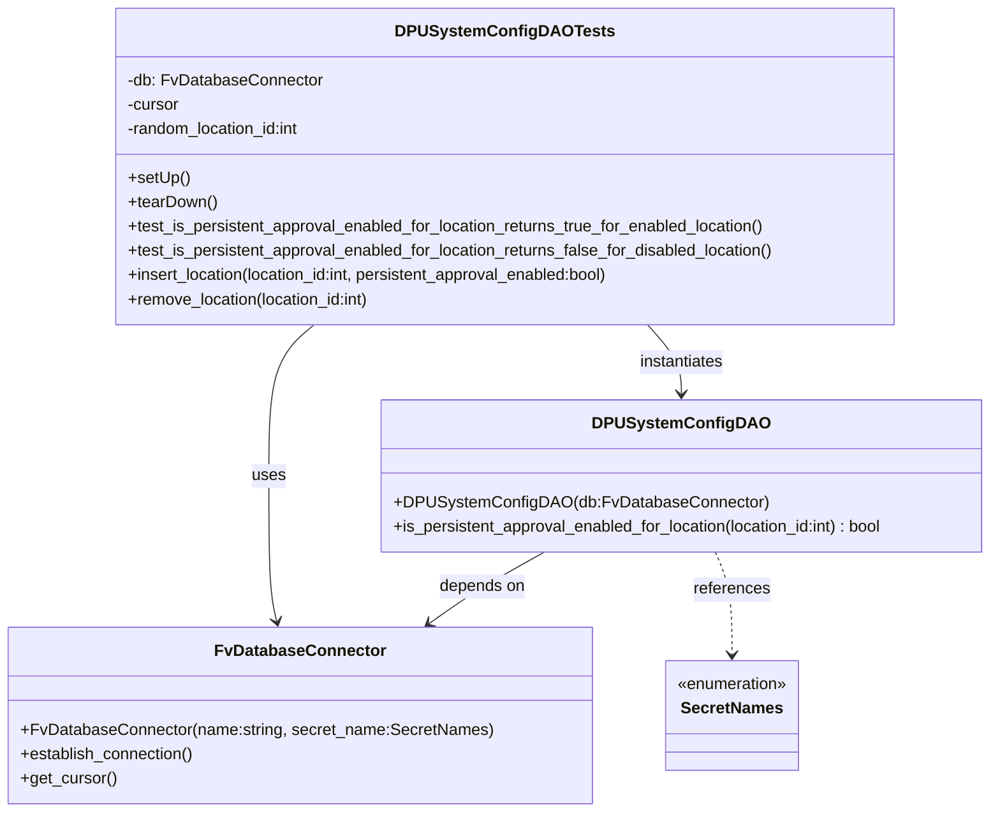

# Diagram: entity_core/entity_service/entity_service_tests/dpu/integration/db/test_dpu_system_config_dao.py

> Auto-generated by Obscura crawlers

## Mermaid

### SVG

<svg id="container" width="972.84375" xmlns="http://www.w3.org/2000/svg" class="classDiagram" height="800" viewBox="0 0 972.84375 800" role="graphics-document document" aria-roledescription="class"><g><defs><marker id="container_class-aggregationStart" class="marker aggregation class" refX="18" refY="7" markerWidth="190" markerHeight="240" orient="auto"><path d="M 18,7 L9,13 L1,7 L9,1 Z"></path></marker></defs><defs><marker id="container_class-aggregationEnd" class="marker aggregation class" refX="1" refY="7" markerWidth="20" markerHeight="28" orient="auto"><path d="M 18,7 L9,13 L1,7 L9,1 Z"></path></marker></defs><defs><marker id="container_class-extensionStart" class="marker extension class" refX="18" refY="7" markerWidth="190" markerHeight="240" orient="auto"><path d="M 1,7 L18,13 V 1 Z"></path></marker></defs><defs><marker id="container_class-extensionEnd" class="marker extension class" refX="1" refY="7" markerWidth="20" markerHeight="28" orient="auto"><path d="M 1,1 V 13 L18,7 Z"></path></marker></defs><defs><marker id="container_class-compositionStart" class="marker composition class" refX="18" refY="7" markerWidth="190" markerHeight="240" orient="auto"><path d="M 18,7 L9,13 L1,7 L9,1 Z"></path></marker></defs><defs><marker id="container_class-compositionEnd" class="marker composition class" refX="1" refY="7" markerWidth="20" markerHeight="28" orient="auto"><path d="M 18,7 L9,13 L1,7 L9,1 Z"></path></marker></defs><defs><marker id="container_class-dependencyStart" class="marker dependency class" refX="6" refY="7" markerWidth="190" markerHeight="240" orient="auto"><path d="M 5,7 L9,13 L1,7 L9,1 Z"></path></marker></defs><defs><marker id="container_class-dependencyEnd" class="marker dependency class" refX="13" refY="7" markerWidth="20" markerHeight="28" orient="auto"><path d="M 18,7 L9,13 L14,7 L9,1 Z"></path></marker></defs><defs><marker id="container_class-lollipopStart" class="marker lollipop class" refX="13" refY="7" markerWidth="190" markerHeight="240" orient="auto"><circle stroke="black" fill="transparent" cx="7" cy="7" r="6"></circle></marker></defs><defs><marker id="container_class-lollipopEnd" class="marker lollipop class" refX="1" refY="7" markerWidth="190" markerHeight="240" orient="auto"><circle stroke="black" fill="transparent" cx="7" cy="7" r="6"></circle></marker></defs><g class="root"><g class="clusters"></g><g class="edgePaths"><path d="M302.882,320L295.493,326.167C288.103,332.333,273.325,344.667,265.936,369.5C258.547,394.333,258.547,431.667,258.547,469C258.547,506.333,258.547,543.667,259.866,567.531C261.185,591.395,263.824,601.79,265.143,606.987L266.462,612.184" id="id_DPUSystemConfigDAOTests_FvDatabaseConnector_1" class="edge-thickness-normal edge-pattern-solid relation" style=";;;" data-edge="true" data-et="edge" data-id="id_DPUSystemConfigDAOTests_FvDatabaseConnector_1" data-points="W3sieCI6MzAyLjg4MTY0ODcyMDg1NDksInkiOjMyMH0seyJ4IjoyNTguNTQ2ODc1LCJ5IjozNTd9LHsieCI6MjU4LjU0Njg3NSwieSI6NDY5fSx7IngiOjI1OC41NDY4NzUsInkiOjU4MX0seyJ4IjoyNjcuOTM3OTA5NTI2MjA5NywieSI6NjE4fV0=" marker-end="url(#container_class-dependencyEnd)"></path><path d="M631.669,320L637.277,326.167C642.885,332.333,654.101,344.667,659.709,356C665.316,367.333,665.316,377.667,665.316,382.833L665.316,388" id="id_DPUSystemConfigDAOTests_DPUSystemConfigDAO_2" class="edge-thickness-normal edge-pattern-solid relation" style=";;;" data-edge="true" data-et="edge" data-id="id_DPUSystemConfigDAOTests_DPUSystemConfigDAO_2" data-points="W3sieCI6NjMxLjY2OTQ1NjM2MzM0MiwieSI6MzIwfSx7IngiOjY2NS4zMTY0MDYyNSwieSI6MzU3fSx7IngiOjY2NS4zMTY0MDYyNSwieSI6Mzk0fV0=" marker-end="url(#container_class-dependencyEnd)"></path><path d="M531.53,544L520.53,550.167C509.53,556.333,487.53,568.667,468.618,580.423C449.706,592.179,433.883,603.359,425.971,608.948L418.06,614.538" id="id_DPUSystemConfigDAO_FvDatabaseConnector_3" class="edge-thickness-normal edge-pattern-solid relation" style=";;;" data-edge="true" data-et="edge" data-id="id_DPUSystemConfigDAO_FvDatabaseConnector_3" data-points="W3sieCI6NTMxLjUzMDM5NTUwNzgxMjUsInkiOjU0NH0seyJ4Ijo0NjUuNTI5Mjk2ODc1LCJ5Ijo1ODF9LHsieCI6NDEzLjE1OTQ0NzQ1NDYzNzEsInkiOjYxOH1d" marker-end="url(#container_class-dependencyEnd)"></path><path d="M699.058,544L701.832,550.167C704.606,556.333,710.155,568.667,712.929,585.5C715.703,602.333,715.703,623.667,715.703,634.333L715.703,645" id="id_DPUSystemConfigDAO_SecretNames_4" class="edge-thickness-normal edge-pattern-dashed relation" style=";;;" data-edge="true" data-et="edge" data-id="id_DPUSystemConfigDAO_SecretNames_4" data-points="W3sieCI6Njk5LjA1NzUxMjU1NTgwMzYsInkiOjU0NH0seyJ4Ijo3MTUuNzAzMTI1LCJ5Ijo1ODF9LHsieCI6NzE1LjcwMzEyNSwieSI6NjUxfV0=" marker-end="url(#container_class-dependencyEnd)"></path></g><g class="edgeLabels"><g class="edgeLabel" transform="translate(258.546875, 469)"><g class="label" data-id="id_DPUSystemConfigDAOTests_FvDatabaseConnector_1" transform="translate(-16.4921875, -12)"><foreignObject width="32.984375" height="24">

uses

</foreignObject></g></g><g class="edgeLabel" transform="translate(665.31640625, 357)"><g class="label" data-id="id_DPUSystemConfigDAOTests_DPUSystemConfigDAO_2" transform="translate(-42.9140625, -12)"><foreignObject width="85.828125" height="24">

instantiates

</foreignObject></g></g><g class="edgeLabel" transform="translate(470.56365, 578.17776)"><g class="label" data-id="id_DPUSystemConfigDAO_FvDatabaseConnector_3" transform="translate(-42.9453125, -12)"><foreignObject width="85.890625" height="24">

depends on

</foreignObject></g></g><g class="edgeLabel" transform="translate(715.703125, 581)"><g class="label" data-id="id_DPUSystemConfigDAO_SecretNames_4" transform="translate(-37.828125, -12)"><foreignObject width="75.65625" height="24">

references

</foreignObject></g></g></g><g class="nodes"><g class="node default" id="classId-DPUSystemConfigDAOTests-0" transform="translate(489.806640625, 164)"><g class="basic label-container"><path d="M-385.6328125 -156 L385.6328125 -156 L385.6328125 156 L-385.6328125 156" stroke="none" stroke-width="0" fill="#ECECFF" style=""></path><path d="M-385.6328125 -156 C-131.13550709729824 -156, 123.36179830540351 -156, 385.6328125 -156 M-385.6328125 -156 C-184.19514988021731 -156, 17.24251273956537 -156, 385.6328125 -156 M385.6328125 -156 C385.6328125 -66.48574150346641, 385.6328125 23.02851699306717, 385.6328125 156 M385.6328125 -156 C385.6328125 -41.288575491584, 385.6328125 73.422849016832, 385.6328125 156 M385.6328125 156 C102.44921479679073 156, -180.73438290641855 156, -385.6328125 156 M385.6328125 156 C164.61980233839108 156, -56.393207823217836 156, -385.6328125 156 M-385.6328125 156 C-385.6328125 88.1731569455, -385.6328125 20.346313890999994, -385.6328125 -156 M-385.6328125 156 C-385.6328125 92.12358359151449, -385.6328125 28.247167183028964, -385.6328125 -156" stroke="#9370DB" stroke-width="1.3" fill="none" stroke-dasharray="0 0" style=""></path></g><g class="annotation-group text" transform="translate(0, -132)"></g><g class="label-group text" transform="translate(-98.78125, -132)"><g class="label" style="font-weight: bolder" transform="translate(0,-12)"><foreignObject width="197.5625" height="24">

DPUSystemConfigDAOTests

</foreignObject></g></g><g class="members-group text" transform="translate(-373.6328125, -84)"><g class="label" style="" transform="translate(0,-12)"><foreignObject width="190.234375" height="24">

-db: FvDatabaseConnector

</foreignObject></g><g class="label" style="" transform="translate(0,12)"><foreignObject width="52.1875" height="24">

-cursor

</foreignObject></g><g class="label" style="" transform="translate(0,36)"><foreignObject width="176" height="24">

-random_location_id:int

</foreignObject></g></g><g class="methods-group text" transform="translate(-373.6328125, 12)"><g class="label" style="" transform="translate(0,-12)"><foreignObject width="60.421875" height="24">

+setUp()

</foreignObject></g><g class="label" style="" transform="translate(0,12)"><foreignObject width="87.75" height="24">

+tearDown()

</foreignObject></g><g class="label" style="" transform="translate(0,36)"><foreignObject width="640.75" height="24">

+test_is_persistent_approval_enabled_for_location_returns_true_for_enabled_location()

</foreignObject></g><g class="label" style="" transform="translate(0,60)"><foreignObject width="648.484375" height="24">

+test_is_persistent_approval_enabled_for_location_returns_false_for_disabled_location()

</foreignObject></g><g class="label" style="" transform="translate(0,84)"><foreignObject width="489.390625" height="24">

+insert_location(location_id:int, persistent_approval_enabled:bool)

</foreignObject></g><g class="label" style="" transform="translate(0,108)"><foreignObject width="244.34375" height="24">

+remove_location(location_id:int)

</foreignObject></g></g><g class="divider" style=""><path d="M-385.6328125 -108 C-111.27228342478031 -108, 163.08824565043938 -108, 385.6328125 -108 M-385.6328125 -108 C-103.44765153359066 -108, 178.73750943281868 -108, 385.6328125 -108" stroke="#9370DB" stroke-width="1.3" fill="none" stroke-dasharray="0 0" style=""></path></g><g class="divider" style=""><path d="M-385.6328125 -12 C-108.81906211832552 -12, 167.99468826334896 -12, 385.6328125 -12 M-385.6328125 -12 C-80.80900210020337 -12, 224.01480829959326 -12, 385.6328125 -12" stroke="#9370DB" stroke-width="1.3" fill="none" stroke-dasharray="0 0" style=""></path></g></g><g class="node default" id="classId-FvDatabaseConnector-1" transform="translate(290.01953125, 705)"><g class="basic label-container"><path d="M-282.01953125 -87 L282.01953125 -87 L282.01953125 87 L-282.01953125 87" stroke="none" stroke-width="0" fill="#ECECFF" style=""></path><path d="M-282.01953125 -87 C-99.43965385914504 -87, 83.14022353170992 -87, 282.01953125 -87 M-282.01953125 -87 C-118.70415999824803 -87, 44.61121125350394 -87, 282.01953125 -87 M282.01953125 -87 C282.01953125 -17.7464216324438, 282.01953125 51.5071567351124, 282.01953125 87 M282.01953125 -87 C282.01953125 -28.58859557332144, 282.01953125 29.822808853357117, 282.01953125 87 M282.01953125 87 C58.929936826886916 87, -164.15965759622617 87, -282.01953125 87 M282.01953125 87 C119.52255724429236 87, -42.974416761415284 87, -282.01953125 87 M-282.01953125 87 C-282.01953125 30.407741089436698, -282.01953125 -26.184517821126605, -282.01953125 -87 M-282.01953125 87 C-282.01953125 22.834712147050126, -282.01953125 -41.33057570589975, -282.01953125 -87" stroke="#9370DB" stroke-width="1.3" fill="none" stroke-dasharray="0 0" style=""></path></g><g class="annotation-group text" transform="translate(0, -63)"></g><g class="label-group text" transform="translate(-79.3046875, -63)"><g class="label" style="font-weight: bolder" transform="translate(0,-12)"><foreignObject width="158.609375" height="24">

FvDatabaseConnector

</foreignObject></g></g><g class="members-group text" transform="translate(-270.01953125, -15)"></g><g class="methods-group text" transform="translate(-270.01953125, 15)"><g class="label" style="" transform="translate(0,-12)"><foreignObject width="460.734375" height="24">

+FvDatabaseConnector(name:string, secret_name:SecretNames)

</foreignObject></g><g class="label" style="" transform="translate(0,12)"><foreignObject width="173.265625" height="24">

+establish_connection()

</foreignObject></g><g class="label" style="" transform="translate(0,36)"><foreignObject width="94.640625" height="24">

+get_cursor()

</foreignObject></g></g><g class="divider" style=""><path d="M-282.01953125 -39 C-146.14044080448437 -39, -10.261350358968741 -39, 282.01953125 -39 M-282.01953125 -39 C-119.46557417406075 -39, 43.088382901878504 -39, 282.01953125 -39" stroke="#9370DB" stroke-width="1.3" fill="none" stroke-dasharray="0 0" style=""></path></g><g class="divider" style=""><path d="M-282.01953125 -15 C-159.34369228360276 -15, -36.66785331720553 -15, 282.01953125 -15 M-282.01953125 -15 C-59.61198883999944 -15, 162.79555357000112 -15, 282.01953125 -15" stroke="#9370DB" stroke-width="1.3" fill="none" stroke-dasharray="0 0" style=""></path></g></g><g class="node default" id="classId-DPUSystemConfigDAO-2" transform="translate(665.31640625, 469)"><g class="basic label-container"><path d="M-299.52734375 -75 L299.52734375 -75 L299.52734375 75 L-299.52734375 75" stroke="none" stroke-width="0" fill="#ECECFF" style=""></path><path d="M-299.52734375 -75 C-100.17166158969309 -75, 99.18402057061382 -75, 299.52734375 -75 M-299.52734375 -75 C-132.75144771841417 -75, 34.02444831317166 -75, 299.52734375 -75 M299.52734375 -75 C299.52734375 -19.937372147557305, 299.52734375 35.12525570488539, 299.52734375 75 M299.52734375 -75 C299.52734375 -26.98540083162169, 299.52734375 21.02919833675662, 299.52734375 75 M299.52734375 75 C172.39812343203153 75, 45.26890311406302 75, -299.52734375 75 M299.52734375 75 C127.3712015875042 75, -44.784940574991595 75, -299.52734375 75 M-299.52734375 75 C-299.52734375 21.062806428004414, -299.52734375 -32.87438714399117, -299.52734375 -75 M-299.52734375 75 C-299.52734375 17.238241571977767, -299.52734375 -40.523516856044466, -299.52734375 -75" stroke="#9370DB" stroke-width="1.3" fill="none" stroke-dasharray="0 0" style=""></path></g><g class="annotation-group text" transform="translate(0, -51)"></g><g class="label-group text" transform="translate(-79.9453125, -51)"><g class="label" style="font-weight: bolder" transform="translate(0,-12)"><foreignObject width="159.890625" height="24">

DPUSystemConfigDAO

</foreignObject></g></g><g class="members-group text" transform="translate(-287.52734375, -3)"></g><g class="methods-group text" transform="translate(-287.52734375, 27)"><g class="label" style="" transform="translate(0,-12)"><foreignObject width="354.84375" height="24">

+DPUSystemConfigDAO(db:FvDatabaseConnector)

</foreignObject></g><g class="label" style="" transform="translate(0,12)"><foreignObject width="495.109375" height="24">

+is_persistent_approval_enabled_for_location(location_id:int) : bool

</foreignObject></g></g><g class="divider" style=""><path d="M-299.52734375 -27 C-132.2653354216286 -27, 34.99667290674279 -27, 299.52734375 -27 M-299.52734375 -27 C-64.71482447063204 -27, 170.09769480873592 -27, 299.52734375 -27" stroke="#9370DB" stroke-width="1.3" fill="none" stroke-dasharray="0 0" style=""></path></g><g class="divider" style=""><path d="M-299.52734375 -3 C-135.48641431630784 -3, 28.554515117384312 -3, 299.52734375 -3 M-299.52734375 -3 C-85.26616566107617 -3, 128.99501242784766 -3, 299.52734375 -3" stroke="#9370DB" stroke-width="1.3" fill="none" stroke-dasharray="0 0" style=""></path></g></g><g class="node default" id="classId-SecretNames-3" transform="translate(715.703125, 705)"><g class="basic label-container"><path d="M-67.5546875 -54 L67.5546875 -54 L67.5546875 54 L-67.5546875 54" stroke="none" stroke-width="0" fill="#ECECFF" style=""></path><path d="M-67.5546875 -54 C-15.54783803556014 -54, 36.45901142887972 -54, 67.5546875 -54 M-67.5546875 -54 C-33.913449758181216 -54, -0.2722120163624311 -54, 67.5546875 -54 M67.5546875 -54 C67.5546875 -12.982671647170392, 67.5546875 28.034656705659216, 67.5546875 54 M67.5546875 -54 C67.5546875 -25.564576569586187, 67.5546875 2.8708468608276263, 67.5546875 54 M67.5546875 54 C37.79542237021312 54, 8.036157240426228 54, -67.5546875 54 M67.5546875 54 C17.603569865149588 54, -32.347547769700824 54, -67.5546875 54 M-67.5546875 54 C-67.5546875 29.98858636941148, -67.5546875 5.977172738822958, -67.5546875 -54 M-67.5546875 54 C-67.5546875 27.72295501631272, -67.5546875 1.4459100326254415, -67.5546875 -54" stroke="#9370DB" stroke-width="1.3" fill="none" stroke-dasharray="0 0" style=""></path></g><g class="annotation-group text" transform="translate(-55.5546875, -30)"><g class="label" style="" transform="translate(0,-12)"><foreignObject width="111.109375" height="24">

«enumeration»

</foreignObject></g></g><g class="label-group text" transform="translate(-48.03125, -6)"><g class="label" style="font-weight: bolder" transform="translate(0,-12)"><foreignObject width="96.0625" height="24">

SecretNames

</foreignObject></g></g><g class="members-group text" transform="translate(-55.5546875, 42)"></g><g class="methods-group text" transform="translate(-55.5546875, 72)"></g><g class="divider" style=""><path d="M-67.5546875 18 C-30.504070271207652 18, 6.546546957584695 18, 67.5546875 18 M-67.5546875 18 C-14.201494510499465 18, 39.15169847900107 18, 67.5546875 18" stroke="#9370DB" stroke-width="1.3" fill="none" stroke-dasharray="0 0" style=""></path></g><g class="divider" style=""><path d="M-67.5546875 36 C-14.619015026052601 36, 38.3166574478948 36, 67.5546875 36 M-67.5546875 36 C-26.08302920034741 36, 15.388629099305177 36, 67.5546875 36" stroke="#9370DB" stroke-width="1.3" fill="none" stroke-dasharray="0 0" style=""></path></g></g></g></g></g></svg>
