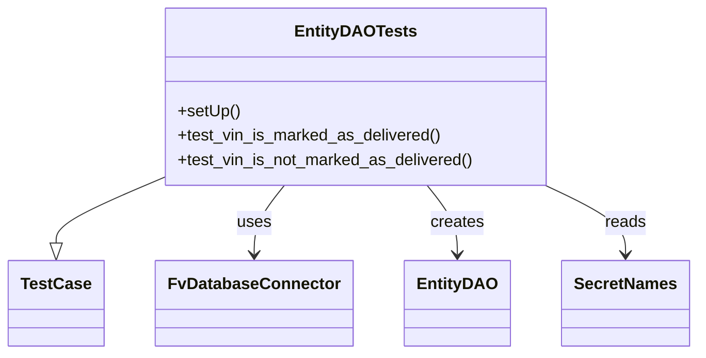

# Diagram: entity_core/entity_service/entity_service_tests/dpu/integration/db/test_entity_dao.py


> Auto-generated by Obscura crawlers

## Diagram 1



### SVG

<svg id="container" width="654.546875" xmlns="http://www.w3.org/2000/svg" class="classDiagram" height="348" viewBox="0 0 654.546875 348" role="graphics-document document" aria-roledescription="class"><style>#container{font-family:"trebuchet ms",verdana,arial,sans-serif;font-size:16px;fill:#333;}@keyframes edge-animation-frame{from{stroke-dashoffset:0;}}@keyframes dash{to{stroke-dashoffset:0;}}#container .edge-animation-slow{stroke-dasharray:9,5!important;stroke-dashoffset:900;animation:dash 50s linear infinite;stroke-linecap:round;}#container .edge-animation-fast{stroke-dasharray:9,5!important;stroke-dashoffset:900;animation:dash 20s linear infinite;stroke-linecap:round;}#container .error-icon{fill:#552222;}#container .error-text{fill:#552222;stroke:#552222;}#container .edge-thickness-normal{stroke-width:1px;}#container .edge-thickness-thick{stroke-width:3.5px;}#container .edge-pattern-solid{stroke-dasharray:0;}#container .edge-thickness-invisible{stroke-width:0;fill:none;}#container .edge-pattern-dashed{stroke-dasharray:3;}#container .edge-pattern-dotted{stroke-dasharray:2;}#container .marker{fill:#333333;stroke:#333333;}#container .marker.cross{stroke:#333333;}#container svg{font-family:"trebuchet ms",verdana,arial,sans-serif;font-size:16px;}#container p{margin:0;}#container g.classGroup text{fill:#9370DB;stroke:none;font-family:"trebuchet ms",verdana,arial,sans-serif;font-size:10px;}#container g.classGroup text .title{font-weight:bolder;}#container .nodeLabel,#container .edgeLabel{color:#131300;}#container .edgeLabel .label rect{fill:#ECECFF;}#container .label text{fill:#131300;}#container .labelBkg{background:#ECECFF;}#container .edgeLabel .label span{background:#ECECFF;}#container .classTitle{font-weight:bolder;}#container .node rect,#container .node circle,#container .node ellipse,#container .node polygon,#container .node path{fill:#ECECFF;stroke:#9370DB;stroke-width:1px;}#container .divider{stroke:#9370DB;stroke-width:1;}#container g.clickable{cursor:pointer;}#container g.classGroup rect{fill:#ECECFF;stroke:#9370DB;}#container g.classGroup line{stroke:#9370DB;stroke-width:1;}#container .classLabel .box{stroke:none;stroke-width:0;fill:#ECECFF;opacity:0.5;}#container .classLabel .label{fill:#9370DB;font-size:10px;}#container .relation{stroke:#333333;stroke-width:1;fill:none;}#container .dashed-line{stroke-dasharray:3;}#container .dotted-line{stroke-dasharray:1 2;}#container #compositionStart,#container .composition{fill:#333333!important;stroke:#333333!important;stroke-width:1;}#container #compositionEnd,#container .composition{fill:#333333!important;stroke:#333333!important;stroke-width:1;}#container #dependencyStart,#container .dependency{fill:#333333!important;stroke:#333333!important;stroke-width:1;}#container #dependencyStart,#container .dependency{fill:#333333!important;stroke:#333333!important;stroke-width:1;}#container #extensionStart,#container .extension{fill:transparent!important;stroke:#333333!important;stroke-width:1;}#container #extensionEnd,#container .extension{fill:transparent!important;stroke:#333333!important;stroke-width:1;}#container #aggregationStart,#container .aggregation{fill:transparent!important;stroke:#333333!important;stroke-width:1;}#container #aggregationEnd,#container .aggregation{fill:transparent!important;stroke:#333333!important;stroke-width:1;}#container #lollipopStart,#container .lollipop{fill:#ECECFF!important;stroke:#333333!important;stroke-width:1;}#container #lollipopEnd,#container .lollipop{fill:#ECECFF!important;stroke:#333333!important;stroke-width:1;}#container .edgeTerminals{font-size:11px;line-height:initial;}#container .classTitleText{text-anchor:middle;font-size:18px;fill:#333;}#container .label-icon{display:inline-block;height:1em;overflow:visible;vertical-align:-0.125em;}#container .node .label-icon path{fill:currentColor;stroke:revert;stroke-width:revert;}#container :root{--mermaid-font-family:"trebuchet ms",verdana,arial,sans-serif;}</style><g><defs><marker id="container_class-aggregationStart" class="marker aggregation class" refX="18" refY="7" markerWidth="190" markerHeight="240" orient="auto"><path d="M 18,7 L9,13 L1,7 L9,1 Z"></path></marker></defs><defs><marker id="container_class-aggregationEnd" class="marker aggregation class" refX="1" refY="7" markerWidth="20" markerHeight="28" orient="auto"><path d="M 18,7 L9,13 L1,7 L9,1 Z"></path></marker></defs><defs><marker id="container_class-extensionStart" class="marker extension class" refX="18" refY="7" markerWidth="190" markerHeight="240" orient="auto"><path d="M 1,7 L18,13 V 1 Z"></path></marker></defs><defs><marker id="container_class-extensionEnd" class="marker extension class" refX="1" refY="7" markerWidth="20" markerHeight="28" orient="auto"><path d="M 1,1 V 13 L18,7 Z"></path></marker></defs><defs><marker id="container_class-compositionStart" class="marker composition class" refX="18" refY="7" markerWidth="190" markerHeight="240" orient="auto"><path d="M 18,7 L9,13 L1,7 L9,1 Z"></path></marker></defs><defs><marker id="container_class-compositionEnd" class="marker composition class" refX="1" refY="7" markerWidth="20" markerHeight="28" orient="auto"><path d="M 18,7 L9,13 L1,7 L9,1 Z"></path></marker></defs><defs><marker id="container_class-dependencyStart" class="marker dependency class" refX="6" refY="7" markerWidth="190" markerHeight="240" orient="auto"><path d="M 5,7 L9,13 L1,7 L9,1 Z"></path></marker></defs><defs><marker id="container_class-dependencyEnd" class="marker dependency class" refX="13" refY="7" markerWidth="20" markerHeight="28" orient="auto"><path d="M 18,7 L9,13 L14,7 L9,1 Z"></path></marker></defs><defs><marker id="container_class-lollipopStart" class="marker lollipop class" refX="13" refY="7" markerWidth="190" markerHeight="240" orient="auto"><circle stroke="black" fill="transparent" cx="7" cy="7" r="6"></circle></marker></defs><defs><marker id="container_class-lollipopEnd" class="marker lollipop class" refX="1" refY="7" markerWidth="190" markerHeight="240" orient="auto"><circle stroke="black" fill="transparent" cx="7" cy="7" r="6"></circle></marker></defs><g class="root"><g class="clusters"></g><g class="edgePaths"><path d="M147.695,176.871L131.806,183.892C115.917,190.914,84.138,204.957,68.249,215.27C52.359,225.583,52.359,232.167,52.359,235.458L52.359,238.75" id="id_EntityDAOTests_TestCase_1" class="edge-thickness-normal edge-pattern-solid relation" style=";;;" data-edge="true" data-et="edge" data-id="id_EntityDAOTests_TestCase_1" data-points="W3sieCI6MTQ3LjY5NTMxMjUsInkiOjE3Ni44NzA4OTg1ODcwMzk3M30seyJ4Ijo1Mi4zNTkzNzUsInkiOjIxOX0seyJ4Ijo1Mi4zNTkzNzUsInkiOjI1Nn1d" marker-end="url(#container_class-extensionEnd)"></path><path d="M266.353,182L261.631,188.167C256.91,194.333,247.467,206.667,242.745,218C238.023,229.333,238.023,239.667,238.023,244.833L238.023,250" id="id_EntityDAOTests_FvDatabaseConnector_2" class="edge-thickness-normal edge-pattern-solid relation" style=";;;" data-edge="true" data-et="edge" data-id="id_EntityDAOTests_FvDatabaseConnector_2" data-points="W3sieCI6MjY2LjM1MjcyODA3NDU5Njc3LCJ5IjoxODJ9LHsieCI6MjM4LjAyMzQzNzUsInkiOjIxOX0seyJ4IjoyMzguMDIzNDM3NSwieSI6MjU2fV0=" marker-end="url(#container_class-dependencyEnd)"></path><path d="M399.577,182L404.299,188.167C409.02,194.333,418.463,206.667,423.185,218C427.906,229.333,427.906,239.667,427.906,244.833L427.906,250" id="id_EntityDAOTests_EntityDAO_3" class="edge-thickness-normal edge-pattern-solid relation" style=";;;" data-edge="true" data-et="edge" data-id="id_EntityDAOTests_EntityDAO_3" data-points="W3sieCI6Mzk5LjU3Njk1OTQyNTQwMzIzLCJ5IjoxODJ9LHsieCI6NDI3LjkwNjI1LCJ5IjoyMTl9LHsieCI6NDI3LjkwNjI1LCJ5IjoyNTZ9XQ==" marker-end="url(#container_class-dependencyEnd)"></path><path d="M510.859,182L523.469,188.167C536.078,194.333,561.297,206.667,573.906,218C586.516,229.333,586.516,239.667,586.516,244.833L586.516,250" id="id_EntityDAOTests_SecretNames_4" class="edge-thickness-normal edge-pattern-solid relation" style=";;;" data-edge="true" data-et="edge" data-id="id_EntityDAOTests_SecretNames_4" data-points="W3sieCI6NTEwLjg1OTM0MzQ5Nzk4MzksInkiOjE4Mn0seyJ4Ijo1ODYuNTE1NjI1LCJ5IjoyMTl9LHsieCI6NTg2LjUxNTYyNSwieSI6MjU2fV0=" marker-end="url(#container_class-dependencyEnd)"></path></g><g class="edgeLabels"><g class="edgeLabel"><g class="label" data-id="id_EntityDAOTests_TestCase_1" transform="translate(0, 0)"><foreignObject width="0" height="0"><div xmlns="http://www.w3.org/1999/xhtml" class="labelBkg" style="display: table-cell; white-space: nowrap; line-height: 1.5; max-width: 200px; text-align: center;"><span class="edgeLabel"></span></div></foreignObject></g></g><g class="edgeLabel" transform="translate(238.0234375, 219)"><g class="label" data-id="id_EntityDAOTests_FvDatabaseConnector_2" transform="translate(-16.4921875, -12)"><foreignObject width="32.984375" height="24"><div xmlns="http://www.w3.org/1999/xhtml" class="labelBkg" style="display: table-cell; white-space: nowrap; line-height: 1.5; max-width: 200px; text-align: center;"><span class="edgeLabel"><p>uses</p></span></div></foreignObject></g></g><g class="edgeLabel" transform="translate(427.90625, 219)"><g class="label" data-id="id_EntityDAOTests_EntityDAO_3" transform="translate(-26.171875, -12)"><foreignObject width="52.34375" height="24"><div xmlns="http://www.w3.org/1999/xhtml" class="labelBkg" style="display: table-cell; white-space: nowrap; line-height: 1.5; max-width: 200px; text-align: center;"><span class="edgeLabel"><p>creates</p></span></div></foreignObject></g></g><g class="edgeLabel" transform="translate(586.515625, 219)"><g class="label" data-id="id_EntityDAOTests_SecretNames_4" transform="translate(-20.0078125, -12)"><foreignObject width="40.015625" height="24"><div xmlns="http://www.w3.org/1999/xhtml" class="labelBkg" style="display: table-cell; white-space: nowrap; line-height: 1.5; max-width: 200px; text-align: center;"><span class="edgeLabel"><p>reads</p></span></div></foreignObject></g></g></g><g class="nodes"><g class="node default" id="classId-EntityDAOTests-0" transform="translate(332.96484375, 95)"><g class="basic label-container"><path d="M-185.26953125 -87 L185.26953125 -87 L185.26953125 87 L-185.26953125 87" stroke="none" stroke-width="0" fill="#ECECFF" style=""></path><path d="M-185.26953125 -87 C-40.07217970676675 -87, 105.1251718364665 -87, 185.26953125 -87 M-185.26953125 -87 C-40.76506277163787 -87, 103.73940570672426 -87, 185.26953125 -87 M185.26953125 -87 C185.26953125 -49.02286769482145, 185.26953125 -11.0457353896429, 185.26953125 87 M185.26953125 -87 C185.26953125 -23.461107548663755, 185.26953125 40.07778490267249, 185.26953125 87 M185.26953125 87 C51.41144756024016 87, -82.44663612951967 87, -185.26953125 87 M185.26953125 87 C101.37944367867935 87, 17.489356107358702 87, -185.26953125 87 M-185.26953125 87 C-185.26953125 30.190917726697016, -185.26953125 -26.618164546605968, -185.26953125 -87 M-185.26953125 87 C-185.26953125 39.10429535425689, -185.26953125 -8.791409291486218, -185.26953125 -87" stroke="#9370DB" stroke-width="1.3" fill="none" stroke-dasharray="0 0" style=""></path></g><g class="annotation-group text" transform="translate(0, -63)"></g><g class="label-group text" transform="translate(-55.4140625, -63)"><g class="label" style="font-weight: bolder" transform="translate(0,-12)"><foreignObject width="110.828125" height="24"><div xmlns="http://www.w3.org/1999/xhtml" style="display: table-cell; white-space: nowrap; line-height: 1.5; max-width: 158px; text-align: center;"><span class="nodeLabel markdown-node-label" style=""><p>EntityDAOTests</p></span></div></foreignObject></g></g><g class="members-group text" transform="translate(-173.26953125, -15)"></g><g class="methods-group text" transform="translate(-173.26953125, 15)"><g class="label" style="" transform="translate(0,-12)"><foreignObject width="60.421875" height="24"><div xmlns="http://www.w3.org/1999/xhtml" style="display: table-cell; white-space: nowrap; line-height: 1.5; max-width: 118px; text-align: center;"><span class="nodeLabel markdown-node-label" style=""><p>+setUp()</p></span></div></foreignObject></g><g class="label" style="" transform="translate(0,12)"><foreignObject width="258.3125" height="24"><div xmlns="http://www.w3.org/1999/xhtml" style="display: table-cell; white-space: nowrap; line-height: 1.5; max-width: 316px; text-align: center;"><span class="nodeLabel markdown-node-label" style=""><p>+test_vin_is_marked_as_delivered()</p></span></div></foreignObject></g><g class="label" style="" transform="translate(0,36)"><foreignObject width="291.125" height="24"><div xmlns="http://www.w3.org/1999/xhtml" style="display: table-cell; white-space: nowrap; line-height: 1.5; max-width: 348px; text-align: center;"><span class="nodeLabel markdown-node-label" style=""><p>+test_vin_is_not_marked_as_delivered()</p></span></div></foreignObject></g></g><g class="divider" style=""><path d="M-185.26953125 -39 C-82.61266756304002 -39, 20.04419612391996 -39, 185.26953125 -39 M-185.26953125 -39 C-76.11678978786695 -39, 33.0359516742661 -39, 185.26953125 -39" stroke="#9370DB" stroke-width="1.3" fill="none" stroke-dasharray="0 0" style=""></path></g><g class="divider" style=""><path d="M-185.26953125 -15 C-102.2165446467954 -15, -19.163558043590797 -15, 185.26953125 -15 M-185.26953125 -15 C-60.92315646838337 -15, 63.423218313233264 -15, 185.26953125 -15" stroke="#9370DB" stroke-width="1.3" fill="none" stroke-dasharray="0 0" style=""></path></g></g><g class="node default" id="classId-FvDatabaseConnector-1" transform="translate(238.0234375, 298)"><g class="basic label-container"><path d="M-91.3046875 -42 L91.3046875 -42 L91.3046875 42 L-91.3046875 42" stroke="none" stroke-width="0" fill="#ECECFF" style=""></path><path d="M-91.3046875 -42 C-41.67391384164111 -42, 7.956859816717781 -42, 91.3046875 -42 M-91.3046875 -42 C-27.03706453476299 -42, 37.23055843047402 -42, 91.3046875 -42 M91.3046875 -42 C91.3046875 -16.252052671712427, 91.3046875 9.495894656575146, 91.3046875 42 M91.3046875 -42 C91.3046875 -12.059581140617816, 91.3046875 17.88083771876437, 91.3046875 42 M91.3046875 42 C42.43579499288629 42, -6.433097514227427 42, -91.3046875 42 M91.3046875 42 C32.22488795649859 42, -26.854911587002817 42, -91.3046875 42 M-91.3046875 42 C-91.3046875 19.591870643762554, -91.3046875 -2.816258712474891, -91.3046875 -42 M-91.3046875 42 C-91.3046875 10.854106004016366, -91.3046875 -20.29178799196727, -91.3046875 -42" stroke="#9370DB" stroke-width="1.3" fill="none" stroke-dasharray="0 0" style=""></path></g><g class="annotation-group text" transform="translate(0, -18)"></g><g class="label-group text" transform="translate(-79.3046875, -18)"><g class="label" style="font-weight: bolder" transform="translate(0,-12)"><foreignObject width="158.609375" height="24"><div xmlns="http://www.w3.org/1999/xhtml" style="display: table-cell; white-space: nowrap; line-height: 1.5; max-width: 207px; text-align: center;"><span class="nodeLabel markdown-node-label" style=""><p>FvDatabaseConnector</p></span></div></foreignObject></g></g><g class="members-group text" transform="translate(-79.3046875, 30)"></g><g class="methods-group text" transform="translate(-79.3046875, 60)"></g><g class="divider" style=""><path d="M-91.3046875 6 C-41.90694515468087 6, 7.490797190638261 6, 91.3046875 6 M-91.3046875 6 C-40.28160120366703 6, 10.74148509266594 6, 91.3046875 6" stroke="#9370DB" stroke-width="1.3" fill="none" stroke-dasharray="0 0" style=""></path></g><g class="divider" style=""><path d="M-91.3046875 24 C-33.937885789195455 24, 23.42891592160909 24, 91.3046875 24 M-91.3046875 24 C-50.45365084267984 24, -9.602614185359684 24, 91.3046875 24" stroke="#9370DB" stroke-width="1.3" fill="none" stroke-dasharray="0 0" style=""></path></g></g><g class="node default" id="classId-EntityDAO-2" transform="translate(427.90625, 298)"><g class="basic label-container"><path d="M-48.578125 -42 L48.578125 -42 L48.578125 42 L-48.578125 42" stroke="none" stroke-width="0" fill="#ECECFF" style=""></path><path d="M-48.578125 -42 C-23.99966485664907 -42, 0.5787952867018618 -42, 48.578125 -42 M-48.578125 -42 C-26.196544570616304 -42, -3.8149641412326076 -42, 48.578125 -42 M48.578125 -42 C48.578125 -21.190727107136755, 48.578125 -0.38145421427351067, 48.578125 42 M48.578125 -42 C48.578125 -16.351763023466273, 48.578125 9.296473953067455, 48.578125 42 M48.578125 42 C17.822111818159396 42, -12.933901363681208 42, -48.578125 42 M48.578125 42 C24.60643348889403 42, 0.6347419777880603 42, -48.578125 42 M-48.578125 42 C-48.578125 11.496290616487133, -48.578125 -19.007418767025733, -48.578125 -42 M-48.578125 42 C-48.578125 8.515759283034136, -48.578125 -24.96848143393173, -48.578125 -42" stroke="#9370DB" stroke-width="1.3" fill="none" stroke-dasharray="0 0" style=""></path></g><g class="annotation-group text" transform="translate(0, -18)"></g><g class="label-group text" transform="translate(-36.578125, -18)"><g class="label" style="font-weight: bolder" transform="translate(0,-12)"><foreignObject width="73.15625" height="24"><div xmlns="http://www.w3.org/1999/xhtml" style="display: table-cell; white-space: nowrap; line-height: 1.5; max-width: 122px; text-align: center;"><span class="nodeLabel markdown-node-label" style=""><p>EntityDAO</p></span></div></foreignObject></g></g><g class="members-group text" transform="translate(-36.578125, 30)"></g><g class="methods-group text" transform="translate(-36.578125, 60)"></g><g class="divider" style=""><path d="M-48.578125 6 C-28.137893707427754 6, -7.6976624148555075 6, 48.578125 6 M-48.578125 6 C-15.937124947447792 6, 16.703875105104416 6, 48.578125 6" stroke="#9370DB" stroke-width="1.3" fill="none" stroke-dasharray="0 0" style=""></path></g><g class="divider" style=""><path d="M-48.578125 24 C-15.167190640363359 24, 18.243743719273283 24, 48.578125 24 M-48.578125 24 C-24.596060346710544 24, -0.6139956934210886 24, 48.578125 24" stroke="#9370DB" stroke-width="1.3" fill="none" stroke-dasharray="0 0" style=""></path></g></g><g class="node default" id="classId-SecretNames-3" transform="translate(586.515625, 298)"><g class="basic label-container"><path d="M-60.03125 -42 L60.03125 -42 L60.03125 42 L-60.03125 42" stroke="none" stroke-width="0" fill="#ECECFF" style=""></path><path d="M-60.03125 -42 C-13.674895115990232 -42, 32.681459768019536 -42, 60.03125 -42 M-60.03125 -42 C-12.583123480241404 -42, 34.86500303951719 -42, 60.03125 -42 M60.03125 -42 C60.03125 -11.467886204086167, 60.03125 19.064227591827667, 60.03125 42 M60.03125 -42 C60.03125 -20.79297352801207, 60.03125 0.4140529439758609, 60.03125 42 M60.03125 42 C34.013684219901705 42, 7.996118439803418 42, -60.03125 42 M60.03125 42 C21.160158568333365 42, -17.71093286333327 42, -60.03125 42 M-60.03125 42 C-60.03125 21.56767647772223, -60.03125 1.1353529554444606, -60.03125 -42 M-60.03125 42 C-60.03125 14.275432364083983, -60.03125 -13.449135271832034, -60.03125 -42" stroke="#9370DB" stroke-width="1.3" fill="none" stroke-dasharray="0 0" style=""></path></g><g class="annotation-group text" transform="translate(0, -18)"></g><g class="label-group text" transform="translate(-48.03125, -18)"><g class="label" style="font-weight: bolder" transform="translate(0,-12)"><foreignObject width="96.0625" height="24"><div xmlns="http://www.w3.org/1999/xhtml" style="display: table-cell; white-space: nowrap; line-height: 1.5; max-width: 145px; text-align: center;"><span class="nodeLabel markdown-node-label" style=""><p>SecretNames</p></span></div></foreignObject></g></g><g class="members-group text" transform="translate(-48.03125, 30)"></g><g class="methods-group text" transform="translate(-48.03125, 60)"></g><g class="divider" style=""><path d="M-60.03125 6 C-31.105182194504447 6, -2.1791143890088946 6, 60.03125 6 M-60.03125 6 C-15.058063159281033 6, 29.915123681437933 6, 60.03125 6" stroke="#9370DB" stroke-width="1.3" fill="none" stroke-dasharray="0 0" style=""></path></g><g class="divider" style=""><path d="M-60.03125 24 C-34.238545764534656 24, -8.445841529069313 24, 60.03125 24 M-60.03125 24 C-20.584161619313186 24, 18.86292676137363 24, 60.03125 24" stroke="#9370DB" stroke-width="1.3" fill="none" stroke-dasharray="0 0" style=""></path></g></g><g class="node default" id="classId-TestCase-4" transform="translate(52.359375, 298)"><g class="basic label-container"><path d="M-44.359375 -42 L44.359375 -42 L44.359375 42 L-44.359375 42" stroke="none" stroke-width="0" fill="#ECECFF" style=""></path><path d="M-44.359375 -42 C-10.366442222916142 -42, 23.626490554167717 -42, 44.359375 -42 M-44.359375 -42 C-9.243960458804871 -42, 25.871454082390258 -42, 44.359375 -42 M44.359375 -42 C44.359375 -11.012113685178818, 44.359375 19.975772629642364, 44.359375 42 M44.359375 -42 C44.359375 -20.3163524602367, 44.359375 1.367295079526599, 44.359375 42 M44.359375 42 C17.42065379811134 42, -9.518067403777323 42, -44.359375 42 M44.359375 42 C20.284384781923663 42, -3.790605436152674 42, -44.359375 42 M-44.359375 42 C-44.359375 13.83863139425333, -44.359375 -14.32273721149334, -44.359375 -42 M-44.359375 42 C-44.359375 22.016224108136356, -44.359375 2.032448216272712, -44.359375 -42" stroke="#9370DB" stroke-width="1.3" fill="none" stroke-dasharray="0 0" style=""></path></g><g class="annotation-group text" transform="translate(0, -18)"></g><g class="label-group text" transform="translate(-32.359375, -18)"><g class="label" style="font-weight: bolder" transform="translate(0,-12)"><foreignObject width="64.71875" height="24"><div xmlns="http://www.w3.org/1999/xhtml" style="display: table-cell; white-space: nowrap; line-height: 1.5; max-width: 113px; text-align: center;"><span class="nodeLabel markdown-node-label" style=""><p>TestCase</p></span></div></foreignObject></g></g><g class="members-group text" transform="translate(-32.359375, 30)"></g><g class="methods-group text" transform="translate(-32.359375, 60)"></g><g class="divider" style=""><path d="M-44.359375 6 C-15.234206555070084 6, 13.890961889859831 6, 44.359375 6 M-44.359375 6 C-13.284839366650697 6, 17.789696266698606 6, 44.359375 6" stroke="#9370DB" stroke-width="1.3" fill="none" stroke-dasharray="0 0" style=""></path></g><g class="divider" style=""><path d="M-44.359375 24 C-10.881587333874727 24, 22.596200332250547 24, 44.359375 24 M-44.359375 24 C-26.11651287678899 24, -7.8736507535779765 24, 44.359375 24" stroke="#9370DB" stroke-width="1.3" fill="none" stroke-dasharray="0 0" style=""></path></g></g></g></g></g></svg>

## Diagram 2

```mermaid
flowchart TD
    Start([Start TestRun]) --> Setup[setUp: create FvDatabaseConnector("EntityDAOTests", SecretNames.ENTITY_DATABASE)]
    Setup --> TestChoice{Which test?}
    TestChoice -->|test_vin_is_marked_as_delivered| DAO1[Instantiate EntityDAO]
    DAO1 --> Call1[is_delivered_vin(random_delivered_vin)]
    Call1 --> AssertTrue[assertTrue -> pass]
    TestChoice -->|test_vin_is_not_marked_as_delivered| DAO2[Instantiate EntityDAO]
    DAO2 --> Call2[is_delivered_vin(random_active_vin)]
    Call2 --> AssertFalse[assertFalse -> pass]
    AssertTrue --> End([End])
    AssertFalse --> End
```

> SVG rendering failed for this diagram.
