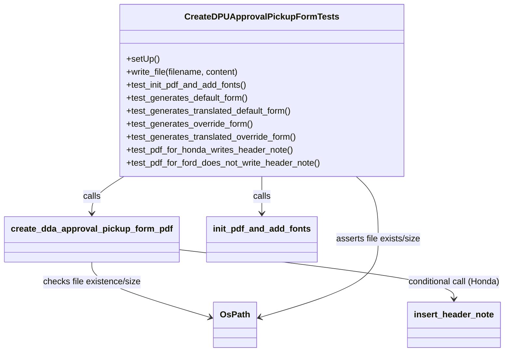
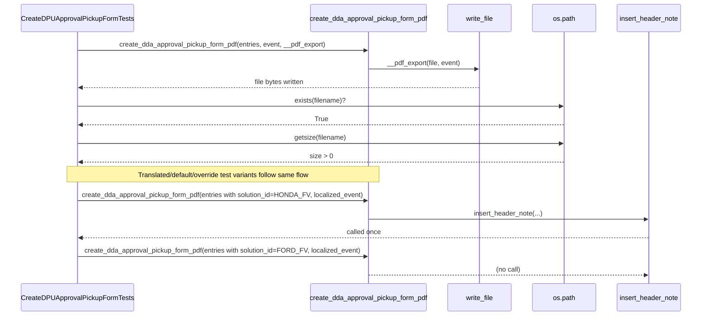

# Diagram: entity_core/entity_service/entity_service_tests/dpu/unit/approval_pickup_form/test_create_dda_approval_pickup_form_pdf.py

> Auto-generated by Obscura crawlers

## Diagram 1

### SVG

<svg id="container" width="916.8046875" xmlns="http://www.w3.org/2000/svg" class="classDiagram" height="650" viewBox="0 0 916.8046875 650" role="graphics-document document" aria-roledescription="class"><g><defs><marker id="container_class-aggregationStart" class="marker aggregation class" refX="18" refY="7" markerWidth="190" markerHeight="240" orient="auto"><path d="M 18,7 L9,13 L1,7 L9,1 Z"></path></marker></defs><defs><marker id="container_class-aggregationEnd" class="marker aggregation class" refX="1" refY="7" markerWidth="20" markerHeight="28" orient="auto"><path d="M 18,7 L9,13 L1,7 L9,1 Z"></path></marker></defs><defs><marker id="container_class-extensionStart" class="marker extension class" refX="18" refY="7" markerWidth="190" markerHeight="240" orient="auto"><path d="M 1,7 L18,13 V 1 Z"></path></marker></defs><defs><marker id="container_class-extensionEnd" class="marker extension class" refX="1" refY="7" markerWidth="20" markerHeight="28" orient="auto"><path d="M 1,1 V 13 L18,7 Z"></path></marker></defs><defs><marker id="container_class-compositionStart" class="marker composition class" refX="18" refY="7" markerWidth="190" markerHeight="240" orient="auto"><path d="M 18,7 L9,13 L1,7 L9,1 Z"></path></marker></defs><defs><marker id="container_class-compositionEnd" class="marker composition class" refX="1" refY="7" markerWidth="20" markerHeight="28" orient="auto"><path d="M 18,7 L9,13 L1,7 L9,1 Z"></path></marker></defs><defs><marker id="container_class-dependencyStart" class="marker dependency class" refX="6" refY="7" markerWidth="190" markerHeight="240" orient="auto"><path d="M 5,7 L9,13 L1,7 L9,1 Z"></path></marker></defs><defs><marker id="container_class-dependencyEnd" class="marker dependency class" refX="13" refY="7" markerWidth="20" markerHeight="28" orient="auto"><path d="M 18,7 L9,13 L14,7 L9,1 Z"></path></marker></defs><defs><marker id="container_class-lollipopStart" class="marker lollipop class" refX="13" refY="7" markerWidth="190" markerHeight="240" orient="auto"><circle stroke="black" fill="transparent" cx="7" cy="7" r="6"></circle></marker></defs><defs><marker id="container_class-lollipopEnd" class="marker lollipop class" refX="1" refY="7" markerWidth="190" markerHeight="240" orient="auto"><circle stroke="black" fill="transparent" cx="7" cy="7" r="6"></circle></marker></defs><g class="root"><g class="clusters"></g><g class="edgePaths"><path d="M220.911,326L211.323,332.167C201.735,338.333,182.559,350.667,172.971,362C163.383,373.333,163.383,383.667,163.383,388.833L163.383,394" id="id_CreateDPUApprovalPickupFormTests_create_dda_approval_pickup_form_pdf_1" class="edge-thickness-normal edge-pattern-solid relation" style=";;;" data-edge="true" data-et="edge" data-id="id_CreateDPUApprovalPickupFormTests_create_dda_approval_pickup_form_pdf_1" data-points="W3sieCI6MjIwLjkxMDY3NDQyNjAyMDQyLCJ5IjozMjZ9LHsieCI6MTYzLjM4MjgxMjUsInkiOjM2M30seyJ4IjoxNjMuMzgyODEyNSwieSI6NDAwfV0=" marker-end="url(#container_class-dependencyEnd)"></path><path d="M468.125,326L468.125,332.167C468.125,338.333,468.125,350.667,468.125,362C468.125,373.333,468.125,383.667,468.125,388.833L468.125,394" id="id_CreateDPUApprovalPickupFormTests_init_pdf_and_add_fonts_2" class="edge-thickness-normal edge-pattern-solid relation" style=";;;" data-edge="true" data-et="edge" data-id="id_CreateDPUApprovalPickupFormTests_init_pdf_and_add_fonts_2" data-points="W3sieCI6NDY4LjEyNSwieSI6MzI2fSx7IngiOjQ2OC4xMjUsInkiOjM2M30seyJ4Ijo0NjguMTI1LCJ5Ijo0MDB9XQ==" marker-end="url(#container_class-dependencyEnd)"></path><path d="M163.383,484L163.383,490.167C163.383,496.333,163.383,508.667,199.352,525.787C235.321,542.907,307.259,564.814,343.229,575.767L379.198,586.721" id="id_create_dda_approval_pickup_form_pdf_OsPath_3" class="edge-thickness-normal edge-pattern-solid relation" style=";;;" data-edge="true" data-et="edge" data-id="id_create_dda_approval_pickup_form_pdf_OsPath_3" data-points="W3sieCI6MTYzLjM4MjgxMjUsInkiOjQ4NH0seyJ4IjoxNjMuMzgyODEyNSwieSI6NTIxfSx7IngiOjM4NC45Mzc1LCJ5Ijo1ODguNDY4NTU5ODk4ODEzNX1d" marker-end="url(#container_class-dependencyEnd)"></path><path d="M318.766,460.651L402.564,470.709C486.362,480.767,653.958,500.884,737.757,516.108C821.555,531.333,821.555,541.667,821.555,546.833L821.555,552" id="id_create_dda_approval_pickup_form_pdf_insert_header_note_4" class="edge-thickness-normal edge-pattern-solid relation" style=";;;" data-edge="true" data-et="edge" data-id="id_create_dda_approval_pickup_form_pdf_insert_header_note_4" data-points="W3sieCI6MzE4Ljc2NTYyNSwieSI6NDYwLjY1MDUxMTU5Njk4OTc2fSx7IngiOjgyMS41NTQ2ODc1LCJ5Ijo1MjF9LHsieCI6ODIxLjU1NDY4NzUsInkiOjU1OH1d" marker-end="url(#container_class-dependencyEnd)"></path><path d="M641.809,326L648.546,332.167C655.282,338.333,668.754,350.667,675.49,370C682.227,389.333,682.227,415.667,682.227,442C682.227,468.333,682.227,494.667,646.257,518.787C610.288,542.907,538.35,564.814,502.381,575.767L466.412,586.721" id="id_CreateDPUApprovalPickupFormTests_OsPath_5" class="edge-thickness-normal edge-pattern-solid relation" style=";;;" data-edge="true" data-et="edge" data-id="id_CreateDPUApprovalPickupFormTests_OsPath_5" data-points="W3sieCI6NjQxLjgwOTQzMDgwMzU3MTQsInkiOjMyNn0seyJ4Ijo2ODIuMjI2NTYyNSwieSI6MzYzfSx7IngiOjY4Mi4yMjY1NjI1LCJ5Ijo0NDJ9LHsieCI6NjgyLjIyNjU2MjUsInkiOjUyMX0seyJ4Ijo0NjAuNjcxODc1LCJ5Ijo1ODguNDY4NTU5ODk4ODEzNX1d" marker-end="url(#container_class-dependencyEnd)"></path></g><g class="edgeLabels"><g class="edgeLabel" transform="translate(163.3828125, 363)"><g class="label" data-id="id_CreateDPUApprovalPickupFormTests_create_dda_approval_pickup_form_pdf_1" transform="translate(-16.4453125, -12)"><foreignObject width="32.890625" height="24">

calls

</foreignObject></g></g><g class="edgeLabel" transform="translate(468.125, 363)"><g class="label" data-id="id_CreateDPUApprovalPickupFormTests_init_pdf_and_add_fonts_2" transform="translate(-16.4453125, -12)"><foreignObject width="32.890625" height="24">

calls

</foreignObject></g></g><g class="edgeLabel" transform="translate(163.3828125, 521)"><g class="label" data-id="id_create_dda_approval_pickup_form_pdf_OsPath_3" transform="translate(-91.7109375, -12)"><foreignObject width="183.421875" height="24">

checks file existence/size

</foreignObject></g></g><g class="edgeLabel" transform="translate(821.5546875, 521)"><g class="label" data-id="id_create_dda_approval_pickup_form_pdf_insert_header_note_4" transform="translate(-87.25, -12)"><foreignObject width="174.5" height="24">

conditional call (Honda)

</foreignObject></g></g><g class="edgeLabel" transform="translate(682.2265625, 442)"><g class="label" data-id="id_CreateDPUApprovalPickupFormTests_OsPath_5" transform="translate(-79.7421875, -12)"><foreignObject width="159.484375" height="24">

asserts file exists/size

</foreignObject></g></g></g><g class="nodes"><g class="node default" id="classId-CreateDPUApprovalPickupFormTests-0" transform="translate(468.125, 167)"><g class="basic label-container"><path d="M-259.76953125 -159 L259.76953125 -159 L259.76953125 159 L-259.76953125 159" stroke="none" stroke-width="0" fill="#ECECFF" style=""></path><path d="M-259.76953125 -159 C-125.8954720003311 -159, 7.9785872493378065 -159, 259.76953125 -159 M-259.76953125 -159 C-88.1300788525011 -159, 83.5093735449978 -159, 259.76953125 -159 M259.76953125 -159 C259.76953125 -90.63767260975108, 259.76953125 -22.275345219502157, 259.76953125 159 M259.76953125 -159 C259.76953125 -89.12881195833887, 259.76953125 -19.257623916677744, 259.76953125 159 M259.76953125 159 C137.2526824459341 159, 14.735833641868254 159, -259.76953125 159 M259.76953125 159 C85.20111303279117 159, -89.36730518441766 159, -259.76953125 159 M-259.76953125 159 C-259.76953125 63.031791686789816, -259.76953125 -32.93641662642037, -259.76953125 -159 M-259.76953125 159 C-259.76953125 46.01528826188091, -259.76953125 -66.96942347623818, -259.76953125 -159" stroke="#9370DB" stroke-width="1.3" fill="none" stroke-dasharray="0 0" style=""></path></g><g class="annotation-group text" transform="translate(0, -135)"></g><g class="label-group text" transform="translate(-133.1015625, -135)"><g class="label" style="font-weight: bolder" transform="translate(0,-12)"><foreignObject width="266.203125" height="24">

CreateDPUApprovalPickupFormTests

</foreignObject></g></g><g class="members-group text" transform="translate(-247.76953125, -87)"></g><g class="methods-group text" transform="translate(-247.76953125, -57)"><g class="label" style="" transform="translate(0,-12)"><foreignObject width="60.421875" height="24">

+setUp()

</foreignObject></g><g class="label" style="" transform="translate(0,12)"><foreignObject width="211.40625" height="24">

+write_file(filename, content)

</foreignObject></g><g class="label" style="" transform="translate(0,36)"><foreignObject width="227.203125" height="24">

+test_init_pdf_and_add_fonts()

</foreignObject></g><g class="label" style="" transform="translate(0,60)"><foreignObject width="227.0625" height="24">

+test_generates_default_form()

</foreignObject></g><g class="label" style="" transform="translate(0,84)"><foreignObject width="309.140625" height="24">

+test_generates_translated_default_form()

</foreignObject></g><g class="label" style="" transform="translate(0,108)"><foreignObject width="235.921875" height="24">

+test_generates_override_form()

</foreignObject></g><g class="label" style="" transform="translate(0,132)"><foreignObject width="318.015625" height="24">

+test_generates_translated_override_form()

</foreignObject></g><g class="label" style="" transform="translate(0,156)"><foreignObject width="311.1875" height="24">

+test_pdf_for_honda_writes_header_note()

</foreignObject></g><g class="label" style="" transform="translate(0,180)"><foreignObject width="362.4375" height="24">

+test_pdf_for_ford_does_not_write_header_note()

</foreignObject></g></g><g class="divider" style=""><path d="M-259.76953125 -111 C-92.95902564311407 -111, 73.85147996377185 -111, 259.76953125 -111 M-259.76953125 -111 C-109.35077973143609 -111, 41.06797178712782 -111, 259.76953125 -111" stroke="#9370DB" stroke-width="1.3" fill="none" stroke-dasharray="0 0" style=""></path></g><g class="divider" style=""><path d="M-259.76953125 -87 C-146.78218235153832 -87, -33.79483345307665 -87, 259.76953125 -87 M-259.76953125 -87 C-79.05710884341974 -87, 101.65531356316052 -87, 259.76953125 -87" stroke="#9370DB" stroke-width="1.3" fill="none" stroke-dasharray="0 0" style=""></path></g></g><g class="node default" id="classId-create_dda_approval_pickup_form_pdf-1" transform="translate(163.3828125, 442)"><g class="basic label-container"><path d="M-155.3828125 -42 L155.3828125 -42 L155.3828125 42 L-155.3828125 42" stroke="none" stroke-width="0" fill="#ECECFF" style=""></path><path d="M-155.3828125 -42 C-91.54421464305614 -42, -27.705616786112287 -42, 155.3828125 -42 M-155.3828125 -42 C-44.27349304651278 -42, 66.83582640697443 -42, 155.3828125 -42 M155.3828125 -42 C155.3828125 -23.863310750136446, 155.3828125 -5.726621500272891, 155.3828125 42 M155.3828125 -42 C155.3828125 -24.722500475841013, 155.3828125 -7.445000951682026, 155.3828125 42 M155.3828125 42 C85.0159963314892 42, 14.64918016297841 42, -155.3828125 42 M155.3828125 42 C31.52341755613368 42, -92.33597738773264 42, -155.3828125 42 M-155.3828125 42 C-155.3828125 17.902678353761335, -155.3828125 -6.1946432924773305, -155.3828125 -42 M-155.3828125 42 C-155.3828125 23.781001371031362, -155.3828125 5.562002742062724, -155.3828125 -42" stroke="#9370DB" stroke-width="1.3" fill="none" stroke-dasharray="0 0" style=""></path></g><g class="annotation-group text" transform="translate(0, -18)"></g><g class="label-group text" transform="translate(-143.3828125, -18)"><g class="label" style="font-weight: bolder" transform="translate(0,-12)"><foreignObject width="286.765625" height="24">

create_dda_approval_pickup_form_pdf

</foreignObject></g></g><g class="members-group text" transform="translate(-143.3828125, 30)"></g><g class="methods-group text" transform="translate(-143.3828125, 60)"></g><g class="divider" style=""><path d="M-155.3828125 6 C-80.56242134256259 6, -5.742030185125174 6, 155.3828125 6 M-155.3828125 6 C-84.21505576464601 6, -13.04729902929202 6, 155.3828125 6" stroke="#9370DB" stroke-width="1.3" fill="none" stroke-dasharray="0 0" style=""></path></g><g class="divider" style=""><path d="M-155.3828125 24 C-85.799769254195 24, -16.216726008389998 24, 155.3828125 24 M-155.3828125 24 C-40.690222317708944 24, 74.00236786458211 24, 155.3828125 24" stroke="#9370DB" stroke-width="1.3" fill="none" stroke-dasharray="0 0" style=""></path></g></g><g class="node default" id="classId-init_pdf_and_add_fonts-2" transform="translate(468.125, 442)"><g class="basic label-container"><path d="M-99.359375 -42 L99.359375 -42 L99.359375 42 L-99.359375 42" stroke="none" stroke-width="0" fill="#ECECFF" style=""></path><path d="M-99.359375 -42 C-35.83551693596344 -42, 27.68834112807312 -42, 99.359375 -42 M-99.359375 -42 C-45.77270041369023 -42, 7.813974172619538 -42, 99.359375 -42 M99.359375 -42 C99.359375 -22.412388666561725, 99.359375 -2.82477733312345, 99.359375 42 M99.359375 -42 C99.359375 -10.17858140812961, 99.359375 21.64283718374078, 99.359375 42 M99.359375 42 C40.310120943070444 42, -18.73913311385911 42, -99.359375 42 M99.359375 42 C34.79032518018926 42, -29.778724639621487 42, -99.359375 42 M-99.359375 42 C-99.359375 17.898638850650624, -99.359375 -6.2027222986987525, -99.359375 -42 M-99.359375 42 C-99.359375 12.961301377594094, -99.359375 -16.077397244811813, -99.359375 -42" stroke="#9370DB" stroke-width="1.3" fill="none" stroke-dasharray="0 0" style=""></path></g><g class="annotation-group text" transform="translate(0, -18)"></g><g class="label-group text" transform="translate(-87.359375, -18)"><g class="label" style="font-weight: bolder" transform="translate(0,-12)"><foreignObject width="174.71875" height="24">

init_pdf_and_add_fonts

</foreignObject></g></g><g class="members-group text" transform="translate(-87.359375, 30)"></g><g class="methods-group text" transform="translate(-87.359375, 60)"></g><g class="divider" style=""><path d="M-99.359375 6 C-51.61550983594915 6, -3.871644671898295 6, 99.359375 6 M-99.359375 6 C-37.709215514939196 6, 23.94094397012161 6, 99.359375 6" stroke="#9370DB" stroke-width="1.3" fill="none" stroke-dasharray="0 0" style=""></path></g><g class="divider" style=""><path d="M-99.359375 24 C-25.027217376302076 24, 49.30494024739585 24, 99.359375 24 M-99.359375 24 C-21.248173903644513 24, 56.86302719271097 24, 99.359375 24" stroke="#9370DB" stroke-width="1.3" fill="none" stroke-dasharray="0 0" style=""></path></g></g><g class="node default" id="classId-insert_header_note-3" transform="translate(821.5546875, 600)"><g class="basic label-container"><path d="M-83.5390625 -42 L83.5390625 -42 L83.5390625 42 L-83.5390625 42" stroke="none" stroke-width="0" fill="#ECECFF" style=""></path><path d="M-83.5390625 -42 C-17.367944251673165 -42, 48.80317399665367 -42, 83.5390625 -42 M-83.5390625 -42 C-45.98126073582427 -42, -8.423458971648543 -42, 83.5390625 -42 M83.5390625 -42 C83.5390625 -14.442511926777765, 83.5390625 13.11497614644447, 83.5390625 42 M83.5390625 -42 C83.5390625 -11.972752240232087, 83.5390625 18.054495519535827, 83.5390625 42 M83.5390625 42 C29.834371514556864 42, -23.870319470886272 42, -83.5390625 42 M83.5390625 42 C26.497633788058785 42, -30.54379492388243 42, -83.5390625 42 M-83.5390625 42 C-83.5390625 13.862429650507252, -83.5390625 -14.275140698985496, -83.5390625 -42 M-83.5390625 42 C-83.5390625 22.59930562468621, -83.5390625 3.1986112493724193, -83.5390625 -42" stroke="#9370DB" stroke-width="1.3" fill="none" stroke-dasharray="0 0" style=""></path></g><g class="annotation-group text" transform="translate(0, -18)"></g><g class="label-group text" transform="translate(-71.5390625, -18)"><g class="label" style="font-weight: bolder" transform="translate(0,-12)"><foreignObject width="143.078125" height="24">

insert_header_note

</foreignObject></g></g><g class="members-group text" transform="translate(-71.5390625, 30)"></g><g class="methods-group text" transform="translate(-71.5390625, 60)"></g><g class="divider" style=""><path d="M-83.5390625 6 C-48.68972434946838 6, -13.840386198936756 6, 83.5390625 6 M-83.5390625 6 C-18.42114803925864 6, 46.69676642148272 6, 83.5390625 6" stroke="#9370DB" stroke-width="1.3" fill="none" stroke-dasharray="0 0" style=""></path></g><g class="divider" style=""><path d="M-83.5390625 24 C-41.36361962506781 24, 0.8118232498643749 24, 83.5390625 24 M-83.5390625 24 C-23.166467078348468 24, 37.206128343303064 24, 83.5390625 24" stroke="#9370DB" stroke-width="1.3" fill="none" stroke-dasharray="0 0" style=""></path></g></g><g class="node default" id="classId-OsPath-4" transform="translate(422.8046875, 600)"><g class="basic label-container"><path d="M-37.8671875 -42 L37.8671875 -42 L37.8671875 42 L-37.8671875 42" stroke="none" stroke-width="0" fill="#ECECFF" style=""></path><path d="M-37.8671875 -42 C-17.68454999492534 -42, 2.4980875101493183 -42, 37.8671875 -42 M-37.8671875 -42 C-17.988708676436985 -42, 1.889770147126029 -42, 37.8671875 -42 M37.8671875 -42 C37.8671875 -18.69023840859746, 37.8671875 4.619523182805082, 37.8671875 42 M37.8671875 -42 C37.8671875 -17.20408280628289, 37.8671875 7.5918343874342185, 37.8671875 42 M37.8671875 42 C20.751514046677865 42, 3.6358405933557307 42, -37.8671875 42 M37.8671875 42 C8.36339040151638 42, -21.14040669696724 42, -37.8671875 42 M-37.8671875 42 C-37.8671875 13.325734598404587, -37.8671875 -15.348530803190826, -37.8671875 -42 M-37.8671875 42 C-37.8671875 13.305723535761153, -37.8671875 -15.388552928477694, -37.8671875 -42" stroke="#9370DB" stroke-width="1.3" fill="none" stroke-dasharray="0 0" style=""></path></g><g class="annotation-group text" transform="translate(0, -18)"></g><g class="label-group text" transform="translate(-25.8671875, -18)"><g class="label" style="font-weight: bolder" transform="translate(0,-12)"><foreignObject width="51.734375" height="24">

OsPath

</foreignObject></g></g><g class="members-group text" transform="translate(-25.8671875, 30)"></g><g class="methods-group text" transform="translate(-25.8671875, 60)"></g><g class="divider" style=""><path d="M-37.8671875 6 C-17.837848043934443 6, 2.191491412131114 6, 37.8671875 6 M-37.8671875 6 C-11.590627362104854 6, 14.685932775790292 6, 37.8671875 6" stroke="#9370DB" stroke-width="1.3" fill="none" stroke-dasharray="0 0" style=""></path></g><g class="divider" style=""><path d="M-37.8671875 24 C-8.285139442807285 24, 21.29690861438543 24, 37.8671875 24 M-37.8671875 24 C-9.809003053531814 24, 18.24918139293637 24, 37.8671875 24" stroke="#9370DB" stroke-width="1.3" fill="none" stroke-dasharray="0 0" style=""></path></g></g></g></g></g></svg>

## Diagram 2

### SVG

<svg id="container" width="1746.5" xmlns="http://www.w3.org/2000/svg" height="796" viewBox="-50 -10 1746.5 796" role="graphics-document document" aria-roledescription="sequence"><g><rect x="1485.5" y="710" fill="#eaeaea" stroke="#666" width="161" height="65" name="Header" rx="3" ry="3" class="actor actor-bottom"></rect><text x="1566" y="742.5" dominant-baseline="central" alignment-baseline="central" class="actor actor-box" style="text-anchor: middle; font-size: 16px; font-weight: 400;"><tspan x="1566" dy="0">insert_header_note</tspan></text></g><g><rect x="1285.5" y="710" fill="#eaeaea" stroke="#666" width="150" height="65" name="OS" rx="3" ry="3" class="actor actor-bottom"></rect><text x="1360.5" y="742.5" dominant-baseline="central" alignment-baseline="central" class="actor actor-box" style="text-anchor: middle; font-size: 16px; font-weight: 400;"><tspan x="1360.5" dy="0">os.path</tspan></text></g><g><rect x="1085.5" y="710" fill="#eaeaea" stroke="#666" width="150" height="65" name="Writer" rx="3" ry="3" class="actor actor-bottom"></rect><text x="1160.5" y="742.5" dominant-baseline="central" alignment-baseline="central" class="actor actor-box" style="text-anchor: middle; font-size: 16px; font-weight: 400;"><tspan x="1160.5" dy="0">write_file</tspan></text></g><g><rect x="730.5" y="710" fill="#eaeaea" stroke="#666" width="305" height="65" name="Creator" rx="3" ry="3" class="actor actor-bottom"></rect><text x="883" y="742.5" dominant-baseline="central" alignment-baseline="central" class="actor actor-box" style="text-anchor: middle; font-size: 16px; font-weight: 400;"><tspan x="883" dy="0">create_dda_approval_pickup_form_pdf</tspan></text></g><g><rect x="0" y="710" fill="#eaeaea" stroke="#666" width="282" height="65" name="Test" rx="3" ry="3" class="actor actor-bottom"></rect><text x="141" y="742.5" dominant-baseline="central" alignment-baseline="central" class="actor actor-box" style="text-anchor: middle; font-size: 16px; font-weight: 400;"><tspan x="141" dy="0">CreateDPUApprovalPickupFormTests</tspan></text></g><g><line id="actor4" x1="1566" y1="65" x2="1566" y2="710" class="actor-line 200" stroke-width="0.5px" stroke="#999" name="Header"></line><g id="root-4"><rect x="1485.5" y="0" fill="#eaeaea" stroke="#666" width="161" height="65" name="Header" rx="3" ry="3" class="actor actor-top"></rect><text x="1566" y="32.5" dominant-baseline="central" alignment-baseline="central" class="actor actor-box" style="text-anchor: middle; font-size: 16px; font-weight: 400;"><tspan x="1566" dy="0">insert_header_note</tspan></text></g></g><g><line id="actor3" x1="1360.5" y1="65" x2="1360.5" y2="710" class="actor-line 200" stroke-width="0.5px" stroke="#999" name="OS"></line><g id="root-3"><rect x="1285.5" y="0" fill="#eaeaea" stroke="#666" width="150" height="65" name="OS" rx="3" ry="3" class="actor actor-top"></rect><text x="1360.5" y="32.5" dominant-baseline="central" alignment-baseline="central" class="actor actor-box" style="text-anchor: middle; font-size: 16px; font-weight: 400;"><tspan x="1360.5" dy="0">os.path</tspan></text></g></g><g><line id="actor2" x1="1160.5" y1="65" x2="1160.5" y2="710" class="actor-line 200" stroke-width="0.5px" stroke="#999" name="Writer"></line><g id="root-2"><rect x="1085.5" y="0" fill="#eaeaea" stroke="#666" width="150" height="65" name="Writer" rx="3" ry="3" class="actor actor-top"></rect><text x="1160.5" y="32.5" dominant-baseline="central" alignment-baseline="central" class="actor actor-box" style="text-anchor: middle; font-size: 16px; font-weight: 400;"><tspan x="1160.5" dy="0">write_file</tspan></text></g></g><g><line id="actor1" x1="883" y1="65" x2="883" y2="710" class="actor-line 200" stroke-width="0.5px" stroke="#999" name="Creator"></line><g id="root-1"><rect x="730.5" y="0" fill="#eaeaea" stroke="#666" width="305" height="65" name="Creator" rx="3" ry="3" class="actor actor-top"></rect><text x="883" y="32.5" dominant-baseline="central" alignment-baseline="central" class="actor actor-box" style="text-anchor: middle; font-size: 16px; font-weight: 400;"><tspan x="883" dy="0">create_dda_approval_pickup_form_pdf</tspan></text></g></g><g><line id="actor0" x1="141" y1="65" x2="141" y2="710" class="actor-line 200" stroke-width="0.5px" stroke="#999" name="Test"></line><g id="root-0"><rect x="0" y="0" fill="#eaeaea" stroke="#666" width="282" height="65" name="Test" rx="3" ry="3" class="actor actor-top"></rect><text x="141" y="32.5" dominant-baseline="central" alignment-baseline="central" class="actor actor-box" style="text-anchor: middle; font-size: 16px; font-weight: 400;"><tspan x="141" dy="0">CreateDPUApprovalPickupFormTests</tspan></text></g></g><g></g><defs><symbol id="computer" width="24" height="24"><path transform="scale(.5)" d="M2 2v13h20v-13h-20zm18 11h-16v-9h16v9zm-10.228 6l.466-1h3.524l.467 1h-4.457zm14.228 3h-24l2-6h2.104l-1.33 4h18.45l-1.297-4h2.073l2 6zm-5-10h-14v-7h14v7z"></path></symbol></defs><defs><symbol id="database" fill-rule="evenodd" clip-rule="evenodd"><path transform="scale(.5)" d="M12.258.001l.256.004.255.005.253.008.251.01.249.012.247.015.246.016.242.019.241.02.239.023.236.024.233.027.231.028.229.031.225.032.223.034.22.036.217.038.214.04.211.041.208.043.205.045.201.046.198.048.194.05.191.051.187.053.183.054.18.056.175.057.172.059.168.06.163.061.16.063.155.064.15.066.074.033.073.033.071.034.07.034.069.035.068.035.067.035.066.035.064.036.064.036.062.036.06.036.06.037.058.037.058.037.055.038.055.038.053.038.052.038.051.039.05.039.048.039.047.039.045.04.044.04.043.04.041.04.04.041.039.041.037.041.036.041.034.041.033.042.032.042.03.042.029.042.027.042.026.043.024.043.023.043.021.043.02.043.018.044.017.043.015.044.013.044.012.044.011.045.009.044.007.045.006.045.004.045.002.045.001.045v17l-.001.045-.002.045-.004.045-.006.045-.007.045-.009.044-.011.045-.012.044-.013.044-.015.044-.017.043-.018.044-.02.043-.021.043-.023.043-.024.043-.026.043-.027.042-.029.042-.03.042-.032.042-.033.042-.034.041-.036.041-.037.041-.039.041-.04.041-.041.04-.043.04-.044.04-.045.04-.047.039-.048.039-.05.039-.051.039-.052.038-.053.038-.055.038-.055.038-.058.037-.058.037-.06.037-.06.036-.062.036-.064.036-.064.036-.066.035-.067.035-.068.035-.069.035-.07.034-.071.034-.073.033-.074.033-.15.066-.155.064-.16.063-.163.061-.168.06-.172.059-.175.057-.18.056-.183.054-.187.053-.191.051-.194.05-.198.048-.201.046-.205.045-.208.043-.211.041-.214.04-.217.038-.22.036-.223.034-.225.032-.229.031-.231.028-.233.027-.236.024-.239.023-.241.02-.242.019-.246.016-.247.015-.249.012-.251.01-.253.008-.255.005-.256.004-.258.001-.258-.001-.256-.004-.255-.005-.253-.008-.251-.01-.249-.012-.247-.015-.245-.016-.243-.019-.241-.02-.238-.023-.236-.024-.234-.027-.231-.028-.228-.031-.226-.032-.223-.034-.22-.036-.217-.038-.214-.04-.211-.041-.208-.043-.204-.045-.201-.046-.198-.048-.195-.05-.19-.051-.187-.053-.184-.054-.179-.056-.176-.057-.172-.059-.167-.06-.164-.061-.159-.063-.155-.064-.151-.066-.074-.033-.072-.033-.072-.034-.07-.034-.069-.035-.068-.035-.067-.035-.066-.035-.064-.036-.063-.036-.062-.036-.061-.036-.06-.037-.058-.037-.057-.037-.056-.038-.055-.038-.053-.038-.052-.038-.051-.039-.049-.039-.049-.039-.046-.039-.046-.04-.044-.04-.043-.04-.041-.04-.04-.041-.039-.041-.037-.041-.036-.041-.034-.041-.033-.042-.032-.042-.03-.042-.029-.042-.027-.042-.026-.043-.024-.043-.023-.043-.021-.043-.02-.043-.018-.044-.017-.043-.015-.044-.013-.044-.012-.044-.011-.045-.009-.044-.007-.045-.006-.045-.004-.045-.002-.045-.001-.045v-17l.001-.045.002-.045.004-.045.006-.045.007-.045.009-.044.011-.045.012-.044.013-.044.015-.044.017-.043.018-.044.02-.043.021-.043.023-.043.024-.043.026-.043.027-.042.029-.042.03-.042.032-.042.033-.042.034-.041.036-.041.037-.041.039-.041.04-.041.041-.04.043-.04.044-.04.046-.04.046-.039.049-.039.049-.039.051-.039.052-.038.053-.038.055-.038.056-.038.057-.037.058-.037.06-.037.061-.036.062-.036.063-.036.064-.036.066-.035.067-.035.068-.035.069-.035.07-.034.072-.034.072-.033.074-.033.151-.066.155-.064.159-.063.164-.061.167-.06.172-.059.176-.057.179-.056.184-.054.187-.053.19-.051.195-.05.198-.048.201-.046.204-.045.208-.043.211-.041.214-.04.217-.038.22-.036.223-.034.226-.032.228-.031.231-.028.234-.027.236-.024.238-.023.241-.02.243-.019.245-.016.247-.015.249-.012.251-.01.253-.008.255-.005.256-.004.258-.001.258.001zm-9.258 20.499v.01l.001.021.003.021.004.022.005.021.006.022.007.022.009.023.01.022.011.023.012.023.013.023.015.023.016.024.017.023.018.024.019.024.021.024.022.025.023.024.024.025.052.049.056.05.061.051.066.051.07.051.075.051.079.052.084.052.088.052.092.052.097.052.102.051.105.052.11.052.114.051.119.051.123.051.127.05.131.05.135.05.139.048.144.049.147.047.152.047.155.047.16.045.163.045.167.043.171.043.176.041.178.041.183.039.187.039.19.037.194.035.197.035.202.033.204.031.209.03.212.029.216.027.219.025.222.024.226.021.23.02.233.018.236.016.24.015.243.012.246.01.249.008.253.005.256.004.259.001.26-.001.257-.004.254-.005.25-.008.247-.011.244-.012.241-.014.237-.016.233-.018.231-.021.226-.021.224-.024.22-.026.216-.027.212-.028.21-.031.205-.031.202-.034.198-.034.194-.036.191-.037.187-.039.183-.04.179-.04.175-.042.172-.043.168-.044.163-.045.16-.046.155-.046.152-.047.148-.048.143-.049.139-.049.136-.05.131-.05.126-.05.123-.051.118-.052.114-.051.11-.052.106-.052.101-.052.096-.052.092-.052.088-.053.083-.051.079-.052.074-.052.07-.051.065-.051.06-.051.056-.05.051-.05.023-.024.023-.025.021-.024.02-.024.019-.024.018-.024.017-.024.015-.023.014-.024.013-.023.012-.023.01-.023.01-.022.008-.022.006-.022.006-.022.004-.022.004-.021.001-.021.001-.021v-4.127l-.077.055-.08.053-.083.054-.085.053-.087.052-.09.052-.093.051-.095.05-.097.05-.1.049-.102.049-.105.048-.106.047-.109.047-.111.046-.114.045-.115.045-.118.044-.12.043-.122.042-.124.042-.126.041-.128.04-.13.04-.132.038-.134.038-.135.037-.138.037-.139.035-.142.035-.143.034-.144.033-.147.032-.148.031-.15.03-.151.03-.153.029-.154.027-.156.027-.158.026-.159.025-.161.024-.162.023-.163.022-.165.021-.166.02-.167.019-.169.018-.169.017-.171.016-.173.015-.173.014-.175.013-.175.012-.177.011-.178.01-.179.008-.179.008-.181.006-.182.005-.182.004-.184.003-.184.002h-.37l-.184-.002-.184-.003-.182-.004-.182-.005-.181-.006-.179-.008-.179-.008-.178-.01-.176-.011-.176-.012-.175-.013-.173-.014-.172-.015-.171-.016-.17-.017-.169-.018-.167-.019-.166-.02-.165-.021-.163-.022-.162-.023-.161-.024-.159-.025-.157-.026-.156-.027-.155-.027-.153-.029-.151-.03-.15-.03-.148-.031-.146-.032-.145-.033-.143-.034-.141-.035-.14-.035-.137-.037-.136-.037-.134-.038-.132-.038-.13-.04-.128-.04-.126-.041-.124-.042-.122-.042-.12-.044-.117-.043-.116-.045-.113-.045-.112-.046-.109-.047-.106-.047-.105-.048-.102-.049-.1-.049-.097-.05-.095-.05-.093-.052-.09-.051-.087-.052-.085-.053-.083-.054-.08-.054-.077-.054v4.127zm0-5.654v.011l.001.021.003.021.004.021.005.022.006.022.007.022.009.022.01.022.011.023.012.023.013.023.015.024.016.023.017.024.018.024.019.024.021.024.022.024.023.025.024.024.052.05.056.05.061.05.066.051.07.051.075.052.079.051.084.052.088.052.092.052.097.052.102.052.105.052.11.051.114.051.119.052.123.05.127.051.131.05.135.049.139.049.144.048.147.048.152.047.155.046.16.045.163.045.167.044.171.042.176.042.178.04.183.04.187.038.19.037.194.036.197.034.202.033.204.032.209.03.212.028.216.027.219.025.222.024.226.022.23.02.233.018.236.016.24.014.243.012.246.01.249.008.253.006.256.003.259.001.26-.001.257-.003.254-.006.25-.008.247-.01.244-.012.241-.015.237-.016.233-.018.231-.02.226-.022.224-.024.22-.025.216-.027.212-.029.21-.03.205-.032.202-.033.198-.035.194-.036.191-.037.187-.039.183-.039.179-.041.175-.042.172-.043.168-.044.163-.045.16-.045.155-.047.152-.047.148-.048.143-.048.139-.05.136-.049.131-.05.126-.051.123-.051.118-.051.114-.052.11-.052.106-.052.101-.052.096-.052.092-.052.088-.052.083-.052.079-.052.074-.051.07-.052.065-.051.06-.05.056-.051.051-.049.023-.025.023-.024.021-.025.02-.024.019-.024.018-.024.017-.024.015-.023.014-.023.013-.024.012-.022.01-.023.01-.023.008-.022.006-.022.006-.022.004-.021.004-.022.001-.021.001-.021v-4.139l-.077.054-.08.054-.083.054-.085.052-.087.053-.09.051-.093.051-.095.051-.097.05-.1.049-.102.049-.105.048-.106.047-.109.047-.111.046-.114.045-.115.044-.118.044-.12.044-.122.042-.124.042-.126.041-.128.04-.13.039-.132.039-.134.038-.135.037-.138.036-.139.036-.142.035-.143.033-.144.033-.147.033-.148.031-.15.03-.151.03-.153.028-.154.028-.156.027-.158.026-.159.025-.161.024-.162.023-.163.022-.165.021-.166.02-.167.019-.169.018-.169.017-.171.016-.173.015-.173.014-.175.013-.175.012-.177.011-.178.009-.179.009-.179.007-.181.007-.182.005-.182.004-.184.003-.184.002h-.37l-.184-.002-.184-.003-.182-.004-.182-.005-.181-.007-.179-.007-.179-.009-.178-.009-.176-.011-.176-.012-.175-.013-.173-.014-.172-.015-.171-.016-.17-.017-.169-.018-.167-.019-.166-.02-.165-.021-.163-.022-.162-.023-.161-.024-.159-.025-.157-.026-.156-.027-.155-.028-.153-.028-.151-.03-.15-.03-.148-.031-.146-.033-.145-.033-.143-.033-.141-.035-.14-.036-.137-.036-.136-.037-.134-.038-.132-.039-.13-.039-.128-.04-.126-.041-.124-.042-.122-.043-.12-.043-.117-.044-.116-.044-.113-.046-.112-.046-.109-.046-.106-.047-.105-.048-.102-.049-.1-.049-.097-.05-.095-.051-.093-.051-.09-.051-.087-.053-.085-.052-.083-.054-.08-.054-.077-.054v4.139zm0-5.666v.011l.001.02.003.022.004.021.005.022.006.021.007.022.009.023.01.022.011.023.012.023.013.023.015.023.016.024.017.024.018.023.019.024.021.025.022.024.023.024.024.025.052.05.056.05.061.05.066.051.07.051.075.052.079.051.084.052.088.052.092.052.097.052.102.052.105.051.11.052.114.051.119.051.123.051.127.05.131.05.135.05.139.049.144.048.147.048.152.047.155.046.16.045.163.045.167.043.171.043.176.042.178.04.183.04.187.038.19.037.194.036.197.034.202.033.204.032.209.03.212.028.216.027.219.025.222.024.226.021.23.02.233.018.236.017.24.014.243.012.246.01.249.008.253.006.256.003.259.001.26-.001.257-.003.254-.006.25-.008.247-.01.244-.013.241-.014.237-.016.233-.018.231-.02.226-.022.224-.024.22-.025.216-.027.212-.029.21-.03.205-.032.202-.033.198-.035.194-.036.191-.037.187-.039.183-.039.179-.041.175-.042.172-.043.168-.044.163-.045.16-.045.155-.047.152-.047.148-.048.143-.049.139-.049.136-.049.131-.051.126-.05.123-.051.118-.052.114-.051.11-.052.106-.052.101-.052.096-.052.092-.052.088-.052.083-.052.079-.052.074-.052.07-.051.065-.051.06-.051.056-.05.051-.049.023-.025.023-.025.021-.024.02-.024.019-.024.018-.024.017-.024.015-.023.014-.024.013-.023.012-.023.01-.022.01-.023.008-.022.006-.022.006-.022.004-.022.004-.021.001-.021.001-.021v-4.153l-.077.054-.08.054-.083.053-.085.053-.087.053-.09.051-.093.051-.095.051-.097.05-.1.049-.102.048-.105.048-.106.048-.109.046-.111.046-.114.046-.115.044-.118.044-.12.043-.122.043-.124.042-.126.041-.128.04-.13.039-.132.039-.134.038-.135.037-.138.036-.139.036-.142.034-.143.034-.144.033-.147.032-.148.032-.15.03-.151.03-.153.028-.154.028-.156.027-.158.026-.159.024-.161.024-.162.023-.163.023-.165.021-.166.02-.167.019-.169.018-.169.017-.171.016-.173.015-.173.014-.175.013-.175.012-.177.01-.178.01-.179.009-.179.007-.181.006-.182.006-.182.004-.184.003-.184.001-.185.001-.185-.001-.184-.001-.184-.003-.182-.004-.182-.006-.181-.006-.179-.007-.179-.009-.178-.01-.176-.01-.176-.012-.175-.013-.173-.014-.172-.015-.171-.016-.17-.017-.169-.018-.167-.019-.166-.02-.165-.021-.163-.023-.162-.023-.161-.024-.159-.024-.157-.026-.156-.027-.155-.028-.153-.028-.151-.03-.15-.03-.148-.032-.146-.032-.145-.033-.143-.034-.141-.034-.14-.036-.137-.036-.136-.037-.134-.038-.132-.039-.13-.039-.128-.041-.126-.041-.124-.041-.122-.043-.12-.043-.117-.044-.116-.044-.113-.046-.112-.046-.109-.046-.106-.048-.105-.048-.102-.048-.1-.05-.097-.049-.095-.051-.093-.051-.09-.052-.087-.052-.085-.053-.083-.053-.08-.054-.077-.054v4.153zm8.74-8.179l-.257.004-.254.005-.25.008-.247.011-.244.012-.241.014-.237.016-.233.018-.231.021-.226.022-.224.023-.22.026-.216.027-.212.028-.21.031-.205.032-.202.033-.198.034-.194.036-.191.038-.187.038-.183.04-.179.041-.175.042-.172.043-.168.043-.163.045-.16.046-.155.046-.152.048-.148.048-.143.048-.139.049-.136.05-.131.05-.126.051-.123.051-.118.051-.114.052-.11.052-.106.052-.101.052-.096.052-.092.052-.088.052-.083.052-.079.052-.074.051-.07.052-.065.051-.06.05-.056.05-.051.05-.023.025-.023.024-.021.024-.02.025-.019.024-.018.024-.017.023-.015.024-.014.023-.013.023-.012.023-.01.023-.01.022-.008.022-.006.023-.006.021-.004.022-.004.021-.001.021-.001.021.001.021.001.021.004.021.004.022.006.021.006.023.008.022.01.022.01.023.012.023.013.023.014.023.015.024.017.023.018.024.019.024.02.025.021.024.023.024.023.025.051.05.056.05.06.05.065.051.07.052.074.051.079.052.083.052.088.052.092.052.096.052.101.052.106.052.11.052.114.052.118.051.123.051.126.051.131.05.136.05.139.049.143.048.148.048.152.048.155.046.16.046.163.045.168.043.172.043.175.042.179.041.183.04.187.038.191.038.194.036.198.034.202.033.205.032.21.031.212.028.216.027.22.026.224.023.226.022.231.021.233.018.237.016.241.014.244.012.247.011.25.008.254.005.257.004.26.001.26-.001.257-.004.254-.005.25-.008.247-.011.244-.012.241-.014.237-.016.233-.018.231-.021.226-.022.224-.023.22-.026.216-.027.212-.028.21-.031.205-.032.202-.033.198-.034.194-.036.191-.038.187-.038.183-.04.179-.041.175-.042.172-.043.168-.043.163-.045.16-.046.155-.046.152-.048.148-.048.143-.048.139-.049.136-.05.131-.05.126-.051.123-.051.118-.051.114-.052.11-.052.106-.052.101-.052.096-.052.092-.052.088-.052.083-.052.079-.052.074-.051.07-.052.065-.051.06-.05.056-.05.051-.05.023-.025.023-.024.021-.024.02-.025.019-.024.018-.024.017-.023.015-.024.014-.023.013-.023.012-.023.01-.023.01-.022.008-.022.006-.023.006-.021.004-.022.004-.021.001-.021.001-.021-.001-.021-.001-.021-.004-.021-.004-.022-.006-.021-.006-.023-.008-.022-.01-.022-.01-.023-.012-.023-.013-.023-.014-.023-.015-.024-.017-.023-.018-.024-.019-.024-.02-.025-.021-.024-.023-.024-.023-.025-.051-.05-.056-.05-.06-.05-.065-.051-.07-.052-.074-.051-.079-.052-.083-.052-.088-.052-.092-.052-.096-.052-.101-.052-.106-.052-.11-.052-.114-.052-.118-.051-.123-.051-.126-.051-.131-.05-.136-.05-.139-.049-.143-.048-.148-.048-.152-.048-.155-.046-.16-.046-.163-.045-.168-.043-.172-.043-.175-.042-.179-.041-.183-.04-.187-.038-.191-.038-.194-.036-.198-.034-.202-.033-.205-.032-.21-.031-.212-.028-.216-.027-.22-.026-.224-.023-.226-.022-.231-.021-.233-.018-.237-.016-.241-.014-.244-.012-.247-.011-.25-.008-.254-.005-.257-.004-.26-.001-.26.001z"></path></symbol></defs><defs><symbol id="clock" width="24" height="24"><path transform="scale(.5)" d="M12 2c5.514 0 10 4.486 10 10s-4.486 10-10 10-10-4.486-10-10 4.486-10 10-10zm0-2c-6.627 0-12 5.373-12 12s5.373 12 12 12 12-5.373 12-12-5.373-12-12-12zm5.848 12.459c.202.038.202.333.001.372-1.907.361-6.045 1.111-6.547 1.111-.719 0-1.301-.582-1.301-1.301 0-.512.77-5.447 1.125-7.445.034-.192.312-.181.343.014l.985 6.238 5.394 1.011z"></path></symbol></defs><defs><marker id="arrowhead" refX="7.9" refY="5" markerUnits="userSpaceOnUse" markerWidth="12" markerHeight="12" orient="auto-start-reverse"><path d="M -1 0 L 10 5 L 0 10 z"></path></marker></defs><defs><marker id="crosshead" markerWidth="15" markerHeight="8" orient="auto" refX="4" refY="4.5"><path fill="none" stroke="#000000" stroke-width="1pt" d="M 1,2 L 6,7 M 6,2 L 1,7" style="stroke-dasharray: 0, 0;"></path></marker></defs><defs><marker id="filled-head" refX="15.5" refY="7" markerWidth="20" markerHeight="28" orient="auto"><path d="M 18,7 L9,13 L14,7 L9,1 Z"></path></marker></defs><defs><marker id="sequencenumber" refX="15" refY="15" markerWidth="60" markerHeight="40" orient="auto"><circle cx="15" cy="15" r="6"></circle></marker></defs><g><rect x="116" y="411" fill="#EDF2AE" stroke="#666" width="792" height="39" class="note"></rect><text x="512" y="416" text-anchor="middle" dominant-baseline="middle" alignment-baseline="middle" class="noteText" dy="1em" style="font-size: 16px; font-weight: 400;"><tspan x="512">Translated/default/override test variants follow same flow</tspan></text></g><text x="511" y="80" text-anchor="middle" dominant-baseline="middle" alignment-baseline="middle" class="messageText" dy="1em" style="font-size: 16px; font-weight: 400;">create_dda_approval_pickup_form_pdf(entries, event, __pdf_export)</text><line x1="142" y1="113" x2="879" y2="113" class="messageLine0" stroke-width="2" stroke="none" marker-end="url(#arrowhead)" style="fill: none;"></line><text x="1020" y="128" text-anchor="middle" dominant-baseline="middle" alignment-baseline="middle" class="messageText" dy="1em" style="font-size: 16px; font-weight: 400;">__pdf_export(file, event)</text><line x1="884" y1="161" x2="1156.5" y2="161" class="messageLine0" stroke-width="2" stroke="none" marker-end="url(#arrowhead)" style="fill: none;"></line><text x="652" y="176" text-anchor="middle" dominant-baseline="middle" alignment-baseline="middle" class="messageText" dy="1em" style="font-size: 16px; font-weight: 400;">file bytes written</text><line x1="1159.5" y1="209" x2="145" y2="209" class="messageLine1" stroke-width="2" stroke="none" marker-end="url(#arrowhead)" style="stroke-dasharray: 3, 3; fill: none;"></line><text x="749" y="224" text-anchor="middle" dominant-baseline="middle" alignment-baseline="middle" class="messageText" dy="1em" style="font-size: 16px; font-weight: 400;">exists(filename)?</text><line x1="142" y1="257" x2="1356.5" y2="257" class="messageLine0" stroke-width="2" stroke="none" marker-end="url(#arrowhead)" style="fill: none;"></line><text x="752" y="272" text-anchor="middle" dominant-baseline="middle" alignment-baseline="middle" class="messageText" dy="1em" style="font-size: 16px; font-weight: 400;">True</text><line x1="1359.5" y1="305" x2="145" y2="305" class="messageLine1" stroke-width="2" stroke="none" marker-end="url(#arrowhead)" style="stroke-dasharray: 3, 3; fill: none;"></line><text x="749" y="320" text-anchor="middle" dominant-baseline="middle" alignment-baseline="middle" class="messageText" dy="1em" style="font-size: 16px; font-weight: 400;">getsize(filename)</text><line x1="142" y1="353" x2="1356.5" y2="353" class="messageLine0" stroke-width="2" stroke="none" marker-end="url(#arrowhead)" style="fill: none;"></line><text x="752" y="368" text-anchor="middle" dominant-baseline="middle" alignment-baseline="middle" class="messageText" dy="1em" style="font-size: 16px; font-weight: 400;">size &gt; 0</text><line x1="1359.5" y1="401" x2="145" y2="401" class="messageLine1" stroke-width="2" stroke="none" marker-end="url(#arrowhead)" style="stroke-dasharray: 3, 3; fill: none;"></line><text x="511" y="465" text-anchor="middle" dominant-baseline="middle" alignment-baseline="middle" class="messageText" dy="1em" style="font-size: 16px; font-weight: 400;">create_dda_approval_pickup_form_pdf(entries with solution_id=HONDA_FV, localized_event)</text><line x1="142" y1="498" x2="879" y2="498" class="messageLine0" stroke-width="2" stroke="none" marker-end="url(#arrowhead)" style="fill: none;"></line><text x="1223" y="513" text-anchor="middle" dominant-baseline="middle" alignment-baseline="middle" class="messageText" dy="1em" style="font-size: 16px; font-weight: 400;">insert_header_note(...)</text><line x1="884" y1="546" x2="1562" y2="546" class="messageLine0" stroke-width="2" stroke="none" marker-end="url(#arrowhead)" style="fill: none;"></line><text x="855" y="561" text-anchor="middle" dominant-baseline="middle" alignment-baseline="middle" class="messageText" dy="1em" style="font-size: 16px; font-weight: 400;">called once</text><line x1="1565" y1="594" x2="145" y2="594" class="messageLine1" stroke-width="2" stroke="none" marker-end="url(#arrowhead)" style="stroke-dasharray: 3, 3; fill: none;"></line><text x="511" y="609" text-anchor="middle" dominant-baseline="middle" alignment-baseline="middle" class="messageText" dy="1em" style="font-size: 16px; font-weight: 400;">create_dda_approval_pickup_form_pdf(entries with solution_id=FORD_FV, localized_event)</text><line x1="142" y1="642" x2="879" y2="642" class="messageLine0" stroke-width="2" stroke="none" marker-end="url(#arrowhead)" style="fill: none;"></line><text x="1223" y="657" text-anchor="middle" dominant-baseline="middle" alignment-baseline="middle" class="messageText" dy="1em" style="font-size: 16px; font-weight: 400;">(no call)</text><line x1="884" y1="690" x2="1562" y2="690" class="messageLine1" stroke-width="2" stroke="none" marker-end="url(#arrowhead)" style="stroke-dasharray: 3, 3; fill: none;"></line></svg>
