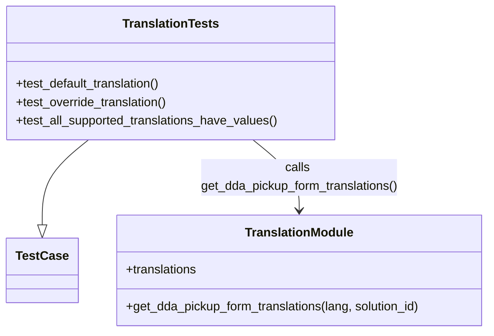
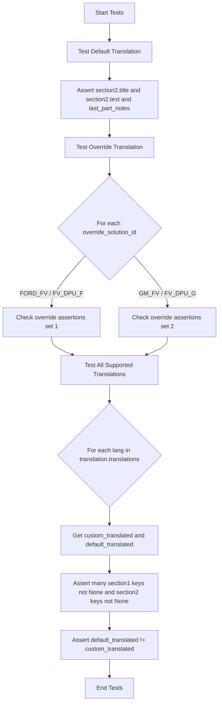

# Diagram: entity_core/entity_service/entity_service_tests/dpu/unit/approval_pickup_form/translations.py

> Auto-generated by Obscura crawlers

## Diagram 1

### SVG

<svg id="container" width="641.50390625" xmlns="http://www.w3.org/2000/svg" class="classDiagram" height="432" viewBox="0 0 641.50390625 432" role="graphics-document document" aria-roledescription="class"><g><defs><marker id="container_class-aggregationStart" class="marker aggregation class" refX="18" refY="7" markerWidth="190" markerHeight="240" orient="auto"><path d="M 18,7 L9,13 L1,7 L9,1 Z"></path></marker></defs><defs><marker id="container_class-aggregationEnd" class="marker aggregation class" refX="1" refY="7" markerWidth="20" markerHeight="28" orient="auto"><path d="M 18,7 L9,13 L1,7 L9,1 Z"></path></marker></defs><defs><marker id="container_class-extensionStart" class="marker extension class" refX="18" refY="7" markerWidth="190" markerHeight="240" orient="auto"><path d="M 1,7 L18,13 V 1 Z"></path></marker></defs><defs><marker id="container_class-extensionEnd" class="marker extension class" refX="1" refY="7" markerWidth="20" markerHeight="28" orient="auto"><path d="M 1,1 V 13 L18,7 Z"></path></marker></defs><defs><marker id="container_class-compositionStart" class="marker composition class" refX="18" refY="7" markerWidth="190" markerHeight="240" orient="auto"><path d="M 18,7 L9,13 L1,7 L9,1 Z"></path></marker></defs><defs><marker id="container_class-compositionEnd" class="marker composition class" refX="1" refY="7" markerWidth="20" markerHeight="28" orient="auto"><path d="M 18,7 L9,13 L1,7 L9,1 Z"></path></marker></defs><defs><marker id="container_class-dependencyStart" class="marker dependency class" refX="6" refY="7" markerWidth="190" markerHeight="240" orient="auto"><path d="M 5,7 L9,13 L1,7 L9,1 Z"></path></marker></defs><defs><marker id="container_class-dependencyEnd" class="marker dependency class" refX="13" refY="7" markerWidth="20" markerHeight="28" orient="auto"><path d="M 18,7 L9,13 L14,7 L9,1 Z"></path></marker></defs><defs><marker id="container_class-lollipopStart" class="marker lollipop class" refX="13" refY="7" markerWidth="190" markerHeight="240" orient="auto"><circle stroke="black" fill="transparent" cx="7" cy="7" r="6"></circle></marker></defs><defs><marker id="container_class-lollipopEnd" class="marker lollipop class" refX="1" refY="7" markerWidth="190" markerHeight="240" orient="auto"><circle stroke="black" fill="transparent" cx="7" cy="7" r="6"></circle></marker></defs><g class="root"><g class="clusters"></g><g class="edgePaths"><path d="M115.639,182L105.538,190.167C95.438,198.333,75.236,214.667,65.136,233.125C55.035,251.583,55.035,272.167,55.035,282.458L55.035,292.75" id="id_TranslationTests_TestCase_1" class="edge-thickness-normal edge-pattern-solid relation" style=";;;" data-edge="true" data-et="edge" data-id="id_TranslationTests_TestCase_1" data-points="W3sieCI6MTE1LjYzOTE2MDE1NjI1LCJ5IjoxODJ9LHsieCI6NTUuMDM1MTU2MjUsInkiOjIzMX0seyJ4Ijo1NS4wMzUxNTYyNSwieSI6MzEwfV0=" marker-end="url(#container_class-extensionEnd)"></path><path d="M330.845,182L340.946,190.167C351.047,198.333,371.248,214.667,381.349,230C391.449,245.333,391.449,259.667,391.449,266.833L391.449,274" id="id_TranslationTests_TranslationModule_2" class="edge-thickness-normal edge-pattern-solid relation" style=";;;" data-edge="true" data-et="edge" data-id="id_TranslationTests_TranslationModule_2" data-points="W3sieCI6MzMwLjg0NTIxNDg0Mzc1LCJ5IjoxODJ9LHsieCI6MzkxLjQ0OTIxODc1LCJ5IjoyMzF9LHsieCI6MzkxLjQ0OTIxODc1LCJ5IjoyODB9XQ==" marker-end="url(#container_class-dependencyEnd)"></path></g><g class="edgeLabels"><g class="edgeLabel"><g class="label" data-id="id_TranslationTests_TestCase_1" transform="translate(0, 0)"><foreignObject width="0" height="0">

</foreignObject></g></g><g class="edgeLabel" transform="translate(391.44921875, 231)"><g class="label" data-id="id_TranslationTests_TranslationModule_2" transform="translate(-131.25, -24)"><foreignObject width="262.5" height="48">

calls get_dda_pickup_form_translations()

</foreignObject></g></g></g><g class="nodes"><g class="node default" id="classId-TranslationTests-0" transform="translate(223.2421875, 95)"><g class="basic label-container"><path d="M-215.2421875 -87 L215.2421875 -87 L215.2421875 87 L-215.2421875 87" stroke="none" stroke-width="0" fill="#ECECFF" style=""></path><path d="M-215.2421875 -87 C-114.7545639132562 -87, -14.266940326512412 -87, 215.2421875 -87 M-215.2421875 -87 C-55.73560573575 -87, 103.7709760285 -87, 215.2421875 -87 M215.2421875 -87 C215.2421875 -22.494524548146217, 215.2421875 42.01095090370757, 215.2421875 87 M215.2421875 -87 C215.2421875 -27.333271108055634, 215.2421875 32.33345778388873, 215.2421875 87 M215.2421875 87 C114.63458853334731 87, 14.026989566694624 87, -215.2421875 87 M215.2421875 87 C105.20312705762036 87, -4.835933384759272 87, -215.2421875 87 M-215.2421875 87 C-215.2421875 32.43595563036714, -215.2421875 -22.12808873926572, -215.2421875 -87 M-215.2421875 87 C-215.2421875 39.89533188959957, -215.2421875 -7.209336220800864, -215.2421875 -87" stroke="#9370DB" stroke-width="1.3" fill="none" stroke-dasharray="0 0" style=""></path></g><g class="annotation-group text" transform="translate(0, -63)"></g><g class="label-group text" transform="translate(-60.34375, -63)"><g class="label" style="font-weight: bolder" transform="translate(0,-12)"><foreignObject width="120.6875" height="24">

TranslationTests

</foreignObject></g></g><g class="members-group text" transform="translate(-203.2421875, -15)"></g><g class="methods-group text" transform="translate(-203.2421875, 15)"><g class="label" style="" transform="translate(0,-12)"><foreignObject width="192.828125" height="24">

+test_default_translation()

</foreignObject></g><g class="label" style="" transform="translate(0,12)"><foreignObject width="201.6875" height="24">

+test_override_translation()

</foreignObject></g><g class="label" style="" transform="translate(0,36)"><foreignObject width="346.140625" height="24">

+test_all_supported_translations_have_values()

</foreignObject></g></g><g class="divider" style=""><path d="M-215.2421875 -39 C-103.19190241423475 -39, 8.858382671530507 -39, 215.2421875 -39 M-215.2421875 -39 C-121.90440177381451 -39, -28.566616047629026 -39, 215.2421875 -39" stroke="#9370DB" stroke-width="1.3" fill="none" stroke-dasharray="0 0" style=""></path></g><g class="divider" style=""><path d="M-215.2421875 -15 C-66.4784456936379 -15, 82.28529611272421 -15, 215.2421875 -15 M-215.2421875 -15 C-57.179971890630156 -15, 100.88224371873969 -15, 215.2421875 -15" stroke="#9370DB" stroke-width="1.3" fill="none" stroke-dasharray="0 0" style=""></path></g></g><g class="node default" id="classId-TestCase-1" transform="translate(55.03515625, 352)"><g class="basic label-container"><path d="M-44.359375 -42 L44.359375 -42 L44.359375 42 L-44.359375 42" stroke="none" stroke-width="0" fill="#ECECFF" style=""></path><path d="M-44.359375 -42 C-9.047142777848308 -42, 26.265089444303385 -42, 44.359375 -42 M-44.359375 -42 C-22.749372406600223 -42, -1.139369813200446 -42, 44.359375 -42 M44.359375 -42 C44.359375 -15.21597929453256, 44.359375 11.568041410934882, 44.359375 42 M44.359375 -42 C44.359375 -21.763152067486818, 44.359375 -1.5263041349736355, 44.359375 42 M44.359375 42 C21.79482435641926 42, -0.7697262871614825 42, -44.359375 42 M44.359375 42 C9.521171572668564 42, -25.317031854662872 42, -44.359375 42 M-44.359375 42 C-44.359375 9.435230000607497, -44.359375 -23.129539998785006, -44.359375 -42 M-44.359375 42 C-44.359375 24.213890391521016, -44.359375 6.4277807830420315, -44.359375 -42" stroke="#9370DB" stroke-width="1.3" fill="none" stroke-dasharray="0 0" style=""></path></g><g class="annotation-group text" transform="translate(0, -18)"></g><g class="label-group text" transform="translate(-32.359375, -18)"><g class="label" style="font-weight: bolder" transform="translate(0,-12)"><foreignObject width="64.71875" height="24">

TestCase

</foreignObject></g></g><g class="members-group text" transform="translate(-32.359375, 30)"></g><g class="methods-group text" transform="translate(-32.359375, 60)"></g><g class="divider" style=""><path d="M-44.359375 6 C-13.791373220803791 6, 16.776628558392417 6, 44.359375 6 M-44.359375 6 C-14.181588736771428 6, 15.996197526457145 6, 44.359375 6" stroke="#9370DB" stroke-width="1.3" fill="none" stroke-dasharray="0 0" style=""></path></g><g class="divider" style=""><path d="M-44.359375 24 C-25.823344447346763 24, -7.287313894693526 24, 44.359375 24 M-44.359375 24 C-9.148318347860076 24, 26.062738304279847 24, 44.359375 24" stroke="#9370DB" stroke-width="1.3" fill="none" stroke-dasharray="0 0" style=""></path></g></g><g class="node default" id="classId-TranslationModule-2" transform="translate(391.44921875, 352)"><g class="basic label-container"><path d="M-242.0546875 -72 L242.0546875 -72 L242.0546875 72 L-242.0546875 72" stroke="none" stroke-width="0" fill="#ECECFF" style=""></path><path d="M-242.0546875 -72 C-122.2020407234011 -72, -2.349393946802195 -72, 242.0546875 -72 M-242.0546875 -72 C-131.75389815212833 -72, -21.453108804256658 -72, 242.0546875 -72 M242.0546875 -72 C242.0546875 -33.2934677277793, 242.0546875 5.413064544441397, 242.0546875 72 M242.0546875 -72 C242.0546875 -36.86289655793764, 242.0546875 -1.7257931158752768, 242.0546875 72 M242.0546875 72 C83.72324366364933 72, -74.60820017270134 72, -242.0546875 72 M242.0546875 72 C70.38270031289017 72, -101.28928687421967 72, -242.0546875 72 M-242.0546875 72 C-242.0546875 30.02146034916285, -242.0546875 -11.957079301674298, -242.0546875 -72 M-242.0546875 72 C-242.0546875 22.885147156970206, -242.0546875 -26.22970568605959, -242.0546875 -72" stroke="#9370DB" stroke-width="1.3" fill="none" stroke-dasharray="0 0" style=""></path></g><g class="annotation-group text" transform="translate(0, -48)"></g><g class="label-group text" transform="translate(-68.3125, -48)"><g class="label" style="font-weight: bolder" transform="translate(0,-12)"><foreignObject width="136.625" height="24">

TranslationModule

</foreignObject></g></g><g class="members-group text" transform="translate(-230.0546875, 0)"><g class="label" style="" transform="translate(0,-12)"><foreignObject width="94.640625" height="24">

+translations

</foreignObject></g></g><g class="methods-group text" transform="translate(-230.0546875, 48)"><g class="label" style="" transform="translate(0,-12)"><foreignObject width="391.796875" height="24">

+get_dda_pickup_form_translations(lang, solution_id)

</foreignObject></g></g><g class="divider" style=""><path d="M-242.0546875 -24 C-133.8828738419137 -24, -25.711060183827357 -24, 242.0546875 -24 M-242.0546875 -24 C-136.64570535936758 -24, -31.236723218735165 -24, 242.0546875 -24" stroke="#9370DB" stroke-width="1.3" fill="none" stroke-dasharray="0 0" style=""></path></g><g class="divider" style=""><path d="M-242.0546875 24 C-106.48183991468977 24, 29.091007670620456 24, 242.0546875 24 M-242.0546875 24 C-86.25981587277641 24, 69.53505575444717 24, 242.0546875 24" stroke="#9370DB" stroke-width="1.3" fill="none" stroke-dasharray="0 0" style=""></path></g></g></g></g></g></svg>

## Diagram 2

### SVG

<svg id="container" width="586" xmlns="http://www.w3.org/2000/svg" class="flowchart" height="1878" viewBox="0 0 586 1878" role="graphics-document document" aria-roledescription="flowchart-v2"><g><marker id="container_flowchart-v2-pointEnd" class="marker flowchart-v2" viewBox="0 0 10 10" refX="5" refY="5" markerUnits="userSpaceOnUse" markerWidth="8" markerHeight="8" orient="auto"><path d="M 0 0 L 10 5 L 0 10 z" class="arrowMarkerPath" style="stroke-width: 1; stroke-dasharray: 1, 0;"></path></marker><marker id="container_flowchart-v2-pointStart" class="marker flowchart-v2" viewBox="0 0 10 10" refX="4.5" refY="5" markerUnits="userSpaceOnUse" markerWidth="8" markerHeight="8" orient="auto"><path d="M 0 5 L 10 10 L 10 0 z" class="arrowMarkerPath" style="stroke-width: 1; stroke-dasharray: 1, 0;"></path></marker><marker id="container_flowchart-v2-circleEnd" class="marker flowchart-v2" viewBox="0 0 10 10" refX="11" refY="5" markerUnits="userSpaceOnUse" markerWidth="11" markerHeight="11" orient="auto"><circle cx="5" cy="5" r="5" class="arrowMarkerPath" style="stroke-width: 1; stroke-dasharray: 1, 0;"></circle></marker><marker id="container_flowchart-v2-circleStart" class="marker flowchart-v2" viewBox="0 0 10 10" refX="-1" refY="5" markerUnits="userSpaceOnUse" markerWidth="11" markerHeight="11" orient="auto"><circle cx="5" cy="5" r="5" class="arrowMarkerPath" style="stroke-width: 1; stroke-dasharray: 1, 0;"></circle></marker><marker id="container_flowchart-v2-crossEnd" class="marker cross flowchart-v2" viewBox="0 0 11 11" refX="12" refY="5.2" markerUnits="userSpaceOnUse" markerWidth="11" markerHeight="11" orient="auto"><path d="M 1,1 l 9,9 M 10,1 l -9,9" class="arrowMarkerPath" style="stroke-width: 2; stroke-dasharray: 1, 0;"></path></marker><marker id="container_flowchart-v2-crossStart" class="marker cross flowchart-v2" viewBox="0 0 11 11" refX="-1" refY="5.2" markerUnits="userSpaceOnUse" markerWidth="11" markerHeight="11" orient="auto"><path d="M 1,1 l 9,9 M 10,1 l -9,9" class="arrowMarkerPath" style="stroke-width: 2; stroke-dasharray: 1, 0;"></path></marker><g class="root"><g class="clusters"></g><g class="edgePaths"><path d="M293,62L293,66.167C293,70.333,293,78.667,293,86.333C293,94,293,101,293,104.5L293,108" id="L_A_B_0" class="edge-thickness-normal edge-pattern-solid edge-thickness-normal edge-pattern-solid flowchart-link" style=";" data-edge="true" data-et="edge" data-id="L_A_B_0" data-points="W3sieCI6MjkzLCJ5Ijo2Mn0seyJ4IjoyOTMsInkiOjg3fSx7IngiOjI5MywieSI6MTEyfV0=" marker-end="url(#container_flowchart-v2-pointEnd)"></path><path d="M293,166L293,170.167C293,174.333,293,182.667,293,190.333C293,198,293,205,293,208.5L293,212" id="L_B_C_0" class="edge-thickness-normal edge-pattern-solid edge-thickness-normal edge-pattern-solid flowchart-link" style=";" data-edge="true" data-et="edge" data-id="L_B_C_0" data-points="W3sieCI6MjkzLCJ5IjoxNjZ9LHsieCI6MjkzLCJ5IjoxOTF9LHsieCI6MjkzLCJ5IjoyMTZ9XQ==" marker-end="url(#container_flowchart-v2-pointEnd)"></path><path d="M293,318L293,322.167C293,326.333,293,334.667,293,342.333C293,350,293,357,293,360.5L293,364" id="L_C_D_0" class="edge-thickness-normal edge-pattern-solid edge-thickness-normal edge-pattern-solid flowchart-link" style=";" data-edge="true" data-et="edge" data-id="L_C_D_0" data-points="W3sieCI6MjkzLCJ5IjozMTh9LHsieCI6MjkzLCJ5IjozNDN9LHsieCI6MjkzLCJ5IjozNjh9XQ==" marker-end="url(#container_flowchart-v2-pointEnd)"></path><path d="M293,422L293,426.167C293,430.333,293,438.667,293,446.333C293,454,293,461,293,464.5L293,468" id="L_D_E_0" class="edge-thickness-normal edge-pattern-solid edge-thickness-normal edge-pattern-solid flowchart-link" style=";" data-edge="true" data-et="edge" data-id="L_D_E_0" data-points="W3sieCI6MjkzLCJ5Ijo0MjJ9LHsieCI6MjkzLCJ5Ijo0NDd9LHsieCI6MjkzLCJ5Ijo0NzJ9XQ==" marker-end="url(#container_flowchart-v2-pointEnd)"></path><path d="M227.909,684.909L212.924,701.924C197.94,718.94,167.97,752.97,152.985,775.485C138,798,138,809,138,814.5L138,820" id="L_E_F_0" class="edge-thickness-normal edge-pattern-solid edge-thickness-normal edge-pattern-solid flowchart-link" style=";" data-edge="true" data-et="edge" data-id="L_E_F_0" data-points="W3sieCI6MjI3LjkwOTM2NTU1ODkxMjM4LCJ5Ijo2ODQuOTA5MzY1NTU4OTEyNH0seyJ4IjoxMzgsInkiOjc4N30seyJ4IjoxMzgsInkiOjgyNH1d" marker-end="url(#container_flowchart-v2-pointEnd)"></path><path d="M358.091,684.909L373.076,701.924C388.06,718.94,418.03,752.97,433.015,775.485C448,798,448,809,448,814.5L448,820" id="L_E_G_0" class="edge-thickness-normal edge-pattern-solid edge-thickness-normal edge-pattern-solid flowchart-link" style=";" data-edge="true" data-et="edge" data-id="L_E_G_0" data-points="W3sieCI6MzU4LjA5MDYzNDQ0MTA4NzYsInkiOjY4NC45MDkzNjU1NTg5MTI0fSx7IngiOjQ0OCwieSI6Nzg3fSx7IngiOjQ0OCwieSI6ODI0fV0=" marker-end="url(#container_flowchart-v2-pointEnd)"></path><path d="M138,902L138,906.167C138,910.333,138,918.667,147.475,926.746C156.95,934.824,175.9,942.649,185.375,946.561L194.85,950.473" id="L_F_H_0" class="edge-thickness-normal edge-pattern-solid edge-thickness-normal edge-pattern-solid flowchart-link" style=";" data-edge="true" data-et="edge" data-id="L_F_H_0" data-points="W3sieCI6MTM4LCJ5Ijo5MDJ9LHsieCI6MTM4LCJ5Ijo5Mjd9LHsieCI6MTk4LjU0Njg3NSwieSI6OTUyfV0=" marker-end="url(#container_flowchart-v2-pointEnd)"></path><path d="M448,902L448,906.167C448,910.333,448,918.667,438.525,926.746C429.05,934.824,410.1,942.649,400.625,946.561L391.15,950.473" id="L_G_H_0" class="edge-thickness-normal edge-pattern-solid edge-thickness-normal edge-pattern-solid flowchart-link" style=";" data-edge="true" data-et="edge" data-id="L_G_H_0" data-points="W3sieCI6NDQ4LCJ5Ijo5MDJ9LHsieCI6NDQ4LCJ5Ijo5Mjd9LHsieCI6Mzg3LjQ1MzEyNSwieSI6OTUyfV0=" marker-end="url(#container_flowchart-v2-pointEnd)"></path><path d="M293,1030L293,1034.167C293,1038.333,293,1046.667,293,1054.333C293,1062,293,1069,293,1072.5L293,1076" id="L_H_I_0" class="edge-thickness-normal edge-pattern-solid edge-thickness-normal edge-pattern-solid flowchart-link" style=";" data-edge="true" data-et="edge" data-id="L_H_I_0" data-points="W3sieCI6MjkzLCJ5IjoxMDMwfSx7IngiOjI5MywieSI6MTA1NX0seyJ4IjoyOTMsInkiOjEwODB9XQ==" marker-end="url(#container_flowchart-v2-pointEnd)"></path><path d="M293,1358L293,1362.167C293,1366.333,293,1374.667,293,1382.333C293,1390,293,1397,293,1400.5L293,1404" id="L_I_J_0" class="edge-thickness-normal edge-pattern-solid edge-thickness-normal edge-pattern-solid flowchart-link" style=";" data-edge="true" data-et="edge" data-id="L_I_J_0" data-points="W3sieCI6MjkzLCJ5IjoxMzU4fSx7IngiOjI5MywieSI6MTM4M30seyJ4IjoyOTMsInkiOjE0MDh9XQ==" marker-end="url(#container_flowchart-v2-pointEnd)"></path><path d="M293,1486L293,1490.167C293,1494.333,293,1502.667,293,1510.333C293,1518,293,1525,293,1528.5L293,1532" id="L_J_K_0" class="edge-thickness-normal edge-pattern-solid edge-thickness-normal edge-pattern-solid flowchart-link" style=";" data-edge="true" data-et="edge" data-id="L_J_K_0" data-points="W3sieCI6MjkzLCJ5IjoxNDg2fSx7IngiOjI5MywieSI6MTUxMX0seyJ4IjoyOTMsInkiOjE1MzZ9XQ==" marker-end="url(#container_flowchart-v2-pointEnd)"></path><path d="M293,1638L293,1642.167C293,1646.333,293,1654.667,293,1662.333C293,1670,293,1677,293,1680.5L293,1684" id="L_K_L_0" class="edge-thickness-normal edge-pattern-solid edge-thickness-normal edge-pattern-solid flowchart-link" style=";" data-edge="true" data-et="edge" data-id="L_K_L_0" data-points="W3sieCI6MjkzLCJ5IjoxNjM4fSx7IngiOjI5MywieSI6MTY2M30seyJ4IjoyOTMsInkiOjE2ODh9XQ==" marker-end="url(#container_flowchart-v2-pointEnd)"></path><path d="M293,1766L293,1770.167C293,1774.333,293,1782.667,293,1790.333C293,1798,293,1805,293,1808.5L293,1812" id="L_L_M_0" class="edge-thickness-normal edge-pattern-solid edge-thickness-normal edge-pattern-solid flowchart-link" style=";" data-edge="true" data-et="edge" data-id="L_L_M_0" data-points="W3sieCI6MjkzLCJ5IjoxNzY2fSx7IngiOjI5MywieSI6MTc5MX0seyJ4IjoyOTMsInkiOjE4MTZ9XQ==" marker-end="url(#container_flowchart-v2-pointEnd)"></path></g><g class="edgeLabels"><g class="edgeLabel"><g class="label" data-id="L_A_B_0" transform="translate(0, 0)"><foreignObject width="0" height="0">

</foreignObject></g></g><g class="edgeLabel"><g class="label" data-id="L_B_C_0" transform="translate(0, 0)"><foreignObject width="0" height="0">

</foreignObject></g></g><g class="edgeLabel"><g class="label" data-id="L_C_D_0" transform="translate(0, 0)"><foreignObject width="0" height="0">

</foreignObject></g></g><g class="edgeLabel"><g class="label" data-id="L_D_E_0" transform="translate(0, 0)"><foreignObject width="0" height="0">

</foreignObject></g></g><g class="edgeLabel" transform="translate(138, 787)"><g class="label" data-id="L_E_F_0" transform="translate(-75.0234375, -12)"><foreignObject width="150.046875" height="24">

FORD_FV / FV_DPU_F

</foreignObject></g></g><g class="edgeLabel" transform="translate(448, 787)"><g class="label" data-id="L_E_G_0" transform="translate(-68.09375, -12)"><foreignObject width="136.1875" height="24">

GM_FV / FV_DPU_G

</foreignObject></g></g><g class="edgeLabel"><g class="label" data-id="L_F_H_0" transform="translate(0, 0)"><foreignObject width="0" height="0">

</foreignObject></g></g><g class="edgeLabel"><g class="label" data-id="L_G_H_0" transform="translate(0, 0)"><foreignObject width="0" height="0">

</foreignObject></g></g><g class="edgeLabel"><g class="label" data-id="L_H_I_0" transform="translate(0, 0)"><foreignObject width="0" height="0">

</foreignObject></g></g><g class="edgeLabel"><g class="label" data-id="L_I_J_0" transform="translate(0, 0)"><foreignObject width="0" height="0">

</foreignObject></g></g><g class="edgeLabel"><g class="label" data-id="L_J_K_0" transform="translate(0, 0)"><foreignObject width="0" height="0">

</foreignObject></g></g><g class="edgeLabel"><g class="label" data-id="L_K_L_0" transform="translate(0, 0)"><foreignObject width="0" height="0">

</foreignObject></g></g><g class="edgeLabel"><g class="label" data-id="L_L_M_0" transform="translate(0, 0)"><foreignObject width="0" height="0">

</foreignObject></g></g></g><g class="nodes"><g class="node default" id="flowchart-A-0" transform="translate(293, 35)"><rect class="basic label-container" style="" x="-68.0625" y="-27" width="136.125" height="54"></rect><g class="label" style="" transform="translate(-38.0625, -12)"><rect></rect><foreignObject width="76.125" height="24">

Start Tests

</foreignObject></g></g><g class="node default" id="flowchart-B-1" transform="translate(293, 139)"><rect class="basic label-container" style="" x="-115.8203125" y="-27" width="231.640625" height="54"></rect><g class="label" style="" transform="translate(-85.8203125, -12)"><rect></rect><foreignObject width="171.640625" height="24">

Test Default Translation

</foreignObject></g></g><g class="node default" id="flowchart-C-3" transform="translate(293, 267)"><rect class="basic label-container" style="" x="-130" y="-51" width="260" height="102"></rect><g class="label" style="" transform="translate(-100, -36)"><rect></rect><foreignObject width="200" height="72">

Assert section2.title and section2.text and last_part_notes

</foreignObject></g></g><g class="node default" id="flowchart-D-5" transform="translate(293, 395)"><rect class="basic label-container" style="" x="-120.9375" y="-27" width="241.875" height="54"></rect><g class="label" style="" transform="translate(-90.9375, -12)"><rect></rect><foreignObject width="181.875" height="24">

Test Override Translation

</foreignObject></g></g><g class="node default" id="flowchart-E-7" transform="translate(293, 611)"><polygon points="139,0 278,-139 139,-278 0,-139" class="label-container" transform="translate(-138.5, 139)"></polygon><g class="label" style="" transform="translate(-100, -24)"><rect></rect><foreignObject width="200" height="48">

For each override_solution_id

</foreignObject></g></g><g class="node default" id="flowchart-F-9" transform="translate(138, 863)"><rect class="basic label-container" style="" x="-130" y="-39" width="260" height="78"></rect><g class="label" style="" transform="translate(-100, -24)"><rect></rect><foreignObject width="200" height="48">

Check override assertions set 1

</foreignObject></g></g><g class="node default" id="flowchart-G-11" transform="translate(448, 863)"><rect class="basic label-container" style="" x="-130" y="-39" width="260" height="78"></rect><g class="label" style="" transform="translate(-100, -24)"><rect></rect><foreignObject width="200" height="48">

Check override assertions set 2

</foreignObject></g></g><g class="node default" id="flowchart-H-13" transform="translate(293, 991)"><rect class="basic label-container" style="" x="-130" y="-39" width="260" height="78"></rect><g class="label" style="" transform="translate(-100, -24)"><rect></rect><foreignObject width="200" height="48">

Test All Supported Translations

</foreignObject></g></g><g class="node default" id="flowchart-I-17" transform="translate(293, 1219)"><polygon points="139,0 278,-139 139,-278 0,-139" class="label-container" transform="translate(-138.5, 139)"></polygon><g class="label" style="" transform="translate(-100, -24)"><rect></rect><foreignObject width="200" height="48">

For each lang in translation.translations

</foreignObject></g></g><g class="node default" id="flowchart-J-19" transform="translate(293, 1447)"><rect class="basic label-container" style="" x="-130" y="-39" width="260" height="78"></rect><g class="label" style="" transform="translate(-100, -24)"><rect></rect><foreignObject width="200" height="48">

Get custom_translated and default_translated

</foreignObject></g></g><g class="node default" id="flowchart-K-21" transform="translate(293, 1587)"><rect class="basic label-container" style="" x="-130" y="-51" width="260" height="102"></rect><g class="label" style="" transform="translate(-100, -36)"><rect></rect><foreignObject width="200" height="72">

Assert many section1 keys not None and section2 keys not None

</foreignObject></g></g><g class="node default" id="flowchart-L-23" transform="translate(293, 1727)"><rect class="basic label-container" style="" x="-130" y="-39" width="260" height="78"></rect><g class="label" style="" transform="translate(-100, -24)"><rect></rect><foreignObject width="200" height="48">

Assert default_translated != custom_translated

</foreignObject></g></g><g class="node default" id="flowchart-M-25" transform="translate(293, 1843)"><rect class="basic label-container" style="" x="-64.2109375" y="-27" width="128.421875" height="54"></rect><g class="label" style="" transform="translate(-34.2109375, -12)"><rect></rect><foreignObject width="68.421875" height="24">

End Tests

</foreignObject></g></g></g></g></g></svg>
