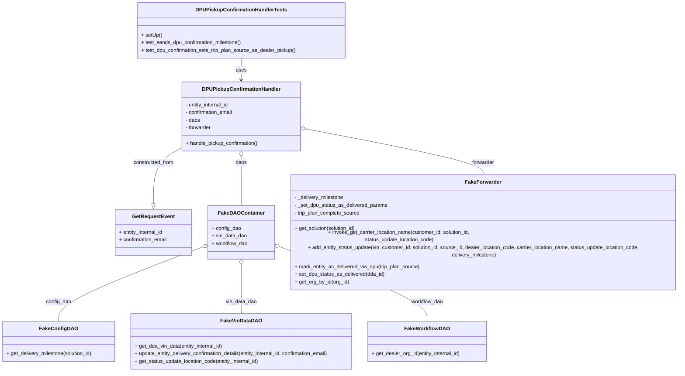
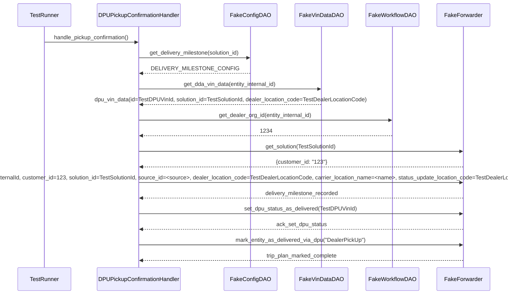

# Diagram: entity_core/entity_service/entity_service_tests/dpu/unit/test_delivery_confirmation_handler.py

> Auto-generated by Obscura crawlers

## Diagram 1

### SVG

<svg id="container" width="2202.40625" xmlns="http://www.w3.org/2000/svg" class="classDiagram" height="1114" viewBox="0 0 2202.40625 1114" role="graphics-document document" aria-roledescription="class"><g><defs><marker id="container_class-aggregationStart" class="marker aggregation class" refX="18" refY="7" markerWidth="190" markerHeight="240" orient="auto"><path d="M 18,7 L9,13 L1,7 L9,1 Z"></path></marker></defs><defs><marker id="container_class-aggregationEnd" class="marker aggregation class" refX="1" refY="7" markerWidth="20" markerHeight="28" orient="auto"><path d="M 18,7 L9,13 L1,7 L9,1 Z"></path></marker></defs><defs><marker id="container_class-extensionStart" class="marker extension class" refX="18" refY="7" markerWidth="190" markerHeight="240" orient="auto"><path d="M 1,7 L18,13 V 1 Z"></path></marker></defs><defs><marker id="container_class-extensionEnd" class="marker extension class" refX="1" refY="7" markerWidth="20" markerHeight="28" orient="auto"><path d="M 1,1 V 13 L18,7 Z"></path></marker></defs><defs><marker id="container_class-compositionStart" class="marker composition class" refX="18" refY="7" markerWidth="190" markerHeight="240" orient="auto"><path d="M 18,7 L9,13 L1,7 L9,1 Z"></path></marker></defs><defs><marker id="container_class-compositionEnd" class="marker composition class" refX="1" refY="7" markerWidth="20" markerHeight="28" orient="auto"><path d="M 18,7 L9,13 L1,7 L9,1 Z"></path></marker></defs><defs><marker id="container_class-dependencyStart" class="marker dependency class" refX="6" refY="7" markerWidth="190" markerHeight="240" orient="auto"><path d="M 5,7 L9,13 L1,7 L9,1 Z"></path></marker></defs><defs><marker id="container_class-dependencyEnd" class="marker dependency class" refX="13" refY="7" markerWidth="20" markerHeight="28" orient="auto"><path d="M 18,7 L9,13 L14,7 L9,1 Z"></path></marker></defs><defs><marker id="container_class-lollipopStart" class="marker lollipop class" refX="13" refY="7" markerWidth="190" markerHeight="240" orient="auto"><circle stroke="black" fill="transparent" cx="7" cy="7" r="6"></circle></marker></defs><defs><marker id="container_class-lollipopEnd" class="marker lollipop class" refX="1" refY="7" markerWidth="190" markerHeight="240" orient="auto"><circle stroke="black" fill="transparent" cx="7" cy="7" r="6"></circle></marker></defs><g class="root"><g class="clusters"></g><g class="edgePaths"><path d="M579.508,462.627L564.993,470.356C550.478,478.084,521.448,493.542,506.933,518.563C492.418,543.583,492.418,578.167,492.418,595.458L492.418,612.75" id="id_DPUPickupConfirmationHandler_GetRequestEvent_1" class="edge-thickness-normal edge-pattern-solid relation" style=";;;" data-edge="true" data-et="edge" data-id="id_DPUPickupConfirmationHandler_GetRequestEvent_1" data-points="W3sieCI6NTc5LjUwNzgxMjUsInkiOjQ2Mi42MjY3MDcwMjMxODExfSx7IngiOjQ5Mi40MTc5Njg3NSwieSI6NTA5fSx7IngiOjQ5Mi40MTc5Njg3NSwieSI6NjMwfV0=" marker-end="url(#container_class-extensionEnd)"></path><path d="M764.73,489.25L764.73,492.542C764.73,495.833,764.73,502.417,764.73,523.875C764.73,545.333,764.73,581.667,764.73,599.833L764.73,618" id="id_DPUPickupConfirmationHandler_FakeDAOContainer_2" class="edge-thickness-normal edge-pattern-solid relation" style=";;;" data-edge="true" data-et="edge" data-id="id_DPUPickupConfirmationHandler_FakeDAOContainer_2" data-points="W3sieCI6NzY0LjczMDQ2ODc1LCJ5Ijo0NzJ9LHsieCI6NzY0LjczMDQ2ODc1LCJ5Ijo1MDl9LHsieCI6NzY0LjczMDQ2ODc1LCJ5Ijo2MTh9XQ==" marker-start="url(#container_class-aggregationStart)"></path><path d="M646.185,741.399L569.157,766.999C492.13,792.599,338.075,843.8,261.047,879.566C184.02,915.333,184.02,935.667,184.02,945.833L184.02,956" id="id_FakeDAOContainer_FakeConfigDAO_3" class="edge-thickness-normal edge-pattern-solid relation" style=";;;" data-edge="true" data-et="edge" data-id="id_FakeDAOContainer_FakeConfigDAO_3" data-points="W3sieCI6NjYyLjU1NDY4NzUsInkiOjczNS45NTgyNDc1NjgzMDkzfSx7IngiOjE4NC4wMTk1MzEyNSwieSI6ODk1fSx7IngiOjE4NC4wMTk1MzEyNSwieSI6OTU2fV0=" marker-start="url(#container_class-aggregationStart)"></path><path d="M764.73,803.25L764.73,818.542C764.73,833.833,764.73,864.417,764.73,885.875C764.73,907.333,764.73,919.667,764.73,925.833L764.73,932" id="id_FakeDAOContainer_FakeVinDataDAO_4" class="edge-thickness-normal edge-pattern-solid relation" style=";;;" data-edge="true" data-et="edge" data-id="id_FakeDAOContainer_FakeVinDataDAO_4" data-points="W3sieCI6NzY0LjczMDQ2ODc1LCJ5Ijo3ODZ9LHsieCI6NzY0LjczMDQ2ODc1LCJ5Ijo4OTV9LHsieCI6NzY0LjczMDQ2ODc1LCJ5Ijo5MzJ9XQ==" marker-start="url(#container_class-aggregationStart)"></path><path d="M883.303,740.751L961.967,766.459C1040.63,792.167,1197.958,843.584,1276.621,879.458C1355.285,915.333,1355.285,935.667,1355.285,945.833L1355.285,956" id="id_FakeDAOContainer_FakeWorkflowDAO_5" class="edge-thickness-normal edge-pattern-solid relation" style=";;;" data-edge="true" data-et="edge" data-id="id_FakeDAOContainer_FakeWorkflowDAO_5" data-points="W3sieCI6ODY2LjkwNjI1LCJ5Ijo3MzUuMzkyMjA5MzkwMDA2OH0seyJ4IjoxMzU1LjI4NTE1NjI1LCJ5Ijo4OTV9LHsieCI6MTM1NS4yODUxNTYyNSwieSI6OTU2fV0=" marker-start="url(#container_class-aggregationStart)"></path><path d="M966.92,401.067L1065.043,419.056C1163.166,437.045,1359.411,473.022,1457.534,497.178C1555.656,521.333,1555.656,533.667,1555.656,539.833L1555.656,546" id="id_DPUPickupConfirmationHandler_FakeForwarder_6" class="edge-thickness-normal edge-pattern-solid relation" style=";;;" data-edge="true" data-et="edge" data-id="id_DPUPickupConfirmationHandler_FakeForwarder_6" data-points="W3sieCI6OTQ5Ljk1MzEyNSwieSI6Mzk3Ljk1Njc3MDM5ODYxMzJ9LHsieCI6MTU1NS42NTYyNSwieSI6NTA5fSx7IngiOjE1NTUuNjU2MjUsInkiOjU0Nn1d" marker-start="url(#container_class-aggregationStart)"></path><path d="M764.73,182L764.73,188.167C764.73,194.333,764.73,206.667,764.73,218C764.73,229.333,764.73,239.667,764.73,244.833L764.73,250" id="id_DPUPickupConfirmationHandlerTests_DPUPickupConfirmationHandler_7" class="edge-thickness-normal edge-pattern-solid relation" style=";;;" data-edge="true" data-et="edge" data-id="id_DPUPickupConfirmationHandlerTests_DPUPickupConfirmationHandler_7" data-points="W3sieCI6NzY0LjczMDQ2ODc1LCJ5IjoxODJ9LHsieCI6NzY0LjczMDQ2ODc1LCJ5IjoyMTl9LHsieCI6NzY0LjczMDQ2ODc1LCJ5IjoyNTZ9XQ==" marker-end="url(#container_class-dependencyEnd)"></path></g><g class="edgeLabels"><g class="edgeLabel" transform="translate(492.41796875, 509)"><g class="label" data-id="id_DPUPickupConfirmationHandler_GetRequestEvent_1" transform="translate(-64.1875, -12)"><foreignObject width="128.375" height="24">

constructed_from

</foreignObject></g></g><g class="edgeLabel" transform="translate(764.73046875, 509)"><g class="label" data-id="id_DPUPickupConfirmationHandler_FakeDAOContainer_2" transform="translate(-17.546875, -12)"><foreignObject width="35.09375" height="24">

daos

</foreignObject></g></g><g class="edgeLabel" transform="translate(184.01953125, 895)"><g class="label" data-id="id_FakeDAOContainer_FakeConfigDAO_3" transform="translate(-39.625, -12)"><foreignObject width="79.25" height="24">

config_dao

</foreignObject></g></g><g class="edgeLabel" transform="translate(764.73046875, 895)"><g class="label" data-id="id_FakeDAOContainer_FakeVinDataDAO_4" transform="translate(-49.015625, -12)"><foreignObject width="98.03125" height="24">

vin_data_dao

</foreignObject></g></g><g class="edgeLabel" transform="translate(1355.28515625, 895)"><g class="label" data-id="id_FakeDAOContainer_FakeWorkflowDAO_5" transform="translate(-50.3515625, -12)"><foreignObject width="100.703125" height="24">

workflow_dao

</foreignObject></g></g><g class="edgeLabel" transform="translate(1555.65625, 509)"><g class="label" data-id="id_DPUPickupConfirmationHandler_FakeForwarder_6" transform="translate(-35.4375, -12)"><foreignObject width="70.875" height="24">

forwarder

</foreignObject></g></g><g class="edgeLabel" transform="translate(764.73046875, 219)"><g class="label" data-id="id_DPUPickupConfirmationHandlerTests_DPUPickupConfirmationHandler_7" transform="translate(-16.4921875, -12)"><foreignObject width="32.984375" height="24">

uses

</foreignObject></g></g></g><g class="nodes"><g class="node default" id="classId-DPUPickupConfirmationHandler-0" transform="translate(764.73046875, 364)"><g class="basic label-container"><path d="M-185.22265625 -108 L185.22265625 -108 L185.22265625 108 L-185.22265625 108" stroke="none" stroke-width="0" fill="#ECECFF" style=""></path><path d="M-185.22265625 -108 C-79.8669573501164 -108, 25.488741549767212 -108, 185.22265625 -108 M-185.22265625 -108 C-52.50491821436327 -108, 80.21281982127346 -108, 185.22265625 -108 M185.22265625 -108 C185.22265625 -44.704397124401716, 185.22265625 18.59120575119657, 185.22265625 108 M185.22265625 -108 C185.22265625 -50.11614072879072, 185.22265625 7.767718542418564, 185.22265625 108 M185.22265625 108 C72.40089665651217 108, -40.42086293697565 108, -185.22265625 108 M185.22265625 108 C49.86763857918706 108, -85.48737909162588 108, -185.22265625 108 M-185.22265625 108 C-185.22265625 58.86732712315068, -185.22265625 9.73465424630136, -185.22265625 -108 M-185.22265625 108 C-185.22265625 24.84137109837313, -185.22265625 -58.31725780325374, -185.22265625 -108" stroke="#9370DB" stroke-width="1.3" fill="none" stroke-dasharray="0 0" style=""></path></g><g class="annotation-group text" transform="translate(0, -84)"></g><g class="label-group text" transform="translate(-116.3984375, -84)"><g class="label" style="font-weight: bolder" transform="translate(0,-12)"><foreignObject width="232.796875" height="24">

DPUPickupConfirmationHandler

</foreignObject></g></g><g class="members-group text" transform="translate(-173.22265625, -36)"><g class="label" style="" transform="translate(0,-12)"><foreignObject width="139.8125" height="24">

- entity_internal_id

</foreignObject></g><g class="label" style="" transform="translate(0,12)"><foreignObject width="151.875" height="24">

- confirmation_email

</foreignObject></g><g class="label" style="" transform="translate(0,36)"><foreignObject width="45.78125" height="24">

- daos

</foreignObject></g><g class="label" style="" transform="translate(0,60)"><foreignObject width="81.5625" height="24">

- forwarder

</foreignObject></g></g><g class="methods-group text" transform="translate(-173.22265625, 84)"><g class="label" style="" transform="translate(0,-12)"><foreignObject width="230.046875" height="24">

+ handle_pickup_confirmation()

</foreignObject></g></g><g class="divider" style=""><path d="M-185.22265625 -60 C-55.36028617346099 -60, 74.50208390307802 -60, 185.22265625 -60 M-185.22265625 -60 C-105.87614000112184 -60, -26.52962375224368 -60, 185.22265625 -60" stroke="#9370DB" stroke-width="1.3" fill="none" stroke-dasharray="0 0" style=""></path></g><g class="divider" style=""><path d="M-185.22265625 60 C-94.41762795005452 60, -3.612599650109047 60, 185.22265625 60 M-185.22265625 60 C-103.71884243885651 60, -22.215028627713025 60, 185.22265625 60" stroke="#9370DB" stroke-width="1.3" fill="none" stroke-dasharray="0 0" style=""></path></g></g><g class="node default" id="classId-GetRequestEvent-1" transform="translate(492.41796875, 702)"><g class="basic label-container"><path d="M-120.13671875 -72 L120.13671875 -72 L120.13671875 72 L-120.13671875 72" stroke="none" stroke-width="0" fill="#ECECFF" style=""></path><path d="M-120.13671875 -72 C-31.204181705638703 -72, 57.728355338722594 -72, 120.13671875 -72 M-120.13671875 -72 C-45.23472949440169 -72, 29.66725976119662 -72, 120.13671875 -72 M120.13671875 -72 C120.13671875 -41.46909482563726, 120.13671875 -10.93818965127452, 120.13671875 72 M120.13671875 -72 C120.13671875 -32.726526641937994, 120.13671875 6.546946716124012, 120.13671875 72 M120.13671875 72 C47.26361630515731 72, -25.609486139685373 72, -120.13671875 72 M120.13671875 72 C35.42056196429883 72, -49.29559482140235 72, -120.13671875 72 M-120.13671875 72 C-120.13671875 29.576397344809386, -120.13671875 -12.847205310381227, -120.13671875 -72 M-120.13671875 72 C-120.13671875 35.1750313292555, -120.13671875 -1.649937341488993, -120.13671875 -72" stroke="#9370DB" stroke-width="1.3" fill="none" stroke-dasharray="0 0" style=""></path></g><g class="annotation-group text" transform="translate(0, -48)"></g><g class="label-group text" transform="translate(-62.8515625, -48)"><g class="label" style="font-weight: bolder" transform="translate(0,-12)"><foreignObject width="125.703125" height="24">

GetRequestEvent

</foreignObject></g></g><g class="members-group text" transform="translate(-108.13671875, 0)"><g class="label" style="" transform="translate(0,-12)"><foreignObject width="141.359375" height="24">

+ entity_internal_id

</foreignObject></g><g class="label" style="" transform="translate(0,12)"><foreignObject width="153.421875" height="24">

+ confirmation_email

</foreignObject></g></g><g class="methods-group text" transform="translate(-108.13671875, 72)"></g><g class="divider" style=""><path d="M-120.13671875 -24 C-68.22239314852129 -24, -16.308067547042597 -24, 120.13671875 -24 M-120.13671875 -24 C-71.59990221319364 -24, -23.06308567638729 -24, 120.13671875 -24" stroke="#9370DB" stroke-width="1.3" fill="none" stroke-dasharray="0 0" style=""></path></g><g class="divider" style=""><path d="M-120.13671875 48 C-52.31886507890469 48, 15.498988592190614 48, 120.13671875 48 M-120.13671875 48 C-67.96276510577448 48, -15.788811461548946 48, 120.13671875 48" stroke="#9370DB" stroke-width="1.3" fill="none" stroke-dasharray="0 0" style=""></path></g></g><g class="node default" id="classId-FakeConfigDAO-2" transform="translate(184.01953125, 1019)"><g class="basic label-container"><path d="M-176.01953125 -63 L176.01953125 -63 L176.01953125 63 L-176.01953125 63" stroke="none" stroke-width="0" fill="#ECECFF" style=""></path><path d="M-176.01953125 -63 C-49.82537785430958 -63, 76.36877554138084 -63, 176.01953125 -63 M-176.01953125 -63 C-55.84298693759847 -63, 64.33355737480306 -63, 176.01953125 -63 M176.01953125 -63 C176.01953125 -37.30596637221845, 176.01953125 -11.611932744436892, 176.01953125 63 M176.01953125 -63 C176.01953125 -37.33555646893443, 176.01953125 -11.671112937868855, 176.01953125 63 M176.01953125 63 C61.163613738904814 63, -53.69230377219037 63, -176.01953125 63 M176.01953125 63 C45.40470051954313 63, -85.21013021091375 63, -176.01953125 63 M-176.01953125 63 C-176.01953125 21.592897699580107, -176.01953125 -19.814204600839787, -176.01953125 -63 M-176.01953125 63 C-176.01953125 20.7299716971482, -176.01953125 -21.540056605703597, -176.01953125 -63" stroke="#9370DB" stroke-width="1.3" fill="none" stroke-dasharray="0 0" style=""></path></g><g class="annotation-group text" transform="translate(0, -39)"></g><g class="label-group text" transform="translate(-54.7578125, -39)"><g class="label" style="font-weight: bolder" transform="translate(0,-12)"><foreignObject width="109.515625" height="24">

FakeConfigDAO

</foreignObject></g></g><g class="members-group text" transform="translate(-164.01953125, 9)"></g><g class="methods-group text" transform="translate(-164.01953125, 39)"><g class="label" style="" transform="translate(0,-12)"><foreignObject width="273.28125" height="24">

+ get_delivery_milestone(solution_id)

</foreignObject></g></g><g class="divider" style=""><path d="M-176.01953125 -15 C-51.469073760610954 -15, 73.08138372877809 -15, 176.01953125 -15 M-176.01953125 -15 C-35.73946554066214 -15, 104.54060016867572 -15, 176.01953125 -15" stroke="#9370DB" stroke-width="1.3" fill="none" stroke-dasharray="0 0" style=""></path></g><g class="divider" style=""><path d="M-176.01953125 9 C-92.773922934479 9, -9.528314618958007 9, 176.01953125 9 M-176.01953125 9 C-43.208007658199904 9, 89.60351593360019 9, 176.01953125 9" stroke="#9370DB" stroke-width="1.3" fill="none" stroke-dasharray="0 0" style=""></path></g></g><g class="node default" id="classId-FakeVinDataDAO-3" transform="translate(764.73046875, 1019)"><g class="basic label-container"><path d="M-354.69140625 -87 L354.69140625 -87 L354.69140625 87 L-354.69140625 87" stroke="none" stroke-width="0" fill="#ECECFF" style=""></path><path d="M-354.69140625 -87 C-130.5178559541106 -87, 93.65569434177883 -87, 354.69140625 -87 M-354.69140625 -87 C-140.8970722640139 -87, 72.8972617219722 -87, 354.69140625 -87 M354.69140625 -87 C354.69140625 -41.38221303867853, 354.69140625 4.235573922642942, 354.69140625 87 M354.69140625 -87 C354.69140625 -17.77152705029536, 354.69140625 51.45694589940928, 354.69140625 87 M354.69140625 87 C77.60384995161178 87, -199.48370634677644 87, -354.69140625 87 M354.69140625 87 C189.76238515426223 87, 24.833364058524467 87, -354.69140625 87 M-354.69140625 87 C-354.69140625 45.09169126417246, -354.69140625 3.1833825283449215, -354.69140625 -87 M-354.69140625 87 C-354.69140625 29.024813783872048, -354.69140625 -28.950372432255904, -354.69140625 -87" stroke="#9370DB" stroke-width="1.3" fill="none" stroke-dasharray="0 0" style=""></path></g><g class="annotation-group text" transform="translate(0, -63)"></g><g class="label-group text" transform="translate(-60.1484375, -63)"><g class="label" style="font-weight: bolder" transform="translate(0,-12)"><foreignObject width="120.296875" height="24">

FakeVinDataDAO

</foreignObject></g></g><g class="members-group text" transform="translate(-342.69140625, -15)"></g><g class="methods-group text" transform="translate(-342.69140625, 15)"><g class="label" style="" transform="translate(0,-12)"><foreignObject width="280.359375" height="24">

+ get_dda_vin_data(entity_internal_id)

</foreignObject></g><g class="label" style="" transform="translate(0,12)"><foreignObject width="625.234375" height="24">

+ update_entity_delivery_confirmation_details(entity_internal_id, confirmation_email)

</foreignObject></g><g class="label" style="" transform="translate(0,36)"><foreignObject width="395.984375" height="24">

+ get_status_update_location_code(entity_internal_id)

</foreignObject></g></g><g class="divider" style=""><path d="M-354.69140625 -39 C-130.78438173790505 -39, 93.1226427741899 -39, 354.69140625 -39 M-354.69140625 -39 C-205.6537890595995 -39, -56.61617186919898 -39, 354.69140625 -39" stroke="#9370DB" stroke-width="1.3" fill="none" stroke-dasharray="0 0" style=""></path></g><g class="divider" style=""><path d="M-354.69140625 -15 C-100.99944278321385 -15, 152.6925206835723 -15, 354.69140625 -15 M-354.69140625 -15 C-162.68930391950968 -15, 29.312798410980633 -15, 354.69140625 -15" stroke="#9370DB" stroke-width="1.3" fill="none" stroke-dasharray="0 0" style=""></path></g></g><g class="node default" id="classId-FakeWorkflowDAO-4" transform="translate(1355.28515625, 1019)"><g class="basic label-container"><path d="M-185.86328125 -63 L185.86328125 -63 L185.86328125 63 L-185.86328125 63" stroke="none" stroke-width="0" fill="#ECECFF" style=""></path><path d="M-185.86328125 -63 C-38.74401384441731 -63, 108.37525356116538 -63, 185.86328125 -63 M-185.86328125 -63 C-70.50502435986395 -63, 44.853232530272095 -63, 185.86328125 -63 M185.86328125 -63 C185.86328125 -14.93237816738958, 185.86328125 33.13524366522084, 185.86328125 63 M185.86328125 -63 C185.86328125 -27.38810955591466, 185.86328125 8.22378088817068, 185.86328125 63 M185.86328125 63 C89.64714239366084 63, -6.568996462678314 63, -185.86328125 63 M185.86328125 63 C49.70848562418371 63, -86.44631000163258 63, -185.86328125 63 M-185.86328125 63 C-185.86328125 25.724140919329237, -185.86328125 -11.551718161341526, -185.86328125 -63 M-185.86328125 63 C-185.86328125 33.70809251206555, -185.86328125 4.416185024131089, -185.86328125 -63" stroke="#9370DB" stroke-width="1.3" fill="none" stroke-dasharray="0 0" style=""></path></g><g class="annotation-group text" transform="translate(0, -39)"></g><g class="label-group text" transform="translate(-66.4921875, -39)"><g class="label" style="font-weight: bolder" transform="translate(0,-12)"><foreignObject width="132.984375" height="24">

FakeWorkflowDAO

</foreignObject></g></g><g class="members-group text" transform="translate(-173.86328125, 9)"></g><g class="methods-group text" transform="translate(-173.86328125, 39)"><g class="label" style="" transform="translate(0,-12)"><foreignObject width="281.234375" height="24">

+ get_dealer_org_id(entity_internal_id)

</foreignObject></g></g><g class="divider" style=""><path d="M-185.86328125 -15 C-60.83472109884603 -15, 64.19383905230794 -15, 185.86328125 -15 M-185.86328125 -15 C-88.36817079822913 -15, 9.12693965354174 -15, 185.86328125 -15" stroke="#9370DB" stroke-width="1.3" fill="none" stroke-dasharray="0 0" style=""></path></g><g class="divider" style=""><path d="M-185.86328125 9 C-109.76989662673327 9, -33.67651200346654 9, 185.86328125 9 M-185.86328125 9 C-58.56670537728213 9, 68.72987049543573 9, 185.86328125 9" stroke="#9370DB" stroke-width="1.3" fill="none" stroke-dasharray="0 0" style=""></path></g></g><g class="node default" id="classId-FakeDAOContainer-5" transform="translate(764.73046875, 702)"><g class="basic label-container"><path d="M-102.17578125 -84 L102.17578125 -84 L102.17578125 84 L-102.17578125 84" stroke="none" stroke-width="0" fill="#ECECFF" style=""></path><path d="M-102.17578125 -84 C-46.96525445872093 -84, 8.245272332558145 -84, 102.17578125 -84 M-102.17578125 -84 C-42.70664307988905 -84, 16.762495090221904 -84, 102.17578125 -84 M102.17578125 -84 C102.17578125 -24.808054271245638, 102.17578125 34.383891457508724, 102.17578125 84 M102.17578125 -84 C102.17578125 -47.97630143281874, 102.17578125 -11.952602865637473, 102.17578125 84 M102.17578125 84 C23.438039131534367 84, -55.299702986931266 84, -102.17578125 84 M102.17578125 84 C23.396153612803673 84, -55.383474024392655 84, -102.17578125 84 M-102.17578125 84 C-102.17578125 22.67221691929047, -102.17578125 -38.65556616141906, -102.17578125 -84 M-102.17578125 84 C-102.17578125 26.74763505734981, -102.17578125 -30.504729885300378, -102.17578125 -84" stroke="#9370DB" stroke-width="1.3" fill="none" stroke-dasharray="0 0" style=""></path></g><g class="annotation-group text" transform="translate(0, -60)"></g><g class="label-group text" transform="translate(-67.4296875, -60)"><g class="label" style="font-weight: bolder" transform="translate(0,-12)"><foreignObject width="134.859375" height="24">

FakeDAOContainer

</foreignObject></g></g><g class="members-group text" transform="translate(-90.17578125, -12)"><g class="label" style="" transform="translate(0,-12)"><foreignObject width="91.484375" height="24">

+ config_dao

</foreignObject></g><g class="label" style="" transform="translate(0,12)"><foreignObject width="110.25" height="24">

+ vin_data_dao

</foreignObject></g><g class="label" style="" transform="translate(0,36)"><foreignObject width="112.921875" height="24">

+ workflow_dao

</foreignObject></g></g><g class="methods-group text" transform="translate(-90.17578125, 84)"></g><g class="divider" style=""><path d="M-102.17578125 -36 C-25.13139154450903 -36, 51.91299816098194 -36, 102.17578125 -36 M-102.17578125 -36 C-48.21732245591206 -36, 5.7411363381758775 -36, 102.17578125 -36" stroke="#9370DB" stroke-width="1.3" fill="none" stroke-dasharray="0 0" style=""></path></g><g class="divider" style=""><path d="M-102.17578125 60 C-48.56667500671347 60, 5.042431236573066 60, 102.17578125 60 M-102.17578125 60 C-44.42362541086644 60, 13.328530428267115 60, 102.17578125 60" stroke="#9370DB" stroke-width="1.3" fill="none" stroke-dasharray="0 0" style=""></path></g></g><g class="node default" id="classId-FakeForwarder-6" transform="translate(1555.65625, 702)"><g class="basic label-container"><path d="M-638.75 -156 L638.75 -156 L638.75 156 L-638.75 156" stroke="none" stroke-width="0" fill="#ECECFF" style=""></path><path d="M-638.75 -156 C-172.30697817304775 -156, 294.1360436539045 -156, 638.75 -156 M-638.75 -156 C-381.6492393117361 -156, -124.54847862347219 -156, 638.75 -156 M638.75 -156 C638.75 -52.97520341391008, 638.75 50.04959317217984, 638.75 156 M638.75 -156 C638.75 -58.3302424924553, 638.75 39.339515015089404, 638.75 156 M638.75 156 C343.8101932894826 156, 48.87038657896517 156, -638.75 156 M638.75 156 C323.70945929595916 156, 8.668918591918327 156, -638.75 156 M-638.75 156 C-638.75 67.10066817569916, -638.75 -21.79866364860169, -638.75 -156 M-638.75 156 C-638.75 50.49534777761873, -638.75 -55.009304444762535, -638.75 -156" stroke="#9370DB" stroke-width="1.3" fill="none" stroke-dasharray="0 0" style=""></path></g><g class="annotation-group text" transform="translate(0, -132)"></g><g class="label-group text" transform="translate(-53.6875, -132)"><g class="label" style="font-weight: bolder" transform="translate(0,-12)"><foreignObject width="107.375" height="24">

FakeForwarder

</foreignObject></g></g><g class="members-group text" transform="translate(-626.75, -84)"><g class="label" style="" transform="translate(0,-12)"><foreignObject width="156.59375" height="24">

- _delivery_milestone

</foreignObject></g><g class="label" style="" transform="translate(0,12)"><foreignObject width="291.34375" height="24">

- _set_dpu_status_as_delivered_params

</foreignObject></g><g class="label" style="" transform="translate(0,36)"><foreignObject width="208.203125" height="24">

- trip_plan_complete_source

</foreignObject></g></g><g class="methods-group text" transform="translate(-626.75, 12)"><g class="label" style="" transform="translate(0,-12)"><foreignObject width="195.53125" height="24">

+ get_solution(solution_id)

</foreignObject></g><g class="label" style="" transform="translate(0,12)"><foreignObject width="672.453125" height="24">

+ invoke_get_carrier_location_name(customer_id, solution_id, status_update_location_code)

</foreignObject></g><g class="label" style="" transform="translate(0,36)"><foreignObject width="1199.8125" height="24">

+ add_entity_status_update(vin, customer_id, solution_id, source_id, dealer_location_code, carrier_location_name, status_update_location_code, delivery_milestone)

</foreignObject></g><g class="label" style="" transform="translate(0,60)"><foreignObject width="396.21875" height="24">

+ mark_entity_as_delivered_via_dpu(trip_plan_source)

</foreignObject></g><g class="label" style="" transform="translate(0,84)"><foreignObject width="283.28125" height="24">

+ set_dpu_status_as_delivered(dda_id)

</foreignObject></g><g class="label" style="" transform="translate(0,108)"><foreignObject width="170.4375" height="24">

+ get_org_by_id(org_id)

</foreignObject></g></g><g class="divider" style=""><path d="M-638.75 -108 C-150.40691620693502 -108, 337.93616758612995 -108, 638.75 -108 M-638.75 -108 C-299.70142670324856 -108, 39.347146593502885 -108, 638.75 -108" stroke="#9370DB" stroke-width="1.3" fill="none" stroke-dasharray="0 0" style=""></path></g><g class="divider" style=""><path d="M-638.75 -12 C-286.7358165610666 -12, 65.2783668778668 -12, 638.75 -12 M-638.75 -12 C-191.97041865055655 -12, 254.8091626988869 -12, 638.75 -12" stroke="#9370DB" stroke-width="1.3" fill="none" stroke-dasharray="0 0" style=""></path></g></g><g class="node default" id="classId-DPUPickupConfirmationHandlerTests-7" transform="translate(764.73046875, 95)"><g class="basic label-container"><path d="M-323.89453125 -87 L323.89453125 -87 L323.89453125 87 L-323.89453125 87" stroke="none" stroke-width="0" fill="#ECECFF" style=""></path><path d="M-323.89453125 -87 C-149.77511295480653 -87, 24.34430534038694 -87, 323.89453125 -87 M-323.89453125 -87 C-144.14321486149072 -87, 35.60810152701856 -87, 323.89453125 -87 M323.89453125 -87 C323.89453125 -48.97305757706968, 323.89453125 -10.946115154139363, 323.89453125 87 M323.89453125 -87 C323.89453125 -26.277176003454493, 323.89453125 34.445647993091015, 323.89453125 87 M323.89453125 87 C178.84967567797997 87, 33.80482010595995 87, -323.89453125 87 M323.89453125 87 C128.03557457163402 87, -67.82338210673197 87, -323.89453125 87 M-323.89453125 87 C-323.89453125 32.36300028098842, -323.89453125 -22.273999438023154, -323.89453125 -87 M-323.89453125 87 C-323.89453125 44.14490803801065, -323.89453125 1.289816076021296, -323.89453125 -87" stroke="#9370DB" stroke-width="1.3" fill="none" stroke-dasharray="0 0" style=""></path></g><g class="annotation-group text" transform="translate(0, -63)"></g><g class="label-group text" transform="translate(-135.5078125, -63)"><g class="label" style="font-weight: bolder" transform="translate(0,-12)"><foreignObject width="271.015625" height="24">

DPUPickupConfirmationHandlerTests

</foreignObject></g></g><g class="members-group text" transform="translate(-311.89453125, -15)"></g><g class="methods-group text" transform="translate(-311.89453125, 15)"><g class="label" style="" transform="translate(0,-12)"><foreignObject width="64.65625" height="24">

+ setUp()

</foreignObject></g><g class="label" style="" transform="translate(0,12)"><foreignObject width="318.265625" height="24">

+ test_sends_dpu_confirmation_milestone()

</foreignObject></g><g class="label" style="" transform="translate(0,36)"><foreignObject width="488.28125" height="24">

+ test_dpu_confirmation_sets_trip_plan_source_as_dealer_pickup()

</foreignObject></g></g><g class="divider" style=""><path d="M-323.89453125 -39 C-92.18928971934349 -39, 139.51595181131302 -39, 323.89453125 -39 M-323.89453125 -39 C-78.57684561680426 -39, 166.74084001639147 -39, 323.89453125 -39" stroke="#9370DB" stroke-width="1.3" fill="none" stroke-dasharray="0 0" style=""></path></g><g class="divider" style=""><path d="M-323.89453125 -15 C-120.68784739107201 -15, 82.51883646785598 -15, 323.89453125 -15 M-323.89453125 -15 C-110.96150932355849 -15, 101.97151260288302 -15, 323.89453125 -15" stroke="#9370DB" stroke-width="1.3" fill="none" stroke-dasharray="0 0" style=""></path></g></g></g></g></g></svg>

## Diagram 2

### SVG

<svg id="container" width="1469" xmlns="http://www.w3.org/2000/svg" height="891" viewBox="-50 -10 1469 891" role="graphics-document document" aria-roledescription="sequence"><g><rect x="1219" y="805" fill="#eaeaea" stroke="#666" width="150" height="65" name="Forwarder" rx="3" ry="3" class="actor actor-bottom"></rect><text x="1294" y="837.5" dominant-baseline="central" alignment-baseline="central" class="actor actor-box" style="text-anchor: middle; font-size: 16px; font-weight: 400;"><tspan x="1294" dy="0">FakeForwarder</tspan></text></g><g><rect x="1019" y="805" fill="#eaeaea" stroke="#666" width="150" height="65" name="Workflow" rx="3" ry="3" class="actor actor-bottom"></rect><text x="1094" y="837.5" dominant-baseline="central" alignment-baseline="central" class="actor actor-box" style="text-anchor: middle; font-size: 16px; font-weight: 400;"><tspan x="1094" dy="0">FakeWorkflowDAO</tspan></text></g><g><rect x="819" y="805" fill="#eaeaea" stroke="#666" width="150" height="65" name="VinDAO" rx="3" ry="3" class="actor actor-bottom"></rect><text x="894" y="837.5" dominant-baseline="central" alignment-baseline="central" class="actor actor-box" style="text-anchor: middle; font-size: 16px; font-weight: 400;"><tspan x="894" dy="0">FakeVinDataDAO</tspan></text></g><g><rect x="619" y="805" fill="#eaeaea" stroke="#666" width="150" height="65" name="Config" rx="3" ry="3" class="actor actor-bottom"></rect><text x="694" y="837.5" dominant-baseline="central" alignment-baseline="central" class="actor actor-box" style="text-anchor: middle; font-size: 16px; font-weight: 400;"><tspan x="694" dy="0">FakeConfigDAO</tspan></text></g><g><rect x="237" y="805" fill="#eaeaea" stroke="#666" width="252" height="65" name="Handler" rx="3" ry="3" class="actor actor-bottom"></rect><text x="363" y="837.5" dominant-baseline="central" alignment-baseline="central" class="actor actor-box" style="text-anchor: middle; font-size: 16px; font-weight: 400;"><tspan x="363" dy="0">DPUPickupConfirmationHandler</tspan></text></g><g><rect x="0" y="805" fill="#eaeaea" stroke="#666" width="150" height="65" name="Tester" rx="3" ry="3" class="actor actor-bottom"></rect><text x="75" y="837.5" dominant-baseline="central" alignment-baseline="central" class="actor actor-box" style="text-anchor: middle; font-size: 16px; font-weight: 400;"><tspan x="75" dy="0">TestRunner</tspan></text></g><g><line id="actor5" x1="1294" y1="65" x2="1294" y2="805" class="actor-line 200" stroke-width="0.5px" stroke="#999" name="Forwarder"></line><g id="root-5"><rect x="1219" y="0" fill="#eaeaea" stroke="#666" width="150" height="65" name="Forwarder" rx="3" ry="3" class="actor actor-top"></rect><text x="1294" y="32.5" dominant-baseline="central" alignment-baseline="central" class="actor actor-box" style="text-anchor: middle; font-size: 16px; font-weight: 400;"><tspan x="1294" dy="0">FakeForwarder</tspan></text></g></g><g><line id="actor4" x1="1094" y1="65" x2="1094" y2="805" class="actor-line 200" stroke-width="0.5px" stroke="#999" name="Workflow"></line><g id="root-4"><rect x="1019" y="0" fill="#eaeaea" stroke="#666" width="150" height="65" name="Workflow" rx="3" ry="3" class="actor actor-top"></rect><text x="1094" y="32.5" dominant-baseline="central" alignment-baseline="central" class="actor actor-box" style="text-anchor: middle; font-size: 16px; font-weight: 400;"><tspan x="1094" dy="0">FakeWorkflowDAO</tspan></text></g></g><g><line id="actor3" x1="894" y1="65" x2="894" y2="805" class="actor-line 200" stroke-width="0.5px" stroke="#999" name="VinDAO"></line><g id="root-3"><rect x="819" y="0" fill="#eaeaea" stroke="#666" width="150" height="65" name="VinDAO" rx="3" ry="3" class="actor actor-top"></rect><text x="894" y="32.5" dominant-baseline="central" alignment-baseline="central" class="actor actor-box" style="text-anchor: middle; font-size: 16px; font-weight: 400;"><tspan x="894" dy="0">FakeVinDataDAO</tspan></text></g></g><g><line id="actor2" x1="694" y1="65" x2="694" y2="805" class="actor-line 200" stroke-width="0.5px" stroke="#999" name="Config"></line><g id="root-2"><rect x="619" y="0" fill="#eaeaea" stroke="#666" width="150" height="65" name="Config" rx="3" ry="3" class="actor actor-top"></rect><text x="694" y="32.5" dominant-baseline="central" alignment-baseline="central" class="actor actor-box" style="text-anchor: middle; font-size: 16px; font-weight: 400;"><tspan x="694" dy="0">FakeConfigDAO</tspan></text></g></g><g><line id="actor1" x1="363" y1="65" x2="363" y2="805" class="actor-line 200" stroke-width="0.5px" stroke="#999" name="Handler"></line><g id="root-1"><rect x="237" y="0" fill="#eaeaea" stroke="#666" width="252" height="65" name="Handler" rx="3" ry="3" class="actor actor-top"></rect><text x="363" y="32.5" dominant-baseline="central" alignment-baseline="central" class="actor actor-box" style="text-anchor: middle; font-size: 16px; font-weight: 400;"><tspan x="363" dy="0">DPUPickupConfirmationHandler</tspan></text></g></g><g><line id="actor0" x1="75" y1="65" x2="75" y2="805" class="actor-line 200" stroke-width="0.5px" stroke="#999" name="Tester"></line><g id="root-0"><rect x="0" y="0" fill="#eaeaea" stroke="#666" width="150" height="65" name="Tester" rx="3" ry="3" class="actor actor-top"></rect><text x="75" y="32.5" dominant-baseline="central" alignment-baseline="central" class="actor actor-box" style="text-anchor: middle; font-size: 16px; font-weight: 400;"><tspan x="75" dy="0">TestRunner</tspan></text></g></g><g></g><defs><symbol id="computer" width="24" height="24"><path transform="scale(.5)" d="M2 2v13h20v-13h-20zm18 11h-16v-9h16v9zm-10.228 6l.466-1h3.524l.467 1h-4.457zm14.228 3h-24l2-6h2.104l-1.33 4h18.45l-1.297-4h2.073l2 6zm-5-10h-14v-7h14v7z"></path></symbol></defs><defs><symbol id="database" fill-rule="evenodd" clip-rule="evenodd"><path transform="scale(.5)" d="M12.258.001l.256.004.255.005.253.008.251.01.249.012.247.015.246.016.242.019.241.02.239.023.236.024.233.027.231.028.229.031.225.032.223.034.22.036.217.038.214.04.211.041.208.043.205.045.201.046.198.048.194.05.191.051.187.053.183.054.18.056.175.057.172.059.168.06.163.061.16.063.155.064.15.066.074.033.073.033.071.034.07.034.069.035.068.035.067.035.066.035.064.036.064.036.062.036.06.036.06.037.058.037.058.037.055.038.055.038.053.038.052.038.051.039.05.039.048.039.047.039.045.04.044.04.043.04.041.04.04.041.039.041.037.041.036.041.034.041.033.042.032.042.03.042.029.042.027.042.026.043.024.043.023.043.021.043.02.043.018.044.017.043.015.044.013.044.012.044.011.045.009.044.007.045.006.045.004.045.002.045.001.045v17l-.001.045-.002.045-.004.045-.006.045-.007.045-.009.044-.011.045-.012.044-.013.044-.015.044-.017.043-.018.044-.02.043-.021.043-.023.043-.024.043-.026.043-.027.042-.029.042-.03.042-.032.042-.033.042-.034.041-.036.041-.037.041-.039.041-.04.041-.041.04-.043.04-.044.04-.045.04-.047.039-.048.039-.05.039-.051.039-.052.038-.053.038-.055.038-.055.038-.058.037-.058.037-.06.037-.06.036-.062.036-.064.036-.064.036-.066.035-.067.035-.068.035-.069.035-.07.034-.071.034-.073.033-.074.033-.15.066-.155.064-.16.063-.163.061-.168.06-.172.059-.175.057-.18.056-.183.054-.187.053-.191.051-.194.05-.198.048-.201.046-.205.045-.208.043-.211.041-.214.04-.217.038-.22.036-.223.034-.225.032-.229.031-.231.028-.233.027-.236.024-.239.023-.241.02-.242.019-.246.016-.247.015-.249.012-.251.01-.253.008-.255.005-.256.004-.258.001-.258-.001-.256-.004-.255-.005-.253-.008-.251-.01-.249-.012-.247-.015-.245-.016-.243-.019-.241-.02-.238-.023-.236-.024-.234-.027-.231-.028-.228-.031-.226-.032-.223-.034-.22-.036-.217-.038-.214-.04-.211-.041-.208-.043-.204-.045-.201-.046-.198-.048-.195-.05-.19-.051-.187-.053-.184-.054-.179-.056-.176-.057-.172-.059-.167-.06-.164-.061-.159-.063-.155-.064-.151-.066-.074-.033-.072-.033-.072-.034-.07-.034-.069-.035-.068-.035-.067-.035-.066-.035-.064-.036-.063-.036-.062-.036-.061-.036-.06-.037-.058-.037-.057-.037-.056-.038-.055-.038-.053-.038-.052-.038-.051-.039-.049-.039-.049-.039-.046-.039-.046-.04-.044-.04-.043-.04-.041-.04-.04-.041-.039-.041-.037-.041-.036-.041-.034-.041-.033-.042-.032-.042-.03-.042-.029-.042-.027-.042-.026-.043-.024-.043-.023-.043-.021-.043-.02-.043-.018-.044-.017-.043-.015-.044-.013-.044-.012-.044-.011-.045-.009-.044-.007-.045-.006-.045-.004-.045-.002-.045-.001-.045v-17l.001-.045.002-.045.004-.045.006-.045.007-.045.009-.044.011-.045.012-.044.013-.044.015-.044.017-.043.018-.044.02-.043.021-.043.023-.043.024-.043.026-.043.027-.042.029-.042.03-.042.032-.042.033-.042.034-.041.036-.041.037-.041.039-.041.04-.041.041-.04.043-.04.044-.04.046-.04.046-.039.049-.039.049-.039.051-.039.052-.038.053-.038.055-.038.056-.038.057-.037.058-.037.06-.037.061-.036.062-.036.063-.036.064-.036.066-.035.067-.035.068-.035.069-.035.07-.034.072-.034.072-.033.074-.033.151-.066.155-.064.159-.063.164-.061.167-.06.172-.059.176-.057.179-.056.184-.054.187-.053.19-.051.195-.05.198-.048.201-.046.204-.045.208-.043.211-.041.214-.04.217-.038.22-.036.223-.034.226-.032.228-.031.231-.028.234-.027.236-.024.238-.023.241-.02.243-.019.245-.016.247-.015.249-.012.251-.01.253-.008.255-.005.256-.004.258-.001.258.001zm-9.258 20.499v.01l.001.021.003.021.004.022.005.021.006.022.007.022.009.023.01.022.011.023.012.023.013.023.015.023.016.024.017.023.018.024.019.024.021.024.022.025.023.024.024.025.052.049.056.05.061.051.066.051.07.051.075.051.079.052.084.052.088.052.092.052.097.052.102.051.105.052.11.052.114.051.119.051.123.051.127.05.131.05.135.05.139.048.144.049.147.047.152.047.155.047.16.045.163.045.167.043.171.043.176.041.178.041.183.039.187.039.19.037.194.035.197.035.202.033.204.031.209.03.212.029.216.027.219.025.222.024.226.021.23.02.233.018.236.016.24.015.243.012.246.01.249.008.253.005.256.004.259.001.26-.001.257-.004.254-.005.25-.008.247-.011.244-.012.241-.014.237-.016.233-.018.231-.021.226-.021.224-.024.22-.026.216-.027.212-.028.21-.031.205-.031.202-.034.198-.034.194-.036.191-.037.187-.039.183-.04.179-.04.175-.042.172-.043.168-.044.163-.045.16-.046.155-.046.152-.047.148-.048.143-.049.139-.049.136-.05.131-.05.126-.05.123-.051.118-.052.114-.051.11-.052.106-.052.101-.052.096-.052.092-.052.088-.053.083-.051.079-.052.074-.052.07-.051.065-.051.06-.051.056-.05.051-.05.023-.024.023-.025.021-.024.02-.024.019-.024.018-.024.017-.024.015-.023.014-.024.013-.023.012-.023.01-.023.01-.022.008-.022.006-.022.006-.022.004-.022.004-.021.001-.021.001-.021v-4.127l-.077.055-.08.053-.083.054-.085.053-.087.052-.09.052-.093.051-.095.05-.097.05-.1.049-.102.049-.105.048-.106.047-.109.047-.111.046-.114.045-.115.045-.118.044-.12.043-.122.042-.124.042-.126.041-.128.04-.13.04-.132.038-.134.038-.135.037-.138.037-.139.035-.142.035-.143.034-.144.033-.147.032-.148.031-.15.03-.151.03-.153.029-.154.027-.156.027-.158.026-.159.025-.161.024-.162.023-.163.022-.165.021-.166.02-.167.019-.169.018-.169.017-.171.016-.173.015-.173.014-.175.013-.175.012-.177.011-.178.01-.179.008-.179.008-.181.006-.182.005-.182.004-.184.003-.184.002h-.37l-.184-.002-.184-.003-.182-.004-.182-.005-.181-.006-.179-.008-.179-.008-.178-.01-.176-.011-.176-.012-.175-.013-.173-.014-.172-.015-.171-.016-.17-.017-.169-.018-.167-.019-.166-.02-.165-.021-.163-.022-.162-.023-.161-.024-.159-.025-.157-.026-.156-.027-.155-.027-.153-.029-.151-.03-.15-.03-.148-.031-.146-.032-.145-.033-.143-.034-.141-.035-.14-.035-.137-.037-.136-.037-.134-.038-.132-.038-.13-.04-.128-.04-.126-.041-.124-.042-.122-.042-.12-.044-.117-.043-.116-.045-.113-.045-.112-.046-.109-.047-.106-.047-.105-.048-.102-.049-.1-.049-.097-.05-.095-.05-.093-.052-.09-.051-.087-.052-.085-.053-.083-.054-.08-.054-.077-.054v4.127zm0-5.654v.011l.001.021.003.021.004.021.005.022.006.022.007.022.009.022.01.022.011.023.012.023.013.023.015.024.016.023.017.024.018.024.019.024.021.024.022.024.023.025.024.024.052.05.056.05.061.05.066.051.07.051.075.052.079.051.084.052.088.052.092.052.097.052.102.052.105.052.11.051.114.051.119.052.123.05.127.051.131.05.135.049.139.049.144.048.147.048.152.047.155.046.16.045.163.045.167.044.171.042.176.042.178.04.183.04.187.038.19.037.194.036.197.034.202.033.204.032.209.03.212.028.216.027.219.025.222.024.226.022.23.02.233.018.236.016.24.014.243.012.246.01.249.008.253.006.256.003.259.001.26-.001.257-.003.254-.006.25-.008.247-.01.244-.012.241-.015.237-.016.233-.018.231-.02.226-.022.224-.024.22-.025.216-.027.212-.029.21-.03.205-.032.202-.033.198-.035.194-.036.191-.037.187-.039.183-.039.179-.041.175-.042.172-.043.168-.044.163-.045.16-.045.155-.047.152-.047.148-.048.143-.048.139-.05.136-.049.131-.05.126-.051.123-.051.118-.051.114-.052.11-.052.106-.052.101-.052.096-.052.092-.052.088-.052.083-.052.079-.052.074-.051.07-.052.065-.051.06-.05.056-.051.051-.049.023-.025.023-.024.021-.025.02-.024.019-.024.018-.024.017-.024.015-.023.014-.023.013-.024.012-.022.01-.023.01-.023.008-.022.006-.022.006-.022.004-.021.004-.022.001-.021.001-.021v-4.139l-.077.054-.08.054-.083.054-.085.052-.087.053-.09.051-.093.051-.095.051-.097.05-.1.049-.102.049-.105.048-.106.047-.109.047-.111.046-.114.045-.115.044-.118.044-.12.044-.122.042-.124.042-.126.041-.128.04-.13.039-.132.039-.134.038-.135.037-.138.036-.139.036-.142.035-.143.033-.144.033-.147.033-.148.031-.15.03-.151.03-.153.028-.154.028-.156.027-.158.026-.159.025-.161.024-.162.023-.163.022-.165.021-.166.02-.167.019-.169.018-.169.017-.171.016-.173.015-.173.014-.175.013-.175.012-.177.011-.178.009-.179.009-.179.007-.181.007-.182.005-.182.004-.184.003-.184.002h-.37l-.184-.002-.184-.003-.182-.004-.182-.005-.181-.007-.179-.007-.179-.009-.178-.009-.176-.011-.176-.012-.175-.013-.173-.014-.172-.015-.171-.016-.17-.017-.169-.018-.167-.019-.166-.02-.165-.021-.163-.022-.162-.023-.161-.024-.159-.025-.157-.026-.156-.027-.155-.028-.153-.028-.151-.03-.15-.03-.148-.031-.146-.033-.145-.033-.143-.033-.141-.035-.14-.036-.137-.036-.136-.037-.134-.038-.132-.039-.13-.039-.128-.04-.126-.041-.124-.042-.122-.043-.12-.043-.117-.044-.116-.044-.113-.046-.112-.046-.109-.046-.106-.047-.105-.048-.102-.049-.1-.049-.097-.05-.095-.051-.093-.051-.09-.051-.087-.053-.085-.052-.083-.054-.08-.054-.077-.054v4.139zm0-5.666v.011l.001.02.003.022.004.021.005.022.006.021.007.022.009.023.01.022.011.023.012.023.013.023.015.023.016.024.017.024.018.023.019.024.021.025.022.024.023.024.024.025.052.05.056.05.061.05.066.051.07.051.075.052.079.051.084.052.088.052.092.052.097.052.102.052.105.051.11.052.114.051.119.051.123.051.127.05.131.05.135.05.139.049.144.048.147.048.152.047.155.046.16.045.163.045.167.043.171.043.176.042.178.04.183.04.187.038.19.037.194.036.197.034.202.033.204.032.209.03.212.028.216.027.219.025.222.024.226.021.23.02.233.018.236.017.24.014.243.012.246.01.249.008.253.006.256.003.259.001.26-.001.257-.003.254-.006.25-.008.247-.01.244-.013.241-.014.237-.016.233-.018.231-.02.226-.022.224-.024.22-.025.216-.027.212-.029.21-.03.205-.032.202-.033.198-.035.194-.036.191-.037.187-.039.183-.039.179-.041.175-.042.172-.043.168-.044.163-.045.16-.045.155-.047.152-.047.148-.048.143-.049.139-.049.136-.049.131-.051.126-.05.123-.051.118-.052.114-.051.11-.052.106-.052.101-.052.096-.052.092-.052.088-.052.083-.052.079-.052.074-.052.07-.051.065-.051.06-.051.056-.05.051-.049.023-.025.023-.025.021-.024.02-.024.019-.024.018-.024.017-.024.015-.023.014-.024.013-.023.012-.023.01-.022.01-.023.008-.022.006-.022.006-.022.004-.022.004-.021.001-.021.001-.021v-4.153l-.077.054-.08.054-.083.053-.085.053-.087.053-.09.051-.093.051-.095.051-.097.05-.1.049-.102.048-.105.048-.106.048-.109.046-.111.046-.114.046-.115.044-.118.044-.12.043-.122.043-.124.042-.126.041-.128.04-.13.039-.132.039-.134.038-.135.037-.138.036-.139.036-.142.034-.143.034-.144.033-.147.032-.148.032-.15.03-.151.03-.153.028-.154.028-.156.027-.158.026-.159.024-.161.024-.162.023-.163.023-.165.021-.166.02-.167.019-.169.018-.169.017-.171.016-.173.015-.173.014-.175.013-.175.012-.177.01-.178.01-.179.009-.179.007-.181.006-.182.006-.182.004-.184.003-.184.001-.185.001-.185-.001-.184-.001-.184-.003-.182-.004-.182-.006-.181-.006-.179-.007-.179-.009-.178-.01-.176-.01-.176-.012-.175-.013-.173-.014-.172-.015-.171-.016-.17-.017-.169-.018-.167-.019-.166-.02-.165-.021-.163-.023-.162-.023-.161-.024-.159-.024-.157-.026-.156-.027-.155-.028-.153-.028-.151-.03-.15-.03-.148-.032-.146-.032-.145-.033-.143-.034-.141-.034-.14-.036-.137-.036-.136-.037-.134-.038-.132-.039-.13-.039-.128-.041-.126-.041-.124-.041-.122-.043-.12-.043-.117-.044-.116-.044-.113-.046-.112-.046-.109-.046-.106-.048-.105-.048-.102-.048-.1-.05-.097-.049-.095-.051-.093-.051-.09-.052-.087-.052-.085-.053-.083-.053-.08-.054-.077-.054v4.153zm8.74-8.179l-.257.004-.254.005-.25.008-.247.011-.244.012-.241.014-.237.016-.233.018-.231.021-.226.022-.224.023-.22.026-.216.027-.212.028-.21.031-.205.032-.202.033-.198.034-.194.036-.191.038-.187.038-.183.04-.179.041-.175.042-.172.043-.168.043-.163.045-.16.046-.155.046-.152.048-.148.048-.143.048-.139.049-.136.05-.131.05-.126.051-.123.051-.118.051-.114.052-.11.052-.106.052-.101.052-.096.052-.092.052-.088.052-.083.052-.079.052-.074.051-.07.052-.065.051-.06.05-.056.05-.051.05-.023.025-.023.024-.021.024-.02.025-.019.024-.018.024-.017.023-.015.024-.014.023-.013.023-.012.023-.01.023-.01.022-.008.022-.006.023-.006.021-.004.022-.004.021-.001.021-.001.021.001.021.001.021.004.021.004.022.006.021.006.023.008.022.01.022.01.023.012.023.013.023.014.023.015.024.017.023.018.024.019.024.02.025.021.024.023.024.023.025.051.05.056.05.06.05.065.051.07.052.074.051.079.052.083.052.088.052.092.052.096.052.101.052.106.052.11.052.114.052.118.051.123.051.126.051.131.05.136.05.139.049.143.048.148.048.152.048.155.046.16.046.163.045.168.043.172.043.175.042.179.041.183.04.187.038.191.038.194.036.198.034.202.033.205.032.21.031.212.028.216.027.22.026.224.023.226.022.231.021.233.018.237.016.241.014.244.012.247.011.25.008.254.005.257.004.26.001.26-.001.257-.004.254-.005.25-.008.247-.011.244-.012.241-.014.237-.016.233-.018.231-.021.226-.022.224-.023.22-.026.216-.027.212-.028.21-.031.205-.032.202-.033.198-.034.194-.036.191-.038.187-.038.183-.04.179-.041.175-.042.172-.043.168-.043.163-.045.16-.046.155-.046.152-.048.148-.048.143-.048.139-.049.136-.05.131-.05.126-.051.123-.051.118-.051.114-.052.11-.052.106-.052.101-.052.096-.052.092-.052.088-.052.083-.052.079-.052.074-.051.07-.052.065-.051.06-.05.056-.05.051-.05.023-.025.023-.024.021-.024.02-.025.019-.024.018-.024.017-.023.015-.024.014-.023.013-.023.012-.023.01-.023.01-.022.008-.022.006-.023.006-.021.004-.022.004-.021.001-.021.001-.021-.001-.021-.001-.021-.004-.021-.004-.022-.006-.021-.006-.023-.008-.022-.01-.022-.01-.023-.012-.023-.013-.023-.014-.023-.015-.024-.017-.023-.018-.024-.019-.024-.02-.025-.021-.024-.023-.024-.023-.025-.051-.05-.056-.05-.06-.05-.065-.051-.07-.052-.074-.051-.079-.052-.083-.052-.088-.052-.092-.052-.096-.052-.101-.052-.106-.052-.11-.052-.114-.052-.118-.051-.123-.051-.126-.051-.131-.05-.136-.05-.139-.049-.143-.048-.148-.048-.152-.048-.155-.046-.16-.046-.163-.045-.168-.043-.172-.043-.175-.042-.179-.041-.183-.04-.187-.038-.191-.038-.194-.036-.198-.034-.202-.033-.205-.032-.21-.031-.212-.028-.216-.027-.22-.026-.224-.023-.226-.022-.231-.021-.233-.018-.237-.016-.241-.014-.244-.012-.247-.011-.25-.008-.254-.005-.257-.004-.26-.001-.26.001z"></path></symbol></defs><defs><symbol id="clock" width="24" height="24"><path transform="scale(.5)" d="M12 2c5.514 0 10 4.486 10 10s-4.486 10-10 10-10-4.486-10-10 4.486-10 10-10zm0-2c-6.627 0-12 5.373-12 12s5.373 12 12 12 12-5.373 12-12-5.373-12-12-12zm5.848 12.459c.202.038.202.333.001.372-1.907.361-6.045 1.111-6.547 1.111-.719 0-1.301-.582-1.301-1.301 0-.512.77-5.447 1.125-7.445.034-.192.312-.181.343.014l.985 6.238 5.394 1.011z"></path></symbol></defs><defs><marker id="arrowhead" refX="7.9" refY="5" markerUnits="userSpaceOnUse" markerWidth="12" markerHeight="12" orient="auto-start-reverse"><path d="M -1 0 L 10 5 L 0 10 z"></path></marker></defs><defs><marker id="crosshead" markerWidth="15" markerHeight="8" orient="auto" refX="4" refY="4.5"><path fill="none" stroke="#000000" stroke-width="1pt" d="M 1,2 L 6,7 M 6,2 L 1,7" style="stroke-dasharray: 0, 0;"></path></marker></defs><defs><marker id="filled-head" refX="15.5" refY="7" markerWidth="20" markerHeight="28" orient="auto"><path d="M 18,7 L9,13 L14,7 L9,1 Z"></path></marker></defs><defs><marker id="sequencenumber" refX="15" refY="15" markerWidth="60" markerHeight="40" orient="auto"><circle cx="15" cy="15" r="6"></circle></marker></defs><text x="218" y="80" text-anchor="middle" dominant-baseline="middle" alignment-baseline="middle" class="messageText" dy="1em" style="font-size: 16px; font-weight: 400;">handle_pickup_confirmation()</text><line x1="76" y1="113" x2="359" y2="113" class="messageLine0" stroke-width="2" stroke="none" marker-end="url(#arrowhead)" style="fill: none;"></line><text x="527" y="128" text-anchor="middle" dominant-baseline="middle" alignment-baseline="middle" class="messageText" dy="1em" style="font-size: 16px; font-weight: 400;">get_delivery_milestone(solution_id)</text><line x1="364" y1="161" x2="690" y2="161" class="messageLine0" stroke-width="2" stroke="none" marker-end="url(#arrowhead)" style="fill: none;"></line><text x="530" y="176" text-anchor="middle" dominant-baseline="middle" alignment-baseline="middle" class="messageText" dy="1em" style="font-size: 16px; font-weight: 400;">DELIVERY_MILESTONE_CONFIG</text><line x1="693" y1="209" x2="367" y2="209" class="messageLine1" stroke-width="2" stroke="none" marker-end="url(#arrowhead)" style="stroke-dasharray: 3, 3; fill: none;"></line><text x="627" y="224" text-anchor="middle" dominant-baseline="middle" alignment-baseline="middle" class="messageText" dy="1em" style="font-size: 16px; font-weight: 400;">get_dda_vin_data(entity_internal_id)</text><line x1="364" y1="257" x2="890" y2="257" class="messageLine0" stroke-width="2" stroke="none" marker-end="url(#arrowhead)" style="fill: none;"></line><text x="630" y="272" text-anchor="middle" dominant-baseline="middle" alignment-baseline="middle" class="messageText" dy="1em" style="font-size: 16px; font-weight: 400;">dpu_vin_data(id=TestDPUVinId, solution_id=TestSolutionId, dealer_location_code=TestDealerLocationCode)</text><line x1="893" y1="305" x2="367" y2="305" class="messageLine1" stroke-width="2" stroke="none" marker-end="url(#arrowhead)" style="stroke-dasharray: 3, 3; fill: none;"></line><text x="727" y="320" text-anchor="middle" dominant-baseline="middle" alignment-baseline="middle" class="messageText" dy="1em" style="font-size: 16px; font-weight: 400;">get_dealer_org_id(entity_internal_id)</text><line x1="364" y1="353" x2="1090" y2="353" class="messageLine0" stroke-width="2" stroke="none" marker-end="url(#arrowhead)" style="fill: none;"></line><text x="730" y="368" text-anchor="middle" dominant-baseline="middle" alignment-baseline="middle" class="messageText" dy="1em" style="font-size: 16px; font-weight: 400;">1234</text><line x1="1093" y1="401" x2="367" y2="401" class="messageLine1" stroke-width="2" stroke="none" marker-end="url(#arrowhead)" style="stroke-dasharray: 3, 3; fill: none;"></line><text x="827" y="416" text-anchor="middle" dominant-baseline="middle" alignment-baseline="middle" class="messageText" dy="1em" style="font-size: 16px; font-weight: 400;">get_solution(TestSolutionId)</text><line x1="364" y1="449" x2="1290" y2="449" class="messageLine0" stroke-width="2" stroke="none" marker-end="url(#arrowhead)" style="fill: none;"></line><text x="830" y="464" text-anchor="middle" dominant-baseline="middle" alignment-baseline="middle" class="messageText" dy="1em" style="font-size: 16px; font-weight: 400;">{customer_id: "123"}</text><line x1="1293" y1="497" x2="367" y2="497" class="messageLine1" stroke-width="2" stroke="none" marker-end="url(#arrowhead)" style="stroke-dasharray: 3, 3; fill: none;"></line><text x="827" y="512" text-anchor="middle" dominant-baseline="middle" alignment-baseline="middle" class="messageText" dy="1em" style="font-size: 16px; font-weight: 400;">add_entity_status_update(vin=TestExternalId, customer_id=123, solution_id=TestSolutionId, source_id=&lt;source&gt;, dealer_location_code=TestDealerLocationCode, carrier_location_name=&lt;name&gt;, status_update_location_code=TestDealerLocationCode, delivery_milestone=DELIVERY_MILESTONE_PROCESSED)</text><line x1="364" y1="545" x2="1290" y2="545" class="messageLine0" stroke-width="2" stroke="none" marker-end="url(#arrowhead)" style="fill: none;"></line><text x="830" y="560" text-anchor="middle" dominant-baseline="middle" alignment-baseline="middle" class="messageText" dy="1em" style="font-size: 16px; font-weight: 400;">delivery_milestone_recorded</text><line x1="1293" y1="593" x2="367" y2="593" class="messageLine1" stroke-width="2" stroke="none" marker-end="url(#arrowhead)" style="stroke-dasharray: 3, 3; fill: none;"></line><text x="827" y="608" text-anchor="middle" dominant-baseline="middle" alignment-baseline="middle" class="messageText" dy="1em" style="font-size: 16px; font-weight: 400;">set_dpu_status_as_delivered(TestDPUVinId)</text><line x1="364" y1="641" x2="1290" y2="641" class="messageLine0" stroke-width="2" stroke="none" marker-end="url(#arrowhead)" style="fill: none;"></line><text x="830" y="656" text-anchor="middle" dominant-baseline="middle" alignment-baseline="middle" class="messageText" dy="1em" style="font-size: 16px; font-weight: 400;">ack_set_dpu_status</text><line x1="1293" y1="689" x2="367" y2="689" class="messageLine1" stroke-width="2" stroke="none" marker-end="url(#arrowhead)" style="stroke-dasharray: 3, 3; fill: none;"></line><text x="827" y="704" text-anchor="middle" dominant-baseline="middle" alignment-baseline="middle" class="messageText" dy="1em" style="font-size: 16px; font-weight: 400;">mark_entity_as_delivered_via_dpu("DealerPickUp")</text><line x1="364" y1="737" x2="1290" y2="737" class="messageLine0" stroke-width="2" stroke="none" marker-end="url(#arrowhead)" style="fill: none;"></line><text x="830" y="752" text-anchor="middle" dominant-baseline="middle" alignment-baseline="middle" class="messageText" dy="1em" style="font-size: 16px; font-weight: 400;">trip_plan_marked_complete</text><line x1="1293" y1="785" x2="367" y2="785" class="messageLine1" stroke-width="2" stroke="none" marker-end="url(#arrowhead)" style="stroke-dasharray: 3, 3; fill: none;"></line></svg>
