# Diagram: entity_core/entity_service/entity_service_tests/dpu/unit/test_dpu_admin_tool_operation_handler.py

> Auto-generated by Obscura crawlers

## Mermaid

```mermaid
classDiagram
class MockDAOContainer {
  -entity_dao: MockEntityDAO
  -workflow_dao: MockDPULifecycleWorkflowDAO
  -config_dao: MockDPUSystemConfigDAO
  -carrier_whitelist_dao: MockCarrierWhitelistDAO
  -carrier_reroute_dao: MockCarrierRerouteDAO
  +__init__()
}
class MockEntityDAO {
  -is_delivered_vin_bool: dict
  -get_internal_id_value: dict
  +is_delivered_vin(entity_id)
  +get_entity_id_from_external(external_id, solution_id)
}
class MockDPUSystemConfigDAO {
  +get_dda_visibility_location_ids(solution_id)
}
class MockCarrierWhitelistDAO {
  -get_carrier_fv_id_value: dict
  +get_whitelisted_carriers_and_location_codes(scac_location, loc_org_id)
  +get_carrier_fv_id(carrier_scac)
}
class MockCarrierRerouteDAO {
  -carrier_overrides: dict
  +get_reroute_carrier(original_carrier_scac, location_code, customer_organization_id)
}
class MockDPULifecycleWorkflowDAO {
  -get_dda_id_and_status: dict
  -is_available_exists_bool: dict
  +get_dda_id_and_status_by_external_id(external_id, solution_id)
  +check_available_exists_in_dpu(entity_id)
}
class MockDPUForwarder {
  -construct_cancel_request_invoke_count: int
  -construct_override_request_invoke_count: int
  -construct_cancel_request_params: list
  -construct_override_request_params: list
  -get_org_data_values: dict
  +get_org_data(solution_id)
  +invoke_get_location_ids_by_location_codes(customer_id, solution_id, location_codes)
  +construct_cancel_request_event(dda_id)
  +construct_override_request_event(external_id, location_code, scac, carrier_fv_id)
  +send_multithread_requests(lambda_function, events)
  +cancel_vin_lambda_function(event_copy)
  +override_vin_lambda_function(event_copy)
}
class DPUAdminToolOperationHandler {
  -daos: MockDAOContainer
  -forwarder: MockDPUForwarder
  +handle_admin_tool_operation(request)
}
class GetAdminToolOperationRequest {
  +solution_id
  +vins_to_cancel
  +vins_to_override
  +validation_errors
}
class VinToOverride {
  +vin
  +location_code
  +scac
}
class VinToCancel {
  +vin
}
class TestDPUAdminToolOperationHandlerWithValidVins {
  +setUp()
  +test_handle_admin_tool_operation_with_no_vins_to_cancel_or_override()
  +test_handle_admin_tool_operation_with_only_valid_vins_to_cancel()
  +test_handle_admin_tool_operation_with_only_valid_vins_to_override()
  +test_handle_admin_tool_operation_with_valid_vins_to_cancel_and_override()
}
class TestDPUAdminToolHandlerValidationForVinsToCancel {
  +setUp()
  +test_return_failed_reason_when_canceling_vin_in_available_or_delivered_status()
  +test_should_return_failed_reason_when_cancel_request_vin_has_no_workflow_id_and_status()
}
class TestDPUAdminToolHandlerValidationForVinsToOverride {
  +setUp()
  +test_should_return_failed_reason_when_overriding_delivered_vin()
  +test_should_return_failed_reason_when_overriding_previously_overridden_vin()
  +test_should_return_failed_reason_for_override_vin_request_when_carrier_fv_id_not_found()
  +test_should_return_failed_reason_for_override_vin_request_with_dpu_non_eligible_location()
  +test_should_return_failed_reason_for_override_vin_request_with_non_whitelisted_carrier()
  +test_should_return_failed_reason_when_overriding_invalid_or_non_existing_vin()
}

MockDAOContainer *-- MockEntityDAO
MockDAOContainer *-- MockDPULifecycleWorkflowDAO
MockDAOContainer *-- MockDPUSystemConfigDAO
MockDAOContainer *-- MockCarrierWhitelistDAO
MockDAOContainer *-- MockCarrierRerouteDAO

DPUAdminToolOperationHandler ..> MockDAOContainer : uses
DPUAdminToolOperationHandler ..> MockDPUForwarder : uses
DPUAdminToolOperationHandler ..> GetAdminToolOperationRequest : consumes

GetAdminToolOperationRequest o-- VinToCancel
GetAdminToolOperationRequest o-- VinToOverride

TestDPUAdminToolOperationHandlerWithValidVins ..> DPUAdminToolOperationHandler
TestDPUAdminToolOperationHandlerWithValidVins ..> MockDPUForwarder
TestDPUAdminToolOperationHandlerWithValidVins ..> MockDAOContainer

TestDPUAdminToolHandlerValidationForVinsToCancel ..> DPUAdminToolOperationHandler
TestDPUAdminToolHandlerValidationForVinsToCancel ..> MockDPUForwarder
TestDPUAdminToolHandlerValidationForVinsToCancel ..> MockDAOContainer

TestDPUAdminToolHandlerValidationForVinsToOverride ..> DPUAdminToolOperationHandler
TestDPUAdminToolHandlerValidationForVinsToOverride ..> MockDPUForwarder
TestDPUAdminToolHandlerValidationForVinsToOverride ..> MockDAOContainer
```

### SVG

<svg id="container" width="3951.525390625" xmlns="http://www.w3.org/2000/svg" class="classDiagram" height="1204" viewBox="0 0 3951.525390625 1204" role="graphics-document document" aria-roledescription="class"><g><defs><marker id="container_class-aggregationStart" class="marker aggregation class" refX="18" refY="7" markerWidth="190" markerHeight="240" orient="auto"><path d="M 18,7 L9,13 L1,7 L9,1 Z"></path></marker></defs><defs><marker id="container_class-aggregationEnd" class="marker aggregation class" refX="1" refY="7" markerWidth="20" markerHeight="28" orient="auto"><path d="M 18,7 L9,13 L1,7 L9,1 Z"></path></marker></defs><defs><marker id="container_class-extensionStart" class="marker extension class" refX="18" refY="7" markerWidth="190" markerHeight="240" orient="auto"><path d="M 1,7 L18,13 V 1 Z"></path></marker></defs><defs><marker id="container_class-extensionEnd" class="marker extension class" refX="1" refY="7" markerWidth="20" markerHeight="28" orient="auto"><path d="M 1,1 V 13 L18,7 Z"></path></marker></defs><defs><marker id="container_class-compositionStart" class="marker composition class" refX="18" refY="7" markerWidth="190" markerHeight="240" orient="auto"><path d="M 18,7 L9,13 L1,7 L9,1 Z"></path></marker></defs><defs><marker id="container_class-compositionEnd" class="marker composition class" refX="1" refY="7" markerWidth="20" markerHeight="28" orient="auto"><path d="M 18,7 L9,13 L1,7 L9,1 Z"></path></marker></defs><defs><marker id="container_class-dependencyStart" class="marker dependency class" refX="6" refY="7" markerWidth="190" markerHeight="240" orient="auto"><path d="M 5,7 L9,13 L1,7 L9,1 Z"></path></marker></defs><defs><marker id="container_class-dependencyEnd" class="marker dependency class" refX="13" refY="7" markerWidth="20" markerHeight="28" orient="auto"><path d="M 18,7 L9,13 L14,7 L9,1 Z"></path></marker></defs><defs><marker id="container_class-lollipopStart" class="marker lollipop class" refX="13" refY="7" markerWidth="190" markerHeight="240" orient="auto"><circle stroke="black" fill="transparent" cx="7" cy="7" r="6"></circle></marker></defs><defs><marker id="container_class-lollipopEnd" class="marker lollipop class" refX="1" refY="7" markerWidth="190" markerHeight="240" orient="auto"><circle stroke="black" fill="transparent" cx="7" cy="7" r="6"></circle></marker></defs><g class="root"><g class="clusters"></g><g class="edgePaths"><path d="M972.808,815.443L851.519,842.703C730.23,869.962,487.652,924.481,366.363,955.907C245.074,987.333,245.074,995.667,245.074,999.833L245.074,1004" id="id_MockDAOContainer_MockEntityDAO_1" class="edge-thickness-normal edge-pattern-solid relation" style=";;;" data-edge="true" data-et="edge" data-id="id_MockDAOContainer_MockEntityDAO_1" data-points="W3sieCI6OTg5LjYzODY3MTg3NSwieSI6ODExLjY2MDU1MTU1MzY1OTV9LHsieCI6MjQ1LjA3NDIxODc1LCJ5Ijo5Nzl9LHsieCI6MjQ1LjA3NDIxODc1LCJ5IjoxMDA0fV0=" marker-start="url(#container_class-compositionStart)"></path><path d="M990.477,890.707L965.309,905.423C940.142,920.138,889.807,949.569,864.64,968.451C839.473,987.333,839.473,995.667,839.473,999.833L839.473,1004" id="id_MockDAOContainer_MockDPULifecycleWorkflowDAO_2" class="edge-thickness-normal edge-pattern-solid relation" style=";;;" data-edge="true" data-et="edge" data-id="id_MockDAOContainer_MockDPULifecycleWorkflowDAO_2" data-points="W3sieCI6MTAwNS4zNjgxMTQ1NTkzMzE4LCJ5Ijo4ODJ9LHsieCI6ODM5LjQ3MjY1NjI1LCJ5Ijo5Nzl9LHsieCI6ODM5LjQ3MjY1NjI1LCJ5IjoxMDA0fV0=" marker-start="url(#container_class-compositionStart)"></path><path d="M1338.794,894.392L1352.448,908.494C1366.102,922.595,1393.411,950.797,1407.065,974.565C1420.719,998.333,1420.719,1017.667,1420.719,1027.333L1420.719,1037" id="id_MockDAOContainer_MockDPUSystemConfigDAO_3" class="edge-thickness-normal edge-pattern-solid relation" style=";;;" data-edge="true" data-et="edge" data-id="id_MockDAOContainer_MockDPUSystemConfigDAO_3" data-points="W3sieCI6MTMyNi43OTQ1MjU4NDk2NTQzLCJ5Ijo4ODJ9LHsieCI6MTQyMC43MTg3NSwieSI6OTc5fSx7IngiOjE0MjAuNzE4NzUsInkiOjEwMzd9XQ==" marker-start="url(#container_class-compositionStart)"></path><path d="M1448.242,824.563L1546.012,850.303C1643.783,876.042,1839.323,927.521,1937.093,959.427C2034.863,991.333,2034.863,1003.667,2034.863,1009.833L2034.863,1016" id="id_MockDAOContainer_MockCarrierWhitelistDAO_4" class="edge-thickness-normal edge-pattern-solid relation" style=";;;" data-edge="true" data-et="edge" data-id="id_MockDAOContainer_MockCarrierWhitelistDAO_4" data-points="W3sieCI6MTQzMS41NjA1NDY4NzUsInkiOjgyMC4xNzEzNDEzNzIzODk2fSx7IngiOjIwMzQuODYzMjgxMjUsInkiOjk3OX0seyJ4IjoyMDM0Ljg2MzI4MTI1LCJ5IjoxMDE2fV0=" marker-start="url(#container_class-compositionStart)"></path><path d="M1448.646,795.132L1668.819,825.777C1888.992,856.422,2329.338,917.711,2549.511,956.522C2769.684,995.333,2769.684,1011.667,2769.684,1019.833L2769.684,1028" id="id_MockDAOContainer_MockCarrierRerouteDAO_5" class="edge-thickness-normal edge-pattern-solid relation" style=";;;" data-edge="true" data-et="edge" data-id="id_MockDAOContainer_MockCarrierRerouteDAO_5" data-points="W3sieCI6MTQzMS41NjA1NDY4NzUsInkiOjc5Mi43NTQyOTE1Njk5NDQ4fSx7IngiOjI3NjkuNjgzNTkzNzUsInkiOjk3OX0seyJ4IjoyNzY5LjY4MzU5Mzc1LCJ5IjoxMDI4fV0=" marker-start="url(#container_class-compositionStart)"></path><path d="M2386.396,430.098L2179.348,447.249C1972.3,464.399,1558.204,498.699,1356.152,533.056C1154.099,567.413,1164.091,601.825,1169.087,619.032L1174.083,636.238" id="id_DPUAdminToolOperationHandler_MockDAOContainer_6" class="edge-thickness-normal edge-pattern-dashed relation" style=";;;" data-edge="true" data-et="edge" data-id="id_DPUAdminToolOperationHandler_MockDAOContainer_6" data-points="W3sieCI6MjM4Ni4zOTY0ODQzNzUsInkiOjQzMC4wOTgyMjk3NTcxOTMzfSx7IngiOjExNDQuMTA3NDIxODc1LCJ5Ijo1MzN9LHsieCI6MTE3NS43NTY1NDE2ODk0MTA0LCJ5Ijo2NDJ9XQ==" marker-end="url(#container_class-dependencyEnd)"></path><path d="M2604.889,496L2604.889,502.167C2604.889,508.333,2604.889,520.667,2612.517,532.41C2620.145,544.153,2635.4,555.306,2643.028,560.882L2650.656,566.459" id="id_DPUAdminToolOperationHandler_MockDPUForwarder_7" class="edge-thickness-normal edge-pattern-dashed relation" style=";;;" data-edge="true" data-et="edge" data-id="id_DPUAdminToolOperationHandler_MockDPUForwarder_7" data-points="W3sieCI6MjYwNC44ODg2NzE4NzUsInkiOjQ5Nn0seyJ4IjoyNjA0Ljg4ODY3MTg3NSwieSI6NTMzfSx7IngiOjI2NTUuNDk5ODU1MDA4MTg3OCwieSI6NTcwfV0=" marker-end="url(#container_class-dependencyEnd)"></path><path d="M2823.381,434L2987.249,450.5C3151.117,467,3478.852,500,3642.72,537.667C3806.588,575.333,3806.588,617.667,3806.588,638.833L3806.588,660" id="id_DPUAdminToolOperationHandler_GetAdminToolOperationRequest_8" class="edge-thickness-normal edge-pattern-dashed relation" style=";;;" data-edge="true" data-et="edge" data-id="id_DPUAdminToolOperationHandler_GetAdminToolOperationRequest_8" data-points="W3sieCI6MjgyMy4zODA4NTkzNzUsInkiOjQzNC4wMDAxNDMwMjY2Mzg3NH0seyJ4IjozODA2LjU4Nzg5MDYyNSwieSI6NTMzfSx7IngiOjM4MDYuNTg3ODkwNjI1LCJ5Ijo2NjZ9XQ==" marker-end="url(#container_class-dependencyEnd)"></path><path d="M3653.536,820.463L3584.363,846.886C3515.189,873.309,3376.843,926.154,3307.669,962.744C3238.496,999.333,3238.496,1019.667,3238.496,1029.833L3238.496,1040" id="id_GetAdminToolOperationRequest_VinToCancel_9" class="edge-thickness-normal edge-pattern-solid relation" style=";;;" data-edge="true" data-et="edge" data-id="id_GetAdminToolOperationRequest_VinToCancel_9" data-points="W3sieCI6MzY2OS42NTAzOTA2MjUsInkiOjgxNC4zMDc0NTc0NjI3OTE3fSx7IngiOjMyMzguNDk2MDkzNzUsInkiOjk3OX0seyJ4IjozMjM4LjQ5NjA5Mzc1LCJ5IjoxMDQwfV0=" marker-start="url(#container_class-aggregationStart)"></path><path d="M3806.588,875.25L3806.588,892.542C3806.588,909.833,3806.588,944.417,3806.588,967.875C3806.588,991.333,3806.588,1003.667,3806.588,1009.833L3806.588,1016" id="id_GetAdminToolOperationRequest_VinToOverride_10" class="edge-thickness-normal edge-pattern-solid relation" style=";;;" data-edge="true" data-et="edge" data-id="id_GetAdminToolOperationRequest_VinToOverride_10" data-points="W3sieCI6MzgwNi41ODc4OTA2MjUsInkiOjg1OH0seyJ4IjozODA2LjU4Nzg5MDYyNSwieSI6OTc5fSx7IngiOjM4MDYuNTg3ODkwNjI1LCJ5IjoxMDE2fV0=" marker-start="url(#container_class-aggregationStart)"></path><path d="M1772.081,254L1793.269,262.167C1814.457,270.333,1856.834,286.667,1958.232,307.223C2059.63,327.778,2220.048,352.557,2300.257,364.946L2380.467,377.335" id="id_TestDPUAdminToolOperationHandlerWithValidVins_DPUAdminToolOperationHandler_11" class="edge-thickness-normal edge-pattern-dashed relation" style=";;;" data-edge="true" data-et="edge" data-id="id_TestDPUAdminToolOperationHandlerWithValidVins_DPUAdminToolOperationHandler_11" data-points="W3sieCI6MTc3Mi4wODA3MDA2ODM1OTM3LCJ5IjoyNTR9LHsieCI6MTg5OS4yMTA5Mzc1LCJ5IjozMDN9LHsieCI6MjM4Ni4zOTY0ODQzNzUsInkiOjM3OC4yNTEzODE3ODg4OTQyfV0=" marker-end="url(#container_class-dependencyEnd)"></path><path d="M1875.51,180.919L2085.541,201.266C2295.572,221.613,2715.635,262.306,2925.666,300.82C3135.697,339.333,3135.697,375.667,3135.697,414C3135.697,452.333,3135.697,492.667,3130.527,518.275C3125.357,543.883,3115.017,554.767,3109.847,560.208L3104.677,565.65" id="id_TestDPUAdminToolOperationHandlerWithValidVins_MockDPUForwarder_12" class="edge-thickness-normal edge-pattern-dashed relation" style=";;;" data-edge="true" data-et="edge" data-id="id_TestDPUAdminToolOperationHandlerWithValidVins_MockDPUForwarder_12" data-points="W3sieCI6MTg3NS41MDk3NjU2MjUsInkiOjE4MC45MTg3ODY0MDgxMTE0M30seyJ4IjozMTM1LjY5NzI2NTYyNSwieSI6MzAzfSx7IngiOjMxMzUuNjk3MjY1NjI1LCJ5Ijo0MTJ9LHsieCI6MzEzNS42OTcyNjU2MjUsInkiOjUzM30seyJ4IjozMTAwLjU0NDYxNDgzMzUxNTQsInkiOjU3MH1d" marker-end="url(#container_class-dependencyEnd)"></path><path d="M1273.544,254L1258.053,262.167C1242.563,270.333,1211.581,286.667,1196.09,313C1180.6,339.333,1180.6,375.667,1180.6,414C1180.6,452.333,1180.6,492.667,1182.85,530.008C1185.1,567.35,1189.6,601.701,1191.85,618.876L1194.1,636.051" id="id_TestDPUAdminToolOperationHandlerWithValidVins_MockDAOContainer_13" class="edge-thickness-normal edge-pattern-dashed relation" style=";;;" data-edge="true" data-et="edge" data-id="id_TestDPUAdminToolOperationHandlerWithValidVins_MockDAOContainer_13" data-points="W3sieCI6MTI3My41NDQwOTE3OTY4NzUsInkiOjI1NH0seyJ4IjoxMTgwLjU5OTYwOTM3NSwieSI6MzAzfSx7IngiOjExODAuNTk5NjA5Mzc1LCJ5Ijo0MTJ9LHsieCI6MTE4MC41OTk2MDkzNzUsInkiOjUzM30seyJ4IjoxMTk0Ljg3OTA4NTM1NzUzMjksInkiOjY0Mn1d" marker-end="url(#container_class-dependencyEnd)"></path><path d="M2391.944,230L2392.806,242.167C2393.669,254.333,2395.394,278.667,2403.313,294.535C2411.233,310.404,2425.346,317.808,2432.403,321.51L2439.459,325.213" id="id_TestDPUAdminToolHandlerValidationForVinsToCancel_DPUAdminToolOperationHandler_14" class="edge-thickness-normal edge-pattern-dashed relation" style=";;;" data-edge="true" data-et="edge" data-id="id_TestDPUAdminToolHandlerValidationForVinsToCancel_DPUAdminToolOperationHandler_14" data-points="W3sieCI6MjM5MS45NDM1NTQ2ODc1LCJ5IjoyMzB9LHsieCI6MjM5Ny4xMTkxNDA2MjUsInkiOjMwM30seyJ4IjoyNDQ0Ljc3MjcwMjgzODMwMywieSI6MzI4fV0=" marker-end="url(#container_class-dependencyEnd)"></path><path d="M2846.041,216.831L2935.57,231.193C3025.1,245.554,3204.158,274.277,3293.688,306.805C3383.217,339.333,3383.217,375.667,3383.217,414C3383.217,452.333,3383.217,492.667,3367.346,520.648C3351.475,548.629,3319.732,564.259,3303.861,572.073L3287.99,579.888" id="id_TestDPUAdminToolHandlerValidationForVinsToCancel_MockDPUForwarder_15" class="edge-thickness-normal edge-pattern-dashed relation" style=";;;" data-edge="true" data-et="edge" data-id="id_TestDPUAdminToolHandlerValidationForVinsToCancel_MockDPUForwarder_15" data-points="W3sieCI6Mjg0Ni4wNDEwMTU2MjUsInkiOjIxNi44MzE0MDQ1NzAyODcyNX0seyJ4IjozMzgzLjIxNjc5Njg3NSwieSI6MzAzfSx7IngiOjMzODMuMjE2Nzk2ODc1LCJ5Ijo0MTJ9LHsieCI6MzM4My4yMTY3OTY4NzUsInkiOjUzM30seyJ4IjozMjgyLjYwNzQyMTg3NSwieSI6NTgyLjUzODI1NzM3ODUwODd9XQ==" marker-end="url(#container_class-dependencyEnd)"></path><path d="M1925.51,222.998L1848.795,236.331C1772.079,249.665,1618.649,276.333,1541.934,307.833C1465.219,339.333,1465.219,375.667,1465.219,414C1465.219,452.333,1465.219,492.667,1445.763,530.331C1426.308,567.996,1387.397,602.992,1367.941,620.49L1348.486,637.988" id="id_TestDPUAdminToolHandlerValidationForVinsToCancel_MockDAOContainer_16" class="edge-thickness-normal edge-pattern-dashed relation" style=";;;" data-edge="true" data-et="edge" data-id="id_TestDPUAdminToolHandlerValidationForVinsToCancel_MockDAOContainer_16" data-points="W3sieCI6MTkyNS41MDk3NjU2MjUsInkiOjIyMi45OTc3OTM0NTQ2MjI2fSx7IngiOjE0NjUuMjE4NzUsInkiOjMwM30seyJ4IjoxNDY1LjIxODc1LCJ5Ijo0MTJ9LHsieCI6MTQ2NS4yMTg3NSwieSI6NTMzfSx7IngiOjEzNDQuMDI0NDg2NTU4NDA2MSwieSI6NjQyfV0=" marker-end="url(#container_class-dependencyEnd)"></path><path d="M3054.732,278L3045.435,282.167C3036.138,286.333,3017.545,294.667,2979.95,306.661C2942.355,318.655,2885.76,334.309,2857.462,342.137L2829.164,349.964" id="id_TestDPUAdminToolHandlerValidationForVinsToOverride_DPUAdminToolOperationHandler_17" class="edge-thickness-normal edge-pattern-dashed relation" style=";;;" data-edge="true" data-et="edge" data-id="id_TestDPUAdminToolHandlerValidationForVinsToOverride_DPUAdminToolOperationHandler_17" data-points="W3sieCI6MzA1NC43MzE4MTE1MjM0Mzc1LCJ5IjoyNzh9LHsieCI6Mjk5OC45NTExNzE4NzUsInkiOjMwM30seyJ4IjoyODIzLjM4MDg1OTM3NSwieSI6MzUxLjU2Mzc3ODc0NzAyNjE2fV0=" marker-end="url(#container_class-dependencyEnd)"></path><path d="M3604.676,278L3612.352,282.167C3620.029,286.333,3635.383,294.667,3643.06,317C3650.736,339.333,3650.736,375.667,3650.736,414C3650.736,452.333,3650.736,492.667,3590.336,531.713C3529.936,570.76,3409.135,608.52,3348.735,627.401L3288.334,646.281" id="id_TestDPUAdminToolHandlerValidationForVinsToOverride_MockDPUForwarder_18" class="edge-thickness-normal edge-pattern-dashed relation" style=";;;" data-edge="true" data-et="edge" data-id="id_TestDPUAdminToolHandlerValidationForVinsToOverride_MockDPUForwarder_18" data-points="W3sieCI6MzYwNC42NzU1MzcxMDkzNzUsInkiOjI3OH0seyJ4IjozNjUwLjczNjMyODEyNSwieSI6MzAzfSx7IngiOjM2NTAuNzM2MzI4MTI1LCJ5Ijo0MTJ9LHsieCI6MzY1MC43MzYzMjgxMjUsInkiOjUzM30seyJ4IjozMjgyLjYwNzQyMTg3NSwieSI6NjQ4LjA3MDgzMDI0NTIxODV9XQ==" marker-end="url(#container_class-dependencyEnd)"></path><path d="M2896.041,189.179L2707.112,208.149C2518.182,227.119,2140.324,265.06,1951.394,302.196C1762.465,339.333,1762.465,375.667,1762.465,414C1762.465,452.333,1762.465,492.667,1708.238,535.335C1654.011,578.004,1545.557,623.007,1491.329,645.509L1437.102,668.011" id="id_TestDPUAdminToolHandlerValidationForVinsToOverride_MockDAOContainer_19" class="edge-thickness-normal edge-pattern-dashed relation" style=";;;" data-edge="true" data-et="edge" data-id="id_TestDPUAdminToolHandlerValidationForVinsToOverride_MockDAOContainer_19" data-points="W3sieCI6Mjg5Ni4wNDEwMTU2MjUsInkiOjE4OS4xNzg3MzM0MzkzMTUxOH0seyJ4IjoxNzYyLjQ2NDg0Mzc1LCJ5IjozMDN9LHsieCI6MTc2Mi40NjQ4NDM3NSwieSI6NDEyfSx7IngiOjE3NjIuNDY0ODQzNzUsInkiOjUzM30seyJ4IjoxNDMxLjU2MDU0Njg3NSwieSI6NjcwLjMxMDg0OTIxNTE5NzF9XQ==" marker-end="url(#container_class-dependencyEnd)"></path></g><g class="edgeLabels"><g class="edgeLabel"><g class="label" data-id="id_MockDAOContainer_MockEntityDAO_1" transform="translate(0, 0)"><foreignObject width="0" height="0">

</foreignObject></g></g><g class="edgeLabel"><g class="label" data-id="id_MockDAOContainer_MockDPULifecycleWorkflowDAO_2" transform="translate(0, 0)"><foreignObject width="0" height="0">

</foreignObject></g></g><g class="edgeLabel"><g class="label" data-id="id_MockDAOContainer_MockDPUSystemConfigDAO_3" transform="translate(0, 0)"><foreignObject width="0" height="0">

</foreignObject></g></g><g class="edgeLabel"><g class="label" data-id="id_MockDAOContainer_MockCarrierWhitelistDAO_4" transform="translate(0, 0)"><foreignObject width="0" height="0">

</foreignObject></g></g><g class="edgeLabel"><g class="label" data-id="id_MockDAOContainer_MockCarrierRerouteDAO_5" transform="translate(0, 0)"><foreignObject width="0" height="0">

</foreignObject></g></g><g class="edgeLabel" transform="translate(1144.107421875, 533)"><g class="label" data-id="id_DPUAdminToolOperationHandler_MockDAOContainer_6" transform="translate(-16.4921875, -12)"><foreignObject width="32.984375" height="24">

uses

</foreignObject></g></g><g class="edgeLabel" transform="translate(2604.888671875, 533)"><g class="label" data-id="id_DPUAdminToolOperationHandler_MockDPUForwarder_7" transform="translate(-16.4921875, -12)"><foreignObject width="32.984375" height="24">

uses

</foreignObject></g></g><g class="edgeLabel" transform="translate(3806.587890625, 533)"><g class="label" data-id="id_DPUAdminToolOperationHandler_GetAdminToolOperationRequest_8" transform="translate(-36.375, -12)"><foreignObject width="72.75" height="24">

consumes

</foreignObject></g></g><g class="edgeLabel"><g class="label" data-id="id_GetAdminToolOperationRequest_VinToCancel_9" transform="translate(0, 0)"><foreignObject width="0" height="0">

</foreignObject></g></g><g class="edgeLabel"><g class="label" data-id="id_GetAdminToolOperationRequest_VinToOverride_10" transform="translate(0, 0)"><foreignObject width="0" height="0">

</foreignObject></g></g><g class="edgeLabel"><g class="label" data-id="id_TestDPUAdminToolOperationHandlerWithValidVins_DPUAdminToolOperationHandler_11" transform="translate(0, 0)"><foreignObject width="0" height="0">

</foreignObject></g></g><g class="edgeLabel"><g class="label" data-id="id_TestDPUAdminToolOperationHandlerWithValidVins_MockDPUForwarder_12" transform="translate(0, 0)"><foreignObject width="0" height="0">

</foreignObject></g></g><g class="edgeLabel"><g class="label" data-id="id_TestDPUAdminToolOperationHandlerWithValidVins_MockDAOContainer_13" transform="translate(0, 0)"><foreignObject width="0" height="0">

</foreignObject></g></g><g class="edgeLabel"><g class="label" data-id="id_TestDPUAdminToolHandlerValidationForVinsToCancel_DPUAdminToolOperationHandler_14" transform="translate(0, 0)"><foreignObject width="0" height="0">

</foreignObject></g></g><g class="edgeLabel"><g class="label" data-id="id_TestDPUAdminToolHandlerValidationForVinsToCancel_MockDPUForwarder_15" transform="translate(0, 0)"><foreignObject width="0" height="0">

</foreignObject></g></g><g class="edgeLabel"><g class="label" data-id="id_TestDPUAdminToolHandlerValidationForVinsToCancel_MockDAOContainer_16" transform="translate(0, 0)"><foreignObject width="0" height="0">

</foreignObject></g></g><g class="edgeLabel"><g class="label" data-id="id_TestDPUAdminToolHandlerValidationForVinsToOverride_DPUAdminToolOperationHandler_17" transform="translate(0, 0)"><foreignObject width="0" height="0">

</foreignObject></g></g><g class="edgeLabel"><g class="label" data-id="id_TestDPUAdminToolHandlerValidationForVinsToOverride_MockDPUForwarder_18" transform="translate(0, 0)"><foreignObject width="0" height="0">

</foreignObject></g></g><g class="edgeLabel"><g class="label" data-id="id_TestDPUAdminToolHandlerValidationForVinsToOverride_MockDAOContainer_19" transform="translate(0, 0)"><foreignObject width="0" height="0">

</foreignObject></g></g></g><g class="nodes"><g class="node default" id="classId-MockDAOContainer-0" transform="translate(1210.599609375, 762)"><g class="basic label-container"><path d="M-220.9609375 -120 L220.9609375 -120 L220.9609375 120 L-220.9609375 120" stroke="none" stroke-width="0" fill="#ECECFF" style=""></path><path d="M-220.9609375 -120 C-102.21342245443205 -120, 16.534092591135902 -120, 220.9609375 -120 M-220.9609375 -120 C-54.17894067573121 -120, 112.60305614853758 -120, 220.9609375 -120 M220.9609375 -120 C220.9609375 -60.197710396658124, 220.9609375 -0.3954207933162479, 220.9609375 120 M220.9609375 -120 C220.9609375 -70.36645912682866, 220.9609375 -20.732918253657317, 220.9609375 120 M220.9609375 120 C90.92127549348243 120, -39.11838651303515 120, -220.9609375 120 M220.9609375 120 C110.87425884249805 120, 0.7875801849961022 120, -220.9609375 120 M-220.9609375 120 C-220.9609375 42.57732767399956, -220.9609375 -34.845344652000875, -220.9609375 -120 M-220.9609375 120 C-220.9609375 67.07984286740958, -220.9609375 14.159685734819163, -220.9609375 -120" stroke="#9370DB" stroke-width="1.3" fill="none" stroke-dasharray="0 0" style=""></path></g><g class="annotation-group text" transform="translate(0, -96)"></g><g class="label-group text" transform="translate(-70.109375, -96)"><g class="label" style="font-weight: bolder" transform="translate(0,-12)"><foreignObject width="140.21875" height="24">

MockDAOContainer

</foreignObject></g></g><g class="members-group text" transform="translate(-208.9609375, -48)"><g class="label" style="" transform="translate(0,-12)"><foreignObject width="201.109375" height="24">

-entity_dao: MockEntityDAO

</foreignObject></g><g class="label" style="" transform="translate(0,12)"><foreignObject width="343.078125" height="24">

-workflow_dao: MockDPULifecycleWorkflowDAO

</foreignObject></g><g class="label" style="" transform="translate(0,36)"><foreignObject width="288.359375" height="24">

-config_dao: MockDPUSystemConfigDAO

</foreignObject></g><g class="label" style="" transform="translate(0,60)"><foreignObject width="347.8125" height="24">

-carrier_whitelist_dao: MockCarrierWhitelistDAO

</foreignObject></g><g class="label" style="" transform="translate(0,84)"><foreignObject width="331.734375" height="24">

-carrier_reroute_dao: MockCarrierRerouteDAO

</foreignObject></g></g><g class="methods-group text" transform="translate(-208.9609375, 96)"><g class="label" style="" transform="translate(0,-12)"><foreignObject width="42.796875" height="24">

+<strong>init</strong>()

</foreignObject></g></g><g class="divider" style=""><path d="M-220.9609375 -72 C-65.05154498901305 -72, 90.8578475219739 -72, 220.9609375 -72 M-220.9609375 -72 C-59.73750949432451 -72, 101.48591851135097 -72, 220.9609375 -72" stroke="#9370DB" stroke-width="1.3" fill="none" stroke-dasharray="0 0" style=""></path></g><g class="divider" style=""><path d="M-220.9609375 72 C-114.28563076801687 72, -7.610324036033745 72, 220.9609375 72 M-220.9609375 72 C-48.16718174948684 72, 124.62657400102631 72, 220.9609375 72" stroke="#9370DB" stroke-width="1.3" fill="none" stroke-dasharray="0 0" style=""></path></g></g><g class="node default" id="classId-MockEntityDAO-1" transform="translate(245.07421875, 1100)"><g class="basic label-container"><path d="M-237.07421875 -96 L237.07421875 -96 L237.07421875 96 L-237.07421875 96" stroke="none" stroke-width="0" fill="#ECECFF" style=""></path><path d="M-237.07421875 -96 C-105.52094363947009 -96, 26.03233147105982 -96, 237.07421875 -96 M-237.07421875 -96 C-116.68822590969003 -96, 3.6977669306199346 -96, 237.07421875 -96 M237.07421875 -96 C237.07421875 -43.44005203756804, 237.07421875 9.119895924863926, 237.07421875 96 M237.07421875 -96 C237.07421875 -33.47884140521361, 237.07421875 29.042317189572785, 237.07421875 96 M237.07421875 96 C58.59512752033936 96, -119.88396370932128 96, -237.07421875 96 M237.07421875 96 C94.76257996874722 96, -47.549058812505564 96, -237.07421875 96 M-237.07421875 96 C-237.07421875 35.59647818180809, -237.07421875 -24.807043636383824, -237.07421875 -96 M-237.07421875 96 C-237.07421875 47.10633446216094, -237.07421875 -1.787331075678125, -237.07421875 -96" stroke="#9370DB" stroke-width="1.3" fill="none" stroke-dasharray="0 0" style=""></path></g><g class="annotation-group text" transform="translate(0, -72)"></g><g class="label-group text" transform="translate(-55.7890625, -72)"><g class="label" style="font-weight: bolder" transform="translate(0,-12)"><foreignObject width="111.578125" height="24">

MockEntityDAO

</foreignObject></g></g><g class="members-group text" transform="translate(-225.07421875, -24)"><g class="label" style="" transform="translate(0,-12)"><foreignObject width="200.671875" height="24">

-is_delivered_vin_bool: dict

</foreignObject></g><g class="label" style="" transform="translate(0,12)"><foreignObject width="198.96875" height="24">

-get_internal_id_value: dict

</foreignObject></g></g><g class="methods-group text" transform="translate(-225.07421875, 48)"><g class="label" style="" transform="translate(0,-12)"><foreignObject width="199.5" height="24">

+is_delivered_vin(entity_id)

</foreignObject></g><g class="label" style="" transform="translate(0,12)"><foreignObject width="394.359375" height="24">

+get_entity_id_from_external(external_id, solution_id)

</foreignObject></g></g><g class="divider" style=""><path d="M-237.07421875 -48 C-66.8918706280974 -48, 103.29047749380521 -48, 237.07421875 -48 M-237.07421875 -48 C-71.04287396117448 -48, 94.98847082765104 -48, 237.07421875 -48" stroke="#9370DB" stroke-width="1.3" fill="none" stroke-dasharray="0 0" style=""></path></g><g class="divider" style=""><path d="M-237.07421875 24 C-112.85512059233868 24, 11.363977565322642 24, 237.07421875 24 M-237.07421875 24 C-115.92111674355193 24, 5.231985262896131 24, 237.07421875 24" stroke="#9370DB" stroke-width="1.3" fill="none" stroke-dasharray="0 0" style=""></path></g></g><g class="node default" id="classId-MockDPUSystemConfigDAO-2" transform="translate(1420.71875, 1100)"><g class="basic label-container"><path d="M-223.921875 -63 L223.921875 -63 L223.921875 63 L-223.921875 63" stroke="none" stroke-width="0" fill="#ECECFF" style=""></path><path d="M-223.921875 -63 C-64.54367005556 -63, 94.83453488888 -63, 223.921875 -63 M-223.921875 -63 C-75.5224306646372 -63, 72.8770136707256 -63, 223.921875 -63 M223.921875 -63 C223.921875 -22.849649223526868, 223.921875 17.300701552946265, 223.921875 63 M223.921875 -63 C223.921875 -37.02976163397777, 223.921875 -11.059523267955548, 223.921875 63 M223.921875 63 C105.8070974332192 63, -12.307680133561604 63, -223.921875 63 M223.921875 63 C127.26876816167551 63, 30.61566132335102 63, -223.921875 63 M-223.921875 63 C-223.921875 20.975119861199218, -223.921875 -21.049760277601564, -223.921875 -63 M-223.921875 63 C-223.921875 31.558438851861, -223.921875 0.1168777037219968, -223.921875 -63" stroke="#9370DB" stroke-width="1.3" fill="none" stroke-dasharray="0 0" style=""></path></g><g class="annotation-group text" transform="translate(0, -39)"></g><g class="label-group text" transform="translate(-99.15625, -39)"><g class="label" style="font-weight: bolder" transform="translate(0,-12)"><foreignObject width="198.3125" height="24">

MockDPUSystemConfigDAO

</foreignObject></g></g><g class="members-group text" transform="translate(-211.921875, 9)"></g><g class="methods-group text" transform="translate(-211.921875, 39)"><g class="label" style="" transform="translate(0,-12)"><foreignObject width="324.6875" height="24">

+get_dda_visibility_location_ids(solution_id)

</foreignObject></g></g><g class="divider" style=""><path d="M-223.921875 -15 C-126.92362299782096 -15, -29.925370995641913 -15, 223.921875 -15 M-223.921875 -15 C-118.77599216296905 -15, -13.630109325938093 -15, 223.921875 -15" stroke="#9370DB" stroke-width="1.3" fill="none" stroke-dasharray="0 0" style=""></path></g><g class="divider" style=""><path d="M-223.921875 9 C-105.46777305184405 9, 12.986328896311903 9, 223.921875 9 M-223.921875 9 C-108.47225438024867 9, 6.977366239502658 9, 223.921875 9" stroke="#9370DB" stroke-width="1.3" fill="none" stroke-dasharray="0 0" style=""></path></g></g><g class="node default" id="classId-MockCarrierWhitelistDAO-3" transform="translate(2034.86328125, 1100)"><g class="basic label-container"><path d="M-321.9765625 -84 L321.9765625 -84 L321.9765625 84 L-321.9765625 84" stroke="none" stroke-width="0" fill="#ECECFF" style=""></path><path d="M-321.9765625 -84 C-107.97938427430583 -84, 106.01779395138834 -84, 321.9765625 -84 M-321.9765625 -84 C-131.7566000412788 -84, 58.4633624174424 -84, 321.9765625 -84 M321.9765625 -84 C321.9765625 -17.730422287334036, 321.9765625 48.53915542533193, 321.9765625 84 M321.9765625 -84 C321.9765625 -32.209319098856874, 321.9765625 19.581361802286253, 321.9765625 84 M321.9765625 84 C156.89547242350764 84, -8.185617652984718 84, -321.9765625 84 M321.9765625 84 C179.2855151567476 84, 36.594467813495214 84, -321.9765625 84 M-321.9765625 84 C-321.9765625 45.0646129992407, -321.9765625 6.129225998481402, -321.9765625 -84 M-321.9765625 84 C-321.9765625 37.38282156104025, -321.9765625 -9.234356877919495, -321.9765625 -84" stroke="#9370DB" stroke-width="1.3" fill="none" stroke-dasharray="0 0" style=""></path></g><g class="annotation-group text" transform="translate(0, -60)"></g><g class="label-group text" transform="translate(-92.296875, -60)"><g class="label" style="font-weight: bolder" transform="translate(0,-12)"><foreignObject width="184.59375" height="24">

MockCarrierWhitelistDAO

</foreignObject></g></g><g class="members-group text" transform="translate(-309.9765625, -12)"><g class="label" style="" transform="translate(0,-12)"><foreignObject width="209.140625" height="24">

-get_carrier_fv_id_value: dict

</foreignObject></g></g><g class="methods-group text" transform="translate(-309.9765625, 36)"><g class="label" style="" transform="translate(0,-12)"><foreignObject width="527.65625" height="24">

+get_whitelisted_carriers_and_location_codes(scac_location, loc_org_id)

</foreignObject></g><g class="label" style="" transform="translate(0,12)"><foreignObject width="225.046875" height="24">

+get_carrier_fv_id(carrier_scac)

</foreignObject></g></g><g class="divider" style=""><path d="M-321.9765625 -36 C-155.4281657389508 -36, 11.12023102209838 -36, 321.9765625 -36 M-321.9765625 -36 C-121.23682452231776 -36, 79.50291345536448 -36, 321.9765625 -36" stroke="#9370DB" stroke-width="1.3" fill="none" stroke-dasharray="0 0" style=""></path></g><g class="divider" style=""><path d="M-321.9765625 12 C-70.41243352795169 12, 181.15169544409662 12, 321.9765625 12 M-321.9765625 12 C-107.93548463665607 12, 106.10559322668786 12, 321.9765625 12" stroke="#9370DB" stroke-width="1.3" fill="none" stroke-dasharray="0 0" style=""></path></g></g><g class="node default" id="classId-MockCarrierRerouteDAO-4" transform="translate(2769.68359375, 1100)"><g class="basic label-container"><path d="M-362.84375 -72 L362.84375 -72 L362.84375 72 L-362.84375 72" stroke="none" stroke-width="0" fill="#ECECFF" style=""></path><path d="M-362.84375 -72 C-77.89619138265886 -72, 207.0513672346823 -72, 362.84375 -72 M-362.84375 -72 C-176.59010151352965 -72, 9.663546972940708 -72, 362.84375 -72 M362.84375 -72 C362.84375 -17.902925947873953, 362.84375 36.19414810425209, 362.84375 72 M362.84375 -72 C362.84375 -33.37895744616873, 362.84375 5.242085107662547, 362.84375 72 M362.84375 72 C114.07164808552025 72, -134.7004538289595 72, -362.84375 72 M362.84375 72 C178.80794381194679 72, -5.22786237610643 72, -362.84375 72 M-362.84375 72 C-362.84375 35.30100291643544, -362.84375 -1.397994167129113, -362.84375 -72 M-362.84375 72 C-362.84375 20.751738225395563, -362.84375 -30.496523549208874, -362.84375 -72" stroke="#9370DB" stroke-width="1.3" fill="none" stroke-dasharray="0 0" style=""></path></g><g class="annotation-group text" transform="translate(0, -48)"></g><g class="label-group text" transform="translate(-88.515625, -48)"><g class="label" style="font-weight: bolder" transform="translate(0,-12)"><foreignObject width="177.03125" height="24">

MockCarrierRerouteDAO

</foreignObject></g></g><g class="members-group text" transform="translate(-350.84375, 0)"><g class="label" style="" transform="translate(0,-12)"><foreignObject width="165.140625" height="24">

-carrier_overrides: dict

</foreignObject></g></g><g class="methods-group text" transform="translate(-350.84375, 48)"><g class="label" style="" transform="translate(0,-12)"><foreignObject width="613.171875" height="24">

+get_reroute_carrier(original_carrier_scac, location_code, customer_organization_id)

</foreignObject></g></g><g class="divider" style=""><path d="M-362.84375 -24 C-110.01224046573125 -24, 142.8192690685375 -24, 362.84375 -24 M-362.84375 -24 C-111.49770362615965 -24, 139.8483427476807 -24, 362.84375 -24" stroke="#9370DB" stroke-width="1.3" fill="none" stroke-dasharray="0 0" style=""></path></g><g class="divider" style=""><path d="M-362.84375 24 C-72.77522535052157 24, 217.29329929895687 24, 362.84375 24 M-362.84375 24 C-121.09327337972917 24, 120.65720324054166 24, 362.84375 24" stroke="#9370DB" stroke-width="1.3" fill="none" stroke-dasharray="0 0" style=""></path></g></g><g class="node default" id="classId-MockDPULifecycleWorkflowDAO-5" transform="translate(839.47265625, 1100)"><g class="basic label-container"><path d="M-307.32421875 -96 L307.32421875 -96 L307.32421875 96 L-307.32421875 96" stroke="none" stroke-width="0" fill="#ECECFF" style=""></path><path d="M-307.32421875 -96 C-66.70369562462571 -96, 173.91682750074858 -96, 307.32421875 -96 M-307.32421875 -96 C-98.96107889146438 -96, 109.40206096707124 -96, 307.32421875 -96 M307.32421875 -96 C307.32421875 -40.01327452238914, 307.32421875 15.973450955221722, 307.32421875 96 M307.32421875 -96 C307.32421875 -43.96345848330476, 307.32421875 8.073083033390475, 307.32421875 96 M307.32421875 96 C74.37435970934601 96, -158.57549933130798 96, -307.32421875 96 M307.32421875 96 C180.55775346027295 96, 53.7912881705459 96, -307.32421875 96 M-307.32421875 96 C-307.32421875 32.80651077590349, -307.32421875 -30.38697844819302, -307.32421875 -96 M-307.32421875 96 C-307.32421875 21.81476210211582, -307.32421875 -52.37047579576836, -307.32421875 -96" stroke="#9370DB" stroke-width="1.3" fill="none" stroke-dasharray="0 0" style=""></path></g><g class="annotation-group text" transform="translate(0, -72)"></g><g class="label-group text" transform="translate(-116.4296875, -72)"><g class="label" style="font-weight: bolder" transform="translate(0,-12)"><foreignObject width="232.859375" height="24">

MockDPULifecycleWorkflowDAO

</foreignObject></g></g><g class="members-group text" transform="translate(-295.32421875, -24)"><g class="label" style="" transform="translate(0,-12)"><foreignObject width="211.203125" height="24">

-get_dda_id_and_status: dict

</foreignObject></g><g class="label" style="" transform="translate(0,12)"><foreignObject width="217.4375" height="24">

-is_available_exists_bool: dict

</foreignObject></g></g><g class="methods-group text" transform="translate(-295.32421875, 48)"><g class="label" style="" transform="translate(0,-12)"><foreignObject width="474.21875" height="24">

+get_dda_id_and_status_by_external_id(external_id, solution_id)

</foreignObject></g><g class="label" style="" transform="translate(0,12)"><foreignObject width="304.78125" height="24">

+check_available_exists_in_dpu(entity_id)

</foreignObject></g></g><g class="divider" style=""><path d="M-307.32421875 -48 C-82.49422825751356 -48, 142.3357622349729 -48, 307.32421875 -48 M-307.32421875 -48 C-111.52931810640092 -48, 84.26558253719816 -48, 307.32421875 -48" stroke="#9370DB" stroke-width="1.3" fill="none" stroke-dasharray="0 0" style=""></path></g><g class="divider" style=""><path d="M-307.32421875 24 C-167.02933942645703 24, -26.734460102914056 24, 307.32421875 24 M-307.32421875 24 C-163.09563983089174 24, -18.867060911783483 24, 307.32421875 24" stroke="#9370DB" stroke-width="1.3" fill="none" stroke-dasharray="0 0" style=""></path></g></g><g class="node default" id="classId-MockDPUForwarder-6" transform="translate(2918.130859375, 762)"><g class="basic label-container"><path d="M-364.4765625 -192 L364.4765625 -192 L364.4765625 192 L-364.4765625 192" stroke="none" stroke-width="0" fill="#ECECFF" style=""></path><path d="M-364.4765625 -192 C-110.59658938141837 -192, 143.28338373716326 -192, 364.4765625 -192 M-364.4765625 -192 C-214.26386435481243 -192, -64.05116620962485 -192, 364.4765625 -192 M364.4765625 -192 C364.4765625 -59.137229601553884, 364.4765625 73.72554079689223, 364.4765625 192 M364.4765625 -192 C364.4765625 -105.4119996761963, 364.4765625 -18.823999352392605, 364.4765625 192 M364.4765625 192 C117.26790477229636 192, -129.94075295540728 192, -364.4765625 192 M364.4765625 192 C172.5016124446141 192, -19.473337610771807 192, -364.4765625 192 M-364.4765625 192 C-364.4765625 80.83211270702571, -364.4765625 -30.33577458594857, -364.4765625 -192 M-364.4765625 192 C-364.4765625 73.75589455118279, -364.4765625 -44.48821089763442, -364.4765625 -192" stroke="#9370DB" stroke-width="1.3" fill="none" stroke-dasharray="0 0" style=""></path></g><g class="annotation-group text" transform="translate(0, -168)"></g><g class="label-group text" transform="translate(-71.578125, -168)"><g class="label" style="font-weight: bolder" transform="translate(0,-12)"><foreignObject width="143.15625" height="24">

MockDPUForwarder

</foreignObject></g></g><g class="members-group text" transform="translate(-352.4765625, -120)"><g class="label" style="" transform="translate(0,-12)"><foreignObject width="325.1875" height="24">

-construct_cancel_request_invoke_count: int

</foreignObject></g><g class="label" style="" transform="translate(0,12)"><foreignObject width="339.53125" height="24">

-construct_override_request_invoke_count: int

</foreignObject></g><g class="label" style="" transform="translate(0,36)"><foreignObject width="284.953125" height="24">

-construct_cancel_request_params: list

</foreignObject></g><g class="label" style="" transform="translate(0,60)"><foreignObject width="299.28125" height="24">

-construct_override_request_params: list

</foreignObject></g><g class="label" style="" transform="translate(0,84)"><foreignObject width="191.09375" height="24">

-get_org_data_values: dict

</foreignObject></g></g><g class="methods-group text" transform="translate(-352.4765625, 24)"><g class="label" style="" transform="translate(0,-12)"><foreignObject width="195.453125" height="24">

+get_org_data(solution_id)

</foreignObject></g><g class="label" style="" transform="translate(0,12)"><foreignObject width="633.375" height="24">

+invoke_get_location_ids_by_location_codes(customer_id, solution_id, location_codes)

</foreignObject></g><g class="label" style="" transform="translate(0,36)"><foreignObject width="303.03125" height="24">

+construct_cancel_request_event(dda_id)

</foreignObject></g><g class="label" style="" transform="translate(0,60)"><foreignObject width="596.390625" height="24">

+construct_override_request_event(external_id, location_code, scac, carrier_fv_id)

</foreignObject></g><g class="label" style="" transform="translate(0,84)"><foreignObject width="397.9375" height="24">

+send_multithread_requests(lambda_function, events)

</foreignObject></g><g class="label" style="" transform="translate(0,108)"><foreignObject width="308.25" height="24">

+cancel_vin_lambda_function(event_copy)

</foreignObject></g><g class="label" style="" transform="translate(0,132)"><foreignObject width="322.578125" height="24">

+override_vin_lambda_function(event_copy)

</foreignObject></g></g><g class="divider" style=""><path d="M-364.4765625 -144 C-177.72437718740676 -144, 9.027808125186482 -144, 364.4765625 -144 M-364.4765625 -144 C-114.71719115485621 -144, 135.04218019028758 -144, 364.4765625 -144" stroke="#9370DB" stroke-width="1.3" fill="none" stroke-dasharray="0 0" style=""></path></g><g class="divider" style=""><path d="M-364.4765625 0 C-130.36636631168508 0, 103.74382987662983 0, 364.4765625 0 M-364.4765625 0 C-159.97185990749742 0, 44.532842685005164 0, 364.4765625 0" stroke="#9370DB" stroke-width="1.3" fill="none" stroke-dasharray="0 0" style=""></path></g></g><g class="node default" id="classId-DPUAdminToolOperationHandler-7" transform="translate(2604.888671875, 412)"><g class="basic label-container"><path d="M-218.4921875 -84 L218.4921875 -84 L218.4921875 84 L-218.4921875 84" stroke="none" stroke-width="0" fill="#ECECFF" style=""></path><path d="M-218.4921875 -84 C-60.77245869417612 -84, 96.94727011164775 -84, 218.4921875 -84 M-218.4921875 -84 C-125.06464259276899 -84, -31.63709768553798 -84, 218.4921875 -84 M218.4921875 -84 C218.4921875 -39.124354671317455, 218.4921875 5.7512906573650895, 218.4921875 84 M218.4921875 -84 C218.4921875 -26.699581012764725, 218.4921875 30.60083797447055, 218.4921875 84 M218.4921875 84 C127.1782632962309 84, 35.86433909246179 84, -218.4921875 84 M218.4921875 84 C59.13606643140062 84, -100.22005463719876 84, -218.4921875 84 M-218.4921875 84 C-218.4921875 38.85279621732557, -218.4921875 -6.2944075653488625, -218.4921875 -84 M-218.4921875 84 C-218.4921875 39.53414704975638, -218.4921875 -4.931705900487245, -218.4921875 -84" stroke="#9370DB" stroke-width="1.3" fill="none" stroke-dasharray="0 0" style=""></path></g><g class="annotation-group text" transform="translate(0, -60)"></g><g class="label-group text" transform="translate(-119.640625, -60)"><g class="label" style="font-weight: bolder" transform="translate(0,-12)"><foreignObject width="239.28125" height="24">

DPUAdminToolOperationHandler

</foreignObject></g></g><g class="members-group text" transform="translate(-206.4921875, -12)"><g class="label" style="" transform="translate(0,-12)"><foreignObject width="188" height="24">

-daos: MockDAOContainer

</foreignObject></g><g class="label" style="" transform="translate(0,12)"><foreignObject width="226.109375" height="24">

-forwarder: MockDPUForwarder

</foreignObject></g></g><g class="methods-group text" transform="translate(-206.4921875, 60)"><g class="label" style="" transform="translate(0,-12)"><foreignObject width="293.34375" height="24">

+handle_admin_tool_operation(request)

</foreignObject></g></g><g class="divider" style=""><path d="M-218.4921875 -36 C-92.95070088835067 -36, 32.590785723298666 -36, 218.4921875 -36 M-218.4921875 -36 C-97.8043399957524 -36, 22.8835075084952 -36, 218.4921875 -36" stroke="#9370DB" stroke-width="1.3" fill="none" stroke-dasharray="0 0" style=""></path></g><g class="divider" style=""><path d="M-218.4921875 36 C-98.62152703265464 36, 21.24913343469072 36, 218.4921875 36 M-218.4921875 36 C-110.5095100089512 36, -2.526832517902392 36, 218.4921875 36" stroke="#9370DB" stroke-width="1.3" fill="none" stroke-dasharray="0 0" style=""></path></g></g><g class="node default" id="classId-GetAdminToolOperationRequest-8" transform="translate(3806.587890625, 762)"><g class="basic label-container"><path d="M-136.9375 -96 L136.9375 -96 L136.9375 96 L-136.9375 96" stroke="none" stroke-width="0" fill="#ECECFF" style=""></path><path d="M-136.9375 -96 C-28.376673223179466 -96, 80.18415355364107 -96, 136.9375 -96 M-136.9375 -96 C-74.84607081093162 -96, -12.754641621863229 -96, 136.9375 -96 M136.9375 -96 C136.9375 -44.493806865939646, 136.9375 7.012386268120707, 136.9375 96 M136.9375 -96 C136.9375 -38.58205018645232, 136.9375 18.83589962709536, 136.9375 96 M136.9375 96 C50.28271847833787 96, -36.37206304332426 96, -136.9375 96 M136.9375 96 C77.90188961576587 96, 18.86627923153172 96, -136.9375 96 M-136.9375 96 C-136.9375 23.20640219231339, -136.9375 -49.58719561537322, -136.9375 -96 M-136.9375 96 C-136.9375 57.41629011363063, -136.9375 18.83258022726126, -136.9375 -96" stroke="#9370DB" stroke-width="1.3" fill="none" stroke-dasharray="0 0" style=""></path></g><g class="annotation-group text" transform="translate(0, -72)"></g><g class="label-group text" transform="translate(-118.0625, -72)"><g class="label" style="font-weight: bolder" transform="translate(0,-12)"><foreignObject width="236.125" height="24">

GetAdminToolOperationRequest

</foreignObject></g></g><g class="members-group text" transform="translate(-124.9375, -24)"><g class="label" style="" transform="translate(0,-12)"><foreignObject width="90.21875" height="24">

+solution_id

</foreignObject></g><g class="label" style="" transform="translate(0,12)"><foreignObject width="113.609375" height="24">

+vins_to_cancel

</foreignObject></g><g class="label" style="" transform="translate(0,36)"><foreignObject width="128.265625" height="24">

+vins_to_override

</foreignObject></g><g class="label" style="" transform="translate(0,60)"><foreignObject width="131.8125" height="24">

+validation_errors

</foreignObject></g></g><g class="methods-group text" transform="translate(-124.9375, 96)"></g><g class="divider" style=""><path d="M-136.9375 -48 C-31.256497904530917 -48, 74.42450419093817 -48, 136.9375 -48 M-136.9375 -48 C-48.73731131339265 -48, 39.462877373214695 -48, 136.9375 -48" stroke="#9370DB" stroke-width="1.3" fill="none" stroke-dasharray="0 0" style=""></path></g><g class="divider" style=""><path d="M-136.9375 72 C-33.900881065925134 72, 69.13573786814973 72, 136.9375 72 M-136.9375 72 C-51.21561617214883 72, 34.506267655702345 72, 136.9375 72" stroke="#9370DB" stroke-width="1.3" fill="none" stroke-dasharray="0 0" style=""></path></g></g><g class="node default" id="classId-VinToOverride-9" transform="translate(3806.587890625, 1100)"><g class="basic label-container"><path d="M-92.984375 -84 L92.984375 -84 L92.984375 84 L-92.984375 84" stroke="none" stroke-width="0" fill="#ECECFF" style=""></path><path d="M-92.984375 -84 C-36.96794250134594 -84, 19.048489997308124 -84, 92.984375 -84 M-92.984375 -84 C-55.74318306233701 -84, -18.50199112467402 -84, 92.984375 -84 M92.984375 -84 C92.984375 -37.17926979925672, 92.984375 9.641460401486555, 92.984375 84 M92.984375 -84 C92.984375 -17.165908452882007, 92.984375 49.668183094235985, 92.984375 84 M92.984375 84 C22.313106464127515 84, -48.35816207174497 84, -92.984375 84 M92.984375 84 C53.413989394990615 84, 13.84360378998123 84, -92.984375 84 M-92.984375 84 C-92.984375 44.202921068886106, -92.984375 4.405842137772211, -92.984375 -84 M-92.984375 84 C-92.984375 21.9116468626558, -92.984375 -40.1767062746884, -92.984375 -84" stroke="#9370DB" stroke-width="1.3" fill="none" stroke-dasharray="0 0" style=""></path></g><g class="annotation-group text" transform="translate(0, -60)"></g><g class="label-group text" transform="translate(-51.859375, -60)"><g class="label" style="font-weight: bolder" transform="translate(0,-12)"><foreignObject width="103.71875" height="24">

VinToOverride

</foreignObject></g></g><g class="members-group text" transform="translate(-80.984375, -12)"><g class="label" style="" transform="translate(0,-12)"><foreignObject width="29.59375" height="24">

+vin

</foreignObject></g><g class="label" style="" transform="translate(0,12)"><foreignObject width="110.109375" height="24">

+location_code

</foreignObject></g><g class="label" style="" transform="translate(0,36)"><foreignObject width="39.296875" height="24">

+scac

</foreignObject></g></g><g class="methods-group text" transform="translate(-80.984375, 84)"></g><g class="divider" style=""><path d="M-92.984375 -36 C-37.733154659827875 -36, 17.51806568034425 -36, 92.984375 -36 M-92.984375 -36 C-42.8885834387416 -36, 7.207208122516803 -36, 92.984375 -36" stroke="#9370DB" stroke-width="1.3" fill="none" stroke-dasharray="0 0" style=""></path></g><g class="divider" style=""><path d="M-92.984375 60 C-30.216607432548066 60, 32.55116013490387 60, 92.984375 60 M-92.984375 60 C-47.695426287158156 60, -2.4064775743163125 60, 92.984375 60" stroke="#9370DB" stroke-width="1.3" fill="none" stroke-dasharray="0 0" style=""></path></g></g><g class="node default" id="classId-VinToCancel-10" transform="translate(3238.49609375, 1100)"><g class="basic label-container"><path d="M-55.96875 -60 L55.96875 -60 L55.96875 60 L-55.96875 60" stroke="none" stroke-width="0" fill="#ECECFF" style=""></path><path d="M-55.96875 -60 C-25.285269579953102 -60, 5.398210840093796 -60, 55.96875 -60 M-55.96875 -60 C-25.924995804048496 -60, 4.1187583919030075 -60, 55.96875 -60 M55.96875 -60 C55.96875 -28.842623556410295, 55.96875 2.3147528871794094, 55.96875 60 M55.96875 -60 C55.96875 -19.652852456002364, 55.96875 20.694295087995272, 55.96875 60 M55.96875 60 C18.342280488742077 60, -19.284189022515847 60, -55.96875 60 M55.96875 60 C25.905627901751327 60, -4.157494196497346 60, -55.96875 60 M-55.96875 60 C-55.96875 19.841794668199114, -55.96875 -20.316410663601772, -55.96875 -60 M-55.96875 60 C-55.96875 13.53883418514171, -55.96875 -32.92233162971658, -55.96875 -60" stroke="#9370DB" stroke-width="1.3" fill="none" stroke-dasharray="0 0" style=""></path></g><g class="annotation-group text" transform="translate(0, -36)"></g><g class="label-group text" transform="translate(-43.96875, -36)"><g class="label" style="font-weight: bolder" transform="translate(0,-12)"><foreignObject width="87.9375" height="24">

VinToCancel

</foreignObject></g></g><g class="members-group text" transform="translate(-43.96875, 12)"><g class="label" style="" transform="translate(0,-12)"><foreignObject width="29.59375" height="24">

+vin

</foreignObject></g></g><g class="methods-group text" transform="translate(-43.96875, 60)"></g><g class="divider" style=""><path d="M-55.96875 -12 C-22.42395087388271 -12, 11.12084825223458 -12, 55.96875 -12 M-55.96875 -12 C-24.134062178531067 -12, 7.700625642937865 -12, 55.96875 -12" stroke="#9370DB" stroke-width="1.3" fill="none" stroke-dasharray="0 0" style=""></path></g><g class="divider" style=""><path d="M-55.96875 36 C-30.894538724830536 36, -5.820327449661072 36, 55.96875 36 M-55.96875 36 C-32.98793003504248 36, -10.00711007008497 36, 55.96875 36" stroke="#9370DB" stroke-width="1.3" fill="none" stroke-dasharray="0 0" style=""></path></g></g><g class="node default" id="classId-TestDPUAdminToolOperationHandlerWithValidVins-11" transform="translate(1484.091796875, 143)"><g class="basic label-container"><path d="M-391.41796875 -111 L391.41796875 -111 L391.41796875 111 L-391.41796875 111" stroke="none" stroke-width="0" fill="#ECECFF" style=""></path><path d="M-391.41796875 -111 C-169.1289424784465 -111, 53.16008379310699 -111, 391.41796875 -111 M-391.41796875 -111 C-128.9858051752413 -111, 133.4463583995174 -111, 391.41796875 -111 M391.41796875 -111 C391.41796875 -59.60489279559658, 391.41796875 -8.209785591193153, 391.41796875 111 M391.41796875 -111 C391.41796875 -39.38003310234255, 391.41796875 32.2399337953149, 391.41796875 111 M391.41796875 111 C156.30335998563942 111, -78.81124877872116 111, -391.41796875 111 M391.41796875 111 C229.20524732211987 111, 66.99252589423975 111, -391.41796875 111 M-391.41796875 111 C-391.41796875 37.943564510207835, -391.41796875 -35.11287097958433, -391.41796875 -111 M-391.41796875 111 C-391.41796875 41.980088408810374, -391.41796875 -27.03982318237925, -391.41796875 -111" stroke="#9370DB" stroke-width="1.3" fill="none" stroke-dasharray="0 0" style=""></path></g><g class="annotation-group text" transform="translate(0, -87)"></g><g class="label-group text" transform="translate(-184.8984375, -87)"><g class="label" style="font-weight: bolder" transform="translate(0,-12)"><foreignObject width="369.796875" height="24">

TestDPUAdminToolOperationHandlerWithValidVins

</foreignObject></g></g><g class="members-group text" transform="translate(-379.41796875, -39)"></g><g class="methods-group text" transform="translate(-379.41796875, -9)"><g class="label" style="" transform="translate(0,-12)"><foreignObject width="60.421875" height="24">

+setUp()

</foreignObject></g><g class="label" style="" transform="translate(0,12)"><foreignObject width="544.484375" height="24">

+test_handle_admin_tool_operation_with_no_vins_to_cancel_or_override()

</foreignObject></g><g class="label" style="" transform="translate(0,36)"><foreignObject width="507.984375" height="24">

+test_handle_admin_tool_operation_with_only_valid_vins_to_cancel()

</foreignObject></g><g class="label" style="" transform="translate(0,60)"><foreignObject width="522.640625" height="24">

+test_handle_admin_tool_operation_with_only_valid_vins_to_override()

</foreignObject></g><g class="label" style="" transform="translate(0,84)"><foreignObject width="573.9375" height="24">

+test_handle_admin_tool_operation_with_valid_vins_to_cancel_and_override()

</foreignObject></g></g><g class="divider" style=""><path d="M-391.41796875 -63 C-210.80090257646935 -63, -30.18383640293871 -63, 391.41796875 -63 M-391.41796875 -63 C-84.80877709248477 -63, 221.80041456503045 -63, 391.41796875 -63" stroke="#9370DB" stroke-width="1.3" fill="none" stroke-dasharray="0 0" style=""></path></g><g class="divider" style=""><path d="M-391.41796875 -39 C-144.45138777713925 -39, 102.51519319572151 -39, 391.41796875 -39 M-391.41796875 -39 C-163.2313834895458 -39, 64.95520177090839 -39, 391.41796875 -39" stroke="#9370DB" stroke-width="1.3" fill="none" stroke-dasharray="0 0" style=""></path></g></g><g class="node default" id="classId-TestDPUAdminToolHandlerValidationForVinsToCancel-12" transform="translate(2385.775390625, 143)"><g class="basic label-container"><path d="M-460.265625 -87 L460.265625 -87 L460.265625 87 L-460.265625 87" stroke="none" stroke-width="0" fill="#ECECFF" style=""></path><path d="M-460.265625 -87 C-148.6042317277762 -87, 163.05716154444758 -87, 460.265625 -87 M-460.265625 -87 C-251.24832389967435 -87, -42.23102279934869 -87, 460.265625 -87 M460.265625 -87 C460.265625 -45.823137252512595, 460.265625 -4.64627450502519, 460.265625 87 M460.265625 -87 C460.265625 -23.764090680608135, 460.265625 39.47181863878373, 460.265625 87 M460.265625 87 C113.43962193712582 87, -233.38638112574836 87, -460.265625 87 M460.265625 87 C132.4297235951695 87, -195.40617780966102 87, -460.265625 87 M-460.265625 87 C-460.265625 35.870024901339605, -460.265625 -15.25995019732079, -460.265625 -87 M-460.265625 87 C-460.265625 42.41876231917154, -460.265625 -2.1624753616569166, -460.265625 -87" stroke="#9370DB" stroke-width="1.3" fill="none" stroke-dasharray="0 0" style=""></path></g><g class="annotation-group text" transform="translate(0, -63)"></g><g class="label-group text" transform="translate(-194.546875, -63)"><g class="label" style="font-weight: bolder" transform="translate(0,-12)"><foreignObject width="389.09375" height="24">

TestDPUAdminToolHandlerValidationForVinsToCancel

</foreignObject></g></g><g class="members-group text" transform="translate(-448.265625, -15)"></g><g class="methods-group text" transform="translate(-448.265625, 15)"><g class="label" style="" transform="translate(0,-12)"><foreignObject width="60.421875" height="24">

+setUp()

</foreignObject></g><g class="label" style="" transform="translate(0,12)"><foreignObject width="605" height="24">

+test_return_failed_reason_when_canceling_vin_in_available_or_delivered_status()

</foreignObject></g><g class="label" style="" transform="translate(0,36)"><foreignObject width="701.984375" height="24">

+test_should_return_failed_reason_when_cancel_request_vin_has_no_workflow_id_and_status()

</foreignObject></g></g><g class="divider" style=""><path d="M-460.265625 -39 C-225.46911430569796 -39, 9.327396388604086 -39, 460.265625 -39 M-460.265625 -39 C-178.53241494205378 -39, 103.20079511589245 -39, 460.265625 -39" stroke="#9370DB" stroke-width="1.3" fill="none" stroke-dasharray="0 0" style=""></path></g><g class="divider" style=""><path d="M-460.265625 -15 C-257.1790132708707 -15, -54.092401541741424 -15, 460.265625 -15 M-460.265625 -15 C-152.89293868741441 -15, 154.47974762517117 -15, 460.265625 -15" stroke="#9370DB" stroke-width="1.3" fill="none" stroke-dasharray="0 0" style=""></path></g></g><g class="node default" id="classId-TestDPUAdminToolHandlerValidationForVinsToOverride-13" transform="translate(3355.947265625, 143)"><g class="basic label-container"><path d="M-459.90625 -135 L459.90625 -135 L459.90625 135 L-459.90625 135" stroke="none" stroke-width="0" fill="#ECECFF" style=""></path><path d="M-459.90625 -135 C-241.87203248543585 -135, -23.837814970871705 -135, 459.90625 -135 M-459.90625 -135 C-246.9721506886698 -135, -34.03805137733963 -135, 459.90625 -135 M459.90625 -135 C459.90625 -54.469861993206266, 459.90625 26.06027601358747, 459.90625 135 M459.90625 -135 C459.90625 -72.31825133532476, 459.90625 -9.636502670649506, 459.90625 135 M459.90625 135 C180.98877442162035 135, -97.9287011567593 135, -459.90625 135 M459.90625 135 C235.1697172005104 135, 10.43318440102081 135, -459.90625 135 M-459.90625 135 C-459.90625 35.06676530760288, -459.90625 -64.86646938479424, -459.90625 -135 M-459.90625 135 C-459.90625 28.811511627251107, -459.90625 -77.37697674549779, -459.90625 -135" stroke="#9370DB" stroke-width="1.3" fill="none" stroke-dasharray="0 0" style=""></path></g><g class="annotation-group text" transform="translate(0, -111)"></g><g class="label-group text" transform="translate(-202.4375, -111)"><g class="label" style="font-weight: bolder" transform="translate(0,-12)"><foreignObject width="404.875" height="24">

TestDPUAdminToolHandlerValidationForVinsToOverride

</foreignObject></g></g><g class="members-group text" transform="translate(-447.90625, -63)"></g><g class="methods-group text" transform="translate(-447.90625, -33)"><g class="label" style="" transform="translate(0,-12)"><foreignObject width="60.421875" height="24">

+setUp()

</foreignObject></g><g class="label" style="" transform="translate(0,12)"><foreignObject width="498.65625" height="24">

+test_should_return_failed_reason_when_overriding_delivered_vin()

</foreignObject></g><g class="label" style="" transform="translate(0,36)"><foreignObject width="593.15625" height="24">

+test_should_return_failed_reason_when_overriding_previously_overridden_vin()

</foreignObject></g><g class="label" style="" transform="translate(0,60)"><foreignObject width="681.234375" height="24">

+test_should_return_failed_reason_for_override_vin_request_when_carrier_fv_id_not_found()

</foreignObject></g><g class="label" style="" transform="translate(0,84)"><foreignObject width="693.375" height="24">

+test_should_return_failed_reason_for_override_vin_request_with_dpu_non_eligible_location()

</foreignObject></g><g class="label" style="" transform="translate(0,108)"><foreignObject width="672.46875" height="24">

+test_should_return_failed_reason_for_override_vin_request_with_non_whitelisted_carrier()

</foreignObject></g><g class="label" style="" transform="translate(0,132)"><foreignObject width="602.703125" height="24">

+test_should_return_failed_reason_when_overriding_invalid_or_non_existing_vin()

</foreignObject></g></g><g class="divider" style=""><path d="M-459.90625 -87 C-236.75459519210068 -87, -13.60294038420136 -87, 459.90625 -87 M-459.90625 -87 C-233.76698939035947 -87, -7.62772878071894 -87, 459.90625 -87" stroke="#9370DB" stroke-width="1.3" fill="none" stroke-dasharray="0 0" style=""></path></g><g class="divider" style=""><path d="M-459.90625 -63 C-201.78466587748716 -63, 56.336918245025686 -63, 459.90625 -63 M-459.90625 -63 C-175.61783227771502 -63, 108.67058544456995 -63, 459.90625 -63" stroke="#9370DB" stroke-width="1.3" fill="none" stroke-dasharray="0 0" style=""></path></g></g></g></g></g></svg>
