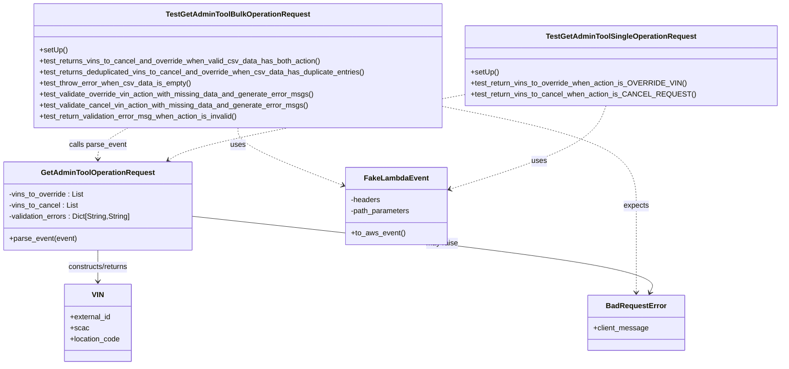
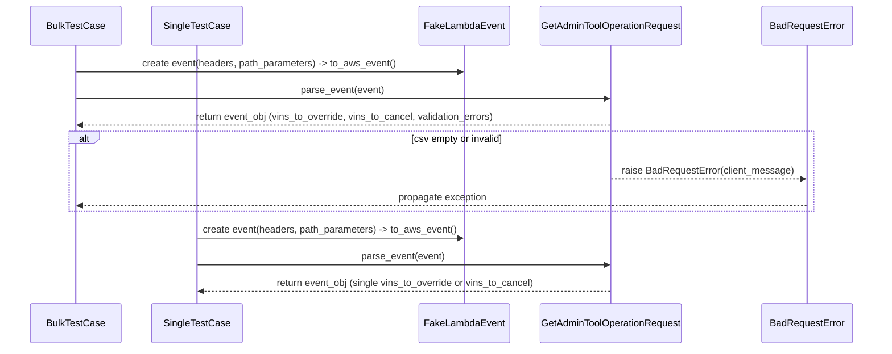

# Diagram: entity_core/entity_service/entity_service_tests/dpu/unit/test_dpu_admin_tool_operation_request.py

> Auto-generated by Obscura crawlers

## Diagram 1

### SVG

<svg id="container" width="1669.869140625" xmlns="http://www.w3.org/2000/svg" class="classDiagram" height="794" viewBox="0 0 1669.869140625 794" role="graphics-document document" aria-roledescription="class"><g><defs><marker id="container_class-aggregationStart" class="marker aggregation class" refX="18" refY="7" markerWidth="190" markerHeight="240" orient="auto"><path d="M 18,7 L9,13 L1,7 L9,1 Z"></path></marker></defs><defs><marker id="container_class-aggregationEnd" class="marker aggregation class" refX="1" refY="7" markerWidth="20" markerHeight="28" orient="auto"><path d="M 18,7 L9,13 L1,7 L9,1 Z"></path></marker></defs><defs><marker id="container_class-extensionStart" class="marker extension class" refX="18" refY="7" markerWidth="190" markerHeight="240" orient="auto"><path d="M 1,7 L18,13 V 1 Z"></path></marker></defs><defs><marker id="container_class-extensionEnd" class="marker extension class" refX="1" refY="7" markerWidth="20" markerHeight="28" orient="auto"><path d="M 1,1 V 13 L18,7 Z"></path></marker></defs><defs><marker id="container_class-compositionStart" class="marker composition class" refX="18" refY="7" markerWidth="190" markerHeight="240" orient="auto"><path d="M 18,7 L9,13 L1,7 L9,1 Z"></path></marker></defs><defs><marker id="container_class-compositionEnd" class="marker composition class" refX="1" refY="7" markerWidth="20" markerHeight="28" orient="auto"><path d="M 18,7 L9,13 L1,7 L9,1 Z"></path></marker></defs><defs><marker id="container_class-dependencyStart" class="marker dependency class" refX="6" refY="7" markerWidth="190" markerHeight="240" orient="auto"><path d="M 5,7 L9,13 L1,7 L9,1 Z"></path></marker></defs><defs><marker id="container_class-dependencyEnd" class="marker dependency class" refX="13" refY="7" markerWidth="20" markerHeight="28" orient="auto"><path d="M 18,7 L9,13 L14,7 L9,1 Z"></path></marker></defs><defs><marker id="container_class-lollipopStart" class="marker lollipop class" refX="13" refY="7" markerWidth="190" markerHeight="240" orient="auto"><circle stroke="black" fill="transparent" cx="7" cy="7" r="6"></circle></marker></defs><defs><marker id="container_class-lollipopEnd" class="marker lollipop class" refX="1" refY="7" markerWidth="190" markerHeight="240" orient="auto"><circle stroke="black" fill="transparent" cx="7" cy="7" r="6"></circle></marker></defs><g class="root"><g class="clusters"></g><g class="edgePaths"><path d="M519.916,278L519.916,284.167C519.916,290.333,519.916,302.667,556.67,323.371C593.424,344.075,666.932,373.15,703.686,387.687L740.44,402.224" id="id_TestGetAdminToolBulkOperationRequest_FakeLambdaEvent_1" class="edge-thickness-normal edge-pattern-dashed relation" style=";;;" data-edge="true" data-et="edge" data-id="id_TestGetAdminToolBulkOperationRequest_FakeLambdaEvent_1" data-points="W3sieCI6NTE5LjkxNjAxNTYyNSwieSI6Mjc4fSx7IngiOjUxOS45MTYwMTU2MjUsInkiOjMxNX0seyJ4Ijo3NDYuMDE5NTMxMjUsInkiOjQwNC40MzEyMDc2MzQ2MjUzfV0=" marker-end="url(#container_class-dependencyEnd)"></path><path d="M280.126,278L269.173,284.167C258.22,290.333,236.313,302.667,225.36,314C214.406,325.333,214.406,335.667,214.406,340.833L214.406,346" id="id_TestGetAdminToolBulkOperationRequest_GetAdminToolOperationRequest_2" class="edge-thickness-normal edge-pattern-dashed relation" style=";;;" data-edge="true" data-et="edge" data-id="id_TestGetAdminToolBulkOperationRequest_GetAdminToolOperationRequest_2" data-points="W3sieCI6MjgwLjEyNjM3NDAwMDcyNjc0LCJ5IjoyNzh9LHsieCI6MjE0LjQwNjI1LCJ5IjozMTV9LHsieCI6MjE0LjQwNjI1LCJ5IjozNTJ9XQ==" marker-end="url(#container_class-dependencyEnd)"></path><path d="M963.611,232.798L1031.305,246.498C1098.999,260.199,1234.386,287.599,1302.08,323.466C1369.773,359.333,1369.773,403.667,1369.773,448C1369.773,492.333,1369.773,536.667,1369.773,568C1369.773,599.333,1369.773,617.667,1369.773,626.833L1369.773,636" id="id_TestGetAdminToolBulkOperationRequest_BadRequestError_3" class="edge-thickness-normal edge-pattern-dashed relation" style=";;;" data-edge="true" data-et="edge" data-id="id_TestGetAdminToolBulkOperationRequest_BadRequestError_3" data-points="W3sieCI6OTYzLjYxMTMyODEyNSwieSI6MjMyLjc5ODExNDExMzgxMDQ3fSx7IngiOjEzNjkuNzczNDM3NSwieSI6MzE1fSx7IngiOjEzNjkuNzczNDM3NSwieSI6NDQ4fSx7IngiOjEzNjkuNzczNDM3NSwieSI6NTgxfSx7IngiOjEzNjkuNzczNDM3NSwieSI6NjQyfV0=" marker-end="url(#container_class-dependencyEnd)"></path><path d="M1304.605,230L1299.21,244.167C1293.814,258.333,1283.023,286.667,1227.596,316.827C1172.168,346.987,1072.104,378.974,1022.072,394.968L972.039,410.961" id="id_TestGetAdminToolSingleOperationRequest_FakeLambdaEvent_4" class="edge-thickness-normal edge-pattern-dashed relation" style=";;;" data-edge="true" data-et="edge" data-id="id_TestGetAdminToolSingleOperationRequest_FakeLambdaEvent_4" data-points="W3sieCI6MTMwNC42MDU0Njg3NSwieSI6MjMwfSx7IngiOjEyNzIuMjMyNDIxODc1LCJ5IjozMTV9LHsieCI6OTY2LjMyNDIxODc1LCJ5Ijo0MTIuNzg4MTQ5NjM2NDI0MjR9XQ==" marker-end="url(#container_class-dependencyEnd)"></path><path d="M1013.611,203.798L914.804,222.332C815.997,240.865,618.382,277.933,510.847,302.091C403.312,326.25,385.857,337.5,377.13,343.125L368.402,348.75" id="id_TestGetAdminToolSingleOperationRequest_GetAdminToolOperationRequest_5" class="edge-thickness-normal edge-pattern-dashed relation" style=";;;" data-edge="true" data-et="edge" data-id="id_TestGetAdminToolSingleOperationRequest_GetAdminToolOperationRequest_5" data-points="W3sieCI6MTAxMy42MTEzMjgxMjUsInkiOjIwMy43OTgwNzQ1MDYzNzkyN30seyJ4Ijo0MjAuNzY3NTc4MTI1LCJ5IjozMTV9LHsieCI6MzYzLjM1ODc4NzU5Mzk4NDk3LCJ5IjozNTJ9XQ==" marker-end="url(#container_class-dependencyEnd)"></path><path d="M214.406,544L214.406,550.167C214.406,556.333,214.406,568.667,214.406,580C214.406,591.333,214.406,601.667,214.406,606.833L214.406,612" id="id_GetAdminToolOperationRequest_VIN_6" class="edge-thickness-normal edge-pattern-solid relation" style=";;;" data-edge="true" data-et="edge" data-id="id_GetAdminToolOperationRequest_VIN_6" data-points="W3sieCI6MjE0LjQwNjI1LCJ5Ijo1NDR9LHsieCI6MjE0LjQwNjI1LCJ5Ijo1ODF9LHsieCI6MjE0LjQwNjI1LCJ5Ijo2MTh9XQ==" marker-end="url(#container_class-dependencyEnd)"></path><path d="M420.813,470.687L588.082,489.073C755.352,507.458,1089.891,544.229,1252.979,571.87C1416.068,599.511,1407.707,618.021,1403.526,627.277L1399.346,636.532" id="id_GetAdminToolOperationRequest_BadRequestError_7" class="edge-thickness-normal edge-pattern-solid relation" style=";;;" data-edge="true" data-et="edge" data-id="id_GetAdminToolOperationRequest_BadRequestError_7" data-points="W3sieCI6NDIwLjgxMjUsInkiOjQ3MC42ODcxODk2ODUxMTcyfSx7IngiOjE0MjQuNDI5Njg3NSwieSI6NTgxfSx7IngiOjEzOTYuODc1NzEwMjI3MjcyNywieSI6NjQyfV0=" marker-end="url(#container_class-dependencyEnd)"></path></g><g class="edgeLabels"><g class="edgeLabel" transform="translate(519.916015625, 315)"><g class="label" data-id="id_TestGetAdminToolBulkOperationRequest_FakeLambdaEvent_1" transform="translate(-16.4921875, -12)"><foreignObject width="32.984375" height="24">

uses

</foreignObject></g></g><g class="edgeLabel" transform="translate(214.40625, 315)"><g class="label" data-id="id_TestGetAdminToolBulkOperationRequest_GetAdminToolOperationRequest_2" transform="translate(-62.65625, -12)"><foreignObject width="125.3125" height="24">

calls parse_event

</foreignObject></g></g><g class="edgeLabel" transform="translate(1369.7734375, 448)"><g class="label" data-id="id_TestGetAdminToolBulkOperationRequest_BadRequestError_3" transform="translate(-27.734375, -12)"><foreignObject width="55.46875" height="24">

expects

</foreignObject></g></g><g class="edgeLabel" transform="translate(1162.59693, 350.04663)"><g class="label" data-id="id_TestGetAdminToolSingleOperationRequest_FakeLambdaEvent_4" transform="translate(-16.4921875, -12)"><foreignObject width="32.984375" height="24">

uses

</foreignObject></g></g><g class="edgeLabel" transform="translate(683.62525, 265.6948)"><g class="label" data-id="id_TestGetAdminToolSingleOperationRequest_GetAdminToolOperationRequest_5" transform="translate(-62.65625, -12)"><foreignObject width="125.3125" height="24">

calls parse_event

</foreignObject></g></g><g class="edgeLabel" transform="translate(214.40625, 581)"><g class="label" data-id="id_GetAdminToolOperationRequest_VIN_6" transform="translate(-68.03125, -12)"><foreignObject width="136.0625" height="24">

constructs/returns

</foreignObject></g></g><g class="edgeLabel" transform="translate(955.88797, 529.50013)"><g class="label" data-id="id_GetAdminToolOperationRequest_BadRequestError_7" transform="translate(-34.65625, -12)"><foreignObject width="69.3125" height="24">

may raise

</foreignObject></g></g></g><g class="nodes"><g class="node default" id="classId-TestGetAdminToolBulkOperationRequest-0" transform="translate(519.916015625, 143)"><g class="basic label-container"><path d="M-443.6953125 -135 L443.6953125 -135 L443.6953125 135 L-443.6953125 135" stroke="none" stroke-width="0" fill="#ECECFF" style=""></path><path d="M-443.6953125 -135 C-124.3421726143007 -135, 195.0109672713986 -135, 443.6953125 -135 M-443.6953125 -135 C-128.21843799779322 -135, 187.25843650441357 -135, 443.6953125 -135 M443.6953125 -135 C443.6953125 -75.56914198491893, 443.6953125 -16.138283969837843, 443.6953125 135 M443.6953125 -135 C443.6953125 -60.51244467542725, 443.6953125 13.975110649145506, 443.6953125 135 M443.6953125 135 C208.33327462451808 135, -27.028763250963834 135, -443.6953125 135 M443.6953125 135 C162.04390809143138 135, -119.60749631713725 135, -443.6953125 135 M-443.6953125 135 C-443.6953125 47.08911630860682, -443.6953125 -40.82176738278636, -443.6953125 -135 M-443.6953125 135 C-443.6953125 70.67308399743673, -443.6953125 6.346167994873468, -443.6953125 -135" stroke="#9370DB" stroke-width="1.3" fill="none" stroke-dasharray="0 0" style=""></path></g><g class="annotation-group text" transform="translate(0, -111)"></g><g class="label-group text" transform="translate(-149.609375, -111)"><g class="label" style="font-weight: bolder" transform="translate(0,-12)"><foreignObject width="299.21875" height="24">

TestGetAdminToolBulkOperationRequest

</foreignObject></g></g><g class="members-group text" transform="translate(-431.6953125, -63)"></g><g class="methods-group text" transform="translate(-431.6953125, -33)"><g class="label" style="" transform="translate(0,-12)"><foreignObject width="60.421875" height="24">

+setUp()

</foreignObject></g><g class="label" style="" transform="translate(0,12)"><foreignObject width="613.875" height="24">

+test_returns_vins_to_cancel_and_override_when_valid_csv_data_has_both_action()

</foreignObject></g><g class="label" style="" transform="translate(0,36)"><foreignObject width="713.78125" height="24">

+test_returns_deduplicated_vins_to_cancel_and_override_when_csv_data_has_duplicate_entries()

</foreignObject></g><g class="label" style="" transform="translate(0,60)"><foreignObject width="329.265625" height="24">

+test_throw_error_when_csv_data_is_empty()

</foreignObject></g><g class="label" style="" transform="translate(0,84)"><foreignObject width="601.4375" height="24">

+test_validate_override_vin_action_with_missing_data_and_generate_error_msgs()

</foreignObject></g><g class="label" style="" transform="translate(0,108)"><foreignObject width="587.09375" height="24">

+test_validate_cancel_vin_action_with_missing_data_and_generate_error_msgs()

</foreignObject></g><g class="label" style="" transform="translate(0,132)"><foreignObject width="437.671875" height="24">

+test_return_validation_error_msg_when_action_is_invalid()

</foreignObject></g></g><g class="divider" style=""><path d="M-443.6953125 -87 C-249.32613478406057 -87, -54.95695706812114 -87, 443.6953125 -87 M-443.6953125 -87 C-175.83630283846037 -87, 92.02270682307926 -87, 443.6953125 -87" stroke="#9370DB" stroke-width="1.3" fill="none" stroke-dasharray="0 0" style=""></path></g><g class="divider" style=""><path d="M-443.6953125 -63 C-168.1901661763207 -63, 107.3149801473586 -63, 443.6953125 -63 M-443.6953125 -63 C-192.7692400783467 -63, 58.156832343306576 -63, 443.6953125 -63" stroke="#9370DB" stroke-width="1.3" fill="none" stroke-dasharray="0 0" style=""></path></g></g><g class="node default" id="classId-TestGetAdminToolSingleOperationRequest-1" transform="translate(1337.740234375, 143)"><g class="basic label-container"><path d="M-324.12890625 -87 L324.12890625 -87 L324.12890625 87 L-324.12890625 87" stroke="none" stroke-width="0" fill="#ECECFF" style=""></path><path d="M-324.12890625 -87 C-72.04978639532297 -87, 180.02933345935406 -87, 324.12890625 -87 M-324.12890625 -87 C-102.29692159486129 -87, 119.53506306027742 -87, 324.12890625 -87 M324.12890625 -87 C324.12890625 -26.108201109539806, 324.12890625 34.78359778092039, 324.12890625 87 M324.12890625 -87 C324.12890625 -46.33478102473917, 324.12890625 -5.669562049478344, 324.12890625 87 M324.12890625 87 C158.8779341866965 87, -6.373037876606986 87, -324.12890625 87 M324.12890625 87 C95.56138846875712 87, -133.00612931248577 87, -324.12890625 87 M-324.12890625 87 C-324.12890625 39.489810350869014, -324.12890625 -8.020379298261972, -324.12890625 -87 M-324.12890625 87 C-324.12890625 33.94966427568375, -324.12890625 -19.100671448632497, -324.12890625 -87" stroke="#9370DB" stroke-width="1.3" fill="none" stroke-dasharray="0 0" style=""></path></g><g class="annotation-group text" transform="translate(0, -63)"></g><g class="label-group text" transform="translate(-155.9140625, -63)"><g class="label" style="font-weight: bolder" transform="translate(0,-12)"><foreignObject width="311.828125" height="24">

TestGetAdminToolSingleOperationRequest

</foreignObject></g></g><g class="members-group text" transform="translate(-312.12890625, -15)"></g><g class="methods-group text" transform="translate(-312.12890625, 15)"><g class="label" style="" transform="translate(0,-12)"><foreignObject width="60.421875" height="24">

+setUp()

</foreignObject></g><g class="label" style="" transform="translate(0,12)"><foreignObject width="458.53125" height="24">

+test_return_vins_to_override_when_action_is_OVERRIDE_VIN()

</foreignObject></g><g class="label" style="" transform="translate(0,36)"><foreignObject width="468.34375" height="24">

+test_return_vins_to_cancel_when_action_is_CANCEL_REQUEST()

</foreignObject></g></g><g class="divider" style=""><path d="M-324.12890625 -39 C-101.60423407156583 -39, 120.92043810686835 -39, 324.12890625 -39 M-324.12890625 -39 C-114.58785520471324 -39, 94.95319584057353 -39, 324.12890625 -39" stroke="#9370DB" stroke-width="1.3" fill="none" stroke-dasharray="0 0" style=""></path></g><g class="divider" style=""><path d="M-324.12890625 -15 C-184.67922800434886 -15, -45.229549758697715 -15, 324.12890625 -15 M-324.12890625 -15 C-71.7864467044491 -15, 180.5560128411018 -15, 324.12890625 -15" stroke="#9370DB" stroke-width="1.3" fill="none" stroke-dasharray="0 0" style=""></path></g></g><g class="node default" id="classId-GetAdminToolOperationRequest-2" transform="translate(214.40625, 448)"><g class="basic label-container"><path d="M-206.40625 -96 L206.40625 -96 L206.40625 96 L-206.40625 96" stroke="none" stroke-width="0" fill="#ECECFF" style=""></path><path d="M-206.40625 -96 C-121.9937077015546 -96, -37.581165403109196 -96, 206.40625 -96 M-206.40625 -96 C-85.12291452982147 -96, 36.16042094035706 -96, 206.40625 -96 M206.40625 -96 C206.40625 -31.29289465679659, 206.40625 33.41421068640682, 206.40625 96 M206.40625 -96 C206.40625 -33.9611766245888, 206.40625 28.077646750822396, 206.40625 96 M206.40625 96 C57.37682080156438 96, -91.65260839687124 96, -206.40625 96 M206.40625 96 C65.84904616966568 96, -74.70815766066863 96, -206.40625 96 M-206.40625 96 C-206.40625 40.917181271084594, -206.40625 -14.165637457830812, -206.40625 -96 M-206.40625 96 C-206.40625 38.29570133785028, -206.40625 -19.408597324299436, -206.40625 -96" stroke="#9370DB" stroke-width="1.3" fill="none" stroke-dasharray="0 0" style=""></path></g><g class="annotation-group text" transform="translate(0, -72)"></g><g class="label-group text" transform="translate(-118.0625, -72)"><g class="label" style="font-weight: bolder" transform="translate(0,-12)"><foreignObject width="236.125" height="24">

GetAdminToolOperationRequest

</foreignObject></g></g><g class="members-group text" transform="translate(-194.40625, -24)"><g class="label" style="" transform="translate(0,-12)"><foreignObject width="164.78125" height="24">

-vins_to_override : List

</foreignObject></g><g class="label" style="" transform="translate(0,12)"><foreignObject width="150.125" height="24">

-vins_to_cancel : List

</foreignObject></g><g class="label" style="" transform="translate(0,36)"><foreignObject width="270.75" height="24">

-validation_errors : Dict[String,String]

</foreignObject></g></g><g class="methods-group text" transform="translate(-194.40625, 72)"><g class="label" style="" transform="translate(0,-12)"><foreignObject width="146.890625" height="24">

+parse_event(event)

</foreignObject></g></g><g class="divider" style=""><path d="M-206.40625 -48 C-101.04586706107655 -48, 4.314515877846901 -48, 206.40625 -48 M-206.40625 -48 C-46.626069273259276 -48, 113.15411145348145 -48, 206.40625 -48" stroke="#9370DB" stroke-width="1.3" fill="none" stroke-dasharray="0 0" style=""></path></g><g class="divider" style=""><path d="M-206.40625 48 C-48.202352607292255 48, 110.00154478541549 48, 206.40625 48 M-206.40625 48 C-94.3412021903291 48, 17.7238456193418 48, 206.40625 48" stroke="#9370DB" stroke-width="1.3" fill="none" stroke-dasharray="0 0" style=""></path></g></g><g class="node default" id="classId-FakeLambdaEvent-3" transform="translate(856.171875, 448)"><g class="basic label-container"><path d="M-110.15234375 -84 L110.15234375 -84 L110.15234375 84 L-110.15234375 84" stroke="none" stroke-width="0" fill="#ECECFF" style=""></path><path d="M-110.15234375 -84 C-22.57958921272079 -84, 64.99316532455842 -84, 110.15234375 -84 M-110.15234375 -84 C-37.61990113177207 -84, 34.912541486455865 -84, 110.15234375 -84 M110.15234375 -84 C110.15234375 -21.263821329037036, 110.15234375 41.47235734192593, 110.15234375 84 M110.15234375 -84 C110.15234375 -25.68215852384335, 110.15234375 32.6356829523133, 110.15234375 84 M110.15234375 84 C40.858074559404514 84, -28.436194631190972 84, -110.15234375 84 M110.15234375 84 C40.63459583748143 84, -28.883152075037145 84, -110.15234375 84 M-110.15234375 84 C-110.15234375 21.313653023512977, -110.15234375 -41.372693952974046, -110.15234375 -84 M-110.15234375 84 C-110.15234375 39.35553313117392, -110.15234375 -5.288933737652158, -110.15234375 -84" stroke="#9370DB" stroke-width="1.3" fill="none" stroke-dasharray="0 0" style=""></path></g><g class="annotation-group text" transform="translate(0, -60)"></g><g class="label-group text" transform="translate(-65.8671875, -60)"><g class="label" style="font-weight: bolder" transform="translate(0,-12)"><foreignObject width="131.734375" height="24">

FakeLambdaEvent

</foreignObject></g></g><g class="members-group text" transform="translate(-98.15234375, -12)"><g class="label" style="" transform="translate(0,-12)"><foreignObject width="64.796875" height="24">

-headers

</foreignObject></g><g class="label" style="" transform="translate(0,12)"><foreignObject width="130.4375" height="24">

-path_parameters

</foreignObject></g></g><g class="methods-group text" transform="translate(-98.15234375, 60)"><g class="label" style="" transform="translate(0,-12)"><foreignObject width="116.421875" height="24">

+to_aws_event()

</foreignObject></g></g><g class="divider" style=""><path d="M-110.15234375 -36 C-46.98153384751675 -36, 16.1892760549665 -36, 110.15234375 -36 M-110.15234375 -36 C-25.12672535204409 -36, 59.89889304591182 -36, 110.15234375 -36" stroke="#9370DB" stroke-width="1.3" fill="none" stroke-dasharray="0 0" style=""></path></g><g class="divider" style=""><path d="M-110.15234375 36 C-44.33984339921277 36, 21.472656951574464 36, 110.15234375 36 M-110.15234375 36 C-22.221231040575518 36, 65.70988166884896 36, 110.15234375 36" stroke="#9370DB" stroke-width="1.3" fill="none" stroke-dasharray="0 0" style=""></path></g></g><g class="node default" id="classId-BadRequestError-4" transform="translate(1369.7734375, 702)"><g class="basic label-container"><path d="M-102.8515625 -60 L102.8515625 -60 L102.8515625 60 L-102.8515625 60" stroke="none" stroke-width="0" fill="#ECECFF" style=""></path><path d="M-102.8515625 -60 C-22.44445688521661 -60, 57.96264872956678 -60, 102.8515625 -60 M-102.8515625 -60 C-54.456906831091345 -60, -6.06225116218269 -60, 102.8515625 -60 M102.8515625 -60 C102.8515625 -17.16565247539905, 102.8515625 25.6686950492019, 102.8515625 60 M102.8515625 -60 C102.8515625 -14.923064709907777, 102.8515625 30.153870580184446, 102.8515625 60 M102.8515625 60 C31.94561736253729 60, -38.96032777492542 60, -102.8515625 60 M102.8515625 60 C57.39091219044644 60, 11.930261880892886 60, -102.8515625 60 M-102.8515625 60 C-102.8515625 22.733677253431352, -102.8515625 -14.532645493137295, -102.8515625 -60 M-102.8515625 60 C-102.8515625 20.281082916680816, -102.8515625 -19.437834166638368, -102.8515625 -60" stroke="#9370DB" stroke-width="1.3" fill="none" stroke-dasharray="0 0" style=""></path></g><g class="annotation-group text" transform="translate(0, -36)"></g><g class="label-group text" transform="translate(-62.28125, -36)"><g class="label" style="font-weight: bolder" transform="translate(0,-12)"><foreignObject width="124.5625" height="24">

BadRequestError

</foreignObject></g></g><g class="members-group text" transform="translate(-90.8515625, 12)"><g class="label" style="" transform="translate(0,-12)"><foreignObject width="119.421875" height="24">

+client_message

</foreignObject></g></g><g class="methods-group text" transform="translate(-90.8515625, 60)"></g><g class="divider" style=""><path d="M-102.8515625 -12 C-28.165790626892885 -12, 46.51998124621423 -12, 102.8515625 -12 M-102.8515625 -12 C-32.3093434208899 -12, 38.232875658220195 -12, 102.8515625 -12" stroke="#9370DB" stroke-width="1.3" fill="none" stroke-dasharray="0 0" style=""></path></g><g class="divider" style=""><path d="M-102.8515625 36 C-49.31032506870632 36, 4.230912362587361 36, 102.8515625 36 M-102.8515625 36 C-30.316906628244396 36, 42.21774924351121 36, 102.8515625 36" stroke="#9370DB" stroke-width="1.3" fill="none" stroke-dasharray="0 0" style=""></path></g></g><g class="node default" id="classId-VIN-5" transform="translate(214.40625, 702)"><g class="basic label-container"><path d="M-73.16015625 -84 L73.16015625 -84 L73.16015625 84 L-73.16015625 84" stroke="none" stroke-width="0" fill="#ECECFF" style=""></path><path d="M-73.16015625 -84 C-43.556783221364924 -84, -13.953410192729848 -84, 73.16015625 -84 M-73.16015625 -84 C-30.877419222452595 -84, 11.40531780509481 -84, 73.16015625 -84 M73.16015625 -84 C73.16015625 -39.0208378486516, 73.16015625 5.958324302696795, 73.16015625 84 M73.16015625 -84 C73.16015625 -21.973335277496005, 73.16015625 40.05332944500799, 73.16015625 84 M73.16015625 84 C34.430937710027386 84, -4.298280829945227 84, -73.16015625 84 M73.16015625 84 C25.555728481517612 84, -22.048699286964776 84, -73.16015625 84 M-73.16015625 84 C-73.16015625 38.100316487656336, -73.16015625 -7.799367024687328, -73.16015625 -84 M-73.16015625 84 C-73.16015625 20.295631645971213, -73.16015625 -43.408736708057575, -73.16015625 -84" stroke="#9370DB" stroke-width="1.3" fill="none" stroke-dasharray="0 0" style=""></path></g><g class="annotation-group text" transform="translate(0, -60)"></g><g class="label-group text" transform="translate(-12.2109375, -60)"><g class="label" style="font-weight: bolder" transform="translate(0,-12)"><foreignObject width="24.421875" height="24">

VIN

</foreignObject></g></g><g class="members-group text" transform="translate(-61.16015625, -12)"><g class="label" style="" transform="translate(0,-12)"><foreignObject width="89.765625" height="24">

+external_id

</foreignObject></g><g class="label" style="" transform="translate(0,12)"><foreignObject width="39.296875" height="24">

+scac

</foreignObject></g><g class="label" style="" transform="translate(0,36)"><foreignObject width="110.109375" height="24">

+location_code

</foreignObject></g></g><g class="methods-group text" transform="translate(-61.16015625, 84)"></g><g class="divider" style=""><path d="M-73.16015625 -36 C-32.566053422457806 -36, 8.028049405084388 -36, 73.16015625 -36 M-73.16015625 -36 C-21.749291495767174 -36, 29.66157325846565 -36, 73.16015625 -36" stroke="#9370DB" stroke-width="1.3" fill="none" stroke-dasharray="0 0" style=""></path></g><g class="divider" style=""><path d="M-73.16015625 60 C-19.96545502852956 60, 33.22924619294088 60, 73.16015625 60 M-73.16015625 60 C-25.770363617436956 60, 21.619429015126087 60, 73.16015625 60" stroke="#9370DB" stroke-width="1.3" fill="none" stroke-dasharray="0 0" style=""></path></g></g></g></g></g></svg>

## Diagram 2

### SVG

<svg id="container" width="1548.5" xmlns="http://www.w3.org/2000/svg" height="610" viewBox="-50 -10 1548.5 610" role="graphics-document document" aria-roledescription="sequence"><g><rect x="1298.5" y="524" fill="#eaeaea" stroke="#666" width="150" height="65" name="Error" rx="3" ry="3" class="actor actor-bottom"></rect><text x="1373.5" y="556.5" dominant-baseline="central" alignment-baseline="central" class="actor actor-box" style="text-anchor: middle; font-size: 16px; font-weight: 400;"><tspan x="1373.5" dy="0">BadRequestError</tspan></text></g><g><rect x="892.5" y="524" fill="#eaeaea" stroke="#666" width="254" height="65" name="Request" rx="3" ry="3" class="actor actor-bottom"></rect><text x="1019.5" y="556.5" dominant-baseline="central" alignment-baseline="central" class="actor actor-box" style="text-anchor: middle; font-size: 16px; font-weight: 400;"><tspan x="1019.5" dy="0">GetAdminToolOperationRequest</tspan></text></g><g><rect x="691.5" y="524" fill="#eaeaea" stroke="#666" width="151" height="65" name="FakeLambda" rx="3" ry="3" class="actor actor-bottom"></rect><text x="767" y="556.5" dominant-baseline="central" alignment-baseline="central" class="actor actor-box" style="text-anchor: middle; font-size: 16px; font-weight: 400;"><tspan x="767" dy="0">FakeLambdaEvent</tspan></text></g><g><rect x="200" y="524" fill="#eaeaea" stroke="#666" width="150" height="65" name="SingleTest" rx="3" ry="3" class="actor actor-bottom"></rect><text x="275" y="556.5" dominant-baseline="central" alignment-baseline="central" class="actor actor-box" style="text-anchor: middle; font-size: 16px; font-weight: 400;"><tspan x="275" dy="0">SingleTestCase</tspan></text></g><g><rect x="0" y="524" fill="#eaeaea" stroke="#666" width="150" height="65" name="BulkTest" rx="3" ry="3" class="actor actor-bottom"></rect><text x="75" y="556.5" dominant-baseline="central" alignment-baseline="central" class="actor actor-box" style="text-anchor: middle; font-size: 16px; font-weight: 400;"><tspan x="75" dy="0">BulkTestCase</tspan></text></g><g><line id="actor4" x1="1373.5" y1="65" x2="1373.5" y2="524" class="actor-line 200" stroke-width="0.5px" stroke="#999" name="Error"></line><g id="root-4"><rect x="1298.5" y="0" fill="#eaeaea" stroke="#666" width="150" height="65" name="Error" rx="3" ry="3" class="actor actor-top"></rect><text x="1373.5" y="32.5" dominant-baseline="central" alignment-baseline="central" class="actor actor-box" style="text-anchor: middle; font-size: 16px; font-weight: 400;"><tspan x="1373.5" dy="0">BadRequestError</tspan></text></g></g><g><line id="actor3" x1="1019.5" y1="65" x2="1019.5" y2="524" class="actor-line 200" stroke-width="0.5px" stroke="#999" name="Request"></line><g id="root-3"><rect x="892.5" y="0" fill="#eaeaea" stroke="#666" width="254" height="65" name="Request" rx="3" ry="3" class="actor actor-top"></rect><text x="1019.5" y="32.5" dominant-baseline="central" alignment-baseline="central" class="actor actor-box" style="text-anchor: middle; font-size: 16px; font-weight: 400;"><tspan x="1019.5" dy="0">GetAdminToolOperationRequest</tspan></text></g></g><g><line id="actor2" x1="767" y1="65" x2="767" y2="524" class="actor-line 200" stroke-width="0.5px" stroke="#999" name="FakeLambda"></line><g id="root-2"><rect x="691.5" y="0" fill="#eaeaea" stroke="#666" width="151" height="65" name="FakeLambda" rx="3" ry="3" class="actor actor-top"></rect><text x="767" y="32.5" dominant-baseline="central" alignment-baseline="central" class="actor actor-box" style="text-anchor: middle; font-size: 16px; font-weight: 400;"><tspan x="767" dy="0">FakeLambdaEvent</tspan></text></g></g><g><line id="actor1" x1="275" y1="65" x2="275" y2="524" class="actor-line 200" stroke-width="0.5px" stroke="#999" name="SingleTest"></line><g id="root-1"><rect x="200" y="0" fill="#eaeaea" stroke="#666" width="150" height="65" name="SingleTest" rx="3" ry="3" class="actor actor-top"></rect><text x="275" y="32.5" dominant-baseline="central" alignment-baseline="central" class="actor actor-box" style="text-anchor: middle; font-size: 16px; font-weight: 400;"><tspan x="275" dy="0">SingleTestCase</tspan></text></g></g><g><line id="actor0" x1="75" y1="65" x2="75" y2="524" class="actor-line 200" stroke-width="0.5px" stroke="#999" name="BulkTest"></line><g id="root-0"><rect x="0" y="0" fill="#eaeaea" stroke="#666" width="150" height="65" name="BulkTest" rx="3" ry="3" class="actor actor-top"></rect><text x="75" y="32.5" dominant-baseline="central" alignment-baseline="central" class="actor actor-box" style="text-anchor: middle; font-size: 16px; font-weight: 400;"><tspan x="75" dy="0">BulkTestCase</tspan></text></g></g><g></g><defs><symbol id="computer" width="24" height="24"><path transform="scale(.5)" d="M2 2v13h20v-13h-20zm18 11h-16v-9h16v9zm-10.228 6l.466-1h3.524l.467 1h-4.457zm14.228 3h-24l2-6h2.104l-1.33 4h18.45l-1.297-4h2.073l2 6zm-5-10h-14v-7h14v7z"></path></symbol></defs><defs><symbol id="database" fill-rule="evenodd" clip-rule="evenodd"><path transform="scale(.5)" d="M12.258.001l.256.004.255.005.253.008.251.01.249.012.247.015.246.016.242.019.241.02.239.023.236.024.233.027.231.028.229.031.225.032.223.034.22.036.217.038.214.04.211.041.208.043.205.045.201.046.198.048.194.05.191.051.187.053.183.054.18.056.175.057.172.059.168.06.163.061.16.063.155.064.15.066.074.033.073.033.071.034.07.034.069.035.068.035.067.035.066.035.064.036.064.036.062.036.06.036.06.037.058.037.058.037.055.038.055.038.053.038.052.038.051.039.05.039.048.039.047.039.045.04.044.04.043.04.041.04.04.041.039.041.037.041.036.041.034.041.033.042.032.042.03.042.029.042.027.042.026.043.024.043.023.043.021.043.02.043.018.044.017.043.015.044.013.044.012.044.011.045.009.044.007.045.006.045.004.045.002.045.001.045v17l-.001.045-.002.045-.004.045-.006.045-.007.045-.009.044-.011.045-.012.044-.013.044-.015.044-.017.043-.018.044-.02.043-.021.043-.023.043-.024.043-.026.043-.027.042-.029.042-.03.042-.032.042-.033.042-.034.041-.036.041-.037.041-.039.041-.04.041-.041.04-.043.04-.044.04-.045.04-.047.039-.048.039-.05.039-.051.039-.052.038-.053.038-.055.038-.055.038-.058.037-.058.037-.06.037-.06.036-.062.036-.064.036-.064.036-.066.035-.067.035-.068.035-.069.035-.07.034-.071.034-.073.033-.074.033-.15.066-.155.064-.16.063-.163.061-.168.06-.172.059-.175.057-.18.056-.183.054-.187.053-.191.051-.194.05-.198.048-.201.046-.205.045-.208.043-.211.041-.214.04-.217.038-.22.036-.223.034-.225.032-.229.031-.231.028-.233.027-.236.024-.239.023-.241.02-.242.019-.246.016-.247.015-.249.012-.251.01-.253.008-.255.005-.256.004-.258.001-.258-.001-.256-.004-.255-.005-.253-.008-.251-.01-.249-.012-.247-.015-.245-.016-.243-.019-.241-.02-.238-.023-.236-.024-.234-.027-.231-.028-.228-.031-.226-.032-.223-.034-.22-.036-.217-.038-.214-.04-.211-.041-.208-.043-.204-.045-.201-.046-.198-.048-.195-.05-.19-.051-.187-.053-.184-.054-.179-.056-.176-.057-.172-.059-.167-.06-.164-.061-.159-.063-.155-.064-.151-.066-.074-.033-.072-.033-.072-.034-.07-.034-.069-.035-.068-.035-.067-.035-.066-.035-.064-.036-.063-.036-.062-.036-.061-.036-.06-.037-.058-.037-.057-.037-.056-.038-.055-.038-.053-.038-.052-.038-.051-.039-.049-.039-.049-.039-.046-.039-.046-.04-.044-.04-.043-.04-.041-.04-.04-.041-.039-.041-.037-.041-.036-.041-.034-.041-.033-.042-.032-.042-.03-.042-.029-.042-.027-.042-.026-.043-.024-.043-.023-.043-.021-.043-.02-.043-.018-.044-.017-.043-.015-.044-.013-.044-.012-.044-.011-.045-.009-.044-.007-.045-.006-.045-.004-.045-.002-.045-.001-.045v-17l.001-.045.002-.045.004-.045.006-.045.007-.045.009-.044.011-.045.012-.044.013-.044.015-.044.017-.043.018-.044.02-.043.021-.043.023-.043.024-.043.026-.043.027-.042.029-.042.03-.042.032-.042.033-.042.034-.041.036-.041.037-.041.039-.041.04-.041.041-.04.043-.04.044-.04.046-.04.046-.039.049-.039.049-.039.051-.039.052-.038.053-.038.055-.038.056-.038.057-.037.058-.037.06-.037.061-.036.062-.036.063-.036.064-.036.066-.035.067-.035.068-.035.069-.035.07-.034.072-.034.072-.033.074-.033.151-.066.155-.064.159-.063.164-.061.167-.06.172-.059.176-.057.179-.056.184-.054.187-.053.19-.051.195-.05.198-.048.201-.046.204-.045.208-.043.211-.041.214-.04.217-.038.22-.036.223-.034.226-.032.228-.031.231-.028.234-.027.236-.024.238-.023.241-.02.243-.019.245-.016.247-.015.249-.012.251-.01.253-.008.255-.005.256-.004.258-.001.258.001zm-9.258 20.499v.01l.001.021.003.021.004.022.005.021.006.022.007.022.009.023.01.022.011.023.012.023.013.023.015.023.016.024.017.023.018.024.019.024.021.024.022.025.023.024.024.025.052.049.056.05.061.051.066.051.07.051.075.051.079.052.084.052.088.052.092.052.097.052.102.051.105.052.11.052.114.051.119.051.123.051.127.05.131.05.135.05.139.048.144.049.147.047.152.047.155.047.16.045.163.045.167.043.171.043.176.041.178.041.183.039.187.039.19.037.194.035.197.035.202.033.204.031.209.03.212.029.216.027.219.025.222.024.226.021.23.02.233.018.236.016.24.015.243.012.246.01.249.008.253.005.256.004.259.001.26-.001.257-.004.254-.005.25-.008.247-.011.244-.012.241-.014.237-.016.233-.018.231-.021.226-.021.224-.024.22-.026.216-.027.212-.028.21-.031.205-.031.202-.034.198-.034.194-.036.191-.037.187-.039.183-.04.179-.04.175-.042.172-.043.168-.044.163-.045.16-.046.155-.046.152-.047.148-.048.143-.049.139-.049.136-.05.131-.05.126-.05.123-.051.118-.052.114-.051.11-.052.106-.052.101-.052.096-.052.092-.052.088-.053.083-.051.079-.052.074-.052.07-.051.065-.051.06-.051.056-.05.051-.05.023-.024.023-.025.021-.024.02-.024.019-.024.018-.024.017-.024.015-.023.014-.024.013-.023.012-.023.01-.023.01-.022.008-.022.006-.022.006-.022.004-.022.004-.021.001-.021.001-.021v-4.127l-.077.055-.08.053-.083.054-.085.053-.087.052-.09.052-.093.051-.095.05-.097.05-.1.049-.102.049-.105.048-.106.047-.109.047-.111.046-.114.045-.115.045-.118.044-.12.043-.122.042-.124.042-.126.041-.128.04-.13.04-.132.038-.134.038-.135.037-.138.037-.139.035-.142.035-.143.034-.144.033-.147.032-.148.031-.15.03-.151.03-.153.029-.154.027-.156.027-.158.026-.159.025-.161.024-.162.023-.163.022-.165.021-.166.02-.167.019-.169.018-.169.017-.171.016-.173.015-.173.014-.175.013-.175.012-.177.011-.178.01-.179.008-.179.008-.181.006-.182.005-.182.004-.184.003-.184.002h-.37l-.184-.002-.184-.003-.182-.004-.182-.005-.181-.006-.179-.008-.179-.008-.178-.01-.176-.011-.176-.012-.175-.013-.173-.014-.172-.015-.171-.016-.17-.017-.169-.018-.167-.019-.166-.02-.165-.021-.163-.022-.162-.023-.161-.024-.159-.025-.157-.026-.156-.027-.155-.027-.153-.029-.151-.03-.15-.03-.148-.031-.146-.032-.145-.033-.143-.034-.141-.035-.14-.035-.137-.037-.136-.037-.134-.038-.132-.038-.13-.04-.128-.04-.126-.041-.124-.042-.122-.042-.12-.044-.117-.043-.116-.045-.113-.045-.112-.046-.109-.047-.106-.047-.105-.048-.102-.049-.1-.049-.097-.05-.095-.05-.093-.052-.09-.051-.087-.052-.085-.053-.083-.054-.08-.054-.077-.054v4.127zm0-5.654v.011l.001.021.003.021.004.021.005.022.006.022.007.022.009.022.01.022.011.023.012.023.013.023.015.024.016.023.017.024.018.024.019.024.021.024.022.024.023.025.024.024.052.05.056.05.061.05.066.051.07.051.075.052.079.051.084.052.088.052.092.052.097.052.102.052.105.052.11.051.114.051.119.052.123.05.127.051.131.05.135.049.139.049.144.048.147.048.152.047.155.046.16.045.163.045.167.044.171.042.176.042.178.04.183.04.187.038.19.037.194.036.197.034.202.033.204.032.209.03.212.028.216.027.219.025.222.024.226.022.23.02.233.018.236.016.24.014.243.012.246.01.249.008.253.006.256.003.259.001.26-.001.257-.003.254-.006.25-.008.247-.01.244-.012.241-.015.237-.016.233-.018.231-.02.226-.022.224-.024.22-.025.216-.027.212-.029.21-.03.205-.032.202-.033.198-.035.194-.036.191-.037.187-.039.183-.039.179-.041.175-.042.172-.043.168-.044.163-.045.16-.045.155-.047.152-.047.148-.048.143-.048.139-.05.136-.049.131-.05.126-.051.123-.051.118-.051.114-.052.11-.052.106-.052.101-.052.096-.052.092-.052.088-.052.083-.052.079-.052.074-.051.07-.052.065-.051.06-.05.056-.051.051-.049.023-.025.023-.024.021-.025.02-.024.019-.024.018-.024.017-.024.015-.023.014-.023.013-.024.012-.022.01-.023.01-.023.008-.022.006-.022.006-.022.004-.021.004-.022.001-.021.001-.021v-4.139l-.077.054-.08.054-.083.054-.085.052-.087.053-.09.051-.093.051-.095.051-.097.05-.1.049-.102.049-.105.048-.106.047-.109.047-.111.046-.114.045-.115.044-.118.044-.12.044-.122.042-.124.042-.126.041-.128.04-.13.039-.132.039-.134.038-.135.037-.138.036-.139.036-.142.035-.143.033-.144.033-.147.033-.148.031-.15.03-.151.03-.153.028-.154.028-.156.027-.158.026-.159.025-.161.024-.162.023-.163.022-.165.021-.166.02-.167.019-.169.018-.169.017-.171.016-.173.015-.173.014-.175.013-.175.012-.177.011-.178.009-.179.009-.179.007-.181.007-.182.005-.182.004-.184.003-.184.002h-.37l-.184-.002-.184-.003-.182-.004-.182-.005-.181-.007-.179-.007-.179-.009-.178-.009-.176-.011-.176-.012-.175-.013-.173-.014-.172-.015-.171-.016-.17-.017-.169-.018-.167-.019-.166-.02-.165-.021-.163-.022-.162-.023-.161-.024-.159-.025-.157-.026-.156-.027-.155-.028-.153-.028-.151-.03-.15-.03-.148-.031-.146-.033-.145-.033-.143-.033-.141-.035-.14-.036-.137-.036-.136-.037-.134-.038-.132-.039-.13-.039-.128-.04-.126-.041-.124-.042-.122-.043-.12-.043-.117-.044-.116-.044-.113-.046-.112-.046-.109-.046-.106-.047-.105-.048-.102-.049-.1-.049-.097-.05-.095-.051-.093-.051-.09-.051-.087-.053-.085-.052-.083-.054-.08-.054-.077-.054v4.139zm0-5.666v.011l.001.02.003.022.004.021.005.022.006.021.007.022.009.023.01.022.011.023.012.023.013.023.015.023.016.024.017.024.018.023.019.024.021.025.022.024.023.024.024.025.052.05.056.05.061.05.066.051.07.051.075.052.079.051.084.052.088.052.092.052.097.052.102.052.105.051.11.052.114.051.119.051.123.051.127.05.131.05.135.05.139.049.144.048.147.048.152.047.155.046.16.045.163.045.167.043.171.043.176.042.178.04.183.04.187.038.19.037.194.036.197.034.202.033.204.032.209.03.212.028.216.027.219.025.222.024.226.021.23.02.233.018.236.017.24.014.243.012.246.01.249.008.253.006.256.003.259.001.26-.001.257-.003.254-.006.25-.008.247-.01.244-.013.241-.014.237-.016.233-.018.231-.02.226-.022.224-.024.22-.025.216-.027.212-.029.21-.03.205-.032.202-.033.198-.035.194-.036.191-.037.187-.039.183-.039.179-.041.175-.042.172-.043.168-.044.163-.045.16-.045.155-.047.152-.047.148-.048.143-.049.139-.049.136-.049.131-.051.126-.05.123-.051.118-.052.114-.051.11-.052.106-.052.101-.052.096-.052.092-.052.088-.052.083-.052.079-.052.074-.052.07-.051.065-.051.06-.051.056-.05.051-.049.023-.025.023-.025.021-.024.02-.024.019-.024.018-.024.017-.024.015-.023.014-.024.013-.023.012-.023.01-.022.01-.023.008-.022.006-.022.006-.022.004-.022.004-.021.001-.021.001-.021v-4.153l-.077.054-.08.054-.083.053-.085.053-.087.053-.09.051-.093.051-.095.051-.097.05-.1.049-.102.048-.105.048-.106.048-.109.046-.111.046-.114.046-.115.044-.118.044-.12.043-.122.043-.124.042-.126.041-.128.04-.13.039-.132.039-.134.038-.135.037-.138.036-.139.036-.142.034-.143.034-.144.033-.147.032-.148.032-.15.03-.151.03-.153.028-.154.028-.156.027-.158.026-.159.024-.161.024-.162.023-.163.023-.165.021-.166.02-.167.019-.169.018-.169.017-.171.016-.173.015-.173.014-.175.013-.175.012-.177.01-.178.01-.179.009-.179.007-.181.006-.182.006-.182.004-.184.003-.184.001-.185.001-.185-.001-.184-.001-.184-.003-.182-.004-.182-.006-.181-.006-.179-.007-.179-.009-.178-.01-.176-.01-.176-.012-.175-.013-.173-.014-.172-.015-.171-.016-.17-.017-.169-.018-.167-.019-.166-.02-.165-.021-.163-.023-.162-.023-.161-.024-.159-.024-.157-.026-.156-.027-.155-.028-.153-.028-.151-.03-.15-.03-.148-.032-.146-.032-.145-.033-.143-.034-.141-.034-.14-.036-.137-.036-.136-.037-.134-.038-.132-.039-.13-.039-.128-.041-.126-.041-.124-.041-.122-.043-.12-.043-.117-.044-.116-.044-.113-.046-.112-.046-.109-.046-.106-.048-.105-.048-.102-.048-.1-.05-.097-.049-.095-.051-.093-.051-.09-.052-.087-.052-.085-.053-.083-.053-.08-.054-.077-.054v4.153zm8.74-8.179l-.257.004-.254.005-.25.008-.247.011-.244.012-.241.014-.237.016-.233.018-.231.021-.226.022-.224.023-.22.026-.216.027-.212.028-.21.031-.205.032-.202.033-.198.034-.194.036-.191.038-.187.038-.183.04-.179.041-.175.042-.172.043-.168.043-.163.045-.16.046-.155.046-.152.048-.148.048-.143.048-.139.049-.136.05-.131.05-.126.051-.123.051-.118.051-.114.052-.11.052-.106.052-.101.052-.096.052-.092.052-.088.052-.083.052-.079.052-.074.051-.07.052-.065.051-.06.05-.056.05-.051.05-.023.025-.023.024-.021.024-.02.025-.019.024-.018.024-.017.023-.015.024-.014.023-.013.023-.012.023-.01.023-.01.022-.008.022-.006.023-.006.021-.004.022-.004.021-.001.021-.001.021.001.021.001.021.004.021.004.022.006.021.006.023.008.022.01.022.01.023.012.023.013.023.014.023.015.024.017.023.018.024.019.024.02.025.021.024.023.024.023.025.051.05.056.05.06.05.065.051.07.052.074.051.079.052.083.052.088.052.092.052.096.052.101.052.106.052.11.052.114.052.118.051.123.051.126.051.131.05.136.05.139.049.143.048.148.048.152.048.155.046.16.046.163.045.168.043.172.043.175.042.179.041.183.04.187.038.191.038.194.036.198.034.202.033.205.032.21.031.212.028.216.027.22.026.224.023.226.022.231.021.233.018.237.016.241.014.244.012.247.011.25.008.254.005.257.004.26.001.26-.001.257-.004.254-.005.25-.008.247-.011.244-.012.241-.014.237-.016.233-.018.231-.021.226-.022.224-.023.22-.026.216-.027.212-.028.21-.031.205-.032.202-.033.198-.034.194-.036.191-.038.187-.038.183-.04.179-.041.175-.042.172-.043.168-.043.163-.045.16-.046.155-.046.152-.048.148-.048.143-.048.139-.049.136-.05.131-.05.126-.051.123-.051.118-.051.114-.052.11-.052.106-.052.101-.052.096-.052.092-.052.088-.052.083-.052.079-.052.074-.051.07-.052.065-.051.06-.05.056-.05.051-.05.023-.025.023-.024.021-.024.02-.025.019-.024.018-.024.017-.023.015-.024.014-.023.013-.023.012-.023.01-.023.01-.022.008-.022.006-.023.006-.021.004-.022.004-.021.001-.021.001-.021-.001-.021-.001-.021-.004-.021-.004-.022-.006-.021-.006-.023-.008-.022-.01-.022-.01-.023-.012-.023-.013-.023-.014-.023-.015-.024-.017-.023-.018-.024-.019-.024-.02-.025-.021-.024-.023-.024-.023-.025-.051-.05-.056-.05-.06-.05-.065-.051-.07-.052-.074-.051-.079-.052-.083-.052-.088-.052-.092-.052-.096-.052-.101-.052-.106-.052-.11-.052-.114-.052-.118-.051-.123-.051-.126-.051-.131-.05-.136-.05-.139-.049-.143-.048-.148-.048-.152-.048-.155-.046-.16-.046-.163-.045-.168-.043-.172-.043-.175-.042-.179-.041-.183-.04-.187-.038-.191-.038-.194-.036-.198-.034-.202-.033-.205-.032-.21-.031-.212-.028-.216-.027-.22-.026-.224-.023-.226-.022-.231-.021-.233-.018-.237-.016-.241-.014-.244-.012-.247-.011-.25-.008-.254-.005-.257-.004-.26-.001-.26.001z"></path></symbol></defs><defs><symbol id="clock" width="24" height="24"><path transform="scale(.5)" d="M12 2c5.514 0 10 4.486 10 10s-4.486 10-10 10-10-4.486-10-10 4.486-10 10-10zm0-2c-6.627 0-12 5.373-12 12s5.373 12 12 12 12-5.373 12-12-5.373-12-12-12zm5.848 12.459c.202.038.202.333.001.372-1.907.361-6.045 1.111-6.547 1.111-.719 0-1.301-.582-1.301-1.301 0-.512.77-5.447 1.125-7.445.034-.192.312-.181.343.014l.985 6.238 5.394 1.011z"></path></symbol></defs><defs><marker id="arrowhead" refX="7.9" refY="5" markerUnits="userSpaceOnUse" markerWidth="12" markerHeight="12" orient="auto-start-reverse"><path d="M -1 0 L 10 5 L 0 10 z"></path></marker></defs><defs><marker id="crosshead" markerWidth="15" markerHeight="8" orient="auto" refX="4" refY="4.5"><path fill="none" stroke="#000000" stroke-width="1pt" d="M 1,2 L 6,7 M 6,2 L 1,7" style="stroke-dasharray: 0, 0;"></path></marker></defs><defs><marker id="filled-head" refX="15.5" refY="7" markerWidth="20" markerHeight="28" orient="auto"><path d="M 18,7 L9,13 L14,7 L9,1 Z"></path></marker></defs><defs><marker id="sequencenumber" refX="15" refY="15" markerWidth="60" markerHeight="40" orient="auto"><circle cx="15" cy="15" r="6"></circle></marker></defs><g><line x1="64" y1="219" x2="1384.5" y2="219" class="loopLine"></line><line x1="1384.5" y1="219" x2="1384.5" y2="360" class="loopLine"></line><line x1="64" y1="360" x2="1384.5" y2="360" class="loopLine"></line><line x1="64" y1="219" x2="64" y2="360" class="loopLine"></line><polygon points="64,219 114,219 114,232 105.6,239 64,239" class="labelBox"></polygon><text x="89" y="232" text-anchor="middle" dominant-baseline="middle" alignment-baseline="middle" class="labelText" style="font-size: 16px; font-weight: 400;">alt</text><text x="749.25" y="237" text-anchor="middle" class="loopText" style="font-size: 16px; font-weight: 400;"><tspan x="749.25">[csv empty or invalid]</tspan></text></g><text x="420" y="80" text-anchor="middle" dominant-baseline="middle" alignment-baseline="middle" class="messageText" dy="1em" style="font-size: 16px; font-weight: 400;">create event(headers, path_parameters) -&gt; to_aws_event()</text><line x1="76" y1="113" x2="763" y2="113" class="messageLine0" stroke-width="2" stroke="none" marker-end="url(#arrowhead)" style="fill: none;"></line><text x="546" y="128" text-anchor="middle" dominant-baseline="middle" alignment-baseline="middle" class="messageText" dy="1em" style="font-size: 16px; font-weight: 400;">parse_event(event)</text><line x1="76" y1="161" x2="1015.5" y2="161" class="messageLine0" stroke-width="2" stroke="none" marker-end="url(#arrowhead)" style="fill: none;"></line><text x="549" y="176" text-anchor="middle" dominant-baseline="middle" alignment-baseline="middle" class="messageText" dy="1em" style="font-size: 16px; font-weight: 400;">return event_obj (vins_to_override, vins_to_cancel, validation_errors)</text><line x1="1018.5" y1="209" x2="79" y2="209" class="messageLine1" stroke-width="2" stroke="none" marker-end="url(#arrowhead)" style="stroke-dasharray: 3, 3; fill: none;"></line><text x="1195" y="269" text-anchor="middle" dominant-baseline="middle" alignment-baseline="middle" class="messageText" dy="1em" style="font-size: 16px; font-weight: 400;">raise BadRequestError(client_message)</text><line x1="1020.5" y1="302" x2="1369.5" y2="302" class="messageLine1" stroke-width="2" stroke="none" marker-end="url(#arrowhead)" style="stroke-dasharray: 3, 3; fill: none;"></line><text x="726" y="317" text-anchor="middle" dominant-baseline="middle" alignment-baseline="middle" class="messageText" dy="1em" style="font-size: 16px; font-weight: 400;">propagate exception</text><line x1="1372.5" y1="350" x2="79" y2="350" class="messageLine1" stroke-width="2" stroke="none" marker-end="url(#arrowhead)" style="stroke-dasharray: 3, 3; fill: none;"></line><text x="520" y="375" text-anchor="middle" dominant-baseline="middle" alignment-baseline="middle" class="messageText" dy="1em" style="font-size: 16px; font-weight: 400;">create event(headers, path_parameters) -&gt; to_aws_event()</text><line x1="276" y1="408" x2="763" y2="408" class="messageLine0" stroke-width="2" stroke="none" marker-end="url(#arrowhead)" style="fill: none;"></line><text x="646" y="423" text-anchor="middle" dominant-baseline="middle" alignment-baseline="middle" class="messageText" dy="1em" style="font-size: 16px; font-weight: 400;">parse_event(event)</text><line x1="276" y1="456" x2="1015.5" y2="456" class="messageLine0" stroke-width="2" stroke="none" marker-end="url(#arrowhead)" style="fill: none;"></line><text x="649" y="471" text-anchor="middle" dominant-baseline="middle" alignment-baseline="middle" class="messageText" dy="1em" style="font-size: 16px; font-weight: 400;">return event_obj (single vins_to_override or vins_to_cancel)</text><line x1="1018.5" y1="504" x2="279" y2="504" class="messageLine1" stroke-width="2" stroke="none" marker-end="url(#arrowhead)" style="stroke-dasharray: 3, 3; fill: none;"></line></svg>
