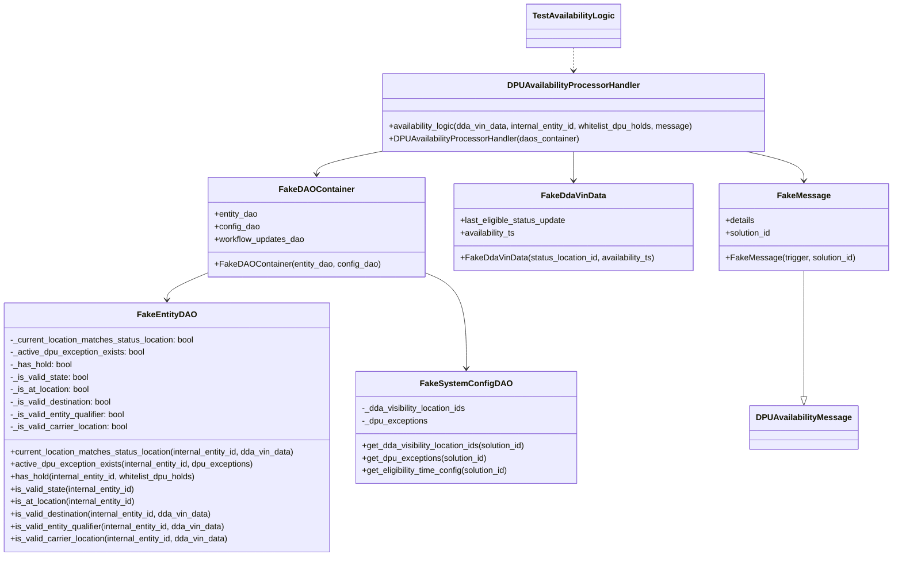
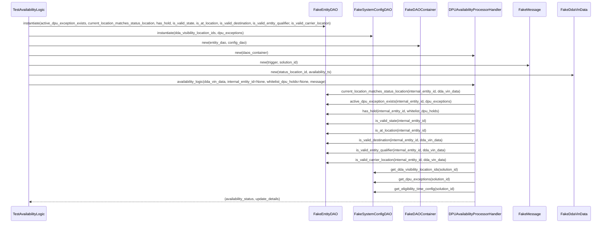

# Diagram: entity_core/entity_service/entity_service_tests/dpu/unit/test_dpu_availability_processor_handler.py

> Auto-generated by Obscura crawlers

## Diagram 1

### SVG

<svg id="container" width="1724.6640625" xmlns="http://www.w3.org/2000/svg" class="classDiagram" height="1072" viewBox="0 0 1724.6640625 1072" role="graphics-document document" aria-roledescription="class"><g><defs><marker id="container_class-aggregationStart" class="marker aggregation class" refX="18" refY="7" markerWidth="190" markerHeight="240" orient="auto"><path d="M 18,7 L9,13 L1,7 L9,1 Z"></path></marker></defs><defs><marker id="container_class-aggregationEnd" class="marker aggregation class" refX="1" refY="7" markerWidth="20" markerHeight="28" orient="auto"><path d="M 18,7 L9,13 L1,7 L9,1 Z"></path></marker></defs><defs><marker id="container_class-extensionStart" class="marker extension class" refX="18" refY="7" markerWidth="190" markerHeight="240" orient="auto"><path d="M 1,7 L18,13 V 1 Z"></path></marker></defs><defs><marker id="container_class-extensionEnd" class="marker extension class" refX="1" refY="7" markerWidth="20" markerHeight="28" orient="auto"><path d="M 1,1 V 13 L18,7 Z"></path></marker></defs><defs><marker id="container_class-compositionStart" class="marker composition class" refX="18" refY="7" markerWidth="190" markerHeight="240" orient="auto"><path d="M 18,7 L9,13 L1,7 L9,1 Z"></path></marker></defs><defs><marker id="container_class-compositionEnd" class="marker composition class" refX="1" refY="7" markerWidth="20" markerHeight="28" orient="auto"><path d="M 18,7 L9,13 L1,7 L9,1 Z"></path></marker></defs><defs><marker id="container_class-dependencyStart" class="marker dependency class" refX="6" refY="7" markerWidth="190" markerHeight="240" orient="auto"><path d="M 5,7 L9,13 L1,7 L9,1 Z"></path></marker></defs><defs><marker id="container_class-dependencyEnd" class="marker dependency class" refX="13" refY="7" markerWidth="20" markerHeight="28" orient="auto"><path d="M 18,7 L9,13 L14,7 L9,1 Z"></path></marker></defs><defs><marker id="container_class-lollipopStart" class="marker lollipop class" refX="13" refY="7" markerWidth="190" markerHeight="240" orient="auto"><circle stroke="black" fill="transparent" cx="7" cy="7" r="6"></circle></marker></defs><defs><marker id="container_class-lollipopEnd" class="marker lollipop class" refX="1" refY="7" markerWidth="190" markerHeight="240" orient="auto"><circle stroke="black" fill="transparent" cx="7" cy="7" r="6"></circle></marker></defs><g class="root"><g class="clusters"></g><g class="edgePaths"><path d="M1556.469,522L1556.469,528.167C1556.469,534.333,1556.469,546.667,1556.469,587.125C1556.469,627.583,1556.469,696.167,1556.469,730.458L1556.469,764.75" id="id_FakeMessage_DPUAvailabilityMessage_1" class="edge-thickness-normal edge-pattern-solid relation" style=";;;" data-edge="true" data-et="edge" data-id="id_FakeMessage_DPUAvailabilityMessage_1" data-points="W3sieCI6MTU1Ni40Njg3NSwieSI6NTIyfSx7IngiOjE1NTYuNDY4NzUsInkiOjU1OX0seyJ4IjoxNTU2LjQ2ODc1LCJ5Ijo3ODJ9XQ==" marker-end="url(#container_class-extensionEnd)"></path><path d="M416.303,522.274L401.517,528.395C386.73,534.516,357.158,546.758,342.372,556.046C327.586,565.333,327.586,571.667,327.586,574.833L327.586,578" id="id_FakeDAOContainer_FakeEntityDAO_2" class="edge-thickness-normal edge-pattern-solid relation" style=";;;" data-edge="true" data-et="edge" data-id="id_FakeDAOContainer_FakeEntityDAO_2" data-points="W3sieCI6NDE2LjMwMjczNDM3NSwieSI6NTIyLjI3MzgyMDEwMzg0MDJ9LHsieCI6MzI3LjU4NTkzNzUsInkiOjU1OX0seyJ4IjozMjcuNTg1OTM3NSwieSI6NTg0fV0=" marker-end="url(#container_class-dependencyEnd)"></path><path d="M823.451,522.274L838.237,528.395C853.023,534.516,882.596,546.758,897.382,578.046C912.168,609.333,912.168,659.667,912.168,684.833L912.168,710" id="id_FakeDAOContainer_FakeSystemConfigDAO_3" class="edge-thickness-normal edge-pattern-solid relation" style=";;;" data-edge="true" data-et="edge" data-id="id_FakeDAOContainer_FakeSystemConfigDAO_3" data-points="W3sieCI6ODIzLjQ1MTE3MTg3NSwieSI6NTIyLjI3MzgyMDEwMzg0MDJ9LHsieCI6OTEyLjE2Nzk2ODc1LCJ5Ijo1NTl9LHsieCI6OTEyLjE2Nzk2ODc1LCJ5Ijo3MTZ9XQ==" marker-end="url(#container_class-dependencyEnd)"></path><path d="M743.903,292L723.232,296.167C702.561,300.333,661.219,308.667,640.548,316C619.877,323.333,619.877,329.667,619.877,332.833L619.877,336" id="id_DPUAvailabilityProcessorHandler_FakeDAOContainer_4" class="edge-thickness-normal edge-pattern-solid relation" style=";;;" data-edge="true" data-et="edge" data-id="id_DPUAvailabilityProcessorHandler_FakeDAOContainer_4" data-points="W3sieCI6NzQzLjkwMjgzMjAzMTI1LCJ5IjoyOTJ9LHsieCI6NjE5Ljg3Njk1MzEyNSwieSI6MzE3fSx7IngiOjYxOS44NzY5NTMxMjUsInkiOjM0Mn1d" marker-end="url(#container_class-dependencyEnd)"></path><path d="M1115.98,292L1115.98,296.167C1115.98,300.333,1115.98,308.667,1115.98,318C1115.98,327.333,1115.98,337.667,1115.98,342.833L1115.98,348" id="id_DPUAvailabilityProcessorHandler_FakeDdaVinData_5" class="edge-thickness-normal edge-pattern-solid relation" style=";;;" data-edge="true" data-et="edge" data-id="id_DPUAvailabilityProcessorHandler_FakeDdaVinData_5" data-points="W3sieCI6MTExNS45ODA0Njg3NSwieSI6MjkyfSx7IngiOjExMTUuOTgwNDY4NzUsInkiOjMxN30seyJ4IjoxMTE1Ljk4MDQ2ODc1LCJ5IjozNTR9XQ==" marker-end="url(#container_class-dependencyEnd)"></path><path d="M1446.347,292L1464.7,296.167C1483.054,300.333,1519.761,308.667,1538.115,318C1556.469,327.333,1556.469,337.667,1556.469,342.833L1556.469,348" id="id_DPUAvailabilityProcessorHandler_FakeMessage_6" class="edge-thickness-normal edge-pattern-solid relation" style=";;;" data-edge="true" data-et="edge" data-id="id_DPUAvailabilityProcessorHandler_FakeMessage_6" data-points="W3sieCI6MTQ0Ni4zNDY2Nzk2ODc1LCJ5IjoyOTJ9LHsieCI6MTU1Ni40Njg3NSwieSI6MzE3fSx7IngiOjE1NTYuNDY4NzUsInkiOjM1NH1d" marker-end="url(#container_class-dependencyEnd)"></path><path d="M1115.98,92L1115.98,96.167C1115.98,100.333,1115.98,108.667,1115.98,116C1115.98,123.333,1115.98,129.667,1115.98,132.833L1115.98,136" id="id_TestAvailabilityLogic_DPUAvailabilityProcessorHandler_7" class="edge-thickness-normal edge-pattern-dashed relation" style=";;;" data-edge="true" data-et="edge" data-id="id_TestAvailabilityLogic_DPUAvailabilityProcessorHandler_7" data-points="W3sieCI6MTExNS45ODA0Njg3NSwieSI6OTJ9LHsieCI6MTExNS45ODA0Njg3NSwieSI6MTE3fSx7IngiOjExMTUuOTgwNDY4NzUsInkiOjE0Mn1d" marker-end="url(#container_class-dependencyEnd)"></path></g><g class="edgeLabels"><g class="edgeLabel"><g class="label" data-id="id_FakeMessage_DPUAvailabilityMessage_1" transform="translate(0, 0)"><foreignObject width="0" height="0">

</foreignObject></g></g><g class="edgeLabel"><g class="label" data-id="id_FakeDAOContainer_FakeEntityDAO_2" transform="translate(0, 0)"><foreignObject width="0" height="0">

</foreignObject></g></g><g class="edgeLabel"><g class="label" data-id="id_FakeDAOContainer_FakeSystemConfigDAO_3" transform="translate(0, 0)"><foreignObject width="0" height="0">

</foreignObject></g></g><g class="edgeLabel"><g class="label" data-id="id_DPUAvailabilityProcessorHandler_FakeDAOContainer_4" transform="translate(0, 0)"><foreignObject width="0" height="0">

</foreignObject></g></g><g class="edgeLabel"><g class="label" data-id="id_DPUAvailabilityProcessorHandler_FakeDdaVinData_5" transform="translate(0, 0)"><foreignObject width="0" height="0">

</foreignObject></g></g><g class="edgeLabel"><g class="label" data-id="id_DPUAvailabilityProcessorHandler_FakeMessage_6" transform="translate(0, 0)"><foreignObject width="0" height="0">

</foreignObject></g></g><g class="edgeLabel"><g class="label" data-id="id_TestAvailabilityLogic_DPUAvailabilityProcessorHandler_7" transform="translate(0, 0)"><foreignObject width="0" height="0">

</foreignObject></g></g></g><g class="nodes"><g class="node default" id="classId-FakeEntityDAO-0" transform="translate(327.5859375, 824)"><g class="basic label-container"><path d="M-319.5859375 -240 L319.5859375 -240 L319.5859375 240 L-319.5859375 240" stroke="none" stroke-width="0" fill="#ECECFF" style=""></path><path d="M-319.5859375 -240 C-64.37092419445491 -240, 190.84408911109017 -240, 319.5859375 -240 M-319.5859375 -240 C-139.94571191996994 -240, 39.694513660060124 -240, 319.5859375 -240 M319.5859375 -240 C319.5859375 -105.95675256761712, 319.5859375 28.08649486476577, 319.5859375 240 M319.5859375 -240 C319.5859375 -103.99487158401277, 319.5859375 32.01025683197446, 319.5859375 240 M319.5859375 240 C150.34388245431748 240, -18.89817259136504 240, -319.5859375 240 M319.5859375 240 C140.7583575763702 240, -38.0692223472596 240, -319.5859375 240 M-319.5859375 240 C-319.5859375 107.49354669229933, -319.5859375 -25.012906615401334, -319.5859375 -240 M-319.5859375 240 C-319.5859375 99.79755787625504, -319.5859375 -40.40488424748992, -319.5859375 -240" stroke="#9370DB" stroke-width="1.3" fill="none" stroke-dasharray="0 0" style=""></path></g><g class="annotation-group text" transform="translate(0, -216)"></g><g class="label-group text" transform="translate(-53.109375, -216)"><g class="label" style="font-weight: bolder" transform="translate(0,-12)"><foreignObject width="106.21875" height="24">

FakeEntityDAO

</foreignObject></g></g><g class="members-group text" transform="translate(-307.5859375, -168)"><g class="label" style="" transform="translate(0,-12)"><foreignObject width="362.875" height="24">

-_current_location_matches_status_location: bool

</foreignObject></g><g class="label" style="" transform="translate(0,12)"><foreignObject width="261.6875" height="24">

-_active_dpu_exception_exists: bool

</foreignObject></g><g class="label" style="" transform="translate(0,36)"><foreignObject width="120.75" height="24">

-_has_hold: bool

</foreignObject></g><g class="label" style="" transform="translate(0,60)"><foreignObject width="153.296875" height="24">

-_is_valid_state: bool

</foreignObject></g><g class="label" style="" transform="translate(0,84)"><foreignObject width="155.90625" height="24">

-_is_at_location: bool

</foreignObject></g><g class="label" style="" transform="translate(0,108)"><foreignObject width="200.03125" height="24">

-_is_valid_destination: bool

</foreignObject></g><g class="label" style="" transform="translate(0,132)"><foreignObject width="227.234375" height="24">

-_is_valid_entity_qualifier: bool

</foreignObject></g><g class="label" style="" transform="translate(0,156)"><foreignObject width="230.875" height="24">

-_is_valid_carrier_location: bool

</foreignObject></g></g><g class="methods-group text" transform="translate(-307.5859375, 48)"><g class="label" style="" transform="translate(0,-12)"><foreignObject width="562.0625" height="24">

+current_location_matches_status_location(internal_entity_id, dda_vin_data)

</foreignObject></g><g class="label" style="" transform="translate(0,12)"><foreignObject width="477.15625" height="24">

+active_dpu_exception_exists(internal_entity_id, dpu_exceptions)

</foreignObject></g><g class="label" style="" transform="translate(0,36)"><foreignObject width="368.671875" height="24">

+has_hold(internal_entity_id, whitelist_dpu_holds)

</foreignObject></g><g class="label" style="" transform="translate(0,60)"><foreignObject width="246.015625" height="24">

+is_valid_state(internal_entity_id)

</foreignObject></g><g class="label" style="" transform="translate(0,84)"><foreignObject width="248.609375" height="24">

+is_at_location(internal_entity_id)

</foreignObject></g><g class="label" style="" transform="translate(0,108)"><foreignObject width="398.890625" height="24">

+is_valid_destination(internal_entity_id, dda_vin_data)

</foreignObject></g><g class="label" style="" transform="translate(0,132)"><foreignObject width="425.9375" height="24">

+is_valid_entity_qualifier(internal_entity_id, dda_vin_data)

</foreignObject></g><g class="label" style="" transform="translate(0,156)"><foreignObject width="429.734375" height="24">

+is_valid_carrier_location(internal_entity_id, dda_vin_data)

</foreignObject></g></g><g class="divider" style=""><path d="M-319.5859375 -192 C-117.03313131520656 -192, 85.51967486958688 -192, 319.5859375 -192 M-319.5859375 -192 C-99.24008361631562 -192, 121.10577026736877 -192, 319.5859375 -192" stroke="#9370DB" stroke-width="1.3" fill="none" stroke-dasharray="0 0" style=""></path></g><g class="divider" style=""><path d="M-319.5859375 24 C-154.76113074982754 24, 10.063676000344913 24, 319.5859375 24 M-319.5859375 24 C-87.82276369021906 24, 143.94041011956188 24, 319.5859375 24" stroke="#9370DB" stroke-width="1.3" fill="none" stroke-dasharray="0 0" style=""></path></g></g><g class="node default" id="classId-FakeSystemConfigDAO-1" transform="translate(912.16796875, 824)"><g class="basic label-container"><path d="M-214.99609375 -108 L214.99609375 -108 L214.99609375 108 L-214.99609375 108" stroke="none" stroke-width="0" fill="#ECECFF" style=""></path><path d="M-214.99609375 -108 C-87.26226726735212 -108, 40.47155921529577 -108, 214.99609375 -108 M-214.99609375 -108 C-74.7179056946122 -108, 65.5602823607756 -108, 214.99609375 -108 M214.99609375 -108 C214.99609375 -46.12908413534336, 214.99609375 15.741831729313276, 214.99609375 108 M214.99609375 -108 C214.99609375 -42.25818201990994, 214.99609375 23.483635960180123, 214.99609375 108 M214.99609375 108 C59.94557097734284 108, -95.10495179531432 108, -214.99609375 108 M214.99609375 108 C63.977038236839974 108, -87.04201727632005 108, -214.99609375 108 M-214.99609375 108 C-214.99609375 64.32000455306647, -214.99609375 20.64000910613295, -214.99609375 -108 M-214.99609375 108 C-214.99609375 36.033885570848, -214.99609375 -35.932228858304, -214.99609375 -108" stroke="#9370DB" stroke-width="1.3" fill="none" stroke-dasharray="0 0" style=""></path></g><g class="annotation-group text" transform="translate(0, -84)"></g><g class="label-group text" transform="translate(-81.3046875, -84)"><g class="label" style="font-weight: bolder" transform="translate(0,-12)"><foreignObject width="162.609375" height="24">

FakeSystemConfigDAO

</foreignObject></g></g><g class="members-group text" transform="translate(-202.99609375, -36)"><g class="label" style="" transform="translate(0,-12)"><foreignObject width="206.71875" height="24">

-_dda_visibility_location_ids

</foreignObject></g><g class="label" style="" transform="translate(0,12)"><foreignObject width="127.78125" height="24">

-_dpu_exceptions

</foreignObject></g></g><g class="methods-group text" transform="translate(-202.99609375, 36)"><g class="label" style="" transform="translate(0,-12)"><foreignObject width="324.6875" height="24">

+get_dda_visibility_location_ids(solution_id)

</foreignObject></g><g class="label" style="" transform="translate(0,12)"><foreignObject width="245.75" height="24">

+get_dpu_exceptions(solution_id)

</foreignObject></g><g class="label" style="" transform="translate(0,36)"><foreignObject width="290.171875" height="24">

+get_eligibility_time_config(solution_id)

</foreignObject></g></g><g class="divider" style=""><path d="M-214.99609375 -60 C-53.84103020406138 -60, 107.31403334187723 -60, 214.99609375 -60 M-214.99609375 -60 C-46.40513580121504 -60, 122.18582214756992 -60, 214.99609375 -60" stroke="#9370DB" stroke-width="1.3" fill="none" stroke-dasharray="0 0" style=""></path></g><g class="divider" style=""><path d="M-214.99609375 12 C-79.29531424962644 12, 56.40546525074711 12, 214.99609375 12 M-214.99609375 12 C-56.52147150018999 12, 101.95315074962002 12, 214.99609375 12" stroke="#9370DB" stroke-width="1.3" fill="none" stroke-dasharray="0 0" style=""></path></g></g><g class="node default" id="classId-FakeDAOContainer-2" transform="translate(619.876953125, 438)"><g class="basic label-container"><path d="M-203.57421875 -96 L203.57421875 -96 L203.57421875 96 L-203.57421875 96" stroke="none" stroke-width="0" fill="#ECECFF" style=""></path><path d="M-203.57421875 -96 C-113.32816940825381 -96, -23.082120066507628 -96, 203.57421875 -96 M-203.57421875 -96 C-50.22437097698315 -96, 103.1254767960337 -96, 203.57421875 -96 M203.57421875 -96 C203.57421875 -50.325013459345506, 203.57421875 -4.650026918691012, 203.57421875 96 M203.57421875 -96 C203.57421875 -57.052146650230796, 203.57421875 -18.104293300461592, 203.57421875 96 M203.57421875 96 C106.57028621862533 96, 9.566353687250654 96, -203.57421875 96 M203.57421875 96 C118.56144168078472 96, 33.54866461156945 96, -203.57421875 96 M-203.57421875 96 C-203.57421875 24.524887833499577, -203.57421875 -46.95022433300085, -203.57421875 -96 M-203.57421875 96 C-203.57421875 43.9088256127556, -203.57421875 -8.182348774488801, -203.57421875 -96" stroke="#9370DB" stroke-width="1.3" fill="none" stroke-dasharray="0 0" style=""></path></g><g class="annotation-group text" transform="translate(0, -72)"></g><g class="label-group text" transform="translate(-67.4296875, -72)"><g class="label" style="font-weight: bolder" transform="translate(0,-12)"><foreignObject width="134.859375" height="24">

FakeDAOContainer

</foreignObject></g></g><g class="members-group text" transform="translate(-191.57421875, -24)"><g class="label" style="" transform="translate(0,-12)"><foreignObject width="85.078125" height="24">

+entity_dao

</foreignObject></g><g class="label" style="" transform="translate(0,12)"><foreignObject width="87.234375" height="24">

+config_dao

</foreignObject></g><g class="label" style="" transform="translate(0,36)"><foreignObject width="175.171875" height="24">

+workflow_updates_dao

</foreignObject></g></g><g class="methods-group text" transform="translate(-191.57421875, 72)"><g class="label" style="" transform="translate(0,-12)"><foreignObject width="315.71875" height="24">

+FakeDAOContainer(entity_dao, config_dao)

</foreignObject></g></g><g class="divider" style=""><path d="M-203.57421875 -48 C-76.23489029215976 -48, 51.10443816568048 -48, 203.57421875 -48 M-203.57421875 -48 C-54.98678744494316 -48, 93.60064386011368 -48, 203.57421875 -48" stroke="#9370DB" stroke-width="1.3" fill="none" stroke-dasharray="0 0" style=""></path></g><g class="divider" style=""><path d="M-203.57421875 48 C-101.69178020887158 48, 0.19065833225684514 48, 203.57421875 48 M-203.57421875 48 C-99.8924059179074 48, 3.789406914185207 48, 203.57421875 48" stroke="#9370DB" stroke-width="1.3" fill="none" stroke-dasharray="0 0" style=""></path></g></g><g class="node default" id="classId-FakeDdaVinData-3" transform="translate(1115.98046875, 438)"><g class="basic label-container"><path d="M-230.29296875 -84 L230.29296875 -84 L230.29296875 84 L-230.29296875 84" stroke="none" stroke-width="0" fill="#ECECFF" style=""></path><path d="M-230.29296875 -84 C-48.384438616748184 -84, 133.52409151650363 -84, 230.29296875 -84 M-230.29296875 -84 C-98.44261526410051 -84, 33.40773822179898 -84, 230.29296875 -84 M230.29296875 -84 C230.29296875 -31.112391708010755, 230.29296875 21.77521658397849, 230.29296875 84 M230.29296875 -84 C230.29296875 -22.473475729272977, 230.29296875 39.05304854145405, 230.29296875 84 M230.29296875 84 C99.97119766129379 84, -30.350573427412428 84, -230.29296875 84 M230.29296875 84 C76.97100492457056 84, -76.35095890085887 84, -230.29296875 84 M-230.29296875 84 C-230.29296875 29.469919154205847, -230.29296875 -25.060161691588306, -230.29296875 -84 M-230.29296875 84 C-230.29296875 18.086491006217557, -230.29296875 -47.827017987564886, -230.29296875 -84" stroke="#9370DB" stroke-width="1.3" fill="none" stroke-dasharray="0 0" style=""></path></g><g class="annotation-group text" transform="translate(0, -60)"></g><g class="label-group text" transform="translate(-59.2421875, -60)"><g class="label" style="font-weight: bolder" transform="translate(0,-12)"><foreignObject width="118.484375" height="24">

FakeDdaVinData

</foreignObject></g></g><g class="members-group text" transform="translate(-218.29296875, -12)"><g class="label" style="" transform="translate(0,-12)"><foreignObject width="207.40625" height="24">

+last_eligible_status_update

</foreignObject></g><g class="label" style="" transform="translate(0,12)"><foreignObject width="107.90625" height="24">

+availability_ts

</foreignObject></g></g><g class="methods-group text" transform="translate(-218.29296875, 60)"><g class="label" style="" transform="translate(0,-12)"><foreignObject width="377.34375" height="24">

+FakeDdaVinData(status_location_id, availability_ts)

</foreignObject></g></g><g class="divider" style=""><path d="M-230.29296875 -36 C-95.09301670475239 -36, 40.10693534049523 -36, 230.29296875 -36 M-230.29296875 -36 C-72.09722979287173 -36, 86.09850916425654 -36, 230.29296875 -36" stroke="#9370DB" stroke-width="1.3" fill="none" stroke-dasharray="0 0" style=""></path></g><g class="divider" style=""><path d="M-230.29296875 36 C-130.87872337438608 36, -31.464477998772168 36, 230.29296875 36 M-230.29296875 36 C-78.35701961118349 36, 73.57892952763302 36, 230.29296875 36" stroke="#9370DB" stroke-width="1.3" fill="none" stroke-dasharray="0 0" style=""></path></g></g><g class="node default" id="classId-FakeMessage-4" transform="translate(1556.46875, 438)"><g class="basic label-container"><path d="M-160.1953125 -84 L160.1953125 -84 L160.1953125 84 L-160.1953125 84" stroke="none" stroke-width="0" fill="#ECECFF" style=""></path><path d="M-160.1953125 -84 C-75.23023255630932 -84, 9.734847387381365 -84, 160.1953125 -84 M-160.1953125 -84 C-91.55164211505935 -84, -22.907971730118703 -84, 160.1953125 -84 M160.1953125 -84 C160.1953125 -30.24511130866516, 160.1953125 23.509777382669682, 160.1953125 84 M160.1953125 -84 C160.1953125 -43.10191595152043, 160.1953125 -2.2038319030408644, 160.1953125 84 M160.1953125 84 C51.87835346554321 84, -56.43860556891357 84, -160.1953125 84 M160.1953125 84 C72.79788444987186 84, -14.599543600256283 84, -160.1953125 84 M-160.1953125 84 C-160.1953125 45.373667694101904, -160.1953125 6.747335388203808, -160.1953125 -84 M-160.1953125 84 C-160.1953125 38.94683473306136, -160.1953125 -6.1063305338772835, -160.1953125 -84" stroke="#9370DB" stroke-width="1.3" fill="none" stroke-dasharray="0 0" style=""></path></g><g class="annotation-group text" transform="translate(0, -60)"></g><g class="label-group text" transform="translate(-47.78125, -60)"><g class="label" style="font-weight: bolder" transform="translate(0,-12)"><foreignObject width="95.5625" height="24">

FakeMessage

</foreignObject></g></g><g class="members-group text" transform="translate(-148.1953125, -12)"><g class="label" style="" transform="translate(0,-12)"><foreignObject width="57.3125" height="24">

+details

</foreignObject></g><g class="label" style="" transform="translate(0,12)"><foreignObject width="90.21875" height="24">

+solution_id

</foreignObject></g></g><g class="methods-group text" transform="translate(-148.1953125, 60)"><g class="label" style="" transform="translate(0,-12)"><foreignObject width="248.609375" height="24">

+FakeMessage(trigger, solution_id)

</foreignObject></g></g><g class="divider" style=""><path d="M-160.1953125 -36 C-75.58646704146203 -36, 9.022378417075942 -36, 160.1953125 -36 M-160.1953125 -36 C-74.68939672110722 -36, 10.81651905778557 -36, 160.1953125 -36" stroke="#9370DB" stroke-width="1.3" fill="none" stroke-dasharray="0 0" style=""></path></g><g class="divider" style=""><path d="M-160.1953125 36 C-90.76047831180037 36, -21.32564412360074 36, 160.1953125 36 M-160.1953125 36 C-57.732357588618655 36, 44.73059732276269 36, 160.1953125 36" stroke="#9370DB" stroke-width="1.3" fill="none" stroke-dasharray="0 0" style=""></path></g></g><g class="node default" id="classId-DPUAvailabilityMessage-5" transform="translate(1556.46875, 824)"><g class="basic label-container"><path d="M-99.25 -42 L99.25 -42 L99.25 42 L-99.25 42" stroke="none" stroke-width="0" fill="#ECECFF" style=""></path><path d="M-99.25 -42 C-30.433232374665053 -42, 38.383535250669894 -42, 99.25 -42 M-99.25 -42 C-52.638875855622594 -42, -6.0277517112451875 -42, 99.25 -42 M99.25 -42 C99.25 -16.381532542013666, 99.25 9.236934915972668, 99.25 42 M99.25 -42 C99.25 -17.509434657485386, 99.25 6.981130685029228, 99.25 42 M99.25 42 C33.968603228599505 42, -31.31279354280099 42, -99.25 42 M99.25 42 C37.30898836547793 42, -24.63202326904414 42, -99.25 42 M-99.25 42 C-99.25 12.940118307295752, -99.25 -16.119763385408497, -99.25 -42 M-99.25 42 C-99.25 17.80247907790994, -99.25 -6.3950418441801204, -99.25 -42" stroke="#9370DB" stroke-width="1.3" fill="none" stroke-dasharray="0 0" style=""></path></g><g class="annotation-group text" transform="translate(0, -18)"></g><g class="label-group text" transform="translate(-87.25, -18)"><g class="label" style="font-weight: bolder" transform="translate(0,-12)"><foreignObject width="174.5" height="24">

DPUAvailabilityMessage

</foreignObject></g></g><g class="members-group text" transform="translate(-87.25, 30)"></g><g class="methods-group text" transform="translate(-87.25, 60)"></g><g class="divider" style=""><path d="M-99.25 6 C-53.947597902202155 6, -8.64519580440431 6, 99.25 6 M-99.25 6 C-20.2116696997887 6, 58.8266606004226 6, 99.25 6" stroke="#9370DB" stroke-width="1.3" fill="none" stroke-dasharray="0 0" style=""></path></g><g class="divider" style=""><path d="M-99.25 24 C-59.12802811508968 24, -19.006056230179354 24, 99.25 24 M-99.25 24 C-58.64261977503148 24, -18.035239550062954 24, 99.25 24" stroke="#9370DB" stroke-width="1.3" fill="none" stroke-dasharray="0 0" style=""></path></g></g><g class="node default" id="classId-DPUAvailabilityProcessorHandler-6" transform="translate(1115.98046875, 217)"><g class="basic label-container"><path d="M-372.640625 -75 L372.640625 -75 L372.640625 75 L-372.640625 75" stroke="none" stroke-width="0" fill="#ECECFF" style=""></path><path d="M-372.640625 -75 C-218.2968181943036 -75, -63.953011388607194 -75, 372.640625 -75 M-372.640625 -75 C-189.80498831708374 -75, -6.969351634167481 -75, 372.640625 -75 M372.640625 -75 C372.640625 -16.321808270496575, 372.640625 42.35638345900685, 372.640625 75 M372.640625 -75 C372.640625 -38.58130566765023, 372.640625 -2.162611335300454, 372.640625 75 M372.640625 75 C176.78948654302417 75, -19.061651913951664 75, -372.640625 75 M372.640625 75 C133.06079524043153 75, -106.51903451913694 75, -372.640625 75 M-372.640625 75 C-372.640625 34.61656471956138, -372.640625 -5.766870560877237, -372.640625 -75 M-372.640625 75 C-372.640625 23.45130587659937, -372.640625 -28.09738824680126, -372.640625 -75" stroke="#9370DB" stroke-width="1.3" fill="none" stroke-dasharray="0 0" style=""></path></g><g class="annotation-group text" transform="translate(0, -51)"></g><g class="label-group text" transform="translate(-121.015625, -51)"><g class="label" style="font-weight: bolder" transform="translate(0,-12)"><foreignObject width="242.03125" height="24">

DPUAvailabilityProcessorHandler

</foreignObject></g></g><g class="members-group text" transform="translate(-360.640625, -3)"></g><g class="methods-group text" transform="translate(-360.640625, 27)"><g class="label" style="" transform="translate(0,-12)"><foreignObject width="600.265625" height="24">

+availability_logic(dda_vin_data, internal_entity_id, whitelist_dpu_holds, message)

</foreignObject></g><g class="label" style="" transform="translate(0,12)"><foreignObject width="368.859375" height="24">

+DPUAvailabilityProcessorHandler(daos_container)

</foreignObject></g></g><g class="divider" style=""><path d="M-372.640625 -27 C-76.0763367563573 -27, 220.4879514872854 -27, 372.640625 -27 M-372.640625 -27 C-125.8019954647238 -27, 121.0366340705524 -27, 372.640625 -27" stroke="#9370DB" stroke-width="1.3" fill="none" stroke-dasharray="0 0" style=""></path></g><g class="divider" style=""><path d="M-372.640625 -3 C-88.99259258387303 -3, 194.65543983225393 -3, 372.640625 -3 M-372.640625 -3 C-138.85179272916034 -3, 94.93703954167933 -3, 372.640625 -3" stroke="#9370DB" stroke-width="1.3" fill="none" stroke-dasharray="0 0" style=""></path></g></g><g class="node default" id="classId-TestAvailabilityLogic-7" transform="translate(1115.98046875, 50)"><g class="basic label-container"><path d="M-87.1875 -42 L87.1875 -42 L87.1875 42 L-87.1875 42" stroke="none" stroke-width="0" fill="#ECECFF" style=""></path><path d="M-87.1875 -42 C-43.771416298951415 -42, -0.3553325979028301 -42, 87.1875 -42 M-87.1875 -42 C-20.421983110260882 -42, 46.343533779478236 -42, 87.1875 -42 M87.1875 -42 C87.1875 -23.953877244671038, 87.1875 -5.907754489342075, 87.1875 42 M87.1875 -42 C87.1875 -9.960434244538874, 87.1875 22.079131510922252, 87.1875 42 M87.1875 42 C43.92869960043887 42, 0.6698992008777367 42, -87.1875 42 M87.1875 42 C35.29456306415425 42, -16.598373871691507 42, -87.1875 42 M-87.1875 42 C-87.1875 18.32223322162675, -87.1875 -5.355533556746501, -87.1875 -42 M-87.1875 42 C-87.1875 24.45976561996671, -87.1875 6.91953123993342, -87.1875 -42" stroke="#9370DB" stroke-width="1.3" fill="none" stroke-dasharray="0 0" style=""></path></g><g class="annotation-group text" transform="translate(0, -18)"></g><g class="label-group text" transform="translate(-75.1875, -18)"><g class="label" style="font-weight: bolder" transform="translate(0,-12)"><foreignObject width="150.375" height="24">

TestAvailabilityLogic

</foreignObject></g></g><g class="members-group text" transform="translate(-75.1875, 30)"></g><g class="methods-group text" transform="translate(-75.1875, 60)"></g><g class="divider" style=""><path d="M-87.1875 6 C-39.09100988536897 6, 9.005480229262062 6, 87.1875 6 M-87.1875 6 C-21.175253587168527 6, 44.836992825662946 6, 87.1875 6" stroke="#9370DB" stroke-width="1.3" fill="none" stroke-dasharray="0 0" style=""></path></g><g class="divider" style=""><path d="M-87.1875 24 C-19.393151857797008 24, 48.401196284405984 24, 87.1875 24 M-87.1875 24 C-45.045749647848915 24, -2.9039992956978296 24, 87.1875 24" stroke="#9370DB" stroke-width="1.3" fill="none" stroke-dasharray="0 0" style=""></path></g></g></g></g></g></svg>

## Diagram 2

### SVG

<svg id="container" width="2891.5" xmlns="http://www.w3.org/2000/svg" height="1083" viewBox="-50 -10 2891.5 1083" role="graphics-document document" aria-roledescription="sequence"><g><rect x="2641.5" y="997" fill="#eaeaea" stroke="#666" width="150" height="65" name="DDA" rx="3" ry="3" class="actor actor-bottom"></rect><text x="2716.5" y="1029.5" dominant-baseline="central" alignment-baseline="central" class="actor actor-box" style="text-anchor: middle; font-size: 16px; font-weight: 400;"><tspan x="2716.5" dy="0">FakeDdaVinData</tspan></text></g><g><rect x="2441.5" y="997" fill="#eaeaea" stroke="#666" width="150" height="65" name="Message" rx="3" ry="3" class="actor actor-bottom"></rect><text x="2516.5" y="1029.5" dominant-baseline="central" alignment-baseline="central" class="actor actor-box" style="text-anchor: middle; font-size: 16px; font-weight: 400;"><tspan x="2516.5" dy="0">FakeMessage</tspan></text></g><g><rect x="2132.5" y="997" fill="#eaeaea" stroke="#666" width="259" height="65" name="Processor" rx="3" ry="3" class="actor actor-bottom"></rect><text x="2262" y="1029.5" dominant-baseline="central" alignment-baseline="central" class="actor actor-box" style="text-anchor: middle; font-size: 16px; font-weight: 400;"><tspan x="2262" dy="0">DPUAvailabilityProcessorHandler</tspan></text></g><g><rect x="1928.5" y="997" fill="#eaeaea" stroke="#666" width="154" height="65" name="DAOs" rx="3" ry="3" class="actor actor-bottom"></rect><text x="2005.5" y="1029.5" dominant-baseline="central" alignment-baseline="central" class="actor actor-box" style="text-anchor: middle; font-size: 16px; font-weight: 400;"><tspan x="2005.5" dy="0">FakeDAOContainer</tspan></text></g><g><rect x="1699.5" y="997" fill="#eaeaea" stroke="#666" width="179" height="65" name="ConfigDAO" rx="3" ry="3" class="actor actor-bottom"></rect><text x="1789" y="1029.5" dominant-baseline="central" alignment-baseline="central" class="actor actor-box" style="text-anchor: middle; font-size: 16px; font-weight: 400;"><tspan x="1789" dy="0">FakeSystemConfigDAO</tspan></text></g><g><rect x="1499.5" y="997" fill="#eaeaea" stroke="#666" width="150" height="65" name="EntityDAO" rx="3" ry="3" class="actor actor-bottom"></rect><text x="1574.5" y="1029.5" dominant-baseline="central" alignment-baseline="central" class="actor actor-box" style="text-anchor: middle; font-size: 16px; font-weight: 400;"><tspan x="1574.5" dy="0">FakeEntityDAO</tspan></text></g><g><rect x="0" y="997" fill="#eaeaea" stroke="#666" width="167" height="65" name="Test" rx="3" ry="3" class="actor actor-bottom"></rect><text x="83.5" y="1029.5" dominant-baseline="central" alignment-baseline="central" class="actor actor-box" style="text-anchor: middle; font-size: 16px; font-weight: 400;"><tspan x="83.5" dy="0">TestAvailabilityLogic</tspan></text></g><g><line id="actor6" x1="2716.5" y1="65" x2="2716.5" y2="997" class="actor-line 200" stroke-width="0.5px" stroke="#999" name="DDA"></line><g id="root-6"><rect x="2641.5" y="0" fill="#eaeaea" stroke="#666" width="150" height="65" name="DDA" rx="3" ry="3" class="actor actor-top"></rect><text x="2716.5" y="32.5" dominant-baseline="central" alignment-baseline="central" class="actor actor-box" style="text-anchor: middle; font-size: 16px; font-weight: 400;"><tspan x="2716.5" dy="0">FakeDdaVinData</tspan></text></g></g><g><line id="actor5" x1="2516.5" y1="65" x2="2516.5" y2="997" class="actor-line 200" stroke-width="0.5px" stroke="#999" name="Message"></line><g id="root-5"><rect x="2441.5" y="0" fill="#eaeaea" stroke="#666" width="150" height="65" name="Message" rx="3" ry="3" class="actor actor-top"></rect><text x="2516.5" y="32.5" dominant-baseline="central" alignment-baseline="central" class="actor actor-box" style="text-anchor: middle; font-size: 16px; font-weight: 400;"><tspan x="2516.5" dy="0">FakeMessage</tspan></text></g></g><g><line id="actor4" x1="2262" y1="65" x2="2262" y2="997" class="actor-line 200" stroke-width="0.5px" stroke="#999" name="Processor"></line><g id="root-4"><rect x="2132.5" y="0" fill="#eaeaea" stroke="#666" width="259" height="65" name="Processor" rx="3" ry="3" class="actor actor-top"></rect><text x="2262" y="32.5" dominant-baseline="central" alignment-baseline="central" class="actor actor-box" style="text-anchor: middle; font-size: 16px; font-weight: 400;"><tspan x="2262" dy="0">DPUAvailabilityProcessorHandler</tspan></text></g></g><g><line id="actor3" x1="2005.5" y1="65" x2="2005.5" y2="997" class="actor-line 200" stroke-width="0.5px" stroke="#999" name="DAOs"></line><g id="root-3"><rect x="1928.5" y="0" fill="#eaeaea" stroke="#666" width="154" height="65" name="DAOs" rx="3" ry="3" class="actor actor-top"></rect><text x="2005.5" y="32.5" dominant-baseline="central" alignment-baseline="central" class="actor actor-box" style="text-anchor: middle; font-size: 16px; font-weight: 400;"><tspan x="2005.5" dy="0">FakeDAOContainer</tspan></text></g></g><g><line id="actor2" x1="1789" y1="65" x2="1789" y2="997" class="actor-line 200" stroke-width="0.5px" stroke="#999" name="ConfigDAO"></line><g id="root-2"><rect x="1699.5" y="0" fill="#eaeaea" stroke="#666" width="179" height="65" name="ConfigDAO" rx="3" ry="3" class="actor actor-top"></rect><text x="1789" y="32.5" dominant-baseline="central" alignment-baseline="central" class="actor actor-box" style="text-anchor: middle; font-size: 16px; font-weight: 400;"><tspan x="1789" dy="0">FakeSystemConfigDAO</tspan></text></g></g><g><line id="actor1" x1="1574.5" y1="65" x2="1574.5" y2="997" class="actor-line 200" stroke-width="0.5px" stroke="#999" name="EntityDAO"></line><g id="root-1"><rect x="1499.5" y="0" fill="#eaeaea" stroke="#666" width="150" height="65" name="EntityDAO" rx="3" ry="3" class="actor actor-top"></rect><text x="1574.5" y="32.5" dominant-baseline="central" alignment-baseline="central" class="actor actor-box" style="text-anchor: middle; font-size: 16px; font-weight: 400;"><tspan x="1574.5" dy="0">FakeEntityDAO</tspan></text></g></g><g><line id="actor0" x1="83.5" y1="65" x2="83.5" y2="997" class="actor-line 200" stroke-width="0.5px" stroke="#999" name="Test"></line><g id="root-0"><rect x="0" y="0" fill="#eaeaea" stroke="#666" width="167" height="65" name="Test" rx="3" ry="3" class="actor actor-top"></rect><text x="83.5" y="32.5" dominant-baseline="central" alignment-baseline="central" class="actor actor-box" style="text-anchor: middle; font-size: 16px; font-weight: 400;"><tspan x="83.5" dy="0">TestAvailabilityLogic</tspan></text></g></g><g></g><defs><symbol id="computer" width="24" height="24"><path transform="scale(.5)" d="M2 2v13h20v-13h-20zm18 11h-16v-9h16v9zm-10.228 6l.466-1h3.524l.467 1h-4.457zm14.228 3h-24l2-6h2.104l-1.33 4h18.45l-1.297-4h2.073l2 6zm-5-10h-14v-7h14v7z"></path></symbol></defs><defs><symbol id="database" fill-rule="evenodd" clip-rule="evenodd"><path transform="scale(.5)" d="M12.258.001l.256.004.255.005.253.008.251.01.249.012.247.015.246.016.242.019.241.02.239.023.236.024.233.027.231.028.229.031.225.032.223.034.22.036.217.038.214.04.211.041.208.043.205.045.201.046.198.048.194.05.191.051.187.053.183.054.18.056.175.057.172.059.168.06.163.061.16.063.155.064.15.066.074.033.073.033.071.034.07.034.069.035.068.035.067.035.066.035.064.036.064.036.062.036.06.036.06.037.058.037.058.037.055.038.055.038.053.038.052.038.051.039.05.039.048.039.047.039.045.04.044.04.043.04.041.04.04.041.039.041.037.041.036.041.034.041.033.042.032.042.03.042.029.042.027.042.026.043.024.043.023.043.021.043.02.043.018.044.017.043.015.044.013.044.012.044.011.045.009.044.007.045.006.045.004.045.002.045.001.045v17l-.001.045-.002.045-.004.045-.006.045-.007.045-.009.044-.011.045-.012.044-.013.044-.015.044-.017.043-.018.044-.02.043-.021.043-.023.043-.024.043-.026.043-.027.042-.029.042-.03.042-.032.042-.033.042-.034.041-.036.041-.037.041-.039.041-.04.041-.041.04-.043.04-.044.04-.045.04-.047.039-.048.039-.05.039-.051.039-.052.038-.053.038-.055.038-.055.038-.058.037-.058.037-.06.037-.06.036-.062.036-.064.036-.064.036-.066.035-.067.035-.068.035-.069.035-.07.034-.071.034-.073.033-.074.033-.15.066-.155.064-.16.063-.163.061-.168.06-.172.059-.175.057-.18.056-.183.054-.187.053-.191.051-.194.05-.198.048-.201.046-.205.045-.208.043-.211.041-.214.04-.217.038-.22.036-.223.034-.225.032-.229.031-.231.028-.233.027-.236.024-.239.023-.241.02-.242.019-.246.016-.247.015-.249.012-.251.01-.253.008-.255.005-.256.004-.258.001-.258-.001-.256-.004-.255-.005-.253-.008-.251-.01-.249-.012-.247-.015-.245-.016-.243-.019-.241-.02-.238-.023-.236-.024-.234-.027-.231-.028-.228-.031-.226-.032-.223-.034-.22-.036-.217-.038-.214-.04-.211-.041-.208-.043-.204-.045-.201-.046-.198-.048-.195-.05-.19-.051-.187-.053-.184-.054-.179-.056-.176-.057-.172-.059-.167-.06-.164-.061-.159-.063-.155-.064-.151-.066-.074-.033-.072-.033-.072-.034-.07-.034-.069-.035-.068-.035-.067-.035-.066-.035-.064-.036-.063-.036-.062-.036-.061-.036-.06-.037-.058-.037-.057-.037-.056-.038-.055-.038-.053-.038-.052-.038-.051-.039-.049-.039-.049-.039-.046-.039-.046-.04-.044-.04-.043-.04-.041-.04-.04-.041-.039-.041-.037-.041-.036-.041-.034-.041-.033-.042-.032-.042-.03-.042-.029-.042-.027-.042-.026-.043-.024-.043-.023-.043-.021-.043-.02-.043-.018-.044-.017-.043-.015-.044-.013-.044-.012-.044-.011-.045-.009-.044-.007-.045-.006-.045-.004-.045-.002-.045-.001-.045v-17l.001-.045.002-.045.004-.045.006-.045.007-.045.009-.044.011-.045.012-.044.013-.044.015-.044.017-.043.018-.044.02-.043.021-.043.023-.043.024-.043.026-.043.027-.042.029-.042.03-.042.032-.042.033-.042.034-.041.036-.041.037-.041.039-.041.04-.041.041-.04.043-.04.044-.04.046-.04.046-.039.049-.039.049-.039.051-.039.052-.038.053-.038.055-.038.056-.038.057-.037.058-.037.06-.037.061-.036.062-.036.063-.036.064-.036.066-.035.067-.035.068-.035.069-.035.07-.034.072-.034.072-.033.074-.033.151-.066.155-.064.159-.063.164-.061.167-.06.172-.059.176-.057.179-.056.184-.054.187-.053.19-.051.195-.05.198-.048.201-.046.204-.045.208-.043.211-.041.214-.04.217-.038.22-.036.223-.034.226-.032.228-.031.231-.028.234-.027.236-.024.238-.023.241-.02.243-.019.245-.016.247-.015.249-.012.251-.01.253-.008.255-.005.256-.004.258-.001.258.001zm-9.258 20.499v.01l.001.021.003.021.004.022.005.021.006.022.007.022.009.023.01.022.011.023.012.023.013.023.015.023.016.024.017.023.018.024.019.024.021.024.022.025.023.024.024.025.052.049.056.05.061.051.066.051.07.051.075.051.079.052.084.052.088.052.092.052.097.052.102.051.105.052.11.052.114.051.119.051.123.051.127.05.131.05.135.05.139.048.144.049.147.047.152.047.155.047.16.045.163.045.167.043.171.043.176.041.178.041.183.039.187.039.19.037.194.035.197.035.202.033.204.031.209.03.212.029.216.027.219.025.222.024.226.021.23.02.233.018.236.016.24.015.243.012.246.01.249.008.253.005.256.004.259.001.26-.001.257-.004.254-.005.25-.008.247-.011.244-.012.241-.014.237-.016.233-.018.231-.021.226-.021.224-.024.22-.026.216-.027.212-.028.21-.031.205-.031.202-.034.198-.034.194-.036.191-.037.187-.039.183-.04.179-.04.175-.042.172-.043.168-.044.163-.045.16-.046.155-.046.152-.047.148-.048.143-.049.139-.049.136-.05.131-.05.126-.05.123-.051.118-.052.114-.051.11-.052.106-.052.101-.052.096-.052.092-.052.088-.053.083-.051.079-.052.074-.052.07-.051.065-.051.06-.051.056-.05.051-.05.023-.024.023-.025.021-.024.02-.024.019-.024.018-.024.017-.024.015-.023.014-.024.013-.023.012-.023.01-.023.01-.022.008-.022.006-.022.006-.022.004-.022.004-.021.001-.021.001-.021v-4.127l-.077.055-.08.053-.083.054-.085.053-.087.052-.09.052-.093.051-.095.05-.097.05-.1.049-.102.049-.105.048-.106.047-.109.047-.111.046-.114.045-.115.045-.118.044-.12.043-.122.042-.124.042-.126.041-.128.04-.13.04-.132.038-.134.038-.135.037-.138.037-.139.035-.142.035-.143.034-.144.033-.147.032-.148.031-.15.03-.151.03-.153.029-.154.027-.156.027-.158.026-.159.025-.161.024-.162.023-.163.022-.165.021-.166.02-.167.019-.169.018-.169.017-.171.016-.173.015-.173.014-.175.013-.175.012-.177.011-.178.01-.179.008-.179.008-.181.006-.182.005-.182.004-.184.003-.184.002h-.37l-.184-.002-.184-.003-.182-.004-.182-.005-.181-.006-.179-.008-.179-.008-.178-.01-.176-.011-.176-.012-.175-.013-.173-.014-.172-.015-.171-.016-.17-.017-.169-.018-.167-.019-.166-.02-.165-.021-.163-.022-.162-.023-.161-.024-.159-.025-.157-.026-.156-.027-.155-.027-.153-.029-.151-.03-.15-.03-.148-.031-.146-.032-.145-.033-.143-.034-.141-.035-.14-.035-.137-.037-.136-.037-.134-.038-.132-.038-.13-.04-.128-.04-.126-.041-.124-.042-.122-.042-.12-.044-.117-.043-.116-.045-.113-.045-.112-.046-.109-.047-.106-.047-.105-.048-.102-.049-.1-.049-.097-.05-.095-.05-.093-.052-.09-.051-.087-.052-.085-.053-.083-.054-.08-.054-.077-.054v4.127zm0-5.654v.011l.001.021.003.021.004.021.005.022.006.022.007.022.009.022.01.022.011.023.012.023.013.023.015.024.016.023.017.024.018.024.019.024.021.024.022.024.023.025.024.024.052.05.056.05.061.05.066.051.07.051.075.052.079.051.084.052.088.052.092.052.097.052.102.052.105.052.11.051.114.051.119.052.123.05.127.051.131.05.135.049.139.049.144.048.147.048.152.047.155.046.16.045.163.045.167.044.171.042.176.042.178.04.183.04.187.038.19.037.194.036.197.034.202.033.204.032.209.03.212.028.216.027.219.025.222.024.226.022.23.02.233.018.236.016.24.014.243.012.246.01.249.008.253.006.256.003.259.001.26-.001.257-.003.254-.006.25-.008.247-.01.244-.012.241-.015.237-.016.233-.018.231-.02.226-.022.224-.024.22-.025.216-.027.212-.029.21-.03.205-.032.202-.033.198-.035.194-.036.191-.037.187-.039.183-.039.179-.041.175-.042.172-.043.168-.044.163-.045.16-.045.155-.047.152-.047.148-.048.143-.048.139-.05.136-.049.131-.05.126-.051.123-.051.118-.051.114-.052.11-.052.106-.052.101-.052.096-.052.092-.052.088-.052.083-.052.079-.052.074-.051.07-.052.065-.051.06-.05.056-.051.051-.049.023-.025.023-.024.021-.025.02-.024.019-.024.018-.024.017-.024.015-.023.014-.023.013-.024.012-.022.01-.023.01-.023.008-.022.006-.022.006-.022.004-.021.004-.022.001-.021.001-.021v-4.139l-.077.054-.08.054-.083.054-.085.052-.087.053-.09.051-.093.051-.095.051-.097.05-.1.049-.102.049-.105.048-.106.047-.109.047-.111.046-.114.045-.115.044-.118.044-.12.044-.122.042-.124.042-.126.041-.128.04-.13.039-.132.039-.134.038-.135.037-.138.036-.139.036-.142.035-.143.033-.144.033-.147.033-.148.031-.15.03-.151.03-.153.028-.154.028-.156.027-.158.026-.159.025-.161.024-.162.023-.163.022-.165.021-.166.02-.167.019-.169.018-.169.017-.171.016-.173.015-.173.014-.175.013-.175.012-.177.011-.178.009-.179.009-.179.007-.181.007-.182.005-.182.004-.184.003-.184.002h-.37l-.184-.002-.184-.003-.182-.004-.182-.005-.181-.007-.179-.007-.179-.009-.178-.009-.176-.011-.176-.012-.175-.013-.173-.014-.172-.015-.171-.016-.17-.017-.169-.018-.167-.019-.166-.02-.165-.021-.163-.022-.162-.023-.161-.024-.159-.025-.157-.026-.156-.027-.155-.028-.153-.028-.151-.03-.15-.03-.148-.031-.146-.033-.145-.033-.143-.033-.141-.035-.14-.036-.137-.036-.136-.037-.134-.038-.132-.039-.13-.039-.128-.04-.126-.041-.124-.042-.122-.043-.12-.043-.117-.044-.116-.044-.113-.046-.112-.046-.109-.046-.106-.047-.105-.048-.102-.049-.1-.049-.097-.05-.095-.051-.093-.051-.09-.051-.087-.053-.085-.052-.083-.054-.08-.054-.077-.054v4.139zm0-5.666v.011l.001.02.003.022.004.021.005.022.006.021.007.022.009.023.01.022.011.023.012.023.013.023.015.023.016.024.017.024.018.023.019.024.021.025.022.024.023.024.024.025.052.05.056.05.061.05.066.051.07.051.075.052.079.051.084.052.088.052.092.052.097.052.102.052.105.051.11.052.114.051.119.051.123.051.127.05.131.05.135.05.139.049.144.048.147.048.152.047.155.046.16.045.163.045.167.043.171.043.176.042.178.04.183.04.187.038.19.037.194.036.197.034.202.033.204.032.209.03.212.028.216.027.219.025.222.024.226.021.23.02.233.018.236.017.24.014.243.012.246.01.249.008.253.006.256.003.259.001.26-.001.257-.003.254-.006.25-.008.247-.01.244-.013.241-.014.237-.016.233-.018.231-.02.226-.022.224-.024.22-.025.216-.027.212-.029.21-.03.205-.032.202-.033.198-.035.194-.036.191-.037.187-.039.183-.039.179-.041.175-.042.172-.043.168-.044.163-.045.16-.045.155-.047.152-.047.148-.048.143-.049.139-.049.136-.049.131-.051.126-.05.123-.051.118-.052.114-.051.11-.052.106-.052.101-.052.096-.052.092-.052.088-.052.083-.052.079-.052.074-.052.07-.051.065-.051.06-.051.056-.05.051-.049.023-.025.023-.025.021-.024.02-.024.019-.024.018-.024.017-.024.015-.023.014-.024.013-.023.012-.023.01-.022.01-.023.008-.022.006-.022.006-.022.004-.022.004-.021.001-.021.001-.021v-4.153l-.077.054-.08.054-.083.053-.085.053-.087.053-.09.051-.093.051-.095.051-.097.05-.1.049-.102.048-.105.048-.106.048-.109.046-.111.046-.114.046-.115.044-.118.044-.12.043-.122.043-.124.042-.126.041-.128.04-.13.039-.132.039-.134.038-.135.037-.138.036-.139.036-.142.034-.143.034-.144.033-.147.032-.148.032-.15.03-.151.03-.153.028-.154.028-.156.027-.158.026-.159.024-.161.024-.162.023-.163.023-.165.021-.166.02-.167.019-.169.018-.169.017-.171.016-.173.015-.173.014-.175.013-.175.012-.177.01-.178.01-.179.009-.179.007-.181.006-.182.006-.182.004-.184.003-.184.001-.185.001-.185-.001-.184-.001-.184-.003-.182-.004-.182-.006-.181-.006-.179-.007-.179-.009-.178-.01-.176-.01-.176-.012-.175-.013-.173-.014-.172-.015-.171-.016-.17-.017-.169-.018-.167-.019-.166-.02-.165-.021-.163-.023-.162-.023-.161-.024-.159-.024-.157-.026-.156-.027-.155-.028-.153-.028-.151-.03-.15-.03-.148-.032-.146-.032-.145-.033-.143-.034-.141-.034-.14-.036-.137-.036-.136-.037-.134-.038-.132-.039-.13-.039-.128-.041-.126-.041-.124-.041-.122-.043-.12-.043-.117-.044-.116-.044-.113-.046-.112-.046-.109-.046-.106-.048-.105-.048-.102-.048-.1-.05-.097-.049-.095-.051-.093-.051-.09-.052-.087-.052-.085-.053-.083-.053-.08-.054-.077-.054v4.153zm8.74-8.179l-.257.004-.254.005-.25.008-.247.011-.244.012-.241.014-.237.016-.233.018-.231.021-.226.022-.224.023-.22.026-.216.027-.212.028-.21.031-.205.032-.202.033-.198.034-.194.036-.191.038-.187.038-.183.04-.179.041-.175.042-.172.043-.168.043-.163.045-.16.046-.155.046-.152.048-.148.048-.143.048-.139.049-.136.05-.131.05-.126.051-.123.051-.118.051-.114.052-.11.052-.106.052-.101.052-.096.052-.092.052-.088.052-.083.052-.079.052-.074.051-.07.052-.065.051-.06.05-.056.05-.051.05-.023.025-.023.024-.021.024-.02.025-.019.024-.018.024-.017.023-.015.024-.014.023-.013.023-.012.023-.01.023-.01.022-.008.022-.006.023-.006.021-.004.022-.004.021-.001.021-.001.021.001.021.001.021.004.021.004.022.006.021.006.023.008.022.01.022.01.023.012.023.013.023.014.023.015.024.017.023.018.024.019.024.02.025.021.024.023.024.023.025.051.05.056.05.06.05.065.051.07.052.074.051.079.052.083.052.088.052.092.052.096.052.101.052.106.052.11.052.114.052.118.051.123.051.126.051.131.05.136.05.139.049.143.048.148.048.152.048.155.046.16.046.163.045.168.043.172.043.175.042.179.041.183.04.187.038.191.038.194.036.198.034.202.033.205.032.21.031.212.028.216.027.22.026.224.023.226.022.231.021.233.018.237.016.241.014.244.012.247.011.25.008.254.005.257.004.26.001.26-.001.257-.004.254-.005.25-.008.247-.011.244-.012.241-.014.237-.016.233-.018.231-.021.226-.022.224-.023.22-.026.216-.027.212-.028.21-.031.205-.032.202-.033.198-.034.194-.036.191-.038.187-.038.183-.04.179-.041.175-.042.172-.043.168-.043.163-.045.16-.046.155-.046.152-.048.148-.048.143-.048.139-.049.136-.05.131-.05.126-.051.123-.051.118-.051.114-.052.11-.052.106-.052.101-.052.096-.052.092-.052.088-.052.083-.052.079-.052.074-.051.07-.052.065-.051.06-.05.056-.05.051-.05.023-.025.023-.024.021-.024.02-.025.019-.024.018-.024.017-.023.015-.024.014-.023.013-.023.012-.023.01-.023.01-.022.008-.022.006-.023.006-.021.004-.022.004-.021.001-.021.001-.021-.001-.021-.001-.021-.004-.021-.004-.022-.006-.021-.006-.023-.008-.022-.01-.022-.01-.023-.012-.023-.013-.023-.014-.023-.015-.024-.017-.023-.018-.024-.019-.024-.02-.025-.021-.024-.023-.024-.023-.025-.051-.05-.056-.05-.06-.05-.065-.051-.07-.052-.074-.051-.079-.052-.083-.052-.088-.052-.092-.052-.096-.052-.101-.052-.106-.052-.11-.052-.114-.052-.118-.051-.123-.051-.126-.051-.131-.05-.136-.05-.139-.049-.143-.048-.148-.048-.152-.048-.155-.046-.16-.046-.163-.045-.168-.043-.172-.043-.175-.042-.179-.041-.183-.04-.187-.038-.191-.038-.194-.036-.198-.034-.202-.033-.205-.032-.21-.031-.212-.028-.216-.027-.22-.026-.224-.023-.226-.022-.231-.021-.233-.018-.237-.016-.241-.014-.244-.012-.247-.011-.25-.008-.254-.005-.257-.004-.26-.001-.26.001z"></path></symbol></defs><defs><symbol id="clock" width="24" height="24"><path transform="scale(.5)" d="M12 2c5.514 0 10 4.486 10 10s-4.486 10-10 10-10-4.486-10-10 4.486-10 10-10zm0-2c-6.627 0-12 5.373-12 12s5.373 12 12 12 12-5.373 12-12-5.373-12-12-12zm5.848 12.459c.202.038.202.333.001.372-1.907.361-6.045 1.111-6.547 1.111-.719 0-1.301-.582-1.301-1.301 0-.512.77-5.447 1.125-7.445.034-.192.312-.181.343.014l.985 6.238 5.394 1.011z"></path></symbol></defs><defs><marker id="arrowhead" refX="7.9" refY="5" markerUnits="userSpaceOnUse" markerWidth="12" markerHeight="12" orient="auto-start-reverse"><path d="M -1 0 L 10 5 L 0 10 z"></path></marker></defs><defs><marker id="crosshead" markerWidth="15" markerHeight="8" orient="auto" refX="4" refY="4.5"><path fill="none" stroke="#000000" stroke-width="1pt" d="M 1,2 L 6,7 M 6,2 L 1,7" style="stroke-dasharray: 0, 0;"></path></marker></defs><defs><marker id="filled-head" refX="15.5" refY="7" markerWidth="20" markerHeight="28" orient="auto"><path d="M 18,7 L9,13 L14,7 L9,1 Z"></path></marker></defs><defs><marker id="sequencenumber" refX="15" refY="15" markerWidth="60" markerHeight="40" orient="auto"><circle cx="15" cy="15" r="6"></circle></marker></defs><text x="828" y="80" text-anchor="middle" dominant-baseline="middle" alignment-baseline="middle" class="messageText" dy="1em" style="font-size: 16px; font-weight: 400;">instantiate(active_dpu_exception_exists, current_location_matches_status_location, has_hold, is_valid_state, is_at_location, is_valid_destination, is_valid_entity_qualifier, is_valid_carrier_location)</text><line x1="84.5" y1="113" x2="1570.5" y2="113" class="messageLine0" stroke-width="2" stroke="none" marker-end="url(#arrowhead)" style="fill: none;"></line><text x="935" y="128" text-anchor="middle" dominant-baseline="middle" alignment-baseline="middle" class="messageText" dy="1em" style="font-size: 16px; font-weight: 400;">instantiate(dda_visibility_location_ids, dpu_exceptions)</text><line x1="84.5" y1="161" x2="1785" y2="161" class="messageLine0" stroke-width="2" stroke="none" marker-end="url(#arrowhead)" style="fill: none;"></line><text x="1043" y="176" text-anchor="middle" dominant-baseline="middle" alignment-baseline="middle" class="messageText" dy="1em" style="font-size: 16px; font-weight: 400;">new(entity_dao, config_dao)</text><line x1="84.5" y1="209" x2="2001.5" y2="209" class="messageLine0" stroke-width="2" stroke="none" marker-end="url(#arrowhead)" style="fill: none;"></line><text x="1171" y="224" text-anchor="middle" dominant-baseline="middle" alignment-baseline="middle" class="messageText" dy="1em" style="font-size: 16px; font-weight: 400;">new(daos_container)</text><line x1="84.5" y1="257" x2="2258" y2="257" class="messageLine0" stroke-width="2" stroke="none" marker-end="url(#arrowhead)" style="fill: none;"></line><text x="1299" y="272" text-anchor="middle" dominant-baseline="middle" alignment-baseline="middle" class="messageText" dy="1em" style="font-size: 16px; font-weight: 400;">new(trigger, solution_id)</text><line x1="84.5" y1="305" x2="2512.5" y2="305" class="messageLine0" stroke-width="2" stroke="none" marker-end="url(#arrowhead)" style="fill: none;"></line><text x="1399" y="320" text-anchor="middle" dominant-baseline="middle" alignment-baseline="middle" class="messageText" dy="1em" style="font-size: 16px; font-weight: 400;">new(status_location_id, availability_ts)</text><line x1="84.5" y1="353" x2="2712.5" y2="353" class="messageLine0" stroke-width="2" stroke="none" marker-end="url(#arrowhead)" style="fill: none;"></line><text x="1171" y="368" text-anchor="middle" dominant-baseline="middle" alignment-baseline="middle" class="messageText" dy="1em" style="font-size: 16px; font-weight: 400;">availability_logic(dda_vin_data, internal_entity_id=None, whitelist_dpu_holds=None, message)</text><line x1="84.5" y1="401" x2="2258" y2="401" class="messageLine0" stroke-width="2" stroke="none" marker-end="url(#arrowhead)" style="fill: none;"></line><text x="1920" y="416" text-anchor="middle" dominant-baseline="middle" alignment-baseline="middle" class="messageText" dy="1em" style="font-size: 16px; font-weight: 400;">current_location_matches_status_location(internal_entity_id, dda_vin_data)</text><line x1="2261" y1="449" x2="1578.5" y2="449" class="messageLine0" stroke-width="2" stroke="none" marker-end="url(#arrowhead)" style="fill: none;"></line><text x="1920" y="464" text-anchor="middle" dominant-baseline="middle" alignment-baseline="middle" class="messageText" dy="1em" style="font-size: 16px; font-weight: 400;">active_dpu_exception_exists(internal_entity_id, dpu_exceptions)</text><line x1="2261" y1="497" x2="1578.5" y2="497" class="messageLine0" stroke-width="2" stroke="none" marker-end="url(#arrowhead)" style="fill: none;"></line><text x="1920" y="512" text-anchor="middle" dominant-baseline="middle" alignment-baseline="middle" class="messageText" dy="1em" style="font-size: 16px; font-weight: 400;">has_hold(internal_entity_id, whitelist_dpu_holds)</text><line x1="2261" y1="545" x2="1578.5" y2="545" class="messageLine0" stroke-width="2" stroke="none" marker-end="url(#arrowhead)" style="fill: none;"></line><text x="1920" y="560" text-anchor="middle" dominant-baseline="middle" alignment-baseline="middle" class="messageText" dy="1em" style="font-size: 16px; font-weight: 400;">is_valid_state(internal_entity_id)</text><line x1="2261" y1="593" x2="1578.5" y2="593" class="messageLine0" stroke-width="2" stroke="none" marker-end="url(#arrowhead)" style="fill: none;"></line><text x="1920" y="608" text-anchor="middle" dominant-baseline="middle" alignment-baseline="middle" class="messageText" dy="1em" style="font-size: 16px; font-weight: 400;">is_at_location(internal_entity_id)</text><line x1="2261" y1="641" x2="1578.5" y2="641" class="messageLine0" stroke-width="2" stroke="none" marker-end="url(#arrowhead)" style="fill: none;"></line><text x="1920" y="656" text-anchor="middle" dominant-baseline="middle" alignment-baseline="middle" class="messageText" dy="1em" style="font-size: 16px; font-weight: 400;">is_valid_destination(internal_entity_id, dda_vin_data)</text><line x1="2261" y1="689" x2="1578.5" y2="689" class="messageLine0" stroke-width="2" stroke="none" marker-end="url(#arrowhead)" style="fill: none;"></line><text x="1920" y="704" text-anchor="middle" dominant-baseline="middle" alignment-baseline="middle" class="messageText" dy="1em" style="font-size: 16px; font-weight: 400;">is_valid_entity_qualifier(internal_entity_id, dda_vin_data)</text><line x1="2261" y1="737" x2="1578.5" y2="737" class="messageLine0" stroke-width="2" stroke="none" marker-end="url(#arrowhead)" style="fill: none;"></line><text x="1920" y="752" text-anchor="middle" dominant-baseline="middle" alignment-baseline="middle" class="messageText" dy="1em" style="font-size: 16px; font-weight: 400;">is_valid_carrier_location(internal_entity_id, dda_vin_data)</text><line x1="2261" y1="785" x2="1578.5" y2="785" class="messageLine0" stroke-width="2" stroke="none" marker-end="url(#arrowhead)" style="fill: none;"></line><text x="2027" y="800" text-anchor="middle" dominant-baseline="middle" alignment-baseline="middle" class="messageText" dy="1em" style="font-size: 16px; font-weight: 400;">get_dda_visibility_location_ids(solution_id)</text><line x1="2261" y1="833" x2="1793" y2="833" class="messageLine0" stroke-width="2" stroke="none" marker-end="url(#arrowhead)" style="fill: none;"></line><text x="2027" y="848" text-anchor="middle" dominant-baseline="middle" alignment-baseline="middle" class="messageText" dy="1em" style="font-size: 16px; font-weight: 400;">get_dpu_exceptions(solution_id)</text><line x1="2261" y1="881" x2="1793" y2="881" class="messageLine0" stroke-width="2" stroke="none" marker-end="url(#arrowhead)" style="fill: none;"></line><text x="2027" y="896" text-anchor="middle" dominant-baseline="middle" alignment-baseline="middle" class="messageText" dy="1em" style="font-size: 16px; font-weight: 400;">get_eligibility_time_config(solution_id)</text><line x1="2261" y1="929" x2="1793" y2="929" class="messageLine0" stroke-width="2" stroke="none" marker-end="url(#arrowhead)" style="fill: none;"></line><text x="1174" y="944" text-anchor="middle" dominant-baseline="middle" alignment-baseline="middle" class="messageText" dy="1em" style="font-size: 16px; font-weight: 400;">(availability_status, update_details)</text><line x1="2261" y1="977" x2="87.5" y2="977" class="messageLine1" stroke-width="2" stroke="none" marker-end="url(#arrowhead)" style="stroke-dasharray: 3, 3; fill: none;"></line></svg>
