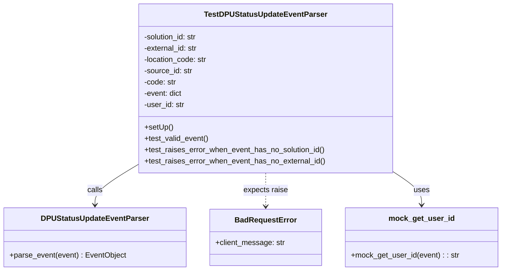

# Diagram: entity_core/entity_service/entity_service_tests/dpu/unit/test_dpu_event_parser.py


> Auto-generated by Obscura crawlers

## Diagram 1



### SVG

<svg id="container" width="1047.875" xmlns="http://www.w3.org/2000/svg" class="classDiagram" height="576" viewBox="0 0 1047.875 576" role="graphics-document document" aria-roledescription="class"><style>#container{font-family:"trebuchet ms",verdana,arial,sans-serif;font-size:16px;fill:#333;}@keyframes edge-animation-frame{from{stroke-dashoffset:0;}}@keyframes dash{to{stroke-dashoffset:0;}}#container .edge-animation-slow{stroke-dasharray:9,5!important;stroke-dashoffset:900;animation:dash 50s linear infinite;stroke-linecap:round;}#container .edge-animation-fast{stroke-dasharray:9,5!important;stroke-dashoffset:900;animation:dash 20s linear infinite;stroke-linecap:round;}#container .error-icon{fill:#552222;}#container .error-text{fill:#552222;stroke:#552222;}#container .edge-thickness-normal{stroke-width:1px;}#container .edge-thickness-thick{stroke-width:3.5px;}#container .edge-pattern-solid{stroke-dasharray:0;}#container .edge-thickness-invisible{stroke-width:0;fill:none;}#container .edge-pattern-dashed{stroke-dasharray:3;}#container .edge-pattern-dotted{stroke-dasharray:2;}#container .marker{fill:#333333;stroke:#333333;}#container .marker.cross{stroke:#333333;}#container svg{font-family:"trebuchet ms",verdana,arial,sans-serif;font-size:16px;}#container p{margin:0;}#container g.classGroup text{fill:#9370DB;stroke:none;font-family:"trebuchet ms",verdana,arial,sans-serif;font-size:10px;}#container g.classGroup text .title{font-weight:bolder;}#container .nodeLabel,#container .edgeLabel{color:#131300;}#container .edgeLabel .label rect{fill:#ECECFF;}#container .label text{fill:#131300;}#container .labelBkg{background:#ECECFF;}#container .edgeLabel .label span{background:#ECECFF;}#container .classTitle{font-weight:bolder;}#container .node rect,#container .node circle,#container .node ellipse,#container .node polygon,#container .node path{fill:#ECECFF;stroke:#9370DB;stroke-width:1px;}#container .divider{stroke:#9370DB;stroke-width:1;}#container g.clickable{cursor:pointer;}#container g.classGroup rect{fill:#ECECFF;stroke:#9370DB;}#container g.classGroup line{stroke:#9370DB;stroke-width:1;}#container .classLabel .box{stroke:none;stroke-width:0;fill:#ECECFF;opacity:0.5;}#container .classLabel .label{fill:#9370DB;font-size:10px;}#container .relation{stroke:#333333;stroke-width:1;fill:none;}#container .dashed-line{stroke-dasharray:3;}#container .dotted-line{stroke-dasharray:1 2;}#container #compositionStart,#container .composition{fill:#333333!important;stroke:#333333!important;stroke-width:1;}#container #compositionEnd,#container .composition{fill:#333333!important;stroke:#333333!important;stroke-width:1;}#container #dependencyStart,#container .dependency{fill:#333333!important;stroke:#333333!important;stroke-width:1;}#container #dependencyStart,#container .dependency{fill:#333333!important;stroke:#333333!important;stroke-width:1;}#container #extensionStart,#container .extension{fill:transparent!important;stroke:#333333!important;stroke-width:1;}#container #extensionEnd,#container .extension{fill:transparent!important;stroke:#333333!important;stroke-width:1;}#container #aggregationStart,#container .aggregation{fill:transparent!important;stroke:#333333!important;stroke-width:1;}#container #aggregationEnd,#container .aggregation{fill:transparent!important;stroke:#333333!important;stroke-width:1;}#container #lollipopStart,#container .lollipop{fill:#ECECFF!important;stroke:#333333!important;stroke-width:1;}#container #lollipopEnd,#container .lollipop{fill:#ECECFF!important;stroke:#333333!important;stroke-width:1;}#container .edgeTerminals{font-size:11px;line-height:initial;}#container .classTitleText{text-anchor:middle;font-size:18px;fill:#333;}#container .label-icon{display:inline-block;height:1em;overflow:visible;vertical-align:-0.125em;}#container .node .label-icon path{fill:currentColor;stroke:revert;stroke-width:revert;}#container :root{--mermaid-font-family:"trebuchet ms",verdana,arial,sans-serif;}</style><g><defs><marker id="container_class-aggregationStart" class="marker aggregation class" refX="18" refY="7" markerWidth="190" markerHeight="240" orient="auto"><path d="M 18,7 L9,13 L1,7 L9,1 Z"></path></marker></defs><defs><marker id="container_class-aggregationEnd" class="marker aggregation class" refX="1" refY="7" markerWidth="20" markerHeight="28" orient="auto"><path d="M 18,7 L9,13 L1,7 L9,1 Z"></path></marker></defs><defs><marker id="container_class-extensionStart" class="marker extension class" refX="18" refY="7" markerWidth="190" markerHeight="240" orient="auto"><path d="M 1,7 L18,13 V 1 Z"></path></marker></defs><defs><marker id="container_class-extensionEnd" class="marker extension class" refX="1" refY="7" markerWidth="20" markerHeight="28" orient="auto"><path d="M 1,1 V 13 L18,7 Z"></path></marker></defs><defs><marker id="container_class-compositionStart" class="marker composition class" refX="18" refY="7" markerWidth="190" markerHeight="240" orient="auto"><path d="M 18,7 L9,13 L1,7 L9,1 Z"></path></marker></defs><defs><marker id="container_class-compositionEnd" class="marker composition class" refX="1" refY="7" markerWidth="20" markerHeight="28" orient="auto"><path d="M 18,7 L9,13 L1,7 L9,1 Z"></path></marker></defs><defs><marker id="container_class-dependencyStart" class="marker dependency class" refX="6" refY="7" markerWidth="190" markerHeight="240" orient="auto"><path d="M 5,7 L9,13 L1,7 L9,1 Z"></path></marker></defs><defs><marker id="container_class-dependencyEnd" class="marker dependency class" refX="13" refY="7" markerWidth="20" markerHeight="28" orient="auto"><path d="M 18,7 L9,13 L14,7 L9,1 Z"></path></marker></defs><defs><marker id="container_class-lollipopStart" class="marker lollipop class" refX="13" refY="7" markerWidth="190" markerHeight="240" orient="auto"><circle stroke="black" fill="transparent" cx="7" cy="7" r="6"></circle></marker></defs><defs><marker id="container_class-lollipopEnd" class="marker lollipop class" refX="1" refY="7" markerWidth="190" markerHeight="240" orient="auto"><circle stroke="black" fill="transparent" cx="7" cy="7" r="6"></circle></marker></defs><g class="root"><g class="clusters"></g><g class="edgePaths"><path d="M287.16,350.396L272.224,359.497C257.288,368.597,227.415,386.799,212.479,401.066C197.543,415.333,197.543,425.667,197.543,430.833L197.543,436" id="id_TestDPUStatusUpdateEventParser_DPUStatusUpdateEventParser_1" class="edge-thickness-normal edge-pattern-solid relation" style=";;;" data-edge="true" data-et="edge" data-id="id_TestDPUStatusUpdateEventParser_DPUStatusUpdateEventParser_1" data-points="W3sieCI6Mjg3LjE2MDE1NjI1LCJ5IjozNTAuMzk1OTYxNTIzNjk2N30seyJ4IjoxOTcuNTQyOTY4NzUsInkiOjQwNX0seyJ4IjoxOTcuNTQyOTY4NzUsInkiOjQ0Mn1d" marker-end="url(#container_class-dependencyEnd)"></path><path d="M553.688,368L553.688,374.167C553.688,380.333,553.688,392.667,553.688,404.5C553.688,416.333,553.688,427.667,553.688,433.333L553.688,439" id="id_TestDPUStatusUpdateEventParser_BadRequestError_2" class="edge-thickness-normal edge-pattern-dashed relation" style=";;;" data-edge="true" data-et="edge" data-id="id_TestDPUStatusUpdateEventParser_BadRequestError_2" data-points="W3sieCI6NTUzLjY4NzUsInkiOjM2OH0seyJ4Ijo1NTMuNjg3NSwieSI6NDA1fSx7IngiOjU1My42ODc1LCJ5Ijo0NDV9XQ==" marker-end="url(#container_class-dependencyEnd)"></path><path d="M820.215,365.198L830.193,371.832C840.171,378.465,860.126,391.733,870.104,403.533C880.082,415.333,880.082,425.667,880.082,430.833L880.082,436" id="id_TestDPUStatusUpdateEventParser_mock_get_user_id_3" class="edge-thickness-normal edge-pattern-solid relation" style=";;;" data-edge="true" data-et="edge" data-id="id_TestDPUStatusUpdateEventParser_mock_get_user_id_3" data-points="W3sieCI6ODIwLjIxNDg0Mzc1LCJ5IjozNjUuMTk3OTI0NzY5OTE3NTZ9LHsieCI6ODgwLjA4MjAzMTI1LCJ5Ijo0MDV9LHsieCI6ODgwLjA4MjAzMTI1LCJ5Ijo0NDJ9XQ==" marker-end="url(#container_class-dependencyEnd)"></path></g><g class="edgeLabels"><g class="edgeLabel" transform="translate(197.54296875, 405)"><g class="label" data-id="id_TestDPUStatusUpdateEventParser_DPUStatusUpdateEventParser_1" transform="translate(-16.4453125, -12)"><foreignObject width="32.890625" height="24"><div xmlns="http://www.w3.org/1999/xhtml" class="labelBkg" style="display: table-cell; white-space: nowrap; line-height: 1.5; max-width: 200px; text-align: center;"><span class="edgeLabel"><p>calls</p></span></div></foreignObject></g></g><g class="edgeLabel" transform="translate(553.6875, 405)"><g class="label" data-id="id_TestDPUStatusUpdateEventParser_BadRequestError_2" transform="translate(-47.3671875, -12)"><foreignObject width="94.734375" height="24"><div xmlns="http://www.w3.org/1999/xhtml" class="labelBkg" style="display: table-cell; white-space: nowrap; line-height: 1.5; max-width: 200px; text-align: center;"><span class="edgeLabel"><p>expects raise</p></span></div></foreignObject></g></g><g class="edgeLabel" transform="translate(880.08203125, 405)"><g class="label" data-id="id_TestDPUStatusUpdateEventParser_mock_get_user_id_3" transform="translate(-16.4921875, -12)"><foreignObject width="32.984375" height="24"><div xmlns="http://www.w3.org/1999/xhtml" class="labelBkg" style="display: table-cell; white-space: nowrap; line-height: 1.5; max-width: 200px; text-align: center;"><span class="edgeLabel"><p>uses</p></span></div></foreignObject></g></g></g><g class="nodes"><g class="node default" id="classId-TestDPUStatusUpdateEventParser-0" transform="translate(553.6875, 188)"><g class="basic label-container"><path d="M-266.52734375 -180 L266.52734375 -180 L266.52734375 180 L-266.52734375 180" stroke="none" stroke-width="0" fill="#ECECFF" style=""></path><path d="M-266.52734375 -180 C-92.6556130842082 -180, 81.2161175815836 -180, 266.52734375 -180 M-266.52734375 -180 C-142.94049629831315 -180, -19.3536488466263 -180, 266.52734375 -180 M266.52734375 -180 C266.52734375 -48.32523328808773, 266.52734375 83.34953342382454, 266.52734375 180 M266.52734375 -180 C266.52734375 -61.958296099688994, 266.52734375 56.08340780062201, 266.52734375 180 M266.52734375 180 C154.12018253382712 180, 41.71302131765427 180, -266.52734375 180 M266.52734375 180 C90.19164415669599 180, -86.14405543660803 180, -266.52734375 180 M-266.52734375 180 C-266.52734375 98.89094808426543, -266.52734375 17.781896168530864, -266.52734375 -180 M-266.52734375 180 C-266.52734375 74.64801570424206, -266.52734375 -30.70396859151589, -266.52734375 -180" stroke="#9370DB" stroke-width="1.3" fill="none" stroke-dasharray="0 0" style=""></path></g><g class="annotation-group text" transform="translate(0, -156)"></g><g class="label-group text" transform="translate(-124.0078125, -156)"><g class="label" style="font-weight: bolder" transform="translate(0,-12)"><foreignObject width="248.015625" height="24"><div xmlns="http://www.w3.org/1999/xhtml" style="display: table-cell; white-space: nowrap; line-height: 1.5; max-width: 294px; text-align: center;"><span class="nodeLabel markdown-node-label" style=""><p>TestDPUStatusUpdateEventParser</p></span></div></foreignObject></g></g><g class="members-group text" transform="translate(-254.52734375, -108)"><g class="label" style="" transform="translate(0,-12)"><foreignObject width="116.1875" height="24"><div xmlns="http://www.w3.org/1999/xhtml" style="display: table-cell; white-space: nowrap; line-height: 1.5; max-width: 174px; text-align: center;"><span class="nodeLabel markdown-node-label" style=""><p>-solution_id: str</p></span></div></foreignObject></g><g class="label" style="" transform="translate(0,12)"><foreignObject width="115.734375" height="24"><div xmlns="http://www.w3.org/1999/xhtml" style="display: table-cell; white-space: nowrap; line-height: 1.5; max-width: 174px; text-align: center;"><span class="nodeLabel markdown-node-label" style=""><p>-external_id: str</p></span></div></foreignObject></g><g class="label" style="" transform="translate(0,36)"><foreignObject width="136.078125" height="24"><div xmlns="http://www.w3.org/1999/xhtml" style="display: table-cell; white-space: nowrap; line-height: 1.5; max-width: 194px; text-align: center;"><span class="nodeLabel markdown-node-label" style=""><p>-location_code: str</p></span></div></foreignObject></g><g class="label" style="" transform="translate(0,60)"><foreignObject width="103.90625" height="24"><div xmlns="http://www.w3.org/1999/xhtml" style="display: table-cell; white-space: nowrap; line-height: 1.5; max-width: 162px; text-align: center;"><span class="nodeLabel markdown-node-label" style=""><p>-source_id: str</p></span></div></foreignObject></g><g class="label" style="" transform="translate(0,84)"><foreignObject width="68.921875" height="24"><div xmlns="http://www.w3.org/1999/xhtml" style="display: table-cell; white-space: nowrap; line-height: 1.5; max-width: 127px; text-align: center;"><span class="nodeLabel markdown-node-label" style=""><p>-code: str</p></span></div></foreignObject></g><g class="label" style="" transform="translate(0,108)"><foreignObject width="82.4375" height="24"><div xmlns="http://www.w3.org/1999/xhtml" style="display: table-cell; white-space: nowrap; line-height: 1.5; max-width: 140px; text-align: center;"><span class="nodeLabel markdown-node-label" style=""><p>-event: dict</p></span></div></foreignObject></g><g class="label" style="" transform="translate(0,132)"><foreignObject width="86.765625" height="24"><div xmlns="http://www.w3.org/1999/xhtml" style="display: table-cell; white-space: nowrap; line-height: 1.5; max-width: 145px; text-align: center;"><span class="nodeLabel markdown-node-label" style=""><p>-user_id: str</p></span></div></foreignObject></g></g><g class="methods-group text" transform="translate(-254.52734375, 84)"><g class="label" style="" transform="translate(0,-12)"><foreignObject width="60.421875" height="24"><div xmlns="http://www.w3.org/1999/xhtml" style="display: table-cell; white-space: nowrap; line-height: 1.5; max-width: 118px; text-align: center;"><span class="nodeLabel markdown-node-label" style=""><p>+setUp()</p></span></div></foreignObject></g><g class="label" style="" transform="translate(0,12)"><foreignObject width="136.890625" height="24"><div xmlns="http://www.w3.org/1999/xhtml" style="display: table-cell; white-space: nowrap; line-height: 1.5; max-width: 194px; text-align: center;"><span class="nodeLabel markdown-node-label" style=""><p>+test_valid_event()</p></span></div></foreignObject></g><g class="label" style="" transform="translate(0,36)"><foreignObject width="385.046875" height="24"><div xmlns="http://www.w3.org/1999/xhtml" style="display: table-cell; white-space: nowrap; line-height: 1.5; max-width: 442px; text-align: center;"><span class="nodeLabel markdown-node-label" style=""><p>+test_raises_error_when_event_has_no_solution_id()</p></span></div></foreignObject></g><g class="label" style="" transform="translate(0,60)"><foreignObject width="384.28125" height="24"><div xmlns="http://www.w3.org/1999/xhtml" style="display: table-cell; white-space: nowrap; line-height: 1.5; max-width: 442px; text-align: center;"><span class="nodeLabel markdown-node-label" style=""><p>+test_raises_error_when_event_has_no_external_id()</p></span></div></foreignObject></g></g><g class="divider" style=""><path d="M-266.52734375 -132 C-58.91964083983447 -132, 148.68806207033106 -132, 266.52734375 -132 M-266.52734375 -132 C-148.63627926955598 -132, -30.74521478911197 -132, 266.52734375 -132" stroke="#9370DB" stroke-width="1.3" fill="none" stroke-dasharray="0 0" style=""></path></g><g class="divider" style=""><path d="M-266.52734375 60 C-150.76520562160482 60, -35.00306749320967 60, 266.52734375 60 M-266.52734375 60 C-56.25335049249691 60, 154.0206427650062 60, 266.52734375 60" stroke="#9370DB" stroke-width="1.3" fill="none" stroke-dasharray="0 0" style=""></path></g></g><g class="node default" id="classId-DPUStatusUpdateEventParser-1" transform="translate(197.54296875, 505)"><g class="basic label-container"><path d="M-189.54296875 -63 L189.54296875 -63 L189.54296875 63 L-189.54296875 63" stroke="none" stroke-width="0" fill="#ECECFF" style=""></path><path d="M-189.54296875 -63 C-74.76708074236033 -63, 40.00880726527933 -63, 189.54296875 -63 M-189.54296875 -63 C-73.9548114610664 -63, 41.6333458278672 -63, 189.54296875 -63 M189.54296875 -63 C189.54296875 -36.70898790940305, 189.54296875 -10.417975818806092, 189.54296875 63 M189.54296875 -63 C189.54296875 -20.592681198870864, 189.54296875 21.814637602258273, 189.54296875 63 M189.54296875 63 C63.90445681033336 63, -61.734055129333285 63, -189.54296875 63 M189.54296875 63 C74.18979854879811 63, -41.16337165240378 63, -189.54296875 63 M-189.54296875 63 C-189.54296875 29.281275573387333, -189.54296875 -4.437448853225334, -189.54296875 -63 M-189.54296875 63 C-189.54296875 24.482334274656075, -189.54296875 -14.035331450687849, -189.54296875 -63" stroke="#9370DB" stroke-width="1.3" fill="none" stroke-dasharray="0 0" style=""></path></g><g class="annotation-group text" transform="translate(0, -39)"></g><g class="label-group text" transform="translate(-108.7578125, -39)"><g class="label" style="font-weight: bolder" transform="translate(0,-12)"><foreignObject width="217.515625" height="24"><div xmlns="http://www.w3.org/1999/xhtml" style="display: table-cell; white-space: nowrap; line-height: 1.5; max-width: 265px; text-align: center;"><span class="nodeLabel markdown-node-label" style=""><p>DPUStatusUpdateEventParser</p></span></div></foreignObject></g></g><g class="members-group text" transform="translate(-177.54296875, 9)"></g><g class="methods-group text" transform="translate(-177.54296875, 39)"><g class="label" style="" transform="translate(0,-12)"><foreignObject width="246.328125" height="24"><div xmlns="http://www.w3.org/1999/xhtml" style="display: table-cell; white-space: nowrap; line-height: 1.5; max-width: 304px; text-align: center;"><span class="nodeLabel markdown-node-label" style=""><p>+parse_event(event) : EventObject</p></span></div></foreignObject></g></g><g class="divider" style=""><path d="M-189.54296875 -15 C-43.36100939730309 -15, 102.82094995539381 -15, 189.54296875 -15 M-189.54296875 -15 C-77.03315124041198 -15, 35.476666269176036 -15, 189.54296875 -15" stroke="#9370DB" stroke-width="1.3" fill="none" stroke-dasharray="0 0" style=""></path></g><g class="divider" style=""><path d="M-189.54296875 9 C-75.43561947476357 9, 38.67172980047286 9, 189.54296875 9 M-189.54296875 9 C-101.11091554356831 9, -12.678862337136621 9, 189.54296875 9" stroke="#9370DB" stroke-width="1.3" fill="none" stroke-dasharray="0 0" style=""></path></g></g><g class="node default" id="classId-BadRequestError-2" transform="translate(553.6875, 505)"><g class="basic label-container"><path d="M-116.6015625 -60 L116.6015625 -60 L116.6015625 60 L-116.6015625 60" stroke="none" stroke-width="0" fill="#ECECFF" style=""></path><path d="M-116.6015625 -60 C-48.3228061469012 -60, 19.9559502061976 -60, 116.6015625 -60 M-116.6015625 -60 C-53.488728059436866 -60, 9.624106381126268 -60, 116.6015625 -60 M116.6015625 -60 C116.6015625 -27.3480326462714, 116.6015625 5.303934707457202, 116.6015625 60 M116.6015625 -60 C116.6015625 -30.186274691276317, 116.6015625 -0.37254938255263426, 116.6015625 60 M116.6015625 60 C56.28603871611054 60, -4.029485067778921 60, -116.6015625 60 M116.6015625 60 C33.090756642503905 60, -50.42004921499219 60, -116.6015625 60 M-116.6015625 60 C-116.6015625 29.000232363484898, -116.6015625 -1.9995352730302045, -116.6015625 -60 M-116.6015625 60 C-116.6015625 30.852999419615834, -116.6015625 1.7059988392316683, -116.6015625 -60" stroke="#9370DB" stroke-width="1.3" fill="none" stroke-dasharray="0 0" style=""></path></g><g class="annotation-group text" transform="translate(0, -36)"></g><g class="label-group text" transform="translate(-62.28125, -36)"><g class="label" style="font-weight: bolder" transform="translate(0,-12)"><foreignObject width="124.5625" height="24"><div xmlns="http://www.w3.org/1999/xhtml" style="display: table-cell; white-space: nowrap; line-height: 1.5; max-width: 174px; text-align: center;"><span class="nodeLabel markdown-node-label" style=""><p>BadRequestError</p></span></div></foreignObject></g></g><g class="members-group text" transform="translate(-104.6015625, 12)"><g class="label" style="" transform="translate(0,-12)"><foreignObject width="146.921875" height="24"><div xmlns="http://www.w3.org/1999/xhtml" style="display: table-cell; white-space: nowrap; line-height: 1.5; max-width: 205px; text-align: center;"><span class="nodeLabel markdown-node-label" style=""><p>+client_message: str</p></span></div></foreignObject></g></g><g class="methods-group text" transform="translate(-104.6015625, 60)"></g><g class="divider" style=""><path d="M-116.6015625 -12 C-24.713571209465712 -12, 67.17442008106858 -12, 116.6015625 -12 M-116.6015625 -12 C-25.133449396678458 -12, 66.33466370664308 -12, 116.6015625 -12" stroke="#9370DB" stroke-width="1.3" fill="none" stroke-dasharray="0 0" style=""></path></g><g class="divider" style=""><path d="M-116.6015625 36 C-38.60030357800932 36, 39.400955343981366 36, 116.6015625 36 M-116.6015625 36 C-29.292349755835687 36, 58.016862988328626 36, 116.6015625 36" stroke="#9370DB" stroke-width="1.3" fill="none" stroke-dasharray="0 0" style=""></path></g></g><g class="node default" id="classId-mock_get_user_id-3" transform="translate(880.08203125, 505)"><g class="basic label-container"><path d="M-159.79296875 -63 L159.79296875 -63 L159.79296875 63 L-159.79296875 63" stroke="none" stroke-width="0" fill="#ECECFF" style=""></path><path d="M-159.79296875 -63 C-40.376288705900194 -63, 79.04039133819961 -63, 159.79296875 -63 M-159.79296875 -63 C-39.488611744583935 -63, 80.81574526083213 -63, 159.79296875 -63 M159.79296875 -63 C159.79296875 -15.942352870659526, 159.79296875 31.115294258680947, 159.79296875 63 M159.79296875 -63 C159.79296875 -17.066654980170014, 159.79296875 28.86669003965997, 159.79296875 63 M159.79296875 63 C95.79666886181285 63, 31.800368973625694 63, -159.79296875 63 M159.79296875 63 C44.53911555258456 63, -70.71473764483088 63, -159.79296875 63 M-159.79296875 63 C-159.79296875 22.211163184269644, -159.79296875 -18.577673631460712, -159.79296875 -63 M-159.79296875 63 C-159.79296875 36.791863032514236, -159.79296875 10.583726065028472, -159.79296875 -63" stroke="#9370DB" stroke-width="1.3" fill="none" stroke-dasharray="0 0" style=""></path></g><g class="annotation-group text" transform="translate(0, -39)"></g><g class="label-group text" transform="translate(-66.3515625, -39)"><g class="label" style="font-weight: bolder" transform="translate(0,-12)"><foreignObject width="132.703125" height="24"><div xmlns="http://www.w3.org/1999/xhtml" style="display: table-cell; white-space: nowrap; line-height: 1.5; max-width: 181px; text-align: center;"><span class="nodeLabel markdown-node-label" style=""><p>mock_get_user_id</p></span></div></foreignObject></g></g><g class="members-group text" transform="translate(-147.79296875, 9)"></g><g class="methods-group text" transform="translate(-147.79296875, 39)"><g class="label" style="" transform="translate(0,-12)"><foreignObject width="229.234375" height="24"><div xmlns="http://www.w3.org/1999/xhtml" style="display: table-cell; white-space: nowrap; line-height: 1.5; max-width: 287px; text-align: center;"><span class="nodeLabel markdown-node-label" style=""><p>+mock_get_user_id(event) : : str</p></span></div></foreignObject></g></g><g class="divider" style=""><path d="M-159.79296875 -15 C-94.5833218980884 -15, -29.3736750461768 -15, 159.79296875 -15 M-159.79296875 -15 C-56.21470724996196 -15, 47.36355425007608 -15, 159.79296875 -15" stroke="#9370DB" stroke-width="1.3" fill="none" stroke-dasharray="0 0" style=""></path></g><g class="divider" style=""><path d="M-159.79296875 9 C-92.87081777513794 9, -25.948666800275873 9, 159.79296875 9 M-159.79296875 9 C-42.86340392045429 9, 74.06616090909142 9, 159.79296875 9" stroke="#9370DB" stroke-width="1.3" fill="none" stroke-dasharray="0 0" style=""></path></g></g></g></g></g></svg>

## Diagram 2

```mermaid
sequenceDiagram
participant Test as TestDPUStatusUpdateEventParser
participant Helper as mock_get_user_id
participant Parser as DPUStatusUpdateEventParser
participant Error as BadRequestError
Test->>Helper: mock_get_user_id(event)
Helper-->>Test: "user123"
Test->>Parser: parse_event(event)
alt valid event
Parser-->>Test: EventObject (solution_id, external_id, location_code, source_id, code, user_id)
else missing solution_id or external_id
Parser-->>Error: raise BadRequestError("Missing path parameter: ...")
Error-->>Test: exception with client_message
```

> SVG rendering failed for this diagram.
