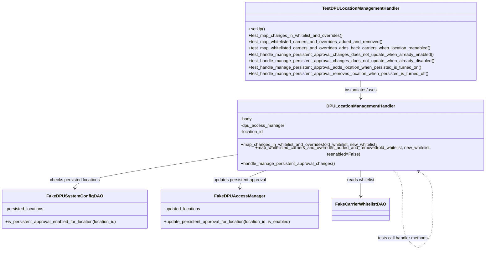
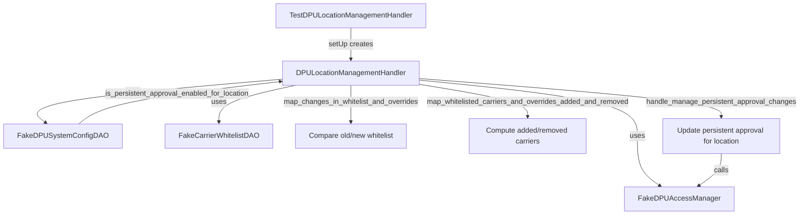

# Diagram: entity_core/entity_service/entity_service_tests/dpu/unit/test_dpu_location_management_handler.py

> Auto-generated by Obscura crawlers

## Diagram 1

### SVG

<svg id="container" width="1835.37890625" xmlns="http://www.w3.org/2000/svg" class="classDiagram" height="940.1499633789062" viewBox="0 0 1835.37890625 940.1499633789062" role="graphics-document document" aria-roledescription="class"><g><defs><marker id="container_class-aggregationStart" class="marker aggregation class" refX="18" refY="7" markerWidth="190" markerHeight="240" orient="auto"><path d="M 18,7 L9,13 L1,7 L9,1 Z"></path></marker></defs><defs><marker id="container_class-aggregationEnd" class="marker aggregation class" refX="1" refY="7" markerWidth="20" markerHeight="28" orient="auto"><path d="M 18,7 L9,13 L1,7 L9,1 Z"></path></marker></defs><defs><marker id="container_class-extensionStart" class="marker extension class" refX="18" refY="7" markerWidth="190" markerHeight="240" orient="auto"><path d="M 1,7 L18,13 V 1 Z"></path></marker></defs><defs><marker id="container_class-extensionEnd" class="marker extension class" refX="1" refY="7" markerWidth="20" markerHeight="28" orient="auto"><path d="M 1,1 V 13 L18,7 Z"></path></marker></defs><defs><marker id="container_class-compositionStart" class="marker composition class" refX="18" refY="7" markerWidth="190" markerHeight="240" orient="auto"><path d="M 18,7 L9,13 L1,7 L9,1 Z"></path></marker></defs><defs><marker id="container_class-compositionEnd" class="marker composition class" refX="1" refY="7" markerWidth="20" markerHeight="28" orient="auto"><path d="M 18,7 L9,13 L1,7 L9,1 Z"></path></marker></defs><defs><marker id="container_class-dependencyStart" class="marker dependency class" refX="6" refY="7" markerWidth="190" markerHeight="240" orient="auto"><path d="M 5,7 L9,13 L1,7 L9,1 Z"></path></marker></defs><defs><marker id="container_class-dependencyEnd" class="marker dependency class" refX="13" refY="7" markerWidth="20" markerHeight="28" orient="auto"><path d="M 18,7 L9,13 L14,7 L9,1 Z"></path></marker></defs><defs><marker id="container_class-lollipopStart" class="marker lollipop class" refX="13" refY="7" markerWidth="190" markerHeight="240" orient="auto"><circle stroke="black" fill="transparent" cx="7" cy="7" r="6"></circle></marker></defs><defs><marker id="container_class-lollipopEnd" class="marker lollipop class" refX="1" refY="7" markerWidth="190" markerHeight="240" orient="auto"><circle stroke="black" fill="transparent" cx="7" cy="7" r="6"></circle></marker></defs><g class="root"><g class="clusters"></g><g class="edgePaths"><path d="M1353.281,302L1353.281,308.167C1353.281,314.333,1353.281,326.667,1353.281,338C1353.281,349.333,1353.281,359.667,1353.281,364.833L1353.281,370" id="id_TestDPULocationManagementHandler_DPULocationManagementHandler_1" class="edge-thickness-normal edge-pattern-solid relation" style=";;;" data-edge="true" data-et="edge" data-id="id_TestDPULocationManagementHandler_DPULocationManagementHandler_1" data-points="W3sieCI6MTM1My4yODEyNSwieSI6MzAyfSx7IngiOjEzNTMuMjgxMjUsInkiOjMzOX0seyJ4IjoxMzUzLjI4MTI1LCJ5IjozNzZ9XQ==" marker-end="url(#container_class-dependencyEnd)"></path><path d="M879.184,570.752L779.56,586.46C679.936,602.168,480.689,633.584,381.065,656.459C281.441,679.333,281.441,693.667,281.441,700.833L281.441,708" id="id_DPULocationManagementHandler_FakeDPUSystemConfigDAO_2" class="edge-thickness-normal edge-pattern-solid relation" style=";;;" data-edge="true" data-et="edge" data-id="id_DPULocationManagementHandler_FakeDPUSystemConfigDAO_2" data-points="W3sieCI6ODc5LjE4MzU5Mzc1LCJ5Ijo1NzAuNzUyMzA5NjYwMzAyMn0seyJ4IjoyODEuNDQxNDA2MjUsInkiOjY2NX0seyJ4IjoyODEuNDQxNDA2MjUsInkiOjcxNH1d" marker-end="url(#container_class-dependencyEnd)"></path><path d="M1353.281,616L1353.281,624.167C1353.281,632.333,1353.281,648.667,1353.281,669C1353.281,689.333,1353.281,713.667,1353.281,725.833L1353.281,738" id="id_DPULocationManagementHandler_FakeCarrierWhitelistDAO_3" class="edge-thickness-normal edge-pattern-solid relation" style=";;;" data-edge="true" data-et="edge" data-id="id_DPULocationManagementHandler_FakeCarrierWhitelistDAO_3" data-points="W3sieCI6MTM1My4yODEyNSwieSI6NjE2fSx7IngiOjEzNTMuMjgxMjUsInkiOjY2NX0seyJ4IjoxMzUzLjI4MTI1LCJ5Ijo3NDR9XQ==" marker-end="url(#container_class-dependencyEnd)"></path><path d="M1033.749,616L1012.003,624.167C990.257,632.333,946.765,648.667,925.019,664C903.273,679.333,903.273,693.667,903.273,700.833L903.273,708" id="id_DPULocationManagementHandler_FakeDPUAccessManager_4" class="edge-thickness-normal edge-pattern-solid relation" style=";;;" data-edge="true" data-et="edge" data-id="id_DPULocationManagementHandler_FakeDPUAccessManager_4" data-points="W3sieCI6MTAzMy43NDkwNzU0NDM3ODcsInkiOjYxNn0seyJ4Ijo5MDMuMjczNDM3NSwieSI6NjY1fSx7IngiOjkwMy4yNzM0Mzc1LCJ5Ijo3MTR9XQ==" marker-end="url(#container_class-dependencyEnd)"></path><path d="M1460.974,616L1468.303,624.167C1475.632,632.333,1490.29,648.667,1497.619,676.992C1504.948,705.317,1504.948,745.633,1504.948,765.792L1504.948,785.95" id="DPULocationManagementHandler-cyclic-special-1" class="edge-thickness-normal edge-pattern-dashed relation" style=";;;" data-edge="true" data-et="edge" data-id="DPULocationManagementHandler-cyclic-special-1" data-points="W3sieCI6MTQ2MC45NzM5Mjc1MTUzMjIsInkiOjYxNn0seyJ4IjoxNTA0Ljk0ODQzNzUwMDc0NSwieSI6NjY1fSx7IngiOjE1MDQuOTQ4NDM3NTAwNzQ1LCJ5Ijo3ODUuOTQ5OTk5OTk5MjU0OX1d"></path><path d="M1504.948,786.05L1504.948,804.208C1504.948,822.367,1504.948,858.683,1514.674,883.011C1524.399,907.339,1543.85,919.679,1553.575,925.849L1563.301,932.018" id="DPULocationManagementHandler-cyclic-special-mid" class="edge-thickness-normal edge-pattern-dashed relation" style=";;;" data-edge="true" data-et="edge" data-id="DPULocationManagementHandler-cyclic-special-mid" data-points="W3sieCI6MTUwNC45NDg0Mzc1MDA3NDUsInkiOjc4Ni4wNTAwMDAwMDA3NDUxfSx7IngiOjE1MDQuOTQ4NDM3NTAwNzQ1LCJ5Ijo4OTV9LHsieCI6MTU2My4zMDA3ODEyNSwieSI6OTMyLjAxODI4MDM4Mjg1NDl9XQ=="></path><path d="M1563.401,932.018L1573.126,925.849C1582.852,919.679,1602.302,907.339,1612.028,883.003C1621.753,858.667,1621.753,822.333,1621.753,784C1621.753,745.667,1621.753,705.333,1609.626,677.533C1597.499,649.732,1573.244,634.464,1561.117,626.83L1548.99,619.196" id="DPULocationManagementHandler-cyclic-special-2" class="edge-thickness-normal edge-pattern-dashed relation" style=";;;" data-edge="true" data-et="edge" data-id="DPULocationManagementHandler-cyclic-special-2" data-points="W3sieCI6MTU2My40MDA3ODEyNTE0OTAxLCJ5Ijo5MzIuMDE4MjgwMzgyODU0OX0seyJ4IjoxNjIxLjc1MzEyNTAwMDc0NSwieSI6ODk1fSx7IngiOjE2MjEuNzUzMTI1MDAwNzQ1LCJ5Ijo3ODZ9LHsieCI6MTYyMS43NTMxMjUwMDA3NDUsInkiOjY2NX0seyJ4IjoxNTQzLjkxMjE2NzE2MDI5MjMsInkiOjYxNn1d" marker-end="url(#container_class-dependencyEnd)"></path></g><g class="edgeLabels"><g class="edgeLabel" transform="translate(1353.28125, 339)"><g class="label" data-id="id_TestDPULocationManagementHandler_DPULocationManagementHandler_1" transform="translate(-63.3203125, -12)"><foreignObject width="126.640625" height="24">

instantiates/uses

</foreignObject></g></g><g class="edgeLabel" transform="translate(281.44140625, 665)"><g class="label" data-id="id_DPULocationManagementHandler_FakeDPUSystemConfigDAO_2" transform="translate(-95.765625, -12)"><foreignObject width="191.53125" height="24">

checks persisted locations

</foreignObject></g></g><g class="edgeLabel" transform="translate(1353.28125, 665)"><g class="label" data-id="id_DPULocationManagementHandler_FakeCarrierWhitelistDAO_3" transform="translate(-53.15625, -12)"><foreignObject width="106.3125" height="24">

reads whitelist

</foreignObject></g></g><g class="edgeLabel" transform="translate(903.2734375, 665)"><g class="label" data-id="id_DPULocationManagementHandler_FakeDPUAccessManager_4" transform="translate(-100, -24)"><foreignObject width="200" height="48">

updates persistent approval

</foreignObject></g></g><g class="edgeLabel"><g class="label" data-id="DPULocationManagementHandler-cyclic-special-1" transform="translate(0, 0)"><foreignObject width="0" height="0">

</foreignObject></g></g><g class="edgeLabel" transform="translate(1504.948437500745, 895)"><g class="label" data-id="DPULocationManagementHandler-cyclic-special-mid" transform="translate(-96.8046875, -12)"><foreignObject width="193.609375" height="24">

tests call handler methods

</foreignObject></g></g><g class="edgeLabel"><g class="label" data-id="DPULocationManagementHandler-cyclic-special-2" transform="translate(0, 0)"><foreignObject width="0" height="0">

</foreignObject></g></g></g><g class="nodes"><g class="node default" id="classId-TestDPULocationManagementHandler-0" transform="translate(1353.28125, 155)"><g class="basic label-container"><path d="M-432.20703125 -147 L432.20703125 -147 L432.20703125 147 L-432.20703125 147" stroke="none" stroke-width="0" fill="#ECECFF" style=""></path><path d="M-432.20703125 -147 C-124.70322165008889 -147, 182.80058794982222 -147, 432.20703125 -147 M-432.20703125 -147 C-159.6225763570822 -147, 112.96187853583558 -147, 432.20703125 -147 M432.20703125 -147 C432.20703125 -30.90790954236168, 432.20703125 85.18418091527664, 432.20703125 147 M432.20703125 -147 C432.20703125 -68.01824486638048, 432.20703125 10.96351026723903, 432.20703125 147 M432.20703125 147 C210.15624511680485 147, -11.894541016390292 147, -432.20703125 147 M432.20703125 147 C243.44895660804357 147, 54.69088196608715 147, -432.20703125 147 M-432.20703125 147 C-432.20703125 58.58171433447147, -432.20703125 -29.83657133105706, -432.20703125 -147 M-432.20703125 147 C-432.20703125 62.176431811374684, -432.20703125 -22.647136377250632, -432.20703125 -147" stroke="#9370DB" stroke-width="1.3" fill="none" stroke-dasharray="0 0" style=""></path></g><g class="annotation-group text" transform="translate(0, -123)"></g><g class="label-group text" transform="translate(-138.0234375, -123)"><g class="label" style="font-weight: bolder" transform="translate(0,-12)"><foreignObject width="276.046875" height="24">

TestDPULocationManagementHandler

</foreignObject></g></g><g class="members-group text" transform="translate(-420.20703125, -75)"></g><g class="methods-group text" transform="translate(-420.20703125, -45)"><g class="label" style="" transform="translate(0,-12)"><foreignObject width="60.421875" height="24">

+setUp()

</foreignObject></g><g class="label" style="" transform="translate(0,12)"><foreignObject width="357.09375" height="24">

+test_map_changes_in_whitelist_and_overrides()

</foreignObject></g><g class="label" style="" transform="translate(0,36)"><foreignObject width="510.046875" height="24">

+test_map_whitelisted_carriers_and_overrides_added_and_removed()

</foreignObject></g><g class="label" style="" transform="translate(0,60)"><foreignObject width="692.703125" height="24">

+test_map_whitelisted_carriers_and_overrides_adds_back_carriers_when_location_reenabled()

</foreignObject></g><g class="label" style="" transform="translate(0,84)"><foreignObject width="699.09375" height="24">

+test_handle_manage_persistent_approval_changes_does_not_update_when_already_enabled()

</foreignObject></g><g class="label" style="" transform="translate(0,108)"><foreignObject width="702.390625" height="24">

+test_handle_manage_persistent_approval_changes_does_not_update_when_already_disabled()

</foreignObject></g><g class="label" style="" transform="translate(0,132)"><foreignObject width="658.78125" height="24">

+test_handle_manage_persistent_approval_adds_location_when_persisted_is_turned_on()

</foreignObject></g><g class="label" style="" transform="translate(0,156)"><foreignObject width="686.53125" height="24">

+test_handle_manage_persistent_approval_removes_location_when_persisted_is_turned_off()

</foreignObject></g></g><g class="divider" style=""><path d="M-432.20703125 -99 C-166.17887181240422 -99, 99.84928762519155 -99, 432.20703125 -99 M-432.20703125 -99 C-121.58528067633813 -99, 189.03646989732374 -99, 432.20703125 -99" stroke="#9370DB" stroke-width="1.3" fill="none" stroke-dasharray="0 0" style=""></path></g><g class="divider" style=""><path d="M-432.20703125 -75 C-131.66484159027482 -75, 168.87734806945036 -75, 432.20703125 -75 M-432.20703125 -75 C-248.5658535594527 -75, -64.92467586890541 -75, 432.20703125 -75" stroke="#9370DB" stroke-width="1.3" fill="none" stroke-dasharray="0 0" style=""></path></g></g><g class="node default" id="classId-DPULocationManagementHandler-1" transform="translate(1353.28125, 496)"><g class="basic label-container"><path d="M-474.09765625 -120 L474.09765625 -120 L474.09765625 120 L-474.09765625 120" stroke="none" stroke-width="0" fill="#ECECFF" style=""></path><path d="M-474.09765625 -120 C-155.45236053966323 -120, 163.19293517067354 -120, 474.09765625 -120 M-474.09765625 -120 C-96.48481318764857 -120, 281.12802987470286 -120, 474.09765625 -120 M474.09765625 -120 C474.09765625 -69.9706156211449, 474.09765625 -19.94123124228979, 474.09765625 120 M474.09765625 -120 C474.09765625 -32.317186475935515, 474.09765625 55.36562704812897, 474.09765625 120 M474.09765625 120 C283.6712112109889 120, 93.24476617197769 120, -474.09765625 120 M474.09765625 120 C178.8281147005166 120, -116.44142684896678 120, -474.09765625 120 M-474.09765625 120 C-474.09765625 65.7986833706845, -474.09765625 11.597366741368987, -474.09765625 -120 M-474.09765625 120 C-474.09765625 41.66269000460005, -474.09765625 -36.6746199907999, -474.09765625 -120" stroke="#9370DB" stroke-width="1.3" fill="none" stroke-dasharray="0 0" style=""></path></g><g class="annotation-group text" transform="translate(0, -96)"></g><g class="label-group text" transform="translate(-122.7734375, -96)"><g class="label" style="font-weight: bolder" transform="translate(0,-12)"><foreignObject width="245.546875" height="24">

DPULocationManagementHandler

</foreignObject></g></g><g class="members-group text" transform="translate(-462.09765625, -48)"><g class="label" style="" transform="translate(0,-12)"><foreignObject width="42.75" height="24">

-body

</foreignObject></g><g class="label" style="" transform="translate(0,12)"><foreignObject width="161" height="24">

-dpu_access_manager

</foreignObject></g><g class="label" style="" transform="translate(0,36)"><foreignObject width="88.015625" height="24">

-location_id

</foreignObject></g></g><g class="methods-group text" transform="translate(-462.09765625, 48)"><g class="label" style="" transform="translate(0,-12)"><foreignObject width="522.390625" height="24">

+map_changes_in_whitelist_and_overrides(old_whitelist, new_whitelist)

</foreignObject></g><g class="label" style="" transform="translate(0,12)"><foreignObject width="801.421875" height="24">

+map_whitelisted_carriers_and_overrides_added_and_removed(old_whitelist, new_whitelist, reenabled=False)

</foreignObject></g><g class="label" style="" transform="translate(0,36)"><foreignObject width="353.75" height="24">

+handle_manage_persistent_approval_changes()

</foreignObject></g></g><g class="divider" style=""><path d="M-474.09765625 -72 C-109.67717176372616 -72, 254.74331272254767 -72, 474.09765625 -72 M-474.09765625 -72 C-106.94697869643659 -72, 260.2036988571268 -72, 474.09765625 -72" stroke="#9370DB" stroke-width="1.3" fill="none" stroke-dasharray="0 0" style=""></path></g><g class="divider" style=""><path d="M-474.09765625 24 C-120.52299847364088 24, 233.05165930271824 24, 474.09765625 24 M-474.09765625 24 C-150.56870428197084 24, 172.96024768605832 24, 474.09765625 24" stroke="#9370DB" stroke-width="1.3" fill="none" stroke-dasharray="0 0" style=""></path></g></g><g class="node default" id="classId-FakeDPUSystemConfigDAO-2" transform="translate(281.44140625, 786)"><g class="basic label-container"><path d="M-273.44140625 -72 L273.44140625 -72 L273.44140625 72 L-273.44140625 72" stroke="none" stroke-width="0" fill="#ECECFF" style=""></path><path d="M-273.44140625 -72 C-144.17811488794698 -72, -14.91482352589395 -72, 273.44140625 -72 M-273.44140625 -72 C-104.4859020345377 -72, 64.4696021809246 -72, 273.44140625 -72 M273.44140625 -72 C273.44140625 -15.57832834592569, 273.44140625 40.84334330814862, 273.44140625 72 M273.44140625 -72 C273.44140625 -41.48416169756355, 273.44140625 -10.9683233951271, 273.44140625 72 M273.44140625 72 C64.62230211819269 72, -144.19680201361462 72, -273.44140625 72 M273.44140625 72 C54.69854473259326 72, -164.04431678481347 72, -273.44140625 72 M-273.44140625 72 C-273.44140625 42.35343543185887, -273.44140625 12.70687086371774, -273.44140625 -72 M-273.44140625 72 C-273.44140625 31.37017437862356, -273.44140625 -9.25965124275288, -273.44140625 -72" stroke="#9370DB" stroke-width="1.3" fill="none" stroke-dasharray="0 0" style=""></path></g><g class="annotation-group text" transform="translate(0, -48)"></g><g class="label-group text" transform="translate(-96.4765625, -48)"><g class="label" style="font-weight: bolder" transform="translate(0,-12)"><foreignObject width="192.953125" height="24">

FakeDPUSystemConfigDAO

</foreignObject></g></g><g class="members-group text" transform="translate(-261.44140625, 0)"><g class="label" style="" transform="translate(0,-12)"><foreignObject width="148.6875" height="24">

-persisted_locations

</foreignObject></g></g><g class="methods-group text" transform="translate(-261.44140625, 48)"><g class="label" style="" transform="translate(0,-12)"><foreignObject width="426.40625" height="24">

+is_persistent_approval_enabled_for_location(location_id)

</foreignObject></g></g><g class="divider" style=""><path d="M-273.44140625 -24 C-95.64289361237849 -24, 82.15561902524303 -24, 273.44140625 -24 M-273.44140625 -24 C-63.23573498301744 -24, 146.96993628396513 -24, 273.44140625 -24" stroke="#9370DB" stroke-width="1.3" fill="none" stroke-dasharray="0 0" style=""></path></g><g class="divider" style=""><path d="M-273.44140625 24 C-76.91184654975416 24, 119.61771315049168 24, 273.44140625 24 M-273.44140625 24 C-80.7470674666425 24, 111.94727131671499 24, 273.44140625 24" stroke="#9370DB" stroke-width="1.3" fill="none" stroke-dasharray="0 0" style=""></path></g></g><g class="node default" id="classId-FakeDPUAccessManager-3" transform="translate(903.2734375, 786)"><g class="basic label-container"><path d="M-298.390625 -72 L298.390625 -72 L298.390625 72 L-298.390625 72" stroke="none" stroke-width="0" fill="#ECECFF" style=""></path><path d="M-298.390625 -72 C-135.65750103787772 -72, 27.075622924244556 -72, 298.390625 -72 M-298.390625 -72 C-95.6520169181226 -72, 107.0865911637548 -72, 298.390625 -72 M298.390625 -72 C298.390625 -20.543029857840153, 298.390625 30.913940284319693, 298.390625 72 M298.390625 -72 C298.390625 -14.403043660571647, 298.390625 43.193912678856705, 298.390625 72 M298.390625 72 C94.85090545760087 72, -108.68881408479825 72, -298.390625 72 M298.390625 72 C178.49866240333841 72, 58.60669980667686 72, -298.390625 72 M-298.390625 72 C-298.390625 16.37295628293105, -298.390625 -39.2540874341379, -298.390625 -72 M-298.390625 72 C-298.390625 42.12221446731957, -298.390625 12.244428934639146, -298.390625 -72" stroke="#9370DB" stroke-width="1.3" fill="none" stroke-dasharray="0 0" style=""></path></g><g class="annotation-group text" transform="translate(0, -48)"></g><g class="label-group text" transform="translate(-87.265625, -48)"><g class="label" style="font-weight: bolder" transform="translate(0,-12)"><foreignObject width="174.53125" height="24">

FakeDPUAccessManager

</foreignObject></g></g><g class="members-group text" transform="translate(-286.390625, 0)"><g class="label" style="" transform="translate(0,-12)"><foreignObject width="142.15625" height="24">

-updated_locations

</foreignObject></g></g><g class="methods-group text" transform="translate(-286.390625, 48)"><g class="label" style="" transform="translate(0,-12)"><foreignObject width="485.515625" height="24">

+update_persistent_approval_for_location(location_id, is_enabled)

</foreignObject></g></g><g class="divider" style=""><path d="M-298.390625 -24 C-87.38531424964577 -24, 123.61999650070845 -24, 298.390625 -24 M-298.390625 -24 C-95.1641545390977 -24, 108.06231592180461 -24, 298.390625 -24" stroke="#9370DB" stroke-width="1.3" fill="none" stroke-dasharray="0 0" style=""></path></g><g class="divider" style=""><path d="M-298.390625 24 C-151.169624860668 24, -3.948624721335989 24, 298.390625 24 M-298.390625 24 C-79.96330852304598 24, 138.46400795390804 24, 298.390625 24" stroke="#9370DB" stroke-width="1.3" fill="none" stroke-dasharray="0 0" style=""></path></g></g><g class="node default" id="classId-FakeCarrierWhitelistDAO-4" transform="translate(1353.28125, 786)"><g class="basic label-container"><path d="M-101.6171875 -42 L101.6171875 -42 L101.6171875 42 L-101.6171875 42" stroke="none" stroke-width="0" fill="#ECECFF" style=""></path><path d="M-101.6171875 -42 C-41.82474091982076 -42, 17.967705660358476 -42, 101.6171875 -42 M-101.6171875 -42 C-56.92963740842611 -42, -12.24208731685222 -42, 101.6171875 -42 M101.6171875 -42 C101.6171875 -19.936179846808077, 101.6171875 2.127640306383846, 101.6171875 42 M101.6171875 -42 C101.6171875 -9.64422222830023, 101.6171875 22.71155554339954, 101.6171875 42 M101.6171875 42 C49.483118693895385 42, -2.6509501122092303 42, -101.6171875 42 M101.6171875 42 C25.65768817382424 42, -50.30181115235152 42, -101.6171875 42 M-101.6171875 42 C-101.6171875 18.876784270242474, -101.6171875 -4.246431459515051, -101.6171875 -42 M-101.6171875 42 C-101.6171875 11.960442103252134, -101.6171875 -18.07911579349573, -101.6171875 -42" stroke="#9370DB" stroke-width="1.3" fill="none" stroke-dasharray="0 0" style=""></path></g><g class="annotation-group text" transform="translate(0, -18)"></g><g class="label-group text" transform="translate(-89.6171875, -18)"><g class="label" style="font-weight: bolder" transform="translate(0,-12)"><foreignObject width="179.234375" height="24">

FakeCarrierWhitelistDAO

</foreignObject></g></g><g class="members-group text" transform="translate(-89.6171875, 30)"></g><g class="methods-group text" transform="translate(-89.6171875, 60)"></g><g class="divider" style=""><path d="M-101.6171875 6 C-35.168209491951686 6, 31.28076851609663 6, 101.6171875 6 M-101.6171875 6 C-50.61759529988492 6, 0.3819969002301633 6, 101.6171875 6" stroke="#9370DB" stroke-width="1.3" fill="none" stroke-dasharray="0 0" style=""></path></g><g class="divider" style=""><path d="M-101.6171875 24 C-41.38157939217258 24, 18.854028715654835 24, 101.6171875 24 M-101.6171875 24 C-58.94966861599416 24, -16.282149731988326 24, 101.6171875 24" stroke="#9370DB" stroke-width="1.3" fill="none" stroke-dasharray="0 0" style=""></path></g></g><g class="label edgeLabel" id="DPULocationManagementHandler---DPULocationManagementHandler---1" transform="translate(1504.948437500745, 786)"><rect width="0.1" height="0.1"></rect><g class="label" style="" transform="translate(0, 0)"><rect></rect><foreignObject width="0" height="0">

</foreignObject></g></g><g class="label edgeLabel" id="DPULocationManagementHandler---DPULocationManagementHandler---2" transform="translate(1563.350781250745, 932.0500000007451)"><rect width="0.1" height="0.1"></rect><g class="label" style="" transform="translate(0, 0)"><rect></rect><foreignObject width="0" height="0">

</foreignObject></g></g></g></g></g></svg>

## Diagram 2

### SVG

<svg id="container" width="1785.14453125" xmlns="http://www.w3.org/2000/svg" class="flowchart" height="478" viewBox="0 0 1785.14453125 478" role="graphics-document document" aria-roledescription="flowchart-v2"><g><marker id="container_flowchart-v2-pointEnd" class="marker flowchart-v2" viewBox="0 0 10 10" refX="5" refY="5" markerUnits="userSpaceOnUse" markerWidth="8" markerHeight="8" orient="auto"><path d="M 0 0 L 10 5 L 0 10 z" class="arrowMarkerPath" style="stroke-width: 1; stroke-dasharray: 1, 0;"></path></marker><marker id="container_flowchart-v2-pointStart" class="marker flowchart-v2" viewBox="0 0 10 10" refX="4.5" refY="5" markerUnits="userSpaceOnUse" markerWidth="8" markerHeight="8" orient="auto"><path d="M 0 5 L 10 10 L 10 0 z" class="arrowMarkerPath" style="stroke-width: 1; stroke-dasharray: 1, 0;"></path></marker><marker id="container_flowchart-v2-circleEnd" class="marker flowchart-v2" viewBox="0 0 10 10" refX="11" refY="5" markerUnits="userSpaceOnUse" markerWidth="11" markerHeight="11" orient="auto"><circle cx="5" cy="5" r="5" class="arrowMarkerPath" style="stroke-width: 1; stroke-dasharray: 1, 0;"></circle></marker><marker id="container_flowchart-v2-circleStart" class="marker flowchart-v2" viewBox="0 0 10 10" refX="-1" refY="5" markerUnits="userSpaceOnUse" markerWidth="11" markerHeight="11" orient="auto"><circle cx="5" cy="5" r="5" class="arrowMarkerPath" style="stroke-width: 1; stroke-dasharray: 1, 0;"></circle></marker><marker id="container_flowchart-v2-crossEnd" class="marker cross flowchart-v2" viewBox="0 0 11 11" refX="12" refY="5.2" markerUnits="userSpaceOnUse" markerWidth="11" markerHeight="11" orient="auto"><path d="M 1,1 l 9,9 M 10,1 l -9,9" class="arrowMarkerPath" style="stroke-width: 2; stroke-dasharray: 1, 0;"></path></marker><marker id="container_flowchart-v2-crossStart" class="marker cross flowchart-v2" viewBox="0 0 11 11" refX="-1" refY="5.2" markerUnits="userSpaceOnUse" markerWidth="11" markerHeight="11" orient="auto"><path d="M 1,1 l 9,9 M 10,1 l -9,9" class="arrowMarkerPath" style="stroke-width: 2; stroke-dasharray: 1, 0;"></path></marker><g class="root"><g class="clusters"></g><g class="edgePaths"><path d="M774.301,62L774.301,68.167C774.301,74.333,774.301,86.667,774.301,98.333C774.301,110,774.301,121,774.301,126.5L774.301,132" id="L_TS_H_0" class="edge-thickness-normal edge-pattern-solid edge-thickness-normal edge-pattern-solid flowchart-link" style=";" data-edge="true" data-et="edge" data-id="L_TS_H_0" data-points="W3sieCI6Nzc0LjMwMDc4MTI1LCJ5Ijo2Mn0seyJ4Ijo3NzQuMzAwNzgxMjUsInkiOjk5fSx7IngiOjc3NC4zMDA3ODEyNSwieSI6MTM2fV0=" marker-end="url(#container_flowchart-v2-pointEnd)"></path><path d="M622.41,176.11L524.139,184.591C425.868,193.073,229.327,210.037,141.257,226.281C53.188,242.526,73.59,258.052,83.791,265.815L93.993,273.578" id="L_H_FDAO_0" class="edge-thickness-normal edge-pattern-solid edge-thickness-normal edge-pattern-solid flowchart-link" style=";" data-edge="true" data-et="edge" data-id="L_H_FDAO_0" data-points="W3sieCI6NjIyLjQxMDE1NjI1LCJ5IjoxNzYuMTA5NjM2MDkxNjE5OH0seyJ4IjozMi43ODUxNTYyNSwieSI6MjI3fSx7IngiOjk3LjE3NTcyOTg1MTk3MzY4LCJ5IjoyNzZ9XQ==" marker-end="url(#container_flowchart-v2-pointEnd)"></path><path d="M649.571,190L621.083,196.167C592.595,202.333,535.62,214.667,507.132,228.333C478.645,242,478.645,257,478.645,264.5L478.645,272" id="L_H_CDAO_0" class="edge-thickness-normal edge-pattern-solid edge-thickness-normal edge-pattern-solid flowchart-link" style=";" data-edge="true" data-et="edge" data-id="L_H_CDAO_0" data-points="W3sieCI6NjQ5LjU3MDgwMDc4MTI1LCJ5IjoxOTB9LHsieCI6NDc4LjY0NDUzMTI1LCJ5IjoyMjd9LHsieCI6NDc4LjY0NDUzMTI1LCJ5IjoyNzZ9XQ==" marker-end="url(#container_flowchart-v2-pointEnd)"></path><path d="M926.191,178.015L1008.783,186.179C1091.374,194.343,1256.556,210.672,1339.147,231.502C1421.738,252.333,1421.738,277.667,1421.738,303C1421.738,328.333,1421.738,353.667,1430.23,372.124C1438.723,390.582,1455.707,402.164,1464.199,407.955L1472.691,413.746" id="L_H_AM_0" class="edge-thickness-normal edge-pattern-solid edge-thickness-normal edge-pattern-solid flowchart-link" style=";" data-edge="true" data-et="edge" data-id="L_H_AM_0" data-points="W3sieCI6OTI2LjE5MTQwNjI1LCJ5IjoxNzguMDE0NTc2Njk2NTkyMzR9LHsieCI6MTQyMS43MzgyODEyNSwieSI6MjI3fSx7IngiOjE0MjEuNzM4MjgxMjUsInkiOjMwM30seyJ4IjoxNDIxLjczODI4MTI1LCJ5IjozNzl9LHsieCI6MTQ3NS45OTYyMTU4MjAzMTI1LCJ5Ijo0MTZ9XQ==" marker-end="url(#container_flowchart-v2-pointEnd)"></path><path d="M774.301,190L774.301,196.167C774.301,202.333,774.301,214.667,774.301,228.333C774.301,242,774.301,257,774.301,264.5L774.301,272" id="L_H_M1_0" class="edge-thickness-normal edge-pattern-solid edge-thickness-normal edge-pattern-solid flowchart-link" style=";" data-edge="true" data-et="edge" data-id="L_H_M1_0" data-points="W3sieCI6Nzc0LjMwMDc4MTI1LCJ5IjoxOTB9LHsieCI6Nzc0LjMwMDc4MTI1LCJ5IjoyMjd9LHsieCI6Nzc0LjMwMDc4MTI1LCJ5IjoyNzZ9XQ==" marker-end="url(#container_flowchart-v2-pointEnd)"></path><path d="M926.191,187.335L967.454,193.946C1008.717,200.557,1091.243,213.778,1132.507,225.889C1173.77,238,1173.77,249,1173.77,254.5L1173.77,260" id="L_H_M2_0" class="edge-thickness-normal edge-pattern-solid edge-thickness-normal edge-pattern-solid flowchart-link" style=";" data-edge="true" data-et="edge" data-id="L_H_M2_0" data-points="W3sieCI6OTI2LjE5MTQwNjI1LCJ5IjoxODcuMzM0ODE5NjgyMzkwNjd9LHsieCI6MTE3My43Njk1MzEyNSwieSI6MjI3fSx7IngiOjExNzMuNzY5NTMxMjUsInkiOjI2NH1d" marker-end="url(#container_flowchart-v2-pointEnd)"></path><path d="M926.191,174.64L1040.066,183.367C1153.941,192.093,1381.691,209.547,1495.566,223.773C1609.441,238,1609.441,249,1609.441,254.5L1609.441,260" id="L_H_U_0" class="edge-thickness-normal edge-pattern-solid edge-thickness-normal edge-pattern-solid flowchart-link" style=";" data-edge="true" data-et="edge" data-id="L_H_U_0" data-points="W3sieCI6OTI2LjE5MTQwNjI1LCJ5IjoxNzQuNjM5OTU1ODQ1NzU5NTJ9LHsieCI6MTYwOS40NDE0MDYyNSwieSI6MjI3fSx7IngiOjE2MDkuNDQxNDA2MjUsInkiOjI2NH1d" marker-end="url(#container_flowchart-v2-pointEnd)"></path><path d="M1609.441,342L1609.441,348.167C1609.441,354.333,1609.441,366.667,1600.949,378.624C1592.457,390.582,1575.473,402.164,1566.98,407.955L1558.488,413.746" id="L_U_AM_0" class="edge-thickness-normal edge-pattern-solid edge-thickness-normal edge-pattern-solid flowchart-link" style=";" data-edge="true" data-et="edge" data-id="L_U_AM_0" data-points="W3sieCI6MTYwOS40NDE0MDYyNSwieSI6MzQyfSx7IngiOjE2MDkuNDQxNDA2MjUsInkiOjM3OX0seyJ4IjoxNTU1LjE4MzQ3MTY3OTY4NzUsInkiOjQxNn1d" marker-end="url(#container_flowchart-v2-pointEnd)"></path><path d="M168.137,276L178.869,267.833C189.6,259.667,211.064,243.333,286.114,227.569C361.164,211.804,489.801,196.608,554.119,189.01L618.438,181.412" id="L_FDAO_H_0" class="edge-thickness-normal edge-pattern-solid edge-thickness-normal edge-pattern-solid flowchart-link" style=";" data-edge="true" data-et="edge" data-id="L_FDAO_H_0" data-points="W3sieCI6MTY4LjEzNjc3MDE0ODAyNjMsInkiOjI3Nn0seyJ4IjoyMzIuNTI3MzQzNzUsInkiOjIyN30seyJ4Ijo2MjIuNDEwMTU2MjUsInkiOjE4MC45NDI5MjQ3MTE5NTU4fV0=" marker-end="url(#container_flowchart-v2-pointEnd)"></path></g><g class="edgeLabels"><g class="edgeLabel" transform="translate(774.30078125, 99)"><g class="label" data-id="L_TS_H_0" transform="translate(-49.3203125, -12)"><foreignObject width="98.640625" height="24">

setUp creates

</foreignObject></g></g><g class="edgeLabel" transform="translate(287.29029, 205.03374)"><g class="label" data-id="L_H_FDAO_0" transform="translate(-16.4921875, -12)"><foreignObject width="32.984375" height="24">

uses

</foreignObject></g></g><g class="edgeLabel" transform="translate(478.64453125, 227)"><g class="label" data-id="L_H_CDAO_0" transform="translate(-16.4921875, -12)"><foreignObject width="32.984375" height="24">

uses

</foreignObject></g></g><g class="edgeLabel" transform="translate(1421.73828125, 303)"><g class="label" data-id="L_H_AM_0" transform="translate(-16.4921875, -12)"><foreignObject width="32.984375" height="24">

uses

</foreignObject></g></g><g class="edgeLabel" transform="translate(774.30078125, 227)"><g class="label" data-id="L_H_M1_0" transform="translate(-151.5, -12)"><foreignObject width="303" height="24">

map_changes_in_whitelist_and_overrides

</foreignObject></g></g><g class="edgeLabel" transform="translate(1173.76953125, 227)"><g class="label" data-id="L_H_M2_0" transform="translate(-227.96875, -12)"><foreignObject width="455.9375" height="24">

map_whitelisted_carriers_and_overrides_added_and_removed

</foreignObject></g></g><g class="edgeLabel" transform="translate(1609.44140625, 227)"><g class="label" data-id="L_H_U_0" transform="translate(-167.703125, -12)"><foreignObject width="335.40625" height="24">

handle_manage_persistent_approval_changes

</foreignObject></g></g><g class="edgeLabel" transform="translate(1609.44140625, 379)"><g class="label" data-id="L_U_AM_0" transform="translate(-16.4453125, -12)"><foreignObject width="32.890625" height="24">

calls

</foreignObject></g></g><g class="edgeLabel" transform="translate(387.2909, 208.71769)"><g class="label" data-id="L_FDAO_H_0" transform="translate(-163.25, -12)"><foreignObject width="326.5" height="24">

is_persistent_approval_enabled_for_location

</foreignObject></g></g></g><g class="nodes"><g class="node default" id="flowchart-TS-0" transform="translate(774.30078125, 35)"><rect class="basic label-container" style="" x="-166.5703125" y="-27" width="333.140625" height="54"></rect><g class="label" style="" transform="translate(-136.5703125, -12)"><rect></rect><foreignObject width="273.140625" height="24">

TestDPULocationManagementHandler

</foreignObject></g></g><g class="node default" id="flowchart-H-1" transform="translate(774.30078125, 163)"><rect class="basic label-container" style="" x="-151.890625" y="-27" width="303.78125" height="54"></rect><g class="label" style="" transform="translate(-121.890625, -12)"><rect></rect><foreignObject width="243.78125" height="24">

DPULocationManagementHandler

</foreignObject></g></g><g class="node default" id="flowchart-FDAO-2" transform="translate(132.65625, 303)"><rect class="basic label-container" style="" x="-124.65625" y="-27" width="249.3125" height="54"></rect><g class="label" style="" transform="translate(-94.65625, -12)"><rect></rect><foreignObject width="189.3125" height="24">

FakeDPUSystemConfigDAO

</foreignObject></g></g><g class="node default" id="flowchart-CDAO-3" transform="translate(478.64453125, 303)"><rect class="basic label-container" style="" x="-117.8359375" y="-27" width="235.671875" height="54"></rect><g class="label" style="" transform="translate(-87.8359375, -12)"><rect></rect><foreignObject width="175.671875" height="24">

FakeCarrierWhitelistDAO

</foreignObject></g></g><g class="node default" id="flowchart-AM-4" transform="translate(1515.58984375, 443)"><rect class="basic label-container" style="" x="-115.8828125" y="-27" width="231.765625" height="54"></rect><g class="label" style="" transform="translate(-85.8828125, -12)"><rect></rect><foreignObject width="171.765625" height="24">

FakeDPUAccessManager

</foreignObject></g></g><g class="node default" id="flowchart-M1-5" transform="translate(774.30078125, 303)"><rect class="basic label-container" style="" x="-127.8203125" y="-27" width="255.640625" height="54"></rect><g class="label" style="" transform="translate(-97.8203125, -12)"><rect></rect><foreignObject width="195.640625" height="24">

Compare old/new whitelist

</foreignObject></g></g><g class="node default" id="flowchart-M2-6" transform="translate(1173.76953125, 303)"><rect class="basic label-container" style="" x="-130" y="-39" width="260" height="78"></rect><g class="label" style="" transform="translate(-100, -24)"><rect></rect><foreignObject width="200" height="48">

Compute added/removed carriers

</foreignObject></g></g><g class="node default" id="flowchart-U-7" transform="translate(1609.44140625, 303)"><rect class="basic label-container" style="" x="-130" y="-39" width="260" height="78"></rect><g class="label" style="" transform="translate(-100, -24)"><rect></rect><foreignObject width="200" height="48">

Update persistent approval for location

</foreignObject></g></g></g></g></g></svg>
