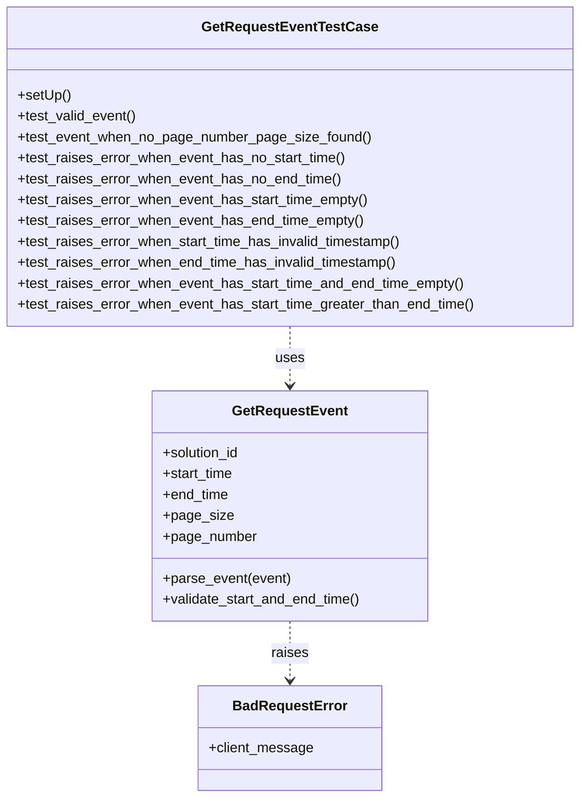
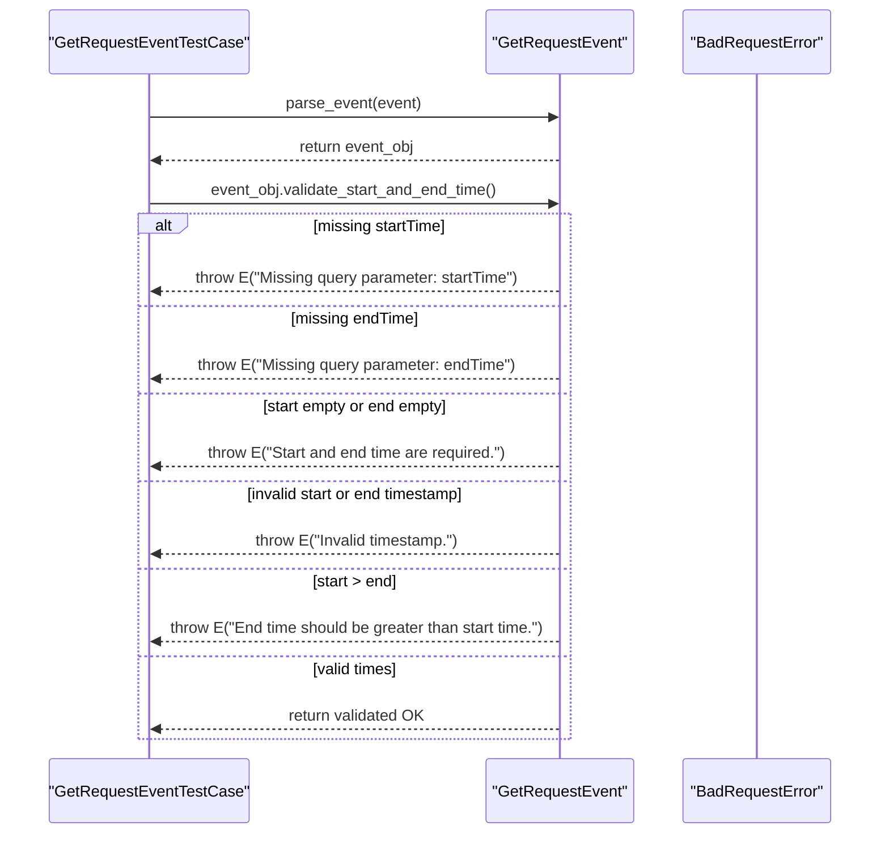

# Diagram: entity_core/entity_service/entity_service_tests/dpu/unit/test_dpu_state_change_history_request.py

> Auto-generated by Obscura crawlers

## Diagram 1

### SVG

<svg id="container" width="662.015625" xmlns="http://www.w3.org/2000/svg" class="classDiagram" height="914" viewBox="0 0 662.015625 914" role="graphics-document document" aria-roledescription="class"><g><defs><marker id="container_class-aggregationStart" class="marker aggregation class" refX="18" refY="7" markerWidth="190" markerHeight="240" orient="auto"><path d="M 18,7 L9,13 L1,7 L9,1 Z"></path></marker></defs><defs><marker id="container_class-aggregationEnd" class="marker aggregation class" refX="1" refY="7" markerWidth="20" markerHeight="28" orient="auto"><path d="M 18,7 L9,13 L1,7 L9,1 Z"></path></marker></defs><defs><marker id="container_class-extensionStart" class="marker extension class" refX="18" refY="7" markerWidth="190" markerHeight="240" orient="auto"><path d="M 1,7 L18,13 V 1 Z"></path></marker></defs><defs><marker id="container_class-extensionEnd" class="marker extension class" refX="1" refY="7" markerWidth="20" markerHeight="28" orient="auto"><path d="M 1,1 V 13 L18,7 Z"></path></marker></defs><defs><marker id="container_class-compositionStart" class="marker composition class" refX="18" refY="7" markerWidth="190" markerHeight="240" orient="auto"><path d="M 18,7 L9,13 L1,7 L9,1 Z"></path></marker></defs><defs><marker id="container_class-compositionEnd" class="marker composition class" refX="1" refY="7" markerWidth="20" markerHeight="28" orient="auto"><path d="M 18,7 L9,13 L1,7 L9,1 Z"></path></marker></defs><defs><marker id="container_class-dependencyStart" class="marker dependency class" refX="6" refY="7" markerWidth="190" markerHeight="240" orient="auto"><path d="M 5,7 L9,13 L1,7 L9,1 Z"></path></marker></defs><defs><marker id="container_class-dependencyEnd" class="marker dependency class" refX="13" refY="7" markerWidth="20" markerHeight="28" orient="auto"><path d="M 18,7 L9,13 L14,7 L9,1 Z"></path></marker></defs><defs><marker id="container_class-lollipopStart" class="marker lollipop class" refX="13" refY="7" markerWidth="190" markerHeight="240" orient="auto"><circle stroke="black" fill="transparent" cx="7" cy="7" r="6"></circle></marker></defs><defs><marker id="container_class-lollipopEnd" class="marker lollipop class" refX="1" refY="7" markerWidth="190" markerHeight="240" orient="auto"><circle stroke="black" fill="transparent" cx="7" cy="7" r="6"></circle></marker></defs><g class="root"><g class="clusters"></g><g class="edgePaths"><path d="M331.008,374L331.008,380.167C331.008,386.333,331.008,398.667,331.008,410C331.008,421.333,331.008,431.667,331.008,436.833L331.008,442" id="id_GetRequestEventTestCase_GetRequestEvent_1" class="edge-thickness-normal edge-pattern-dashed relation" style=";;;" data-edge="true" data-et="edge" data-id="id_GetRequestEventTestCase_GetRequestEvent_1" data-points="W3sieCI6MzMxLjAwNzgxMjUsInkiOjM3NH0seyJ4IjozMzEuMDA3ODEyNSwieSI6NDExfSx7IngiOjMzMS4wMDc4MTI1LCJ5Ijo0NDh9XQ==" marker-end="url(#container_class-dependencyEnd)"></path><path d="M331.008,712L331.008,718.167C331.008,724.333,331.008,736.667,331.008,748C331.008,759.333,331.008,769.667,331.008,774.833L331.008,780" id="id_GetRequestEvent_BadRequestError_2" class="edge-thickness-normal edge-pattern-dashed relation" style=";;;" data-edge="true" data-et="edge" data-id="id_GetRequestEvent_BadRequestError_2" data-points="W3sieCI6MzMxLjAwNzgxMjUsInkiOjcxMn0seyJ4IjozMzEuMDA3ODEyNSwieSI6NzQ5fSx7IngiOjMzMS4wMDc4MTI1LCJ5Ijo3ODZ9XQ==" marker-end="url(#container_class-dependencyEnd)"></path></g><g class="edgeLabels"><g class="edgeLabel" transform="translate(331.0078125, 411)"><g class="label" data-id="id_GetRequestEventTestCase_GetRequestEvent_1" transform="translate(-16.4921875, -12)"><foreignObject width="32.984375" height="24">

uses

</foreignObject></g></g><g class="edgeLabel" transform="translate(331.0078125, 749)"><g class="label" data-id="id_GetRequestEvent_BadRequestError_2" transform="translate(-21.25, -12)"><foreignObject width="42.5" height="24">

raises

</foreignObject></g></g></g><g class="nodes"><g class="node default" id="classId-GetRequestEventTestCase-0" transform="translate(331.0078125, 191)"><g class="basic label-container"><path d="M-323.0078125 -183 L323.0078125 -183 L323.0078125 183 L-323.0078125 183" stroke="none" stroke-width="0" fill="#ECECFF" style=""></path><path d="M-323.0078125 -183 C-156.97913726170432 -183, 9.049537976591353 -183, 323.0078125 -183 M-323.0078125 -183 C-184.46258398928222 -183, -45.917355478564446 -183, 323.0078125 -183 M323.0078125 -183 C323.0078125 -47.065232871749544, 323.0078125 88.86953425650091, 323.0078125 183 M323.0078125 -183 C323.0078125 -62.69170848515448, 323.0078125 57.61658302969104, 323.0078125 183 M323.0078125 183 C66.0782403465517 183, -190.8513318068966 183, -323.0078125 183 M323.0078125 183 C75.86761786581101 183, -171.27257676837797 183, -323.0078125 183 M-323.0078125 183 C-323.0078125 94.4525050529656, -323.0078125 5.905010105931211, -323.0078125 -183 M-323.0078125 183 C-323.0078125 55.038207868626586, -323.0078125 -72.92358426274683, -323.0078125 -183" stroke="#9370DB" stroke-width="1.3" fill="none" stroke-dasharray="0 0" style=""></path></g><g class="annotation-group text" transform="translate(0, -159)"></g><g class="label-group text" transform="translate(-95.203125, -159)"><g class="label" style="font-weight: bolder" transform="translate(0,-12)"><foreignObject width="190.40625" height="24">

GetRequestEventTestCase

</foreignObject></g></g><g class="members-group text" transform="translate(-311.0078125, -111)"></g><g class="methods-group text" transform="translate(-311.0078125, -81)"><g class="label" style="" transform="translate(0,-12)"><foreignObject width="60.421875" height="24">

+setUp()

</foreignObject></g><g class="label" style="" transform="translate(0,12)"><foreignObject width="136.890625" height="24">

+test_valid_event()

</foreignObject></g><g class="label" style="" transform="translate(0,36)"><foreignObject width="403.359375" height="24">

+test_event_when_no_page_number_page_size_found()

</foreignObject></g><g class="label" style="" transform="translate(0,60)"><foreignObject width="377.34375" height="24">

+test_raises_error_when_event_has_no_start_time()

</foreignObject></g><g class="label" style="" transform="translate(0,84)"><foreignObject width="370.890625" height="24">

+test_raises_error_when_event_has_no_end_time()

</foreignObject></g><g class="label" style="" transform="translate(0,108)"><foreignObject width="403.796875" height="24">

+test_raises_error_when_event_has_start_time_empty()

</foreignObject></g><g class="label" style="" transform="translate(0,132)"><foreignObject width="397.359375" height="24">

+test_raises_error_when_event_has_end_time_empty()

</foreignObject></g><g class="label" style="" transform="translate(0,156)"><foreignObject width="444.765625" height="24">

+test_raises_error_when_start_time_has_invalid_timestamp()

</foreignObject></g><g class="label" style="" transform="translate(0,180)"><foreignObject width="438.3125" height="24">

+test_raises_error_when_end_time_has_invalid_timestamp()

</foreignObject></g><g class="label" style="" transform="translate(0,204)"><foreignObject width="515.515625" height="24">

+test_raises_error_when_event_has_start_time_and_end_time_empty()

</foreignObject></g><g class="label" style="" transform="translate(0,228)"><foreignObject width="526.8125" height="24">

+test_raises_error_when_event_has_start_time_greater_than_end_time()

</foreignObject></g></g><g class="divider" style=""><path d="M-323.0078125 -135 C-134.2738886866575 -135, 54.460035126685 -135, 323.0078125 -135 M-323.0078125 -135 C-95.56514983225131 -135, 131.87751283549738 -135, 323.0078125 -135" stroke="#9370DB" stroke-width="1.3" fill="none" stroke-dasharray="0 0" style=""></path></g><g class="divider" style=""><path d="M-323.0078125 -111 C-164.2749521005671 -111, -5.542091701134211 -111, 323.0078125 -111 M-323.0078125 -111 C-91.83995067214187 -111, 139.32791115571627 -111, 323.0078125 -111" stroke="#9370DB" stroke-width="1.3" fill="none" stroke-dasharray="0 0" style=""></path></g></g><g class="node default" id="classId-GetRequestEvent-1" transform="translate(331.0078125, 580)"><g class="basic label-container"><path d="M-158.37890625 -132 L158.37890625 -132 L158.37890625 132 L-158.37890625 132" stroke="none" stroke-width="0" fill="#ECECFF" style=""></path><path d="M-158.37890625 -132 C-44.839615449780425 -132, 68.69967535043915 -132, 158.37890625 -132 M-158.37890625 -132 C-80.06890707850755 -132, -1.7589079070151001 -132, 158.37890625 -132 M158.37890625 -132 C158.37890625 -61.80801705531357, 158.37890625 8.38396588937286, 158.37890625 132 M158.37890625 -132 C158.37890625 -47.18282340714222, 158.37890625 37.634353185715554, 158.37890625 132 M158.37890625 132 C42.63814544733985 132, -73.1026153553203 132, -158.37890625 132 M158.37890625 132 C54.55796519470846 132, -49.26297586058308 132, -158.37890625 132 M-158.37890625 132 C-158.37890625 63.53307950620939, -158.37890625 -4.93384098758122, -158.37890625 -132 M-158.37890625 132 C-158.37890625 39.60612982008651, -158.37890625 -52.787740359826984, -158.37890625 -132" stroke="#9370DB" stroke-width="1.3" fill="none" stroke-dasharray="0 0" style=""></path></g><g class="annotation-group text" transform="translate(0, -108)"></g><g class="label-group text" transform="translate(-62.8515625, -108)"><g class="label" style="font-weight: bolder" transform="translate(0,-12)"><foreignObject width="125.703125" height="24">

GetRequestEvent

</foreignObject></g></g><g class="members-group text" transform="translate(-146.37890625, -60)"><g class="label" style="" transform="translate(0,-12)"><foreignObject width="90.21875" height="24">

+solution_id

</foreignObject></g><g class="label" style="" transform="translate(0,12)"><foreignObject width="82.5" height="24">

+start_time

</foreignObject></g><g class="label" style="" transform="translate(0,36)"><foreignObject width="76.375" height="24">

+end_time

</foreignObject></g><g class="label" style="" transform="translate(0,60)"><foreignObject width="78.25" height="24">

+page_size

</foreignObject></g><g class="label" style="" transform="translate(0,84)"><foreignObject width="107.46875" height="24">

+page_number

</foreignObject></g></g><g class="methods-group text" transform="translate(-146.37890625, 84)"><g class="label" style="" transform="translate(0,-12)"><foreignObject width="146.890625" height="24">

+parse_event(event)

</foreignObject></g><g class="label" style="" transform="translate(0,12)"><foreignObject width="229.90625" height="24">

+validate_start_and_end_time()

</foreignObject></g></g><g class="divider" style=""><path d="M-158.37890625 -84 C-91.8436905941374 -84, -25.3084749382748 -84, 158.37890625 -84 M-158.37890625 -84 C-39.63278575841099 -84, 79.11333473317802 -84, 158.37890625 -84" stroke="#9370DB" stroke-width="1.3" fill="none" stroke-dasharray="0 0" style=""></path></g><g class="divider" style=""><path d="M-158.37890625 60 C-42.390833819628426 60, 73.59723861074315 60, 158.37890625 60 M-158.37890625 60 C-44.86177600196514 60, 68.65535424606972 60, 158.37890625 60" stroke="#9370DB" stroke-width="1.3" fill="none" stroke-dasharray="0 0" style=""></path></g></g><g class="node default" id="classId-BadRequestError-2" transform="translate(331.0078125, 846)"><g class="basic label-container"><path d="M-102.8515625 -60 L102.8515625 -60 L102.8515625 60 L-102.8515625 60" stroke="none" stroke-width="0" fill="#ECECFF" style=""></path><path d="M-102.8515625 -60 C-25.921814762388223 -60, 51.007932975223554 -60, 102.8515625 -60 M-102.8515625 -60 C-37.2956698786368 -60, 28.2602227427264 -60, 102.8515625 -60 M102.8515625 -60 C102.8515625 -25.77203129258158, 102.8515625 8.45593741483684, 102.8515625 60 M102.8515625 -60 C102.8515625 -15.957596615715943, 102.8515625 28.084806768568114, 102.8515625 60 M102.8515625 60 C27.972943612079916 60, -46.90567527584017 60, -102.8515625 60 M102.8515625 60 C27.488560977719473 60, -47.874440544561054 60, -102.8515625 60 M-102.8515625 60 C-102.8515625 13.791104722567411, -102.8515625 -32.41779055486518, -102.8515625 -60 M-102.8515625 60 C-102.8515625 13.809158531769626, -102.8515625 -32.38168293646075, -102.8515625 -60" stroke="#9370DB" stroke-width="1.3" fill="none" stroke-dasharray="0 0" style=""></path></g><g class="annotation-group text" transform="translate(0, -36)"></g><g class="label-group text" transform="translate(-62.28125, -36)"><g class="label" style="font-weight: bolder" transform="translate(0,-12)"><foreignObject width="124.5625" height="24">

BadRequestError

</foreignObject></g></g><g class="members-group text" transform="translate(-90.8515625, 12)"><g class="label" style="" transform="translate(0,-12)"><foreignObject width="119.421875" height="24">

+client_message

</foreignObject></g></g><g class="methods-group text" transform="translate(-90.8515625, 60)"></g><g class="divider" style=""><path d="M-102.8515625 -12 C-21.690117891116543 -12, 59.471326717766914 -12, 102.8515625 -12 M-102.8515625 -12 C-40.607372528486714 -12, 21.636817443026573 -12, 102.8515625 -12" stroke="#9370DB" stroke-width="1.3" fill="none" stroke-dasharray="0 0" style=""></path></g><g class="divider" style=""><path d="M-102.8515625 36 C-32.28869285160863 36, 38.27417679678274 36, 102.8515625 36 M-102.8515625 36 C-36.5763487189097 36, 29.6988650621806 36, 102.8515625 36" stroke="#9370DB" stroke-width="1.3" fill="none" stroke-dasharray="0 0" style=""></path></g></g></g></g></g></svg>

## Diagram 2

### SVG

<svg id="container" width="952.5" xmlns="http://www.w3.org/2000/svg" height="883" viewBox="-50 -10 952.5 883" role="graphics-document document" aria-roledescription="sequence"><g><rect x="696.5" y="797" fill="#eaeaea" stroke="#666" width="156" height="65" name="E" rx="3" ry="3" class="actor actor-bottom"></rect><text x="774.5" y="829.5" dominant-baseline="central" alignment-baseline="central" class="actor actor-box" style="text-anchor: middle; font-size: 16px; font-weight: 400;"><tspan x="774.5" dy="0">"BadRequestError"</tspan></text></g><g><rect x="490.5" y="797" fill="#eaeaea" stroke="#666" width="156" height="65" name="G" rx="3" ry="3" class="actor actor-bottom"></rect><text x="568.5" y="829.5" dominant-baseline="central" alignment-baseline="central" class="actor actor-box" style="text-anchor: middle; font-size: 16px; font-weight: 400;"><tspan x="568.5" dy="0">"GetRequestEvent"</tspan></text></g><g><rect x="0" y="797" fill="#eaeaea" stroke="#666" width="219" height="65" name="TestCase" rx="3" ry="3" class="actor actor-bottom"></rect><text x="109.5" y="829.5" dominant-baseline="central" alignment-baseline="central" class="actor actor-box" style="text-anchor: middle; font-size: 16px; font-weight: 400;"><tspan x="109.5" dy="0">"GetRequestEventTestCase"</tspan></text></g><g><line id="actor2" x1="774.5" y1="65" x2="774.5" y2="797" class="actor-line 200" stroke-width="0.5px" stroke="#999" name="E"></line><g id="root-2"><rect x="696.5" y="0" fill="#eaeaea" stroke="#666" width="156" height="65" name="E" rx="3" ry="3" class="actor actor-top"></rect><text x="774.5" y="32.5" dominant-baseline="central" alignment-baseline="central" class="actor actor-box" style="text-anchor: middle; font-size: 16px; font-weight: 400;"><tspan x="774.5" dy="0">"BadRequestError"</tspan></text></g></g><g><line id="actor1" x1="568.5" y1="65" x2="568.5" y2="797" class="actor-line 200" stroke-width="0.5px" stroke="#999" name="G"></line><g id="root-1"><rect x="490.5" y="0" fill="#eaeaea" stroke="#666" width="156" height="65" name="G" rx="3" ry="3" class="actor actor-top"></rect><text x="568.5" y="32.5" dominant-baseline="central" alignment-baseline="central" class="actor actor-box" style="text-anchor: middle; font-size: 16px; font-weight: 400;"><tspan x="568.5" dy="0">"GetRequestEvent"</tspan></text></g></g><g><line id="actor0" x1="109.5" y1="65" x2="109.5" y2="797" class="actor-line 200" stroke-width="0.5px" stroke="#999" name="TestCase"></line><g id="root-0"><rect x="0" y="0" fill="#eaeaea" stroke="#666" width="219" height="65" name="TestCase" rx="3" ry="3" class="actor actor-top"></rect><text x="109.5" y="32.5" dominant-baseline="central" alignment-baseline="central" class="actor actor-box" style="text-anchor: middle; font-size: 16px; font-weight: 400;"><tspan x="109.5" dy="0">"GetRequestEventTestCase"</tspan></text></g></g><g></g><defs><symbol id="computer" width="24" height="24"><path transform="scale(.5)" d="M2 2v13h20v-13h-20zm18 11h-16v-9h16v9zm-10.228 6l.466-1h3.524l.467 1h-4.457zm14.228 3h-24l2-6h2.104l-1.33 4h18.45l-1.297-4h2.073l2 6zm-5-10h-14v-7h14v7z"></path></symbol></defs><defs><symbol id="database" fill-rule="evenodd" clip-rule="evenodd"><path transform="scale(.5)" d="M12.258.001l.256.004.255.005.253.008.251.01.249.012.247.015.246.016.242.019.241.02.239.023.236.024.233.027.231.028.229.031.225.032.223.034.22.036.217.038.214.04.211.041.208.043.205.045.201.046.198.048.194.05.191.051.187.053.183.054.18.056.175.057.172.059.168.06.163.061.16.063.155.064.15.066.074.033.073.033.071.034.07.034.069.035.068.035.067.035.066.035.064.036.064.036.062.036.06.036.06.037.058.037.058.037.055.038.055.038.053.038.052.038.051.039.05.039.048.039.047.039.045.04.044.04.043.04.041.04.04.041.039.041.037.041.036.041.034.041.033.042.032.042.03.042.029.042.027.042.026.043.024.043.023.043.021.043.02.043.018.044.017.043.015.044.013.044.012.044.011.045.009.044.007.045.006.045.004.045.002.045.001.045v17l-.001.045-.002.045-.004.045-.006.045-.007.045-.009.044-.011.045-.012.044-.013.044-.015.044-.017.043-.018.044-.02.043-.021.043-.023.043-.024.043-.026.043-.027.042-.029.042-.03.042-.032.042-.033.042-.034.041-.036.041-.037.041-.039.041-.04.041-.041.04-.043.04-.044.04-.045.04-.047.039-.048.039-.05.039-.051.039-.052.038-.053.038-.055.038-.055.038-.058.037-.058.037-.06.037-.06.036-.062.036-.064.036-.064.036-.066.035-.067.035-.068.035-.069.035-.07.034-.071.034-.073.033-.074.033-.15.066-.155.064-.16.063-.163.061-.168.06-.172.059-.175.057-.18.056-.183.054-.187.053-.191.051-.194.05-.198.048-.201.046-.205.045-.208.043-.211.041-.214.04-.217.038-.22.036-.223.034-.225.032-.229.031-.231.028-.233.027-.236.024-.239.023-.241.02-.242.019-.246.016-.247.015-.249.012-.251.01-.253.008-.255.005-.256.004-.258.001-.258-.001-.256-.004-.255-.005-.253-.008-.251-.01-.249-.012-.247-.015-.245-.016-.243-.019-.241-.02-.238-.023-.236-.024-.234-.027-.231-.028-.228-.031-.226-.032-.223-.034-.22-.036-.217-.038-.214-.04-.211-.041-.208-.043-.204-.045-.201-.046-.198-.048-.195-.05-.19-.051-.187-.053-.184-.054-.179-.056-.176-.057-.172-.059-.167-.06-.164-.061-.159-.063-.155-.064-.151-.066-.074-.033-.072-.033-.072-.034-.07-.034-.069-.035-.068-.035-.067-.035-.066-.035-.064-.036-.063-.036-.062-.036-.061-.036-.06-.037-.058-.037-.057-.037-.056-.038-.055-.038-.053-.038-.052-.038-.051-.039-.049-.039-.049-.039-.046-.039-.046-.04-.044-.04-.043-.04-.041-.04-.04-.041-.039-.041-.037-.041-.036-.041-.034-.041-.033-.042-.032-.042-.03-.042-.029-.042-.027-.042-.026-.043-.024-.043-.023-.043-.021-.043-.02-.043-.018-.044-.017-.043-.015-.044-.013-.044-.012-.044-.011-.045-.009-.044-.007-.045-.006-.045-.004-.045-.002-.045-.001-.045v-17l.001-.045.002-.045.004-.045.006-.045.007-.045.009-.044.011-.045.012-.044.013-.044.015-.044.017-.043.018-.044.02-.043.021-.043.023-.043.024-.043.026-.043.027-.042.029-.042.03-.042.032-.042.033-.042.034-.041.036-.041.037-.041.039-.041.04-.041.041-.04.043-.04.044-.04.046-.04.046-.039.049-.039.049-.039.051-.039.052-.038.053-.038.055-.038.056-.038.057-.037.058-.037.06-.037.061-.036.062-.036.063-.036.064-.036.066-.035.067-.035.068-.035.069-.035.07-.034.072-.034.072-.033.074-.033.151-.066.155-.064.159-.063.164-.061.167-.06.172-.059.176-.057.179-.056.184-.054.187-.053.19-.051.195-.05.198-.048.201-.046.204-.045.208-.043.211-.041.214-.04.217-.038.22-.036.223-.034.226-.032.228-.031.231-.028.234-.027.236-.024.238-.023.241-.02.243-.019.245-.016.247-.015.249-.012.251-.01.253-.008.255-.005.256-.004.258-.001.258.001zm-9.258 20.499v.01l.001.021.003.021.004.022.005.021.006.022.007.022.009.023.01.022.011.023.012.023.013.023.015.023.016.024.017.023.018.024.019.024.021.024.022.025.023.024.024.025.052.049.056.05.061.051.066.051.07.051.075.051.079.052.084.052.088.052.092.052.097.052.102.051.105.052.11.052.114.051.119.051.123.051.127.05.131.05.135.05.139.048.144.049.147.047.152.047.155.047.16.045.163.045.167.043.171.043.176.041.178.041.183.039.187.039.19.037.194.035.197.035.202.033.204.031.209.03.212.029.216.027.219.025.222.024.226.021.23.02.233.018.236.016.24.015.243.012.246.01.249.008.253.005.256.004.259.001.26-.001.257-.004.254-.005.25-.008.247-.011.244-.012.241-.014.237-.016.233-.018.231-.021.226-.021.224-.024.22-.026.216-.027.212-.028.21-.031.205-.031.202-.034.198-.034.194-.036.191-.037.187-.039.183-.04.179-.04.175-.042.172-.043.168-.044.163-.045.16-.046.155-.046.152-.047.148-.048.143-.049.139-.049.136-.05.131-.05.126-.05.123-.051.118-.052.114-.051.11-.052.106-.052.101-.052.096-.052.092-.052.088-.053.083-.051.079-.052.074-.052.07-.051.065-.051.06-.051.056-.05.051-.05.023-.024.023-.025.021-.024.02-.024.019-.024.018-.024.017-.024.015-.023.014-.024.013-.023.012-.023.01-.023.01-.022.008-.022.006-.022.006-.022.004-.022.004-.021.001-.021.001-.021v-4.127l-.077.055-.08.053-.083.054-.085.053-.087.052-.09.052-.093.051-.095.05-.097.05-.1.049-.102.049-.105.048-.106.047-.109.047-.111.046-.114.045-.115.045-.118.044-.12.043-.122.042-.124.042-.126.041-.128.04-.13.04-.132.038-.134.038-.135.037-.138.037-.139.035-.142.035-.143.034-.144.033-.147.032-.148.031-.15.03-.151.03-.153.029-.154.027-.156.027-.158.026-.159.025-.161.024-.162.023-.163.022-.165.021-.166.02-.167.019-.169.018-.169.017-.171.016-.173.015-.173.014-.175.013-.175.012-.177.011-.178.01-.179.008-.179.008-.181.006-.182.005-.182.004-.184.003-.184.002h-.37l-.184-.002-.184-.003-.182-.004-.182-.005-.181-.006-.179-.008-.179-.008-.178-.01-.176-.011-.176-.012-.175-.013-.173-.014-.172-.015-.171-.016-.17-.017-.169-.018-.167-.019-.166-.02-.165-.021-.163-.022-.162-.023-.161-.024-.159-.025-.157-.026-.156-.027-.155-.027-.153-.029-.151-.03-.15-.03-.148-.031-.146-.032-.145-.033-.143-.034-.141-.035-.14-.035-.137-.037-.136-.037-.134-.038-.132-.038-.13-.04-.128-.04-.126-.041-.124-.042-.122-.042-.12-.044-.117-.043-.116-.045-.113-.045-.112-.046-.109-.047-.106-.047-.105-.048-.102-.049-.1-.049-.097-.05-.095-.05-.093-.052-.09-.051-.087-.052-.085-.053-.083-.054-.08-.054-.077-.054v4.127zm0-5.654v.011l.001.021.003.021.004.021.005.022.006.022.007.022.009.022.01.022.011.023.012.023.013.023.015.024.016.023.017.024.018.024.019.024.021.024.022.024.023.025.024.024.052.05.056.05.061.05.066.051.07.051.075.052.079.051.084.052.088.052.092.052.097.052.102.052.105.052.11.051.114.051.119.052.123.05.127.051.131.05.135.049.139.049.144.048.147.048.152.047.155.046.16.045.163.045.167.044.171.042.176.042.178.04.183.04.187.038.19.037.194.036.197.034.202.033.204.032.209.03.212.028.216.027.219.025.222.024.226.022.23.02.233.018.236.016.24.014.243.012.246.01.249.008.253.006.256.003.259.001.26-.001.257-.003.254-.006.25-.008.247-.01.244-.012.241-.015.237-.016.233-.018.231-.02.226-.022.224-.024.22-.025.216-.027.212-.029.21-.03.205-.032.202-.033.198-.035.194-.036.191-.037.187-.039.183-.039.179-.041.175-.042.172-.043.168-.044.163-.045.16-.045.155-.047.152-.047.148-.048.143-.048.139-.05.136-.049.131-.05.126-.051.123-.051.118-.051.114-.052.11-.052.106-.052.101-.052.096-.052.092-.052.088-.052.083-.052.079-.052.074-.051.07-.052.065-.051.06-.05.056-.051.051-.049.023-.025.023-.024.021-.025.02-.024.019-.024.018-.024.017-.024.015-.023.014-.023.013-.024.012-.022.01-.023.01-.023.008-.022.006-.022.006-.022.004-.021.004-.022.001-.021.001-.021v-4.139l-.077.054-.08.054-.083.054-.085.052-.087.053-.09.051-.093.051-.095.051-.097.05-.1.049-.102.049-.105.048-.106.047-.109.047-.111.046-.114.045-.115.044-.118.044-.12.044-.122.042-.124.042-.126.041-.128.04-.13.039-.132.039-.134.038-.135.037-.138.036-.139.036-.142.035-.143.033-.144.033-.147.033-.148.031-.15.03-.151.03-.153.028-.154.028-.156.027-.158.026-.159.025-.161.024-.162.023-.163.022-.165.021-.166.02-.167.019-.169.018-.169.017-.171.016-.173.015-.173.014-.175.013-.175.012-.177.011-.178.009-.179.009-.179.007-.181.007-.182.005-.182.004-.184.003-.184.002h-.37l-.184-.002-.184-.003-.182-.004-.182-.005-.181-.007-.179-.007-.179-.009-.178-.009-.176-.011-.176-.012-.175-.013-.173-.014-.172-.015-.171-.016-.17-.017-.169-.018-.167-.019-.166-.02-.165-.021-.163-.022-.162-.023-.161-.024-.159-.025-.157-.026-.156-.027-.155-.028-.153-.028-.151-.03-.15-.03-.148-.031-.146-.033-.145-.033-.143-.033-.141-.035-.14-.036-.137-.036-.136-.037-.134-.038-.132-.039-.13-.039-.128-.04-.126-.041-.124-.042-.122-.043-.12-.043-.117-.044-.116-.044-.113-.046-.112-.046-.109-.046-.106-.047-.105-.048-.102-.049-.1-.049-.097-.05-.095-.051-.093-.051-.09-.051-.087-.053-.085-.052-.083-.054-.08-.054-.077-.054v4.139zm0-5.666v.011l.001.02.003.022.004.021.005.022.006.021.007.022.009.023.01.022.011.023.012.023.013.023.015.023.016.024.017.024.018.023.019.024.021.025.022.024.023.024.024.025.052.05.056.05.061.05.066.051.07.051.075.052.079.051.084.052.088.052.092.052.097.052.102.052.105.051.11.052.114.051.119.051.123.051.127.05.131.05.135.05.139.049.144.048.147.048.152.047.155.046.16.045.163.045.167.043.171.043.176.042.178.04.183.04.187.038.19.037.194.036.197.034.202.033.204.032.209.03.212.028.216.027.219.025.222.024.226.021.23.02.233.018.236.017.24.014.243.012.246.01.249.008.253.006.256.003.259.001.26-.001.257-.003.254-.006.25-.008.247-.01.244-.013.241-.014.237-.016.233-.018.231-.02.226-.022.224-.024.22-.025.216-.027.212-.029.21-.03.205-.032.202-.033.198-.035.194-.036.191-.037.187-.039.183-.039.179-.041.175-.042.172-.043.168-.044.163-.045.16-.045.155-.047.152-.047.148-.048.143-.049.139-.049.136-.049.131-.051.126-.05.123-.051.118-.052.114-.051.11-.052.106-.052.101-.052.096-.052.092-.052.088-.052.083-.052.079-.052.074-.052.07-.051.065-.051.06-.051.056-.05.051-.049.023-.025.023-.025.021-.024.02-.024.019-.024.018-.024.017-.024.015-.023.014-.024.013-.023.012-.023.01-.022.01-.023.008-.022.006-.022.006-.022.004-.022.004-.021.001-.021.001-.021v-4.153l-.077.054-.08.054-.083.053-.085.053-.087.053-.09.051-.093.051-.095.051-.097.05-.1.049-.102.048-.105.048-.106.048-.109.046-.111.046-.114.046-.115.044-.118.044-.12.043-.122.043-.124.042-.126.041-.128.04-.13.039-.132.039-.134.038-.135.037-.138.036-.139.036-.142.034-.143.034-.144.033-.147.032-.148.032-.15.03-.151.03-.153.028-.154.028-.156.027-.158.026-.159.024-.161.024-.162.023-.163.023-.165.021-.166.02-.167.019-.169.018-.169.017-.171.016-.173.015-.173.014-.175.013-.175.012-.177.01-.178.01-.179.009-.179.007-.181.006-.182.006-.182.004-.184.003-.184.001-.185.001-.185-.001-.184-.001-.184-.003-.182-.004-.182-.006-.181-.006-.179-.007-.179-.009-.178-.01-.176-.01-.176-.012-.175-.013-.173-.014-.172-.015-.171-.016-.17-.017-.169-.018-.167-.019-.166-.02-.165-.021-.163-.023-.162-.023-.161-.024-.159-.024-.157-.026-.156-.027-.155-.028-.153-.028-.151-.03-.15-.03-.148-.032-.146-.032-.145-.033-.143-.034-.141-.034-.14-.036-.137-.036-.136-.037-.134-.038-.132-.039-.13-.039-.128-.041-.126-.041-.124-.041-.122-.043-.12-.043-.117-.044-.116-.044-.113-.046-.112-.046-.109-.046-.106-.048-.105-.048-.102-.048-.1-.05-.097-.049-.095-.051-.093-.051-.09-.052-.087-.052-.085-.053-.083-.053-.08-.054-.077-.054v4.153zm8.74-8.179l-.257.004-.254.005-.25.008-.247.011-.244.012-.241.014-.237.016-.233.018-.231.021-.226.022-.224.023-.22.026-.216.027-.212.028-.21.031-.205.032-.202.033-.198.034-.194.036-.191.038-.187.038-.183.04-.179.041-.175.042-.172.043-.168.043-.163.045-.16.046-.155.046-.152.048-.148.048-.143.048-.139.049-.136.05-.131.05-.126.051-.123.051-.118.051-.114.052-.11.052-.106.052-.101.052-.096.052-.092.052-.088.052-.083.052-.079.052-.074.051-.07.052-.065.051-.06.05-.056.05-.051.05-.023.025-.023.024-.021.024-.02.025-.019.024-.018.024-.017.023-.015.024-.014.023-.013.023-.012.023-.01.023-.01.022-.008.022-.006.023-.006.021-.004.022-.004.021-.001.021-.001.021.001.021.001.021.004.021.004.022.006.021.006.023.008.022.01.022.01.023.012.023.013.023.014.023.015.024.017.023.018.024.019.024.02.025.021.024.023.024.023.025.051.05.056.05.06.05.065.051.07.052.074.051.079.052.083.052.088.052.092.052.096.052.101.052.106.052.11.052.114.052.118.051.123.051.126.051.131.05.136.05.139.049.143.048.148.048.152.048.155.046.16.046.163.045.168.043.172.043.175.042.179.041.183.04.187.038.191.038.194.036.198.034.202.033.205.032.21.031.212.028.216.027.22.026.224.023.226.022.231.021.233.018.237.016.241.014.244.012.247.011.25.008.254.005.257.004.26.001.26-.001.257-.004.254-.005.25-.008.247-.011.244-.012.241-.014.237-.016.233-.018.231-.021.226-.022.224-.023.22-.026.216-.027.212-.028.21-.031.205-.032.202-.033.198-.034.194-.036.191-.038.187-.038.183-.04.179-.041.175-.042.172-.043.168-.043.163-.045.16-.046.155-.046.152-.048.148-.048.143-.048.139-.049.136-.05.131-.05.126-.051.123-.051.118-.051.114-.052.11-.052.106-.052.101-.052.096-.052.092-.052.088-.052.083-.052.079-.052.074-.051.07-.052.065-.051.06-.05.056-.05.051-.05.023-.025.023-.024.021-.024.02-.025.019-.024.018-.024.017-.023.015-.024.014-.023.013-.023.012-.023.01-.023.01-.022.008-.022.006-.023.006-.021.004-.022.004-.021.001-.021.001-.021-.001-.021-.001-.021-.004-.021-.004-.022-.006-.021-.006-.023-.008-.022-.01-.022-.01-.023-.012-.023-.013-.023-.014-.023-.015-.024-.017-.023-.018-.024-.019-.024-.02-.025-.021-.024-.023-.024-.023-.025-.051-.05-.056-.05-.06-.05-.065-.051-.07-.052-.074-.051-.079-.052-.083-.052-.088-.052-.092-.052-.096-.052-.101-.052-.106-.052-.11-.052-.114-.052-.118-.051-.123-.051-.126-.051-.131-.05-.136-.05-.139-.049-.143-.048-.148-.048-.152-.048-.155-.046-.16-.046-.163-.045-.168-.043-.172-.043-.175-.042-.179-.041-.183-.04-.187-.038-.191-.038-.194-.036-.198-.034-.202-.033-.205-.032-.21-.031-.212-.028-.216-.027-.22-.026-.224-.023-.226-.022-.231-.021-.233-.018-.237-.016-.241-.014-.244-.012-.247-.011-.25-.008-.254-.005-.257-.004-.26-.001-.26.001z"></path></symbol></defs><defs><symbol id="clock" width="24" height="24"><path transform="scale(.5)" d="M12 2c5.514 0 10 4.486 10 10s-4.486 10-10 10-10-4.486-10-10 4.486-10 10-10zm0-2c-6.627 0-12 5.373-12 12s5.373 12 12 12 12-5.373 12-12-5.373-12-12-12zm5.848 12.459c.202.038.202.333.001.372-1.907.361-6.045 1.111-6.547 1.111-.719 0-1.301-.582-1.301-1.301 0-.512.77-5.447 1.125-7.445.034-.192.312-.181.343.014l.985 6.238 5.394 1.011z"></path></symbol></defs><defs><marker id="arrowhead" refX="7.9" refY="5" markerUnits="userSpaceOnUse" markerWidth="12" markerHeight="12" orient="auto-start-reverse"><path d="M -1 0 L 10 5 L 0 10 z"></path></marker></defs><defs><marker id="crosshead" markerWidth="15" markerHeight="8" orient="auto" refX="4" refY="4.5"><path fill="none" stroke="#000000" stroke-width="1pt" d="M 1,2 L 6,7 M 6,2 L 1,7" style="stroke-dasharray: 0, 0;"></path></marker></defs><defs><marker id="filled-head" refX="15.5" refY="7" markerWidth="20" markerHeight="28" orient="auto"><path d="M 18,7 L9,13 L14,7 L9,1 Z"></path></marker></defs><defs><marker id="sequencenumber" refX="15" refY="15" markerWidth="60" markerHeight="40" orient="auto"><circle cx="15" cy="15" r="6"></circle></marker></defs><g><line x1="98.5" y1="219" x2="579.5" y2="219" class="loopLine"></line><line x1="579.5" y1="219" x2="579.5" y2="777" class="loopLine"></line><line x1="98.5" y1="777" x2="579.5" y2="777" class="loopLine"></line><line x1="98.5" y1="219" x2="98.5" y2="777" class="loopLine"></line><line x1="98.5" y1="317" x2="579.5" y2="317" class="loopLine" style="stroke-dasharray: 3, 3;"></line><line x1="98.5" y1="410" x2="579.5" y2="410" class="loopLine" style="stroke-dasharray: 3, 3;"></line><line x1="98.5" y1="503" x2="579.5" y2="503" class="loopLine" style="stroke-dasharray: 3, 3;"></line><line x1="98.5" y1="596" x2="579.5" y2="596" class="loopLine" style="stroke-dasharray: 3, 3;"></line><line x1="98.5" y1="689" x2="579.5" y2="689" class="loopLine" style="stroke-dasharray: 3, 3;"></line><polygon points="98.5,219 148.5,219 148.5,232 140.1,239 98.5,239" class="labelBox"></polygon><text x="124" y="232" text-anchor="middle" dominant-baseline="middle" alignment-baseline="middle" class="labelText" style="font-size: 16px; font-weight: 400;">alt</text><text x="364" y="237" text-anchor="middle" class="loopText" style="font-size: 16px; font-weight: 400;"><tspan x="364">[missing startTime]</tspan></text><text x="339" y="335" text-anchor="middle" class="loopText" style="font-size: 16px; font-weight: 400;">[missing endTime]</text><text x="339" y="428" text-anchor="middle" class="loopText" style="font-size: 16px; font-weight: 400;">[start empty or end empty]</text><text x="339" y="521" text-anchor="middle" class="loopText" style="font-size: 16px; font-weight: 400;">[invalid start or end timestamp]</text><text x="339" y="614" text-anchor="middle" class="loopText" style="font-size: 16px; font-weight: 400;">[start &gt; end]</text><text x="339" y="707" text-anchor="middle" class="loopText" style="font-size: 16px; font-weight: 400;">[valid times]</text></g><text x="338" y="80" text-anchor="middle" dominant-baseline="middle" alignment-baseline="middle" class="messageText" dy="1em" style="font-size: 16px; font-weight: 400;">parse_event(event)</text><line x1="110.5" y1="113" x2="564.5" y2="113" class="messageLine0" stroke-width="2" stroke="none" marker-end="url(#arrowhead)" style="fill: none;"></line><text x="341" y="128" text-anchor="middle" dominant-baseline="middle" alignment-baseline="middle" class="messageText" dy="1em" style="font-size: 16px; font-weight: 400;">return event_obj</text><line x1="567.5" y1="161" x2="113.5" y2="161" class="messageLine1" stroke-width="2" stroke="none" marker-end="url(#arrowhead)" style="stroke-dasharray: 3, 3; fill: none;"></line><text x="338" y="176" text-anchor="middle" dominant-baseline="middle" alignment-baseline="middle" class="messageText" dy="1em" style="font-size: 16px; font-weight: 400;">event_obj.validate_start_and_end_time()</text><line x1="110.5" y1="209" x2="564.5" y2="209" class="messageLine0" stroke-width="2" stroke="none" marker-end="url(#arrowhead)" style="fill: none;"></line><text x="341" y="269" text-anchor="middle" dominant-baseline="middle" alignment-baseline="middle" class="messageText" dy="1em" style="font-size: 16px; font-weight: 400;">throw E("Missing query parameter: startTime")</text><line x1="567.5" y1="302" x2="113.5" y2="302" class="messageLine1" stroke-width="2" stroke="none" marker-end="url(#arrowhead)" style="stroke-dasharray: 3, 3; fill: none;"></line><text x="341" y="362" text-anchor="middle" dominant-baseline="middle" alignment-baseline="middle" class="messageText" dy="1em" style="font-size: 16px; font-weight: 400;">throw E("Missing query parameter: endTime")</text><line x1="567.5" y1="395" x2="113.5" y2="395" class="messageLine1" stroke-width="2" stroke="none" marker-end="url(#arrowhead)" style="stroke-dasharray: 3, 3; fill: none;"></line><text x="341" y="455" text-anchor="middle" dominant-baseline="middle" alignment-baseline="middle" class="messageText" dy="1em" style="font-size: 16px; font-weight: 400;">throw E("Start and end time are required.")</text><line x1="567.5" y1="488" x2="113.5" y2="488" class="messageLine1" stroke-width="2" stroke="none" marker-end="url(#arrowhead)" style="stroke-dasharray: 3, 3; fill: none;"></line><text x="341" y="548" text-anchor="middle" dominant-baseline="middle" alignment-baseline="middle" class="messageText" dy="1em" style="font-size: 16px; font-weight: 400;">throw E("Invalid timestamp.")</text><line x1="567.5" y1="581" x2="113.5" y2="581" class="messageLine1" stroke-width="2" stroke="none" marker-end="url(#arrowhead)" style="stroke-dasharray: 3, 3; fill: none;"></line><text x="341" y="641" text-anchor="middle" dominant-baseline="middle" alignment-baseline="middle" class="messageText" dy="1em" style="font-size: 16px; font-weight: 400;">throw E("End time should be greater than start time.")</text><line x1="567.5" y1="674" x2="113.5" y2="674" class="messageLine1" stroke-width="2" stroke="none" marker-end="url(#arrowhead)" style="stroke-dasharray: 3, 3; fill: none;"></line><text x="341" y="734" text-anchor="middle" dominant-baseline="middle" alignment-baseline="middle" class="messageText" dy="1em" style="font-size: 16px; font-weight: 400;">return validated OK</text><line x1="567.5" y1="767" x2="113.5" y2="767" class="messageLine1" stroke-width="2" stroke="none" marker-end="url(#arrowhead)" style="stroke-dasharray: 3, 3; fill: none;"></line></svg>
