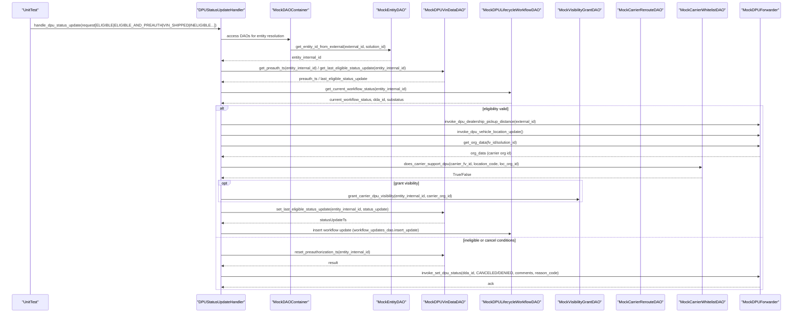

# Diagram: entity_core/entity_service/entity_service_tests/dpu/unit/test_dpu_status_update.py

> Auto-generated by Obscura crawlers

## Diagram 1

```mermaid
classDiagram
class MockDAOContainer {
  - entity_dao
  - vin_data_dao
  - workflow_dao
  - workflow_updates_dao
  - config_dao
  - carrier_whitelist_dao
  - carrier_reroute_dao
  - visibility_grant_dao
}
class MockDPUVinDataDAO {
  + get_last_eligible_status_update(entity_id)
  + set_last_eligible_status_update(entity_internal_id, new_status_update)
  + set_preauthorization(**kwargs)
  + reset_preauthorization_ts(entity_internal_id)
  + reset_eligibility(entity_internal_id)
  + get_preauth_ts(entity_internal_id)
}
class MockEntityDAO {
  + get_entity_id_from_external(external_entity_id, solution_id)
  + get_carrier_from_planned_trip_leg(solution_id, entity_internal_id, location_code)
  + is_delivered_vin(entity_id)
  + get_solution_id(entity_id)
}
class MockDPULifecycleWorkflowDAO {
  + get_dda_id_from_workflow_status(entity_internal_id, workflow_statuses)
  + get_email_information_for_entity(entity_internal_id)
  + get_current_workflow_status(entity_id)
  + set_current_worflow_carrier(entity_id, carrier_id)
  + set_workflow_location_code(entity_id, location_code)
}
class MockDPUWorkflowUpdatesDAO {
  + insert_update(...)
}
class MockDPUSystemConfigDAO {
  + get_preauthorization_codes(solution_id)
  + get_eligibility_codes(solution_id)
  + get_ineligibility_codes(solution_id)
  + get_vin_shipped_codes(solution_id)
  + get_dpu_carrier_source_lookup_type(solution_id)
  + get_eligibility_time_config(solution_id)
}
class MockCarrierWhitelistDAO {
  + does_carrier_support_dpu(carrier_fv_id, location_code, loc_org_id)
  + does_location_support_dpu(location_code, loc_org_id, solution_id)
}
class MockVisibilityGrantDAO {
  + grant_carrier_dpu_visibility(entity_id, carrier_id)
  + revoke_carrier_dpu_visibility(entity_id)
}
class MockCarrierRerouteDAO {
  + get_reroute_carrier(original_carrier_scac, location_code, customer_organization_id)
}
class MockDPUStatusUpdateRequest {
  + solution_id
  + external_id
  + code
  + status_update_ts
  + location_code
  + status_update_id
  + status_location_id
  + status_response
}
class MockDPUForwarder {
  + invoke_dpu_dealership_pickup_distance(external_id)
  + invoke_dpu_vehicle_location_update()
  + invoke_get_carrier_id(carrier_fv_id)
  + invoke_set_dpu_status(dda_id, status, comments, reason_code=None, ext_body=None)
  + invoke_send_email(entity_external_id, email, context_version, username=None, reason=None, comments=None)
  + get_org_data(fv_id=None, solution_id=None, scac=None)
}
class DPUStatusUpdateHandler {
  + handle_dpu_status_update(request)
  + is_valid_preauth_update(entity_internal_id, request)
  + is_valid_eligibility_update(entity_internal_id, request)
  + is_valid_vin_shipped_update(entity_internal_id, request)
  + __get_current_status(entity_internal_id)
  + __get_eligibility(carrier_fv_id, location_code, solution_id)
  + __check_location_carrier_changed(entity_internal_id, location_code, source_id)
}
class DPUStausUpdateHandlerTests {
  + setUp()
  + test_*()
}
MockDAOContainer --> MockEntityDAO
MockDAOContainer --> MockDPUVinDataDAO
MockDAOContainer --> MockDPULifecycleWorkflowDAO
MockDAOContainer --> MockDPUWorkflowUpdatesDAO
MockDAOContainer --> MockDPUSystemConfigDAO
MockDAOContainer --> MockCarrierWhitelistDAO
MockDAOContainer --> MockCarrierRerouteDAO
MockDAOContainer --> MockVisibilityGrantDAO
DPUStatusUpdateHandler o-- MockDAOContainer
DPUStatusUpdateHandler o-- MockDPUForwarder
DPUStausUpdateHandlerTests --> DPUStatusUpdateHandler
DPUStausUpdateHandlerTests --> MockDAOContainer
DPUStausUpdateHandlerTests --> MockDPUForwarder
MockDPUStatusUpdateRequest --|> DPUStatusUpdateEvent
```

### SVG

<svg id="container" width="4954.5078125" xmlns="http://www.w3.org/2000/svg" class="classDiagram" height="1258" viewBox="0 0 4954.5078125 1258" role="graphics-document document" aria-roledescription="class"><g><defs><marker id="container_class-aggregationStart" class="marker aggregation class" refX="18" refY="7" markerWidth="190" markerHeight="240" orient="auto"><path d="M 18,7 L9,13 L1,7 L9,1 Z"></path></marker></defs><defs><marker id="container_class-aggregationEnd" class="marker aggregation class" refX="1" refY="7" markerWidth="20" markerHeight="28" orient="auto"><path d="M 18,7 L9,13 L1,7 L9,1 Z"></path></marker></defs><defs><marker id="container_class-extensionStart" class="marker extension class" refX="18" refY="7" markerWidth="190" markerHeight="240" orient="auto"><path d="M 1,7 L18,13 V 1 Z"></path></marker></defs><defs><marker id="container_class-extensionEnd" class="marker extension class" refX="1" refY="7" markerWidth="20" markerHeight="28" orient="auto"><path d="M 1,1 V 13 L18,7 Z"></path></marker></defs><defs><marker id="container_class-compositionStart" class="marker composition class" refX="18" refY="7" markerWidth="190" markerHeight="240" orient="auto"><path d="M 18,7 L9,13 L1,7 L9,1 Z"></path></marker></defs><defs><marker id="container_class-compositionEnd" class="marker composition class" refX="1" refY="7" markerWidth="20" markerHeight="28" orient="auto"><path d="M 18,7 L9,13 L1,7 L9,1 Z"></path></marker></defs><defs><marker id="container_class-dependencyStart" class="marker dependency class" refX="6" refY="7" markerWidth="190" markerHeight="240" orient="auto"><path d="M 5,7 L9,13 L1,7 L9,1 Z"></path></marker></defs><defs><marker id="container_class-dependencyEnd" class="marker dependency class" refX="13" refY="7" markerWidth="20" markerHeight="28" orient="auto"><path d="M 18,7 L9,13 L14,7 L9,1 Z"></path></marker></defs><defs><marker id="container_class-lollipopStart" class="marker lollipop class" refX="13" refY="7" markerWidth="190" markerHeight="240" orient="auto"><circle stroke="black" fill="transparent" cx="7" cy="7" r="6"></circle></marker></defs><defs><marker id="container_class-lollipopEnd" class="marker lollipop class" refX="1" refY="7" markerWidth="190" markerHeight="240" orient="auto"><circle stroke="black" fill="transparent" cx="7" cy="7" r="6"></circle></marker></defs><g class="root"><g class="clusters"></g><g class="edgePaths"><path d="M2374.809,820.634L2037.255,847.028C1699.702,873.422,1024.595,926.211,687.042,959.772C349.488,993.333,349.488,1007.667,349.488,1014.833L349.488,1022" id="id_MockDAOContainer_MockEntityDAO_1" class="edge-thickness-normal edge-pattern-solid relation" style=";;;" data-edge="true" data-et="edge" data-id="id_MockDAOContainer_MockEntityDAO_1" data-points="W3sieCI6MjM3NC44MDg1OTM3NSwieSI6ODIwLjYzMzY2ODA1NDcxMjF9LHsieCI6MzQ5LjQ4ODI4MTI1LCJ5Ijo5Nzl9LHsieCI6MzQ5LjQ4ODI4MTI1LCJ5IjoxMDI4fV0=" marker-end="url(#container_class-dependencyEnd)"></path><path d="M2374.809,825.81L2155.201,851.342C1935.594,876.874,1496.379,927.937,1276.771,956.635C1057.164,985.333,1057.164,991.667,1057.164,994.833L1057.164,998" id="id_MockDAOContainer_MockDPUVinDataDAO_2" class="edge-thickness-normal edge-pattern-solid relation" style=";;;" data-edge="true" data-et="edge" data-id="id_MockDAOContainer_MockDPUVinDataDAO_2" data-points="W3sieCI6MjM3NC44MDg1OTM3NSwieSI6ODI1LjgxMDQ2OTk2ODkwODh9LHsieCI6MTA1Ny4xNjQwNjI1LCJ5Ijo5Nzl9LHsieCI6MTA1Ny4xNjQwNjI1LCJ5IjoxMDA0fV0=" marker-end="url(#container_class-dependencyEnd)"></path><path d="M2374.809,840.808L2273.142,863.84C2171.475,886.872,1968.142,932.936,1866.475,961.135C1764.809,989.333,1764.809,999.667,1764.809,1004.833L1764.809,1010" id="id_MockDAOContainer_MockDPULifecycleWorkflowDAO_3" class="edge-thickness-normal edge-pattern-solid relation" style=";;;" data-edge="true" data-et="edge" data-id="id_MockDAOContainer_MockDPULifecycleWorkflowDAO_3" data-points="W3sieCI6MjM3NC44MDg1OTM3NSwieSI6ODQwLjgwODIwNDI1ODE3MTN9LHsieCI6MTc2NC44MDg1OTM3NSwieSI6OTc5fSx7IngiOjE3NjQuODA4NTkzNzUsInkiOjEwMTZ9XQ==" marker-end="url(#container_class-dependencyEnd)"></path><path d="M2374.809,915.719L2361.242,926.266C2347.674,936.813,2320.54,957.906,2306.973,981.62C2293.406,1005.333,2293.406,1031.667,2293.406,1044.833L2293.406,1058" id="id_MockDAOContainer_MockDPUWorkflowUpdatesDAO_4" class="edge-thickness-normal edge-pattern-solid relation" style=";;;" data-edge="true" data-et="edge" data-id="id_MockDAOContainer_MockDPUWorkflowUpdatesDAO_4" data-points="W3sieCI6MjM3NC44MDg1OTM3NSwieSI6OTE1LjcxODc1NzI5OTY5NjN9LHsieCI6MjI5My40MDYyNSwieSI6OTc5fSx7IngiOjIyOTMuNDA2MjUsInkiOjEwNjR9XQ==" marker-end="url(#container_class-dependencyEnd)"></path><path d="M2646.793,915.719L2660.36,926.266C2673.927,936.813,2701.061,957.906,2714.628,971.62C2728.195,985.333,2728.195,991.667,2728.195,994.833L2728.195,998" id="id_MockDAOContainer_MockDPUSystemConfigDAO_5" class="edge-thickness-normal edge-pattern-solid relation" style=";;;" data-edge="true" data-et="edge" data-id="id_MockDAOContainer_MockDPUSystemConfigDAO_5" data-points="W3sieCI6MjY0Ni43OTI5Njg3NSwieSI6OTE1LjcxODc1NzI5OTY5NjN9LHsieCI6MjcyOC4xOTUzMTI1LCJ5Ijo5Nzl9LHsieCI6MjcyOC4xOTUzMTI1LCJ5IjoxMDA0fV0=" marker-end="url(#container_class-dependencyEnd)"></path><path d="M2646.793,837.877L2761.533,861.397C2876.273,884.918,3105.754,931.959,3220.494,966.646C3335.234,1001.333,3335.234,1023.667,3335.234,1034.833L3335.234,1046" id="id_MockDAOContainer_MockCarrierWhitelistDAO_6" class="edge-thickness-normal edge-pattern-solid relation" style=";;;" data-edge="true" data-et="edge" data-id="id_MockDAOContainer_MockCarrierWhitelistDAO_6" data-points="W3sieCI6MjY0Ni43OTI5Njg3NSwieSI6ODM3Ljg3NjkzMjU1MzEyNTl9LHsieCI6MzMzNS4yMzQzNzUsInkiOjk3OX0seyJ4IjozMzM1LjIzNDM3NSwieSI6MTA1Mn1d" marker-end="url(#container_class-dependencyEnd)"></path><path d="M2646.793,824.839L2882.26,850.533C3117.727,876.226,3588.66,927.613,3824.127,966.473C4059.594,1005.333,4059.594,1031.667,4059.594,1044.833L4059.594,1058" id="id_MockDAOContainer_MockCarrierRerouteDAO_7" class="edge-thickness-normal edge-pattern-solid relation" style=";;;" data-edge="true" data-et="edge" data-id="id_MockDAOContainer_MockCarrierRerouteDAO_7" data-points="W3sieCI6MjY0Ni43OTI5Njg3NSwieSI6ODI0LjgzOTA5MDkyNTE0MDh9LHsieCI6NDA1OS41OTM3NSwieSI6OTc5fSx7IngiOjQwNTkuNTkzNzUsInkiOjEwNjR9XQ==" marker-end="url(#container_class-dependencyEnd)"></path><path d="M2646.793,820.448L2990.75,846.873C3334.707,873.299,4022.621,926.149,4366.578,963.741C4710.535,1001.333,4710.535,1023.667,4710.535,1034.833L4710.535,1046" id="id_MockDAOContainer_MockVisibilityGrantDAO_8" class="edge-thickness-normal edge-pattern-solid relation" style=";;;" data-edge="true" data-et="edge" data-id="id_MockDAOContainer_MockVisibilityGrantDAO_8" data-points="W3sieCI6MjY0Ni43OTI5Njg3NSwieSI6ODIwLjQ0NzkzNDA1NDUzNzl9LHsieCI6NDcxMC41MzUxNTYyNSwieSI6OTc5fSx7IngiOjQ3MTAuNTM1MTU2MjUsInkiOjEwNTJ9XQ==" marker-end="url(#container_class-dependencyEnd)"></path><path d="M2306.979,633.216L2306.898,634.514C2306.817,635.811,2306.654,638.405,2317.959,649.121C2329.264,659.837,2352.036,678.673,2363.423,688.092L2374.809,697.51" id="id_DPUStatusUpdateHandler_MockDAOContainer_9" class="edge-thickness-normal edge-pattern-solid relation" style=";;;" data-edge="true" data-et="edge" data-id="id_DPUStatusUpdateHandler_MockDAOContainer_9" data-points="W3sieCI6MjMwOC4wNTQ2ODc1LCJ5Ijo2MTZ9LHsieCI6MjMwNi40OTIxODc1LCJ5Ijo2NDF9LHsieCI6MjM3NC44MDg1OTM3NSwieSI6Njk3LjUwOTk3MDc0NzM3NTl9XQ==" marker-start="url(#container_class-aggregationStart)"></path><path d="M2604.371,623.659L2610.203,626.55C2616.035,629.44,2627.699,635.22,2656.993,645.777C2686.287,656.333,2733.21,671.667,2756.672,679.333L2780.134,687" id="id_DPUStatusUpdateHandler_MockDPUForwarder_10" class="edge-thickness-normal edge-pattern-solid relation" style=";;;" data-edge="true" data-et="edge" data-id="id_DPUStatusUpdateHandler_MockDPUForwarder_10" data-points="W3sieCI6MjU4OC45MTQ2NzI4NTE1NjI1LCJ5Ijo2MTZ9LHsieCI6MjYzOS4zNjMyODEyNSwieSI6NjQxfSx7IngiOjI3ODAuMTM0MDgzNzY0NzkzLCJ5Ijo2ODd9XQ==" marker-start="url(#container_class-aggregationStart)"></path><path d="M2721.383,191.203L2653.901,212.836C2586.419,234.468,2451.456,277.734,2383.974,302.534C2316.492,327.333,2316.492,333.667,2316.492,336.833L2316.492,340" id="id_DPUStausUpdateHandlerTests_DPUStatusUpdateHandler_11" class="edge-thickness-normal edge-pattern-solid relation" style=";;;" data-edge="true" data-et="edge" data-id="id_DPUStausUpdateHandlerTests_DPUStatusUpdateHandler_11" data-points="W3sieCI6MjcyMS4zODI4MTI1LCJ5IjoxOTEuMjAyNjcwNDYwNDM5NTV9LHsieCI6MjMxNi40OTIxODc1LCJ5IjozMjF9LHsieCI6MjMxNi40OTIxODc1LCJ5IjozNDZ9XQ==" marker-end="url(#container_class-dependencyEnd)"></path><path d="M2843.672,227L2843.672,242.667C2843.672,258.333,2843.672,289.667,2843.672,332C2843.672,374.333,2843.672,427.667,2843.672,481C2843.672,534.333,2843.672,587.667,2811.75,630.54C2779.829,673.413,2715.986,705.827,2684.064,722.033L2652.143,738.24" id="id_DPUStausUpdateHandlerTests_MockDAOContainer_12" class="edge-thickness-normal edge-pattern-solid relation" style=";;;" data-edge="true" data-et="edge" data-id="id_DPUStausUpdateHandlerTests_MockDAOContainer_12" data-points="W3sieCI6Mjg0My42NzE4NzUsInkiOjIyN30seyJ4IjoyODQzLjY3MTg3NSwieSI6MzIxfSx7IngiOjI4NDMuNjcxODc1LCJ5Ijo0ODF9LHsieCI6Mjg0My42NzE4NzUsInkiOjY0MX0seyJ4IjoyNjQ2Ljc5Mjk2ODc1LCJ5Ijo3NDAuOTU2MjE2NjI4NTI3OH1d" marker-end="url(#container_class-dependencyEnd)"></path><path d="M2965.961,214.087L3001.058,231.906C3036.155,249.724,3106.349,285.362,3141.446,329.848C3176.543,374.333,3176.543,427.667,3176.543,481C3176.543,534.333,3176.543,587.667,3175.753,621.007C3174.963,654.347,3173.384,667.694,3172.594,674.368L3171.804,681.042" id="id_DPUStausUpdateHandlerTests_MockDPUForwarder_13" class="edge-thickness-normal edge-pattern-solid relation" style=";;;" data-edge="true" data-et="edge" data-id="id_DPUStausUpdateHandlerTests_MockDPUForwarder_13" data-points="W3sieCI6Mjk2NS45NjA5Mzc1LCJ5IjoyMTQuMDg2NjUxNDExMTM2NTN9LHsieCI6MzE3Ni41NDI5Njg3NSwieSI6MzIxfSx7IngiOjMxNzYuNTQyOTY4NzUsInkiOjQ4MX0seyJ4IjozMTc2LjU0Mjk2ODc1LCJ5Ijo2NDF9LHsieCI6MzE3MS4wOTkxODE3Njc3NTE0LCJ5Ijo2ODd9XQ==" marker-end="url(#container_class-dependencyEnd)"></path><path d="M1815.484,296L1815.484,300.167C1815.484,304.333,1815.484,312.667,1815.484,333.625C1815.484,354.583,1815.484,388.167,1815.484,404.958L1815.484,421.75" id="id_MockDPUStatusUpdateRequest_DPUStatusUpdateEvent_14" class="edge-thickness-normal edge-pattern-solid relation" style=";;;" data-edge="true" data-et="edge" data-id="id_MockDPUStatusUpdateRequest_DPUStatusUpdateEvent_14" data-points="W3sieCI6MTgxNS40ODQzNzUsInkiOjI5Nn0seyJ4IjoxODE1LjQ4NDM3NSwieSI6MzIxfSx7IngiOjE4MTUuNDg0Mzc1LCJ5Ijo0Mzl9XQ==" marker-end="url(#container_class-extensionEnd)"></path></g><g class="edgeLabels"><g class="edgeLabel"><g class="label" data-id="id_MockDAOContainer_MockEntityDAO_1" transform="translate(0, 0)"><foreignObject width="0" height="0">

</foreignObject></g></g><g class="edgeLabel"><g class="label" data-id="id_MockDAOContainer_MockDPUVinDataDAO_2" transform="translate(0, 0)"><foreignObject width="0" height="0">

</foreignObject></g></g><g class="edgeLabel"><g class="label" data-id="id_MockDAOContainer_MockDPULifecycleWorkflowDAO_3" transform="translate(0, 0)"><foreignObject width="0" height="0">

</foreignObject></g></g><g class="edgeLabel"><g class="label" data-id="id_MockDAOContainer_MockDPUWorkflowUpdatesDAO_4" transform="translate(0, 0)"><foreignObject width="0" height="0">

</foreignObject></g></g><g class="edgeLabel"><g class="label" data-id="id_MockDAOContainer_MockDPUSystemConfigDAO_5" transform="translate(0, 0)"><foreignObject width="0" height="0">

</foreignObject></g></g><g class="edgeLabel"><g class="label" data-id="id_MockDAOContainer_MockCarrierWhitelistDAO_6" transform="translate(0, 0)"><foreignObject width="0" height="0">

</foreignObject></g></g><g class="edgeLabel"><g class="label" data-id="id_MockDAOContainer_MockCarrierRerouteDAO_7" transform="translate(0, 0)"><foreignObject width="0" height="0">

</foreignObject></g></g><g class="edgeLabel"><g class="label" data-id="id_MockDAOContainer_MockVisibilityGrantDAO_8" transform="translate(0, 0)"><foreignObject width="0" height="0">

</foreignObject></g></g><g class="edgeLabel"><g class="label" data-id="id_DPUStatusUpdateHandler_MockDAOContainer_9" transform="translate(0, 0)"><foreignObject width="0" height="0">

</foreignObject></g></g><g class="edgeLabel"><g class="label" data-id="id_DPUStatusUpdateHandler_MockDPUForwarder_10" transform="translate(0, 0)"><foreignObject width="0" height="0">

</foreignObject></g></g><g class="edgeLabel"><g class="label" data-id="id_DPUStausUpdateHandlerTests_DPUStatusUpdateHandler_11" transform="translate(0, 0)"><foreignObject width="0" height="0">

</foreignObject></g></g><g class="edgeLabel"><g class="label" data-id="id_DPUStausUpdateHandlerTests_MockDAOContainer_12" transform="translate(0, 0)"><foreignObject width="0" height="0">

</foreignObject></g></g><g class="edgeLabel"><g class="label" data-id="id_DPUStausUpdateHandlerTests_MockDPUForwarder_13" transform="translate(0, 0)"><foreignObject width="0" height="0">

</foreignObject></g></g><g class="edgeLabel"><g class="label" data-id="id_MockDPUStatusUpdateRequest_DPUStatusUpdateEvent_14" transform="translate(0, 0)"><foreignObject width="0" height="0">

</foreignObject></g></g></g><g class="nodes"><g class="node default" id="classId-MockDAOContainer-0" transform="translate(2510.80078125, 810)"><g class="basic label-container"><path d="M-135.9921875 -144 L135.9921875 -144 L135.9921875 144 L-135.9921875 144" stroke="none" stroke-width="0" fill="#ECECFF" style=""></path><path d="M-135.9921875 -144 C-62.952326965284726 -144, 10.087533569430548 -144, 135.9921875 -144 M-135.9921875 -144 C-59.746819079405114 -144, 16.498549341189772 -144, 135.9921875 -144 M135.9921875 -144 C135.9921875 -38.64517729870241, 135.9921875 66.70964540259519, 135.9921875 144 M135.9921875 -144 C135.9921875 -71.64402655677068, 135.9921875 0.7119468864586338, 135.9921875 144 M135.9921875 144 C65.67004077406375 144, -4.6521059518725 144, -135.9921875 144 M135.9921875 144 C49.22017581218235 144, -37.551835875635305 144, -135.9921875 144 M-135.9921875 144 C-135.9921875 76.82533392449845, -135.9921875 9.650667848996903, -135.9921875 -144 M-135.9921875 144 C-135.9921875 39.46109046376361, -135.9921875 -65.07781907247278, -135.9921875 -144" stroke="#9370DB" stroke-width="1.3" fill="none" stroke-dasharray="0 0" style=""></path></g><g class="annotation-group text" transform="translate(0, -120)"></g><g class="label-group text" transform="translate(-70.109375, -120)"><g class="label" style="font-weight: bolder" transform="translate(0,-12)"><foreignObject width="140.21875" height="24">

MockDAOContainer

</foreignObject></g></g><g class="members-group text" transform="translate(-123.9921875, -72)"><g class="label" style="" transform="translate(0,-12)"><foreignObject width="87.78125" height="24">

- entity_dao

</foreignObject></g><g class="label" style="" transform="translate(0,12)"><foreignObject width="108.71875" height="24">

- vin_data_dao

</foreignObject></g><g class="label" style="" transform="translate(0,36)"><foreignObject width="111.390625" height="24">

- workflow_dao

</foreignObject></g><g class="label" style="" transform="translate(0,60)"><foreignObject width="177.875" height="24">

- workflow_updates_dao

</foreignObject></g><g class="label" style="" transform="translate(0,84)"><foreignObject width="89.9375" height="24">

- config_dao

</foreignObject></g><g class="label" style="" transform="translate(0,108)"><foreignObject width="163.046875" height="24">

- carrier_whitelist_dao

</foreignObject></g><g class="label" style="" transform="translate(0,132)"><foreignObject width="154.015625" height="24">

- carrier_reroute_dao

</foreignObject></g><g class="label" style="" transform="translate(0,156)"><foreignObject width="153.234375" height="24">

- visibility_grant_dao

</foreignObject></g></g><g class="methods-group text" transform="translate(-123.9921875, 144)"></g><g class="divider" style=""><path d="M-135.9921875 -96 C-54.17044226127932 -96, 27.65130297744136 -96, 135.9921875 -96 M-135.9921875 -96 C-63.324057564602754 -96, 9.344072370794493 -96, 135.9921875 -96" stroke="#9370DB" stroke-width="1.3" fill="none" stroke-dasharray="0 0" style=""></path></g><g class="divider" style=""><path d="M-135.9921875 120 C-40.4442541949758 120, 55.103679110048404 120, 135.9921875 120 M-135.9921875 120 C-55.10399113423411 120, 25.784205231531786 120, 135.9921875 120" stroke="#9370DB" stroke-width="1.3" fill="none" stroke-dasharray="0 0" style=""></path></g></g><g class="node default" id="classId-MockDPUVinDataDAO-1" transform="translate(1057.1640625, 1127)"><g class="basic label-container"><path d="M-316.1875 -123 L316.1875 -123 L316.1875 123 L-316.1875 123" stroke="none" stroke-width="0" fill="#ECECFF" style=""></path><path d="M-316.1875 -123 C-179.95176526832086 -123, -43.71603053664171 -123, 316.1875 -123 M-316.1875 -123 C-181.52454180544058 -123, -46.861583610881155 -123, 316.1875 -123 M316.1875 -123 C316.1875 -55.134287017141546, 316.1875 12.731425965716909, 316.1875 123 M316.1875 -123 C316.1875 -66.76046948257365, 316.1875 -10.520938965147323, 316.1875 123 M316.1875 123 C164.50652624362831 123, 12.82555248725663 123, -316.1875 123 M316.1875 123 C80.9193772971538 123, -154.3487454056924 123, -316.1875 123 M-316.1875 123 C-316.1875 66.41830903142868, -316.1875 9.836618062857355, -316.1875 -123 M-316.1875 123 C-316.1875 67.51007307816849, -316.1875 12.020146156336963, -316.1875 -123" stroke="#9370DB" stroke-width="1.3" fill="none" stroke-dasharray="0 0" style=""></path></g><g class="annotation-group text" transform="translate(0, -99)"></g><g class="label-group text" transform="translate(-78.046875, -99)"><g class="label" style="font-weight: bolder" transform="translate(0,-12)"><foreignObject width="156.09375" height="24">

MockDPUVinDataDAO

</foreignObject></g></g><g class="members-group text" transform="translate(-304.1875, -51)"></g><g class="methods-group text" transform="translate(-304.1875, -21)"><g class="label" style="" transform="translate(0,-12)"><foreignObject width="316.59375" height="24">

+ get_last_eligible_status_update(entity_id)

</foreignObject></g><g class="label" style="" transform="translate(0,12)"><foreignObject width="530.328125" height="24">

+ set_last_eligible_status_update(entity_internal_id, new_status_update)

</foreignObject></g><g class="label" style="" transform="translate(0,36)"><foreignObject width="238.21875" height="24">

+ set_preauthorization(**kwargs)

</foreignObject></g><g class="label" style="" transform="translate(0,60)"><foreignObject width="339.09375" height="24">

+ reset_preauthorization_ts(entity_internal_id)

</foreignObject></g><g class="label" style="" transform="translate(0,84)"><foreignObject width="263.640625" height="24">

+ reset_eligibility(entity_internal_id)

</foreignObject></g><g class="label" style="" transform="translate(0,108)"><foreignObject width="260.78125" height="24">

+ get_preauth_ts(entity_internal_id)

</foreignObject></g></g><g class="divider" style=""><path d="M-316.1875 -75 C-157.52414529657327 -75, 1.1392094068534675 -75, 316.1875 -75 M-316.1875 -75 C-66.62565323942067 -75, 182.93619352115866 -75, 316.1875 -75" stroke="#9370DB" stroke-width="1.3" fill="none" stroke-dasharray="0 0" style=""></path></g><g class="divider" style=""><path d="M-316.1875 -51 C-137.05743552334184 -51, 42.072628953316325 -51, 316.1875 -51 M-316.1875 -51 C-178.65056069271503 -51, -41.113621385430065 -51, 316.1875 -51" stroke="#9370DB" stroke-width="1.3" fill="none" stroke-dasharray="0 0" style=""></path></g></g><g class="node default" id="classId-MockEntityDAO-2" transform="translate(349.48828125, 1127)"><g class="basic label-container"><path d="M-341.48828125 -99 L341.48828125 -99 L341.48828125 99 L-341.48828125 99" stroke="none" stroke-width="0" fill="#ECECFF" style=""></path><path d="M-341.48828125 -99 C-188.25619973558773 -99, -35.024118221175456 -99, 341.48828125 -99 M-341.48828125 -99 C-165.60301169805066 -99, 10.28225785389867 -99, 341.48828125 -99 M341.48828125 -99 C341.48828125 -22.855653937278902, 341.48828125 53.288692125442196, 341.48828125 99 M341.48828125 -99 C341.48828125 -37.40609281336565, 341.48828125 24.187814373268694, 341.48828125 99 M341.48828125 99 C176.7688257292063 99, 12.049370208412597 99, -341.48828125 99 M341.48828125 99 C138.12712392787546 99, -65.23403339424908 99, -341.48828125 99 M-341.48828125 99 C-341.48828125 43.55397760053068, -341.48828125 -11.892044798938642, -341.48828125 -99 M-341.48828125 99 C-341.48828125 33.80777765590588, -341.48828125 -31.38444468818824, -341.48828125 -99" stroke="#9370DB" stroke-width="1.3" fill="none" stroke-dasharray="0 0" style=""></path></g><g class="annotation-group text" transform="translate(0, -75)"></g><g class="label-group text" transform="translate(-55.7890625, -75)"><g class="label" style="font-weight: bolder" transform="translate(0,-12)"><foreignObject width="111.578125" height="24">

MockEntityDAO

</foreignObject></g></g><g class="members-group text" transform="translate(-329.48828125, -27)"></g><g class="methods-group text" transform="translate(-329.48828125, 3)"><g class="label" style="" transform="translate(0,-12)"><foreignObject width="448.078125" height="24">

+ get_entity_id_from_external(external_entity_id, solution_id)

</foreignObject></g><g class="label" style="" transform="translate(0,12)"><foreignObject width="603.1875" height="24">

+ get_carrier_from_planned_trip_leg(solution_id, entity_internal_id, location_code)

</foreignObject></g><g class="label" style="" transform="translate(0,36)"><foreignObject width="203.734375" height="24">

+ is_delivered_vin(entity_id)

</foreignObject></g><g class="label" style="" transform="translate(0,60)"><foreignObject width="199.578125" height="24">

+ get_solution_id(entity_id)

</foreignObject></g></g><g class="divider" style=""><path d="M-341.48828125 -51 C-117.71326998693883 -51, 106.06174127612235 -51, 341.48828125 -51 M-341.48828125 -51 C-104.36634695526186 -51, 132.75558733947628 -51, 341.48828125 -51" stroke="#9370DB" stroke-width="1.3" fill="none" stroke-dasharray="0 0" style=""></path></g><g class="divider" style=""><path d="M-341.48828125 -27 C-159.32354823276964 -27, 22.841184784460722 -27, 341.48828125 -27 M-341.48828125 -27 C-180.21096797137972 -27, -18.933654692759433 -27, 341.48828125 -27" stroke="#9370DB" stroke-width="1.3" fill="none" stroke-dasharray="0 0" style=""></path></g></g><g class="node default" id="classId-MockDPULifecycleWorkflowDAO-3" transform="translate(1764.80859375, 1127)"><g class="basic label-container"><path d="M-341.45703125 -111 L341.45703125 -111 L341.45703125 111 L-341.45703125 111" stroke="none" stroke-width="0" fill="#ECECFF" style=""></path><path d="M-341.45703125 -111 C-82.34634339386076 -111, 176.76434446227847 -111, 341.45703125 -111 M-341.45703125 -111 C-145.27935960619928 -111, 50.89831203760144 -111, 341.45703125 -111 M341.45703125 -111 C341.45703125 -43.46155925162256, 341.45703125 24.07688149675488, 341.45703125 111 M341.45703125 -111 C341.45703125 -53.610264010891676, 341.45703125 3.779471978216648, 341.45703125 111 M341.45703125 111 C117.82285237086131 111, -105.81132650827738 111, -341.45703125 111 M341.45703125 111 C179.26970998923076 111, 17.082388728461524 111, -341.45703125 111 M-341.45703125 111 C-341.45703125 51.55731243863488, -341.45703125 -7.885375122730238, -341.45703125 -111 M-341.45703125 111 C-341.45703125 27.550169931384602, -341.45703125 -55.899660137230796, -341.45703125 -111" stroke="#9370DB" stroke-width="1.3" fill="none" stroke-dasharray="0 0" style=""></path></g><g class="annotation-group text" transform="translate(0, -87)"></g><g class="label-group text" transform="translate(-116.4296875, -87)"><g class="label" style="font-weight: bolder" transform="translate(0,-12)"><foreignObject width="232.859375" height="24">

MockDPULifecycleWorkflowDAO

</foreignObject></g></g><g class="members-group text" transform="translate(-329.45703125, -39)"></g><g class="methods-group text" transform="translate(-329.45703125, -9)"><g class="label" style="" transform="translate(0,-12)"><foreignObject width="542.484375" height="24">

+ get_dda_id_from_workflow_status(entity_internal_id, workflow_statuses)

</foreignObject></g><g class="label" style="" transform="translate(0,12)"><foreignObject width="394.359375" height="24">

+ get_email_information_for_entity(entity_internal_id)

</foreignObject></g><g class="label" style="" transform="translate(0,36)"><foreignObject width="295.375" height="24">

+ get_current_workflow_status(entity_id)

</foreignObject></g><g class="label" style="" transform="translate(0,60)"><foreignObject width="366.96875" height="24">

+ set_current_worflow_carrier(entity_id, carrier_id)

</foreignObject></g><g class="label" style="" transform="translate(0,84)"><foreignObject width="401.984375" height="24">

+ set_workflow_location_code(entity_id, location_code)

</foreignObject></g></g><g class="divider" style=""><path d="M-341.45703125 -63 C-73.27391089605567 -63, 194.90920945788866 -63, 341.45703125 -63 M-341.45703125 -63 C-123.14861528961447 -63, 95.15980067077106 -63, 341.45703125 -63" stroke="#9370DB" stroke-width="1.3" fill="none" stroke-dasharray="0 0" style=""></path></g><g class="divider" style=""><path d="M-341.45703125 -39 C-88.3814694972736 -39, 164.6940922554528 -39, 341.45703125 -39 M-341.45703125 -39 C-177.91474799581331 -39, -14.37246474162663 -39, 341.45703125 -39" stroke="#9370DB" stroke-width="1.3" fill="none" stroke-dasharray="0 0" style=""></path></g></g><g class="node default" id="classId-MockDPUWorkflowUpdatesDAO-4" transform="translate(2293.40625, 1127)"><g class="basic label-container"><path d="M-137.140625 -63 L137.140625 -63 L137.140625 63 L-137.140625 63" stroke="none" stroke-width="0" fill="#ECECFF" style=""></path><path d="M-137.140625 -63 C-73.85251665149143 -63, -10.564408302982855 -63, 137.140625 -63 M-137.140625 -63 C-76.01720850661158 -63, -14.893792013223177 -63, 137.140625 -63 M137.140625 -63 C137.140625 -17.49887364754845, 137.140625 28.0022527049031, 137.140625 63 M137.140625 -63 C137.140625 -18.1656006913354, 137.140625 26.6687986173292, 137.140625 63 M137.140625 63 C51.98455136208851 63, -33.17152227582298 63, -137.140625 63 M137.140625 63 C65.2904561856842 63, -6.559712628631587 63, -137.140625 63 M-137.140625 63 C-137.140625 22.699825290565926, -137.140625 -17.60034941886815, -137.140625 -63 M-137.140625 63 C-137.140625 22.908712082219054, -137.140625 -17.18257583556189, -137.140625 -63" stroke="#9370DB" stroke-width="1.3" fill="none" stroke-dasharray="0 0" style=""></path></g><g class="annotation-group text" transform="translate(0, -39)"></g><g class="label-group text" transform="translate(-114.78125, -39)"><g class="label" style="font-weight: bolder" transform="translate(0,-12)"><foreignObject width="229.5625" height="24">

MockDPUWorkflowUpdatesDAO

</foreignObject></g></g><g class="members-group text" transform="translate(-125.140625, 9)"></g><g class="methods-group text" transform="translate(-125.140625, 39)"><g class="label" style="" transform="translate(0,-12)"><foreignObject width="135.5" height="24">

+ insert_update(...)

</foreignObject></g></g><g class="divider" style=""><path d="M-137.140625 -15 C-70.52165795850746 -15, -3.9026909170149224 -15, 137.140625 -15 M-137.140625 -15 C-29.437961542746564 -15, 78.26470191450687 -15, 137.140625 -15" stroke="#9370DB" stroke-width="1.3" fill="none" stroke-dasharray="0 0" style=""></path></g><g class="divider" style=""><path d="M-137.140625 9 C-73.34997247016106 9, -9.559319940322126 9, 137.140625 9 M-137.140625 9 C-41.18322904557539 9, 54.774166908849224 9, 137.140625 9" stroke="#9370DB" stroke-width="1.3" fill="none" stroke-dasharray="0 0" style=""></path></g></g><g class="node default" id="classId-MockDPUSystemConfigDAO-5" transform="translate(2728.1953125, 1127)"><g class="basic label-container"><path d="M-247.6484375 -123 L247.6484375 -123 L247.6484375 123 L-247.6484375 123" stroke="none" stroke-width="0" fill="#ECECFF" style=""></path><path d="M-247.6484375 -123 C-76.45069462829201 -123, 94.74704824341597 -123, 247.6484375 -123 M-247.6484375 -123 C-125.3398871089105 -123, -3.0313367178210058 -123, 247.6484375 -123 M247.6484375 -123 C247.6484375 -46.460639083746884, 247.6484375 30.078721832506233, 247.6484375 123 M247.6484375 -123 C247.6484375 -73.70783309826183, 247.6484375 -24.415666196523645, 247.6484375 123 M247.6484375 123 C77.9742697776704 123, -91.6998979446592 123, -247.6484375 123 M247.6484375 123 C55.3604303178102 123, -136.9275768643796 123, -247.6484375 123 M-247.6484375 123 C-247.6484375 33.67701634040277, -247.6484375 -55.645967319194455, -247.6484375 -123 M-247.6484375 123 C-247.6484375 65.96445986878362, -247.6484375 8.928919737567242, -247.6484375 -123" stroke="#9370DB" stroke-width="1.3" fill="none" stroke-dasharray="0 0" style=""></path></g><g class="annotation-group text" transform="translate(0, -99)"></g><g class="label-group text" transform="translate(-99.15625, -99)"><g class="label" style="font-weight: bolder" transform="translate(0,-12)"><foreignObject width="198.3125" height="24">

MockDPUSystemConfigDAO

</foreignObject></g></g><g class="members-group text" transform="translate(-235.6484375, -51)"></g><g class="methods-group text" transform="translate(-235.6484375, -21)"><g class="label" style="" transform="translate(0,-12)"><foreignObject width="307.5625" height="24">

+ get_preauthorization_codes(solution_id)

</foreignObject></g><g class="label" style="" transform="translate(0,12)"><foreignObject width="252.875" height="24">

+ get_eligibility_codes(solution_id)

</foreignObject></g><g class="label" style="" transform="translate(0,36)"><foreignObject width="267.078125" height="24">

+ get_ineligibility_codes(solution_id)

</foreignObject></g><g class="label" style="" transform="translate(0,60)"><foreignObject width="274.390625" height="24">

+ get_vin_shipped_codes(solution_id)

</foreignObject></g><g class="label" style="" transform="translate(0,84)"><foreignObject width="372.140625" height="24">

+ get_dpu_carrier_source_lookup_type(solution_id)

</foreignObject></g><g class="label" style="" transform="translate(0,108)"><foreignObject width="294.40625" height="24">

+ get_eligibility_time_config(solution_id)

</foreignObject></g></g><g class="divider" style=""><path d="M-247.6484375 -75 C-78.85697701356844 -75, 89.93448347286312 -75, 247.6484375 -75 M-247.6484375 -75 C-144.78047880655316 -75, -41.9125201131063 -75, 247.6484375 -75" stroke="#9370DB" stroke-width="1.3" fill="none" stroke-dasharray="0 0" style=""></path></g><g class="divider" style=""><path d="M-247.6484375 -51 C-137.61231355765722 -51, -27.576189615314462 -51, 247.6484375 -51 M-247.6484375 -51 C-103.07971421781423 -51, 41.489009064371544 -51, 247.6484375 -51" stroke="#9370DB" stroke-width="1.3" fill="none" stroke-dasharray="0 0" style=""></path></g></g><g class="node default" id="classId-MockCarrierWhitelistDAO-6" transform="translate(3335.234375, 1127)"><g class="basic label-container"><path d="M-309.390625 -75 L309.390625 -75 L309.390625 75 L-309.390625 75" stroke="none" stroke-width="0" fill="#ECECFF" style=""></path><path d="M-309.390625 -75 C-132.14424410317565 -75, 45.1021367936487 -75, 309.390625 -75 M-309.390625 -75 C-159.985278129667 -75, -10.57993125933399 -75, 309.390625 -75 M309.390625 -75 C309.390625 -36.68484558458737, 309.390625 1.630308830825257, 309.390625 75 M309.390625 -75 C309.390625 -27.335262543023475, 309.390625 20.32947491395305, 309.390625 75 M309.390625 75 C98.31132692269622 75, -112.76797115460755 75, -309.390625 75 M309.390625 75 C136.76308974193566 75, -35.86444551612868 75, -309.390625 75 M-309.390625 75 C-309.390625 26.61846616472922, -309.390625 -21.76306767054156, -309.390625 -75 M-309.390625 75 C-309.390625 18.6598684680416, -309.390625 -37.6802630639168, -309.390625 -75" stroke="#9370DB" stroke-width="1.3" fill="none" stroke-dasharray="0 0" style=""></path></g><g class="annotation-group text" transform="translate(0, -51)"></g><g class="label-group text" transform="translate(-92.296875, -51)"><g class="label" style="font-weight: bolder" transform="translate(0,-12)"><foreignObject width="184.59375" height="24">

MockCarrierWhitelistDAO

</foreignObject></g></g><g class="members-group text" transform="translate(-297.390625, -3)"></g><g class="methods-group text" transform="translate(-297.390625, 27)"><g class="label" style="" transform="translate(0,-12)"><foreignObject width="497.453125" height="24">

+ does_carrier_support_dpu(carrier_fv_id, location_code, loc_org_id)

</foreignObject></g><g class="label" style="" transform="translate(0,12)"><foreignObject width="502.484375" height="24">

+ does_location_support_dpu(location_code, loc_org_id, solution_id)

</foreignObject></g></g><g class="divider" style=""><path d="M-309.390625 -27 C-96.42653706029014 -27, 116.53755087941971 -27, 309.390625 -27 M-309.390625 -27 C-65.81456991778393 -27, 177.76148516443214 -27, 309.390625 -27" stroke="#9370DB" stroke-width="1.3" fill="none" stroke-dasharray="0 0" style=""></path></g><g class="divider" style=""><path d="M-309.390625 -3 C-77.92921268734187 -3, 153.53219962531625 -3, 309.390625 -3 M-309.390625 -3 C-91.04077960486697 -3, 127.30906579026606 -3, 309.390625 -3" stroke="#9370DB" stroke-width="1.3" fill="none" stroke-dasharray="0 0" style=""></path></g></g><g class="node default" id="classId-MockVisibilityGrantDAO-7" transform="translate(4710.53515625, 1127)"><g class="basic label-container"><path d="M-235.97265625 -75 L235.97265625 -75 L235.97265625 75 L-235.97265625 75" stroke="none" stroke-width="0" fill="#ECECFF" style=""></path><path d="M-235.97265625 -75 C-75.84363417065529 -75, 84.28538790868942 -75, 235.97265625 -75 M-235.97265625 -75 C-67.25457910675374 -75, 101.46349803649252 -75, 235.97265625 -75 M235.97265625 -75 C235.97265625 -27.030052940392174, 235.97265625 20.93989411921565, 235.97265625 75 M235.97265625 -75 C235.97265625 -42.28022398160571, 235.97265625 -9.560447963211416, 235.97265625 75 M235.97265625 75 C85.49878777915711 75, -64.97508069168578 75, -235.97265625 75 M235.97265625 75 C71.98266234870155 75, -92.0073315525969 75, -235.97265625 75 M-235.97265625 75 C-235.97265625 21.86638958600527, -235.97265625 -31.267220827989462, -235.97265625 -75 M-235.97265625 75 C-235.97265625 20.7222683661695, -235.97265625 -33.555463267661, -235.97265625 -75" stroke="#9370DB" stroke-width="1.3" fill="none" stroke-dasharray="0 0" style=""></path></g><g class="annotation-group text" transform="translate(0, -51)"></g><g class="label-group text" transform="translate(-86.4765625, -51)"><g class="label" style="font-weight: bolder" transform="translate(0,-12)"><foreignObject width="172.953125" height="24">

MockVisibilityGrantDAO

</foreignObject></g></g><g class="members-group text" transform="translate(-223.97265625, -3)"></g><g class="methods-group text" transform="translate(-223.97265625, 27)"><g class="label" style="" transform="translate(0,-12)"><foreignObject width="361.46875" height="24">

+ grant_carrier_dpu_visibility(entity_id, carrier_id)

</foreignObject></g><g class="label" style="" transform="translate(0,12)"><foreignObject width="294.46875" height="24">

+ revoke_carrier_dpu_visibility(entity_id)

</foreignObject></g></g><g class="divider" style=""><path d="M-235.97265625 -27 C-84.16197758231408 -27, 67.64870108537184 -27, 235.97265625 -27 M-235.97265625 -27 C-83.56836604368232 -27, 68.83592416263537 -27, 235.97265625 -27" stroke="#9370DB" stroke-width="1.3" fill="none" stroke-dasharray="0 0" style=""></path></g><g class="divider" style=""><path d="M-235.97265625 -3 C-95.52927912263951 -3, 44.914098004720984 -3, 235.97265625 -3 M-235.97265625 -3 C-49.158672460426004 -3, 137.655311329148 -3, 235.97265625 -3" stroke="#9370DB" stroke-width="1.3" fill="none" stroke-dasharray="0 0" style=""></path></g></g><g class="node default" id="classId-MockCarrierRerouteDAO-8" transform="translate(4059.59375, 1127)"><g class="basic label-container"><path d="M-364.96875 -63 L364.96875 -63 L364.96875 63 L-364.96875 63" stroke="none" stroke-width="0" fill="#ECECFF" style=""></path><path d="M-364.96875 -63 C-101.09677335581148 -63, 162.77520328837704 -63, 364.96875 -63 M-364.96875 -63 C-130.11748499640163 -63, 104.73378000719674 -63, 364.96875 -63 M364.96875 -63 C364.96875 -13.883908104149569, 364.96875 35.23218379170086, 364.96875 63 M364.96875 -63 C364.96875 -26.39686859386685, 364.96875 10.206262812266303, 364.96875 63 M364.96875 63 C165.69413340658795 63, -33.5804831868241 63, -364.96875 63 M364.96875 63 C150.41121506478862 63, -64.14631987042276 63, -364.96875 63 M-364.96875 63 C-364.96875 36.119635839560246, -364.96875 9.239271679120492, -364.96875 -63 M-364.96875 63 C-364.96875 25.128146467098716, -364.96875 -12.743707065802568, -364.96875 -63" stroke="#9370DB" stroke-width="1.3" fill="none" stroke-dasharray="0 0" style=""></path></g><g class="annotation-group text" transform="translate(0, -39)"></g><g class="label-group text" transform="translate(-88.515625, -39)"><g class="label" style="font-weight: bolder" transform="translate(0,-12)"><foreignObject width="177.03125" height="24">

MockCarrierRerouteDAO

</foreignObject></g></g><g class="members-group text" transform="translate(-352.96875, 9)"></g><g class="methods-group text" transform="translate(-352.96875, 39)"><g class="label" style="" transform="translate(0,-12)"><foreignObject width="617.421875" height="24">

+ get_reroute_carrier(original_carrier_scac, location_code, customer_organization_id)

</foreignObject></g></g><g class="divider" style=""><path d="M-364.96875 -15 C-78.36383176883044 -15, 208.24108646233913 -15, 364.96875 -15 M-364.96875 -15 C-139.89840172766617 -15, 85.17194654466766 -15, 364.96875 -15" stroke="#9370DB" stroke-width="1.3" fill="none" stroke-dasharray="0 0" style=""></path></g><g class="divider" style=""><path d="M-364.96875 9 C-167.56250704695896 9, 29.843735906082088 9, 364.96875 9 M-364.96875 9 C-82.08339305241014 9, 200.8019638951797 9, 364.96875 9" stroke="#9370DB" stroke-width="1.3" fill="none" stroke-dasharray="0 0" style=""></path></g></g><g class="node default" id="classId-MockDPUStatusUpdateRequest-9" transform="translate(1815.484375, 152)"><g class="basic label-container"><path d="M-142.19921875 -144 L142.19921875 -144 L142.19921875 144 L-142.19921875 144" stroke="none" stroke-width="0" fill="#ECECFF" style=""></path><path d="M-142.19921875 -144 C-82.95427367646559 -144, -23.709328602931166 -144, 142.19921875 -144 M-142.19921875 -144 C-78.63266251979695 -144, -15.066106289593904 -144, 142.19921875 -144 M142.19921875 -144 C142.19921875 -38.335687301428166, 142.19921875 67.32862539714367, 142.19921875 144 M142.19921875 -144 C142.19921875 -49.55018398609505, 142.19921875 44.8996320278099, 142.19921875 144 M142.19921875 144 C76.17128345001021 144, 10.143348150020415 144, -142.19921875 144 M142.19921875 144 C28.827232320451344 144, -84.54475410909731 144, -142.19921875 144 M-142.19921875 144 C-142.19921875 53.96420601111993, -142.19921875 -36.071587977760146, -142.19921875 -144 M-142.19921875 144 C-142.19921875 66.24216966687074, -142.19921875 -11.515660666258526, -142.19921875 -144" stroke="#9370DB" stroke-width="1.3" fill="none" stroke-dasharray="0 0" style=""></path></g><g class="annotation-group text" transform="translate(0, -120)"></g><g class="label-group text" transform="translate(-114.3671875, -120)"><g class="label" style="font-weight: bolder" transform="translate(0,-12)"><foreignObject width="228.734375" height="24">

MockDPUStatusUpdateRequest

</foreignObject></g></g><g class="members-group text" transform="translate(-130.19921875, -72)"><g class="label" style="" transform="translate(0,-12)"><foreignObject width="94.453125" height="24">

+ solution_id

</foreignObject></g><g class="label" style="" transform="translate(0,12)"><foreignObject width="94.015625" height="24">

+ external_id

</foreignObject></g><g class="label" style="" transform="translate(0,36)"><foreignObject width="47.1875" height="24">

+ code

</foreignObject></g><g class="label" style="" transform="translate(0,60)"><foreignObject width="136.578125" height="24">

+ status_update_ts

</foreignObject></g><g class="label" style="" transform="translate(0,84)"><foreignObject width="114.34375" height="24">

+ location_code

</foreignObject></g><g class="label" style="" transform="translate(0,108)"><foreignObject width="137.734375" height="24">

+ status_update_id

</foreignObject></g><g class="label" style="" transform="translate(0,132)"><foreignObject width="146.03125" height="24">

+ status_location_id

</foreignObject></g><g class="label" style="" transform="translate(0,156)"><foreignObject width="130.9375" height="24">

+ status_response

</foreignObject></g></g><g class="methods-group text" transform="translate(-130.19921875, 144)"></g><g class="divider" style=""><path d="M-142.19921875 -96 C-72.9498040391675 -96, -3.7003893283350067 -96, 142.19921875 -96 M-142.19921875 -96 C-83.91026753307465 -96, -25.62131631614929 -96, 142.19921875 -96" stroke="#9370DB" stroke-width="1.3" fill="none" stroke-dasharray="0 0" style=""></path></g><g class="divider" style=""><path d="M-142.19921875 120 C-66.52849357740489 120, 9.142231595190225 120, 142.19921875 120 M-142.19921875 120 C-31.47328182238472 120, 79.25265510523056 120, 142.19921875 120" stroke="#9370DB" stroke-width="1.3" fill="none" stroke-dasharray="0 0" style=""></path></g></g><g class="node default" id="classId-MockDPUForwarder-10" transform="translate(3156.54296875, 810)"><g class="basic label-container"><path d="M-459.75 -123 L459.75 -123 L459.75 123 L-459.75 123" stroke="none" stroke-width="0" fill="#ECECFF" style=""></path><path d="M-459.75 -123 C-201.4852745422574 -123, 56.7794509154852 -123, 459.75 -123 M-459.75 -123 C-180.42277765798724 -123, 98.90444468402552 -123, 459.75 -123 M459.75 -123 C459.75 -44.59368678676343, 459.75 33.812626426473145, 459.75 123 M459.75 -123 C459.75 -71.23391092359381, 459.75 -19.467821847187608, 459.75 123 M459.75 123 C263.45562490560127 123, 67.16124981120254 123, -459.75 123 M459.75 123 C184.87755256730145 123, -89.9948948653971 123, -459.75 123 M-459.75 123 C-459.75 68.489154996634, -459.75 13.978309993267985, -459.75 -123 M-459.75 123 C-459.75 64.2197689285441, -459.75 5.439537857088197, -459.75 -123" stroke="#9370DB" stroke-width="1.3" fill="none" stroke-dasharray="0 0" style=""></path></g><g class="annotation-group text" transform="translate(0, -99)"></g><g class="label-group text" transform="translate(-71.578125, -99)"><g class="label" style="font-weight: bolder" transform="translate(0,-12)"><foreignObject width="143.15625" height="24">

MockDPUForwarder

</foreignObject></g></g><g class="members-group text" transform="translate(-447.75, -51)"></g><g class="methods-group text" transform="translate(-447.75, -21)"><g class="label" style="" transform="translate(0,-12)"><foreignObject width="398.515625" height="24">

+ invoke_dpu_dealership_pickup_distance(external_id)

</foreignObject></g><g class="label" style="" transform="translate(0,12)"><foreignObject width="291.921875" height="24">

+ invoke_dpu_vehicle_location_update()

</foreignObject></g><g class="label" style="" transform="translate(0,36)"><foreignObject width="267.890625" height="24">

+ invoke_get_carrier_id(carrier_fv_id)

</foreignObject></g><g class="label" style="" transform="translate(0,60)"><foreignObject width="643.015625" height="24">

+ invoke_set_dpu_status(dda_id, status, comments, reason_code=None, ext_body=None)

</foreignObject></g><g class="label" style="" transform="translate(0,84)"><foreignObject width="823.921875" height="24">

+ invoke_send_email(entity_external_id, email, context_version, username=None, reason=None, comments=None)

</foreignObject></g><g class="label" style="" transform="translate(0,108)"><foreignObject width="420.78125" height="24">

+ get_org_data(fv_id=None, solution_id=None, scac=None)

</foreignObject></g></g><g class="divider" style=""><path d="M-459.75 -75 C-269.727196637611 -75, -79.70439327522195 -75, 459.75 -75 M-459.75 -75 C-221.054662025229 -75, 17.640675949542015 -75, 459.75 -75" stroke="#9370DB" stroke-width="1.3" fill="none" stroke-dasharray="0 0" style=""></path></g><g class="divider" style=""><path d="M-459.75 -51 C-213.0011620687418 -51, 33.74767586251642 -51, 459.75 -51 M-459.75 -51 C-128.2582053935842 -51, 203.2335892128316 -51, 459.75 -51" stroke="#9370DB" stroke-width="1.3" fill="none" stroke-dasharray="0 0" style=""></path></g></g><g class="node default" id="classId-DPUStatusUpdateHandler-11" transform="translate(2316.4921875, 481)"><g class="basic label-container"><path d="M-353.6171875 -135 L353.6171875 -135 L353.6171875 135 L-353.6171875 135" stroke="none" stroke-width="0" fill="#ECECFF" style=""></path><path d="M-353.6171875 -135 C-70.89598382827762 -135, 211.82521984344476 -135, 353.6171875 -135 M-353.6171875 -135 C-119.19478161479503 -135, 115.22762427040993 -135, 353.6171875 -135 M353.6171875 -135 C353.6171875 -55.85337960302404, 353.6171875 23.293240793951924, 353.6171875 135 M353.6171875 -135 C353.6171875 -39.754317689198345, 353.6171875 55.49136462160331, 353.6171875 135 M353.6171875 135 C92.61983247979435 135, -168.3775225404113 135, -353.6171875 135 M353.6171875 135 C99.88653403086596 135, -153.84411943826808 135, -353.6171875 135 M-353.6171875 135 C-353.6171875 65.07537271837532, -353.6171875 -4.84925456324936, -353.6171875 -135 M-353.6171875 135 C-353.6171875 35.44233169175928, -353.6171875 -64.11533661648144, -353.6171875 -135" stroke="#9370DB" stroke-width="1.3" fill="none" stroke-dasharray="0 0" style=""></path></g><g class="annotation-group text" transform="translate(0, -111)"></g><g class="label-group text" transform="translate(-94.265625, -111)"><g class="label" style="font-weight: bolder" transform="translate(0,-12)"><foreignObject width="188.53125" height="24">

DPUStatusUpdateHandler

</foreignObject></g></g><g class="members-group text" transform="translate(-341.6171875, -63)"></g><g class="methods-group text" transform="translate(-341.6171875, -33)"><g class="label" style="" transform="translate(0,-12)"><foreignObject width="276.03125" height="24">

+ handle_dpu_status_update(request)

</foreignObject></g><g class="label" style="" transform="translate(0,12)"><foreignObject width="394.09375" height="24">

+ is_valid_preauth_update(entity_internal_id, request)

</foreignObject></g><g class="label" style="" transform="translate(0,36)"><foreignObject width="403.890625" height="24">

+ is_valid_eligibility_update(entity_internal_id, request)

</foreignObject></g><g class="label" style="" transform="translate(0,60)"><foreignObject width="425.421875" height="24">

+ is_valid_vin_shipped_update(entity_internal_id, request)

</foreignObject></g><g class="label" style="" transform="translate(0,84)"><foreignObject width="304.171875" height="24">

+ __get_current_status(entity_internal_id)

</foreignObject></g><g class="label" style="" transform="translate(0,108)"><foreignObject width="427.484375" height="24">

+ __get_eligibility(carrier_fv_id, location_code, solution_id)

</foreignObject></g><g class="label" style="" transform="translate(0,132)"><foreignObject width="588.96875" height="24">

+ __check_location_carrier_changed(entity_internal_id, location_code, source_id)

</foreignObject></g></g><g class="divider" style=""><path d="M-353.6171875 -87 C-161.88873843634525 -87, 29.8397106273095 -87, 353.6171875 -87 M-353.6171875 -87 C-111.66168891888631 -87, 130.29380966222737 -87, 353.6171875 -87" stroke="#9370DB" stroke-width="1.3" fill="none" stroke-dasharray="0 0" style=""></path></g><g class="divider" style=""><path d="M-353.6171875 -63 C-119.44379363791717 -63, 114.72960022416567 -63, 353.6171875 -63 M-353.6171875 -63 C-177.92660608173986 -63, -2.236024663479725 -63, 353.6171875 -63" stroke="#9370DB" stroke-width="1.3" fill="none" stroke-dasharray="0 0" style=""></path></g></g><g class="node default" id="classId-DPUStausUpdateHandlerTests-12" transform="translate(2843.671875, 152)"><g class="basic label-container"><path d="M-122.2890625 -75 L122.2890625 -75 L122.2890625 75 L-122.2890625 75" stroke="none" stroke-width="0" fill="#ECECFF" style=""></path><path d="M-122.2890625 -75 C-26.856497098883523 -75, 68.57606830223295 -75, 122.2890625 -75 M-122.2890625 -75 C-43.19518519779706 -75, 35.89869210440588 -75, 122.2890625 -75 M122.2890625 -75 C122.2890625 -18.95195808190558, 122.2890625 37.09608383618884, 122.2890625 75 M122.2890625 -75 C122.2890625 -42.88915304833667, 122.2890625 -10.778306096673333, 122.2890625 75 M122.2890625 75 C60.293729559245186 75, -1.7016033815096279 75, -122.2890625 75 M122.2890625 75 C53.907121922859034 75, -14.474818654281933 75, -122.2890625 75 M-122.2890625 75 C-122.2890625 24.09448575927584, -122.2890625 -26.811028481448318, -122.2890625 -75 M-122.2890625 75 C-122.2890625 30.58362721044687, -122.2890625 -13.832745579106259, -122.2890625 -75" stroke="#9370DB" stroke-width="1.3" fill="none" stroke-dasharray="0 0" style=""></path></g><g class="annotation-group text" transform="translate(0, -51)"></g><g class="label-group text" transform="translate(-110.2890625, -51)"><g class="label" style="font-weight: bolder" transform="translate(0,-12)"><foreignObject width="220.578125" height="24">

DPUStausUpdateHandlerTests

</foreignObject></g></g><g class="members-group text" transform="translate(-110.2890625, -3)"></g><g class="methods-group text" transform="translate(-110.2890625, 27)"><g class="label" style="" transform="translate(0,-12)"><foreignObject width="64.65625" height="24">

+ setUp()

</foreignObject></g><g class="label" style="" transform="translate(0,12)"><foreignObject width="63.84375" height="24">

+ test_*()

</foreignObject></g></g><g class="divider" style=""><path d="M-122.2890625 -27 C-55.233499783218264 -27, 11.822062933563473 -27, 122.2890625 -27 M-122.2890625 -27 C-52.91282234823993 -27, 16.463417803520144 -27, 122.2890625 -27" stroke="#9370DB" stroke-width="1.3" fill="none" stroke-dasharray="0 0" style=""></path></g><g class="divider" style=""><path d="M-122.2890625 -3 C-52.3277659621406 -3, 17.633530575718794 -3, 122.2890625 -3 M-122.2890625 -3 C-54.37909633457929 -3, 13.530869830841425 -3, 122.2890625 -3" stroke="#9370DB" stroke-width="1.3" fill="none" stroke-dasharray="0 0" style=""></path></g></g><g class="node default" id="classId-DPUStatusUpdateEvent-13" transform="translate(1815.484375, 481)"><g class="basic label-container"><path d="M-97.390625 -42 L97.390625 -42 L97.390625 42 L-97.390625 42" stroke="none" stroke-width="0" fill="#ECECFF" style=""></path><path d="M-97.390625 -42 C-33.65744956748858 -42, 30.075725865022847 -42, 97.390625 -42 M-97.390625 -42 C-24.546328845964908 -42, 48.297967308070184 -42, 97.390625 -42 M97.390625 -42 C97.390625 -11.003114166300307, 97.390625 19.993771667399386, 97.390625 42 M97.390625 -42 C97.390625 -17.91856229144239, 97.390625 6.162875417115217, 97.390625 42 M97.390625 42 C19.964629824478408 42, -57.461365351043185 42, -97.390625 42 M97.390625 42 C22.140266718940268 42, -53.110091562119464 42, -97.390625 42 M-97.390625 42 C-97.390625 11.963786227396888, -97.390625 -18.072427545206224, -97.390625 -42 M-97.390625 42 C-97.390625 23.48235134688541, -97.390625 4.964702693770818, -97.390625 -42" stroke="#9370DB" stroke-width="1.3" fill="none" stroke-dasharray="0 0" style=""></path></g><g class="annotation-group text" transform="translate(0, -18)"></g><g class="label-group text" transform="translate(-85.390625, -18)"><g class="label" style="font-weight: bolder" transform="translate(0,-12)"><foreignObject width="170.78125" height="24">

DPUStatusUpdateEvent

</foreignObject></g></g><g class="members-group text" transform="translate(-85.390625, 30)"></g><g class="methods-group text" transform="translate(-85.390625, 60)"></g><g class="divider" style=""><path d="M-97.390625 6 C-52.942839617702056 6, -8.495054235404112 6, 97.390625 6 M-97.390625 6 C-31.698394974280617 6, 33.993835051438765 6, 97.390625 6" stroke="#9370DB" stroke-width="1.3" fill="none" stroke-dasharray="0 0" style=""></path></g><g class="divider" style=""><path d="M-97.390625 24 C-26.281771278747115 24, 44.82708244250577 24, 97.390625 24 M-97.390625 24 C-37.478266690189045 24, 22.43409161962191 24, 97.390625 24" stroke="#9370DB" stroke-width="1.3" fill="none" stroke-dasharray="0 0" style=""></path></g></g></g></g></g></svg>

## Diagram 2

### SVG

<svg id="container" width="3344" xmlns="http://www.w3.org/2000/svg" height="1382" viewBox="-50 -10 3344 1382" role="graphics-document document" aria-roledescription="sequence"><g><rect x="3070" y="1296" fill="#eaeaea" stroke="#666" width="174" height="65" name="Invoker" rx="3" ry="3" class="actor actor-bottom"></rect><text x="3157" y="1328.5" dominant-baseline="central" alignment-baseline="central" class="actor actor-box" style="text-anchor: middle; font-size: 16px; font-weight: 400;"><tspan x="3157" dy="0">"MockDPUForwarder"</tspan></text></g><g><rect x="2806" y="1296" fill="#eaeaea" stroke="#666" width="214" height="65" name="Whitelist" rx="3" ry="3" class="actor actor-bottom"></rect><text x="2913" y="1328.5" dominant-baseline="central" alignment-baseline="central" class="actor actor-box" style="text-anchor: middle; font-size: 16px; font-weight: 400;"><tspan x="2913" dy="0">"MockCarrierWhitelistDAO"</tspan></text></g><g><rect x="2549" y="1296" fill="#eaeaea" stroke="#666" width="207" height="65" name="Reroute" rx="3" ry="3" class="actor actor-bottom"></rect><text x="2652.5" y="1328.5" dominant-baseline="central" alignment-baseline="central" class="actor actor-box" style="text-anchor: middle; font-size: 16px; font-weight: 400;"><tspan x="2652.5" dy="0">"MockCarrierRerouteDAO"</tspan></text></g><g><rect x="2297" y="1296" fill="#eaeaea" stroke="#666" width="202" height="65" name="Visibility" rx="3" ry="3" class="actor actor-bottom"></rect><text x="2398" y="1328.5" dominant-baseline="central" alignment-baseline="central" class="actor actor-box" style="text-anchor: middle; font-size: 16px; font-weight: 400;"><tspan x="2398" dy="0">"MockVisibilityGrantDAO"</tspan></text></g><g><rect x="1986" y="1296" fill="#eaeaea" stroke="#666" width="261" height="65" name="WorkflowDAO" rx="3" ry="3" class="actor actor-bottom"></rect><text x="2116.5" y="1328.5" dominant-baseline="central" alignment-baseline="central" class="actor actor-box" style="text-anchor: middle; font-size: 16px; font-weight: 400;"><tspan x="2116.5" dy="0">"MockDPULifecycleWorkflowDAO"</tspan></text></g><g><rect x="1749" y="1296" fill="#eaeaea" stroke="#666" width="187" height="65" name="VinDAO" rx="3" ry="3" class="actor actor-bottom"></rect><text x="1842.5" y="1328.5" dominant-baseline="central" alignment-baseline="central" class="actor actor-box" style="text-anchor: middle; font-size: 16px; font-weight: 400;"><tspan x="1842.5" dy="0">"MockDPUVinDataDAO"</tspan></text></g><g><rect x="1549" y="1296" fill="#eaeaea" stroke="#666" width="150" height="65" name="EntityDAO" rx="3" ry="3" class="actor actor-bottom"></rect><text x="1624" y="1328.5" dominant-baseline="central" alignment-baseline="central" class="actor actor-box" style="text-anchor: middle; font-size: 16px; font-weight: 400;"><tspan x="1624" dy="0">"MockEntityDAO"</tspan></text></g><g><rect x="1082.5" y="1296" fill="#eaeaea" stroke="#666" width="171" height="65" name="DAOContainer" rx="3" ry="3" class="actor actor-bottom"></rect><text x="1168" y="1328.5" dominant-baseline="central" alignment-baseline="central" class="actor actor-box" style="text-anchor: middle; font-size: 16px; font-weight: 400;"><tspan x="1168" dy="0">"MockDAOContainer"</tspan></text></g><g><rect x="750.5" y="1296" fill="#eaeaea" stroke="#666" width="219" height="65" name="Handler" rx="3" ry="3" class="actor actor-bottom"></rect><text x="860" y="1328.5" dominant-baseline="central" alignment-baseline="central" class="actor actor-box" style="text-anchor: middle; font-size: 16px; font-weight: 400;"><tspan x="860" dy="0">"DPUStatusUpdateHandler"</tspan></text></g><g><rect x="0" y="1296" fill="#eaeaea" stroke="#666" width="150" height="65" name="Test" rx="3" ry="3" class="actor actor-bottom"></rect><text x="75" y="1328.5" dominant-baseline="central" alignment-baseline="central" class="actor actor-box" style="text-anchor: middle; font-size: 16px; font-weight: 400;"><tspan x="75" dy="0">"UnitTest"</tspan></text></g><g><line id="actor9" x1="3157" y1="65" x2="3157" y2="1296" class="actor-line 200" stroke-width="0.5px" stroke="#999" name="Invoker"></line><g id="root-9"><rect x="3070" y="0" fill="#eaeaea" stroke="#666" width="174" height="65" name="Invoker" rx="3" ry="3" class="actor actor-top"></rect><text x="3157" y="32.5" dominant-baseline="central" alignment-baseline="central" class="actor actor-box" style="text-anchor: middle; font-size: 16px; font-weight: 400;"><tspan x="3157" dy="0">"MockDPUForwarder"</tspan></text></g></g><g><line id="actor8" x1="2913" y1="65" x2="2913" y2="1296" class="actor-line 200" stroke-width="0.5px" stroke="#999" name="Whitelist"></line><g id="root-8"><rect x="2806" y="0" fill="#eaeaea" stroke="#666" width="214" height="65" name="Whitelist" rx="3" ry="3" class="actor actor-top"></rect><text x="2913" y="32.5" dominant-baseline="central" alignment-baseline="central" class="actor actor-box" style="text-anchor: middle; font-size: 16px; font-weight: 400;"><tspan x="2913" dy="0">"MockCarrierWhitelistDAO"</tspan></text></g></g><g><line id="actor7" x1="2652.5" y1="65" x2="2652.5" y2="1296" class="actor-line 200" stroke-width="0.5px" stroke="#999" name="Reroute"></line><g id="root-7"><rect x="2549" y="0" fill="#eaeaea" stroke="#666" width="207" height="65" name="Reroute" rx="3" ry="3" class="actor actor-top"></rect><text x="2652.5" y="32.5" dominant-baseline="central" alignment-baseline="central" class="actor actor-box" style="text-anchor: middle; font-size: 16px; font-weight: 400;"><tspan x="2652.5" dy="0">"MockCarrierRerouteDAO"</tspan></text></g></g><g><line id="actor6" x1="2398" y1="65" x2="2398" y2="1296" class="actor-line 200" stroke-width="0.5px" stroke="#999" name="Visibility"></line><g id="root-6"><rect x="2297" y="0" fill="#eaeaea" stroke="#666" width="202" height="65" name="Visibility" rx="3" ry="3" class="actor actor-top"></rect><text x="2398" y="32.5" dominant-baseline="central" alignment-baseline="central" class="actor actor-box" style="text-anchor: middle; font-size: 16px; font-weight: 400;"><tspan x="2398" dy="0">"MockVisibilityGrantDAO"</tspan></text></g></g><g><line id="actor5" x1="2116.5" y1="65" x2="2116.5" y2="1296" class="actor-line 200" stroke-width="0.5px" stroke="#999" name="WorkflowDAO"></line><g id="root-5"><rect x="1986" y="0" fill="#eaeaea" stroke="#666" width="261" height="65" name="WorkflowDAO" rx="3" ry="3" class="actor actor-top"></rect><text x="2116.5" y="32.5" dominant-baseline="central" alignment-baseline="central" class="actor actor-box" style="text-anchor: middle; font-size: 16px; font-weight: 400;"><tspan x="2116.5" dy="0">"MockDPULifecycleWorkflowDAO"</tspan></text></g></g><g><line id="actor4" x1="1842.5" y1="65" x2="1842.5" y2="1296" class="actor-line 200" stroke-width="0.5px" stroke="#999" name="VinDAO"></line><g id="root-4"><rect x="1749" y="0" fill="#eaeaea" stroke="#666" width="187" height="65" name="VinDAO" rx="3" ry="3" class="actor actor-top"></rect><text x="1842.5" y="32.5" dominant-baseline="central" alignment-baseline="central" class="actor actor-box" style="text-anchor: middle; font-size: 16px; font-weight: 400;"><tspan x="1842.5" dy="0">"MockDPUVinDataDAO"</tspan></text></g></g><g><line id="actor3" x1="1624" y1="65" x2="1624" y2="1296" class="actor-line 200" stroke-width="0.5px" stroke="#999" name="EntityDAO"></line><g id="root-3"><rect x="1549" y="0" fill="#eaeaea" stroke="#666" width="150" height="65" name="EntityDAO" rx="3" ry="3" class="actor actor-top"></rect><text x="1624" y="32.5" dominant-baseline="central" alignment-baseline="central" class="actor actor-box" style="text-anchor: middle; font-size: 16px; font-weight: 400;"><tspan x="1624" dy="0">"MockEntityDAO"</tspan></text></g></g><g><line id="actor2" x1="1168" y1="65" x2="1168" y2="1296" class="actor-line 200" stroke-width="0.5px" stroke="#999" name="DAOContainer"></line><g id="root-2"><rect x="1082.5" y="0" fill="#eaeaea" stroke="#666" width="171" height="65" name="DAOContainer" rx="3" ry="3" class="actor actor-top"></rect><text x="1168" y="32.5" dominant-baseline="central" alignment-baseline="central" class="actor actor-box" style="text-anchor: middle; font-size: 16px; font-weight: 400;"><tspan x="1168" dy="0">"MockDAOContainer"</tspan></text></g></g><g><line id="actor1" x1="860" y1="65" x2="860" y2="1296" class="actor-line 200" stroke-width="0.5px" stroke="#999" name="Handler"></line><g id="root-1"><rect x="750.5" y="0" fill="#eaeaea" stroke="#666" width="219" height="65" name="Handler" rx="3" ry="3" class="actor actor-top"></rect><text x="860" y="32.5" dominant-baseline="central" alignment-baseline="central" class="actor actor-box" style="text-anchor: middle; font-size: 16px; font-weight: 400;"><tspan x="860" dy="0">"DPUStatusUpdateHandler"</tspan></text></g></g><g><line id="actor0" x1="75" y1="65" x2="75" y2="1296" class="actor-line 200" stroke-width="0.5px" stroke="#999" name="Test"></line><g id="root-0"><rect x="0" y="0" fill="#eaeaea" stroke="#666" width="150" height="65" name="Test" rx="3" ry="3" class="actor actor-top"></rect><text x="75" y="32.5" dominant-baseline="central" alignment-baseline="central" class="actor actor-box" style="text-anchor: middle; font-size: 16px; font-weight: 400;"><tspan x="75" dy="0">"UnitTest"</tspan></text></g></g><g></g><defs><symbol id="computer" width="24" height="24"><path transform="scale(.5)" d="M2 2v13h20v-13h-20zm18 11h-16v-9h16v9zm-10.228 6l.466-1h3.524l.467 1h-4.457zm14.228 3h-24l2-6h2.104l-1.33 4h18.45l-1.297-4h2.073l2 6zm-5-10h-14v-7h14v7z"></path></symbol></defs><defs><symbol id="database" fill-rule="evenodd" clip-rule="evenodd"><path transform="scale(.5)" d="M12.258.001l.256.004.255.005.253.008.251.01.249.012.247.015.246.016.242.019.241.02.239.023.236.024.233.027.231.028.229.031.225.032.223.034.22.036.217.038.214.04.211.041.208.043.205.045.201.046.198.048.194.05.191.051.187.053.183.054.18.056.175.057.172.059.168.06.163.061.16.063.155.064.15.066.074.033.073.033.071.034.07.034.069.035.068.035.067.035.066.035.064.036.064.036.062.036.06.036.06.037.058.037.058.037.055.038.055.038.053.038.052.038.051.039.05.039.048.039.047.039.045.04.044.04.043.04.041.04.04.041.039.041.037.041.036.041.034.041.033.042.032.042.03.042.029.042.027.042.026.043.024.043.023.043.021.043.02.043.018.044.017.043.015.044.013.044.012.044.011.045.009.044.007.045.006.045.004.045.002.045.001.045v17l-.001.045-.002.045-.004.045-.006.045-.007.045-.009.044-.011.045-.012.044-.013.044-.015.044-.017.043-.018.044-.02.043-.021.043-.023.043-.024.043-.026.043-.027.042-.029.042-.03.042-.032.042-.033.042-.034.041-.036.041-.037.041-.039.041-.04.041-.041.04-.043.04-.044.04-.045.04-.047.039-.048.039-.05.039-.051.039-.052.038-.053.038-.055.038-.055.038-.058.037-.058.037-.06.037-.06.036-.062.036-.064.036-.064.036-.066.035-.067.035-.068.035-.069.035-.07.034-.071.034-.073.033-.074.033-.15.066-.155.064-.16.063-.163.061-.168.06-.172.059-.175.057-.18.056-.183.054-.187.053-.191.051-.194.05-.198.048-.201.046-.205.045-.208.043-.211.041-.214.04-.217.038-.22.036-.223.034-.225.032-.229.031-.231.028-.233.027-.236.024-.239.023-.241.02-.242.019-.246.016-.247.015-.249.012-.251.01-.253.008-.255.005-.256.004-.258.001-.258-.001-.256-.004-.255-.005-.253-.008-.251-.01-.249-.012-.247-.015-.245-.016-.243-.019-.241-.02-.238-.023-.236-.024-.234-.027-.231-.028-.228-.031-.226-.032-.223-.034-.22-.036-.217-.038-.214-.04-.211-.041-.208-.043-.204-.045-.201-.046-.198-.048-.195-.05-.19-.051-.187-.053-.184-.054-.179-.056-.176-.057-.172-.059-.167-.06-.164-.061-.159-.063-.155-.064-.151-.066-.074-.033-.072-.033-.072-.034-.07-.034-.069-.035-.068-.035-.067-.035-.066-.035-.064-.036-.063-.036-.062-.036-.061-.036-.06-.037-.058-.037-.057-.037-.056-.038-.055-.038-.053-.038-.052-.038-.051-.039-.049-.039-.049-.039-.046-.039-.046-.04-.044-.04-.043-.04-.041-.04-.04-.041-.039-.041-.037-.041-.036-.041-.034-.041-.033-.042-.032-.042-.03-.042-.029-.042-.027-.042-.026-.043-.024-.043-.023-.043-.021-.043-.02-.043-.018-.044-.017-.043-.015-.044-.013-.044-.012-.044-.011-.045-.009-.044-.007-.045-.006-.045-.004-.045-.002-.045-.001-.045v-17l.001-.045.002-.045.004-.045.006-.045.007-.045.009-.044.011-.045.012-.044.013-.044.015-.044.017-.043.018-.044.02-.043.021-.043.023-.043.024-.043.026-.043.027-.042.029-.042.03-.042.032-.042.033-.042.034-.041.036-.041.037-.041.039-.041.04-.041.041-.04.043-.04.044-.04.046-.04.046-.039.049-.039.049-.039.051-.039.052-.038.053-.038.055-.038.056-.038.057-.037.058-.037.06-.037.061-.036.062-.036.063-.036.064-.036.066-.035.067-.035.068-.035.069-.035.07-.034.072-.034.072-.033.074-.033.151-.066.155-.064.159-.063.164-.061.167-.06.172-.059.176-.057.179-.056.184-.054.187-.053.19-.051.195-.05.198-.048.201-.046.204-.045.208-.043.211-.041.214-.04.217-.038.22-.036.223-.034.226-.032.228-.031.231-.028.234-.027.236-.024.238-.023.241-.02.243-.019.245-.016.247-.015.249-.012.251-.01.253-.008.255-.005.256-.004.258-.001.258.001zm-9.258 20.499v.01l.001.021.003.021.004.022.005.021.006.022.007.022.009.023.01.022.011.023.012.023.013.023.015.023.016.024.017.023.018.024.019.024.021.024.022.025.023.024.024.025.052.049.056.05.061.051.066.051.07.051.075.051.079.052.084.052.088.052.092.052.097.052.102.051.105.052.11.052.114.051.119.051.123.051.127.05.131.05.135.05.139.048.144.049.147.047.152.047.155.047.16.045.163.045.167.043.171.043.176.041.178.041.183.039.187.039.19.037.194.035.197.035.202.033.204.031.209.03.212.029.216.027.219.025.222.024.226.021.23.02.233.018.236.016.24.015.243.012.246.01.249.008.253.005.256.004.259.001.26-.001.257-.004.254-.005.25-.008.247-.011.244-.012.241-.014.237-.016.233-.018.231-.021.226-.021.224-.024.22-.026.216-.027.212-.028.21-.031.205-.031.202-.034.198-.034.194-.036.191-.037.187-.039.183-.04.179-.04.175-.042.172-.043.168-.044.163-.045.16-.046.155-.046.152-.047.148-.048.143-.049.139-.049.136-.05.131-.05.126-.05.123-.051.118-.052.114-.051.11-.052.106-.052.101-.052.096-.052.092-.052.088-.053.083-.051.079-.052.074-.052.07-.051.065-.051.06-.051.056-.05.051-.05.023-.024.023-.025.021-.024.02-.024.019-.024.018-.024.017-.024.015-.023.014-.024.013-.023.012-.023.01-.023.01-.022.008-.022.006-.022.006-.022.004-.022.004-.021.001-.021.001-.021v-4.127l-.077.055-.08.053-.083.054-.085.053-.087.052-.09.052-.093.051-.095.05-.097.05-.1.049-.102.049-.105.048-.106.047-.109.047-.111.046-.114.045-.115.045-.118.044-.12.043-.122.042-.124.042-.126.041-.128.04-.13.04-.132.038-.134.038-.135.037-.138.037-.139.035-.142.035-.143.034-.144.033-.147.032-.148.031-.15.03-.151.03-.153.029-.154.027-.156.027-.158.026-.159.025-.161.024-.162.023-.163.022-.165.021-.166.02-.167.019-.169.018-.169.017-.171.016-.173.015-.173.014-.175.013-.175.012-.177.011-.178.01-.179.008-.179.008-.181.006-.182.005-.182.004-.184.003-.184.002h-.37l-.184-.002-.184-.003-.182-.004-.182-.005-.181-.006-.179-.008-.179-.008-.178-.01-.176-.011-.176-.012-.175-.013-.173-.014-.172-.015-.171-.016-.17-.017-.169-.018-.167-.019-.166-.02-.165-.021-.163-.022-.162-.023-.161-.024-.159-.025-.157-.026-.156-.027-.155-.027-.153-.029-.151-.03-.15-.03-.148-.031-.146-.032-.145-.033-.143-.034-.141-.035-.14-.035-.137-.037-.136-.037-.134-.038-.132-.038-.13-.04-.128-.04-.126-.041-.124-.042-.122-.042-.12-.044-.117-.043-.116-.045-.113-.045-.112-.046-.109-.047-.106-.047-.105-.048-.102-.049-.1-.049-.097-.05-.095-.05-.093-.052-.09-.051-.087-.052-.085-.053-.083-.054-.08-.054-.077-.054v4.127zm0-5.654v.011l.001.021.003.021.004.021.005.022.006.022.007.022.009.022.01.022.011.023.012.023.013.023.015.024.016.023.017.024.018.024.019.024.021.024.022.024.023.025.024.024.052.05.056.05.061.05.066.051.07.051.075.052.079.051.084.052.088.052.092.052.097.052.102.052.105.052.11.051.114.051.119.052.123.05.127.051.131.05.135.049.139.049.144.048.147.048.152.047.155.046.16.045.163.045.167.044.171.042.176.042.178.04.183.04.187.038.19.037.194.036.197.034.202.033.204.032.209.03.212.028.216.027.219.025.222.024.226.022.23.02.233.018.236.016.24.014.243.012.246.01.249.008.253.006.256.003.259.001.26-.001.257-.003.254-.006.25-.008.247-.01.244-.012.241-.015.237-.016.233-.018.231-.02.226-.022.224-.024.22-.025.216-.027.212-.029.21-.03.205-.032.202-.033.198-.035.194-.036.191-.037.187-.039.183-.039.179-.041.175-.042.172-.043.168-.044.163-.045.16-.045.155-.047.152-.047.148-.048.143-.048.139-.05.136-.049.131-.05.126-.051.123-.051.118-.051.114-.052.11-.052.106-.052.101-.052.096-.052.092-.052.088-.052.083-.052.079-.052.074-.051.07-.052.065-.051.06-.05.056-.051.051-.049.023-.025.023-.024.021-.025.02-.024.019-.024.018-.024.017-.024.015-.023.014-.023.013-.024.012-.022.01-.023.01-.023.008-.022.006-.022.006-.022.004-.021.004-.022.001-.021.001-.021v-4.139l-.077.054-.08.054-.083.054-.085.052-.087.053-.09.051-.093.051-.095.051-.097.05-.1.049-.102.049-.105.048-.106.047-.109.047-.111.046-.114.045-.115.044-.118.044-.12.044-.122.042-.124.042-.126.041-.128.04-.13.039-.132.039-.134.038-.135.037-.138.036-.139.036-.142.035-.143.033-.144.033-.147.033-.148.031-.15.03-.151.03-.153.028-.154.028-.156.027-.158.026-.159.025-.161.024-.162.023-.163.022-.165.021-.166.02-.167.019-.169.018-.169.017-.171.016-.173.015-.173.014-.175.013-.175.012-.177.011-.178.009-.179.009-.179.007-.181.007-.182.005-.182.004-.184.003-.184.002h-.37l-.184-.002-.184-.003-.182-.004-.182-.005-.181-.007-.179-.007-.179-.009-.178-.009-.176-.011-.176-.012-.175-.013-.173-.014-.172-.015-.171-.016-.17-.017-.169-.018-.167-.019-.166-.02-.165-.021-.163-.022-.162-.023-.161-.024-.159-.025-.157-.026-.156-.027-.155-.028-.153-.028-.151-.03-.15-.03-.148-.031-.146-.033-.145-.033-.143-.033-.141-.035-.14-.036-.137-.036-.136-.037-.134-.038-.132-.039-.13-.039-.128-.04-.126-.041-.124-.042-.122-.043-.12-.043-.117-.044-.116-.044-.113-.046-.112-.046-.109-.046-.106-.047-.105-.048-.102-.049-.1-.049-.097-.05-.095-.051-.093-.051-.09-.051-.087-.053-.085-.052-.083-.054-.08-.054-.077-.054v4.139zm0-5.666v.011l.001.02.003.022.004.021.005.022.006.021.007.022.009.023.01.022.011.023.012.023.013.023.015.023.016.024.017.024.018.023.019.024.021.025.022.024.023.024.024.025.052.05.056.05.061.05.066.051.07.051.075.052.079.051.084.052.088.052.092.052.097.052.102.052.105.051.11.052.114.051.119.051.123.051.127.05.131.05.135.05.139.049.144.048.147.048.152.047.155.046.16.045.163.045.167.043.171.043.176.042.178.04.183.04.187.038.19.037.194.036.197.034.202.033.204.032.209.03.212.028.216.027.219.025.222.024.226.021.23.02.233.018.236.017.24.014.243.012.246.01.249.008.253.006.256.003.259.001.26-.001.257-.003.254-.006.25-.008.247-.01.244-.013.241-.014.237-.016.233-.018.231-.02.226-.022.224-.024.22-.025.216-.027.212-.029.21-.03.205-.032.202-.033.198-.035.194-.036.191-.037.187-.039.183-.039.179-.041.175-.042.172-.043.168-.044.163-.045.16-.045.155-.047.152-.047.148-.048.143-.049.139-.049.136-.049.131-.051.126-.05.123-.051.118-.052.114-.051.11-.052.106-.052.101-.052.096-.052.092-.052.088-.052.083-.052.079-.052.074-.052.07-.051.065-.051.06-.051.056-.05.051-.049.023-.025.023-.025.021-.024.02-.024.019-.024.018-.024.017-.024.015-.023.014-.024.013-.023.012-.023.01-.022.01-.023.008-.022.006-.022.006-.022.004-.022.004-.021.001-.021.001-.021v-4.153l-.077.054-.08.054-.083.053-.085.053-.087.053-.09.051-.093.051-.095.051-.097.05-.1.049-.102.048-.105.048-.106.048-.109.046-.111.046-.114.046-.115.044-.118.044-.12.043-.122.043-.124.042-.126.041-.128.04-.13.039-.132.039-.134.038-.135.037-.138.036-.139.036-.142.034-.143.034-.144.033-.147.032-.148.032-.15.03-.151.03-.153.028-.154.028-.156.027-.158.026-.159.024-.161.024-.162.023-.163.023-.165.021-.166.02-.167.019-.169.018-.169.017-.171.016-.173.015-.173.014-.175.013-.175.012-.177.01-.178.01-.179.009-.179.007-.181.006-.182.006-.182.004-.184.003-.184.001-.185.001-.185-.001-.184-.001-.184-.003-.182-.004-.182-.006-.181-.006-.179-.007-.179-.009-.178-.01-.176-.01-.176-.012-.175-.013-.173-.014-.172-.015-.171-.016-.17-.017-.169-.018-.167-.019-.166-.02-.165-.021-.163-.023-.162-.023-.161-.024-.159-.024-.157-.026-.156-.027-.155-.028-.153-.028-.151-.03-.15-.03-.148-.032-.146-.032-.145-.033-.143-.034-.141-.034-.14-.036-.137-.036-.136-.037-.134-.038-.132-.039-.13-.039-.128-.041-.126-.041-.124-.041-.122-.043-.12-.043-.117-.044-.116-.044-.113-.046-.112-.046-.109-.046-.106-.048-.105-.048-.102-.048-.1-.05-.097-.049-.095-.051-.093-.051-.09-.052-.087-.052-.085-.053-.083-.053-.08-.054-.077-.054v4.153zm8.74-8.179l-.257.004-.254.005-.25.008-.247.011-.244.012-.241.014-.237.016-.233.018-.231.021-.226.022-.224.023-.22.026-.216.027-.212.028-.21.031-.205.032-.202.033-.198.034-.194.036-.191.038-.187.038-.183.04-.179.041-.175.042-.172.043-.168.043-.163.045-.16.046-.155.046-.152.048-.148.048-.143.048-.139.049-.136.05-.131.05-.126.051-.123.051-.118.051-.114.052-.11.052-.106.052-.101.052-.096.052-.092.052-.088.052-.083.052-.079.052-.074.051-.07.052-.065.051-.06.05-.056.05-.051.05-.023.025-.023.024-.021.024-.02.025-.019.024-.018.024-.017.023-.015.024-.014.023-.013.023-.012.023-.01.023-.01.022-.008.022-.006.023-.006.021-.004.022-.004.021-.001.021-.001.021.001.021.001.021.004.021.004.022.006.021.006.023.008.022.01.022.01.023.012.023.013.023.014.023.015.024.017.023.018.024.019.024.02.025.021.024.023.024.023.025.051.05.056.05.06.05.065.051.07.052.074.051.079.052.083.052.088.052.092.052.096.052.101.052.106.052.11.052.114.052.118.051.123.051.126.051.131.05.136.05.139.049.143.048.148.048.152.048.155.046.16.046.163.045.168.043.172.043.175.042.179.041.183.04.187.038.191.038.194.036.198.034.202.033.205.032.21.031.212.028.216.027.22.026.224.023.226.022.231.021.233.018.237.016.241.014.244.012.247.011.25.008.254.005.257.004.26.001.26-.001.257-.004.254-.005.25-.008.247-.011.244-.012.241-.014.237-.016.233-.018.231-.021.226-.022.224-.023.22-.026.216-.027.212-.028.21-.031.205-.032.202-.033.198-.034.194-.036.191-.038.187-.038.183-.04.179-.041.175-.042.172-.043.168-.043.163-.045.16-.046.155-.046.152-.048.148-.048.143-.048.139-.049.136-.05.131-.05.126-.051.123-.051.118-.051.114-.052.11-.052.106-.052.101-.052.096-.052.092-.052.088-.052.083-.052.079-.052.074-.051.07-.052.065-.051.06-.05.056-.05.051-.05.023-.025.023-.024.021-.024.02-.025.019-.024.018-.024.017-.023.015-.024.014-.023.013-.023.012-.023.01-.023.01-.022.008-.022.006-.023.006-.021.004-.022.004-.021.001-.021.001-.021-.001-.021-.001-.021-.004-.021-.004-.022-.006-.021-.006-.023-.008-.022-.01-.022-.01-.023-.012-.023-.013-.023-.014-.023-.015-.024-.017-.023-.018-.024-.019-.024-.02-.025-.021-.024-.023-.024-.023-.025-.051-.05-.056-.05-.06-.05-.065-.051-.07-.052-.074-.051-.079-.052-.083-.052-.088-.052-.092-.052-.096-.052-.101-.052-.106-.052-.11-.052-.114-.052-.118-.051-.123-.051-.126-.051-.131-.05-.136-.05-.139-.049-.143-.048-.148-.048-.152-.048-.155-.046-.16-.046-.163-.045-.168-.043-.172-.043-.175-.042-.179-.041-.183-.04-.187-.038-.191-.038-.194-.036-.198-.034-.202-.033-.205-.032-.21-.031-.212-.028-.216-.027-.22-.026-.224-.023-.226-.022-.231-.021-.233-.018-.237-.016-.241-.014-.244-.012-.247-.011-.25-.008-.254-.005-.257-.004-.26-.001-.26.001z"></path></symbol></defs><defs><symbol id="clock" width="24" height="24"><path transform="scale(.5)" d="M12 2c5.514 0 10 4.486 10 10s-4.486 10-10 10-10-4.486-10-10 4.486-10 10-10zm0-2c-6.627 0-12 5.373-12 12s5.373 12 12 12 12-5.373 12-12-5.373-12-12-12zm5.848 12.459c.202.038.202.333.001.372-1.907.361-6.045 1.111-6.547 1.111-.719 0-1.301-.582-1.301-1.301 0-.512.77-5.447 1.125-7.445.034-.192.312-.181.343.014l.985 6.238 5.394 1.011z"></path></symbol></defs><defs><marker id="arrowhead" refX="7.9" refY="5" markerUnits="userSpaceOnUse" markerWidth="12" markerHeight="12" orient="auto-start-reverse"><path d="M -1 0 L 10 5 L 0 10 z"></path></marker></defs><defs><marker id="crosshead" markerWidth="15" markerHeight="8" orient="auto" refX="4" refY="4.5"><path fill="none" stroke="#000000" stroke-width="1pt" d="M 1,2 L 6,7 M 6,2 L 1,7" style="stroke-dasharray: 0, 0;"></path></marker></defs><defs><marker id="filled-head" refX="15.5" refY="7" markerWidth="20" markerHeight="28" orient="auto"><path d="M 18,7 L9,13 L14,7 L9,1 Z"></path></marker></defs><defs><marker id="sequencenumber" refX="15" refY="15" markerWidth="60" markerHeight="40" orient="auto"><circle cx="15" cy="15" r="6"></circle></marker></defs><g><line x1="849" y1="792" x2="2409" y2="792" class="loopLine"></line><line x1="2409" y1="792" x2="2409" y2="885" class="loopLine"></line><line x1="849" y1="885" x2="2409" y2="885" class="loopLine"></line><line x1="849" y1="792" x2="849" y2="885" class="loopLine"></line><polygon points="849,792 899,792 899,805 890.6,812 849,812" class="labelBox"></polygon><text x="874" y="805" text-anchor="middle" dominant-baseline="middle" alignment-baseline="middle" class="labelText" style="font-size: 16px; font-weight: 400;">opt</text><text x="1654" y="810" text-anchor="middle" class="loopText" style="font-size: 16px; font-weight: 400;"><tspan x="1654">[grant visibility]</tspan></text></g><g><line x1="839" y1="459" x2="3168" y2="459" class="loopLine"></line><line x1="3168" y1="459" x2="3168" y2="1276" class="loopLine"></line><line x1="839" y1="1276" x2="3168" y2="1276" class="loopLine"></line><line x1="839" y1="459" x2="839" y2="1276" class="loopLine"></line><line x1="839" y1="1044" x2="3168" y2="1044" class="loopLine" style="stroke-dasharray: 3, 3;"></line><polygon points="839,459 889,459 889,472 880.6,479 839,479" class="labelBox"></polygon><text x="864" y="472" text-anchor="middle" dominant-baseline="middle" alignment-baseline="middle" class="labelText" style="font-size: 16px; font-weight: 400;">alt</text><text x="2028.5" y="477" text-anchor="middle" class="loopText" style="font-size: 16px; font-weight: 400;"><tspan x="2028.5">[eligibility valid]</tspan></text><text x="2003.5" y="1062" text-anchor="middle" class="loopText" style="font-size: 16px; font-weight: 400;">[ineligible or cancel conditions]</text></g><text x="466" y="80" text-anchor="middle" dominant-baseline="middle" alignment-baseline="middle" class="messageText" dy="1em" style="font-size: 16px; font-weight: 400;">handle_dpu_status_update(request[ELIGIBLE|ELIGIBLE_AND_PREAUTH|VIN_SHIPPED|INELIGIBLE...])</text><line x1="76" y1="113" x2="856" y2="113" class="messageLine0" stroke-width="2" stroke="none" marker-end="url(#arrowhead)" style="fill: none;"></line><text x="1013" y="128" text-anchor="middle" dominant-baseline="middle" alignment-baseline="middle" class="messageText" dy="1em" style="font-size: 16px; font-weight: 400;">access DAOs for entity resolution</text><line x1="861" y1="161" x2="1164" y2="161" class="messageLine0" stroke-width="2" stroke="none" marker-end="url(#arrowhead)" style="fill: none;"></line><text x="1395" y="176" text-anchor="middle" dominant-baseline="middle" alignment-baseline="middle" class="messageText" dy="1em" style="font-size: 16px; font-weight: 400;">get_entity_id_from_external(external_id, solution_id)</text><line x1="1169" y1="209" x2="1620" y2="209" class="messageLine0" stroke-width="2" stroke="none" marker-end="url(#arrowhead)" style="fill: none;"></line><text x="1244" y="224" text-anchor="middle" dominant-baseline="middle" alignment-baseline="middle" class="messageText" dy="1em" style="font-size: 16px; font-weight: 400;">entity_internal_id</text><line x1="1623" y1="257" x2="864" y2="257" class="messageLine1" stroke-width="2" stroke="none" marker-end="url(#arrowhead)" style="stroke-dasharray: 3, 3; fill: none;"></line><text x="1350" y="272" text-anchor="middle" dominant-baseline="middle" alignment-baseline="middle" class="messageText" dy="1em" style="font-size: 16px; font-weight: 400;">get_preauth_ts(entity_internal_id) / get_last_eligible_status_update(entity_internal_id)</text><line x1="861" y1="305" x2="1838.5" y2="305" class="messageLine0" stroke-width="2" stroke="none" marker-end="url(#arrowhead)" style="fill: none;"></line><text x="1353" y="320" text-anchor="middle" dominant-baseline="middle" alignment-baseline="middle" class="messageText" dy="1em" style="font-size: 16px; font-weight: 400;">preauth_ts / last_eligible_status_update</text><line x1="1841.5" y1="353" x2="864" y2="353" class="messageLine1" stroke-width="2" stroke="none" marker-end="url(#arrowhead)" style="stroke-dasharray: 3, 3; fill: none;"></line><text x="1487" y="368" text-anchor="middle" dominant-baseline="middle" alignment-baseline="middle" class="messageText" dy="1em" style="font-size: 16px; font-weight: 400;">get_current_workflow_status(entity_internal_id)</text><line x1="861" y1="401" x2="2112.5" y2="401" class="messageLine0" stroke-width="2" stroke="none" marker-end="url(#arrowhead)" style="fill: none;"></line><text x="1490" y="416" text-anchor="middle" dominant-baseline="middle" alignment-baseline="middle" class="messageText" dy="1em" style="font-size: 16px; font-weight: 400;">current_workflow_status, dda_id, substatus</text><line x1="2115.5" y1="449" x2="864" y2="449" class="messageLine1" stroke-width="2" stroke="none" marker-end="url(#arrowhead)" style="stroke-dasharray: 3, 3; fill: none;"></line><text x="2007" y="509" text-anchor="middle" dominant-baseline="middle" alignment-baseline="middle" class="messageText" dy="1em" style="font-size: 16px; font-weight: 400;">invoke_dpu_dealership_pickup_distance(external_id)</text><line x1="861" y1="542" x2="3153" y2="542" class="messageLine0" stroke-width="2" stroke="none" marker-end="url(#arrowhead)" style="fill: none;"></line><text x="2007" y="557" text-anchor="middle" dominant-baseline="middle" alignment-baseline="middle" class="messageText" dy="1em" style="font-size: 16px; font-weight: 400;">invoke_dpu_vehicle_location_update()</text><line x1="861" y1="590" x2="3153" y2="590" class="messageLine0" stroke-width="2" stroke="none" marker-end="url(#arrowhead)" style="fill: none;"></line><text x="2007" y="605" text-anchor="middle" dominant-baseline="middle" alignment-baseline="middle" class="messageText" dy="1em" style="font-size: 16px; font-weight: 400;">get_org_data(fv_id/solution_id)</text><line x1="861" y1="638" x2="3153" y2="638" class="messageLine0" stroke-width="2" stroke="none" marker-end="url(#arrowhead)" style="fill: none;"></line><text x="2010" y="653" text-anchor="middle" dominant-baseline="middle" alignment-baseline="middle" class="messageText" dy="1em" style="font-size: 16px; font-weight: 400;">org_data (carrier org id)</text><line x1="3156" y1="686" x2="864" y2="686" class="messageLine1" stroke-width="2" stroke="none" marker-end="url(#arrowhead)" style="stroke-dasharray: 3, 3; fill: none;"></line><text x="1885" y="701" text-anchor="middle" dominant-baseline="middle" alignment-baseline="middle" class="messageText" dy="1em" style="font-size: 16px; font-weight: 400;">does_carrier_support_dpu(carrier_fv_id, location_code, loc_org_id)</text><line x1="861" y1="734" x2="2909" y2="734" class="messageLine0" stroke-width="2" stroke="none" marker-end="url(#arrowhead)" style="fill: none;"></line><text x="1888" y="749" text-anchor="middle" dominant-baseline="middle" alignment-baseline="middle" class="messageText" dy="1em" style="font-size: 16px; font-weight: 400;">True/False</text><line x1="2912" y1="782" x2="864" y2="782" class="messageLine1" stroke-width="2" stroke="none" marker-end="url(#arrowhead)" style="stroke-dasharray: 3, 3; fill: none;"></line><text x="1628" y="842" text-anchor="middle" dominant-baseline="middle" alignment-baseline="middle" class="messageText" dy="1em" style="font-size: 16px; font-weight: 400;">grant_carrier_dpu_visibility(entity_internal_id, carrier_org_id)</text><line x1="861" y1="875" x2="2394" y2="875" class="messageLine0" stroke-width="2" stroke="none" marker-end="url(#arrowhead)" style="fill: none;"></line><text x="1350" y="900" text-anchor="middle" dominant-baseline="middle" alignment-baseline="middle" class="messageText" dy="1em" style="font-size: 16px; font-weight: 400;">set_last_eligible_status_update(entity_internal_id, status_update)</text><line x1="861" y1="933" x2="1838.5" y2="933" class="messageLine0" stroke-width="2" stroke="none" marker-end="url(#arrowhead)" style="fill: none;"></line><text x="1353" y="948" text-anchor="middle" dominant-baseline="middle" alignment-baseline="middle" class="messageText" dy="1em" style="font-size: 16px; font-weight: 400;">statusUpdateTs</text><line x1="1841.5" y1="981" x2="864" y2="981" class="messageLine1" stroke-width="2" stroke="none" marker-end="url(#arrowhead)" style="stroke-dasharray: 3, 3; fill: none;"></line><text x="1487" y="996" text-anchor="middle" dominant-baseline="middle" alignment-baseline="middle" class="messageText" dy="1em" style="font-size: 16px; font-weight: 400;">insert workflow update (workflow_updates_dao.insert_update)</text><line x1="861" y1="1029" x2="2112.5" y2="1029" class="messageLine0" stroke-width="2" stroke="none" marker-end="url(#arrowhead)" style="fill: none;"></line><text x="1350" y="1089" text-anchor="middle" dominant-baseline="middle" alignment-baseline="middle" class="messageText" dy="1em" style="font-size: 16px; font-weight: 400;">reset_preauthorization_ts(entity_internal_id)</text><line x1="861" y1="1122" x2="1838.5" y2="1122" class="messageLine0" stroke-width="2" stroke="none" marker-end="url(#arrowhead)" style="fill: none;"></line><text x="1353" y="1137" text-anchor="middle" dominant-baseline="middle" alignment-baseline="middle" class="messageText" dy="1em" style="font-size: 16px; font-weight: 400;">result</text><line x1="1841.5" y1="1170" x2="864" y2="1170" class="messageLine1" stroke-width="2" stroke="none" marker-end="url(#arrowhead)" style="stroke-dasharray: 3, 3; fill: none;"></line><text x="2007" y="1185" text-anchor="middle" dominant-baseline="middle" alignment-baseline="middle" class="messageText" dy="1em" style="font-size: 16px; font-weight: 400;">invoke_set_dpu_status(dda_id, CANCELED/DENIED, comments, reason_code)</text><line x1="861" y1="1218" x2="3153" y2="1218" class="messageLine0" stroke-width="2" stroke="none" marker-end="url(#arrowhead)" style="fill: none;"></line><text x="2010" y="1233" text-anchor="middle" dominant-baseline="middle" alignment-baseline="middle" class="messageText" dy="1em" style="font-size: 16px; font-weight: 400;">ack</text><line x1="3156" y1="1266" x2="864" y2="1266" class="messageLine1" stroke-width="2" stroke="none" marker-end="url(#arrowhead)" style="stroke-dasharray: 3, 3; fill: none;"></line></svg>
