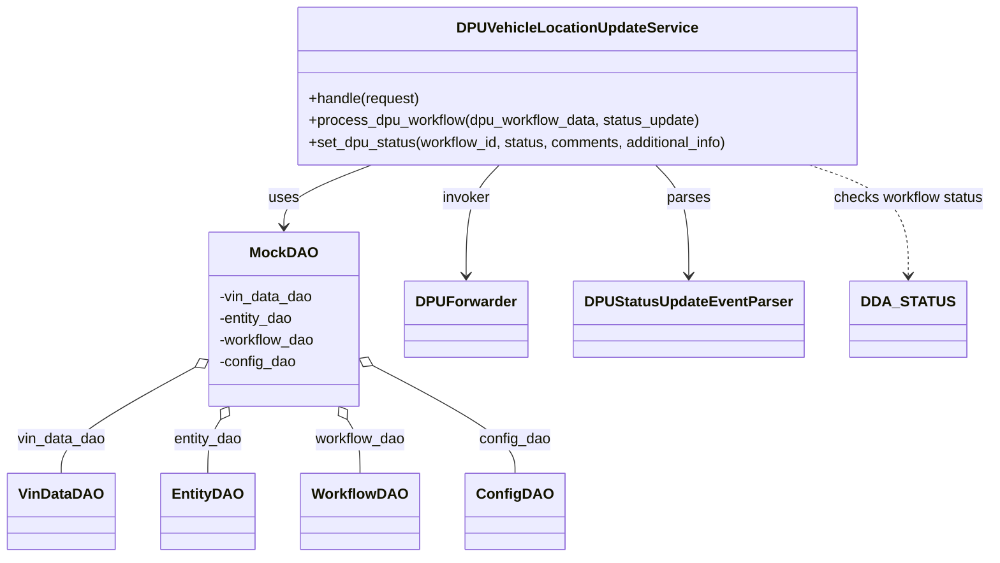
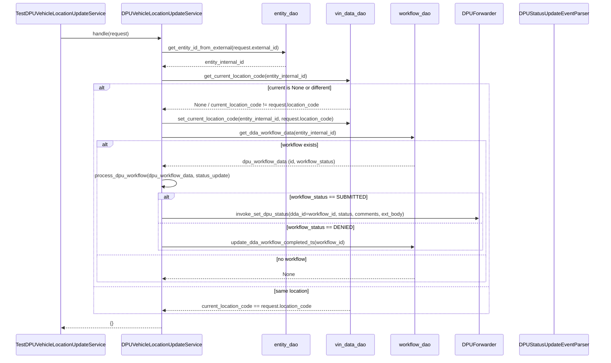

# Diagram: entity_core/entity_service/entity_service_tests/dpu/unit/test_dpu_vehicle_location_update.py

> Auto-generated by Obscura crawlers

## Diagram 1

### SVG

<svg id="container" width="1050.5625" xmlns="http://www.w3.org/2000/svg" class="classDiagram" height="614" viewBox="0 0 1050.5625 614" role="graphics-document document" aria-roledescription="class"><g><defs><marker id="container_class-aggregationStart" class="marker aggregation class" refX="18" refY="7" markerWidth="190" markerHeight="240" orient="auto"><path d="M 18,7 L9,13 L1,7 L9,1 Z"></path></marker></defs><defs><marker id="container_class-aggregationEnd" class="marker aggregation class" refX="1" refY="7" markerWidth="20" markerHeight="28" orient="auto"><path d="M 18,7 L9,13 L1,7 L9,1 Z"></path></marker></defs><defs><marker id="container_class-extensionStart" class="marker extension class" refX="18" refY="7" markerWidth="190" markerHeight="240" orient="auto"><path d="M 1,7 L18,13 V 1 Z"></path></marker></defs><defs><marker id="container_class-extensionEnd" class="marker extension class" refX="1" refY="7" markerWidth="20" markerHeight="28" orient="auto"><path d="M 1,1 V 13 L18,7 Z"></path></marker></defs><defs><marker id="container_class-compositionStart" class="marker composition class" refX="18" refY="7" markerWidth="190" markerHeight="240" orient="auto"><path d="M 18,7 L9,13 L1,7 L9,1 Z"></path></marker></defs><defs><marker id="container_class-compositionEnd" class="marker composition class" refX="1" refY="7" markerWidth="20" markerHeight="28" orient="auto"><path d="M 18,7 L9,13 L1,7 L9,1 Z"></path></marker></defs><defs><marker id="container_class-dependencyStart" class="marker dependency class" refX="6" refY="7" markerWidth="190" markerHeight="240" orient="auto"><path d="M 5,7 L9,13 L1,7 L9,1 Z"></path></marker></defs><defs><marker id="container_class-dependencyEnd" class="marker dependency class" refX="13" refY="7" markerWidth="20" markerHeight="28" orient="auto"><path d="M 18,7 L9,13 L14,7 L9,1 Z"></path></marker></defs><defs><marker id="container_class-lollipopStart" class="marker lollipop class" refX="13" refY="7" markerWidth="190" markerHeight="240" orient="auto"><circle stroke="black" fill="transparent" cx="7" cy="7" r="6"></circle></marker></defs><defs><marker id="container_class-lollipopEnd" class="marker lollipop class" refX="1" refY="7" markerWidth="190" markerHeight="240" orient="auto"><circle stroke="black" fill="transparent" cx="7" cy="7" r="6"></circle></marker></defs><g class="root"><g class="clusters"></g><g class="edgePaths"><path d="M392.004,182L376.35,188.167C360.697,194.333,329.389,206.667,313.736,218C298.082,229.333,298.082,239.667,298.082,244.833L298.082,250" id="id_DPUVehicleLocationUpdateService_MockDAO_1" class="edge-thickness-normal edge-pattern-solid relation" style=";;;" data-edge="true" data-et="edge" data-id="id_DPUVehicleLocationUpdateService_MockDAO_1" data-points="W3sieCI6MzkyLjAwNDAzMjI1ODA2NDUsInkiOjE4Mn0seyJ4IjoyOTguMDgyMDMxMjUsInkiOjIxOX0seyJ4IjoyOTguMDgyMDMxMjUsInkiOjI1Nn1d" marker-end="url(#container_class-dependencyEnd)"></path><path d="M530.362,182L524.515,188.167C518.668,194.333,506.975,206.667,501.128,227C495.281,247.333,495.281,275.667,495.281,289.833L495.281,304" id="id_DPUVehicleLocationUpdateService_DPUForwarder_2" class="edge-thickness-normal edge-pattern-solid relation" style=";;;" data-edge="true" data-et="edge" data-id="id_DPUVehicleLocationUpdateService_DPUForwarder_2" data-points="W3sieCI6NTMwLjM2MTU0ODYzOTExMjksInkiOjE4Mn0seyJ4Ijo0OTUuMjgxMjUsInkiOjIxOX0seyJ4Ijo0OTUuMjgxMjUsInkiOjMxMH1d" marker-end="url(#container_class-dependencyEnd)"></path><path d="M695.334,182L701.18,188.167C707.027,194.333,718.721,206.667,724.567,227C730.414,247.333,730.414,275.667,730.414,289.833L730.414,304" id="id_DPUVehicleLocationUpdateService_DPUStatusUpdateEventParser_3" class="edge-thickness-normal edge-pattern-solid relation" style=";;;" data-edge="true" data-et="edge" data-id="id_DPUVehicleLocationUpdateService_DPUStatusUpdateEventParser_3" data-points="W3sieCI6Njk1LjMzMzc2Mzg2MDg4NzEsInkiOjE4Mn0seyJ4Ijo3MzAuNDE0MDYyNSwieSI6MjE5fSx7IngiOjczMC40MTQwNjI1LCJ5IjozMTB9XQ==" marker-end="url(#container_class-dependencyEnd)"></path><path d="M200.254,407.493L177.481,420.411C154.708,433.329,109.163,459.164,86.39,478.249C63.617,497.333,63.617,509.667,63.617,515.833L63.617,522" id="id_MockDAO_VinDataDAO_4" class="edge-thickness-normal edge-pattern-solid relation" style=";;;" data-edge="true" data-et="edge" data-id="id_MockDAO_VinDataDAO_4" data-points="W3sieCI6MjE1LjI1NzgxMjUsInkiOjM5OC45ODE5NzM1NzY3OTU1NX0seyJ4Ijo2My42MTcxODc1LCJ5Ijo0ODV9LHsieCI6NjMuNjE3MTg3NSwieSI6NTIyfV0=" marker-start="url(#container_class-aggregationStart)"></path><path d="M231.23,462.769L228.994,466.474C226.757,470.179,222.285,477.59,220.049,487.461C217.813,497.333,217.813,509.667,217.813,515.833L217.813,522" id="id_MockDAO_EntityDAO_5" class="edge-thickness-normal edge-pattern-solid relation" style=";;;" data-edge="true" data-et="edge" data-id="id_MockDAO_EntityDAO_5" data-points="W3sieCI6MjQwLjE0MzEyMTQ3NTU2MzksInkiOjQ0OH0seyJ4IjoyMTcuODEyNSwieSI6NDg1fSx7IngiOjIxNy44MTI1LCJ5Ijo1MjJ9XQ==" marker-start="url(#container_class-aggregationStart)"></path><path d="M364.934,462.769L367.171,466.474C369.407,470.179,373.879,477.59,376.115,487.461C378.352,497.333,378.352,509.667,378.352,515.833L378.352,522" id="id_MockDAO_WorkflowDAO_6" class="edge-thickness-normal edge-pattern-solid relation" style=";;;" data-edge="true" data-et="edge" data-id="id_MockDAO_WorkflowDAO_6" data-points="W3sieCI6MzU2LjAyMDk0MTAyNDQzNjA3LCJ5Ijo0NDh9LHsieCI6Mzc4LjM1MTU2MjUsInkiOjQ4NX0seyJ4IjozNzguMzUxNTYyNSwieSI6NTIyfV0=" marker-start="url(#container_class-aggregationStart)"></path><path d="M396.03,405.73L420.115,418.941C444.2,432.153,492.369,458.577,516.454,477.955C540.539,497.333,540.539,509.667,540.539,515.833L540.539,522" id="id_MockDAO_ConfigDAO_7" class="edge-thickness-normal edge-pattern-solid relation" style=";;;" data-edge="true" data-et="edge" data-id="id_MockDAO_ConfigDAO_7" data-points="W3sieCI6MzgwLjkwNjI1LCJ5IjozOTcuNDMzMjkxOTgxNTA0NDV9LHsieCI6NTQwLjUzOTA2MjUsInkiOjQ4NX0seyJ4Ijo1NDAuNTM5MDYyNSwieSI6NTIyfV0=" marker-start="url(#container_class-aggregationStart)"></path><path d="M855.669,182L872.88,188.167C890.092,194.333,924.515,206.667,941.726,227C958.938,247.333,958.938,275.667,958.938,289.833L958.938,304" id="id_DPUVehicleLocationUpdateService_DDA_STATUS_8" class="edge-thickness-normal edge-pattern-dashed relation" style=";;;" data-edge="true" data-et="edge" data-id="id_DPUVehicleLocationUpdateService_DDA_STATUS_8" data-points="W3sieCI6ODU1LjY2ODc1NjMwMDQwMzIsInkiOjE4Mn0seyJ4Ijo5NTguOTM3NSwieSI6MjE5fSx7IngiOjk1OC45Mzc1LCJ5IjozMTB9XQ==" marker-end="url(#container_class-dependencyEnd)"></path></g><g class="edgeLabels"><g class="edgeLabel" transform="translate(298.08203125, 219)"><g class="label" data-id="id_DPUVehicleLocationUpdateService_MockDAO_1" transform="translate(-16.4921875, -12)"><foreignObject width="32.984375" height="24">

uses

</foreignObject></g></g><g class="edgeLabel" transform="translate(495.28125, 219)"><g class="label" data-id="id_DPUVehicleLocationUpdateService_DPUForwarder_2" transform="translate(-26.9375, -12)"><foreignObject width="53.875" height="24">

invoker

</foreignObject></g></g><g class="edgeLabel" transform="translate(730.4140625, 219)"><g class="label" data-id="id_DPUVehicleLocationUpdateService_DPUStatusUpdateEventParser_3" transform="translate(-23.828125, -12)"><foreignObject width="47.65625" height="24">

parses

</foreignObject></g></g><g class="edgeLabel" transform="translate(63.6171875, 485)"><g class="label" data-id="id_MockDAO_VinDataDAO_4" transform="translate(-49.015625, -12)"><foreignObject width="98.03125" height="24">

vin_data_dao

</foreignObject></g></g><g class="edgeLabel" transform="translate(217.8125, 485)"><g class="label" data-id="id_MockDAO_EntityDAO_5" transform="translate(-38.546875, -12)"><foreignObject width="77.09375" height="24">

entity_dao

</foreignObject></g></g><g class="edgeLabel" transform="translate(378.3515625, 485)"><g class="label" data-id="id_MockDAO_WorkflowDAO_6" transform="translate(-50.3515625, -12)"><foreignObject width="100.703125" height="24">

workflow_dao

</foreignObject></g></g><g class="edgeLabel" transform="translate(540.5390625, 485)"><g class="label" data-id="id_MockDAO_ConfigDAO_7" transform="translate(-39.625, -12)"><foreignObject width="79.25" height="24">

config_dao

</foreignObject></g></g><g class="edgeLabel" transform="translate(958.9375, 219)"><g class="label" data-id="id_DPUVehicleLocationUpdateService_DDA_STATUS_8" transform="translate(-83.625, -12)"><foreignObject width="167.25" height="24">

checks workflow status

</foreignObject></g></g></g><g class="nodes"><g class="node default" id="classId-DPUVehicleLocationUpdateService-0" transform="translate(612.84765625, 95)"><g class="basic label-container"><path d="M-311.1484375 -87 L311.1484375 -87 L311.1484375 87 L-311.1484375 87" stroke="none" stroke-width="0" fill="#ECECFF" style=""></path><path d="M-311.1484375 -87 C-173.74999643159146 -87, -36.35155536318291 -87, 311.1484375 -87 M-311.1484375 -87 C-162.37277643594095 -87, -13.597115371881898 -87, 311.1484375 -87 M311.1484375 -87 C311.1484375 -19.7434190293731, 311.1484375 47.5131619412538, 311.1484375 87 M311.1484375 -87 C311.1484375 -30.29618910181553, 311.1484375 26.407621796368943, 311.1484375 87 M311.1484375 87 C133.45861636043736 87, -44.23120477912528 87, -311.1484375 87 M311.1484375 87 C88.75427308448732 87, -133.63989133102535 87, -311.1484375 87 M-311.1484375 87 C-311.1484375 20.819303834274976, -311.1484375 -45.36139233145005, -311.1484375 -87 M-311.1484375 87 C-311.1484375 51.60822606071828, -311.1484375 16.21645212143656, -311.1484375 -87" stroke="#9370DB" stroke-width="1.3" fill="none" stroke-dasharray="0 0" style=""></path></g><g class="annotation-group text" transform="translate(0, -63)"></g><g class="label-group text" transform="translate(-125.96875, -63)"><g class="label" style="font-weight: bolder" transform="translate(0,-12)"><foreignObject width="251.9375" height="24">

DPUVehicleLocationUpdateService

</foreignObject></g></g><g class="members-group text" transform="translate(-299.1484375, -15)"></g><g class="methods-group text" transform="translate(-299.1484375, 15)"><g class="label" style="" transform="translate(0,-12)"><foreignObject width="123.96875" height="24">

+handle(request)

</foreignObject></g><g class="label" style="" transform="translate(0,12)"><foreignObject width="436.796875" height="24">

+process_dpu_workflow(dpu_workflow_data, status_update)

</foreignObject></g><g class="label" style="" transform="translate(0,36)"><foreignObject width="472.328125" height="24">

+set_dpu_status(workflow_id, status, comments, additional_info)

</foreignObject></g></g><g class="divider" style=""><path d="M-311.1484375 -39 C-84.78220470480801 -39, 141.58402809038398 -39, 311.1484375 -39 M-311.1484375 -39 C-110.46531149671392 -39, 90.21781450657215 -39, 311.1484375 -39" stroke="#9370DB" stroke-width="1.3" fill="none" stroke-dasharray="0 0" style=""></path></g><g class="divider" style=""><path d="M-311.1484375 -15 C-126.26315142834599 -15, 58.622134643308016 -15, 311.1484375 -15 M-311.1484375 -15 C-150.24474191864854 -15, 10.658953662702913 -15, 311.1484375 -15" stroke="#9370DB" stroke-width="1.3" fill="none" stroke-dasharray="0 0" style=""></path></g></g><g class="node default" id="classId-MockDAO-1" transform="translate(298.08203125, 352)"><g class="basic label-container"><path d="M-82.82421875 -96 L82.82421875 -96 L82.82421875 96 L-82.82421875 96" stroke="none" stroke-width="0" fill="#ECECFF" style=""></path><path d="M-82.82421875 -96 C-36.1512955670199 -96, 10.521627615960199 -96, 82.82421875 -96 M-82.82421875 -96 C-19.96377970875689 -96, 42.89665933248622 -96, 82.82421875 -96 M82.82421875 -96 C82.82421875 -36.46911850106889, 82.82421875 23.061762997862218, 82.82421875 96 M82.82421875 -96 C82.82421875 -44.141605395141426, 82.82421875 7.716789209717149, 82.82421875 96 M82.82421875 96 C19.15958172799487 96, -44.50505529401026 96, -82.82421875 96 M82.82421875 96 C38.12363492758228 96, -6.576948894835439 96, -82.82421875 96 M-82.82421875 96 C-82.82421875 21.563644119940832, -82.82421875 -52.872711760118335, -82.82421875 -96 M-82.82421875 96 C-82.82421875 53.698414533610915, -82.82421875 11.39682906722183, -82.82421875 -96" stroke="#9370DB" stroke-width="1.3" fill="none" stroke-dasharray="0 0" style=""></path></g><g class="annotation-group text" transform="translate(0, -72)"></g><g class="label-group text" transform="translate(-34.5078125, -72)"><g class="label" style="font-weight: bolder" transform="translate(0,-12)"><foreignObject width="69.015625" height="24">

MockDAO

</foreignObject></g></g><g class="members-group text" transform="translate(-70.82421875, -24)"><g class="label" style="" transform="translate(0,-12)"><foreignObject width="104.3125" height="24">

-vin_data_dao

</foreignObject></g><g class="label" style="" transform="translate(0,12)"><foreignObject width="83.546875" height="24">

-entity_dao

</foreignObject></g><g class="label" style="" transform="translate(0,36)"><foreignObject width="107.140625" height="24">

-workflow_dao

</foreignObject></g><g class="label" style="" transform="translate(0,60)"><foreignObject width="85.703125" height="24">

-config_dao

</foreignObject></g></g><g class="methods-group text" transform="translate(-70.82421875, 96)"></g><g class="divider" style=""><path d="M-82.82421875 -48 C-42.94771530589616 -48, -3.071211861792321 -48, 82.82421875 -48 M-82.82421875 -48 C-35.260874942306636 -48, 12.302468865386729 -48, 82.82421875 -48" stroke="#9370DB" stroke-width="1.3" fill="none" stroke-dasharray="0 0" style=""></path></g><g class="divider" style=""><path d="M-82.82421875 72 C-25.88747831772629 72, 31.049262114547417 72, 82.82421875 72 M-82.82421875 72 C-24.128932943202926 72, 34.56635286359415 72, 82.82421875 72" stroke="#9370DB" stroke-width="1.3" fill="none" stroke-dasharray="0 0" style=""></path></g></g><g class="node default" id="classId-VinDataDAO-2" transform="translate(63.6171875, 564)"><g class="basic label-container"><path d="M-55.6171875 -42 L55.6171875 -42 L55.6171875 42 L-55.6171875 42" stroke="none" stroke-width="0" fill="#ECECFF" style=""></path><path d="M-55.6171875 -42 C-14.584431818365019 -42, 26.448323863269962 -42, 55.6171875 -42 M-55.6171875 -42 C-18.49916940853805 -42, 18.618848682923897 -42, 55.6171875 -42 M55.6171875 -42 C55.6171875 -23.085659195894152, 55.6171875 -4.171318391788304, 55.6171875 42 M55.6171875 -42 C55.6171875 -24.468368571369027, 55.6171875 -6.936737142738053, 55.6171875 42 M55.6171875 42 C13.34785254926166 42, -28.92148240147668 42, -55.6171875 42 M55.6171875 42 C24.52553110015508 42, -6.566125299689837 42, -55.6171875 42 M-55.6171875 42 C-55.6171875 12.854873580911878, -55.6171875 -16.290252838176244, -55.6171875 -42 M-55.6171875 42 C-55.6171875 16.227552264056982, -55.6171875 -9.544895471886036, -55.6171875 -42" stroke="#9370DB" stroke-width="1.3" fill="none" stroke-dasharray="0 0" style=""></path></g><g class="annotation-group text" transform="translate(0, -18)"></g><g class="label-group text" transform="translate(-43.6171875, -18)"><g class="label" style="font-weight: bolder" transform="translate(0,-12)"><foreignObject width="87.234375" height="24">

VinDataDAO

</foreignObject></g></g><g class="members-group text" transform="translate(-43.6171875, 30)"></g><g class="methods-group text" transform="translate(-43.6171875, 60)"></g><g class="divider" style=""><path d="M-55.6171875 6 C-13.143377340896876 6, 29.330432818206248 6, 55.6171875 6 M-55.6171875 6 C-16.05647202743048 6, 23.50424344513904 6, 55.6171875 6" stroke="#9370DB" stroke-width="1.3" fill="none" stroke-dasharray="0 0" style=""></path></g><g class="divider" style=""><path d="M-55.6171875 24 C-26.968024266071644 24, 1.681138967856711 24, 55.6171875 24 M-55.6171875 24 C-21.556435746823922 24, 12.504316006352155 24, 55.6171875 24" stroke="#9370DB" stroke-width="1.3" fill="none" stroke-dasharray="0 0" style=""></path></g></g><g class="node default" id="classId-EntityDAO-3" transform="translate(217.8125, 564)"><g class="basic label-container"><path d="M-48.578125 -42 L48.578125 -42 L48.578125 42 L-48.578125 42" stroke="none" stroke-width="0" fill="#ECECFF" style=""></path><path d="M-48.578125 -42 C-17.379695773377996 -42, 13.818733453244008 -42, 48.578125 -42 M-48.578125 -42 C-26.20014267988039 -42, -3.8221603597607796 -42, 48.578125 -42 M48.578125 -42 C48.578125 -13.863582537005744, 48.578125 14.272834925988512, 48.578125 42 M48.578125 -42 C48.578125 -20.750514205509237, 48.578125 0.4989715889815258, 48.578125 42 M48.578125 42 C26.692642144017128 42, 4.807159288034256 42, -48.578125 42 M48.578125 42 C14.03343998764575 42, -20.5112450247085 42, -48.578125 42 M-48.578125 42 C-48.578125 17.33125631976683, -48.578125 -7.337487360466341, -48.578125 -42 M-48.578125 42 C-48.578125 25.106462313968777, -48.578125 8.212924627937554, -48.578125 -42" stroke="#9370DB" stroke-width="1.3" fill="none" stroke-dasharray="0 0" style=""></path></g><g class="annotation-group text" transform="translate(0, -18)"></g><g class="label-group text" transform="translate(-36.578125, -18)"><g class="label" style="font-weight: bolder" transform="translate(0,-12)"><foreignObject width="73.15625" height="24">

EntityDAO

</foreignObject></g></g><g class="members-group text" transform="translate(-36.578125, 30)"></g><g class="methods-group text" transform="translate(-36.578125, 60)"></g><g class="divider" style=""><path d="M-48.578125 6 C-12.337119544412694 6, 23.903885911174612 6, 48.578125 6 M-48.578125 6 C-13.853440080910396 6, 20.87124483817921 6, 48.578125 6" stroke="#9370DB" stroke-width="1.3" fill="none" stroke-dasharray="0 0" style=""></path></g><g class="divider" style=""><path d="M-48.578125 24 C-13.278656869206372 24, 22.020811261587255 24, 48.578125 24 M-48.578125 24 C-23.574572731458264 24, 1.428979537083471 24, 48.578125 24" stroke="#9370DB" stroke-width="1.3" fill="none" stroke-dasharray="0 0" style=""></path></g></g><g class="node default" id="classId-WorkflowDAO-4" transform="translate(378.3515625, 564)"><g class="basic label-container"><path d="M-61.9609375 -42 L61.9609375 -42 L61.9609375 42 L-61.9609375 42" stroke="none" stroke-width="0" fill="#ECECFF" style=""></path><path d="M-61.9609375 -42 C-34.494691888042034 -42, -7.028446276084068 -42, 61.9609375 -42 M-61.9609375 -42 C-25.588108121778212 -42, 10.784721256443575 -42, 61.9609375 -42 M61.9609375 -42 C61.9609375 -23.31869553114603, 61.9609375 -4.63739106229206, 61.9609375 42 M61.9609375 -42 C61.9609375 -17.388998415598564, 61.9609375 7.222003168802871, 61.9609375 42 M61.9609375 42 C33.78092276020489 42, 5.600908020409783 42, -61.9609375 42 M61.9609375 42 C29.00822145514953 42, -3.9444945897009376 42, -61.9609375 42 M-61.9609375 42 C-61.9609375 9.0059184017843, -61.9609375 -23.9881631964314, -61.9609375 -42 M-61.9609375 42 C-61.9609375 10.670863174687494, -61.9609375 -20.658273650625013, -61.9609375 -42" stroke="#9370DB" stroke-width="1.3" fill="none" stroke-dasharray="0 0" style=""></path></g><g class="annotation-group text" transform="translate(0, -18)"></g><g class="label-group text" transform="translate(-49.9609375, -18)"><g class="label" style="font-weight: bolder" transform="translate(0,-12)"><foreignObject width="99.921875" height="24">

WorkflowDAO

</foreignObject></g></g><g class="members-group text" transform="translate(-49.9609375, 30)"></g><g class="methods-group text" transform="translate(-49.9609375, 60)"></g><g class="divider" style=""><path d="M-61.9609375 6 C-28.140210930106157 6, 5.680515639787686 6, 61.9609375 6 M-61.9609375 6 C-32.432933489282945 6, -2.90492947856589 6, 61.9609375 6" stroke="#9370DB" stroke-width="1.3" fill="none" stroke-dasharray="0 0" style=""></path></g><g class="divider" style=""><path d="M-61.9609375 24 C-25.079761622897053 24, 11.801414254205895 24, 61.9609375 24 M-61.9609375 24 C-29.300879785738715 24, 3.35917792852257 24, 61.9609375 24" stroke="#9370DB" stroke-width="1.3" fill="none" stroke-dasharray="0 0" style=""></path></g></g><g class="node default" id="classId-ConfigDAO-5" transform="translate(540.5390625, 564)"><g class="basic label-container"><path d="M-50.2265625 -42 L50.2265625 -42 L50.2265625 42 L-50.2265625 42" stroke="none" stroke-width="0" fill="#ECECFF" style=""></path><path d="M-50.2265625 -42 C-29.33594527683006 -42, -8.44532805366012 -42, 50.2265625 -42 M-50.2265625 -42 C-19.003231226536535 -42, 12.22010004692693 -42, 50.2265625 -42 M50.2265625 -42 C50.2265625 -21.299708635379233, 50.2265625 -0.5994172707584653, 50.2265625 42 M50.2265625 -42 C50.2265625 -10.962349594513064, 50.2265625 20.07530081097387, 50.2265625 42 M50.2265625 42 C26.634551874446316 42, 3.0425412488926327 42, -50.2265625 42 M50.2265625 42 C25.687379754625603 42, 1.1481970092512057 42, -50.2265625 42 M-50.2265625 42 C-50.2265625 16.762523559651193, -50.2265625 -8.474952880697614, -50.2265625 -42 M-50.2265625 42 C-50.2265625 15.04290640571713, -50.2265625 -11.91418718856574, -50.2265625 -42" stroke="#9370DB" stroke-width="1.3" fill="none" stroke-dasharray="0 0" style=""></path></g><g class="annotation-group text" transform="translate(0, -18)"></g><g class="label-group text" transform="translate(-38.2265625, -18)"><g class="label" style="font-weight: bolder" transform="translate(0,-12)"><foreignObject width="76.453125" height="24">

ConfigDAO

</foreignObject></g></g><g class="members-group text" transform="translate(-38.2265625, 30)"></g><g class="methods-group text" transform="translate(-38.2265625, 60)"></g><g class="divider" style=""><path d="M-50.2265625 6 C-11.320201444266367 6, 27.586159611467266 6, 50.2265625 6 M-50.2265625 6 C-15.28353451110614 6, 19.65949347778772 6, 50.2265625 6" stroke="#9370DB" stroke-width="1.3" fill="none" stroke-dasharray="0 0" style=""></path></g><g class="divider" style=""><path d="M-50.2265625 24 C-18.465301458083143 24, 13.295959583833714 24, 50.2265625 24 M-50.2265625 24 C-14.206334151778364 24, 21.81389419644327 24, 50.2265625 24" stroke="#9370DB" stroke-width="1.3" fill="none" stroke-dasharray="0 0" style=""></path></g></g><g class="node default" id="classId-DPUForwarder-6" transform="translate(495.28125, 352)"><g class="basic label-container"><path d="M-64.375 -42 L64.375 -42 L64.375 42 L-64.375 42" stroke="none" stroke-width="0" fill="#ECECFF" style=""></path><path d="M-64.375 -42 C-29.530531542230577 -42, 5.3139369155388465 -42, 64.375 -42 M-64.375 -42 C-21.471597400045574 -42, 21.43180519990885 -42, 64.375 -42 M64.375 -42 C64.375 -11.822349719637874, 64.375 18.355300560724253, 64.375 42 M64.375 -42 C64.375 -10.994056557924484, 64.375 20.011886884151032, 64.375 42 M64.375 42 C18.105210502996115 42, -28.16457899400777 42, -64.375 42 M64.375 42 C26.942049090172418 42, -10.490901819655164 42, -64.375 42 M-64.375 42 C-64.375 13.492446402033881, -64.375 -15.015107195932238, -64.375 -42 M-64.375 42 C-64.375 9.412659648147887, -64.375 -23.174680703704226, -64.375 -42" stroke="#9370DB" stroke-width="1.3" fill="none" stroke-dasharray="0 0" style=""></path></g><g class="annotation-group text" transform="translate(0, -18)"></g><g class="label-group text" transform="translate(-52.375, -18)"><g class="label" style="font-weight: bolder" transform="translate(0,-12)"><foreignObject width="104.75" height="24">

DPUForwarder

</foreignObject></g></g><g class="members-group text" transform="translate(-52.375, 30)"></g><g class="methods-group text" transform="translate(-52.375, 60)"></g><g class="divider" style=""><path d="M-64.375 6 C-19.341045648169903 6, 25.692908703660194 6, 64.375 6 M-64.375 6 C-36.8915013981501 6, -9.408002796300195 6, 64.375 6" stroke="#9370DB" stroke-width="1.3" fill="none" stroke-dasharray="0 0" style=""></path></g><g class="divider" style=""><path d="M-64.375 24 C-36.275515697343224 24, -8.176031394686447 24, 64.375 24 M-64.375 24 C-28.274602585472053 24, 7.825794829055894 24, 64.375 24" stroke="#9370DB" stroke-width="1.3" fill="none" stroke-dasharray="0 0" style=""></path></g></g><g class="node default" id="classId-DPUStatusUpdateEventParser-7" transform="translate(730.4140625, 352)"><g class="basic label-container"><path d="M-120.7578125 -42 L120.7578125 -42 L120.7578125 42 L-120.7578125 42" stroke="none" stroke-width="0" fill="#ECECFF" style=""></path><path d="M-120.7578125 -42 C-35.02820279201978 -42, 50.70140691596043 -42, 120.7578125 -42 M-120.7578125 -42 C-31.19941981715789 -42, 58.35897286568422 -42, 120.7578125 -42 M120.7578125 -42 C120.7578125 -9.530060546105304, 120.7578125 22.939878907789392, 120.7578125 42 M120.7578125 -42 C120.7578125 -24.81349160653376, 120.7578125 -7.626983213067518, 120.7578125 42 M120.7578125 42 C39.81836696821536 42, -41.121078563569284 42, -120.7578125 42 M120.7578125 42 C41.204439848565016 42, -38.34893280286997 42, -120.7578125 42 M-120.7578125 42 C-120.7578125 23.03427486870173, -120.7578125 4.068549737403458, -120.7578125 -42 M-120.7578125 42 C-120.7578125 8.799938769220205, -120.7578125 -24.40012246155959, -120.7578125 -42" stroke="#9370DB" stroke-width="1.3" fill="none" stroke-dasharray="0 0" style=""></path></g><g class="annotation-group text" transform="translate(0, -18)"></g><g class="label-group text" transform="translate(-108.7578125, -18)"><g class="label" style="font-weight: bolder" transform="translate(0,-12)"><foreignObject width="217.515625" height="24">

DPUStatusUpdateEventParser

</foreignObject></g></g><g class="members-group text" transform="translate(-108.7578125, 30)"></g><g class="methods-group text" transform="translate(-108.7578125, 60)"></g><g class="divider" style=""><path d="M-120.7578125 6 C-25.95080316730227 6, 68.85620616539546 6, 120.7578125 6 M-120.7578125 6 C-50.393586288138565 6, 19.97063992372287 6, 120.7578125 6" stroke="#9370DB" stroke-width="1.3" fill="none" stroke-dasharray="0 0" style=""></path></g><g class="divider" style=""><path d="M-120.7578125 24 C-49.688688477588215 24, 21.38043554482357 24, 120.7578125 24 M-120.7578125 24 C-45.94856989586043 24, 28.86067270827914 24, 120.7578125 24" stroke="#9370DB" stroke-width="1.3" fill="none" stroke-dasharray="0 0" style=""></path></g></g><g class="node default" id="classId-DDA_STATUS-8" transform="translate(958.9375, 352)"><g class="basic label-container"><path d="M-57.765625 -42 L57.765625 -42 L57.765625 42 L-57.765625 42" stroke="none" stroke-width="0" fill="#ECECFF" style=""></path><path d="M-57.765625 -42 C-26.053574772856543 -42, 5.658475454286915 -42, 57.765625 -42 M-57.765625 -42 C-14.624843728109703 -42, 28.515937543780595 -42, 57.765625 -42 M57.765625 -42 C57.765625 -8.514003530318774, 57.765625 24.97199293936245, 57.765625 42 M57.765625 -42 C57.765625 -13.767242063371285, 57.765625 14.46551587325743, 57.765625 42 M57.765625 42 C31.164180745066147 42, 4.562736490132295 42, -57.765625 42 M57.765625 42 C24.588686783262766 42, -8.588251433474468 42, -57.765625 42 M-57.765625 42 C-57.765625 19.8498708615604, -57.765625 -2.300258276879198, -57.765625 -42 M-57.765625 42 C-57.765625 23.69929813559297, -57.765625 5.398596271185937, -57.765625 -42" stroke="#9370DB" stroke-width="1.3" fill="none" stroke-dasharray="0 0" style=""></path></g><g class="annotation-group text" transform="translate(0, -18)"></g><g class="label-group text" transform="translate(-45.765625, -18)"><g class="label" style="font-weight: bolder" transform="translate(0,-12)"><foreignObject width="91.53125" height="24">

DDA_STATUS

</foreignObject></g></g><g class="members-group text" transform="translate(-45.765625, 30)"></g><g class="methods-group text" transform="translate(-45.765625, 60)"></g><g class="divider" style=""><path d="M-57.765625 6 C-16.777817756275383 6, 24.209989487449235 6, 57.765625 6 M-57.765625 6 C-28.556316158132418 6, 0.6529926837351638 6, 57.765625 6" stroke="#9370DB" stroke-width="1.3" fill="none" stroke-dasharray="0 0" style=""></path></g><g class="divider" style=""><path d="M-57.765625 24 C-30.211990030853645 24, -2.65835506170729 24, 57.765625 24 M-57.765625 24 C-31.320993671146045 24, -4.87636234229209 24, 57.765625 24" stroke="#9370DB" stroke-width="1.3" fill="none" stroke-dasharray="0 0" style=""></path></g></g></g></g></g></svg>

## Diagram 2

### SVG

<svg id="container" width="1967.5" xmlns="http://www.w3.org/2000/svg" height="1173" viewBox="-50 -10 1967.5 1173" role="graphics-document document" aria-roledescription="sequence"><g><rect x="1632.5" y="1087" fill="#eaeaea" stroke="#666" width="235" height="65" name="Parser" rx="3" ry="3" class="actor actor-bottom"></rect><text x="1750" y="1119.5" dominant-baseline="central" alignment-baseline="central" class="actor actor-box" style="text-anchor: middle; font-size: 16px; font-weight: 400;"><tspan x="1750" dy="0">DPUStatusUpdateEventParser</tspan></text></g><g><rect x="1432.5" y="1087" fill="#eaeaea" stroke="#666" width="150" height="65" name="Invoker" rx="3" ry="3" class="actor actor-bottom"></rect><text x="1507.5" y="1119.5" dominant-baseline="central" alignment-baseline="central" class="actor actor-box" style="text-anchor: middle; font-size: 16px; font-weight: 400;"><tspan x="1507.5" dy="0">DPUForwarder</tspan></text></g><g><rect x="1232.5" y="1087" fill="#eaeaea" stroke="#666" width="150" height="65" name="WorkflowDAO" rx="3" ry="3" class="actor actor-bottom"></rect><text x="1307.5" y="1119.5" dominant-baseline="central" alignment-baseline="central" class="actor actor-box" style="text-anchor: middle; font-size: 16px; font-weight: 400;"><tspan x="1307.5" dy="0">workflow_dao</tspan></text></g><g><rect x="1032.5" y="1087" fill="#eaeaea" stroke="#666" width="150" height="65" name="VinDAO" rx="3" ry="3" class="actor actor-bottom"></rect><text x="1107.5" y="1119.5" dominant-baseline="central" alignment-baseline="central" class="actor actor-box" style="text-anchor: middle; font-size: 16px; font-weight: 400;"><tspan x="1107.5" dy="0">vin_data_dao</tspan></text></g><g><rect x="832.5" y="1087" fill="#eaeaea" stroke="#666" width="150" height="65" name="EntityDAO" rx="3" ry="3" class="actor actor-bottom"></rect><text x="907.5" y="1119.5" dominant-baseline="central" alignment-baseline="central" class="actor actor-box" style="text-anchor: middle; font-size: 16px; font-weight: 400;"><tspan x="907.5" dy="0">entity_dao</tspan></text></g><g><rect x="348" y="1087" fill="#eaeaea" stroke="#666" width="269" height="65" name="Handler" rx="3" ry="3" class="actor actor-bottom"></rect><text x="482.5" y="1119.5" dominant-baseline="central" alignment-baseline="central" class="actor actor-box" style="text-anchor: middle; font-size: 16px; font-weight: 400;"><tspan x="482.5" dy="0">DPUVehicleLocationUpdateService</tspan></text></g><g><rect x="0" y="1087" fill="#eaeaea" stroke="#666" width="298" height="65" name="Test" rx="3" ry="3" class="actor actor-bottom"></rect><text x="149" y="1119.5" dominant-baseline="central" alignment-baseline="central" class="actor actor-box" style="text-anchor: middle; font-size: 16px; font-weight: 400;"><tspan x="149" dy="0">TestDPUVehicleLocationUpdateService</tspan></text></g><g><line id="actor6" x1="1750" y1="65" x2="1750" y2="1087" class="actor-line 200" stroke-width="0.5px" stroke="#999" name="Parser"></line><g id="root-6"><rect x="1632.5" y="0" fill="#eaeaea" stroke="#666" width="235" height="65" name="Parser" rx="3" ry="3" class="actor actor-top"></rect><text x="1750" y="32.5" dominant-baseline="central" alignment-baseline="central" class="actor actor-box" style="text-anchor: middle; font-size: 16px; font-weight: 400;"><tspan x="1750" dy="0">DPUStatusUpdateEventParser</tspan></text></g></g><g><line id="actor5" x1="1507.5" y1="65" x2="1507.5" y2="1087" class="actor-line 200" stroke-width="0.5px" stroke="#999" name="Invoker"></line><g id="root-5"><rect x="1432.5" y="0" fill="#eaeaea" stroke="#666" width="150" height="65" name="Invoker" rx="3" ry="3" class="actor actor-top"></rect><text x="1507.5" y="32.5" dominant-baseline="central" alignment-baseline="central" class="actor actor-box" style="text-anchor: middle; font-size: 16px; font-weight: 400;"><tspan x="1507.5" dy="0">DPUForwarder</tspan></text></g></g><g><line id="actor4" x1="1307.5" y1="65" x2="1307.5" y2="1087" class="actor-line 200" stroke-width="0.5px" stroke="#999" name="WorkflowDAO"></line><g id="root-4"><rect x="1232.5" y="0" fill="#eaeaea" stroke="#666" width="150" height="65" name="WorkflowDAO" rx="3" ry="3" class="actor actor-top"></rect><text x="1307.5" y="32.5" dominant-baseline="central" alignment-baseline="central" class="actor actor-box" style="text-anchor: middle; font-size: 16px; font-weight: 400;"><tspan x="1307.5" dy="0">workflow_dao</tspan></text></g></g><g><line id="actor3" x1="1107.5" y1="65" x2="1107.5" y2="1087" class="actor-line 200" stroke-width="0.5px" stroke="#999" name="VinDAO"></line><g id="root-3"><rect x="1032.5" y="0" fill="#eaeaea" stroke="#666" width="150" height="65" name="VinDAO" rx="3" ry="3" class="actor actor-top"></rect><text x="1107.5" y="32.5" dominant-baseline="central" alignment-baseline="central" class="actor actor-box" style="text-anchor: middle; font-size: 16px; font-weight: 400;"><tspan x="1107.5" dy="0">vin_data_dao</tspan></text></g></g><g><line id="actor2" x1="907.5" y1="65" x2="907.5" y2="1087" class="actor-line 200" stroke-width="0.5px" stroke="#999" name="EntityDAO"></line><g id="root-2"><rect x="832.5" y="0" fill="#eaeaea" stroke="#666" width="150" height="65" name="EntityDAO" rx="3" ry="3" class="actor actor-top"></rect><text x="907.5" y="32.5" dominant-baseline="central" alignment-baseline="central" class="actor actor-box" style="text-anchor: middle; font-size: 16px; font-weight: 400;"><tspan x="907.5" dy="0">entity_dao</tspan></text></g></g><g><line id="actor1" x1="482.5" y1="65" x2="482.5" y2="1087" class="actor-line 200" stroke-width="0.5px" stroke="#999" name="Handler"></line><g id="root-1"><rect x="348" y="0" fill="#eaeaea" stroke="#666" width="269" height="65" name="Handler" rx="3" ry="3" class="actor actor-top"></rect><text x="482.5" y="32.5" dominant-baseline="central" alignment-baseline="central" class="actor actor-box" style="text-anchor: middle; font-size: 16px; font-weight: 400;"><tspan x="482.5" dy="0">DPUVehicleLocationUpdateService</tspan></text></g></g><g><line id="actor0" x1="149" y1="65" x2="149" y2="1087" class="actor-line 200" stroke-width="0.5px" stroke="#999" name="Test"></line><g id="root-0"><rect x="0" y="0" fill="#eaeaea" stroke="#666" width="298" height="65" name="Test" rx="3" ry="3" class="actor actor-top"></rect><text x="149" y="32.5" dominant-baseline="central" alignment-baseline="central" class="actor actor-box" style="text-anchor: middle; font-size: 16px; font-weight: 400;"><tspan x="149" dy="0">TestDPUVehicleLocationUpdateService</tspan></text></g></g><g></g><defs><symbol id="computer" width="24" height="24"><path transform="scale(.5)" d="M2 2v13h20v-13h-20zm18 11h-16v-9h16v9zm-10.228 6l.466-1h3.524l.467 1h-4.457zm14.228 3h-24l2-6h2.104l-1.33 4h18.45l-1.297-4h2.073l2 6zm-5-10h-14v-7h14v7z"></path></symbol></defs><defs><symbol id="database" fill-rule="evenodd" clip-rule="evenodd"><path transform="scale(.5)" d="M12.258.001l.256.004.255.005.253.008.251.01.249.012.247.015.246.016.242.019.241.02.239.023.236.024.233.027.231.028.229.031.225.032.223.034.22.036.217.038.214.04.211.041.208.043.205.045.201.046.198.048.194.05.191.051.187.053.183.054.18.056.175.057.172.059.168.06.163.061.16.063.155.064.15.066.074.033.073.033.071.034.07.034.069.035.068.035.067.035.066.035.064.036.064.036.062.036.06.036.06.037.058.037.058.037.055.038.055.038.053.038.052.038.051.039.05.039.048.039.047.039.045.04.044.04.043.04.041.04.04.041.039.041.037.041.036.041.034.041.033.042.032.042.03.042.029.042.027.042.026.043.024.043.023.043.021.043.02.043.018.044.017.043.015.044.013.044.012.044.011.045.009.044.007.045.006.045.004.045.002.045.001.045v17l-.001.045-.002.045-.004.045-.006.045-.007.045-.009.044-.011.045-.012.044-.013.044-.015.044-.017.043-.018.044-.02.043-.021.043-.023.043-.024.043-.026.043-.027.042-.029.042-.03.042-.032.042-.033.042-.034.041-.036.041-.037.041-.039.041-.04.041-.041.04-.043.04-.044.04-.045.04-.047.039-.048.039-.05.039-.051.039-.052.038-.053.038-.055.038-.055.038-.058.037-.058.037-.06.037-.06.036-.062.036-.064.036-.064.036-.066.035-.067.035-.068.035-.069.035-.07.034-.071.034-.073.033-.074.033-.15.066-.155.064-.16.063-.163.061-.168.06-.172.059-.175.057-.18.056-.183.054-.187.053-.191.051-.194.05-.198.048-.201.046-.205.045-.208.043-.211.041-.214.04-.217.038-.22.036-.223.034-.225.032-.229.031-.231.028-.233.027-.236.024-.239.023-.241.02-.242.019-.246.016-.247.015-.249.012-.251.01-.253.008-.255.005-.256.004-.258.001-.258-.001-.256-.004-.255-.005-.253-.008-.251-.01-.249-.012-.247-.015-.245-.016-.243-.019-.241-.02-.238-.023-.236-.024-.234-.027-.231-.028-.228-.031-.226-.032-.223-.034-.22-.036-.217-.038-.214-.04-.211-.041-.208-.043-.204-.045-.201-.046-.198-.048-.195-.05-.19-.051-.187-.053-.184-.054-.179-.056-.176-.057-.172-.059-.167-.06-.164-.061-.159-.063-.155-.064-.151-.066-.074-.033-.072-.033-.072-.034-.07-.034-.069-.035-.068-.035-.067-.035-.066-.035-.064-.036-.063-.036-.062-.036-.061-.036-.06-.037-.058-.037-.057-.037-.056-.038-.055-.038-.053-.038-.052-.038-.051-.039-.049-.039-.049-.039-.046-.039-.046-.04-.044-.04-.043-.04-.041-.04-.04-.041-.039-.041-.037-.041-.036-.041-.034-.041-.033-.042-.032-.042-.03-.042-.029-.042-.027-.042-.026-.043-.024-.043-.023-.043-.021-.043-.02-.043-.018-.044-.017-.043-.015-.044-.013-.044-.012-.044-.011-.045-.009-.044-.007-.045-.006-.045-.004-.045-.002-.045-.001-.045v-17l.001-.045.002-.045.004-.045.006-.045.007-.045.009-.044.011-.045.012-.044.013-.044.015-.044.017-.043.018-.044.02-.043.021-.043.023-.043.024-.043.026-.043.027-.042.029-.042.03-.042.032-.042.033-.042.034-.041.036-.041.037-.041.039-.041.04-.041.041-.04.043-.04.044-.04.046-.04.046-.039.049-.039.049-.039.051-.039.052-.038.053-.038.055-.038.056-.038.057-.037.058-.037.06-.037.061-.036.062-.036.063-.036.064-.036.066-.035.067-.035.068-.035.069-.035.07-.034.072-.034.072-.033.074-.033.151-.066.155-.064.159-.063.164-.061.167-.06.172-.059.176-.057.179-.056.184-.054.187-.053.19-.051.195-.05.198-.048.201-.046.204-.045.208-.043.211-.041.214-.04.217-.038.22-.036.223-.034.226-.032.228-.031.231-.028.234-.027.236-.024.238-.023.241-.02.243-.019.245-.016.247-.015.249-.012.251-.01.253-.008.255-.005.256-.004.258-.001.258.001zm-9.258 20.499v.01l.001.021.003.021.004.022.005.021.006.022.007.022.009.023.01.022.011.023.012.023.013.023.015.023.016.024.017.023.018.024.019.024.021.024.022.025.023.024.024.025.052.049.056.05.061.051.066.051.07.051.075.051.079.052.084.052.088.052.092.052.097.052.102.051.105.052.11.052.114.051.119.051.123.051.127.05.131.05.135.05.139.048.144.049.147.047.152.047.155.047.16.045.163.045.167.043.171.043.176.041.178.041.183.039.187.039.19.037.194.035.197.035.202.033.204.031.209.03.212.029.216.027.219.025.222.024.226.021.23.02.233.018.236.016.24.015.243.012.246.01.249.008.253.005.256.004.259.001.26-.001.257-.004.254-.005.25-.008.247-.011.244-.012.241-.014.237-.016.233-.018.231-.021.226-.021.224-.024.22-.026.216-.027.212-.028.21-.031.205-.031.202-.034.198-.034.194-.036.191-.037.187-.039.183-.04.179-.04.175-.042.172-.043.168-.044.163-.045.16-.046.155-.046.152-.047.148-.048.143-.049.139-.049.136-.05.131-.05.126-.05.123-.051.118-.052.114-.051.11-.052.106-.052.101-.052.096-.052.092-.052.088-.053.083-.051.079-.052.074-.052.07-.051.065-.051.06-.051.056-.05.051-.05.023-.024.023-.025.021-.024.02-.024.019-.024.018-.024.017-.024.015-.023.014-.024.013-.023.012-.023.01-.023.01-.022.008-.022.006-.022.006-.022.004-.022.004-.021.001-.021.001-.021v-4.127l-.077.055-.08.053-.083.054-.085.053-.087.052-.09.052-.093.051-.095.05-.097.05-.1.049-.102.049-.105.048-.106.047-.109.047-.111.046-.114.045-.115.045-.118.044-.12.043-.122.042-.124.042-.126.041-.128.04-.13.04-.132.038-.134.038-.135.037-.138.037-.139.035-.142.035-.143.034-.144.033-.147.032-.148.031-.15.03-.151.03-.153.029-.154.027-.156.027-.158.026-.159.025-.161.024-.162.023-.163.022-.165.021-.166.02-.167.019-.169.018-.169.017-.171.016-.173.015-.173.014-.175.013-.175.012-.177.011-.178.01-.179.008-.179.008-.181.006-.182.005-.182.004-.184.003-.184.002h-.37l-.184-.002-.184-.003-.182-.004-.182-.005-.181-.006-.179-.008-.179-.008-.178-.01-.176-.011-.176-.012-.175-.013-.173-.014-.172-.015-.171-.016-.17-.017-.169-.018-.167-.019-.166-.02-.165-.021-.163-.022-.162-.023-.161-.024-.159-.025-.157-.026-.156-.027-.155-.027-.153-.029-.151-.03-.15-.03-.148-.031-.146-.032-.145-.033-.143-.034-.141-.035-.14-.035-.137-.037-.136-.037-.134-.038-.132-.038-.13-.04-.128-.04-.126-.041-.124-.042-.122-.042-.12-.044-.117-.043-.116-.045-.113-.045-.112-.046-.109-.047-.106-.047-.105-.048-.102-.049-.1-.049-.097-.05-.095-.05-.093-.052-.09-.051-.087-.052-.085-.053-.083-.054-.08-.054-.077-.054v4.127zm0-5.654v.011l.001.021.003.021.004.021.005.022.006.022.007.022.009.022.01.022.011.023.012.023.013.023.015.024.016.023.017.024.018.024.019.024.021.024.022.024.023.025.024.024.052.05.056.05.061.05.066.051.07.051.075.052.079.051.084.052.088.052.092.052.097.052.102.052.105.052.11.051.114.051.119.052.123.05.127.051.131.05.135.049.139.049.144.048.147.048.152.047.155.046.16.045.163.045.167.044.171.042.176.042.178.04.183.04.187.038.19.037.194.036.197.034.202.033.204.032.209.03.212.028.216.027.219.025.222.024.226.022.23.02.233.018.236.016.24.014.243.012.246.01.249.008.253.006.256.003.259.001.26-.001.257-.003.254-.006.25-.008.247-.01.244-.012.241-.015.237-.016.233-.018.231-.02.226-.022.224-.024.22-.025.216-.027.212-.029.21-.03.205-.032.202-.033.198-.035.194-.036.191-.037.187-.039.183-.039.179-.041.175-.042.172-.043.168-.044.163-.045.16-.045.155-.047.152-.047.148-.048.143-.048.139-.05.136-.049.131-.05.126-.051.123-.051.118-.051.114-.052.11-.052.106-.052.101-.052.096-.052.092-.052.088-.052.083-.052.079-.052.074-.051.07-.052.065-.051.06-.05.056-.051.051-.049.023-.025.023-.024.021-.025.02-.024.019-.024.018-.024.017-.024.015-.023.014-.023.013-.024.012-.022.01-.023.01-.023.008-.022.006-.022.006-.022.004-.021.004-.022.001-.021.001-.021v-4.139l-.077.054-.08.054-.083.054-.085.052-.087.053-.09.051-.093.051-.095.051-.097.05-.1.049-.102.049-.105.048-.106.047-.109.047-.111.046-.114.045-.115.044-.118.044-.12.044-.122.042-.124.042-.126.041-.128.04-.13.039-.132.039-.134.038-.135.037-.138.036-.139.036-.142.035-.143.033-.144.033-.147.033-.148.031-.15.03-.151.03-.153.028-.154.028-.156.027-.158.026-.159.025-.161.024-.162.023-.163.022-.165.021-.166.02-.167.019-.169.018-.169.017-.171.016-.173.015-.173.014-.175.013-.175.012-.177.011-.178.009-.179.009-.179.007-.181.007-.182.005-.182.004-.184.003-.184.002h-.37l-.184-.002-.184-.003-.182-.004-.182-.005-.181-.007-.179-.007-.179-.009-.178-.009-.176-.011-.176-.012-.175-.013-.173-.014-.172-.015-.171-.016-.17-.017-.169-.018-.167-.019-.166-.02-.165-.021-.163-.022-.162-.023-.161-.024-.159-.025-.157-.026-.156-.027-.155-.028-.153-.028-.151-.03-.15-.03-.148-.031-.146-.033-.145-.033-.143-.033-.141-.035-.14-.036-.137-.036-.136-.037-.134-.038-.132-.039-.13-.039-.128-.04-.126-.041-.124-.042-.122-.043-.12-.043-.117-.044-.116-.044-.113-.046-.112-.046-.109-.046-.106-.047-.105-.048-.102-.049-.1-.049-.097-.05-.095-.051-.093-.051-.09-.051-.087-.053-.085-.052-.083-.054-.08-.054-.077-.054v4.139zm0-5.666v.011l.001.02.003.022.004.021.005.022.006.021.007.022.009.023.01.022.011.023.012.023.013.023.015.023.016.024.017.024.018.023.019.024.021.025.022.024.023.024.024.025.052.05.056.05.061.05.066.051.07.051.075.052.079.051.084.052.088.052.092.052.097.052.102.052.105.051.11.052.114.051.119.051.123.051.127.05.131.05.135.05.139.049.144.048.147.048.152.047.155.046.16.045.163.045.167.043.171.043.176.042.178.04.183.04.187.038.19.037.194.036.197.034.202.033.204.032.209.03.212.028.216.027.219.025.222.024.226.021.23.02.233.018.236.017.24.014.243.012.246.01.249.008.253.006.256.003.259.001.26-.001.257-.003.254-.006.25-.008.247-.01.244-.013.241-.014.237-.016.233-.018.231-.02.226-.022.224-.024.22-.025.216-.027.212-.029.21-.03.205-.032.202-.033.198-.035.194-.036.191-.037.187-.039.183-.039.179-.041.175-.042.172-.043.168-.044.163-.045.16-.045.155-.047.152-.047.148-.048.143-.049.139-.049.136-.049.131-.051.126-.05.123-.051.118-.052.114-.051.11-.052.106-.052.101-.052.096-.052.092-.052.088-.052.083-.052.079-.052.074-.052.07-.051.065-.051.06-.051.056-.05.051-.049.023-.025.023-.025.021-.024.02-.024.019-.024.018-.024.017-.024.015-.023.014-.024.013-.023.012-.023.01-.022.01-.023.008-.022.006-.022.006-.022.004-.022.004-.021.001-.021.001-.021v-4.153l-.077.054-.08.054-.083.053-.085.053-.087.053-.09.051-.093.051-.095.051-.097.05-.1.049-.102.048-.105.048-.106.048-.109.046-.111.046-.114.046-.115.044-.118.044-.12.043-.122.043-.124.042-.126.041-.128.04-.13.039-.132.039-.134.038-.135.037-.138.036-.139.036-.142.034-.143.034-.144.033-.147.032-.148.032-.15.03-.151.03-.153.028-.154.028-.156.027-.158.026-.159.024-.161.024-.162.023-.163.023-.165.021-.166.02-.167.019-.169.018-.169.017-.171.016-.173.015-.173.014-.175.013-.175.012-.177.01-.178.01-.179.009-.179.007-.181.006-.182.006-.182.004-.184.003-.184.001-.185.001-.185-.001-.184-.001-.184-.003-.182-.004-.182-.006-.181-.006-.179-.007-.179-.009-.178-.01-.176-.01-.176-.012-.175-.013-.173-.014-.172-.015-.171-.016-.17-.017-.169-.018-.167-.019-.166-.02-.165-.021-.163-.023-.162-.023-.161-.024-.159-.024-.157-.026-.156-.027-.155-.028-.153-.028-.151-.03-.15-.03-.148-.032-.146-.032-.145-.033-.143-.034-.141-.034-.14-.036-.137-.036-.136-.037-.134-.038-.132-.039-.13-.039-.128-.041-.126-.041-.124-.041-.122-.043-.12-.043-.117-.044-.116-.044-.113-.046-.112-.046-.109-.046-.106-.048-.105-.048-.102-.048-.1-.05-.097-.049-.095-.051-.093-.051-.09-.052-.087-.052-.085-.053-.083-.053-.08-.054-.077-.054v4.153zm8.74-8.179l-.257.004-.254.005-.25.008-.247.011-.244.012-.241.014-.237.016-.233.018-.231.021-.226.022-.224.023-.22.026-.216.027-.212.028-.21.031-.205.032-.202.033-.198.034-.194.036-.191.038-.187.038-.183.04-.179.041-.175.042-.172.043-.168.043-.163.045-.16.046-.155.046-.152.048-.148.048-.143.048-.139.049-.136.05-.131.05-.126.051-.123.051-.118.051-.114.052-.11.052-.106.052-.101.052-.096.052-.092.052-.088.052-.083.052-.079.052-.074.051-.07.052-.065.051-.06.05-.056.05-.051.05-.023.025-.023.024-.021.024-.02.025-.019.024-.018.024-.017.023-.015.024-.014.023-.013.023-.012.023-.01.023-.01.022-.008.022-.006.023-.006.021-.004.022-.004.021-.001.021-.001.021.001.021.001.021.004.021.004.022.006.021.006.023.008.022.01.022.01.023.012.023.013.023.014.023.015.024.017.023.018.024.019.024.02.025.021.024.023.024.023.025.051.05.056.05.06.05.065.051.07.052.074.051.079.052.083.052.088.052.092.052.096.052.101.052.106.052.11.052.114.052.118.051.123.051.126.051.131.05.136.05.139.049.143.048.148.048.152.048.155.046.16.046.163.045.168.043.172.043.175.042.179.041.183.04.187.038.191.038.194.036.198.034.202.033.205.032.21.031.212.028.216.027.22.026.224.023.226.022.231.021.233.018.237.016.241.014.244.012.247.011.25.008.254.005.257.004.26.001.26-.001.257-.004.254-.005.25-.008.247-.011.244-.012.241-.014.237-.016.233-.018.231-.021.226-.022.224-.023.22-.026.216-.027.212-.028.21-.031.205-.032.202-.033.198-.034.194-.036.191-.038.187-.038.183-.04.179-.041.175-.042.172-.043.168-.043.163-.045.16-.046.155-.046.152-.048.148-.048.143-.048.139-.049.136-.05.131-.05.126-.051.123-.051.118-.051.114-.052.11-.052.106-.052.101-.052.096-.052.092-.052.088-.052.083-.052.079-.052.074-.051.07-.052.065-.051.06-.05.056-.05.051-.05.023-.025.023-.024.021-.024.02-.025.019-.024.018-.024.017-.023.015-.024.014-.023.013-.023.012-.023.01-.023.01-.022.008-.022.006-.023.006-.021.004-.022.004-.021.001-.021.001-.021-.001-.021-.001-.021-.004-.021-.004-.022-.006-.021-.006-.023-.008-.022-.01-.022-.01-.023-.012-.023-.013-.023-.014-.023-.015-.024-.017-.023-.018-.024-.019-.024-.02-.025-.021-.024-.023-.024-.023-.025-.051-.05-.056-.05-.06-.05-.065-.051-.07-.052-.074-.051-.079-.052-.083-.052-.088-.052-.092-.052-.096-.052-.101-.052-.106-.052-.11-.052-.114-.052-.118-.051-.123-.051-.126-.051-.131-.05-.136-.05-.139-.049-.143-.048-.148-.048-.152-.048-.155-.046-.16-.046-.163-.045-.168-.043-.172-.043-.175-.042-.179-.041-.183-.04-.187-.038-.191-.038-.194-.036-.198-.034-.202-.033-.205-.032-.21-.031-.212-.028-.216-.027-.22-.026-.224-.023-.226-.022-.231-.021-.233-.018-.237-.016-.241-.014-.244-.012-.247-.011-.25-.008-.254-.005-.257-.004-.26-.001-.26.001z"></path></symbol></defs><defs><symbol id="clock" width="24" height="24"><path transform="scale(.5)" d="M12 2c5.514 0 10 4.486 10 10s-4.486 10-10 10-10-4.486-10-10 4.486-10 10-10zm0-2c-6.627 0-12 5.373-12 12s5.373 12 12 12 12-5.373 12-12-5.373-12-12-12zm5.848 12.459c.202.038.202.333.001.372-1.907.361-6.045 1.111-6.547 1.111-.719 0-1.301-.582-1.301-1.301 0-.512.77-5.447 1.125-7.445.034-.192.312-.181.343.014l.985 6.238 5.394 1.011z"></path></symbol></defs><defs><marker id="arrowhead" refX="7.9" refY="5" markerUnits="userSpaceOnUse" markerWidth="12" markerHeight="12" orient="auto-start-reverse"><path d="M -1 0 L 10 5 L 0 10 z"></path></marker></defs><defs><marker id="crosshead" markerWidth="15" markerHeight="8" orient="auto" refX="4" refY="4.5"><path fill="none" stroke="#000000" stroke-width="1pt" d="M 1,2 L 6,7 M 6,2 L 1,7" style="stroke-dasharray: 0, 0;"></path></marker></defs><defs><marker id="filled-head" refX="15.5" refY="7" markerWidth="20" markerHeight="28" orient="auto"><path d="M 18,7 L9,13 L14,7 L9,1 Z"></path></marker></defs><defs><marker id="sequencenumber" refX="15" refY="15" markerWidth="60" markerHeight="40" orient="auto"><circle cx="15" cy="15" r="6"></circle></marker></defs><g><line x1="471.5" y1="627" x2="1518.5" y2="627" class="loopLine"></line><line x1="1518.5" y1="627" x2="1518.5" y2="813" class="loopLine"></line><line x1="471.5" y1="813" x2="1518.5" y2="813" class="loopLine"></line><line x1="471.5" y1="627" x2="471.5" y2="813" class="loopLine"></line><line x1="471.5" y1="725" x2="1518.5" y2="725" class="loopLine" style="stroke-dasharray: 3, 3;"></line><polygon points="471.5,627 521.5,627 521.5,640 513.1,647 471.5,647" class="labelBox"></polygon><text x="497" y="640" text-anchor="middle" dominant-baseline="middle" alignment-baseline="middle" class="labelText" style="font-size: 16px; font-weight: 400;">alt</text><text x="1020" y="645" text-anchor="middle" class="loopText" style="font-size: 16px; font-weight: 400;"><tspan x="1020">[workflow_status == SUBMITTED]</tspan></text><text x="995" y="743" text-anchor="middle" class="loopText" style="font-size: 16px; font-weight: 400;">[workflow_status == DENIED]</text></g><g><line x1="259" y1="456" x2="1528.5" y2="456" class="loopLine"></line><line x1="1528.5" y1="456" x2="1528.5" y2="916" class="loopLine"></line><line x1="259" y1="916" x2="1528.5" y2="916" class="loopLine"></line><line x1="259" y1="456" x2="259" y2="916" class="loopLine"></line><line x1="259" y1="828" x2="1528.5" y2="828" class="loopLine" style="stroke-dasharray: 3, 3;"></line><polygon points="259,456 309,456 309,469 300.6,476 259,476" class="labelBox"></polygon><text x="284" y="469" text-anchor="middle" dominant-baseline="middle" alignment-baseline="middle" class="labelText" style="font-size: 16px; font-weight: 400;">alt</text><text x="918.75" y="474" text-anchor="middle" class="loopText" style="font-size: 16px; font-weight: 400;"><tspan x="918.75">[workflow exists]</tspan></text><text x="893.75" y="846" text-anchor="middle" class="loopText" style="font-size: 16px; font-weight: 400;">[no workflow]</text></g><g><line x1="249" y1="267" x2="1538.5" y2="267" class="loopLine"></line><line x1="1538.5" y1="267" x2="1538.5" y2="1019" class="loopLine"></line><line x1="249" y1="1019" x2="1538.5" y2="1019" class="loopLine"></line><line x1="249" y1="267" x2="249" y2="1019" class="loopLine"></line><line x1="249" y1="931" x2="1538.5" y2="931" class="loopLine" style="stroke-dasharray: 3, 3;"></line><polygon points="249,267 299,267 299,280 290.6,287 249,287" class="labelBox"></polygon><text x="274" y="280" text-anchor="middle" dominant-baseline="middle" alignment-baseline="middle" class="labelText" style="font-size: 16px; font-weight: 400;">alt</text><text x="918.75" y="285" text-anchor="middle" class="loopText" style="font-size: 16px; font-weight: 400;"><tspan x="918.75">[current is None or different]</tspan></text><text x="893.75" y="949" text-anchor="middle" class="loopText" style="font-size: 16px; font-weight: 400;">[same location]</text></g><text x="314" y="80" text-anchor="middle" dominant-baseline="middle" alignment-baseline="middle" class="messageText" dy="1em" style="font-size: 16px; font-weight: 400;">handle(request)</text><line x1="150" y1="113" x2="478.5" y2="113" class="messageLine0" stroke-width="2" stroke="none" marker-end="url(#arrowhead)" style="fill: none;"></line><text x="694" y="128" text-anchor="middle" dominant-baseline="middle" alignment-baseline="middle" class="messageText" dy="1em" style="font-size: 16px; font-weight: 400;">get_entity_id_from_external(request.external_id)</text><line x1="483.5" y1="161" x2="903.5" y2="161" class="messageLine0" stroke-width="2" stroke="none" marker-end="url(#arrowhead)" style="fill: none;"></line><text x="697" y="176" text-anchor="middle" dominant-baseline="middle" alignment-baseline="middle" class="messageText" dy="1em" style="font-size: 16px; font-weight: 400;">entity_internal_id</text><line x1="906.5" y1="209" x2="486.5" y2="209" class="messageLine1" stroke-width="2" stroke="none" marker-end="url(#arrowhead)" style="stroke-dasharray: 3, 3; fill: none;"></line><text x="794" y="224" text-anchor="middle" dominant-baseline="middle" alignment-baseline="middle" class="messageText" dy="1em" style="font-size: 16px; font-weight: 400;">get_current_location_code(entity_internal_id)</text><line x1="483.5" y1="257" x2="1103.5" y2="257" class="messageLine0" stroke-width="2" stroke="none" marker-end="url(#arrowhead)" style="fill: none;"></line><text x="797" y="317" text-anchor="middle" dominant-baseline="middle" alignment-baseline="middle" class="messageText" dy="1em" style="font-size: 16px; font-weight: 400;">None / current_location_code != request.location_code</text><line x1="1106.5" y1="350" x2="486.5" y2="350" class="messageLine1" stroke-width="2" stroke="none" marker-end="url(#arrowhead)" style="stroke-dasharray: 3, 3; fill: none;"></line><text x="794" y="365" text-anchor="middle" dominant-baseline="middle" alignment-baseline="middle" class="messageText" dy="1em" style="font-size: 16px; font-weight: 400;">set_current_location_code(entity_internal_id, request.location_code)</text><line x1="483.5" y1="398" x2="1103.5" y2="398" class="messageLine0" stroke-width="2" stroke="none" marker-end="url(#arrowhead)" style="fill: none;"></line><text x="894" y="413" text-anchor="middle" dominant-baseline="middle" alignment-baseline="middle" class="messageText" dy="1em" style="font-size: 16px; font-weight: 400;">get_dda_workflow_data(entity_internal_id)</text><line x1="483.5" y1="446" x2="1303.5" y2="446" class="messageLine0" stroke-width="2" stroke="none" marker-end="url(#arrowhead)" style="fill: none;"></line><text x="897" y="506" text-anchor="middle" dominant-baseline="middle" alignment-baseline="middle" class="messageText" dy="1em" style="font-size: 16px; font-weight: 400;">dpu_workflow_data (id, workflow_status)</text><line x1="1306.5" y1="539" x2="486.5" y2="539" class="messageLine1" stroke-width="2" stroke="none" marker-end="url(#arrowhead)" style="stroke-dasharray: 3, 3; fill: none;"></line><text x="484" y="554" text-anchor="middle" dominant-baseline="middle" alignment-baseline="middle" class="messageText" dy="1em" style="font-size: 16px; font-weight: 400;">process_dpu_workflow(dpu_workflow_data, status_update)</text><path d="M 483.5,587 C 543.5,577 543.5,617 483.5,607" class="messageLine0" stroke-width="2" stroke="none" marker-end="url(#arrowhead)" style="fill: none;"></path><text x="994" y="677" text-anchor="middle" dominant-baseline="middle" alignment-baseline="middle" class="messageText" dy="1em" style="font-size: 16px; font-weight: 400;">invoke_set_dpu_status(dda_id=workflow_id, status, comments, ext_body)</text><line x1="483.5" y1="710" x2="1503.5" y2="710" class="messageLine0" stroke-width="2" stroke="none" marker-end="url(#arrowhead)" style="fill: none;"></line><text x="894" y="770" text-anchor="middle" dominant-baseline="middle" alignment-baseline="middle" class="messageText" dy="1em" style="font-size: 16px; font-weight: 400;">update_dda_workflow_completed_ts(workflow_id)</text><line x1="483.5" y1="803" x2="1303.5" y2="803" class="messageLine0" stroke-width="2" stroke="none" marker-end="url(#arrowhead)" style="fill: none;"></line><text x="897" y="873" text-anchor="middle" dominant-baseline="middle" alignment-baseline="middle" class="messageText" dy="1em" style="font-size: 16px; font-weight: 400;">None</text><line x1="1306.5" y1="906" x2="486.5" y2="906" class="messageLine1" stroke-width="2" stroke="none" marker-end="url(#arrowhead)" style="stroke-dasharray: 3, 3; fill: none;"></line><text x="797" y="976" text-anchor="middle" dominant-baseline="middle" alignment-baseline="middle" class="messageText" dy="1em" style="font-size: 16px; font-weight: 400;">current_location_code == request.location_code</text><line x1="1106.5" y1="1009" x2="486.5" y2="1009" class="messageLine1" stroke-width="2" stroke="none" marker-end="url(#arrowhead)" style="stroke-dasharray: 3, 3; fill: none;"></line><text x="317" y="1034" text-anchor="middle" dominant-baseline="middle" alignment-baseline="middle" class="messageText" dy="1em" style="font-size: 16px; font-weight: 400;">{}</text><line x1="481.5" y1="1067" x2="153" y2="1067" class="messageLine1" stroke-width="2" stroke="none" marker-end="url(#arrowhead)" style="stroke-dasharray: 3, 3; fill: none;"></line></svg>
