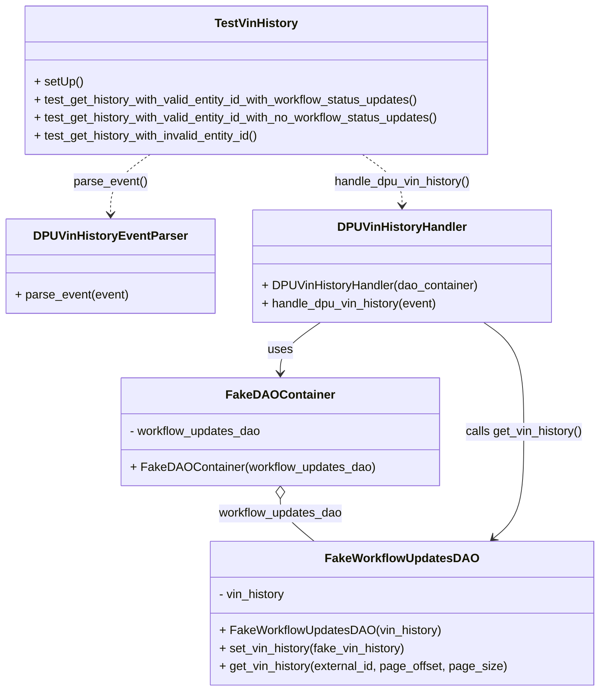
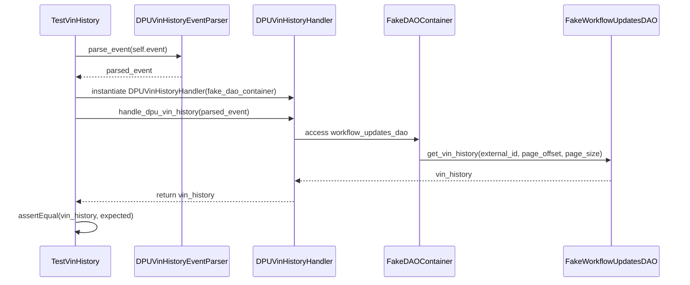

# Diagram: entity_core/entity_service/entity_service_tests/dpu/unit/test_dpu_vin_history_handler.py

> Auto-generated by Obscura crawlers

## Diagram 1

### SVG

<svg id="container" width="789.19140625" xmlns="http://www.w3.org/2000/svg" class="classDiagram" height="922" viewBox="0 0 789.19140625 922" role="graphics-document document" aria-roledescription="class"><g><defs><marker id="container_class-aggregationStart" class="marker aggregation class" refX="18" refY="7" markerWidth="190" markerHeight="240" orient="auto"><path d="M 18,7 L9,13 L1,7 L9,1 Z"></path></marker></defs><defs><marker id="container_class-aggregationEnd" class="marker aggregation class" refX="1" refY="7" markerWidth="20" markerHeight="28" orient="auto"><path d="M 18,7 L9,13 L1,7 L9,1 Z"></path></marker></defs><defs><marker id="container_class-extensionStart" class="marker extension class" refX="18" refY="7" markerWidth="190" markerHeight="240" orient="auto"><path d="M 1,7 L18,13 V 1 Z"></path></marker></defs><defs><marker id="container_class-extensionEnd" class="marker extension class" refX="1" refY="7" markerWidth="20" markerHeight="28" orient="auto"><path d="M 1,1 V 13 L18,7 Z"></path></marker></defs><defs><marker id="container_class-compositionStart" class="marker composition class" refX="18" refY="7" markerWidth="190" markerHeight="240" orient="auto"><path d="M 18,7 L9,13 L1,7 L9,1 Z"></path></marker></defs><defs><marker id="container_class-compositionEnd" class="marker composition class" refX="1" refY="7" markerWidth="20" markerHeight="28" orient="auto"><path d="M 18,7 L9,13 L1,7 L9,1 Z"></path></marker></defs><defs><marker id="container_class-dependencyStart" class="marker dependency class" refX="6" refY="7" markerWidth="190" markerHeight="240" orient="auto"><path d="M 5,7 L9,13 L1,7 L9,1 Z"></path></marker></defs><defs><marker id="container_class-dependencyEnd" class="marker dependency class" refX="13" refY="7" markerWidth="20" markerHeight="28" orient="auto"><path d="M 18,7 L9,13 L14,7 L9,1 Z"></path></marker></defs><defs><marker id="container_class-lollipopStart" class="marker lollipop class" refX="13" refY="7" markerWidth="190" markerHeight="240" orient="auto"><circle stroke="black" fill="transparent" cx="7" cy="7" r="6"></circle></marker></defs><defs><marker id="container_class-lollipopEnd" class="marker lollipop class" refX="1" refY="7" markerWidth="190" markerHeight="240" orient="auto"><circle stroke="black" fill="transparent" cx="7" cy="7" r="6"></circle></marker></defs><g class="root"><g class="clusters"></g><g class="edgePaths"><path d="M367.143,665.25L367.143,668.542C367.143,671.833,367.143,678.417,374.591,687.875C382.04,697.333,396.937,709.667,404.385,715.833L411.834,722" id="id_FakeDAOContainer_FakeWorkflowUpdatesDAO_1" class="edge-thickness-normal edge-pattern-solid relation" style=";;;" data-edge="true" data-et="edge" data-id="id_FakeDAOContainer_FakeWorkflowUpdatesDAO_1" data-points="W3sieCI6MzY3LjE0MjU3ODEyNSwieSI6NjQ4fSx7IngiOjM2Ny4xNDI1NzgxMjUsInkiOjY4NX0seyJ4Ijo0MTEuODMzNzA1MzU3MTQyOSwieSI6NzIyfV0=" marker-start="url(#container_class-aggregationStart)"></path><path d="M420.213,430L411.368,436.167C402.523,442.333,384.833,454.667,375.988,466C367.143,477.333,367.143,487.667,367.143,492.833L367.143,498" id="id_DPUVinHistoryHandler_FakeDAOContainer_2" class="edge-thickness-normal edge-pattern-solid relation" style=";;;" data-edge="true" data-et="edge" data-id="id_DPUVinHistoryHandler_FakeDAOContainer_2" data-points="W3sieCI6NDIwLjIxMzI5MTcxMzE2OTYsInkiOjQzMH0seyJ4IjozNjcuMTQyNTc4MTI1LCJ5Ijo0Njd9LHsieCI6MzY3LjE0MjU3ODEyNSwieSI6NTA0fV0=" marker-end="url(#container_class-dependencyEnd)"></path><path d="M635.365,430L644.21,436.167C653.055,442.333,670.745,454.667,679.59,479C688.436,503.333,688.436,539.667,688.436,576C688.436,612.333,688.436,648.667,681.757,672.362C675.079,696.058,661.723,707.116,655.044,712.645L648.366,718.174" id="id_DPUVinHistoryHandler_FakeWorkflowUpdatesDAO_3" class="edge-thickness-normal edge-pattern-solid relation" style=";;;" data-edge="true" data-et="edge" data-id="id_DPUVinHistoryHandler_FakeWorkflowUpdatesDAO_3" data-points="W3sieCI6NjM1LjM2NDgzMzI4NjgzMDQsInkiOjQzMH0seyJ4Ijo2ODguNDM1NTQ2ODc1LCJ5Ijo0Njd9LHsieCI6Njg4LjQzNTU0Njg3NSwieSI6NTc2fSx7IngiOjY4OC40MzU1NDY4NzUsInkiOjY4NX0seyJ4Ijo2NDMuNzQ0NDE5NjQyODU3MSwieSI6NzIyfV0=" marker-end="url(#container_class-dependencyEnd)"></path><path d="M196.105,206L187.402,212.167C178.698,218.333,161.29,230.667,152.587,244C143.883,257.333,143.883,271.667,143.883,278.833L143.883,286" id="id_TestVinHistory_DPUVinHistoryEventParser_4" class="edge-thickness-normal edge-pattern-dashed relation" style=";;;" data-edge="true" data-et="edge" data-id="id_TestVinHistory_DPUVinHistoryEventParser_4" data-points="W3sieCI6MTk2LjEwNTM1Mzg2MDI5NDEyLCJ5IjoyMDZ9LHsieCI6MTQzLjg4MjgxMjUsInkiOjI0M30seyJ4IjoxNDMuODgyODEyNSwieSI6MjkyfV0=" marker-end="url(#container_class-dependencyEnd)"></path><path d="M475.567,206L484.27,212.167C492.974,218.333,510.382,230.667,519.085,242C527.789,253.333,527.789,263.667,527.789,268.833L527.789,274" id="id_TestVinHistory_DPUVinHistoryHandler_5" class="edge-thickness-normal edge-pattern-dashed relation" style=";;;" data-edge="true" data-et="edge" data-id="id_TestVinHistory_DPUVinHistoryHandler_5" data-points="W3sieCI6NDc1LjU2NjUyMTEzOTcwNTg2LCJ5IjoyMDZ9LHsieCI6NTI3Ljc4OTA2MjUsInkiOjI0M30seyJ4Ijo1MjcuNzg5MDYyNSwieSI6MjgwfV0=" marker-end="url(#container_class-dependencyEnd)"></path></g><g class="edgeLabels"><g class="edgeLabel" transform="translate(367.142578125, 685)"><g class="label" data-id="id_FakeDAOContainer_FakeWorkflowUpdatesDAO_1" transform="translate(-83.59375, -12)"><foreignObject width="167.1875" height="24">

workflow_updates_dao

</foreignObject></g></g><g class="edgeLabel" transform="translate(367.142578125, 467)"><g class="label" data-id="id_DPUVinHistoryHandler_FakeDAOContainer_2" transform="translate(-16.4921875, -12)"><foreignObject width="32.984375" height="24">

uses

</foreignObject></g></g><g class="edgeLabel" transform="translate(688.435546875, 576)"><g class="label" data-id="id_DPUVinHistoryHandler_FakeWorkflowUpdatesDAO_3" transform="translate(-79.1328125, -12)"><foreignObject width="158.265625" height="24">

calls get_vin_history()

</foreignObject></g></g><g class="edgeLabel" transform="translate(143.8828125, 243)"><g class="label" data-id="id_TestVinHistory_DPUVinHistoryEventParser_4" transform="translate(-49.28125, -12)"><foreignObject width="98.5625" height="24">

parse_event()

</foreignObject></g></g><g class="edgeLabel" transform="translate(527.7890625, 243)"><g class="label" data-id="id_TestVinHistory_DPUVinHistoryHandler_5" transform="translate(-92.5, -12)"><foreignObject width="185" height="24">

handle_dpu_vin_history()

</foreignObject></g></g></g><g class="nodes"><g class="node default" id="classId-FakeWorkflowUpdatesDAO-0" transform="translate(527.7890625, 818)"><g class="basic label-container"><path d="M-253.40234375 -96 L253.40234375 -96 L253.40234375 96 L-253.40234375 96" stroke="none" stroke-width="0" fill="#ECECFF" style=""></path><path d="M-253.40234375 -96 C-91.5016225507294 -96, 70.39909864854121 -96, 253.40234375 -96 M-253.40234375 -96 C-58.547642593960916 -96, 136.30705856207817 -96, 253.40234375 -96 M253.40234375 -96 C253.40234375 -32.49038275208966, 253.40234375 31.019234495820683, 253.40234375 96 M253.40234375 -96 C253.40234375 -45.79483343312971, 253.40234375 4.410333133740579, 253.40234375 96 M253.40234375 96 C132.5485830364479 96, 11.69482232289576 96, -253.40234375 96 M253.40234375 96 C53.3750466368524 96, -146.6522504762952 96, -253.40234375 96 M-253.40234375 96 C-253.40234375 21.31639498085329, -253.40234375 -53.36721003829342, -253.40234375 -96 M-253.40234375 96 C-253.40234375 35.28234212154048, -253.40234375 -25.43531575691904, -253.40234375 -96" stroke="#9370DB" stroke-width="1.3" fill="none" stroke-dasharray="0 0" style=""></path></g><g class="annotation-group text" transform="translate(0, -72)"></g><g class="label-group text" transform="translate(-96.8828125, -72)"><g class="label" style="font-weight: bolder" transform="translate(0,-12)"><foreignObject width="193.765625" height="24">

FakeWorkflowUpdatesDAO

</foreignObject></g></g><g class="members-group text" transform="translate(-241.40234375, -24)"><g class="label" style="" transform="translate(0,-12)"><foreignObject width="91.0625" height="24">

- vin_history

</foreignObject></g></g><g class="methods-group text" transform="translate(-241.40234375, 24)"><g class="label" style="" transform="translate(0,-12)"><foreignObject width="292.625" height="24">

+ FakeWorkflowUpdatesDAO(vin_history)

</foreignObject></g><g class="label" style="" transform="translate(0,12)"><foreignObject width="251.140625" height="24">

+ set_vin_history(fake_vin_history)

</foreignObject></g><g class="label" style="" transform="translate(0,36)"><foreignObject width="385.921875" height="24">

+ get_vin_history(external_id, page_offset, page_size)

</foreignObject></g></g><g class="divider" style=""><path d="M-253.40234375 -48 C-150.54712618404932 -48, -47.69190861809864 -48, 253.40234375 -48 M-253.40234375 -48 C-86.07772422737403 -48, 81.24689529525193 -48, 253.40234375 -48" stroke="#9370DB" stroke-width="1.3" fill="none" stroke-dasharray="0 0" style=""></path></g><g class="divider" style=""><path d="M-253.40234375 0 C-63.74752790782628 0, 125.90728793434744 0, 253.40234375 0 M-253.40234375 0 C-71.41046093219137 0, 110.58142188561726 0, 253.40234375 0" stroke="#9370DB" stroke-width="1.3" fill="none" stroke-dasharray="0 0" style=""></path></g></g><g class="node default" id="classId-FakeDAOContainer-1" transform="translate(367.142578125, 576)"><g class="basic label-container"><path d="M-207.16015625 -72 L207.16015625 -72 L207.16015625 72 L-207.16015625 72" stroke="none" stroke-width="0" fill="#ECECFF" style=""></path><path d="M-207.16015625 -72 C-59.20824374807307 -72, 88.74366875385385 -72, 207.16015625 -72 M-207.16015625 -72 C-84.33337159298992 -72, 38.49341306402016 -72, 207.16015625 -72 M207.16015625 -72 C207.16015625 -21.704654551717674, 207.16015625 28.590690896564652, 207.16015625 72 M207.16015625 -72 C207.16015625 -17.218242530702412, 207.16015625 37.563514938595176, 207.16015625 72 M207.16015625 72 C118.1702205980819 72, 29.180284946163795 72, -207.16015625 72 M207.16015625 72 C51.36877161062441 72, -104.42261302875119 72, -207.16015625 72 M-207.16015625 72 C-207.16015625 29.79960656225829, -207.16015625 -12.40078687548342, -207.16015625 -72 M-207.16015625 72 C-207.16015625 22.984086299268554, -207.16015625 -26.03182740146289, -207.16015625 -72" stroke="#9370DB" stroke-width="1.3" fill="none" stroke-dasharray="0 0" style=""></path></g><g class="annotation-group text" transform="translate(0, -48)"></g><g class="label-group text" transform="translate(-67.4296875, -48)"><g class="label" style="font-weight: bolder" transform="translate(0,-12)"><foreignObject width="134.859375" height="24">

FakeDAOContainer

</foreignObject></g></g><g class="members-group text" transform="translate(-195.16015625, 0)"><g class="label" style="" transform="translate(0,-12)"><foreignObject width="177.875" height="24">

- workflow_updates_dao

</foreignObject></g></g><g class="methods-group text" transform="translate(-195.16015625, 48)"><g class="label" style="" transform="translate(0,-12)"><foreignObject width="322.890625" height="24">

+ FakeDAOContainer(workflow_updates_dao)

</foreignObject></g></g><g class="divider" style=""><path d="M-207.16015625 -24 C-49.176983106094724 -24, 108.80619003781055 -24, 207.16015625 -24 M-207.16015625 -24 C-82.71505897543369 -24, 41.730038299132616 -24, 207.16015625 -24" stroke="#9370DB" stroke-width="1.3" fill="none" stroke-dasharray="0 0" style=""></path></g><g class="divider" style=""><path d="M-207.16015625 24 C-113.35764260294947 24, -19.555128955898937 24, 207.16015625 24 M-207.16015625 24 C-64.41515996472674 24, 78.32983632054652 24, 207.16015625 24" stroke="#9370DB" stroke-width="1.3" fill="none" stroke-dasharray="0 0" style=""></path></g></g><g class="node default" id="classId-TestVinHistory-2" transform="translate(335.8359375, 107)"><g class="basic label-container"><path d="M-314.13671875 -99 L314.13671875 -99 L314.13671875 99 L-314.13671875 99" stroke="none" stroke-width="0" fill="#ECECFF" style=""></path><path d="M-314.13671875 -99 C-148.28166794853013 -99, 17.573382852939744 -99, 314.13671875 -99 M-314.13671875 -99 C-175.8381087314196 -99, -37.53949871283919 -99, 314.13671875 -99 M314.13671875 -99 C314.13671875 -40.491800676264766, 314.13671875 18.016398647470467, 314.13671875 99 M314.13671875 -99 C314.13671875 -49.895193816415066, 314.13671875 -0.7903876328301322, 314.13671875 99 M314.13671875 99 C101.23394463011093 99, -111.66882948977815 99, -314.13671875 99 M314.13671875 99 C156.22589456848127 99, -1.6849296130374682 99, -314.13671875 99 M-314.13671875 99 C-314.13671875 51.52764988858589, -314.13671875 4.055299777171783, -314.13671875 -99 M-314.13671875 99 C-314.13671875 29.194832270832478, -314.13671875 -40.610335458335044, -314.13671875 -99" stroke="#9370DB" stroke-width="1.3" fill="none" stroke-dasharray="0 0" style=""></path></g><g class="annotation-group text" transform="translate(0, -75)"></g><g class="label-group text" transform="translate(-53.1015625, -75)"><g class="label" style="font-weight: bolder" transform="translate(0,-12)"><foreignObject width="106.203125" height="24">

TestVinHistory

</foreignObject></g></g><g class="members-group text" transform="translate(-302.13671875, -27)"></g><g class="methods-group text" transform="translate(-302.13671875, 3)"><g class="label" style="" transform="translate(0,-12)"><foreignObject width="64.65625" height="24">

+ setUp()

</foreignObject></g><g class="label" style="" transform="translate(0,12)"><foreignObject width="524.453125" height="24">

+ test_get_history_with_valid_entity_id_with_workflow_status_updates()

</foreignObject></g><g class="label" style="" transform="translate(0,36)"><foreignObject width="551.171875" height="24">

+ test_get_history_with_valid_entity_id_with_no_workflow_status_updates()

</foreignObject></g><g class="label" style="" transform="translate(0,60)"><foreignObject width="307.28125" height="24">

+ test_get_history_with_invalid_entity_id()

</foreignObject></g></g><g class="divider" style=""><path d="M-314.13671875 -51 C-84.90000730561354 -51, 144.33670413877292 -51, 314.13671875 -51 M-314.13671875 -51 C-81.42185850777449 -51, 151.29300173445102 -51, 314.13671875 -51" stroke="#9370DB" stroke-width="1.3" fill="none" stroke-dasharray="0 0" style=""></path></g><g class="divider" style=""><path d="M-314.13671875 -27 C-151.41969295275948 -27, 11.297332844481048 -27, 314.13671875 -27 M-314.13671875 -27 C-166.39779553826756 -27, -18.658872326535118 -27, 314.13671875 -27" stroke="#9370DB" stroke-width="1.3" fill="none" stroke-dasharray="0 0" style=""></path></g></g><g class="node default" id="classId-DPUVinHistoryEventParser-3" transform="translate(143.8828125, 355)"><g class="basic label-container"><path d="M-135.8828125 -63 L135.8828125 -63 L135.8828125 63 L-135.8828125 63" stroke="none" stroke-width="0" fill="#ECECFF" style=""></path><path d="M-135.8828125 -63 C-69.14365016848065 -63, -2.4044878369612945 -63, 135.8828125 -63 M-135.8828125 -63 C-54.85333294461172 -63, 26.176146610776556 -63, 135.8828125 -63 M135.8828125 -63 C135.8828125 -23.27578749688164, 135.8828125 16.448425006236718, 135.8828125 63 M135.8828125 -63 C135.8828125 -20.371263869629693, 135.8828125 22.257472260740613, 135.8828125 63 M135.8828125 63 C60.30354571022771 63, -15.275721079544581 63, -135.8828125 63 M135.8828125 63 C54.798931601345615 63, -26.28494929730877 63, -135.8828125 63 M-135.8828125 63 C-135.8828125 28.509046005142302, -135.8828125 -5.9819079897153955, -135.8828125 -63 M-135.8828125 63 C-135.8828125 31.9576584476438, -135.8828125 0.915316895287603, -135.8828125 -63" stroke="#9370DB" stroke-width="1.3" fill="none" stroke-dasharray="0 0" style=""></path></g><g class="annotation-group text" transform="translate(0, -39)"></g><g class="label-group text" transform="translate(-96.640625, -39)"><g class="label" style="font-weight: bolder" transform="translate(0,-12)"><foreignObject width="193.28125" height="24">

DPUVinHistoryEventParser

</foreignObject></g></g><g class="members-group text" transform="translate(-123.8828125, 9)"></g><g class="methods-group text" transform="translate(-123.8828125, 39)"><g class="label" style="" transform="translate(0,-12)"><foreignObject width="151.125" height="24">

+ parse_event(event)

</foreignObject></g></g><g class="divider" style=""><path d="M-135.8828125 -15 C-68.88521693902806 -15, -1.8876213780561102 -15, 135.8828125 -15 M-135.8828125 -15 C-31.16937444813037 -15, 73.54406360373926 -15, 135.8828125 -15" stroke="#9370DB" stroke-width="1.3" fill="none" stroke-dasharray="0 0" style=""></path></g><g class="divider" style=""><path d="M-135.8828125 9 C-44.22373388686378 9, 47.43534472627243 9, 135.8828125 9 M-135.8828125 9 C-71.26798851969343 9, -6.653164539386864 9, 135.8828125 9" stroke="#9370DB" stroke-width="1.3" fill="none" stroke-dasharray="0 0" style=""></path></g></g><g class="node default" id="classId-DPUVinHistoryHandler-4" transform="translate(527.7890625, 355)"><g class="basic label-container"><path d="M-198.0234375 -75 L198.0234375 -75 L198.0234375 75 L-198.0234375 75" stroke="none" stroke-width="0" fill="#ECECFF" style=""></path><path d="M-198.0234375 -75 C-118.13938039832904 -75, -38.25532329665808 -75, 198.0234375 -75 M-198.0234375 -75 C-65.10864098849422 -75, 67.80615552301157 -75, 198.0234375 -75 M198.0234375 -75 C198.0234375 -38.39009897430332, 198.0234375 -1.7801979486066415, 198.0234375 75 M198.0234375 -75 C198.0234375 -36.35420330700383, 198.0234375 2.2915933859923427, 198.0234375 75 M198.0234375 75 C74.9612497195121 75, -48.10093806097581 75, -198.0234375 75 M198.0234375 75 C91.71182173674612 75, -14.599794026507766 75, -198.0234375 75 M-198.0234375 75 C-198.0234375 43.73986186885316, -198.0234375 12.479723737706323, -198.0234375 -75 M-198.0234375 75 C-198.0234375 36.492738326092, -198.0234375 -2.014523347815995, -198.0234375 -75" stroke="#9370DB" stroke-width="1.3" fill="none" stroke-dasharray="0 0" style=""></path></g><g class="annotation-group text" transform="translate(0, -51)"></g><g class="label-group text" transform="translate(-82.15625, -51)"><g class="label" style="font-weight: bolder" transform="translate(0,-12)"><foreignObject width="164.3125" height="24">

DPUVinHistoryHandler

</foreignObject></g></g><g class="members-group text" transform="translate(-186.0234375, -3)"></g><g class="methods-group text" transform="translate(-186.0234375, 27)"><g class="label" style="" transform="translate(0,-12)"><foreignObject width="289.890625" height="24">

+ DPUVinHistoryHandler(dao_container)

</foreignObject></g><g class="label" style="" transform="translate(0,12)"><foreignObject width="237.5625" height="24">

+ handle_dpu_vin_history(event)

</foreignObject></g></g><g class="divider" style=""><path d="M-198.0234375 -27 C-83.1137123540029 -27, 31.7960127919942 -27, 198.0234375 -27 M-198.0234375 -27 C-72.55119990928068 -27, 52.921037681438634 -27, 198.0234375 -27" stroke="#9370DB" stroke-width="1.3" fill="none" stroke-dasharray="0 0" style=""></path></g><g class="divider" style=""><path d="M-198.0234375 -3 C-117.89672872039024 -3, -37.770019940780486 -3, 198.0234375 -3 M-198.0234375 -3 C-113.57118524830781 -3, -29.118932996615627 -3, 198.0234375 -3" stroke="#9370DB" stroke-width="1.3" fill="none" stroke-dasharray="0 0" style=""></path></g></g></g></g></g></svg>

## Diagram 2

### SVG

<svg id="container" width="1546" xmlns="http://www.w3.org/2000/svg" height="633" viewBox="-98.5 -10 1546 633" role="graphics-document document" aria-roledescription="sequence"><g><rect x="1187.5" y="547" fill="#eaeaea" stroke="#666" width="210" height="65" name="DAO" rx="3" ry="3" class="actor actor-bottom"></rect><text x="1292.5" y="579.5" dominant-baseline="central" alignment-baseline="central" class="actor actor-box" style="text-anchor: middle; font-size: 16px; font-weight: 400;"><tspan x="1292.5" dy="0">FakeWorkflowUpdatesDAO</tspan></text></g><g><rect x="771.5" y="547" fill="#eaeaea" stroke="#666" width="154" height="65" name="Container" rx="3" ry="3" class="actor actor-bottom"></rect><text x="848.5" y="579.5" dominant-baseline="central" alignment-baseline="central" class="actor actor-box" style="text-anchor: middle; font-size: 16px; font-weight: 400;"><tspan x="848.5" dy="0">FakeDAOContainer</tspan></text></g><g><rect x="468.5" y="547" fill="#eaeaea" stroke="#666" width="184" height="65" name="Handler" rx="3" ry="3" class="actor actor-bottom"></rect><text x="560.5" y="579.5" dominant-baseline="central" alignment-baseline="central" class="actor actor-box" style="text-anchor: middle; font-size: 16px; font-weight: 400;"><tspan x="560.5" dy="0">DPUVinHistoryHandler</tspan></text></g><g><rect x="207.5" y="547" fill="#eaeaea" stroke="#666" width="211" height="65" name="Parser" rx="3" ry="3" class="actor actor-bottom"></rect><text x="313" y="579.5" dominant-baseline="central" alignment-baseline="central" class="actor actor-box" style="text-anchor: middle; font-size: 16px; font-weight: 400;"><tspan x="313" dy="0">DPUVinHistoryEventParser</tspan></text></g><g><rect x="0" y="547" fill="#eaeaea" stroke="#666" width="150" height="65" name="Test" rx="3" ry="3" class="actor actor-bottom"></rect><text x="75" y="579.5" dominant-baseline="central" alignment-baseline="central" class="actor actor-box" style="text-anchor: middle; font-size: 16px; font-weight: 400;"><tspan x="75" dy="0">TestVinHistory</tspan></text></g><g><line id="actor4" x1="1292.5" y1="65" x2="1292.5" y2="547" class="actor-line 200" stroke-width="0.5px" stroke="#999" name="DAO"></line><g id="root-4"><rect x="1187.5" y="0" fill="#eaeaea" stroke="#666" width="210" height="65" name="DAO" rx="3" ry="3" class="actor actor-top"></rect><text x="1292.5" y="32.5" dominant-baseline="central" alignment-baseline="central" class="actor actor-box" style="text-anchor: middle; font-size: 16px; font-weight: 400;"><tspan x="1292.5" dy="0">FakeWorkflowUpdatesDAO</tspan></text></g></g><g><line id="actor3" x1="848.5" y1="65" x2="848.5" y2="547" class="actor-line 200" stroke-width="0.5px" stroke="#999" name="Container"></line><g id="root-3"><rect x="771.5" y="0" fill="#eaeaea" stroke="#666" width="154" height="65" name="Container" rx="3" ry="3" class="actor actor-top"></rect><text x="848.5" y="32.5" dominant-baseline="central" alignment-baseline="central" class="actor actor-box" style="text-anchor: middle; font-size: 16px; font-weight: 400;"><tspan x="848.5" dy="0">FakeDAOContainer</tspan></text></g></g><g><line id="actor2" x1="560.5" y1="65" x2="560.5" y2="547" class="actor-line 200" stroke-width="0.5px" stroke="#999" name="Handler"></line><g id="root-2"><rect x="468.5" y="0" fill="#eaeaea" stroke="#666" width="184" height="65" name="Handler" rx="3" ry="3" class="actor actor-top"></rect><text x="560.5" y="32.5" dominant-baseline="central" alignment-baseline="central" class="actor actor-box" style="text-anchor: middle; font-size: 16px; font-weight: 400;"><tspan x="560.5" dy="0">DPUVinHistoryHandler</tspan></text></g></g><g><line id="actor1" x1="313" y1="65" x2="313" y2="547" class="actor-line 200" stroke-width="0.5px" stroke="#999" name="Parser"></line><g id="root-1"><rect x="207.5" y="0" fill="#eaeaea" stroke="#666" width="211" height="65" name="Parser" rx="3" ry="3" class="actor actor-top"></rect><text x="313" y="32.5" dominant-baseline="central" alignment-baseline="central" class="actor actor-box" style="text-anchor: middle; font-size: 16px; font-weight: 400;"><tspan x="313" dy="0">DPUVinHistoryEventParser</tspan></text></g></g><g><line id="actor0" x1="75" y1="65" x2="75" y2="547" class="actor-line 200" stroke-width="0.5px" stroke="#999" name="Test"></line><g id="root-0"><rect x="0" y="0" fill="#eaeaea" stroke="#666" width="150" height="65" name="Test" rx="3" ry="3" class="actor actor-top"></rect><text x="75" y="32.5" dominant-baseline="central" alignment-baseline="central" class="actor actor-box" style="text-anchor: middle; font-size: 16px; font-weight: 400;"><tspan x="75" dy="0">TestVinHistory</tspan></text></g></g><g></g><defs><symbol id="computer" width="24" height="24"><path transform="scale(.5)" d="M2 2v13h20v-13h-20zm18 11h-16v-9h16v9zm-10.228 6l.466-1h3.524l.467 1h-4.457zm14.228 3h-24l2-6h2.104l-1.33 4h18.45l-1.297-4h2.073l2 6zm-5-10h-14v-7h14v7z"></path></symbol></defs><defs><symbol id="database" fill-rule="evenodd" clip-rule="evenodd"><path transform="scale(.5)" d="M12.258.001l.256.004.255.005.253.008.251.01.249.012.247.015.246.016.242.019.241.02.239.023.236.024.233.027.231.028.229.031.225.032.223.034.22.036.217.038.214.04.211.041.208.043.205.045.201.046.198.048.194.05.191.051.187.053.183.054.18.056.175.057.172.059.168.06.163.061.16.063.155.064.15.066.074.033.073.033.071.034.07.034.069.035.068.035.067.035.066.035.064.036.064.036.062.036.06.036.06.037.058.037.058.037.055.038.055.038.053.038.052.038.051.039.05.039.048.039.047.039.045.04.044.04.043.04.041.04.04.041.039.041.037.041.036.041.034.041.033.042.032.042.03.042.029.042.027.042.026.043.024.043.023.043.021.043.02.043.018.044.017.043.015.044.013.044.012.044.011.045.009.044.007.045.006.045.004.045.002.045.001.045v17l-.001.045-.002.045-.004.045-.006.045-.007.045-.009.044-.011.045-.012.044-.013.044-.015.044-.017.043-.018.044-.02.043-.021.043-.023.043-.024.043-.026.043-.027.042-.029.042-.03.042-.032.042-.033.042-.034.041-.036.041-.037.041-.039.041-.04.041-.041.04-.043.04-.044.04-.045.04-.047.039-.048.039-.05.039-.051.039-.052.038-.053.038-.055.038-.055.038-.058.037-.058.037-.06.037-.06.036-.062.036-.064.036-.064.036-.066.035-.067.035-.068.035-.069.035-.07.034-.071.034-.073.033-.074.033-.15.066-.155.064-.16.063-.163.061-.168.06-.172.059-.175.057-.18.056-.183.054-.187.053-.191.051-.194.05-.198.048-.201.046-.205.045-.208.043-.211.041-.214.04-.217.038-.22.036-.223.034-.225.032-.229.031-.231.028-.233.027-.236.024-.239.023-.241.02-.242.019-.246.016-.247.015-.249.012-.251.01-.253.008-.255.005-.256.004-.258.001-.258-.001-.256-.004-.255-.005-.253-.008-.251-.01-.249-.012-.247-.015-.245-.016-.243-.019-.241-.02-.238-.023-.236-.024-.234-.027-.231-.028-.228-.031-.226-.032-.223-.034-.22-.036-.217-.038-.214-.04-.211-.041-.208-.043-.204-.045-.201-.046-.198-.048-.195-.05-.19-.051-.187-.053-.184-.054-.179-.056-.176-.057-.172-.059-.167-.06-.164-.061-.159-.063-.155-.064-.151-.066-.074-.033-.072-.033-.072-.034-.07-.034-.069-.035-.068-.035-.067-.035-.066-.035-.064-.036-.063-.036-.062-.036-.061-.036-.06-.037-.058-.037-.057-.037-.056-.038-.055-.038-.053-.038-.052-.038-.051-.039-.049-.039-.049-.039-.046-.039-.046-.04-.044-.04-.043-.04-.041-.04-.04-.041-.039-.041-.037-.041-.036-.041-.034-.041-.033-.042-.032-.042-.03-.042-.029-.042-.027-.042-.026-.043-.024-.043-.023-.043-.021-.043-.02-.043-.018-.044-.017-.043-.015-.044-.013-.044-.012-.044-.011-.045-.009-.044-.007-.045-.006-.045-.004-.045-.002-.045-.001-.045v-17l.001-.045.002-.045.004-.045.006-.045.007-.045.009-.044.011-.045.012-.044.013-.044.015-.044.017-.043.018-.044.02-.043.021-.043.023-.043.024-.043.026-.043.027-.042.029-.042.03-.042.032-.042.033-.042.034-.041.036-.041.037-.041.039-.041.04-.041.041-.04.043-.04.044-.04.046-.04.046-.039.049-.039.049-.039.051-.039.052-.038.053-.038.055-.038.056-.038.057-.037.058-.037.06-.037.061-.036.062-.036.063-.036.064-.036.066-.035.067-.035.068-.035.069-.035.07-.034.072-.034.072-.033.074-.033.151-.066.155-.064.159-.063.164-.061.167-.06.172-.059.176-.057.179-.056.184-.054.187-.053.19-.051.195-.05.198-.048.201-.046.204-.045.208-.043.211-.041.214-.04.217-.038.22-.036.223-.034.226-.032.228-.031.231-.028.234-.027.236-.024.238-.023.241-.02.243-.019.245-.016.247-.015.249-.012.251-.01.253-.008.255-.005.256-.004.258-.001.258.001zm-9.258 20.499v.01l.001.021.003.021.004.022.005.021.006.022.007.022.009.023.01.022.011.023.012.023.013.023.015.023.016.024.017.023.018.024.019.024.021.024.022.025.023.024.024.025.052.049.056.05.061.051.066.051.07.051.075.051.079.052.084.052.088.052.092.052.097.052.102.051.105.052.11.052.114.051.119.051.123.051.127.05.131.05.135.05.139.048.144.049.147.047.152.047.155.047.16.045.163.045.167.043.171.043.176.041.178.041.183.039.187.039.19.037.194.035.197.035.202.033.204.031.209.03.212.029.216.027.219.025.222.024.226.021.23.02.233.018.236.016.24.015.243.012.246.01.249.008.253.005.256.004.259.001.26-.001.257-.004.254-.005.25-.008.247-.011.244-.012.241-.014.237-.016.233-.018.231-.021.226-.021.224-.024.22-.026.216-.027.212-.028.21-.031.205-.031.202-.034.198-.034.194-.036.191-.037.187-.039.183-.04.179-.04.175-.042.172-.043.168-.044.163-.045.16-.046.155-.046.152-.047.148-.048.143-.049.139-.049.136-.05.131-.05.126-.05.123-.051.118-.052.114-.051.11-.052.106-.052.101-.052.096-.052.092-.052.088-.053.083-.051.079-.052.074-.052.07-.051.065-.051.06-.051.056-.05.051-.05.023-.024.023-.025.021-.024.02-.024.019-.024.018-.024.017-.024.015-.023.014-.024.013-.023.012-.023.01-.023.01-.022.008-.022.006-.022.006-.022.004-.022.004-.021.001-.021.001-.021v-4.127l-.077.055-.08.053-.083.054-.085.053-.087.052-.09.052-.093.051-.095.05-.097.05-.1.049-.102.049-.105.048-.106.047-.109.047-.111.046-.114.045-.115.045-.118.044-.12.043-.122.042-.124.042-.126.041-.128.04-.13.04-.132.038-.134.038-.135.037-.138.037-.139.035-.142.035-.143.034-.144.033-.147.032-.148.031-.15.03-.151.03-.153.029-.154.027-.156.027-.158.026-.159.025-.161.024-.162.023-.163.022-.165.021-.166.02-.167.019-.169.018-.169.017-.171.016-.173.015-.173.014-.175.013-.175.012-.177.011-.178.01-.179.008-.179.008-.181.006-.182.005-.182.004-.184.003-.184.002h-.37l-.184-.002-.184-.003-.182-.004-.182-.005-.181-.006-.179-.008-.179-.008-.178-.01-.176-.011-.176-.012-.175-.013-.173-.014-.172-.015-.171-.016-.17-.017-.169-.018-.167-.019-.166-.02-.165-.021-.163-.022-.162-.023-.161-.024-.159-.025-.157-.026-.156-.027-.155-.027-.153-.029-.151-.03-.15-.03-.148-.031-.146-.032-.145-.033-.143-.034-.141-.035-.14-.035-.137-.037-.136-.037-.134-.038-.132-.038-.13-.04-.128-.04-.126-.041-.124-.042-.122-.042-.12-.044-.117-.043-.116-.045-.113-.045-.112-.046-.109-.047-.106-.047-.105-.048-.102-.049-.1-.049-.097-.05-.095-.05-.093-.052-.09-.051-.087-.052-.085-.053-.083-.054-.08-.054-.077-.054v4.127zm0-5.654v.011l.001.021.003.021.004.021.005.022.006.022.007.022.009.022.01.022.011.023.012.023.013.023.015.024.016.023.017.024.018.024.019.024.021.024.022.024.023.025.024.024.052.05.056.05.061.05.066.051.07.051.075.052.079.051.084.052.088.052.092.052.097.052.102.052.105.052.11.051.114.051.119.052.123.05.127.051.131.05.135.049.139.049.144.048.147.048.152.047.155.046.16.045.163.045.167.044.171.042.176.042.178.04.183.04.187.038.19.037.194.036.197.034.202.033.204.032.209.03.212.028.216.027.219.025.222.024.226.022.23.02.233.018.236.016.24.014.243.012.246.01.249.008.253.006.256.003.259.001.26-.001.257-.003.254-.006.25-.008.247-.01.244-.012.241-.015.237-.016.233-.018.231-.02.226-.022.224-.024.22-.025.216-.027.212-.029.21-.03.205-.032.202-.033.198-.035.194-.036.191-.037.187-.039.183-.039.179-.041.175-.042.172-.043.168-.044.163-.045.16-.045.155-.047.152-.047.148-.048.143-.048.139-.05.136-.049.131-.05.126-.051.123-.051.118-.051.114-.052.11-.052.106-.052.101-.052.096-.052.092-.052.088-.052.083-.052.079-.052.074-.051.07-.052.065-.051.06-.05.056-.051.051-.049.023-.025.023-.024.021-.025.02-.024.019-.024.018-.024.017-.024.015-.023.014-.023.013-.024.012-.022.01-.023.01-.023.008-.022.006-.022.006-.022.004-.021.004-.022.001-.021.001-.021v-4.139l-.077.054-.08.054-.083.054-.085.052-.087.053-.09.051-.093.051-.095.051-.097.05-.1.049-.102.049-.105.048-.106.047-.109.047-.111.046-.114.045-.115.044-.118.044-.12.044-.122.042-.124.042-.126.041-.128.04-.13.039-.132.039-.134.038-.135.037-.138.036-.139.036-.142.035-.143.033-.144.033-.147.033-.148.031-.15.03-.151.03-.153.028-.154.028-.156.027-.158.026-.159.025-.161.024-.162.023-.163.022-.165.021-.166.02-.167.019-.169.018-.169.017-.171.016-.173.015-.173.014-.175.013-.175.012-.177.011-.178.009-.179.009-.179.007-.181.007-.182.005-.182.004-.184.003-.184.002h-.37l-.184-.002-.184-.003-.182-.004-.182-.005-.181-.007-.179-.007-.179-.009-.178-.009-.176-.011-.176-.012-.175-.013-.173-.014-.172-.015-.171-.016-.17-.017-.169-.018-.167-.019-.166-.02-.165-.021-.163-.022-.162-.023-.161-.024-.159-.025-.157-.026-.156-.027-.155-.028-.153-.028-.151-.03-.15-.03-.148-.031-.146-.033-.145-.033-.143-.033-.141-.035-.14-.036-.137-.036-.136-.037-.134-.038-.132-.039-.13-.039-.128-.04-.126-.041-.124-.042-.122-.043-.12-.043-.117-.044-.116-.044-.113-.046-.112-.046-.109-.046-.106-.047-.105-.048-.102-.049-.1-.049-.097-.05-.095-.051-.093-.051-.09-.051-.087-.053-.085-.052-.083-.054-.08-.054-.077-.054v4.139zm0-5.666v.011l.001.02.003.022.004.021.005.022.006.021.007.022.009.023.01.022.011.023.012.023.013.023.015.023.016.024.017.024.018.023.019.024.021.025.022.024.023.024.024.025.052.05.056.05.061.05.066.051.07.051.075.052.079.051.084.052.088.052.092.052.097.052.102.052.105.051.11.052.114.051.119.051.123.051.127.05.131.05.135.05.139.049.144.048.147.048.152.047.155.046.16.045.163.045.167.043.171.043.176.042.178.04.183.04.187.038.19.037.194.036.197.034.202.033.204.032.209.03.212.028.216.027.219.025.222.024.226.021.23.02.233.018.236.017.24.014.243.012.246.01.249.008.253.006.256.003.259.001.26-.001.257-.003.254-.006.25-.008.247-.01.244-.013.241-.014.237-.016.233-.018.231-.02.226-.022.224-.024.22-.025.216-.027.212-.029.21-.03.205-.032.202-.033.198-.035.194-.036.191-.037.187-.039.183-.039.179-.041.175-.042.172-.043.168-.044.163-.045.16-.045.155-.047.152-.047.148-.048.143-.049.139-.049.136-.049.131-.051.126-.05.123-.051.118-.052.114-.051.11-.052.106-.052.101-.052.096-.052.092-.052.088-.052.083-.052.079-.052.074-.052.07-.051.065-.051.06-.051.056-.05.051-.049.023-.025.023-.025.021-.024.02-.024.019-.024.018-.024.017-.024.015-.023.014-.024.013-.023.012-.023.01-.022.01-.023.008-.022.006-.022.006-.022.004-.022.004-.021.001-.021.001-.021v-4.153l-.077.054-.08.054-.083.053-.085.053-.087.053-.09.051-.093.051-.095.051-.097.05-.1.049-.102.048-.105.048-.106.048-.109.046-.111.046-.114.046-.115.044-.118.044-.12.043-.122.043-.124.042-.126.041-.128.04-.13.039-.132.039-.134.038-.135.037-.138.036-.139.036-.142.034-.143.034-.144.033-.147.032-.148.032-.15.03-.151.03-.153.028-.154.028-.156.027-.158.026-.159.024-.161.024-.162.023-.163.023-.165.021-.166.02-.167.019-.169.018-.169.017-.171.016-.173.015-.173.014-.175.013-.175.012-.177.01-.178.01-.179.009-.179.007-.181.006-.182.006-.182.004-.184.003-.184.001-.185.001-.185-.001-.184-.001-.184-.003-.182-.004-.182-.006-.181-.006-.179-.007-.179-.009-.178-.01-.176-.01-.176-.012-.175-.013-.173-.014-.172-.015-.171-.016-.17-.017-.169-.018-.167-.019-.166-.02-.165-.021-.163-.023-.162-.023-.161-.024-.159-.024-.157-.026-.156-.027-.155-.028-.153-.028-.151-.03-.15-.03-.148-.032-.146-.032-.145-.033-.143-.034-.141-.034-.14-.036-.137-.036-.136-.037-.134-.038-.132-.039-.13-.039-.128-.041-.126-.041-.124-.041-.122-.043-.12-.043-.117-.044-.116-.044-.113-.046-.112-.046-.109-.046-.106-.048-.105-.048-.102-.048-.1-.05-.097-.049-.095-.051-.093-.051-.09-.052-.087-.052-.085-.053-.083-.053-.08-.054-.077-.054v4.153zm8.74-8.179l-.257.004-.254.005-.25.008-.247.011-.244.012-.241.014-.237.016-.233.018-.231.021-.226.022-.224.023-.22.026-.216.027-.212.028-.21.031-.205.032-.202.033-.198.034-.194.036-.191.038-.187.038-.183.04-.179.041-.175.042-.172.043-.168.043-.163.045-.16.046-.155.046-.152.048-.148.048-.143.048-.139.049-.136.05-.131.05-.126.051-.123.051-.118.051-.114.052-.11.052-.106.052-.101.052-.096.052-.092.052-.088.052-.083.052-.079.052-.074.051-.07.052-.065.051-.06.05-.056.05-.051.05-.023.025-.023.024-.021.024-.02.025-.019.024-.018.024-.017.023-.015.024-.014.023-.013.023-.012.023-.01.023-.01.022-.008.022-.006.023-.006.021-.004.022-.004.021-.001.021-.001.021.001.021.001.021.004.021.004.022.006.021.006.023.008.022.01.022.01.023.012.023.013.023.014.023.015.024.017.023.018.024.019.024.02.025.021.024.023.024.023.025.051.05.056.05.06.05.065.051.07.052.074.051.079.052.083.052.088.052.092.052.096.052.101.052.106.052.11.052.114.052.118.051.123.051.126.051.131.05.136.05.139.049.143.048.148.048.152.048.155.046.16.046.163.045.168.043.172.043.175.042.179.041.183.04.187.038.191.038.194.036.198.034.202.033.205.032.21.031.212.028.216.027.22.026.224.023.226.022.231.021.233.018.237.016.241.014.244.012.247.011.25.008.254.005.257.004.26.001.26-.001.257-.004.254-.005.25-.008.247-.011.244-.012.241-.014.237-.016.233-.018.231-.021.226-.022.224-.023.22-.026.216-.027.212-.028.21-.031.205-.032.202-.033.198-.034.194-.036.191-.038.187-.038.183-.04.179-.041.175-.042.172-.043.168-.043.163-.045.16-.046.155-.046.152-.048.148-.048.143-.048.139-.049.136-.05.131-.05.126-.051.123-.051.118-.051.114-.052.11-.052.106-.052.101-.052.096-.052.092-.052.088-.052.083-.052.079-.052.074-.051.07-.052.065-.051.06-.05.056-.05.051-.05.023-.025.023-.024.021-.024.02-.025.019-.024.018-.024.017-.023.015-.024.014-.023.013-.023.012-.023.01-.023.01-.022.008-.022.006-.023.006-.021.004-.022.004-.021.001-.021.001-.021-.001-.021-.001-.021-.004-.021-.004-.022-.006-.021-.006-.023-.008-.022-.01-.022-.01-.023-.012-.023-.013-.023-.014-.023-.015-.024-.017-.023-.018-.024-.019-.024-.02-.025-.021-.024-.023-.024-.023-.025-.051-.05-.056-.05-.06-.05-.065-.051-.07-.052-.074-.051-.079-.052-.083-.052-.088-.052-.092-.052-.096-.052-.101-.052-.106-.052-.11-.052-.114-.052-.118-.051-.123-.051-.126-.051-.131-.05-.136-.05-.139-.049-.143-.048-.148-.048-.152-.048-.155-.046-.16-.046-.163-.045-.168-.043-.172-.043-.175-.042-.179-.041-.183-.04-.187-.038-.191-.038-.194-.036-.198-.034-.202-.033-.205-.032-.21-.031-.212-.028-.216-.027-.22-.026-.224-.023-.226-.022-.231-.021-.233-.018-.237-.016-.241-.014-.244-.012-.247-.011-.25-.008-.254-.005-.257-.004-.26-.001-.26.001z"></path></symbol></defs><defs><symbol id="clock" width="24" height="24"><path transform="scale(.5)" d="M12 2c5.514 0 10 4.486 10 10s-4.486 10-10 10-10-4.486-10-10 4.486-10 10-10zm0-2c-6.627 0-12 5.373-12 12s5.373 12 12 12 12-5.373 12-12-5.373-12-12-12zm5.848 12.459c.202.038.202.333.001.372-1.907.361-6.045 1.111-6.547 1.111-.719 0-1.301-.582-1.301-1.301 0-.512.77-5.447 1.125-7.445.034-.192.312-.181.343.014l.985 6.238 5.394 1.011z"></path></symbol></defs><defs><marker id="arrowhead" refX="7.9" refY="5" markerUnits="userSpaceOnUse" markerWidth="12" markerHeight="12" orient="auto-start-reverse"><path d="M -1 0 L 10 5 L 0 10 z"></path></marker></defs><defs><marker id="crosshead" markerWidth="15" markerHeight="8" orient="auto" refX="4" refY="4.5"><path fill="none" stroke="#000000" stroke-width="1pt" d="M 1,2 L 6,7 M 6,2 L 1,7" style="stroke-dasharray: 0, 0;"></path></marker></defs><defs><marker id="filled-head" refX="15.5" refY="7" markerWidth="20" markerHeight="28" orient="auto"><path d="M 18,7 L9,13 L14,7 L9,1 Z"></path></marker></defs><defs><marker id="sequencenumber" refX="15" refY="15" markerWidth="60" markerHeight="40" orient="auto"><circle cx="15" cy="15" r="6"></circle></marker></defs><text x="193" y="80" text-anchor="middle" dominant-baseline="middle" alignment-baseline="middle" class="messageText" dy="1em" style="font-size: 16px; font-weight: 400;">parse_event(self.event)</text><line x1="76" y1="113" x2="309" y2="113" class="messageLine0" stroke-width="2" stroke="none" marker-end="url(#arrowhead)" style="fill: none;"></line><text x="196" y="128" text-anchor="middle" dominant-baseline="middle" alignment-baseline="middle" class="messageText" dy="1em" style="font-size: 16px; font-weight: 400;">parsed_event</text><line x1="312" y1="161" x2="79" y2="161" class="messageLine1" stroke-width="2" stroke="none" marker-end="url(#arrowhead)" style="stroke-dasharray: 3, 3; fill: none;"></line><text x="316" y="176" text-anchor="middle" dominant-baseline="middle" alignment-baseline="middle" class="messageText" dy="1em" style="font-size: 16px; font-weight: 400;">instantiate DPUVinHistoryHandler(fake_dao_container)</text><line x1="76" y1="209" x2="556.5" y2="209" class="messageLine0" stroke-width="2" stroke="none" marker-end="url(#arrowhead)" style="fill: none;"></line><text x="316" y="224" text-anchor="middle" dominant-baseline="middle" alignment-baseline="middle" class="messageText" dy="1em" style="font-size: 16px; font-weight: 400;">handle_dpu_vin_history(parsed_event)</text><line x1="76" y1="257" x2="556.5" y2="257" class="messageLine0" stroke-width="2" stroke="none" marker-end="url(#arrowhead)" style="fill: none;"></line><text x="703" y="272" text-anchor="middle" dominant-baseline="middle" alignment-baseline="middle" class="messageText" dy="1em" style="font-size: 16px; font-weight: 400;">access workflow_updates_dao</text><line x1="561.5" y1="305" x2="844.5" y2="305" class="messageLine0" stroke-width="2" stroke="none" marker-end="url(#arrowhead)" style="fill: none;"></line><text x="1069" y="320" text-anchor="middle" dominant-baseline="middle" alignment-baseline="middle" class="messageText" dy="1em" style="font-size: 16px; font-weight: 400;">get_vin_history(external_id, page_offset, page_size)</text><line x1="849.5" y1="353" x2="1288.5" y2="353" class="messageLine0" stroke-width="2" stroke="none" marker-end="url(#arrowhead)" style="fill: none;"></line><text x="928" y="368" text-anchor="middle" dominant-baseline="middle" alignment-baseline="middle" class="messageText" dy="1em" style="font-size: 16px; font-weight: 400;">vin_history</text><line x1="1291.5" y1="401" x2="564.5" y2="401" class="messageLine1" stroke-width="2" stroke="none" marker-end="url(#arrowhead)" style="stroke-dasharray: 3, 3; fill: none;"></line><text x="319" y="416" text-anchor="middle" dominant-baseline="middle" alignment-baseline="middle" class="messageText" dy="1em" style="font-size: 16px; font-weight: 400;">return vin_history</text><line x1="559.5" y1="449" x2="79" y2="449" class="messageLine1" stroke-width="2" stroke="none" marker-end="url(#arrowhead)" style="stroke-dasharray: 3, 3; fill: none;"></line><text x="76" y="464" text-anchor="middle" dominant-baseline="middle" alignment-baseline="middle" class="messageText" dy="1em" style="font-size: 16px; font-weight: 400;">assertEqual(vin_history, expected)</text><path d="M 76,497 C 136,487 136,527 76,517" class="messageLine0" stroke-width="2" stroke="none" marker-end="url(#arrowhead)" style="fill: none;"></path></svg>
