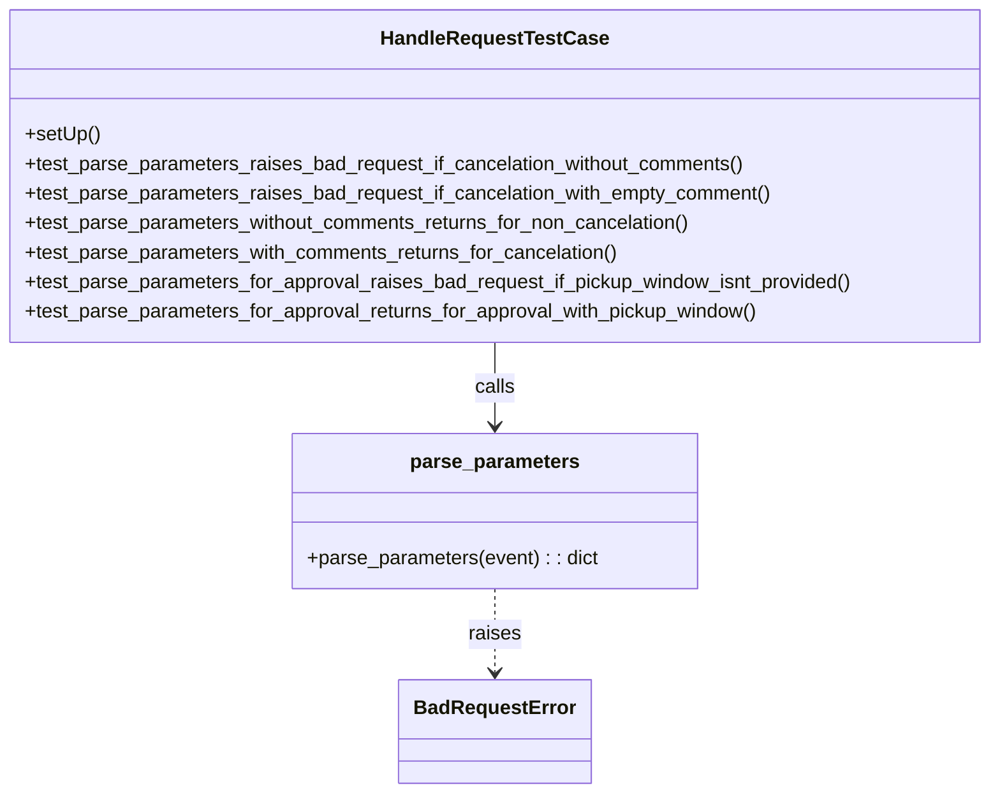

# Diagram: entity_core/entity_service/entity_service_tests/dpu/unit/test_handle_request.py


> Auto-generated by Obscura crawlers

## Diagram 1



### SVG

<svg id="container" width="807.8203125" xmlns="http://www.w3.org/2000/svg" class="classDiagram" height="644" viewBox="0 0 807.8203125 644" role="graphics-document document" aria-roledescription="class"><style>#container{font-family:"trebuchet ms",verdana,arial,sans-serif;font-size:16px;fill:#333;}@keyframes edge-animation-frame{from{stroke-dashoffset:0;}}@keyframes dash{to{stroke-dashoffset:0;}}#container .edge-animation-slow{stroke-dasharray:9,5!important;stroke-dashoffset:900;animation:dash 50s linear infinite;stroke-linecap:round;}#container .edge-animation-fast{stroke-dasharray:9,5!important;stroke-dashoffset:900;animation:dash 20s linear infinite;stroke-linecap:round;}#container .error-icon{fill:#552222;}#container .error-text{fill:#552222;stroke:#552222;}#container .edge-thickness-normal{stroke-width:1px;}#container .edge-thickness-thick{stroke-width:3.5px;}#container .edge-pattern-solid{stroke-dasharray:0;}#container .edge-thickness-invisible{stroke-width:0;fill:none;}#container .edge-pattern-dashed{stroke-dasharray:3;}#container .edge-pattern-dotted{stroke-dasharray:2;}#container .marker{fill:#333333;stroke:#333333;}#container .marker.cross{stroke:#333333;}#container svg{font-family:"trebuchet ms",verdana,arial,sans-serif;font-size:16px;}#container p{margin:0;}#container g.classGroup text{fill:#9370DB;stroke:none;font-family:"trebuchet ms",verdana,arial,sans-serif;font-size:10px;}#container g.classGroup text .title{font-weight:bolder;}#container .nodeLabel,#container .edgeLabel{color:#131300;}#container .edgeLabel .label rect{fill:#ECECFF;}#container .label text{fill:#131300;}#container .labelBkg{background:#ECECFF;}#container .edgeLabel .label span{background:#ECECFF;}#container .classTitle{font-weight:bolder;}#container .node rect,#container .node circle,#container .node ellipse,#container .node polygon,#container .node path{fill:#ECECFF;stroke:#9370DB;stroke-width:1px;}#container .divider{stroke:#9370DB;stroke-width:1;}#container g.clickable{cursor:pointer;}#container g.classGroup rect{fill:#ECECFF;stroke:#9370DB;}#container g.classGroup line{stroke:#9370DB;stroke-width:1;}#container .classLabel .box{stroke:none;stroke-width:0;fill:#ECECFF;opacity:0.5;}#container .classLabel .label{fill:#9370DB;font-size:10px;}#container .relation{stroke:#333333;stroke-width:1;fill:none;}#container .dashed-line{stroke-dasharray:3;}#container .dotted-line{stroke-dasharray:1 2;}#container #compositionStart,#container .composition{fill:#333333!important;stroke:#333333!important;stroke-width:1;}#container #compositionEnd,#container .composition{fill:#333333!important;stroke:#333333!important;stroke-width:1;}#container #dependencyStart,#container .dependency{fill:#333333!important;stroke:#333333!important;stroke-width:1;}#container #dependencyStart,#container .dependency{fill:#333333!important;stroke:#333333!important;stroke-width:1;}#container #extensionStart,#container .extension{fill:transparent!important;stroke:#333333!important;stroke-width:1;}#container #extensionEnd,#container .extension{fill:transparent!important;stroke:#333333!important;stroke-width:1;}#container #aggregationStart,#container .aggregation{fill:transparent!important;stroke:#333333!important;stroke-width:1;}#container #aggregationEnd,#container .aggregation{fill:transparent!important;stroke:#333333!important;stroke-width:1;}#container #lollipopStart,#container .lollipop{fill:#ECECFF!important;stroke:#333333!important;stroke-width:1;}#container #lollipopEnd,#container .lollipop{fill:#ECECFF!important;stroke:#333333!important;stroke-width:1;}#container .edgeTerminals{font-size:11px;line-height:initial;}#container .classTitleText{text-anchor:middle;font-size:18px;fill:#333;}#container .label-icon{display:inline-block;height:1em;overflow:visible;vertical-align:-0.125em;}#container .node .label-icon path{fill:currentColor;stroke:revert;stroke-width:revert;}#container :root{--mermaid-font-family:"trebuchet ms",verdana,arial,sans-serif;}</style><g><defs><marker id="container_class-aggregationStart" class="marker aggregation class" refX="18" refY="7" markerWidth="190" markerHeight="240" orient="auto"><path d="M 18,7 L9,13 L1,7 L9,1 Z"></path></marker></defs><defs><marker id="container_class-aggregationEnd" class="marker aggregation class" refX="1" refY="7" markerWidth="20" markerHeight="28" orient="auto"><path d="M 18,7 L9,13 L1,7 L9,1 Z"></path></marker></defs><defs><marker id="container_class-extensionStart" class="marker extension class" refX="18" refY="7" markerWidth="190" markerHeight="240" orient="auto"><path d="M 1,7 L18,13 V 1 Z"></path></marker></defs><defs><marker id="container_class-extensionEnd" class="marker extension class" refX="1" refY="7" markerWidth="20" markerHeight="28" orient="auto"><path d="M 1,1 V 13 L18,7 Z"></path></marker></defs><defs><marker id="container_class-compositionStart" class="marker composition class" refX="18" refY="7" markerWidth="190" markerHeight="240" orient="auto"><path d="M 18,7 L9,13 L1,7 L9,1 Z"></path></marker></defs><defs><marker id="container_class-compositionEnd" class="marker composition class" refX="1" refY="7" markerWidth="20" markerHeight="28" orient="auto"><path d="M 18,7 L9,13 L1,7 L9,1 Z"></path></marker></defs><defs><marker id="container_class-dependencyStart" class="marker dependency class" refX="6" refY="7" markerWidth="190" markerHeight="240" orient="auto"><path d="M 5,7 L9,13 L1,7 L9,1 Z"></path></marker></defs><defs><marker id="container_class-dependencyEnd" class="marker dependency class" refX="13" refY="7" markerWidth="20" markerHeight="28" orient="auto"><path d="M 18,7 L9,13 L14,7 L9,1 Z"></path></marker></defs><defs><marker id="container_class-lollipopStart" class="marker lollipop class" refX="13" refY="7" markerWidth="190" markerHeight="240" orient="auto"><circle stroke="black" fill="transparent" cx="7" cy="7" r="6"></circle></marker></defs><defs><marker id="container_class-lollipopEnd" class="marker lollipop class" refX="1" refY="7" markerWidth="190" markerHeight="240" orient="auto"><circle stroke="black" fill="transparent" cx="7" cy="7" r="6"></circle></marker></defs><g class="root"><g class="clusters"></g><g class="edgePaths"><path d="M403.91,278L403.91,284.167C403.91,290.333,403.91,302.667,403.91,314C403.91,325.333,403.91,335.667,403.91,340.833L403.91,346" id="id_HandleRequestTestCase_parse_parameters_1" class="edge-thickness-normal edge-pattern-solid relation" style=";;;" data-edge="true" data-et="edge" data-id="id_HandleRequestTestCase_parse_parameters_1" data-points="W3sieCI6NDAzLjkxMDE1NjI1LCJ5IjoyNzh9LHsieCI6NDAzLjkxMDE1NjI1LCJ5IjozMTV9LHsieCI6NDAzLjkxMDE1NjI1LCJ5IjozNTJ9XQ==" marker-end="url(#container_class-dependencyEnd)"></path><path d="M403.91,478L403.91,484.167C403.91,490.333,403.91,502.667,403.91,514C403.91,525.333,403.91,535.667,403.91,540.833L403.91,546" id="id_parse_parameters_BadRequestError_2" class="edge-thickness-normal edge-pattern-dashed relation" style=";;;" data-edge="true" data-et="edge" data-id="id_parse_parameters_BadRequestError_2" data-points="W3sieCI6NDAzLjkxMDE1NjI1LCJ5Ijo0Nzh9LHsieCI6NDAzLjkxMDE1NjI1LCJ5Ijo1MTV9LHsieCI6NDAzLjkxMDE1NjI1LCJ5Ijo1NTJ9XQ==" marker-end="url(#container_class-dependencyEnd)"></path></g><g class="edgeLabels"><g class="edgeLabel" transform="translate(403.91015625, 315)"><g class="label" data-id="id_HandleRequestTestCase_parse_parameters_1" transform="translate(-16.4453125, -12)"><foreignObject width="32.890625" height="24"><div xmlns="http://www.w3.org/1999/xhtml" class="labelBkg" style="display: table-cell; white-space: nowrap; line-height: 1.5; max-width: 200px; text-align: center;"><span class="edgeLabel"><p>calls</p></span></div></foreignObject></g></g><g class="edgeLabel" transform="translate(403.91015625, 515)"><g class="label" data-id="id_parse_parameters_BadRequestError_2" transform="translate(-21.25, -12)"><foreignObject width="42.5" height="24"><div xmlns="http://www.w3.org/1999/xhtml" class="labelBkg" style="display: table-cell; white-space: nowrap; line-height: 1.5; max-width: 200px; text-align: center;"><span class="edgeLabel"><p>raises</p></span></div></foreignObject></g></g></g><g class="nodes"><g class="node default" id="classId-HandleRequestTestCase-0" transform="translate(403.91015625, 143)"><g class="basic label-container"><path d="M-395.91015625 -135 L395.91015625 -135 L395.91015625 135 L-395.91015625 135" stroke="none" stroke-width="0" fill="#ECECFF" style=""></path><path d="M-395.91015625 -135 C-161.30583996906608 -135, 73.29847631186783 -135, 395.91015625 -135 M-395.91015625 -135 C-230.7576288162431 -135, -65.60510138248623 -135, 395.91015625 -135 M395.91015625 -135 C395.91015625 -68.99905698773729, 395.91015625 -2.998113975474581, 395.91015625 135 M395.91015625 -135 C395.91015625 -39.30081056049197, 395.91015625 56.398378879016065, 395.91015625 135 M395.91015625 135 C112.71638379266108 135, -170.47738866467785 135, -395.91015625 135 M395.91015625 135 C98.51544137969285 135, -198.8792734906143 135, -395.91015625 135 M-395.91015625 135 C-395.91015625 74.342347808835, -395.91015625 13.684695617670016, -395.91015625 -135 M-395.91015625 135 C-395.91015625 75.96340563748348, -395.91015625 16.926811274966965, -395.91015625 -135" stroke="#9370DB" stroke-width="1.3" fill="none" stroke-dasharray="0 0" style=""></path></g><g class="annotation-group text" transform="translate(0, -111)"></g><g class="label-group text" transform="translate(-88.2109375, -111)"><g class="label" style="font-weight: bolder" transform="translate(0,-12)"><foreignObject width="176.421875" height="24"><div xmlns="http://www.w3.org/1999/xhtml" style="display: table-cell; white-space: nowrap; line-height: 1.5; max-width: 224px; text-align: center;"><span class="nodeLabel markdown-node-label" style=""><p>HandleRequestTestCase</p></span></div></foreignObject></g></g><g class="members-group text" transform="translate(-383.91015625, -63)"></g><g class="methods-group text" transform="translate(-383.91015625, -33)"><g class="label" style="" transform="translate(0,-12)"><foreignObject width="60.421875" height="24"><div xmlns="http://www.w3.org/1999/xhtml" style="display: table-cell; white-space: nowrap; line-height: 1.5; max-width: 118px; text-align: center;"><span class="nodeLabel markdown-node-label" style=""><p>+setUp()</p></span></div></foreignObject></g><g class="label" style="" transform="translate(0,12)"><foreignObject width="591.09375" height="24"><div xmlns="http://www.w3.org/1999/xhtml" style="display: table-cell; white-space: nowrap; line-height: 1.5; max-width: 648px; text-align: center;"><span class="nodeLabel markdown-node-label" style=""><p>+test_parse_parameters_raises_bad_request_if_cancelation_without_comments()</p></span></div></foreignObject></g><g class="label" style="" transform="translate(0,36)"><foreignObject width="612.21875" height="24"><div xmlns="http://www.w3.org/1999/xhtml" style="display: table-cell; white-space: nowrap; line-height: 1.5; max-width: 670px; text-align: center;"><span class="nodeLabel markdown-node-label" style=""><p>+test_parse_parameters_raises_bad_request_if_cancelation_with_empty_comment()</p></span></div></foreignObject></g><g class="label" style="" transform="translate(0,60)"><foreignObject width="547.4375" height="24"><div xmlns="http://www.w3.org/1999/xhtml" style="display: table-cell; white-space: nowrap; line-height: 1.5; max-width: 605px; text-align: center;"><span class="nodeLabel markdown-node-label" style=""><p>+test_parse_parameters_without_comments_returns_for_non_cancelation()</p></span></div></foreignObject></g><g class="label" style="" transform="translate(0,84)"><foreignObject width="486.578125" height="24"><div xmlns="http://www.w3.org/1999/xhtml" style="display: table-cell; white-space: nowrap; line-height: 1.5; max-width: 544px; text-align: center;"><span class="nodeLabel markdown-node-label" style=""><p>+test_parse_parameters_with_comments_returns_for_cancelation()</p></span></div></foreignObject></g><g class="label" style="" transform="translate(0,108)"><foreignObject width="679.609375" height="24"><div xmlns="http://www.w3.org/1999/xhtml" style="display: table-cell; white-space: nowrap; line-height: 1.5; max-width: 737px; text-align: center;"><span class="nodeLabel markdown-node-label" style=""><p>+test_parse_parameters_for_approval_raises_bad_request_if_pickup_window_isnt_provided()</p></span></div></foreignObject></g><g class="label" style="" transform="translate(0,132)"><foreignObject width="602.34375" height="24"><div xmlns="http://www.w3.org/1999/xhtml" style="display: table-cell; white-space: nowrap; line-height: 1.5; max-width: 660px; text-align: center;"><span class="nodeLabel markdown-node-label" style=""><p>+test_parse_parameters_for_approval_returns_for_approval_with_pickup_window()</p></span></div></foreignObject></g></g><g class="divider" style=""><path d="M-395.91015625 -87 C-160.79064409883674 -87, 74.32886805232653 -87, 395.91015625 -87 M-395.91015625 -87 C-121.59485227989796 -87, 152.72045169020407 -87, 395.91015625 -87" stroke="#9370DB" stroke-width="1.3" fill="none" stroke-dasharray="0 0" style=""></path></g><g class="divider" style=""><path d="M-395.91015625 -63 C-198.2612071140839 -63, -0.6122579781678041 -63, 395.91015625 -63 M-395.91015625 -63 C-139.1593599793478 -63, 117.59143629130438 -63, 395.91015625 -63" stroke="#9370DB" stroke-width="1.3" fill="none" stroke-dasharray="0 0" style=""></path></g></g><g class="node default" id="classId-parse_parameters-1" transform="translate(403.91015625, 415)"><g class="basic label-container"><path d="M-163.80859375 -63 L163.80859375 -63 L163.80859375 63 L-163.80859375 63" stroke="none" stroke-width="0" fill="#ECECFF" style=""></path><path d="M-163.80859375 -63 C-54.26682915370532 -63, 55.27493544258937 -63, 163.80859375 -63 M-163.80859375 -63 C-82.3203413942119 -63, -0.8320890384237885 -63, 163.80859375 -63 M163.80859375 -63 C163.80859375 -31.934894463243946, 163.80859375 -0.8697889264878924, 163.80859375 63 M163.80859375 -63 C163.80859375 -29.17296553181135, 163.80859375 4.6540689363773, 163.80859375 63 M163.80859375 63 C89.07315311033496 63, 14.337712470669914 63, -163.80859375 63 M163.80859375 63 C38.195889617450334 63, -87.41681451509933 63, -163.80859375 63 M-163.80859375 63 C-163.80859375 34.19547894190802, -163.80859375 5.390957883816043, -163.80859375 -63 M-163.80859375 63 C-163.80859375 15.217706467775947, -163.80859375 -32.564587064448105, -163.80859375 -63" stroke="#9370DB" stroke-width="1.3" fill="none" stroke-dasharray="0 0" style=""></path></g><g class="annotation-group text" transform="translate(0, -39)"></g><g class="label-group text" transform="translate(-66.3828125, -39)"><g class="label" style="font-weight: bolder" transform="translate(0,-12)"><foreignObject width="132.765625" height="24"><div xmlns="http://www.w3.org/1999/xhtml" style="display: table-cell; white-space: nowrap; line-height: 1.5; max-width: 181px; text-align: center;"><span class="nodeLabel markdown-node-label" style=""><p>parse_parameters</p></span></div></foreignObject></g></g><g class="members-group text" transform="translate(-151.80859375, 9)"></g><g class="methods-group text" transform="translate(-151.80859375, 39)"><g class="label" style="" transform="translate(0,-12)"><foreignObject width="237.234375" height="24"><div xmlns="http://www.w3.org/1999/xhtml" style="display: table-cell; white-space: nowrap; line-height: 1.5; max-width: 295px; text-align: center;"><span class="nodeLabel markdown-node-label" style=""><p>+parse_parameters(event) : : dict</p></span></div></foreignObject></g></g><g class="divider" style=""><path d="M-163.80859375 -15 C-57.61274192204519 -15, 48.58310990590962 -15, 163.80859375 -15 M-163.80859375 -15 C-74.37915464028855 -15, 15.050284469422905 -15, 163.80859375 -15" stroke="#9370DB" stroke-width="1.3" fill="none" stroke-dasharray="0 0" style=""></path></g><g class="divider" style=""><path d="M-163.80859375 9 C-68.06775939943768 9, 27.673074951124647 9, 163.80859375 9 M-163.80859375 9 C-79.52125916197762 9, 4.76607542604475 9, 163.80859375 9" stroke="#9370DB" stroke-width="1.3" fill="none" stroke-dasharray="0 0" style=""></path></g></g><g class="node default" id="classId-BadRequestError-2" transform="translate(403.91015625, 594)"><g class="basic label-container"><path d="M-74.28125 -42 L74.28125 -42 L74.28125 42 L-74.28125 42" stroke="none" stroke-width="0" fill="#ECECFF" style=""></path><path d="M-74.28125 -42 C-19.221865931531916 -42, 35.83751813693617 -42, 74.28125 -42 M-74.28125 -42 C-33.23900548411215 -42, 7.803239031775703 -42, 74.28125 -42 M74.28125 -42 C74.28125 -15.633194724791704, 74.28125 10.733610550416593, 74.28125 42 M74.28125 -42 C74.28125 -16.660267238299134, 74.28125 8.679465523401731, 74.28125 42 M74.28125 42 C21.870591309516627 42, -30.540067380966747 42, -74.28125 42 M74.28125 42 C29.248894787981293 42, -15.783460424037415 42, -74.28125 42 M-74.28125 42 C-74.28125 24.41516458817076, -74.28125 6.830329176341522, -74.28125 -42 M-74.28125 42 C-74.28125 17.234487208729465, -74.28125 -7.531025582541069, -74.28125 -42" stroke="#9370DB" stroke-width="1.3" fill="none" stroke-dasharray="0 0" style=""></path></g><g class="annotation-group text" transform="translate(0, -18)"></g><g class="label-group text" transform="translate(-62.28125, -18)"><g class="label" style="font-weight: bolder" transform="translate(0,-12)"><foreignObject width="124.5625" height="24"><div xmlns="http://www.w3.org/1999/xhtml" style="display: table-cell; white-space: nowrap; line-height: 1.5; max-width: 174px; text-align: center;"><span class="nodeLabel markdown-node-label" style=""><p>BadRequestError</p></span></div></foreignObject></g></g><g class="members-group text" transform="translate(-62.28125, 30)"></g><g class="methods-group text" transform="translate(-62.28125, 60)"></g><g class="divider" style=""><path d="M-74.28125 6 C-37.285139067471185 6, -0.28902813494237023 6, 74.28125 6 M-74.28125 6 C-26.87530505982749 6, 20.53063988034502 6, 74.28125 6" stroke="#9370DB" stroke-width="1.3" fill="none" stroke-dasharray="0 0" style=""></path></g><g class="divider" style=""><path d="M-74.28125 24 C-43.838128436716346 24, -13.395006873432685 24, 74.28125 24 M-74.28125 24 C-25.1414204426735 24, 23.998409114653 24, 74.28125 24" stroke="#9370DB" stroke-width="1.3" fill="none" stroke-dasharray="0 0" style=""></path></g></g></g></g></g></svg>

## Diagram 2

```mermaid
flowchart TD
    Start([Start: call parse_parameters(event)]) --> S{status}
    S -->|canceled| C{comments provided?}
    C -->|missing or empty| R[Raise BadRequestError]
    C -->|present and non-empty| RC[Return {status: "canceled", comments: string}]
    S -->|approved| P{pickup_window provided?}
    P -->|missing| R
    P -->|present| RP[Return {status: "approved", pickup_windows: [pickup_window]}]
    S -->|denied| D[Return {status: "denied"}]
    R --> End([End])
    RC --> End
    RP --> End
    D --> End
```

> SVG rendering failed for this diagram.
