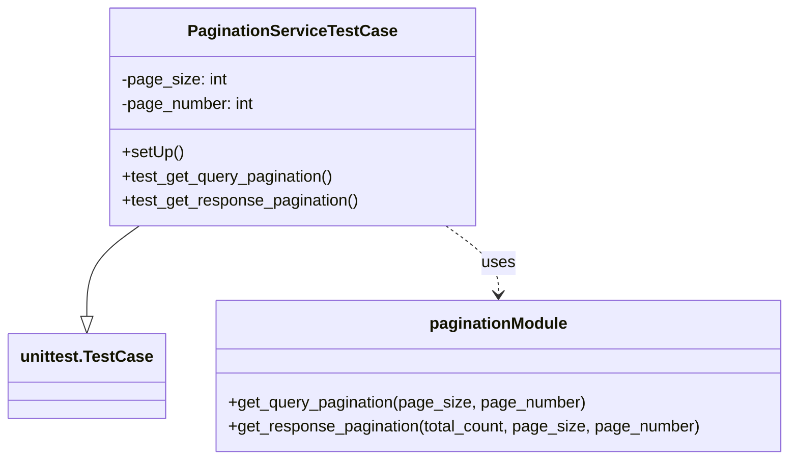

# Diagram: entity_core/entity_service/entity_service_tests/dpu/unit/test_pagination.py


> Auto-generated by Obscura crawlers

## Diagram 1



### SVG

<svg id="container" width="775.875" xmlns="http://www.w3.org/2000/svg" class="classDiagram" height="456" viewBox="0 0 775.875 456" role="graphics-document document" aria-roledescription="class"><style>#container{font-family:"trebuchet ms",verdana,arial,sans-serif;font-size:16px;fill:#333;}@keyframes edge-animation-frame{from{stroke-dashoffset:0;}}@keyframes dash{to{stroke-dashoffset:0;}}#container .edge-animation-slow{stroke-dasharray:9,5!important;stroke-dashoffset:900;animation:dash 50s linear infinite;stroke-linecap:round;}#container .edge-animation-fast{stroke-dasharray:9,5!important;stroke-dashoffset:900;animation:dash 20s linear infinite;stroke-linecap:round;}#container .error-icon{fill:#552222;}#container .error-text{fill:#552222;stroke:#552222;}#container .edge-thickness-normal{stroke-width:1px;}#container .edge-thickness-thick{stroke-width:3.5px;}#container .edge-pattern-solid{stroke-dasharray:0;}#container .edge-thickness-invisible{stroke-width:0;fill:none;}#container .edge-pattern-dashed{stroke-dasharray:3;}#container .edge-pattern-dotted{stroke-dasharray:2;}#container .marker{fill:#333333;stroke:#333333;}#container .marker.cross{stroke:#333333;}#container svg{font-family:"trebuchet ms",verdana,arial,sans-serif;font-size:16px;}#container p{margin:0;}#container g.classGroup text{fill:#9370DB;stroke:none;font-family:"trebuchet ms",verdana,arial,sans-serif;font-size:10px;}#container g.classGroup text .title{font-weight:bolder;}#container .nodeLabel,#container .edgeLabel{color:#131300;}#container .edgeLabel .label rect{fill:#ECECFF;}#container .label text{fill:#131300;}#container .labelBkg{background:#ECECFF;}#container .edgeLabel .label span{background:#ECECFF;}#container .classTitle{font-weight:bolder;}#container .node rect,#container .node circle,#container .node ellipse,#container .node polygon,#container .node path{fill:#ECECFF;stroke:#9370DB;stroke-width:1px;}#container .divider{stroke:#9370DB;stroke-width:1;}#container g.clickable{cursor:pointer;}#container g.classGroup rect{fill:#ECECFF;stroke:#9370DB;}#container g.classGroup line{stroke:#9370DB;stroke-width:1;}#container .classLabel .box{stroke:none;stroke-width:0;fill:#ECECFF;opacity:0.5;}#container .classLabel .label{fill:#9370DB;font-size:10px;}#container .relation{stroke:#333333;stroke-width:1;fill:none;}#container .dashed-line{stroke-dasharray:3;}#container .dotted-line{stroke-dasharray:1 2;}#container #compositionStart,#container .composition{fill:#333333!important;stroke:#333333!important;stroke-width:1;}#container #compositionEnd,#container .composition{fill:#333333!important;stroke:#333333!important;stroke-width:1;}#container #dependencyStart,#container .dependency{fill:#333333!important;stroke:#333333!important;stroke-width:1;}#container #dependencyStart,#container .dependency{fill:#333333!important;stroke:#333333!important;stroke-width:1;}#container #extensionStart,#container .extension{fill:transparent!important;stroke:#333333!important;stroke-width:1;}#container #extensionEnd,#container .extension{fill:transparent!important;stroke:#333333!important;stroke-width:1;}#container #aggregationStart,#container .aggregation{fill:transparent!important;stroke:#333333!important;stroke-width:1;}#container #aggregationEnd,#container .aggregation{fill:transparent!important;stroke:#333333!important;stroke-width:1;}#container #lollipopStart,#container .lollipop{fill:#ECECFF!important;stroke:#333333!important;stroke-width:1;}#container #lollipopEnd,#container .lollipop{fill:#ECECFF!important;stroke:#333333!important;stroke-width:1;}#container .edgeTerminals{font-size:11px;line-height:initial;}#container .classTitleText{text-anchor:middle;font-size:18px;fill:#333;}#container .label-icon{display:inline-block;height:1em;overflow:visible;vertical-align:-0.125em;}#container .node .label-icon path{fill:currentColor;stroke:revert;stroke-width:revert;}#container :root{--mermaid-font-family:"trebuchet ms",verdana,arial,sans-serif;}</style><g><defs><marker id="container_class-aggregationStart" class="marker aggregation class" refX="18" refY="7" markerWidth="190" markerHeight="240" orient="auto"><path d="M 18,7 L9,13 L1,7 L9,1 Z"></path></marker></defs><defs><marker id="container_class-aggregationEnd" class="marker aggregation class" refX="1" refY="7" markerWidth="20" markerHeight="28" orient="auto"><path d="M 18,7 L9,13 L1,7 L9,1 Z"></path></marker></defs><defs><marker id="container_class-extensionStart" class="marker extension class" refX="18" refY="7" markerWidth="190" markerHeight="240" orient="auto"><path d="M 1,7 L18,13 V 1 Z"></path></marker></defs><defs><marker id="container_class-extensionEnd" class="marker extension class" refX="1" refY="7" markerWidth="20" markerHeight="28" orient="auto"><path d="M 1,1 V 13 L18,7 Z"></path></marker></defs><defs><marker id="container_class-compositionStart" class="marker composition class" refX="18" refY="7" markerWidth="190" markerHeight="240" orient="auto"><path d="M 18,7 L9,13 L1,7 L9,1 Z"></path></marker></defs><defs><marker id="container_class-compositionEnd" class="marker composition class" refX="1" refY="7" markerWidth="20" markerHeight="28" orient="auto"><path d="M 18,7 L9,13 L1,7 L9,1 Z"></path></marker></defs><defs><marker id="container_class-dependencyStart" class="marker dependency class" refX="6" refY="7" markerWidth="190" markerHeight="240" orient="auto"><path d="M 5,7 L9,13 L1,7 L9,1 Z"></path></marker></defs><defs><marker id="container_class-dependencyEnd" class="marker dependency class" refX="13" refY="7" markerWidth="20" markerHeight="28" orient="auto"><path d="M 18,7 L9,13 L14,7 L9,1 Z"></path></marker></defs><defs><marker id="container_class-lollipopStart" class="marker lollipop class" refX="13" refY="7" markerWidth="190" markerHeight="240" orient="auto"><circle stroke="black" fill="transparent" cx="7" cy="7" r="6"></circle></marker></defs><defs><marker id="container_class-lollipopEnd" class="marker lollipop class" refX="1" refY="7" markerWidth="190" markerHeight="240" orient="auto"><circle stroke="black" fill="transparent" cx="7" cy="7" r="6"></circle></marker></defs><g class="root"><g class="clusters"></g><g class="edgePaths"><path d="M134.375,224L125.765,230.167C117.154,236.333,99.932,248.667,91.322,263.625C82.711,278.583,82.711,296.167,82.711,304.958L82.711,313.75" id="id_PaginationServiceTestCase_unittest.TestCase_1" class="edge-thickness-normal edge-pattern-solid relation" style=";;;" data-edge="true" data-et="edge" data-id="id_PaginationServiceTestCase_unittest.TestCase_1" data-points="W3sieCI6MTM0LjM3NTM3NzE1NTE3MjQsInkiOjIyNH0seyJ4Ijo4Mi43MTA5Mzc1LCJ5IjoyNjF9LHsieCI6ODIuNzEwOTM3NSwieSI6MzMxfV0=" marker-end="url(#container_class-extensionEnd)"></path><path d="M435.984,224L444.595,230.167C453.205,236.333,470.427,248.667,479.038,260C487.648,271.333,487.648,281.667,487.648,286.833L487.648,292" id="id_PaginationServiceTestCase_paginationModule_2" class="edge-thickness-normal edge-pattern-dashed relation" style=";;;" data-edge="true" data-et="edge" data-id="id_PaginationServiceTestCase_paginationModule_2" data-points="W3sieCI6NDM1Ljk4Mzk5Nzg0NDgyNzYsInkiOjIyNH0seyJ4Ijo0ODcuNjQ4NDM3NSwieSI6MjYxfSx7IngiOjQ4Ny42NDg0Mzc1LCJ5IjoyOTh9XQ==" marker-end="url(#container_class-dependencyEnd)"></path></g><g class="edgeLabels"><g class="edgeLabel"><g class="label" data-id="id_PaginationServiceTestCase_unittest.TestCase_1" transform="translate(0, 0)"><foreignObject width="0" height="0"><div xmlns="http://www.w3.org/1999/xhtml" class="labelBkg" style="display: table-cell; white-space: nowrap; line-height: 1.5; max-width: 200px; text-align: center;"><span class="edgeLabel"></span></div></foreignObject></g></g><g class="edgeLabel" transform="translate(487.6484375, 261)"><g class="label" data-id="id_PaginationServiceTestCase_paginationModule_2" transform="translate(-16.4921875, -12)"><foreignObject width="32.984375" height="24"><div xmlns="http://www.w3.org/1999/xhtml" class="labelBkg" style="display: table-cell; white-space: nowrap; line-height: 1.5; max-width: 200px; text-align: center;"><span class="edgeLabel"><p>uses</p></span></div></foreignObject></g></g></g><g class="nodes"><g class="node default" id="classId-PaginationServiceTestCase-0" transform="translate(285.1796875, 116)"><g class="basic label-container"><path d="M-179.609375 -108 L179.609375 -108 L179.609375 108 L-179.609375 108" stroke="none" stroke-width="0" fill="#ECECFF" style=""></path><path d="M-179.609375 -108 C-75.0991185681983 -108, 29.411137863603386 -108, 179.609375 -108 M-179.609375 -108 C-79.66308638775288 -108, 20.283202224494232 -108, 179.609375 -108 M179.609375 -108 C179.609375 -25.372610013043953, 179.609375 57.25477997391209, 179.609375 108 M179.609375 -108 C179.609375 -37.47269876845121, 179.609375 33.05460246309758, 179.609375 108 M179.609375 108 C82.05107273083728 108, -15.507229538325447 108, -179.609375 108 M179.609375 108 C58.16021995604605 108, -63.2889350879079 108, -179.609375 108 M-179.609375 108 C-179.609375 61.96471691141373, -179.609375 15.929433822827463, -179.609375 -108 M-179.609375 108 C-179.609375 50.34072710769681, -179.609375 -7.3185457846063855, -179.609375 -108" stroke="#9370DB" stroke-width="1.3" fill="none" stroke-dasharray="0 0" style=""></path></g><g class="annotation-group text" transform="translate(0, -84)"></g><g class="label-group text" transform="translate(-97.984375, -84)"><g class="label" style="font-weight: bolder" transform="translate(0,-12)"><foreignObject width="195.96875" height="24"><div xmlns="http://www.w3.org/1999/xhtml" style="display: table-cell; white-space: nowrap; line-height: 1.5; max-width: 242px; text-align: center;"><span class="nodeLabel markdown-node-label" style=""><p>PaginationServiceTestCase</p></span></div></foreignObject></g></g><g class="members-group text" transform="translate(-167.609375, -36)"><g class="label" style="" transform="translate(0,-12)"><foreignObject width="104.453125" height="24"><div xmlns="http://www.w3.org/1999/xhtml" style="display: table-cell; white-space: nowrap; line-height: 1.5; max-width: 162px; text-align: center;"><span class="nodeLabel markdown-node-label" style=""><p>-page_size: int</p></span></div></foreignObject></g><g class="label" style="" transform="translate(0,12)"><foreignObject width="133.828125" height="24"><div xmlns="http://www.w3.org/1999/xhtml" style="display: table-cell; white-space: nowrap; line-height: 1.5; max-width: 191px; text-align: center;"><span class="nodeLabel markdown-node-label" style=""><p>-page_number: int</p></span></div></foreignObject></g></g><g class="methods-group text" transform="translate(-167.609375, 36)"><g class="label" style="" transform="translate(0,-12)"><foreignObject width="60.421875" height="24"><div xmlns="http://www.w3.org/1999/xhtml" style="display: table-cell; white-space: nowrap; line-height: 1.5; max-width: 118px; text-align: center;"><span class="nodeLabel markdown-node-label" style=""><p>+setUp()</p></span></div></foreignObject></g><g class="label" style="" transform="translate(0,12)"><foreignObject width="212.109375" height="24"><div xmlns="http://www.w3.org/1999/xhtml" style="display: table-cell; white-space: nowrap; line-height: 1.5; max-width: 269px; text-align: center;"><span class="nodeLabel markdown-node-label" style=""><p>+test_get_query_pagination()</p></span></div></foreignObject></g><g class="label" style="" transform="translate(0,36)"><foreignObject width="237.234375" height="24"><div xmlns="http://www.w3.org/1999/xhtml" style="display: table-cell; white-space: nowrap; line-height: 1.5; max-width: 295px; text-align: center;"><span class="nodeLabel markdown-node-label" style=""><p>+test_get_response_pagination()</p></span></div></foreignObject></g></g><g class="divider" style=""><path d="M-179.609375 -60 C-39.301945694221644 -60, 101.00548361155671 -60, 179.609375 -60 M-179.609375 -60 C-60.37088249105962 -60, 58.867610017880764 -60, 179.609375 -60" stroke="#9370DB" stroke-width="1.3" fill="none" stroke-dasharray="0 0" style=""></path></g><g class="divider" style=""><path d="M-179.609375 12 C-82.07595413215836 12, 15.457466735683283 12, 179.609375 12 M-179.609375 12 C-88.08204703707142 12, 3.445280925857162 12, 179.609375 12" stroke="#9370DB" stroke-width="1.3" fill="none" stroke-dasharray="0 0" style=""></path></g></g><g class="node default" id="classId-unittest.TestCase-1" transform="translate(82.7109375, 373)"><g class="basic label-container"><path d="M-74.7109375 -42 L74.7109375 -42 L74.7109375 42 L-74.7109375 42" stroke="none" stroke-width="0" fill="#ECECFF" style=""></path><path d="M-74.7109375 -42 C-35.24841165203474 -42, 4.21411419593052 -42, 74.7109375 -42 M-74.7109375 -42 C-37.48380057254904 -42, -0.2566636450980866 -42, 74.7109375 -42 M74.7109375 -42 C74.7109375 -10.289302725413059, 74.7109375 21.421394549173883, 74.7109375 42 M74.7109375 -42 C74.7109375 -13.758593429361863, 74.7109375 14.482813141276274, 74.7109375 42 M74.7109375 42 C16.393253526283367 42, -41.92443044743327 42, -74.7109375 42 M74.7109375 42 C38.693761117639255 42, 2.67658473527851 42, -74.7109375 42 M-74.7109375 42 C-74.7109375 12.74358309420921, -74.7109375 -16.51283381158158, -74.7109375 -42 M-74.7109375 42 C-74.7109375 8.745296429635616, -74.7109375 -24.50940714072877, -74.7109375 -42" stroke="#9370DB" stroke-width="1.3" fill="none" stroke-dasharray="0 0" style=""></path></g><g class="annotation-group text" transform="translate(0, -18)"></g><g class="label-group text" transform="translate(-62.7109375, -18)"><g class="label" style="font-weight: bolder" transform="translate(0,-12)"><foreignObject width="125.421875" height="24"><div xmlns="http://www.w3.org/1999/xhtml" style="display: table-cell; white-space: nowrap; line-height: 1.5; max-width: 172px; text-align: center;"><span class="nodeLabel markdown-node-label" style=""><p>unittest.TestCase</p></span></div></foreignObject></g></g><g class="members-group text" transform="translate(-62.7109375, 30)"></g><g class="methods-group text" transform="translate(-62.7109375, 60)"></g><g class="divider" style=""><path d="M-74.7109375 6 C-28.170578024987847 6, 18.369781450024306 6, 74.7109375 6 M-74.7109375 6 C-31.030122149051643 6, 12.650693201896715 6, 74.7109375 6" stroke="#9370DB" stroke-width="1.3" fill="none" stroke-dasharray="0 0" style=""></path></g><g class="divider" style=""><path d="M-74.7109375 24 C-22.083208633185457 24, 30.544520233629086 24, 74.7109375 24 M-74.7109375 24 C-41.62631155176208 24, -8.541685603524158 24, 74.7109375 24" stroke="#9370DB" stroke-width="1.3" fill="none" stroke-dasharray="0 0" style=""></path></g></g><g class="node default" id="classId-paginationModule-2" transform="translate(487.6484375, 373)"><g class="basic label-container"><path d="M-280.2265625 -75 L280.2265625 -75 L280.2265625 75 L-280.2265625 75" stroke="none" stroke-width="0" fill="#ECECFF" style=""></path><path d="M-280.2265625 -75 C-64.88140310720132 -75, 150.46375628559736 -75, 280.2265625 -75 M-280.2265625 -75 C-134.04988249321696 -75, 12.126797513566089 -75, 280.2265625 -75 M280.2265625 -75 C280.2265625 -36.306608917192946, 280.2265625 2.3867821656141075, 280.2265625 75 M280.2265625 -75 C280.2265625 -32.85355660841888, 280.2265625 9.292886783162245, 280.2265625 75 M280.2265625 75 C110.79064759857809 75, -58.64526730284382 75, -280.2265625 75 M280.2265625 75 C65.89780846475753 75, -148.43094557048494 75, -280.2265625 75 M-280.2265625 75 C-280.2265625 26.066532710032867, -280.2265625 -22.866934579934266, -280.2265625 -75 M-280.2265625 75 C-280.2265625 15.372679572715768, -280.2265625 -44.254640854568464, -280.2265625 -75" stroke="#9370DB" stroke-width="1.3" fill="none" stroke-dasharray="0 0" style=""></path></g><g class="annotation-group text" transform="translate(0, -51)"></g><g class="label-group text" transform="translate(-66.390625, -51)"><g class="label" style="font-weight: bolder" transform="translate(0,-12)"><foreignObject width="132.78125" height="24"><div xmlns="http://www.w3.org/1999/xhtml" style="display: table-cell; white-space: nowrap; line-height: 1.5; max-width: 182px; text-align: center;"><span class="nodeLabel markdown-node-label" style=""><p>paginationModule</p></span></div></foreignObject></g></g><g class="members-group text" transform="translate(-268.2265625, -3)"></g><g class="methods-group text" transform="translate(-268.2265625, 27)"><g class="label" style="" transform="translate(0,-12)"><foreignObject width="353.859375" height="24"><div xmlns="http://www.w3.org/1999/xhtml" style="display: table-cell; white-space: nowrap; line-height: 1.5; max-width: 411px; text-align: center;"><span class="nodeLabel markdown-node-label" style=""><p>+get_query_pagination(page_size, page_number)</p></span></div></foreignObject></g><g class="label" style="" transform="translate(0,12)"><foreignObject width="470.0625" height="24"><div xmlns="http://www.w3.org/1999/xhtml" style="display: table-cell; white-space: nowrap; line-height: 1.5; max-width: 527px; text-align: center;"><span class="nodeLabel markdown-node-label" style=""><p>+get_response_pagination(total_count, page_size, page_number)</p></span></div></foreignObject></g></g><g class="divider" style=""><path d="M-280.2265625 -27 C-140.47517121841898 -27, -0.7237799368379569 -27, 280.2265625 -27 M-280.2265625 -27 C-120.30094621125957 -27, 39.62467007748086 -27, 280.2265625 -27" stroke="#9370DB" stroke-width="1.3" fill="none" stroke-dasharray="0 0" style=""></path></g><g class="divider" style=""><path d="M-280.2265625 -3 C-82.31120115921692 -3, 115.60416018156616 -3, 280.2265625 -3 M-280.2265625 -3 C-129.2622098455662 -3, 21.70214280886762 -3, 280.2265625 -3" stroke="#9370DB" stroke-width="1.3" fill="none" stroke-dasharray="0 0" style=""></path></g></g></g></g></g></svg>

## Diagram 2

```mermaid
flowchart TD
    S[PaginationServiceTestCase.setUp(): page_size=20, page_number=0] --> T1[Test: test_get_query_pagination]
    T1 --> C1[Call get_query_pagination(page_size, page_number)]
    C1 --> R1[Return (offset, limit)]
    R1 --> A1{Assertions}
    A1 --> A1a[limit == page_size]
    A1 --> A1b[offset == 0]

    S --> T2[Test: test_get_response_pagination]
    T2 --> C2[Call get_response_pagination(total_count=100, page_size, page_number)]
    C2 --> R2[Return pagination dict]
    R2 --> A2{Assertions}
    A2 --> A2a[pagination.currentPage == 0]
    A2 --> A2b[pagination.totalCount == 100]
    A2 --> A2c[pagination.totalPages == 5]
```

> SVG rendering failed for this diagram.
