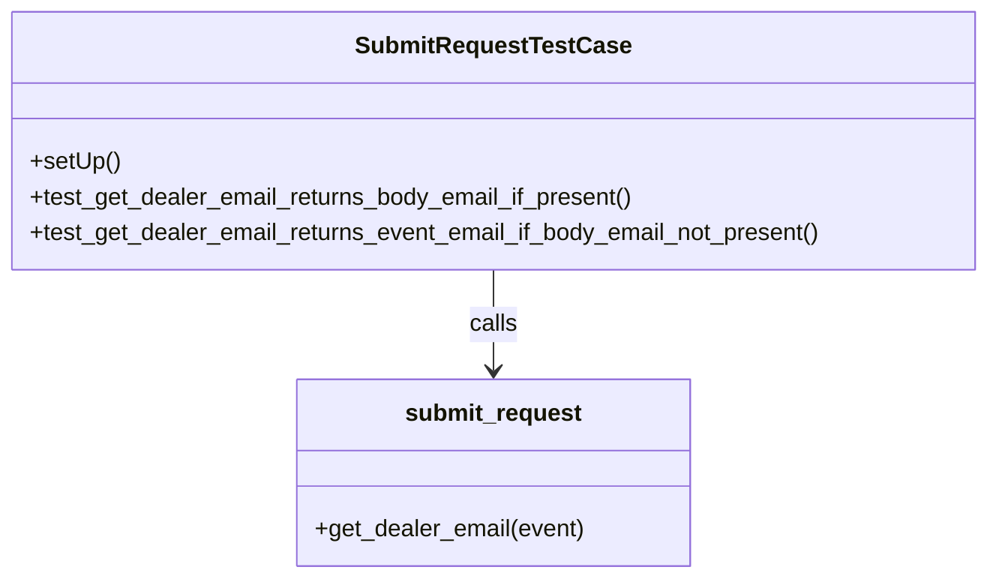

# Diagram: entity_core/entity_service/entity_service_tests/dpu/unit/test_submit_request.py


> Auto-generated by Obscura crawlers

## Diagram 1



### SVG

<svg id="container" width="670.1796875" xmlns="http://www.w3.org/2000/svg" class="classDiagram" height="390" viewBox="0 0 670.1796875 390" role="graphics-document document" aria-roledescription="class"><style>#container{font-family:"trebuchet ms",verdana,arial,sans-serif;font-size:16px;fill:#333;}@keyframes edge-animation-frame{from{stroke-dashoffset:0;}}@keyframes dash{to{stroke-dashoffset:0;}}#container .edge-animation-slow{stroke-dasharray:9,5!important;stroke-dashoffset:900;animation:dash 50s linear infinite;stroke-linecap:round;}#container .edge-animation-fast{stroke-dasharray:9,5!important;stroke-dashoffset:900;animation:dash 20s linear infinite;stroke-linecap:round;}#container .error-icon{fill:#552222;}#container .error-text{fill:#552222;stroke:#552222;}#container .edge-thickness-normal{stroke-width:1px;}#container .edge-thickness-thick{stroke-width:3.5px;}#container .edge-pattern-solid{stroke-dasharray:0;}#container .edge-thickness-invisible{stroke-width:0;fill:none;}#container .edge-pattern-dashed{stroke-dasharray:3;}#container .edge-pattern-dotted{stroke-dasharray:2;}#container .marker{fill:#333333;stroke:#333333;}#container .marker.cross{stroke:#333333;}#container svg{font-family:"trebuchet ms",verdana,arial,sans-serif;font-size:16px;}#container p{margin:0;}#container g.classGroup text{fill:#9370DB;stroke:none;font-family:"trebuchet ms",verdana,arial,sans-serif;font-size:10px;}#container g.classGroup text .title{font-weight:bolder;}#container .nodeLabel,#container .edgeLabel{color:#131300;}#container .edgeLabel .label rect{fill:#ECECFF;}#container .label text{fill:#131300;}#container .labelBkg{background:#ECECFF;}#container .edgeLabel .label span{background:#ECECFF;}#container .classTitle{font-weight:bolder;}#container .node rect,#container .node circle,#container .node ellipse,#container .node polygon,#container .node path{fill:#ECECFF;stroke:#9370DB;stroke-width:1px;}#container .divider{stroke:#9370DB;stroke-width:1;}#container g.clickable{cursor:pointer;}#container g.classGroup rect{fill:#ECECFF;stroke:#9370DB;}#container g.classGroup line{stroke:#9370DB;stroke-width:1;}#container .classLabel .box{stroke:none;stroke-width:0;fill:#ECECFF;opacity:0.5;}#container .classLabel .label{fill:#9370DB;font-size:10px;}#container .relation{stroke:#333333;stroke-width:1;fill:none;}#container .dashed-line{stroke-dasharray:3;}#container .dotted-line{stroke-dasharray:1 2;}#container #compositionStart,#container .composition{fill:#333333!important;stroke:#333333!important;stroke-width:1;}#container #compositionEnd,#container .composition{fill:#333333!important;stroke:#333333!important;stroke-width:1;}#container #dependencyStart,#container .dependency{fill:#333333!important;stroke:#333333!important;stroke-width:1;}#container #dependencyStart,#container .dependency{fill:#333333!important;stroke:#333333!important;stroke-width:1;}#container #extensionStart,#container .extension{fill:transparent!important;stroke:#333333!important;stroke-width:1;}#container #extensionEnd,#container .extension{fill:transparent!important;stroke:#333333!important;stroke-width:1;}#container #aggregationStart,#container .aggregation{fill:transparent!important;stroke:#333333!important;stroke-width:1;}#container #aggregationEnd,#container .aggregation{fill:transparent!important;stroke:#333333!important;stroke-width:1;}#container #lollipopStart,#container .lollipop{fill:#ECECFF!important;stroke:#333333!important;stroke-width:1;}#container #lollipopEnd,#container .lollipop{fill:#ECECFF!important;stroke:#333333!important;stroke-width:1;}#container .edgeTerminals{font-size:11px;line-height:initial;}#container .classTitleText{text-anchor:middle;font-size:18px;fill:#333;}#container .label-icon{display:inline-block;height:1em;overflow:visible;vertical-align:-0.125em;}#container .node .label-icon path{fill:currentColor;stroke:revert;stroke-width:revert;}#container :root{--mermaid-font-family:"trebuchet ms",verdana,arial,sans-serif;}</style><g><defs><marker id="container_class-aggregationStart" class="marker aggregation class" refX="18" refY="7" markerWidth="190" markerHeight="240" orient="auto"><path d="M 18,7 L9,13 L1,7 L9,1 Z"></path></marker></defs><defs><marker id="container_class-aggregationEnd" class="marker aggregation class" refX="1" refY="7" markerWidth="20" markerHeight="28" orient="auto"><path d="M 18,7 L9,13 L1,7 L9,1 Z"></path></marker></defs><defs><marker id="container_class-extensionStart" class="marker extension class" refX="18" refY="7" markerWidth="190" markerHeight="240" orient="auto"><path d="M 1,7 L18,13 V 1 Z"></path></marker></defs><defs><marker id="container_class-extensionEnd" class="marker extension class" refX="1" refY="7" markerWidth="20" markerHeight="28" orient="auto"><path d="M 1,1 V 13 L18,7 Z"></path></marker></defs><defs><marker id="container_class-compositionStart" class="marker composition class" refX="18" refY="7" markerWidth="190" markerHeight="240" orient="auto"><path d="M 18,7 L9,13 L1,7 L9,1 Z"></path></marker></defs><defs><marker id="container_class-compositionEnd" class="marker composition class" refX="1" refY="7" markerWidth="20" markerHeight="28" orient="auto"><path d="M 18,7 L9,13 L1,7 L9,1 Z"></path></marker></defs><defs><marker id="container_class-dependencyStart" class="marker dependency class" refX="6" refY="7" markerWidth="190" markerHeight="240" orient="auto"><path d="M 5,7 L9,13 L1,7 L9,1 Z"></path></marker></defs><defs><marker id="container_class-dependencyEnd" class="marker dependency class" refX="13" refY="7" markerWidth="20" markerHeight="28" orient="auto"><path d="M 18,7 L9,13 L14,7 L9,1 Z"></path></marker></defs><defs><marker id="container_class-lollipopStart" class="marker lollipop class" refX="13" refY="7" markerWidth="190" markerHeight="240" orient="auto"><circle stroke="black" fill="transparent" cx="7" cy="7" r="6"></circle></marker></defs><defs><marker id="container_class-lollipopEnd" class="marker lollipop class" refX="1" refY="7" markerWidth="190" markerHeight="240" orient="auto"><circle stroke="black" fill="transparent" cx="7" cy="7" r="6"></circle></marker></defs><g class="root"><g class="clusters"></g><g class="edgePaths"><path d="M335.09,182L335.09,188.167C335.09,194.333,335.09,206.667,335.09,218C335.09,229.333,335.09,239.667,335.09,244.833L335.09,250" id="id_SubmitRequestTestCase_submit_request_1" class="edge-thickness-normal edge-pattern-solid relation" style=";;;" data-edge="true" data-et="edge" data-id="id_SubmitRequestTestCase_submit_request_1" data-points="W3sieCI6MzM1LjA4OTg0Mzc1LCJ5IjoxODJ9LHsieCI6MzM1LjA4OTg0Mzc1LCJ5IjoyMTl9LHsieCI6MzM1LjA4OTg0Mzc1LCJ5IjoyNTZ9XQ==" marker-end="url(#container_class-dependencyEnd)"></path></g><g class="edgeLabels"><g class="edgeLabel" transform="translate(335.08984375, 219)"><g class="label" data-id="id_SubmitRequestTestCase_submit_request_1" transform="translate(-16.4453125, -12)"><foreignObject width="32.890625" height="24"><div xmlns="http://www.w3.org/1999/xhtml" class="labelBkg" style="display: table-cell; white-space: nowrap; line-height: 1.5; max-width: 200px; text-align: center;"><span class="edgeLabel"><p>calls</p></span></div></foreignObject></g></g></g><g class="nodes"><g class="node default" id="classId-SubmitRequestTestCase-0" transform="translate(335.08984375, 95)"><g class="basic label-container"><path d="M-327.08984375 -87 L327.08984375 -87 L327.08984375 87 L-327.08984375 87" stroke="none" stroke-width="0" fill="#ECECFF" style=""></path><path d="M-327.08984375 -87 C-159.92808869681133 -87, 7.233666356377341 -87, 327.08984375 -87 M-327.08984375 -87 C-186.2281282581788 -87, -45.3664127663576 -87, 327.08984375 -87 M327.08984375 -87 C327.08984375 -18.209630272462746, 327.08984375 50.58073945507451, 327.08984375 87 M327.08984375 -87 C327.08984375 -51.89168648768013, 327.08984375 -16.783372975360265, 327.08984375 87 M327.08984375 87 C119.72393859519445 87, -87.64196655961109 87, -327.08984375 87 M327.08984375 87 C109.47391849188693 87, -108.14200676622613 87, -327.08984375 87 M-327.08984375 87 C-327.08984375 18.043230235128533, -327.08984375 -50.913539529742934, -327.08984375 -87 M-327.08984375 87 C-327.08984375 44.921000072564006, -327.08984375 2.8420001451280115, -327.08984375 -87" stroke="#9370DB" stroke-width="1.3" fill="none" stroke-dasharray="0 0" style=""></path></g><g class="annotation-group text" transform="translate(0, -63)"></g><g class="label-group text" transform="translate(-88.3671875, -63)"><g class="label" style="font-weight: bolder" transform="translate(0,-12)"><foreignObject width="176.734375" height="24"><div xmlns="http://www.w3.org/1999/xhtml" style="display: table-cell; white-space: nowrap; line-height: 1.5; max-width: 223px; text-align: center;"><span class="nodeLabel markdown-node-label" style=""><p>SubmitRequestTestCase</p></span></div></foreignObject></g></g><g class="members-group text" transform="translate(-315.08984375, -15)"></g><g class="methods-group text" transform="translate(-315.08984375, 15)"><g class="label" style="" transform="translate(0,-12)"><foreignObject width="60.421875" height="24"><div xmlns="http://www.w3.org/1999/xhtml" style="display: table-cell; white-space: nowrap; line-height: 1.5; max-width: 118px; text-align: center;"><span class="nodeLabel markdown-node-label" style=""><p>+setUp()</p></span></div></foreignObject></g><g class="label" style="" transform="translate(0,12)"><foreignObject width="412.328125" height="24"><div xmlns="http://www.w3.org/1999/xhtml" style="display: table-cell; white-space: nowrap; line-height: 1.5; max-width: 470px; text-align: center;"><span class="nodeLabel markdown-node-label" style=""><p>+test_get_dealer_email_returns_body_email_if_present()</p></span></div></foreignObject></g><g class="label" style="" transform="translate(0,36)"><foreignObject width="541.8125" height="24"><div xmlns="http://www.w3.org/1999/xhtml" style="display: table-cell; white-space: nowrap; line-height: 1.5; max-width: 599px; text-align: center;"><span class="nodeLabel markdown-node-label" style=""><p>+test_get_dealer_email_returns_event_email_if_body_email_not_present()</p></span></div></foreignObject></g></g><g class="divider" style=""><path d="M-327.08984375 -39 C-100.7130371243689 -39, 125.66376950126221 -39, 327.08984375 -39 M-327.08984375 -39 C-182.855663474003 -39, -38.62148319800599 -39, 327.08984375 -39" stroke="#9370DB" stroke-width="1.3" fill="none" stroke-dasharray="0 0" style=""></path></g><g class="divider" style=""><path d="M-327.08984375 -15 C-153.3330420105642 -15, 20.423759728871573 -15, 327.08984375 -15 M-327.08984375 -15 C-109.53997453300596 -15, 108.00989468398808 -15, 327.08984375 -15" stroke="#9370DB" stroke-width="1.3" fill="none" stroke-dasharray="0 0" style=""></path></g></g><g class="node default" id="classId-submit_request-1" transform="translate(335.08984375, 319)"><g class="basic label-container"><path d="M-132.046875 -63 L132.046875 -63 L132.046875 63 L-132.046875 63" stroke="none" stroke-width="0" fill="#ECECFF" style=""></path><path d="M-132.046875 -63 C-52.84470373181826 -63, 26.357467536363487 -63, 132.046875 -63 M-132.046875 -63 C-54.93352654106637 -63, 22.179821917867258 -63, 132.046875 -63 M132.046875 -63 C132.046875 -23.509082151816614, 132.046875 15.981835696366772, 132.046875 63 M132.046875 -63 C132.046875 -15.311766625077944, 132.046875 32.37646674984411, 132.046875 63 M132.046875 63 C36.767236275135645 63, -58.51240244972871 63, -132.046875 63 M132.046875 63 C30.161951132289346 63, -71.72297273542131 63, -132.046875 63 M-132.046875 63 C-132.046875 32.165084620004066, -132.046875 1.3301692400081393, -132.046875 -63 M-132.046875 63 C-132.046875 23.226796416006103, -132.046875 -16.546407167987795, -132.046875 -63" stroke="#9370DB" stroke-width="1.3" fill="none" stroke-dasharray="0 0" style=""></path></g><g class="annotation-group text" transform="translate(0, -39)"></g><g class="label-group text" transform="translate(-57.609375, -39)"><g class="label" style="font-weight: bolder" transform="translate(0,-12)"><foreignObject width="115.21875" height="24"><div xmlns="http://www.w3.org/1999/xhtml" style="display: table-cell; white-space: nowrap; line-height: 1.5; max-width: 164px; text-align: center;"><span class="nodeLabel markdown-node-label" style=""><p>submit_request</p></span></div></foreignObject></g></g><g class="members-group text" transform="translate(-120.046875, 9)"></g><g class="methods-group text" transform="translate(-120.046875, 39)"><g class="label" style="" transform="translate(0,-12)"><foreignObject width="182.484375" height="24"><div xmlns="http://www.w3.org/1999/xhtml" style="display: table-cell; white-space: nowrap; line-height: 1.5; max-width: 240px; text-align: center;"><span class="nodeLabel markdown-node-label" style=""><p>+get_dealer_email(event)</p></span></div></foreignObject></g></g><g class="divider" style=""><path d="M-132.046875 -15 C-40.84085658524843 -15, 50.36516182950314 -15, 132.046875 -15 M-132.046875 -15 C-71.80896015497609 -15, -11.571045309952169 -15, 132.046875 -15" stroke="#9370DB" stroke-width="1.3" fill="none" stroke-dasharray="0 0" style=""></path></g><g class="divider" style=""><path d="M-132.046875 9 C-40.98565998507247 9, 50.07555502985505 9, 132.046875 9 M-132.046875 9 C-28.33811757955263 9, 75.37063984089474 9, 132.046875 9" stroke="#9370DB" stroke-width="1.3" fill="none" stroke-dasharray="0 0" style=""></path></g></g></g></g></g></svg>

## Diagram 2

```mermaid
flowchart TD
    Event[Event (dict)] --> Check{body.dealerEmail present?}
    Check -- Yes --> ReturnBody[Return body.dealerEmail]
    Check -- No --> ReturnEvent[Return requestContext.authorizer.email]
```

> SVG rendering failed for this diagram.
