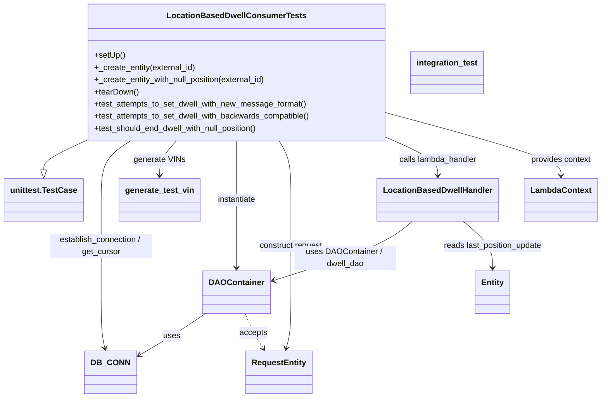
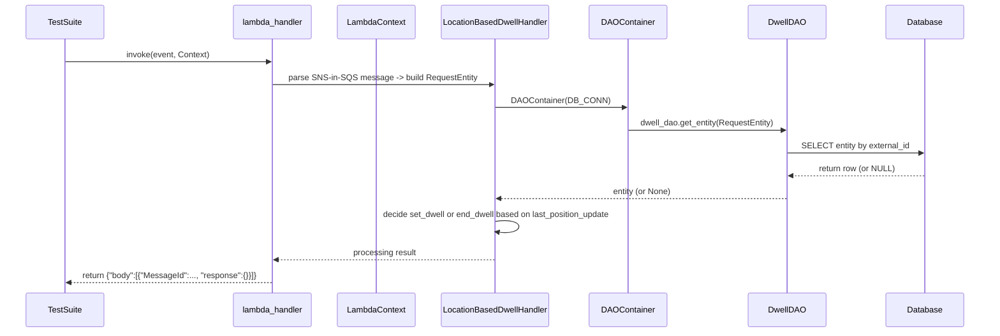

# Diagram: entity_core/entity_service/entity_service_tests/dwell/integration/test_location_based_dwell_consumer.py


> Auto-generated by Obscura crawlers

## Diagram 1



### SVG

<svg id="container" width="1166.1484375" xmlns="http://www.w3.org/2000/svg" class="classDiagram" height="784" viewBox="0 0 1166.1484375 784" role="graphics-document document" aria-roledescription="class"><style>#container{font-family:"trebuchet ms",verdana,arial,sans-serif;font-size:16px;fill:#333;}@keyframes edge-animation-frame{from{stroke-dashoffset:0;}}@keyframes dash{to{stroke-dashoffset:0;}}#container .edge-animation-slow{stroke-dasharray:9,5!important;stroke-dashoffset:900;animation:dash 50s linear infinite;stroke-linecap:round;}#container .edge-animation-fast{stroke-dasharray:9,5!important;stroke-dashoffset:900;animation:dash 20s linear infinite;stroke-linecap:round;}#container .error-icon{fill:#552222;}#container .error-text{fill:#552222;stroke:#552222;}#container .edge-thickness-normal{stroke-width:1px;}#container .edge-thickness-thick{stroke-width:3.5px;}#container .edge-pattern-solid{stroke-dasharray:0;}#container .edge-thickness-invisible{stroke-width:0;fill:none;}#container .edge-pattern-dashed{stroke-dasharray:3;}#container .edge-pattern-dotted{stroke-dasharray:2;}#container .marker{fill:#333333;stroke:#333333;}#container .marker.cross{stroke:#333333;}#container svg{font-family:"trebuchet ms",verdana,arial,sans-serif;font-size:16px;}#container p{margin:0;}#container g.classGroup text{fill:#9370DB;stroke:none;font-family:"trebuchet ms",verdana,arial,sans-serif;font-size:10px;}#container g.classGroup text .title{font-weight:bolder;}#container .nodeLabel,#container .edgeLabel{color:#131300;}#container .edgeLabel .label rect{fill:#ECECFF;}#container .label text{fill:#131300;}#container .labelBkg{background:#ECECFF;}#container .edgeLabel .label span{background:#ECECFF;}#container .classTitle{font-weight:bolder;}#container .node rect,#container .node circle,#container .node ellipse,#container .node polygon,#container .node path{fill:#ECECFF;stroke:#9370DB;stroke-width:1px;}#container .divider{stroke:#9370DB;stroke-width:1;}#container g.clickable{cursor:pointer;}#container g.classGroup rect{fill:#ECECFF;stroke:#9370DB;}#container g.classGroup line{stroke:#9370DB;stroke-width:1;}#container .classLabel .box{stroke:none;stroke-width:0;fill:#ECECFF;opacity:0.5;}#container .classLabel .label{fill:#9370DB;font-size:10px;}#container .relation{stroke:#333333;stroke-width:1;fill:none;}#container .dashed-line{stroke-dasharray:3;}#container .dotted-line{stroke-dasharray:1 2;}#container #compositionStart,#container .composition{fill:#333333!important;stroke:#333333!important;stroke-width:1;}#container #compositionEnd,#container .composition{fill:#333333!important;stroke:#333333!important;stroke-width:1;}#container #dependencyStart,#container .dependency{fill:#333333!important;stroke:#333333!important;stroke-width:1;}#container #dependencyStart,#container .dependency{fill:#333333!important;stroke:#333333!important;stroke-width:1;}#container #extensionStart,#container .extension{fill:transparent!important;stroke:#333333!important;stroke-width:1;}#container #extensionEnd,#container .extension{fill:transparent!important;stroke:#333333!important;stroke-width:1;}#container #aggregationStart,#container .aggregation{fill:transparent!important;stroke:#333333!important;stroke-width:1;}#container #aggregationEnd,#container .aggregation{fill:transparent!important;stroke:#333333!important;stroke-width:1;}#container #lollipopStart,#container .lollipop{fill:#ECECFF!important;stroke:#333333!important;stroke-width:1;}#container #lollipopEnd,#container .lollipop{fill:#ECECFF!important;stroke:#333333!important;stroke-width:1;}#container .edgeTerminals{font-size:11px;line-height:initial;}#container .classTitleText{text-anchor:middle;font-size:18px;fill:#333;}#container .label-icon{display:inline-block;height:1em;overflow:visible;vertical-align:-0.125em;}#container .node .label-icon path{fill:currentColor;stroke:revert;stroke-width:revert;}#container :root{--mermaid-font-family:"trebuchet ms",verdana,arial,sans-serif;}</style><g><defs><marker id="container_class-aggregationStart" class="marker aggregation class" refX="18" refY="7" markerWidth="190" markerHeight="240" orient="auto"><path d="M 18,7 L9,13 L1,7 L9,1 Z"></path></marker></defs><defs><marker id="container_class-aggregationEnd" class="marker aggregation class" refX="1" refY="7" markerWidth="20" markerHeight="28" orient="auto"><path d="M 18,7 L9,13 L1,7 L9,1 Z"></path></marker></defs><defs><marker id="container_class-extensionStart" class="marker extension class" refX="18" refY="7" markerWidth="190" markerHeight="240" orient="auto"><path d="M 1,7 L18,13 V 1 Z"></path></marker></defs><defs><marker id="container_class-extensionEnd" class="marker extension class" refX="1" refY="7" markerWidth="20" markerHeight="28" orient="auto"><path d="M 1,1 V 13 L18,7 Z"></path></marker></defs><defs><marker id="container_class-compositionStart" class="marker composition class" refX="18" refY="7" markerWidth="190" markerHeight="240" orient="auto"><path d="M 18,7 L9,13 L1,7 L9,1 Z"></path></marker></defs><defs><marker id="container_class-compositionEnd" class="marker composition class" refX="1" refY="7" markerWidth="20" markerHeight="28" orient="auto"><path d="M 18,7 L9,13 L1,7 L9,1 Z"></path></marker></defs><defs><marker id="container_class-dependencyStart" class="marker dependency class" refX="6" refY="7" markerWidth="190" markerHeight="240" orient="auto"><path d="M 5,7 L9,13 L1,7 L9,1 Z"></path></marker></defs><defs><marker id="container_class-dependencyEnd" class="marker dependency class" refX="13" refY="7" markerWidth="20" markerHeight="28" orient="auto"><path d="M 18,7 L9,13 L14,7 L9,1 Z"></path></marker></defs><defs><marker id="container_class-lollipopStart" class="marker lollipop class" refX="13" refY="7" markerWidth="190" markerHeight="240" orient="auto"><circle stroke="black" fill="transparent" cx="7" cy="7" r="6"></circle></marker></defs><defs><marker id="container_class-lollipopEnd" class="marker lollipop class" refX="1" refY="7" markerWidth="190" markerHeight="240" orient="auto"><circle stroke="black" fill="transparent" cx="7" cy="7" r="6"></circle></marker></defs><g class="root"><g class="clusters"></g><g class="edgePaths"><path d="M163.594,277.773L150.113,283.978C136.633,290.182,109.672,302.591,96.191,312.087C82.711,321.583,82.711,328.167,82.711,331.458L82.711,334.75" id="id_LocationBasedDwellConsumerTests_unittest.TestCase_1" class="edge-thickness-normal edge-pattern-solid relation" style=";;;" data-edge="true" data-et="edge" data-id="id_LocationBasedDwellConsumerTests_unittest.TestCase_1" data-points="W3sieCI6MTYzLjU5Mzc1LCJ5IjoyNzcuNzczMDA2NjQ3OTkxfSx7IngiOjgyLjcxMDkzNzUsInkiOjMxNX0seyJ4Ijo4Mi43MTA5Mzc1LCJ5IjozNTJ9XQ==" marker-end="url(#container_class-extensionEnd)"></path><path d="M249.211,278L239.746,284.167C230.281,290.333,211.352,302.667,201.887,322C192.422,341.333,192.422,367.667,192.422,396C192.422,424.333,192.422,454.667,192.422,485C192.422,515.333,192.422,545.667,192.422,574C192.422,602.333,192.422,628.667,193.621,647.026C194.82,665.385,197.219,675.769,198.418,680.962L199.617,686.154" id="id_LocationBasedDwellConsumerTests_DB_CONN_2" class="edge-thickness-normal edge-pattern-solid relation" style=";;;" data-edge="true" data-et="edge" data-id="id_LocationBasedDwellConsumerTests_DB_CONN_2" data-points="W3sieCI6MjQ5LjIxMDg5MjA3ODQ4ODM3LCJ5IjoyNzh9LHsieCI6MTkyLjQyMTg3NSwieSI6MzE1fSx7IngiOjE5Mi40MjE4NzUsInkiOjM5NH0seyJ4IjoxOTIuNDIxODc1LCJ5Ijo0ODV9LHsieCI6MTkyLjQyMTg3NSwieSI6NTc2fSx7IngiOjE5Mi40MjE4NzUsInkiOjY1NX0seyJ4IjoyMDAuOTY3NTEzODQ0OTM2NzIsInkiOjY5Mn1d" marker-end="url(#container_class-dependencyEnd)"></path><path d="M337.437,278L332.002,284.167C326.567,290.333,315.698,302.667,310.263,314C304.828,325.333,304.828,335.667,304.828,340.833L304.828,346" id="id_LocationBasedDwellConsumerTests_generate_test_vin_3" class="edge-thickness-normal edge-pattern-solid relation" style=";;;" data-edge="true" data-et="edge" data-id="id_LocationBasedDwellConsumerTests_generate_test_vin_3" data-points="W3sieCI6MzM3LjQzNjcyNzgzNDMwMjM2LCJ5IjoyNzh9LHsieCI6MzA0LjgyODEyNSwieSI6MzE1fSx7IngiOjMwNC44MjgxMjUsInkiOjM1Mn1d" marker-end="url(#container_class-dependencyEnd)"></path><path d="M456.414,278L456.414,284.167C456.414,290.333,456.414,302.667,456.414,322C456.414,341.333,456.414,367.667,456.414,396C456.414,424.333,456.414,454.667,456.414,477C456.414,499.333,456.414,513.667,456.414,520.833L456.414,528" id="id_LocationBasedDwellConsumerTests_DAOContainer_4" class="edge-thickness-normal edge-pattern-solid relation" style=";;;" data-edge="true" data-et="edge" data-id="id_LocationBasedDwellConsumerTests_DAOContainer_4" data-points="W3sieCI6NDU2LjQxNDA2MjUsInkiOjI3OH0seyJ4Ijo0NTYuNDE0MDYyNSwieSI6MzE1fSx7IngiOjQ1Ni40MTQwNjI1LCJ5IjozOTR9LHsieCI6NDU2LjQxNDA2MjUsInkiOjQ4NX0seyJ4Ijo0NTYuNDE0MDYyNSwieSI6NTM0fV0=" marker-end="url(#container_class-dependencyEnd)"></path><path d="M538.526,278L542.277,284.167C546.028,290.333,553.53,302.667,557.28,322C561.031,341.333,561.031,367.667,561.031,396C561.031,424.333,561.031,454.667,561.031,485C561.031,515.333,561.031,545.667,561.031,574C561.031,602.333,561.031,628.667,559.468,647.042C557.904,665.418,554.778,675.836,553.214,681.044L551.651,686.253" id="id_LocationBasedDwellConsumerTests_RequestEntity_5" class="edge-thickness-normal edge-pattern-solid relation" style=";;;" data-edge="true" data-et="edge" data-id="id_LocationBasedDwellConsumerTests_RequestEntity_5" data-points="W3sieCI6NTM4LjUyNjM4OTg5ODI1NTgsInkiOjI3OH0seyJ4Ijo1NjEuMDMxMjUsInkiOjMxNX0seyJ4Ijo1NjEuMDMxMjUsInkiOjM5NH0seyJ4Ijo1NjEuMDMxMjUsInkiOjQ4NX0seyJ4Ijo1NjEuMDMxMjUsInkiOjU3Nn0seyJ4Ijo1NjEuMDMxMjUsInkiOjY1NX0seyJ4Ijo1NDkuOTI2MTI3MzczNDE3NywieSI6NjkyfV0=" marker-end="url(#container_class-dependencyEnd)"></path><path d="M749.234,269.54L766.767,277.117C784.299,284.694,819.365,299.847,836.897,312.59C854.43,325.333,854.43,335.667,854.43,340.833L854.43,346" id="id_LocationBasedDwellConsumerTests_LocationBasedDwellHandler_6" class="edge-thickness-normal edge-pattern-solid relation" style=";;;" data-edge="true" data-et="edge" data-id="id_LocationBasedDwellConsumerTests_LocationBasedDwellHandler_6" data-points="W3sieCI6NzQ5LjIzNDM3NSwieSI6MjY5LjU0MDQ5Mzg1NjIzOTk1fSx7IngiOjg1NC40Mjk2ODc1LCJ5IjozMTV9LHsieCI6ODU0LjQyOTY4NzUsInkiOjM1Mn1d" marker-end="url(#container_class-dependencyEnd)"></path><path d="M749.234,222.636L805.837,238.03C862.44,253.424,975.646,284.212,1032.249,304.773C1088.852,325.333,1088.852,335.667,1088.852,340.833L1088.852,346" id="id_LocationBasedDwellConsumerTests_LambdaContext_7" class="edge-thickness-normal edge-pattern-solid relation" style=";;;" data-edge="true" data-et="edge" data-id="id_LocationBasedDwellConsumerTests_LambdaContext_7" data-points="W3sieCI6NzQ5LjIzNDM3NSwieSI6MjIyLjYzNjQ3NTkzNjM1NzMzfSx7IngiOjEwODguODUxNTYyNSwieSI6MzE1fSx7IngiOjEwODguODUxNTYyNSwieSI6MzUyfV0=" marker-end="url(#container_class-dependencyEnd)"></path><path d="M395.939,618L387.06,624.167C378.181,630.333,360.423,642.667,338.136,656.857C315.85,671.048,289.036,687.096,275.629,695.12L262.223,703.144" id="id_DAOContainer_DB_CONN_8" class="edge-thickness-normal edge-pattern-solid relation" style=";;;" data-edge="true" data-et="edge" data-id="id_DAOContainer_DB_CONN_8" data-points="W3sieCI6Mzk1LjkzOTM3ODk1NTY5NjIsInkiOjYxOH0seyJ4IjozNDIuNjY0MDYyNSwieSI6NjU1fSx7IngiOjI1Ny4wNzQyMTg3NSwieSI6NzA2LjIyNTc0MDU4MTgxMTd9XQ==" marker-end="url(#container_class-dependencyEnd)"></path><path d="M473.404,618L475.898,624.167C478.393,630.333,483.382,642.667,489.171,654.15C494.96,665.633,501.548,676.266,504.842,681.583L508.136,686.9" id="id_DAOContainer_RequestEntity_9" class="edge-thickness-normal edge-pattern-dashed relation" style=";;;" data-edge="true" data-et="edge" data-id="id_DAOContainer_RequestEntity_9" data-points="W3sieCI6NDczLjQwMzg3NjU4MjI3ODUsInkiOjYxOH0seyJ4Ijo0ODguMzcxMDkzNzUsInkiOjY1NX0seyJ4Ijo1MTEuMjk2Njc3MjE1MTg5OSwieSI6NjkyfV0=" marker-end="url(#container_class-dependencyEnd)"></path><path d="M803.873,436L794.043,444.167C784.212,452.333,764.551,468.667,718.078,488.392C671.605,508.118,598.32,531.236,561.677,542.795L525.035,554.354" id="id_LocationBasedDwellHandler_DAOContainer_10" class="edge-thickness-normal edge-pattern-solid relation" style=";;;" data-edge="true" data-et="edge" data-id="id_LocationBasedDwellHandler_DAOContainer_10" data-points="W3sieCI6ODAzLjg3MzE5NzExNTM4NDYsInkiOjQzNn0seyJ4Ijo3NDQuODkwNjI1LCJ5Ijo0ODV9LHsieCI6NTE5LjMxMjUsInkiOjU1Ni4xNTg2NzI5ODU3ODJ9XQ==" marker-end="url(#container_class-dependencyEnd)"></path><path d="M904.986,436L914.817,444.167C924.647,452.333,944.308,468.667,954.138,484C963.969,499.333,963.969,513.667,963.969,520.833L963.969,528" id="id_LocationBasedDwellHandler_Entity_11" class="edge-thickness-normal edge-pattern-solid relation" style=";;;" data-edge="true" data-et="edge" data-id="id_LocationBasedDwellHandler_Entity_11" data-points="W3sieCI6OTA0Ljk4NjE3Nzg4NDYxNTQsInkiOjQzNn0seyJ4Ijo5NjMuOTY4NzUsInkiOjQ4NX0seyJ4Ijo5NjMuOTY4NzUsInkiOjUzNH1d" marker-end="url(#container_class-dependencyEnd)"></path></g><g class="edgeLabels"><g class="edgeLabel"><g class="label" data-id="id_LocationBasedDwellConsumerTests_unittest.TestCase_1" transform="translate(0, 0)"><foreignObject width="0" height="0"><div xmlns="http://www.w3.org/1999/xhtml" class="labelBkg" style="display: table-cell; white-space: nowrap; line-height: 1.5; max-width: 200px; text-align: center;"><span class="edgeLabel"></span></div></foreignObject></g></g><g class="edgeLabel" transform="translate(192.421875, 485)"><g class="label" data-id="id_LocationBasedDwellConsumerTests_DB_CONN_2" transform="translate(-100, -24)"><foreignObject width="200" height="48"><div xmlns="http://www.w3.org/1999/xhtml" class="labelBkg" style="display: table; white-space: break-spaces; line-height: 1.5; max-width: 200px; text-align: center; width: 200px;"><span class="edgeLabel"><p>establish_connection / get_cursor</p></span></div></foreignObject></g></g><g class="edgeLabel" transform="translate(304.828125, 315)"><g class="label" data-id="id_LocationBasedDwellConsumerTests_generate_test_vin_3" transform="translate(-49.859375, -12)"><foreignObject width="99.71875" height="24"><div xmlns="http://www.w3.org/1999/xhtml" class="labelBkg" style="display: table-cell; white-space: nowrap; line-height: 1.5; max-width: 200px; text-align: center;"><span class="edgeLabel"><p>generate VINs</p></span></div></foreignObject></g></g><g class="edgeLabel" transform="translate(456.4140625, 394)"><g class="label" data-id="id_LocationBasedDwellConsumerTests_DAOContainer_4" transform="translate(-39.1796875, -12)"><foreignObject width="78.359375" height="24"><div xmlns="http://www.w3.org/1999/xhtml" class="labelBkg" style="display: table-cell; white-space: nowrap; line-height: 1.5; max-width: 200px; text-align: center;"><span class="edgeLabel"><p>instantiate</p></span></div></foreignObject></g></g><g class="edgeLabel" transform="translate(561.03125, 485)"><g class="label" data-id="id_LocationBasedDwellConsumerTests_RequestEntity_5" transform="translate(-63.859375, -12)"><foreignObject width="127.71875" height="24"><div xmlns="http://www.w3.org/1999/xhtml" class="labelBkg" style="display: table-cell; white-space: nowrap; line-height: 1.5; max-width: 200px; text-align: center;"><span class="edgeLabel"><p>construct request</p></span></div></foreignObject></g></g><g class="edgeLabel" transform="translate(854.4296875, 315)"><g class="label" data-id="id_LocationBasedDwellConsumerTests_LocationBasedDwellHandler_6" transform="translate(-78.390625, -12)"><foreignObject width="156.78125" height="24"><div xmlns="http://www.w3.org/1999/xhtml" class="labelBkg" style="display: table-cell; white-space: nowrap; line-height: 1.5; max-width: 200px; text-align: center;"><span class="edgeLabel"><p>calls lambda_handler</p></span></div></foreignObject></g></g><g class="edgeLabel" transform="translate(1088.8515625, 315)"><g class="label" data-id="id_LocationBasedDwellConsumerTests_LambdaContext_7" transform="translate(-60.28125, -12)"><foreignObject width="120.5625" height="24"><div xmlns="http://www.w3.org/1999/xhtml" class="labelBkg" style="display: table-cell; white-space: nowrap; line-height: 1.5; max-width: 200px; text-align: center;"><span class="edgeLabel"><p>provides context</p></span></div></foreignObject></g></g><g class="edgeLabel" transform="translate(327.69746, 663.95755)"><g class="label" data-id="id_DAOContainer_DB_CONN_8" transform="translate(-16.4921875, -12)"><foreignObject width="32.984375" height="24"><div xmlns="http://www.w3.org/1999/xhtml" class="labelBkg" style="display: table-cell; white-space: nowrap; line-height: 1.5; max-width: 200px; text-align: center;"><span class="edgeLabel"><p>uses</p></span></div></foreignObject></g></g><g class="edgeLabel" transform="translate(489.32289, 656.53612)"><g class="label" data-id="id_DAOContainer_RequestEntity_9" transform="translate(-27.421875, -12)"><foreignObject width="54.84375" height="24"><div xmlns="http://www.w3.org/1999/xhtml" class="labelBkg" style="display: table-cell; white-space: nowrap; line-height: 1.5; max-width: 200px; text-align: center;"><span class="edgeLabel"><p>accepts</p></span></div></foreignObject></g></g><g class="edgeLabel" transform="translate(668.66586, 509.04512)"><g class="label" data-id="id_LocationBasedDwellHandler_DAOContainer_10" transform="translate(-100, -24)"><foreignObject width="200" height="48"><div xmlns="http://www.w3.org/1999/xhtml" class="labelBkg" style="display: table; white-space: break-spaces; line-height: 1.5; max-width: 200px; text-align: center; width: 200px;"><span class="edgeLabel"><p>uses DAOContainer / dwell_dao</p></span></div></foreignObject></g></g><g class="edgeLabel" transform="translate(963.96875, 485)"><g class="label" data-id="id_LocationBasedDwellHandler_Entity_11" transform="translate(-99.078125, -12)"><foreignObject width="198.15625" height="24"><div xmlns="http://www.w3.org/1999/xhtml" class="labelBkg" style="display: table-cell; white-space: nowrap; line-height: 1.5; max-width: 200px; text-align: center;"><span class="edgeLabel"><p>reads last_position_update</p></span></div></foreignObject></g></g></g><g class="nodes"><g class="node default" id="classId-LocationBasedDwellConsumerTests-0" transform="translate(456.4140625, 143)"><g class="basic label-container"><path d="M-292.8203125 -135 L292.8203125 -135 L292.8203125 135 L-292.8203125 135" stroke="none" stroke-width="0" fill="#ECECFF" style=""></path><path d="M-292.8203125 -135 C-140.57497639774436 -135, 11.67035970451127 -135, 292.8203125 -135 M-292.8203125 -135 C-106.15331034218775 -135, 80.5136918156245 -135, 292.8203125 -135 M292.8203125 -135 C292.8203125 -46.32747705432145, 292.8203125 42.3450458913571, 292.8203125 135 M292.8203125 -135 C292.8203125 -41.890658550045615, 292.8203125 51.21868289990877, 292.8203125 135 M292.8203125 135 C93.96240303477703 135, -104.89550643044595 135, -292.8203125 135 M292.8203125 135 C130.43403223759262 135, -31.952248024814764 135, -292.8203125 135 M-292.8203125 135 C-292.8203125 34.000004578340466, -292.8203125 -66.99999084331907, -292.8203125 -135 M-292.8203125 135 C-292.8203125 29.103334867095327, -292.8203125 -76.79333026580935, -292.8203125 -135" stroke="#9370DB" stroke-width="1.3" fill="none" stroke-dasharray="0 0" style=""></path></g><g class="annotation-group text" transform="translate(0, -111)"></g><g class="label-group text" transform="translate(-129.703125, -111)"><g class="label" style="font-weight: bolder" transform="translate(0,-12)"><foreignObject width="259.40625" height="24"><div xmlns="http://www.w3.org/1999/xhtml" style="display: table-cell; white-space: nowrap; line-height: 1.5; max-width: 306px; text-align: center;"><span class="nodeLabel markdown-node-label" style=""><p>LocationBasedDwellConsumerTests</p></span></div></foreignObject></g></g><g class="members-group text" transform="translate(-280.8203125, -63)"></g><g class="methods-group text" transform="translate(-280.8203125, -33)"><g class="label" style="" transform="translate(0,-12)"><foreignObject width="60.421875" height="24"><div xmlns="http://www.w3.org/1999/xhtml" style="display: table-cell; white-space: nowrap; line-height: 1.5; max-width: 118px; text-align: center;"><span class="nodeLabel markdown-node-label" style=""><p>+setUp()</p></span></div></foreignObject></g><g class="label" style="" transform="translate(0,12)"><foreignObject width="201.359375" height="24"><div xmlns="http://www.w3.org/1999/xhtml" style="display: table-cell; white-space: nowrap; line-height: 1.5; max-width: 259px; text-align: center;"><span class="nodeLabel markdown-node-label" style=""><p>+_create_entity(external_id)</p></span></div></foreignObject></g><g class="label" style="" transform="translate(0,36)"><foreignObject width="344.546875" height="24"><div xmlns="http://www.w3.org/1999/xhtml" style="display: table-cell; white-space: nowrap; line-height: 1.5; max-width: 402px; text-align: center;"><span class="nodeLabel markdown-node-label" style=""><p>+_create_entity_with_null_position(external_id)</p></span></div></foreignObject></g><g class="label" style="" transform="translate(0,60)"><foreignObject width="87.75" height="24"><div xmlns="http://www.w3.org/1999/xhtml" style="display: table-cell; white-space: nowrap; line-height: 1.5; max-width: 145px; text-align: center;"><span class="nodeLabel markdown-node-label" style=""><p>+tearDown()</p></span></div></foreignObject></g><g class="label" style="" transform="translate(0,84)"><foreignObject width="422.65625" height="24"><div xmlns="http://www.w3.org/1999/xhtml" style="display: table-cell; white-space: nowrap; line-height: 1.5; max-width: 480px; text-align: center;"><span class="nodeLabel markdown-node-label" style=""><p>+test_attempts_to_set_dwell_with_new_message_format()</p></span></div></foreignObject></g><g class="label" style="" transform="translate(0,108)"><foreignObject width="431.9375" height="24"><div xmlns="http://www.w3.org/1999/xhtml" style="display: table-cell; white-space: nowrap; line-height: 1.5; max-width: 489px; text-align: center;"><span class="nodeLabel markdown-node-label" style=""><p>+test_attempts_to_set_dwell_with_backwards_compatible()</p></span></div></foreignObject></g><g class="label" style="" transform="translate(0,132)"><foreignObject width="330.265625" height="24"><div xmlns="http://www.w3.org/1999/xhtml" style="display: table-cell; white-space: nowrap; line-height: 1.5; max-width: 388px; text-align: center;"><span class="nodeLabel markdown-node-label" style=""><p>+test_should_end_dwell_with_null_position()</p></span></div></foreignObject></g></g><g class="divider" style=""><path d="M-292.8203125 -87 C-138.34432160787364 -87, 16.131669284252723 -87, 292.8203125 -87 M-292.8203125 -87 C-68.626332338557 -87, 155.567647822886 -87, 292.8203125 -87" stroke="#9370DB" stroke-width="1.3" fill="none" stroke-dasharray="0 0" style=""></path></g><g class="divider" style=""><path d="M-292.8203125 -63 C-141.82838477547367 -63, 9.163542949052669 -63, 292.8203125 -63 M-292.8203125 -63 C-136.20706401210913 -63, 20.406184475781743 -63, 292.8203125 -63" stroke="#9370DB" stroke-width="1.3" fill="none" stroke-dasharray="0 0" style=""></path></g></g><g class="node default" id="classId-unittest.TestCase-1" transform="translate(82.7109375, 394)"><g class="basic label-container"><path d="M-74.7109375 -42 L74.7109375 -42 L74.7109375 42 L-74.7109375 42" stroke="none" stroke-width="0" fill="#ECECFF" style=""></path><path d="M-74.7109375 -42 C-30.685657559816086 -42, 13.339622380367828 -42, 74.7109375 -42 M-74.7109375 -42 C-29.87197993744202 -42, 14.966977625115959 -42, 74.7109375 -42 M74.7109375 -42 C74.7109375 -21.692677645844686, 74.7109375 -1.3853552916893719, 74.7109375 42 M74.7109375 -42 C74.7109375 -11.60229822186578, 74.7109375 18.79540355626844, 74.7109375 42 M74.7109375 42 C39.86983887638264 42, 5.0287402527652745 42, -74.7109375 42 M74.7109375 42 C16.299363011215625 42, -42.11221147756875 42, -74.7109375 42 M-74.7109375 42 C-74.7109375 16.186017605163727, -74.7109375 -9.627964789672546, -74.7109375 -42 M-74.7109375 42 C-74.7109375 11.028106424738894, -74.7109375 -19.943787150522212, -74.7109375 -42" stroke="#9370DB" stroke-width="1.3" fill="none" stroke-dasharray="0 0" style=""></path></g><g class="annotation-group text" transform="translate(0, -18)"></g><g class="label-group text" transform="translate(-62.7109375, -18)"><g class="label" style="font-weight: bolder" transform="translate(0,-12)"><foreignObject width="125.421875" height="24"><div xmlns="http://www.w3.org/1999/xhtml" style="display: table-cell; white-space: nowrap; line-height: 1.5; max-width: 172px; text-align: center;"><span class="nodeLabel markdown-node-label" style=""><p>unittest.TestCase</p></span></div></foreignObject></g></g><g class="members-group text" transform="translate(-62.7109375, 30)"></g><g class="methods-group text" transform="translate(-62.7109375, 60)"></g><g class="divider" style=""><path d="M-74.7109375 6 C-22.283659221106987 6, 30.143619057786026 6, 74.7109375 6 M-74.7109375 6 C-31.114527261110965 6, 12.48188297777807 6, 74.7109375 6" stroke="#9370DB" stroke-width="1.3" fill="none" stroke-dasharray="0 0" style=""></path></g><g class="divider" style=""><path d="M-74.7109375 24 C-20.882277543471155 24, 32.94638241305769 24, 74.7109375 24 M-74.7109375 24 C-31.94463438270902 24, 10.821668734581962 24, 74.7109375 24" stroke="#9370DB" stroke-width="1.3" fill="none" stroke-dasharray="0 0" style=""></path></g></g><g class="node default" id="classId-DB_CONN-2" transform="translate(210.66796875, 734)"><g class="basic label-container"><path d="M-46.40625 -42 L46.40625 -42 L46.40625 42 L-46.40625 42" stroke="none" stroke-width="0" fill="#ECECFF" style=""></path><path d="M-46.40625 -42 C-18.29388013750371 -42, 9.818489724992581 -42, 46.40625 -42 M-46.40625 -42 C-12.023307018189762 -42, 22.359635963620477 -42, 46.40625 -42 M46.40625 -42 C46.40625 -19.23139652227103, 46.40625 3.5372069554579397, 46.40625 42 M46.40625 -42 C46.40625 -22.10033579255956, 46.40625 -2.2006715851191174, 46.40625 42 M46.40625 42 C9.478068849667054 42, -27.450112300665893 42, -46.40625 42 M46.40625 42 C25.56955542333003 42, 4.73286084666006 42, -46.40625 42 M-46.40625 42 C-46.40625 23.208816529887663, -46.40625 4.417633059775326, -46.40625 -42 M-46.40625 42 C-46.40625 17.557782280327743, -46.40625 -6.884435439344514, -46.40625 -42" stroke="#9370DB" stroke-width="1.3" fill="none" stroke-dasharray="0 0" style=""></path></g><g class="annotation-group text" transform="translate(0, -18)"></g><g class="label-group text" transform="translate(-34.40625, -18)"><g class="label" style="font-weight: bolder" transform="translate(0,-12)"><foreignObject width="68.8125" height="24"><div xmlns="http://www.w3.org/1999/xhtml" style="display: table-cell; white-space: nowrap; line-height: 1.5; max-width: 119px; text-align: center;"><span class="nodeLabel markdown-node-label" style=""><p>DB_CONN</p></span></div></foreignObject></g></g><g class="members-group text" transform="translate(-34.40625, 30)"></g><g class="methods-group text" transform="translate(-34.40625, 60)"></g><g class="divider" style=""><path d="M-46.40625 6 C-14.701029010008 6, 17.004191979984 6, 46.40625 6 M-46.40625 6 C-18.1634442028531 6, 10.0793615942938 6, 46.40625 6" stroke="#9370DB" stroke-width="1.3" fill="none" stroke-dasharray="0 0" style=""></path></g><g class="divider" style=""><path d="M-46.40625 24 C-14.927986208730463 24, 16.550277582539074 24, 46.40625 24 M-46.40625 24 C-25.546863856942164 24, -4.687477713884327 24, 46.40625 24" stroke="#9370DB" stroke-width="1.3" fill="none" stroke-dasharray="0 0" style=""></path></g></g><g class="node default" id="classId-DAOContainer-3" transform="translate(456.4140625, 576)"><g class="basic label-container"><path d="M-62.8984375 -42 L62.8984375 -42 L62.8984375 42 L-62.8984375 42" stroke="none" stroke-width="0" fill="#ECECFF" style=""></path><path d="M-62.8984375 -42 C-32.29226923376432 -42, -1.6861009675286454 -42, 62.8984375 -42 M-62.8984375 -42 C-20.683752122571455 -42, 21.53093325485709 -42, 62.8984375 -42 M62.8984375 -42 C62.8984375 -17.04869238056496, 62.8984375 7.9026152388700766, 62.8984375 42 M62.8984375 -42 C62.8984375 -12.867985408830524, 62.8984375 16.264029182338952, 62.8984375 42 M62.8984375 42 C24.81874072023797 42, -13.260956059524062 42, -62.8984375 42 M62.8984375 42 C32.85287587577919 42, 2.807314251558388 42, -62.8984375 42 M-62.8984375 42 C-62.8984375 22.020773335034104, -62.8984375 2.0415466700682074, -62.8984375 -42 M-62.8984375 42 C-62.8984375 9.06638465896934, -62.8984375 -23.86723068206132, -62.8984375 -42" stroke="#9370DB" stroke-width="1.3" fill="none" stroke-dasharray="0 0" style=""></path></g><g class="annotation-group text" transform="translate(0, -18)"></g><g class="label-group text" transform="translate(-50.8984375, -18)"><g class="label" style="font-weight: bolder" transform="translate(0,-12)"><foreignObject width="101.796875" height="24"><div xmlns="http://www.w3.org/1999/xhtml" style="display: table-cell; white-space: nowrap; line-height: 1.5; max-width: 152px; text-align: center;"><span class="nodeLabel markdown-node-label" style=""><p>DAOContainer</p></span></div></foreignObject></g></g><g class="members-group text" transform="translate(-50.8984375, 30)"></g><g class="methods-group text" transform="translate(-50.8984375, 60)"></g><g class="divider" style=""><path d="M-62.8984375 6 C-29.366014854437744 6, 4.166407791124513 6, 62.8984375 6 M-62.8984375 6 C-14.709952616763076 6, 33.47853226647385 6, 62.8984375 6" stroke="#9370DB" stroke-width="1.3" fill="none" stroke-dasharray="0 0" style=""></path></g><g class="divider" style=""><path d="M-62.8984375 24 C-31.7330200047943 24, -0.5676025095886033 24, 62.8984375 24 M-62.8984375 24 C-16.363253797044074 24, 30.171929905911853 24, 62.8984375 24" stroke="#9370DB" stroke-width="1.3" fill="none" stroke-dasharray="0 0" style=""></path></g></g><g class="node default" id="classId-RequestEntity-4" transform="translate(537.3203125, 734)"><g class="basic label-container"><path d="M-63.2578125 -42 L63.2578125 -42 L63.2578125 42 L-63.2578125 42" stroke="none" stroke-width="0" fill="#ECECFF" style=""></path><path d="M-63.2578125 -42 C-29.963785396115348 -42, 3.3302417077693036 -42, 63.2578125 -42 M-63.2578125 -42 C-25.09305246519063 -42, 13.071707569618738 -42, 63.2578125 -42 M63.2578125 -42 C63.2578125 -16.84904768466376, 63.2578125 8.301904630672482, 63.2578125 42 M63.2578125 -42 C63.2578125 -18.018964479798708, 63.2578125 5.962071040402584, 63.2578125 42 M63.2578125 42 C18.301133125524302 42, -26.655546248951396 42, -63.2578125 42 M63.2578125 42 C37.22473921801627 42, 11.191665936032543 42, -63.2578125 42 M-63.2578125 42 C-63.2578125 12.588845737247226, -63.2578125 -16.822308525505548, -63.2578125 -42 M-63.2578125 42 C-63.2578125 13.844864786016185, -63.2578125 -14.31027042796763, -63.2578125 -42" stroke="#9370DB" stroke-width="1.3" fill="none" stroke-dasharray="0 0" style=""></path></g><g class="annotation-group text" transform="translate(0, -18)"></g><g class="label-group text" transform="translate(-51.2578125, -18)"><g class="label" style="font-weight: bolder" transform="translate(0,-12)"><foreignObject width="102.515625" height="24"><div xmlns="http://www.w3.org/1999/xhtml" style="display: table-cell; white-space: nowrap; line-height: 1.5; max-width: 151px; text-align: center;"><span class="nodeLabel markdown-node-label" style=""><p>RequestEntity</p></span></div></foreignObject></g></g><g class="members-group text" transform="translate(-51.2578125, 30)"></g><g class="methods-group text" transform="translate(-51.2578125, 60)"></g><g class="divider" style=""><path d="M-63.2578125 6 C-18.09616333918386 6, 27.06548582163228 6, 63.2578125 6 M-63.2578125 6 C-30.526548169926492 6, 2.204716160147015 6, 63.2578125 6" stroke="#9370DB" stroke-width="1.3" fill="none" stroke-dasharray="0 0" style=""></path></g><g class="divider" style=""><path d="M-63.2578125 24 C-18.00161902976972 24, 27.25457444046056 24, 63.2578125 24 M-63.2578125 24 C-35.88493463318815 24, -8.512056766376297 24, 63.2578125 24" stroke="#9370DB" stroke-width="1.3" fill="none" stroke-dasharray="0 0" style=""></path></g></g><g class="node default" id="classId-LocationBasedDwellHandler-5" transform="translate(854.4296875, 394)"><g class="basic label-container"><path d="M-115.125 -42 L115.125 -42 L115.125 42 L-115.125 42" stroke="none" stroke-width="0" fill="#ECECFF" style=""></path><path d="M-115.125 -42 C-32.85183685133944 -42, 49.421326297321116 -42, 115.125 -42 M-115.125 -42 C-65.28898961910988 -42, -15.452979238219754 -42, 115.125 -42 M115.125 -42 C115.125 -13.442363962309535, 115.125 15.115272075380929, 115.125 42 M115.125 -42 C115.125 -25.082209885953127, 115.125 -8.164419771906253, 115.125 42 M115.125 42 C44.33763161920287 42, -26.449736761594266 42, -115.125 42 M115.125 42 C39.97348233634419 42, -35.17803532731162 42, -115.125 42 M-115.125 42 C-115.125 13.019856920170849, -115.125 -15.960286159658303, -115.125 -42 M-115.125 42 C-115.125 19.206573771207562, -115.125 -3.5868524575848753, -115.125 -42" stroke="#9370DB" stroke-width="1.3" fill="none" stroke-dasharray="0 0" style=""></path></g><g class="annotation-group text" transform="translate(0, -18)"></g><g class="label-group text" transform="translate(-103.125, -18)"><g class="label" style="font-weight: bolder" transform="translate(0,-12)"><foreignObject width="206.25" height="24"><div xmlns="http://www.w3.org/1999/xhtml" style="display: table-cell; white-space: nowrap; line-height: 1.5; max-width: 255px; text-align: center;"><span class="nodeLabel markdown-node-label" style=""><p>LocationBasedDwellHandler</p></span></div></foreignObject></g></g><g class="members-group text" transform="translate(-103.125, 30)"></g><g class="methods-group text" transform="translate(-103.125, 60)"></g><g class="divider" style=""><path d="M-115.125 6 C-59.598265308004585 6, -4.07153061600917 6, 115.125 6 M-115.125 6 C-62.975913432139656 6, -10.826826864279312 6, 115.125 6" stroke="#9370DB" stroke-width="1.3" fill="none" stroke-dasharray="0 0" style=""></path></g><g class="divider" style=""><path d="M-115.125 24 C-57.8770586861845 24, -0.6291173723689951 24, 115.125 24 M-115.125 24 C-37.701483052638096 24, 39.72203389472381 24, 115.125 24" stroke="#9370DB" stroke-width="1.3" fill="none" stroke-dasharray="0 0" style=""></path></g></g><g class="node default" id="classId-Entity-6" transform="translate(963.96875, 576)"><g class="basic label-container"><path d="M-33.28125 -42 L33.28125 -42 L33.28125 42 L-33.28125 42" stroke="none" stroke-width="0" fill="#ECECFF" style=""></path><path d="M-33.28125 -42 C-13.91832562398055 -42, 5.4445987520389 -42, 33.28125 -42 M-33.28125 -42 C-10.771800184208768 -42, 11.737649631582464 -42, 33.28125 -42 M33.28125 -42 C33.28125 -24.855667295475463, 33.28125 -7.711334590950926, 33.28125 42 M33.28125 -42 C33.28125 -12.616546198213296, 33.28125 16.766907603573408, 33.28125 42 M33.28125 42 C11.815569361723497 42, -9.650111276553005 42, -33.28125 42 M33.28125 42 C10.139613876796265 42, -13.00202224640747 42, -33.28125 42 M-33.28125 42 C-33.28125 24.64030691871305, -33.28125 7.2806138374261025, -33.28125 -42 M-33.28125 42 C-33.28125 23.087115353730567, -33.28125 4.174230707461135, -33.28125 -42" stroke="#9370DB" stroke-width="1.3" fill="none" stroke-dasharray="0 0" style=""></path></g><g class="annotation-group text" transform="translate(0, -18)"></g><g class="label-group text" transform="translate(-21.28125, -18)"><g class="label" style="font-weight: bolder" transform="translate(0,-12)"><foreignObject width="42.5625" height="24"><div xmlns="http://www.w3.org/1999/xhtml" style="display: table-cell; white-space: nowrap; line-height: 1.5; max-width: 92px; text-align: center;"><span class="nodeLabel markdown-node-label" style=""><p>Entity</p></span></div></foreignObject></g></g><g class="members-group text" transform="translate(-21.28125, 30)"></g><g class="methods-group text" transform="translate(-21.28125, 60)"></g><g class="divider" style=""><path d="M-33.28125 6 C-8.715988102464184 6, 15.849273795071632 6, 33.28125 6 M-33.28125 6 C-18.962861615588437 6, -4.644473231176875 6, 33.28125 6" stroke="#9370DB" stroke-width="1.3" fill="none" stroke-dasharray="0 0" style=""></path></g><g class="divider" style=""><path d="M-33.28125 24 C-10.846108187651978 24, 11.589033624696043 24, 33.28125 24 M-33.28125 24 C-7.035591179254766 24, 19.21006764149047 24, 33.28125 24" stroke="#9370DB" stroke-width="1.3" fill="none" stroke-dasharray="0 0" style=""></path></g></g><g class="node default" id="classId-LambdaContext-7" transform="translate(1088.8515625, 394)"><g class="basic label-container"><path d="M-69.296875 -42 L69.296875 -42 L69.296875 42 L-69.296875 42" stroke="none" stroke-width="0" fill="#ECECFF" style=""></path><path d="M-69.296875 -42 C-16.61040067191226 -42, 36.07607365617548 -42, 69.296875 -42 M-69.296875 -42 C-35.24510554463976 -42, -1.1933360892795264 -42, 69.296875 -42 M69.296875 -42 C69.296875 -19.603642163539924, 69.296875 2.7927156729201528, 69.296875 42 M69.296875 -42 C69.296875 -16.016155107008746, 69.296875 9.967689785982508, 69.296875 42 M69.296875 42 C29.752582113195302 42, -9.791710773609395 42, -69.296875 42 M69.296875 42 C24.07025717839172 42, -21.15636064321656 42, -69.296875 42 M-69.296875 42 C-69.296875 21.67818014993899, -69.296875 1.3563602998779771, -69.296875 -42 M-69.296875 42 C-69.296875 20.447559374845795, -69.296875 -1.1048812503084093, -69.296875 -42" stroke="#9370DB" stroke-width="1.3" fill="none" stroke-dasharray="0 0" style=""></path></g><g class="annotation-group text" transform="translate(0, -18)"></g><g class="label-group text" transform="translate(-57.296875, -18)"><g class="label" style="font-weight: bolder" transform="translate(0,-12)"><foreignObject width="114.59375" height="24"><div xmlns="http://www.w3.org/1999/xhtml" style="display: table-cell; white-space: nowrap; line-height: 1.5; max-width: 163px; text-align: center;"><span class="nodeLabel markdown-node-label" style=""><p>LambdaContext</p></span></div></foreignObject></g></g><g class="members-group text" transform="translate(-57.296875, 30)"></g><g class="methods-group text" transform="translate(-57.296875, 60)"></g><g class="divider" style=""><path d="M-69.296875 6 C-40.23707407128005 6, -11.177273142560104 6, 69.296875 6 M-69.296875 6 C-27.69436427182199 6, 13.908146456356022 6, 69.296875 6" stroke="#9370DB" stroke-width="1.3" fill="none" stroke-dasharray="0 0" style=""></path></g><g class="divider" style=""><path d="M-69.296875 24 C-20.46110389893377 24, 28.374667202132457 24, 69.296875 24 M-69.296875 24 C-27.643298243041023 24, 14.010278513917953 24, 69.296875 24" stroke="#9370DB" stroke-width="1.3" fill="none" stroke-dasharray="0 0" style=""></path></g></g><g class="node default" id="classId-generate_test_vin-8" transform="translate(304.828125, 394)"><g class="basic label-container"><path d="M-77.40625 -42 L77.40625 -42 L77.40625 42 L-77.40625 42" stroke="none" stroke-width="0" fill="#ECECFF" style=""></path><path d="M-77.40625 -42 C-22.92978112830818 -42, 31.546687743383643 -42, 77.40625 -42 M-77.40625 -42 C-24.404054575938154 -42, 28.59814084812369 -42, 77.40625 -42 M77.40625 -42 C77.40625 -19.03576481564035, 77.40625 3.928470368719303, 77.40625 42 M77.40625 -42 C77.40625 -20.13770930598692, 77.40625 1.7245813880261593, 77.40625 42 M77.40625 42 C36.04698072179395 42, -5.312288556412099 42, -77.40625 42 M77.40625 42 C23.11549590944029 42, -31.175258181119418 42, -77.40625 42 M-77.40625 42 C-77.40625 23.05950933619434, -77.40625 4.119018672388677, -77.40625 -42 M-77.40625 42 C-77.40625 25.065924003923854, -77.40625 8.131848007847708, -77.40625 -42" stroke="#9370DB" stroke-width="1.3" fill="none" stroke-dasharray="0 0" style=""></path></g><g class="annotation-group text" transform="translate(0, -18)"></g><g class="label-group text" transform="translate(-65.40625, -18)"><g class="label" style="font-weight: bolder" transform="translate(0,-12)"><foreignObject width="130.8125" height="24"><div xmlns="http://www.w3.org/1999/xhtml" style="display: table-cell; white-space: nowrap; line-height: 1.5; max-width: 178px; text-align: center;"><span class="nodeLabel markdown-node-label" style=""><p>generate_test_vin</p></span></div></foreignObject></g></g><g class="members-group text" transform="translate(-65.40625, 30)"></g><g class="methods-group text" transform="translate(-65.40625, 60)"></g><g class="divider" style=""><path d="M-77.40625 6 C-37.65917635712806 6, 2.0878972857438782 6, 77.40625 6 M-77.40625 6 C-31.98974518496484 6, 13.426759630070322 6, 77.40625 6" stroke="#9370DB" stroke-width="1.3" fill="none" stroke-dasharray="0 0" style=""></path></g><g class="divider" style=""><path d="M-77.40625 24 C-24.926633799838577 24, 27.552982400322847 24, 77.40625 24 M-77.40625 24 C-37.39056700570949 24, 2.6251159885810154 24, 77.40625 24" stroke="#9370DB" stroke-width="1.3" fill="none" stroke-dasharray="0 0" style=""></path></g></g><g class="node default" id="classId-integration_test-9" transform="translate(870.1328125, 143)"><g class="basic label-container"><path d="M-70.8984375 -42 L70.8984375 -42 L70.8984375 42 L-70.8984375 42" stroke="none" stroke-width="0" fill="#ECECFF" style=""></path><path d="M-70.8984375 -42 C-28.597109663964034 -42, 13.704218172071933 -42, 70.8984375 -42 M-70.8984375 -42 C-14.398689501824542 -42, 42.101058496350916 -42, 70.8984375 -42 M70.8984375 -42 C70.8984375 -9.010528196627355, 70.8984375 23.97894360674529, 70.8984375 42 M70.8984375 -42 C70.8984375 -17.00551668863181, 70.8984375 7.988966622736378, 70.8984375 42 M70.8984375 42 C30.94738151937797 42, -9.00367446124406 42, -70.8984375 42 M70.8984375 42 C14.86676635328621 42, -41.16490479342758 42, -70.8984375 42 M-70.8984375 42 C-70.8984375 9.567740717462804, -70.8984375 -22.86451856507439, -70.8984375 -42 M-70.8984375 42 C-70.8984375 24.072987787614263, -70.8984375 6.145975575228526, -70.8984375 -42" stroke="#9370DB" stroke-width="1.3" fill="none" stroke-dasharray="0 0" style=""></path></g><g class="annotation-group text" transform="translate(0, -18)"></g><g class="label-group text" transform="translate(-58.8984375, -18)"><g class="label" style="font-weight: bolder" transform="translate(0,-12)"><foreignObject width="117.796875" height="24"><div xmlns="http://www.w3.org/1999/xhtml" style="display: table-cell; white-space: nowrap; line-height: 1.5; max-width: 166px; text-align: center;"><span class="nodeLabel markdown-node-label" style=""><p>integration_test</p></span></div></foreignObject></g></g><g class="members-group text" transform="translate(-58.8984375, 30)"></g><g class="methods-group text" transform="translate(-58.8984375, 60)"></g><g class="divider" style=""><path d="M-70.8984375 6 C-29.96029485979306 6, 10.977847780413882 6, 70.8984375 6 M-70.8984375 6 C-21.819122738497782 6, 27.260192023004436 6, 70.8984375 6" stroke="#9370DB" stroke-width="1.3" fill="none" stroke-dasharray="0 0" style=""></path></g><g class="divider" style=""><path d="M-70.8984375 24 C-32.952599150722214 24, 4.993239198555571 24, 70.8984375 24 M-70.8984375 24 C-16.39813765172834 24, 38.10216219654332 24, 70.8984375 24" stroke="#9370DB" stroke-width="1.3" fill="none" stroke-dasharray="0 0" style=""></path></g></g></g></g></g></svg>

## Diagram 2



### SVG

<svg id="container" width="1986.5" xmlns="http://www.w3.org/2000/svg" height="681" viewBox="-50 -10 1986.5 681" role="graphics-document document" aria-roledescription="sequence"><g><rect x="1736.5" y="595" fill="#eaeaea" stroke="#666" width="150" height="65" name="DB" rx="3" ry="3" class="actor actor-bottom"></rect><text x="1811.5" y="627.5" dominant-baseline="central" alignment-baseline="central" class="actor actor-box" style="text-anchor: middle; font-size: 16px; font-weight: 400;"><tspan x="1811.5" dy="0">Database</tspan></text></g><g><rect x="1462.5" y="595" fill="#eaeaea" stroke="#666" width="150" height="65" name="DwellDAO" rx="3" ry="3" class="actor actor-bottom"></rect><text x="1537.5" y="627.5" dominant-baseline="central" alignment-baseline="central" class="actor actor-box" style="text-anchor: middle; font-size: 16px; font-weight: 400;"><tspan x="1537.5" dy="0">DwellDAO</tspan></text></g><g><rect x="1130.5" y="595" fill="#eaeaea" stroke="#666" width="150" height="65" name="DAOContainer" rx="3" ry="3" class="actor actor-bottom"></rect><text x="1205.5" y="627.5" dominant-baseline="central" alignment-baseline="central" class="actor actor-box" style="text-anchor: middle; font-size: 16px; font-weight: 400;"><tspan x="1205.5" dy="0">DAOContainer</tspan></text></g><g><rect x="808" y="595" fill="#eaeaea" stroke="#666" width="225" height="65" name="Handler" rx="3" ry="3" class="actor actor-bottom"></rect><text x="920.5" y="627.5" dominant-baseline="central" alignment-baseline="central" class="actor actor-box" style="text-anchor: middle; font-size: 16px; font-weight: 400;"><tspan x="920.5" dy="0">LocationBasedDwellHandler</tspan></text></g><g><rect x="608" y="595" fill="#eaeaea" stroke="#666" width="150" height="65" name="Context" rx="3" ry="3" class="actor actor-bottom"></rect><text x="683" y="627.5" dominant-baseline="central" alignment-baseline="central" class="actor actor-box" style="text-anchor: middle; font-size: 16px; font-weight: 400;"><tspan x="683" dy="0">LambdaContext</tspan></text></g><g><rect x="408" y="595" fill="#eaeaea" stroke="#666" width="150" height="65" name="Lambda" rx="3" ry="3" class="actor actor-bottom"></rect><text x="483" y="627.5" dominant-baseline="central" alignment-baseline="central" class="actor actor-box" style="text-anchor: middle; font-size: 16px; font-weight: 400;"><tspan x="483" dy="0">lambda_handler</tspan></text></g><g><rect x="0" y="595" fill="#eaeaea" stroke="#666" width="150" height="65" name="Test" rx="3" ry="3" class="actor actor-bottom"></rect><text x="75" y="627.5" dominant-baseline="central" alignment-baseline="central" class="actor actor-box" style="text-anchor: middle; font-size: 16px; font-weight: 400;"><tspan x="75" dy="0">TestSuite</tspan></text></g><g><line id="actor6" x1="1811.5" y1="65" x2="1811.5" y2="595" class="actor-line 200" stroke-width="0.5px" stroke="#999" name="DB"></line><g id="root-6"><rect x="1736.5" y="0" fill="#eaeaea" stroke="#666" width="150" height="65" name="DB" rx="3" ry="3" class="actor actor-top"></rect><text x="1811.5" y="32.5" dominant-baseline="central" alignment-baseline="central" class="actor actor-box" style="text-anchor: middle; font-size: 16px; font-weight: 400;"><tspan x="1811.5" dy="0">Database</tspan></text></g></g><g><line id="actor5" x1="1537.5" y1="65" x2="1537.5" y2="595" class="actor-line 200" stroke-width="0.5px" stroke="#999" name="DwellDAO"></line><g id="root-5"><rect x="1462.5" y="0" fill="#eaeaea" stroke="#666" width="150" height="65" name="DwellDAO" rx="3" ry="3" class="actor actor-top"></rect><text x="1537.5" y="32.5" dominant-baseline="central" alignment-baseline="central" class="actor actor-box" style="text-anchor: middle; font-size: 16px; font-weight: 400;"><tspan x="1537.5" dy="0">DwellDAO</tspan></text></g></g><g><line id="actor4" x1="1205.5" y1="65" x2="1205.5" y2="595" class="actor-line 200" stroke-width="0.5px" stroke="#999" name="DAOContainer"></line><g id="root-4"><rect x="1130.5" y="0" fill="#eaeaea" stroke="#666" width="150" height="65" name="DAOContainer" rx="3" ry="3" class="actor actor-top"></rect><text x="1205.5" y="32.5" dominant-baseline="central" alignment-baseline="central" class="actor actor-box" style="text-anchor: middle; font-size: 16px; font-weight: 400;"><tspan x="1205.5" dy="0">DAOContainer</tspan></text></g></g><g><line id="actor3" x1="920.5" y1="65" x2="920.5" y2="595" class="actor-line 200" stroke-width="0.5px" stroke="#999" name="Handler"></line><g id="root-3"><rect x="808" y="0" fill="#eaeaea" stroke="#666" width="225" height="65" name="Handler" rx="3" ry="3" class="actor actor-top"></rect><text x="920.5" y="32.5" dominant-baseline="central" alignment-baseline="central" class="actor actor-box" style="text-anchor: middle; font-size: 16px; font-weight: 400;"><tspan x="920.5" dy="0">LocationBasedDwellHandler</tspan></text></g></g><g><line id="actor2" x1="683" y1="65" x2="683" y2="595" class="actor-line 200" stroke-width="0.5px" stroke="#999" name="Context"></line><g id="root-2"><rect x="608" y="0" fill="#eaeaea" stroke="#666" width="150" height="65" name="Context" rx="3" ry="3" class="actor actor-top"></rect><text x="683" y="32.5" dominant-baseline="central" alignment-baseline="central" class="actor actor-box" style="text-anchor: middle; font-size: 16px; font-weight: 400;"><tspan x="683" dy="0">LambdaContext</tspan></text></g></g><g><line id="actor1" x1="483" y1="65" x2="483" y2="595" class="actor-line 200" stroke-width="0.5px" stroke="#999" name="Lambda"></line><g id="root-1"><rect x="408" y="0" fill="#eaeaea" stroke="#666" width="150" height="65" name="Lambda" rx="3" ry="3" class="actor actor-top"></rect><text x="483" y="32.5" dominant-baseline="central" alignment-baseline="central" class="actor actor-box" style="text-anchor: middle; font-size: 16px; font-weight: 400;"><tspan x="483" dy="0">lambda_handler</tspan></text></g></g><g><line id="actor0" x1="75" y1="65" x2="75" y2="595" class="actor-line 200" stroke-width="0.5px" stroke="#999" name="Test"></line><g id="root-0"><rect x="0" y="0" fill="#eaeaea" stroke="#666" width="150" height="65" name="Test" rx="3" ry="3" class="actor actor-top"></rect><text x="75" y="32.5" dominant-baseline="central" alignment-baseline="central" class="actor actor-box" style="text-anchor: middle; font-size: 16px; font-weight: 400;"><tspan x="75" dy="0">TestSuite</tspan></text></g></g><style>#container{font-family:"trebuchet ms",verdana,arial,sans-serif;font-size:16px;fill:#333;}@keyframes edge-animation-frame{from{stroke-dashoffset:0;}}@keyframes dash{to{stroke-dashoffset:0;}}#container .edge-animation-slow{stroke-dasharray:9,5!important;stroke-dashoffset:900;animation:dash 50s linear infinite;stroke-linecap:round;}#container .edge-animation-fast{stroke-dasharray:9,5!important;stroke-dashoffset:900;animation:dash 20s linear infinite;stroke-linecap:round;}#container .error-icon{fill:#552222;}#container .error-text{fill:#552222;stroke:#552222;}#container .edge-thickness-normal{stroke-width:1px;}#container .edge-thickness-thick{stroke-width:3.5px;}#container .edge-pattern-solid{stroke-dasharray:0;}#container .edge-thickness-invisible{stroke-width:0;fill:none;}#container .edge-pattern-dashed{stroke-dasharray:3;}#container .edge-pattern-dotted{stroke-dasharray:2;}#container .marker{fill:#333333;stroke:#333333;}#container .marker.cross{stroke:#333333;}#container svg{font-family:"trebuchet ms",verdana,arial,sans-serif;font-size:16px;}#container p{margin:0;}#container .actor{stroke:hsl(259.6261682243, 59.7765363128%, 87.9019607843%);fill:#ECECFF;}#container text.actor&gt;tspan{fill:black;stroke:none;}#container .actor-line{stroke:hsl(259.6261682243, 59.7765363128%, 87.9019607843%);}#container .innerArc{stroke-width:1.5;stroke-dasharray:none;}#container .messageLine0{stroke-width:1.5;stroke-dasharray:none;stroke:#333;}#container .messageLine1{stroke-width:1.5;stroke-dasharray:2,2;stroke:#333;}#container #arrowhead path{fill:#333;stroke:#333;}#container .sequenceNumber{fill:white;}#container #sequencenumber{fill:#333;}#container #crosshead path{fill:#333;stroke:#333;}#container .messageText{fill:#333;stroke:none;}#container .labelBox{stroke:hsl(259.6261682243, 59.7765363128%, 87.9019607843%);fill:#ECECFF;}#container .labelText,#container .labelText&gt;tspan{fill:black;stroke:none;}#container .loopText,#container .loopText&gt;tspan{fill:black;stroke:none;}#container .loopLine{stroke-width:2px;stroke-dasharray:2,2;stroke:hsl(259.6261682243, 59.7765363128%, 87.9019607843%);fill:hsl(259.6261682243, 59.7765363128%, 87.9019607843%);}#container .note{stroke:#aaaa33;fill:#fff5ad;}#container .noteText,#container .noteText&gt;tspan{fill:black;stroke:none;}#container .activation0{fill:#f4f4f4;stroke:#666;}#container .activation1{fill:#f4f4f4;stroke:#666;}#container .activation2{fill:#f4f4f4;stroke:#666;}#container .actorPopupMenu{position:absolute;}#container .actorPopupMenuPanel{position:absolute;fill:#ECECFF;box-shadow:0px 8px 16px 0px rgba(0,0,0,0.2);filter:drop-shadow(3px 5px 2px rgb(0 0 0 / 0.4));}#container .actor-man line{stroke:hsl(259.6261682243, 59.7765363128%, 87.9019607843%);fill:#ECECFF;}#container .actor-man circle,#container line{stroke:hsl(259.6261682243, 59.7765363128%, 87.9019607843%);fill:#ECECFF;stroke-width:2px;}#container :root{--mermaid-font-family:"trebuchet ms",verdana,arial,sans-serif;}</style><g></g><defs><symbol id="computer" width="24" height="24"><path transform="scale(.5)" d="M2 2v13h20v-13h-20zm18 11h-16v-9h16v9zm-10.228 6l.466-1h3.524l.467 1h-4.457zm14.228 3h-24l2-6h2.104l-1.33 4h18.45l-1.297-4h2.073l2 6zm-5-10h-14v-7h14v7z"></path></symbol></defs><defs><symbol id="database" fill-rule="evenodd" clip-rule="evenodd"><path transform="scale(.5)" d="M12.258.001l.256.004.255.005.253.008.251.01.249.012.247.015.246.016.242.019.241.02.239.023.236.024.233.027.231.028.229.031.225.032.223.034.22.036.217.038.214.04.211.041.208.043.205.045.201.046.198.048.194.05.191.051.187.053.183.054.18.056.175.057.172.059.168.06.163.061.16.063.155.064.15.066.074.033.073.033.071.034.07.034.069.035.068.035.067.035.066.035.064.036.064.036.062.036.06.036.06.037.058.037.058.037.055.038.055.038.053.038.052.038.051.039.05.039.048.039.047.039.045.04.044.04.043.04.041.04.04.041.039.041.037.041.036.041.034.041.033.042.032.042.03.042.029.042.027.042.026.043.024.043.023.043.021.043.02.043.018.044.017.043.015.044.013.044.012.044.011.045.009.044.007.045.006.045.004.045.002.045.001.045v17l-.001.045-.002.045-.004.045-.006.045-.007.045-.009.044-.011.045-.012.044-.013.044-.015.044-.017.043-.018.044-.02.043-.021.043-.023.043-.024.043-.026.043-.027.042-.029.042-.03.042-.032.042-.033.042-.034.041-.036.041-.037.041-.039.041-.04.041-.041.04-.043.04-.044.04-.045.04-.047.039-.048.039-.05.039-.051.039-.052.038-.053.038-.055.038-.055.038-.058.037-.058.037-.06.037-.06.036-.062.036-.064.036-.064.036-.066.035-.067.035-.068.035-.069.035-.07.034-.071.034-.073.033-.074.033-.15.066-.155.064-.16.063-.163.061-.168.06-.172.059-.175.057-.18.056-.183.054-.187.053-.191.051-.194.05-.198.048-.201.046-.205.045-.208.043-.211.041-.214.04-.217.038-.22.036-.223.034-.225.032-.229.031-.231.028-.233.027-.236.024-.239.023-.241.02-.242.019-.246.016-.247.015-.249.012-.251.01-.253.008-.255.005-.256.004-.258.001-.258-.001-.256-.004-.255-.005-.253-.008-.251-.01-.249-.012-.247-.015-.245-.016-.243-.019-.241-.02-.238-.023-.236-.024-.234-.027-.231-.028-.228-.031-.226-.032-.223-.034-.22-.036-.217-.038-.214-.04-.211-.041-.208-.043-.204-.045-.201-.046-.198-.048-.195-.05-.19-.051-.187-.053-.184-.054-.179-.056-.176-.057-.172-.059-.167-.06-.164-.061-.159-.063-.155-.064-.151-.066-.074-.033-.072-.033-.072-.034-.07-.034-.069-.035-.068-.035-.067-.035-.066-.035-.064-.036-.063-.036-.062-.036-.061-.036-.06-.037-.058-.037-.057-.037-.056-.038-.055-.038-.053-.038-.052-.038-.051-.039-.049-.039-.049-.039-.046-.039-.046-.04-.044-.04-.043-.04-.041-.04-.04-.041-.039-.041-.037-.041-.036-.041-.034-.041-.033-.042-.032-.042-.03-.042-.029-.042-.027-.042-.026-.043-.024-.043-.023-.043-.021-.043-.02-.043-.018-.044-.017-.043-.015-.044-.013-.044-.012-.044-.011-.045-.009-.044-.007-.045-.006-.045-.004-.045-.002-.045-.001-.045v-17l.001-.045.002-.045.004-.045.006-.045.007-.045.009-.044.011-.045.012-.044.013-.044.015-.044.017-.043.018-.044.02-.043.021-.043.023-.043.024-.043.026-.043.027-.042.029-.042.03-.042.032-.042.033-.042.034-.041.036-.041.037-.041.039-.041.04-.041.041-.04.043-.04.044-.04.046-.04.046-.039.049-.039.049-.039.051-.039.052-.038.053-.038.055-.038.056-.038.057-.037.058-.037.06-.037.061-.036.062-.036.063-.036.064-.036.066-.035.067-.035.068-.035.069-.035.07-.034.072-.034.072-.033.074-.033.151-.066.155-.064.159-.063.164-.061.167-.06.172-.059.176-.057.179-.056.184-.054.187-.053.19-.051.195-.05.198-.048.201-.046.204-.045.208-.043.211-.041.214-.04.217-.038.22-.036.223-.034.226-.032.228-.031.231-.028.234-.027.236-.024.238-.023.241-.02.243-.019.245-.016.247-.015.249-.012.251-.01.253-.008.255-.005.256-.004.258-.001.258.001zm-9.258 20.499v.01l.001.021.003.021.004.022.005.021.006.022.007.022.009.023.01.022.011.023.012.023.013.023.015.023.016.024.017.023.018.024.019.024.021.024.022.025.023.024.024.025.052.049.056.05.061.051.066.051.07.051.075.051.079.052.084.052.088.052.092.052.097.052.102.051.105.052.11.052.114.051.119.051.123.051.127.05.131.05.135.05.139.048.144.049.147.047.152.047.155.047.16.045.163.045.167.043.171.043.176.041.178.041.183.039.187.039.19.037.194.035.197.035.202.033.204.031.209.03.212.029.216.027.219.025.222.024.226.021.23.02.233.018.236.016.24.015.243.012.246.01.249.008.253.005.256.004.259.001.26-.001.257-.004.254-.005.25-.008.247-.011.244-.012.241-.014.237-.016.233-.018.231-.021.226-.021.224-.024.22-.026.216-.027.212-.028.21-.031.205-.031.202-.034.198-.034.194-.036.191-.037.187-.039.183-.04.179-.04.175-.042.172-.043.168-.044.163-.045.16-.046.155-.046.152-.047.148-.048.143-.049.139-.049.136-.05.131-.05.126-.05.123-.051.118-.052.114-.051.11-.052.106-.052.101-.052.096-.052.092-.052.088-.053.083-.051.079-.052.074-.052.07-.051.065-.051.06-.051.056-.05.051-.05.023-.024.023-.025.021-.024.02-.024.019-.024.018-.024.017-.024.015-.023.014-.024.013-.023.012-.023.01-.023.01-.022.008-.022.006-.022.006-.022.004-.022.004-.021.001-.021.001-.021v-4.127l-.077.055-.08.053-.083.054-.085.053-.087.052-.09.052-.093.051-.095.05-.097.05-.1.049-.102.049-.105.048-.106.047-.109.047-.111.046-.114.045-.115.045-.118.044-.12.043-.122.042-.124.042-.126.041-.128.04-.13.04-.132.038-.134.038-.135.037-.138.037-.139.035-.142.035-.143.034-.144.033-.147.032-.148.031-.15.03-.151.03-.153.029-.154.027-.156.027-.158.026-.159.025-.161.024-.162.023-.163.022-.165.021-.166.02-.167.019-.169.018-.169.017-.171.016-.173.015-.173.014-.175.013-.175.012-.177.011-.178.01-.179.008-.179.008-.181.006-.182.005-.182.004-.184.003-.184.002h-.37l-.184-.002-.184-.003-.182-.004-.182-.005-.181-.006-.179-.008-.179-.008-.178-.01-.176-.011-.176-.012-.175-.013-.173-.014-.172-.015-.171-.016-.17-.017-.169-.018-.167-.019-.166-.02-.165-.021-.163-.022-.162-.023-.161-.024-.159-.025-.157-.026-.156-.027-.155-.027-.153-.029-.151-.03-.15-.03-.148-.031-.146-.032-.145-.033-.143-.034-.141-.035-.14-.035-.137-.037-.136-.037-.134-.038-.132-.038-.13-.04-.128-.04-.126-.041-.124-.042-.122-.042-.12-.044-.117-.043-.116-.045-.113-.045-.112-.046-.109-.047-.106-.047-.105-.048-.102-.049-.1-.049-.097-.05-.095-.05-.093-.052-.09-.051-.087-.052-.085-.053-.083-.054-.08-.054-.077-.054v4.127zm0-5.654v.011l.001.021.003.021.004.021.005.022.006.022.007.022.009.022.01.022.011.023.012.023.013.023.015.024.016.023.017.024.018.024.019.024.021.024.022.024.023.025.024.024.052.05.056.05.061.05.066.051.07.051.075.052.079.051.084.052.088.052.092.052.097.052.102.052.105.052.11.051.114.051.119.052.123.05.127.051.131.05.135.049.139.049.144.048.147.048.152.047.155.046.16.045.163.045.167.044.171.042.176.042.178.04.183.04.187.038.19.037.194.036.197.034.202.033.204.032.209.03.212.028.216.027.219.025.222.024.226.022.23.02.233.018.236.016.24.014.243.012.246.01.249.008.253.006.256.003.259.001.26-.001.257-.003.254-.006.25-.008.247-.01.244-.012.241-.015.237-.016.233-.018.231-.02.226-.022.224-.024.22-.025.216-.027.212-.029.21-.03.205-.032.202-.033.198-.035.194-.036.191-.037.187-.039.183-.039.179-.041.175-.042.172-.043.168-.044.163-.045.16-.045.155-.047.152-.047.148-.048.143-.048.139-.05.136-.049.131-.05.126-.051.123-.051.118-.051.114-.052.11-.052.106-.052.101-.052.096-.052.092-.052.088-.052.083-.052.079-.052.074-.051.07-.052.065-.051.06-.05.056-.051.051-.049.023-.025.023-.024.021-.025.02-.024.019-.024.018-.024.017-.024.015-.023.014-.023.013-.024.012-.022.01-.023.01-.023.008-.022.006-.022.006-.022.004-.021.004-.022.001-.021.001-.021v-4.139l-.077.054-.08.054-.083.054-.085.052-.087.053-.09.051-.093.051-.095.051-.097.05-.1.049-.102.049-.105.048-.106.047-.109.047-.111.046-.114.045-.115.044-.118.044-.12.044-.122.042-.124.042-.126.041-.128.04-.13.039-.132.039-.134.038-.135.037-.138.036-.139.036-.142.035-.143.033-.144.033-.147.033-.148.031-.15.03-.151.03-.153.028-.154.028-.156.027-.158.026-.159.025-.161.024-.162.023-.163.022-.165.021-.166.02-.167.019-.169.018-.169.017-.171.016-.173.015-.173.014-.175.013-.175.012-.177.011-.178.009-.179.009-.179.007-.181.007-.182.005-.182.004-.184.003-.184.002h-.37l-.184-.002-.184-.003-.182-.004-.182-.005-.181-.007-.179-.007-.179-.009-.178-.009-.176-.011-.176-.012-.175-.013-.173-.014-.172-.015-.171-.016-.17-.017-.169-.018-.167-.019-.166-.02-.165-.021-.163-.022-.162-.023-.161-.024-.159-.025-.157-.026-.156-.027-.155-.028-.153-.028-.151-.03-.15-.03-.148-.031-.146-.033-.145-.033-.143-.033-.141-.035-.14-.036-.137-.036-.136-.037-.134-.038-.132-.039-.13-.039-.128-.04-.126-.041-.124-.042-.122-.043-.12-.043-.117-.044-.116-.044-.113-.046-.112-.046-.109-.046-.106-.047-.105-.048-.102-.049-.1-.049-.097-.05-.095-.051-.093-.051-.09-.051-.087-.053-.085-.052-.083-.054-.08-.054-.077-.054v4.139zm0-5.666v.011l.001.02.003.022.004.021.005.022.006.021.007.022.009.023.01.022.011.023.012.023.013.023.015.023.016.024.017.024.018.023.019.024.021.025.022.024.023.024.024.025.052.05.056.05.061.05.066.051.07.051.075.052.079.051.084.052.088.052.092.052.097.052.102.052.105.051.11.052.114.051.119.051.123.051.127.05.131.05.135.05.139.049.144.048.147.048.152.047.155.046.16.045.163.045.167.043.171.043.176.042.178.04.183.04.187.038.19.037.194.036.197.034.202.033.204.032.209.03.212.028.216.027.219.025.222.024.226.021.23.02.233.018.236.017.24.014.243.012.246.01.249.008.253.006.256.003.259.001.26-.001.257-.003.254-.006.25-.008.247-.01.244-.013.241-.014.237-.016.233-.018.231-.02.226-.022.224-.024.22-.025.216-.027.212-.029.21-.03.205-.032.202-.033.198-.035.194-.036.191-.037.187-.039.183-.039.179-.041.175-.042.172-.043.168-.044.163-.045.16-.045.155-.047.152-.047.148-.048.143-.049.139-.049.136-.049.131-.051.126-.05.123-.051.118-.052.114-.051.11-.052.106-.052.101-.052.096-.052.092-.052.088-.052.083-.052.079-.052.074-.052.07-.051.065-.051.06-.051.056-.05.051-.049.023-.025.023-.025.021-.024.02-.024.019-.024.018-.024.017-.024.015-.023.014-.024.013-.023.012-.023.01-.022.01-.023.008-.022.006-.022.006-.022.004-.022.004-.021.001-.021.001-.021v-4.153l-.077.054-.08.054-.083.053-.085.053-.087.053-.09.051-.093.051-.095.051-.097.05-.1.049-.102.048-.105.048-.106.048-.109.046-.111.046-.114.046-.115.044-.118.044-.12.043-.122.043-.124.042-.126.041-.128.04-.13.039-.132.039-.134.038-.135.037-.138.036-.139.036-.142.034-.143.034-.144.033-.147.032-.148.032-.15.03-.151.03-.153.028-.154.028-.156.027-.158.026-.159.024-.161.024-.162.023-.163.023-.165.021-.166.02-.167.019-.169.018-.169.017-.171.016-.173.015-.173.014-.175.013-.175.012-.177.01-.178.01-.179.009-.179.007-.181.006-.182.006-.182.004-.184.003-.184.001-.185.001-.185-.001-.184-.001-.184-.003-.182-.004-.182-.006-.181-.006-.179-.007-.179-.009-.178-.01-.176-.01-.176-.012-.175-.013-.173-.014-.172-.015-.171-.016-.17-.017-.169-.018-.167-.019-.166-.02-.165-.021-.163-.023-.162-.023-.161-.024-.159-.024-.157-.026-.156-.027-.155-.028-.153-.028-.151-.03-.15-.03-.148-.032-.146-.032-.145-.033-.143-.034-.141-.034-.14-.036-.137-.036-.136-.037-.134-.038-.132-.039-.13-.039-.128-.041-.126-.041-.124-.041-.122-.043-.12-.043-.117-.044-.116-.044-.113-.046-.112-.046-.109-.046-.106-.048-.105-.048-.102-.048-.1-.05-.097-.049-.095-.051-.093-.051-.09-.052-.087-.052-.085-.053-.083-.053-.08-.054-.077-.054v4.153zm8.74-8.179l-.257.004-.254.005-.25.008-.247.011-.244.012-.241.014-.237.016-.233.018-.231.021-.226.022-.224.023-.22.026-.216.027-.212.028-.21.031-.205.032-.202.033-.198.034-.194.036-.191.038-.187.038-.183.04-.179.041-.175.042-.172.043-.168.043-.163.045-.16.046-.155.046-.152.048-.148.048-.143.048-.139.049-.136.05-.131.05-.126.051-.123.051-.118.051-.114.052-.11.052-.106.052-.101.052-.096.052-.092.052-.088.052-.083.052-.079.052-.074.051-.07.052-.065.051-.06.05-.056.05-.051.05-.023.025-.023.024-.021.024-.02.025-.019.024-.018.024-.017.023-.015.024-.014.023-.013.023-.012.023-.01.023-.01.022-.008.022-.006.023-.006.021-.004.022-.004.021-.001.021-.001.021.001.021.001.021.004.021.004.022.006.021.006.023.008.022.01.022.01.023.012.023.013.023.014.023.015.024.017.023.018.024.019.024.02.025.021.024.023.024.023.025.051.05.056.05.06.05.065.051.07.052.074.051.079.052.083.052.088.052.092.052.096.052.101.052.106.052.11.052.114.052.118.051.123.051.126.051.131.05.136.05.139.049.143.048.148.048.152.048.155.046.16.046.163.045.168.043.172.043.175.042.179.041.183.04.187.038.191.038.194.036.198.034.202.033.205.032.21.031.212.028.216.027.22.026.224.023.226.022.231.021.233.018.237.016.241.014.244.012.247.011.25.008.254.005.257.004.26.001.26-.001.257-.004.254-.005.25-.008.247-.011.244-.012.241-.014.237-.016.233-.018.231-.021.226-.022.224-.023.22-.026.216-.027.212-.028.21-.031.205-.032.202-.033.198-.034.194-.036.191-.038.187-.038.183-.04.179-.041.175-.042.172-.043.168-.043.163-.045.16-.046.155-.046.152-.048.148-.048.143-.048.139-.049.136-.05.131-.05.126-.051.123-.051.118-.051.114-.052.11-.052.106-.052.101-.052.096-.052.092-.052.088-.052.083-.052.079-.052.074-.051.07-.052.065-.051.06-.05.056-.05.051-.05.023-.025.023-.024.021-.024.02-.025.019-.024.018-.024.017-.023.015-.024.014-.023.013-.023.012-.023.01-.023.01-.022.008-.022.006-.023.006-.021.004-.022.004-.021.001-.021.001-.021-.001-.021-.001-.021-.004-.021-.004-.022-.006-.021-.006-.023-.008-.022-.01-.022-.01-.023-.012-.023-.013-.023-.014-.023-.015-.024-.017-.023-.018-.024-.019-.024-.02-.025-.021-.024-.023-.024-.023-.025-.051-.05-.056-.05-.06-.05-.065-.051-.07-.052-.074-.051-.079-.052-.083-.052-.088-.052-.092-.052-.096-.052-.101-.052-.106-.052-.11-.052-.114-.052-.118-.051-.123-.051-.126-.051-.131-.05-.136-.05-.139-.049-.143-.048-.148-.048-.152-.048-.155-.046-.16-.046-.163-.045-.168-.043-.172-.043-.175-.042-.179-.041-.183-.04-.187-.038-.191-.038-.194-.036-.198-.034-.202-.033-.205-.032-.21-.031-.212-.028-.216-.027-.22-.026-.224-.023-.226-.022-.231-.021-.233-.018-.237-.016-.241-.014-.244-.012-.247-.011-.25-.008-.254-.005-.257-.004-.26-.001-.26.001z"></path></symbol></defs><defs><symbol id="clock" width="24" height="24"><path transform="scale(.5)" d="M12 2c5.514 0 10 4.486 10 10s-4.486 10-10 10-10-4.486-10-10 4.486-10 10-10zm0-2c-6.627 0-12 5.373-12 12s5.373 12 12 12 12-5.373 12-12-5.373-12-12-12zm5.848 12.459c.202.038.202.333.001.372-1.907.361-6.045 1.111-6.547 1.111-.719 0-1.301-.582-1.301-1.301 0-.512.77-5.447 1.125-7.445.034-.192.312-.181.343.014l.985 6.238 5.394 1.011z"></path></symbol></defs><defs><marker id="arrowhead" refX="7.9" refY="5" markerUnits="userSpaceOnUse" markerWidth="12" markerHeight="12" orient="auto-start-reverse"><path d="M -1 0 L 10 5 L 0 10 z"></path></marker></defs><defs><marker id="crosshead" markerWidth="15" markerHeight="8" orient="auto" refX="4" refY="4.5"><path fill="none" stroke="#000000" stroke-width="1pt" d="M 1,2 L 6,7 M 6,2 L 1,7" style="stroke-dasharray: 0, 0;"></path></marker></defs><defs><marker id="filled-head" refX="15.5" refY="7" markerWidth="20" markerHeight="28" orient="auto"><path d="M 18,7 L9,13 L14,7 L9,1 Z"></path></marker></defs><defs><marker id="sequencenumber" refX="15" refY="15" markerWidth="60" markerHeight="40" orient="auto"><circle cx="15" cy="15" r="6"></circle></marker></defs><text x="278" y="80" text-anchor="middle" dominant-baseline="middle" alignment-baseline="middle" class="messageText" dy="1em" style="font-size: 16px; font-weight: 400;">invoke(event, Context)</text><line x1="76" y1="113" x2="479" y2="113" class="messageLine0" stroke-width="2" stroke="none" marker-end="url(#arrowhead)" style="fill: none;"></line><text x="700" y="128" text-anchor="middle" dominant-baseline="middle" alignment-baseline="middle" class="messageText" dy="1em" style="font-size: 16px; font-weight: 400;">parse SNS-in-SQS message -&gt; build RequestEntity</text><line x1="484" y1="161" x2="916.5" y2="161" class="messageLine0" stroke-width="2" stroke="none" marker-end="url(#arrowhead)" style="fill: none;"></line><text x="1062" y="176" text-anchor="middle" dominant-baseline="middle" alignment-baseline="middle" class="messageText" dy="1em" style="font-size: 16px; font-weight: 400;">DAOContainer(DB_CONN)</text><line x1="921.5" y1="209" x2="1201.5" y2="209" class="messageLine0" stroke-width="2" stroke="none" marker-end="url(#arrowhead)" style="fill: none;"></line><text x="1370" y="224" text-anchor="middle" dominant-baseline="middle" alignment-baseline="middle" class="messageText" dy="1em" style="font-size: 16px; font-weight: 400;">dwell_dao.get_entity(RequestEntity)</text><line x1="1206.5" y1="257" x2="1533.5" y2="257" class="messageLine0" stroke-width="2" stroke="none" marker-end="url(#arrowhead)" style="fill: none;"></line><text x="1673" y="272" text-anchor="middle" dominant-baseline="middle" alignment-baseline="middle" class="messageText" dy="1em" style="font-size: 16px; font-weight: 400;">SELECT entity by external_id</text><line x1="1538.5" y1="305" x2="1807.5" y2="305" class="messageLine0" stroke-width="2" stroke="none" marker-end="url(#arrowhead)" style="fill: none;"></line><text x="1676" y="320" text-anchor="middle" dominant-baseline="middle" alignment-baseline="middle" class="messageText" dy="1em" style="font-size: 16px; font-weight: 400;">return row (or NULL)</text><line x1="1810.5" y1="353" x2="1541.5" y2="353" class="messageLine1" stroke-width="2" stroke="none" marker-end="url(#arrowhead)" style="stroke-dasharray: 3, 3; fill: none;"></line><text x="1231" y="368" text-anchor="middle" dominant-baseline="middle" alignment-baseline="middle" class="messageText" dy="1em" style="font-size: 16px; font-weight: 400;">entity (or None)</text><line x1="1536.5" y1="401" x2="924.5" y2="401" class="messageLine1" stroke-width="2" stroke="none" marker-end="url(#arrowhead)" style="stroke-dasharray: 3, 3; fill: none;"></line><text x="922" y="416" text-anchor="middle" dominant-baseline="middle" alignment-baseline="middle" class="messageText" dy="1em" style="font-size: 16px; font-weight: 400;">decide set_dwell or end_dwell based on last_position_update</text><path d="M 921.5,449 C 981.5,439 981.5,479 921.5,469" class="messageLine0" stroke-width="2" stroke="none" marker-end="url(#arrowhead)" style="fill: none;"></path><text x="703" y="494" text-anchor="middle" dominant-baseline="middle" alignment-baseline="middle" class="messageText" dy="1em" style="font-size: 16px; font-weight: 400;">processing result</text><line x1="919.5" y1="527" x2="487" y2="527" class="messageLine1" stroke-width="2" stroke="none" marker-end="url(#arrowhead)" style="stroke-dasharray: 3, 3; fill: none;"></line><text x="281" y="542" text-anchor="middle" dominant-baseline="middle" alignment-baseline="middle" class="messageText" dy="1em" style="font-size: 16px; font-weight: 400;">return {"body":[{"MessageId":..., "response":{}}]}</text><line x1="482" y1="575" x2="79" y2="575" class="messageLine1" stroke-width="2" stroke="none" marker-end="url(#arrowhead)" style="stroke-dasharray: 3, 3; fill: none;"></line></svg>

## Diagram 3

```mermaid
flowchart LR
    A[setUp] --> B[DB_CONN.establish_connection]
    B --> C[get_cursor and create entity]
    C --> D[verify DAOContainer.dwell_dao.get_entity finds entity]
    D --> E[test method builds SNS-in-SQS event]
    E --> F[call lambda_handler(event, LambdaContext)]
    F --> G[handler uses DAO -> DB to read entity]
    G --> H[handler sets or ends dwell accordingly]
    H --> I[assert expected response]
    I --> J[tearDown cleanup DB deletes]
```

> SVG rendering failed for this diagram.
