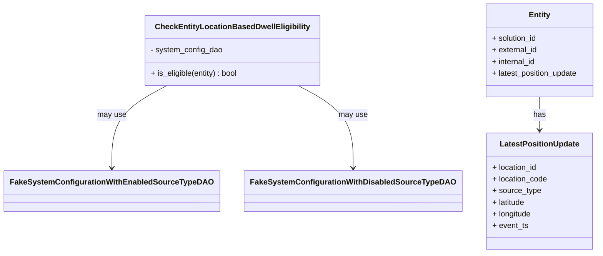
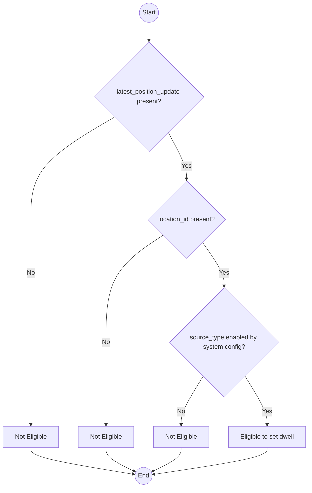

# Diagram: entity_core/entity_service/entity_service_tests/dwell/unit/location_based_dwell_tests/test_check_entity_location_based_dwell_eligibility.py

> Auto-generated by Obscura crawlers

## Diagram 1

### SVG

<svg id="container" width="1175.34375" xmlns="http://www.w3.org/2000/svg" class="classDiagram" height="522" viewBox="0 0 1175.34375 522" role="graphics-document document" aria-roledescription="class"><g><defs><marker id="container_class-aggregationStart" class="marker aggregation class" refX="18" refY="7" markerWidth="190" markerHeight="240" orient="auto"><path d="M 18,7 L9,13 L1,7 L9,1 Z"></path></marker></defs><defs><marker id="container_class-aggregationEnd" class="marker aggregation class" refX="1" refY="7" markerWidth="20" markerHeight="28" orient="auto"><path d="M 18,7 L9,13 L1,7 L9,1 Z"></path></marker></defs><defs><marker id="container_class-extensionStart" class="marker extension class" refX="18" refY="7" markerWidth="190" markerHeight="240" orient="auto"><path d="M 1,7 L18,13 V 1 Z"></path></marker></defs><defs><marker id="container_class-extensionEnd" class="marker extension class" refX="1" refY="7" markerWidth="20" markerHeight="28" orient="auto"><path d="M 1,1 V 13 L18,7 Z"></path></marker></defs><defs><marker id="container_class-compositionStart" class="marker composition class" refX="18" refY="7" markerWidth="190" markerHeight="240" orient="auto"><path d="M 18,7 L9,13 L1,7 L9,1 Z"></path></marker></defs><defs><marker id="container_class-compositionEnd" class="marker composition class" refX="1" refY="7" markerWidth="20" markerHeight="28" orient="auto"><path d="M 18,7 L9,13 L1,7 L9,1 Z"></path></marker></defs><defs><marker id="container_class-dependencyStart" class="marker dependency class" refX="6" refY="7" markerWidth="190" markerHeight="240" orient="auto"><path d="M 5,7 L9,13 L1,7 L9,1 Z"></path></marker></defs><defs><marker id="container_class-dependencyEnd" class="marker dependency class" refX="13" refY="7" markerWidth="20" markerHeight="28" orient="auto"><path d="M 18,7 L9,13 L14,7 L9,1 Z"></path></marker></defs><defs><marker id="container_class-lollipopStart" class="marker lollipop class" refX="13" refY="7" markerWidth="190" markerHeight="240" orient="auto"><circle stroke="black" fill="transparent" cx="7" cy="7" r="6"></circle></marker></defs><defs><marker id="container_class-lollipopEnd" class="marker lollipop class" refX="1" refY="7" markerWidth="190" markerHeight="240" orient="auto"><circle stroke="black" fill="transparent" cx="7" cy="7" r="6"></circle></marker></defs><g class="root"><g class="clusters"></g><g class="edgePaths"><path d="M323.668,176L305.749,186.167C287.831,196.333,251.993,216.667,234.075,245C216.156,273.333,216.156,309.667,216.156,327.833L216.156,346" id="id_CheckEntityLocationBasedDwellEligibility_FakeSystemConfigurationWithEnabledSourceTypeDAO_1" class="edge-thickness-normal edge-pattern-solid relation" style=";;;" data-edge="true" data-et="edge" data-id="id_CheckEntityLocationBasedDwellEligibility_FakeSystemConfigurationWithEnabledSourceTypeDAO_1" data-points="W3sieCI6MzIzLjY2NzY3NTA0Njk5MjUsInkiOjE3Nn0seyJ4IjoyMTYuMTU2MjUsInkiOjIzN30seyJ4IjoyMTYuMTU2MjUsInkiOjM1Mn1d" marker-end="url(#container_class-dependencyEnd)"></path><path d="M577.465,176L595.384,186.167C613.302,196.333,649.139,216.667,667.058,245C684.977,273.333,684.977,309.667,684.977,327.833L684.977,346" id="id_CheckEntityLocationBasedDwellEligibility_FakeSystemConfigurationWithDisabledSourceTypeDAO_2" class="edge-thickness-normal edge-pattern-solid relation" style=";;;" data-edge="true" data-et="edge" data-id="id_CheckEntityLocationBasedDwellEligibility_FakeSystemConfigurationWithDisabledSourceTypeDAO_2" data-points="W3sieCI6NTc3LjQ2NTEzNzQ1MzAwNzUsInkiOjE3Nn0seyJ4Ijo2ODQuOTc2NTYyNSwieSI6MjM3fSx7IngiOjY4NC45NzY1NjI1LCJ5IjozNTJ9XQ==" marker-end="url(#container_class-dependencyEnd)"></path><path d="M1054.43,200L1054.43,206.167C1054.43,212.333,1054.43,224.667,1054.43,236C1054.43,247.333,1054.43,257.667,1054.43,262.833L1054.43,268" id="id_Entity_LatestPositionUpdate_3" class="edge-thickness-normal edge-pattern-solid relation" style=";;;" data-edge="true" data-et="edge" data-id="id_Entity_LatestPositionUpdate_3" data-points="W3sieCI6MTA1NC40Mjk2ODc1LCJ5IjoyMDB9LHsieCI6MTA1NC40Mjk2ODc1LCJ5IjoyMzd9LHsieCI6MTA1NC40Mjk2ODc1LCJ5IjoyNzR9XQ==" marker-end="url(#container_class-dependencyEnd)"></path></g><g class="edgeLabels"><g class="edgeLabel" transform="translate(216.15625, 237)"><g class="label" data-id="id_CheckEntityLocationBasedDwellEligibility_FakeSystemConfigurationWithEnabledSourceTypeDAO_1" transform="translate(-29.8984375, -12)"><foreignObject width="59.796875" height="24">

may use

</foreignObject></g></g><g class="edgeLabel" transform="translate(684.9765625, 237)"><g class="label" data-id="id_CheckEntityLocationBasedDwellEligibility_FakeSystemConfigurationWithDisabledSourceTypeDAO_2" transform="translate(-29.8984375, -12)"><foreignObject width="59.796875" height="24">

may use

</foreignObject></g></g><g class="edgeLabel" transform="translate(1054.4296875, 237)"><g class="label" data-id="id_Entity_LatestPositionUpdate_3" transform="translate(-12.703125, -12)"><foreignObject width="25.40625" height="24">

has

</foreignObject></g></g></g><g class="nodes"><g class="node default" id="classId-CheckEntityLocationBasedDwellEligibility-0" transform="translate(450.56640625, 104)"><g class="basic label-container"><path d="M-179.203125 -72 L179.203125 -72 L179.203125 72 L-179.203125 72" stroke="none" stroke-width="0" fill="#ECECFF" style=""></path><path d="M-179.203125 -72 C-64.97775407479894 -72, 49.247616850402125 -72, 179.203125 -72 M-179.203125 -72 C-70.06911646698367 -72, 39.064892066032655 -72, 179.203125 -72 M179.203125 -72 C179.203125 -19.81628073191085, 179.203125 32.3674385361783, 179.203125 72 M179.203125 -72 C179.203125 -31.490753100986275, 179.203125 9.01849379802745, 179.203125 72 M179.203125 72 C73.3572526712392 72, -32.48861965752161 72, -179.203125 72 M179.203125 72 C42.116018679483034 72, -94.97108764103393 72, -179.203125 72 M-179.203125 72 C-179.203125 42.84015496503068, -179.203125 13.680309930061355, -179.203125 -72 M-179.203125 72 C-179.203125 37.49436835809349, -179.203125 2.9887367161869776, -179.203125 -72" stroke="#9370DB" stroke-width="1.3" fill="none" stroke-dasharray="0 0" style=""></path></g><g class="annotation-group text" transform="translate(0, -48)"></g><g class="label-group text" transform="translate(-151.40625, -48)"><g class="label" style="font-weight: bolder" transform="translate(0,-12)"><foreignObject width="302.8125" height="24">

CheckEntityLocationBasedDwellEligibility

</foreignObject></g></g><g class="members-group text" transform="translate(-167.203125, 0)"><g class="label" style="" transform="translate(0,-12)"><foreignObject width="148.34375" height="24">

- system_config_dao

</foreignObject></g></g><g class="methods-group text" transform="translate(-167.203125, 48)"><g class="label" style="" transform="translate(0,-12)"><foreignObject width="183" height="24">

+ is_eligible(entity) : bool

</foreignObject></g></g><g class="divider" style=""><path d="M-179.203125 -24 C-80.61094994062186 -24, 17.98122511875627 -24, 179.203125 -24 M-179.203125 -24 C-53.430408658752 -24, 72.342307682496 -24, 179.203125 -24" stroke="#9370DB" stroke-width="1.3" fill="none" stroke-dasharray="0 0" style=""></path></g><g class="divider" style=""><path d="M-179.203125 24 C-55.98661296933598 24, 67.22989906132804 24, 179.203125 24 M-179.203125 24 C-40.69657607063232 24, 97.80997285873536 24, 179.203125 24" stroke="#9370DB" stroke-width="1.3" fill="none" stroke-dasharray="0 0" style=""></path></g></g><g class="node default" id="classId-Entity-1" transform="translate(1054.4296875, 104)"><g class="basic label-container"><path d="M-112.9140625 -96 L112.9140625 -96 L112.9140625 96 L-112.9140625 96" stroke="none" stroke-width="0" fill="#ECECFF" style=""></path><path d="M-112.9140625 -96 C-54.338697602421334 -96, 4.236667295157332 -96, 112.9140625 -96 M-112.9140625 -96 C-34.036780452175066 -96, 44.84050159564987 -96, 112.9140625 -96 M112.9140625 -96 C112.9140625 -26.200829317323084, 112.9140625 43.59834136535383, 112.9140625 96 M112.9140625 -96 C112.9140625 -40.12541403435415, 112.9140625 15.749171931291698, 112.9140625 96 M112.9140625 96 C46.97851314357675 96, -18.957036212846504 96, -112.9140625 96 M112.9140625 96 C57.300668982248595 96, 1.6872754644971906 96, -112.9140625 96 M-112.9140625 96 C-112.9140625 44.15940073382177, -112.9140625 -7.681198532356461, -112.9140625 -96 M-112.9140625 96 C-112.9140625 56.33111563525161, -112.9140625 16.662231270503213, -112.9140625 -96" stroke="#9370DB" stroke-width="1.3" fill="none" stroke-dasharray="0 0" style=""></path></g><g class="annotation-group text" transform="translate(0, -72)"></g><g class="label-group text" transform="translate(-21.28125, -72)"><g class="label" style="font-weight: bolder" transform="translate(0,-12)"><foreignObject width="42.5625" height="24">

Entity

</foreignObject></g></g><g class="members-group text" transform="translate(-100.9140625, -24)"><g class="label" style="" transform="translate(0,-12)"><foreignObject width="94.453125" height="24">

+ solution_id

</foreignObject></g><g class="label" style="" transform="translate(0,12)"><foreignObject width="94.015625" height="24">

+ external_id

</foreignObject></g><g class="label" style="" transform="translate(0,36)"><foreignObject width="91.5625" height="24">

+ internal_id

</foreignObject></g><g class="label" style="" transform="translate(0,60)"><foreignObject width="180.546875" height="24">

+ latest_position_update

</foreignObject></g></g><g class="methods-group text" transform="translate(-100.9140625, 96)"></g><g class="divider" style=""><path d="M-112.9140625 -48 C-23.864865047157565 -48, 65.18433240568487 -48, 112.9140625 -48 M-112.9140625 -48 C-66.0808169745981 -48, -19.2475714491962 -48, 112.9140625 -48" stroke="#9370DB" stroke-width="1.3" fill="none" stroke-dasharray="0 0" style=""></path></g><g class="divider" style=""><path d="M-112.9140625 72 C-49.20513975284085 72, 14.5037829943183 72, 112.9140625 72 M-112.9140625 72 C-65.79542711103583 72, -18.67679172207167 72, 112.9140625 72" stroke="#9370DB" stroke-width="1.3" fill="none" stroke-dasharray="0 0" style=""></path></g></g><g class="node default" id="classId-LatestPositionUpdate-2" transform="translate(1054.4296875, 394)"><g class="basic label-container"><path d="M-108.7890625 -120 L108.7890625 -120 L108.7890625 120 L-108.7890625 120" stroke="none" stroke-width="0" fill="#ECECFF" style=""></path><path d="M-108.7890625 -120 C-22.19484502001211 -120, 64.39937245997578 -120, 108.7890625 -120 M-108.7890625 -120 C-64.24227832313966 -120, -19.695494146279316 -120, 108.7890625 -120 M108.7890625 -120 C108.7890625 -25.23447424927288, 108.7890625 69.53105150145424, 108.7890625 120 M108.7890625 -120 C108.7890625 -39.39964302116711, 108.7890625 41.20071395766578, 108.7890625 120 M108.7890625 120 C61.36806792091132 120, 13.947073341822644 120, -108.7890625 120 M108.7890625 120 C63.879760324384144 120, 18.970458148768287 120, -108.7890625 120 M-108.7890625 120 C-108.7890625 33.09859277903351, -108.7890625 -53.80281444193298, -108.7890625 -120 M-108.7890625 120 C-108.7890625 25.709002331173522, -108.7890625 -68.58199533765296, -108.7890625 -120" stroke="#9370DB" stroke-width="1.3" fill="none" stroke-dasharray="0 0" style=""></path></g><g class="annotation-group text" transform="translate(0, -96)"></g><g class="label-group text" transform="translate(-79.234375, -96)"><g class="label" style="font-weight: bolder" transform="translate(0,-12)"><foreignObject width="158.46875" height="24">

LatestPositionUpdate

</foreignObject></g></g><g class="members-group text" transform="translate(-96.7890625, -48)"><g class="label" style="" transform="translate(0,-12)"><foreignObject width="93.78125" height="24">

+ location_id

</foreignObject></g><g class="label" style="" transform="translate(0,12)"><foreignObject width="114.34375" height="24">

+ location_code

</foreignObject></g><g class="label" style="" transform="translate(0,36)"><foreignObject width="99.578125" height="24">

+ source_type

</foreignObject></g><g class="label" style="" transform="translate(0,60)"><foreignObject width="69.203125" height="24">

+ latitude

</foreignObject></g><g class="label" style="" transform="translate(0,84)"><foreignObject width="81.765625" height="24">

+ longitude

</foreignObject></g><g class="label" style="" transform="translate(0,108)"><foreignObject width="73.8125" height="24">

+ event_ts

</foreignObject></g></g><g class="methods-group text" transform="translate(-96.7890625, 120)"></g><g class="divider" style=""><path d="M-108.7890625 -72 C-52.07915706620834 -72, 4.6307483675833225 -72, 108.7890625 -72 M-108.7890625 -72 C-25.350972538821466 -72, 58.08711742235707 -72, 108.7890625 -72" stroke="#9370DB" stroke-width="1.3" fill="none" stroke-dasharray="0 0" style=""></path></g><g class="divider" style=""><path d="M-108.7890625 96 C-39.5590904344691 96, 29.670881631061803 96, 108.7890625 96 M-108.7890625 96 C-47.47818976075889 96, 13.832682978482225 96, 108.7890625 96" stroke="#9370DB" stroke-width="1.3" fill="none" stroke-dasharray="0 0" style=""></path></g></g><g class="node default" id="classId-FakeSystemConfigurationWithEnabledSourceTypeDAO-3" transform="translate(216.15625, 394)"><g class="basic label-container"><path d="M-208.15625 -42 L208.15625 -42 L208.15625 42 L-208.15625 42" stroke="none" stroke-width="0" fill="#ECECFF" style=""></path><path d="M-208.15625 -42 C-90.35788652890305 -42, 27.440476942193897 -42, 208.15625 -42 M-208.15625 -42 C-108.352012541744 -42, -8.547775083488006 -42, 208.15625 -42 M208.15625 -42 C208.15625 -13.315372575556736, 208.15625 15.369254848886527, 208.15625 42 M208.15625 -42 C208.15625 -12.132292452014074, 208.15625 17.735415095971852, 208.15625 42 M208.15625 42 C70.93709449478686 42, -66.28206101042628 42, -208.15625 42 M208.15625 42 C45.846587272877116 42, -116.46307545424577 42, -208.15625 42 M-208.15625 42 C-208.15625 11.672405542123876, -208.15625 -18.655188915752248, -208.15625 -42 M-208.15625 42 C-208.15625 15.366307206794232, -208.15625 -11.267385586411535, -208.15625 -42" stroke="#9370DB" stroke-width="1.3" fill="none" stroke-dasharray="0 0" style=""></path></g><g class="annotation-group text" transform="translate(0, -18)"></g><g class="label-group text" transform="translate(-196.15625, -18)"><g class="label" style="font-weight: bolder" transform="translate(0,-12)"><foreignObject width="392.3125" height="24">

FakeSystemConfigurationWithEnabledSourceTypeDAO

</foreignObject></g></g><g class="members-group text" transform="translate(-196.15625, 30)"></g><g class="methods-group text" transform="translate(-196.15625, 60)"></g><g class="divider" style=""><path d="M-208.15625 6 C-94.45922092086587 6, 19.23780815826825 6, 208.15625 6 M-208.15625 6 C-97.478848454925 6, 13.19855309015 6, 208.15625 6" stroke="#9370DB" stroke-width="1.3" fill="none" stroke-dasharray="0 0" style=""></path></g><g class="divider" style=""><path d="M-208.15625 24 C-52.87949054122515 24, 102.3972689175497 24, 208.15625 24 M-208.15625 24 C-44.378750071144765 24, 119.39874985771047 24, 208.15625 24" stroke="#9370DB" stroke-width="1.3" fill="none" stroke-dasharray="0 0" style=""></path></g></g><g class="node default" id="classId-FakeSystemConfigurationWithDisabledSourceTypeDAO-4" transform="translate(684.9765625, 394)"><g class="basic label-container"><path d="M-210.6640625 -42 L210.6640625 -42 L210.6640625 42 L-210.6640625 42" stroke="none" stroke-width="0" fill="#ECECFF" style=""></path><path d="M-210.6640625 -42 C-56.72560534574009 -42, 97.21285180851982 -42, 210.6640625 -42 M-210.6640625 -42 C-49.0229450242106 -42, 112.6181724515788 -42, 210.6640625 -42 M210.6640625 -42 C210.6640625 -9.46177325218855, 210.6640625 23.0764534956229, 210.6640625 42 M210.6640625 -42 C210.6640625 -15.856476636226049, 210.6640625 10.287046727547903, 210.6640625 42 M210.6640625 42 C108.20228022063134 42, 5.740497941262674 42, -210.6640625 42 M210.6640625 42 C45.90706351539356 42, -118.84993546921288 42, -210.6640625 42 M-210.6640625 42 C-210.6640625 10.003220291263478, -210.6640625 -21.993559417473044, -210.6640625 -42 M-210.6640625 42 C-210.6640625 22.945108209052762, -210.6640625 3.890216418105524, -210.6640625 -42" stroke="#9370DB" stroke-width="1.3" fill="none" stroke-dasharray="0 0" style=""></path></g><g class="annotation-group text" transform="translate(0, -18)"></g><g class="label-group text" transform="translate(-198.6640625, -18)"><g class="label" style="font-weight: bolder" transform="translate(0,-12)"><foreignObject width="397.328125" height="24">

FakeSystemConfigurationWithDisabledSourceTypeDAO

</foreignObject></g></g><g class="members-group text" transform="translate(-198.6640625, 30)"></g><g class="methods-group text" transform="translate(-198.6640625, 60)"></g><g class="divider" style=""><path d="M-210.6640625 6 C-52.45307864620648 6, 105.75790520758704 6, 210.6640625 6 M-210.6640625 6 C-79.41655352493694 6, 51.83095545012611 6, 210.6640625 6" stroke="#9370DB" stroke-width="1.3" fill="none" stroke-dasharray="0 0" style=""></path></g><g class="divider" style=""><path d="M-210.6640625 24 C-43.650199815964214 24, 123.36366286807157 24, 210.6640625 24 M-210.6640625 24 C-109.6104556906396 24, -8.556848881279194 24, 210.6640625 24" stroke="#9370DB" stroke-width="1.3" fill="none" stroke-dasharray="0 0" style=""></path></g></g></g></g></g></svg>

## Diagram 2

### SVG

<svg id="container" width="798.859375" xmlns="http://www.w3.org/2000/svg" class="flowchart" height="1242.328125" viewBox="0 0 798.859375 1242.328125" role="graphics-document document" aria-roledescription="flowchart-v2"><g><marker id="container_flowchart-v2-pointEnd" class="marker flowchart-v2" viewBox="0 0 10 10" refX="5" refY="5" markerUnits="userSpaceOnUse" markerWidth="8" markerHeight="8" orient="auto"><path d="M 0 0 L 10 5 L 0 10 z" class="arrowMarkerPath" style="stroke-width: 1; stroke-dasharray: 1, 0;"></path></marker><marker id="container_flowchart-v2-pointStart" class="marker flowchart-v2" viewBox="0 0 10 10" refX="4.5" refY="5" markerUnits="userSpaceOnUse" markerWidth="8" markerHeight="8" orient="auto"><path d="M 0 5 L 10 10 L 10 0 z" class="arrowMarkerPath" style="stroke-width: 1; stroke-dasharray: 1, 0;"></path></marker><marker id="container_flowchart-v2-circleEnd" class="marker flowchart-v2" viewBox="0 0 10 10" refX="11" refY="5" markerUnits="userSpaceOnUse" markerWidth="11" markerHeight="11" orient="auto"><circle cx="5" cy="5" r="5" class="arrowMarkerPath" style="stroke-width: 1; stroke-dasharray: 1, 0;"></circle></marker><marker id="container_flowchart-v2-circleStart" class="marker flowchart-v2" viewBox="0 0 10 10" refX="-1" refY="5" markerUnits="userSpaceOnUse" markerWidth="11" markerHeight="11" orient="auto"><circle cx="5" cy="5" r="5" class="arrowMarkerPath" style="stroke-width: 1; stroke-dasharray: 1, 0;"></circle></marker><marker id="container_flowchart-v2-crossEnd" class="marker cross flowchart-v2" viewBox="0 0 11 11" refX="12" refY="5.2" markerUnits="userSpaceOnUse" markerWidth="11" markerHeight="11" orient="auto"><path d="M 1,1 l 9,9 M 10,1 l -9,9" class="arrowMarkerPath" style="stroke-width: 2; stroke-dasharray: 1, 0;"></path></marker><marker id="container_flowchart-v2-crossStart" class="marker cross flowchart-v2" viewBox="0 0 11 11" refX="-1" refY="5.2" markerUnits="userSpaceOnUse" markerWidth="11" markerHeight="11" orient="auto"><path d="M 1,1 l 9,9 M 10,1 l -9,9" class="arrowMarkerPath" style="stroke-width: 2; stroke-dasharray: 1, 0;"></path></marker><g class="root"><g class="clusters"></g><g class="edgePaths"><path d="M384.824,58.047L384.824,62.214C384.824,66.38,384.824,74.714,384.824,82.38C384.824,90.047,384.824,97.047,384.824,100.547L384.824,104.047" id="L_Start_A_0" class="edge-thickness-normal edge-pattern-solid edge-thickness-normal edge-pattern-solid flowchart-link" style=";" data-edge="true" data-et="edge" data-id="L_Start_A_0" data-points="W3sieCI6Mzg0LjgyNDIxODc1LCJ5Ijo1OC4wNDY4NzV9LHsieCI6Mzg0LjgyNDIxODc1LCJ5Ijo4My4wNDY4NzV9LHsieCI6Mzg0LjgyNDIxODc1LCJ5IjoxMDguMDQ2ODc1fV0=" marker-end="url(#container_flowchart-v2-pointEnd)"></path><path d="M296.683,297.906L260.536,318.762C224.39,339.619,152.097,381.333,115.951,425.183C79.805,469.034,79.805,515.021,79.805,561.008C79.805,606.995,79.805,652.982,79.805,705.309C79.805,757.635,79.805,816.302,79.805,874.969C79.805,933.635,79.805,992.302,79.805,1027.135C79.805,1061.969,79.805,1072.969,79.805,1078.469L79.805,1083.969" id="L_A_NotEligible1_0" class="edge-thickness-normal edge-pattern-solid edge-thickness-normal edge-pattern-solid flowchart-link" style=";" data-edge="true" data-et="edge" data-id="L_A_NotEligible1_0" data-points="W3sieCI6Mjk2LjY4Mjg2MDQ2OTY1NDcsInkiOjI5Ny45MDU1MTY3MTk2NTQ3fSx7IngiOjc5LjgwNDY4NzUsInkiOjQyMy4wNDY4NzV9LHsieCI6NzkuODA0Njg3NSwieSI6NTYxLjAwNzgxMjV9LHsieCI6NzkuODA0Njg3NSwieSI6Njk4Ljk2ODc1fSx7IngiOjc5LjgwNDY4NzUsInkiOjg3NC45Njg3NX0seyJ4Ijo3OS44MDQ2ODc1LCJ5IjoxMDUwLjk2ODc1fSx7IngiOjc5LjgwNDY4NzUsInkiOjEwODcuOTY4NzV9XQ==" marker-end="url(#container_flowchart-v2-pointEnd)"></path><path d="M434.148,336.723L442.062,351.11C449.975,365.497,465.802,394.272,473.715,414.16C481.629,434.047,481.629,445.047,481.629,450.547L481.629,456.047" id="L_A_B_0" class="edge-thickness-normal edge-pattern-solid edge-thickness-normal edge-pattern-solid flowchart-link" style=";" data-edge="true" data-et="edge" data-id="L_A_B_0" data-points="W3sieCI6NDM0LjE0ODM0MDI4ODQxNzUsInkiOjMzNi43MjI3NTM0NjE1ODI1fSx7IngiOjQ4MS42Mjg5MDYyNSwieSI6NDIzLjA0Njg3NX0seyJ4Ijo0ODEuNjI4OTA2MjUsInkiOjQ2MC4wNDY4NzV9XQ==" marker-end="url(#container_flowchart-v2-pointEnd)"></path><path d="M420.904,601.244L396.322,617.531C371.741,633.819,322.577,666.394,297.996,712.015C273.414,757.635,273.414,816.302,273.414,874.969C273.414,933.635,273.414,992.302,273.414,1027.135C273.414,1061.969,273.414,1072.969,273.414,1078.469L273.414,1083.969" id="L_B_NotEligible2_0" class="edge-thickness-normal edge-pattern-solid edge-thickness-normal edge-pattern-solid flowchart-link" style=";" data-edge="true" data-et="edge" data-id="L_B_NotEligible2_0" data-points="W3sieCI6NDIwLjkwMzc4NjMzOTc5MjUsInkiOjYwMS4yNDM2MzAwODk3OTI1fSx7IngiOjI3My40MTQwNjI1LCJ5Ijo2OTguOTY4NzV9LHsieCI6MjczLjQxNDA2MjUsInkiOjg3NC45Njg3NX0seyJ4IjoyNzMuNDE0MDYyNSwieSI6MTA1MC45Njg3NX0seyJ4IjoyNzMuNDE0MDYyNSwieSI6MTA4Ny45Njg3NX1d" marker-end="url(#container_flowchart-v2-pointEnd)"></path><path d="M523.26,620.338L532.455,633.443C541.651,646.548,560.042,672.758,569.238,691.364C578.434,709.969,578.434,720.969,578.434,726.469L578.434,731.969" id="L_B_C_0" class="edge-thickness-normal edge-pattern-solid edge-thickness-normal edge-pattern-solid flowchart-link" style=";" data-edge="true" data-et="edge" data-id="L_B_C_0" data-points="W3sieCI6NTIzLjI1OTc1NDA1NTc0MDUsInkiOjYyMC4zMzc5MDIxOTQyNTk1fSx7IngiOjU3OC40MzM1OTM3NSwieSI6Njk4Ljk2ODc1fSx7IngiOjU3OC40MzM1OTM3NSwieSI6NzM1Ljk2ODc1fV0=" marker-end="url(#container_flowchart-v2-pointEnd)"></path><path d="M524.552,960.088L514.964,975.234C505.376,990.381,486.2,1020.675,476.612,1041.322C467.023,1061.969,467.023,1072.969,467.023,1078.469L467.023,1083.969" id="L_C_NotEligible3_0" class="edge-thickness-normal edge-pattern-solid edge-thickness-normal edge-pattern-solid flowchart-link" style=";" data-edge="true" data-et="edge" data-id="L_C_NotEligible3_0" data-points="W3sieCI6NTI0LjU1MjM2NzI3OTc3MTUsInkiOjk2MC4wODc1MjM1Mjk3NzE1fSx7IngiOjQ2Ny4wMjM0Mzc1LCJ5IjoxMDUwLjk2ODc1fSx7IngiOjQ2Ny4wMjM0Mzc1LCJ5IjoxMDg3Ljk2ODc1fV0=" marker-end="url(#container_flowchart-v2-pointEnd)"></path><path d="M632.315,960.088L641.903,975.234C651.491,990.381,670.667,1020.675,680.256,1041.322C689.844,1061.969,689.844,1072.969,689.844,1078.469L689.844,1083.969" id="L_C_Eligible_0" class="edge-thickness-normal edge-pattern-solid edge-thickness-normal edge-pattern-solid flowchart-link" style=";" data-edge="true" data-et="edge" data-id="L_C_Eligible_0" data-points="W3sieCI6NjMyLjMxNDgyMDIyMDIyODUsInkiOjk2MC4wODc1MjM1Mjk3NzE1fSx7IngiOjY4OS44NDM3NSwieSI6MTA1MC45Njg3NX0seyJ4Ijo2ODkuODQzNzUsInkiOjEwODcuOTY4NzV9XQ==" marker-end="url(#container_flowchart-v2-pointEnd)"></path><path d="M79.805,1141.969L79.805,1146.135C79.805,1150.302,79.805,1158.635,124.062,1169.84C168.32,1181.044,256.836,1195.119,301.094,1202.157L345.351,1209.194" id="L_NotEligible1_End_0" class="edge-thickness-normal edge-pattern-solid edge-thickness-normal edge-pattern-solid flowchart-link" style=";" data-edge="true" data-et="edge" data-id="L_NotEligible1_End_0" data-points="W3sieCI6NzkuODA0Njg3NSwieSI6MTE0MS45Njg3NX0seyJ4Ijo3OS44MDQ2ODc1LCJ5IjoxMTY2Ljk2ODc1fSx7IngiOjM0OS4zMDE4NTU3ODQ2NzMyLCJ5IjoxMjA5LjgyMjM3MzkxMzM0MzJ9XQ==" marker-end="url(#container_flowchart-v2-pointEnd)"></path><path d="M273.414,1141.969L273.414,1146.135C273.414,1150.302,273.414,1158.635,285.76,1168.692C298.107,1178.748,322.8,1190.528,335.146,1196.417L347.493,1202.307" id="L_NotEligible2_End_0" class="edge-thickness-normal edge-pattern-solid edge-thickness-normal edge-pattern-solid flowchart-link" style=";" data-edge="true" data-et="edge" data-id="L_NotEligible2_End_0" data-points="W3sieCI6MjczLjQxNDA2MjUsInkiOjExNDEuOTY4NzV9LHsieCI6MjczLjQxNDA2MjUsInkiOjExNjYuOTY4NzV9LHsieCI6MzUxLjEwMjc1MzAzOTUwODgsInkiOjEyMDQuMDI5MzQ2MzgyNzgwN31d" marker-end="url(#container_flowchart-v2-pointEnd)"></path><path d="M467.023,1141.969L467.023,1146.135C467.023,1150.302,467.023,1158.635,454.677,1168.692C442.331,1178.748,417.638,1190.528,405.291,1196.417L392.945,1202.307" id="L_NotEligible3_End_0" class="edge-thickness-normal edge-pattern-solid edge-thickness-normal edge-pattern-solid flowchart-link" style=";" data-edge="true" data-et="edge" data-id="L_NotEligible3_End_0" data-points="W3sieCI6NDY3LjAyMzQzNzUsInkiOjExNDEuOTY4NzV9LHsieCI6NDY3LjAyMzQzNzUsInkiOjExNjYuOTY4NzV9LHsieCI6Mzg5LjMzNDc0Njk2MDQ5MTIsInkiOjEyMDQuMDI5MzQ2MzgyNzgwN31d" marker-end="url(#container_flowchart-v2-pointEnd)"></path><path d="M689.844,1141.969L689.844,1146.135C689.844,1150.302,689.844,1158.635,640.726,1169.899C591.609,1181.162,493.374,1195.355,444.257,1202.451L395.14,1209.548" id="L_Eligible_End_0" class="edge-thickness-normal edge-pattern-solid edge-thickness-normal edge-pattern-solid flowchart-link" style=";" data-edge="true" data-et="edge" data-id="L_Eligible_End_0" data-points="W3sieCI6Njg5Ljg0Mzc1LCJ5IjoxMTQxLjk2ODc1fSx7IngiOjY4OS44NDM3NSwieSI6MTE2Ni45Njg3NX0seyJ4IjozOTEuMTgwNzc5MzU1Njc3NCwieSI6MTIxMC4xMTk4MjU5NTUxODY2fV0=" marker-end="url(#container_flowchart-v2-pointEnd)"></path></g><g class="edgeLabels"><g class="edgeLabel"><g class="label" data-id="L_Start_A_0" transform="translate(0, 0)"><foreignObject width="0" height="0">

</foreignObject></g></g><g class="edgeLabel" transform="translate(79.8046875, 698.96875)"><g class="label" data-id="L_A_NotEligible1_0" transform="translate(-10.140625, -12)"><foreignObject width="20.28125" height="24">

No

</foreignObject></g></g><g class="edgeLabel" transform="translate(481.62890625, 423.046875)"><g class="label" data-id="L_A_B_0" transform="translate(-12.03125, -12)"><foreignObject width="24.0625" height="24">

Yes

</foreignObject></g></g><g class="edgeLabel" transform="translate(273.4140625, 874.96875)"><g class="label" data-id="L_B_NotEligible2_0" transform="translate(-10.140625, -12)"><foreignObject width="20.28125" height="24">

No

</foreignObject></g></g><g class="edgeLabel" transform="translate(578.43359375, 698.96875)"><g class="label" data-id="L_B_C_0" transform="translate(-12.03125, -12)"><foreignObject width="24.0625" height="24">

Yes

</foreignObject></g></g><g class="edgeLabel" transform="translate(467.0234375, 1050.96875)"><g class="label" data-id="L_C_NotEligible3_0" transform="translate(-10.140625, -12)"><foreignObject width="20.28125" height="24">

No

</foreignObject></g></g><g class="edgeLabel" transform="translate(689.84375, 1050.96875)"><g class="label" data-id="L_C_Eligible_0" transform="translate(-12.03125, -12)"><foreignObject width="24.0625" height="24">

Yes

</foreignObject></g></g><g class="edgeLabel"><g class="label" data-id="L_NotEligible1_End_0" transform="translate(0, 0)"><foreignObject width="0" height="0">

</foreignObject></g></g><g class="edgeLabel"><g class="label" data-id="L_NotEligible2_End_0" transform="translate(0, 0)"><foreignObject width="0" height="0">

</foreignObject></g></g><g class="edgeLabel"><g class="label" data-id="L_NotEligible3_End_0" transform="translate(0, 0)"><foreignObject width="0" height="0">

</foreignObject></g></g><g class="edgeLabel"><g class="label" data-id="L_Eligible_End_0" transform="translate(0, 0)"><foreignObject width="0" height="0">

</foreignObject></g></g></g><g class="nodes"><g class="node default" id="flowchart-Start-0" transform="translate(384.82421875, 33.0234375)"><circle class="basic label-container" style="" r="25.0234375" cx="0" cy="0"></circle><g class="label" style="" transform="translate(-17.5234375, -12)"><rect></rect><foreignObject width="35.046875" height="24">

Start

</foreignObject></g></g><g class="node default" id="flowchart-A-1" transform="translate(384.82421875, 247.046875)"><polygon points="139,0 278,-139 139,-278 0,-139" class="label-container" transform="translate(-138.5, 139)"></polygon><g class="label" style="" transform="translate(-100, -24)"><rect></rect><foreignObject width="200" height="48">

latest_position_update present?

</foreignObject></g></g><g class="node default" id="flowchart-NotEligible1-3" transform="translate(79.8046875, 1114.96875)"><rect class="basic label-container" style="" x="-71.8046875" y="-27" width="143.609375" height="54"></rect><g class="label" style="" transform="translate(-41.8046875, -12)"><rect></rect><foreignObject width="83.609375" height="24">

Not Eligible

</foreignObject></g></g><g class="node default" id="flowchart-B-5" transform="translate(481.62890625, 561.0078125)"><polygon points="100.9609375,0 201.921875,-100.9609375 100.9609375,-201.921875 0,-100.9609375" class="label-container" transform="translate(-100.4609375, 100.9609375)"></polygon><g class="label" style="" transform="translate(-73.9609375, -12)"><rect></rect><foreignObject width="147.921875" height="24">

location_id present?

</foreignObject></g></g><g class="node default" id="flowchart-NotEligible2-7" transform="translate(273.4140625, 1114.96875)"><rect class="basic label-container" style="" x="-71.8046875" y="-27" width="143.609375" height="54"></rect><g class="label" style="" transform="translate(-41.8046875, -12)"><rect></rect><foreignObject width="83.609375" height="24">

Not Eligible

</foreignObject></g></g><g class="node default" id="flowchart-C-9" transform="translate(578.43359375, 874.96875)"><polygon points="139,0 278,-139 139,-278 0,-139" class="label-container" transform="translate(-138.5, 139)"></polygon><g class="label" style="" transform="translate(-100, -24)"><rect></rect><foreignObject width="200" height="48">

source_type enabled by system config?

</foreignObject></g></g><g class="node default" id="flowchart-NotEligible3-11" transform="translate(467.0234375, 1114.96875)"><rect class="basic label-container" style="" x="-71.8046875" y="-27" width="143.609375" height="54"></rect><g class="label" style="" transform="translate(-41.8046875, -12)"><rect></rect><foreignObject width="83.609375" height="24">

Not Eligible

</foreignObject></g></g><g class="node default" id="flowchart-Eligible-13" transform="translate(689.84375, 1114.96875)"><rect class="basic label-container" style="" x="-101.015625" y="-27" width="202.03125" height="54"></rect><g class="label" style="" transform="translate(-71.015625, -12)"><rect></rect><foreignObject width="142.03125" height="24">

Eligible to set dwell

</foreignObject></g></g><g class="node default" id="flowchart-End-15" transform="translate(370.21875, 1213.1484375)"><circle class="basic label-container" style="" r="21.1796875" cx="0" cy="0"></circle><g class="label" style="" transform="translate(-13.6796875, -12)"><rect></rect><foreignObject width="27.359375" height="24">

End

</foreignObject></g></g></g></g></g></svg>
